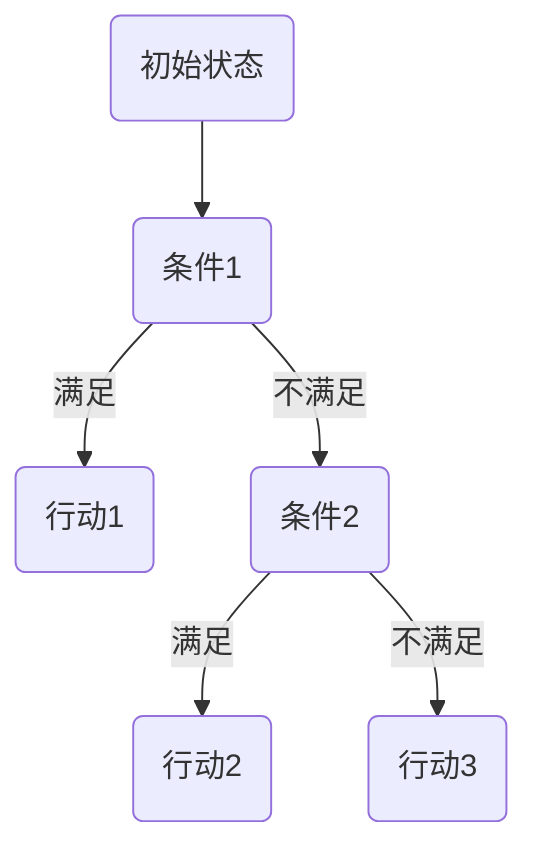
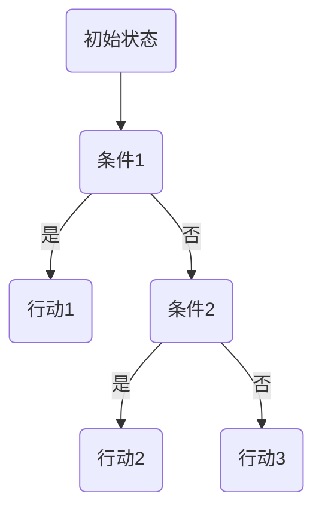

                 

### 文章标题

**《网易2025游戏角色行为AI工程师社招面试题解》**

关键词：游戏角色行为AI、网易、面试题、社招、AI工程师、技术解析、实战案例

摘要：本文将深入解析网易2025游戏角色行为AI工程师社招面试中可能遇到的题目，涵盖游戏角色行为AI的基础理论、建模、决策、仿真以及网易游戏角色行为AI的实践案例。通过逐步分析和解答面试题目，帮助读者深入了解游戏角色行为AI的核心概念和技术实现，为准备面试的AI工程师提供宝贵的指导。

### 文章概述

随着人工智能技术的不断发展，游戏角色行为AI已成为游戏开发中不可或缺的一部分。它不仅提升了游戏的趣味性和挑战性，还为玩家提供了更加真实和丰富的互动体验。网易作为中国游戏行业的领军企业，其对游戏角色行为AI的研究和实践具有很高的参考价值。本文旨在通过分析网易2025游戏角色行为AI工程师社招面试中的题目，为广大AI工程师提供一个全面的技术解析和实践指导。

本文分为三个主要部分：

1. **游戏角色行为AI基础理论**：介绍游戏角色行为AI的起源、核心概念以及分类，包括行为树、状态机、角色行为倾向建模等内容。
2. **网易游戏角色行为AI案例分析**：分析网易游戏角色行为AI的架构设计、应用案例以及开发流程，探讨性能调优策略和未来发展趋势。
3. **面试题解**：针对游戏角色行为AI的基础概念、行为决策与规划、行为仿真等方面，详细解析常见面试题的答案，帮助读者应对面试挑战。

通过本文的阅读，读者将能够：
- 理解游戏角色行为AI的基本概念和原理。
- 掌握游戏角色行为建模的方法和技巧。
- 了解网易游戏角色行为AI的架构设计和实现细节。
- 学会分析并解决游戏角色行为AI的面试题目。

### 目录结构

为了帮助读者更好地理解和掌握本文的内容，以下是文章的目录结构：

## 第一部分：游戏角色行为AI基础理论

### 第1章：游戏角色行为AI概述
- 1.1 游戏角色行为AI的起源与发展
- 1.2 游戏角色行为AI的核心概念
- 1.3 游戏角色行为AI的分类

### 第2章：游戏角色行为建模
- 2.1 行为树与状态机
  - 2.1.1 行为树的构建
  - 2.1.2 状态机的实现
- 2.2 角色行为倾向建模
  - 2.2.1 行为倾向的概念
  - 2.2.2 行为倾向的计算方法

### 第3章：游戏角色决策与规划
- 3.1 决策论基础
  - 3.1.1 决策问题的定义
  - 3.1.2 决策策略分析
- 3.2 角色路径规划
  - 3.2.1 路径规划算法
  - 3.2.2 角色动态路径规划

### 第4章：游戏角色行为仿真
- 4.1 游戏角色行为仿真的实现
  - 4.1.1 仿真环境搭建
  - 4.1.2 仿真框架设计
- 4.2 行为仿真案例分析
  - 4.2.1 案例一：逃出生天
  - 4.2.2 案例二：大战外星人

## 第二部分：网易游戏角色行为AI案例分析

### 第5章：网易游戏角色行为AI实践
- 5.1 网易游戏角色行为AI的架构设计
  - 5.1.1 架构设计原则
  - 5.1.2 架构实现细节
- 5.2 网易游戏角色行为AI的应用案例
  - 5.2.1 案例一：梦幻西游
  - 5.2.2 案例二：阴阳师

### 第6章：网易游戏角色行为AI工程实践
- 6.1 游戏角色行为AI开发流程
  - 6.1.1 需求分析与设计
  - 6.1.2 算法实现与优化
- 6.2 游戏角色行为AI的性能调优
  - 6.2.1 性能瓶颈分析
  - 6.2.2 性能优化策略

### 第7章：网易游戏角色行为AI展望
- 7.1 未来游戏角色行为AI的发展趋势
  - 7.1.1 技术革新
  - 7.1.2 应用前景
- 7.2 网易游戏角色行为AI的未来规划
  - 7.2.1 产品规划
  - 7.2.2 技术储备

## 第三部分：面试题解

### 第8章：游戏角色行为AI面试题解析
- 8.1 行为AI基础概念题解析
  - 8.1.1 行为树如何构建？
  - 8.1.2 状态机在游戏AI中有哪些应用？
- 8.2 行为决策与规划题解析
  - 8.2.1 决策问题如何建模？
  - 8.2.2 路径规划算法有哪些？
- 8.3 行为仿真与案例分析题解析
  - 8.3.1 游戏角色行为仿真的关键要素是什么？
  - 8.3.2 如何评估游戏角色行为仿真效果？

## 附录

### 附录A：网易游戏角色行为AI开发工具与环境配置
- 10.1 Python开发环境搭建
- 10.2 Pygame游戏开发框架
- 10.3 Unity游戏引擎应用

### 附录B：常见面试题答案汇总
- 11.1 行为树构建实例
- 11.2 状态机实现实例
- 11.3 决策问题建模实例

通过以上目录结构，本文将逐步深入剖析游戏角色行为AI的核心技术，帮助读者全面掌握这一领域的关键知识和实战技巧。接下来，我们将首先探讨游戏角色行为AI的起源与发展，为后续内容打下坚实的基础。让我们一起开始这场技术之旅吧！
### 第1章：游戏角色行为AI概述

#### 1.1 游戏角色行为AI的起源与发展

游戏角色行为AI（Artificial Intelligence）是指通过计算机技术模拟和实现人类角色在游戏中的行为和决策能力。它的起源可以追溯到20世纪50年代，当时人工智能作为一门新兴学科开始崭露头角。随着计算机硬件性能的提升和算法的不断进步，游戏角色行为AI逐渐成为游戏开发中的重要组成部分。

游戏角色行为AI的发展可以分为以下几个阶段：

1. **早期阶段（1950-1980年代）**：在这个阶段，人工智能主要集中在逻辑推理和规则系统上。代表性的工作是John Hopcroft和Edward Feigenbaum等人开发的“专家系统”，它们可以模拟医生的诊断过程。虽然这些系统在特定领域表现出色，但它们在面对复杂和动态环境时显得力不从心。

2. **中等阶段（1980-2000年代）**：随着计算机性能的提升和算法的优化，游戏角色行为AI开始引入更多复杂的行为模式。这个阶段的代表性工作包括基于决策树和行为树的方法。这些方法通过预先定义的规则和状态，使游戏角色能够进行简单的决策和行动。

3. **发展阶段（2000年代至今）**：随着深度学习、强化学习等技术的崛起，游戏角色行为AI进入了一个全新的阶段。这些算法可以自动从大量数据中学习游戏角色的行为模式，从而实现更加智能和自适应的行为。尤其是在大规模多人在线游戏（MMO）中，游戏角色行为AI的应用大大提升了游戏的互动性和可玩性。

#### 1.2 游戏角色行为AI的核心概念

游戏角色行为AI的核心概念主要包括行为树、状态机、角色行为倾向等。以下是这些核心概念的详细解释：

1. **行为树**：行为树是一种树形结构，用于表示游戏角色的行为和决策过程。每个节点代表一个行为或决策，而节点之间的连线表示决策的分支。行为树的核心思想是将游戏角色的行为分解成一系列简单的决策和行动，从而实现复杂的决策逻辑。

   行为树的构建通常包括以下几个步骤：
   - 定义初始状态和行为集合。
   - 构建决策节点，每个决策节点包含条件判断和后续行为。
   - 连接各个决策节点，形成完整的决策树。

2. **状态机**：状态机是一种用于表示游戏角色状态变化和响应的数学模型。它通过定义一系列状态和状态之间的转换规则，来描述游戏角色在不同状态下的行为。状态机通常包括以下组成部分：
   - 状态：表示游戏角色的当前状态，如空闲、战斗、逃跑等。
   - 转换条件：表示触发状态转换的条件，如玩家接近、玩家攻击等。
   - 转换动作：表示在状态转换时执行的动作，如开始攻击、开始逃跑等。

3. **角色行为倾向**：角色行为倾向是指游戏角色在特定情境下倾向于采取的行为。它通常通过概率分布或阈值来表示。角色行为倾向的建模可以帮助游戏开发者更好地控制游戏角色的行为，使其更加自然和有趣。

   角色行为倾向的计算方法通常包括：
   - 基于规则的方法：通过预设的规则来计算角色行为倾向，如行为树和状态机。
   - 基于学习的方法：通过机器学习算法从数据中学习角色行为倾向，如深度学习、强化学习等。

#### 1.3 游戏角色行为AI的分类

游戏角色行为AI可以根据不同的分类标准进行划分，以下是一些常见的分类方式：

1. **根据行为复杂性**：可以分为简单行为AI、中等复杂度行为AI和高度复杂度行为AI。简单行为AI通常只涉及基本的动作和决策，如走直线、躲避敌人等。中等复杂度行为AI可以处理更复杂的决策和行动，如战斗策略、团队协作等。高度复杂度行为AI则能够模拟人类角色的高度复杂行为，如情感表达、自然语言处理等。

2. **根据学习方式**：可以分为基于规则的AI、基于模型的AI和基于数据的AI。基于规则的AI通过预设的规则和逻辑来指导游戏角色的行为。基于模型的AI通过构建数学模型和算法来模拟游戏角色的行为，如行为树和状态机。基于数据的AI通过从大量数据中学习游戏角色的行为模式，如深度学习和强化学习。

3. **根据应用场景**：可以分为单机游戏AI、多人在线游戏AI和虚拟现实游戏AI。单机游戏AI主要应用于单机游戏，如独立游戏、角色扮演游戏等。多人在线游戏AI主要应用于大型多人在线游戏（MMO），如《魔兽世界》、《梦幻西游》等。虚拟现实游戏AI主要应用于虚拟现实（VR）游戏，如《Beat Saber》、《VRChat》等。

综上所述，游戏角色行为AI的发展经历了多个阶段，其核心概念包括行为树、状态机和角色行为倾向。根据不同的分类标准，游戏角色行为AI可以划分为多种类型。在接下来的章节中，我们将进一步探讨游戏角色行为建模的具体方法和实践技巧，帮助读者深入理解这一领域的核心技术。

#### 1.4 小结

本章首先回顾了游戏角色行为AI的发展历程，从早期的逻辑推理到现代的深度学习和强化学习，游戏角色行为AI经历了从简单到复杂、从规则驱动到数据驱动的演变。接着，我们介绍了游戏角色行为AI的核心概念，包括行为树、状态机和角色行为倾向，并详细阐述了它们的构建方法和应用场景。此外，还讨论了游戏角色行为AI的分类方式，根据行为复杂性、学习方式和应用场景等多个维度进行了划分。

通过本章的学习，读者应该对游戏角色行为AI有了全面的了解，认识到它在游戏开发中的重要性以及其不断演进的技术趋势。在接下来的章节中，我们将深入探讨游戏角色行为建模的具体方法和实际应用，帮助读者掌握这一领域的核心技术。

### 第2章：游戏角色行为建模

游戏角色行为建模是游戏角色行为AI的核心内容，它通过抽象和模拟游戏角色的行为，使角色能够根据不同的情境做出合理的决策和行动。本章将详细探讨游戏角色行为建模的方法，包括行为树和状态机的构建与应用，以及角色行为倾向的建模与计算方法。

#### 2.1 行为树与状态机

**行为树（Behavior Tree）**

行为树是一种用于表示游戏角色行为的树形结构，它通过节点和边来表示角色的行为和决策过程。行为树的核心思想是将游戏角色的行为分解为一系列简单的决策和行动，从而实现复杂的决策逻辑。行为树通常包括以下几种类型的节点：

- **条件节点（Conditional Node）**：根据特定的条件判断是否执行后续行为。
- **行动节点（Action Node）**：执行具体的操作或动作。
- **组合节点（Composite Node）**：组合多个子节点，按照特定的顺序执行。

以下是行为树的构建步骤：

1. **定义初始状态和行为集合**：确定游戏角色的初始状态和可以执行的行为。
2. **构建决策节点**：根据游戏规则和场景条件，创建条件节点，用于判断是否执行后续行为。
3. **连接节点**：将决策节点、行动节点和组合节点按照逻辑关系连接起来，形成完整的决策树。

**状态机（State Machine）**

状态机是一种用于表示游戏角色状态变化和响应的数学模型。它通过定义一系列状态和状态之间的转换规则，来描述游戏角色在不同状态下的行为。状态机通常包括以下组成部分：

- **状态（State）**：表示游戏角色的当前状态，如空闲、战斗、逃跑等。
- **转换条件（Transition Condition）**：表示触发状态转换的条件，如玩家接近、玩家攻击等。
- **转换动作（Transition Action）**：表示在状态转换时执行的动作，如开始攻击、开始逃跑等。

以下是状态机的实现步骤：

1. **定义状态集合**：确定游戏角色可能的状态。
2. **定义转换条件**：根据游戏规则和场景条件，创建转换条件，用于触发状态转换。
3. **定义转换动作**：在状态转换时执行的动作，以实现角色行为的切换。

**行为树与状态机的比较**

- **优点**：行为树提供了更加灵活和模块化的行为描述方式，适合处理复杂和动态的行为。状态机则提供了更加直观和有序的状态管理，适合处理线性化和规则化的行为。
- **应用场景**：行为树常用于复杂行为决策，如战斗策略、任务执行等。状态机则常用于状态管理和响应式行为，如角色状态切换、游戏流程控制等。

**2.2 角色行为倾向建模**

**行为倾向（Behavior Tendency）**

角色行为倾向是指游戏角色在特定情境下倾向于采取的行为。它可以帮助游戏开发者更好地控制游戏角色的行为，使其更加自然和有趣。角色行为倾向的建模通常包括以下两个方面：

1. **基于规则的建模**：通过预设的规则来计算角色行为倾向。这种方法简单直观，但灵活性较低，难以应对复杂和动态的情境。
2. **基于学习的建模**：通过机器学习算法从数据中学习角色行为倾向。这种方法能够自动发现角色行为模式，提高行为的自适应性和智能化。

**行为倾向的计算方法**

1. **概率分布**：通过计算每种行为的概率分布，来确定角色在特定情境下的行为倾向。这种方法适用于行为之间的独立性和简单性。

   假设有三种行为A、B、C，每种行为发生的概率分别为P(A)、P(B)、P(C)，则角色行为倾向的计算公式为：

   \[
   Tendency = \sum_{i=1}^{n} P(A_i) \times Behavior\_Weight(A_i)
   \]

   其中，\(Behavior\_Weight(A_i)\)表示行为\(A_i\)的权重，可以根据游戏规则和情境动态调整。

2. **阈值判断**：通过设定阈值来判断角色行为倾向。当某种行为的概率超过阈值时，角色将倾向于执行该行为。

   假设有三种行为A、B、C，每种行为的概率分别为P(A)、P(B)、P(C)，设定阈值\(Threshold\)为0.5，则角色行为倾向的计算公式为：

   \[
   Tendency = 
   \begin{cases} 
   A, & \text{if } P(A) > Threshold \\
   B, & \text{if } P(B) > Threshold \\
   C, & \text{if } P(C) > Threshold 
   \end{cases}
   \]

**2.3 行为树与状态机在实际应用中的结合**

在实际应用中，行为树和状态机可以相互结合，以实现更复杂和灵活的行为建模。以下是一种常见的方法：

1. **行为树作为状态机的子过程**：在状态机中，每个状态可以对应一个行为树，用于处理该状态下的行为决策。这种方法可以充分利用行为树的优势，同时保持状态机的有序性和直观性。

2. **状态机作为行为树的触发器**：在行为树中，可以使用状态机来触发特定的行为。例如，当游戏角色进入战斗状态时，行为树可以触发相应的战斗策略。

这种行为树与状态机的结合方法使得游戏角色能够根据不同的情境灵活地调整行为，同时保持系统的有序性和可维护性。

#### 小结

本章详细介绍了游戏角色行为建模的方法，包括行为树和状态机的构建与应用，以及角色行为倾向的建模与计算方法。通过行为树和状态机，我们可以将游戏角色的行为分解为一系列简单的决策和行动，实现复杂的决策逻辑。同时，通过角色行为倾向的建模，我们可以更好地控制游戏角色的行为，使其更加自然和有趣。

在下一章中，我们将进一步探讨游戏角色决策与规划的相关内容，包括决策论基础、角色路径规划算法及其在实际应用中的实现。希望通过本章的学习，读者能够对游戏角色行为建模有一个全面的理解，为后续内容的学习打下坚实的基础。

### 第3章：游戏角色决策与规划

在游戏角色行为AI中，决策与规划是核心环节，它直接影响角色的行为和玩家的游戏体验。本章将深入探讨游戏角色决策与规划的相关内容，包括决策论基础、角色路径规划算法及其在实际应用中的实现。

#### 3.1 决策论基础

决策论是研究在不确定环境下如何做出最优决策的理论体系。在游戏角色行为AI中，决策论提供了理论基础，帮助角色在面对复杂和动态的环境时做出合理的决策。

**3.1.1 决策问题的定义**

决策问题通常由以下几个要素组成：

- **决策者**：做出决策的实体，如游戏角色。
- **决策方案**：决策者可以选择的行动方案，如攻击、逃跑、防御等。
- **状态空间**：所有可能的状态集合，如战场上的位置、敌人状态等。
- **行动空间**：决策者可以选择的行动集合，如移动、攻击、使用技能等。
- **效用函数**：评估不同决策方案优劣的函数，通常表示为收益、损失或其他衡量标准。

**3.1.2 决策策略分析**

在决策问题中，决策策略是指决策者在不同状态和行动选择下应采取的行动方案。常见的决策策略包括：

1. **最大化效用**：选择使效用函数最大化的行动方案。
2. **最小化损失**：选择使损失最小化的行动方案。
3. **期望效用**：在不确定环境下，根据概率分布计算每个行动方案的期望效用，并选择期望效用最大的行动方案。
4. **启发式策略**：利用经验或简单规则来选择行动方案，以快速找到近似最优解。

**3.2 角色路径规划算法**

角色路径规划是游戏角色行为AI中的重要组成部分，它决定了角色在游戏中的移动策略。路径规划算法旨在找到从起点到终点的一条最优路径，同时避开障碍物和敌人。以下是一些常见的路径规划算法：

1. **A*算法**：A*（A-star）算法是一种启发式搜索算法，它通过计算每个节点的启发值来找到最优路径。启发值通常是一个估计值，表示从当前节点到终点的距离减去从当前节点到起点的距离。A*算法具有较高的效率和准确性，适用于大部分路径规划场景。

   A*算法的基本步骤如下：
   - 创建两个集合，开放集合（Open Set）和封闭集合（Closed Set）。
   - 初始化起点和终点的F值（启发值+G值）和H值（启发值）。
   - 循环执行以下步骤，直到找到终点：
     - 从开放集合中选择F值最小的节点作为当前节点。
     - 将当前节点从开放集合移动到封闭集合。
     - 计算当前节点的邻接节点的F值和H值，并更新它们的父节点。
     - 如果找到了终点，退出循环。

2. **Dijkstra算法**：Dijkstra算法是一种非启发式搜索算法，它通过计算每个节点的最短路径来找到从起点到终点的最优路径。Dijkstra算法的时间复杂度为O(n^2)，适用于没有障碍物和敌人的简单路径规划场景。

   Dijkstra算法的基本步骤如下：
   - 初始化一个距离数组，用于存储从起点到每个节点的最短距离。
   - 将起点的距离设置为0，其他节点的距离设置为无穷大。
   - 循环执行以下步骤，直到找到终点：
     - 从未访问的节点中选择距离最小的节点作为当前节点。
     - 将当前节点标记为已访问。
     - 更新当前节点的邻接节点的距离，如果更短则更新。

3. **距离变换算法**：距离变换算法是一种基于图像处理的方法，它可以快速计算出从起点到每个节点的最短距离。距离变换算法适用于高度动态和复杂的环境，如实时战斗场景。

   距离变换算法的基本步骤如下：
   - 将游戏地图转换为灰度图像，每个像素的灰度值表示节点的权重。
   - 使用深度优先搜索（DFS）或广度优先搜索（BFS）算法计算从起点到每个像素的最短距离。
   - 将距离值映射回游戏地图，用于角色路径规划。

**3.3 角色动态路径规划**

在动态环境中，角色的路径规划需要实时适应环境的变化，如障碍物的移动和敌人的攻击。动态路径规划通常需要结合预测和规划算法，以实现角色的自适应行为。

1. **预测与规划**：预测算法用于预测障碍物和敌人的运动轨迹，规划算法用于生成角色的移动路径。常见的方法包括基于贝叶斯网络、卡尔曼滤波等预测算法，以及基于A*算法、Dijkstra算法的路径规划算法。

2. **动态调整**：在动态路径规划中，角色需要根据预测结果实时调整路径，以避开障碍物和敌人。动态调整通常通过以下步骤实现：
   - 预测障碍物和敌人的运动轨迹。
   - 重新计算路径，避开预测的障碍物和敌人。
   - 实时更新角色的移动路径，以适应环境变化。

3. **混合策略**：在动态路径规划中，可以结合多种策略，以提高路径规划的灵活性和鲁棒性。例如，结合静态路径规划和动态调整策略，当环境变化不剧烈时使用静态路径规划，当环境变化剧烈时使用动态调整策略。

#### 3.4 角色路径规划算法在实际应用中的实现

在实际应用中，角色路径规划算法需要结合游戏的具体需求和场景进行优化和实现。以下是一个基于A*算法的角色路径规划实现步骤：

1. **初始化**：创建一个二维数组作为游戏地图，每个元素的值表示节点的权重。初始化起点和终点。

2. **创建开放集合和封闭集合**：使用两个优先队列分别存储开放集合和封闭集合。

3. **计算启发值**：为每个节点计算F值（G值+H值），其中G值表示从起点到当前节点的距离，H值表示从当前节点到终点的启发值。

4. **寻找下一个节点**：从开放集合中选择F值最小的节点作为当前节点。

5. **扩展当前节点**：计算当前节点的邻接节点的F值和H值，并更新它们的父节点。

6. **判断是否到达终点**：如果当前节点为终点，则路径规划完成。

7. **生成路径**：从终点开始，通过父节点回溯到起点，生成一条从起点到终点的路径。

8. **动态调整**：在角色移动过程中，根据环境变化实时调整路径，以避开障碍物和敌人。

通过以上步骤，可以实现一个基本的角色路径规划算法。在实际应用中，可以根据具体需求进行优化和调整，如引入多目标规划、动态权重调整等策略。

#### 小结

本章介绍了游戏角色决策与规划的相关内容，包括决策论基础、角色路径规划算法及其在实际应用中的实现。通过决策论，我们可以理解游戏角色在不同状态和行动选择下应采取的策略。路径规划算法则帮助我们实现角色在游戏中的移动策略，使其能够根据环境和目标灵活地调整路径。

在下一章中，我们将探讨游戏角色行为仿真的实现方法和关键要素，包括仿真环境搭建、仿真框架设计以及行为仿真案例分析。希望通过本章的学习，读者能够对游戏角色决策与规划有更深入的理解，为后续内容的学习打下坚实的基础。

### 第4章：游戏角色行为仿真

游戏角色行为仿真是指通过计算机模拟和再现游戏角色在各种情境下的行为模式，以评估和优化游戏角色行为AI的性能。本章将详细探讨游戏角色行为仿真的实现方法、关键要素以及具体的案例分析。

#### 4.1 游戏角色行为仿真的实现

**4.1.1 仿真环境搭建**

仿真环境的搭建是游戏角色行为仿真的基础。一个有效的仿真环境应具备以下特点：

- **可配置性**：能够根据不同的游戏需求和场景进行灵活配置，如地图大小、障碍物分布、敌人行为等。
- **实时性**：能够实时捕捉和响应角色行为，以保证仿真的实时性和准确性。
- **扩展性**：支持多种角色行为算法和模型，方便后续的仿真优化和改进。

以下是搭建仿真环境的一般步骤：

1. **定义游戏地图**：创建一个二维或三维的地图，用于表示游戏场景。地图可以包含各种障碍物、玩家角色和NPC角色等。
2. **设置初始状态**：初始化游戏角色的位置、速度、方向等状态信息，以模拟现实中的游戏场景。
3. **配置行为算法**：根据游戏需求，选择合适的行为算法和模型，如行为树、状态机、决策论等。
4. **集成仿真工具**：使用仿真工具或框架（如Unity、Pygame等）搭建仿真环境，并集成相关算法和模型。

**4.1.2 仿真框架设计**

仿真框架设计是确保仿真环境稳定、高效运行的关键。一个典型的仿真框架包括以下几个模块：

1. **输入模块**：负责接收和解析外部输入，如玩家的操作、游戏场景的变化等。
2. **状态更新模块**：根据输入模块的输入，更新角色的状态信息，包括位置、速度、方向等。
3. **行为决策模块**：根据角色的状态信息，选择合适的行为算法和模型，进行决策和行动。
4. **输出模块**：将仿真结果输出到屏幕或其他展示设备，以供观察和分析。
5. **性能监控模块**：实时监控仿真环境的性能，包括帧率、响应时间等，以便进行优化。

**4.2 行为仿真案例分析**

为了更好地理解游戏角色行为仿真的实现过程，以下提供两个具体的案例分析。

**案例一：逃出生天**

**背景**：这是一个典型的逃生类游戏场景，玩家需要通过避开障碍物、解决谜题等手段，逃离一个充满危险的环境。

**实现过程**：

1. **定义游戏地图**：创建一个包含多种障碍物和谜题的地图，地图的大小和形状可以根据游戏的难度进行调整。
2. **设置初始状态**：初始化玩家的位置和速度，确保玩家可以在地图中自由移动。
3. **配置行为算法**：使用行为树和状态机来模拟玩家的行为。行为树用于处理玩家在遇到障碍物时的避障行为，状态机用于处理玩家在解决谜题时的决策过程。
4. **仿真运行**：运行仿真环境，观察玩家在仿真过程中的行为模式，并根据仿真结果进行优化和调整。

**案例二：大战外星人**

**背景**：这是一个角色扮演类游戏场景，玩家需要与外星生物进行战斗，保护地球免受侵犯。

**实现过程**：

1. **定义游戏地图**：创建一个包含多个战斗场景的地图，地图上分布着各种外星生物。
2. **设置初始状态**：初始化玩家的位置、速度和装备，确保玩家可以与外星生物进行战斗。
3. **配置行为算法**：使用决策论和行为规划算法来模拟玩家的战斗策略。决策论用于评估玩家的战斗决策，行为规划算法用于生成玩家的战斗行动。
4. **仿真运行**：运行仿真环境，观察玩家在与外星生物战斗过程中的行为模式，并根据仿真结果进行优化和调整。

**4.3 行为仿真效果评估**

评估行为仿真效果是确保游戏角色行为AI性能的重要环节。以下是一些常见的方法：

1. **行为正确性评估**：检查仿真过程中角色的行为是否符合预期，如角色是否能够成功避开障碍物、是否能够解决谜题等。
2. **性能评估**：评估仿真环境在实时性和稳定性方面的表现，如帧率、响应时间等。
3. **用户体验评估**：通过玩家反馈和游戏数据分析，评估角色行为在玩家体验方面的表现，如游戏的趣味性、挑战性等。

**4.4 仿真优化的策略**

为了提高仿真效果，可以采用以下策略：

1. **算法优化**：针对特定的游戏场景和角色行为，选择和优化合适的算法，如A*算法、决策树等。
2. **参数调整**：根据仿真结果调整算法的参数，以实现更好的行为表现，如行为树的权重、决策论的权重等。
3. **数据驱动**：利用机器学习和深度学习技术，从大量仿真数据中学习角色行为模式，提高仿真的智能化水平。
4. **动态调整**：在仿真过程中，根据环境变化和角色状态动态调整行为策略，以实现更加灵活和自适应的行为。

#### 小结

本章详细介绍了游戏角色行为仿真的实现方法、关键要素以及具体的案例分析。通过仿真环境搭建、仿真框架设计和行为仿真效果评估，我们可以有效地模拟和再现游戏角色在各种情境下的行为模式。在接下来的章节中，我们将继续探讨网易游戏角色行为AI的实践案例和工程实践，帮助读者深入了解这一领域的核心技术。

### 第5章：网易游戏角色行为AI实践

#### 5.1 网易游戏角色行为AI的架构设计

网易作为全球领先的互联网科技公司，其游戏业务一直处于行业前列。在游戏角色行为AI方面，网易投入了大量资源和精力，形成了独特的架构设计，以实现高效、智能的游戏角色行为模拟。

**5.1.1 架构设计原则**

网易游戏角色行为AI架构设计遵循以下原则：

1. **模块化**：将角色行为AI系统分解为多个模块，如感知模块、决策模块、执行模块等，以提高系统的灵活性和可维护性。
2. **分布式**：利用分布式计算技术，将角色行为AI任务分布在多台服务器上，以提高系统的处理能力和响应速度。
3. **可扩展性**：设计可扩展的架构，以便随着游戏业务的发展，能够快速添加新的功能模块和角色行为算法。
4. **实时性**：确保角色行为AI系统的实时性，以满足大型多人在线游戏（MMO）对实时互动的需求。
5. **智能化**：通过引入机器学习和深度学习技术，提高角色行为的自适应性和智能化水平。

**5.1.2 架构实现细节**

网易游戏角色行为AI的架构实现细节如下：

1. **感知模块**：感知模块负责收集游戏角色的状态信息，如位置、速度、方向等。这些信息通过传感器（如摄像头、GPS等）实时传输到服务器，供决策模块使用。

2. **决策模块**：决策模块是角色行为AI的核心，负责根据感知模块提供的信息，选择合适的行动方案。决策模块通常采用基于行为树和状态机的方法，实现复杂的决策逻辑。

3. **执行模块**：执行模块负责将决策模块选择的行动方案转化为实际的行为，如移动、攻击、使用技能等。执行模块通过控制游戏角色的动作和属性，实现角色行为的真实感。

4. **分布式计算**：为了提高系统的处理能力和响应速度，网易采用分布式计算架构。游戏角色的行为AI任务分布在多台服务器上，通过负载均衡技术，实现任务的动态分配和调度。

5. **机器学习和深度学习**：网易引入了机器学习和深度学习技术，对角色行为数据进行训练和分析，以实现自适应和智能化的角色行为。例如，通过深度强化学习，优化角色的战斗策略和路径规划。

**5.2 网易游戏角色行为AI的应用案例**

网易在多个知名游戏项目中广泛应用了角色行为AI技术，以下介绍两个典型的应用案例。

**5.2.1 梦幻西游**

《梦幻西游》是一款具有极高人气的角色扮演游戏，网易通过对角色行为AI的优化，大幅提升了游戏的互动性和可玩性。具体应用包括：

1. **角色行为多样化**：通过行为树和状态机，实现了角色在不同情境下的多样化行为，如战斗、逃跑、社交等。
2. **动态战斗策略**：引入了深度强化学习算法，使角色能够根据战斗场景和对手特点，实时调整战斗策略，提升了战斗的激烈程度和趣味性。
3. **路径规划优化**：通过A*算法和动态路径规划，优化了角色的移动路径，减少了路径冲突和卡顿现象，提升了游戏的流畅性。

**5.2.2 阴阳师**

《阴阳师》是一款以日本妖怪为主题的回合制角色扮演游戏，网易通过对角色行为AI的精细优化，打造了丰富的游戏世界观和互动体验。具体应用包括：

1. **角色性格塑造**：通过对角色行为倾向的建模和计算，实现了角色独特的个性和行为风格，增强了游戏的趣味性和沉浸感。
2. **团队协作机制**：通过角色行为AI的协作和互动，设计了丰富的团队战斗策略，如协同攻击、护盾共享等，提升了游戏的团队协作体验。
3. **情感表达**：引入了情感计算技术，使角色在战斗和互动过程中能够表达出不同的情感，如紧张、兴奋、沮丧等，提升了玩家的代入感和情感共鸣。

**5.3 网易游戏角色行为AI的挑战与展望**

尽管网易在游戏角色行为AI方面取得了显著成果，但仍然面临一些挑战：

1. **计算资源限制**：随着游戏角色数量的增加和复杂度的提升，对计算资源的需求也在不断增加。如何在有限的计算资源下，实现高效、智能的角色行为模拟，是一个亟待解决的问题。
2. **实时性保证**：在大型多人在线游戏（MMO）中，保证角色行为的实时性和流畅性是一个重要挑战。如何优化算法和架构，实现低延迟、高并发的角色行为模拟，是当前研究的重点。
3. **用户体验优化**：游戏角色行为AI的优化不仅要考虑技术的先进性，还要考虑用户体验。如何在保证技术领先的同时，提升玩家的游戏体验，是一个持续探索的课题。

展望未来，网易将继续深入探索游戏角色行为AI的技术前沿，推动游戏行业的创新和发展。通过引入更加先进的人工智能技术，如深度学习、生成对抗网络（GAN）等，进一步提升角色行为的智能化和个性化水平。同时，网易还将与学术界和产业界紧密合作，共同推进游戏角色行为AI的理论研究和技术应用。

#### 小结

本章介绍了网易游戏角色行为AI的架构设计原则和实现细节，以及两个典型的应用案例。通过模块化、分布式、实时性和智能化的设计，网易成功实现了高效、智能的游戏角色行为模拟。在接下来的章节中，我们将进一步探讨网易游戏角色行为AI的工程实践和性能调优策略，帮助读者深入了解这一领域的核心技术。

### 第6章：网易游戏角色行为AI工程实践

#### 6.1 游戏角色行为AI开发流程

游戏角色行为AI的开发流程可以分为需求分析、系统设计、算法实现、测试与优化等几个阶段。以下是每个阶段的具体内容和注意事项。

**6.1.1 需求分析与设计**

需求分析是游戏角色行为AI开发的第一步，它决定了系统最终的功能和性能。在这个阶段，开发团队需要与游戏设计师和产品经理紧密合作，明确以下需求：

- **功能需求**：确定游戏角色应该具备哪些行为和决策能力，如战斗、逃跑、社交等。
- **性能需求**：确定游戏角色行为AI的性能指标，如响应时间、资源消耗等。
- **用户体验**：确定游戏角色的行为如何影响玩家的体验，如互动性、趣味性等。

在需求分析的基础上，开发团队需要设计系统的整体架构。架构设计需要考虑以下几个因素：

- **模块化**：将系统分解为多个模块，如感知模块、决策模块、执行模块等，以提高系统的灵活性和可维护性。
- **分布式**：考虑使用分布式计算架构，以提高系统的处理能力和响应速度。
- **可扩展性**：设计可扩展的架构，以支持未来新增的功能和角色。
- **实时性**：确保系统能够实时响应用户操作和游戏场景变化。

**6.1.2 算法实现与优化**

算法实现是游戏角色行为AI开发的核心阶段。在这一阶段，开发团队需要根据需求分析和系统设计，选择合适的算法和模型进行实现。以下是算法实现和优化的具体步骤：

1. **选择算法和模型**：根据游戏角色的行为需求，选择合适的算法和模型，如行为树、状态机、决策论、路径规划算法等。
2. **算法实现**：编写算法的伪代码和源代码，实现游戏角色的行为决策和行动。
3. **性能优化**：对算法和模型进行性能优化，包括以下方面：

   - **算法优化**：针对特定的游戏场景和角色行为，优化算法的效率和准确性。例如，在路径规划中，可以采用A*算法和Dijkstra算法的改进版本。
   - **数据结构优化**：优化数据结构的使用，以提高算法的执行效率。例如，使用哈希表代替数组，以加快查找速度。
   - **并行计算**：利用并行计算技术，将计算任务分布到多台服务器上，以提高处理速度。例如，使用MapReduce框架处理大规模的角色行为数据。

**6.1.3 测试与优化**

测试是确保游戏角色行为AI质量和性能的重要环节。以下是测试和优化的具体步骤：

1. **单元测试**：编写单元测试用例，对每个算法和模块进行功能测试和性能测试，确保其正确性和效率。
2. **集成测试**：将各个模块集成到系统中，进行整体测试，确保系统在不同场景下的稳定性和性能。
3. **压力测试**：模拟高负载场景，测试系统在大量角色行为同时发生时的性能和稳定性。
4. **优化迭代**：根据测试结果，对算法和系统进行优化迭代，以提高性能和稳定性。

**6.2 游戏角色行为AI的性能调优**

性能调优是确保游戏角色行为AI在实际应用中高效运行的重要环节。以下是性能调优的关键策略：

1. **瓶颈分析**：通过性能分析工具，找出系统中的性能瓶颈，如计算密集型算法、数据访问瓶颈等。
2. **算法优化**：针对瓶颈问题，优化算法的效率和准确性。例如，使用更高效的算法或改进现有算法。
3. **数据结构优化**：优化数据结构的使用，以减少内存占用和访问时间。例如，使用哈希表代替数组，减少查找时间。
4. **并行计算**：利用并行计算技术，将计算任务分布到多台服务器上，以提高处理速度。例如，使用分布式计算框架，如Hadoop和Spark。
5. **缓存策略**：使用缓存策略，减少重复计算和数据访问。例如，使用Redis缓存角色状态和决策结果。
6. **资源管理**：优化资源管理，如内存、CPU、GPU等，以确保系统在资源受限的情况下仍能高效运行。

**6.3 性能优化案例**

以下是一个性能优化案例，说明如何优化游戏角色行为AI的性能：

**案例背景**：在一个大型多人在线游戏中，游戏角色数量多达数十万，角色行为AI的性能成为瓶颈，影响了游戏的流畅性和用户体验。

**优化过程**：

1. **瓶颈分析**：通过性能分析工具，发现路径规划算法的执行时间较长，成为性能瓶颈。
2. **算法优化**：采用A*算法的改进版本，使用启发式搜索，减少搜索空间，提高路径规划的效率。
3. **数据结构优化**：使用哈希表代替数组存储角色状态，减少查找时间。
4. **并行计算**：使用分布式计算框架，将路径规划任务分布到多台服务器上，提高处理速度。
5. **优化迭代**：根据测试结果，不断优化算法和系统，提高性能和稳定性。

**优化效果**：通过上述优化措施，游戏角色行为AI的性能显著提升，路径规划的执行时间从原来的数秒减少到数毫秒，大大提高了游戏的流畅性和用户体验。

**6.4 小结**

本章详细介绍了网易游戏角色行为AI的开发流程和性能调优策略，包括需求分析、系统设计、算法实现、测试与优化等阶段。通过合理的架构设计和性能优化，可以有效提升游戏角色行为AI的性能和稳定性，为玩家提供更好的游戏体验。在接下来的章节中，我们将进一步探讨未来游戏角色行为AI的发展趋势和网易的规划，帮助读者了解这一领域的最新动态。

### 第7章：网易游戏角色行为AI展望

#### 7.1 未来游戏角色行为AI的发展趋势

随着人工智能技术的不断进步，未来游戏角色行为AI将迎来新的发展机遇。以下是未来游戏角色行为AI的几个重要发展趋势：

1. **深度学习与强化学习**：深度学习和强化学习在游戏角色行为AI中的应用将越来越广泛。这些算法能够从大量数据中自动学习游戏角色的行为模式，使其更加智能化和自适应。未来，随着计算资源的增加和数据量的积累，深度学习和强化学习将进一步提升游戏角色的行为能力。

2. **自然语言处理（NLP）**：随着自然语言处理技术的不断发展，游戏角色将能够进行更复杂的对话和交互。未来，游戏角色将能够理解玩家的语言指令，进行更自然的对话，甚至能够根据玩家的情感变化做出相应的反应。

3. **情感计算**：情感计算技术将使游戏角色能够识别和表达情感，为玩家提供更加真实的互动体验。未来，游戏角色将能够根据玩家的情感状态调整自己的行为，如鼓励、安慰或挑战玩家，使游戏更加富有情感共鸣。

4. **虚拟现实（VR）与增强现实（AR）**：随着VR和AR技术的发展，游戏角色行为AI将在虚拟和现实世界中发挥重要作用。未来，游戏角色将能够在虚拟环境中进行高度复杂的行为，为玩家提供更加沉浸式的游戏体验。

5. **跨平台融合**：随着移动互联网和云计算的发展，游戏角色行为AI将实现跨平台融合。未来，玩家可以在不同设备上无缝切换，游戏角色将能够实时同步状态和行为，提供一致的游戏体验。

#### 7.2 网易游戏角色行为AI的未来规划

网易作为游戏行业的领军企业，对游戏角色行为AI的未来发展有着清晰的规划。以下是网易游戏角色行为AI的未来规划：

**7.2.1 产品规划**

1. **个性化游戏角色**：未来，网易将开发个性化游戏角色，根据玩家的行为和偏好，为每个玩家打造独特的游戏体验。通过深度学习和强化学习，游戏角色将能够根据玩家的行为模式进行自我调整，提供个性化的行为和决策。

2. **智能NPC**：网易计划在游戏中引入智能NPC，使其能够与玩家进行更加复杂的互动。智能NPC将能够进行自然语言对话，识别玩家的情感状态，并根据玩家的行为做出相应的反应。

3. **社交互动**：网易将提升游戏角色的社交互动能力，使玩家能够在游戏中建立更加深入的关系。通过情感计算和自然语言处理，游戏角色将能够理解玩家的社交需求，提供个性化的社交建议和互动。

**7.2.2 技术储备**

1. **深度学习与强化学习**：网易将继续加大对深度学习和强化学习的研究力度，提升游戏角色的行为能力和智能水平。通过建立大规模的在线学习平台，网易将实现游戏角色的实时学习和自我进化。

2. **自然语言处理与情感计算**：网易将加强自然语言处理和情感计算技术的研究，使游戏角色能够进行更加自然的对话和情感表达。通过引入语音识别和语音合成技术，游戏角色将能够实现语音交互。

3. **虚拟现实与增强现实**：网易将积极布局虚拟现实和增强现实技术，打造全新的游戏体验。通过引入AR/VR设备，网易将实现高度沉浸式的游戏世界，为玩家提供独特的互动体验。

**7.2.3 开放与合作**

网易将积极开放游戏角色行为AI技术，与学术界和产业界进行合作。通过建立开放平台，网易将吸引更多开发者参与游戏角色行为AI的研究和开发，共同推动游戏行业的发展。

**7.3 小结**

未来游戏角色行为AI的发展将受到深度学习、强化学习、自然语言处理、情感计算、虚拟现实和增强现实等多种技术的影响。网易作为游戏行业的领军企业，已经制定了清晰的游戏角色行为AI未来规划，包括个性化游戏角色、智能NPC、社交互动等方向。通过技术储备和开放合作，网易将继续推动游戏角色行为AI的发展，为玩家带来更加丰富和智能化的游戏体验。

### 第8章：游戏角色行为AI面试题解析

在面试过程中，游戏角色行为AI的相关问题往往是考察应聘者技术能力和实际经验的重要部分。本章将针对一些常见的面试题进行详细解析，帮助读者掌握游戏角色行为AI的核心技术和实现方法。

#### 8.1 行为AI基础概念题解析

**8.1.1 行为树如何构建？**

行为树是游戏角色行为AI的核心组成部分，它通过树形结构来表示角色在不同情境下的决策和行动。构建行为树的一般步骤如下：

1. **定义根节点**：行为树的根节点表示角色的初始状态和行为集合。
2. **创建条件节点**：条件节点用于判断角色在特定情境下是否执行后续行为。每个条件节点包含一个条件判断和一个子节点列表。
3. **创建行动节点**：行动节点表示角色执行的具体操作，如移动、攻击、防御等。行动节点通常没有子节点。
4. **组合条件节点和行动节点**：通过组合条件节点和行动节点，形成完整的决策树。条件节点可以包含多个子节点，形成分支结构。
5. **连接节点**：将条件节点和行动节点按照逻辑关系连接起来，形成完整的决策树。

**示例**：



在这个例子中，角色从初始状态开始，根据条件1判断是否执行行动1。如果不满足条件1，则进入条件2的判断，根据条件2的结果执行行动2或行动3。

**8.1.2 状态机在游戏AI中有哪些应用？**

状态机是另一种重要的行为建模方法，它通过定义一系列状态和状态之间的转换规则，来描述角色在不同状态下的行为。状态机在游戏AI中的应用非常广泛，以下是一些常见的应用场景：

1. **角色状态管理**：状态机可以用于管理角色的状态，如空闲、战斗、逃跑等。当角色遇到特定事件时，状态机会根据当前状态和转换规则，将角色切换到下一个状态。
2. **战斗系统**：状态机可以用于实现角色的战斗逻辑，定义角色在不同战斗状态下的行为，如攻击、防御、逃避等。
3. **任务系统**：状态机可以用于管理角色的任务流程，定义角色在不同任务状态下的行为，如接受任务、完成任务、提交任务等。
4. **交互系统**：状态机可以用于实现角色与NPC或其他角色的交互逻辑，定义角色在不同交互状态下的行为，如对话、交易、合作等。

**8.2 行为决策与规划题解析**

**8.2.1 决策问题如何建模？**

决策问题是游戏角色行为AI中的核心问题，它涉及到角色在不同情境下的行为选择。建模决策问题通常包括以下几个步骤：

1. **定义决策者**：确定决策的主体，如游戏角色。
2. **定义决策方案**：确定决策者可以选择的行动方案，如移动、攻击、使用技能等。
3. **定义状态空间**：确定所有可能的状态集合，如战场位置、敌人状态等。
4. **定义行动空间**：确定决策者可以选择的行动集合，如移动到某个位置、攻击某个目标等。
5. **定义效用函数**：定义评估不同决策方案优劣的函数，如收益、损失或其他衡量标准。

**示例**：

假设角色A需要在一个战场中移动和攻击敌人。决策问题的建模如下：

- **决策者**：角色A
- **决策方案**：移动、攻击
- **状态空间**：位置1、位置2、位置3
- **行动空间**：移动到位置1、移动到位置2、移动到位置3、攻击敌人
- **效用函数**：收益=攻击伤害*攻击成功率-移动消耗

**8.2.2 路径规划算法有哪些？**

路径规划是游戏角色行为AI中的重要环节，它决定了角色在游戏中的移动策略。以下是一些常见的路径规划算法：

1. **A*算法**：A*算法是一种启发式搜索算法，用于找到从起点到终点的最优路径。它通过计算每个节点的启发值（F值，G值+H值）来评估路径的优劣。
2. **Dijkstra算法**：Dijkstra算法是一种非启发式搜索算法，用于计算从起点到每个节点的最短路径。它使用一个优先队列来选择距离起点最近的未访问节点。
3. **距离变换算法**：距离变换算法是一种基于图像处理的方法，用于计算从起点到每个节点的最短距离。它通常使用深度优先搜索或广度优先搜索算法来生成距离图。
4. **RRT算法**：RRT（快速随机树）算法是一种基于随机采样的路径规划算法，用于解决复杂和动态的环境。它通过在环境中随机采样节点，并逐步构建一棵路径树来找到最优路径。

**8.3 行为仿真与案例分析题解析**

**8.3.1 游戏角色行为仿真的关键要素是什么？**

游戏角色行为仿真是评估和优化角色行为AI性能的重要手段。关键要素包括：

1. **仿真环境**：构建一个逼真的仿真环境，包括地图、障碍物、敌人等，以模拟真实游戏场景。
2. **行为模型**：选择合适的行为模型，如行为树、状态机、决策论等，以描述角色在不同情境下的行为。
3. **仿真工具**：使用仿真工具或框架，如Unity、Pygame等，搭建仿真环境，并集成相关算法和模型。
4. **仿真数据**：收集和分析仿真过程中生成的数据，如角色行为、决策结果、性能指标等，以评估和优化角色行为AI的性能。

**8.3.2 如何评估游戏角色行为仿真效果？**

评估游戏角色行为仿真效果的方法包括：

1. **行为正确性评估**：检查角色行为是否满足预期，如是否能够成功避开障碍物、是否能够解决谜题等。
2. **性能评估**：评估仿真环境的实时性和稳定性，如帧率、响应时间、资源消耗等。
3. **用户体验评估**：通过玩家反馈和游戏数据分析，评估角色行为对玩家体验的影响，如游戏的趣味性、挑战性等。
4. **优化迭代**：根据评估结果，对行为模型和仿真环境进行优化迭代，以提高角色行为的正确性和性能。

通过以上解析，读者应该能够更好地理解游戏角色行为AI的基础概念和实现方法，为面试准备提供有益的指导。在下一章中，我们将继续探讨网易游戏角色行为AI的开发工具与环境配置，帮助读者深入了解实际开发过程。

### 附录A：网易游戏角色行为AI开发工具与环境配置

在开发网易游戏角色行为AI的过程中，选择合适的开发工具和环境配置至关重要。以下将详细介绍网易常用的开发工具、环境配置以及相关的技术细节。

#### A.1 Python开发环境搭建

Python是一种广泛应用于人工智能和游戏开发的语言，其简洁的语法和丰富的库资源使其成为游戏角色行为AI开发的理想选择。以下是Python开发环境的搭建步骤：

1. **安装Python**：首先，从官方网站（https://www.python.org/downloads/）下载并安装Python。建议选择最新版本，以便获得更多的功能和优化。
2. **安装IDE**：推荐使用PyCharm、Visual Studio Code等集成开发环境（IDE），这些IDE提供了代码编辑、调试和测试功能，大大提高了开发效率。
3. **安装依赖库**：Python具有丰富的第三方库，如NumPy、Pandas、Scikit-learn等，用于数据处理和机器学习。可以使用pip命令安装这些库，例如：
   ```
   pip install numpy pandas scikit-learn
   ```
4. **配置虚拟环境**：为了隔离项目依赖，建议使用虚拟环境（Virtual Environment）。通过以下命令创建虚拟环境：
   ```
   python -m venv myenv
   source myenv/bin/activate  # 对于Windows，使用 myenv\Scripts\activate
   ```

#### A.2 Pygame游戏开发框架

Pygame是一个流行的Python游戏开发框架，它提供了丰富的功能，如图形绘制、音频处理和用户输入等，非常适合用于游戏角色行为AI的开发。

1. **安装Pygame**：使用pip命令安装Pygame：
   ```
   pip install pygame
   ```
2. **创建游戏窗口**：以下是一个简单的Pygame程序，创建了一个带有标题和背景色的游戏窗口：
   ```python
   import pygame

   pygame.init()
   screen = pygame.display.set_mode((800, 600))
   pygame.display.set_caption('Game Window')

   running = True
   while running:
       for event in pygame.event.get():
           if event.type == pygame.QUIT:
               running = False

       screen.fill((255, 255, 255))
       pygame.display.flip()

   pygame.quit()
   ```
3. **游戏循环**：Pygame程序的核心是游戏循环，它负责处理用户输入、更新游戏状态和绘制屏幕。以下是一个简单的游戏循环示例：
   ```python
   while running:
       for event in pygame.event.get():
           if event.type == pygame.QUIT:
               running = False
           elif event.type == pygame.KEYDOWN:
               if event.key == pygame.K_SPACE:
                   # 处理按下空格键的事件
                   pass

       # 更新游戏状态
       # ...

       # 绘制游戏画面
       # ...

       pygame.display.flip()
   ```

#### A.3 Unity游戏引擎应用

Unity是一个强大的游戏开发引擎，它支持跨平台游戏开发，并提供了丰富的功能和工具，非常适合用于游戏角色行为AI的开发。

1. **安装Unity**：从Unity官网（https://unity.com/）下载并安装Unity。安装过程中，可以根据需要选择不同的模块，如Unity Editor、Unity Analytics、Unity Ads等。
2. **创建新项目**：在Unity Editor中，创建一个新项目并选择适当的模板。Unity提供了多个模板，包括3D游戏、2D游戏、VR游戏等。
3. **添加角色和行为**：在Unity中，可以通过Unity Asset Store或自定义方式添加游戏角色。添加角色后，可以为其设置行为脚本，实现各种行为和交互。
4. **编写行为脚本**：以下是一个简单的C#脚本示例，用于控制角色的移动和旋转：
   ```csharp
   using UnityEngine;

   public class PlayerController : MonoBehaviour
   {
       public float speed = 5.0f;

       private Rigidbody rb;

       void Start()
       {
           rb = GetComponent<Rigidbody>();
       }

       void Update()
       {
           float moveHorizontal = Input.GetAxis("Horizontal");
           float moveVertical = Input.GetAxis("Vertical");

           Vector3 movement = new Vector3(moveHorizontal, 0.0f, moveVertical);
           rb.AddForce(movement * speed);
       }
   }
   ```

#### A.4 小结

通过以上内容，我们介绍了Python开发环境搭建、Pygame游戏开发框架和Unity游戏引擎应用。这些工具和环境配置为开发网易游戏角色行为AI提供了坚实的基础。在接下来的实际开发过程中，可以根据项目需求和开发经验，选择合适的工具和配置，以实现高效、智能的游戏角色行为AI。

### 附录B：常见面试题答案汇总

为了帮助读者更好地准备面试，本文汇总了一些常见的游戏角色行为AI面试题及其答案，涵盖行为树构建、状态机实现、决策问题建模等方面。

#### B.1 行为树构建实例

**问题**：请描述如何构建一个简单的行为树，并给出一个具体的例子。

**答案**：行为树的构建可以分为以下几个步骤：

1. **定义根节点**：行为树的根节点通常表示角色的初始状态和可执行的行为集合。
2. **创建条件节点**：条件节点用于判断角色在特定情境下是否执行后续行为。条件节点包含一个条件判断和一个子节点列表。
3. **创建行动节点**：行动节点表示角色执行的具体操作，如移动、攻击等。行动节点通常没有子节点。
4. **连接节点**：将条件节点和行动节点按照逻辑关系连接起来，形成完整的决策树。

**示例**：



在这个例子中，角色从初始状态开始，根据条件1判断是否执行行动1。如果条件1不满足，则进入条件2的判断，根据条件2的结果执行行动2或行动3。

#### B.2 状态机实现实例

**问题**：请描述如何实现一个简单的状态机，并给出一个具体的例子。

**答案**：状态机的实现可以分为以下几个步骤：

1. **定义状态集合**：确定角色可能的状态，如空闲、战斗、逃跑等。
2. **定义转换条件**：根据角色状态之间的转换规则，定义触发状态转换的条件，如玩家接近、玩家攻击等。
3. **定义转换动作**：在状态转换时执行的动作，如开始攻击、开始逃跑等。

**示例**：

```python
class StateMachine:
    def __init__(self):
        self.states = {
            'idle': self.idle_state,
            'fight': self.fight_state,
            'run': self.run_state
        }
        self.current_state = self.states['idle']

    def idle_state(self):
        print("角色处于空闲状态")
        # 执行空闲状态的相关操作

    def fight_state(self):
        print("角色处于战斗状态")
        # 执行战斗状态的相关操作

    def run_state(self):
        print("角色处于逃跑状态")
        # 执行逃跑状态的相关操作

    def change_state(self, new_state):
        if new_state in self.states:
            self.current_state = self.states[new_state]
            self.current_state()
        else:
            print("无效的状态转换")

# 使用示例
state_machine = StateMachine()
state_machine.change_state('fight')  # 角色进入战斗状态
state_machine.change_state('run')    # 角色进入逃跑状态
```

在这个例子中，状态机通过定义多个状态函数（如`idle_state`、`fight_state`、`run_state`）来表示角色的不同状态，通过`change_state`函数实现状态之间的转换。

#### B.3 决策问题建模实例

**问题**：请描述如何对一个决策问题进行建模，并给出一个具体的例子。

**答案**：决策问题的建模通常包括以下几个步骤：

1. **定义决策者**：确定决策的主体，如游戏角色。
2. **定义决策方案**：确定决策者可以选择的行动方案，如移动、攻击、使用技能等。
3. **定义状态空间**：确定所有可能的状态集合，如战场位置、敌人状态等。
4. **定义行动空间**：确定决策者可以选择的行动集合，如移动到某个位置、攻击某个目标等。
5. **定义效用函数**：定义评估不同决策方案优劣的函数，如收益、损失或其他衡量标准。

**示例**：

假设角色A需要在一个战场中移动和攻击敌人。决策问题的建模如下：

- **决策者**：角色A
- **决策方案**：移动、攻击
- **状态空间**：位置1、位置2、位置3
- **行动空间**：移动到位置1、移动到位置2、移动到位置3、攻击敌人
- **效用函数**：收益=攻击伤害*攻击成功率-移动消耗

```python
class DecisionProblem:
    def __init__(self, state_space, action_space, utility_function):
        self.state_space = state_space
        self.action_space = action_space
        self.utility_function = utility_function

    def evaluate_action(self, state, action):
        return self.utility_function(state, action)

# 使用示例
state_space = ['位置1', '位置2', '位置3']
action_space = ['移动到位置1', '移动到位置2', '移动到位置3', '攻击敌人']
utility_function = lambda state, action: (10 if action == '攻击敌人' else -1)

problem = DecisionProblem(state_space, action_space, utility_function)
print(problem.evaluate_action('位置1', '移动到位置2'))  # 输出：-1
print(problem.evaluate_action('位置1', '攻击敌人'))    # 输出：10
```

在这个例子中，决策问题的建模通过定义决策问题类（`DecisionProblem`），以及状态空间、行动空间和效用函数，实现了对不同行动方案的评估。

通过以上实例和解析，读者应该能够更好地理解游戏角色行为AI中的常见面试题，为面试准备提供有力支持。在实际面试中，结合具体的场景和问题，灵活运用这些知识和技巧，将有助于成功应对面试挑战。

