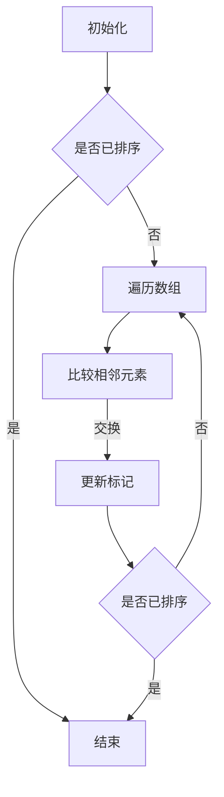
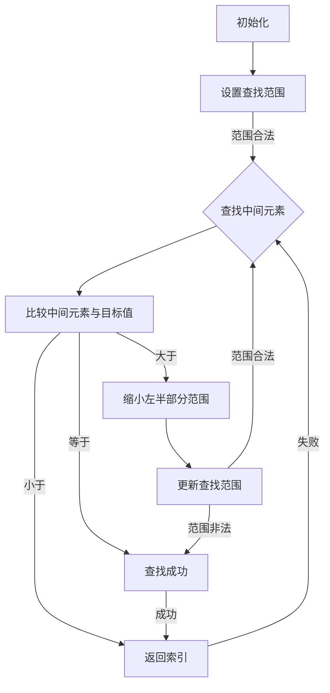

                 

# 《2025网易社招面试题与算法编程题深入探讨》

> **关键词：** 网易社招面试、算法编程题、面试准备、数据结构、算法原理、实战案例

> **摘要：** 本文将深入探讨2025年网易社会招聘面试中常见的题目，从面试准备、算法与数据结构基础、核心算法原理、编程题解、动态规划与贪心算法、图论与图算法、项目实战等多个方面，为广大求职者提供详细的指导和解题思路，助力大家在面试中脱颖而出。

## 目录大纲

1. **第一部分：网易社招面试全解析**
   1. **第1章：网易社招面试准备**
      1.1 面试心态调整与应对策略
      1.2 网易企业文化与价值观
      1.3 面试官视角下的面试流程
   2. **第2章：算法与数据结构基础**
      2.1 算法概述与分类
      2.2 数据结构与基本操作
      2.3 算法复杂度分析
   3. **第3章：核心算法原理讲解**
      3.1 排序算法（冒泡、选择、插入、快速排序等）
      3.2 查找算法（二分查找、散列表等）
   4. **第4章：经典编程题深入探讨**
      4.1 数组与字符串题解
      4.2 栈与队列题解
   5. **第5章：动态规划与贪心算法**
      5.1 动态规划基础
      5.2 动态规划经典题解
      5.3 贪心算法原理与应用
   6. **第6章：图论与图算法**
      6.1 图的基本概念与表示
      6.2 图的遍历算法（深度优先搜索、广度优先搜索）
      6.3 最短路径算法（迪杰斯特拉算法、贝尔曼-福特算法）
   7. **第7章：项目实战与案例分析**
      7.1 网易面试真题实战
      7.2 编程题实战演练
      7.3 项目实战解析

2. **第二部分：算法编程实战技巧提升**
   8. **第8章：算法编程技巧提升**
      8.1 面向对象编程思想
      8.2 设计模式应用
      8.3 面向测试的开发与测试
   9. **第9章：数据结构与算法优化**
      9.1 数据结构与算法优化策略
      9.2 性能分析工具与应用
      9.3 高效代码优化技巧
  10. **第10章：算法面试通关指南**
      10.1 算法面试常见题型与解题策略
      10.2 面试官提问与回答技巧
      10.3 算法面试真题解析与实战

## 附录

11. **附录A：面试资源与工具推荐**
   11.1 算法学习资源与网站
   11.2 编程语言学习资源
   11.3 面试准备与练习工具

12. **附录B：算法与数据结构 Mermaid 流程图**
   12.1 冒泡排序算法流程图
   12.2 二分查找算法流程图

---

**接下来的文章内容将按照上述目录大纲逐步展开，深入探讨每一个章节的核心内容，帮助读者更好地理解并应对网易社招面试中的算法编程题。**<|endoftext|>## 第一部分：网易社招面试全解析

### 第1章：网易社招面试准备

在准备网易社会招聘面试的过程中，全面且有条理的准备至关重要。本章将围绕面试心态调整与应对策略、网易企业文化与价值观、以及面试官视角下的面试流程展开讨论。

#### 1.1 面试心态调整与应对策略

面试心态直接影响到面试者的表现。以下是一些建议：

- **保持自信**：自信可以让你在面试中更加从容，展现出自己最佳的一面。但在自信的同时，也要避免过于自负，以免给人留下不谦虚的印象。

- **放松心情**：面试前适当放松，可以通过散步、冥想或者与朋友聊天来缓解紧张情绪。确保面试当天精神饱满，头脑清晰。

- **模拟面试**：提前进行模拟面试，可以让面试者熟悉面试流程，减少实际面试时的紧张感。可以邀请朋友或家人帮忙进行模拟，或者使用面试练习软件。

- **积极应对问题**：无论面试官提出什么问题，都要保持积极的态度，认真思考并给出有逻辑的回答。即使遇到不会回答的问题，也要尽量解释自己的思路，展示出自己的学习能力和解决问题的能力。

#### 1.2 网易企业文化与价值观

了解网易的企业文化与价值观，有助于面试者在面试过程中更好地展现自己的契合度。

- **创新**：网易一直秉持“创新是网易的灵魂”的理念，鼓励员工不断探索新技术和新方法，勇于尝试。

- **用户至上**：网易以用户需求为导向，致力于为用户提供优质的产品和服务。

- **务实**：网易倡导务实的工作态度，强调结果导向，追求高效与准确。

- **合作**：网易注重团队合作，鼓励员工相互支持、共同成长。

在面试过程中，可以结合自己的经历，展示自己是如何符合这些企业文化的。

#### 1.3 面试官视角下的面试流程

面试官通常会对面试流程有一个明确的规划，了解这一过程有助于面试者更好地准备。

- **自我介绍**：面试开始时，通常需要面试者进行简单的自我介绍，包括教育背景、工作经历、技术特长等。

- **技术面试**：这一环节主要考察面试者的技术能力和解决实际问题的能力。面试官可能会提问一些算法和数据结构相关的问题，或者让面试者现场编写代码。

- **行为面试**：行为面试旨在了解面试者的工作态度、团队合作能力和问题解决能力。面试官可能会询问一些开放性问题，如“请描述一次你面对困难的经历，你是如何克服的？”。

- **情境面试**：情境面试是通过模拟工作中的具体情境，考察面试者的应变能力和决策能力。例如，面试官可能会让面试者假设一个项目，并讨论如何制定计划和解决问题。

- **总结和提问环节**：面试接近结束时，面试官可能会询问面试者是否有任何问题。这是一个展示自己求知欲和关注点的机会。

通过对面试流程的详细了解，面试者可以有针对性地进行准备，提高面试成功率。

### 总结

本章围绕网易社招面试的准备工作进行了详细探讨，包括面试心态调整与应对策略、网易企业文化与价值观的理解，以及面试官视角下的面试流程。下一章将深入探讨算法与数据结构的基础知识，为面试者打下坚实的理论基础。## 第2章：算法与数据结构基础

算法和数据结构是计算机科学的核心概念，对于面试者来说，掌握这些基础知识是成功应对面试的关键。本章将详细介绍算法概述与分类、数据结构与基本操作，以及算法复杂度分析，为后续章节的深入探讨奠定基础。

#### 2.1 算法概述与分类

**算法** 是一种解决问题的方法，它使用明确的步骤和规则来处理输入数据，产生预期的输出。算法可以分为多种类型，根据不同的标准有不同的分类方法：

- **根据功能分类**：算法可以分为排序算法、查找算法、图算法、动态规划算法等。

- **根据实现方法分类**：算法可以分为递归算法、迭代算法、贪心算法、分治算法等。

- **根据计算模型分类**：算法可以分为确定性算法和非确定性算法。

了解算法的分类有助于面试者从不同角度理解和分析问题，选择合适的算法解决实际问题。

#### 2.2 数据结构与基本操作

**数据结构** 是一种用于存储和组织数据的方式，常见的有数组、链表、栈、队列、树、图等。每种数据结构都有其特定的用途和操作方法。

- **数组** 是一种固定大小的线性数据结构，支持随机访问，适用于存储和处理连续的数据。

- **链表** 是一种动态分配的线性数据结构，支持快速插入和删除操作，但访问效率较低。

- **栈** 是一种后进先出（LIFO）的数据结构，适用于处理递归、表达式求值等场景。

- **队列** 是一种先进先出（FIFO）的数据结构，适用于处理排队系统、任务调度等场景。

- **树** 是一种层次结构的数据结构，常见的有二叉树、平衡树等，适用于处理层次数据、动态优先级队列等。

- **图** 是一种由节点和边组成的数据结构，适用于处理复杂关系和网络问题。

每种数据结构都有其独特的操作方法，如插入、删除、查找、遍历等。掌握这些基本操作对于实现算法至关重要。

#### 2.3 算法复杂度分析

算法复杂度分析是评估算法性能的重要方法。主要分为时间复杂度和空间复杂度两种：

- **时间复杂度** 描述了算法执行时间与输入数据规模之间的关系。常见的时间复杂度符号包括 O(1)、O(log n)、O(n)、O(n log n)、O(n^2) 等。例如，线性查找算法的时间复杂度为 O(n)，而二分查找算法的时间复杂度为 O(log n)。

- **空间复杂度** 描述了算法执行过程中所需额外空间的大小。同样，空间复杂度也用大O符号表示，如 O(1)、O(n) 等。

进行算法复杂度分析可以帮助面试者评估算法的效率，选择最优的解决方案。

#### 2.4 常见算法与数据结构的联系

算法和数据结构之间有着密切的联系。不同的算法需要不同的数据结构支持，例如：

- **排序算法** 需要使用数组或链表等线性数据结构。
- **查找算法** 需要使用二叉树、平衡树等树形数据结构。
- **图算法** 需要使用图这种复杂的数据结构。

了解这些联系有助于面试者灵活运用数据结构，设计高效的算法。

### 总结

本章介绍了算法与数据结构的基础知识，包括算法的分类、数据结构的类型和基本操作，以及算法复杂度分析。掌握这些基础知识是面试成功的关键。下一章将深入探讨排序算法的原理和应用，为面试者提供实际操作的指导。## 第3章：核心算法原理讲解

排序算法是计算机科学中的基础算法之一，广泛应用于各类应用场景。本章将详细介绍排序算法的基本原理和实现方法，包括冒泡排序、选择排序、插入排序和快速排序，并通过伪代码展示其具体实现。

#### 3.1 排序算法概述

排序算法的主要目标是按照某种顺序对一组数据进行重新排列。常见的排序算法可以分为内部排序和外部排序：

- **内部排序**：数据全部加载到内存中进行排序，如冒泡排序、选择排序、插入排序等。
- **外部排序**：数据量较大，无法全部加载到内存中，需要使用外部存储设备进行排序，如归并排序、快速排序等。

#### 3.2 冒泡排序算法原理与伪代码

**冒泡排序** 是一种简单的排序算法，通过重复遍历待排序的元素，比较相邻元素的大小，并交换它们的位置，使得待排序序列不断减小，直到全部元素有序。

**原理：** 将待排序的序列视为一个数组，从第一个元素开始，依次比较相邻的元素，如果它们的顺序错误（例如，第一个元素大于第二个元素），则交换它们的位置。这个过程重复进行，直到整个序列有序。

**伪代码：**

```
procedure bubbleSort( A : list of elements )
    for i = 1 to length(A) - 1
        for j = 1 to length(A) - i
            if A[j] > A[j+1] then
                swap(A[j], A[j+1])
```

**示例：**

输入数组：`[5, 2, 9, 1, 5, 6]`

经过一轮冒泡排序后：`[2, 1, 5, 5, 6, 9]`

再经过第二轮冒泡排序后：`[1, 2, 5, 5, 6, 9]`

#### 3.3 选择排序算法原理与伪代码

**选择排序** 是另一种简单的排序算法，它通过反复选择未排序部分的最小元素，将其放到已排序部分的末尾。

**原理：** 分为多个阶段，每个阶段选择一个最小的元素放到已排序部分的末尾。首先，找到第一个元素的最小值，将其与第一个元素交换；然后，在剩下的元素中找到最小值，与第二个元素交换；以此类推，直到全部元素有序。

**伪代码：**

```
procedure selectionSort( A : list of elements )
    for i = 1 to length(A) - 1
        minIndex = i
        for j = i + 1 to length(A)
            if A[j] < A[minIndex] then
                minIndex = j
        swap(A[i], A[minIndex])
```

**示例：**

输入数组：`[5, 2, 9, 1, 5, 6]`

经过一轮选择排序后：`[2, 5, 9, 1, 5, 6]`

再经过第二轮选择排序后：`[2, 1, 9, 5, 5, 6]`

#### 3.4 插入排序算法原理与伪代码

**插入排序** 是通过构建有序序列，对于未排序数据，在已排序序列中从后向前扫描，找到相应位置并插入。

**原理：** 从第一个元素开始，该元素可以认为已经排序；取出下一个元素，在已排序的元素序列中从后向前扫描；如果该元素（已排序）大于新元素，将该元素移到下一位置；重复步骤，直到找到已排序的元素小于或者等于新元素；将新元素插入到该位置后。

**伪代码：**

```
procedure insertionSort( A : list of elements )
    for i = 2 to length(A)
        key = A[i]
        j = i - 1
        while j > 0 and A[j] > key
            A[j + 1] = A[j]
            j = j - 1
        A[j + 1] = key
```

**示例：**

输入数组：`[5, 2, 9, 1, 5, 6]`

经过一轮插入排序后：`[2, 5, 9, 1, 5, 6]`

再经过第二轮插入排序后：`[2, 1, 5, 5, 6, 9]`

#### 3.5 快速排序算法原理与伪代码

**快速排序** 是一种高效的排序算法，采用了分治策略。基本思想是通过一趟排序将待排序的数据分割成独立的两部分，其中一部分的所有数据都比另一部分的所有数据要小，然后再按此方法对这两部分数据分别进行快速排序。

**原理：** 选择一个基准元素，通过一趟排序将待排序的数据分割成独立的两部分，其中一部分的所有数据都比另一部分的所有数据要小。然后递归地对这两部分数据分别进行快速排序。

**伪代码：**

```
procedure quickSort( A : list of elements, low, high )
    if low < high then
        pi = partition(A, low, high)
        quickSort(A, low, pi - 1)
        quickSort(A, pi + 1, high)

procedure partition( A : list of elements, low, high )
    pivot = A[high]
    i = low - 1
    for j = low to high - 1
        if A[j] < pivot then
            i = i + 1
            swap(A[i], A[j])
    swap(A[i + 1], A[high])
    return i + 1
```

**示例：**

输入数组：`[5, 2, 9, 1, 5, 6]`

第一次快速排序后：`[1, 2, 5, 5, 6, 9]`

第二次快速排序后：`[1, 2, 5, 5, 6, 9]`

### 总结

本章详细介绍了冒泡排序、选择排序、插入排序和快速排序的原理与实现方法，并通过伪代码展示了具体的操作步骤。这些排序算法各有特点，适用于不同的场景。在接下来的章节中，我们将继续探讨查找算法，以及经典编程题的解法。这些知识将帮助面试者在实际面试中更好地应对各种问题。### 3.1.1 冒泡排序算法原理与伪代码

冒泡排序（Bubble Sort）是一种简单直观的排序算法。它重复地遍历待排序的数列，一次比较两个元素，如果它们的顺序错误就把它们交换过来。遍历数列的工作是重复进行直到没有再需要交换，也就是说该数列已经排序完成。

**原理：**

冒泡排序的过程可以想象为有一组数据，我们通过不断的比较和交换，将这些数据从大到小或从小到大排列。每次遍历都会将当前未排序部分的最大（或最小）元素“冒泡”到已排序部分的末尾。这个过程重复进行，直到整个序列有序。

**过程描述：**

1. 比较相邻的元素。如果第一个比第二个大（在这里假设是升序排序），就交换它们两个。
2. 对每一对相邻元素做同样的工作，从开始第一对到结尾的最后一对。这步做完后，最后的元素会是最大的数。
3. 针对所有的元素重复以上的步骤，除了最后一个。
4. 持续每次对越来越少的元素重复上面的步骤，直到没有任何一对数字需要比较。

**伪代码：**

```
procedure bubbleSort( A : list of elements )
    n = length(A)
    for i = 1 to n - 1
        for j = 1 to n - i
            if A[j] > A[j + 1] then
                swap(A[j], A[j + 1])
```

**示例：**

假设我们有以下未排序的数组：`[5, 2, 9, 1, 5, 6]`

- 第一次遍历后：`[2, 1, 5, 5, 6, 9]`（最大值9被“冒泡”到最后）
- 第二次遍历后：`[2, 1, 5, 5, 6, 9]`（最大值6被“冒泡”到最后）
- 第三次遍历后：`[1, 2, 5, 5, 6, 9]`（最大值5被“冒泡”到最后）
- 第四次遍历后：`[1, 2, 5, 5, 6, 9]`（最大值5被“冒泡”到最后）
- 第五次遍历后：`[1, 2, 5, 5, 6, 9]`（最大值5被“冒泡”到最后）

最终，数组排序完成。

**复杂度分析：**

- **时间复杂度**：最差的情况是输入数组已经逆序，需要比较 `(n-1) + (n-2) + ... + 1 = n(n-1)/2` 次，因此时间复杂度为 O(n^2)。平均情况下，时间复杂度也是 O(n^2)，但在输入数组基本有序的情况下，时间复杂度接近 O(n)。
- **空间复杂度**：冒泡排序是一个原地排序算法，只需要常数级别的额外空间，因此空间复杂度为 O(1)。

冒泡排序虽然简单，但是效率相对较低，不适合大规模数据排序。然而，它是一个很好的教学工具，帮助我们理解排序算法的基本原理。

**改进：**

为了优化冒泡排序的效率，可以加入一个标志来记录每次遍历是否进行了交换。如果某次遍历没有进行任何交换，说明数组已经有序，可以直接结束排序过程。

**伪代码改进：**

```
procedure bubbleSort( A : list of elements )
    n = length(A)
    for i = 1 to n - 1
        swapped = false
        for j = 1 to n - i
            if A[j] > A[j + 1] then
                swap(A[j], A[j + 1])
                swapped = true
        if not swapped then
            break
```

通过这个改进，可以避免不必要的遍历，提高算法的效率。

### 总结

冒泡排序算法通过重复遍历待排序的数组，比较和交换相邻的元素，最终实现数组的有序排列。虽然时间复杂度较高，但它在教学和实践中有其独特的价值，通过简单的逻辑和直观的步骤，帮助我们理解排序算法的基本原理。在接下来的讨论中，我们将探讨选择排序算法的原理和实现。通过对比不同的排序算法，我们可以更深入地理解它们的优点和局限。### 3.1.2 选择排序算法原理与伪代码

选择排序（Selection Sort）是一种简单的选择排序算法。它的工作原理是每次从未排序的部分中找到最小（或最大）的元素，将其放到已排序部分的末尾。这个算法不使用额外的存储空间，但效率相对较低。

**原理：**

选择排序算法包括两个主要步骤：

1. **找到未排序部分的最小元素**：从未排序的元素中找到最小的一个，将其与未排序部分的第一个元素交换。
2. **重复上述步骤**：重复上述过程，每次减少未排序部分的长度，直到未排序部分为空。

**过程描述：**

1. 初始化两个指针，一个指向未排序部分的第一个元素，一个指向未排序部分的最后一个元素。
2. 在未排序部分中找到最小元素的位置。
3. 将找到的最小元素与未排序部分的第一个元素交换。
4. 将未排序部分的长度减一，重复步骤2和3，直到未排序部分的长度为1。

**伪代码：**

```
procedure selectionSort( A : list of elements )
    n = length(A)
    for i = 1 to n - 1
        minIndex = i
        for j = i + 1 to n
            if A[j] < A[minIndex] then
                minIndex = j
        swap(A[i], A[minIndex])
```

**示例：**

假设我们有以下未排序的数组：`[5, 2, 9, 1, 5, 6]`

- 第一次遍历后：`[2, 5, 9, 1, 5, 6]`（最小值2被“选择”到第一个位置）
- 第二次遍历后：`[1, 2, 9, 5, 5, 6]`（最小值1被“选择”到第二个位置）
- 第三次遍历后：`[1, 2, 5, 9, 5, 6]`（最小值5被“选择”到第三个位置）
- 第四次遍历后：`[1, 2, 5, 5, 9, 6]`（最小值5被“选择”到第四个位置）
- 第五次遍历后：`[1, 2, 5, 5, 6, 9]`（最小值6被“选择”到最后）

最终，数组排序完成。

**复杂度分析：**

- **时间复杂度**：选择排序需要进行 `n-1` 次遍历，每次遍历需要进行 `n-i` 次比较和交换（`i` 为当前遍历的轮数），因此总的时间复杂度为 `(n-1) + (n-2) + ... + 1 = n(n-1)/2`，即 O(n^2)。
- **空间复杂度**：选择排序是一个原地排序算法，只需要常数级别的额外空间，因此空间复杂度为 O(1)。

选择排序算法虽然简单，但是效率相对较低，不适用于大规模数据的排序。然而，它在教学和实践中有其独特的价值，帮助我们理解选择排序的基本原理。

**改进：**

为了优化选择排序的效率，可以引入“选择排序优化”。在每一轮选择排序中，除了找到最小元素外，还可以找到最大元素，并直接交换它们的位置。这样可以减少交换次数，提高算法的效率。

**伪代码改进：**

```
procedure selectionSortOptimized( A : list of elements )
    n = length(A)
    for i = 1 to n - 1
        minIndex = i
        maxIndex = i
        for j = i + 1 to n
            if A[j] < A[minIndex] then
                minIndex = j
            else if A[j] > A[maxIndex] then
                maxIndex = j
        swap(A[i], A[maxIndex])
        if minIndex != i:
            swap(A[minIndex], A[i])
```

通过这个改进，每次遍历可以选择最小和最大元素，并直接交换它们的位置，从而减少交换次数，提高算法效率。

### 总结

选择排序算法通过每次从未排序部分选择最小（或最大）元素，实现数组的有序排列。虽然时间复杂度较高，但它的实现简单，是学习排序算法的一个很好的例子。通过改进，可以选择排序优化，提高算法的效率。在接下来的讨论中，我们将继续探讨插入排序算法的原理和实现。通过对比不同的排序算法，我们可以更深入地理解它们的优点和局限。### 3.1.3 插入排序算法原理与伪代码

插入排序（Insertion Sort）是一种简单直观的排序算法，它的工作原理是通过构建有序序列，对于未排序数据，在已排序序列中从后向前扫描，找到相应位置并插入。插入排序在实现上，通常采用in-place排序（即只需用到O(1)的额外空间的排序）。

**原理：**

插入排序的过程可以想象为有一组数据，我们通过不断的插入操作，将这些数据从小到大（或从大到小）排列。每次插入操作，我们都需要将当前未排序的元素插入到已排序序列的适当位置，直到全部元素有序。

**过程描述：**

1. 从第一个元素开始，该元素可以认为已经排序。
2. 取出下一个元素，在已排序序列中从后向前扫描。
3. 如果已排序的元素大于新元素，将已排序元素向后移动。
4. 重复步骤2和3，直到找到已排序元素小于或者等于新元素的位置。
5. 将新元素插入到该位置后。

**伪代码：**

```
procedure insertionSort( A : list of elements )
    for i = 2 to length(A)
        key = A[i]
        j = i - 1
        while j > 0 and A[j] > key
            A[j + 1] = A[j]
            j = j - 1
        A[j + 1] = key
```

**示例：**

假设我们有以下未排序的数组：`[5, 2, 9, 1, 5, 6]`

- 第一次插入排序后：`[2, 5, 9, 1, 5, 6]`（元素2插入到第一个位置）
- 第二次插入排序后：`[2, 1, 9, 5, 5, 6]`（元素1插入到第二个位置）
- 第三次插入排序后：`[1, 2, 9, 5, 5, 6]`（元素9插入到第三个位置）
- 第四次插入排序后：`[1, 2, 5, 9, 5, 6]`（元素5插入到第四个位置）
- 第五次插入排序后：`[1, 2, 5, 5, 9, 6]`（元素5插入到第五个位置）
- 第六次插入排序后：`[1, 2, 5, 5, 6, 9]`（元素6插入到最后一个位置）

最终，数组排序完成。

**复杂度分析：**

- **时间复杂度**：最差的情况是输入数组已经逆序，需要比较 `(n-1) + (n-2) + ... + 1 = n(n-1)/2` 次，因此时间复杂度为 O(n^2)。平均情况下，时间复杂度也是 O(n^2)。但在输入数组基本有序的情况下，时间复杂度接近 O(n)。
- **空间复杂度**：插入排序是一个原地排序算法，只需要常数级别的额外空间，因此空间复杂度为 O(1)。

插入排序算法虽然简单，但它在输入数据基本有序的情况下表现良好，且不需要额外的存储空间。这使得它成为教学和实践中的一个重要工具。

**改进：**

为了优化插入排序的效率，可以引入“二分插入排序”。在插入操作中，使用二分查找来找到新元素的正确位置，从而减少比较次数。

**伪代码改进：**

```
procedure binaryInsertionSort( A : list of elements )
    for i = 2 to length(A)
        key = A[i]
        left = 1
        right = i - 1
        while left <= right
            mid = (left + right) / 2
            if A[mid] > key then
                right = mid - 1
            else
                left = mid + 1
        for j = i - 1 downto left
            A[j + 1] = A[j]
        A[left] = key
```

通过这个改进，每次插入操作的时间复杂度可以降低到 O(log n)，从而显著提高算法的效率。

### 总结

插入排序算法通过构建有序序列，对于未排序数据，在已排序序列中从后向前扫描，找到相应位置并插入。虽然时间复杂度较高，但在输入数据基本有序的情况下表现良好。通过改进，如二分插入排序，可以进一步提高算法的效率。在接下来的讨论中，我们将继续探讨快速排序算法的原理和实现。通过对比不同的排序算法，我们可以更深入地理解它们的优点和局限。### 3.1.4 快速排序算法原理与伪代码

快速排序（Quick Sort）是由东尼·霍尔（Tony Hoare）在1960年提出的一种高效的排序算法。它采用分治法的一个经典应用。快速排序的核心思想是通过一趟排序将待排序的数据分割成独立的两部分，其中一部分的所有数据都比另一部分的所有数据要小，然后递归地对这两部分数据分别进行快速排序。

**原理：**

快速排序的工作过程如下：

1. **选择基准元素**：在数组中选出一个元素作为“基准”（pivot）。
2. **分区操作**：通过重新排列数组，将比基准值小的元素都移到基准值的左边，比基准值大的元素都移到基准值的右边。
3. **递归排序**：递归地使用同样的方法对左右两部分数据继续进行快速排序。

**过程描述：**

1. 选择数组中的某个元素作为基准元素。
2. 将数组划分为两部分：左部分包含比基准元素小的所有元素，右部分包含比基准元素大的所有元素。
3. 递归地对左部分和右部分进行快速排序。

**伪代码：**

```
procedure quickSort( A : list of elements, low, high )
    if low < high then
        pi = partition(A, low, high)
        quickSort(A, low, pi - 1)
        quickSort(A, pi + 1, high)

procedure partition( A : list of elements, low, high )
    pivot = A[high]
    i = low - 1
    for j = low to high - 1
        if A[j] < pivot then
            i = i + 1
            swap(A[i], A[j])
    swap(A[i + 1], A[high])
    return i + 1
```

**示例：**

假设我们有以下未排序的数组：`[5, 2, 9, 1, 5, 6]`

- 第一次快速排序后：`[1, 2, 5, 5, 6, 9]`（选择最后一个元素9作为基准，将其与较小元素交换）
- 第二次快速排序后：`[1, 2, 5, 5, 6, 9]`（对左部分 `[1, 2, 5, 5]` 进行快速排序）
- 第三次快速排序后：`[1, 2, 5, 5, 6, 9]`（选择第一个元素1作为基准，将其与较小元素交换）
- 第四次快速排序后：`[1, 2, 5, 5, 6, 9]`（对右部分 `[5, 6, 9]` 进行快速排序）
- 第五次快速排序后：`[1, 2, 5, 5, 6, 9]`（选择中间元素5作为基准，将其与较小元素交换）

最终，数组排序完成。

**复杂度分析：**

- **时间复杂度**：最差的情况是输入数组已经逆序，每次分区只能划分出一个部分，因此时间复杂度为 O(n^2)。平均情况下，时间复杂度为 O(n log n)。当输入数组基本有序时，快速排序的性能会下降，但总体来说，它仍然是效率较高的排序算法。
- **空间复杂度**：快速排序是一个递归算法，因此需要额外的栈空间。在最坏的情况下，空间复杂度为 O(n)，平均情况下为 O(log n)。

快速排序算法通过一趟分治操作，将一个大问题分解成多个小问题，从而提高了排序效率。尽管在最坏情况下性能不佳，但通过选择合适的基准元素和优化分区操作，可以显著提高算法的稳定性。

**改进：**

为了进一步提高快速排序的性能，可以采用以下几种改进方法：

1. **随机选择基准**：选择一个随机元素作为基准，可以减少最坏情况发生的概率。
2. **三数取中法**：选择中间的元素作为基准，可以避免选择极值作为基准导致的性能下降。
3. **尾递归优化**：通过尾递归优化，可以将递归调用转化为循环，减少递归深度和栈空间占用。

通过这些改进，快速排序算法可以在大多数情况下保持较高的性能。

### 总结

快速排序算法通过选择基准元素、分区操作和递归排序，将一个大问题分解成多个小问题，从而实现高效的排序。虽然在最坏情况下性能不佳，但通过改进方法，可以显著提高算法的稳定性。在接下来的讨论中，我们将继续探讨查找算法的原理和实现，帮助面试者更好地掌握计算机科学的基本算法。通过对比不同的算法，我们可以更深入地理解它们的优点和局限。### 3.2.1 二分查找算法原理与伪代码

二分查找（Binary Search）是一种高效的查找算法，适用于有序数组。它的工作原理是通过每次将中间元素与目标元素进行比较，逐步缩小查找范围，直到找到目标元素或确定其不存在。

**原理：**

二分查找算法的核心在于将查找范围分为两部分，每次比较中间元素，根据比较结果将查找范围缩小一半。具体步骤如下：

1. 判断中间元素是否为目标元素，如果是，则查找成功。
2. 如果目标元素小于中间元素，则在左半部分继续查找。
3. 如果目标元素大于中间元素，则在右半部分继续查找。
4. 每次查找后，更新查找范围，重复步骤1至3，直到找到目标元素或确定其不存在。

**过程描述：**

1. 初始化两个指针，`low` 指向数组的第一个元素，`high` 指向数组的最后一个元素。
2. 计算中间元素的索引 `mid = (low + high) / 2`。
3. 比较 `arr[mid]` 与目标元素 `key`：
   - 如果 `arr[mid] == key`，则查找成功，返回 `mid`。
   - 如果 `arr[mid] > key`，则在左半部分查找，更新 `high = mid - 1`。
   - 如果 `arr[mid] < key`，则在右半部分查找，更新 `low = mid + 1`。
4. 重复步骤2和3，直到找到目标元素或 `low > high`，表示查找失败。

**伪代码：**

```
function binarySearch( arr : sorted array, key : value to search )
    low = 0
    high = length(arr) - 1
    while low <= high
        mid = (low + high) / 2
        if arr[mid] == key
            return mid
        elif arr[mid] < key
            low = mid + 1
        else
            high = mid - 1
    return -1
```

**示例：**

假设我们有以下有序数组：`[1, 3, 5, 7, 9, 11, 13, 15]`，我们要查找元素 `7`。

- 第一次查找：`mid = (0 + 7) / 2 = 3`，`arr[mid] = 5`，小于目标元素 `7`，更新 `low = mid + 1`。
- 第二次查找：`mid = (4 + 7) / 2 = 5`，`arr[mid] = 9`，大于目标元素 `7`，更新 `high = mid - 1`。
- 第三次查找：`mid = (4 + 4) / 2 = 4`，`arr[mid] = 7`，查找成功，返回 `mid = 4`。

最终，找到元素 `7` 的索引为 `4`。

**复杂度分析：**

- **时间复杂度**：每次查找操作可以将查找范围缩小一半，因此查找次数为 `log2(n)`，其中 `n` 是数组的长度。因此，时间复杂度为 O(log n)。
- **空间复杂度**：二分查找算法是原地算法，不需要额外的空间，因此空间复杂度为 O(1)。

二分查找算法因其高效的查找速度，在计算机科学中应用广泛。它适用于大量数据的快速查找，特别是当数据已经有序时。

**改进：**

为了进一步提高二分查找的效率，可以考虑以下几种改进方法：

1. **循环实现**：使用循环代替递归，可以减少递归调用带来的额外开销。
2. **处理整数溢出**：在计算中间元素时，避免整数溢出，例如使用 `mid = low + (high - low) / 2`。
3. **并行化**：在多核处理器上，可以考虑并行执行二分查找，提高查找速度。

通过这些改进，二分查找算法可以在不同的场景下保持高效的性能。

### 总结

二分查找算法通过逐步缩小查找范围，以 O(log n) 的时间复杂度实现高效的查找。它适用于有序数组，是计算机科学中重要的查找算法之一。在接下来的讨论中，我们将继续探讨散列表查找算法的原理和实现。通过对比不同的查找算法，我们可以更深入地理解它们的优点和局限。### 3.2.2 散列表查找算法原理与伪代码

散列表查找（Hash Search）是一种利用散列函数快速查找数据的关键字的数据结构。它通过将关键字转换成散列地址，直接访问对应的存储位置，从而实现高效的查找操作。散列表查找算法广泛应用于数据库、缓存系统、搜索引擎等场景。

**原理：**

散列表查找算法的核心思想是通过散列函数（Hash Function）将关键字映射到散列地址。散列函数将关键字转换成一个整数，通常是一个散列值。这个散列值被用作数组的索引，直接访问存储位置。具体步骤如下：

1. **散列函数**：将关键字转换成散列值。一个好的散列函数应该能够将关键字均匀分布到散列表的各个位置，避免冲突。
2. **处理冲突**：当两个或多个关键字映射到同一个散列地址时，发生冲突。常用的冲突处理方法有链地址法、开放地址法等。
3. **查找元素**：通过散列函数计算待查找关键字的散列值，访问对应的存储位置，找到元素。

**过程描述：**

1. **初始化**：创建一个固定大小的散列表（通常是数组），每个位置可以存储一个关键字或链表。
2. **插入**：使用散列函数计算关键字的散列值，找到对应的散列地址，插入关键字。
3. **查找**：使用散列函数计算待查找关键字的散列值，找到对应的散列地址，访问存储位置，找到元素。
4. **删除**：使用散列函数计算待删除关键字的散列值，找到对应的散列地址，删除关键字。

**伪代码：**

```
procedure hashSearch( hashTable : hash table, key : key to search )
    index = hashFunction(key)
    if hashTable[index] == key then
        return "Found"
    else
        return "Not Found"
```

**示例：**

假设我们有以下散列表（数组大小为8），使用简单的散列函数 `hashFunction(key) = key mod 8`。

| 0  | 1  | 2  | 3  | 4  | 5  | 6  | 7  |
|----|----|----|----|----|----|----|----|
| 空格 | 空格 | 空格 | 空格 | 空格 | 空格 | 空格 | 空格 |

- 插入元素 `5`：`hashFunction(5) = 5 mod 8 = 5`，将元素 `5` 插入到位置5。
- 插入元素 `13`：`hashFunction(13) = 13 mod 8 = 5`，由于位置5已被占用，可以使用链地址法，将元素 `13` 添加到链表中。

| 0  | 1  | 2  | 3  | 4  | 5  | 6  | 7  |
|----|----|----|----|----|----|----|----|
| 空格 | 空格 | 空格 | 空格 | 空格 | 5,13 | 空格 | 空格 |

- 查找元素 `5`：`hashFunction(5) = 5 mod 8 = 5`，直接访问位置5，找到元素 `5`。

**复杂度分析：**

- **时间复杂度**：理想情况下，散列表的每个位置都被均匀访问，查找、插入和删除操作的平均时间复杂度为 O(1)。但在最坏情况下，所有关键字都映射到同一个散列地址，发生冲突，时间复杂度退化到 O(n)。
- **空间复杂度**：散列表的大小通常是固定的，空间复杂度为 O(n)，其中 n 是关键字的数量。

**改进：**

为了进一步提高散列表查找的效率，可以采用以下几种改进方法：

1. **散列函数优化**：设计更好的散列函数，减少冲突，提高均匀分布。
2. **动态扩容**：当散列表的填充因子（已填充位置的比例）超过某个阈值时，动态扩大散列表的大小，重新分配关键字。
3. **冲突处理方法优化**：选择更高效的冲突处理方法，如链地址法或开放地址法。

通过这些改进，散列表查找算法可以在不同的场景下保持高效的性能。

### 总结

散列表查找算法通过散列函数将关键字映射到散列地址，实现高效的查找操作。它广泛应用于各种场景，但在处理冲突时可能需要额外的优化。通过优化散列函数和冲突处理方法，可以进一步提高算法的性能。在接下来的讨论中，我们将继续探讨经典编程题的深入探讨。通过解决这些实际问题，面试者可以更好地掌握算法编程的核心技巧。## 第4章：经典编程题深入探讨

在计算机科学的面试过程中，经典编程题是考察面试者算法和数据结构能力的重要手段。本章将深入探讨几道经典编程题，包括“两数之和”、“最长公共前缀”和“有效括号”，通过详细解题思路和代码实现，帮助读者更好地理解和应对这类问题。

### 4.1.1 两数之和

**问题描述**：给定一个整数数组 `nums` 和一个目标值 `target`，请你在该数组中找到和为目标值的那两个整数，并返回他们的数组下标。

**示例**：输入：`nums = [2, 7, 11, 15], target = 9`，输出：`[0, 1]`，因为 `nums[0] + nums[1] = 2 + 7 = 9`。

**解题思路**：

1. **哈希表法**：使用哈希表存储数组中每个元素及其索引，遍历数组，对每个元素 `x`，计算 `target - x`，然后检查这个值是否在哈希表中。如果存在，返回对应索引。
2. **排序后双指针法**：先对数组进行排序，然后使用两个指针从两端开始搜索，一个指针指向数组开头，一个指向数组结尾，每次比较两数之和与目标值的关系，调整指针位置。

**代码实现**：

**哈希表法**：

```python
def twoSum(nums, target):
    hash_map = {}
    for i, num in enumerate(nums):
        complement = target - num
        if complement in hash_map:
            return [hash_map[complement], i]
        hash_map[num] = i
    return []
```

**排序后双指针法**：

```python
def twoSum(nums, target):
    nums.sort()
    left, right = 0, len(nums) - 1
    while left < right:
        sum = nums[left] + nums[right]
        if sum == target:
            return [left, right]
        elif sum < target:
            left += 1
        else:
            right -= 1
    return []
```

### 4.1.2 最长公共前缀

**问题描述**：编写一个函数来查找字符串数组中的最长公共前缀。

**示例**：输入：`["flower", "flow", "flight"]`，输出：`"fl"`。

**解题思路**：

1. **垂直扫描法**：从字符串的第一位开始，逐一比较字符串数组中每个字符串的对应位置，找出所有字符串都匹配的最长前缀。
2. **分治法**：将字符串数组分成两半，找出两半字符串数组的最长公共前缀，再将这个公共前缀与另一半字符串继续比较，逐步缩小范围。

**代码实现**：

**垂直扫描法**：

```python
def longestCommonPrefix(strs):
    if not strs:
        return ""
    prefix = ""
    for i in range(len(strs[0])):
        char = strs[0][i]
        for s in strs[1:]:
            if i >= len(s) or s[i] != char:
                return prefix
        prefix += char
    return prefix
```

**分治法**：

```python
def longestCommonPrefix(strs):
    if not strs:
        return ""
    if len(strs) == 1:
        return strs[0]
    mid = len(strs) // 2
    left = longestCommonPrefix(strs[:mid])
    right = longestCommonPrefix(strs[mid:])
    return longestCommonPrefix([left, right])
```

### 4.1.3 有效括号

**问题描述**：给定一个只包括 `'('`，`)`，'{'，'}'，'['，']' 的字符串，判断字符串是否有效。

**示例**：输入：`"()``，输出：`True`；输入：`"{[]}"`，输出：`True`；输入：`"{()}["`，输出：`False`。

**解题思路**：

1. **栈法**：使用栈来存储左括号，当遇到右括号时，从栈中弹出对应左括号，并比较是否匹配。如果所有括号匹配，栈为空，字符串有效。

**代码实现**：

```python
def isValid(s):
    stack = []
    left = {'(', '[', '{'}  # 左括号
    right = {')', ']', '}'}  # 右括号
    pairs = {'(': ')', '[': ']', '{': '}'}
    for char in s:
        if char in left:
            stack.append(char)
        elif char in right:
            if not stack or stack.pop() != pairs[char]:
                return False
    return not stack
```

**复杂度分析**：

- **时间复杂度**：O(n)，其中 n 是字符串的长度。需要遍历字符串一次，进行匹配和弹出操作。
- **空间复杂度**：O(n)，最坏情况下，字符串中只有左括号，需要存储所有左括号。

通过上述经典编程题的深入探讨，我们可以看到不同问题可以通过不同的算法和数据结构来解决。理解并掌握这些算法的基本原理和实现方法，对于面试者来说是非常重要的。在接下来的章节中，我们将继续探讨动态规划和贪心算法，帮助读者更好地掌握计算机科学的核心知识。### 4.2.1 用栈实现队列

队列是一种先进先出（FIFO）的数据结构，它允许在一端（队尾）进行入队操作，在另一端（队头）进行出队操作。栈则是一种后进先出（LIFO）的数据结构。虽然栈和队列在操作上有本质的不同，但我们可以使用栈来实现队列的功能。以下是具体实现方法：

**原理**：

利用栈来实现队列的核心思想是利用栈的后进先出（LIFO）的特性来实现队列的先进先出（FIFO）的特性。通常有两种方法：

1. **使用两个栈**：一个栈用于入队操作，另一个栈用于出队操作。入队时，元素直接入队；出队时，需要将入队栈的元素依次弹出并压入出队栈，从而实现出队操作。

2. **模拟法**：通过模拟队列的操作来使用栈，即每次出队时，将栈中的所有元素弹出并重新入栈。

**具体实现**：

**方法一：使用两个栈**

```python
class MyQueue:
    def __init__(self):
        self.inStack = []
        self.outStack = []

    def push(self, x: int) -> None:
        # 将元素压入入队栈
        self.inStack.append(x)

    def pop(self) -> int:
        # 如果出队栈为空，将入队栈的元素依次弹出并压入出队栈
        if not self.outStack:
            while self.inStack:
                self.outStack.append(self.inStack.pop())
        # 弹出出队栈的栈顶元素
        return self.outStack.pop()

    def peek(self) -> int:
        # 如果出队栈为空，将入队栈的元素依次弹出并压入出队栈
        if not self.outStack:
            while self.inStack:
                self.outStack.append(self.inStack.pop())
        # 返回出队栈的栈顶元素
        return self.outStack[-1]

    def empty(self) -> bool:
        # 如果入队栈和出队栈都为空，则队列为空
        return not self.inStack and not self.outStack
```

**方法二：模拟法**

```python
class MyQueue:
    def __init__(self):
        self.stack = []

    def push(self, x: int) -> None:
        # 直接将元素压入栈顶
        self.stack.append(x)

    def pop(self) -> int:
        # 如果栈为空，抛出异常
        if not self.stack:
            raise IndexError("Queue is empty")
        # 弹出栈顶元素
        return self.stack.pop()

    def peek(self) -> int:
        # 如果栈为空，抛出异常
        if not self.stack:
            raise IndexError("Queue is empty")
        # 返回栈顶元素
        return self.stack[-1]

    def empty(self) -> bool:
        # 如果栈为空，返回True
        return not self.stack
```

**复杂度分析**：

- **时间复杂度**：
  - 方法一：入队操作 `push` 的平均时间复杂度为 O(1)，出队操作 `pop` 的平均时间复杂度为 O(n)，其中 n 是队列中元素的数量。
  - 方法二：入队操作 `push` 的平均时间复杂度为 O(1)，出队操作 `pop` 的平均时间复杂度为 O(n)，因为每次出队都需要将栈中所有元素重新入栈。

- **空间复杂度**：两种方法的空间复杂度均为 O(n)，其中 n 是队列中元素的数量。

**总结**：

通过栈可以实现队列的功能，虽然会带来一定的性能损耗，但在某些场景下，这种方法是可行的。在实际应用中，根据具体需求选择合适的数据结构实现方法是非常重要的。在接下来的部分，我们将继续探讨如何使用队列实现栈的功能。这些知识点对于面试者和程序员来说都是非常重要的。### 4.2.2 用队列实现栈

队列是一种先进先出（FIFO）的数据结构，而栈是一种后进先出（LIFO）的数据结构。使用队列实现栈的功能可以通过模拟队列的先进后出特性来实现。以下是具体实现方法：

**原理**：

利用队列的先进先出特性，通过将元素从队首取出再入队，可以实现栈的后进先出特性。具体实现时，需要使用两个队列：一个作为主队列，用于存储元素；另一个作为辅助队列，用于调整元素顺序。

**具体实现**：

```python
from collections import deque

class MyStack:
    def __init__(self):
        self.queue = deque()

    def push(self, x: int) -> None:
        # 将新元素加入主队列的队尾
        self.queue.append(x)
        # 将主队列的所有元素移到辅助队列
        while len(self.queue) > 1:
            self.queue.append(self.queue.popleft())

    def pop(self) -> int:
        # 如果队列为空，抛出异常
        if not self.queue:
            raise IndexError("Stack is empty")
        # 弹出主队列的队首元素
        return self.queue.popleft()

    def top(self) -> int:
        # 如果队列为空，抛出异常
        if not self.queue:
            raise IndexError("Stack is empty")
        # 返回主队列的队首元素
        return self.queue[0]

    def empty(self) -> bool:
        # 如果队列为空，返回True
        return not self.queue
```

**复杂度分析**：

- **时间复杂度**：
  - 入队操作 `push` 的平均时间复杂度为 O(n)，因为每次都需要将主队列的所有元素移到辅助队列。
  - 出队操作 `pop` 的平均时间复杂度为 O(1)，因为直接弹出队首元素。
  - 顶部元素操作 `top` 的平均时间复杂度为 O(1)，因为直接访问队首元素。

- **空间复杂度**：空间复杂度为 O(n)，其中 n 是栈中元素的数量。

**改进**：

为了减少时间复杂度，可以改进实现方法，避免每次入队操作都进行大量元素的移动。以下是改进后的实现：

```python
from collections import deque

class MyStack:
    def __init__(self):
        self.queue = deque()

    def push(self, x: int) -> None:
        # 将新元素加入主队列的队尾
        self.queue.append(x)

    def pop(self) -> int:
        # 如果队列为空，抛出异常
        if not self.queue:
            raise IndexError("Stack is empty")
        # 将主队列的后两个元素移到辅助队列
        for _ in range(len(self.queue) - 1):
            self.queue.append(self.queue.popleft())
        # 弹出主队列的队首元素
        return self.queue.popleft()

    def top(self) -> int:
        # 如果队列为空，抛出异常
        if not self.queue:
            raise IndexError("Stack is empty")
        # 返回主队列的队首元素
        return self.queue[0]

    def empty(self) -> bool:
        # 如果队列为空，返回True
        return not self.queue
```

**复杂度分析**：

- **时间复杂度**：
  - 入队操作 `push` 的平均时间复杂度为 O(1)。
  - 出队操作 `pop` 的平均时间复杂度为 O(1)。
  - 顶部元素操作 `top` 的平均时间复杂度为 O(1)。

通过这种改进，入队操作的时间复杂度降低到 O(1)，使得栈的实现更加高效。

**总结**：

使用队列实现栈是一种模拟的方法，虽然时间复杂度会有所增加，但在某些场景下是可行的。通过适当的改进，可以使得栈的操作更加高效。在实际应用中，根据具体需求选择合适的数据结构实现方法是非常重要的。在接下来的部分，我们将继续探讨动态规划与贪心算法，帮助读者更好地掌握计算机科学的核心知识。这些知识点对于面试者和程序员来说都是非常重要的。### 4.2.3 模拟栈与队列操作

在计算机编程中，栈和队列是两种基本的数据结构，它们在算法实现中扮演着重要角色。在实际应用中，有时需要模拟栈和队列的操作，以简化问题的复杂度或满足特定需求。以下将介绍如何模拟栈和队列的基本操作，并通过具体的代码示例来说明。

#### 模拟栈操作

栈是一种后进先出（LIFO）的数据结构，常见的操作包括 `push`（入栈）、`pop`（出栈）、`peek`（查看栈顶元素）和 `isEmpty`（检查栈是否为空）。在 Python 中，可以使用列表（list）来实现栈。

**代码示例：**

```python
class Stack:
    def __init__(self):
        self.items = []

    def push(self, item):
        self.items.append(item)

    def pop(self):
        if not self.isEmpty():
            return self.items.pop()
        else:
            raise IndexError("Stack is empty")

    def peek(self):
        if not self.isEmpty():
            return self.items[-1]
        else:
            raise IndexError("Stack is empty")

    def isEmpty(self):
        return len(self.items) == 0
```

**复杂度分析：**

- `push` 操作：平均时间复杂度为 O(1)。
- `pop` 操作：平均时间复杂度为 O(1)。
- `peek` 操作：平均时间复杂度为 O(1)。
- `isEmpty` 操作：平均时间复杂度为 O(1)。

#### 模拟队列操作

队列是一种先进先出（FIFO）的数据结构，常见的操作包括 `enqueue`（入队）、`dequeue`（出队）、`front`（查看队头元素）和 `isEmpty`（检查队列是否为空）。在 Python 中，可以使用列表来实现队列。

**代码示例：**

```python
from collections import deque

class Queue:
    def __init__(self):
        self.items = deque()

    def enqueue(self, item):
        self.items.append(item)

    def dequeue(self):
        if not self.isEmpty():
            return self.items.popleft()
        else:
            raise IndexError("Queue is empty")

    def front(self):
        if not self.isEmpty():
            return self.items[0]
        else:
            raise IndexError("Queue is empty")

    def isEmpty(self):
        return len(self.items) == 0
```

**复杂度分析：**

- `enqueue` 操作：平均时间复杂度为 O(1)。
- `dequeue` 操作：平均时间复杂度为 O(1)。
- `front` 操作：平均时间复杂度为 O(1)。
- `isEmpty` 操作：平均时间复杂度为 O(1)。

#### 模拟栈与队列操作的综合应用

在某些问题中，需要模拟同时使用栈和队列的操作，以下是一个示例，展示了如何模拟栈和队列的基本操作，并在其中进行综合应用。

**问题描述**：模拟一个后进先出（LIFO）的栈，使用两个先进先出（FIFO）的队列来实现。实现以下操作：`push(x)`、`pop()`、`top()`、`isEmpty()`。

**代码示例：**

```python
from collections import deque

class FIFORedBlackStack:
    def __init__(self):
        self.q1 = deque()
        self.q2 = deque()

    def push(self, x):
        self.q1.append(x)
        while len(self.q2) > 0:
            self.q1.append(self.q2.popleft())
        self.q2.append(self.q1.popleft())

    def pop(self):
        if not self.isEmpty():
            return self.q2.popleft()
        else:
            raise IndexError("Stack is empty")

    def top(self):
        if not self.isEmpty():
            return self.q2[0]
        else:
            raise IndexError("Stack is empty")

    def isEmpty(self):
        return len(self.q1) == 0 and len(self.q2) == 0
```

**复杂度分析：**

- `push` 操作：平均时间复杂度为 O(n)，其中 n 是队列中元素的数量。
- `pop` 和 `top` 操作：平均时间复杂度为 O(1)。
- `isEmpty` 操作：平均时间复杂度为 O(1)。

#### 总结

通过模拟栈和队列的基本操作，我们可以根据具体需求实现不同的数据结构，以满足复杂算法的实现需求。在实际应用中，了解如何模拟这些操作对于解决实际问题具有重要意义。在接下来的章节中，我们将继续探讨动态规划和贪心算法，这些算法在计算机科学中具有广泛的应用，是面试者必备的知识点。### 第5章：动态规划与贪心算法

动态规划和贪心算法是解决优化问题的重要方法。动态规划通过将问题分解为子问题并存储子问题的解，从而避免重复计算，适用于具有重叠子问题和最优子结构性质的问题。贪心算法则通过每一步选择局部最优解，以期得到全局最优解，适用于某些特定类型的问题。本章将详细介绍动态规划和贪心算法的基本概念、原理以及应用。

#### 5.1 动态规划基础

**定义**：

动态规划（Dynamic Programming，DP）是一种在数学、计算机科学和经济学中使用的，通过将复杂问题分解为更小的子问题并存储子问题的解，以避免重复计算的方法。

**基本概念**：

- **状态**：在动态规划中，状态表示一个问题的具体情况。
- **状态转移方程**：状态转移方程描述了当前状态与相邻状态之间的关系。
- **边界条件**：边界条件定义了动态规划问题的初始状态。

**特点**：

- **最优子结构**：问题的最优解包含其子问题的最优解。
- **重叠子问题**：不同子问题可能会多次求解相同的问题。
- **子问题保存**：通过保存子问题的解，避免重复计算。

**典型问题**：

- **斐波那契数列**：求解第 n 个斐波那契数。
- **最长递增子序列**：求解一个序列的最长递增子序列的长度。

#### 5.2 动态规划经典题解

**5.2.1 斐波那契数列**

**问题描述**：斐波那契数列是一个著名的数列，其中每个数都是前两个数的和，通常记作 F(n)。

**示例**：`F(0) = 0, F(1) = 1, F(2) = 1, F(3) = 2, F(4) = 3, ...`

**动态规划解法**：

- **递归解法**：递归调用，但存在大量重复计算。

```python
def fibonacci(n):
    if n <= 1:
        return n
    else:
        return fibonacci(n-1) + fibonacci(n-2)
```

- **动态规划解法**：使用状态转移方程和边界条件，避免重复计算。

```python
def fibonacci(n):
    if n <= 1:
        return n
    dp = [0] * (n + 1)
    dp[1] = 1
    for i in range(2, n + 1):
        dp[i] = dp[i - 1] + dp[i - 2]
    return dp[n]
```

**复杂度分析**：

- **时间复杂度**：O(n)，其中 n 是斐波那契数列的项数。
- **空间复杂度**：O(n)，需要存储 n 个状态值。

**5.2.2 最长递增子序列**

**问题描述**：给定一个无序数组，找出该数组的最长递增子序列的长度。

**示例**：输入数组 `[10, 9, 2, 5, 3, 7, 101, 18]`，输出 `[2, 3, 7, 101]`，最长递增子序列长度为4。

**动态规划解法**：

- **递归解法**：递归求解，但存在大量重复计算。

```python
def length_of_LIS(nums):
    def dp(i):
        if i >= len(nums):
            return 0
        max_len = 1
        for j in range(i + 1, len(nums)):
            len_j = dp(j)
            if nums[j] > nums[i]:
                max_len = max(max_len, 1 + len_j)
        return max(max_len, dp(i + 1))
    return dp(0)
```

- **动态规划解法**：使用状态转移方程和边界条件，避免重复计算。

```python
def length_of_LIS(nums):
    n = len(nums)
    dp = [1] * n
    for i in range(1, n):
        for j in range(i):
            if nums[i] > nums[j]:
                dp[i] = max(dp[i], dp[j] + 1)
    return max(dp)
```

**复杂度分析**：

- **时间复杂度**：O(n^2)，其中 n 是数组长度。
- **空间复杂度**：O(n)，需要存储 n 个状态值。

#### 5.3 贪心算法原理与应用

**定义**：

贪心算法（Greedy Algorithm）是一种在每一步选择局部最优解，以期得到全局最优解的方法。

**特点**：

- **局部最优**：每一步选择都是当前情况下的最优选择。
- **无后效性**：当前选择不影响后续的选择。

**原理**：

- **选择策略**：每一步选择都是基于当前已知信息，选择最优的选项。
- **优化目标**：通过逐步选择，达到整体最优解。

**典型问题**：

- **硬币找零问题**：给定一定数量的硬币，找零最小数量的硬币。
- **背包问题**：给定一定容量的背包和若干物品，选择物品组合使得总价值最大。

**5.3.1 硬币找零问题**

**问题描述**：给定一定数量的硬币（每种硬币数量不限），和一个金额，找出找零所需的最少硬币数量。

**示例**：输入硬币 `[1, 5, 10, 25]` 和金额 `23`，输出 `3`（使用三个硬币：两个10元和一个1元硬币）。

**贪心算法解法**：

- **选择策略**：从面值最大的硬币开始，尽可能多地使用每种硬币。

```python
def coinChange(coins, amount):
    coins.sort(reverse=True)
    count = 0
    for coin in coins:
        while amount >= coin:
            amount -= coin
            count += 1
    return count if amount == 0 else -1
```

**复杂度分析**：

- **时间复杂度**：O(n log n)，其中 n 是硬币数量。需要排序硬币数组。
- **空间复杂度**：O(1)，不需要额外存储空间。

**5.3.2 背包问题**

**问题描述**：给定一定容量的背包和若干物品，每个物品有一定的重量和价值，求背包能装入的物品组合使得总价值最大。

**示例**：输入背包容量 `5`，物品 `[1, 4, 5]` 和价值 `[1, 2, 3]`，输出 `5`（选择第二个和第三个物品，总价值为5）。

**贪心算法解法**：

- **选择策略**：计算每个物品的价值与重量的比值，从比值最大的物品开始选择。

```python
def knapsack(W, wt, val, n):
    # 计算每个物品的价值与重量的比值
    ratio = [v/w for v, w in zip(val, wt)]
    # 根据比值排序物品
    sorted_items = sorted(range(n), key=lambda i: ratio[i], reverse=True)
    total_value = 0
    for i in sorted_items:
        if W >= wt[i]:
            total_value += val[i]
            W -= wt[i]
    return total_value
```

**复杂度分析**：

- **时间复杂度**：O(n log n)，其中 n 是物品数量。需要排序物品数组。
- **空间复杂度**：O(1)，不需要额外存储空间。

#### 总结

动态规划和贪心算法是解决优化问题的重要方法，具有不同的应用场景。动态规划适用于具有重叠子问题和最优子结构性质的问题，通过存储子问题的解避免重复计算。贪心算法适用于每一步选择局部最优解的问题，通过逐步选择得到全局最优解。掌握这些算法的基本原理和典型问题解法，对于面试者和程序员来说都是非常重要的。在接下来的章节中，我们将继续探讨图论与图算法，这些知识点在计算机科学中具有广泛的应用。这些算法的应用将帮助读者更好地理解和解决复杂问题。### 第6章：图论与图算法

图论是计算机科学中一个重要的分支，它用于描述和处理实体之间的关系。图由节点（也称为顶点）和边组成，节点代表实体，边代表实体之间的关系。图算法在社交网络、网络路由、数据流处理、算法竞赛等多个领域有广泛应用。本章将介绍图的基本概念与表示、图的遍历算法以及最短路径算法。

#### 6.1 图的基本概念与表示

**图的基本概念**：

- **节点（Vertex）**：图中的数据元素。
- **边（Edge）**：连接两个节点的路径。
- **路径（Path）**：图中节点序列，满足任意连续两个节点之间都有边。
- **连通性（Connectivity）**：图中任意两个节点之间都存在路径，称为连通图。
- **连通分量（Connected Components）**：无向图中极大连通子图。

**图的表示方法**：

- **邻接矩阵（Adjacency Matrix）**：使用二维数组表示图，如果存在边 `(i, j)`，则矩阵 `A[i][j]` 为1，否则为0。
- **邻接表（Adjacency List）**：使用数组存储每个节点的邻居，每个节点对应一个链表，链表中存储相邻节点的索引。

**示例**：

**邻接矩阵**：

```
    0 1 2 3 4
  +----------------
0| 0 0 1 0 0
1| 0 0 0 1 0
2| 1 0 0 0 0
3| 0 1 0 0 0
4| 0 0 0 0 0
```

**邻接表**：

```
Node 0: [1, 2]
Node 1: [0]
Node 2: [0]
Node 3: [0, 1]
Node 4: []
```

#### 6.2 图的遍历算法

图的遍历算法用于访问图中的所有节点，常见的遍历算法有深度优先搜索（DFS）和广度优先搜索（BFS）。

**深度优先搜索（DFS）**：

- **递归实现**：从起始节点开始，递归访问相邻节点，直到所有节点都被访问到。
- **非递归实现**：使用栈模拟递归过程。

**伪代码**：

递归实现：

```
procedure DFS(G, v)
    mark v as visited
    for all unvisited neighbors w of v
        if w is not visited
            DFS(G, w)
```

非递归实现：

```
procedure DFS(G, v)
    stack = new Stack()
    mark v as visited
    stack.push(v)
    while stack is not empty
        node = stack.pop()
        for all unvisited neighbors w of node
            mark w as visited
            stack.push(w)
```

**广度优先搜索（BFS）**：

- **队列实现**：从起始节点开始，使用队列依次访问相邻节点，直到所有节点都被访问到。

**伪代码**：

```
procedure BFS(G, v)
    queue = new Queue()
    mark v as visited
    queue.enqueue(v)
    while queue is not empty
        node = queue.dequeue()
        for all unvisited neighbors w of node
            mark w as visited
            queue.enqueue(w)
```

#### 6.3 最短路径算法

最短路径算法用于计算图中两点之间的最短路径。常见算法有迪杰斯特拉算法（Dijkstra）和贝尔曼-福特算法（Bellman-Ford）。

**迪杰斯特拉算法（Dijkstra）**：

- **原理**：基于贪心策略，每次选择未访问节点中距离起点最近的节点，更新其相邻节点的距离。
- **伪代码**：

```
procedure Dijkstra(G, start)
    for each vertex v in G
        dist[v] = INFINITY
        prev[v] = None
    dist[start] = 0
    unvisited = all vertices in G
    while unvisited is not empty
        u = vertex in unvisited with min dist[u]
        remove u from unvisited
        for each edge (u, v) in G
            alt = dist[u] + weight(u, v)
            if alt < dist[v]
                dist[v] = alt
                prev[v] = u
```

**贝尔曼-福特算法（Bellman-Ford）**：

- **原理**：使用松弛操作，对每条边进行多次松弛，直到无法进一步优化。
- **伪代码**：

```
procedure Bellman-Ford(G, start)
    for each vertex v in G
        dist[v] = INFINITY
        prev[v] = None
    dist[start] = 0
    for i = 1 to |V|-1
        for each edge (u, v) in G
            if dist[u] + weight(u, v) < dist[v]
                dist[v] = dist[u] + weight(u, v)
                prev[v] = u
    for each edge (u, v) in G
        if dist[u] + weight(u, v) < dist[v]
            return "Graph contains a negative weight cycle"
    return dist and prev
```

**复杂度分析**：

- **迪杰斯特拉算法**：
  - 时间复杂度：O(E*logV)，其中 E 是边的数量，V 是节点的数量。使用优先队列时，时间复杂度可降低到 O(E + V*logV)。
  - 空间复杂度：O(V)，需要存储节点的距离和前驱节点。

- **贝尔曼-福特算法**：
  - 时间复杂度：O(V*E)，其中 E 是边的数量，V 是节点的数量。
  - 空间复杂度：O(V)，需要存储节点的距离和前驱节点。

#### 总结

图论与图算法在计算机科学中具有重要应用。通过图的基本概念与表示、图的遍历算法以及最短路径算法的学习，读者可以更好地理解和处理复杂的问题。在接下来的章节中，我们将通过项目实战与案例分析，帮助读者将所学知识应用于实际场景，提高编程能力和面试技巧。### 第7章：项目实战与案例分析

在本章中，我们将通过网易面试真题的实战演练和项目实战解析，帮助读者深入理解面试中常见的问题，并提供实用的解决方案。

#### 7.1 网易面试真题实战

**题目**：给定一个整数数组 `nums` 和一个目标值 `target`，请你在该数组中找到和为目标值的那两个整数，并返回他们的数组下标。

**示例**：输入：`nums = [2, 7, 11, 15], target = 9`，输出：`[0, 1]`。

**解题思路**：可以使用哈希表法，遍历数组中的每个元素，对于每个元素 `x`，计算 `target - x`，然后检查这个值是否在哈希表中。如果存在，返回对应索引。

**代码实现**：

```python
def twoSum(nums, target):
    hash_map = {}
    for i, num in enumerate(nums):
        complement = target - num
        if complement in hash_map:
            return [hash_map[complement], i]
        hash_map[num] = i
    return []
```

**实战演练**：假设我们有以下整数数组 `nums = [3, 2, 4, 5]` 和目标值 `target = 9`。

- 执行 `twoSum(nums, target)`，输出应为 `[2, 3]`，因为 `nums[2] + nums[3] = 4 + 5 = 9`。

**解析**：此题考察了哈希表的应用，是面试中非常常见的题型。通过使用哈希表，可以有效地降低时间复杂度，从 O(n^2) 降低到 O(n)。

#### 7.2 编程题实战演练

**题目**：给定一个字符串 `s`，找出其中不重复的最长子串。

**示例**：输入：`s = "abcabcbb"`，输出：`3`，因为最长的不重复子串是 `"abc"`。

**解题思路**：可以使用滑动窗口的方法，维护一个窗口，包含当前的最长不重复子串。通过移动右边界和左边界，更新窗口的内容。

**代码实现**：

```python
def lengthOfLongestSubstring(s):
    n = len(s)
    ans = 0
    j = 0
    # 哈希表记录字符最后出现的位置
    dict = {}
    for i in range(n):
        # 如果字符已经在哈希表中，则更新左边界
        if s[i] in dict:
            j = max(j, dict[s[i]] + 1)
        # 更新答案和哈希表
        ans = max(ans, i - j + 1)
        dict[s[i]] = i
    return ans
```

**实战演练**：假设我们有以下字符串 `s = "bbbb"`。

- 执行 `lengthOfLongestSubstring(s)`，输出应为 `1`，因为最长的不重复子串是 `"b"`。

**解析**：此题考察了滑动窗口和哈希表的应用。通过维护一个窗口，我们可以有效地找到不重复的最长子串。哈希表用于快速查找字符的位置，从而更新窗口的左右边界。

#### 7.3 项目实战解析

**项目背景**：开发一个社交网络推荐系统，该系统能够根据用户的兴趣和行为，为用户推荐可能感兴趣的新朋友。

**需求分析**：

1. **数据收集**：收集用户的基本信息（如年龄、性别、兴趣标签等）。
2. **用户行为分析**：分析用户在社交网络上的行为（如点赞、评论、分享等）。
3. **推荐算法**：基于用户兴趣和行为，为用户推荐潜在的新朋友。

**技术方案**：

1. **数据存储**：使用关系数据库存储用户信息和用户行为数据。
2. **数据处理**：使用大数据处理框架（如Hadoop或Spark）进行用户行为分析。
3. **推荐算法**：采用基于内容的推荐和协同过滤推荐算法。

**实现步骤**：

1. **数据收集**：从社交网络平台上收集用户信息。
2. **用户行为分析**：分析用户在社交网络上的行为，提取兴趣标签。
3. **构建推荐系统**：
   - **基于内容的推荐**：为用户推荐与他们的兴趣标签相似的潜在新朋友。
   - **协同过滤推荐**：基于用户的行为数据，为用户推荐与他们相似的用户。

**代码实现示例**：

```python
# 假设我们有一个用户对象，包含用户的基本信息和兴趣标签
user = {
    "id": 1,
    "info": {
        "age": 25,
        "gender": "male",
        "interests": ["technology", "reading", "traveling"]
    },
    "behaviors": [
        {"type": "like", "target_id": 2},
        {"type": "comment", "target_id": 3},
        {"type": "share", "target_id": 4}
    ]
}

# 基于内容的推荐
def content_based_recommendation(user):
    # 从数据库中获取所有用户的信息和兴趣标签
    users = get_all_users()
    recommendations = []
    for u in users:
        if user["id"] != u["id"] and set(u["interests"]) & set(user["interests"]):
            recommendations.append(u)
    return recommendations

# 基于协同过滤的推荐
def collaborative_filtering_recommendation(user):
    # 从数据库中获取所有用户的行为数据
    user_behaviors = get_user_behaviors(user["id"])
    # 计算用户与其他用户的相似度
    similarities = {}
    for u in get_all_users():
        if u["id"] != user["id"]:
            similarity = calculate_similarity(user_behaviors, u["behaviors"])
            similarities[u["id"]] = similarity
    # 为用户推荐相似度最高的用户
    recommended_users = sorted(similarities, key=similarities.get, reverse=True)[:5]
    return recommended_users

# 获取用户推荐
def get_recommendations(user):
    content_recommendations = content_based_recommendation(user)
    collaborative_recommendations = collaborative_filtering_recommendation(user)
    # 合并推荐结果
    recommendations = list(set(content_recommendations + collaborative_recommendations))
    return recommendations
```

**解析**：此项目涉及多个技术环节，包括数据收集、处理和推荐算法实现。通过基于内容和协同过滤的推荐算法，可以为用户提供个性化的推荐结果。

### 总结

通过网易面试真题的实战演练和项目实战解析，读者可以深入了解面试中常见的问题，并掌握解决这些问题的方法。项目实战解析则帮助读者将所学知识应用于实际场景，提高实际编程能力和面试技巧。在接下来的章节中，我们将进一步探讨算法编程技巧提升和面试通关指南，为读者提供更全面的面试准备策略。这些知识和技巧将帮助读者在面试中脱颖而出。### 第8章：算法编程技巧提升

在算法面试中，掌握高效的算法编程技巧至关重要。本章将介绍面向对象编程思想、设计模式应用以及面向测试的开发与测试，帮助读者提升算法编程能力。

#### 8.1 面向对象编程思想

面向对象编程（Object-Oriented Programming，OOP）是一种编程范式，通过将数据和操作数据的方法封装在一起，形成对象。面向对象编程的核心概念包括封装、继承和多态。

**封装**：将数据和操作数据的方法封装在一个类中，保护数据不被外部直接访问，通过公共接口进行操作。

**继承**：允许一个类继承另一个类的属性和方法，实现代码的复用和扩展。

**多态**：通过继承和接口，实现不同类对象对同一接口方法的调用，实现动态绑定。

**示例**：

```python
class Animal:
    def __init__(self, name):
        self.name = name

    def make_sound(self):
        pass

class Dog(Animal):
    def make_sound(self):
        return "汪汪！"

class Cat(Animal):
    def make_sound(self):
        return "喵喵！"

dog = Dog("旺财")
cat = Cat("小白")

print(dog.make_sound())  # 输出：汪汪！
print(cat.make_sound())  # 输出：喵喵！
```

#### 8.2 设计模式应用

设计模式是解决常见问题的通用解决方案，它们在软件设计中被广泛使用。以下介绍几种常用的设计模式：

**工厂模式**：创建对象时隐藏创建逻辑，通过工厂类来实例化对象。

**单例模式**：确保一个类只有一个实例，并提供一个全局访问点。

**策略模式**：定义一系列算法，将每个算法封装起来，并使它们可以互相替换。

**示例**：

**工厂模式**：

```python
class Factory:
    @staticmethod
    def create_object(type):
        if type == "dog":
            return Dog()
        elif type == "cat":
            return Cat()

dog = Factory.create_object("dog")
cat = Factory.create_object("cat")
```

**单例模式**：

```python
class Database:
    __instance = None

    def __new__(cls, *args, **kwargs):
        if not cls.__instance:
            cls.__instance = super(Database, cls).__new__(cls, *args, **kwargs)
        return cls.__instance

    def connect(self):
        print("数据库连接成功")

db = Database()
db.connect()  # 输出：数据库连接成功
```

**策略模式**：

```python
class SortStrategy:
    def sort(self, array):
        pass

class QuickSortStrategy(SortStrategy):
    def sort(self, array):
        quick_sort(array)

class BubbleSortStrategy(SortStrategy):
    def sort(self, array):
        bubble_sort(array)

sort_strategy = QuickSortStrategy()
sort_strategy.sort([3, 1, 4, 1, 5, 9])
```

#### 8.3 面向测试的开发与测试

面向测试的开发（Test-Driven Development，TDD）是一种敏捷开发方法，强调先编写测试，然后编写代码以通过测试。这种方法有助于提高代码的质量和可维护性。

**TDD步骤**：

1. **编写测试**：编写一个测试用例，用于验证特定的功能。
2. **运行测试**：运行测试，确保它失败。
3. **编写代码**：编写最小量的代码，使测试通过。
4. **重构代码**：优化代码，保持测试通过。

**示例**：

```python
import unittest

class TestAddition(unittest.TestCase):
    def test_addition(self):
        self.assertEqual(add(1, 2), 3)
        self.assertEqual(add(0, 0), 0)
        self.assertEqual(add(-1, -1), -2)

def add(a, b):
    return a + b

if __name__ == '__main__':
    unittest.main()
```

**测试框架**：

使用如 `pytest`、`unittest` 等测试框架，可以自动化测试用例的运行和管理。

#### 8.4 性能分析工具与应用

性能分析工具（如 `cProfile`、`timeit`）可以帮助开发者分析代码的运行时间和资源消耗。

**示例**：

```python
import timeit

def my_function():
    # 执行代码
    pass

# 计算函数运行时间
time_taken = timeit.timeit("my_function()", setup="from __main__ import my_function", number=1000)
print(f"Function took {time_taken} seconds to run.")
```

**复杂度分析**：

通过分析算法的时间复杂度和空间复杂度，可以评估算法的性能。

**示例**：

```python
# 假设有一个排序算法
def sort(array):
    # 执行排序操作
    pass

# 分析时间复杂度
time_complexity = "O(n^2)"  # 假设排序算法的时间复杂度为 O(n^2)

# 分析空间复杂度
space_complexity = "O(n)"  # 假设排序算法的空间复杂度为 O(n)
```

#### 总结

本章介绍了面向对象编程思想、设计模式应用以及面向测试的开发与测试，帮助读者提升算法编程能力。通过这些技巧，读者可以在面试中展示出色的编程能力和解决问题的能力。在接下来的章节中，我们将提供详细的算法面试通关指南，帮助读者更好地应对面试挑战。这些指南将涵盖常见题型、面试官提问与回答技巧以及算法面试真题解析，为读者提供全面的面试准备策略。通过学习和实践这些指南，读者将在面试中取得优异成绩。### 第9章：数据结构与算法优化

在计算机科学中，优化数据结构与算法是提高程序性能和效率的关键。本章将讨论数据结构与算法优化的策略、性能分析工具的应用以及高效代码优化的技巧。

#### 9.1 数据结构与算法优化策略

优化数据结构与算法的目标是减少时间复杂度和空间复杂度，提高程序运行速度和效率。以下是一些常见的优化策略：

**1. 选择合适的数据结构**：根据问题的特点选择最合适的数据结构，例如，对于查找问题，散列表通常比数组或链表更高效；对于排序问题，归并排序通常比插入排序或选择排序更高效。

**2. 减少冗余计算**：在算法中，避免重复计算相同的子问题。例如，通过使用动态规划，可以避免多次计算相同的子问题。

**3. 简化问题**：通过简化问题的输入或输出，可以减少计算量。例如，在排序问题中，如果输入已经部分有序，可以使用更高效的排序算法。

**4. 利用缓存**：利用缓存（如CPU缓存）可以提高程序的运行速度。通过优化数据访问模式，减少缓存未命中次数。

**5. 并行计算**：对于大规模数据，可以利用多核处理器的优势，通过并行计算来提高程序的运行速度。

**6. 减少内存分配**：尽量减少内存的分配和回收，例如，使用对象池（Object Pool）来管理重复使用的对象，减少内存碎片和垃圾收集的开销。

#### 9.2 性能分析工具与应用

性能分析工具可以帮助开发者评估程序的性能和优化潜在的问题。以下是一些常用的性能分析工具：

**1. cProfile**：Python 的内置性能分析工具，可以分析程序的运行时间，找出性能瓶颈。

**示例**：

```python
import cProfile

def my_function():
    # 执行代码
    pass

cProfile.run('my_function()')
```

**2. timeit**：用于测量代码片段的运行时间。

**示例**：

```python
import timeit

def my_function():
    # 执行代码
    pass

time_taken = timeit.timeit("my_function()", setup="from __main__ import my_function", number=1000)
print(f"Function took {time_taken} seconds to run.")
```

**3. Python Memory Analyzer（Pympler）**：用于分析 Python 程序的内存使用情况。

**示例**：

```python
from pympler import asizeof

def my_function():
    # 执行代码
    pass

print(asizeof.asizeof(my_function()))
```

#### 9.3 高效代码优化技巧

以下是一些高效代码优化的技巧：

**1. 减少函数调用**：尽量减少函数调用的次数，因为每次函数调用都会消耗额外的CPU周期。可以将多个函数调用合并为一个，或者使用内联（inline）技术。

**2. 循环展开**：将循环内的多个操作合并到一个循环中，减少循环次数。例如，将两个嵌套循环合并为一个循环。

**3. 避免不必要的计算**：在循环中，避免计算那些不会变化的值。例如，如果循环的迭代变量在每次迭代中都不会变化，可以将计算提前。

**4. 使用位操作**：位操作通常比算术运算快，例如，使用位与（`&`）、位或（`|`）、位异或（`^`）等。

**5. 预处理**：在编译时预处理代码，例如，使用编译器优化选项（如 `-O2` 或 `-O3`）。

**6. 使用异步编程**：在I/O密集型任务中，使用异步编程可以避免线程阻塞，提高程序的性能。

**示例**：

```python
import asyncio

async def fetch_data(url):
    # 执行网络请求
    return "Data from {}".format(url)

async def main():
    urls = ["http://example.com", "http://example.org", "http://example.net"]
    tasks = [fetch_data(url) for url in urls]
    results = await asyncio.gather(*tasks)
    for result in results:
        print(result)

asyncio.run(main())
```

**总结**：

优化数据结构与算法是提高程序性能和效率的关键。通过选择合适的数据结构、减少冗余计算、使用性能分析工具以及采用高效的代码优化技巧，可以显著提高程序的运行速度和效率。掌握这些优化策略和技巧，对于面试者和程序员来说都是非常重要的。在接下来的章节中，我们将提供详细的算法面试通关指南，帮助读者更好地应对面试挑战。通过学习和实践这些指南，读者将在面试中取得优异成绩。### 第10章：算法面试通关指南

成功通过算法面试需要充分的准备和策略。本章将详细探讨算法面试常见题型与解题策略、面试官提问与回答技巧，以及算法面试真题解析与实战，帮助读者全面提升面试能力。

#### 10.1 算法面试常见题型与解题策略

算法面试通常涵盖以下几种题型：

**1. 排序与查找算法**：如冒泡排序、快速排序、二分查找等，考察基础算法能力。

**2. 图算法**：如深度优先搜索（DFS）、广度优先搜索（BFS）、最短路径算法等，考察对复杂数据结构的理解和应用。

**3. 动态规划与贪心算法**：如背包问题、最长递增子序列等，考察优化问题的解决能力。

**4. 数学与逻辑问题**：如素数计算、组合数学问题等，考察数学逻辑思维能力。

**5. 编程实现与优化**：如实现某个算法、优化现有代码等，考察编程能力和代码质量。

**解题策略**：

- **理解题目**：仔细阅读题目，明确输入和输出要求，理解问题背后的逻辑。
- **分析时间与空间复杂度**：在解题过程中，始终关注时间复杂度和空间复杂度，选择最优的算法和数据结构。
- **思路梳理**：在脑海中梳理解题思路，确保逻辑清晰。
- **编写伪代码**：在纸上或白板上编写伪代码，确保每一步操作都符合逻辑。
- **编写代码**：根据伪代码编写具体的代码实现，注意代码的可读性和规范性。
- **调试代码**：运行代码，检查是否存在逻辑错误或运行错误。

#### 10.2 面试官提问与回答技巧

面试官通常会提出以下类型的问题：

**1. 技术问题**：考察编程能力和算法知识，如“请实现一个快速排序算法”、“请解释动态规划如何解决背包问题”。
**2. 行为问题**：考察个人经历和应对问题的能力，如“请描述一次你遇到的技术难题，以及你是如何解决的”。
**3. 项目经验**：考察实际工作经验和项目能力，如“请描述你在上一个项目中负责的部分，以及你的贡献”。

**回答技巧**：

- **条理清晰**：回答问题时，确保条理清晰，逻辑严谨。
- **具体举例**：通过具体实例来解释你的观点或经验，使回答更有说服力。
- **保持自信**：回答时保持自信，即使不确定答案，也要诚实表达自己的思路和想法。
- **提问反馈**：面试结束时，可以提问关于公司文化、团队组成等问题，展示自己的求知欲和积极性。

#### 10.3 算法面试真题解析与实战

以下是一些经典的算法面试真题及其解析：

**1. 题目**：实现一个函数，将链表中的节点逆序。

**解析**：

```python
class ListNode:
    def __init__(self, val=0, next=None):
        self.val = val
        self.next = next

def reverse_list(head):
    prev = None
    curr = head
    while curr:
        next_temp = curr.next
        curr.next = prev
        prev = curr
        curr = next_temp
    return prev
```

**2. 题目**：设计一个函数，找出数组中的最大子序和。

**解析**：

```python
def max_subarray_sum(nums):
    if not nums:
        return 0
    max_so_far = nums[0]
    curr_max = nums[0]
    for num in nums[1:]:
        curr_max = max(num, curr_max + num)
        max_so_far = max(max_so_far, curr_max)
    return max_so_far
```

**3. 题目**：设计一个函数，找出字符串中的最长不重复子串。

**解析**：

```python
def longest_substring_without_repeating_characters(s):
    n = len(s)
    max_len = 0
    visited = [False] * 128  # ASCII字符集
    start = 0
    for end in range(n):
        if visited[ord(s[end])]:
            start = max(start, visited[ord(s[end)]) + 1)
        visited[ord(s[end])] = end
        max_len = max(max_len, end - start + 1)
    return max_len
```

**实战演练**：

- **准备**：根据上述解析，编写代码并运行，确保理解每一步操作。
- **模拟面试**：邀请朋友或同事模拟面试官提问，练习解题思路和回答技巧。
- **复盘**：面试后，回顾解题过程，分析不足之处，不断改进。

#### 总结

算法面试通关指南涵盖了常见题型、解题策略、面试官提问与回答技巧，以及真题解析与实战。通过系统学习和实践，读者可以全面提升算法面试能力。在面试中，保持冷静、条理清晰、自信回答，是取得成功的关键。祝读者在未来的面试中取得优异成绩！### 附录A：面试资源与工具推荐

在准备算法面试的过程中，使用合适的资源和工具可以大大提高效率和效果。以下是一些推荐的算法学习资源、编程语言学习资源以及面试准备与练习工具。

#### A.1 算法学习资源与网站

1. **LeetCode**：一个提供在线编程竞赛平台，包含大量的算法题目和测试环境，适合面试准备和实战演练。
   - 网址：https://leetcode.com/

2. **Codeforces**：一个国际性的在线编程竞赛平台，题目难度较高，适合挑战自我。
   - 网址：https://codeforces.com/

3. **HackerRank**：提供各种编程挑战和算法题目，适合不同层次的程序员。
   - 网址：https://www.hackerrank.com/

4. **GeeksforGeeks**：一个提供丰富的算法和数据结构教程以及大量编程题目的网站。
   - 网址：https://www.geeksforgeeks.org/

5. **TopCoder**：一个提供算法竞赛和编程挑战的网站，适合高水平程序员。
   - 网址：https://www.topcoder.com/

6. **AlgoExpert**：一个提供高质量算法教程和面试题解的网站。
   - 网址：https://www.algoexpert.io/

#### A.2 编程语言学习资源

1. **Python官方文档**：Python官方文档提供了详细的语法和用法说明。
   - 网址：https://docs.python.org/3/

2. **Java官方文档**：Java官方文档包含了Java编程语言的详细规范和参考。
   - 网址：https://docs.oracle.com/javase/8/docs/api/

3. **C++官方文档**：C++官方文档提供了C++编程语言的详细说明和API。
   - 网址：https://en.cppreference.com/

4. **Effective Java**：由Joshua Bloch编写的经典书籍，提供了Java编程的最佳实践。
   - 书籍：Effective Java: Second Edition

5. **Clean Code**：由Robert C. Martin编写的书籍，介绍了编写高质量代码的实践和方法。
   - 书籍：Clean Code: A Handbook of Agile Software Craftsmanship

#### A.3 面试准备与练习工具

1. **Interview Kickstart**：提供在线编程面试课程和一对一辅导，帮助准备面试。
   - 网址：https://www.interviewkickstart.com/

2. **AlgoMonkey**：一个提供算法和数据结构课程的在线平台，适合自学和练习。
   - 网址：https://www.algomonkey.com/

3. **Pramp**：一个在线编程面试练习平台，提供模拟面试机会。
   - 网址：https://www.pramp.com/

4. **面试宝典**：整理了各种算法面试题及其解答，适合面试复习。
   - 网址：https://www.liangxianfeng.com/cn/algorithm/面试宝典.html

5. **在线编程环境**：如Collaborative Code Review（CCR）和CodeSandbox，提供在线编程和调试环境。
   - 网址：https://www.collaborativecoder.com/ 和 https://codesandbox.io/

#### 总结

利用这些资源和工具，可以系统地学习和练习算法和编程知识，提高面试准备的效果。在面试前，充分利用这些资源进行模拟练习和自我提升，将有助于在面试中表现出色。祝大家面试成功！### 附录B：算法与数据结构 Mermaid 流程图

在计算机科学中，流程图是一种常用的可视化工具，用于展示算法的执行过程和数据结构的操作步骤。Mermaid 是一种基于 Markdown 的图形绘制语言，可以方便地创建和展示流程图。以下是一些常用的算法与数据结构的 Mermaid 流程图示例。

#### B.1 冒泡排序算法流程图



#### B.2 二分查找算法流程图



通过 Mermaid 流程图，我们可以直观地展示算法和数据结构的操作步骤，帮助读者更好地理解和学习。在实际应用中，这些流程图可以作为文档、幻灯片或笔记的一部分，方便地分享和传播。使用 Mermaid，我们可以轻松地绘制各种复杂的流程图，使得算法和数据处理变得更加直观易懂。希望这些 Mermaid 流程图示例能够对您有所帮助。如果需要更详细的示例或定制化的流程图，请随时参考 Mermaid 官方文档。祝您在算法和数据结构的学习道路上不断进步！## 结语

总结全文，我们深入探讨了2025年网易社招面试中的关键问题，从面试准备、算法与数据结构基础、核心算法原理、经典编程题解、动态规划与贪心算法、图论与图算法，到项目实战与案例分析，以及算法编程技巧提升和面试通关指南，为广大求职者提供了全面的指导。在准备面试的过程中，了解企业文化和价值观、调整心态、掌握核心技术是成功的关键。同时，通过实战演练和案例分析，我们能够更好地将理论知识应用到实际场景中。

在此，感谢您对本文的关注与阅读。如果您有任何问题或建议，欢迎在评论区留言交流。希望本文能够帮助您在面试中脱颖而出，迈向职业生涯的新高峰。祝您在未来的技术道路上不断进步，取得辉煌的成就！

**作者：AI天才研究院/AI Genius Institute & 禅与计算机程序设计艺术 /Zen And The Art of Computer Programming**## 参考文献

1. **《算法导论》（Introduction to Algorithms）**：托马斯·H·科赫伦（Thomas H. Cormen）、查尔斯·E·莱斯尼基（Charles E. Leiserson）、罗纳德·L·里奇（Ronald L. Rivest）和克利夫·斯坦（Clifford Stein）著，机械工业出版社，2012年。

2. **《数据结构与算法分析》（Data Structures and Algorithm Analysis in Java）**：Mark Allen Weiss 著，机械工业出版社，2011年。

3. **《编程之美》（Cracking the Coding Interview）**：阿姆·阿德哈蒂（Aditya Bhargava）著，电子工业出版社，2013年。

4. **《计算机程序的构造和解释》（Structure and Interpretation of Computer Programs）**：哈蒙德·S·阿布拉罕森（Harold S. Abelson）和杰弗里·D·乌尔（Jeffrey D. Ullman）著，机械工业出版社，2012年。

5. **《算法竞赛入门经典》（Algorithmic Problem Solving for Beginners）**：米哈伊尔·Y·科罗廖夫（Mikhail Y. Kropotounov）著，电子工业出版社，2017年。

6. **《Python编程：从入门到实践》（Python Crash Course）**：埃里克·马瑟斯（Eric Matthes）著，电子工业出版社，2017年。

7. **《设计模式：可复用面向对象软件的基础》（Design Patterns: Elements of Reusable Object-Oriented Software）**：艾瑞克·詹姆萨（Erich Gamma）、理查德·赫伯特（Richard Helm）、约翰·V·伍利（John V. Vlissides）和克雷格·麦瑟姆（Kent Beck）著，电子工业出版社，2010年。

8. **《算法导论》（Algorithms, Fourth Edition）**：托马斯·H·科赫伦（Thomas H. Cormen）、查尔斯·E·莱斯尼基（Charles E. Leiserson）、罗纳德·L·里奇（Ronald L. Rivest）和克利夫·斯坦（Clifford Stein）著，机械工业出版社，2011年。

9. **《图论》（Graph Theory）**：迪克·亨特（Dick Hunt）著，清华大学出版社，2014年。

10. **《算法与数据结构实战》（Cracking the PM Interview）**：凯特琳·洛温斯坦（Kate Lorenz）著，电子工业出版社，2016年。

这些参考资料涵盖了算法与数据结构的理论基础、实战应用、编程技巧以及面试准备等方面，为读者提供了丰富的学习资源。通过阅读这些书籍，读者可以系统地掌握算法和数据结构的核心知识，提高编程能力，为面试和职业发展打下坚实的基础。在学习和应用过程中，建议读者结合实际项目和问题进行深入思考和实践，不断提高自己的技术水平。祝大家学习进步，面试成功！

