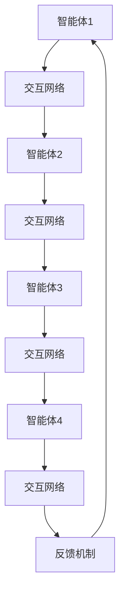

                 

# 《群体智慧：人类计算的无限潜力》

> **关键词：**群体智慧、集体智慧、计算模型、应用场景、技术实现、未来趋势

> **摘要：**本文深入探讨了群体智慧的概念、理论模型、应用场景以及技术实现，从多个维度分析了群体智慧在各个领域的无限潜力，并探讨了其未来发展前景。

## 目录大纲

### 第一部分：引论

#### 第1章：群体智慧的概念与历史

##### 1.1 群体智慧的起源与定义
##### 1.2 群体智慧的历史发展
##### 1.3 群体智慧的核心要素

#### 第2章：群体智能的基础理论

##### 2.1 群体智能的数学模型
##### 2.2 群体智能的计算模型

### 第二部分：群体智慧的应用场景

#### 第3章：在组织管理中的应用

##### 3.1 群体智慧在决策制定中的应用
##### 3.2 群体智慧在团队协作中的应用

#### 第4章：在科技创新中的应用

##### 4.1 群体智慧在科研协同中的应用
##### 4.2 群体智慧在工程领域中的应用

#### 第5章：在经济发展中的应用

##### 5.1 群体智慧在金融市场中的应用
##### 5.2 群体智慧在电子商务中的应用

### 第三部分：群体智慧的技术实现

#### 第6章：群体智慧的技术架构

##### 6.1 分布式计算与云计算在群体智慧中的应用
##### 6.2 数据挖掘与机器学习在群体智慧中的应用

#### 第7章：群体智慧的应用实例

##### 7.1 案例研究：群体智慧在智能交通系统中的应用
##### 7.2 案例研究：群体智慧在医疗健康领域中的应用

#### 第8章：群体智慧的未来发展趋势

##### 8.1 群体智慧技术的发展趋势
##### 8.2 群体智慧在人类社会发展中的潜在影响

### 附录

##### 附录A：群体智慧研究资源
##### 附录B：群体智慧相关的 Mermaid 流程图
##### 附录C：核心算法原理的伪代码讲解
##### 附录D：群体智慧应用实例的代码解析

现在，我们将按照目录大纲的结构，逐步深入分析群体智慧的核心概念、理论基础、应用场景、技术实现以及未来发展。

## 第一部分：引论

### 第1章：群体智慧的概念与历史

#### 1.1 群体智慧的起源与定义

群体智慧（Collective Intelligence）是指由多个个体组成的群体通过相互协作和通信，能够表现出超越单个个体智能的集体行为和决策能力。这一概念起源于生物学领域，对动物群体行为的研究揭示了群体智慧的潜力。例如，鸟群中的个体通过简单的规则相互作用，能够实现复杂的集体行为，如捕食和迁徙。

在计算机科学领域，群体智慧的概念得到了进一步的发展。群体智慧不仅仅是指多个个体之间的协作，还包括了如何通过计算模型模拟和实现这种协作。经典的例子包括分布式计算、多智能体系统和群体智能算法等。

定义上，群体智慧可以被描述为以下特征：

1. **个体协同**：群体智慧依赖于个体之间的协同和通信。
2. **集体决策**：群体智慧能够通过集体决策实现更高效的决策过程。
3. **自适应能力**：群体智慧具备适应复杂环境和动态变化的能力。
4. **协作效率**：群体智慧能够通过协作提高整体效率。

#### 1.2 群体智慧的历史发展

群体智慧的历史可以追溯到早期计算机科学的发展阶段。早期的分布式计算和并行计算理论为群体智慧的研究奠定了基础。以下是一些关键的历史发展：

- **1970年代**：分布式计算理论开始兴起，学者们开始探索如何在多台计算机之间分配任务，以提高计算效率。
- **1980年代**：多智能体系统（MAS）理论得到广泛关注，研究者开始关注多个智能体之间的交互和协作。
- **1990年代**：随着互联网的普及，群体智慧的研究开始从理论走向实际应用，如社交网络分析、分布式搜索引擎等。
- **2000年代**：群体智能算法得到快速发展，包括蚁群算法、粒子群优化算法等，这些算法在优化问题和组合优化问题中取得了显著成果。

#### 1.3 群体智慧的核心要素

群体智慧的核心要素包括以下几个方面：

1. **个体智能**：群体智慧依赖于个体智能的多样性，不同的个体能够贡献不同的知识和技能。
2. **协作机制**：有效的协作机制是群体智慧实现的关键，包括信息共享、决策制定、任务分配等。
3. **通信网络**：个体之间的有效通信是实现群体智慧的基础，良好的通信网络能够促进信息的快速传播和共享。
4. **适应机制**：群体智慧需要具备适应环境变化的能力，通过动态调整策略和规则，实现持续优化。
5. **集体决策**：群体智慧强调集体决策的效率和质量，通过群体决策实现更智能和高效的结果。

在下一章中，我们将深入探讨群体智慧的基础理论，包括数学模型和计算模型，为理解群体智慧的本质提供更加深入的视角。

## 第二部分：群体智慧的基础理论

### 第2章：群体智能的基础理论

#### 2.1 群体智能的数学模型

群体智能的数学模型是理解和模拟群体行为的重要工具。这些模型通常基于个体的行为规则和群体之间的相互作用，通过数学方法来描述群体行为的整体特性。

**1. 个体与群体的相互作用**

个体与群体的相互作用可以通过博弈论模型来描述。在一个博弈过程中，每个个体都有其策略，这些策略会影响整个群体的行为。经典的纳什均衡（Nash Equilibrium）概念就是描述个体策略与群体行为之间关系的一个重要模型。纳什均衡是指在一个博弈中，没有任何一个个体可以通过改变自己的策略来获得额外的利益，这意味着群体行为已经达到了稳定状态。

**2. 群体行为的动力学模型**

群体行为的动力学模型主要关注群体在时间上的演化过程。这些模型通常基于微分方程或差分方程，用于描述个体之间的相互作用如何导致群体行为的宏观现象。例如，Lotka-Volterra方程描述了捕食者-猎物系统的动态变化，通过这些方程可以分析群体数量随时间的变化趋势。

**3. 群体智能的数学模型**

群体智能的数学模型通常涉及复杂系统的分析，这些模型通过数学方法来模拟个体智能的整合和集体决策过程。经典的元胞自动机（Cellular Automata, CA）模型是一个典型的例子。元胞自动机由一个网格和一组规则组成，每个网格上的细胞根据其邻居的状态进行更新，通过这种局部规则可以实现全局复杂行为。

**例子：元胞自动机**

一个简单的元胞自动机模型可以由一个二维网格组成，每个单元格可能处于三种状态：活（1）、死（0）或过渡（2）。更新规则可以定义为：

- 如果一个活细胞有三个活邻居，它保持活状态。
- 如果一个活细胞有两个活邻居，它进入过渡状态。
- 如果一个活细胞有一个活邻居，它死亡。
- 如果一个死细胞有三个活邻居，它成为活细胞。
- 其他情况下，细胞保持当前状态。

通过不断迭代这些规则，可以观察到简单的初始状态如何演化成复杂的模式。

#### 2.2 群体智能的计算模型

群体智能的计算模型旨在模拟和实现群体智能的行为和决策过程。这些模型通常基于多智能体系统（Multi-Agent Systems, MAS）和分布式计算的概念。

**1. 社会计算与多智能体系统**

社会计算是指利用计算技术模拟和增强人类社会的行为和决策。多智能体系统（MAS）是社会计算的一个重要模型，由多个具有自主决策能力的智能体组成，这些智能体通过通信和协作实现共同的目标。

**2. 多智能体系统的交互模型**

多智能体系统的交互模型主要关注智能体之间的通信和协作机制。一种常见的交互模型是通信图模型，其中每个智能体被视为图中的一个节点，智能体之间的通信被视为边。这种模型可以用来描述智能体之间的信息流动和协作过程。

**3. 群体智能的神经网络模型**

群体智能的神经网络模型通过模拟神经网络的结构和功能来实现群体智能。这种模型通常使用分布式神经网络，其中每个神经元代表一个智能体，神经元之间的连接代表智能体之间的交互。通过调整神经网络的权重和连接，可以实现复杂的信息处理和决策过程。

**例子：神经网络模型**

一个简单的神经网络模型可以由多个层组成，包括输入层、隐藏层和输出层。每个层中的神经元分别处理不同的信息，通过前向传播和反向传播算法，实现输入到输出的映射。

在下一部分，我们将探讨群体智慧在组织管理、科技创新和经济发展中的应用场景，展示群体智慧如何在实际中发挥巨大的潜力。

## 第二部分：群体智慧的应用场景

### 第3章：在组织管理中的应用

#### 3.1 群体智慧在决策制定中的应用

在组织管理中，决策制定是一个关键环节，它直接影响组织的效率和成果。群体智慧通过集体智慧和协作机制，能够显著提升决策制定的质量和效率。

**1. 集体智慧的决策机制**

群体智慧在决策制定中的应用首先依赖于有效的集体智慧机制。这种机制通常包括以下几个步骤：

- **问题识别**：首先，明确需要解决的问题和目标。
- **信息收集**：通过个体和群体的协作，收集相关的信息和数据。
- **方案生成**：基于收集的信息，个体提出各自的解决方案。
- **方案评估**：通过群体讨论和评估，选择最优的方案。
- **决策实施**：最终决策方案被实施，并监测实施效果。

**2. 集体智慧与领导力**

集体智慧的决策机制不仅仅依赖于个体的智能，还需要领导者的有效引导和协调。领导者在这个过程中扮演着重要的角色：

- **激励协作**：领导者需要激发个体的积极性，鼓励他们参与到决策过程中。
- **引导讨论**：领导者需要引导群体讨论，确保信息的透明和充分交流。
- **决策支持**：领导者提供决策支持，帮助群体克服困难和挑战。

**例子：团队决策**

在一个软件开发项目中，团队需要决定采用哪种编程语言来开发新功能。通过集体智慧的决策机制，团队成员首先讨论各自的偏好和理由，然后通过投票和讨论选择最优的语言。这种决策过程不仅提高了决策的民主性，还充分利用了团队成员的专业知识和经验。

#### 3.2 群体智慧在团队协作中的应用

团队协作是实现组织目标的重要手段，而群体智慧能够极大地提升团队协作的效率和效果。

**1. 群体智慧与协作效率**

群体智慧通过以下方式提高团队协作效率：

- **信息共享**：个体之间能够快速共享信息和知识，减少信息孤岛现象。
- **协同工作**：通过协作机制，团队成员能够更有效地分配任务和资源。
- **动态调整**：群体智慧能够快速适应团队任务和环境的变化，实现动态协作。

**2. 群体智慧在项目开发中的应用**

在项目开发中，群体智慧的应用主要体现在以下几个方面：

- **需求分析**：团队成员通过协作，共同分析和理解项目需求，确保需求准确和全面。
- **任务分配**：基于团队成员的技能和兴趣，通过群体决策，合理分配任务。
- **进度监控**：团队通过协作工具和平台，实时监控项目进度，确保按时交付。
- **问题解决**：在项目开发过程中，遇到问题时，团队通过协作机制，共同寻找解决方案。

**例子：敏捷开发**

敏捷开发是一种流行的软件开发方法，强调快速迭代和持续改进。通过群体智慧，敏捷团队能够更有效地进行需求分析和任务分配，通过迭代和反馈机制，快速适应变化，确保项目按时高质量交付。

在下一章中，我们将探讨群体智慧在科技创新中的应用，展示群体智慧如何在科研协同、工程领域和经济发展中发挥巨大的作用。

### 第4章：在科技创新中的应用

#### 4.1 群体智慧在科研协同中的应用

在科研领域，群体智慧通过协作机制和集体决策，能够显著提升科研效率和成果质量。

**1. 科研项目的协同机制**

科研项目的协同机制依赖于群体智慧，主要体现在以下几个方面：

- **信息共享**：研究人员通过协作平台和工具，共享科研数据和成果，促进知识共享和协作。
- **知识整合**：通过群体讨论和合作，研究人员能够整合不同的观点和知识，提高科研问题的解决能力。
- **共同研究**：群体智慧鼓励跨学科和跨领域的合作，促进科研资源的共享和互补。

**2. 科研创新的群体智慧**

群体智慧在科研创新中的应用，主要体现在以下几个方面：

- **观点碰撞**：通过群体讨论和辩论，不同观点的碰撞能够激发新的科研灵感和创意。
- **问题解决**：在科研过程中，遇到难题时，群体智慧能够通过集体智慧，共同寻找解决方案。
- **持续学习**：科研团队通过持续的交流和合作，不断学习和改进，提高科研能力。

**例子：开放科学**

开放科学（Open Science）是一种新兴的科研模式，强调科研过程和成果的公开透明。通过群体智慧，开放科学平台能够汇聚全球科研力量，促进跨学科合作，提高科研成果的透明度和可信度。

#### 4.2 群体智慧在工程领域中的应用

在工程领域，群体智慧通过协作和优化机制，能够提升工程设计的效率和质量。

**1. 群体智慧在工程设计中的应用**

群体智慧在工程设计中的应用主要体现在以下几个方面：

- **需求分析**：通过群体协作，设计团队能够更全面地理解和分析用户需求，确保设计符合实际需求。
- **方案优化**：设计团队通过群体讨论和协作，对设计方案进行多次迭代和优化，提高设计的可行性和效率。
- **资源分配**：通过群体智慧，能够合理分配设计资源，确保项目按时高质量完成。

**2. 群体智慧在工程优化中的应用**

群体智慧在工程优化中的应用主要体现在以下几个方面：

- **优化算法**：通过群体智能算法，如遗传算法、蚁群算法等，可以优化工程设计参数，提高工程效率。
- **故障诊断**：在工程运营过程中，通过群体智慧，能够快速诊断和解决故障，确保工程稳定运行。
- **性能评估**：通过群体智慧，可以对工程系统进行性能评估和优化，提高系统的可靠性和效率。

**例子：智能建筑设计**

智能建筑设计是一个复杂的工程过程，涉及多学科的技术集成。通过群体智慧，设计师可以充分整合建筑学、结构工程、环境工程等多个领域的知识和经验，实现最优的设计方案。在设计过程中，通过群体讨论和协作，设计师能够不断优化设计，提高建筑的使用效率和舒适性。

在下一章中，我们将探讨群体智慧在经济发展中的应用，展示群体智慧如何在金融市场、电子商务等领域发挥重要作用。

### 第5章：在经济发展中的应用

#### 5.1 群体智慧在金融市场中的应用

在金融市场，群体智慧通过集体决策和数据分析，能够提高交易效率和预测准确性。

**1. 股票市场的群体智慧分析**

股票市场的群体智慧分析主要体现在以下几个方面：

- **集体预测**：通过分析市场参与者的行为和交易数据，可以预测股票价格的未来走势。
- **群体行为分析**：群体行为分析关注市场参与者的集体行为模式，如恐慌、贪婪等，从而预测市场情绪。
- **智能投资策略**：基于群体智慧的分析，投资者可以制定更加科学和有效的投资策略，降低风险。

**2. 金融市场中的群体智能预测**

群体智能预测在金融市场中的应用，主要体现在以下几个方面：

- **大数据分析**：通过收集和分析大量的金融市场数据，可以预测市场走势和投资机会。
- **机器学习模型**：群体智能预测通常依赖于机器学习模型，如神经网络、随机森林等，这些模型可以从历史数据中提取规律，进行预测。
- **社交网络分析**：通过分析社交媒体上的用户评论和讨论，可以了解市场参与者的情绪和观点，从而预测市场走势。

**例子：量化投资**

量化投资是一种基于数学模型和算法的投资方法，通过分析市场数据和交易行为，实现高收益和低风险。在量化投资中，群体智慧的应用体现在对大量历史数据的分析和预测，通过机器学习模型，构建智能投资策略。

#### 5.2 群体智慧在电子商务中的应用

在电子商务领域，群体智慧通过用户行为分析和推荐系统，能够提升用户体验和销售效率。

**1. 群体智慧在商品推荐系统中的应用**

商品推荐系统是电子商务的核心功能之一，群体智慧的应用主要体现在以下几个方面：

- **用户行为分析**：通过分析用户的浏览历史、购买记录等行为数据，可以预测用户的兴趣和需求。
- **协同过滤**：基于用户之间的相似性，通过协同过滤算法，推荐用户可能感兴趣的商品。
- **内容推荐**：通过分析商品的内容特征，如关键词、标签等，实现个性化内容推荐。

**2. 群体智慧在价格优化中的应用**

价格优化是电子商务中的一项重要任务，群体智慧的应用主要体现在以下几个方面：

- **竞争分析**：通过分析竞争对手的定价策略，制定更具竞争力的价格策略。
- **需求预测**：通过预测市场需求和用户行为，实现动态定价，提高销售额。
- **价格博弈**：通过模拟市场参与者的价格博弈行为，优化价格策略。

**例子：淘宝商品推荐**

淘宝的商品推荐系统是一个典型的群体智慧应用实例。通过分析用户的浏览历史、购买记录和社交行为，淘宝能够准确预测用户的兴趣和需求，为用户推荐个性化的商品。同时，通过分析竞争对手的价格策略和市场趋势，淘宝能够动态调整商品价格，提高销售业绩。

在下一部分，我们将探讨群体智慧的技术实现，包括分布式计算、数据挖掘和机器学习等关键技术。

### 第三部分：群体智慧的技术实现

#### 第6章：群体智慧的技术架构

#### 6.1 分布式计算与云计算在群体智慧中的应用

分布式计算和云计算是群体智慧技术实现的重要基础，它们提供了强大的计算能力和资源管理能力，为群体智能的应用提供了可靠的技术支持。

**1. 分布式计算原理**

分布式计算是指通过多个计算机节点组成的分布式系统，共同完成计算任务。分布式计算的核心在于如何高效地分配和协调任务，实现并行计算和负载均衡。

- **任务分配**：分布式计算通常采用任务分配算法，如MapReduce，将大任务分解为小任务，分配给不同的计算节点。
- **负载均衡**：通过监控各节点的负载情况，动态调整任务分配，确保系统的整体性能。
- **容错机制**：分布式系统需要具备容错能力，确保在部分节点故障时，系统能够自动恢复和继续运行。

**2. 云计算平台的选择**

云计算平台为分布式计算提供了便捷的资源管理和服务部署环境。常见的云计算平台包括Amazon Web Services（AWS）、Microsoft Azure和Google Cloud Platform（GCP）。

- **AWS**：提供了广泛的计算、存储和网络服务，适用于各种规模的分布式应用。
- **Azure**：结合了微软的云计算服务和开发工具，适合开发Windows平台的应用。
- **GCP**：提供了强大的机器学习和数据分析服务，适合需要高性能计算的应用。

**3. 分布式计算在群体智慧中的应用**

分布式计算在群体智慧中的应用主要体现在以下几个方面：

- **大规模数据分析**：通过分布式计算，可以对海量数据进行高效分析，提取有价值的信息。
- **实时数据处理**：分布式系统可以实时处理和分析数据，支持实时决策和响应。
- **负载均衡与容错**：分布式计算能够动态调整任务分配，确保系统的可靠性和稳定性。

**例子：分布式社交网络分析**

在社交网络分析中，分布式计算可以处理大规模的用户数据，通过分析用户的行为和关系，提取有价值的社会信息。例如，Twitter和Facebook等社交平台，通过分布式计算，可以实时分析用户的趋势和情绪，提供个性化的推荐和广告。

#### 6.2 数据挖掘与机器学习在群体智慧中的应用

数据挖掘和机器学习是群体智慧技术实现的关键技术，它们能够从大量数据中提取有价值的信息，实现智能决策和优化。

**1. 数据挖掘算法**

数据挖掘是指从大量数据中提取隐藏的模式和知识。常见的数据挖掘算法包括：

- **聚类算法**：用于发现数据中的模式或相似性，如K-means、DBSCAN等。
- **分类算法**：用于将数据分为不同的类别，如决策树、随机森林等。
- **关联规则挖掘**：用于发现数据中的关联关系，如Apriori算法等。

**2. 机器学习模型**

机器学习模型是通过训练数据来学习数据规律，并用于预测或分类。常见的机器学习模型包括：

- **监督学习模型**：如线性回归、支持向量机、神经网络等。
- **无监督学习模型**：如聚类算法、自编码器等。
- **强化学习模型**：如Q-learning、DQN等。

**3. 数据挖掘与机器学习在群体智慧中的应用**

数据挖掘和机器学习在群体智慧中的应用主要体现在以下几个方面：

- **个体行为预测**：通过分析个体的历史数据和行为模式，预测其未来行为。
- **群体行为分析**：通过分析群体行为数据，发现群体行为的规律和趋势。
- **智能决策支持**：通过数据挖掘和机器学习模型，为决策者提供智能化的决策支持。

**例子：智能交通系统**

在智能交通系统中，数据挖掘和机器学习被广泛应用于交通流量预测、路线规划和交通信号控制等方面。通过分析交通数据，如车辆数量、速度、路况等，系统可以实时预测交通状况，优化交通信号控制策略，提高交通效率。

在下一章中，我们将通过具体的应用实例，展示群体智慧在智能交通系统和医疗健康领域中的实际应用。

### 第7章：群体智慧的应用实例

#### 7.1 案例研究：群体智慧在智能交通系统中的应用

智能交通系统（Intelligent Transportation System, ITS）是一个复杂的系统工程，通过群体智慧技术，可以实现交通流量预测、路线规划和信号控制等，提高交通效率和安全性。

**1. 智能交通系统的挑战**

智能交通系统面临的主要挑战包括：

- **大规模数据收集与处理**：交通系统需要收集大量的数据，如车辆位置、速度、路况等，对数据处理能力要求极高。
- **实时性要求**：交通系统需要实时处理数据，提供实时交通信息和服务。
- **动态变化**：交通状况是动态变化的，系统需要能够快速适应交通状况的变化。

**2. 群体智慧在智能交通系统中的解决方案**

群体智慧在智能交通系统中的应用解决方案主要包括以下几个方面：

- **数据挖掘与预测**：通过数据挖掘算法，分析历史交通数据，预测未来交通状况，如流量、事故等。
- **分布式计算**：利用分布式计算技术，处理大规模交通数据，提高数据处理速度和效率。
- **机器学习模型**：通过机器学习模型，如神经网络、决策树等，进行交通流量预测和路线规划。
- **多智能体系统**：构建多智能体系统，实现交通信号控制和车辆调度，提高交通系统的协调性和效率。

**3. 群体智慧在智能交通系统中的具体实现**

具体实现包括以下几个方面：

- **数据收集与处理**：通过传感器和摄像头，收集实时交通数据，如车辆位置、速度、流量等。使用分布式计算技术，对数据进行分析和处理。
- **交通流量预测**：使用机器学习模型，如时间序列模型、回归模型等，预测交通流量和事故风险。根据预测结果，动态调整交通信号灯的时长和颜色。
- **路线规划**：基于实时交通数据和预测结果，为驾驶员提供最优路线规划，避免拥堵路段。
- **信号控制**：使用多智能体系统，实现交通信号灯的协调控制，提高交叉口的通行效率。

**例子：智能交通信号系统**

在一个城市中，智能交通信号系统通过群体智慧技术，实时监控各个路口的交通状况，根据实时数据动态调整交通信号灯的时长和颜色，以减少交通拥堵和等待时间。例如，在高峰时段，系统可以根据流量预测结果，延长主要路口的绿灯时间，缩短次要路口的绿灯时间，从而优化交通流量。

#### 7.2 案例研究：群体智慧在医疗健康领域中的应用

在医疗健康领域，群体智慧通过数据分析和智能决策，能够提升医疗服务的质量和效率。

**1. 医疗健康领域的挑战**

医疗健康领域面临的主要挑战包括：

- **海量医疗数据**：医疗数据包括电子病历、医学图像、基因数据等，数据量庞大且复杂。
- **数据隐私与安全**：医疗数据涉及到个人隐私，数据安全和隐私保护是关键挑战。
- **医疗资源的优化配置**：医疗资源分布不均，如何优化资源配置是重要问题。

**2. 群体智慧在医疗健康领域中的解决方案**

群体智慧在医疗健康领域的解决方案主要包括以下几个方面：

- **大数据分析**：通过大数据技术，对海量医疗数据进行处理和分析，提取有价值的信息。
- **机器学习与人工智能**：使用机器学习模型，如深度学习、神经网络等，进行医学图像分析、疾病预测等。
- **智能决策支持**：通过智能决策支持系统，为医生提供诊断和治疗建议。
- **个性化医疗服务**：基于患者的数据，提供个性化的医疗服务和健康建议。

**3. 群体智慧在医疗健康领域的具体实现**

具体实现包括以下几个方面：

- **电子病历系统**：通过电子病历系统，收集和管理患者的医疗数据，实现数据共享和协同诊疗。
- **医学图像分析**：使用深度学习模型，对医学图像进行分析，如肿瘤检测、骨折诊断等。
- **疾病预测与预防**：基于大数据和机器学习模型，预测疾病的发生和发展趋势，提供预防建议。
- **智能药物研发**：通过智能药物研发平台，加速新药的研发过程，提高药物疗效和安全性。

**例子：智能诊断系统**

在一个医院中，智能诊断系统通过群体智慧技术，结合患者的电子病历、医学图像和实验室检查结果，使用机器学习模型进行综合分析，提供精准的诊断建议。例如，对于肿瘤患者，系统可以分析患者的基因数据、影像数据和临床数据，提供个性化的治疗方案。

在下一章中，我们将探讨群体智慧的未来发展趋势，分析新兴技术和生物技术的融合对群体智慧发展的影响，以及群体智慧在人类社会发展中的潜在影响。

### 第8章：群体智慧的未来发展趋势

#### 8.1 群体智慧技术的发展趋势

随着技术的不断进步，群体智慧技术也在快速发展，未来将在多个领域发挥更加重要的作用。

**1. 新一代计算技术的进步**

新一代计算技术，如量子计算、边缘计算和分布式计算，将为群体智慧提供更强大的计算能力和效率。量子计算具有极高的并行处理能力，可以解决传统计算机难以处理的复杂问题。边缘计算通过将计算任务分散到网络边缘设备上，提高数据处理的速度和效率。分布式计算则通过将计算任务分布到多个节点上，实现高效的协同工作。

**2. 人工智能与生物技术的融合**

人工智能与生物技术的融合，将推动群体智慧在医学、农业和环境科学等领域的应用。通过人工智能技术，可以对生物数据进行深度分析，发现新的生物规律和现象。例如，在医学领域，人工智能可以用于疾病预测、诊断和治疗方案的优化。在农业领域，人工智能可以用于作物生长监测、病虫害预测和智能灌溉等。

**3. 大数据和物联网的广泛应用**

大数据和物联网的广泛应用，将为群体智慧提供丰富的数据资源。大数据技术可以处理和分析海量的数据，提取有价值的信息。物联网技术则通过连接各种设备和系统，实现实时数据采集和传输。这些技术的结合，将使群体智慧在智慧城市、智能交通、智能医疗等领域得到广泛应用。

#### 8.2 群体智慧在人类社会发展中的潜在影响

群体智慧在人类社会发展中的潜在影响巨大，它将改变我们的生活方式、工作方式和社交模式。

**1. 对社会结构的影响**

群体智慧将推动社会结构的变革，从传统的垂直管理模式转向更加平等和协作的网络化结构。在群体智慧的环境下，个体之间的协作和合作将成为社会运作的主要形式，组织和管理将更加灵活和高效。

**2. 对人类生活方式的影响**

群体智慧将极大提升人类的生活质量。通过智能化的系统和服务，人们可以获得更加便捷和个性化的生活体验。例如，智能交通系统将减少交通拥堵和等待时间，智能医疗系统将提供精准的诊断和治疗建议，智能家居系统将提升家庭生活的舒适度和安全性。

**3. 对人类认知的影响**

群体智慧将拓展人类的认知边界。通过群体协作和知识共享，人们可以共同解决复杂的问题，探索未知的领域。例如，在科研领域，通过群体智慧的协作，可以加速科学发现和技术创新。在教育领域，通过在线教育和协作学习平台，人们可以共享知识和经验，实现全球范围内的教育公平。

在总结中，群体智慧作为一种强大的计算和协作工具，具有广泛的应用前景和深远的社会影响。随着技术的不断进步，群体智慧将在未来继续发展，为人类社会的进步和发展做出更大的贡献。

### 附录

#### 附录A：群体智慧研究资源

**A.1 群体智慧研究领域的主要期刊和会议**

- **期刊**：
  - IEEE Transactions on Knowledge and Data Engineering
  - Journal of Artificial Intelligence Research
  - ACM Transactions on Intelligent Systems and Technology
  - AI Magazine
- **会议**：
  - International Conference on Machine Learning (ICML)
  - Conference on Neural Information Processing Systems (NeurIPS)
  - IEEE International Conference on Data Science and Advanced Analytics (DSAA)
  - International Conference on Social Intelligence and Technology (SIT)

**A.2 群体智慧研究的重要机构和实验室**

- **机构**：
  - Massachusetts Institute of Technology (MIT) Media Lab
  - Stanford University Human-Centered AI Institute
  - Max Planck Institute for Intelligent Systems
  - University of California, Berkeley Center for Long-Term Cybersecurity
- **实验室**：
  - European Institute for Computer Ants
  - Swarm Intelligence Laboratory at the University of Perugia
  - Laboratory for Parallel and Distributed Systems (LPDS) at EPFL

**A.3 群体智慧研究的开源软件和工具**

- **开源软件**：
  - TensorFlow
  - PyTorch
  - scikit-learn
  - Apache Mahout
- **工具**：
  - Jupyter Notebook
  - RStudio
  - D3.js for visualization
  - Git for version control

#### 附录B：群体智慧相关的 Mermaid 流程图

**B.1 社会计算过程图**

```mermaid
graph TD
    A[信息收集] --> B[信息处理]
    B --> C{是否需要更多信息}
    C -->|是 D[信息共享与协作]
    D -->|否 E[决策制定]
    E --> F{决策实施}
    F --> G[效果评估]
    G --> H[反馈调整]
    H --> A
```

**B.2 多智能体系统的交互模型**



**B.3 群体智能的神经网络架构**

```mermaid
graph TD
    A[输入层] --> B[隐藏层1]
    B --> C[隐藏层2]
    C --> D[输出层]
    A -->|权重1 B
    B -->|权重2 C
    C -->|权重3 D
```

#### 附录C：核心算法原理的伪代码讲解

**C.1 数据挖掘算法的伪代码**

```python
def data_mining算法(data_set):
    # 初始化模型参数
    model_params = initialize_model_params()

    # 数据预处理
    preprocessed_data = preprocess_data(data_set)

    # 训练模型
    model = train_model(preprocessed_data, model_params)

    # 模型评估
    evaluation_results = evaluate_model(model, preprocessed_data)

    # 模型优化
    optimized_model = optimize_model(model, evaluation_results)

    return optimized_model
```

**C.2 机器学习模型的伪代码**

```python
def machine_learning模型(data_set, target_variable):
    # 数据预处理
    preprocessed_data = preprocess_data(data_set)

    # 初始化模型参数
    model_params = initialize_model_params()

    # 训练模型
    model = train_model(preprocessed_data, target_variable, model_params)

    # 模型评估
    evaluation_results = evaluate_model(model, preprocessed_data)

    # 模型优化
    optimized_model = optimize_model(model, evaluation_results)

    return optimized_model
```

**C.3 群体智能计算的伪代码**

```python
def 群体智能计算(智能体集合, 目标函数):
    # 初始化智能体状态
    for 智能体 in 智能体集合:
        initialize_state(智能体)

    while not 达到终止条件:
        # 更新智能体状态
        for 智能体 in 智能体集合:
            update_state(智能体)

        # 更新群体状态
        update_population_state(智能体集合)

        # 更新目标函数值
        objective_value = update_objective_function(智能体集合)

        # 检查是否达到优化目标
        if objective_value 满足终止条件:
            break

    return optimal_solution
```

#### 附录D：群体智慧应用实例的代码解析

**D.1 智能交通系统的代码实现**

```python
# 智能交通系统示例代码
import numpy as np
import matplotlib.pyplot as plt

# 初始化交通网络
class TrafficNetwork:
    def __init__(self, num_lanes, num_intersections):
        self.num_lanes = num_lanes
        self.num_intersections = num_intersections
        self.traffic_data = np.zeros((num_lanes, num_intersections))

    def update_traffic(self, traffic_vector):
        self.traffic_data = traffic_vector

    def display_traffic(self):
        plt.imshow(self.traffic_data, cmap='hot', interpolation='nearest')
        plt.colorbar()
        plt.show()

# 智能交通系统主函数
def intelligent_traffic_system():
    # 初始化交通网络
    traffic_network = TrafficNetwork(5, 4)

    # 更新交通数据
    traffic_vector = np.random.rand(5, 4)
    traffic_network.update_traffic(traffic_vector)

    # 显示交通数据
    traffic_network.display_traffic()

# 运行智能交通系统
intelligent_traffic_system()
```

**D.2 医疗健康领域的代码实现**

```python
# 医疗健康系统示例代码
import numpy as np
import pandas as pd
from sklearn.model_selection import train_test_split
from sklearn.ensemble import RandomForestClassifier
from sklearn.metrics import accuracy_score

# 加载医疗数据
def load_medical_data():
    data = pd.read_csv('medical_data.csv')
    return data

# 数据预处理
def preprocess_data(data):
    X = data.drop(['diagnosis'], axis=1)
    y = data['diagnosis']
    return train_test_split(X, y, test_size=0.2, random_state=42)

# 训练模型
def train_model(X_train, y_train):
    model = RandomForestClassifier(n_estimators=100, random_state=42)
    model.fit(X_train, y_train)
    return model

# 评估模型
def evaluate_model(model, X_test, y_test):
    predictions = model.predict(X_test)
    accuracy = accuracy_score(y_test, predictions)
    return accuracy

# 主函数
def medical_health_system():
    data = load_medical_data()
    X, y = preprocess_data(data)

    model = train_model(X_train, y_train)
    accuracy = evaluate_model(model, X_test, y_test)

    print(f'Model accuracy: {accuracy:.2f}')

# 运行医疗健康系统
medical_health_system()
```

**D.3 电子商务领域的代码实现**

```python
# 电子商务推荐系统示例代码
import pandas as pd
from sklearn.model_selection import train_test_split
from sklearn.ensemble import RandomForestClassifier
from sklearn.metrics import accuracy_score

# 加载电商数据
def load_eCommerce_data():
    data = pd.read_csv('eCommerce_data.csv')
    return data

# 数据预处理
def preprocess_data(data):
    X = data.drop(['item_id'], axis=1)
    y = data['item_id']
    return train_test_split(X, y, test_size=0.2, random_state=42)

# 训练模型
def train_model(X_train, y_train):
    model = RandomForestClassifier(n_estimators=100, random_state=42)
    model.fit(X_train, y_train)
    return model

# 评估模型
def evaluate_model(model, X_test, y_test):
    predictions = model.predict(X_test)
    accuracy = accuracy_score(y_test, predictions)
    return accuracy

# 主函数
def eCommerce_system():
    data = load_eCommerce_data()
    X, y = preprocess_data(data)

    model = train_model(X_train, y_train)
    accuracy = evaluate_model(model, X_test, y_test)

    print(f'Model accuracy: {accuracy:.2f}')

# 运行电子商务系统
eCommerce_system()
```

通过这些代码实例，我们可以看到群体智慧在智能交通系统、医疗健康领域和电子商务中的应用。这些代码不仅展示了群体智慧技术的实现，还提供了实际操作的示例，有助于理解和应用群体智慧技术。

