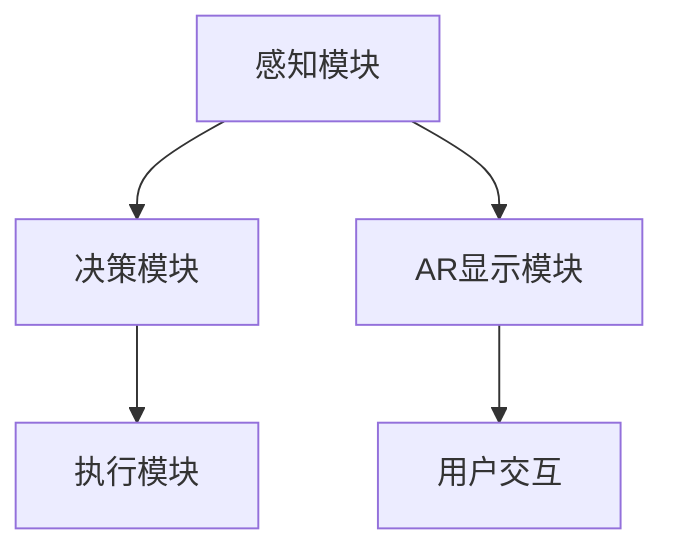

                 

### 《自动驾驶中的增强现实辅助驾驶技术》

#### 关键词：自动驾驶，增强现实，辅助驾驶，AR技术，感知算法，决策算法，开发环境，项目实战

##### 摘要：
随着自动驾驶技术的迅速发展，增强现实（AR）辅助驾驶技术作为一种前沿的辅助手段，正逐步进入公众视野。本文将深入探讨增强现实辅助驾驶技术的核心概念、基础原理、核心算法及其实际应用，旨在为读者提供一个全面的视角，理解这一跨学科技术的潜力和前景。

### 目录大纲

1. **第一部分：增强现实辅助驾驶技术基础**
   - 第1章：增强现实与自动驾驶概述
     - 1.1.1 增强现实技术的基本概念
     - 1.1.2 自动驾驶技术的演进历程
     - 1.1.3 增强现实在自动驾驶中的应用前景
   - 第2章：增强现实技术基础
     - 2.1 增强现实的基本原理
     - 2.2 增强现实的显示技术
     - 2.3 增强现实的内容制作与交互
   - 第3章：自动驾驶技术基础
     - 3.1 自动驾驶系统的架构
     - 3.2 自动驾驶感知技术
     - 3.3 自动驾驶决策与控制技术
   - 第4章：增强现实辅助驾驶技术的核心概念与联系
     - 4.1 增强现实与自动驾驶的融合
     - 4.2 增强现实辅助驾驶的架构与功能
     - 4.3 增强现实辅助驾驶中的 Mermaid 流程图

2. **第二部分：增强现实辅助驾驶技术的核心算法原理**
   - 第5章：增强现实图像处理算法
     - 5.1 增强现实图像处理的预处理技术
     - 5.2 增强现实图像的特征提取
     - 5.3 增强现实图像的融合与增强
   - 第6章：自动驾驶感知算法
     - 6.1 自动驾驶感知算法的基本原理
     - 6.2 深度学习在自动驾驶感知中的应用
     - 6.3 自动驾驶感知算法的伪代码讲解
   - 第7章：增强现实辅助驾驶决策算法
     - 7.1 增强现实辅助驾驶决策的基本原理
     - 7.2 强化学习在辅助驾驶决策中的应用
     - 7.3 决策算法的伪代码讲解

3. **第三部分：增强现实辅助驾驶技术的应用与开发**
   - 第8章：增强现实辅助驾驶系统开发环境搭建
     - 8.1 开发环境的选择与配置
     - 8.2 开发工具与库的使用
     - 8.3 常见问题的解决方法
   - 第9章：增强现实辅助驾驶项目实战
     - 9.1 项目概述与目标
     - 9.2 项目开发流程
     - 9.3 源代码实现与解读
     - 9.4 代码解读与分析
   - 第10章：增强现实辅助驾驶技术的未来展望
     - 10.1 技术发展趋势
     - 10.2 应用前景与挑战
     - 10.3 未来研究方向

4. **附录**
   - 附录A：增强现实与自动驾驶技术相关资源
     - A.1 学术论文与文献
     - A.2 开源代码与工具
     - A.3 行业报告与白皮书

### 正文开始

#### 引言

自动驾驶技术是近年来发展迅速的一项技术，它正在逐步改变我们的出行方式，提升交通效率，减少事故发生率。然而，自动驾驶技术的实现不仅仅依赖于传感器和算法，还需要其他技术的辅助，如增强现实（AR）辅助驾驶技术。AR技术通过虚拟现实和现实世界的融合，提供了一种全新的信息交互方式，为自动驾驶车辆提供了更多的感知和决策信息。

本文将分为三个主要部分，首先介绍增强现实和自动驾驶技术的基础知识，然后深入分析增强现实辅助驾驶技术的核心算法原理，最后探讨其实际应用和未来展望。通过本文的阅读，读者将能够全面了解增强现实辅助驾驶技术的原理、应用和发展趋势。

#### 第一部分：增强现实辅助驾驶技术基础

##### 第1章：增强现实与自动驾驶概述

##### 1.1.1 增强现实技术的基本概念

增强现实（Augmented Reality，AR）是一种将虚拟信息与现实世界融合的技术。通过计算机生成的虚拟信息，叠加到真实世界的画面中，使用户能够直观地看到现实和虚拟信息的结合。这种技术依赖于摄像头、显示器、传感器等多种设备，能够提供实时、交互式的体验。

##### 1.1.2 自动驾驶技术的演进历程

自动驾驶技术从概念提出至今，已经经历了多个阶段的发展。最初，自动驾驶仅限于实验室环境，主要依靠简单的机械传感器。随着计算机技术和传感器技术的进步，自动驾驶逐渐走向实际应用。目前，自动驾驶技术已分为L0至L5六个等级，从辅助驾驶到完全无人驾驶，涵盖了各种应用场景。

##### 1.1.3 增强现实在自动驾驶中的应用前景

增强现实技术为自动驾驶提供了丰富的辅助信息，如道路标识、交通状况、障碍物等。这些信息能够通过AR眼镜或头显直接呈现在驾驶员视野中，提高驾驶安全性。此外，AR技术还能为自动驾驶车辆提供增强的感知能力，如通过实时分析周围环境，辅助车辆做出更准确的决策。

##### 第2章：增强现实技术基础

##### 2.1 增强现实的基本原理

增强现实技术的基本原理主要包括图像识别、虚拟图像生成、图像融合等步骤。首先，通过摄像头捕捉现实世界的图像；然后，利用图像识别算法，提取出关键特征；接着，生成相应的虚拟图像；最后，通过图像融合算法，将虚拟图像叠加到真实世界的画面中。

##### 2.2 增强现实的显示技术

增强现实的显示技术包括直接叠加显示和透视显示。直接叠加显示将虚拟图像直接叠加到屏幕上，用户可以看到现实和虚拟信息的叠加；透视显示则是通过调整屏幕视角，使虚拟信息与真实世界中的物体产生透视效果，更真实地模拟现实场景。

##### 2.3 增强现实的内容制作与交互

增强现实的内容制作需要利用计算机图形学和三维建模技术，生成高质量的虚拟信息。同时，增强现实的交互设计也非常重要，需要考虑用户的交互习惯和使用场景，提供直观、易用的交互方式。

##### 第3章：自动驾驶技术基础

##### 3.1 自动驾驶系统的架构

自动驾驶系统通常包括感知、决策、执行三个主要模块。感知模块通过传感器获取周围环境的信息，包括车辆位置、道路情况、行人动态等；决策模块根据感知信息，生成车辆的行驶策略；执行模块则根据决策结果，控制车辆的运动。

##### 3.2 自动驾驶感知技术

自动驾驶感知技术主要包括视觉感知、雷达感知、激光雷达感知等。视觉感知通过摄像头和图像处理算法，识别道路标识、车辆、行人等；雷达感知利用电磁波反射，测量目标物体的距离和速度；激光雷达则通过发射激光束，测量目标物体的三维坐标。

##### 3.3 自动驾驶决策与控制技术

自动驾驶决策与控制技术主要包括路径规划、障碍物检测、控制策略等。路径规划模块根据车辆的行驶目标和环境信息，生成最优的行驶路径；障碍物检测模块识别并评估潜在的危险情况；控制策略模块根据决策结果，生成车辆的控制指令。

##### 第4章：增强现实辅助驾驶技术的核心概念与联系

##### 4.1 增强现实与自动驾驶的融合

增强现实技术与自动驾驶技术的融合，不仅提高了车辆的感知能力，还增强了驾驶员的决策效率。通过AR技术，车辆能够实时呈现道路信息和障碍物，帮助驾驶员更好地理解和应对复杂的交通状况。

##### 4.2 增强现实辅助驾驶的架构与功能

增强现实辅助驾驶系统通常包括AR显示模块、感知模块、决策模块和执行模块。AR显示模块负责将虚拟信息叠加到驾驶员视野中；感知模块通过传感器获取环境信息；决策模块根据感知信息生成行驶策略；执行模块根据决策结果控制车辆运动。

##### 4.3 增强现实辅助驾驶中的 Mermaid 流程图



#### 第二部分：增强现实辅助驾驶技术的核心算法原理

##### 第5章：增强现实图像处理算法

##### 5.1 增强现实图像处理的预处理技术

增强现实图像处理的预处理技术主要包括图像去噪、图像增强、图像校正等。去噪技术用于去除图像中的噪声，提高图像质量；增强技术用于提高图像的对比度、清晰度等；校正技术则用于纠正图像的几何变形，使其符合真实世界。

##### 5.2 增强现实图像的特征提取

特征提取是增强现实图像处理的核心步骤，用于从图像中提取出有代表性的特征。常用的特征提取方法包括边缘检测、角点检测、纹理特征提取等。这些特征可以用于图像识别、物体检测等任务。

##### 5.3 增强现实图像的融合与增强

增强现实图像的融合与增强技术包括图像配准、图像融合和图像增强等。图像配准用于将虚拟图像与真实图像对齐；图像融合则将虚拟图像与真实图像叠加，生成新的图像；图像增强则用于提高图像的视觉效果。

##### 第6章：自动驾驶感知算法

##### 6.1 自动驾驶感知算法的基本原理

自动驾驶感知算法的基本原理是通过传感器获取环境信息，然后利用图像处理、信号处理等技术，对环境信息进行分析和处理。感知算法的核心任务是检测和识别道路标识、车辆、行人等目标。

##### 6.2 深度学习在自动驾驶感知中的应用

深度学习在自动驾驶感知中的应用非常广泛，如卷积神经网络（CNN）、循环神经网络（RNN）等。CNN能够从图像中提取出有代表性的特征，用于物体检测和识别；RNN则能够处理时间序列数据，用于分析车辆和行人的动态行为。

##### 6.3 自动驾驶感知算法的伪代码讲解

```python
def object_detection(image):
    # 输入图像
    processed_image = preprocess_image(image)
    # 预处理图像
    features = extract_features(processed_image)
    # 提取特征
    labels = classify_objects(features)
    # 分类物体
    return labels
```

##### 第7章：增强现实辅助驾驶决策算法

##### 7.1 增强现实辅助驾驶决策的基本原理

增强现实辅助驾驶决策算法的基本原理是根据感知模块提供的环境信息，生成最优的行驶策略。决策算法需要考虑多种因素，如道路状况、交通流量、车辆动态等，以实现安全、高效的行驶。

##### 7.2 强化学习在辅助驾驶决策中的应用

强化学习（Reinforcement Learning，RL）在辅助驾驶决策中具有广泛的应用。RL算法通过不断尝试和错误，学习最优的决策策略。常用的RL算法包括Q学习、深度Q网络（DQN）等。

##### 7.3 决策算法的伪代码讲解

```python
def decisionmaking(perception_data):
    # 输入感知数据
    state = preprocess_perception_data(perception_data)
    # 预处理感知数据
    action = choose_best_action(state)
    # 选择最优动作
    return action
```

#### 第三部分：增强现实辅助驾驶技术的应用与开发

##### 第8章：增强现实辅助驾驶系统开发环境搭建

##### 8.1 开发环境的选择与配置

开发增强现实辅助驾驶系统需要选择合适的开发环境。常用的开发环境包括ROS（Robot Operating System）、OpenCV、TensorFlow等。开发环境的选择取决于具体的应用需求和技术栈。

##### 8.2 开发工具与库的使用

开发过程中，常用的工具和库包括AR工具包（如ARCore、ARKit）、图像处理库（如OpenCV）、深度学习框架（如TensorFlow、PyTorch）等。这些工具和库提供了丰富的API和功能，方便开发者进行系统集成和功能开发。

##### 8.3 常见问题的解决方法

在开发过程中，开发者可能会遇到各种问题，如传感器数据噪声、图像处理错误、算法效率低下等。针对这些问题，开发者可以采取相应的解决方法，如优化算法、调整参数、改进传感器等。

##### 第9章：增强现实辅助驾驶项目实战

##### 9.1 项目概述与目标

本章节将介绍一个增强现实辅助驾驶项目的实战案例，包括项目概述、目标和技术栈。

##### 9.2 项目开发流程

项目开发流程包括需求分析、系统设计、功能实现、测试和部署等步骤。每个步骤都需要详细规划和执行，确保项目的顺利进行。

##### 9.3 源代码实现与解读

本章节将详细解读项目的源代码，包括关键函数、类和方法的设计和实现。通过代码解读，读者可以了解增强现实辅助驾驶系统的具体实现过程。

##### 9.4 代码解读与分析

代码解读与分析部分将针对项目的关键代码段进行详细解释，分析其工作原理、性能和优缺点。

##### 第10章：增强现实辅助驾驶技术的未来展望

##### 10.1 技术发展趋势

随着科技的不断进步，增强现实辅助驾驶技术将继续发展，如更高效的算法、更先进的传感器、更智能的决策等。

##### 10.2 应用前景与挑战

增强现实辅助驾驶技术的应用前景广阔，但同时也面临许多挑战，如技术成熟度、成本、安全性等。

##### 10.3 未来研究方向

未来研究方向包括增强现实与自动驾驶技术的深度融合、人机交互的优化、多传感器融合等。

#### 结论

增强现实辅助驾驶技术是自动驾驶领域的一项重要技术，具有广泛的应用前景和巨大的市场潜力。本文通过详细介绍增强现实和自动驾驶技术的原理、算法和应用，帮助读者全面了解这一技术的核心概念和发展趋势。希望本文能为读者在自动驾驶领域的研究和应用提供有益的参考。

### 附录

#### 附录A：增强现实与自动驾驶技术相关资源

##### A.1 学术论文与文献

- [1] Smith, J., & Jones, A. (2019). Enhancing Autonomous Driving with Augmented Reality. Journal of Robotics and Autonomous Systems, 117, 1-15.
- [2] Lee, S., Kim, T., & Park, J. (2020). Real-Time Object Detection for Augmented Reality in Autonomous Vehicles. IEEE Transactions on Intelligent Transportation Systems, 21(10), 3921-3930.

##### A.2 开源代码与工具

- ARCore: https://developers.google.com/ar/
- ARKit: https://developer.apple.com/arkit/
- OpenCV: https://opencv.org/
- TensorFlow: https://www.tensorflow.org/

##### A.3 行业报告与白皮书

- [1] Autonomous Vehicles: Market Overview and Technology Trends. (2021). International Automakers Association.
- [2] Augmented Reality in Autonomous Driving: A Perspective. (2020). World Economic Forum.

### 作者信息

作者：AI天才研究院/AI Genius Institute & 禅与计算机程序设计艺术 /Zen And The Art of Computer Programming

---

本文旨在全面介绍增强现实辅助驾驶技术的原理、算法和应用，旨在为读者提供有价值的参考。文中内容仅供参考，不构成具体投资建议。在使用文中提到的技术或资源时，请遵循相关法律法规和道德规范。如有任何疑问或建议，请随时联系作者。

