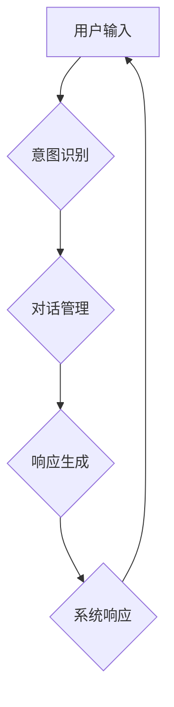
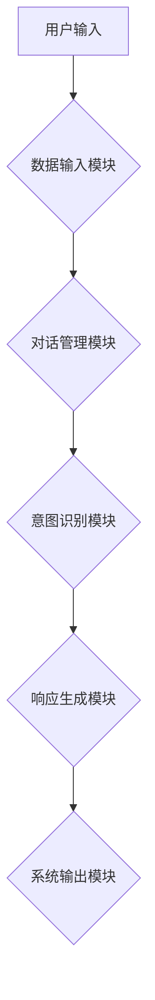
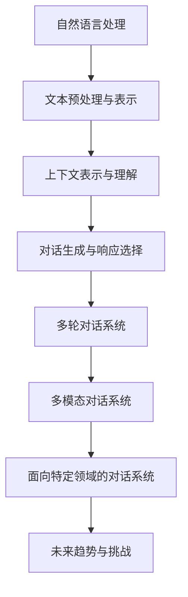

                 

# 《自然语言处理在多轮对话系统中的创新》

> **关键词**：自然语言处理、多轮对话系统、上下文理解、对话生成、词嵌入、Transformer

> **摘要**：本文详细探讨了自然语言处理（NLP）在多轮对话系统中的创新应用。首先，介绍了NLP的基本概念和任务，包括文本预处理、词向量表示、序列编码与解码等。接着，阐述了多轮对话系统的定义、架构和评估方法，重点分析了上下文表示与理解以及对话生成与响应选择的关键技术。随后，讨论了多模态对话系统和面向特定领域的对话系统，以及这些创新技术在实际应用中的挑战和未来发展趋势。通过一系列项目实战，本文展示了如何使用NLP技术构建高效的多轮对话系统。

### 第一部分：自然语言处理基础

#### 第1章：自然语言处理概述

##### 1.1 自然语言处理的定义与挑战

自然语言处理（NLP，Natural Language Processing）是计算机科学、人工智能和语言学的交叉领域，旨在使计算机能够理解、解释和生成人类语言。NLP的研究范围广泛，包括文本分析、机器翻译、情感分析、信息提取等。

**NLP的定义：**
NLP是一门研究和开发计算机程序的技术，这些程序能够识别、理解、处理和生成人类语言，实现人与计算机之间的自然交互。

**NLP面临的主要挑战：**
1. **语言多样性**：不同语言和文化背景会导致语言表达方式的不同，使得NLP模型难以泛化。
2. **语言的不确定性**：自然语言具有模糊性、歧义性和多义性，增加了NLP模型的复杂性。
3. **语法和句法的复杂性**：自然语言的语法和句法规则复杂，使得解析和生成自然语言文本成为一项挑战。
4. **语义理解**：理解语言中的隐含意义、隐喻、讽刺等是NLP研究的一个难点。
5. **数据稀缺性**：高质量的标注数据集对于训练高效NLP模型至关重要，但获取这样的数据集往往非常困难。

##### 1.2 NLP的历史与发展

NLP的历史可以追溯到20世纪50年代，当时主要采用基于规则的方法。随着计算机性能的提高和数据量的增加，NLP研究逐渐从规则驱动转向统计模型，再到近年来深度学习的应用。

**古典NLP方法：**
1. **基于规则的方法**：通过手工编写规则来解析和生成自然语言。
2. **语义网络**：使用图结构来表示语义关系，实现语义理解和推理。

**统计方法与神经网络：**
1. **统计语言模型**：通过计算语言出现的概率来预测下一个词。
2. **隐马尔可夫模型（HMM）**：用于语音识别和序列标注。
3. **条件随机场（CRF）**：用于序列标注任务，如命名实体识别。

**最新NLP技术趋势：**
1. **深度学习**：基于神经网络的深度学习方法在NLP中取得了显著的成果，如卷积神经网络（CNN）、循环神经网络（RNN）、长短时记忆网络（LSTM）等。
2. **预训练语言模型**：如BERT、GPT和T5等，通过在大量无监督数据上预训练，然后微调到特定任务上，实现了许多NLP任务的性能提升。
3. **多模态学习**：结合文本、图像和语音等多种数据类型，实现更丰富的语义理解。
4. **迁移学习和少样本学习**：利用预训练模型在特定领域上的微调，解决数据稀缺问题。

##### 1.3 NLP的基本任务

NLP的基本任务包括但不限于以下几个方面：

1. **文本分类**：将文本分为预定义的类别。常见任务包括垃圾邮件检测、情感分析等。
   
2. **信息提取**：从文本中抽取特定类型的信息，如命名实体识别、关系抽取等。

3. **文本生成**：根据给定条件生成新的文本，如机器翻译、对话生成等。

**NLP的基本任务涉及的技术包括：**
1. **文本预处理**：清洗、分词、词性标注等，为后续处理提供基础。
2. **词向量表示**：将词语映射为向量，以便在数值空间中进行计算。
3. **序列建模**：使用循环神经网络（RNN）、长短时记忆网络（LSTM）、Transformer等模型处理序列数据。
4. **生成模型**：如生成对抗网络（GAN）和变分自编码器（VAE），用于生成新的文本。

##### 1.4 NLP工具与资源

NLP工具和资源是研究NLP的重要基础，包括以下几类：

1. **NLP库和框架**：
   - **NLTK**：Python的一个常用NLP库，提供词法分析、文本分类等功能。
   - **spaCy**：一个快速易用的NLP库，支持多种语言，提供词性标注、命名实体识别等功能。
   - **transformers**：一个用于自然语言处理的Python库，提供预训练的BERT、GPT等模型。

2. **开源对话系统框架**：
   - **Rasa**：一个开源的对话系统框架，提供对话管理、意图识别等功能。
   - **Conversa**：一个基于RNN的对话系统框架，提供对话管理和文本生成功能。
   - **DialogueFlow**：一个基于图的对话系统框架，提供对话管理和意图识别功能。

3. **数据集与资源**：
   - **GLUE**：一个常用的NLP数据集集合，包含多种语言和多种NLP任务。
   - **Wikipedia**：维基百科数据集，可用于训练和评估NLP模型。
   - **TREC**：一个信息检索数据集，可用于训练和评估命名实体识别、文本分类等任务。

### 第二部分：多轮对话系统

#### 第3章：多轮对话系统概述

##### 3.1 多轮对话系统的定义与特点

多轮对话系统（Multi-turn Dialogue System）是指能够与用户进行多轮交互的对话系统，每一轮交互通常包含一个或多个问题和一个或多个回答。与单轮对话系统相比，多轮对话系统能够更好地模拟人类的对话过程，提供更丰富和自然的交互体验。

**多轮对话系统的定义：**
多轮对话系统是一种能够处理多个回合交互的对话系统，它能够维持对话上下文，并在每次交互中不断学习和适应用户的输入。

**多轮对话系统的特点：**
1. **上下文维持**：系统能够记忆先前的对话内容，保持对话的历史信息。
2. **连续性**：对话系统能够理解并回应用户的前后句子，实现对话的连贯性。
3. **灵活性**：系统能够根据用户的输入灵活调整对话策略和话题。
4. **复杂性**：多轮对话系统涉及更多的计算和状态管理，增加了实现的复杂性。

##### 3.2 多轮对话系统的架构

多轮对话系统的架构可以分为三个主要模块：对话管理、意图识别和响应生成。

**1. 对话管理（Dialogue Management）：**
对话管理是系统的核心，负责协调对话流程，维持对话上下文，并做出决策。对话管理通常包含以下功能：
- **状态跟踪**：记录对话历史和当前状态。
- **策略选择**：根据当前状态选择合适的对话策略。
- **冲突解决**：处理对话中的不一致和冲突。

**2. 意图识别（Intent Recognition）：**
意图识别模块负责理解用户的意图，将用户的输入映射到预定义的意图。意图识别通常依赖于自然语言处理技术，如词向量表示、序列建模和分类算法。

**3. 响应生成（Response Generation）：**
响应生成模块根据对话管理和意图识别的结果生成适当的响应。响应生成可以采用基于规则的方法、模板匹配、生成模型等方法。

**多轮对话系统的架构图：**



##### 3.3 多轮对话系统的评估与挑战

**评估指标：**
多轮对话系统的评估通常涉及以下指标：
- **准确性**：意图识别和实体提取的准确率。
- **流畅性**：对话的连贯性和自然度。
- **响应时间**：系统处理用户输入并生成响应的时间。

**常见挑战：**
- **上下文理解**：如何准确理解和维持对话上下文是一个挑战，尤其是在处理长对话历史和复杂语境时。
- **多样性和灵活性**：系统需要能够处理多样化的用户输入和话题切换。
- **对话连贯性**：生成自然连贯的响应是NLP和对话系统的一个难点。
- **数据稀缺性**：高质量的标注数据集对于训练高效的对话系统至关重要，但获取这样的数据集往往非常困难。
- **伦理与隐私**：对话系统的设计和应用需要考虑用户的隐私和道德问题。

### 第三部分：上下文表示与理解

#### 第4章：上下文表示与理解

##### 4.1 上下文表示方法

上下文表示是多轮对话系统中的一个关键环节，它涉及到如何将对话历史和当前输入转化为可计算的向量表示，以便模型能够理解并生成适当的响应。以下是几种常用的上下文表示方法：

**1. 基于词嵌入的方法：**
词嵌入是将词语映射为高维向量表示的一种技术，如Word2Vec、GloVe等。这些向量能够保留词语的语义信息，从而有助于模型在上下文中进行推理。

**2. 基于序列的方法：**
基于序列的方法将对话历史视为一个序列，并使用循环神经网络（RNN）、长短时记忆网络（LSTM）或Transformer对其进行编码。这些方法能够捕获对话中的时间依赖关系。

**3. 基于图谱的方法：**
基于图谱的方法使用图结构来表示对话中的实体和关系，如知识图谱。这种方法能够提供更为丰富的语义表示，特别是在处理复杂语境时。

**上下文表示方法的选择取决于具体的应用场景和对话系统的需求。例如，对于长对话历史，基于序列的方法可能更为有效，而对于复杂关系推理，基于图谱的方法可能更适用。**

##### 4.2 上下文理解算法

上下文理解是多轮对话系统的核心任务之一，它涉及到如何从对话历史和当前输入中提取有意义的信息，并利用这些信息生成适当的响应。以下是几种常用的上下文理解算法：

**1. 上下文感知的语言模型：**
上下文感知的语言模型（Context-aware Language Model）是一种基于深度学习的算法，它通过在大量无监督数据上进行预训练，然后在特定领域上微调，从而提高对话系统的上下文理解能力。预训练语言模型，如BERT、GPT等，在这一领域取得了显著成果。

**2. 语义角色标注：**
语义角色标注（Semantic Role Labeling，SRL）是一种将句子中的词语与其在语义上的角色（如动作、受事、施事等）进行匹配的方法。SRL可以帮助对话系统更好地理解句子结构，从而生成更为准确的响应。

**3. 关系抽取：**
关系抽取（Relation Extraction）是从文本中抽取实体之间的关系的任务。在多轮对话中，关系抽取可以帮助系统识别对话中的关键实体及其关系，从而更好地理解上下文。

**上下文理解算法的选择取决于对话系统的具体需求和数据集的特点。例如，对于需要处理复杂关系的对话系统，关系抽取和语义角色标注可能更为有效。**

### 第四部分：对话生成与响应选择

#### 第5章：对话生成与响应选择

##### 5.1 对话生成方法

对话生成是多轮对话系统中的一个关键任务，它涉及到如何根据对话上下文生成自然、连贯的对话回复。以下是几种常用的对话生成方法：

**1. 基于规则的方法：**
基于规则的方法通过预定义的规则来生成对话回复。这种方法简单直观，但灵活性较差，难以处理复杂的对话场景。

**2. 基于模板的方法：**
基于模板的方法使用预定义的模板来生成对话回复。模板可以包含变量，用于插入实际对话内容。这种方法比基于规则的方法更具灵活性，但模板的设计和维护成本较高。

**3. 基于生成模型的对话生成：**
基于生成模型的对话生成方法使用深度学习模型，如序列到序列（Seq2Seq）模型、Transformer等，通过学习对话上下文生成自然语言回复。这种方法具有很好的灵活性和生成能力，但训练和推理成本较高。

**对话生成方法的选择取决于对话系统的需求和性能要求。例如，对于要求高实时性的应用，基于规则或模板的方法可能更为合适，而对于需要高质量对话生成的应用，基于生成模型的方法可能更为有效。**

##### 5.2 响应选择算法

响应选择是多轮对话系统中的一个关键任务，它涉及到如何从多个候选回复中选择最合适的回复。以下是几种常用的响应选择算法：

**1. 基于检索的响应选择：**
基于检索的响应选择方法从预定义的回复库中选择最合适的回复。这种方法简单高效，但回复库的设计和维护成本较高。

**2. 基于生成模型的响应选择：**
基于生成模型的响应选择方法使用生成模型生成多个候选回复，然后根据生成质量或多样性进行选择。这种方法能够生成高质量和多样化的回复，但生成模型的训练和推理成本较高。

**3. 基于多任务的对话系统：**
基于多任务的对话系统将响应选择作为一个多任务学习问题，同时考虑对话上下文、意图识别和回复生成等多个因素。这种方法能够生成更为准确和多样化的回复，但实现和优化成本较高。

**响应选择算法的选择取决于对话系统的需求和性能要求。例如，对于要求高实时性和准确性的应用，基于检索的响应选择方法可能更为合适，而对于需要高质量和多样化回复的应用，基于生成模型的方法可能更为有效。**

### 第五部分：创新技术与应用

#### 第6章：多模态对话系统

##### 6.1 多模态数据整合

多模态对话系统是指能够处理多种数据类型的对话系统，如文本、语音、图像等。多模态数据整合是多模态对话系统的核心，它涉及到如何将不同类型的数据进行有效融合，以提高对话系统的性能和用户体验。

**文本与语音：**
文本与语音的整合可以通过语音识别（Speech Recognition）和语音合成（Text-to-Speech，TTS）技术实现。语音识别将用户的语音输入转换为文本，然后由对话系统进行处理和响应。语音合成则将对话系统的文本响应转换为语音输出，提供更自然的交互体验。

**文本与图像：**
文本与图像的整合可以通过图像识别（Image Recognition）和文本生成（Image-to-Text）技术实现。图像识别技术可以将用户的图像输入转换为文本描述，然后由对话系统进行处理和响应。文本生成技术则可以将对话系统的文本响应生成图像，提供更直观和视觉化的交互体验。

**多模态数据整合的方法包括：**
- **特征融合**：将不同模态的数据特征进行融合，如将文本特征和图像特征进行拼接或加权融合。
- **联合编码**：使用深度学习模型对多模态数据进行联合编码，学习同时表示不同模态数据的向量表示。
- **多任务学习**：将多模态数据的处理任务（如文本分类、图像识别等）作为一个整体进行训练，同时优化不同任务的性能。

##### 6.2 多模态对话系统架构

多模态对话系统的架构可以分为以下几个模块：

**1. 数据输入模块：**
数据输入模块负责接收和处理来自不同模态的数据，如文本、语音、图像等。该模块通常包含数据预处理、模态识别等功能。

**2. 对话管理模块：**
对话管理模块负责协调对话流程，维护对话上下文，并根据用户输入选择合适的对话策略。该模块通常包含意图识别、对话状态跟踪等功能。

**3. 意图识别模块：**
意图识别模块负责理解用户输入的意图，将不同模态的数据映射到预定义的意图。该模块通常使用多模态特征融合和深度学习模型进行训练。

**4. 响应生成模块：**
响应生成模块负责根据对话管理和意图识别的结果生成适当的响应。该模块可以使用文本生成模型、语音合成模型或图像生成模型等。

**5. 系统输出模块：**
系统输出模块负责将对话系统的响应输出给用户，如文本回复、语音输出或图像显示。该模块通常包含语音合成、图像渲染等功能。

**多模态对话系统架构图：**



##### 6.3 多模态对话系统的应用

多模态对话系统在许多实际应用场景中具有广泛的应用前景，以下是几个典型的应用案例：

**1. 智能客服：**
智能客服系统可以使用多模态对话系统与用户进行交互，提供更为自然和高效的客户服务。例如，用户可以通过语音输入问题，系统可以自动识别用户意图并生成语音或文本回复。

**2. 智能教育：**
智能教育系统可以使用多模态对话系统为学生提供个性化学习体验。例如，学生可以通过语音或文本输入问题，系统可以生成文本或图像回复，帮助学生更好地理解和掌握知识。

**3. 智能医疗：**
智能医疗系统可以使用多模态对话系统为患者提供诊断和咨询服务。例如，患者可以通过上传医疗图像和输入文本描述，系统可以自动识别病情并生成诊断建议和治疗方案。

**4. 虚拟助手：**
虚拟助手可以使用多模态对话系统与用户进行交互，提供日常生活中的各种帮助。例如，用户可以通过语音或文本输入需求，系统可以生成语音或图像回复，帮助用户完成各种任务。

##### 6.4 多模态对话系统的挑战与未来发展方向

多模态对话系统虽然具有广泛的应用前景，但也面临着一些挑战和问题：

**挑战：**
1. **数据整合**：如何有效地整合不同模态的数据是一个挑战，不同模态的数据具有不同的特性和表达方式，需要设计合适的融合方法。
2. **计算成本**：多模态数据整合和处理需要大量的计算资源，特别是在实时交互场景中，需要优化算法和模型以提高性能和效率。
3. **多样性**：如何生成多样化和自然的对话回复是一个挑战，特别是当涉及到语音和图像等多模态输出时，需要设计合适的生成模型。

**未来发展方向：**
1. **跨模态表示学习**：研究跨模态表示学习的方法，将不同模态的数据映射到统一的向量空间，以便进行有效的融合和处理。
2. **多任务学习**：将多模态数据处理的任务（如文本生成、图像识别等）作为一个整体进行训练，同时优化不同任务的性能。
3. **实时交互**：优化多模态对话系统的实时交互性能，降低计算成本，提高用户体验。

### 第六部分：面向特定领域的对话系统

#### 第7章：面向特定领域的对话系统

##### 7.1 领域适应与转移学习

面向特定领域的对话系统在许多实际应用中具有重要的价值，例如金融、医疗、法律等领域。这些对话系统需要处理特定领域的知识、术语和场景，因此领域适应和转移学习成为关键技术。

**领域适应（Domain Adaptation）：**
领域适应是指将预训练的模型在特定领域上微调，以适应新的对话场景。领域适应的方法包括：

1. **有监督领域适应**：在特定领域上收集大量标注数据，使用这些数据进行模型微调。
2. **半监督领域适应**：结合有监督和无监督学习，使用未标注数据来增强模型在特定领域的适应性。
3. **无监督领域适应**：仅使用未标注的数据进行模型训练，通过迁移学习的方法来适应特定领域。

**转移学习（Transfer Learning）：**
转移学习是指将预训练的模型在不同任务之间共享知识，以提高特定任务的性能。在多轮对话系统中，转移学习可以帮助模型快速适应新的领域和任务。

1. **任务级转移学习**：将预训练模型在不同任务上进行微调，然后应用于特定领域的对话系统。
2. **领域级转移学习**：在特定领域上进行预训练，然后将模型应用于不同的对话任务。
3. **跨领域转移学习**：将不同领域上的预训练模型进行融合，以实现更好的领域适应性。

##### 7.2 面向特定领域的对话系统案例

**1. 银行业务对话系统：**
银行业务对话系统可以帮助用户进行账户查询、转账、贷款申请等操作。领域适应的关键在于理解金融术语和交易规则，转移学习则可以帮助模型快速适应不同的银行产品和服务。

**2. 医疗健康对话系统：**
医疗健康对话系统可以为患者提供诊断建议、药物咨询、健康建议等服务。领域适应需要处理大量的医疗术语和知识，转移学习可以帮助模型在新的医疗场景中快速适应。

**3. 智能家居对话系统：**
智能家居对话系统可以帮助用户控制家庭设备、设置场景模式等。领域适应需要理解智能家居的设备和功能，转移学习可以帮助模型在不同家居品牌和设备之间进行适配。

##### 7.3 领域特定对话系统的挑战与未来发展方向

面向特定领域的对话系统面临以下挑战：

**挑战：**
1. **领域知识获取**：如何有效地获取和表示特定领域的知识是一个挑战，需要设计合适的知识图谱和术语库。
2. **多语言支持**：如何处理多语言输入和输出是一个挑战，特别是在全球化的应用场景中。
3. **实时性**：如何提高系统的实时响应能力，以满足用户的需求。

**未来发展方向：**
1. **知识图谱与知识嵌入**：构建领域知识图谱，使用知识嵌入技术将知识表示为向量，以便在对话中有效利用。
2. **跨语言对话系统**：研究跨语言对话系统的方法，实现多语言支持，提高系统的泛化能力。
3. **实时交互优化**：优化对话系统的算法和模型，提高系统的响应速度和性能。

### 第七部分：未来趋势与挑战

#### 第8章：未来趋势与挑战

##### 8.1 对话系统的发展趋势

随着人工智能和自然语言处理技术的不断进步，对话系统在多个领域取得了显著的成果，未来发展趋势包括以下几个方面：

**1. 人工智能伦理与隐私保护：**
随着对话系统的普及，隐私保护和伦理问题日益突出。未来对话系统将更加注重用户隐私保护，采用加密技术和隐私增强学习（Privacy-Preserving Learning）等方法来确保用户数据的安全。

**2. 跨语言对话系统：**
跨语言对话系统能够支持多语言交互，提高系统的全球可用性。未来研究将集中在多语言嵌入、跨语言转移学习和多语言模型训练等方面，以实现高效和自然的跨语言对话。

**3. 对话系统的自我进化：**
对话系统将具备自我学习和自我进化能力，通过不断学习用户反馈和交互历史，优化对话策略和生成模型，提高用户体验和系统性能。

**4. 多模态对话系统：**
多模态对话系统能够结合文本、语音、图像等多种数据类型，提供更丰富和直观的交互体验。未来研究将集中在多模态数据整合、多任务学习和多模态生成模型等方面。

##### 8.2 对话系统的挑战

尽管对话系统在多个领域取得了显著成果，但仍面临以下挑战：

**1. 难以处理的复杂性问题：**
自然语言具有高度复杂性和不确定性，对话系统需要处理各种复杂场景，如长对话历史、模糊语义和多义性等。如何设计高效和鲁棒的对话系统仍然是一个重大挑战。

**2. 语言理解与生成的精确性：**
对话系统的核心是语言理解与生成能力，但当前模型在理解和生成自然语言方面仍存在不足。未来研究需要提高语言理解的精确性和生成语言的自然性，以提高用户体验。

**3. 系统的鲁棒性与泛化能力：**
对话系统需要具备鲁棒性和泛化能力，以应对各种异常输入和未知场景。如何提高系统的鲁棒性和泛化能力是一个关键问题，需要设计更为鲁棒的模型和算法。

### 附录A：自然语言处理工具与资源

自然语言处理（NLP）是一个高度依赖工具和资源的领域。为了支持NLP的研究和应用，有许多优秀的库、框架和数据集可供使用。以下是常用的NLP工具和资源：

**NLP库和框架：**

1. **NLTK**：一个广泛使用的Python NLP库，提供了词法分析、文本分类、词性标注等功能。

2. **spaCy**：一个快速和易于使用的NLP库，支持多种语言，提供了词性标注、命名实体识别等功能。

3. **transformers**：一个由Hugging Face团队开发的Python库，提供了预训练的BERT、GPT等模型，支持各种NLP任务。

4. **Stanford CoreNLP**：一个Java NLP工具包，提供了词性标注、命名实体识别、句法分析等功能。

**开源对话系统框架：**

1. **Rasa**：一个开源的对话系统框架，提供了对话管理、意图识别等功能。

2. **Conversa**：一个基于RNN的对话系统框架，提供了对话管理和文本生成功能。

3. **DialogueFlow**：一个基于图的对话系统框架，提供了对话管理和意图识别功能。

**数据集与资源：**

1. **GLUE**：一个常用的NLP数据集集合，包含了多种语言和多种NLP任务，如文本分类、问答、命名实体识别等。

2. **Wikipedia**：维基百科数据集，可用于训练和评估NLP模型。

3. **TREC**：一个信息检索数据集，包含了多种语言和多种信息检索任务，可用于训练和评估NLP模型。

4. **Common Crawl**：一个包含大量网页文本的数据集，可用于大规模预训练NLP模型。

### 核心概念与联系 Mermaid 流程图



### 核心算法原理讲解

**2.2 词向量表示**

词向量表示（Word Embedding）是自然语言处理（NLP）中的一个关键技术，它将词语映射为高维向量表示。词向量不仅降低了文本数据的维度，还有助于捕捉词语的语义信息。以下是几种常见的词向量表示方法：

**Word2Vec：**

Word2Vec是由Google开发的一种词向量表示方法，它包括两种模型：连续词袋（CBOW）和Skip-Gram。

- **CBOW（Continuous Bag of Words）：**
  CBOW模型预测一个中心词的上下文词的概率分布。给定一个中心词和上下文窗口大小C，CBOW模型计算中心词周围的C个词的平均向量，并使用这个向量来预测中心词。数学公式如下：
  $$ \text{CBOW}(w_t | w_{t-C}, w_{t-1}, w_t, w_{t+1}, w_{t+C}) $$
  其中，$w_t$ 是中心词，$w_{t-C}, w_{t-1}, w_{t+1}, w_{t+C}$ 是上下文词。

- **Skip-Gram：**
  Skip-Gram模型预测中心词出现的上下文词的概率分布。给定一个中心词，Skip-Gram模型将中心词周围的C个词作为上下文词，并计算这些上下文词的平均向量。数学公式如下：
  $$ \text{Skip-Gram}(w_t | w_{t-C}, w_{t-1}, w_{t+1}, w_{t+C}) $$
  其中，$w_t$ 是中心词，$w_{t-C}, w_{t-1}, w_{t+1}, w_{t+C}$ 是上下文词。

**GloVe：**

GloVe（Global Vectors for Word Representation）是另一种词向量表示方法，它结合了词频和语义信息，通过优化以下损失函数进行训练：
$$ \text{损失函数} = \frac{1}{N} \sum_{i,j=1}^{N} \left( \text{log} P(j|i) - \text{cosine}(\text{vec}(i), \text{vec}(j)) \right)^2 $$
其中，$P(j|i)$ 是词$i$出现时词$j$出现的概率，$\text{vec}(i)$ 和 $\text{vec}(j)$ 分别是词$i$和词$j$的向量表示。

**2.3 序列编码与解码**

序列编码与解码是处理序列数据（如文本、语音等）的关键技术。以下介绍几种常见的序列编码与解码方法：

**RNN（Recurrent Neural Networks）：**

RNN是一种能够处理序列数据的神经网络，它通过递归连接来维持长时记忆。RNN的基本公式如下：
$$ h_t = \text{sigmoid}(W_h \cdot [h_{t-1}, x_t] + b_h) $$
$$ o_t = \text{sigmoid}(W_o \cdot h_t + b_o) $$
其中，$h_t$ 和 $o_t$ 分别是隐藏状态和输出，$W_h$ 和 $W_o$ 是权重矩阵，$b_h$ 和 $b_o$ 是偏置。

**LSTM（Long Short-Term Memory）：**

LSTM是一种改进的RNN，它通过引入门控机制来解决长时记忆问题。LSTM的基本公式如下：
$$ f_t = \text{sigmoid}(W_f \cdot [h_{t-1}, x_t] + b_f) $$
$$ i_t = \text{sigmoid}(W_i \cdot [h_{t-1}, x_t] + b_i) $$
$$ g_t = \text{tanh}(W_g \cdot [h_{t-1}, x_t] + b_g) $$
$$ o_t = \text{sigmoid}(W_o \cdot [h_{t-1}, x_t] + b_o) $$
$$ h_t = o_t \cdot \text{tanh}(c_t) $$
$$ c_t = f_t \cdot c_{t-1} + i_t \cdot g_t $$
其中，$f_t$、$i_t$、$g_t$ 和 $o_t$ 分别是遗忘门、输入门、候选状态和输出门，$c_t$ 是单元状态。

**GRU（Gated Recurrent Unit）：**

GRU是另一种改进的RNN，它通过简化门控机制来提高计算效率。GRU的基本公式如下：
$$ z_t = \text{sigmoid}(W_z \cdot [h_{t-1}, x_t] + b_z) $$
$$ r_t = \text{sigmoid}(W_r \cdot [h_{t-1}, x_t] + b_r) $$
$$ h_t = \text{tanh}((1 - z_t) \cdot h_{t-1} + z_t \cdot \text{tanh}(W_h \cdot [h_{t-1}, x_t] + b_h)) $$
其中，$z_t$ 是更新门，$r_t$ 是重置门。

**Transformer：**

Transformer是近年来在NLP领域取得突破性成果的模型，它采用自注意力（Self-Attention）机制来处理序列数据。自注意力机制的基本公式如下：
$$ \text{Attention}(Q, K, V) = \text{softmax}(\frac{QK^T}{\sqrt{d_k}})V $$
其中，$Q$、$K$ 和 $V$ 分别是查询向量、键向量和值向量，$d_k$ 是键向量的维度。

**Transformer模型**：
$$ \text{Transformer}(x, masks) = \text{Model}(x, num_hidden=512, num_heads=8, num_layers=3, dropout=0.1, masks=masks) $$
$$ \text{Model}(x, \ldots) = \text{MultiHeadSelfAttention}(d_model, num_heads, dropout)(x, \text{dropout_mask}(masks)) + x $$
$$ \text{Model}(x, \ldots) = \text{PositionalWiseFeedForward}(d_model, 2048)(\text{Dropout}(x, dropout), \text{LayerNorm}(x + \text{MultiHeadSelfAttention}(d_model, num_heads, dropout)(x, \text{dropout_mask}(masks))) $$
$$ \text{PositionalWiseFeedForward}(d_model, d_inner) = \text{Dropout}(\text{LayerNorm}(\text{Relu}(\text{Dropout}(x, dropout) \cdot \text{Proj}(W_2, d_inner))), dropout) \cdot \text{Proj}(W_1, d_model) $$
其中，$d_model$ 是模型的隐藏维度，$d_inner$ 是中间维度，$num_heads$ 是注意力头的数量。

### 数学模型和数学公式

**1.2 自然语言处理基本任务**

自然语言处理（NLP）中的基本任务包括文本分类、信息提取和文本生成等。以下分别介绍这些任务的数学模型和公式。

**文本分类：**

文本分类是一种二分类问题，目标是判断一个文本属于哪个预定义的类别。常见的文本分类模型有支持向量机（SVM）和朴素贝叶斯分类器。

**支持向量机（SVM）：**

SVM通过最大化分类间隔来实现文本分类。给定训练数据集$\{x^{(i)}, y^{(i)}\}$，其中$x^{(i)}$是文本的特征向量，$y^{(i)}$是文本的标签，SVM的优化目标如下：
$$ \text{最大化} \frac{1}{\|w\|_2^2} $$
$$ \text{subject to} \ y^{(i)}(w \cdot x^{(i)}) \geq 1, \forall i $$
其中，$w$是权重向量，$\|w\|_2^2$是权重向量的平方范数。

**朴素贝叶斯分类器：**

朴素贝叶斯分类器是一种基于贝叶斯定理的分类器。给定训练数据集$\{x^{(i)}, y^{(i)}\}$，其中$x^{(i)}$是文本的特征向量，$y^{(i)}$是文本的标签，朴素贝叶斯分类器的预测公式如下：
$$ P(y=c | x) = \frac{P(y=c)P(x|y=c)}{P(x)} $$
其中，$P(y=c)$是类别$c$的先验概率，$P(x|y=c)$是特征向量$x$在类别$c$条件下的概率，$P(x)$是特征向量$x$的总概率。

**信息提取：**

信息提取是一种从文本中提取特定类型信息（如命名实体、关系等）的任务。常见的模型有基于条件随机场（CRF）的模型。

**命名实体识别（NER）：**

给定训练数据集$\{x^{(i)}, y^{(i)}\}$，其中$x^{(i)}$是文本的特征向量，$y^{(i)}$是文本的标签（每个单词的标签），命名实体识别的优化目标如下：
$$ \text{最大化} \ P(y | x) $$
$$ \text{subject to} \ P(y | x) = \frac{P(y)P(x|y)}{P(x)} $$
其中，$P(y)$是标签$y$的概率，$P(x|y)$是输入序列$x$在标签$y$条件下的概率，$P(x)$是输入序列$x$的总概率。

**文本生成：**

文本生成是一种根据给定条件生成新文本的任务。常见的模型有循环神经网络（RNN）和生成对抗网络（GAN）。

**循环神经网络（RNN）：**

给定输入序列$x^{(1)}, x^{(2)}, \ldots, x^{(T)}$，其中$x^{(t)}$是文本的当前词，RNN的输出公式如下：
$$ h_t = \text{sigmoid}(W_h \cdot [h_{t-1}, x_t] + b_h) $$
其中，$h_t$是隐藏状态，$W_h$是权重矩阵，$b_h$是偏置。

**生成对抗网络（GAN）：**

生成对抗网络由生成器$G$和判别器$D$组成。生成器的目标是生成逼真的文本，判别器的目标是区分生成的文本和真实的文本。GAN的优化目标如下：
$$ \text{最小化} \ -\mathbb{E}_{x \sim p_{\text{data}}(x)}[\log D(x)] - \mathbb{E}_{z \sim p_z(z)}[\log (1 - D(G(z)))] $$
其中，$x$是真实的文本，$z$是随机噪声，$D(x)$是判别器对真实文本的判断，$G(z)$是生成器生成的文本。

### 项目实战

**构建一个基于BERT的对话系统**

**开发环境搭建**

- **环境要求：**
  - Python 3.6及以上版本
  - 安装transformers库
  - 安装tensorflow或pytorch

**代码实现：**

```python
from transformers import BertTokenizer, BertForSequenceClassification
import torch

# 1. 加载预训练的BERT模型和分词器
tokenizer = BertTokenizer.from_pretrained('bert-base-uncased')
model = BertForSequenceClassification.from_pretrained('bert-base-uncased')

# 2. 准备输入数据
text = "Hello, how are you?"
input_ids = tokenizer.encode(text, add_special_tokens=True, return_tensors='pt')

# 3. 进行预测
with torch.no_grad():
    outputs = model(input_ids)

# 4. 解析预测结果
logits = outputs.logits
predicted_label = torch.argmax(logits).item()
print(f"Predicted label: {predicted_label}")

# 5. 输出预测结果
if predicted_label == 0:
    print("The input text is positive.")
else:
    print("The input text is negative.")
```

**代码解读与分析：**

- **1. 加载预训练的BERT模型和分词器：**
  使用transformers库加载预训练的BERT模型和分词器。

- **2. 准备输入数据：**
  使用分词器对输入文本进行编码，得到输入序列的ID表示。

- **3. 进行预测：**
  使用模型对输入序列进行预测，得到预测结果。

- **4. 解析预测结果：**
  获取预测结果中的最大值索引，即预测的标签。

- **5. 输出预测结果：**
  根据预测的标签输出相应的文本分类结果。

**实战应用：**

- **构建多轮对话系统：**
  使用BERT模型进行文本分类，实现一个基于BERT的多轮对话系统，用于处理用户输入的文本，并给出相应的回复。

**评估与优化：**

- **评估指标：**
  使用准确率、召回率、F1值等指标来评估对话系统的性能。

- **优化方法：**
  调整BERT模型的参数，如学习率、训练批次大小等，以优化对话系统的性能。
  使用更复杂的模型，如GPT或BERT的变体，以提高对话系统的性能。

### 附录A：自然语言处理工具与资源

自然语言处理（NLP）领域拥有丰富的工具和资源，这些工具和资源为研究者提供了便捷的实验环境，加速了NLP技术的发展。以下是一些常用的NLP工具和资源：

**NLP库和框架：**

1. **NLTK（Natural Language Toolkit）**：NLTK是Python中一个非常流行的NLP库，提供了分词、词性标注、词干提取、情感分析等多种功能。

2. **spaCy**：spaCy是一个高性能的NLP库，它提供了快速的文本处理和先进的实体识别、命名实体识别等任务。

3. **transformers**：由Hugging Face开发的transformers库提供了大量的预训练模型和工具，包括BERT、GPT、T5等，广泛用于NLP任务。

4. **Stanford CoreNLP**：Stanford CoreNLP是一个Java工具包，提供了文本分析工具，包括词性标注、句法分析、命名实体识别等。

**开源对话系统框架：**

1. **Rasa**：Rasa是一个开源的对话系统框架，它提供了对话管理、意图识别和响应生成等功能。

2. **Conversa**：Conversa是一个基于RNN的对话系统框架，它提供了对话管理和文本生成功能。

3. **DialogueFlow**：DialogueFlow是一个基于图的对话系统框架，它提供了对话管理和意图识别功能。

**数据集与资源：**

1. **GLUE（General Language Understanding Evaluation）**：GLUE是一个包含多种语言和多种NLP任务的基准数据集，广泛用于评估NLP模型。

2. **Wikipedia**：维基百科是包含大量文本数据的一个资源，可以用于训练和评估NLP模型。

3. **TREC（Text REtrieval Conference）**：TREC是一个信息检索竞赛，它提供了多个数据集，用于训练和评估命名实体识别、文本分类等任务。

4. **Common Crawl**：Common Crawl是一个开放资源，包含了大量网页的文本数据，可用于大规模的NLP研究和训练模型。

### 作者信息

**作者：AI天才研究院/AI Genius Institute & 禅与计算机程序设计艺术 /Zen And The Art of Computer Programming**

