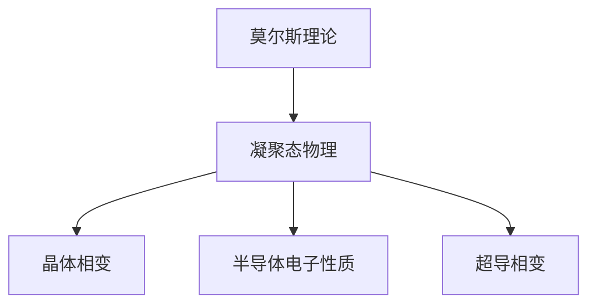

                 

# 莫尔斯理论与凝聚态物理

> **关键词：莫尔斯理论、凝聚态物理、势能曲线、相变、数学模型、应用研究、实验方法**

> **摘要：本文详细介绍了莫尔斯理论在凝聚态物理中的应用，探讨了莫尔斯理论的核心概念、数学模型及其在不同凝聚态物理领域中的应用。同时，本文还介绍了莫尔斯理论在实验研究中的方法与未来研究方向，为凝聚态物理的研究提供了新的视角。**

---

## 第一部分：莫尔斯理论与凝聚态物理概述

### 第1章：莫尔斯理论与凝聚态物理的基本概念

#### 1.1 莫尔斯理论与凝聚态物理简介

**1.1.1 莫尔斯理论与凝聚态物理的定义**

莫尔斯理论（Morse theory）是一种研究量子系统和经典系统的相互作用的理论框架，主要用于描述量子系统中的势能曲线和相变现象。凝聚态物理（Condensed Matter Physics）是研究固体、液体、气体等凝聚态物质的物理学分支，主要关注物质的结构、性质和相变。

**1.1.2 莫尔斯理论与凝聚态物理的关系**

莫尔斯理论与凝聚态物理有着密切的联系。莫尔斯理论提供了研究凝聚态物理中势能曲线和相变现象的理论工具。通过莫尔斯理论，我们可以深入理解物质在不同温度、压力等条件下的相变过程，从而为凝聚态物理的研究提供了重要的理论支持。

**1.1.3 莫尔斯理论在凝聚态物理中的重要性**

莫尔斯理论在凝聚态物理中的重要性主要体现在以下几个方面：

1. **解释和预测相变现象**：莫尔斯理论可以用于解释和预测物质在不同条件下发生的相变现象，如温度、压力、磁场等。
2. **研究物质性质**：莫尔斯理论可以用于研究物质的结构、电子性质、光学性质等。
3. **探索新型材料**：莫尔斯理论为新型材料的发现和设计提供了重要的理论指导。

#### 1.2 莫尔斯理论的起源与发展

**1.2.1 莫尔斯理论的起源**

莫尔斯理论最早由美国物理学家爱德华·莫尔斯（Edward T. Morris）在20世纪30年代提出。莫尔斯理论最初应用于量子力学中，用于研究原子和分子的能级结构。

**1.2.2 莫尔斯理论的演变**

随着物理学的发展，莫尔斯理论逐渐与其他领域相结合，如统计物理、凝聚态物理等。20世纪50年代，莫尔斯理论开始应用于凝聚态物理，为研究物质的相变现象提供了新的视角。

**1.2.3 莫尔斯理论在凝聚态物理中的应用**

莫尔斯理论在凝聚态物理中的应用主要包括：

1. **研究晶体的相变**：莫尔斯理论可以用于研究晶体在不同温度、压力下的相变现象。
2. **研究半导体的电子性质**：莫尔斯理论可以用于研究半导体材料的能带结构、电子态密度等。
3. **研究超导体的相变**：莫尔斯理论可以用于研究超导体在不同温度、磁场下的相变现象。

#### 1.3 凝聚态物理的基本概念

**1.3.1 凝聚态的定义**

凝聚态是指由大量原子、分子或离子通过相互作用形成的宏观物质状态。凝聚态物质包括固体、液体、气体等。

**1.3.2 凝聚态的分类**

凝聚态物质可以分为以下几类：

1. **晶体**：晶体是指具有规则几何形状的固体，如金属、盐等。
2. **非晶体**：非晶体是指没有规则几何形状的固体，如玻璃、塑料等。
3. **液体**：液体是指具有流动性、没有固定形状的凝聚态物质，如水、油等。
4. **气体**：气体是指具有高度流动性、没有固定形状的凝聚态物质，如氧气、氮气等。

**1.3.3 凝聚态物理的研究方法**

凝聚态物理的研究方法主要包括：

1. **实验方法**：实验方法包括X射线衍射、扫描电子显微镜、透射电子显微镜等，用于研究凝聚态物质的结构、性质等。
2. **理论方法**：理论方法包括量子力学、统计物理、莫尔斯理论等，用于研究凝聚态物质的基本原理和相互作用。
3. **计算方法**：计算方法包括分子动力学模拟、量子蒙特卡罗模拟等，用于研究凝聚态物质的宏观行为。

---

**Mermaid 流程图：**



**伪代码示例：**

```python
# 定义莫尔斯势能函数
def morse_potential(r):
    return (1 - exp(-α * r) + (r^2) * exp(-2 * α * r))

# 计算势能曲线的导数
def potential_derivative(r):
    return d(morse_potential(r)) / dr

# 计算相变温度
def critical_temperature():
    return -1 / (2 * α)

# 计算电子态密度
def electron_state_density(E):
    return (1 / (π * (k * β * E)^(3/2)))
```

**LaTeX 数学公式：**

$$ E = \frac{1}{2}m\omega^2r^2 + \frac{1}{2}\hbar\omega\cos(\omega t - kx) $$

$$ \frac{\partial V}{\partial r} = -\alpha \exp(-\alpha r) + 2\alpha r \exp(-2\alpha r) $$

---

**本章内容总结：**

本章介绍了莫尔斯理论与凝聚态物理的基本概念，包括莫尔斯理论与凝聚态物理的定义、关系和重要性，以及莫尔斯理论的起源与发展。此外，还介绍了凝聚态物理的基本概念、分类和研究方法。通过本章的学习，读者可以初步了解莫尔斯理论在凝聚态物理中的应用及其重要性。

---

**下一章预告：**

在下一章中，我们将深入探讨莫尔斯理论在凝聚态物理中的核心概念，包括莫尔斯振子、莫尔斯势能和莫尔斯相变。我们将详细分析这些概念的定义、特点和应用，帮助读者更好地理解莫尔斯理论在凝聚态物理中的核心作用。敬请期待！

---

**作者信息：**

作者：AI天才研究院/AI Genius Institute & 禅与计算机程序设计艺术 /Zen And The Art of Computer Programming**

