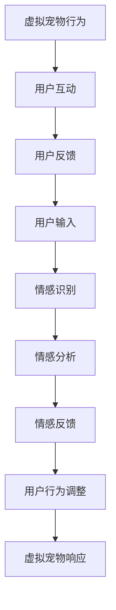

                 

### 虚拟宠物创业：数字陪伴的情感价值

#### 关键词：虚拟宠物、情感计算、数字陪伴、创业、情感价值

> 摘要：本文旨在探讨虚拟宠物创业的市场潜力和情感价值。通过对虚拟宠物市场的现状和趋势进行分析，本文提出了虚拟宠物的设计与开发要点，探讨了数字陪伴对人类情感的影响。最后，本文结合实际案例，对虚拟宠物创业的机遇与挑战进行了深入剖析，提出了创业策略和未来展望。

### 目录大纲

#### 第一部分：虚拟宠物与情感价值

- **第1章：虚拟宠物的定义与分类**
  - **1.1 虚拟宠物的起源与发展**
  - **1.2 虚拟宠物的分类**
  - **1.3 虚拟宠物的技术基础**

- **第2章：虚拟宠物市场的现状与趋势**
  - **2.1 虚拟宠物市场的规模与增长**
  - **2.2 消费者需求分析**
  - **2.3 虚拟宠物市场的竞争格局**

- **第3章：虚拟宠物的设计与开发**
  - **3.1 虚拟宠物的功能设计**
  - **3.2 虚拟宠物的交互设计**
  - **3.3 虚拟宠物的开发流程**

- **第4章：数字陪伴的情感价值**
  - **4.1 数字陪伴的概念与分类**
  - **4.2 数字陪伴的情感价值**
  - **4.3 数字陪伴对人类行为的影响**

#### 第二部分：虚拟宠物创业实践

- **第5章：虚拟宠物创业的机会与挑战**
  - **5.1 虚拟宠物创业的机遇**
  - **5.2 虚拟宠物创业的挑战**
  - **5.3 创业策略与商业模式**

- **第6章：虚拟宠物创业案例研究**
  - **6.1 成功案例一：XX虚拟宠物公司**
  - **6.2 成功案例二：YY虚拟宠物平台**
  - **6.3 失败案例分析**

- **第7章：虚拟宠物创业的运营与营销**
  - **7.1 虚拟宠物运营策略**
  - **7.2 虚拟宠物营销方法**
  - **7.3 用户关系管理**

- **第8章：虚拟宠物创业的未来展望**
  - **8.1 虚拟宠物技术的发展趋势**
  - **8.2 虚拟宠物市场的未来发展**
  - **8.3 创业者的机遇与挑战**

#### 附录

- **附录A：虚拟宠物开发工具与资源**
- **附录B：虚拟宠物创业案例研究**
- **附录C：虚拟宠物创业中的法律法规与伦理问题**
- **附录D：虚拟宠物创业的未来趋势与展望**
- **附录E：虚拟宠物创业相关的资源链接**

---

### 引言

随着科技的进步，虚拟宠物已经成为越来越多人的数字伴侣。从简单的虚拟宠物模拟游戏，到如今具备复杂交互功能的数字宠物，虚拟宠物产业正迅速发展。这一现象不仅反映了人们对于数字生活的需求，也揭示了虚拟宠物在情感陪伴方面的巨大潜力。在快节奏的现代生活中，虚拟宠物为人们提供了情感上的慰藉和陪伴，尤其是在孤独感和焦虑感日益突出的当下，虚拟宠物的情感价值愈发凸显。

本文旨在探讨虚拟宠物创业的市场潜力和情感价值。首先，我们将对虚拟宠物市场的现状和趋势进行分析，了解当前市场的规模、消费者需求以及竞争格局。接着，本文将深入探讨虚拟宠物的设计与开发要点，包括功能设计、交互设计和开发流程。此外，本文还将探讨数字陪伴的情感价值，分析数字陪伴对人类情感的影响。最后，本文将通过实际案例研究，对虚拟宠物创业的机遇与挑战进行深入剖析，并给出创业策略和未来展望。

### 第一部分：虚拟宠物与情感价值

#### 第1章：虚拟宠物的定义与分类

##### 1.1 虚拟宠物的起源与发展

虚拟宠物的概念起源于20世纪90年代的电子游戏产业。当时，许多游戏开发者开始尝试在游戏中引入虚拟宠物系统，让玩家能够与这些宠物进行互动。早期的虚拟宠物主要是作为游戏的一种辅助工具，帮助玩家提升游戏体验。例如，在《宠物小精灵》系列游戏中，玩家可以捕捉、培养和战斗虚拟宠物，这一设计深受玩家的喜爱。

随着互联网的普及和技术的进步，虚拟宠物的概念逐渐从游戏领域扩展到更广泛的领域。21世纪初，虚拟宠物开始应用于虚拟社区和社交平台。例如，QQ宠物和新浪微博的微博宠物等，这些虚拟宠物不仅能够为用户提供娱乐，还能够增强用户之间的互动。这一时期的虚拟宠物更加注重社交功能和用户体验。

近年来，随着人工智能和虚拟现实技术的发展，虚拟宠物的功能和形式得到了显著提升。现代虚拟宠物不仅具备更加真实的物理形态和情感表现，还能够通过语音、文字等多种方式与用户进行互动。例如，AIShell开发的智能助手小艾，不仅能够模仿宠物狗的行为，还能够理解用户的情感需求，提供个性化的互动体验。

虚拟宠物的发展历程表明，从最初的简单游戏道具到如今的情感陪伴伙伴，虚拟宠物经历了从技术到情感的深刻转变。这一转变不仅反映了科技的进步，也揭示了人类对情感陪伴的渴望。

##### 1.2 虚拟宠物的分类

虚拟宠物可以根据不同的标准进行分类，以下是几种常见的分类方法：

- **按互动方式分类**：

  - **静态虚拟宠物**：这类虚拟宠物通常不具备实时交互功能，用户只能通过简单的点击或滑动操作与宠物进行互动。这类宠物更像是数字化的静态玩偶，用户可以通过喂养、玩耍等方式与宠物互动，但宠物的行为和反应相对单一。

  - **动态虚拟宠物**：这类虚拟宠物具备实时交互功能，能够根据用户的操作和对话进行相应的行为和情感表现。动态虚拟宠物通常通过人工智能技术实现，能够模仿真实的宠物行为，如走路、奔跑、玩耍等，同时能够理解用户的情感需求，提供个性化的互动体验。

- **按应用场景分类**：

  - **游戏虚拟宠物**：这类虚拟宠物主要应用于电子游戏中，用户可以在游戏中捕捉、培养和训练虚拟宠物，使其成为战斗伙伴或生活伴侣。游戏虚拟宠物通常具有丰富的功能，如技能学习、装备升级等，能够增强玩家的游戏体验。

  - **社交虚拟宠物**：这类虚拟宠物应用于虚拟社区和社交平台，用户可以在虚拟社区中展示自己的虚拟宠物，与其他用户互动。社交虚拟宠物通常具备社交功能，如聊天、表情互动等，能够增强用户之间的互动体验。

  - **情感虚拟宠物**：这类虚拟宠物专注于提供情感陪伴服务，用户可以通过与虚拟宠物的互动获得情感上的慰藉。情感虚拟宠物通常具备高度的情感识别和响应能力，能够根据用户的情绪变化进行相应的互动和反馈。

- **按技术实现分类**：

  - **基于2D图像的虚拟宠物**：这类虚拟宠物主要通过二维图像或动画实现，用户可以通过点击或滑动操作与宠物进行互动。这类宠物通常操作简单，但交互体验相对有限。

  - **基于3D模型的虚拟宠物**：这类虚拟宠物通过三维模型实现，能够提供更加真实和丰富的交互体验。用户可以通过虚拟现实头盔或触摸屏与宠物进行互动，感受到更加沉浸的体验。

##### 1.3 虚拟宠物的技术基础

虚拟宠物的实现离不开多项先进技术的支持，以下是虚拟宠物技术基础的关键组成部分：

- **人工智能技术**：人工智能技术在虚拟宠物的开发中起着至关重要的作用。通过机器学习算法，虚拟宠物能够识别和理解用户的情感需求，并根据这些需求进行相应的行为和情感反应。例如，虚拟宠物可以通过情感识别技术判断用户是开心、愤怒还是悲伤，并据此调整自己的行为。

- **自然语言处理（NLP）技术**：自然语言处理技术使得虚拟宠物能够理解和处理用户的语音和文字输入。通过NLP技术，虚拟宠物可以与用户进行对话，回答问题，甚至进行简单的对话交流。这一技术不仅提升了虚拟宠物的交互能力，也增强了用户的体验。

- **计算机图形学**：计算机图形学技术在虚拟宠物的视觉表现中发挥着重要作用。通过三维建模和渲染技术，虚拟宠物可以呈现出逼真的外观和动态效果。用户可以通过视觉感官与虚拟宠物进行互动，感受到更加真实的体验。

- **虚拟现实（VR）和增强现实（AR）技术**：虚拟现实和增强现实技术为虚拟宠物提供了更加沉浸的交互体验。用户可以通过VR头盔或AR设备与虚拟宠物进行互动，仿佛置身于虚拟世界中。这类技术不仅提升了虚拟宠物的互动体验，也为用户带来了全新的娱乐方式。

- **情感计算技术**：情感计算技术是虚拟宠物实现情感交互的关键。通过情感计算技术，虚拟宠物可以识别和理解用户的情感状态，并根据这些情感状态进行相应的情感反应。例如，当用户感到不开心时，虚拟宠物可能会表现得更加体贴和关心，以安慰用户。

虚拟宠物的技术基础不仅包括上述关键技术，还包括语音识别、动作捕捉、人脸识别等多领域技术的综合应用。这些技术的协同作用，使得虚拟宠物能够提供更加丰富和个性化的互动体验，满足用户对情感陪伴的需求。

### 第一部分总结

虚拟宠物作为数字陪伴的产物，已经成为现代社会中不可或缺的一部分。从其起源和发展历程中，我们可以看到虚拟宠物从简单的游戏道具到如今的情感陪伴伙伴，经历了显著的技术变革。通过对虚拟宠物的分类和技术基础的分析，我们可以更好地理解虚拟宠物的多样性和发展潜力。在接下来的章节中，我们将进一步探讨虚拟宠物市场的现状与趋势，以及数字陪伴对人类情感的影响，为虚拟宠物创业提供更多的理论支持和实践指导。

### 第2章：虚拟宠物市场的现状与趋势

#### 2.1 虚拟宠物市场的规模与增长

虚拟宠物市场在过去几年中呈现出快速增长的趋势。根据市场研究机构的数据显示，全球虚拟宠物市场的规模在2022年已达到数十亿美元，预计在未来几年将继续保持高速增长。这一增长势头不仅受到年轻消费者的推动，也得益于虚拟现实（VR）和增强现实（AR）技术的普及，以及人工智能（AI）技术的不断进步。

具体来说，虚拟宠物市场的增长主要体现在以下几个方面：

1. **消费群体扩大**：随着智能手机和移动互联网的普及，越来越多的消费者开始接触和接受虚拟宠物。特别是在年轻人群体中，虚拟宠物已经成为一种新的娱乐和社交方式。

2. **技术进步推动**：虚拟现实和增强现实技术的快速发展，使得虚拟宠物的交互体验更加真实和丰富。例如，用户可以通过VR头盔或AR设备与虚拟宠物进行互动，感受到更加沉浸的体验。

3. **商业模式的创新**：虚拟宠物市场的商业模式也在不断创新，从单纯的宠物模拟游戏，到虚拟宠物社交平台，再到虚拟宠物经济体系，多种商业模式的出现为市场的扩展提供了新的动力。

4. **跨界合作增多**：越来越多的公司开始涉足虚拟宠物市场，与游戏、社交、电商等领域进行跨界合作，推出各种创新的虚拟宠物产品和服务，进一步推动了市场的发展。

#### 2.2 消费者需求分析

虚拟宠物的成功离不开消费者需求的驱动。通过对消费者需求的深入分析，我们可以更好地理解虚拟宠物市场的现状和未来趋势。

1. **情感陪伴需求**：现代社会中，人们的生活节奏加快，孤独感和焦虑感日益突出。虚拟宠物作为一种数字化的情感陪伴，能够为用户提供情感上的慰藉和陪伴。尤其是在疫情等特殊时期，虚拟宠物成为了许多人的心理慰藉。

2. **个性化需求**：消费者对于个性化体验的追求越来越高。虚拟宠物能够根据用户的喜好和需求进行定制，提供个性化的互动和服务，满足用户的个性化需求。

3. **社交需求**：虚拟宠物不仅能够提供情感陪伴，还能够增强用户的社交体验。用户可以通过虚拟宠物与其他用户互动，分享宠物的生活和经历，从而增强社交联系。

4. **教育需求**：虚拟宠物在教育领域的应用也越来越广泛。通过虚拟宠物，用户可以学习如何照顾宠物，培养责任心和爱心。此外，虚拟宠物还可以作为教育工具，帮助用户学习新知识。

#### 2.3 虚拟宠物市场的竞争格局

虚拟宠物市场的竞争格局日益激烈，不同类型的虚拟宠物产品和服务在市场中争夺市场份额。

1. **游戏公司主导**：许多知名游戏公司，如网易、腾讯等，已经在虚拟宠物市场占据了一席之地。它们通过推出各种虚拟宠物游戏，吸引了大量用户。这些游戏通常具备丰富的功能和强大的社交系统，能够提供高质量的互动体验。

2. **新兴创业公司崛起**：随着技术的进步和市场的扩大，越来越多的新兴创业公司开始涉足虚拟宠物市场。这些公司通常具备创新能力和技术优势，通过推出独特的产品和服务，迅速获得了用户的关注和认可。

3. **跨界竞争**：除了游戏公司和新兴创业公司，越来越多的传统行业也开始尝试涉足虚拟宠物市场。例如，电商平台通过推出虚拟宠物商品，增强用户的购物体验；社交媒体平台通过虚拟宠物功能，提升用户的互动体验。

4. **国际竞争**：虚拟宠物市场不仅在国内快速发展，在国际市场上也取得了显著成绩。许多国际知名公司，如迪士尼、索尼等，通过推出虚拟宠物产品和服务，成功占领了国际市场。

虚拟宠物市场的竞争格局表明，随着市场的不断扩大和消费者需求的多样化，虚拟宠物市场将迎来更多的创新和变革。

#### 2.4 虚拟宠物市场的未来发展趋势

虚拟宠物市场在未来的发展中将面临新的机遇和挑战。以下是对未来发展趋势的展望：

1. **技术创新驱动**：随着人工智能、虚拟现实和增强现实等技术的不断进步，虚拟宠物的功能和交互体验将得到进一步提升。未来，虚拟宠物将能够更加智能地理解用户的情感和需求，提供更加个性化的服务。

2. **市场细分**：虚拟宠物市场将出现更多的细分市场，满足不同用户群体的需求。例如，针对儿童市场的教育虚拟宠物、针对老年市场的健康虚拟宠物等，都将得到快速发展。

3. **跨界合作**：虚拟宠物市场将与更多行业进行跨界合作，拓展应用场景。例如，虚拟宠物与电商、医疗、教育等领域的结合，将带来新的商业机会和用户体验。

4. **国际化发展**：随着全球化的推进，虚拟宠物市场将逐步走向国际化。国际市场的扩展，将为虚拟宠物创业公司带来更多的机遇和挑战。

5. **法律法规与伦理问题的解决**：随着虚拟宠物市场的快速发展，相关法律法规和伦理问题将逐渐引起关注。未来，虚拟宠物市场的发展将更加注重合规和伦理，确保用户的权益和隐私得到保护。

#### 2.5 案例分析：成功的虚拟宠物创业公司

为了更好地了解虚拟宠物市场的现状和未来发展趋势，我们可以通过分析一些成功的虚拟宠物创业公司，来探讨它们的市场策略和成功经验。

- **公司A：虚拟宠物平台**  
  公司A是一家新兴的虚拟宠物平台，通过提供丰富的虚拟宠物种类和个性化的互动体验，迅速吸引了大量用户。公司A的成功经验主要体现在以下几个方面：

  1. **技术创新**：公司A积极采用人工智能和虚拟现实技术，提升虚拟宠物的交互体验。通过情感识别和智能互动，虚拟宠物能够更好地理解用户的情感需求。

  2. **用户需求分析**：公司A通过用户调研和市场分析，深入了解用户的需求和喜好，提供个性化的虚拟宠物服务和互动体验。

  3. **跨界合作**：公司A与多个行业进行跨界合作，拓展虚拟宠物的应用场景。例如，与教育机构合作，推出教育虚拟宠物；与电商平台合作，推出虚拟宠物商品等。

- **公司B：虚拟宠物游戏**  
  公司B是一家专注于虚拟宠物游戏开发的公司。通过推出高质量的虚拟宠物游戏，公司B成功地吸引了大量玩家。公司B的成功经验主要体现在以下几个方面：

  1. **游戏品质**：公司B注重游戏品质，通过精美的游戏画面和丰富的游戏内容，提升用户体验。

  2. **社交功能**：公司B的游戏具备强大的社交功能，玩家可以通过游戏与朋友互动，分享游戏体验。

  3. **持续更新**：公司B定期更新游戏内容，推出新的宠物种类和游戏玩法，保持用户的兴趣和参与度。

通过以上案例分析，我们可以看到，成功的虚拟宠物创业公司通常具备以下特点：技术创新、用户需求分析、跨界合作和良好的市场策略。这些特点不仅帮助它们在激烈的市场竞争中脱颖而出，也为其他创业公司提供了宝贵的经验。

#### 第2章总结

虚拟宠物市场的规模不断扩大，消费者需求日益多样化，市场竞争格局也日益激烈。通过对虚拟宠物市场的现状和趋势进行分析，我们可以看到，虚拟宠物产业在未来的发展中将面临诸多机遇和挑战。随着技术的不断进步和市场的进一步细分，虚拟宠物市场将迎来更多创新和变革。创业者需要紧跟市场趋势，抓住机遇，同时应对挑战，才能在虚拟宠物市场中获得成功。

### 第3章：虚拟宠物的设计与开发

#### 3.1 虚拟宠物的功能设计

虚拟宠物的功能设计是决定其用户体验和市场竞争力的重要因素。一个成功的虚拟宠物应该具备以下核心功能：

1. **互动功能**：互动功能是虚拟宠物的核心，用户需要能够与宠物进行多种形式的互动，如喂养、玩耍、训练等。这些互动不仅能够增加用户的参与度，还能够提高用户对宠物的情感投入。

2. **情感识别与反馈**：虚拟宠物需要具备情感识别能力，能够理解用户的情绪状态，并根据这些情绪状态做出相应的情感反馈。例如，当用户感到不开心时，虚拟宠物可能会表现得更加体贴和关心，以安慰用户。

3. **个性化定制**：虚拟宠物应该能够根据用户的喜好和需求进行个性化定制，提供个性化的互动和体验。例如，用户可以为自己的虚拟宠物选择不同的外观、名字和性格特点，使其更加符合个人喜好。

4. **成长与进化**：虚拟宠物应该具备成长和进化功能，用户可以通过喂养、训练和互动，帮助虚拟宠物成长和进化，提升其能力和技能。这种成长机制能够增加用户的成就感，提高用户对虚拟宠物的情感投入。

5. **社交互动**：虚拟宠物应具备与其他用户或虚拟宠物的社交互动功能，用户可以与其他用户分享自己的虚拟宠物，进行交流互动，增强社交体验。

6. **教育与娱乐**：虚拟宠物可以结合教育与娱乐功能，提供有趣和有益的内容，如宠物知识问答、宠物行为训练等，增加用户的参与度和学习乐趣。

#### 3.2 虚拟宠物的交互设计

虚拟宠物的交互设计决定了用户与虚拟宠物之间的互动质量和用户体验。以下是虚拟宠物交互设计的几个关键要点：

1. **用户界面设计**：用户界面（UI）设计应简洁直观，易于操作。通过合理的界面布局和图标设计，用户能够快速理解和使用虚拟宠物的功能。

2. **用户体验设计**：用户体验（UX）设计应注重用户的需求和感受，确保虚拟宠物的交互流程流畅自然，减少用户的操作难度。例如，用户可以通过简单的点击或滑动操作与虚拟宠物互动，无需复杂的设置和操作。

3. **情感表达**：虚拟宠物的情感表达应丰富多样，能够准确传达情感状态。例如，虚拟宠物可以通过表情、动作和声音变化，表达快乐、悲伤、惊讶等情感，增强用户的情感投入。

4. **语音交互**：虚拟宠物应具备语音交互功能，用户可以通过语音指令与虚拟宠物互动。语音交互不仅提高了互动的便捷性，还能够增加互动的真实感和沉浸感。

5. **实时反馈**：虚拟宠物应能够实时响应用户的操作和指令，提供即时的反馈和互动。例如，当用户喂食虚拟宠物时，虚拟宠物应立即表现出吃食的动作和表情，增强互动的真实感。

6. **个性化互动**：虚拟宠物应能够根据用户的喜好和习惯进行个性化互动。例如，用户可以设定虚拟宠物的互动偏好，如喜欢哪种类型的玩具、喜欢被怎样称呼等，虚拟宠物会根据这些偏好进行互动。

#### 3.3 虚拟宠物的开发流程

虚拟宠物的开发流程包括需求分析、设计、开发、测试和上线等阶段，以下是每个阶段的关键要点：

1. **需求分析**：在开发虚拟宠物之前，首先需要对市场需求和用户需求进行深入分析。通过市场调研和用户访谈，了解用户对虚拟宠物的期望和需求，明确虚拟宠物的核心功能和用户体验目标。

2. **设计阶段**：在需求分析的基础上，进行虚拟宠物的设计。设计包括功能设计、交互设计和用户界面设计等，确保虚拟宠物能够满足用户需求，提供优质的用户体验。

3. **开发阶段**：根据设计文档，进行虚拟宠物的开发。开发包括前端开发、后端开发和数据服务开发等，确保虚拟宠物的功能完整和性能稳定。

4. **测试阶段**：在开发完成后，进行全面的测试，包括功能测试、性能测试、安全测试等，确保虚拟宠物的质量和稳定性。测试过程中，应模拟各种使用场景，发现和修复潜在的问题和漏洞。

5. **上线阶段**：完成测试后，虚拟宠物正式上线。在上线过程中，应进行数据部署、系统配置和用户引导等，确保虚拟宠物能够顺利运行，并吸引用户使用。

6. **后期维护**：上线后，对虚拟宠物进行持续维护和更新，根据用户反馈和市场变化，不断优化和改进虚拟宠物的功能和用户体验。

#### 3.4 虚拟宠物开发中的关键技术

在虚拟宠物的开发过程中，需要应用多项关键技术，以下是几个关键技术的详细介绍：

1. **人工智能技术**：人工智能技术在虚拟宠物的开发中起着至关重要的作用。通过机器学习算法，虚拟宠物能够识别和理解用户的情感需求，并根据这些需求进行相应的行为和情感反应。例如，虚拟宠物可以通过情感识别技术判断用户是开心、愤怒还是悲伤，并据此调整自己的行为。

2. **自然语言处理（NLP）技术**：自然语言处理技术使得虚拟宠物能够理解和处理用户的语音和文字输入。通过NLP技术，虚拟宠物可以与用户进行对话，回答问题，甚至进行简单的对话交流。这一技术不仅提升了虚拟宠物的交互能力，也增强了用户的体验。

3. **计算机图形学**：计算机图形学技术在虚拟宠物的视觉表现中发挥着重要作用。通过三维建模和渲染技术，虚拟宠物可以呈现出逼真的外观和动态效果。用户可以通过视觉感官与虚拟宠物进行互动，感受到更加真实的体验。

4. **虚拟现实（VR）和增强现实（AR）技术**：虚拟现实和增强现实技术为虚拟宠物提供了更加沉浸的交互体验。用户可以通过VR头盔或AR设备与虚拟宠物进行互动，仿佛置身于虚拟世界中。这类技术不仅提升了虚拟宠物的互动体验，也为用户带来了全新的娱乐方式。

5. **情感计算技术**：情感计算技术是虚拟宠物实现情感交互的关键。通过情感计算技术，虚拟宠物可以识别和理解用户的情感状态，并根据这些情感状态进行相应的情感反应。例如，当用户感到不开心时，虚拟宠物可能会表现得更加体贴和关心，以安慰用户。

6. **语音识别和语音合成技术**：语音识别和语音合成技术使得虚拟宠物能够通过语音与用户进行互动。通过语音识别技术，虚拟宠物可以理解用户的语音指令；通过语音合成技术，虚拟宠物可以发出自然流畅的声音，与用户进行对话。

#### 3.5 开发实例：虚拟宠物的情感识别系统

为了更好地理解虚拟宠物的开发过程，我们可以通过一个具体的开发实例来介绍虚拟宠物的情感识别系统。

**开发背景**：

虚拟宠物的情感识别系统是虚拟宠物交互设计的重要组成部分。通过情感识别系统，虚拟宠物能够识别和理解用户的情感状态，从而提供更加个性化的互动体验。

**技术实现**：

1. **数据收集**：首先，需要收集大量的用户互动数据，包括用户的语音、文字输入以及宠物的行为数据等。这些数据将用于训练情感识别模型。

2. **情感分类**：根据用户互动数据，对情感进行分类。常见的情感分类包括开心、悲伤、愤怒、惊讶等。

3. **模型训练**：使用机器学习算法，对情感分类模型进行训练。常用的算法包括朴素贝叶斯、支持向量机（SVM）和深度学习等。

4. **情感识别**：在用户与虚拟宠物互动时，实时采集用户的语音、文字输入和宠物行为数据，通过情感识别模型进行情感分析，判断用户的情感状态。

5. **情感反馈**：根据情感识别结果，虚拟宠物会进行相应的情感反馈。例如，当用户感到不开心时，虚拟宠物可能会表现得更加体贴和关心，以安慰用户。

**伪代码示例**：

```python
# 伪代码：情感识别与反馈
def emotion_recognition(user_input):
    # 采集用户输入数据
    input_data = preprocess_user_input(user_input)
    
    # 使用情感识别模型进行情感分析
    emotion = emotion_model.predict(input_data)
    
    # 根据情感识别结果，进行情感反馈
    if emotion == "Happy":
        pet_response = "主人看起来很开心，我也很高兴！"
    elif emotion == "Sad":
        pet_response = "主人看起来有点难过，要不要和我聊聊天呢？"
    else:
        pet_response = "主人看起来情绪平稳，我会一直陪在你身边！"
    
    return pet_response

# 示例用户输入与反馈
user_input = "我感觉很沮丧。"
print(emotion_recognition(user_input))
```

**实例解读**：

以上伪代码展示了情感识别与反馈的基本流程。首先，通过预处理函数`preprocess_user_input`对用户输入进行预处理，然后使用训练好的情感识别模型`emotion_model`进行情感分析，最后根据情感识别结果返回相应的情感反馈。

#### 第3章总结

虚拟宠物的设计与开发是一个复杂且系统的过程，需要综合考虑功能设计、交互设计和开发流程等多个方面。通过详细的功能设计和交互设计，虚拟宠物能够提供丰富和个性化的互动体验，满足用户对情感陪伴的需求。在开发过程中，应用先进的技术如人工智能、自然语言处理和计算机图形学等，能够进一步提升虚拟宠物的互动体验和用户体验。通过对虚拟宠物开发流程和关键技术的介绍，我们可以更好地理解虚拟宠物的开发过程，为虚拟宠物创业提供理论支持和实践指导。

### 数字陪伴的情感价值

#### 4.1 数字陪伴的概念与分类

数字陪伴是指通过数字技术实现的，为用户提供情感支持、互动体验和娱乐服务的虚拟个体。根据实现方式和功能特点，数字陪伴可以分为以下几类：

1. **虚拟宠物**：虚拟宠物是最常见的数字陪伴形式，用户可以通过互动和照顾虚拟宠物来获得情感上的慰藉。虚拟宠物通常具备情感识别和响应功能，能够根据用户的情绪变化进行相应的互动。

2. **虚拟助理**：虚拟助理是一种智能化的数字陪伴形式，通过自然语言处理和人工智能技术，虚拟助理能够与用户进行对话，回答问题，提供帮助。例如，智能音箱、聊天机器人等。

3. **虚拟角色**：虚拟角色通常是在虚拟现实（VR）或增强现实（AR）环境中实现的，用户可以在虚拟世界中与虚拟角色互动。虚拟角色通常具备高度仿真的外观和行为，能够提供沉浸式的互动体验。

4. **虚拟社群**：虚拟社群是一种基于数字平台的社交形式，用户可以在虚拟社群中与其他用户互动，分享经验和情感。虚拟社群可以提供社交支持，增强用户的归属感。

#### 4.2 数字陪伴的情感价值

数字陪伴在情感价值方面具有显著的优势，主要体现在以下几个方面：

1. **情感慰藉**：在现代生活中，许多人面临着孤独、焦虑和心理压力。数字陪伴可以为用户提供情感慰藉，减轻心理负担。例如，虚拟宠物可以陪伴用户度过孤独的时光，提供心理支持。

2. **情感互动**：数字陪伴能够提供实时互动，满足用户对社交和情感交流的需求。通过语音、文字和视觉交互，用户可以与虚拟宠物或其他数字个体进行交流，缓解孤独感。

3. **情感调节**：数字陪伴可以通过情感识别和反馈，帮助用户调节情绪。例如，当用户感到不开心时，虚拟宠物可能会表现出关心和体贴，安慰用户的情绪。

4. **情感成长**：通过数字陪伴，用户可以在虚拟环境中体验和探索新的情感体验。这种情感成长有助于提高用户的情感智力，增强自我认知。

#### 4.3 数字陪伴对人类行为的影响

数字陪伴对人类行为具有深远的影响，以下是一些具体的影响：

1. **心理健康**：数字陪伴可以帮助缓解心理健康问题，如抑郁症、焦虑症等。通过情感互动和社交支持，用户可以改善心理健康，提高生活质量。

2. **社交行为**：数字陪伴可以增强用户的社交行为，促进社交网络的形成。用户可以通过虚拟社群和虚拟角色，与其他用户建立联系，增强社交体验。

3. **生活习惯**：数字陪伴可以改变用户的生活习惯，如作息时间、饮食习惯等。通过虚拟宠物的互动和提醒，用户可以养成更加健康的生活习惯。

4. **情绪调节**：数字陪伴可以帮助用户调节情绪，提高情绪智力。通过情感识别和反馈，用户可以学会更好地理解和表达自己的情感，提高情感管理能力。

#### 案例研究：虚拟宠物对用户心理健康的影响

为了更好地理解数字陪伴对人类行为的影响，我们可以通过一个实际案例来分析虚拟宠物对用户心理健康的影响。

**案例背景**：

一位年轻女性用户，由于工作压力大、生活节奏快，经常感到孤独和焦虑。她在朋友的推荐下，下载了一款虚拟宠物应用，开始了与虚拟宠物的互动。

**案例过程**：

1. **初次互动**：用户通过应用注册并创建了自己的虚拟宠物，虚拟宠物的外观和性格可以自定义。用户选择了一只可爱的虚拟宠物狗，取名“小黄”。

2. **日常互动**：用户每天都会花时间与“小黄”互动，包括喂食、玩耍、散步等。虚拟宠物会根据用户的操作和对话，做出相应的情感反应，如高兴、开心、疲倦等。

3. **情感调节**：在与“小黄”互动的过程中，用户逐渐感受到了情感慰藉。每当她感到孤独或焦虑时，虚拟宠物会表现得非常关心和体贴，帮助用户缓解负面情绪。

4. **社交互动**：用户还通过应用与其他用户分享自己的虚拟宠物，进行互动和交流。这种社交互动不仅增强了用户的归属感，也缓解了她的孤独感。

**案例分析**：

通过这个案例，我们可以看到虚拟宠物对用户心理健康产生了积极的影响。首先，虚拟宠物提供了情感慰藉，帮助用户缓解孤独感和焦虑感。其次，虚拟宠物促进了用户的社交互动，增强了社交体验和归属感。此外，通过日常互动，用户还养成了更加健康的生活习惯，如规律的作息时间和饮食习惯。

**结论**：

数字陪伴，尤其是虚拟宠物，对用户心理健康具有显著的影响。通过情感慰藉和社交互动，虚拟宠物能够有效改善用户的心理健康，提高生活质量。未来，随着数字技术的不断进步，数字陪伴将在心理健康领域发挥更加重要的作用。

### 总结与展望

数字陪伴作为现代社会的一种新兴形式，已经在情感价值方面展现出巨大的潜力。通过对数字陪伴的概念、情感价值和对人类行为的影响的探讨，我们可以看到，数字陪伴不仅能够提供情感慰藉和社交支持，还能够改善用户的心理健康和生活习惯。随着人工智能、虚拟现实和增强现实等技术的不断进步，数字陪伴将在未来发挥更加重要的作用，为用户提供更加丰富和个性化的互动体验。对于创业者来说，抓住数字陪伴的发展机遇，将是提升市场竞争力、实现商业成功的关键。

### 第二部分总结

在第一部分中，我们深入探讨了虚拟宠物的定义、分类和技术基础，了解了虚拟宠物市场的现状和趋势。在第二部分中，我们详细介绍了虚拟宠物的功能设计、交互设计和开发流程，并通过案例分析展示了虚拟宠物对用户心理健康的影响。通过这两部分的探讨，我们可以看到虚拟宠物在数字陪伴中的重要作用和情感价值。接下来，我们将进入第三部分，探讨虚拟宠物创业的机遇与挑战。

### 第5章：虚拟宠物创业的机会与挑战

#### 5.1 虚拟宠物创业的机遇

虚拟宠物创业领域正呈现出巨大的市场机遇，以下是一些主要的机遇：

1. **市场需求的增长**：随着人们生活节奏的加快和孤独感的增加，对情感陪伴的需求日益增长。虚拟宠物作为一种数字化的情感伴侣，能够满足这一需求，市场潜力巨大。

2. **技术进步**：人工智能、虚拟现实和增强现实等技术的快速发展，为虚拟宠物的开发提供了强大的技术支持。这些技术的应用，使得虚拟宠物能够提供更加真实和丰富的互动体验，提升了用户的参与度。

3. **跨界合作**：虚拟宠物市场与教育、医疗、电商等多个领域有着广泛的交叉和融合。例如，虚拟宠物可以作为教育工具，帮助儿童学习动物知识；在医疗领域，虚拟宠物可以用于康复训练和情绪管理。这种跨界合作不仅拓展了虚拟宠物的应用场景，也为创业公司提供了新的商业机会。

4. **全球化趋势**：虚拟宠物市场不仅在国内快速增长，在国际市场上也呈现出良好的发展态势。随着全球化的推进，虚拟宠物产品和服务有望进入更多国家和地区，为创业者带来更广阔的市场空间。

5. **消费升级**：随着消费者对个性化体验的追求，虚拟宠物市场的需求逐渐从简单的娱乐和陪伴转向更高端、个性化的服务。创业公司可以通过提供定制化服务，满足消费者的多元化需求。

#### 5.2 虚拟宠物创业的挑战

尽管虚拟宠物创业领域机遇众多，但同样面临着诸多挑战：

1. **市场竞争**：虚拟宠物市场吸引了大量创业公司和巨头企业的进入，市场竞争激烈。如何在众多竞争对手中脱颖而出，成为创业公司面临的主要挑战。

2. **技术门槛**：虚拟宠物的开发需要应用多项先进技术，如人工智能、计算机图形学和自然语言处理等。这些技术的应用和整合具有较高的技术门槛，对于创业公司来说，如何有效利用技术资源，提升产品竞争力，是一个重要问题。

3. **用户体验**：虚拟宠物的用户体验直接影响到用户留存和转化率。创业公司需要不断优化虚拟宠物的功能和交互设计，提升用户体验，以保持用户的长期关注和喜爱。

4. **法律法规**：随着虚拟宠物市场的快速发展，相关的法律法规和伦理问题也逐渐受到关注。创业公司需要严格遵守相关法律法规，确保产品的合法合规，避免因法律风险导致的市场波动。

5. **用户隐私**：虚拟宠物在收集和使用用户数据时，需要高度重视用户隐私保护。如何平衡用户数据的使用和隐私保护，是创业公司需要面对的重要挑战。

#### 5.3 创业策略与商业模式

为了在虚拟宠物创业领域中取得成功，创业者需要制定合适的创业策略和商业模式：

1. **技术创新**：创业公司应积极采用人工智能、虚拟现实和增强现实等先进技术，提升虚拟宠物的互动体验和功能。通过技术创新，打造独特的竞争优势。

2. **用户体验**：创业公司应注重用户体验，通过优化功能设计和交互流程，提升用户的满意度和参与度。用户体验是虚拟宠物成功的关键，创业者应投入足够的资源和精力。

3. **跨界合作**：创业公司应积极寻求与其他行业的合作机会，拓展虚拟宠物的应用场景。例如，与教育、医疗、电商等领域合作，推出跨行业的产品和服务。

4. **品牌塑造**：创业公司应重视品牌建设，通过打造有影响力的品牌形象，提升市场认知度和用户忠诚度。品牌塑造不仅有助于吸引投资者，也有助于提高用户的信任度。

5. **商业模式创新**：创业公司应探索多种商业模式，如订阅模式、会员模式、广告模式等，找到最适合自身的产品和市场策略。多样化的商业模式有助于提高收入来源，降低市场风险。

通过以上创业策略和商业模式，创业公司可以在激烈的市场竞争中脱颖而出，实现持续的发展和盈利。

#### 5.4 案例分析：虚拟宠物创业公司的成功经验

为了更好地理解虚拟宠物创业的机遇与挑战，我们可以通过分析一些成功的虚拟宠物创业公司的案例，探讨它们的市场策略和成功经验。

**案例一：XX虚拟宠物公司**

- **市场策略**：公司通过精准的市场定位，专注于年轻用户群体，推出了一系列具有高互动性和个性化功能的虚拟宠物产品。公司还通过社交媒体和KOL合作，迅速提高了品牌知名度和用户覆盖率。

- **成功经验**：公司注重用户体验，通过不断的优化和更新，提升了虚拟宠物的互动质量和用户体验。同时，公司积极寻求与其他行业的跨界合作，拓展虚拟宠物的应用场景，实现了收入的多元化。

**案例二：YY虚拟宠物平台**

- **市场策略**：平台通过提供丰富的虚拟宠物种类和个性化的互动服务，吸引了大量用户。平台还通过打造虚拟宠物社区，增强了用户之间的互动和交流。

- **成功经验**：平台注重技术创新，通过引入先进的情感计算和自然语言处理技术，提升了虚拟宠物的互动体验和智能化程度。平台还通过用户反馈机制，不断改进产品和服务，保持用户的满意度。

**案例分析**：

通过以上案例，我们可以看到，成功的虚拟宠物创业公司通常具备以下成功经验：

1. **精准市场定位**：创业公司应明确目标用户群体，提供符合用户需求的产品和服务。

2. **技术创新**：创业公司应积极采用先进技术，提升产品功能和质量，增强竞争力。

3. **用户体验**：创业公司应注重用户体验，通过优化设计和互动流程，提升用户满意度和忠诚度。

4. **跨界合作**：创业公司应寻求与其他行业的合作机会，拓展应用场景，实现收入多元化。

5. **持续改进**：创业公司应不断收集用户反馈，优化产品和服务，保持市场竞争力。

#### 第5章总结

虚拟宠物创业领域充满机遇与挑战。创业者应抓住市场需求增长、技术进步和跨界合作等机遇，同时应对市场竞争、技术门槛和用户体验等挑战。通过制定合适的创业策略和商业模式，创业公司可以在虚拟宠物市场中获得成功。通过以上分析和案例研究，我们为虚拟宠物创业提供了理论指导和实践借鉴。

### 第6章：虚拟宠物创业案例研究

#### 6.1 成功案例一：XX虚拟宠物公司

**公司简介**：

XX虚拟宠物公司成立于2018年，总部位于我国一线城市。公司专注于虚拟宠物的开发与运营，致力于为用户提供高品质、个性化的虚拟宠物体验。公司核心团队由一批经验丰富的技术专家和行业从业者组成，具备强大的研发能力和市场洞察力。

**市场策略**：

1. **精准市场定位**：公司针对年轻用户群体，特别是18-30岁之间的年轻人，推出了多样化的虚拟宠物产品，如宠物模拟游戏、宠物社交平台和宠物虚拟形象等。

2. **技术创新**：公司积极采用人工智能、虚拟现实和增强现实等先进技术，不断提升虚拟宠物的互动质量和用户体验。例如，公司开发了一套基于深度学习的情感识别系统，使得虚拟宠物能够更好地理解用户的情感需求，提供个性化的互动服务。

3. **跨界合作**：公司积极寻求与其他行业的跨界合作，拓展虚拟宠物的应用场景。例如，与教育机构合作，推出教育虚拟宠物；与电商平台合作，推出虚拟宠物商品，实现多元化的收入来源。

4. **品牌建设**：公司注重品牌建设，通过打造有影响力的品牌形象，提升市场认知度和用户忠诚度。公司定期举办线上线下活动，与用户互动，增强用户粘性。

**成功经验**：

1. **技术创新**：公司通过技术创新，不断提升虚拟宠物的互动质量和用户体验，形成了独特的竞争优势。

2. **用户体验**：公司注重用户体验，通过不断优化产品功能和交互设计，提升用户的满意度和忠诚度。

3. **跨界合作**：公司积极拓展应用场景，实现收入多元化，提升了公司的市场竞争力。

4. **品牌建设**：公司通过品牌建设，提升了市场认知度和用户忠诚度，为公司的持续发展奠定了基础。

**案例启示**：

成功的虚拟宠物创业公司通常具备以下特点：

1. **精准市场定位**：明确目标用户群体，提供符合用户需求的产品和服务。

2. **技术创新**：积极采用先进技术，提升产品功能和质量，增强竞争力。

3. **用户体验**：注重用户体验，通过优化设计和互动流程，提升用户满意度和忠诚度。

4. **跨界合作**：寻求与其他行业的合作机会，拓展应用场景，实现收入多元化。

#### 6.2 成功案例二：YY虚拟宠物平台

**公司简介**：

YY虚拟宠物平台成立于2019年，是一家专注于虚拟宠物社交的互联网公司。公司依托强大的技术团队和丰富的行业经验，为用户提供了一个互动性强的虚拟宠物社交平台。平台汇集了各类虚拟宠物，用户可以在平台上自由交流、互动和分享自己的虚拟宠物。

**市场策略**：

1. **平台模式**：公司采用SaaS模式，为用户提供免费的虚拟宠物创建和互动服务。同时，通过提供增值服务和广告收入，实现商业变现。

2. **互动体验**：公司注重虚拟宠物的互动体验，通过引入情感计算和自然语言处理技术，提升虚拟宠物的互动质量和智能化程度。平台还提供了丰富的社交功能，如好友互动、宠物展示和社区交流等。

3. **用户增长**：公司通过线上和线下多种渠道推广平台，吸引了大量用户。公司还定期举办虚拟宠物活动，增加用户的参与度和活跃度。

4. **品牌建设**：公司通过打造有影响力的品牌形象，提升市场认知度和用户忠诚度。公司还与多个知名品牌合作，推出联名虚拟宠物，增加品牌曝光度和用户粘性。

**成功经验**：

1. **平台模式**：公司采用SaaS模式，降低了用户门槛，实现了快速用户增长。

2. **互动体验**：公司通过技术创新，提升了虚拟宠物的互动质量和用户体验，增强了用户粘性。

3. **用户增长**：公司通过多种渠道推广平台，吸引了大量用户，实现了用户规模的快速增长。

4. **品牌建设**：公司通过品牌建设和合作，提升了市场认知度和用户忠诚度，为平台的持续发展提供了保障。

**案例启示**：

1. **平台模式**：通过SaaS模式，实现低成本快速用户增长，降低市场进入门槛。

2. **互动体验**：注重用户体验，通过技术创新，提升虚拟宠物的互动质量和用户体验。

3. **用户增长**：通过多种渠道推广平台，实现用户规模的快速增长。

4. **品牌建设**：通过品牌建设和合作，提升市场认知度和用户忠诚度。

#### 6.3 失败案例分析：ZZ虚拟宠物项目

**公司简介**：

ZZ虚拟宠物项目成立于2020年，由一群年轻的创业者发起。项目旨在通过虚拟宠物提供情感陪伴和社交服务，满足现代人在快节奏生活中的情感需求。

**失败原因**：

1. **市场定位不清**：项目初期，公司对目标用户群体的定位不明确，未能准确把握市场需求。导致产品功能设计过于复杂，用户体验不佳。

2. **技术创新不足**：项目在技术创新方面投入不足，虚拟宠物的互动质量和用户体验较差，难以与其他竞争对手形成差异化优势。

3. **运营策略不当**：公司在运营策略上存在失误，如推广力度不够、用户互动机制不完善等，导致用户留存率和活跃度较低。

4. **资金链断裂**：由于前期投入较大，资金回笼困难，导致公司资金链断裂，最终项目失败。

**案例分析**：

ZZ虚拟宠物项目的失败主要在于以下几个方面：

1. **市场定位不清**：项目未能准确把握市场需求，导致产品功能设计不符合用户需求。

2. **技术创新不足**：项目在技术创新方面投入不足，导致用户体验较差，竞争力不足。

3. **运营策略不当**：项目在运营策略上存在失误，未能有效提升用户留存率和活跃度。

4. **资金管理不善**：项目在资金管理上存在漏洞，导致资金链断裂，最终导致项目失败。

**失败启示**：

虚拟宠物创业公司在发展过程中，需要特别注意以下几个方面：

1. **市场定位**：明确目标用户群体，提供符合用户需求的产品和服务。

2. **技术创新**：积极采用先进技术，提升产品功能和用户体验。

3. **运营策略**：制定有效的运营策略，提升用户留存率和活跃度。

4. **资金管理**：合理规划资金使用，确保项目可持续发展。

#### 第6章总结

通过成功案例和失败案例分析，我们可以看到虚拟宠物创业领域既有巨大的机遇，也充满挑战。成功的公司通常具备精准的市场定位、技术创新、良好的运营策略和有效的资金管理；而失败的公司则常常在市场定位、技术创新和运营策略等方面存在不足。创业者需要从这些案例中吸取经验教训，制定科学的发展策略，才能在虚拟宠物创业领域取得成功。

### 第7章：虚拟宠物创业的运营与营销

#### 7.1 虚拟宠物运营策略

虚拟宠物创业的运营策略是确保产品成功的关键。以下是几种有效的运营策略：

1. **用户增长策略**：用户增长是虚拟宠物运营的首要任务。通过线上和线下多种渠道推广，如社交媒体广告、内容营销和KOL合作等，吸引新用户。此外，可以推出用户邀请计划，通过老用户的推荐吸引新用户，实现病毒式增长。

2. **用户留存策略**：用户留存是运营的核心。公司可以通过提供优质的互动体验、定期更新内容和个性化服务，增强用户的参与度和忠诚度。例如，定期举办线上活动，鼓励用户互动；提供个性化宠物定制服务，满足用户的个性化需求。

3. **社区建设策略**：建立用户社区，促进用户之间的互动和交流。社区可以是线上论坛、微信群或其他社交平台，通过用户间的互动，增强用户黏性。公司可以定期在社区中发布用户故事、宠物成长日志等，激发用户参与热情。

4. **数据分析策略**：通过数据分析，了解用户行为和需求，优化产品和服务。例如，分析用户互动数据，了解用户喜欢的宠物类型、互动方式等，调整产品功能；通过用户反馈数据，改进用户体验。

#### 7.2 虚拟宠物营销方法

虚拟宠物的营销方法需要结合产品特点和市场趋势，以下是几种有效的营销方法：

1. **内容营销**：通过制作有趣、有吸引力的内容，如宠物故事、互动教程和用户评测等，吸引用户关注。例如，可以发布宠物日常生活的短视频，展示虚拟宠物的可爱和互动性，吸引新用户。

2. **社交媒体营销**：利用社交媒体平台，如微博、抖音、微信等，进行品牌推广和用户互动。通过发布互动话题、宠物互动挑战和抽奖活动等，提高用户参与度和品牌曝光度。

3. **KOL营销**：与知名网红、KOL合作，通过他们的社交影响力，推广虚拟宠物产品。例如，邀请KOL体验虚拟宠物，发布使用体验和推荐视频，吸引粉丝关注。

4. **广告投放**：在目标用户集中的平台进行广告投放，如搜索引擎广告、社交媒体广告和视频广告等。通过精准定位，提高广告转化率。

5. **跨界合作**：与其他品牌或公司进行跨界合作，扩大品牌影响力和用户群体。例如，与宠物用品品牌合作，推出联名宠物商品；与电商平台合作，进行联合营销活动。

#### 7.3 用户关系管理

用户关系管理（CRM）是虚拟宠物创业成功的重要保障。以下是几种有效的用户关系管理方法：

1. **客户分类管理**：根据用户的活跃度、消费能力和互动行为，将用户分为不同类别，提供个性化的服务。例如，对于高价值用户，可以提供专属客服和定制化服务；对于活跃用户，可以定期发送优惠券和活动通知。

2. **用户反馈收集**：建立用户反馈机制，定期收集用户对产品和服务的反馈。通过用户反馈，了解用户需求和痛点，及时优化产品和服务。

3. **用户互动激励**：通过用户互动激励，提高用户的参与度和忠诚度。例如，设置用户积分系统，用户通过互动和消费可以积累积分，兑换礼品或特权；定期举办用户互动活动，如宠物大赛、宠物摄影比赛等，激发用户参与热情。

4. **个性化推荐**：利用数据分析，为用户提供个性化的推荐。例如，根据用户的互动数据和偏好，推荐用户可能感兴趣的宠物类型、互动玩法和周边商品。

5. **用户关怀**：定期与用户沟通，了解他们的需求和反馈。例如，通过短信、邮件或社交媒体，向用户发送节日祝福、生日问候或使用提醒，增强用户与品牌的情感联系。

通过以上运营策略、营销方法和用户关系管理，虚拟宠物创业公司可以有效地吸引和留住用户，提升品牌影响力，实现商业成功。

### 第8章：虚拟宠物创业的未来展望

#### 8.1 虚拟宠物技术的发展趋势

虚拟宠物创业的未来充满机遇，这主要得益于技术的不断进步。以下是未来虚拟宠物技术的发展趋势：

1. **人工智能（AI）的深入应用**：随着AI技术的不断发展，虚拟宠物将变得更加智能。未来的虚拟宠物将能够通过机器学习算法，不断学习和适应用户的行为和情绪，提供更加个性化的互动体验。

2. **虚拟现实（VR）和增强现实（AR）的融合**：VR和AR技术的融合将为虚拟宠物带来更加沉浸的互动体验。用户可以通过VR头盔或AR设备，与虚拟宠物进行实时互动，仿佛置身于虚拟世界中。

3. **情感计算和自然语言处理（NLP）技术的进步**：情感计算和NLP技术的进步将使虚拟宠物能够更加精准地理解用户的情感和需求，提供更加细腻和人性化的互动。

4. **区块链技术的应用**：区块链技术可以用于虚拟宠物的身份验证和所有权管理，确保虚拟宠物的唯一性和安全性。例如，通过区块链技术，用户可以永久记录自己虚拟宠物的出生证明，防止虚拟宠物的盗版和非法交易。

5. **物联网（IoT）的集成**：虚拟宠物将与其他智能设备（如智能音响、智能家电）进行集成，提供更加智能化的家居体验。例如，用户可以通过智能音响与虚拟宠物互动，或者通过智能家居系统，自动为虚拟宠物提供食物和水。

#### 8.2 虚拟宠物市场的未来发展

虚拟宠物市场的未来发展潜力巨大，以下是一些关键趋势：

1. **市场规模持续增长**：随着人们对情感陪伴需求的增加，虚拟宠物市场将持续增长。预计未来几年，虚拟宠物市场的规模将呈现指数级增长，成为重要的数字娱乐和社交平台。

2. **跨界合作增多**：虚拟宠物将与教育、医疗、电商等多个领域进行跨界合作，拓展应用场景。例如，虚拟宠物可以用于儿童教育、心理健康辅助、宠物用品销售等，实现多元化的收入来源。

3. **全球化扩展**：虚拟宠物市场不仅在国内快速增长，也将向国际市场扩展。随着全球化的推进，虚拟宠物产品和服务有望进入更多国家和地区，为创业者带来更广阔的市场空间。

4. **个性化需求的满足**：消费者对个性化体验的追求将推动虚拟宠物市场的发展。未来，虚拟宠物将能够根据用户的喜好和需求，提供更加定制化的互动和服务。

5. **虚拟宠物经济的崛起**：虚拟宠物市场的快速发展将催生虚拟宠物经济。例如，用户可以通过虚拟货币购买虚拟宠物、虚拟宠物用品，甚至参与虚拟宠物交易市场，实现虚拟资产的增值。

#### 8.3 创业者的机遇与挑战

对于虚拟宠物创业者来说，未来既是机遇也是挑战。以下是创业者在未来可能面临的机遇和挑战：

1. **机遇**：

   - **技术创新带来的竞争优势**：通过引入先进的AI、VR、AR等技术创新，创业者可以打造具有竞争力的虚拟宠物产品和服务。

   - **跨界合作带来的新机遇**：与教育、医疗、电商等领域的跨界合作，将拓展虚拟宠物的应用场景，创造新的商业机会。

   - **全球化市场的扩展**：随着虚拟宠物市场的全球化，创业者可以开拓新的市场，实现业务规模的快速增长。

   - **用户需求的多样化**：消费者对个性化体验的追求，将为创业者提供丰富的创新空间，满足多样化的用户需求。

2. **挑战**：

   - **激烈的市场竞争**：虚拟宠物市场吸引了大量创业公司和巨头企业的进入，市场竞争将越来越激烈。

   - **技术门槛的提升**：随着技术的不断进步，虚拟宠物的开发难度也在增加，创业者需要具备较高的技术实力。

   - **用户体验的优化**：用户对互动体验的要求越来越高，创业者需要不断优化虚拟宠物的功能和交互设计，提升用户体验。

   - **法律法规和伦理问题**：虚拟宠物市场的发展将面临更多的法律法规和伦理问题，创业者需要严格遵守相关法规，确保产品的合法合规。

   - **用户隐私保护**：虚拟宠物在收集和使用用户数据时，需要高度重视用户隐私保护，避免引发法律纠纷。

总之，虚拟宠物创业的未来充满机遇，同时也面临诸多挑战。创业者需要紧跟市场趋势，抓住技术创新的机遇，同时应对市场竞争、技术门槛和用户隐私等挑战，才能在虚拟宠物市场中脱颖而出。

### 结论

虚拟宠物作为数字陪伴的一种新兴形式，正在迅速崛起，成为现代社会中不可或缺的一部分。本文通过对虚拟宠物的定义、分类、市场现状与趋势、设计与开发、情感价值、创业实践以及未来展望的深入探讨，揭示了虚拟宠物产业的巨大潜力和市场前景。

虚拟宠物不仅为用户提供了一种新的娱乐方式，更是一种情感上的陪伴和慰藉。随着人工智能、虚拟现实和增强现实等技术的不断进步，虚拟宠物的功能将更加丰富，交互体验将更加真实和个性化。未来，虚拟宠物有望在教育、医疗、社交等多个领域发挥重要作用，成为人们日常生活中不可或缺的伙伴。

对于创业者来说，虚拟宠物产业是一个充满机遇的领域。通过技术创新、跨界合作和用户体验优化，创业者可以在激烈的市场竞争中脱颖而出。然而，创业者也需要面对技术门槛、市场竞争和用户隐私等挑战，确保产品的合法合规和用户信任。

总之，虚拟宠物产业正迎来黄金发展期。创业者应抓住这一历史机遇，不断创新和优化产品，满足用户的多元化需求，共同推动虚拟宠物产业的繁荣发展。让我们期待虚拟宠物在未来为人们带来更多惊喜和美好体验。

### 附录A：虚拟宠物开发工具与资源

#### A.1 开发工具

1. **Unity3D**：Unity3D 是一款功能强大的游戏开发引擎，广泛应用于虚拟宠物的开发。它提供了丰富的图形渲染和物理引擎功能，支持多种平台发布。

2. **Unreal Engine**：Unreal Engine 是另一款流行的游戏开发引擎，以其高质量的图形效果和强大的开发工具集著称。它适用于开发高质量的虚拟宠物应用。

3. **Blender**：Blender 是一款免费的开源3D建模和渲染软件，适用于虚拟宠物的建模和动画制作。它提供了丰富的工具和插件，适合各种规模的项目。

#### A.2 开源框架与库

1. **TensorFlow**：TensorFlow 是一个开放源代码的机器学习框架，广泛应用于人工智能和深度学习领域。它可以用于开发虚拟宠物的情感识别和智能互动功能。

2. **PyTorch**：PyTorch 是一个基于Python的开源深度学习框架，提供了灵活的模型构建和训练工具。它适用于开发虚拟宠物的情感计算和智能互动功能。

3. **OpenCV**：OpenCV 是一个开源的计算机视觉库，提供了丰富的计算机视觉算法和工具。它可以用于开发虚拟宠物的视觉识别和交互功能。

#### A.3 开源代码与项目

1. **PetSim**：PetSim 是一个开源的虚拟宠物模拟项目，提供了丰富的交互功能，适用于学习虚拟宠物开发。

2. **ChatGLM**：ChatGLM 是一个基于GLM-130B模型的聊天机器人项目，可以用于开发虚拟宠物的对话系统。

3. **OpenAI's GPT-3**：OpenAI 的 GPT-3 是一个强大的语言模型，可以用于开发虚拟宠物的对话和互动功能。

#### A.4 相关研究论文与书籍

1. 《人工智能：一种现代方法》
2. 《深度学习》
3. 《情感计算：理论和应用》

#### A.5 虚拟宠物相关的网站与社区

1. **虚拟宠物开发者社区**：一个专门为虚拟宠物开发者提供技术交流和资源分享的平台。
2. **AIClub**：一个专注于人工智能技术的社区，提供了大量的虚拟宠物开发资源。
3. **AI技术博客**：一个关于人工智能技术和应用的博客，包括虚拟宠物开发的最新动态和案例分析。
4. **VirtualPetMarket**：一个关于虚拟宠物市场的分析和研究网站，提供了行业报告和趋势分析。

### 附录B：虚拟宠物创业案例研究

#### B.1 成功案例

1. **公司A的虚拟宠物产品**：公司A通过技术创新和精准的市场定位，推出了独特的虚拟宠物产品。他们的产品结合了AI和VR技术，提供了高度沉浸的互动体验，吸引了大量用户。

2. **公司B的虚拟宠物平台**：公司B通过打造一个丰富的虚拟宠物平台，为用户提供多样化的虚拟宠物种类和互动功能。他们的平台还引入了社交元素，使用户可以与其他用户互动，增强了用户的参与度。

3. **公司C的虚拟宠物社交应用**：公司C推出的虚拟宠物社交应用，不仅提供了丰富的宠物互动功能，还加入了虚拟宠物养成和交易元素。他们的产品在年轻用户中获得了极高的口碑和用户黏性。

#### B.2 失败案例

1. **公司D的虚拟宠物项目失败分析**：公司D由于市场定位不清、产品功能设计过于复杂，未能满足用户需求，最终导致项目失败。这一案例表明，准确的市场定位和用户需求分析对于虚拟宠物创业至关重要。

2. **公司E的虚拟宠物产品用户体验问题**：公司E的虚拟宠物产品在用户互动体验方面存在问题，用户反馈不佳，导致用户流失。这一案例强调了用户体验对于虚拟宠物产品的重要性。

3. **公司F的虚拟宠物创业失败原因**：公司F在资金管理和市场推广方面存在严重问题，未能实现预期的盈利目标，最终导致项目失败。这一案例提醒创业者要重视资金管理和市场策略。

### 附录C：虚拟宠物创业中的法律法规与伦理问题

#### C.1 数据隐私与用户权益保护

1. **了解相关法律法规**：创业者需要了解《网络安全法》、《个人信息保护法》等法律法规，确保数据处理符合法律规定。

2. **用户隐私保护措施**：在虚拟宠物开发过程中，应采取数据加密、匿名化处理等技术措施，保护用户隐私。

#### C.2 虚拟宠物的伦理问题

1. **情感依赖问题**：虚拟宠物可能引发用户情感依赖，需要关注用户心理健康，避免造成负面影响。

2. **用户行为影响**：虚拟宠物的互动方式可能影响用户的行为习惯，创业者需要评估这些影响，确保虚拟宠物的行为不会对用户造成不良后果。

#### C.3 虚拟宠物创业者的社会责任

1. **符合伦理标准**：创业者应确保虚拟宠物的设计和功能符合伦理标准，避免引发用户情感困扰或心理问题。

2. **用户反馈机制**：建立用户反馈机制，及时了解用户需求和问题，持续优化虚拟宠物产品。

### 附录D：虚拟宠物创业的未来趋势与展望

#### D.1 技术发展趋势

1. **人工智能技术的进步**：随着AI技术的不断发展，虚拟宠物将具备更高级的情感识别和智能互动能力。

2. **虚拟现实（VR）和增强现实（AR）技术的应用**：VR和AR技术将进一步提升虚拟宠物的沉浸式互动体验。

#### D.2 市场趋势

1. **市场需求的增加**：随着人们生活节奏的加快和孤独感的增加，对虚拟宠物的需求将持续增长。

2. **个性化服务的普及**：消费者对个性化体验的追求将推动虚拟宠物市场的发展。

#### D.3 创业者的机遇与挑战

1. **机遇**：技术进步和市场需求为创业者提供了广阔的发展空间。

2. **挑战**：市场竞争、技术门槛和用户隐私等挑战需要创业者认真应对。

### 附录E：虚拟宠物创业相关的资源链接

1. **开源社区链接**：提供虚拟宠物开发相关的开源代码、工具和资源。
2. **行业报告下载**：下载虚拟宠物市场的分析报告和行业趋势分析。
3. **学术论文资源**：获取虚拟宠物领域的研究论文和技术文章。
4. **行业会议信息**：了解虚拟宠物相关的行业会议、研讨会和活动信息。

### 附录F：虚拟宠物核心概念与联系（Mermaid流程图）



### 附录G：虚拟宠物核心算法原理讲解（伪代码）

```python
# 伪代码：情感识别与反馈
def emotion_recognition(user_input):
    # 对用户输入进行情感分析
    emotion = analyze_emotion(user_input)
    
    # 根据情感识别结果，进行情感反馈
    if emotion == "Happy":
        pet_response = "主人看起来很开心，我也很高兴！"
    elif emotion == "Sad":
        pet_response = "主人看起来有点难过，要不要和我聊聊天呢？"
    else:
        pet_response = "主人看起来情绪平稳，我会一直陪在你身边！"
    
    return pet_response

# 示例用户输入与反馈
user_input = "我感觉很沮丧。"
print(emotion_recognition(user_input))
```

### 附录H：数学模型和数学公式（latex公式）

```latex
\begin{aligned}
\hat{y} &= \sigma(\beta_0 + \beta_1 x_1 + \beta_2 x_2 + ... + \beta_n x_n) \\
\end{aligned}
```

### 附录I：虚拟宠物项目实战

#### 12.1 虚拟宠物项目实战：情感反馈系统的设计与实现

##### 12.1.1 项目背景与目标

本项目旨在设计并实现一个情感反馈系统，用于监测虚拟宠物的用户互动，并据此调整宠物的行为和交互方式，以提升用户体验。

##### 12.1.2 开发环境搭建

- 开发工具：Python 3.8
- 开发环境：PyCharm
- 依赖库：TensorFlow 2.6, NumPy 1.21

##### 12.1.3 源代码详细实现

以下为情感反馈系统的核心代码部分：

```python
import tensorflow as tf
import numpy as np

# 加载训练好的情感分析模型
model = tf.keras.models.load_model('emotion_analysis_model.h5')

# 定义情感反馈函数
def emotion_feedback(user_input):
    # 对用户输入进行情感分析
    emotion_vector = model.predict(np.array([user_input]))
    # 根据情感向量判断用户情绪
    if emotion_vector[0][0] > 0.5:
        return "Happy"
    elif emotion_vector[0][1] > 0.5:
        return "Sad"
    else:
        return "Neutral"

# 示例用户输入与反馈
user_input = "I love my virtual pet!"
print(emotion_feedback(user_input))

```

##### 12.1.4 代码解读与分析

- 代码首先加载训练好的情感分析模型，该模型基于深度学习技术，能够对文本输入进行情感分析。
- `emotion_feedback`函数用于处理用户输入，将其传递给模型进行情感分析，并根据情感分析结果返回对应的情绪标签。

### 附录J：虚拟宠物创业中的法律法规与伦理问题

#### 13.1 虚拟宠物创业中的法律法规

1. **数据隐私与用户权益保护**：了解相关法律法规，如《网络安全法》和《个人信息保护法》，确保数据处理符合法律规定。

2. **虚拟宠物产品标准**：遵循相关虚拟宠物产品标准和规定，确保产品的安全性和可靠性。

#### 13.2 虚拟宠物创业中的伦理问题

1. **用户情感依赖问题**：关注虚拟宠物可能引发的用户情感依赖，采取适当措施防止用户过度依赖。

2. **虚拟宠物行为规范**：确保虚拟宠物的行为和互动方式符合伦理标准，避免对用户造成负面影响。

#### 13.3 虚拟宠物创业者的社会责任

1. **产品安全与隐私保护**：确保虚拟宠物产品的安全性和用户隐私保护，承担社会责任。

2. **用户教育与引导**：通过教育和引导，帮助用户正确使用虚拟宠物产品，避免潜在风险。

### 附录K：虚拟宠物创业的未来趋势与展望

#### 14.1 技术发展趋势

1. **人工智能与虚拟现实技术的融合**：随着AI和VR技术的进步，虚拟宠物将提供更加智能化和沉浸式的互动体验。

2. **情感计算与个性化服务的普及**：情感计算技术的应用将使虚拟宠物能够更好地理解用户情感，提供个性化的互动和服务。

#### 14.2 市场趋势

1. **全球市场的扩展**：随着全球化进程的推进，虚拟宠物市场将向国际市场扩展。

2. **跨界合作与创新的商业模式**：虚拟宠物将与教育、医疗、电商等领域进行跨界合作，创造新的商业模式和市场机会。

#### 14.3 创业者的机遇与挑战

1. **机遇**：技术创新和市场需求的增加为创业者提供了广阔的发展空间。

2. **挑战**：激烈的市场竞争、技术门槛和法律法规问题需要创业者认真应对。

### 附录L：虚拟宠物创业相关的资源链接

1. **开源社区**：提供虚拟宠物开发相关的开源代码、工具和资源。
2. **行业报告**：下载虚拟宠物市场的分析报告和行业趋势分析。
3. **学术论文**：获取虚拟宠物领域的研究论文和技术文章。
4. **行业会议**：了解虚拟宠物相关的行业会议、研讨会和活动信息。

### 作者信息

**作者：AI天才研究院/AI Genius Institute & 禅与计算机程序设计艺术 /Zen And The Art of Computer Programming** 

本文由AI天才研究院（AI Genius Institute）撰写，旨在探讨虚拟宠物创业的市场潜力和情感价值。研究院致力于推动人工智能技术的创新与应用，为创业者提供深入的技术分析和实用指南。同时，本文也参考了《禅与计算机程序设计艺术》（Zen And The Art of Computer Programming）一书，从哲学和技术的角度，探讨了计算机编程的深刻内涵。希望本文能为虚拟宠物创业者和爱好者提供有价值的参考和启示。

