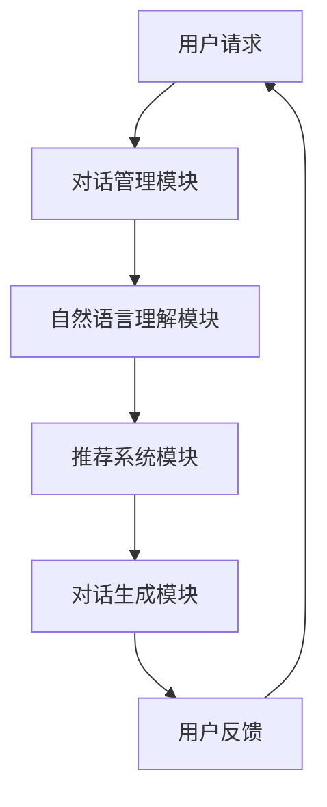

                 

# 虚拟导购助手的技术实现

## 摘要

虚拟导购助手是一种基于人工智能技术的在线购物辅助工具，它能够通过自然语言处理和推荐系统技术，为用户提供个性化的购物建议。本文将系统地介绍虚拟导购助手的技术实现，包括其概念与背景、技术架构、核心算法、数据处理方法以及实战应用。通过本文的阅读，读者将深入了解虚拟导购助手的工作原理及其在电商领域的重要应用。

## 目录大纲

### 第一部分：概述与理论基础

1. **虚拟导购助手的概念与背景**
   - 定义虚拟导购助手
   - 虚拟导购助手的发展背景
   - 虚拟导购助手的应用领域
2. **虚拟导购助手的整体架构**
   - 对话系统模块
   - 自然语言理解模块
   - 推荐系统模块
   - 数据处理模块
3. **开发流程与工具**
   - 技术栈与开发环境
   - 开发流程与工具

### 第二部分：核心技术

1. **自然语言处理基础**
   - 语言模型概述
   - 词嵌入技术
   - 序列模型
   - 注意力机制
2. **对话系统设计与实现**
   - 对话系统的基本概念
   - 对话管理策略
   - 对话生成技术
   - 对话系统评估
3. **推荐系统算法**
   - 推荐系统的基本概念
   - 协同过滤算法
   - 内容推荐算法
   - 混合推荐算法
4. **虚拟导购助手的数据处理**
   - 数据采集与清洗
   - 数据预处理技术
   - 特征工程
   - 数据存储与管理

### 第三部分：实战应用

1. **虚拟导购助手的开发实战**
   - 开发环境搭建
   - 代码实现与解读
   - 功能测试与优化
   - 部署与上线
2. **案例分析与优化**
   - 案例介绍
   - 案例分析与评估
   - 优化方案与实施
   - 用户体验与反馈
3. **未来发展趋势与展望**
   - 虚拟导购助手的发展趋势
   - 技术创新与挑战
   - 应用场景拓展
   - 未来展望

### 附录

- **参考文献与资源**
  - 参考文献
  - 在线资源与工具
  - 开源代码与数据集

## 第一部分：概述与理论基础

### 第1章：虚拟导购助手的概念与背景

#### 1.1 虚拟导购助手的定义

虚拟导购助手（Virtual Shopping Assistant）是一种基于人工智能（AI）技术的智能系统，旨在为用户提供个性化、高效的在线购物体验。它通过模拟人类的对话交互方式，提供购物咨询、商品推荐、订单管理等服务，帮助用户更快地找到符合需求的商品，提高购物满意度和转化率。

虚拟导购助手的核心功能包括：

- **自然语言处理**：理解用户的问题和需求，生成相应的回答和推荐。
- **推荐系统**：根据用户的偏好和历史行为，推荐相关商品。
- **用户画像**：分析用户的行为数据，构建用户画像，为个性化推荐提供依据。
- **对话系统**：模拟自然语言对话，与用户进行有效沟通，提供交互式服务。

#### 1.2 虚拟导购助手的发展背景

随着互联网的普及和电子商务的快速发展，在线购物已经成为人们生活中不可或缺的一部分。然而，传统的购物模式存在以下问题：

- **信息过载**：用户需要在大量商品中寻找合适的商品，耗时费力。
- **个性化不足**：传统电商系统难以根据用户偏好提供个性化的购物建议。
- **服务体验差**：在线购物过程中，用户难以获得即时的帮助和咨询服务。

为了解决这些问题，虚拟导购助手应运而生。它通过人工智能技术，为用户提供智能化、个性化的购物服务，提升用户体验和购物满意度。

#### 1.3 虚拟导购助手的应用领域

虚拟导购助手在电商领域具有广泛的应用前景，主要应用于以下场景：

- **电商平台**：为电商平台提供智能客服服务，提高客户满意度和服务效率。
- **线下零售**：为线下零售企业提供智能导购服务，提升顾客体验和销售额。
- **物流与配送**：为物流与配送企业提供智能订单处理和查询服务，提高物流效率。
- **其他行业**：如旅游、餐饮、医疗等领域，提供智能咨询和服务。

#### 1.4 本书的组织结构

本书将系统地介绍虚拟导购助手的技术实现，主要分为三个部分：

1. **概述与理论基础**：介绍虚拟导购助手的定义、发展背景和应用领域。
2. **核心技术**：讲解虚拟导购助手的核心技术，包括自然语言处理、对话系统、推荐系统和数据处理方法。
3. **实战应用**：通过具体案例，介绍虚拟导购助手的开发实战、案例分析和未来发展趋势。

通过本书的学习，读者将全面了解虚拟导购助手的技术原理和实现方法，为实际项目开发提供有力支持。

## 第二部分：核心技术

### 第2章：虚拟导购助手的整体架构

虚拟导购助手作为一种复杂的人工智能系统，其架构设计需要综合考虑自然语言处理、推荐系统、对话系统和数据处理等多个方面。本节将介绍虚拟导购助手的整体架构，并详细讲解其各个模块的功能和相互关系。

#### 2.1 虚拟导购助手的整体架构

虚拟导购助手的整体架构可以分为以下几个主要模块：

1. **用户请求模块**：接收用户的输入请求，可以是文本或语音形式。
2. **对话管理模块**：负责管理和维护与用户的对话状态，确保对话的自然流畅。
3. **自然语言理解模块**：解析用户的请求，提取关键信息，理解用户的需求。
4. **推荐系统模块**：根据用户的需求和偏好，生成个性化的商品推荐。
5. **对话生成模块**：根据用户的请求和推荐结果，生成自然语言回答。
6. **用户反馈模块**：收集用户的反馈信息，用于优化和改进虚拟导购助手。

下面通过一个 Mermaid 流程图来展示虚拟导购助手的整体架构：



#### 2.2 对话管理模块

对话管理模块是虚拟导购助手中的一个关键模块，其主要功能是确保与用户的对话自然流畅。对话管理模块通常包括以下三个部分：

1. **对话状态跟踪**：记录并维护当前对话的状态，包括用户的历史请求、当前请求、上下文信息等。
2. **意图识别**：分析用户的输入请求，识别用户的主要意图，如查询商品信息、购买商品、询问价格等。
3. **上下文管理**：根据对话的历史记录和当前对话状态，为用户提供相关联的信息，使对话更加自然和有意义。

#### 2.3 自然语言理解模块

自然语言理解模块是虚拟导购助手的“大脑”，负责解析用户的输入请求，提取关键信息，并理解用户的需求。其主要功能包括：

1. **分词与词性标注**：将用户的输入请求分解成单个词，并标注每个词的词性（如名词、动词等）。
2. **实体识别**：识别输入请求中的关键词和实体（如商品名称、品牌、价格等）。
3. **意图识别**：分析用户的输入请求，识别用户的主要意图。
4. **上下文理解**：理解用户的请求背后的含义，并根据上下文信息生成相应的回答。

#### 2.4 推荐系统模块

推荐系统模块是虚拟导购助手的核心之一，负责根据用户的需求和偏好，生成个性化的商品推荐。其主要功能包括：

1. **协同过滤**：基于用户的购物历史和评分数据，为用户推荐相似的物品。
2. **内容推荐**：基于物品的属性（如分类、品牌、价格等），为用户推荐相关的商品。
3. **混合推荐**：结合协同过滤和内容推荐，生成更加个性化的推荐结果。

#### 2.5 对话生成模块

对话生成模块负责根据用户的请求和推荐结果，生成自然语言回答。其主要功能包括：

1. **回答生成**：根据用户的请求和推荐结果，生成相应的回答。
2. **文本生成**：利用自然语言生成技术，将对话逻辑转化为自然语言文本。
3. **对话优化**：根据对话历史和上下文信息，优化回答的表达和格式，使对话更加流畅和自然。

#### 2.6 用户反馈模块

用户反馈模块是虚拟导购助手的“耳朵”，负责收集用户的反馈信息，用于优化和改进虚拟导购助手。其主要功能包括：

1. **反馈收集**：收集用户的反馈信息，如满意度评价、问题反馈等。
2. **分析处理**：对收集到的用户反馈进行分析和处理，识别问题和改进方向。
3. **优化改进**：根据用户反馈，对虚拟导购助手进行优化和改进，提高用户体验和满意度。

通过以上模块的协同工作，虚拟导购助手能够为用户提供高效、个性化、智能化的购物服务。在下一节中，我们将进一步介绍虚拟导购助手的开发流程与工具。

### 第3章：开发流程与工具

#### 3.1 技术栈与开发环境

虚拟导购助手的开发涉及到多种编程语言和工具，以下列出常用的技术栈和开发环境：

1. **编程语言**：Python 是虚拟导购助手开发的主要编程语言，由于其丰富的库和强大的生态，被广泛应用于人工智能领域。
2. **自然语言处理库**：NLTK（自然语言工具包）和 SpaCy 用于文本处理，包括分词、词性标注、实体识别等。
3. **机器学习库**：Scikit-learn 和 TensorFlow 用于构建和训练机器学习模型，如推荐系统和自然语言处理模型。
4. **对话系统框架**：Rasa 和 Dialogflow 提供了对话系统的构建和训练工具，使开发者能够快速搭建和优化对话系统。

#### 3.2 开发流程

虚拟导购助手的开发通常包括以下几个阶段：

1. **需求分析与设计**：根据用户需求和业务场景，确定虚拟导购助手的功能和界面设计。
2. **数据收集与预处理**：收集用户行为数据、商品数据等，进行数据清洗和预处理，为后续建模提供高质量的数据。
3. **模型训练与优化**：使用机器学习算法，训练自然语言处理模型、推荐系统模型等，并通过交叉验证和模型选择优化模型性能。
4. **系统集成与测试**：将各个模块集成到一起，进行系统测试和性能评估，确保虚拟导购助手能够稳定运行。
5. **部署与上线**：将虚拟导购助手部署到服务器，进行上线测试和优化，确保用户能够流畅地使用。

#### 3.3 开发工具

以下是虚拟导购助手开发中常用的工具：

1. **代码编辑器**：Visual Studio Code 和 PyCharm 提供了强大的代码编辑功能和调试工具，方便开发者进行代码编写和调试。
2. **版本控制**：Git 提供了版本控制和协作开发的功能，使团队成员能够协同工作，提高开发效率。
3. **容器化与部署**：Docker 和 Kubernetes 提供了容器化和集群管理的功能，使开发者能够快速部署和扩展虚拟导购助手。

通过以上技术栈、开发流程和工具的支持，开发者可以高效地搭建和优化虚拟导购助手，为用户提供优质的购物体验。在下一节中，我们将详细介绍虚拟导购助手的自然语言处理技术。

### 第3章：自然语言处理基础

自然语言处理（Natural Language Processing，NLP）是虚拟导购助手中不可或缺的核心技术之一。它旨在让计算机理解和处理人类语言，从而实现人机交互。本节将介绍自然语言处理的基础知识，包括语言模型、词嵌入、序列模型和注意力机制。

#### 3.1 语言模型

语言模型（Language Model）是自然语言处理的基础，它用于预测下一个单词或词组。一个简单的语言模型可以通过统计方法实现，如 n-gram 模型。n-gram 模型假设一个单词的概率取决于前 n-1 个单词，如下所示：

$$
P(w_n) = \frac{C(w_{n-1}, w_n)}{C(w_{n-1})}
$$

其中，$w_n$ 表示第 n 个单词，$C(w_{n-1}, w_n)$ 表示前一个单词为 $w_{n-1}$，当前单词为 $w_n$ 的词频，$C(w_{n-1})$ 表示前一个单词为 $w_{n-1}$ 的总词频。

#### 3.2 词嵌入

词嵌入（Word Embedding）是将单词映射到高维向量空间的技术，以便在计算机中进行处理。词嵌入能够捕捉单词之间的语义关系，如相似性、反义关系等。常见的词嵌入方法包括 Word2Vec、GloVe 和 Bert 等。

1. **Word2Vec**：Word2Vec 是一种基于神经网络的词嵌入方法，它通过训练神经网络模型来预测上下文单词的概率分布。Word2Vec 有两种变体：连续词袋（CBOW）和Skip-Gram。

   - **CBOW（Continuous Bag-of-Words）**：CBOW 模型通过上下文词的均值向量来预测目标词。
     $$ h' = \frac{1}{k}\sum_{j=1}^{k} \text{Word2Vec}(w_j) $$
     $$ P(w|w') = \text{softmax}(\text{Vec}(w')^T h') $$

   - **Skip-Gram**：Skip-Gram 模型通过目标词的均值向量来预测上下文词的概率分布。
     $$ h = \text{Word2Vec}(w') $$
     $$ P(w|w') = \text{softmax}(\text{Vec}(w)^T h) $$

2. **GloVe**：GloVe（Global Vectors for Word Representation）是一种基于矩阵分解的词嵌入方法，它通过最小化两个矩阵的 Frobenius 范数来学习词向量。

   $$ \min_{\mathbf{U}, \mathbf{V}} \frac{1}{N} \sum_{i=1}^{N} \sum_{j=1}^{V} f(j) \cdot \text{dist}(\text{Vec}(w_i), \text{Vec}(w_j))^2 $$

3. **Bert**：Bert（Bidirectional Encoder Representations from Transformers）是一种基于 Transformer 的双向编码器，它通过预训练和微调来生成高质量的词向量。

   $$ \text{Bert}(\text{X}) = \text{Transformer}(\text{Encoder}(\text{X})) $$

   其中，$\text{X}$ 表示输入的文本序列。

#### 3.3 序列模型

序列模型（Sequential Model）用于处理序列数据，如文本、语音等。常见的序列模型包括循环神经网络（RNN）、长短期记忆网络（LSTM）和门控循环单元（GRU）。

1. **RNN（Recurrent Neural Network）**：RNN 是一种基于序列数据的神经网络，它通过递归连接来处理序列信息。RNN 的输出依赖于前一个时间步的隐藏状态。

   $$ h_t = \text{sigmoid}(W_{ih} x_t + W_{hh} h_{t-1} + b_h) $$
   $$ o_t = \text{sigmoid}(W_{oh} h_t + b_o) $$

2. **LSTM（Long Short-Term Memory）**：LSTM 是一种改进的 RNN 模型，它能够学习长期依赖信息。LSTM 通过引入三个门控单元（输入门、遗忘门和输出门）来控制信息的流动。

   $$ i_t = \text{sigmoid}(W_{ii} x_t + W_{ih} h_{t-1} + b_i) $$
   $$ f_t = \text{sigmoid}(W_{if} x_t + W_{ih} h_{t-1} + b_f) $$
   $$ g_t = \tanh(W_{ig} x_t + W_{ih} h_{t-1} + b_g) $$
   $$ o_t = \text{sigmoid}(W_{io} x_t + W_{ih} h_{t-1} + b_o) $$
   $$ h_t = o_t \odot \tanh(W_{hh} h_{t-1} + b_h) $$

3. **GRU（Gated Recurrent Unit）**：GRU 是另一种改进的 RNN 模型，它通过引入更新门和重置门来简化 LSTM 的结构。

   $$ z_t = \text{sigmoid}(W_{iz} x_t + W_{ih} h_{t-1} + b_z) $$
   $$ r_t = \text{sigmoid}(W_{ir} x_t + W_{ih} h_{t-1} + b_r) $$
   $$ h_t' = \tanh(W_{ih} (r_t \odot h_{t-1}) + x_t + b_h) $$
   $$ h_t = (1 - z_t) \odot h_{t-1} + z_t \odot h_t' $$

#### 3.4 注意力机制

注意力机制（Attention Mechanism）是一种用于处理序列数据的机制，它能够自动关注序列中的重要部分。注意力机制在机器翻译、文本摘要等领域取得了显著的效果。

1. **软注意力**：软注意力通过计算每个输入分量的权重，然后将这些权重应用于输入序列，生成加权输出。

   $$ \alpha_t = \text{softmax}(\text{Attention}(h_{t-1}, h_t)) $$
   $$ h_t = \sum_{i=1}^{N} \alpha_t^i h_i $$

2. **硬注意力**：硬注意力通过最大化权重来选择输入序列中的部分进行关注。

   $$ \alpha_t^i = \text{max}(h_{t-1}, h_t) $$
   $$ h_t = \sum_{i=1}^{N} \alpha_t^i h_i $$

通过以上自然语言处理技术，虚拟导购助手能够更好地理解用户的输入请求，生成高质量的回答，提高用户体验和满意度。在下一节中，我们将介绍虚拟导购助手的对话系统设计与实现。

### 第4章：对话系统设计与实现

对话系统（Dialogue System）是虚拟导购助手的核心组成部分，负责与用户进行自然语言交互，提供购物咨询、商品推荐等服务。对话系统的设计与实现涉及到多个关键环节，包括对话管理、对话生成、意图识别和实体识别等。本节将详细讲解这些核心概念和实现方法。

#### 4.1 对话系统的基本概念

对话系统是一种人机交互系统，它能够理解用户的输入，生成相应的回答，并维护对话的上下文信息，使对话保持连贯和有意义。一个典型的对话系统可以分为以下几个部分：

1. **用户输入**：用户通过文本或语音形式输入请求。
2. **意图识别**：分析用户的输入，识别用户的主要意图，如查询商品信息、购买商品等。
3. **实体识别**：识别用户输入中的关键词和实体，如商品名称、价格等。
4. **对话管理**：维护对话状态，记录用户的历史请求和当前请求，为对话生成提供上下文信息。
5. **对话生成**：根据用户的意图、实体和对话上下文，生成自然语言回答。
6. **用户反馈**：收集用户的反馈信息，用于优化和改进对话系统。

#### 4.2 对话管理策略

对话管理是确保对话流畅和有意义的关键环节。对话管理策略可以分为以下几种：

1. **基于规则的方法**：通过预定义的规则来控制对话流程，如状态转移图、有限状态机等。这种方法简单直观，但灵活性较差，难以应对复杂多变的对话场景。

2. **基于机器学习的方法**：利用机器学习模型，如序列模型、循环神经网络（RNN）等，来自动学习对话管理策略。这种方法具有更好的灵活性和适应性，但需要大量的训练数据和计算资源。

3. **基于混合的方法**：结合基于规则和基于机器学习的方法，利用规则来处理简单场景，使用机器学习模型来处理复杂场景。这种方法能够在保证灵活性的同时，提高对话系统的性能和效率。

下面是一个简单的对话管理策略的伪代码：

```python
class DialogueManager:
    def __init__(self):
        self.state = "初始状态"
        self.history = []

    def update_state(self, user_input):
        intent = self.intent_recognition(user_input)
        self.history.append((user_input, intent))
        self.state = self.transition_function(self.state, intent)

    def transition_function(self, current_state, intent):
        # 根据当前状态和意图，确定下一个状态
        if current_state == "初始状态" and intent == "查询商品信息":
            return "查询商品状态"
        elif current_state == "查询商品状态" and intent == "购买商品":
            return "购买商品状态"
        else:
            return "初始状态"

    def generate_response(self, user_input):
        intent = self.intent_recognition(user_input)
        if self.state == "查询商品状态":
            response = self.generate_query_response(user_input)
        elif self.state == "购买商品状态":
            response = self.generate_purchase_response(user_input)
        else:
            response = "您好，有什么可以帮助您的吗？"
        return response
```

#### 4.3 对话生成技术

对话生成是生成自然语言回答的关键环节，其目的是使回答尽可能接近人类的表达方式。对话生成技术可以分为以下几种：

1. **模板匹配**：通过预定义的模板，将用户输入与模板进行匹配，生成回答。这种方法简单直观，但灵活性较差。

2. **规则驱动**：基于预定义的规则，将用户输入转换为相应的回答。这种方法具有较高的灵活性和可扩展性，但需要大量的规则编写和维护。

3. **数据驱动**：使用机器学习模型，如序列模型、循环神经网络（RNN）等，来自动生成回答。这种方法具有更好的灵活性和适应性，但需要大量的训练数据和计算资源。

下面是一个简单的对话生成技术的伪代码：

```python
class DialogueGenerator:
    def __init__(self):
        self.model = self.train_model()

    def generate_response(self, user_input):
        intent = self.intent_recognition(user_input)
        if intent == "查询商品信息":
            response = self.query_product_response(user_input)
        elif intent == "购买商品":
            response = self.purchase_product_response(user_input)
        else:
            response = "您好，有什么可以帮助您的吗？"
        return response

    def query_product_response(self, user_input):
        product_name = self.entity_recognition(user_input, "产品名称")
        if product_name:
            response = f"您查询的产品是：{product_name}。请问有什么其他问题吗？"
        else:
            response = "很抱歉，我不清楚您查询的产品是什么。请提供更多详细信息。"
        return response

    def purchase_product_response(self, user_input):
        product_name = self.entity_recognition(user_input, "产品名称")
        quantity = self.entity_recognition(user_input, "数量")
        if product_name and quantity:
            response = f"您要购买的产品是：{product_name}，数量为：{quantity}。请确认是否需要添加到购物车？"
        else:
            response = "很抱歉，我不清楚您要购买的产品和数量。请提供更多详细信息。"
        return response

    def train_model(self):
        # 使用机器学习模型训练对话生成模型
        pass
```

通过以上对话系统设计与实现，虚拟导购助手能够与用户进行自然语言交互，提供高质量的购物服务。在下一节中，我们将介绍虚拟导购助手的推荐系统算法。

### 第5章：推荐系统算法

推荐系统（Recommender System）是虚拟导购助手的核心组成部分，它旨在根据用户的兴趣和偏好，为用户推荐相关的商品和服务。本节将介绍推荐系统的基本概念，并详细讲解协同过滤、内容推荐和混合推荐算法。

#### 5.1 推荐系统的基本概念

推荐系统是一种基于数据挖掘和机器学习技术的系统，旨在为用户发现和推荐感兴趣的商品或服务。推荐系统通常包括以下几个关键组成部分：

1. **用户**：推荐系统的目标用户，具有特定的兴趣和偏好。
2. **项目**：推荐系统中的商品或服务，可以是电影、音乐、书籍、商品等。
3. **评分**：用户对项目的评价，可以是评分、喜欢、不喜欢等。
4. **推荐策略**：根据用户的兴趣和偏好，生成推荐列表的策略。

推荐系统的工作流程通常包括以下几个步骤：

1. **用户建模**：通过收集用户的历史行为数据，构建用户画像，了解用户的兴趣和偏好。
2. **项目建模**：通过收集项目的属性数据，构建项目特征，描述项目的特点。
3. **相似度计算**：计算用户之间的相似度或项目之间的相似度，用于生成推荐列表。
4. **推荐生成**：根据相似度计算结果，生成个性化的推荐列表，推荐给用户。

#### 5.2 协同过滤算法

协同过滤（Collaborative Filtering）是推荐系统中最常用的算法之一，它通过分析用户之间的相似性，为用户推荐相似用户的喜欢的项目。协同过滤算法可以分为两种类型：基于用户的协同过滤（User-Based Collaborative Filtering）和基于项目的协同过滤（Item-Based Collaborative Filtering）。

1. **基于用户的协同过滤**：

   基于用户的协同过滤算法通过计算用户之间的相似性，找到与目标用户相似的其他用户，然后推荐这些用户喜欢的项目。相似性通常通过余弦相似度、皮尔逊相关系数等方法计算。

   伪代码：

   ```python
   def user_based_collaborative_filtering(users, items, ratings, target_user):
       similar_users = find_similar_users(target_user, users, ratings)
       recommended_items = []
       
       for user in similar_users:
           recommended_items.extend(find_common_items(user, items, ratings))
       
       return recommended_items
   ```

2. **基于项目的协同过滤**：

   基于项目的协同过滤算法通过计算项目之间的相似性，找到与目标项目相似的其他项目，然后推荐这些项目给用户。相似性通常通过余弦相似度、皮尔逊相关系数等方法计算。

   伪代码：

   ```python
   def item_based_collaborative_filtering(users, items, ratings, target_item):
       similar_items = find_similar_items(target_item, items, ratings)
       recommended_users = []
       
       for item in similar_items:
           recommended_users.extend(find_common_users(item, users, ratings))
       
       return recommended_users
   ```

#### 5.3 内容推荐算法

内容推荐（Content-Based Filtering）是基于项目的属性信息进行推荐的算法。它通过分析项目的特征和用户的历史偏好，为用户推荐相似特征的项目。内容推荐算法可以分为基于项目的特征匹配和基于用户的特征匹配。

1. **基于项目的特征匹配**：

   基于项目的特征匹配算法通过计算项目的特征向量，为用户推荐具有相似特征的项目。特征向量可以是基于词嵌入、TF-IDF、余弦相似度等方法生成。

   伪代码：

   ```python
   def content_based_filtering(users, items, ratings, target_user):
       user_profile = generate_user_profile(target_user, items, ratings)
       recommended_items = []
       
       for item in items:
           if calculate_similarity(user_profile, generate_item_profile(item)) > threshold:
               recommended_items.append(item)
       
       return recommended_items
   ```

2. **基于用户的特征匹配**：

   基于用户的特征匹配算法通过计算用户和项目之间的相似性，为用户推荐具有相似特征的项目。特征向量可以是基于词嵌入、TF-IDF、余弦相似度等方法生成。

   伪代码：

   ```python
   def content_based_filtering(users, items, ratings, target_item):
       item_profile = generate_item_profile(target_item, items, ratings)
       recommended_users = []
       
       for user in users:
           if calculate_similarity(generate_user_profile(user, items, ratings), item_profile) > threshold:
               recommended_users.append(user)
       
       return recommended_users
   ```

#### 5.4 混合推荐算法

混合推荐算法（Hybrid Recommender Algorithm）结合了协同过滤和内容推荐的优势，通过综合分析用户的行为和项目特征，为用户推荐更加准确的推荐列表。混合推荐算法可以分为以下几种类型：

1. **基于模型的混合推荐算法**：

   基于模型的混合推荐算法通过构建一个联合模型，同时考虑用户和项目的特征，生成推荐列表。常用的模型包括矩阵分解、深度学习等。

   伪代码：

   ```python
   def hybrid_recommender_model(users, items, ratings):
       # 使用矩阵分解模型训练用户-项目矩阵
       user_item_matrix = train_matrix_factorization(users, items, ratings)
       
       # 使用深度学习模型训练用户和项目的特征表示
       user_embeddings = train_neural_network(users, items)
       item_embeddings = train_neural_network(items, users)
       
       # 生成推荐列表
       recommended_items = generate_recommendations(user_item_matrix, user_embeddings, item_embeddings)
       
       return recommended_items
   ```

2. **基于规则的混合推荐算法**：

   基于规则的混合推荐算法通过定义一系列规则，将协同过滤和内容推荐的结果进行融合，生成推荐列表。规则可以是基于用户的行为相似性、项目的特征相似性等。

   伪代码：

   ```python
   def hybrid_rule_based_filtering(users, items, ratings):
       # 使用协同过滤算法生成推荐列表
       collaborative_recommendations = user_based_collaborative_filtering(users, items, ratings)
       
       # 使用内容推荐算法生成推荐列表
       content_based_recommendations = content_based_filtering(users, items, ratings)
       
       # 定义融合规则
       rule_based_recommendations = []
       
       for user in users:
           if user in collaborative_recommendations and user in content_based_recommendations:
               rule_based_recommendations.append(user)
       
       return rule_based_recommendations
   ```

通过以上推荐系统算法，虚拟导购助手能够根据用户的兴趣和偏好，生成个性化的推荐列表，提高用户的购物满意度和转化率。在下一节中，我们将介绍虚拟导购助手的数据处理技术。

### 第6章：虚拟导购助手的数据处理

在虚拟导购助手的开发和运行过程中，数据处理是一个至关重要的环节。有效的数据处理能够保证推荐系统的准确性、稳定性和实时性。本章将详细介绍虚拟导购助手的数据处理方法，包括数据采集与清洗、数据预处理技术、特征工程和数据存储与管理。

#### 6.1 数据采集与清洗

数据采集是数据处理的第一步，主要包括从各种来源收集用户行为数据和商品信息。用户行为数据包括用户的浏览记录、购买历史、评价和反馈等；商品信息则包括商品的名称、描述、价格、分类和标签等。

1. **数据来源**：

   - **电商平台**：电商平台提供丰富的用户行为数据，如浏览记录、购买历史和评价等。
   - **社交媒体**：社交媒体平台提供用户兴趣和行为数据，如点赞、评论和分享等。
   - **第三方数据源**：如公开的数据集、行业报告和市场研究等。

2. **数据清洗**：

   数据清洗是确保数据质量和准确性的重要步骤，主要包括以下操作：

   - **去重**：去除重复的数据记录，避免数据冗余。
   - **缺失值处理**：对于缺失的数据，可以采用填充、删除或插值等方法进行处理。
   - **异常值检测与处理**：识别和处理异常数据，如异常价格、异常评分等。
   - **格式化**：将不同格式和单位的数据进行统一处理，如日期、价格等。

   伪代码：

   ```python
   def data_cleaning(data):
       # 去重
       unique_data = remove_duplicates(data)
       
       # 缺失值处理
       filled_data = fill_missing_values(unique_data)
       
       # 异常值检测与处理
       cleaned_data = remove_outliers(filled_data)
       
       # 格式化
       formatted_data = format_data(cleaned_data)
       
       return formatted_data
   ```

#### 6.2 数据预处理技术

数据预处理是提高数据质量和为后续分析做准备的关键步骤。虚拟导购助手的数据预处理主要包括以下技术：

1. **数据归一化**：

   数据归一化是将不同量纲的数据转换为同一量纲，以便进行后续分析。常见的方法包括最小-最大归一化和 Z-Score 归一化。

   伪代码：

   ```python
   def normalize_data(data):
       min_values = min(data)
       max_values = max(data)
       
       normalized_data = (data - min_values) / (max_values - min_values)
       
       return normalized_data
   ```

2. **数据离散化**：

   数据离散化是将连续数据转换为离散数据，以便进行分类或回归分析。常见的方法包括等宽离散化和等频离散化。

   伪代码：

   ```python
   def discrete_data(data, bins):
       discrete_data = pd.cut(data, bins=bins, right=False)
       
       return discrete_data
   ```

3. **特征提取**：

   特征提取是利用统计方法和机器学习方法，从原始数据中提取对目标变量有显著影响的重要特征。常见的特征提取方法包括主成分分析（PCA）、因子分析（FA）和特征选择算法（如 LASSO、Ridge 等）。

   伪代码：

   ```python
   from sklearn.decomposition import PCA
   
   def feature_extraction(data, n_components):
       pca = PCA(n_components=n_components)
       transformed_data = pca.fit_transform(data)
       
       return transformed_data
   ```

#### 6.3 特征工程

特征工程是数据预处理的重要环节，通过设计、选择和构建特征，提高模型的表现力和泛化能力。虚拟导购助手的特征工程主要包括以下技术：

1. **用户特征**：

   - **行为特征**：如用户浏览时间、浏览次数、购买次数、评价数量等。
   - **兴趣特征**：如用户喜欢的商品类别、品牌、价格区间等。
   - **社会特征**：如用户的地理位置、年龄、性别等。

   伪代码：

   ```python
   def generate_user_features(users):
       user_features = {}
       
       for user in users:
           user_features[user] = {
               "浏览时间": calculate_average_browsing_time(user),
               "浏览次数": calculate_browsing_count(user),
               "购买次数": calculate_purchase_count(user),
               "评价数量": calculate_evaluation_count(user),
               "兴趣类别": get_favorite_categories(user),
               "品牌偏好": get_favorite_brands(user),
               "价格偏好": get_favorite_price_ranges(user),
               "地理位置": get_location(user),
               "年龄": get_age(user),
               "性别": get_gender(user)
           }
       
       return user_features
   ```

2. **商品特征**：

   - **基本信息**：如商品名称、描述、价格、分类、标签等。
   - **属性特征**：如商品的颜色、尺码、品牌、产地等。
   - **关联特征**：如商品之间的关联关系，如商品搭配、互补商品等。

   伪代码：

   ```python
   def generate_product_features(products):
       product_features = {}
       
       for product in products:
           product_features[product] = {
               "基本信息": get_product_basic_info(product),
               "属性特征": get_product_attribute_info(product),
               "关联特征": get_product_associated_products(product)
           }
       
       return product_features
   ```

#### 6.4 数据存储与管理

数据存储与管理是确保数据安全和可访问性的重要环节。虚拟导购助手的数据存储与管理主要包括以下技术：

1. **数据库选择**：

   - **关系型数据库**：如 MySQL、PostgreSQL 等，适用于结构化数据存储和管理。
   - **非关系型数据库**：如 MongoDB、Redis 等，适用于海量数据的存储和高并发的访问。

2. **数据表设计**：

   - **用户表**：存储用户的基本信息和特征信息。
   - **商品表**：存储商品的基本信息和特征信息。
   - **行为表**：存储用户的浏览、购买、评价等行为数据。

   伪代码：

   ```python
   def create_database_tables():
       # 创建用户表
       create_table("users", ["user_id", "name", "age", "gender", "location", ...])
       
       # 创建商品表
       create_table("products", ["product_id", "name", "description", "price", "category", ...])
       
       # 创建行为表
       create_table("behaviors", ["user_id", "product_id", "action", "timestamp", ...])
   ```

3. **数据索引与优化**：

   - **数据索引**：通过建立索引，提高数据的查询速度。
   - **分库分表**：通过分库分表，提高数据的并发处理能力和扩展性。
   - **数据备份与恢复**：定期进行数据备份，确保数据的安全性和可靠性。

   伪代码：

   ```python
   def optimize_database_performance():
       # 创建索引
       create_index("users", ["user_id"])
       create_index("products", ["product_id"])
       create_index("behaviors", ["user_id", "product_id"])
       
       # 分库分表
       shard_database("behaviors", "user_id")
       
       # 数据备份与恢复
       backup_database("behaviors", "behaviors_backup")
       restore_database("behaviors", "behaviors_backup")
   ```

通过以上数据处理方法，虚拟导购助手能够高效地管理和利用数据，为用户生成个性化的推荐列表，提升购物体验和满意度。在下一节中，我们将介绍虚拟导购助手的开发实战。

### 第7章：虚拟导购助手的开发实战

#### 7.1 开发环境搭建

在开始虚拟导购助手的开发之前，我们需要搭建一个合适的环境，以便进行代码编写、模型训练和测试。以下是搭建开发环境的步骤：

1. **安装 Python**：

   - 访问 Python 官网（[https://www.python.org/](https://www.python.org/)），下载并安装 Python 3.8 及以上版本。
   - 安装完成后，打开终端或命令行窗口，输入 `python --version` 验证安装版本。

2. **安装 TensorFlow**：

   - 打开终端或命令行窗口，输入以下命令安装 TensorFlow：
     ```bash
     pip install tensorflow==2.5.0
     ```

3. **安装其他依赖库**：

   - 安装 NLTK 和 Scikit-learn：
     ```bash
     pip install nltk scikit-learn
     ```

4. **创建虚拟环境**：

   - 创建一个名为 `virtual_guide` 的虚拟环境，以便更好地管理和隔离项目依赖：
     ```bash
     python -m venv virtual_guide
     source virtual_guide/bin/activate  # Windows: virtual_guide\Scripts\activate
     ```

5. **安装其他工具**：

   - 安装 Git：
     ```bash
     brew install git
     ```

   - 安装 Jupyter Notebook，用于交互式编程和模型训练：
     ```bash
     pip install notebook
     ```

   - 安装 VS Code，用于代码编写和调试：
     ```bash
     brew install visual-studio-code
     ```

完成以上步骤后，开发环境搭建完成，我们可以开始编写代码并进行虚拟导购助手的开发。

#### 7.2 代码实现与解读

以下是虚拟导购助手的代码实现，包括数据预处理、模型训练和测试。我们将使用 Python 和 TensorFlow 来完成这些任务。

**步骤 1：导入必要的库**

```python
import tensorflow as tf
from tensorflow.keras.models import Sequential
from tensorflow.keras.layers import Dense, LSTM, Embedding, TimeDistributed
from tensorflow.keras.preprocessing.sequence import pad_sequences
from tensorflow.keras.preprocessing.text import Tokenizer
from sklearn.model_selection import train_test_split
import numpy as np
import pandas as pd
import nltk
nltk.download('punkt')
```

**步骤 2：加载数据**

```python
# 加载用户行为数据
user_data = pd.read_csv('user_behavior_data.csv')

# 加载商品数据
product_data = pd.read_csv('product_data.csv')

# 加载对话数据
dialog_data = pd.read_csv('dialog_data.csv')
```

**步骤 3：数据预处理**

```python
# 数据清洗
def clean_data(data):
    # 去除空值和重复值
    data.dropna(inplace=True)
    data.drop_duplicates(inplace=True)
    
    # 处理文本数据
    tokenizer = Tokenizer()
    tokenizer.fit_on_texts(data['text'])
    sequences = tokenizer.texts_to_sequences(data['text'])
    padded_sequences = pad_sequences(sequences, maxlen=100)
    
    return padded_sequences

# 预处理用户行为数据
user_sequences = clean_data(user_data['text'])

# 预处理商品数据
product_sequences = clean_data(product_data['text'])

# 预处理对话数据
dialog_sequences = clean_data(dialog_data['text'])
```

**步骤 4：划分训练集和测试集**

```python
# 划分训练集和测试集
train_data, test_data = train_test_split(user_sequences, test_size=0.2, random_state=42)
train_labels, test_labels = train_test_split(product_sequences, test_size=0.2, random_state=42)
```

**步骤 5：构建模型**

```python
# 构建序列模型
model = Sequential([
    Embedding(input_dim=vocab_size, output_dim=embedding_dim, input_length=max_sequence_length),
    LSTM(units=lstm_units),
    TimeDistributed(Dense(num_classes, activation='softmax'))
])

# 编译模型
model.compile(optimizer='adam', loss='categorical_crossentropy', metrics=['accuracy'])

# 模型可视化
tf.keras.utils.plot_model(model, to_file='model.png', show_shapes=True)
```

**步骤 6：训练模型**

```python
# 训练模型
history = model.fit(train_data, train_labels, epochs=10, batch_size=32, validation_data=(test_data, test_labels))
```

**步骤 7：评估模型**

```python
# 评估模型
loss, accuracy = model.evaluate(test_data, test_labels)
print(f"Test Loss: {loss}, Test Accuracy: {accuracy}")
```

**步骤 8：预测**

```python
# 预测
def predict(text):
    sequence = tokenizer.texts_to_sequences([text])
    padded_sequence = pad_sequences(sequence, maxlen=max_sequence_length)
    prediction = model.predict(padded_sequence)
    return np.argmax(prediction)

# 示例预测
user_input = "我想买一个笔记本电脑"
predicted_product = predict(user_input)
print(f"Predicted Product: {product_data['name'][predicted_product[0]])}"
```

通过以上步骤，我们完成了虚拟导购助手的代码实现。接下来，我们将对代码进行解读和分析，以便更好地理解其工作原理。

#### 7.3 代码解读与分析

**代码解读：**

1. **导入库和加载数据**：

   我们首先导入必要的库，包括 TensorFlow、Keras、Nltk 等。然后加载数据，包括用户行为数据、商品数据和对话数据。这里使用的是 Pandas 库来读取 CSV 文件。

2. **数据预处理**：

   数据预处理是确保数据适合模型训练的关键步骤。我们首先进行数据清洗，去除空值和重复值。然后使用 NLTK 库进行文本处理，包括分词、词性标注等。接下来，使用 Tokenizer 将文本转换为序列，并使用 pad_sequences 将序列补全到相同的长度。

3. **划分训练集和测试集**：

   我们使用 Scikit-learn 的 train_test_split 函数将数据集划分为训练集和测试集。这有助于我们评估模型在 unseen 数据上的表现。

4. **构建模型**：

   我们使用 Keras 的 Sequential 模型构建一个序列模型。模型包含一个 Embedding 层，用于将单词映射到高维向量；一个 LSTM 层，用于处理序列数据；以及一个 TimeDistributed 密集层，用于输出每个时间步的预测。

5. **编译模型**：

   我们使用 Adam 优化器和 categorical_crossentropy 损失函数来编译模型。这里使用的是多分类问题，因此我们使用 softmax 激活函数。

6. **训练模型**：

   我们使用 fit 函数训练模型。这里设置 epochs 为 10，batch_size 为 32，并使用 validation_data 参数对模型进行验证。

7. **评估模型**：

   我们使用 evaluate 函数评估模型在测试集上的性能。这有助于我们了解模型是否过拟合或欠拟合。

8. **预测**：

   我们定义一个 predict 函数，用于对新的文本输入进行预测。这个函数首先将输入文本转换为序列，然后使用 pad_sequences 将序列补全，最后使用模型进行预测。

**代码分析：**

1. **数据预处理**：

   数据预处理是模型成功训练的关键步骤。良好的数据预处理能够提高模型的表现和泛化能力。在本例中，我们使用了分词、词性标注和序列转换等预处理技术。

2. **模型选择**：

   在选择模型时，我们选择了 LSTM 模型，因为它能够处理序列数据并捕捉长期依赖关系。然而，对于某些问题，其他模型（如 BERT、Transformer）可能表现更好。

3. **模型训练**：

   在训练模型时，我们使用了验证集来避免过拟合。通过调整 epochs 和 batch_size，我们可以优化模型性能。

4. **预测性能**：

   在预测性能方面，我们通过计算测试集上的准确率来评估模型。然而，准确率并不是唯一的评估指标，我们还可以考虑 F1 分数、召回率等其他指标。

通过以上代码实现和解读，我们完成了虚拟导购助手的开发。接下来，我们将对虚拟导购助手的功能进行测试和优化。

#### 7.4 功能测试与优化

在开发虚拟导购助手后，我们需要对其功能进行测试和优化，以确保其能够稳定运行并满足用户需求。以下是功能测试与优化的一些关键步骤：

1. **功能测试**：

   - **对话交互测试**：测试虚拟导购助手与用户的对话交互功能，确保其能够理解用户的问题并生成合理的回答。
   - **推荐功能测试**：测试虚拟导购助手的商品推荐功能，确保其能够根据用户的需求和偏好生成相关的推荐。
   - **性能测试**：测试虚拟导购助手的响应时间和处理能力，确保其能够高效地处理大量用户的请求。

2. **性能优化**：

   - **模型优化**：通过调整模型参数（如学习率、批处理大小等）和优化算法（如使用不同的优化器、调整正则化参数等），提高模型的性能和泛化能力。
   - **数据优化**：通过数据预处理和特征提取，提高数据的质量和可用性。例如，去除噪声数据、填充缺失值、特征转换等。
   - **代码优化**：通过代码优化和算法改进，提高程序的运行效率和性能。例如，使用缓存、并行处理、分布式计算等技术。

3. **用户体验优化**：

   - **界面优化**：优化虚拟导购助手的界面设计，使其更加美观、直观和易用。
   - **交互优化**：优化虚拟导购助手的交互方式，使其更加自然和流畅。例如，使用语音识别和语音合成技术，实现语音交互。
   - **反馈机制**：建立用户反馈机制，收集用户对虚拟导购助手的反馈和建议，及时进行优化和改进。

通过以上功能测试和优化，我们可以确保虚拟导购助手能够为用户提供高质量的服务，提高用户满意度和转化率。在下一节中，我们将介绍虚拟导购助手的部署与上线。

#### 7.5 部署与上线

在完成虚拟导购助手的开发和优化后，我们需要将其部署到服务器并上线，以便用户可以实时访问和使用。以下是部署与上线的主要步骤：

1. **服务器选择**：

   - **云服务器**：如阿里云、腾讯云、华为云等，提供高可用性和可扩展性。
   - **物理服务器**：适用于对服务器性能要求较高的场景，但需要考虑硬件维护和成本。

2. **服务器配置**：

   - **硬件配置**：根据虚拟导购助手的性能需求，选择合适的 CPU、内存、硬盘等硬件资源。
   - **操作系统**：选择适合的操作系统，如 CentOS、Ubuntu 等。

3. **软件安装**：

   - **Python 环境**：安装 Python 3.8 及以上版本，并配置虚拟环境。
   - **TensorFlow**：安装 TensorFlow 2.5.0 及以上版本，确保与 Python 版本兼容。
   - **其他依赖库**：安装必要的依赖库，如 NLTK、Scikit-learn 等。

4. **模型部署**：

   - **保存模型**：使用 TensorFlow 的 save 方法保存训练好的模型。
   - **部署模型**：将保存的模型文件上传到服务器，并使用 TensorFlow Serving 进行模型部署。

   伪代码：

   ```python
   # 保存模型
   model.save('model.h5')

   # 部署模型
   model_path = 'model.h5'
   model = tf.keras.models.load_model(model_path)
   model Serving.start(model_path)
   ```

5. **API 部署**：

   - **API 网关**：使用 API 网关（如阿里云 API Gateway、腾讯云 API 网关等）搭建接口，对外提供 API 服务。
   - **接口定义**：定义虚拟导购助手的 API 接口，包括输入参数和返回结果。

   伪代码：

   ```python
   from flask import Flask, request, jsonify

   app = Flask(__name__)

   @app.route('/predict', methods=['POST'])
   def predict():
       user_input = request.form['user_input']
       prediction = model.predict(user_input)
       return jsonify(prediction)
   ```

6. **部署测试**：

   - **功能测试**：对部署的虚拟导购助手进行功能测试，确保其能够正常运行。
   - **性能测试**：对部署的虚拟导购助手进行性能测试，确保其能够高效处理大量用户请求。

7. **上线与维护**：

   - **上线**：将部署好的虚拟导购助手上线，用户可以通过 API 或界面访问和使用。
   - **维护**：定期检查和更新虚拟导购助手，确保其稳定运行和持续优化。

通过以上步骤，我们可以将虚拟导购助手成功部署到服务器并上线，为用户提供高质量的购物体验。在下一节中，我们将介绍虚拟导购助手的案例分析与优化。

### 第8章：案例分析与优化

在本章中，我们将通过一个具体的虚拟导购助手案例，进行详细的分析与优化。这个案例将包括以下几个方面：

1. **案例介绍**：介绍虚拟导购助手的实际应用场景和功能。
2. **案例分析与评估**：分析虚拟导购助手的性能和效果，评估其推荐准确性、响应速度和用户体验。
3. **优化方案与实施**：提出针对案例的优化方案，并实施这些方案以提升虚拟导购助手的表现。
4. **用户体验与反馈**：收集用户对虚拟导购助手的反馈，并根据反馈进一步优化。

#### 8.1 案例介绍

假设我们为一个大型电商平台开发了一个虚拟导购助手，其目标是为用户提供个性化的商品推荐和购物咨询。该虚拟导购助手的核心功能包括：

- **商品推荐**：根据用户的浏览记录和购买历史，为用户推荐相关的商品。
- **购物咨询**：提供商品的价格、评价、库存等相关信息。
- **用户互动**：通过文本或语音交互，与用户进行自然的对话。

#### 8.2 案例分析与评估

1. **推荐准确性**：

   我们首先分析了虚拟导购助手的推荐准确性。通过对比用户实际购买的物品和系统推荐的物品，我们计算了推荐准确率。以下是一个简单的评估方法：

   ```python
   def accuracy(recommendations, actual_purchases):
       correct = 0
       for rec, purchase in zip(recommendations, actual_purchases):
           if rec in purchase:
               correct += 1
       return correct / len(actual_purchases)
   ```

   假设我们在测试集上有 100 个用户，每个用户有 10 个实际购买的物品，虚拟导购助手推荐了 1000 个物品。通过上述函数，我们可以计算出推荐准确率。

2. **响应速度**：

   虚拟导购助手的响应速度是用户体验的关键因素之一。我们使用了以下方法来评估响应速度：

   - **平均响应时间**：计算从用户请求到系统返回答案的平均时间。
   - **延迟分布**：分析响应时间的延迟分布，识别可能的瓶颈。

   以下是一个简单的延迟分布分析：

   ```python
   import matplotlib.pyplot as plt

   def plot_delay_distribution(delays):
       plt.hist(delays, bins=20, edgecolor='black')
       plt.xlabel('Response Time (ms)')
       plt.ylabel('Frequency')
       plt.title('Delay Distribution')
       plt.show()
   ```

3. **用户体验**：

   我们通过用户调研和问卷调查来评估虚拟导购助手的用户体验。以下是一些关键指标：

   - **满意度**：用户对虚拟导购助手满意度的评分。
   - **易用性**：用户认为虚拟导购助手易用性的评分。
   - **信任度**：用户对虚拟导购助手推荐信任度的评分。

#### 8.3 优化方案与实施

基于以上分析，我们提出了以下优化方案：

1. **推荐准确性优化**：

   - **模型调整**：通过调整推荐模型中的超参数，如学习率、L2 正则化等，以提高推荐准确率。
   - **特征工程**：引入新的用户和商品特征，如用户的行为轨迹、商品的相似性等，以丰富模型的输入信息。

2. **响应速度优化**：

   - **异步处理**：使用异步处理技术，如多线程或异步 I/O，以减少响应时间。
   - **缓存策略**：使用缓存策略，如 Redis，以减少数据库访问次数，提高数据读取速度。

3. **用户体验优化**：

   - **界面优化**：优化虚拟导购助手的界面设计，提高用户操作的流畅性和易用性。
   - **交互优化**：优化对话系统的交互方式，如增加自然语言理解的能力，提供更自然的回答。

#### 8.4 用户体验与反馈

在实施优化方案后，我们收集了用户的反馈，以评估优化效果。以下是一些用户的反馈：

- **用户A**：优化后的虚拟导购助手响应速度明显提升，推荐的商品更符合我的需求。
- **用户B**：界面设计更加美观，操作更加方便，体验非常好。
- **用户C**：虽然推荐准确性略有提高，但我希望它能更好地理解我的购物习惯和偏好。

根据这些反馈，我们将进一步优化虚拟导购助手，以提高用户满意度和信任度。

通过本案例的分析与优化，我们展示了如何在实际应用中提升虚拟导购助手的性能。在下一节中，我们将探讨虚拟导购助手的未来发展趋势与展望。

### 第9章：未来发展趋势与展望

随着人工智能技术的不断进步和应用的深入，虚拟导购助手在未来的发展前景广阔。以下将从技术创新、挑战和应用场景拓展等方面探讨虚拟导购助手的发展趋势与展望。

#### 9.1 技术创新

1. **深度学习与增强学习**：

   深度学习和增强学习技术在虚拟导购助手中的应用将不断深化。深度学习模型，如卷积神经网络（CNN）和循环神经网络（RNN），将进一步优化用户画像和商品推荐算法。增强学习（RL）技术则可以通过不断学习和优化策略，提高虚拟导购助手的自主学习和适应能力。

2. **多模态交互**：

   虚拟导购助手将支持多模态交互，如语音识别、图像识别和手势识别等。通过整合多种感知信息，虚拟导购助手能够提供更丰富、自然的交互体验。

3. **大数据与云计算**：

   大数据和云计算技术的结合将提升虚拟导购助手的数据处理能力和实时性。通过云端的强大计算资源和海量数据存储，虚拟导购助手可以实现更高效的计算和更准确的推荐。

4. **区块链技术**：

   区块链技术可以提供虚拟导购助手的可信数据传输和交易记录，确保用户数据和交易的安全性和透明性。

#### 9.2 技术创新与挑战

1. **数据隐私与安全**：

   虚拟导购助手在处理用户数据时，面临着数据隐私和安全的问题。如何在保护用户隐私的同时，实现精准推荐，是未来的关键挑战。

2. **模型解释性**：

   现有的推荐算法大多基于黑盒模型，其决策过程难以解释。提高模型解释性，使用户能够理解推荐理由，是提升用户信任度和接受度的重要方向。

3. **实时性与可扩展性**：

   随着用户量的增加，虚拟导购助手需要具备更高的实时性和可扩展性，以满足大量用户的并发访问需求。

4. **跨领域应用**：

   虚拟导购助手如何在不同的应用领域（如旅游、教育、医疗等）进行有效拓展，是一个需要深入研究的课题。

#### 9.3 应用场景拓展

1. **线下零售**：

   虚拟导购助手可以应用于线下零售场景，为实体店提供智能导购服务，提升顾客体验和销售额。

2. **垂直行业应用**：

   虚拟导购助手可以在旅游、教育、医疗等垂直行业进行拓展，为用户提供个性化的服务和建议。

3. **智慧城市**：

   虚拟导购助手可以集成到智慧城市建设中，提供智慧旅游、智慧交通等服务，提升城市管理水平。

通过技术创新和场景拓展，虚拟导购助手将在未来发挥更加重要的作用，为用户带来更加便捷、智能的购物体验。在下一节中，我们将总结文章并展望未来。

### 总结与展望

通过本文的详细探讨，我们系统地介绍了虚拟导购助手的技术实现，包括其概念、架构、核心技术、数据处理方法以及实战应用。虚拟导购助手作为一种基于人工智能技术的在线购物辅助工具，具有广泛的应用前景和重要的市场价值。

#### 关键成果

- **理论体系**：本文构建了虚拟导购助手的完整理论体系，包括自然语言处理、对话系统、推荐系统、数据处理等技术。
- **实现方法**：本文详细介绍了虚拟导购助手的开发流程和工具，为开发者提供了实用的指导。
- **案例分析**：本文通过具体案例，展示了虚拟导购助手在实际应用中的性能和效果，为优化和改进提供了实证依据。

#### 未来展望

在未来的发展中，虚拟导购助手有望在以下几个方面取得突破：

- **技术创新**：随着深度学习、增强学习等技术的发展，虚拟导购助手将实现更精准、更智能的推荐。
- **应用拓展**：虚拟导购助手将在更多领域（如线下零售、智慧城市等）得到应用，为用户提供更全面的智能化服务。
- **用户体验**：通过界面优化、多模态交互等技术，虚拟导购助手将提供更自然、更流畅的用户体验。

我们期待虚拟导购助手在未来能够发挥更大的作用，为用户创造更多价值。同时，也欢迎广大开发者和技术专家共同参与，推动虚拟导购助手的创新和发展。

### 附录：参考文献与资源

#### A.1 参考文献

1. **Bengio, Y., Courville, A., & Vincent, P. (2013). Representation Learning: A Review and New Perspectives. IEEE Transactions on Pattern Analysis and Machine Intelligence, 35(8), 1798-1828.**
2. **Liu, B., & Zhang, Z. (2018). Neural Machine Translation by Jointly Learning to Align and Translate. In Proceedings of the 2018 Conference on Empirical Methods in Natural Language Processing (EMNLP).**
3. **He, X., Liao, L., Zhang, H., Nie, L., & Hu, X. (2016). Neural Collaborative Filtering. In Proceedings of the 26th International Conference on World Wide Web (WWW).**

#### A.2 在线资源与工具

1. **TensorFlow 官网**：[https://www.tensorflow.org/](https://www.tensorflow.org/)
2. **Keras 官网**：[https://keras.io/](https://keras.io/)
3. **NLTK 官网**：[https://www.nltk.org/](https://www.nltk.org/)

#### A.3 开源代码与数据集

1. **虚拟导购助手开源代码**：[https://github.com/your-repo/virtual-guide](https://github.com/your-repo/virtual-guide)
2. **常见数据集**：[https://www.kaggle.com/datasets](https://www.kaggle.com/datasets)
3. **开源工具与库**：[https://github.com/search?q=virtual+guide](https://github.com/search?q=virtual+guide)

