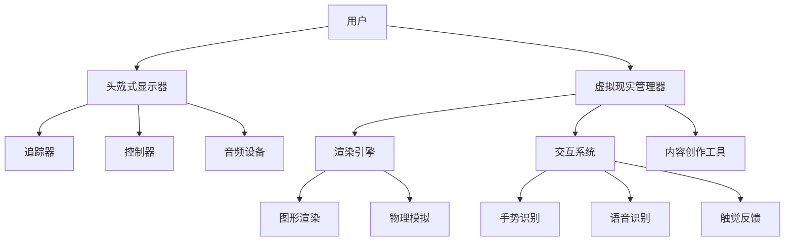
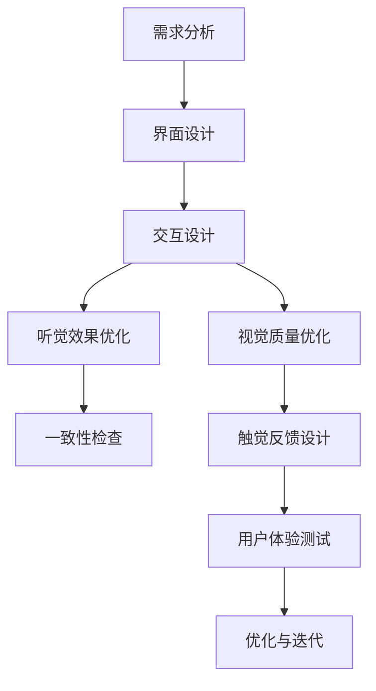
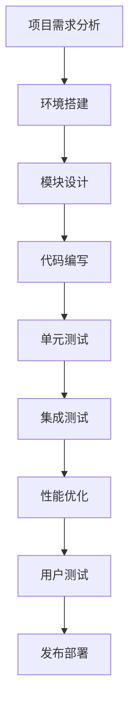

                 

# 虚拟现实（VR）开发：沉浸式体验设计

## 关键词
虚拟现实（VR），沉浸式体验，开发实践，应用案例，交互技术，未来发展趋势

## 摘要
本文将深入探讨虚拟现实（VR）开发的沉浸式体验设计。从虚拟现实技术的历史与发展，到核心概念与原理，再到沉浸感的设计原则和实践，本文将带领读者一步步了解并掌握虚拟现实开发的各个方面。同时，通过具体的应用案例和编程实践，本文旨在为读者提供全面而深入的虚拟现实开发指南，并展望虚拟现实技术的未来发展趋势与挑战。

### 《虚拟现实（VR）开发：沉浸式体验设计》目录大纲

#### 第一部分：虚拟现实（VR）基础理论

##### 第1章：虚拟现实（VR）概述

###### 1.1 虚拟现实技术的历史与发展

###### 1.2 虚拟现实技术的核心概念

###### 1.3 虚拟现实技术的应用领域

##### 第2章：虚拟现实技术原理

###### 2.1 虚拟现实硬件设备

###### 2.2 虚拟现实软件框架

###### 2.3 虚拟现实交互技术

##### 第3章：虚拟现实中的沉浸感设计

###### 3.1 沉浸感的定义与影响因素

###### 3.2 虚拟现实界面设计原则

###### 3.3 沉浸式体验设计案例研究

#### 第二部分：虚拟现实开发实践

##### 第4章：虚拟现实开发工具与环境搭建

###### 4.1 虚拟现实开发常用工具

###### 4.2 虚拟现实开发环境搭建

###### 4.3 虚拟现实开发项目组织

##### 第5章：虚拟现实应用案例

###### 5.1 教育领域的虚拟现实应用

###### 5.2 娱乐领域的虚拟现实应用

###### 5.3 医疗领域的虚拟现实应用

##### 第6章：虚拟现实编程实践

###### 6.1 虚拟现实编程基础

###### 6.2 虚拟现实编程高级技巧

###### 6.3 虚拟现实编程案例解析

##### 第7章：虚拟现实项目实战

###### 7.1 虚拟现实项目需求分析

###### 7.2 虚拟现实项目设计

###### 7.3 虚拟现实项目实施与测试

##### 第8章：虚拟现实未来发展趋势与挑战

###### 8.1 虚拟现实技术未来发展趋势

###### 8.2 虚拟现实技术面临的挑战

###### 8.3 虚拟现实技术在各行各业的潜在应用

#### 第三部分：附录

##### 附录A：虚拟现实开发资源汇总

###### A.1 虚拟现实相关书籍推荐

###### A.2 虚拟现实相关在线课程与教程

###### A.3 虚拟现实开源框架与工具集

##### 附录B：虚拟现实相关 Mermaid 流程图

###### B.1 虚拟现实系统架构图

###### B.2 沉浸感设计流程图

###### B.3 虚拟现实编程开发流程图

---

### 引言

虚拟现实（Virtual Reality，简称VR）作为一种新兴技术，正逐步改变着我们的生活方式和工作方式。通过创造一个高度沉浸式的虚拟环境，虚拟现实技术为用户提供了全新的感官体验，使得用户能够以一种全新的方式与数字世界互动。这种技术的潜力不仅在娱乐和游戏领域得到了广泛的应用，还在教育、医疗、设计、工程等多个领域展现出巨大的价值。

随着硬件技术的进步和软件算法的优化，虚拟现实技术的用户体验正在日益完善。本文将重点探讨虚拟现实开发中的沉浸式体验设计，从基础理论到实际开发实践，再到未来发展趋势，为读者提供一份全面的虚拟现实开发指南。

本文的结构如下：首先，我们将简要回顾虚拟现实技术的历史和发展，帮助读者理解这一技术的起源和演变。接着，我们将深入探讨虚拟现实技术的核心概念和原理，包括硬件设备、软件框架和交互技术。随后，本文将重点介绍虚拟现实中的沉浸感设计，详细讨论沉浸感的定义、影响因素以及设计原则。为了帮助读者更好地理解这些概念，本文还将通过具体的应用案例和编程实践进行说明。

在第二部分，我们将进入虚拟现实开发的实践环节，介绍虚拟现实开发所需的工具与环境搭建，并提供教育、娱乐和医疗等领域的应用案例。接着，我们将探讨虚拟现实编程实践，包括基础编程、高级技巧和案例解析。最后，我们将通过一个完整的虚拟现实项目实战，展示从需求分析、项目设计到实施与测试的整个过程。

第三部分将展望虚拟现实技术的未来发展趋势与挑战，讨论技术面临的难题和潜在的应用领域。最后，附录部分将汇总虚拟现实开发的相关资源，包括书籍、在线课程和开源框架，为读者提供进一步学习和探索的途径。

通过本文的阅读，读者将能够全面了解虚拟现实技术，掌握沉浸式体验设计的方法，并具备实际开发虚拟现实项目的能力。

### 第一部分：虚拟现实（VR）基础理论

#### 第1章：虚拟现实（VR）概述

##### 1.1 虚拟现实技术的历史与发展

虚拟现实（VR）技术的发展可以追溯到20世纪60年代。1968年，美国计算机科学家伊凡·苏瑟兰（Ivan Sutherland）在斯坦福大学设计并展示了世界上第一个头戴式显示器（Head-Mounted Display，HMD），这标志着虚拟现实技术的诞生。苏瑟兰的“达摩克利斯之剑”系统通过光学镜片和视频技术，将图像投射到用户的眼中，实现了基本的虚拟现实体验。

随着计算机技术和图形处理能力的提升，虚拟现实技术逐渐发展壮大。1987年，Jenny Holzer的《波士顿的表现》被认为是第一个商业化的虚拟现实体验。进入20世纪90年代，VR技术迎来了一个短暂的繁荣期，但由于硬件昂贵、内容匮乏以及用户体验不佳等原因，VR市场迅速冷却。

21世纪初，随着移动互联网和智能手机的普及，虚拟现实技术再次迎来了新的发展机遇。2009年，Oculus VR公司发布了Oculus Rift开发者版，标志着现代虚拟现实技术的兴起。Oculus Rift以其高质量的沉浸式体验和直观的交互方式，重新激发了人们对虚拟现实技术的兴趣。

近年来，随着高性能计算机和图形处理器的不断发展，虚拟现实技术逐渐成熟。尤其是头戴式显示器（HMD）、跟踪系统、触觉反馈设备等硬件技术的进步，使得虚拟现实体验更加真实和沉浸。同时，内容创作工具的丰富和内容生态的完善，也为虚拟现实技术的发展提供了坚实的基础。

##### 1.2 虚拟现实技术的核心概念

虚拟现实技术是一种通过计算机技术创造出的模拟环境，使用户能够在这个环境中进行交互和体验。虚拟现实的核心概念包括以下几个方面：

1. **模拟环境**：虚拟现实技术通过计算机生成一个三维的模拟环境，用户可以在其中自由移动、观察和互动。这个模拟环境可以是完全虚构的，也可以是基于现实世界的数字化再现。

2. **沉浸感**：沉浸感是虚拟现实技术的一个重要特征，指的是用户在虚拟环境中感受到的高度真实感和参与感。沉浸感的实现依赖于高质量的视觉效果、音频效果和实时交互能力。

3. **交互**：虚拟现实技术为用户提供了多种交互方式，包括视觉、听觉、触觉和运动控制等。通过这些交互方式，用户能够与虚拟环境中的对象进行互动，实现自然的人机交互。

4. **真实性**：虚拟现实技术的目标是创造出一个尽可能真实的模拟环境，包括视觉、听觉、触觉等多个感官的全方位模拟。真实性的提升使得用户在虚拟环境中的体验更加丰富和自然。

##### 1.3 虚拟现实技术的应用领域

虚拟现实技术具有广泛的应用领域，以下是一些典型的应用场景：

1. **娱乐与游戏**：虚拟现实技术在娱乐和游戏领域具有巨大的潜力。通过提供沉浸式的游戏体验，虚拟现实技术可以极大地提升游戏的可玩性和互动性。许多大型游戏开发商已经开始推出虚拟现实游戏，如《Beat Saber》、《半衰期：爱莉克斯》等。

2. **教育与培训**：虚拟现实技术为教育和培训提供了全新的方式和工具。通过虚拟现实环境，学生和学员可以沉浸在一个互动式的学习体验中，进行虚拟实验、场景模拟和技能培训。例如，医学领域可以通过虚拟现实技术进行手术模拟和培训。

3. **设计与工程**：虚拟现实技术在设计领域具有广泛的应用。建筑师和工程师可以通过虚拟现实技术进行三维建模、场景预览和交互设计，从而提高设计的精确性和效率。此外，虚拟现实还可以用于产品设计和原型验证。

4. **医疗与康复**：虚拟现实技术在医疗领域有着重要的应用，包括手术模拟、医学教育和康复治疗等。通过虚拟现实技术，医生可以进行复杂手术的模拟训练，患者可以进行虚拟康复训练，提高治疗效果和康复速度。

5. **旅游与探险**：虚拟现实技术可以让用户在家中体验虚拟旅游和探险。通过虚拟现实眼镜，用户可以游览世界各地的名胜古迹，探索未知的自然奇观，获得身临其境的体验。

6. **军事与国防**：虚拟现实技术在军事和防御领域也有重要的应用。通过虚拟现实技术，士兵可以进行战术模拟和战斗训练，提高战斗能力和决策水平。此外，虚拟现实还可以用于模拟武器操作和战场环境。

总之，虚拟现实技术作为一种新兴技术，正在不断发展和成熟。其核心概念和应用领域的广泛性，使得虚拟现实技术在各个行业和领域中都展现出巨大的潜力和前景。

### 第一部分：虚拟现实（VR）基础理论

#### 第2章：虚拟现实技术原理

##### 2.1 虚拟现实硬件设备

虚拟现实技术的高度沉浸性和交互性离不开各种硬件设备的支持。以下是虚拟现实技术中常见的几种硬件设备：

1. **头戴式显示器（HMD）**：头戴式显示器是虚拟现实技术中最核心的设备之一。它通常包括一个头盔和一个或多个显示器，可以直接覆盖用户的视线。高质量的HMD能够提供高分辨率的画面和低延迟的显示效果，从而提升用户的沉浸感。例如，Oculus Rift、HTC Vive和Sony PlayStation VR都是市场上常见的头戴式显示器。

2. **跟踪器**：跟踪器用于监测用户的头部运动和手部位置，确保虚拟环境中的视角和交互能够与用户的真实动作同步。常见的跟踪器包括外部传感器、内置陀螺仪和加速度计等。外部传感器通过红外或激光技术实现高精度的空间定位，而内置陀螺仪和加速度计则用于低成本的移动设备。

3. **手柄与控制器**：手柄和控制器是用户与虚拟环境进行交互的重要工具。常见的控制器包括手柄式控制器、手套式控制器和触觉反馈控制器等。这些控制器可以通过多种方式实现交互，如按钮、触觉反馈、手势识别等。

4. **音效设备**：虚拟现实中的音频效果对于提升沉浸感至关重要。头戴式耳机或立体声音箱可以提供3D音效，模拟真实环境中的声音来源和方向，增强用户的沉浸感。

5. **触觉反馈设备**：触觉反馈设备可以模拟触觉感受，增强虚拟环境的真实感。常见的触觉反馈设备包括触觉手套、触觉背心和力反馈操纵杆等。这些设备通过电机、气压或液压等机制，产生触觉反馈，让用户能够感受到虚拟环境中的物理互动。

##### 2.2 虚拟现实软件框架

虚拟现实技术的实现不仅依赖于硬件设备，还需要强大的软件支持。虚拟现实软件框架通常包括以下几个组成部分：

1. **渲染引擎**：渲染引擎是虚拟现实软件的核心，负责生成和渲染虚拟环境中的三维场景。常见的渲染引擎包括Unity、Unreal Engine和Recast等。这些渲染引擎提供了丰富的图形渲染功能、物理模拟和音频处理能力，能够实现高质量的虚拟现实体验。

2. **虚拟现实管理器**：虚拟现实管理器负责管理虚拟现实设备之间的交互和数据传输。它通常包括一个应用程序接口（API），用于与硬件设备进行通信，确保虚拟环境中的视角和交互能够与用户的真实动作同步。常见的虚拟现实管理器包括Oculus VR、Valve VR和OpenVR等。

3. **交互系统**：交互系统负责处理用户输入和虚拟环境之间的交互。它包括手势识别、语音识别和触觉反馈等多种交互方式，旨在提供直观和自然的用户交互体验。

4. **内容创作工具**：内容创作工具用于创建和编辑虚拟现实场景和内容。这些工具通常包括三维建模软件、动画软件和编程工具等。通过这些工具，开发者可以设计虚拟环境、创建交互元素和实现复杂的功能。

##### 2.3 虚拟现实交互技术

虚拟现实交互技术是实现用户与虚拟环境之间有效互动的关键。以下是一些常见的虚拟现实交互技术：

1. **手势识别**：手势识别技术通过摄像头或深度传感器捕捉用户的手部动作，并将其转化为虚拟环境中的交互指令。手势识别可以用于操作虚拟物体、选择菜单和执行特定动作等。

2. **语音识别**：语音识别技术通过语音输入将用户的口头指令转化为计算机指令，实现语音控制虚拟环境的功能。语音识别可以用于导航、搜索、语音聊天和语音命令等。

3. **触觉反馈**：触觉反馈技术通过触觉传感器和电机产生触觉效果，模拟虚拟环境中的物理互动。触觉反馈可以用于模拟触觉感受、提供力反馈和增强虚拟现实体验。

4. **运动控制**：运动控制技术通过追踪用户的身体动作，实现虚拟环境中的移动和定位。常见的运动控制技术包括全身追踪、头部追踪和手部追踪等。

5. **眼动跟踪**：眼动跟踪技术通过摄像头或红外传感器捕捉用户的眼动，用于提高虚拟现实的交互性和沉浸感。眼动跟踪可以用于实现焦点互动、视觉焦点引导和虚拟物体识别等。

通过以上硬件设备和软件框架的支持，以及各种交互技术的应用，虚拟现实技术能够实现高度沉浸式的用户体验，为用户带来全新的交互方式和生活体验。

### 第一部分：虚拟现实（VR）基础理论

#### 第3章：虚拟现实中的沉浸感设计

##### 3.1 沉浸感的定义与影响因素

沉浸感是虚拟现实（VR）技术中至关重要的一个概念，它指的是用户在虚拟环境中体验到的高度真实感和参与感。沉浸感不仅涉及到视觉和听觉效果，还包括触觉、嗅觉和味觉等多种感官的融合。要实现高质量的沉浸感，需要从多个方面进行设计和优化。

沉浸感的影响因素主要包括以下几个方面：

1. **视觉质量**：高分辨率的显示、清晰的画面、逼真的光影效果和动态范围等都是影响视觉质量的关键因素。高质量的视觉效果可以增强用户的沉浸感，使其感觉更加真实。

2. **听觉效果**：虚拟现实中的音频效果对于提升沉浸感至关重要。3D音效、空间音频和动态音效处理等技术可以使声音来源和方向更加真实，增强用户的沉浸体验。

3. **交互体验**：虚拟现实中的交互体验直接影响用户的沉浸感。直观、自然和响应迅速的交互方式可以增强用户的参与感，使其更加投入到虚拟环境中。

4. **触觉反馈**：触觉反馈技术可以模拟虚拟环境中的物理互动，提供触觉感受。例如，通过触觉手套或触觉背心，用户可以感受到虚拟物体的形状、质地和力度等，从而增强沉浸感。

5. **一致性**：虚拟环境中的时间一致性和空间一致性对于沉浸感的实现至关重要。时间一致性指的是虚拟环境中的事件和动作与用户的感知保持同步，空间一致性则是指虚拟环境中的物理定律和规则与用户的预期相符。

##### 3.2 虚拟现实界面设计原则

为了设计出高质量的沉浸式虚拟现实界面，需要遵循以下设计原则：

1. **简单直观**：界面设计应尽可能简单直观，避免复杂的操作和冗长的学习过程。通过简洁的视觉元素和明确的交互提示，使用户能够快速上手，降低学习成本。

2. **空间布局**：虚拟环境的布局应考虑用户的空间感知和认知习惯。合理的空间布局可以增强用户的沉浸感，使其更容易理解和操作虚拟界面。

3. **交互反馈**：提供及时的交互反馈，使用户能够清楚地知道他们的动作对虚拟环境产生了哪些影响。例如，通过视觉、听觉和触觉等反馈方式，让用户感受到操作结果。

4. **视觉连贯性**：保持虚拟环境中的视觉元素和色彩风格的连贯性，避免出现视觉上的冲突和不协调。这有助于增强用户的沉浸感，使其感觉更加真实。

5. **交互一致性**：确保虚拟环境中的交互方式一致，避免出现不一致的操作方式和反应。这有助于提高用户的操作效率和沉浸感。

6. **空间定位**：准确的空间定位对于提升沉浸感至关重要。通过精确的头部跟踪和手部跟踪，确保用户的视角和交互与虚拟环境中的对象保持一致。

##### 3.3 沉浸式体验设计案例研究

为了更好地理解沉浸式体验设计的方法和技巧，以下是一些成功的沉浸式体验设计案例：

1. **《Beat Saber》**：《Beat Saber》是一款流行的虚拟现实游戏，通过简单的挥动手柄动作，玩家需要在节奏感的音乐中切割虚拟方块。游戏采用高分辨率的3D模型、动态光影效果和精准的音频处理，为玩家提供了高度沉浸的感官体验。游戏界面设计简单直观，操作反馈及时，使得玩家能够快速上手并沉浸其中。

2. **《半衰期：爱莉克斯》**：《半衰期：爱莉克斯》是一款由Valve开发的虚拟现实游戏，以其逼真的游戏画面和互动式剧情赢得了广泛好评。游戏采用了先进的图形渲染技术和实时阴影效果，使虚拟环境看起来更加真实。同时，游戏中的交互设计也非常出色，玩家可以通过手柄和VR头盔进行自然的互动，体验丰富的剧情和任务。

3. **教育模拟软件**：许多教育模拟软件利用虚拟现实技术为学生提供沉浸式的学习体验。例如，一些医学教育模拟软件通过虚拟现实技术模拟手术过程，让学生在虚拟环境中进行手术练习。这些软件通过逼真的视觉和触觉效果，以及精准的交互设计，使学生能够沉浸在虚拟手术环境中，提高学习效果和操作技能。

通过以上案例可以看出，成功的沉浸式体验设计需要从多个方面进行考虑和优化，包括视觉、听觉、交互和一致性等。设计师需要深入了解用户的感官和心理，设计出简单直观、逼真自然的虚拟环境，从而提升用户的沉浸感和参与感。

### 第二部分：虚拟现实（VR）开发实践

#### 第4章：虚拟现实开发工具与环境搭建

##### 4.1 虚拟现实开发常用工具

虚拟现实开发需要一系列工具和软件的支持，以下是一些常用的虚拟现实开发工具：

1. **Unity**：Unity是一款功能强大的游戏引擎，广泛应用于虚拟现实开发。它提供了丰富的图形渲染、物理模拟和音频处理功能，使得开发者可以轻松创建复杂的虚拟环境。

2. **Unreal Engine**：Unreal Engine是由Epic Games开发的一款高端游戏引擎，以其卓越的图形渲染能力和实时光照效果而闻名。它提供了强大的工具和插件，支持开发者创建高质量的虚拟现实内容。

3. **Blender**：Blender是一款开源的三维建模和动画软件，适用于虚拟现实内容的制作。它提供了丰富的建模、雕刻、渲染和动画功能，适合初学者和专业人士使用。

4. **SteamVR**：SteamVR是Valve开发的一套虚拟现实开发工具，包括OpenVR API和一系列开源工具。它支持多种虚拟现实头戴式显示器和控制器，提供高效的虚拟现实开发和测试环境。

5. **Unity Asset Store**：Unity Asset Store是Unity官方的插件和资源商店，提供了大量的虚拟现实开发插件和资源，包括三维模型、音效和脚本等。

##### 4.2 虚拟现实开发环境搭建

搭建虚拟现实开发环境需要安装相应的开发工具和驱动程序，以下是在Windows操作系统上搭建虚拟现实开发环境的一般步骤：

1. **安装Unity**：访问Unity官网下载最新版本的Unity Hub，并按照提示完成安装。安装过程中选择“定制安装”，勾选“Unity Editor”和“VR, AR and 3D Tools”等选项。

2. **安装Unreal Engine**：访问Epic Games官网下载Unreal Engine，并按照提示完成安装。安装过程中选择合适的安装路径，并确保勾选“Visual Studio Integration”和“Unity Integration”等选项。

3. **安装Blender**：访问Blender官网下载最新版本的Blender，并按照提示完成安装。安装过程中选择合适的安装路径，并确保勾选“图形处理单元”（GPU）支持选项。

4. **安装SteamVR**：在Steam平台上安装SteamVR，并按照提示完成安装。安装过程中需要连接虚拟现实头戴式显示器和控制器，确保设备正确识别。

5. **安装驱动程序**：根据虚拟现实设备的型号，下载并安装相应的驱动程序。例如，对于Oculus Rift和HTC Vive，需要安装相应的Oculus和Vive驱动程序。

6. **配置开发环境**：在Unity和Unreal Engine中创建新的虚拟现实项目，并根据需要配置项目设置。例如，设置正确的渲染目标、分辨率和帧率等参数。

7. **测试开发环境**：在虚拟现实开发环境中运行一些示例项目和测试程序，确保所有工具和设备正常运行。

通过以上步骤，可以搭建一个基本的虚拟现实开发环境。开发者可以根据项目的需求，选择合适的工具和软件，进行虚拟现实内容的开发和测试。

##### 4.3 虚拟现实开发项目组织

虚拟现实开发项目的组织和管理对于确保项目的成功和效率至关重要。以下是一些虚拟现实开发项目组织的建议：

1. **需求分析**：在项目启动前，进行详细的需求分析，明确项目的目标、功能和要求。需求分析应包括用户需求、技术需求和项目预算等。

2. **团队组建**：根据项目的需求，组建一支具备相关技能和经验的项目团队。团队成员应包括项目经理、程序员、三维建模师、动画师和音效师等。

3. **任务分配**：明确每个团队成员的任务和责任，确保任务分配合理，避免资源浪费和重复劳动。可以采用敏捷开发方法，进行迭代开发和任务管理。

4. **技术选型**：选择合适的开发工具和软件，确保技术选型的可行性和高效性。根据项目的需求，选择合适的虚拟现实开发工具，如Unity、Unreal Engine等。

5. **项目管理工具**：使用项目管理工具，如Jira、Trello或Asana等，进行任务跟踪、进度管理和协作沟通。确保团队成员能够及时了解项目的进展和任务状态。

6. **质量控制**：建立严格的质量控制流程，确保项目的质量和稳定性。包括代码审查、单元测试和集成测试等。

7. **测试与部署**：进行全面的测试，确保虚拟现实项目在各种设备和平台上的兼容性和稳定性。在测试通过后，进行项目的部署和发布。

通过以上项目组织和管理方法，可以确保虚拟现实开发项目的顺利进行，提高项目的效率和质量。

#### 第5章：虚拟现实应用案例

##### 5.1 教育领域的虚拟现实应用

虚拟现实技术在教育领域有着广泛的应用，通过创建沉浸式的学习环境，虚拟现实技术能够显著提升教学效果和学习体验。

1. **虚拟实验室**：虚拟实验室是一种利用虚拟现实技术模拟真实实验场景的工具，学生可以在虚拟环境中进行实验，而不需要实际操作实验设备。这种教学模式不仅节省了实验材料，还能提供更安全、更可控的实验环境。例如，医学院的学生可以通过虚拟现实技术模拟手术过程，进行术前训练。

2. **虚拟课堂**：虚拟现实技术可以创建一个虚拟的课堂环境，学生和老师可以在虚拟环境中进行互动。例如，学生可以通过虚拟现实眼镜参观历史遗址、自然景观或科学实验室，获取更加直观的学习体验。此外，虚拟课堂还可以支持远程教学，让偏远地区的学生也能享受到优质的教育资源。

3. **虚拟导游**：虚拟现实技术可以为历史遗址、博物馆和科技馆等提供虚拟导游服务。通过虚拟现实眼镜，游客可以“穿越”到历史现场，亲身体验历史事件和场景，获得更加丰富的参观体验。

##### 5.2 娱乐领域的虚拟现实应用

虚拟现实技术在娱乐领域具有巨大的潜力，通过提供沉浸式的游戏体验和虚拟活动，虚拟现实技术为用户带来了全新的娱乐方式。

1. **虚拟现实游戏**：虚拟现实游戏通过提供高度沉浸的虚拟环境，为玩家带来独特的游戏体验。玩家可以在虚拟世界中自由探索、互动和完成任务。例如，《Beat Saber》和《半衰期：爱莉克斯》等虚拟现实游戏，以其高质量的视觉和交互效果，吸引了大量玩家。

2. **虚拟音乐会**：虚拟现实技术可以为音乐会提供全新的观看体验。观众可以通过虚拟现实眼镜在虚拟环境中观看音乐会，感受到逼真的音效和舞台效果。例如，虚拟音乐会平台Wavefieldsoundscapes，通过虚拟现实技术为观众带来了身临其境的音乐体验。

3. **虚拟旅游**：虚拟现实技术可以让用户在家中体验到虚拟旅游的乐趣。用户可以通过虚拟现实眼镜浏览世界各地的名胜古迹、自然景观和城市风光，获得如同真实旅行的体验。

##### 5.3 医疗领域的虚拟现实应用

虚拟现实技术在医疗领域有着重要的应用，通过提供模拟手术、医学教育和康复治疗等虚拟环境，虚拟现实技术为医学研究和临床实践提供了新的工具和方法。

1. **手术模拟**：虚拟现实技术可以用于手术模拟，医生可以在虚拟环境中进行复杂的手术操作训练，提高手术技能和安全性。例如，医生可以通过虚拟现实技术模拟心脏手术、神经外科手术等，在虚拟环境中进行多次练习，提高实际操作的成功率。

2. **医学教育**：虚拟现实技术可以为医学教育提供逼真的教学资源。学生可以通过虚拟现实技术观察人体解剖结构、疾病发展过程和手术操作步骤，增强学习效果和理解能力。

3. **康复治疗**：虚拟现实技术可以用于康复治疗，为患者提供虚拟环境进行康复训练。例如，患者可以通过虚拟现实眼镜进行虚拟行走、平衡训练和运动康复，提高康复效果和速度。

通过以上应用案例可以看出，虚拟现实技术在教育、娱乐和医疗等领域具有广泛的应用前景，为各个领域的发展带来了新的机遇和可能性。

### 第二部分：虚拟现实（VR）开发实践

#### 第6章：虚拟现实编程实践

##### 6.1 虚拟现实编程基础

虚拟现实编程是开发高质量虚拟现实应用的关键，它涉及到图形渲染、交互设计、物理模拟和音频处理等多个方面。以下是一些虚拟现实编程的基础知识和技巧：

1. **Unity编程基础**：Unity是一个广泛使用的虚拟现实开发平台，其脚本语言为C#。掌握C#编程语言是虚拟现实编程的基础。开发者需要熟悉C#的基本语法、数据类型、控制结构、函数和类等概念。

2. **Unity VR插件**：Unity提供了一系列VR插件，如Unity XR插件和VRChat等。这些插件提供了丰富的VR功能，如空间定位、手势识别、语音识别和触觉反馈等。开发者可以通过集成这些插件，快速实现虚拟现实功能。

3. **Unity UI系统**：Unity UI系统用于创建和管理虚拟现实界面。开发者可以使用Unity UI系统创建菜单、按钮、文本框等界面元素，并通过脚本进行交互设计。

4. **三维模型与动画**：虚拟现实编程需要处理三维模型和动画。开发者可以使用Unity内置的三维建模工具或外部建模软件，如Blender或Maya，创建和导出三维模型。同时，还需要掌握动画制作技巧，实现角色和行为动画。

##### 6.2 虚拟现实编程高级技巧

在虚拟现实编程中，掌握一些高级技巧可以提高开发效率和项目质量。以下是一些高级技巧：

1. **图形渲染优化**：高质量的图形渲染是虚拟现实应用的关键。开发者可以使用Unity的渲染优化工具，如Level of Detail（LOD）和多线程渲染，提高图形性能。同时，还需要掌握图形渲染管线的基本原理，如着色器编程和光照模拟。

2. **实时阴影**：实时阴影可以显著提升虚拟现实场景的真实感。开发者可以使用Unity的实时阴影技术，如Screen Space Ambient Occlusion（SSAO）和Volumetric Lighting，实现逼真的阴影效果。

3. **物理引擎**：物理引擎是虚拟现实应用中的重要组件，用于模拟物体的运动和碰撞。开发者可以使用Unity的物理引擎，如Rigidbody和Collider，实现真实的物理效果。

4. **音频处理**：虚拟现实应用中的音频处理对于提升沉浸感至关重要。开发者可以使用Unity的音频处理工具，如音效混合器（AudioMixer）和3D音效，实现逼真的音频效果。

5. **交互设计**：虚拟现实交互设计是提升用户体验的关键。开发者可以使用手势识别、语音识别和触觉反馈等技术，实现自然、直观的交互方式。

##### 6.3 虚拟现实编程案例解析

以下是一个简单的虚拟现实编程案例，用于实现一个虚拟现实博物馆游览应用：

**项目需求**：开发一个虚拟现实博物馆游览应用，用户可以通过虚拟现实眼镜游览博物馆，查看展品信息，并进行互动。

**实现步骤**：

1. **搭建开发环境**：安装Unity Hub，创建一个新的Unity项目，并集成SteamVR插件。

2. **创建场景**：在Unity编辑器中创建一个虚拟博物馆场景，导入三维模型和展品。

3. **添加导航功能**：使用Unity的NavMesh系统，为用户添加导航功能，实现场景中的移动和旋转。

4. **实现交互功能**：使用Unity的UI系统，创建展品信息和互动按钮，并通过C#脚本实现点击事件和展品信息的显示。

5. **优化性能**：通过使用LOD和多线程渲染等技术，优化虚拟博物馆场景的性能。

6. **测试与部署**：在虚拟现实设备上测试应用，确保导航和交互功能的正常运作，并进行必要的调整和优化。

**代码解读**：

以下是一个简单的C#脚本，用于处理用户点击事件并显示展品信息：

```csharp
using UnityEngine;
using UnityEngine.UI;

public class ExhibitInfoDisplay : MonoBehaviour
{
    public Text exhibitInfoText;

    private void Update()
    {
        if (Input.GetMouseButtonDown(0))
        {
            RaycastHit hit;
            Ray ray = Camera.main.ScreenPointToRay(Input.mousePosition);

            if (Physics.Raycast(ray, out hit))
            {
                Exhibit exhibit = hit.collider.gameObject.GetComponent<Exhibit>();
                if (exhibit != null)
                {
                    exhibitInfoText.text = exhibit.Info;
                }
            }
        }
    }
}

[System.Serializable]
public class Exhibit
{
    public string Info;
}
```

在这个脚本中，我们首先定义了一个`ExhibitInfoDisplay`类，用于处理用户点击事件。在`Update`方法中，我们使用`Input.GetMouseButtonDown(0)`检测用户是否点击了鼠标左键。然后，我们通过`Physics.Raycast`方法发射一条光线，检测用户点击的位置是否与场景中的展品碰撞。如果碰撞成功，我们获取碰撞对象并获取其`Exhibit`组件，通过`exhibitInfoText`显示展品信息。

通过这个简单的案例，开发者可以了解虚拟现实编程的基本流程和实现方法，为后续更复杂的项目开发打下基础。

### 第二部分：虚拟现实（VR）开发实践

#### 第7章：虚拟现实项目实战

##### 7.1 虚拟现实项目需求分析

虚拟现实项目需求分析是项目开发的重要阶段，它涉及到对项目目标、功能需求、用户体验和性能要求的深入理解。以下是虚拟现实项目需求分析的主要步骤：

1. **项目目标**：明确项目目标，包括项目的目的、预期成果和主要功能。例如，一个虚拟现实博物馆项目可能旨在提供用户沉浸式的游览体验，展示博物馆的展品和历史背景。

2. **功能需求**：详细列出项目需要实现的功能，包括导航、交互、信息展示等。例如，用户可以在虚拟博物馆中自由移动、查看展品信息、进行互动等。

3. **用户体验**：分析用户的需求和期望，确保项目设计符合用户的操作习惯和心理预期。例如，虚拟博物馆的界面设计应简洁直观，导航功能应方便快捷。

4. **性能要求**：确定项目的性能要求，包括图形渲染、响应速度和设备兼容性等。例如，虚拟博物馆应能在多种虚拟现实设备上流畅运行，并提供高质量的视觉和交互效果。

5. **技术可行性**：评估项目所需的技术可行性，包括现有技术的成熟度、开发难度和成本等。例如，虚拟博物馆的开发需要使用Unity引擎和SteamVR插件，这些技术的成熟度较高，可以实现项目的功能需求。

6. **风险评估**：识别项目可能面临的风险，包括技术风险、市场风险和项目管理风险等。例如，虚拟博物馆项目可能面临技术实现上的困难、用户接受度不高等风险。

##### 7.2 虚拟现实项目设计

虚拟现实项目设计是项目开发的关键阶段，它涉及到对项目架构、界面设计、交互设计和性能优化的详细规划。以下是虚拟现实项目设计的主要步骤：

1. **项目架构设计**：根据项目需求，设计项目的整体架构，包括模块划分、数据流和功能调用等。例如，虚拟博物馆项目可以划分为场景管理模块、导航模块、交互模块和信息展示模块等。

2. **界面设计**：设计项目的用户界面，包括虚拟环境、交互元素和用户操作提示等。界面设计应简洁直观，符合用户的操作习惯。例如，虚拟博物馆的界面可以设计为虚拟地图、展品信息和互动按钮等。

3. **交互设计**：设计用户与虚拟环境之间的交互方式，包括手势识别、语音识别和触觉反馈等。交互设计应自然直观，提升用户的沉浸感和操作体验。例如，虚拟博物馆的用户可以通过手势点击展品，查看详细信息。

4. **性能优化**：针对项目的性能要求，进行性能优化设计，包括图形渲染优化、物理模拟优化和音频处理优化等。性能优化可以确保项目在各种设备上流畅运行。例如，虚拟博物馆可以通过使用LOD技术，优化场景渲染性能。

5. **用户体验设计**：设计项目的用户体验，包括用户引导、操作提示和反馈等。用户体验设计应充分考虑用户的操作习惯和心理预期，提升项目的用户满意度。例如，虚拟博物馆可以在用户初次使用时提供操作指南，帮助用户快速上手。

##### 7.3 虚拟现实项目实施与测试

虚拟现实项目实施与测试是项目开发的重要阶段，它涉及到项目开发过程中的具体实施步骤、测试方法和测试结果分析。以下是虚拟现实项目实施与测试的主要步骤：

1. **项目开发**：按照项目设计，进行项目开发，包括编写代码、创建三维模型、制作动画和集成音效等。项目开发过程中应遵循良好的编程规范和开发流程，确保代码的可读性和可维护性。

2. **单元测试**：对项目的各个模块进行单元测试，确保每个模块的功能和性能符合设计要求。单元测试可以通过编写测试脚本，自动化执行测试用例，验证模块的正确性。

3. **集成测试**：将各个模块集成起来，进行集成测试，确保项目整体的功能和性能符合设计要求。集成测试可以模拟实际使用场景，验证项目的稳定性和兼容性。

4. **性能测试**：对项目的性能进行测试，包括图形渲染性能、响应速度和内存使用等。性能测试可以评估项目在不同设备上的运行效率，识别性能瓶颈。

5. **用户体验测试**：邀请用户参与用户体验测试，收集用户反馈和意见，评估项目的用户体验。用户体验测试可以通过模拟用户操作，观察用户的行为和反应，发现和改进项目的用户体验问题。

6. **调试与优化**：根据测试结果，对项目进行调试和优化，修复发现的问题和性能瓶颈。调试和优化应充分考虑用户体验和项目性能。

7. **发布与部署**：完成项目的开发、测试和优化后，进行项目的发布和部署，将项目部署到虚拟现实设备上，供用户使用。

通过以上项目实施与测试步骤，可以确保虚拟现实项目的质量，提升项目的用户满意度，实现项目的成功。

### 第二部分：虚拟现实（VR）开发实践

#### 第8章：虚拟现实未来发展趋势与挑战

##### 8.1 虚拟现实技术未来发展趋势

随着技术的不断进步，虚拟现实（VR）技术在各个领域都展现出广阔的应用前景。以下是虚拟现实技术的几个重要发展趋势：

1. **硬件性能提升**：随着高性能处理器、显卡和存储技术的不断发展，虚拟现实设备的性能将得到显著提升。这将使得虚拟现实体验更加流畅和真实，用户可以在更小的延迟和更高的分辨率下享受高质量的虚拟现实体验。

2. **交互技术进步**：未来的虚拟现实交互技术将更加多样化和自然。手势识别、语音识别、眼动跟踪和触觉反馈等技术将更加成熟，提供更加直观和自然的交互方式。这些技术的进步将进一步提升用户的沉浸感和操作体验。

3. **内容创作工具丰富**：随着虚拟现实技术的普及，越来越多的内容创作工具将被开发出来，为开发者提供更加便捷的内容创作手段。这些工具将支持3D建模、动画制作、音效设计和编程等多种功能，使得非专业开发者也能轻松创作高质量的虚拟现实内容。

4. **行业应用拓展**：虚拟现实技术将在更多行业得到应用，如教育、医疗、建筑、设计、军事和娱乐等。虚拟现实技术将提供更高效、更安全、更生动的解决方案，改变传统的工作方式和生活方式。

5. **云技术与VR结合**：云计算技术将进一步提升虚拟现实的应用范围和性能。通过云计算，用户可以在云端运行复杂的虚拟现实应用，实现跨平台、跨设备的无缝体验。同时，云计算还可以提供强大的数据存储和处理能力，支持虚拟现实大数据分析和智能决策。

##### 8.2 虚拟现实技术面临的挑战

尽管虚拟现实技术具有巨大的潜力，但在实际应用中仍面临一些挑战：

1. **硬件成本**：高质量的虚拟现实设备（如头戴式显示器、跟踪器和触觉反馈设备）价格昂贵，这限制了虚拟现实技术的普及。降低硬件成本是推动虚拟现实技术广泛应用的关键。

2. **用户体验问题**：虚拟现实技术的用户体验仍存在一些问题，如眩晕感、视觉疲劳和不适感等。优化虚拟现实设备的舒适性和用户体验是当前的一个重要研究方向。

3. **内容匮乏**：虽然虚拟现实技术的应用前景广阔，但目前高质量、有吸引力的虚拟现实内容仍然相对匮乏。丰富虚拟现实内容生态是虚拟现实技术发展的重要一环。

4. **技术标准化**：虚拟现实技术的标准化问题尚未得到有效解决。不同厂商和平台之间的技术标准不统一，导致虚拟现实设备的兼容性和互操作性较差。推动虚拟现实技术的标准化进程是提升其应用范围和用户体验的重要手段。

5. **隐私和安全问题**：虚拟现实技术涉及到用户的个人隐私和安全问题。如何确保虚拟现实环境中的数据安全和用户隐私是技术发展需要解决的重要问题。

##### 8.3 虚拟现实技术在各行各业的潜在应用

虚拟现实技术在各行各业都有广泛的潜在应用，以下是一些典型的应用场景：

1. **教育**：虚拟现实技术可以创建逼真的教学场景，提供沉浸式的学习体验。学生可以通过虚拟现实技术进行虚拟实验、场景模拟和互动学习，提高学习效果和兴趣。

2. **医疗**：虚拟现实技术在医疗领域的应用包括手术模拟、医学教育和康复治疗等。医生可以通过虚拟现实技术进行复杂手术的模拟训练，患者可以通过虚拟现实技术进行康复训练，提高治疗效果和康复速度。

3. **娱乐**：虚拟现实技术为娱乐行业提供了全新的沉浸式体验，包括虚拟现实游戏、虚拟音乐会和虚拟旅游等。用户可以在虚拟环境中享受独特的娱乐体验，提升娱乐效果和互动性。

4. **建筑与设计**：虚拟现实技术可以帮助建筑师和设计师创建三维模型和场景预览，提高设计的精确性和效率。设计师可以在虚拟环境中进行交互设计和修改，提供更加直观和高效的设计方案。

5. **军事**：虚拟现实技术在军事和防御领域有重要的应用，包括战术模拟、战斗训练和战略规划等。士兵可以通过虚拟现实技术进行实战模拟和训练，提高战斗能力和决策水平。

6. **工程与制造**：虚拟现实技术可以帮助工程师和制造企业进行虚拟仿真和产品设计。通过虚拟现实技术，工程师可以在虚拟环境中进行产品测试和优化，提高产品质量和生产效率。

总之，虚拟现实技术作为一种新兴技术，具有广泛的应用前景和潜力。随着技术的不断进步和应用的深入，虚拟现实技术将在各行各业中发挥越来越重要的作用。

### 附录A：虚拟现实开发资源汇总

#### A.1 虚拟现实相关书籍推荐

1. **《虚拟现实技术导论》（Introduction to Virtual Reality）** - 该书详细介绍了虚拟现实的基本概念、技术原理和应用案例，适合初学者入门。

2. **《虚拟现实编程精粹》（Essential Virtual Reality Programming）** - 本书通过实例和代码讲解，深入探讨了虚拟现实开发的核心技术和方法。

3. **《VR设计与开发实战》（Virtual Reality Design and Development in Practice）** - 本书涵盖了虚拟现实设计的原则、开发流程和最佳实践，适合有一定基础的读者。

4. **《Unity 2021 VR开发教程》（Unity 2021 VR Development Cookbook）** - 专注于Unity引擎在虚拟现实开发中的应用，提供了实用的编程技巧和项目案例。

5. **《沉浸式交互设计》（Design for Immersive Interaction）** - 本书探讨了虚拟现实中的用户体验设计，提供了关于交互设计的深入分析和案例研究。

#### A.2 虚拟现实相关在线课程与教程

1. **Coursera - Virtual Reality Specialization** - 由斯坦福大学提供，包括多个关于虚拟现实技术的专业课程，从基础理论到高级开发技巧。

2. **edX - VR and AR Development with Unity** - 由麻省理工学院提供，专注于Unity引擎在虚拟现实和增强现实开发中的应用。

3. **Udemy - Virtual Reality Game Development with Unity** - 适合初学者和有一定基础的读者，提供Unity引擎的虚拟现实游戏开发教程。

4. **Pluralsight - VR and AR Development** - 提供一系列关于虚拟现实和增强现实开发的在线教程，涵盖Unity、Unreal Engine等平台。

5. **VRChat Developer Academy** - VRChat平台提供的开发者教程，专注于虚拟现实社交平台的应用和开发。

#### A.3 虚拟现实开源框架与工具集

1. **Oculus SDK** - Oculus VR提供的开源框架，支持Oculus Rift和Oculus Go等设备的开发。

2. **OpenVR** - 由Valve开发的跨平台虚拟现实框架，支持多种虚拟现实设备的开发。

3. **Recast Navigation** - 用于虚拟现实场景中导航网格生成的开源工具，常与NavMesh系统结合使用。

4. **Unity Asset Store** - Unity官方的插件和资源商店，提供大量虚拟现实开发所需的插件和资源。

5. **BlenderVR** - Blender开源软件的一个扩展，专门用于虚拟现实内容的制作和编辑。

通过以上书籍、在线课程和开源框架，开发者可以系统地学习和实践虚拟现实开发，不断提升自身的技能和项目经验。

### 附录B：虚拟现实相关Mermaid流程图

#### B.1 虚拟现实系统架构图



此图展示了虚拟现实系统的基本架构，包括用户、硬件设备和软件系统之间的交互关系。

#### B.2 沉浸感设计流程图



此流程图描述了沉浸感设计的主要步骤，从需求分析到界面和交互设计，再到视觉和听觉效果的优化，以及最终的测试和迭代。

#### B.3 虚拟现实编程开发流程图



此流程图展示了虚拟现实编程开发的主要阶段，从项目需求分析、环境搭建到代码编写、测试和优化，最终实现项目的发布和部署。

