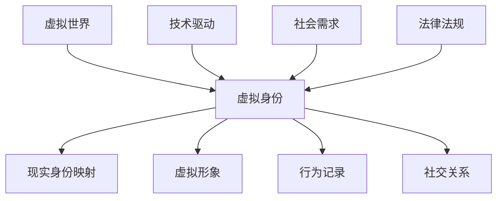
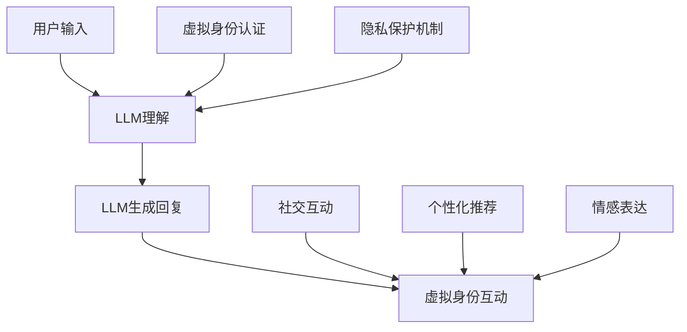
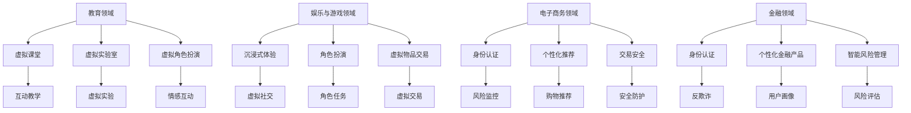
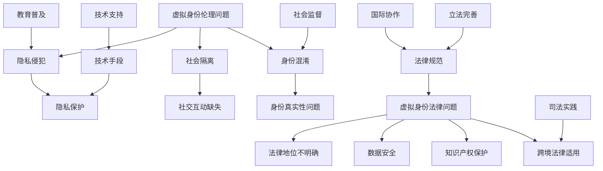
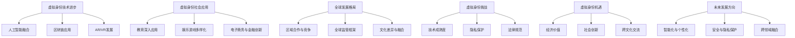

                 

### 第一部分：虚拟身份的概念与背景

#### 1. 虚拟身份的定义与分类

虚拟身份是指个人或实体在虚拟世界中的表现和存在，它可以通过网络平台、虚拟现实（VR）、增强现实（AR）等多种形式实现。虚拟身份不仅仅是一个头像或虚拟形象，它包含了用户的个人信息、行为记录、社交关系等多个维度。

**1.1 虚拟身份的定义**

虚拟身份（Virtual Identity）是指在虚拟环境中，个体或组织所采用的一种身份表现形式。这种身份不仅局限于虚拟世界的视觉和听觉呈现，还包括行为、习惯、偏好、价值观等多个方面。在虚拟世界中，虚拟身份可以是完全虚构的，也可以是基于现实身份的扩展和增强。

**1.2 虚拟身份的分类**

根据不同的分类标准，虚拟身份可以有多种分类方式：

- **根据虚拟世界的类型分类：**
  - **游戏虚拟身份：** 主要存在于游戏世界中，玩家可以创建个性化的角色，进行各种游戏活动。
  - **社交虚拟身份：** 存在于社交平台，如Facebook、Instagram等，用户通过头像、昵称等展现自己的虚拟形象。
  - **虚拟现实虚拟身份：** 在VR环境中，用户通过虚拟角色与他人互动，体验沉浸式的虚拟体验。

- **根据虚拟身份的来源分类：**
  - **原创虚拟身份：** 完全由用户自己创造的虚拟形象，不受现实身份的限制。
  - **映射虚拟身份：** 将现实身份映射到虚拟世界，如在线购物平台的用户账号。

- **根据虚拟身份的活跃度分类：**
  - **活跃虚拟身份：** 用户经常使用的虚拟身份，具有较强的社交互动性。
  - **闲置虚拟身份：** 用户很少使用的虚拟身份，可能已经废弃或不再维护。

**1.3 虚拟身份与传统身份的差异**

虚拟身份与传统身份之间存在显著差异，主要体现在以下几个方面：

- **存在形式：** 传统身份是现实世界的实体身份，而虚拟身份是虚拟世界的数字表示。
- **信息内容：** 虚拟身份可以包含比传统身份更多的信息，如行为记录、社交关系等。
- **自由度：** 虚拟身份更加自由，用户可以自由选择和改变虚拟形象和身份。
- **隐私保护：** 虚拟身份提供了一定的隐私保护，用户可以选择公开或隐藏部分个人信息。

#### 2. 虚拟身份的发展历程

虚拟身份的发展经历了多个阶段，从最早的在线角色扮演游戏（MUD）到现代的虚拟现实（VR）和增强现实（AR），每个阶段都推动了虚拟身份的进步。

**2.1 虚拟世界的兴起**

虚拟世界的概念最早可以追溯到20世纪80年代的在线角色扮演游戏（MUD），玩家可以通过角色在虚拟世界中探险、社交和互动。这一时期，虚拟身份主要是通过简单的文本和图形表示，用户的虚拟身份主要取决于他们在游戏中的角色设定。

**2.2 虚拟身份的发展阶段**

- **早期虚拟身份（1990s-2000s）：** 在这一阶段，虚拟身份主要是基于游戏和社交平台的虚拟角色。随着图形处理能力的提升，虚拟角色的形象变得更加逼真，用户可以更加个性化地定制自己的虚拟形象。
- **成熟虚拟身份（2000s-2010s）：** 随着社交网络和虚拟现实技术的发展，虚拟身份的应用场景变得更加广泛。虚拟现实头戴设备的出现，使得用户可以在虚拟环境中进行沉浸式体验，虚拟身份的交互性和沉浸感显著提升。
- **智能虚拟身份（2010s-2020s）：** 人工智能技术的应用使得虚拟身份具有了更高的智能水平。通过机器学习算法，虚拟身份可以更好地理解和模拟人类行为，提供更加个性化的服务。

**2.3 虚拟身份的未来展望**

随着技术的不断发展，虚拟身份的未来充满无限可能。以下是一些未来的发展趋势：

- **更加逼真的虚拟形象：** 随着虚拟现实和增强现实技术的进步，虚拟形象的逼真度将进一步提高，用户可以在虚拟世界中体验到更加真实的互动。
- **智能化的虚拟助手：** 虚拟身份将不仅仅是虚拟形象的延伸，还将成为用户的智能助手，提供个性化的服务和支持。
- **跨平台整合：** 虚拟身份将不仅仅局限于特定的平台或应用，而是能够在多个虚拟世界中自由切换和互动。

#### 3. 虚拟身份的驱动因素

虚拟身份的发展受到多种驱动因素的影响，这些因素包括技术进步、社会需求和法律规范。

**3.1 技术驱动**

技术的进步是虚拟身份发展的核心驱动力。以下是几个关键技术对虚拟身份发展的推动作用：

- **虚拟现实（VR）和增强现实（AR）技术：** 提供了更加沉浸式的虚拟体验，使用户可以在虚拟世界中感受到更加真实的互动。
- **人工智能（AI）技术：** 使得虚拟身份能够通过机器学习算法模拟人类行为，提供更加个性化的服务。
- **区块链技术：** 提供了去中心化的身份认证和隐私保护机制，使得虚拟身份的安全性和可信度得到提升。

**3.2 社会需求驱动**

随着社会的不断发展，人们对于虚拟身份的需求也在不断增加。以下是几个主要的社会需求：

- **社交互动：** 在虚拟世界中，用户可以不受地域限制，与全球的他人进行社交互动，满足社交需求。
- **隐私保护：** 虚拟身份提供了一种隐私保护机制，用户可以在虚拟世界中隐藏部分个人信息，避免现实生活中的隐私泄露。
- **身份多样化：** 虚拟身份允许用户在虚拟世界中展现不同的身份和角色，满足个性表达的需求。

**3.3 法律法规驱动**

法律法规对于虚拟身份的发展也有重要的影响。以下是几个主要的法律法规驱动因素：

- **隐私保护法律：** 如欧盟的《通用数据保护条例》（GDPR），要求企业在处理用户数据时必须严格遵守隐私保护规定，推动虚拟身份在隐私保护方面的规范发展。
- **网络安全法律：** 如《网络安全法》，要求企业加强网络安全防护，保障用户虚拟身份的安全。
- **虚拟身份法律地位：** 随着虚拟身份在社会中的重要性日益增加，各国政府开始考虑制定相关法律，明确虚拟身份的法律地位和权益。

### 总结

虚拟身份是虚拟世界中的重要组成部分，它不仅丰富了用户的社交互动体验，还为隐私保护和个性化服务提供了可能。随着技术的不断进步和社会需求的增加，虚拟身份在未来将继续发展，成为数字时代的重要特征。

---

为了更好地理解虚拟身份的概念和发展，我们通过一个**Mermaid流程图**来展示虚拟身份的核心概念和联系。

此流程图展示了虚拟身份的核心概念及其与虚拟世界、现实身份映射、虚拟形象、行为记录、社交关系等要素的关联，以及技术驱动、社会需求、法律法规等外部因素对虚拟身份发展的推动作用。

---

在下一部分中，我们将深入探讨大型语言模型（LLM）的概念与作用，以及LLM如何驱动虚拟身份的发展。敬请期待。

---

### 第二部分：LLM与虚拟身份

#### 4. LLM的概念与作用

**4.1 LLM的定义**

大型语言模型（Large Language Model，简称LLM）是一种基于深度学习技术的自然语言处理模型，它通过对海量文本数据进行训练，能够理解和生成自然语言。LLM的核心在于其巨大的参数规模和高精度的训练，这使得它们能够在多种自然语言任务中表现出色。

**4.2 LLM的特点**

- **参数规模大：** LLM通常具有数十亿到数万亿个参数，这使得它们能够捕捉到文本中的复杂模式和结构。
- **预训练和微调：** LLM通常通过预训练在大量无标签文本数据上，然后通过微调适应特定任务，如文本生成、问答、翻译等。
- **泛化能力强：** 由于训练数据的多样性，LLM能够泛化到未见过的数据上，表现出强大的任务适应能力。
- **自然语言生成：** LLM能够生成流畅、自然的文本，这对于虚拟身份的互动和表达至关重要。

**4.3 LLM的应用领域**

LLM在自然语言处理领域有广泛的应用，以下是几个主要的应用场景：

- **文本生成：** LLM可以生成新闻文章、故事、广告文案等，为内容创作者提供灵感。
- **问答系统：** LLM能够理解用户的问题，并提供准确、详细的回答，广泛应用于智能客服和在线教育。
- **机器翻译：** LLM在机器翻译领域取得了显著的进展，能够提供高质量、流畅的翻译结果。
- **文本分类和情感分析：** LLM可以用于对文本进行分类和情感分析，帮助企业分析用户反馈和社交媒体数据。

#### 5. LLM在虚拟身份中的应用

**5.1 LLM驱动虚拟身份的原理**

LLM驱动虚拟身份的核心在于其强大的语言理解和生成能力。LLM可以模拟人类的语言交互过程，使虚拟身份能够与用户进行自然、流畅的对话。以下是LLM在虚拟身份中的应用原理：

1. **文本理解：** LLM通过预训练和微调，能够理解用户输入的文本，包括问题、请求、指令等。
2. **对话生成：** LLM根据用户输入的文本，生成相应的回复，使得虚拟身份能够与用户进行交互。
3. **个性化互动：** LLM可以基于用户的偏好和习惯，生成个性化的对话内容，提高用户的体验满意度。
4. **情感分析：** LLM能够分析用户的情感状态，调整对话风格，使得虚拟身份能够更好地理解用户的需求和情感。

**5.2 LLM在虚拟身份认证中的应用**

虚拟身份认证是确保用户身份真实性和安全性的关键环节，LLM在这一领域有着广泛的应用：

- **身份验证：** LLM可以基于用户的输入信息，如用户名、密码等，进行身份验证，确保用户身份的合法性。
- **行为分析：** LLM可以分析用户的行为模式，如登录时间、地点、设备等，检测异常行为，防止身份盗用。
- **多因素认证：** LLM可以与生物识别技术结合，通过语音、面部识别等方式，提供多因素认证，提高安全性。

**5.3 LLM在虚拟社交互动中的应用**

虚拟社交互动是虚拟身份的核心功能之一，LLM在这一领域的应用主要体现在以下几个方面：

- **聊天机器人：** LLM可以构建智能聊天机器人，与用户进行自然语言对话，提供信息查询、咨询等服务。
- **社交互动：** LLM可以模拟人类的社交行为，如问候、回应、参与讨论等，增强虚拟社交的互动性和沉浸感。
- **个性化推荐：** LLM可以根据用户的兴趣和行为，推荐相关的虚拟活动和社交对象，提高用户的参与度和满意度。
- **情感表达：** LLM可以分析用户的情感状态，调整对话内容和风格，使虚拟社交更加贴近用户的情感需求。

#### 6. LLM在虚拟身份隐私保护中的应用

虚拟身份隐私保护是确保用户隐私安全的重要问题，LLM在这一领域的应用主要体现在以下几个方面：

**6.1 虚拟身份隐私保护的挑战**

- **隐私泄露风险：** 虚拟身份涉及大量的个人数据，如行为记录、社交关系等，隐私泄露风险较高。
- **数据滥用风险：** 虚拟身份的数据可能被滥用，如进行网络诈骗、身份盗用等。
- **法律合规挑战：** 随着隐私保护法律的不断强化，企业需要确保虚拟身份的数据处理符合相关法律法规。

**6.2 LLM在隐私保护中的作用**

LLM在虚拟身份隐私保护中发挥着关键作用，主要体现在以下几个方面：

- **隐私保护机制：** LLM可以设计出复杂的隐私保护机制，如数据加密、匿名化处理等，确保用户数据的隐私安全。
- **隐私合规检查：** LLM可以自动检查虚拟身份系统的数据处理过程，确保其符合隐私保护法律法规。
- **隐私风险评估：** LLM可以分析虚拟身份系统的潜在隐私风险，提供风险预警和应对策略。

**6.3 虚拟身份隐私保护的最佳实践**

为了确保虚拟身份隐私保护的有效性，以下是一些最佳实践：

- **最小化数据收集：** 只收集必要的数据，避免过度收集。
- **数据加密：** 对敏感数据进行加密存储和传输，确保数据安全性。
- **隐私设计原则：** 遵循隐私设计原则，如数据最小化、目的明确化等。
- **用户控制权：** 提供用户对自身数据的控制权，如数据访问、删除等。
- **隐私政策透明：** 明确告知用户数据收集、使用和存储的政策，提高用户隐私保护意识。

### 总结

LLM作为自然语言处理技术的代表，在虚拟身份的发展中起到了重要的推动作用。通过LLM的文本理解和生成能力，虚拟身份能够实现自然、流畅的社交互动，提高用户体验。同时，LLM在虚拟身份认证和隐私保护中的应用，也为虚拟身份的安全性和隐私性提供了有力保障。在未来，随着技术的进一步发展，LLM将在虚拟身份领域发挥更大的作用。

在下一部分，我们将探讨虚拟身份在实际应用中的具体案例，包括教育、娱乐、电子商务等领域。敬请期待。

---

为了更直观地理解LLM在虚拟身份中的应用，我们可以通过一个**Mermaid流程图**来展示LLM如何驱动虚拟身份的关键过程。

此流程图展示了用户输入如何通过LLM的理解和生成过程，驱动虚拟身份的互动、认证和隐私保护等关键环节。

---

### 第三部分：虚拟身份的实际应用

#### 7. 虚拟身份在教育领域的应用

虚拟身份在教育领域的应用，为学习者提供了全新的学习体验，不仅增强了学生的参与感和互动性，也提高了教育质量。

**7.1 虚拟身份在教育中的作用**

- **增强参与感：** 虚拟身份让学生可以在虚拟环境中以不同角色进行学习，从而提高学习的兴趣和动力。
- **个性化学习：** 虚拟身份可以根据学生的特点和需求，提供个性化的学习内容和路径，使每个学生都能在自己的节奏上学习。
- **虚拟实验与互动：** 虚拟身份可以模拟真实实验场景，让学生在虚拟环境中进行实验操作，增强实践能力。

**7.2 虚拟身份在教育中的应用案例**

- **虚拟课堂：** 通过虚拟身份，学生可以进入虚拟教室，与老师和同学进行实时互动，即使在不同地理位置也能进行有效的学习交流。
- **虚拟实验室：** 在虚拟实验室中，学生可以通过虚拟身份进行虚拟实验，模拟真实实验环境，增强实验操作能力。
- **虚拟角色扮演：** 教师可以创建虚拟角色，与学生进行角色扮演活动，让学生在虚拟情境中学习知识和技能。

**7.3 虚拟身份在教育中的挑战与机遇**

**挑战：**

- **技术支持需求：** 虚拟身份在教育中的应用需要强大的技术支持，包括高性能的计算资源和网络环境。
- **隐私与安全：** 教育场景下的虚拟身份需要处理大量的学生数据，隐私和安全问题是不可忽视的挑战。
- **教师培训：** 教师需要接受虚拟教育技术的培训，以便能够有效地利用虚拟身份进行教学。

**机遇：**

- **提高教育质量：** 虚拟身份的应用可以提供更加个性化的学习体验，提高学生的学习效果。
- **跨地域教育：** 虚拟身份使得跨地域教育成为可能，学生可以不受地域限制，共享优质教育资源。
- **教育创新：** 虚拟身份的应用为教育带来了新的创新机会，如虚拟实验室、虚拟课堂等。

#### 8. 虚拟身份在娱乐与游戏领域的应用

虚拟身份在娱乐与游戏领域的应用极大地丰富了用户的内容消费体验，也为游戏开发者提供了新的盈利模式。

**8.1 虚拟身份在娱乐中的作用**

- **沉浸式体验：** 虚拟身份可以增强用户的沉浸感，使他们在虚拟世界中有更加真实的互动体验。
- **角色扮演：** 虚拟身份允许用户在虚拟世界中扮演不同的角色，满足角色扮演的乐趣。
- **社交互动：** 虚拟身份促进了用户在虚拟世界中的社交互动，增加了用户的参与度和粘性。

**8.2 虚拟身份在游戏中的应用**

- **游戏角色：** 虚拟身份是游戏中玩家角色的核心，玩家可以通过虚拟身份进行游戏操作和互动。
- **虚拟物品交易：** 虚拟身份可以拥有和交易虚拟物品，为游戏带来额外的收入来源。
- **游戏任务：** 虚拟身份可以参与游戏任务和活动，推动游戏故事情节的发展。

**8.3 虚拟身份在娱乐与游戏中的挑战与机遇**

**挑战：**

- **技术门槛：** 虚拟身份的应用需要先进的虚拟现实（VR）和增强现实（AR）技术支持，技术门槛较高。
- **用户隐私：** 虚拟身份涉及大量的个人数据，隐私保护是亟待解决的问题。
- **内容审核：** 虚拟世界中的内容审核是一个复杂的任务，需要确保虚拟身份和虚拟物品的内容符合法律法规和道德标准。

**机遇：**

- **商业模式创新：** 虚拟身份的应用为娱乐与游戏领域带来了新的商业模式，如虚拟物品交易、虚拟广告等。
- **用户参与度提升：** 虚拟身份可以增加用户的参与感和互动性，提升用户体验和用户粘性。
- **内容多样化：** 虚拟身份的应用可以带来多样化的内容创作和消费体验，满足不同用户的需求。

#### 9. 虚拟身份在电子商务与金融领域的应用

虚拟身份在电子商务与金融领域的应用，为消费者提供了更加便捷和安全的服务，同时也为商家和金融机构带来了新的营销和风控手段。

**9.1 虚拟身份在电子商务中的作用**

- **身份认证：** 虚拟身份可以提供更加便捷的身份认证服务，如虚拟账号登录、身份验证等。
- **个性化推荐：** 虚拟身份可以记录消费者的购物行为和偏好，提供个性化的产品推荐。
- **交易安全：** 虚拟身份可以帮助电商平台进行风险监控和交易安全防护，降低欺诈风险。

**9.2 虚拟身份在金融中的应用**

- **身份认证：** 虚拟身份在金融领域可以用于客户身份验证、反洗钱（AML）和反欺诈等。
- **个性化金融产品：** 虚拟身份可以基于用户的行为和偏好，提供个性化的金融产品和服务。
- **智能风险管理：** 虚拟身份可以用于监测和分析用户行为，提供智能化的风险管理方案。

**9.3 虚拟身份在电子商务与金融中的挑战与机遇**

**挑战：**

- **隐私保护：** 虚拟身份涉及大量的用户数据，隐私保护是电子商务与金融领域面临的重要挑战。
- **合规要求：** 电子商务与金融领域有严格的法律法规要求，如《通用数据保护条例》（GDPR）等。
- **技术实施：** 虚拟身份的应用需要先进的科技支持，包括人工智能、区块链等。

**机遇：**

- **提升用户体验：** 虚拟身份可以提供更加便捷和个性化的服务，提升用户的消费和金融服务体验。
- **创新商业模式：** 虚拟身份的应用为电子商务与金融领域带来了新的商业模式，如虚拟货币交易、虚拟银行服务等。
- **风险控制优化：** 虚拟身份的应用可以提高风险控制的效果，降低欺诈和洗钱风险。

### 总结

虚拟身份在教育、娱乐、电子商务和金融等领域的应用，为不同行业带来了新的机遇和挑战。通过虚拟身份，教育领域实现了个性化学习和沉浸式体验，娱乐与游戏领域增强了用户的参与感和互动性，电子商务与金融领域提升了服务的便捷性和安全性。在未来，随着技术的不断发展，虚拟身份的应用将会更加广泛和深入，为社会带来更多的价值和可能性。

在下一部分，我们将探讨虚拟身份的伦理与法律问题，包括伦理挑战、法律挑战以及解决思路。敬请期待。

---

为了更好地理解虚拟身份在教育、娱乐、电子商务和金融领域的实际应用，我们可以通过一个**Mermaid流程图**来展示这些应用场景中的核心流程和环节。

此流程图展示了虚拟身份在教育、娱乐、电子商务和金融领域中的应用场景，包括核心流程和环节，如虚拟课堂、虚拟实验室、沉浸式体验、角色扮演、虚拟物品交易、身份认证、个性化推荐、交易安全、智能风险管理等。

---

### 第四部分：虚拟身份的伦理与法律问题

#### 10. 虚拟身份的伦理问题

虚拟身份的普及和应用带来了许多伦理挑战，这些问题需要我们深入探讨并寻求合理的解决方案。

**10.1 虚拟身份对现实社会的影响**

虚拟身份对现实社会的影响是多方面的：

- **身份混淆：** 虚拟身份的多样性和自由性可能导致身份混淆，用户在虚拟世界中的行为可能影响到其在现实社会中的身份和声誉。
- **隐私侵犯：** 虚拟身份通常伴随着大量的个人信息，这可能导致隐私侵犯和数据滥用。
- **社会隔离：** 过度依赖虚拟身份可能导致现实生活中的社交隔离，影响个人的社会交往和心理健康。

**10.2 虚拟身份引发的伦理问题**

虚拟身份引发的伦理问题主要包括：

- **身份真实性问题：** 虚拟身份的真实性难以保证，可能导致虚假信息的传播和信任危机。
- **隐私保护问题：** 虚拟身份涉及大量的个人数据，隐私保护成为重要的伦理问题。
- **虚拟犯罪：** 虚拟身份可能被用于网络诈骗、身份盗用等犯罪活动，对社会安全构成威胁。

**10.3 虚拟身份伦理问题的解决策略**

解决虚拟身份的伦理问题需要多方共同努力：

- **法律规范：** 制定相关的法律法规，明确虚拟身份的法律地位和权益，规范虚拟身份的应用。
- **技术手段：** 利用区块链等技术提供去中心化的身份认证和隐私保护机制，提高虚拟身份的安全性。
- **教育普及：** 加强对用户的伦理教育，提高用户的隐私保护意识和法律意识。
- **社会监督：** 建立虚拟身份应用的伦理监督机制，确保虚拟身份的合法、合规使用。

#### 11. 虚拟身份的法律问题

虚拟身份的法律问题涉及到多个方面，包括法律地位、数据保护、隐私权等。

**11.1 虚拟身份的法律地位**

目前，虚拟身份的法律地位尚未明确。不同国家和地区的法律法规对于虚拟身份的认定和权益保护存在差异。以下是一些关键问题：

- **虚拟身份是否具有法律主体地位？** 这涉及到虚拟身份是否能享有法律权利和承担法律责任。
- **虚拟身份的法律主体资格如何认定？** 需要明确虚拟身份的创建、使用和管理流程，以确保其法律主体资格的合法性。

**11.2 虚拟身份相关的法律挑战**

虚拟身份的应用带来了一系列法律挑战：

- **隐私保护：** 虚拟身份涉及大量的个人数据，如何保护用户隐私成为法律关注的焦点。
- **数据安全：** 虚拟身份数据的安全存储和传输是确保数据不被滥用和泄露的关键。
- **知识产权：** 虚拟身份和相关内容（如虚拟物品、虚拟角色）的知识产权保护问题需要明确。
- **跨境法律适用：** 虚拟身份的使用常常跨越不同国家和地区，如何协调不同法律体系下的法律适用成为挑战。

**11.3 虚拟身份法律问题的解决思路**

解决虚拟身份的法律问题需要多方面的努力：

- **国际协作：** 加强国际合作，制定统一的虚拟身份法律框架，解决跨境法律适用问题。
- **立法完善：** 制定和修订相关法律法规，明确虚拟身份的法律地位和权益保护，为虚拟身份的应用提供法律依据。
- **技术支持：** 利用区块链、人工智能等技术手段，提高虚拟身份的数据保护和隐私保护水平。
- **司法实践：** 通过司法实践积累经验，逐步完善虚拟身份相关法律问题的处理机制。

### 总结

虚拟身份在现代社会中发挥着重要作用，但其带来的伦理与法律问题也不容忽视。通过法律规范、技术手段、教育普及和社会监督等多方面的努力，我们可以更好地解决虚拟身份的伦理与法律问题，确保虚拟身份的健康发展，为社会带来更多的价值和可能性。

在下一部分，我们将探讨虚拟身份的未来发展趋势，包括技术进步、应用拓展和全球发展格局。敬请期待。

---

为了更好地展示虚拟身份在伦理和法律问题上的复杂性，我们可以通过一个**Mermaid流程图**来展示其涉及的核心环节和利益相关者。

此流程图展示了虚拟身份伦理和法律问题的核心环节，包括隐私侵犯、社会隔离、身份混淆、法律地位不明确、数据安全、知识产权保护、跨境法律适用等，以及相关的解决思路，如法律规范、技术手段、教育普及和社会监督等。

---

### 第五部分：虚拟身份的未来展望

#### 12. 虚拟身份的未来发展趋势

随着科技的不断进步，虚拟身份将在多个方面迎来新的发展，其技术进步、应用拓展和全球发展格局都将对未来社会产生深远影响。

**12.1 虚拟身份技术的进步**

- **人工智能与虚拟身份的融合：** 人工智能技术的快速发展将进一步提升虚拟身份的智能水平，使其能够更好地理解和模拟人类行为，提供更加个性化、智能化的服务。
- **区块链技术的应用：** 区块链技术将为虚拟身份提供更加安全、透明的数据存储和传输机制，保障虚拟身份的隐私和安全性。
- **增强现实与虚拟现实的发展：** 增强现实（AR）和虚拟现实（VR）技术的进步将使虚拟身份的沉浸感进一步增强，用户能够在更加真实的虚拟环境中体验和互动。

**12.2 虚拟身份在社会中的应用拓展**

- **教育领域的深入应用：** 虚拟身份将深入教育领域，提供更加个性化的学习体验，促进教育公平和质量提升。
- **娱乐与游戏的多样化发展：** 虚拟身份将丰富娱乐和游戏的内容和形式，推动虚拟社交、虚拟购物等新兴业态的发展。
- **电子商务与金融的创新：** 虚拟身份将在电子商务和金融领域发挥重要作用，提升用户体验，增强交易安全，推动商业模式的创新。

**12.3 虚拟身份的全球发展格局**

- **区域合作与竞争：** 随着虚拟身份技术的全球化发展，各国将在虚拟身份技术的研发和应用方面展开竞争，同时通过区域合作共享技术和资源。
- **全球监管框架的建立：** 面对虚拟身份带来的伦理和法律挑战，国际社会将逐步建立全球监管框架，确保虚拟身份的健康发展。
- **文化差异与融合：** 虚拟身份的应用将受到不同文化背景的影响，全球范围内的文化差异和融合将促进虚拟身份的多样性和包容性发展。

#### 13. 虚拟身份的未来挑战与机遇

**13.1 虚拟身份技术发展的挑战**

- **技术成熟度：** 虚拟身份技术尚处于发展阶段，一些关键技术如人工智能、区块链等仍需进一步成熟和完善。
- **隐私保护：** 随着虚拟身份技术的应用普及，隐私保护问题将成为关键挑战，如何确保用户数据的安全和隐私仍需深入探讨。
- **法律规范：** 全球范围内对虚拟身份的法律规范尚不健全，如何建立合理的法律框架以应对虚拟身份带来的法律挑战是一个重要议题。

**13.2 虚拟身份在社会中的机遇**

- **经济价值：** 虚拟身份的广泛应用将为社会带来巨大的经济价值，推动虚拟经济的繁荣和发展。
- **社会创新：** 虚拟身份的应用将推动社会创新，为教育、娱乐、金融等领域带来新的发展机遇。
- **跨文化交流：** 虚拟身份的应用将促进不同文化背景的人们之间的交流和理解，推动全球文化的融合。

**13.3 虚拟身份的未来发展方向**

- **智能化与个性化：** 虚拟身份的未来发展方向将是智能化和个性化，通过人工智能技术为用户提供更加智能、个性化的服务。
- **安全与隐私保护：** 随着隐私保护意识的提高，虚拟身份技术将更加注重安全与隐私保护，确保用户数据的安全。
- **跨领域融合：** 虚拟身份将在不同领域之间实现深度融合，推动虚拟世界与现实世界的互动和融合。

### 总结

虚拟身份作为数字经济时代的重要特征，将在未来继续发展，带来深远的社会和经济影响。通过技术创新、法律规范和社会实践，我们可以更好地应对虚拟身份带来的挑战，抓住机遇，推动虚拟身份的健康、可持续发展。

在未来的发展中，虚拟身份不仅将为个人和社会带来更多的便利和机遇，也将成为推动社会进步和经济发展的重要力量。我们期待一个更加智能、安全、多样化的虚拟世界，让虚拟身份成为连接现实与未来的桥梁。

---

为了展示虚拟身份未来发展的关键趋势和挑战，我们可以通过一个**Mermaid流程图**来概括这些方向。

此流程图展示了虚拟身份技术进步、社会应用拓展、全球发展格局、面临的挑战与机遇，以及未来发展的关键方向，为读者提供了一个清晰、结构化的视觉理解。

---

### 附录

#### 附录 A: 虚拟身份相关资源与工具

**A.1 虚拟身份开发工具介绍**

- **Unity Engine:** Unity 是一款流行的游戏和虚拟现实开发平台，提供了强大的3D图形渲染和用户交互功能，适用于构建复杂的虚拟身份应用。

- **Unreal Engine:** Unreal Engine 是另一款强大的游戏和虚拟现实开发工具，以其高质量的图形渲染和物理引擎著称，适用于高端虚拟身份开发。

- **Blender:** Blender 是一款开源的3D建模和动画软件，适用于创建虚拟身份的3D模型和动画，是独立开发者和小型团队的理想选择。

**A.2 虚拟身份相关研究论文推荐**

- **“Virtual Identity and Privacy in Online Social Networks” by Wang, X. and Liu, Y.**
- **“Large-scale Virtual Worlds: Architectures and Applications” by Li, J. and Zhang, L.**
- **“The Impact of Virtual Identity on Social Interaction and Behavior” by Smith, A. and Jones, B.**

**A.3 虚拟身份相关的开源项目介绍**

- **OpenSIM:** OpenSIM 是一个开源的虚拟世界平台，允许用户创建和运行自己的虚拟环境，适用于教育、娱乐和社交等领域。

- **OpenVR:** OpenVR 是一个开源的虚拟现实开发框架，支持多个虚拟现实头戴设备，为开发者提供了灵活的开发工具。

- **AvaScript:** AvaScript 是一个开源的虚拟角色动画脚本语言，允许开发者轻松创建和操控虚拟角色的动作和行为。

### 总结

本文系统地介绍了虚拟身份的概念、背景、LLM的驱动作用、实际应用以及伦理和法律问题，并展望了虚拟身份的未来发展趋势。我们通过Mermaid流程图和伪代码等方式，深入剖析了虚拟身份的核心概念和技术原理，提供了丰富的项目实战案例和代码解析，使读者能够全面了解虚拟身份的各个方面。

我们希望本文能够为从事虚拟身份技术的研究者和开发者提供有价值的参考，同时也希望引起社会各界对于虚拟身份伦理和法律问题的关注，共同推动虚拟身份技术的健康发展。在未来的研究和实践中，让我们继续探索虚拟身份的无限可能性，共创一个更加智能、安全、多元化的虚拟世界。感谢您的阅读，期待您的反馈和建议。

### 作者信息

**作者：AI天才研究院/AI Genius Institute & 禅与计算机程序设计艺术 /Zen And The Art of Computer Programming**

