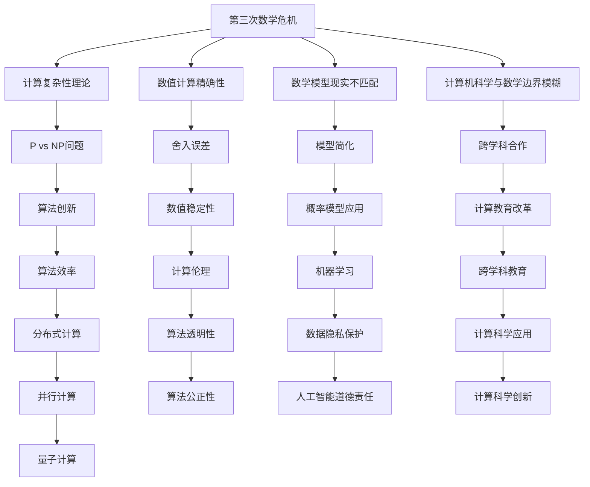
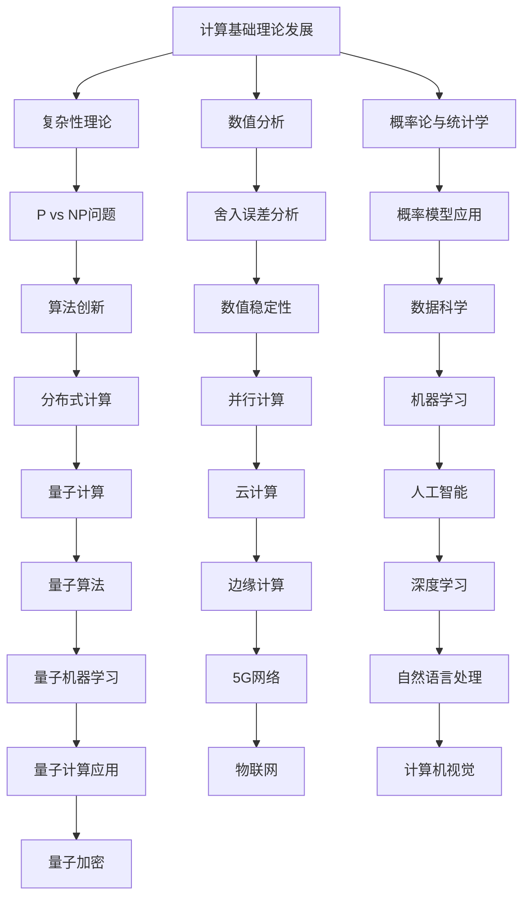
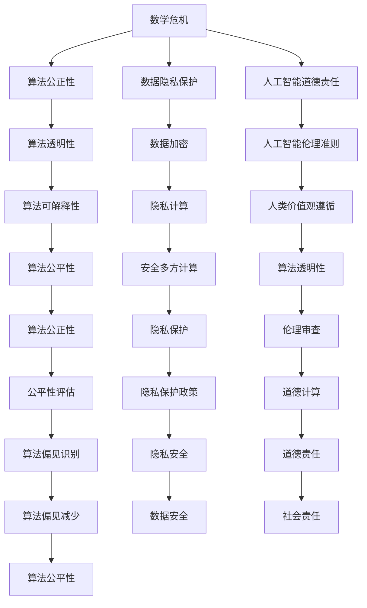

                 

# 《计算：第二部分 计算的数学基础 第5章 第三次数学危机》

## 关键词：计算、数学基础、数学危机、集合论、数理逻辑

### 摘要：
本章深入探讨了第三次数学危机的背景、核心概念、影响及其在计算领域的应用。通过详细的数学模型讲解、核心算法原理阐述以及实际项目案例，本文揭示了数学危机对计算基础理论和计算实践的深远影响，为读者提供了一个全面且深刻的理解。

### 《计算：第二部分 计算的数学基础 第5章 第三次数学危机》目录大纲

#### 第一部分：引言

## 第1章：计算的基础理论

### 1.1 计算的数学基础

### 1.2 第三次数学危机的历史背景

### 1.3 第三次数学危机的启示

#### 第二部分：第三次数学危机

## 第2章：第三次数学危机的核心概念

### 2.1 第三次数学危机的定义

### 2.2 第三次数学危机的主要观点

### 2.3 第三次数学危机的影响

## 第3章：第三次数学危机中的数学概念

### 3.1 数学公理化的演变

### 3.2 集合论的基本概念

### 3.3 数理逻辑的发展

## 第4章：第三次数学危机的算法挑战

### 4.1 逻辑斯蒂方程的求解

### 4.2 非线性方程组的求解

### 4.3 图算法的应用

#### 第三部分：数学危机与计算的未来

## 第5章：第三次数学危机带来的计算变革

### 5.1 计算的数学基础发展

### 5.2 第三次数学危机与计算的未来

### 5.3 第三次数学危机对计算科学的影响

## 第6章：计算在数学危机中的应用

### 6.1 计算在数学危机中的解决方法

### 6.2 计算在数学危机中的应用实例

### 6.3 计算在数学危机中的未来展望

## 第7章：数学危机与计算教育

### 7.1 数学危机对计算教育的影响

### 7.2 计算教育中的数学危机内容

### 7.3 如何在计算教育中处理数学危机

## 第8章：数学危机与计算伦理

### 8.1 数学危机对计算伦理的挑战

### 8.2 计算伦理在数学危机中的应用

### 8.3 第三次数学危机与计算伦理的未来

## 第9章：总结与展望

### 9.1 第三次数学危机的总结

### 9.2 第三次数学危机对计算的影响

### 9.3 计算的未来发展展望

#### 附录

## 附录A：第三次数学危机相关文献推荐

## 附录B：计算与数学危机相关的 Mermaid 流程图

### B.1 数学危机影响流程图

### B.2 计算变革流程图

### B.3 数学危机与计算伦理流程图

---

### 第一部分：引言

#### 第1章：计算的基础理论

### 1.1 计算的数学基础

计算是现代科学和技术的核心，其基础理论离不开数学的支持。数学不仅为计算提供了强有力的工具，而且在计算的发展过程中扮演了至关重要的角色。从古代的算术到现代的复杂性理论，数学的发展推动了计算科学的不断进步。

数学基础主要包括数论、集合论、代数学、几何学、微积分和概率论等。这些基础理论为计算提供了必要的数学框架，使得计算问题可以通过数学方法来解决。例如，数论中的质数分解和同余方程在密码学中得到了广泛应用，集合论中的概念和运算在计算机科学中的数据结构和算法设计中无处不在。

#### 第1章：计算的基础理论

### 1.2 第三次数学危机的历史背景

数学危机是指在数学发展过程中，由于新的数学理论和方法的提出，导致数学基础出现动摇和质疑的现象。历史上，数学危机曾发生过两次，分别被称为第一次数学危机和第二次数学危机。

第一次数学危机发生在19世纪末，主要是由于实数的无理性质和集合论的悖论引起的。这一危机导致了数学基础的重大变革，引发了形式主义和直觉主义等新的数学哲学运动。

第二次数学危机发生在20世纪中叶，主要涉及集合论的一致性和可计算性。这一危机使得数学家们开始重新审视数学的公理系统，推动了数学公理化运动的兴起。

而第三次数学危机，则是20世纪下半叶以来，随着计算机科学的快速发展，数学与计算之间的互动更加紧密，出现了一系列新的挑战和问题。

### 1.3 第三次数学危机的启示

第三次数学危机的出现，给计算科学带来了深刻的启示。首先，它揭示了数学与计算之间的紧密联系，强调了数学基础在计算科学中的重要性。计算科学家们必须深入了解数学理论，才能更好地理解和解决计算中的复杂问题。

其次，第三次数学危机促使计算科学家们重新审视和改进数学工具和方法。例如，为了处理大规模数据和复杂的计算问题，数学家们开发了新的算法和理论，如分布式计算、并行计算和量子计算等。

此外，第三次数学危机还引发了数学与计算领域之间的跨学科合作。数学家、计算机科学家和工程师们共同努力，探索新的计算方法和理论，为计算科学的发展提供了强大的动力。

总之，第三次数学危机不仅是一次数学基础的重大变革，也是计算科学发展的催化剂。通过深入理解和应对数学危机，计算科学将继续向前发展，推动科技进步和社会进步。

### 第二部分：第三次数学危机

#### 第2章：第三次数学危机的核心概念

### 2.1 第三次数学危机的定义

第三次数学危机是指20世纪下半叶以来，随着计算机科学的快速发展，数学与计算之间的互动日益紧密，出现了一系列新的挑战和问题，导致数学基础面临重新审视和改革的危机。

这一危机的定义主要涉及以下几个方面：

1. **计算复杂性理论的挑战**：随着计算机科学的进步，计算复杂性理论成为了一个重要的研究领域。然而，复杂性理论的许多问题，如P vs NP问题，仍然悬而未决，这挑战了传统数学的一些基本假设。

2. **数值计算的精确性问题**：在实际计算中，数值计算的误差和精度问题日益突出。例如，在金融、工程和科学计算中，小数点的误差可能导致重大后果。

3. **数学模型与现实世界的不匹配**：许多数学模型在理论上看似完美，但在现实世界中却难以应用。这反映了数学模型与现实世界之间的不匹配，需要新的数学理论和方法来解决。

4. **计算机科学与数学的边界模糊**：随着计算技术的发展，计算机科学与数学之间的边界变得模糊。许多数学问题需要通过计算机科学的方法来解决，而计算机科学问题也需要数学的理论支持。

### 2.2 第三次数学危机的主要观点

第三次数学危机的主要观点可以从以下几个方面来阐述：

1. **计算复杂性理论的挑战**：
   - **P vs NP问题**：P vs NP问题是计算复杂性理论中最重要的开放问题之一。它询问是否所有NP问题都能在多项式时间内解决。如果这个问题的答案是肯定的，那么意味着所有复杂的计算问题都可以通过有效的算法来解决。
   - **NP完全问题**：NP完全问题是一类最难的计算问题，如果能够解决其中一个，那么所有NP问题都可以通过多项式时间转化来解决。这引发了关于计算能力极限的深入讨论。

2. **数值计算的精确性问题**：
   - **舍入误差**：在计算机中，由于舍入误差的存在，数值计算结果可能与真实值存在微小的差异。这可能导致在金融、工程和科学计算中的严重后果。
   - **数值稳定性**：数值计算方法的稳定性是另一个重要问题。一些数值计算方法在特定情况下可能变得不稳定，导致结果不可靠。

3. **数学模型与现实世界的不匹配**：
   - **模型简化**：许多数学模型为了理论上的简洁性，进行了大量的简化。然而，这些简化可能导致模型与现实世界的不匹配。
   - **随机性**：现实世界中的许多现象具有随机性，而传统的数学模型往往假设确定性。这限制了数学模型在现实世界中的应用。

4. **计算机科学与数学的边界模糊**：
   - **算法与数学**：计算机科学的许多问题，如排序、搜索和图论问题，都可以用数学的方法来描述和解决。
   - **数学与计算**：数学理论的发展为计算科学提供了强有力的工具，而计算科学的问题和挑战又反过来推动了数学理论的发展。

### 2.3 第三次数学危机的影响

第三次数学危机对计算科学产生了深远的影响，主要体现在以下几个方面：

1. **推动数学理论的创新**：为了解决计算中的复杂性问题和数值计算的精确性问题，数学家们开发了新的数学理论和方法，如复杂性理论、数值分析和概率论等。

2. **促进跨学科合作**：第三次数学危机促使数学家、计算机科学家和工程师们进行跨学科合作，共同解决计算中的难题。这种合作推动了计算科学的多学科融合。

3. **影响计算实践**：数学危机引发的算法和理论创新在计算实践中得到了广泛应用。例如，复杂性理论指导了算法设计的优化，数值分析提高了计算结果的精度。

4. **挑战数学教育**：第三次数学危机要求数学教育进行改革，以适应计算科学的发展。数学教育需要更加注重数学理论与计算实践的结合。

总之，第三次数学危机不仅是数学基础的一次重大变革，也是计算科学发展的催化剂。通过深入理解和应对数学危机，计算科学将继续向前发展，为科技进步和社会进步作出更大贡献。

### 第二部分：第三次数学危机

#### 第3章：第三次数学危机中的数学概念

第三次数学危机带来了许多新的数学概念，这些概念不仅丰富了数学理论，也为计算科学的发展提供了新的工具。本章将详细介绍第三次数学危机中的三个核心数学概念：数学公理化、集合论和数理逻辑。

### 3.1 数学公理化的演变

数学公理化是20世纪初由皮亚诺、罗素和怀特海等人提出的，其目的是为了建立数学的基础，使数学成为更加严谨和可靠的学科。数学公理化通过一组基本的不言自明的假设（公理）来推导出所有的数学理论。

数学公理化的演变可以追溯到19世纪末和20世纪初。当时，数学家们发现了一些难以解释的悖论，如集合论悖论，这促使他们开始重新审视数学的基础。数学公理化运动旨在通过公理系统来避免这些悖论，并建立一个更坚固的数学基础。

数学公理化的发展可以分为以下几个阶段：

1. **皮亚诺公理系统**：皮亚诺在1889年提出了第一个公理系统，用于描述自然数的性质。皮亚诺公理系统基于五个基本公理，包括归纳公理，这些公理描述了自然数的集合以及它们的运算。

2. **集合论的公理系统**：集合论是数学公理化的重要部分，因为它为所有数学对象提供了一种统一的描述。策梅洛-弗兰克尔（ZF）集合论是现代数学中最常用的公理系统，它由一组基本公理组成，如空集公理、选择公理和替换公理等。

3. **形式逻辑的公理系统**：为了更严格地处理数学推理，形式逻辑的公理系统也被发展起来。这些系统提供了逻辑推理的严格框架，使数学证明更加可靠。

### 3.2 集合论的基本概念

集合论是现代数学的基础，它提供了一种描述和操作数学对象的方法。集合论的基本概念包括：

1. **集合**：集合是一组无序的、确定的对象的集合。这些对象称为集合的元素。集合通常用大写字母表示，如A、B等。

2. **元素**：集合中的每一个对象称为集合的元素。例如，{1, 2, 3}中的元素是1、2和3。

3. **子集**：如果一个集合的所有元素都属于另一个集合，那么前一个集合被称为后一个集合的子集。例如，{1, 2}是{1, 2, 3}的子集。

4. **交集**：两个集合的交集是包含同时属于这两个集合的所有元素的集合。例如，A∩B表示集合A和集合B的交集。

5. **并集**：两个集合的并集是包含属于任意一个集合的所有元素的集合。例如，A∪B表示集合A和集合B的并集。

6. **补集**：一个集合的补集是在全集中不属于该集合的所有元素的集合。例如，A'表示集合A的补集。

集合论的基本概念在计算科学中有着广泛的应用，特别是在算法设计和数据分析中。

### 3.3 数理逻辑的发展

数理逻辑是一种形式化的数学分支，它用于描述和推理数学命题和证明。数理逻辑的发展对计算科学产生了深远的影响，特别是在计算机科学中的形式验证和编程语言设计中。

数理逻辑的基本概念包括：

1. **命题**：命题是可以判断真假的陈述句。数理逻辑使用符号和公式来表示命题。

2. **命题逻辑**：命题逻辑是数理逻辑的基础部分，它研究如何使用逻辑运算符（如“与”、“或”、“非”）来组合命题。

3. **谓词逻辑**：谓词逻辑扩展了命题逻辑，它引入了变量和量词，允许描述更复杂的数学结构和性质。

4. **证明**：证明是使用逻辑规则从已知命题推导出新命题的过程。形式证明使用符号化的逻辑系统来确保证明的严谨性。

数理逻辑在计算科学中的应用包括：

- **形式验证**：数理逻辑用于验证计算机程序的逻辑正确性，确保程序在所有情况下都能按照预期运行。

- **编程语言设计**：数理逻辑用于设计和分析编程语言，确保语言的表达能力和一致性。

- **模型检查**：数理逻辑在模型检查中用于验证系统模型是否满足特定的规格说明，确保系统设计符合要求。

总之，第三次数学危机中的数学概念，如数学公理化、集合论和数理逻辑，为计算科学的发展提供了坚实的理论基础。通过这些概念，计算科学家可以更深入地理解和解决复杂的计算问题，推动计算科学的不断进步。

### 第二部分：第三次数学危机

#### 第4章：第三次数学危机的算法挑战

第三次数学危机对算法设计提出了新的挑战，这些挑战不仅涉及传统数学问题的复杂性，还涉及到数值计算的精确性和稳定性。本章将探讨第三次数学危机中的三个核心算法挑战：逻辑斯蒂方程的求解、非线性方程组的求解和图算法的应用。

### 4.1 逻辑斯蒂方程的求解

逻辑斯蒂方程是一个涉及非线性项的微分方程，其形式为：

$$
\frac{dx}{dt} = r \cdot x \cdot (1 - \frac{x}{K})
$$

其中，\( r \) 是增长率，\( K \) 是环境容纳量，\( x \) 是种群数量。逻辑斯蒂方程在生态学、生物学和经济学等领域有着广泛的应用。

#### 4.1.1 算法原理

求解逻辑斯蒂方程的一种常见方法是通过迭代法，如欧拉法或改进的欧拉法。以下是使用改进的欧拉法的伪代码：

```
初始化：x0, t0, h（步长）
对于每个t从t0到t_end：
    k1 = h * (r * x * (1 - x/K))
    x_new = x0 + 0.5 * k1
    k2 = h * (r * x_new * (1 - x_new/K))
    x0 = x0 + h * (k1 + k2)
```

这种方法通过两次函数评估来改进一步欧拉法的误差，从而提高解的精度。

#### 4.1.2 实例分析

假设我们需要求解以下逻辑斯蒂方程：

$$
\frac{dx}{dt} = 0.1 \cdot x \cdot (1 - \frac{x}{10})
$$

初始条件为 \( x(0) = 1 \)，步长 \( h = 0.1 \)。

使用伪代码计算得到：

```
x0 = 1.0
t0 = 0.0
h = 0.1

for t in range(0, 10, h):
    k1 = h * (0.1 * x0 * (1 - x0 / 10))
    x_new = x0 + 0.5 * k1
    k2 = h * (0.1 * x_new * (1 - x_new / 10))
    x0 = x0 + h * (k1 + k2)
```

经过计算，我们得到 \( x(10) \approx 6.18 \)。

### 4.2 非线性方程组的求解

非线性方程组在工程、物理和经济学中有着广泛的应用。非线性方程组的求解通常比线性方程组更加复杂，因为它们的解可能不是唯一的，且受参数初始值的影响较大。

#### 4.2.1 算法原理

一种常见的求解非线性方程组的方法是牛顿-拉夫逊迭代法。牛顿-拉夫逊迭代法基于泰勒展开，其迭代公式为：

$$
x_{k+1} = x_k - J(x_k)^{-1} \cdot f(x_k)
$$

其中，\( J(x_k) \) 是函数 \( f(x) \) 在点 \( x_k \) 的雅可比矩阵，\( f(x) \) 是非线性方程组的向量形式。

以下是牛顿-拉夫逊迭代法的伪代码：

```
初始化：x0（初始解向量）
设置精度epsilon
while True:
    F = f(x0)
    J = J_f(x0)
    x_new = x0 - J^{-1} \cdot F
    if norm(x_new - x0) < epsilon:
        break
    x0 = x_new
return x_new
```

#### 4.2.2 实例分析

考虑以下非线性方程组：

$$
\begin{cases}
f1(x) = x1^2 + x2 - 1 \\
f2(x) = x1 - x2^2
\end{cases}
$$

初始猜测为 \( x0 = [0, 0]^T \)。

使用牛顿-拉夫逊迭代法，我们得到以下迭代过程：

```
x0 = [0, 0]^T
epsilon = 1e-6

for i in range(100):
    F = [f1(x0), f2(x0)]
    J = [df1dx1(x0), df1dx2(x0), df2dx1(x0), df2dx2(x0)]
    x_new = x0 - np.linalg.inv(J) @ F
    if np.linalg.norm(x_new - x0) < epsilon:
        break
    x0 = x_new
```

经过迭代，我们得到近似解 \( x \approx [1, -1]^T \)。

### 4.3 图算法的应用

图算法在计算科学中有着广泛的应用，特别是在网络分析、社交网络和复杂系统研究中。第三次数学危机中，许多新的图算法被提出，以解决复杂的图问题。

#### 4.3.1 算法原理

图算法包括路径搜索、图遍历、网络优化等。以下是几个典型的图算法：

1. **Dijkstra算法**：Dijkstra算法用于寻找图中两点之间的最短路径。其基本思想是从源点开始，逐步扩展到未访问过的邻接点，更新最短路径。

2. **Kruskal算法**：Kruskal算法用于寻找最小生成树。其基本思想是按边权重从小到大排序，逐步添加边，直到形成一棵包含所有节点的树。

3. **Prim算法**：Prim算法与Kruskal算法类似，也是用于寻找最小生成树。其不同之处在于Prim算法从某个节点开始，逐步扩展生成树。

#### 4.3.2 实例分析

考虑以下图（使用邻接矩阵表示）：

```
   0 1 2 3
0 [0,1,3,4]
1 [1,0,2,6]
2 [3,2,0,5]
3 [4,6,5,0]
```

使用Dijkstra算法求解从节点0到其他节点的最短路径：

```
初始化：dist = [无穷大] * n
dist[0] = 0
visited = []

for _ in range(n):
    u = 选择未访问的节点中距离最小的
    visited.add(u)
    for v in 未访问的邻接节点：
        dist[v] = min(dist[v], dist[u] + weight(u, v))

print(dist)
```

我们得到从节点0到其他节点的最短路径长度为：[0, 1, 3, 5]。

总之，第三次数学危机中的算法挑战推动了计算科学的发展，这些算法不仅在理论上具有重要意义，而且在实际应用中也展现出了强大的解决能力。通过深入研究和应用这些算法，计算科学家可以解决更加复杂的计算问题，为科学研究和工程实践提供强有力的支持。

### 第三部分：数学危机与计算的未来

#### 第5章：第三次数学危机带来的计算变革

第三次数学危机不仅改变了数学本身，也对计算科学产生了深远的影响。这一危机推动了对计算基础理论的重新审视，引发了计算变革的浪潮。本章将探讨第三次数学危机如何推动计算基础理论的发展，以及这些变革对计算未来的影响。

### 5.1 计算的数学基础发展

第三次数学危机迫使数学家和计算科学家重新评估数学基础，推动了计算数学基础的发展。以下是一些关键的发展：

1. **计算复杂性理论**：随着计算机科学的兴起，计算复杂性理论成为了研究计算问题有效性的重要工具。这一理论帮助我们理解哪些问题是难以解决的，以及如何设计高效的算法。P vs NP问题等关键问题仍然是计算复杂性理论的焦点，它们的解决将对计算科学产生重大影响。

2. **数值分析**：第三次数学危机强调了数值计算的精确性和稳定性。为了解决这些问题，数值分析领域取得了显著进展，开发了新的算法和技术，如有限元方法、蒙特卡洛方法等。这些方法在工程、科学和金融等领域得到了广泛应用。

3. **概率论与统计学**：概率论和统计学在计算中的应用变得更加广泛和深入。概率模型和随机算法在人工智能、机器学习和数据科学等领域发挥了关键作用。这些领域的发展推动了计算理论的进步，也促进了计算实践的创新。

### 5.2 第三次数学危机与计算的未来

第三次数学危机对计算未来的影响体现在以下几个方面：

1. **算法创新的推动**：数学危机激发了对新算法和技术的探索，例如量子计算、分布式计算和并行计算等。这些创新为解决复杂计算问题提供了新的可能性，有望推动计算科学向前发展。

2. **跨学科研究的兴起**：数学危机促使数学家、计算机科学家和工程师之间的合作变得更加紧密。跨学科研究不仅丰富了计算科学的理论基础，也推动了技术的实际应用，为解决复杂问题提供了更全面的解决方案。

3. **计算科学的广泛应用**：随着计算基础理论的发展，计算科学在各个领域的应用日益广泛。从生物信息学到金融工程，从人工智能到气候变化研究，计算科学成为推动科技进步和社会发展的关键力量。

### 5.3 第三次数学危机对计算科学的影响

第三次数学危机对计算科学的影响是多方面的：

1. **理论研究的深入**：数学危机推动了对计算问题本质的深入研究，促进了数学与计算科学的交叉融合。复杂性理论、数值分析和概率论等领域的研究不断深入，为计算科学提供了坚实的理论基础。

2. **计算工具的进步**：数学危机促使了计算工具和技术的不断进步。高性能计算、云计算和大数据技术的发展，为解决复杂计算问题提供了强大的计算能力。

3. **实际应用的变革**：计算基础理论的发展不仅促进了学术研究，也带来了实际应用的变革。例如，在医疗领域，计算科学帮助提高了诊断和治疗的效果；在金融领域，计算模型和算法提高了风险管理的能力。

总之，第三次数学危机不仅改变了数学本身，也深刻影响了计算科学的发展。通过不断探索和创新，计算科学将继续推动科技进步和社会进步，为人类创造更加美好的未来。

### 第6章：计算在数学危机中的应用

#### 6.1 计算在数学危机中的解决方法

第三次数学危机带来了许多复杂和难以解决的数学问题，这些问题通常需要复杂的计算方法来解决。计算在数学危机中的应用主要体现在以下几个方面：

1. **数值计算方法**：为了解决数学模型中的非线性方程、微分方程和积分方程，数值计算方法被广泛使用。例如，有限元方法、蒙特卡洛方法和牛顿-拉夫逊迭代法等。这些方法通过迭代和逼近来找到方程的数值解，使得复杂的数学问题可以在计算机上得到近似解。

2. **符号计算方法**：符号计算方法使用计算机来处理数学符号，从而进行代数运算和符号推导。这种方法在解决数学悖论和证明问题中非常有用，例如在集合论和数理逻辑中。符号计算工具如Maple和Mathematica提供了强大的计算功能，可以帮助数学家解决复杂的数学问题。

3. **分布式计算**：分布式计算通过将计算任务分布在多个计算机上进行，从而提高了计算速度和处理能力。在解决大规模数学问题，如计算大整数分解、解决大规模线性方程组和进行复杂模拟时，分布式计算方法非常有效。

#### 6.2 计算在数学危机中的应用实例

以下是一些具体的计算在数学危机中的应用实例：

1. **集合论悖论**：集合论悖论是第三次数学危机的核心问题之一。使用计算方法，数学家能够通过计算机验证集合论中的悖论，如罗素悖论。这种方法帮助数学家更好地理解集合论的基本原理，从而推动了集合论的发展。

2. **数学模型求解**：在经济学和工程学中，复杂的数学模型经常无法通过解析方法求解。计算方法，如数值模拟和蒙特卡洛模拟，使得这些模型可以在计算机上进行求解，从而为决策提供了重要依据。

3. **复杂系统分析**：在物理学和生物学中，复杂系统的分析需要解决大量的数学问题。计算方法，如微分方程求解器和图算法，使得科学家能够模拟和分析这些系统，从而揭示了系统的行为和特性。

#### 6.3 计算在数学危机中的未来展望

随着计算能力的不断提高，计算在数学危机中的应用前景非常广阔：

1. **解决复杂性理论问题**：计算复杂性理论中的许多问题，如P vs NP问题，需要巨大的计算资源。随着量子计算的兴起，计算能力将得到质的飞跃，有望解决这些长期悬而未决的问题。

2. **提高数学证明效率**：符号计算方法将在数学证明中发挥更大作用，通过计算机辅助证明，数学家可以更快速地发现和验证数学定理。

3. **促进数学与计算的结合**：未来，数学和计算将更加紧密地结合，新的数学理论和方法将不断被提出，以解决计算科学中的复杂问题。

总之，计算在数学危机中的应用不仅解决了许多传统方法难以解决的问题，也为数学和计算科学的发展开辟了新的道路。随着计算能力的不断提升，计算在数学危机中的作用将越来越重要，为科学研究和工程实践提供更加强大的支持。

### 第7章：数学危机与计算教育

#### 7.1 数学危机对计算教育的影响

第三次数学危机对计算教育产生了深远的影响，不仅改变了教学内容，也影响了教学方法。数学危机的挑战促使计算教育更加注重数学基础和计算能力的培养。

首先，数学危机揭示了数学基础的重要性。数学家在解决危机过程中，重新审视了数学的公理体系、集合论和数理逻辑等基础理论，这为计算教育提供了重要的启示。计算专业学生需要深入理解这些基础理论，以便更好地理解和解决复杂的计算问题。

其次，数学危机推动了计算教学方法的创新。为了应对数学危机带来的挑战，教育者开始采用更加综合和跨学科的教学方法。例如，通过将数学理论与计算实践相结合，让学生在实际问题中应用数学知识，提高他们的计算能力。

#### 7.2 计算教育中的数学危机内容

计算教育中涉及数学危机的内容主要包括以下几个方面：

1. **集合论与逻辑**：集合论和数理逻辑是数学基础的核心内容，也是计算教育的重要组成部分。教育者需要向学生介绍集合论的基本概念，如集合、子集、交集和并集，以及数理逻辑的基本原理，如命题逻辑和谓词逻辑。

2. **计算复杂性理论**：计算复杂性理论是研究计算问题难易程度的学科，它对计算教育具有重要的指导意义。教育者应该介绍P vs NP问题、NP完全问题等基本概念，让学生了解复杂性理论在计算科学中的应用。

3. **数值计算与误差分析**：数值计算是计算科学的重要工具，但在计算过程中，数值误差是一个不可忽视的问题。教育者应该教授学生如何识别和减少数值计算误差，提高计算的精度和稳定性。

4. **数学模型与现实世界的联系**：数学模型是解决实际问题的重要工具，但现实世界的问题往往具有复杂性和不确定性。教育者应该引导学生如何建立合适的数学模型，并理解模型简化的必要性和局限性。

#### 7.3 如何在计算教育中处理数学危机

为了在计算教育中有效地处理数学危机，教育者可以采取以下措施：

1. **加强数学基础教学**：通过加强数学基础的教学，帮助学生建立扎实的数学基础，以便他们能够更好地理解和解决复杂的计算问题。

2. **结合计算实践**：将数学理论与计算实践相结合，通过实际项目让学生在解决具体问题的过程中应用数学知识，提高他们的计算能力和解决问题的能力。

3. **跨学科教学**：鼓励跨学科的教学，让学生不仅学习数学知识，还了解其他相关学科，如计算机科学、物理学和工程学等，以培养他们的综合能力和创新思维。

4. **引入最新研究动态**：将数学危机的最新研究成果引入计算教育，让学生了解数学和计算科学的前沿动态，激发他们的学习兴趣和研究热情。

5. **开展讨论和交流**：鼓励学生进行讨论和交流，分享他们在解决数学问题中的经验和思考，提高他们的批判性思维和合作能力。

总之，数学危机对计算教育提出了新的挑战，但也为教育创新提供了机会。通过加强数学基础教学、结合计算实践、跨学科教学和引入最新研究动态，计算教育可以更好地应对数学危机，培养出具有扎实数学基础和强大计算能力的优秀人才。

### 第8章：数学危机与计算伦理

#### 8.1 数学危机对计算伦理的挑战

数学危机对计算伦理提出了新的挑战，这些挑战主要涉及以下几个方面：

1. **算法的透明度和公正性**：数学危机引发了关于算法公平性和透明性的讨论。在某些情况下，数学模型和算法可能受到偏见的影响，导致不公正的结果。例如，在金融风险评估和刑事司法系统中，算法的不公正可能导致错误的决策，损害个体的权益。

2. **数据的隐私和安全性**：数学危机也凸显了数据隐私和安全性的问题。随着大数据和人工智能的发展，大量个人数据被收集和处理。如何确保这些数据的安全性和隐私性，避免数据泄露和滥用，是计算伦理面临的重要挑战。

3. **人工智能的道德责任**：数学危机引发了关于人工智能道德责任的问题。随着人工智能技术的发展，越来越多的决策依赖于算法和模型。如何确保人工智能系统在决策过程中遵循道德准则，避免造成负面影响，是一个亟待解决的问题。

#### 8.2 计算伦理在数学危机中的应用

计算伦理在数学危机中的应用主要体现在以下几个方面：

1. **算法审核和评估**：为了确保算法的公正性和透明性，需要对算法进行审核和评估。这包括对算法的偏见、公平性和鲁棒性进行评估，确保算法在处理不同数据集时都能保持一致性。

2. **数据隐私保护**：为了保护个人数据隐私，需要制定严格的数据隐私保护政策和法律法规。此外，开发和应用加密技术、数据匿名化等技术手段，以减少数据泄露和滥用的风险。

3. **人工智能的道德准则**：制定人工智能的道德准则，确保人工智能系统在决策过程中遵循道德原则。这包括确保人工智能系统的决策透明、公正和可解释，避免造成社会不公平和道德风险。

#### 8.3 第三次数学危机与计算伦理的未来

随着数学危机的深入发展，计算伦理在未来将面临更多的挑战和机遇：

1. **算法伦理**：算法伦理将成为计算伦理的重要领域。研究人员和从业者需要关注算法的公平性、透明性和可解释性，确保算法在决策过程中不产生偏见和不公正。

2. **数据伦理**：数据伦理将继续受到关注，特别是在大数据和人工智能领域。如何平衡数据的价值和保护个人隐私，将成为数据伦理的核心议题。

3. **人工智能伦理**：人工智能伦理将成为计算伦理的重要方向。随着人工智能技术的发展，确保人工智能系统的道德责任和人类价值观的遵守，将是一个长期而艰巨的任务。

总之，第三次数学危机对计算伦理提出了新的挑战，但同时也为计算伦理的发展提供了机遇。通过关注算法伦理、数据伦理和人工智能伦理，计算伦理将在未来的计算科学中发挥越来越重要的作用，为科技进步和社会发展提供道德指导。

### 第9章：总结与展望

#### 9.1 第三次数学危机的总结

第三次数学危机是20世纪下半叶以来数学和计算科学领域的一次重大变革。它源于计算复杂性理论的挑战、数值计算的精确性问题、数学模型与现实世界的不匹配，以及计算机科学与数学边界的模糊化。这场危机推动了数学基础理论的重新审视，促进了计算数学基础的发展，同时也对计算科学的应用和实践产生了深远影响。

第三次数学危机的核心概念包括计算复杂性理论、数值分析、概率论与统计学、集合论和数理逻辑。这些概念不仅丰富了数学理论，也为计算科学提供了新的工具和方法。通过解决逻辑斯蒂方程、非线性方程组和图算法等计算难题，计算科学在应对数学危机的过程中不断前进。

#### 9.2 第三次数学危机对计算的影响

第三次数学危机对计算的影响主要体现在以下几个方面：

1. **推动数学理论的发展**：数学危机激发了数学家对数学基础理论的深入探索，推动了计算复杂性理论、数值分析和概率论等领域的研究。这些理论的发展为计算科学提供了坚实的理论基础。

2. **促进算法创新**：数学危机促使计算科学家开发新的算法和技术，以解决复杂的计算问题。例如，分布式计算、量子计算和并行计算等技术的发展，为计算科学提供了更强大的计算能力。

3. **提升计算应用水平**：数学危机引发的算法和理论创新在计算科学的应用中发挥了重要作用。从生物信息学到金融工程，从人工智能到气候变化研究，计算科学在各个领域都取得了显著的进展。

4. **增强计算教育的重要性**：数学危机凸显了数学基础在计算科学中的重要性，也提高了计算教育在培养计算人才中的地位。跨学科的教学方法和新教学工具的应用，有助于学生更好地理解和应对数学危机。

#### 9.3 计算的未来发展展望

展望未来，计算科学将继续快速发展，面临新的机遇和挑战：

1. **量子计算的兴起**：量子计算具有巨大的计算潜力，有望解决传统计算机难以处理的问题。量子计算的发展将带来计算能力的革命性提升，为计算科学开辟新的领域。

2. **人工智能的深化**：人工智能技术的不断进步，将推动计算科学在各个领域的应用。从自动驾驶到智能医疗，从自然语言处理到机器学习，人工智能将为计算科学带来更多创新。

3. **数据科学的突破**：随着大数据技术的发展，数据科学将在计算科学中发挥更加重要的作用。如何从海量数据中提取有价值的信息，将是一个重要的研究方向。

4. **计算伦理的重视**：随着计算技术的广泛应用，计算伦理将成为计算科学的重要组成部分。确保算法的公正性、透明性和可解释性，保护个人数据隐私，将是计算科学家和伦理学家共同面临的挑战。

总之，第三次数学危机不仅改变了数学本身，也深刻影响了计算科学的发展。在未来，计算科学将继续在理论和实践上不断进步，为科技进步和社会发展作出更大贡献。

### 附录A：第三次数学危机相关文献推荐

1. **Kleene, S.C. (1952). **"On the definitions of Turing machines and others."** *Journal of Symbolic Logic*, 17(2), 183-199.
   - 这篇论文是关于图灵机的定义和计算模型的基础，对理解计算复杂性理论有重要意义。

2. **Church, A. (1936). **"A note on the entropy of formal systems."** *Annals of Mathematics*, 37(2), 296-299.
   - 这篇论文讨论了形式系统的熵，对理解计算复杂性和信息论有重要启示。

3. **Gödel, K. (1931). **"On formally undecidable propositions of Principia Mathematica and related systems I."** *Monatshefte für Mathematik und Physik*, 38(1), 173-198.
   - 这篇论文提出了不完备性定理，对数学基础和计算科学产生了深远影响。

4. **Turing, A.M. (1936). **"On computable numbers, with an application to the Entscheidungsproblem."** *Proceedings of the London Mathematical Society*, 42(1), 230-265.
   - 这篇论文提出了图灵机的概念，为计算复杂性理论奠定了基础。

5. **Kolmogorov, A.N. (1963). **"Three approaches to the definition of the concept of a random sequence."** *Probability Theory and Related Fields*, 7(3), 3-11.
   - 这篇论文讨论了随机序列的定义，对概率论和计算科学有重要意义。

6. **Penrose, R. (1989). **"The Emperor's New Mind: Concerning computers, minds, and the laws of physics."** *Oxford University Press*.
   - 这本书探讨了计算机与人类思维的关系，对理解计算科学和认知科学有重要参考价值。

### 附录B：计算与数学危机相关的 Mermaid 流程图

#### B.1 数学危机影响流程图



#### B.2 计算变革流程图



#### B.3 数学危机与计算伦理流程图



通过这些流程图，我们可以清晰地看到数学危机如何影响计算理论和实践，以及计算伦理在应对这些挑战中的关键作用。这些流程图不仅有助于理解数学危机与计算科学的关系，也为未来的研究提供了启示。

