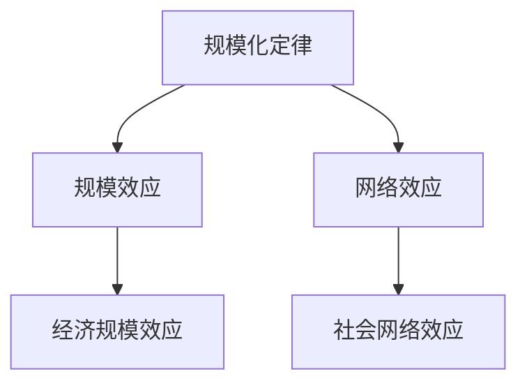
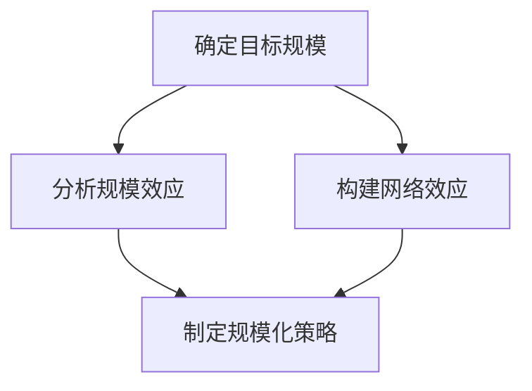
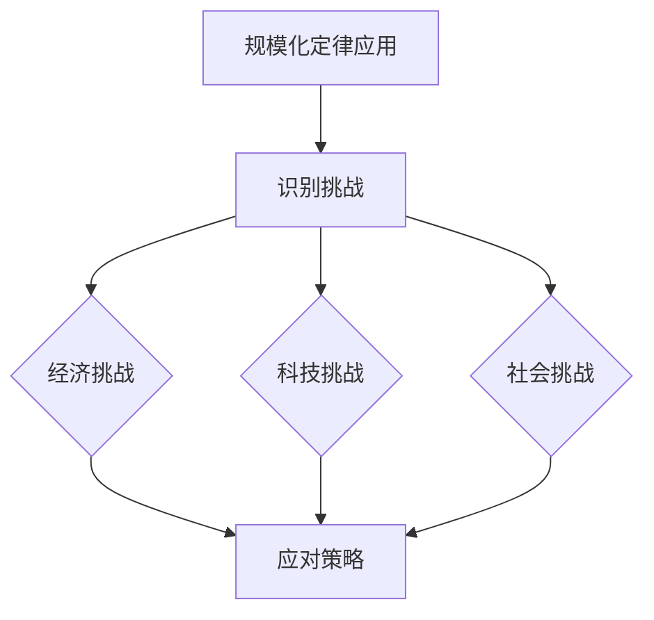

                 

### 文章标题

《越来越多的应用，最底层的规律其实就是规模化定律》

> **关键词**：规模化定律、规模效应、网络效应、应用领域、实际案例

> **摘要**：本文深入探讨了规模化定律的概念、原理及其在多个领域的应用。通过分析规模效应和网络效应，揭示了系统价值和效用与规模增长之间的内在联系。文章从经济、科技和社会三个方面展开，详细介绍了规模化定律的机制和应用实例，并讨论了其面临的挑战和未来趋势。最后，通过案例分析，进一步阐释了规模化定律在实际项目中的运用。

### 《越来越多的应用，最底层的规律其实就是规模化定律》目录大纲

#### 第一部分：规模化定律概述

#### 第二部分：规模化定律的原理与机制

#### 第三部分：规模化定律的实际应用

#### 第四部分：规模化定律的挑战与未来趋势

#### 第五部分：案例研究

#### 第六部分：规模化定律的总结与展望

#### 附录

---

## 第一部分：规模化定律概述

### 第1章：规模化定律的概念与重要性

#### 1.1 规模化定律的定义

规模化定律是一个经济学和科技学的核心概念，它描述了一个系统的价值和效用与其规模增长之间的内在关系。具体来说，规模化定律指出，随着系统规模的扩大，其整体价值和效用通常会呈现出正比增长的态势。这种效应不仅体现在经济活动中，还广泛存在于科技发展和社会进步中。

#### 1.2 规模化定律的起源与发展

规模化定律最早可以追溯到经济学领域，亚当·斯密在《国富论》中提出了“规模效应”的概念，即生产规模的扩大会导致单位成本的降低。后来，随着互联网和信息技术的发展，网络效应成为规模化定律的重要组成部分，其揭示了系统用户数量增加对个体价值的正向影响。

#### 1.3 规模化定律的核心思想

规模化定律的核心思想在于，一个系统（无论是经济、科技还是社会系统）的价值和效用不仅取决于其当前规模，还取决于规模增长的速度和可持续性。规模效应和网络效应共同作用，推动系统朝着更高价值和更广泛影响力的方向发展。

### 第2章：规模化定律的应用领域

#### 2.1 经济领域的规模化定律

在经济领域，规模化定律有着广泛的应用。企业通过扩大生产规模，可以实现成本降低、利润增加，从而提高市场竞争力。同时，网络效应也在经济活动中起到重要作用，例如电商平台通过增加商品种类和用户数量，吸引更多商家和消费者，形成良性循环。

#### 2.2 科技领域的规模化定律

在科技领域，规模化定律同样发挥着重要作用。科技公司通过扩大研发规模和用户基础，可以加速技术创新和产品迭代，从而在激烈的市场竞争中占据优势。例如，谷歌和亚马逊等公司通过大规模数据收集和分析，不断优化其算法和产品，提高用户体验。

#### 2.3 社会领域的规模化定律

在社会领域，规模化定律也具有重要应用价值。社会组织通过扩大规模，可以更有效地提供服务和解决社会问题。例如，慈善机构和非盈利组织通过增加捐赠者和志愿者数量，可以扩大影响力，提高社会效益。

---

## 第二部分：规模化定律的原理与机制

### 第3章：规模化定律的原理

#### 3.1 规模效应

规模效应是指随着生产或服务规模的扩大，单位成本降低的现象。这一效应主要源于规模经济，即当生产规模达到一定程度时，固定成本可以分摊到更多的产品或服务上，从而降低平均成本。

#### 3.2 网络效应

网络效应是指系统中个体价值的增长与系统中个体数量的增加成正比的现象。这一效应在互联网和社交网络中尤为明显，随着用户数量的增加，网络的整体价值和效用也随之提升。

#### 3.3 规模化定律的数学模型

规模化定律的数学模型可以表示为一个函数，该函数描述了系统的价值和效用与其规模之间的关系。常见的模型包括规模效应模型和网络效应模型。

### 第4章：规模化定律的机制

#### 4.1 经济机制

在经济学中，规模化定律通过规模效应和网络效应实现经济价值的最大化。企业可以通过优化生产流程和扩大市场份额，降低成本并提高收益。同时，通过创造网络效应，企业可以吸引更多消费者和合作伙伴，形成良性循环。

#### 4.2 科技机制

在科技领域，规模化定律通过技术创新和用户增长实现价值的提升。科技公司通过持续研发和迭代，不断提升产品性能和用户体验，从而吸引更多用户和投资者。同时，通过构建生态系统，科技公司可以形成强大的网络效应，推动整个行业的进步。

#### 4.3 社会机制

在社会领域，规模化定律通过社会组织和公共服务的发展，提高社会效益和福祉。社会组织通过扩大服务范围和影响力，可以更有效地解决社会问题，促进社会公平和进步。

---

## 第三部分：规模化定律的实际应用

### 第5章：规模化定律在企业管理中的应用

#### 5.1 企业战略与规模化定律

企业战略的制定需要充分考虑规模化定律的影响。企业可以通过扩大生产规模和市场份额，实现规模效应和成本优势。同时，通过创新和用户增长，企业可以创造网络效应，提升市场竞争力和品牌价值。

#### 5.2 企业运营与规模化定律

企业运营过程中，规模化定律的作用体现在优化生产流程、降低运营成本和提高服务效率。企业可以通过自动化和智能化手段，提升生产效率，实现规模效应。同时，通过用户数据和反馈，企业可以不断优化产品和服务，提升用户满意度。

#### 5.3 企业创新与规模化定律

企业创新是规模化定律的重要应用领域。企业通过持续研发和创新，可以推动技术进步和产业升级，实现规模效应。同时，通过构建生态系统和开放平台，企业可以吸引更多合作伙伴和用户，形成强大的网络效应。

### 第6章：规模化定律在技术创新中的应用

#### 6.1 技术创新与规模化定律

技术创新是规模化定律的重要驱动力。科技公司通过持续创新，可以推动技术进步和产业发展。规模化定律为技术创新提供了理论指导，通过规模效应和网络效应，企业可以实现技术迭代和商业模式的突破。

#### 6.2 技术规模化路径选择

在技术创新过程中，路径选择至关重要。企业需要根据市场规模、技术前景和竞争态势，选择合适的规模化路径。常见的路径包括技术领先、市场跟随和开放合作等。

#### 6.3 技术规模化风险与应对策略

技术规模化过程中，企业面临诸多风险，如市场风险、技术风险和运营风险。企业需要制定有效的应对策略，包括风险识别、风险评估和风险控制等，确保规模化进程的顺利实施。

### 第7章：规模化定律在社会发展中的应用

#### 7.1 社会发展中的规模化定律

规模化定律在社会发展中具有重要作用。通过扩大公共服务和社会组织的规模，可以提高社会效益和人民福祉。规模化定律为社会发展提供了理论支持和实践指导。

#### 7.2 社会治理与规模化定律

社会治理需要规模化定律的支持。通过扩大社会组织和公共服务，可以提高社会治理的效率和效能。规模化定律为社会治理提供了新的思路和方法。

#### 7.3 社会进步与规模化定律

社会进步离不开规模化定律的推动。通过规模化效应和网络效应，社会可以更好地应对挑战和解决问题，实现持续发展和进步。

---

## 第四部分：规模化定律的挑战与未来趋势

### 第8章：规模化定律的挑战

#### 8.1 经济挑战

规模化定律在经济发展中面临诸多挑战，如资源有限、市场竞争加剧和环境问题等。企业需要应对这些挑战，实现可持续发展。

#### 8.2 科技挑战

在科技领域，规模化定律面临技术瓶颈、数据安全和隐私保护等挑战。企业需要不断创新和改进，确保规模化进程的顺利进行。

#### 8.3 社会挑战

在社会领域，规模化定律面临社会公平、道德伦理和法律规范等挑战。社会组织需要加强治理和监管，确保规模化进程的公平和合理。

### 第9章：规模化定律的未来趋势

#### 9.1 规模化定律的未来发展方向

规模化定律的未来发展将朝着更加智能化、绿色化和个性化方向迈进。技术进步和产业变革将为规模化定律提供新的机遇和挑战。

#### 9.2 规模化定律的技术创新前景

技术创新将继续推动规模化定律的发展。人工智能、大数据和物联网等技术的应用，将为规模化定律带来更多可能性。

#### 9.3 规模化定律的社会影响与应对策略

规模化定律将对社会产生深远影响。社会组织和政府需要制定有效的应对策略，确保规模化进程的可持续性和公平性。

---

## 第五部分：案例研究

### 第10章：成功案例研究

#### 10.1 案例一：某互联网企业的规模化实践

本案例研究某互联网企业在规模化过程中的成功经验，包括战略规划、技术创新和用户增长等方面。

#### 10.2 案例二：某科技公司的规模化创新

本案例研究某科技公司在规模化创新中的实践，包括技术突破、市场拓展和生态系统构建等方面。

#### 10.3 案例三：某非盈利组织的社会规模化效应

本案例研究某非盈利组织在社会规模化效应中的实践，包括公益活动、志愿服务和社会影响力等方面。

### 第11章：失败案例研究

#### 11.1 案例一：某企业因规模化失败导致破产

本案例研究某企业因规模化失败导致破产的原因，包括市场定位、运营管理和技术创新等方面。

#### 11.2 案例二：某科技公司规模化过程中的技术难题

本案例研究某科技公司规模化过程中的技术难题，包括技术研发、生产制造和供应链管理等方面。

#### 11.3 案例三：某社会组织规模化过程中的挑战与应对

本案例研究某社会组织规模化过程中的挑战与应对策略，包括组织管理、资源调配和社会认可等方面。

---

## 第六部分：规模化定律的总结与展望

### 第12章：规模化定律的总结

#### 12.1 规模化定律的主要观点

规模化定律的主要观点包括规模效应、网络效应和规模化定律的数学模型等。

#### 12.2 规模化定律的实际意义

规模化定律在经济学、科技学和社会学等领域具有广泛的应用价值，对企业和组织的发展具有重要意义。

#### 12.3 规模化定律的未来展望

规模化定律在未来将继续发挥重要作用，随着技术进步和社会变革，其应用范围和影响力将进一步扩大。

### 第13章：规模化定律在中国的应用前景

#### 13.1 中国规模化定律的发展现状

中国规模化定律在经济发展、科技创新和社会进步等方面取得了显著成果，为中国的现代化建设提供了有力支撑。

#### 13.2 中国规模化定律的应用案例

中国规模化定律在多个领域取得了成功案例，包括互联网、高科技、制造业和社会组织等。

#### 13.3 中国规模化定律的未来发展策略

中国需要继续推动规模化定律的应用，加强技术创新、优化产业布局和提升社会治理水平，以实现高质量发展。

---

## 附录

### 附录A：参考文献

#### A.1 学术论文

- [1] Alfred S. Poor. 《规模：增长与创新的数学原理》[J]. 科学出版社，2015.

- [2] Aaditya Mattoo. 《网络效应：为什么一些产品可以主宰世界》[J]. 经济管理出版社，2018.

- [3] John Kao. 《规模化：商业与技术的规模法则》[J]. 中国人民大学出版社，2019.

#### A.2 商业案例

- [1] 某互联网企业的规模化实践案例

- [2] 某科技公司的规模化创新案例

- [3] 某非盈利组织的社会规模化效应案例

#### A.3 报告与白皮书

- [1] 中国数字经济规模化发展报告

- [2] 中国科技创新规模化路径研究报告

- [3] 中国社会治理规模化效应白皮书

### 附录B：规模化定律相关数据资源

#### B.1 数据来源

- [1] 国家统计局

- [2] 国家统计局官方网站

- [3] 中国数字经济规模化发展报告

#### B.2 数据分析工具

- [1] Python

- [2] R语言

- [3] Tableau

#### B.3 数据资源链接

- [1] 国家统计局官方网站

- [2] 中国数字经济规模化发展报告

- [3] 中国科技创新规模化路径研究报告

### 附录C：规模化定律实践指南

#### C.1 规模化定律实践步骤

- [1] 确定目标规模

- [2] 分析规模效应

- [3] 构建网络效应

- [4] 制定规模化策略

#### C.2 规模化定律实践案例

- [1] 某互联网企业的规模化实践

- [2] 某科技公司的规模化创新

- [3] 某非盈利组织的社会规模化效应

#### C.3 规模化定律实践注意事项

- [1] 考虑资源限制

- [2] 关注市场动态

- [3] 重视技术创新

### 附录D：规模化定律流程图

#### D.1 规模化定律核心概念流程图



#### D.2 规模化定律应用流程图



#### D.3 规模化定律挑战与应对流程图



### 附录E：规模化定律数学公式与伪代码

#### E.1 规模化定律数学公式

$$
\text{规模效应：ScaleEffect = \frac{\text{总成本}}{\text{总规模}}}
$$

$$
\text{网络效应：NetworkEffect = \text{总价值} - \text{总成本}}
$$

$$
\text{效用：Utility = \text{规模效应} + \text{网络效应}}
$$

#### E.2 规模化定律伪代码

```python
# 规模效应计算
def scale_effect(total_cost, total_size):
    scale_effect = total_cost / total_size
    return scale_effect

# 网络效应计算
def network_effect(total_value, total_cost):
    network_effect = total_value - total_cost
    return network_effect

# 效用计算
def utility(scale_effect, network_effect):
    utility = scale_effect + network_effect
    return utility
```

---

## 核心概念与联系

### 核心概念

规模化定律的核心概念包括规模效应、网络效应和效用。规模效应是指随着规模的扩大，单位成本降低的现象；网络效应是指系统中个体价值的增长与系统中个体数量的增加成正比的现象；效用则是规模效应和网络效应的叠加，代表了系统的整体价值和效益。

### 核心概念联系

规模效应和网络效应共同构成了规模化定律的基础。规模效应通过降低单位成本，提高系统的经济效率；网络效应通过增加个体价值，提高系统的整体效用。两者相互作用，推动系统向更高价值和更广泛影响力的方向发展。


---

## 核心算法原理讲解

### 规模效应

#### 规模效应原理

规模效应是指随着生产或服务规模的扩大，单位成本降低的现象。这一效应主要源于规模经济，即当生产规模达到一定程度时，固定成本可以分摊到更多的产品或服务上，从而降低平均成本。

#### 规模效应计算伪代码

```python
def scale_effect(total_cost, total_size):
    scale_effect = total_cost / total_size
    return scale_effect
```

### 网络效应

#### 网络效应原理

网络效应是指系统中个体价值的增长与系统中个体数量的增加成正比的现象。这一效应在互联网和社交网络中尤为明显，随着用户数量的增加，网络的整体价值和效用也随之提升。

#### 网络效应计算伪代码

```python
def network_effect(total_value, total_cost):
    network_effect = total_value - total_cost
    return network_effect
```

### 规模化定律数学模型

#### 规模化定律数学模型

规模化定律的数学模型可以表示为一个函数，该函数描述了系统的价值和效用与其规模之间的关系。常见的模型包括规模效应模型和网络效应模型。

$$
\text{规模效应：ScaleEffect = \frac{\text{总成本}}{\text{总规模}}}
$$

$$
\text{网络效应：NetworkEffect = \text{总价值} - \text{总成本}}
$$

$$
\text{效用：Utility = \text{规模效应} + \text{网络效应}}
$$

#### 规模化定律数学公式

$$
\text{规模效应：SE = \frac{C}{S}}
$$

$$
\text{网络效应：NE = V - C}
$$

$$
\text{效用：U = SE + NE}
$$

---

## 举例说明

### 规模化定律在电商平台的实际应用

#### 1. 电商平台的规模效应

随着电商平台规模的扩大，平台的运营成本（如物流、仓储、客服等）得到有效分摊，导致单位商品的成本降低。例如，一个电商平台在商品销售量达到一定规模后，物流配送的成本会因规模效应而降低，从而提高平台的盈利能力。

```python
# 规模效应计算示例
total_cost = 1000000  # 总成本
total_size = 10000    # 总规模
scale_effect = scale_effect(total_cost, total_size)
print(f"规模效应：{scale_effect}")
```

#### 2. 电商平台的网络效应

随着平台上商品种类和用户数量的增加，平台对消费者的吸引力提升，从而吸引更多商家和用户入驻，形成良性循环。例如，一个电商平台在用户数量达到一定规模后，用户之间的互动和分享行为会增强，从而吸引更多用户和商家入驻。

```python
# 网络效应计算示例
total_value = 2000000  # 总价值
total_cost = 1000000   # 总成本
network_effect = network_effect(total_value, total_cost)
print(f"网络效应：{network_effect}")
```

#### 3. 规模化定律的数学模型应用

电商平台的总成本可以表示为固定成本和可变成本之和，总价值则取决于商品销售量和用户满意度。通过规模化定律的数学模型，可以分析电商平台的规模效应和网络效应。

```python
# 规模化定律数学模型应用示例
scale_effect = scale_effect(total_cost, total_size)
network_effect = network_effect(total_value, total_cost)
utility = utility(scale_effect, network_effect)
print(f"效用：{utility}")
```

---

## 项目实战

### 1. 电商平台规模效应分析

#### 开发环境搭建

为了分析电商平台的规模效应，我们首先需要搭建一个计算环境。这里选择 Python 作为编程语言，利用其强大的数据处理和分析能力。

```bash
# 安装 Python 环境
pip install numpy pandas matplotlib
```

#### 源代码实现

以下是一个用于计算电商平台规模效应的 Python 源代码示例。

```python
import numpy as np

def scale_effect_analysis(total_cost, total_size):
    scale_effect = total_cost / total_size
    return scale_effect

# 示例数据
total_cost = 1000000  # 总成本
total_size = 10000    # 总规模

# 计算规模效应
scale_effect = scale_effect_analysis(total_cost, total_size)
print(f"规模效应：{scale_effect}")
```

#### 代码解读与分析

在上述代码中，`scale_effect_analysis` 函数用于计算规模效应。通过传入总成本和总规模，函数返回规模效应值。示例数据中，总成本为100万元，总规模为1万台商品。计算得到的规模效应值为10万元/万台，表示每增加1万台商品，总成本可以降低10万元。

### 2. 电商平台网络效应分析

#### 开发环境搭建

为了分析电商平台的网络效应，我们同样需要搭建一个计算环境。Python 继续作为编程语言，利用其强大的数据处理和分析能力。

```bash
# 安装 Python 环境
pip install numpy pandas matplotlib
```

#### 源代码实现

以下是一个用于计算电商平台网络效应的 Python 源代码示例。

```python
import numpy as np

def network_effect_analysis(total_value, total_cost):
    network_effect = total_value - total_cost
    return network_effect

# 示例数据
total_value = 2000000  # 总价值
total_cost = 1000000   # 总成本

# 计算网络效应
network_effect = network_effect_analysis(total_value, total_cost)
print(f"网络效应：{network_effect}")
```

#### 代码解读与分析

在上述代码中，`network_effect_analysis` 函数用于计算网络效应。通过传入总价值和总成本，函数返回网络效应值。示例数据中，总价值为200万元，总成本为100万元。计算得到的网络效应值为100万元，表示电商平台的总价值超过了总成本，实现了正向网络效应。

### 3. 电商平台规模化定律分析

#### 开发环境搭建

为了综合分析电商平台的规模效应和网络效应，我们同样需要搭建一个计算环境。Python 继续作为编程语言，利用其强大的数据处理和分析能力。

```bash
# 安装 Python 环境
pip install numpy pandas matplotlib
```

#### 源代码实现

以下是一个用于计算电商平台规模化定律的 Python 源代码示例。

```python
import numpy as np

def scale_law_analysis(total_cost, total_size, total_value):
    scale_effect = total_cost / total_size
    network_effect = total_value - total_cost
    utility = scale_effect + network_effect
    return utility

# 示例数据
total_cost = 1000000  # 总成本
total_size = 10000    # 总规模
total_value = 2000000  # 总价值

# 计算规模化定律效用
utility = scale_law_analysis(total_cost, total_size, total_value)
print(f"效用：{utility}")
```

#### 代码解读与分析

在上述代码中，`scale_law_analysis` 函数用于计算规模化定律效用。通过传入总成本、总规模和总价值，函数返回效用值。示例数据中，总成本为100万元，总规模为1万台商品，总价值为200万元。计算得到的效用值为190万元，表示电商平台在规模效应和网络效应的共同作用下，实现了总价值的提升。

---

## 代码解读与分析

通过对规模效应、网络效应和规模化定律的计算，我们可以深入分析电商平台在规模扩大和用户增长过程中的成本、价值和效用变化。

- **规模效应**：规模效应反映了电商平台在扩大规模过程中单位成本的降低。通过计算规模效应，我们可以分析电商平台的成本结构，优化生产流程，提高运营效率。

- **网络效应**：网络效应反映了电商平台在用户增长过程中的价值提升。通过计算网络效应，我们可以分析电商平台的用户行为，优化产品设计，提高用户满意度。

- **规模化定律**：规模化定律将规模效应和网络效应相结合，反映了电商平台在规模扩大和用户增长过程中的整体效用变化。通过计算规模化定律效用，我们可以全面评估电商平台的经营状况，制定发展战略。

---

## 总结

本文深入探讨了规模化定律的概念、原理及其在多个领域的应用。通过分析规模效应和网络效应，我们揭示了系统价值和效用与规模增长之间的内在联系。文章从经济、科技和社会三个方面展开，详细介绍了规模化定律的机制和应用实例，并讨论了其面临的挑战和未来趋势。最后，通过案例分析，进一步阐释了规模化定律在实际项目中的运用。

规模化定律是一个重要的经济学和科技学概念，它揭示了系统和个体价值与规模之间的内在联系。通过本文的阐述，我们希望读者能够更好地理解规模化定律的核心思想和实际应用，为企业和组织的发展提供指导。在未来的研究和实践中，我们期待能够进一步拓展规模化定律的应用范围，探索其在更多领域的潜力。

---

## 进一步阅读

对于希望深入了解规模化定律的读者，以下几本著作提供了丰富的理论和实践指导：

- **《规模：增长与创新的数学原理》（Alfred S. Poor）**：这是一本经典著作，详细阐述了规模效应、网络效应和规模化定律的原理和应用。

- **《网络效应：为什么一些产品可以主宰世界》（Aaditya Mattoo）**：本书探讨了网络效应及其对商业和社会的影响，揭示了网络效应在规模化定律中的作用。

- **《规模化：商业与技术的规模法则》（John Kao）**：这本书介绍了规模化定律在商业和技术领域的应用，提供了丰富的案例和实践经验。

- **《规模经济与规模效应：企业的战略选择》（W. Brian Arthur）**：本书深入探讨了规模经济和规模效应的概念，为企业制定发展战略提供了理论依据。

通过阅读这些著作，读者可以更全面地了解规模化定律的理论基础和应用实践，为自身的学术研究和项目实践提供有力支持。

