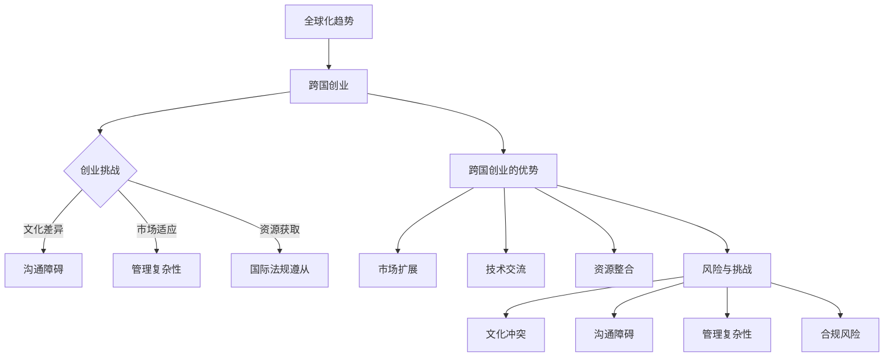
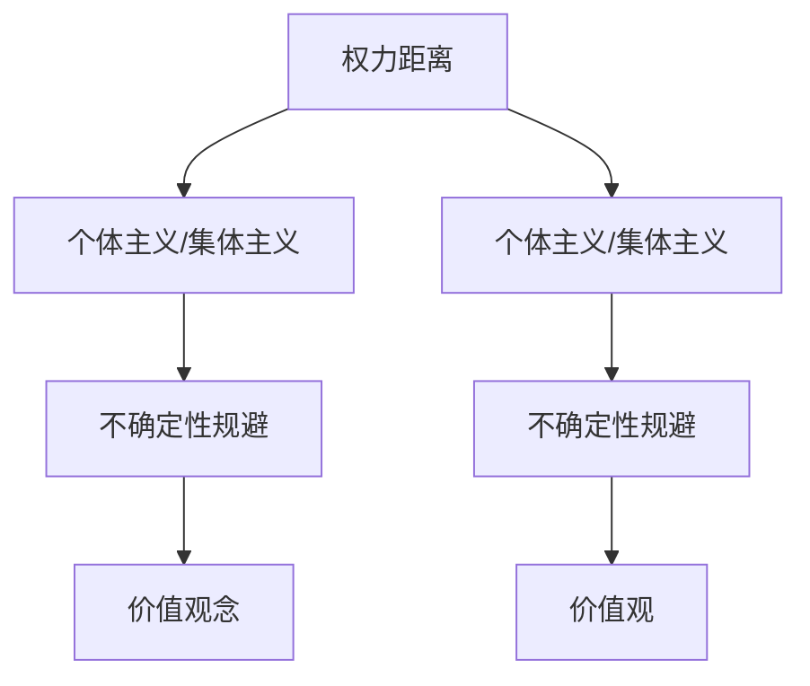
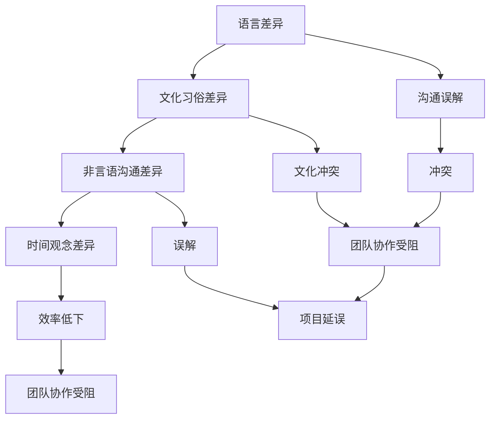
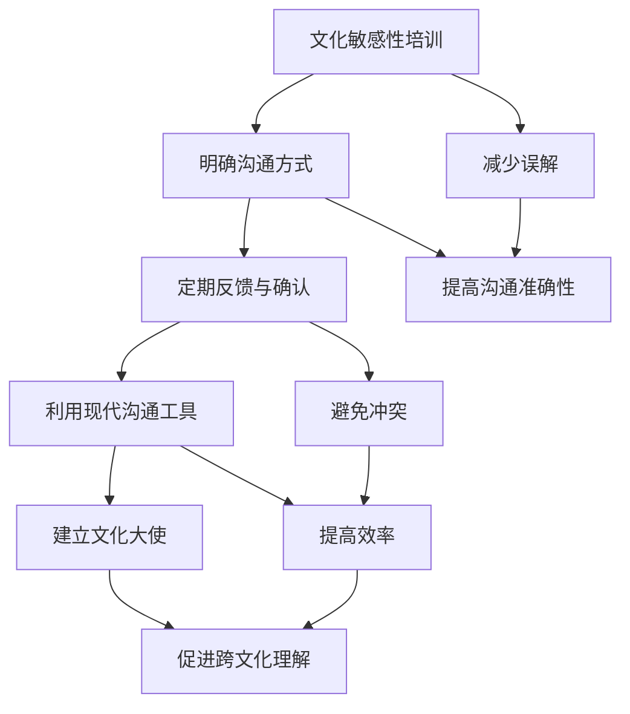

                 

### 跨国创业团队管理的背景与重要性

#### 1.1 跨国创业的趋势与挑战

随着全球化进程的加速，跨国创业正在成为越来越多创业者的选择。跨国创业不仅有助于企业拓展市场，还能通过整合不同地区的资源和优势，提升企业的竞争力。然而，跨国创业也带来了一系列的挑战，尤其是在团队管理方面。

首先，全球化对创业团队的影响是显而易见的。跨国团队往往需要面对不同的语言、文化、法律和社会习俗。这些差异不仅会影响团队成员的沟通效率，还可能引发文化冲突。例如，在一个高权力距离的文化中，员工可能更倾向于保持距离，而在一个低权力距离的文化中，员工可能更倾向于参与决策过程。

其次，跨国创业的优势与风险并存。优势方面，跨国创业能够帮助企业迅速进入新市场，获取新的客户资源，甚至获得某些特定地区的专利和技术优势。然而，风险也不可忽视。文化差异可能导致团队协作困难，法律和税务风险也可能增加企业的运营成本和不确定性。

为了更好地理解跨国创业的挑战和优势，我们可以通过以下Mermaid流程图来梳理：



#### 1.2 文化差异的基本概念

文化差异是指不同文化背景的人在价值观、行为方式、沟通风格等方面的差异。理解文化差异对于跨国创业团队的管理至关重要。以下是从两个角度探讨文化差异的基本概念。

首先，文化与组织行为之间的联系。文化对组织行为有着深远的影响。例如，在一个集体主义文化中，员工可能更倾向于强调团队合作和集体利益，而在一个个体主义文化中，员工可能更注重个人成就和独立工作。这种差异会影响团队的决策过程、工作风格和沟通方式。

其次，文化差异的类型。霍夫斯泰德的文化维度理论是研究文化差异的重要理论之一。该理论提出了四个主要的文化维度：个体主义与集体主义、权力距离、不确定性规避和价值观。这些维度帮助我们理解不同文化之间的行为差异。

以下是霍夫斯泰德文化维度理论的Mermaid流程图：

```mermaid
graph TB
A[Powe
```

由于代码片段被截断，我们将完整展示霍夫斯泰德文化维度理论的Mermaid流程图：



通过这个流程图，我们可以看到不同文化维度之间的联系和相互影响。例如，权力距离高的文化往往表现出更强的集体主义倾向，而权力距离低的文化则倾向于个体主义。

#### 1.3 沟通挑战与解决方案

在跨国创业团队中，沟通挑战是一个常见且重要的问题。有效的沟通是团队协作和项目成功的基石。然而，文化差异和沟通障碍往往会导致误解、冲突和效率低下。以下我们将探讨跨文化沟通的障碍以及提高跨文化沟通效果的策略。

##### 1.3.1 跨文化沟通的障碍

跨文化沟通的障碍可以分为几个方面：

1. **语言差异**：不同语言的语法、词汇和表达方式可能导致误解。例如，某些在母语中非常明确的概念，在另一种语言中可能需要更复杂的表达。

2. **文化习俗差异**：不同文化中的礼仪、习俗和社交规则会影响沟通方式。例如，在某些文化中，直接表达意见可能被视为不礼貌，而在其他文化中则被视为透明和直接。

3. **非言语沟通差异**：肢体语言、面部表情和眼神接触在不同文化中有不同的含义。例如，在某些文化中，频繁的眼神接触可能被视为尊重和关注，而在其他文化中则可能被视为挑衅或不礼貌。

4. **时间观念差异**：不同文化对时间的重要性和处理方式有不同的看法。例如，在某些文化中，时间被视为线性且不可逆转的，而在其他文化中，时间可能被视为循环的、弹性的。

为了更好地理解这些障碍，我们可以通过以下Mermaid流程图来梳理：



通过这个流程图，我们可以清晰地看到语言差异、文化习俗差异、非言语沟通差异和时间观念差异是如何影响跨文化沟通的。

##### 1.3.2 提高跨文化沟通效果的策略

为了克服这些沟通障碍，我们可以采取以下策略：

1. **增强文化敏感性**：通过培训和教育，提高团队成员对文化差异的认识和敏感度。这有助于减少误解和冲突，提高沟通的准确性。

2. **使用明确的沟通方式**：在沟通中，尽可能使用简单、直接且明确的语言。这有助于减少语言和文化差异带来的误解。

3. **定期进行反馈和确认**：在重要的沟通环节后，进行反馈和确认，确保信息的准确传达。这可以避免因为误解而导致的问题。

4. **利用现代沟通工具**：现代技术，如视频会议、即时通讯和协作软件，可以帮助跨国团队克服地理障碍，提高沟通效率。

5. **建立文化大使**：在团队中任命文化大使，负责跨文化沟通的协调和指导。他们可以成为不同文化之间的桥梁，帮助团队成员更好地理解和适应彼此的文化。

以下是提高跨文化沟通效果的Mermaid流程图：



通过这些策略，跨国创业团队可以更有效地克服沟通障碍，提高团队协作效率和项目成功率。

#### 第一部分总结

在本章中，我们探讨了跨国创业团队管理的背景与重要性，分析了文化差异的基本概念，并提出了应对跨文化沟通挑战的策略。通过Mermaid流程图和伪代码，我们清晰地展示了这些概念和策略的具体实现。理解跨国创业的趋势与挑战、文化差异的类型以及跨文化沟通的策略，对于成功管理跨国创业团队至关重要。在接下来的章节中，我们将进一步探讨如何具体应对文化差异，提高跨文化沟通效果，并分析实际案例中的成功与失败经验。这些内容将帮助我们更好地理解跨国创业团队管理的复杂性和多样性，为实际操作提供有价值的参考和指导。

