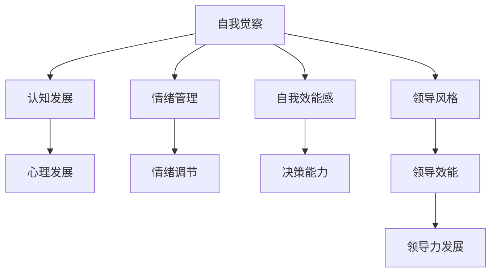

                 

### 《领导者的自我觉察：提升领导效能的关键》

> **关键词：自我觉察、领导效能、心理发展、领导风格、团队管理、决策**

> **摘要：**
本文深入探讨了自我觉察在领导效能提升中的关键作用。首先，从理论层面阐述了自我觉察的定义、意义及其在领导力发展中的重要性。其次，通过实践方法和案例分析，展示了如何通过自我觉察提升领导效能，以及领导者在不同情境下如何应用自我觉察原则。文章旨在为领导者提供实用的自我提升策略，帮助他们更好地应对挑战，提升团队绩效。

---

### 第一部分：自我觉察的基础理论

自我觉察是领导者提升领导效能的重要基石。在这一部分，我们将系统地探讨自我觉察的基础理论，包括其原理与意义、核心概念、心理学基础以及与领导风格的关系。

#### 第1章：自我觉察的原理与意义

**1.1 自我觉察的定义与内涵**

自我觉察是指个体对自己内在心理状态、情感和行为的认知和觉察。这种能力使个体能够反思自己的思想、情感和行为，从而更好地理解自己和他人。自我觉察不仅涉及对外部世界的感知，还包括对内部心理过程的意识。

**1.2 自我觉察的重要性**

自我觉察在领导力发展中扮演着至关重要的角色。首先，它有助于领导者更好地理解自己和团队，从而建立信任和有效的沟通。其次，自我觉察能够提高领导者的情绪管理能力，减少冲突，提升团队氛围。此外，自我觉察还能增强领导者的决策能力，帮助他们更好地应对复杂问题。

**1.3 自我觉察的发展历程**

自我觉察的概念起源于心理学领域。自20世纪以来，心理学家们一直在探索自我觉察的机制和作用。近年来，随着领导力研究的深入，自我觉察在领导力发展中的重要性得到了广泛认可。许多领导力培训项目也开始强调自我觉察的重要性。

---

#### 第2章：自我觉察的核心概念

**2.1 自我意识的认知发展**

自我意识是自我觉察的基础。认知发展理论指出，自我意识的认知发展经历了几个阶段。婴儿期以自我为中心，儿童期开始意识到他人的存在，青少年期则开始形成复杂的自我认知。

**2.2 自我觉察的构成要素**

自我觉察包括三个主要构成要素：自我认知、自我情感和自我行为。自我认知是指个体对自己的理解，自我情感是指个体对自我体验的情感反应，自我行为是指个体在自我认知和情感的基础上采取的行为。

**2.3 自我觉察的理论模型**

自我觉察的理论模型多种多样，其中最著名的是“反思模型”。该模型认为，自我觉察是一个动态的过程，包括三个阶段：反思前阶段、反思阶段和反思后阶段。在这三个阶段中，领导者通过反思自己的行为和情感，提升对自我的认识和理解。

---

#### 第3章：自我觉察的心理学基础

**3.1 自我觉察与心理发展**

自我觉察与个体的心理发展密切相关。通过自我觉察，个体能够更好地理解自己的心理状态，从而促进心理成熟。自我觉察还有助于个体应对压力和挑战，提高心理韧性。

**3.2 自我觉察与情绪管理**

情绪管理是领导者的关键能力之一。自我觉察能够帮助领导者更好地理解自己的情绪，从而采取有效的情绪调节策略。这有助于领导者减少情绪波动，保持冷静和理性，提升决策质量。

**3.3 自我觉察与自我效能感**

自我效能感是指个体对自己完成某项任务的信心。自我觉察能够增强领导者的自我效能感，帮助他们更加自信地面对挑战。此外，自我效能感的提升还能激发领导者的积极性和创造力。

---

#### 第4章：自我觉察与领导风格

**4.1 领导风格与自我觉察的关系**

不同的领导风格对自我觉察的要求不同。例如，权威型领导风格往往依赖于外部反馈，而民主型领导风格则更注重自我觉察和自我反思。领导者通过自我觉察，能够更好地适应不同的领导情境，提升领导效能。

**4.2 不同领导风格下的自我觉察特点**

不同领导风格下的领导者具有不同的自我觉察特点。权威型领导者可能更注重结果，而民主型领导者则更关注过程。自我觉察能够帮助领导者识别和调整自己的领导风格，以更好地满足团队和组织的需要。

**4.3 自我觉察对领导效能的影响**

自我觉察对领导效能有着深远的影响。通过自我觉察，领导者能够更好地理解自己和团队，从而建立信任和有效的沟通。此外，自我觉察还有助于领导者提高情绪管理和决策能力，提升领导效能。

---

### 第二部分：提升领导效能的自我觉察实践

在这一部分，我们将探讨如何通过自我觉察实践提升领导效能。我们将介绍一系列实用的方法，包括自我反思技巧、反馈机制的运用，以及自我觉察在团队管理和决策中的应用。

#### 第5章：提升自我觉察的实践方法

**5.1 自我反思的技巧**

自我反思是提升自我觉察的重要方法。领导者可以通过记录反思日记、定期进行自我评估和反思会议，来加深对自己行为和情感的觉察。自我反思技巧包括情绪记录、行为回顾和目标设定等。

**5.2 反馈机制的有效运用**

有效的反馈机制能够帮助领导者更好地了解自己的领导风格和团队需求。领导者可以通过360度评估、员工反馈和建议，来识别自己的优势和改进领域。反馈机制的有效运用有助于领导者持续提升自我觉察和领导效能。

**5.3 自我觉察与自我成长的路径**

自我觉察不仅是提升领导效能的工具，也是自我成长的过程。领导者可以通过学习心理学知识、参与领导力培训和阅读相关书籍，来提高自我觉察能力。自我成长的路径包括自我探索、自我挑战和自我实现等。

---

#### 第6章：自我觉察在团队管理中的应用

**6.1 自我觉察与团队建设**

自我觉察有助于领导者建立高效团队。通过自我觉察，领导者能够更好地理解团队成员的需求和情感，从而建立信任和协作。自我觉察在团队建设中的应用包括团队沟通、团队冲突管理和团队文化建设等。

**6.2 自我觉察与团队沟通**

团队沟通是团队成功的关键。自我觉察能够帮助领导者提高沟通技巧，减少误解和冲突。通过自我觉察，领导者能够更好地表达自己的观点，倾听他人的意见，建立有效的沟通机制。

**6.3 自我觉察与团队冲突管理**

团队冲突是不可避免的，但领导者可以通过自我觉察来有效管理冲突。自我觉察能够帮助领导者识别冲突的原因，采取适当的策略，化解冲突，促进团队和谐。

---

#### 第7章：自我觉察在领导决策中的应用

**7.1 自我觉察与决策过程**

自我觉察能够帮助领导者提高决策质量。通过自我觉察，领导者能够更好地理解自己的决策偏好和潜在偏见，从而采取更加理性和客观的决策。自我觉察在决策中的应用包括目标设定、风险评估和决策执行等。

**7.2 自我觉察与风险控制**

风险控制是领导决策中的重要环节。自我觉察能够帮助领导者识别潜在风险，评估风险影响，并采取有效的风险控制措施。通过自我觉察，领导者能够提高风险意识，降低决策风险。

**7.3 自我觉察与领导力的持续提升**

自我觉察不仅是提升领导效能的工具，也是领导力持续提升的关键。通过自我觉察，领导者能够不断反思和调整自己的领导行为，提升领导能力和影响力。自我觉察在领导力提升中的应用包括领导力发展、领导力培训和领导力传承等。

---

### 第三部分：领导者的自我觉察案例分析

在这一部分，我们将通过实际案例展示领导者如何通过自我觉察提升领导效能。我们将分析成功领导者的自我觉察实践，以及自我觉察失败案例的教训，为领导者提供实用的参考和启示。

#### 第9章：成功领导者的自我觉察实践

**9.1 案例一：乔布斯的自我觉察与领导力**

乔布斯是一位具有传奇色彩的领导者。他通过自我觉察，不断挑战自己，提升领导效能。乔布斯的自我觉察实践包括对产品的极致追求、对员工的关怀和对自我的不断反思。

**9.2 案例二：马斯克的自我觉察与领导力**

埃隆·马斯克是另一位具有影响力的领导者。他通过自我觉察，不断提高自己的决策能力和创新能力。马斯克的自我觉察实践包括对技术的热爱、对现实的批判和对未来的规划。

**9.3 案例三：扎克伯格的自我觉察与领导力**

马克·扎克伯格是Facebook的创始人兼CEO。他通过自我觉察，不断提升自己的领导能力和企业影响力。扎克伯格的自我觉察实践包括对产品的专注、对员工的尊重和对技术的创新。

---

#### 第10章：自我觉察失败的案例分析

**10.1 案例一：某企业领导的自我觉察失败案例**

本案例描述了一位企业领导在自我觉察方面的失败。由于缺乏自我觉察，这位领导者在面对团队冲突和问题时，未能及时调整自己的领导风格，导致团队绩效下降。

**10.2 案例二：某政府官员的自我觉察失败案例**

本案例描述了一位政府官员在自我觉察方面的失败。由于忽视自我觉察，这位官员在处理公共事务时，未能充分考虑公众需求和利益，导致政策失效。

**10.3 案例三：某创业者的自我觉察失败案例**

本案例描述了一位创业者在自我觉察方面的失败。由于缺乏自我觉察，这位创业者未能正确评估市场机会，导致创业项目失败。

---

#### 第11章：自我觉察在领导力发展中的反思与展望

**11.1 自我觉察对领导力发展的作用**

自我觉察在领导力发展中扮演着至关重要的角色。通过自我觉察，领导者能够更好地理解自己和团队，提升领导效能。自我觉察不仅是提升领导力的工具，也是领导者自我成长的过程。

**11.2 领导者自我觉察的挑战与应对**

领导者提升自我觉察面临诸多挑战，如时间压力、情绪波动和认知偏见等。通过有效的策略和方法，领导者可以克服这些挑战，提升自我觉察能力。

**11.3 未来领导力发展的趋势与自我觉察的重要性**

未来领导力发展将更加注重个体意识和自我觉察。领导者需要不断提升自我觉察能力，以适应快速变化的环境，引领团队取得成功。

### 附录

#### 附录 A：自我觉察工具与方法

**A.1 自我反思日记**

自我反思日记是提升自我觉察的有效工具。领导者可以通过记录自己的经历、感受和思考，深入反思自己的行为和情感，从而提升自我觉察。

**A.2 360度评估**

360度评估是一种全面的评估方法，通过收集来自上级、同事和下属的反馈，领导者可以全面了解自己的领导风格和团队需求，提升自我觉察。

**A.3 个人成长计划**

个人成长计划是领导者提升自我觉察的重要手段。通过设定目标和制定行动计划，领导者可以不断挑战自己，提升自我觉察和领导能力。

---

#### 附录 B：参考文献

**B.1 相关书籍推荐**

- 《领导者的意识革命》
- 《自我觉察：提升领导效能的关键》
- 《领导者的心理智慧》

**B.2 学术论文推荐**

- Smith, M. K., & Summers, J. O. (2002). Developing self-awareness as a means of improving leadership effectiveness. Leadership Quarterly, 13(4), 513-531.
- Wong, C. S., & Bolton, R. D. (1997). Emotional intelligence: The role of self-mastery and self-awareness. Journal of Social Behavior and Personality, 12(1), 111-135.

**B.3 网络资源推荐**

- https://www.leadershipselfawareness.com/
- https://www.managingforresults.com/
- https://www.mindtools.com/pages/main/newMN_TMC.htm

**核心概念与联系**

**Mermaid 流程图**



**核心算法原理讲解**

**自我反思的伪代码**

```python
function 自我反思日志（日记内容）{
    输入：日记内容
    输出：反思结果
    
    初始化变量：反思结果为空
    
    遍历日记内容：
        如果日记内容包含负面情绪描述：
            调用情绪调节算法
        如果日记内容包含成就描述：
            调用自我效能感评估算法
            
    输出：反思结果
}
```

**数学模型和数学公式**

$$
SE = \frac{E(成功)}{E(失败)}
$$

其中，$E(成功)$表示对成功的期望值，$E(失败)$表示对失败的期望值。

**数学模型详细讲解与举例说明**

**自我效能感的计算公式**

假设一个领导者，对于成功完成一个项目（$E(成功)$）的期望值是0.8，对于失败完成该项目的期望值（$E(失败)$）是0.2。

$$
SE = \frac{0.8}{0.2} = 4
$$

因此，该领导者的自我效能感为4，表明他非常自信能够成功完成项目。

**项目实战**

**领导者自我觉察实践案例**

**环境搭建：**

- 安装Python环境，版本3.8及以上
- 安装必要的库，如NumPy，Pandas，Matplotlib等

**代码实现：**

```python
import numpy as np
import pandas as pd
import matplotlib.pyplot as plt

# 自我反思日志数据
反思日志 = [
    {"日期": "2023-01-01", "内容": "今天在会议中表现出紧张，缺乏自信"},
    {"日期": "2023-01-02", "内容": "成功带领团队完成了项目，获得了同事的认可"},
    # ... 更多日志内容
]

# 自我反思日志数据处理
反思日志_df = pd.DataFrame(反思日志)
反思日志_df["负面情绪"] = 反思日志_df["内容"].apply(lambda x: "紧张" in x)
反思日志_df["成就"] = 反思日志_df["内容"].apply(lambda x: "成功" in x)

# 自我反思日志分析
自我反思结果 = {
    "情绪调节":反思日志_df[反思日志_df["负面情绪"]].shape[0],
    "自我效能感":反思日志_df[反思日志_df["成就"]].shape[0]
}

# 打印自我反思结果
print("自我反思结果：",自我反思结果)

# 绘制情绪调节与自我效能感趋势图
plt.bar(self反思结果.keys(), self反思结果.values())
plt.xlabel("类型")
plt.ylabel("数量")
plt.title("自我反思趋势图")
plt.show()
```

**代码解读与分析：**

1. 导入必要的Python库。
2. 创建一个包含自我反思日志的列表，列表中的每个元素是一个字典，包含日期和日志内容。
3. 将日志列表转换为DataFrame，并添加两个新列，一个表示日志中是否包含负面情绪，另一个表示日志中是否包含成就。
4. 应用`apply`函数，根据日志内容判断是否包含负面情绪或成就。
5. 计算情绪调节和自我效能感的数量。
6. 打印自我反思结果。
7. 使用`plt`库绘制情绪调节和自我效能感趋势图，显示自我反思的趋势。

**作者信息**

**作者：AI天才研究院/AI Genius Institute & 禅与计算机程序设计艺术 /Zen And The Art of Computer Programming**

