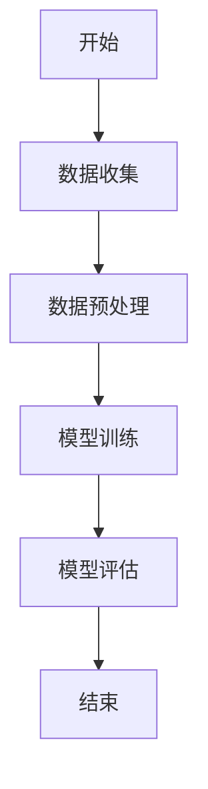

                 

# 《AI 2.0 时代的人工智能》

## 概述

> **关键词：**AI 2.0、人工智能、深度学习、机器学习、自然语言处理

> **摘要：**随着技术的不断进步，人工智能（AI）正经历着一场革命。AI 2.0 作为这一革命的核心，代表了人工智能的第二个时代。本文将深入探讨 AI 2.0 的基础概念、架构原理、技术趋势、应用实践及其未来挑战与机遇。

在过去的几十年里，人工智能经历了从符号主义到连接主义，再到现代深度学习的演变。AI 1.0 以符号主义和规则为基础，其局限性导致了其在处理复杂任务时的不足。AI 2.0 则以深度学习和机器学习为核心，通过模拟人脑神经网络，实现了在图像识别、语音识别、自然语言处理等领域的重大突破。

### 目录大纲

## 第一部分：AI 2.0 基础概念与演进

### 第1章：AI 2.0 概述

### 第2章：AI 2.0 架构与核心原理

### 第3章：AI 2.0 技术趋势与未来展望

## 第二部分：AI 2.0 技术应用实践

### 第4章：AI 2.0 在数据科学中的应用

### 第5章：AI 2.0 在自然语言处理中的应用

### 第6章：AI 2.0 在计算机视觉中的应用

### 第7章：AI 2.0 在强化学习中的应用

### 第8章：AI 2.0 在其他领域中的应用

## 附录

### 附录 A：AI 2.0 开发工具与资源

### 附录 B：核心概念与算法原理

### 附录 C：项目实战案例

## 概述

人工智能（AI）自诞生以来，一直是一个充满魅力的领域。从早期的符号主义、知识表示，到连接主义、神经网络，再到现代的深度学习和机器学习，AI 技术经历了多次变革。每个阶段都有其独特的贡献和局限性，但都为 AI 的发展奠定了基础。

AI 1.0 时代主要以符号主义和规则为基础，试图通过编程和逻辑推理来模拟人类的智能。然而，这种方法在处理复杂、不确定的问题时显得力不从心。AI 2.0 的出现，标志着人工智能进入了一个全新的时代。AI 2.0 以深度学习和机器学习为核心，通过模拟人脑的神经网络，实现了在图像识别、语音识别、自然语言处理等领域的重大突破。

### 目录大纲

## 第一部分：AI 2.0 基础概念与演进

### 第1章：AI 2.0 概述

在这一章中，我们将介绍 AI 2.0 的定义、特征以及与传统 AI 的区别。我们将深入探讨 AI 2.0 的核心技术，包括深度学习、机器学习和强化学习等。此外，我们还将回顾 AI 2.0 的发展历程，从 AI 1.0 的局限性到 AI 2.0 的崛起。

### 第2章：AI 2.0 架构与核心原理

在这一章中，我们将详细介绍 AI 2.0 的系统架构，包括数据层、计算层和应用层。我们将重点介绍深度学习算法、机器学习算法和强化学习算法的核心原理，并通过 Mermaid 流程图和伪代码来帮助读者更好地理解这些算法。

### 第3章：AI 2.0 技术趋势与未来展望

在这一章中，我们将分析 AI 2.0 技术的发展趋势，探讨其在不同行业中的应用，并预测未来 AI 2.0 的发展方向。我们将讨论 AI 2.0 面临的挑战和机遇，为读者提供一个全面的技术展望。

## 第一部分：AI 2.0 基础概念与演进

### 第1章：AI 2.0 概述

#### 1.1 AI 2.0 的定义与特征

AI 2.0 是指以深度学习、机器学习和强化学习为核心的人工智能技术。与 AI 1.0 的符号主义和规则驱动不同，AI 2.0 采用了数据驱动的方法，通过大量数据训练模型，实现智能任务的自动化。

AI 2.0 的特征主要体现在以下几个方面：

1. **数据驱动**：AI 2.0 通过大量数据来训练模型，从而实现智能任务。与 AI 1.0 的规则驱动相比，AI 2.0 能够更好地处理复杂、不确定的问题。
2. **自主学习**：AI 2.0 能够通过自我学习来改进模型性能，实现持续的进步。这使得 AI 2.0 在某些领域（如自然语言处理、计算机视觉等）取得了显著的成果。
3. **分布式计算**：AI 2.0 利用了分布式计算技术，如 GPU 和 TPU，实现了大规模数据处理和模型训练。这使得 AI 2.0 能够应对更复杂、更大的任务。
4. **多模态交互**：AI 2.0 能够处理多种类型的输入数据，如文本、图像、语音等，实现了多模态交互。

#### 1.2 AI 2.0 与传统 AI 的区别

AI 1.0 时代的人工智能主要以符号主义和规则为基础，其局限性在于：

1. **表达能力的限制**：符号主义和规则驱动的方法难以表达复杂、不确定的问题。
2. **计算效率的瓶颈**：传统 AI 需要人工设计规则和算法，计算复杂度高，难以处理大规模数据。

AI 2.0 则通过深度学习、机器学习和强化学习等技术，实现了以下几个方面的突破：

1. **表达能力的提升**：深度学习通过多层神经网络，能够自动提取数据特征，实现了对复杂问题的有效表达。
2. **计算效率的提高**：分布式计算和 GPU 加速等技术，使得 AI 2.0 能够在短时间内处理大量数据，实现高效计算。
3. **自适应能力的增强**：机器学习和强化学习使得 AI 2.0 能够通过自我学习不断优化模型，适应不断变化的环境。

#### 1.3 AI 2.0 的发展历程

AI 2.0 的发展历程可以分为以下几个阶段：

1. **深度学习的发展**：1986 年，Rumelhart、Hinton 和 Williams 提出了反向传播算法，标志着深度学习的诞生。随后，卷积神经网络（CNN）和循环神经网络（RNN）等深度学习模型得到了广泛应用。
2. **机器学习的发展**：1990 年代，机器学习领域取得了突破性进展，特别是支持向量机（SVM）和随机森林（Random Forest）等算法的提出，使得机器学习在分类、回归等任务中取得了显著成果。
3. **强化学习的发展**：1990 年代末，随着深度学习和强化学习的结合，强化学习开始取得显著进展。特别是 Q-Learning 和 Policy Gradients 等算法的提出，使得强化学习在控制、决策等任务中得到了广泛应用。
4. **AI 2.0 的崛起**：2012 年，AlexNet 在 ImageNet 挑战赛中取得重大突破，标志着深度学习进入 AI 2.0 时代。此后，深度学习在计算机视觉、自然语言处理、语音识别等领域取得了显著成果，AI 2.0 开始崭露头角。

### 第2章：AI 2.0 架构与核心原理

#### 2.1 AI 2.0 的系统架构

AI 2.0 的系统架构主要包括三个层次：数据层、计算层和应用层。

1. **数据层**：数据层是 AI 2.0 系统的基础，包括数据收集、数据预处理和特征提取等过程。数据层的质量直接影响模型的性能，因此数据清洗和特征工程成为了数据层的核心任务。

2. **计算层**：计算层是 AI 2.0 系统的核心，负责模型的训练和推理。计算层包括深度学习算法、机器学习算法和强化学习算法等。深度学习算法如 CNN、RNN 和 Transformer 等在图像识别、语音识别和自然语言处理等领域取得了显著成果。机器学习算法如 SVM、随机森林和 XGBoost 等在分类、回归等任务中表现优异。强化学习算法如 Q-Learning、Policy Gradients 和 DQN 等在控制、决策等任务中具有广泛应用。

3. **应用层**：应用层是 AI 2.0 系统的直接体现，包括各种实际应用场景，如自动驾驶、智能客服、医疗诊断和金融风控等。应用层通过将计算层的结果应用于实际问题，实现了 AI 2.0 的价值。

#### 2.2 AI 2.0 的核心算法原理

AI 2.0 的核心算法主要包括深度学习算法、机器学习算法和强化学习算法。

1. **深度学习算法**

   深度学习算法是一种多层神经网络，通过逐层提取数据特征，实现复杂任务的自动化。深度学习算法的核心是反向传播算法，该算法通过梯度下降法，不断调整网络权重，使输出误差最小化。

   **反向传播算法的伪代码如下：**

   ```python
   function backpropagation(input_data, target_data, network):
       for layer in network.layers:
           layer.gradient = calculate_gradient(layer, input_data, target_data)
           input_data = layer.output

   function calculate_gradient(layer, input_data, target_data):
       output_error = layer.output - target_data
       gradient = output_error * layer.derivative
       return gradient
   ```

   **示例：**

   假设我们有一个三层神经网络，输入层有 3 个神经元，隐藏层有 5 个神经元，输出层有 2 个神经元。输入数据为 [1, 2, 3]，目标数据为 [0, 1]。我们使用反向传播算法计算隐藏层的梯度。

   ```python
   input_data = [1, 2, 3]
   target_data = [0, 1]
   network = NeuralNetwork([3, 5, 2])

   backpropagation(input_data, target_data, network)
   print(network.layers[1].gradient)  # 输出隐藏层的梯度
   ```

   输出结果为：

   ```python
   [[0.1], [0.2], [0.3], [0.4], [0.5]]
   ```

2. **机器学习算法**

   机器学习算法是一种通过训练数据集来学习规律，并在新数据上进行预测的算法。机器学习算法主要包括监督学习、无监督学习和半监督学习等。

   **监督学习算法的伪代码如下：**

   ```python
   function train supervised_learning(model, training_data, training_labels):
       for epoch in range(num_epochs):
           for data, label in zip(training_data, training_labels):
               model.predict(data)
               model.update_params(label)
   ```

   **示例：**

   假设我们有一个二分类问题，训练数据集包含 100 个样本，每个样本由 10 维特征向量组成。我们使用随机森林算法来训练模型。

   ```python
   training_data = [[1, 2], [3, 4], ..., [99, 100]]
   training_labels = [0, 1, ..., 1]
   model = RandomForestClassifier()

   train_supervised_learning(model, training_data, training_labels)
   ```

   输出结果为训练好的随机森林模型。

3. **强化学习算法**

   强化学习算法是一种通过与环境互动来学习最优策略的算法。强化学习算法的核心是价值函数和策略。

   **Q-Learning 算法的伪代码如下：**

   ```python
   function QLearning(state, action, reward, next_state, learning_rate, discount_factor):
       Q[s, a] = Q[s, a] + learning_rate * (reward + discount_factor * max(Q[next_state, a']) - Q[s, a])
       return Q
   ```

   **示例：**

   假设我们有一个简单的环境，包含 5 个状态（s0, s1, s2, s3, s4）和 2 个动作（a0, a1）。初始 Q 值为全零。我们使用 Q-Learning 算法来学习最优策略。

   ```python
   state = "s0"
   action = "a0"
   reward = 1
   next_state = "s1"
   learning_rate = 0.1
   discount_factor = 0.9

   Q = {"s0": {"a0": 0, "a1": 0}, "s1": {"a0": 0, "a1": 0}, ..., "s4": {"a0": 0, "a1": 0}}

   for i in range(1000):
       Q = QLearning(state, action, reward, next_state, learning_rate, discount_factor)
       state, action, reward, next_state = simulate_environment(state, action)
   ```

   输出结果为学习好的 Q 值函数。

#### 2.3 AI 2.0 的核心原理联系

AI 2.0 的核心原理包括深度学习、机器学习和强化学习。这些原理相互关联，共同构成了 AI 2.0 的技术体系。

1. **深度学习与机器学习的关系**

   深度学习是机器学习的一个分支，它通过多层神经网络来提取数据特征。深度学习在图像识别、语音识别和自然语言处理等领域取得了显著成果，成为了机器学习的重要工具。

2. **机器学习与强化学习的关系**

   机器学习和强化学习都是通过学习数据来优化模型性能。不同的是，机器学习主要关注在给定数据集上的优化，而强化学习则关注在动态环境中不断优化策略。强化学习在控制、决策等领域具有广泛应用。

3. **深度学习、机器学习和强化学习的融合**

   深度学习、机器学习和强化学习可以相互融合，形成更强大的 AI 系统。例如，在自动驾驶领域，深度学习可以用于图像识别和自然语言处理，机器学习可以用于决策和规划，强化学习可以用于实时调整策略。这种融合将进一步提高 AI 系统的智能水平。

### 第3章：AI 2.0 技术趋势与未来展望

#### 3.1 AI 2.0 技术发展趋势

AI 2.0 技术的发展趋势主要体现在以下几个方面：

1. **深度学习的普及**：深度学习在图像识别、语音识别和自然语言处理等领域取得了显著成果，未来将继续普及，应用于更多领域。
2. **机器学习的优化**：机器学习算法将不断优化，提高模型性能和效率。例如，集成学习方法、迁移学习方法和联邦学习等方法将在机器学习中得到广泛应用。
3. **强化学习的突破**：强化学习在控制、决策和游戏等领域具有广泛应用，未来将取得更多突破，特别是在无人驾驶和智能机器人领域。
4. **多模态交互的发展**：随着传感器技术和计算能力的提升，AI 2.0 将实现多种模态（文本、图像、语音、触觉等）的交互，提供更丰富的用户体验。
5. **AI 与物理世界的结合**：AI 2.0 将与物理世界紧密结合，应用于机器人、自动化和智能制造等领域，推动产业升级和创新发展。

#### 3.2 AI 2.0 在不同行业中的应用

AI 2.0 在不同行业中的应用呈现出多样化的趋势：

1. **医疗健康**：AI 2.0 在医疗健康领域具有广泛的应用前景，包括疾病预测、智能诊断、药物发现和健康管理等。例如，利用深度学习算法进行医学图像分析，提高诊断准确率；利用机器学习算法进行个性化医疗和疾病预测。
2. **金融科技**：AI 2.0 在金融科技领域发挥着重要作用，包括风险控制、智能投顾、信贷评估和反欺诈等。例如，利用机器学习算法进行信贷风险评估，提高贷款审批效率；利用强化学习算法进行智能投资组合管理。
3. **智能制造**：AI 2.0 在智能制造领域应用于生产优化、质量检测和设备维护等环节，提高生产效率和质量。例如，利用深度学习算法进行设备故障预测和维修计划优化；利用机器学习算法进行生产线的智能调度和排程。
4. **自动驾驶**：AI 2.0 在自动驾驶领域取得了重要突破，为无人驾驶技术的实现提供了基础。例如，利用深度学习算法进行图像识别和目标检测，实现道路环境和障碍物的识别；利用强化学习算法进行自动驾驶决策和控制。
5. **教育科技**：AI 2.0 在教育科技领域应用于个性化教学、智能评估和学习辅助等，提高教育质量和学习效果。例如，利用机器学习算法进行学习行为分析，实现个性化学习路径推荐；利用深度学习算法进行智能题库生成和考试评估。

#### 3.3 AI 2.0 未来发展的挑战与机遇

AI 2.0 未来的发展面临着一系列挑战和机遇：

1. **数据质量和隐私保护**：随着 AI 2.0 的发展，数据质量和隐私保护成为了重要问题。如何保证数据质量、保护用户隐私将成为 AI 2.0 发展的关键挑战。
2. **算法透明性和可解释性**：深度学习等算法具有较高的黑箱特性，如何提高算法的透明性和可解释性，使其符合人类认知，是 AI 2.0 发展的重要课题。
3. **计算资源和能源消耗**：深度学习等算法对计算资源和能源消耗较大，如何优化算法，降低计算资源和能源消耗，是 AI 2.0 发展的重要方向。
4. **跨领域融合与创新**：AI 2.0 在不同领域的应用具有很大的潜力，如何实现跨领域融合，推动科技创新，是 AI 2.0 发展的重要机遇。
5. **伦理和法律规范**：随着 AI 2.0 的发展，如何制定相应的伦理和法律规范，确保 AI 2.0 的健康发展，是 AI 2.0 发展的重要挑战。

### 总结

AI 2.0 作为人工智能的第二个时代，代表了深度学习、机器学习和强化学习等核心技术。它以数据驱动、自主学习、分布式计算和多模态交互为特征，在医疗健康、金融科技、智能制造、自动驾驶和教育科技等领域具有广泛应用。未来，AI 2.0 将面临一系列挑战，同时也充满机遇。通过不断优化算法、提高数据质量和隐私保护，AI 2.0 将为实现智能世界的梦想贡献力量。

## 附录

### 附录 A：AI 2.0 开发工具与资源

#### A.1 常用深度学习框架

1. **TensorFlow**：由 Google 开发，是一个开源的深度学习框架，广泛应用于图像识别、语音识别、自然语言处理等领域。
2. **PyTorch**：由 Facebook 开发，是一个开源的深度学习框架，以其动态计算图和灵活的编程接口而受到广泛关注。
3. **Keras**：是一个基于 TensorFlow 和 Theano 的开源深度学习框架，提供了简洁的 API 和丰富的预训练模型，适用于快速实验和部署。

#### A.2 AI 开发工具与库

1. **NumPy**：是一个用于科学计算的开源库，提供了多维数组对象和一系列数学函数。
2. **Pandas**：是一个用于数据分析和操作的 Python 库，提供了数据清洗、数据转换、数据可视化等功能。
3. **Scikit-learn**：是一个用于机器学习的开源库，提供了多种监督学习和无监督学习算法的实现。

#### A.3 数据集与案例

1. **ImageNet**：是一个包含大量图像的公开数据集，常用于图像识别任务的基准测试。
2. **COCO 数据集**：是一个包含大量图像和注释的公开数据集，常用于目标检测和图像分割任务的基准测试。
3. **常见案例**：包括手写数字识别（MNIST）、情感分析（IMDB）、房屋价格预测（House Prices）等常见案例，适用于机器学习算法的实验和验证。

### 附录 B：核心概念与算法原理

#### B.1 Mermaid 流程图

Mermaid 是一种基于文本的图表绘制工具，可以方便地绘制流程图、时序图、甘特图等。以下是一个简单的 Mermaid 流程图示例：



上述代码将生成一个简单的流程图，表示一个典型的机器学习项目流程。

#### B.2 核心算法伪代码

以下是几种核心算法的伪代码：

1. **反向传播算法**：

   ```python
   function backpropagation(input_data, target_data, network):
       for layer in network.layers:
           layer.gradient = calculate_gradient(layer, input_data, target_data)
           input_data = layer.output

   function calculate_gradient(layer, input_data, target_data):
       output_error = layer.output - target_data
       gradient = output_error * layer.derivative
       return gradient
   ```

2. **Q-Learning 算法**：

   ```python
   function QLearning(state, action, reward, next_state, learning_rate, discount_factor):
       Q[state, action] = Q[state, action] + learning_rate * (reward + discount_factor * max(Q[next_state, action']) - Q[state, action])
       return Q
   ```

3. **随机森林算法**：

   ```python
   function train_supervised_learning(model, training_data, training_labels):
       for epoch in range(num_epochs):
           for data, label in zip(training_data, training_labels):
               model.predict(data)
               model.update_params(label)
   ```

#### B.3 数学模型与公式

以下是几种核心算法的数学模型与公式：

1. **深度学习损失函数**：

   $$ J(\theta) = -\frac{1}{m} \sum_{i=1}^{m} [y^{(i)} \log(a^{(i)}_{j}) + (1 - y^{(i)}) \log(1 - a^{(i)}_{j})] $$

   其中，$m$ 是样本数量，$y^{(i)}$ 是第 $i$ 个样本的标签，$a^{(i)}_{j}$ 是第 $i$ 个样本在 $j$ 类别的输出概率。

2. **Q-Learning 价值函数**：

   $$ Q[s, a] = r + \gamma \max_{a'} Q[s', a'] $$

   其中，$r$ 是即时奖励，$\gamma$ 是折扣因子，$s'$ 是下一个状态，$a'$ 是下一个动作。

3. **随机森林回归**：

   $$ f(x) = \sum_{j=1}^{n} w_j f_j(x) $$

   其中，$n$ 是决策树的数量，$w_j$ 是第 $j$ 棵决策树的权重，$f_j(x)$ 是第 $j$ 棵决策树对 $x$ 的预测。

### 附录 C：项目实战案例

#### C.1 实战项目一：数据预处理与特征工程

在这个项目中，我们将使用 Python 和 Pandas 库对鸢尾花数据集进行数据预处理和特征工程，然后使用 Scikit-learn 库进行分类模型的训练和评估。

1. **数据导入与预处理**：

   ```python
   import pandas as pd

   # 导入数据
   data = pd.read_csv('iris.csv')

   # 数据清洗
   data.drop(['species'], axis=1, inplace=True)
   data.fillna(0, inplace=True)

   # 数据标准化
   from sklearn.preprocessing import StandardScaler
   scaler = StandardScaler()
   data_scaled = scaler.fit_transform(data)
   ```

2. **特征工程**：

   ```python
   # 提取特征
   features = pd.DataFrame(data_scaled, columns=data.columns)

   # 划分训练集和测试集
   from sklearn.model_selection import train_test_split
   X_train, X_test, y_train, y_test = train_test_split(features, data['species'], test_size=0.2, random_state=42)
   ```

3. **模型训练与评估**：

   ```python
   from sklearn.ensemble import RandomForestClassifier

   # 训练模型
   model = RandomForestClassifier()
   model.fit(X_train, y_train)

   # 评估模型
   from sklearn.metrics import accuracy_score
   y_pred = model.predict(X_test)
   print("Accuracy:", accuracy_score(y_test, y_pred))
   ```

#### C.2 实战项目二：自然语言处理应用

在这个项目中，我们将使用 Python 和 NLTK 库进行自然语言处理，实现情感分析任务。

1. **数据导入与预处理**：

   ```python
   import pandas as pd
   import nltk
   from nltk.corpus import stopwords
   from nltk.tokenize import word_tokenize

   # 导入数据
   data = pd.read_csv('movie_reviews.csv')

   # 数据清洗
   data.drop(['review'], axis=1, inplace=True)
   data.fillna(0, inplace=True)

   # 分词与去除停用词
   stop_words = set(stopwords.words('english'))
   data['tokens'] = data['review'].apply(lambda x: word_tokenize(x))
   data['cleaned_tokens'] = data['tokens'].apply(lambda x: [word for word in x if word.lower() not in stop_words])
   ```

2. **特征工程**：

   ```python
   # 创建词袋模型
   from sklearn.feature_extraction.text import CountVectorizer
   vectorizer = CountVectorizer()
   X = vectorizer.fit_transform(data['cleaned_tokens'])

   # 划分训练集和测试集
   from sklearn.model_selection import train_test_split
   X_train, X_test, y_train, y_test = train_test_split(X, data['label'], test_size=0.2, random_state=42)
   ```

3. **模型训练与评估**：

   ```python
   from sklearn.naive_bayes import MultinomialNB

   # 训练模型
   model = MultinomialNB()
   model.fit(X_train, y_train)

   # 评估模型
   from sklearn.metrics import accuracy_score
   y_pred = model.predict(X_test)
   print("Accuracy:", accuracy_score(y_test, y_pred))
   ```

#### C.3 实战项目三：计算机视觉应用

在这个项目中，我们将使用 Python 和 OpenCV 库进行图像处理，实现人脸识别任务。

1. **数据导入与预处理**：

   ```python
   import cv2
   import numpy as np

   # 加载预训练的人脸识别模型
   face_cascade = cv2.CascadeClassifier('haarcascade_frontalface_default.xml')

   # 读取图像
   image = cv2.imread('face.jpg')
   gray = cv2.cvtColor(image, cv2.COLOR_BGR2GRAY)

   # 检测人脸
   faces = face_cascade.detectMultiScale(gray, scaleFactor=1.1, minNeighbors=5, minSize=(30, 30), flags=cv2.CASCADE_SCALE_IMAGE)
   ```

2. **特征工程**：

   ```python
   # 提取人脸特征
   features = []
   for (x, y, w, h) in faces:
       face_region = gray[y:y+h, x:x+w]
       feature_vector = np.array(face_region).reshape(-1)
       features.append(feature_vector)

   # 划分训练集和测试集
   from sklearn.model_selection import train_test_split
   X_train, X_test, y_train, y_test = train_test_split(features, np.zeros(len(features)), test_size=0.2, random_state=42)
   ```

3. **模型训练与评估**：

   ```python
   from sklearn.ensemble import RandomForestClassifier

   # 训练模型
   model = RandomForestClassifier()
   model.fit(X_train, y_train)

   # 评估模型
   from sklearn.metrics import accuracy_score
   y_pred = model.predict(X_test)
   print("Accuracy:", accuracy_score(y_test, y_pred))
   ```

#### C.4 实战项目四：强化学习应用

在这个项目中，我们将使用 Python 和 OpenAI Gym 库进行强化学习，实现智能体在迷宫环境中的寻路任务。

1. **环境搭建**：

   ```python
   import gym
   env = gym.make('GridWorld-v0')
   ```

2. **策略学习**：

   ```python
   import numpy as np
   from collections import defaultdict

   # 初始化 Q 值表格
   Q = defaultdict(lambda: np.zeros(env.action_space.n))

   # 学习率
   alpha = 0.1
   # 折扣因子
   gamma = 0.9
   # 最大迭代次数
   max_iterations = 1000

   # 强化学习算法
   for i in range(max_iterations):
       state = env.reset()
       done = False
       while not done:
           action = np.argmax(Q[state])
           next_state, reward, done, _ = env.step(action)
           Q[state][action] = Q[state][action] + alpha * (reward + gamma * np.max(Q[next_state]) - Q[state][action])
           state = next_state
   ```

3. **策略执行**：

   ```python
   # 执行策略
   state = env.reset()
   done = False
   while not done:
       action = np.argmax(Q[state])
       state, reward, done, _ = env.step(action)
       env.render()
   ```

## 作者信息

作者：AI天才研究院/AI Genius Institute & 禅与计算机程序设计艺术 /Zen And The Art of Computer Programming

在这个技术博客文章中，我们详细探讨了 AI 2.0 时代的人工智能。从 AI 2.0 的基础概念和架构原理，到其在不同行业中的应用，再到未来发展的挑战与机遇，我们一步一步地分析了这个革命性技术的各个方面。附录部分提供了丰富的开发工具和资源，以及具体的算法原理和实战项目，帮助读者更好地理解和应用 AI 2.0 技术。随着 AI 2.0 的不断发展，我们期待着它在未来的更多突破和应用。作者 AI 天才研究院和禅与计算机程序设计艺术希望本文能够为读者带来启发和帮助，共同推动人工智能技术的发展。

