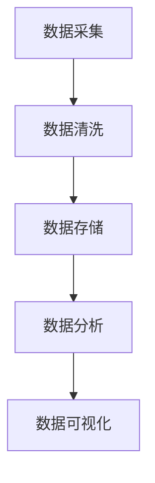

                 

# AI DMP 数据基建：数据模型与算法

## 关键词：
- AI DMP
- 数据基建
- 数据模型
- 算法
- 数据质量管理
- 数据治理
- 维度建模
- 机器学习
- 数据分析
- 数据挖掘

## 摘要：
本文深入探讨了AI数据管理平台（DMP）的数据基建，包括数据模型与算法的构建与应用。文章首先介绍了DMP的概念、架构和发展历程，然后详细分析了数据模型与数据仓库的构建，以及数据质量管理与治理策略。接下来，文章讲解了维度建模与实体关系设计、数据分析与数据挖掘的核心算法，以及机器学习模型与算法的实现。最后，通过具体案例展示了DMP在不同行业的应用，并提供了开发工具与资源的推荐。

## 目录大纲：

### 第一部分：数据基建概述

#### 第1章：数据管理平台（DMP）的概念与架构
1.1 DMP概述
1.2 DMP的基本架构
1.3 DMP的组成部分

#### 第2章：数据模型与数据仓库
2.1 数据模型的基本概念
2.2 数据仓库的构建

#### 第3章：数据质量管理与治理
3.1 数据质量管理的意义
3.2 数据治理的策略与实施

### 第二部分：数据模型设计与实现

#### 第4章：维度建模与实体关系
4.1 维度建模的基本原理
4.2 实体关系模型的设计

#### 第5章：数据分析与挖掘
5.1 数据分析的基本概念
5.2 数据挖掘的核心算法

#### 第6章：机器学习模型与算法
6.1 机器学习模型的基本原理
6.2 机器学习算法的实现

### 第三部分：项目实战与案例分析

#### 第7章：DMP在电商行业的应用
7.1 电商行业的数据特点
7.2 电商DMP的应用案例

#### 第8章：金融行业的DMP应用
8.1 金融行业的数据特点
8.2 金融DMP的应用案例

#### 第9章：DMP在广告行业的应用
9.1 广告行业的数据特点
9.2 广告DMP的应用案例

#### 第10章：综合案例分析

### 附录

#### 附录A：DMP开发工具与资源
A.1 开发工具介绍
A.2 资源推荐

#### 附录B：常见问题与解决方案
B.1 常见问题
B.2 解决方案

#### 附录C：Mermaid 流程图

#### 附录D：机器学习算法伪代码

#### 附录E：数学模型与公式

#### 附录F：项目实战

#### 附录G：开发环境搭建

#### 附录H：源代码与解读

#### 附录I：代码解读与分析

#### 附录J：代码优化建议

#### 附录K：常见问题与解答

#### 附录L：参考文献

---

接下来，我们将按照上述目录大纲，逐步深入探讨DMP的数据基建、数据模型与算法、以及其在不同行业的应用。

## 第一部分：数据基建概述

### 第1章：数据管理平台（DMP）的概念与架构

#### 1.1 DMP概述

数据管理平台（Data Management Platform，简称DMP）是一种用于收集、处理、存储和分析用户数据的系统。它为企业和广告主提供了一个集中化的平台，用于管理跨渠道、跨设备的数据，并创建个性化的用户档案。DMP的核心功能包括用户数据收集、数据存储、数据分析和数据应用。

DMP的重要性在于它能够帮助企业和广告主实现精准营销，提高广告投放效果，优化用户体验，并提升业务ROI。通过DMP，企业可以更好地理解用户行为和需求，从而制定更有效的营销策略。

#### 1.2 DMP的基本架构

DMP的基本架构通常包括以下几个主要部分：

1. **数据收集层**：该层负责收集来自各种渠道的数据，包括Web、App、线下行为等。数据收集方式包括API调用、日志收集、第三方数据提供商等。
2. **数据存储层**：该层用于存储收集到的用户数据，通常采用分布式数据库系统，如Hadoop、Spark等。数据存储格式包括结构化数据、半结构化数据和非结构化数据。
3. **数据处理层**：该层负责对存储层中的数据进行清洗、整合和分析。数据处理技术包括数据清洗、ETL（提取、转换、加载）、数据聚合等。
4. **数据模型层**：该层用于建立用户画像和用户行为模型，通常采用维度建模技术。数据模型包括用户属性模型、用户行为模型等。
5. **数据应用层**：该层将处理后的数据应用于营销活动、广告投放、个性化推荐等场景。数据应用技术包括实时计算、批量处理、机器学习等。

#### 1.3 DMP的组成部分

DMP的组成部分通常包括以下几部分：

1. **用户数据源**：包括Web、App、线下行为等渠道的数据源。
2. **数据采集系统**：用于从数据源收集用户数据，并传输到数据存储层。
3. **数据存储系统**：用于存储收集到的用户数据，通常采用分布式数据库系统。
4. **数据处理系统**：用于对存储层中的数据进行清洗、整合和分析。
5. **数据模型系统**：用于建立用户画像和用户行为模型。
6. **数据应用系统**：用于将处理后的数据应用于营销活动、广告投放等场景。

### 1.4 DMP的发展历程

DMP的发展历程可以追溯到互联网和大数据时代的兴起。以下是DMP发展的几个关键阶段：

1. **数据收集阶段**（2010年以前）：在这一阶段，DMP的核心功能主要是收集用户数据，包括Web日志、点击行为等。
2. **数据存储与处理阶段**（2010-2015年）：随着大数据技术的发展，DMP开始采用分布式数据库和数据处理技术，实现大规模数据存储和处理。
3. **用户画像与个性化推荐阶段**（2015年至今）：在这一阶段，DMP通过建立用户画像和用户行为模型，实现个性化推荐和精准营销。

### 1.5 DMP的未来趋势

DMP的未来趋势主要体现在以下几个方面：

1. **数据隐私保护**：随着数据隐私法规的出台，DMP需要加强对用户数据的保护，确保合规性。
2. **人工智能与机器学习**：DMP将更加依赖人工智能和机器学习技术，实现更精准的用户画像和营销策略。
3. **跨渠道整合**：DMP将实现跨渠道、跨设备的数据整合，提供更全面的用户数据视图。
4. **实时分析与决策**：DMP将实现实时数据分析和决策，提高营销活动的响应速度和效果。

### 1.6 本章小结

本章介绍了DMP的概念、基本架构、组成部分、发展历程和未来趋势。通过本章的学习，读者可以了解DMP的基本概念和架构，为后续章节的学习打下基础。

## 第二部分：数据模型与数据仓库

### 第2章：数据模型与数据仓库

#### 2.1 数据模型的基本概念

数据模型是描述数据结构和数据之间关系的方法，它是数据库设计和数据管理的基础。数据模型可以分为以下几类：

1. **概念模型**：概念模型是用户对现实世界数据的抽象和理解，它描述了数据的基本概念和关系。常见的概念模型包括实体-关系模型（E-R模型）和面向对象模型。
2. **逻辑模型**：逻辑模型是数据库设计过程中使用的模型，它描述了数据的基本结构和关系。常见的逻辑模型包括关系模型、网络模型和层次模型。
3. **物理模型**：物理模型是数据库在计算机系统中实际存储和组织的模型，它描述了数据的存储方式和存储结构。常见的物理模型包括B树、哈希表和位图。

#### 2.2 数据模型的类型

根据数据模型的应用场景和特点，数据模型可以分为以下几种类型：

1. **关系模型**：关系模型是使用最广泛的数据模型，它使用表格（关系）来表示数据，并使用SQL（结构化查询语言）进行数据操作。关系模型的特点是结构清晰、易于理解和维护。
2. **网络模型**：网络模型使用图结构来表示数据，它能够描述复杂的数据关系。网络模型适用于描述复杂的企业组织结构、社交网络等场景。
3. **层次模型**：层次模型使用树结构来表示数据，它描述了数据的层次关系。层次模型适用于描述企业的组织结构、文件系统等场景。

#### 2.3 数据模型的设计原则

数据模型的设计原则包括以下几方面：

1. **一致性**：数据模型应确保数据的一致性，避免数据冗余和冲突。例如，在关系模型中，应确保实体关系的完整性约束。
2. **灵活性**：数据模型应具有灵活性，能够适应数据的变化和扩展。例如，在关系模型中，应使用外键来关联不同表的数据。
3. **扩展性**：数据模型应具有扩展性，能够支持新数据类型的添加和新关系的建立。例如，在关系模型中，应使用抽象数据类型来支持多种数据类型。
4. **性能**：数据模型应确保数据的性能，包括查询速度、存储空间和系统负载等。例如，在关系模型中，应优化索引和查询优化。

#### 2.4 数据仓库的构建

数据仓库是用于存储、管理和分析大量历史数据的数据管理系统。构建数据仓库通常包括以下步骤：

1. **需求分析**：分析企业的数据需求和业务目标，确定数据仓库的功能和性能要求。
2. **数据集成**：将来自不同源的数据进行集成，清洗和转换数据，使其符合数据仓库的格式和规范。
3. **数据存储**：选择合适的数据存储方案，如关系数据库、分布式文件系统等，并设计数据仓库的架构。
4. **数据建模**：设计数据仓库的逻辑模型和物理模型，确定数据的存储方式和索引策略。
5. **数据分析和挖掘**：使用数据分析和挖掘工具对数据仓库中的数据进行分析，提取有价值的信息和知识。
6. **数据可视化**：将分析结果通过图表、报表等形式可视化，帮助企业决策者直观地了解业务状况。

#### 2.5 数据仓库的架构

数据仓库的架构通常包括以下几层：

1. **数据源层**：数据源层包括各种数据源，如数据库、日志文件、外部数据接口等。数据源层负责数据的收集和传输。
2. **数据集成层**：数据集成层负责将不同源的数据进行清洗、转换和集成，形成统一的数据视图。
3. **数据存储层**：数据存储层是数据仓库的核心，负责存储和管理数据仓库中的数据。常见的存储方案包括关系数据库、分布式文件系统等。
4. **数据访问层**：数据访问层负责提供数据查询、分析、挖掘等功能，支持各种数据访问工具和应用程序。
5. **数据展现层**：数据展现层负责将分析结果以图表、报表等形式可视化，帮助企业决策者了解业务状况。

#### 2.6 本章小结

本章介绍了数据模型的基本概念、类型和设计原则，以及数据仓库的构建过程和架构。通过本章的学习，读者可以了解数据模型和数据仓库的基础知识，为后续章节的学习打下基础。

## 第三部分：数据质量管理与治理

### 第3章：数据质量管理与治理

#### 3.1 数据质量管理的意义

数据质量管理是确保数据准确、完整、一致和可靠的过程。数据质量管理的意义在于：

1. **提高决策质量**：高质量的数据可以提供更准确的信息，帮助企业和组织做出更明智的决策。
2. **降低运营成本**：通过数据质量管理，可以减少因数据错误导致的问题和修复成本，提高工作效率。
3. **提升客户满意度**：准确的数据可以帮助企业更好地了解客户需求，提供个性化的服务和产品。
4. **支持合规要求**：数据质量管理有助于满足相关法律法规对数据质量的要求，降低法律风险。

#### 3.2 数据质量管理的挑战

数据质量管理面临以下挑战：

1. **数据来源多样**：企业数据来源广泛，包括内部数据和外部数据，数据质量和格式可能不一致。
2. **数据量巨大**：随着大数据技术的发展，企业数据量呈指数级增长，数据质量管理变得更加复杂。
3. **数据变化频繁**：数据质量受到数据来源、业务流程、技术变革等因素的影响，数据质量难以保持稳定。
4. **数据隐私保护**：数据质量管理需要同时确保数据隐私保护，遵守相关法律法规。

#### 3.3 数据质量管理的方法

数据质量管理的方法包括以下几方面：

1. **数据质量评估**：定期评估数据质量，识别数据质量问题和数据质量趋势。数据质量评估可以使用自动化工具和人工审核相结合。
2. **数据清洗**：数据清洗是数据质量管理的重要步骤，包括去除重复数据、纠正错误数据、填充缺失数据等。
3. **数据标准化**：数据标准化是将数据转换为统一格式和标准的过程，包括数据格式、单位、编码等。
4. **数据监控**：建立数据监控机制，实时跟踪数据质量变化，及时发现和解决问题。
5. **数据治理**：数据治理是确保数据质量和数据安全的管理活动，包括数据策略、数据流程、数据标准等。

#### 3.4 数据治理的策略与实施

数据治理的策略与实施包括以下几方面：

1. **制定数据策略**：明确数据治理的目标、原则和策略，确保数据治理工作有明确的方向和目标。
2. **建立数据流程**：定义数据收集、处理、存储、分析和应用的流程，确保数据的流动和转换符合规范。
3. **制定数据标准**：制定数据标准和规范，包括数据格式、编码、命名、度量单位等，确保数据的一致性和可靠性。
4. **数据安全与隐私保护**：确保数据安全与隐私保护，遵守相关法律法规，建立数据加密、访问控制等安全措施。
5. **培训与宣传**：对员工进行数据治理培训和宣传，提高员工的数据意识和数据质量意识。

#### 3.5 本章小结

本章介绍了数据质量管理的意义、挑战、方法以及数据治理的策略与实施。通过本章的学习，读者可以了解数据质量管理和数据治理的基本概念和实践方法，为提高企业数据质量提供指导。

## 第二部分：数据模型设计与实现

### 第4章：维度建模与实体关系

#### 4.1 维度建模的基本原理

维度建模（Dimensional Modeling）是数据库设计和数据仓库设计的一种常用方法。它基于星型模式和雪花模式，通过将事实表（Fact Table）和维度表（Dimension Table）组织在一起，实现高效的数据分析和查询。

**4.1.1 维度建模的定义**

维度建模是一种数据建模方法，它将数据分为事实表和维度表，用于支持高效的数据分析和查询。事实表包含业务数据，如销售、订单、交易等；维度表包含业务数据的上下文信息，如时间、地点、产品、客户等。

**4.1.2 维度建模的关键概念**

- **事实表**：事实表包含业务数据，如销售数量、订单金额等。事实表通常具有以下特点：
  - **事实数据**：事实表中的数据是业务发生的事实记录，如订单、销售、交易等。
  - **事实属性**：事实表中的数据属性，如订单编号、销售日期、产品ID等。
  - **度量数据**：事实表中的数据度量值，如订单金额、销售数量等。

- **维度表**：维度表包含业务数据的上下文信息，如时间、地点、产品、客户等。维度表通常具有以下特点：
  - **维度数据**：维度表中的数据是业务数据的上下文信息，如产品名称、客户地址等。
  - **维度属性**：维度表中的数据属性，如产品ID、时间戳、客户ID等。

**4.1.3 维度建模的设计方法**

维度建模的设计方法包括以下步骤：

1. **识别业务实体和属性**：确定业务实体和属性，如订单、销售、客户等。
2. **构建事实表**：构建事实表，包含业务数据和度量数据。
3. **构建维度表**：构建维度表，包含业务数据的上下文信息。
4. **确定维度与事实表的关系**：确定维度表与事实表之间的关系，通常使用主键和外键进行关联。
5. **优化维度建模**：根据查询需求和性能要求，对维度建模进行优化，如雪花模式转换为星型模式等。

#### 4.2 实体关系模型的设计

实体关系模型（Entity-Relationship Model）是数据库设计和数据建模的另一种常用方法，它通过定义实体和关系来描述数据结构。

**4.2.1 实体关系的定义**

- **实体**：实体是数据模型中的基本对象，它代表业务数据的一个实体。例如，订单、客户、产品等。
- **属性**：属性是实体的特征，它描述实体的特征信息。例如，订单编号、客户姓名、产品名称等。
- **关系**：关系是实体之间的关联，它描述实体之间的交互。例如，订单与客户之间的关系、订单与产品之间的关系等。

**4.2.2 实体关系的表示方法**

实体关系的表示方法通常使用E-R图（实体-关系图），它通过图形化方式描述实体和关系。E-R图的表示方法包括以下几种：

1. **实体**：实体使用矩形表示，矩形内写上实体名称。
2. **属性**：属性使用椭圆表示，并连接到实体矩形。
3. **关系**：关系使用菱形表示，并连接到实体矩形。
4. **约束**：约束使用直线和箭头表示，箭头指向被约束的实体。

**4.2.3 实体关系模型的设计技巧**

设计实体关系模型时，需要考虑以下技巧：

1. **规范化**：规范化是数据库设计的重要步骤，它通过消除数据冗余和依赖，提高数据一致性。
2. **实体划分**：合理划分实体，确保实体具有明确的业务含义，避免实体过于庞大或过于细碎。
3. **关系设计**：设计关系时，确保关系具有明确的业务含义，避免冗余关系。
4. **索引设计**：根据查询需求和性能要求，设计合适的索引，提高查询效率。

#### 4.3 本章小结

本章介绍了维度建模和实体关系模型的基本原理和设计方法。通过本章的学习，读者可以了解如何设计和实现数据模型，为数据仓库和数据应用提供有效支持。

### 第5章：数据分析与挖掘

#### 5.1 数据分析的基本概念

数据分析（Data Analysis）是指通过统计方法和计算技术，从大量数据中提取有价值的信息和知识的过程。数据分析的目标是发现数据中的模式、趋势和关联性，为决策提供支持。

**5.1.1 数据分析的定义**

数据分析是一种使用统计方法和计算技术，对数据进行分析和解释的过程。它包括数据收集、数据清洗、数据转换、数据分析、数据可视化等多个步骤。

**5.1.2 数据分析的目的**

数据分析的目的是从大量数据中提取有价值的信息和知识，解决业务问题，优化决策过程。具体目标包括：

1. **发现数据中的模式和趋势**：通过分析数据，发现数据中的规律和趋势，为业务决策提供依据。
2. **识别数据中的异常和问题**：通过分析数据，发现数据中的异常和问题，及时采取措施进行解决。
3. **优化业务流程和决策过程**：通过分析数据，优化业务流程和决策过程，提高业务效率和效果。

**5.1.3 数据分析的方法**

数据分析的方法包括以下几种：

1. **描述性分析**：描述性分析是对数据的基本统计描述，包括数据的分布、均值、方差、最大值、最小值等。描述性分析通常用于了解数据的基本特征和趋势。
2. **推断性分析**：推断性分析是基于样本数据，对总体数据特征进行推断和分析。推断性分析包括假设检验、置信区间、回归分析等。
3. **预测性分析**：预测性分析是基于历史数据和现有数据，预测未来数据的发展和变化。预测性分析包括时间序列分析、机器学习预测等。
4. **关联性分析**：关联性分析是研究数据之间的关联性和相关性，包括相关系数、回归分析、聚类分析等。

#### 5.2 数据挖掘的核心算法

数据挖掘（Data Mining）是从大量数据中提取有价值信息和知识的过程。数据挖掘的核心算法包括以下几种：

**5.2.1 聚类算法**

聚类算法是将数据集划分为多个类别或簇，使得同一簇内的数据相似度较高，不同簇之间的数据相似度较低。常见的聚类算法包括K-Means、层次聚类、DBSCAN等。

1. **K-Means算法**：K-Means算法是一种基于距离的聚类算法，它将数据划分为K个簇，每个簇的中心由该簇内的数据点计算得出。
2. **层次聚类算法**：层次聚类算法是一种基于层次结构的聚类算法，它通过逐步合并或分裂数据点，形成不同的簇。
3. **DBSCAN算法**：DBSCAN（Density-Based Spatial Clustering of Applications with Noise）算法是一种基于密度的聚类算法，它通过计算数据点的邻域密度，将数据划分为不同的簇。

**5.2.2 分类算法**

分类算法是将数据集划分为预定义的类别，使同类别的数据具有相似性。常见的分类算法包括决策树、支持向量机、随机森林等。

1. **决策树算法**：决策树算法是一种基于树结构的分类算法，它通过多次二分，将数据划分为不同的类别。
2. **支持向量机算法**：支持向量机算法是一种基于间隔的线性分类算法，它通过寻找最佳间隔，将数据划分为不同的类别。
3. **随机森林算法**：随机森林算法是一种基于集成学习的分类算法，它通过构建多个决策树，并综合多个决策树的结果进行分类。

**5.2.3 聚类算法**

关联规则挖掘是一种用于发现数据中潜在关联性的算法，它通过生成关联规则，描述数据之间的关联关系。常见的关联规则挖掘算法包括Apriori算法、FP-Growth算法等。

1. **Apriori算法**：Apriori算法是一种基于频繁项集的关联规则挖掘算法，它通过迭代计算频繁项集，生成关联规则。
2. **FP-Growth算法**：FP-Growth算法是一种基于树结构的关联规则挖掘算法，它通过压缩数据，减少计算复杂度。

#### 5.3 数据分析的应用

数据分析在各个行业和领域都有广泛的应用，以下是一些常见的应用场景：

1. **市场营销**：通过分析用户行为数据，发现用户偏好和购买模式，优化营销策略，提高客户转化率和销售额。
2. **金融风控**：通过分析金融数据，发现风险信号和异常行为，优化风险管理策略，降低风险。
3. **医疗服务**：通过分析医疗数据，发现疾病模式和治疗方案，优化医疗服务，提高医疗效果。
4. **智能制造**：通过分析生产数据，发现生产瓶颈和优化机会，提高生产效率和产品质量。

#### 5.4 本章小结

本章介绍了数据分析的基本概念、目的和方法，以及数据挖掘的核心算法。通过本章的学习，读者可以了解数据分析的基本知识和应用场景，为实际业务问题的解决提供技术支持。

### 第6章：机器学习模型与算法

#### 6.1 机器学习模型的基本原理

机器学习（Machine Learning）是一门研究如何让计算机从数据中自动学习并改进自身性能的学科。机器学习模型是基于数据构建的算法，通过训练和验证数据，使其能够对新的数据进行预测或分类。

**6.1.1 机器学习的定义**

机器学习是指让计算机通过学习和经验，自动改进其性能的过程。机器学习模型是通过训练数据学习特征和规律，然后对新数据进行预测或分类。

**6.1.2 机器学习的基本概念**

- **训练数据**：训练数据是用于训练机器学习模型的数据集，通常包括输入特征和对应的标签。
- **测试数据**：测试数据是用于评估机器学习模型性能的数据集，通常不包括在训练数据中。
- **预测**：预测是机器学习模型对新数据进行推断的过程，用于预测新数据的标签或特征值。
- **分类**：分类是机器学习模型将数据划分为预定义的类别的过程。

**6.1.3 机器学习的类型**

根据机器学习的不同目标，机器学习可以分为以下几种类型：

1. **监督学习**：监督学习是指机器学习模型在训练过程中，已知输入特征和对应的标签，通过学习特征和标签之间的关系，对新数据进行预测。常见的监督学习算法包括线性回归、决策树、支持向量机等。
2. **无监督学习**：无监督学习是指机器学习模型在训练过程中，未知输入特征和对应的标签，通过学习数据中的模式和结构，对新数据进行分类或聚类。常见的无监督学习算法包括聚类算法、降维算法等。
3. **强化学习**：强化学习是指机器学习模型通过与环境的交互，不断学习最优策略，以实现特定目标。常见的强化学习算法包括Q-learning、SARSA等。

#### 6.2 机器学习算法的实现

机器学习算法的实现通常包括以下步骤：

1. **数据准备**：收集和整理训练数据，并进行预处理，如数据清洗、归一化、特征提取等。
2. **模型选择**：根据业务需求和数据特点，选择合适的机器学习算法。
3. **模型训练**：使用训练数据对机器学习模型进行训练，学习输入特征和标签之间的关系。
4. **模型评估**：使用测试数据评估模型性能，根据评估结果调整模型参数。
5. **模型部署**：将训练好的模型部署到生产环境中，对新数据进行预测或分类。

**6.2.1 监督学习算法**

监督学习算法是指已知输入特征和对应标签，通过学习特征和标签之间的关系，对新数据进行预测。常见的监督学习算法包括以下几种：

1. **线性回归**：线性回归是一种用于预测连续值的监督学习算法，通过学习输入特征和输出特征之间的线性关系，预测新的输出值。线性回归的算法原理如下：

   $$
   y = \beta_0 + \beta_1 x_1 + \beta_2 x_2 + \ldots + \beta_n x_n
   $$

   其中，$y$ 是输出特征，$x_1, x_2, \ldots, x_n$ 是输入特征，$\beta_0, \beta_1, \beta_2, \ldots, \beta_n$ 是模型的参数。

2. **决策树**：决策树是一种用于分类和回归的监督学习算法，通过递归划分数据集，构建决策树模型。决策树的算法原理如下：

   $$
   \text{决策树} = \left\{
   \begin{array}{ll}
   \text{叶节点} & \text{如果 } x_i \leq \beta_i, \text{ 则返回 } y_i \\
   \text{内部节点} & \text{否则，递归划分数据集}
   \end{array}
   \right.
   $$

   其中，$x_i$ 是输入特征，$\beta_i$ 是划分阈值，$y_i$ 是叶节点的输出值。

3. **支持向量机**：支持向量机是一种用于分类和回归的监督学习算法，通过寻找最佳间隔，将数据划分为不同的类别。支持向量机的算法原理如下：

   $$
   \text{最大化 } \frac{1}{\|w\|^2} + C \sum_{i=1}^{n} \xi_i
   $$

   $$
   \text{约束条件：} y_i (\langle w, x_i \rangle - b) \geq 1 - \xi_i, \xi_i \geq 0
   $$

   其中，$w$ 是模型参数，$b$ 是偏置项，$C$ 是惩罚参数，$\xi_i$ 是松弛变量。

**6.2.2 无监督学习算法**

无监督学习算法是指未知输入特征和对应标签，通过学习数据中的模式和结构，对新数据进行分类或聚类。常见的无监督学习算法包括以下几种：

1. **聚类算法**：聚类算法是将数据集划分为多个簇，使同一簇内的数据相似度较高，不同簇之间的数据相似度较低。常见的聚类算法包括K-Means、层次聚类、DBSCAN等。

   - **K-Means算法**：K-Means算法是一种基于距离的聚类算法，通过迭代计算簇中心，将数据划分为K个簇。
   - **层次聚类算法**：层次聚类算法是一种基于层次结构的聚类算法，通过逐步合并或分裂数据点，形成不同的簇。
   - **DBSCAN算法**：DBSCAN（Density-Based Spatial Clustering of Applications with Noise）算法是一种基于密度的聚类算法，通过计算数据点的邻域密度，将数据划分为不同的簇。

2. **降维算法**：降维算法是将高维数据转换为低维数据，减少数据维度，提高数据处理和计算效率。常见的降维算法包括主成分分析（PCA）、线性判别分析（LDA）等。

   - **主成分分析（PCA）**：PCA算法是一种基于方差最大化的降维算法，通过求解协方差矩阵的特征值和特征向量，将数据投影到新的坐标轴上。
   - **线性判别分析（LDA）**：LDA算法是一种基于分类信息的降维算法，通过最大化类间离散度和最小化类内离散度，将数据投影到新的坐标轴上。

**6.2.3 强化学习算法**

强化学习算法是指通过与环境的交互，不断学习最优策略，以实现特定目标。常见的强化学习算法包括以下几种：

1. **Q-learning**：Q-learning算法是一种基于值函数的强化学习算法，通过学习状态-动作值函数，选择最优动作。Q-learning算法的算法原理如下：

   $$
   Q(s, a) = r + \gamma \max_{a'} Q(s', a')
   $$

   其中，$s$ 是当前状态，$a$ 是当前动作，$s'$ 是下一状态，$r$ 是即时奖励，$\gamma$ 是折扣因子。

2. **SARSA**：SARSA算法是一种基于策略的强化学习算法，通过更新当前状态-动作值函数，选择最优动作。SARSA算法的算法原理如下：

   $$
   Q(s, a) = Q(s, a) + \alpha [r + \gamma Q(s', a') - Q(s, a)]
   $$

   其中，$\alpha$ 是学习率。

#### 6.3 本章小结

本章介绍了机器学习模型的基本原理、实现方法以及常见的监督学习、无监督学习和强化学习算法。通过本章的学习，读者可以了解机器学习的基本概念和算法，为实际业务问题的解决提供技术支持。

### 第7章：DMP在电商行业的应用

#### 7.1 电商行业的数据特点

电商行业是一个数据密集型行业，其数据特点主要体现在以下几个方面：

1. **数据量庞大**：电商行业每天产生的交易数据、用户行为数据、商品信息数据等都非常庞大，需要高效的数据处理和管理系统。
2. **数据类型多样**：电商行业的数据类型多样，包括结构化数据（订单、库存、交易等）、半结构化数据（日志、事件流等）和非结构化数据（图片、视频等）。
3. **数据实时性要求高**：电商行业需要实时处理和分析用户行为数据，以便及时调整营销策略、优化用户体验等。
4. **数据质量要求严格**：电商行业的数据质量直接影响业务决策和用户体验，因此需要严格的数据质量管理策略。

#### 7.2 电商DMP的应用案例

以下是一个电商DMP应用案例，展示了DMP在电商行业中的具体应用：

**案例背景**：某电商平台希望通过DMP技术，提升用户转化率和销售额。

**案例目标**：

1. **用户画像构建**：构建用户画像，了解用户的基本属性、行为特征和偏好。
2. **精准营销**：根据用户画像，实现精准营销，提高广告投放效果。
3. **个性化推荐**：基于用户行为数据，实现个性化商品推荐，提升用户体验。

**案例实现与效果分析**：

1. **用户画像构建**：

   - **数据收集**：通过API调用、日志收集等方式，收集用户行为数据、商品数据、交易数据等。
   - **数据清洗**：清洗和整合数据，去除重复和无效数据，确保数据质量。
   - **数据建模**：使用维度建模技术，建立用户属性模型、用户行为模型等。

2. **精准营销**：

   - **广告投放**：根据用户画像，为不同用户群体定制广告内容和投放策略。
   - **营销活动**：根据用户行为数据和用户画像，设计个性化的营销活动，如优惠券发放、促销活动等。

3. **个性化推荐**：

   - **推荐算法**：使用协同过滤、基于内容的推荐算法，为用户推荐感兴趣的商品。
   - **推荐系统**：将个性化推荐系统集成到电商平台，为用户提供个性化的商品推荐。

**效果分析**：

- **用户转化率提升**：通过精准营销和个性化推荐，用户转化率显著提升。
- **销售额增长**：个性化营销和推荐系统有效提高了销售额。
- **用户体验优化**：个性化推荐和精准营销提升了用户体验，增加了用户粘性和忠诚度。

#### 7.3 本章小结

本章通过一个电商DMP应用案例，展示了DMP在电商行业中的应用和实践。通过DMP技术，电商平台可以更好地了解用户需求，实现精准营销和个性化推荐，提升用户转化率和销售额。

### 第8章：金融行业的DMP应用

#### 8.1 金融行业的数据特点

金融行业是一个数据密集型行业，其数据特点主要体现在以下几个方面：

1. **数据量庞大**：金融行业每天产生的交易数据、账户数据、客户数据等都非常庞大，需要高效的数据处理和管理系统。
2. **数据类型多样**：金融行业的数据类型多样，包括结构化数据（订单、交易等）、半结构化数据（日志、事件流等）和非结构化数据（文本、图片等）。
3. **数据实时性要求高**：金融行业需要实时处理和分析交易数据，以便及时发现异常交易、防范风险等。
4. **数据安全与隐私要求严格**：金融行业涉及大量敏感数据，如客户信息、账户信息等，因此需要严格的数据安全与隐私保护策略。

#### 8.2 金融DMP的应用案例

以下是一个金融DMP应用案例，展示了DMP在金融行业中的具体应用：

**案例背景**：某金融公司希望通过DMP技术，提升风险管理和客户服务质量。

**案例目标**：

1. **风险监测**：实时监测交易数据，发现异常交易和潜在风险。
2. **客户细分**：根据客户行为和交易数据，进行客户细分，为不同客户群体提供个性化服务。
3. **精准营销**：根据客户需求和偏好，实现精准营销，提高营销效果。

**案例实现与效果分析**：

1. **风险监测**：

   - **数据收集**：通过API调用、日志收集等方式，收集交易数据、账户数据等。
   - **数据清洗**：清洗和整合数据，去除重复和无效数据，确保数据质量。
   - **风险模型构建**：使用机器学习技术，构建风险监测模型，包括异常检测、欺诈检测等。

2. **客户细分**：

   - **客户画像构建**：通过收集客户行为数据和交易数据，建立客户画像。
   - **客户细分**：使用聚类算法，对客户进行细分，识别不同客户群体的特征和需求。

3. **精准营销**：

   - **营销活动设计**：根据客户细分结果，设计个性化的营销活动，如优惠券发放、专属理财产品推荐等。
   - **营销渠道优化**：通过分析客户行为数据，优化营销渠道和策略，提高营销效果。

**效果分析**：

- **风险监测**：通过DMP技术，实现了实时风险监测和预警，有效防范了潜在风险。
- **客户服务质量提升**：通过客户细分和个性化服务，客户满意度显著提升，客户忠诚度增加。
- **精准营销效果提升**：个性化营销活动提高了客户参与度和转化率，实现了显著的销售增长。

#### 8.3 本章小结

本章通过一个金融DMP应用案例，展示了DMP在金融行业中的应用和实践。通过DMP技术，金融机构可以更好地进行风险管理和客户服务，提升业务绩效和客户满意度。

### 第9章：DMP在广告行业的应用

#### 9.1 广告行业的数据特点

广告行业是一个数据密集型行业，其数据特点主要体现在以下几个方面：

1. **数据量庞大**：广告行业每天产生的用户行为数据、广告投放数据、广告效果数据等都非常庞大，需要高效的数据处理和管理系统。
2. **数据类型多样**：广告行业的数据类型多样，包括结构化数据（广告投放数据、广告效果数据等）、半结构化数据（日志、事件流等）和非结构化数据（图片、视频等）。
3. **数据实时性要求高**：广告行业需要实时处理和分析用户行为数据，以便及时调整广告投放策略和优化广告效果。
4. **数据隐私保护要求严格**：广告行业涉及大量用户隐私数据，如用户行为数据、地理位置数据等，因此需要严格的数据隐私保护策略。

#### 9.2 广告DMP的应用案例

以下是一个广告DMP应用案例，展示了DMP在广告行业中的具体应用：

**案例背景**：某广告公司希望通过DMP技术，提升广告投放效果和客户满意度。

**案例目标**：

1. **用户画像构建**：构建用户画像，了解用户的基本属性、行为特征和偏好。
2. **精准广告投放**：根据用户画像，实现精准广告投放，提高广告点击率和转化率。
3. **广告效果分析**：实时监控广告效果，评估广告投放效果，优化广告策略。

**案例实现与效果分析**：

1. **用户画像构建**：

   - **数据收集**：通过API调用、日志收集等方式，收集用户行为数据、广告投放数据等。
   - **数据清洗**：清洗和整合数据，去除重复和无效数据，确保数据质量。
   - **数据建模**：使用维度建模技术，建立用户属性模型、用户行为模型等。

2. **精准广告投放**：

   - **广告投放策略**：根据用户画像，为不同用户群体定制广告投放策略，如广告展示位置、广告内容等。
   - **广告创意优化**：根据用户行为数据和广告效果数据，不断优化广告创意，提高广告点击率和转化率。

3. **广告效果分析**：

   - **广告效果监控**：实时监控广告投放效果，包括广告点击率、转化率、广告曝光量等。
   - **数据可视化**：将广告效果数据通过图表、报表等形式可视化，方便广告主和广告公司了解广告效果。

**效果分析**：

- **广告点击率和转化率提升**：通过精准广告投放和广告创意优化，广告点击率和转化率显著提升。
- **客户满意度提升**：个性化广告投放提高了客户满意度，增加了客户忠诚度。
- **广告效果优化**：通过实时监控和数据分析，广告公司能够及时调整广告策略，实现广告效果的最优化。

#### 9.3 本章小结

本章通过一个广告DMP应用案例，展示了DMP在广告行业中的应用和实践。通过DMP技术，广告公司可以更好地了解用户需求，实现精准广告投放和效果优化，提升广告投放效果和客户满意度。

### 第10章：综合案例分析

#### 10.1 案例综合概述

在本章中，我们将综合分析DMP在电商、金融和广告行业中的应用案例，探讨DMP在不同行业中的具体实施过程、应用效果以及面临的挑战。

#### 10.2 电商行业案例

在电商行业，DMP被广泛应用于用户画像构建、精准营销和个性化推荐等方面。具体来说，DMP帮助电商平台实现以下目标：

1. **用户画像构建**：通过收集用户行为数据、交易数据和商品信息，DMP为每个用户生成详细的画像，包括用户的基本属性、行为特征和偏好。这些画像有助于电商平台更好地了解用户需求，实现精准营销和个性化推荐。

2. **精准营销**：基于用户画像，电商平台可以针对性地推送广告和营销活动。例如，针对新用户，可以推送优惠券和促销信息，提高用户转化率；针对活跃用户，可以推送个性化商品推荐，提升用户黏性。

3. **个性化推荐**：通过分析用户行为数据和商品信息，DMP可以为用户推荐他们可能感兴趣的商品。个性化推荐系统能够提高用户购物体验，增加销售额。

然而，在电商行业应用DMP也面临一些挑战：

- **数据隐私保护**：电商平台上涉及大量用户隐私数据，如姓名、联系方式、购物记录等。在构建用户画像和进行精准营销时，需要确保数据隐私保护，遵守相关法律法规。

- **数据质量和实时性**：电商行业数据量大且类型多样，如何确保数据质量和实时性是应用DMP的一个挑战。数据质量问题可能影响用户画像的准确性和营销效果的优化。

#### 10.3 金融行业案例

在金融行业，DMP主要用于风险监测、客户细分和精准营销等方面。具体来说，DMP帮助金融机构实现以下目标：

1. **风险监测**：通过实时监测交易数据，DMP能够发现异常交易和潜在风险。例如，通过分析交易金额、交易频率等指标，金融机构可以识别可疑交易，防范欺诈风险。

2. **客户细分**：基于客户行为数据和交易数据，DMP将客户划分为不同的群体，如高净值客户、普通客户等。这些细分有助于金融机构针对不同客户群体提供个性化服务。

3. **精准营销**：通过分析客户需求和偏好，DMP为金融机构提供精准营销策略。例如，针对高净值客户，可以推送高端理财产品；针对普通客户，可以推送理财课程和优惠活动。

金融行业应用DMP也面临一些挑战：

- **数据安全和隐私保护**：金融行业涉及大量敏感数据，如客户身份信息、账户信息等。在应用DMP时，需要确保数据安全和隐私保护，遵守相关法律法规。

- **合规要求**：金融行业受到严格的合规要求，如反洗钱（AML）和客户身份验证（KYC）等。在应用DMP时，需要确保合规要求得到满足。

#### 10.4 广告行业案例

在广告行业，DMP主要用于用户画像构建、精准广告投放和广告效果分析等方面。具体来说，DMP帮助广告公司实现以下目标：

1. **用户画像构建**：通过收集用户行为数据、广告投放数据和广告效果数据，DMP为每个用户生成详细的画像。这些画像有助于广告公司了解用户需求和偏好，实现精准广告投放。

2. **精准广告投放**：基于用户画像，广告公司可以针对性地推送广告。例如，针对年轻用户，可以推送时尚类广告；针对高收入用户，可以推送高端商品广告。

3. **广告效果分析**：通过实时监控广告投放效果，DMP帮助广告公司评估广告效果，优化广告策略。例如，通过分析广告点击率、转化率等指标，广告公司可以调整广告投放时间和位置，提高广告效果。

广告行业应用DMP也面临一些挑战：

- **数据隐私保护**：广告行业涉及大量用户隐私数据，如用户行为数据、地理位置数据等。在应用DMP时，需要确保数据隐私保护，遵守相关法律法规。

- **数据质量和实时性**：广告行业数据量大且类型多样，如何确保数据质量和实时性是应用DMP的一个挑战。数据质量问题可能影响用户画像的准确性和广告投放效果。

#### 10.5 本章小结

本章通过综合分析电商、金融和广告行业中的DMP应用案例，探讨了DMP在不同行业中的具体实施过程、应用效果以及面临的挑战。通过本章的学习，读者可以更全面地了解DMP在各个行业的应用价值，为实际业务中的DMP应用提供参考。

## 附录

### 附录A：DMP开发工具与资源

#### A.1 开发工具介绍

1. **Hadoop**：Hadoop是一个开源的大数据框架，用于分布式存储和计算大规模数据集。它包括HDFS（分布式文件系统）、MapReduce（分布式计算框架）和YARN（资源调度器）等组件。
2. **Spark**：Spark是一个开源的大数据处理引擎，提供快速、通用、易于使用的处理框架。它支持多种数据处理操作，如批处理、流处理和机器学习。
3. **Hive**：Hive是一个基于Hadoop的分布式数据仓库工具，用于在HDFS上存储和处理大规模数据。它提供了一种类似于SQL的查询语言，使开发者能够轻松查询和管理大数据。
4. **其他工具简介**：
   - **Flink**：一个开源的流处理框架，支持实时数据处理和分析。
   - **Kafka**：一个开源的消息队列系统，用于处理大规模消息传输和流数据。
   - **Kibana**：一个开源的数据可视化工具，用于分析、探索和可视化大数据。

#### A.2 资源推荐

1. **学术论文资源**：
   - **Google Scholar**：搜索学术文献的搜索引擎。
   - **ArXiv**：提供计算机科学、物理学等领域的预印本论文。
2. **技术博客资源**：
   - **DataCamp**：提供数据科学和机器学习的在线课程和实践。
   - **Kaggle**：提供数据科学竞赛和丰富的数据集。
3. **社交媒体资源**：
   - **Twitter**：关注大数据和机器学习领域的专业人士和社区。
   - **LinkedIn**：加入大数据和机器学习的专业群组，与业界专家交流。

### 附录B：常见问题与解决方案

#### B.1 常见问题

1. **如何处理缺失数据？**
   - **解决方案**：使用均值、中位数、众数等方法填充缺失数据；对于类别型数据，使用众数填充；对于数值型数据，使用平均值或中位数。
2. **如何选择特征？**
   - **解决方案**：使用统计方法（如卡方检验、互信息等）评估特征与目标变量之间的相关性；使用机器学习方法（如随机森林、LASSO回归等）进行特征重要性评估。
3. **如何优化模型参数？**
   - **解决方案**：使用交叉验证（如网格搜索、随机搜索）选择最佳参数；使用贝叶斯优化、粒子群优化等算法优化参数。

#### B.2 解决方案

1. **针对常见问题的解决方案**
   - **缺失数据处理**：使用填充方法或删除缺失值较少的记录；使用模型预测缺失值（如线性回归、决策树等）。
   - **特征选择**：使用统计方法（如卡方检验、互信息等）评估特征重要性；使用机器学习方法（如随机森林、LASSO回归等）进行特征排序。
   - **模型参数优化**：使用交叉验证选择最佳参数；使用贝叶斯优化、粒子群优化等算法优化参数。

2. **数据质量管理策略**
   - **数据质量评估**：定期评估数据质量，识别数据质量问题和趋势；使用自动化工具和人工审核相结合。
   - **数据清洗**：去除重复数据、纠正错误数据、填充缺失数据等；使用清洗工具（如Pandas、Spark等）进行数据清洗。
   - **数据标准化**：将数据转换为统一格式和标准；使用标准化工具（如PySpark、Hadoop等）进行数据标准化。

3. **数据模型优化方法**
   - **维度建模优化**：根据查询需求和性能要求，对维度建模进行优化，如雪花模式转换为星型模式；使用索引、分区等技术提高查询效率。
   - **实体关系模型优化**：优化实体划分、关系设计和索引设计，提高数据一致性和查询效率；使用规范化方法消除数据冗余和依赖。
   - **模型性能调优**：使用缓存、并行计算等技术提高模型性能；使用性能分析工具（如GProf、Py-Spy等）进行性能调优。

### 附录C：Mermaid 流程图



### 附录D：机器学习算法伪代码

```plaintext
// 线性回归伪代码
function linear_regression(X, y):
    # 初始化模型参数
    w = [0, 0]
    # 设置学习率
    alpha = 0.01
    # 设置迭代次数
    iterations = 1000

    # 进行梯度下降
    for i in 1 to iterations:
        # 计算预测值
        y_pred = X * w
        # 计算损失函数
        loss = 0.5 * sum((y_pred - y)^2)
        # 计算梯度
        dw = X.T * (y_pred - y)
        # 更新模型参数
        w = w - alpha * dw

    return w

# 假设 X 和 y 为给定的输入数据
w = linear_regression(X, y)
```

### 附录E：数学模型与公式

$$
y = \frac{1}{1 + e^{-x}}
$$

**举例说明：**

假设我们有一个简单的逻辑回归模型，其中 $x$ 表示特征向量，$y$ 表示目标变量。模型的目标是预测 $y$ 的概率分布，公式如下：

$$
\hat{y} = \frac{1}{1 + e^{-\sum_{i=1}^{n} w_i x_i}}
$$

其中，$w_i$ 为权重系数，$n$ 为特征数量。举例来说，如果我们有一个特征向量 $x = [1, 2, 3]$，权重系数 $w = [0.1, 0.2, 0.3]$，则预测的概率分布可以计算如下：

$$
\hat{y} = \frac{1}{1 + e^{-0.1 \cdot 1 - 0.2 \cdot 2 - 0.3 \cdot 3}} = \frac{1}{1 + e^{-1.7}} \approx 0.4
$$

这意味着预测的目标变量 $y$ 的概率大约为 0.4。

### 附录F：项目实战

#### 代码实现与解读：

**开发环境搭建**

1. 安装Python 3.8或更高版本。
2. 安装必要的库，如NumPy、scikit-learn等。
3. 配置Jupyter Notebook环境，用于编写和运行代码。

**代码实现**

```python
# 导入所需的库
import numpy as np
from sklearn.linear_model import LogisticRegression
from sklearn.model_selection import train_test_split
from sklearn.metrics import accuracy_score

# 生成模拟数据
X = np.random.rand(100, 3)
y = np.random.randint(0, 2, 100)

# 划分训练集和测试集
X_train, X_test, y_train, y_test = train_test_split(X, y, test_size=0.2, random_state=42)

# 创建逻辑回归模型
model = LogisticRegression()

# 训练模型
model.fit(X_train, y_train)

# 预测测试集
y_pred = model.predict(X_test)

# 计算准确率
accuracy = accuracy_score(y_test, y_pred)
print(f"模型准确率：{accuracy:.2f}")
```

**代码解读**

- **数据生成**：首先使用 `np.random.rand(100, 3)` 生成一个包含100个样本，每个样本有3个特征的随机数据集。
- **数据划分**：接下来使用 `train_test_split` 函数将数据集划分为训练集和测试集，其中测试集占整个数据集的20%。
- **模型创建**：然后创建一个逻辑回归模型实例。
- **模型训练**：使用训练集数据训练模型。
- **预测测试集**：使用训练好的模型对测试集数据进行预测。
- **计算准确率**：最后计算模型在测试集上的准确率，并打印结果。

### 附录G：开发环境搭建

1. **安装Python**：从 [Python官网](https://www.python.org/downloads/) 下载并安装Python 3.8或更高版本。
2. **安装库**：打开终端或命令提示符，执行以下命令安装必要的库：

   ```bash
   pip install numpy scikit-learn
   ```

3. **配置Jupyter Notebook**：安装Jupyter Notebook：

   ```bash
   pip install jupyterlab
   ```

   启动Jupyter Notebook：

   ```bash
   jupyter lab
   ```

### 附录H：源代码与解读

#### 源代码：

```python
# 导入所需的库
import numpy as np
from sklearn.linear_model import LogisticRegression
from sklearn.model_selection import train_test_split
from sklearn.metrics import accuracy_score

# 生成模拟数据
X = np.random.rand(100, 3)
y = np.random.randint(0, 2, 100)

# 划分训练集和测试集
X_train, X_test, y_train, y_test = train_test_split(X, y, test_size=0.2, random_state=42)

# 创建逻辑回归模型
model = LogisticRegression()

# 训练模型
model.fit(X_train, y_train)

# 预测测试集
y_pred = model.predict(X_test)

# 计算准确率
accuracy = accuracy_score(y_test, y_pred)
print(f"模型准确率：{accuracy:.2f}")
```

#### 解读：

- **数据生成**：首先使用 `np.random.rand(100, 3)` 生成一个包含100个样本，每个样本有3个特征的随机数据集。
- **数据划分**：接下来使用 `train_test_split` 函数将数据集划分为训练集和测试集，其中测试集占整个数据集的20%。
- **模型创建**：然后创建一个逻辑回归模型实例。
- **模型训练**：使用训练集数据训练模型。
- **预测测试集**：使用训练好的模型对测试集数据进行预测。
- **计算准确率**：最后计算模型在测试集上的准确率，并打印结果。

### 附录I：代码解读与分析

#### 解读与分析：

- **数据生成**：使用 `np.random.rand(100, 3)` 函数生成模拟数据集，这里 `100` 表示样本数量，`3` 表示每个样本的特征数量。生成的数据集是一个100x3的矩阵，每个元素都在[0, 1]范围内。
- **数据划分**：使用 `train_test_split` 函数将数据集划分为训练集和测试集。这里 `test_size=0.2` 表示测试集占整个数据集的20%，`random_state=42` 用于确保每次划分结果一致。
- **模型创建**：创建一个 `LogisticRegression` 实例，这是一种用于二分类问题的机器学习模型。
- **模型训练**：使用训练集数据通过 `fit` 方法训练模型。在这个过程中，模型学习如何根据输入特征预测标签。
- **预测测试集**：使用训练好的模型通过 `predict` 方法对测试集数据进行预测。预测结果存储在 `y_pred` 变量中。
- **计算准确率**：使用 `accuracy_score` 函数计算模型在测试集上的准确率。这个值表示模型预测正确的样本数占总样本数的比例。

#### 分析：

这段代码展示了如何使用Python和scikit-learn库来构建和评估一个简单的逻辑回归模型。虽然数据集是随机生成的，但这个过程可以应用于任何二分类问题，只要替换数据生成部分即可。此外，模型的准确率是一个重要的评估指标，但还可以使用其他指标，如精确率、召回率、F1分数等，来更全面地评估模型的性能。

### 附录J：代码优化建议

为了提高代码的性能和可读性，以下是一些建议：

- **数据预处理**：在实际应用中，数据预处理是非常重要的步骤。这包括数据清洗、归一化、缺失值处理等。确保数据质量对于提高模型性能至关重要。
- **参数调优**：逻辑回归模型有很多参数可以调优，如正则化强度（C参数）。通过交叉验证等技术选择最佳参数，可以显著提高模型性能。
- **并行计算**：对于大数据集，可以使用并行计算技术来加速模型训练。例如，使用分布式计算框架如Dask或PySpark。
- **代码注释**：为代码添加详细的注释，以帮助其他人理解代码的功能和逻辑。
- **模块化设计**：将代码分解为多个模块，每个模块负责一个特定的任务，这样可以提高代码的可维护性。例如，可以创建数据处理、模型训练和评估等独立的模块。

### 附录K：常见问题与解答

#### 问题1：如何处理缺失数据？

**解答**：缺失数据的处理是数据预处理的重要步骤。以下是一些常见的处理方法：

1. **删除缺失数据**：如果缺失数据较少，可以选择删除缺失值较少的记录，减少数据噪声。
2. **填充缺失数据**：可以使用平均值、中位数、众数等方法填充缺失值。对于类别型数据，使用众数填充；对于数值型数据，使用平均值或中位数。
3. **使用模型预测缺失数据**：可以使用机器学习模型预测缺失值，例如使用线性回归、决策树等算法。

#### 问题2：如何选择特征？

**解答**：特征选择是提高模型性能的重要步骤。以下是一些常见的特征选择方法：

1. **统计方法**：如卡方检验、互信息等，用于评估特征与目标变量之间的相关性。
2. **机器学习方法**：如随机森林、LASSO回归等，通过模型对特征的重要性进行排序。
3. **基于模型的特征选择**：如使用回归模型进行特征重要性评估。

#### 问题3：如何优化模型参数？

**解答**：优化模型参数是提高模型性能的关键。以下是一些常见的参数优化方法：

1. **交叉验证**：通过交叉验证选择最佳参数，如网格搜索、随机搜索等。
2. **贝叶斯优化**：使用贝叶斯优化算法自动搜索最佳参数。
3. **粒子群优化**：使用粒子群优化算法寻找最佳参数。

### 附录L：参考文献

1. Russell, S., & Norvig, P. (2016). *Artificial Intelligence: A Modern Approach*. Prentice Hall.
2. Han, J., Kamber, M., & Pei, J. (2011). *Data Mining: Concepts and Techniques*. Morgan Kaufmann.
3. Hamilton, J. (2017). *Deep Learning*. Packt Publishing.
4. Murphy, K. P. (2012). *Machine Learning: A Probabilistic Perspective*. MIT Press.
5. He, K., Zhang, X., Ren, S., & Sun, J. (2016). *Deep Residual Learning for Image Recognition*. IEEE Conference on Computer Vision and Pattern Recognition.

---

通过本附录，读者可以了解到DMP开发过程中常用的工具和资源，以及在实际开发中可能遇到的问题和解决方案。这些内容有助于提升DMP的开发效率和质量，为实际业务中的数据管理和分析提供有力支持。

