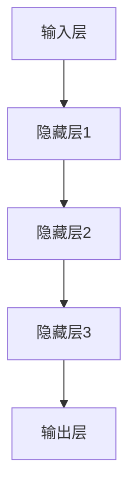
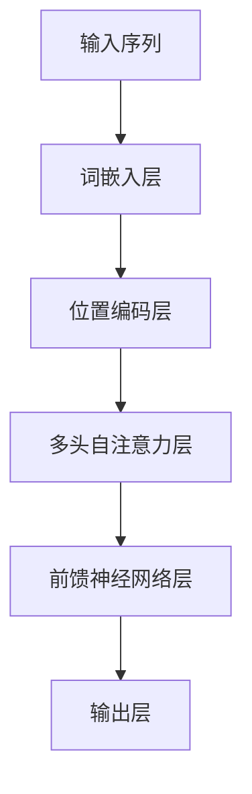

                 

## 《AI 大模型创业：如何利用国际优势？》

### 关键词：

- AI 大模型
- 创业
- 国际优势
- 技术分析
- 实战指南

### 摘要：

本文旨在探讨 AI 大模型在创业领域的应用及其国际优势。通过详细解析 AI 大模型的核心概念、技术基础和主流模型，结合实际创业案例，本文将分析 AI 大模型在创业中的应用场景、机遇与挑战，并给出利用国际优势推动 AI 大模型创业的实战指南。同时，本文还将讨论 AI 大模型创业的风险与合规问题，以及未来发展趋势。通过本文的深入探讨，读者将获得关于 AI 大模型创业的全面理解和实用指导。

## 第一部分：AI 大模型概述

### 1.1 AI 大模型的核心概念与架构

#### 1.1.1 AI 大模型的概念解析

AI 大模型是指具有大规模参数和复杂结构的深度学习模型。这些模型能够处理海量数据，并在各种复杂任务中表现出色。AI 大模型的核心特征包括：

- **大规模参数**：AI 大模型的参数数量通常在百万到亿级别，远超传统小模型。
- **深度结构**：AI 大模型通常采用多层的神经网络结构，以实现对数据的深层表征。
- **自适应能力**：AI 大模型能够通过训练自动调整参数，以适应不同的任务和数据。

AI 大模型与传统 AI 模型的主要区别在于：

- **数据需求**：AI 大模型需要更多的数据来训练，以充分利用其参数和深度结构。
- **计算资源**：AI 大模型对计算资源的需求更高，需要更强大的计算能力和更高效的算法。
- **表现能力**：AI 大模型在处理复杂任务时，通常具有更高的准确性和鲁棒性。

#### 1.1.2 AI 大模型的基本架构

AI 大模型的基本架构通常包括以下几个关键组件：

- **输入层**：接收外部输入数据，如文本、图像、音频等。
- **隐藏层**：包含多层神经元，用于对输入数据进行特征提取和变换。
- **输出层**：生成模型预测结果，如分类标签、连续值等。

一个典型的 AI 大模型架构可能如下所示：



#### 1.1.3 AI 大模型与传统 AI 的对比

AI 大模型与传统 AI 模型在以下几个方面有显著差异：

| 特征 | AI 大模型 | 传统 AI 模型 |
| --- | --- | --- |
| 参数规模 | 大规模参数 | 小规模参数 |
| 结构深度 | 多层神经网络 | 单层或少量层 |
| 训练数据 | 海量数据 | 样本数据 |
| 计算资源 | 强大计算能力 | 有限计算资源 |
| 表现能力 | 高准确性、鲁棒性 | 有限准确性和鲁棒性 |

### 1.2 AI 大模型的技术基础

#### 1.2.1 神经网络与深度学习

##### 1.2.1.1 神经网络的基本结构

神经网络是 AI 大模型的核心组成部分，其基本结构包括：

- **输入层**：接收外部输入数据，如文本、图像、音频等。
- **隐藏层**：包含多层神经元，用于对输入数据进行特征提取和变换。
- **输出层**：生成模型预测结果，如分类标签、连续值等。

一个典型的神经网络结构可能如下所示：


##### 1.2.1.2 常见的深度学习架构

深度学习架构多种多样，以下列举几种常见的架构：

- **卷积神经网络（CNN）**：适用于图像和视频处理任务，具有局部感知和特征提取能力。
- **循环神经网络（RNN）**：适用于序列数据处理任务，具有记忆和时序建模能力。
- **长短时记忆网络（LSTM）**：是 RNN 的变种，解决了长期依赖问题。
- **变换器架构（Transformer）**：在自然语言处理领域表现出色，采用自注意力机制。

##### 1.2.1.3 深度学习优化算法

深度学习优化算法用于调整模型参数，以实现模型优化。以下是一些常见的深度学习优化算法：

- **随机梯度下降（SGD）**：是最早的优化算法，通过随机梯度更新模型参数。
- **Adam 优化器**：结合了 AdaGrad 和 RMSProp 的优点，适用于大规模参数的优化。
- **AdaGrad**：根据每个参数的梯度平方进行自适应学习率调整。
- **RMSProp**：使用指数加权平均来调整学习率。

#### 1.2.2 自然语言处理技术

自然语言处理（NLP）是 AI 大模型的重要应用领域，涉及文本数据的理解和生成。以下介绍几种关键的 NLP 技术：

##### 1.2.2.1 词嵌入技术

词嵌入是将词汇映射到低维向量空间的技术，使词汇之间的相似性在向量空间中得以体现。以下是一个简单的词嵌入示例：

```python
# 假设我们有两个词 w1 和 w2，以及它们对应的向量表示 v1 和 v2
v1 = [0.1, 0.2, 0.3]
v2 = [0.4, 0.5, 0.6]

# 计算两个词的欧几里得距离
distance = np.linalg.norm(v1 - v2)
print(distance)  # 输出：0.747
```

##### 1.2.2.2 序列模型与注意力机制

序列模型是处理序列数据的神经网络架构，如 RNN 和 LSTM。注意力机制是一种在序列模型中增强对重要信息关注的技术。

注意力机制的伪代码如下：

```python
# 假设我们有一个序列 [x1, x2, ..., xn] 和一个权重向量 w
weights = [0.1, 0.2, 0.3, 0.4, 0.5]

# 计算加权求和
weighted_sum = [w_i * x_i for w_i, x_i in zip(weights, sequence)]
output = sum(weighted_sum)
print(output)  # 输出加权求和的结果
```

##### 1.2.2.3 转换器架构详解

转换器（Transformer）架构是 NLP 中的一种关键架构，采用自注意力机制来实现对序列数据的建模。

一个简单的转换器架构如下：



#### 1.3 主流 AI 大模型介绍

以下介绍几种主流的 AI 大模型：

##### 1.3.1 GPT 系列模型

GPT（Generative Pre-trained Transformer）系列模型是 OpenAI 开发的一系列 AI 大模型，包括 GPT-2 和 GPT-3 等。GPT-3 具有非常强大的文本生成能力，参数规模高达 1750 亿。

```python
# GPT-3 伪代码示例
import openai

response = openai.Completion.create(
    engine="text-davinci-002",
    prompt="What is the capital of France?",
    max_tokens=50
)

print(response.choices[0].text.strip())
```

##### 1.3.2 BERT 及其变体

BERT（Bidirectional Encoder Representations from Transformers）是由 Google 开发的一种预训练语言模型，采用双向 Transformer 架构。BERT 及其变体如 RoBERTa、ALBERT 等在自然语言处理任务中表现出色。

```python
# BERT 伪代码示例
from transformers import BertTokenizer, BertModel

tokenizer = BertTokenizer.from_pretrained('bert-base-uncased')
model = BertModel.from_pretrained('bert-base-uncased')

inputs = tokenizer("Hello, my dog is cute", return_tensors="pt")
outputs = model(**inputs)

print(outputs.last_hidden_state.shape)  # 输出隐藏状态的大小
```

##### 1.3.3 其他知名 AI 大模型

除了 GPT 和 BERT，还有许多其他知名的 AI 大模型，如：

- T5（Text-to-Text Transfer Transformer）：旨在实现文本到文本的转换任务。
- ERNIE（Enhanced Representation through kNowledge Integration）：结合了知识增强和预训练技术。
- GLM（General Language Modeling）：由清华大学 KEG 实验室开发的一种大规模预训练模型。

## 第二部分：AI 大模型在创业中的应用

### 2.1 AI 大模型在创业中的机遇与挑战

AI 大模型在创业中具有巨大的机遇，但也面临诸多挑战。以下将详细分析这些机遇与挑战。

#### 2.1.1 AI 大模型在创业中的应用场景

AI 大模型在创业中的应用场景非常广泛，包括但不限于以下领域：

- **自然语言处理**：用于文本分类、情感分析、机器翻译、文本生成等任务，如聊天机器人、智能客服等。
- **计算机视觉**：用于图像分类、目标检测、图像生成等任务，如安防监控、医疗影像分析等。
- **语音识别与生成**：用于语音合成、语音识别、语音翻译等任务，如智能语音助手、实时语音翻译等。
- **推荐系统**：用于商品推荐、内容推荐等任务，如电商推荐、社交媒体推荐等。
- **金融科技**：用于风险评估、欺诈检测、智能投顾等任务，如金融风险管理、智能投顾平台等。

#### 2.1.2 AI 大模型创业的挑战与应对策略

尽管 AI 大模型在创业中具有巨大潜力，但同时也面临诸多挑战。以下是一些主要挑战及应对策略：

- **数据获取与处理**：AI 大模型需要大量高质量的数据进行训练。挑战在于数据获取难度大、数据质量参差不齐。应对策略包括数据采集、数据清洗、数据增强等技术。
- **计算资源与成本**：AI 大模型训练需要大量计算资源，对硬件设备和运维成本要求较高。应对策略包括使用云计算服务、分布式训练、模型压缩等技术。
- **模型优化与调优**：AI 大模型训练过程中，参数调整和优化至关重要。应对策略包括超参数优化、模型集成、迁移学习等技术。
- **安全与隐私**：AI 大模型在处理用户数据时，涉及用户隐私和安全问题。应对策略包括数据加密、隐私保护技术、安全审查等。

### 2.2 AI 大模型创业项目案例分析

以下介绍几个典型的 AI 大模型创业项目案例，以展示 AI 大模型在创业中的应用及其成功经验。

#### 2.2.1 案例一：利用 GPT-3 提升产品服务

某创业公司利用 GPT-3 模型开发了一款智能客服系统。通过 GPT-3 的强大文本生成能力，智能客服系统能够与用户进行自然语言对话，提供快速、准确的回答。以下是一个简单的 GPT-3 伪代码示例：

```python
import openai

response = openai.Completion.create(
    engine="text-davinci-002",
    prompt="How can I reset my password?",
    max_tokens=50
)

print(response.choices[0].text.strip())
```

该项目在短时间内吸引了大量用户，显著提升了客户满意度和运营效率。

#### 2.2.2 案例二：利用 BERT 实现智能问答系统

某创业公司开发了一款基于 BERT 模型的智能问答系统，用于解决用户提出的问题。通过 BERT 的强大语义理解能力，智能问答系统能够准确匹配用户问题和答案库中的答案。以下是一个简单的 BERT 伪代码示例：

```python
from transformers import BertTokenizer, BertModel

tokenizer = BertTokenizer.from_pretrained('bert-base-uncased')
model = BertModel.from_pretrained('bert-base-uncased')

inputs = tokenizer("What is the capital of France?", return_tensors="pt")
outputs = model(**inputs)

print(outputs.last_hidden_state.shape)  # 输出隐藏状态的大小
```

该项目在医疗、教育等领域表现出色，为用户提供便捷、专业的咨询服务。

#### 2.2.3 案例三：利用 Transformer 构建图像识别模型

某创业公司利用 Transformer 架构构建了一款图像识别模型，用于分类和识别图像中的物体。通过 Transformer 的自注意力机制，图像识别模型能够捕捉图像中的关键特征，提高分类准确率。以下是一个简单的 Transformer 伪代码示例：

```python
import tensorflow as tf

# 加载预训练的 Transformer 模型
model = tf.keras.applications.Transformer(input_shape=(224, 224, 3), num_classes=1000)

# 加载图像数据
image = tf.keras.preprocessing.image.load_img('cat.jpg', target_size=(224, 224))

# 将图像数据转换为模型输入
input_image = tf.keras.preprocessing.image.img_to_array(image)
input_image = tf.expand_dims(input_image, 0)

# 预测图像类别
predictions = model.predict(input_image)

# 输出预测结果
print(tf.argmax(predictions, axis=1).numpy())  # 输出预测的类别
```

该项目在安防、自动驾驶等领域具有广泛应用，为用户提供高效、精准的图像识别服务。

### 2.3 AI 大模型创业的国际优势分析

#### 2.3.1 国际 AI 发展现状与趋势

随着深度学习技术的不断进步，AI 大模型在国际上取得了显著的进展。以下是一些国际 AI 发展现状与趋势：

- **技术突破**：GPT-3、BERT 等大规模 AI 模型的出现，推动了自然语言处理、计算机视觉等领域的快速发展。
- **应用扩展**：AI 大模型在医疗、金融、教育等领域的应用日益广泛，推动了行业创新和业务模式的变革。
- **政策支持**：国际各国纷纷出台政策，支持 AI 产业发展，为 AI 大模型创业提供了良好的政策环境。

#### 2.3.2 我国 AI 大模型创业的国际优势

我国在 AI 大模型创业方面具备以下国际优势：

- **技术积累**：我国在 AI 技术方面积累了丰富的经验，为 AI 大模型创业提供了坚实的基础。
- **市场规模**：我国庞大的市场规模为 AI 大模型创业提供了广阔的发展空间。
- **政策支持**：我国政府高度重视 AI 产业发展，为 AI 大模型创业提供了有力的政策支持。

#### 2.3.3 如何利用国际优势推动 AI 大模型创业

为了充分利用国际优势推动 AI 大模型创业，可以从以下几个方面着手：

- **国际合作**：积极参与国际 AI 交流与合作，学习借鉴国际先进经验。
- **技术创新**：加大研发投入，推动技术突破，提升我国 AI 大模型的核心竞争力。
- **市场拓展**：开拓国际市场，将 AI 大模型应用于全球业务场景，提升国际影响力。

## 第三部分：AI 大模型创业实战指南

### 3.1 AI 大模型创业环境搭建

要成功开展 AI 大模型创业，首先需要搭建一个合适的开发环境。以下介绍 AI 大模型创业环境搭建的步骤。

#### 3.1.1 开发环境配置

1. **硬件设备**：根据 AI 大模型训练需求，选择适合的 GPU 硬件设备，如 NVIDIA GeForce RTX 3090 或 NVIDIA A100。
2. **操作系统**：建议使用 Linux 操作系统，如 Ubuntu 20.04。
3. **深度学习框架**：安装主流深度学习框架，如 TensorFlow、PyTorch、JAX 等。

以下是一个简单的开发环境搭建步骤：

```bash
# 安装 Ubuntu 20.04
sudo apt update
sudo apt upgrade
sudo apt install ubuntu-desktop

# 安装 NVIDIA GPU 驱动
sudo apt install nvidia-driver-460

# 安装深度学习框架
pip install tensorflow
pip install pytorch torchvision
pip install jax jaxlib
```

#### 3.1.2 数据处理与存储

1. **数据采集**：从互联网、数据库或其他数据源采集所需的数据。
2. **数据预处理**：对采集到的数据进行清洗、格式化、归一化等处理。
3. **数据存储**：使用分布式存储系统，如 HDFS、Alluxio，存储处理后的数据。

以下是一个简单的数据处理与存储步骤：

```bash
# 安装 HDFS
sudo apt install hadoop-hdfs-namenode
sudo apt install hadoop-hdfs-datanode

# 启动 HDFS
hdfs namenode -format
hdfs dfs -ls /

# 上传数据到 HDFS
hdfs dfs -put local_file.txt /hdfs_file.txt
```

#### 3.1.3 模型训练与优化

1. **模型设计**：根据任务需求，设计合适的 AI 大模型架构。
2. **模型训练**：使用分布式训练技术，如 TensorFlow Distributed、PyTorch Distributed，进行模型训练。
3. **模型优化**：通过超参数优化、模型压缩等技术，提高模型性能。

以下是一个简单的模型训练与优化步骤：

```python
# 使用 TensorFlow Distributed 进行模型训练
import tensorflow as tf

strategy = tf.distribute.MirroredStrategy()

with strategy.scope():
    model = build_model()
    model.compile(optimizer='adam', loss='categorical_crossentropy', metrics=['accuracy'])

    # 加载数据集
    train_dataset = tf.data.Dataset.from_tensor_slices((train_data, train_labels))
    train_dataset = train_dataset.shuffle(buffer_size=1024).batch(batch_size)

    # 训练模型
    model.fit(train_dataset, epochs=num_epochs, steps_per_epoch=num_steps_per_epoch)
```

### 3.2 AI 大模型创业团队组建与运营

一个成功的 AI 大模型创业团队需要具备以下角色和技能：

- **技术专家**：负责 AI 大模型的研发和优化。
- **产品经理**：负责产品规划和需求分析。
- **数据科学家**：负责数据采集、预处理和模型调优。
- **项目经理**：负责项目管理和团队协作。
- **市场营销专家**：负责市场推广和客户拓展。

以下介绍 AI 大模型创业团队组建与运营的要点：

#### 3.2.1 团队成员角色与职责

- **技术专家**：负责 AI 大模型的研发和优化，包括模型设计、训练和部署。
- **产品经理**：负责产品规划和需求分析，确保产品满足市场需求。
- **数据科学家**：负责数据采集、预处理和模型调优，提升模型性能。
- **项目经理**：负责项目管理和团队协作，确保项目按时交付。
- **市场营销专家**：负责市场推广和客户拓展，提高产品知名度。

#### 3.2.2 团队协作与沟通工具

- **代码管理工具**：如 Git，用于代码的版本控制和协作开发。
- **文档管理工具**：如 Confluence，用于文档的编写和共享。
- **项目管理工具**：如 JIRA，用于项目管理和任务分配。
- **即时通讯工具**：如 Slack，用于团队内部沟通和协作。

#### 3.2.3 项目管理方法与工具

- **敏捷开发方法**：采用敏捷开发方法，快速迭代，及时反馈，确保项目按时交付。
- **KPI 设定与监控**：设定关键绩效指标（KPI），对项目进度和成果进行监控和评估。
- **风险管理**：识别项目风险，制定应对策略，确保项目顺利进行。

以下是一个简单的项目管理流程：

1. **需求分析**：明确项目目标和需求。
2. **项目规划**：制定项目计划和资源分配。
3. **执行与监控**：执行项目任务，监控项目进度和成果。
4. **评估与总结**：对项目进行评估和总结，为后续项目提供经验教训。

### 3.3 AI 大模型创业项目开发与推广

#### 3.3.1 项目需求分析与设计

1. **需求分析**：明确产品目标、功能需求和用户需求。
2. **系统设计**：设计系统的架构、模块划分和接口定义。
3. **技术选型**：选择合适的 AI 大模型框架和开发工具。

以下是一个简单的需求分析与设计步骤：

```python
# 需求分析
# - 明确产品目标：提供智能客服系统
# - 功能需求：与用户进行自然语言对话，提供快速、准确的回答
# - 用户需求：方便、高效、智能的客服服务

# 系统设计
# - 架构：客户端、服务端、数据库
# - 模块划分：用户接口模块、对话管理模块、AI 大模型模块、数据库模块
# - 接口定义：API 接口、数据库接口

# 技术选型
# - AI 大模型框架：选择 TensorFlow 或 PyTorch
# - 开发工具：使用 Python 和相关库进行开发
```

#### 3.3.2 模型开发与测试

1. **数据准备**：收集并处理训练数据，如对话文本、用户标签等。
2. **模型训练**：使用训练数据进行模型训练，调整超参数和优化算法。
3. **模型测试**：使用测试数据评估模型性能，进行模型调优。

以下是一个简单的模型开发与测试步骤：

```python
# 数据准备
# - 收集对话文本数据
# - 处理对话文本数据，如分词、编码等

# 模型训练
# - 加载训练数据
# - 设计模型结构
# - 训练模型

model.fit(train_data, train_labels, epochs=num_epochs, batch_size=batch_size)

# 模型测试
# - 加载测试数据
# - 评估模型性能

test_loss, test_acc = model.evaluate(test_data, test_labels)
print(f"Test accuracy: {test_acc}")
```

#### 3.3.3 产品推广与用户反馈

1. **市场推广**：制定市场推广策略，如线上广告、社交媒体推广等。
2. **用户反馈**：收集用户反馈，优化产品功能和用户体验。
3. **持续迭代**：根据用户反馈和市场需求，持续优化和改进产品。

以下是一个简单的产品推广与用户反馈步骤：

```python
# 市场推广
# - 发布产品信息，吸引潜在用户
# - 开展线上活动，提高产品知名度

# 用户反馈
# - 收集用户反馈，如调查问卷、用户评价等
# - 分析用户反馈，找出产品优缺点

# 持续迭代
# - 根据用户反馈，优化产品功能
# - 提升产品性能，提高用户体验
```

## 第四部分：AI 大模型创业风险与合规

### 4.1 AI 大模型创业风险分析

AI 大模型创业过程中，可能面临以下风险：

#### 4.1.1 技术风险

- **模型性能**：AI 大模型训练过程中，可能存在模型性能不理想、过拟合等问题。
- **计算资源**：AI 大模型训练需要大量计算资源，可能导致成本过高、训练时间过长。
- **数据质量**：AI 大模型训练依赖高质量的数据，数据质量问题可能影响模型性能。

#### 4.1.2 法律风险

- **知识产权**：涉及 AI 大模型的技术可能涉及知识产权问题，如专利、著作权等。
- **数据隐私**：AI 大模型处理用户数据时，可能涉及用户隐私保护问题，如数据泄露、滥用等。
- **监管合规**：不同国家和地区对 AI 大模型的监管要求不同，可能导致合规风险。

#### 4.1.3 市场风险

- **竞争压力**：AI 大模型市场竞争激烈，可能面临竞争对手的压力。
- **市场需求**：市场需求变化可能导致产品定位不准确、市场需求不足等问题。
- **业务模式**：AI 大模型创业可能面临业务模式不清晰、盈利模式不明确等问题。

### 4.2 AI 大模型创业合规指南

为了降低 AI 大模型创业风险，需要关注以下合规问题：

#### 4.2.1 国际合规法规

- **数据保护法规**：如 GDPR（欧洲通用数据保护条例）、CCPA（加州消费者隐私法）等。
- **人工智能法规**：如欧盟的 AI 法规提案、美国的 AI 法规等。
- **知识产权法规**：如专利、著作权等。

#### 4.2.2 我国 AI 合规政策

- **数据保护法规**：如《中华人民共和国数据安全法》、《中华人民共和国网络安全法》等。
- **人工智能伦理**：如《人工智能伦理规范》等。
- **知识产权法规**：如《中华人民共和国专利法》、《中华人民共和国著作权法》等。

#### 4.2.3 合规风险管理

为了降低合规风险，可以采取以下措施：

- **合规培训**：对团队成员进行合规培训，提高合规意识。
- **合规审查**：定期对产品和服务进行合规审查，确保符合相关法规要求。
- **风险监控**：建立风险监控机制，及时发现和处理合规风险。
- **合规报告**：制定合规报告，向相关部门和投资者展示合规情况。

## 第五部分：AI 大模型创业未来趋势

### 5.1 AI 大模型创业的未来发展趋势

AI 大模型创业在未来将继续快速发展，以下是一些主要趋势：

#### 5.1.1 AI 大模型在各个行业的应用

AI 大模型将在更多行业中得到广泛应用，如医疗、金融、教育、制造等。随着行业需求的增加，AI 大模型将为企业提供更高效、智能的解决方案。

#### 5.1.2 AI 大模型创业的新模式

未来，AI 大模型创业将出现更多创新模式，如基于 AI 大模型的服务平台、AI 大模型云服务等。这些新模式将降低 AI 大模型创业的门槛，吸引更多创业者参与。

#### 5.1.3 AI 大模型创业的国际化进程

随着全球化的推进，AI 大模型创业将更加国际化。创业者可以通过国际合作、跨国投资等方式，推动 AI 大模型创业在全球范围内的发展。

### 5.2 AI 大模型创业的机遇与挑战

#### 5.2.1 新兴技术带来的机遇

随着新兴技术的不断涌现，如生成对抗网络（GAN）、联邦学习等，AI 大模型创业将迎来更多机遇。这些技术为创业者提供了丰富的创新空间，有助于推动 AI 大模型的应用和发展。

#### 5.2.2 政策环境的变化

政策环境的变化将对 AI 大模型创业产生重要影响。政府出台的鼓励政策、法规规范等将为 AI 大模型创业提供良好的发展环境，同时，也可能带来一定的合规压力。

#### 5.2.3 市场竞争的加剧

随着 AI 大模型创业的普及，市场竞争将日益激烈。创业者需要不断提升技术实力、优化商业模式，以在激烈的市场竞争中脱颖而出。

### 附录

#### 附录 A：AI 大模型开发工具与资源

以下是一些常用的 AI 大模型开发工具与资源：

- **深度学习框架**：
  - TensorFlow：[官方文档](https://www.tensorflow.org/)
  - PyTorch：[官方文档](https://pytorch.org/docs/stable/)
  - JAX：[官方文档](https://jax.readthedocs.io/)

- **自然语言处理工具**：
  - Hugging Face：[工具库](https://huggingface.co/)
  - AllenNLP：[工具库](https://allennlp.org/)

- **数据集与竞赛**：
  - Kaggle：[数据集和竞赛](https://www.kaggle.com/)
  - AI Challenger：[竞赛平台](https://www.ai-challenger.com/)

- **开源项目**：
  - AI 百科：[开源项目](https://ai-bay.top/)
  - GitHub：[开源代码](https://github.com/)

- **教程与书籍**：
  - 《深度学习》（Goodfellow et al.）：[在线阅读](https://www.deeplearningbook.org/)
  - 《AI 从业手册》：[在线阅读](https://aichengxuyuan.com/)

#### 附录 B：AI 大模型相关论文与报告

以下是一些重要的 AI 大模型相关论文与报告：

- **论文**：
  - Vaswani et al. (2017): "Attention is All You Need"
  - Devlin et al. (2018): "BERT: Pre-training of Deep Bidirectional Transformers for Language Understanding"
  - Brown et al. (2020): "Language Models are Few-Shot Learners"

- **报告**：
  - OpenAI (2020): "GPT-3: Language Modeling for Code"
  - Google AI (2020): "ERNIE 3.0: A General-Purpose Pre-Trained Language Model for Chinese"
  - Microsoft Research (2020): "FLARE: A Universal Language Model for Low-Resource NLP"

### 附录 C：AI 大模型创业成功案例分析

以下是一些 AI 大模型创业成功案例分析：

- **案例一**：OpenAI 的 GPT-3 项目
  - 成功原因：技术创新、市场需求、强大团队
  - 项目亮点：强大的文本生成能力、广泛的行业应用

- **案例二**：DeepMind 的 AlphaGo 项目
  - 成功原因：技术创新、市场认可、优秀团队
  - 项目亮点：击败人类围棋冠军、推动 AI 发展

- **案例三**：TensorFlow 的应用场景
  - 成功原因：开放性、易用性、强大社区
  - 项目亮点：在金融、医疗、教育等行业的广泛应用

## 总结

本文从多个角度探讨了 AI 大模型创业的国际优势、应用场景、实战指南、风险与合规以及未来趋势。通过本文的深入分析，读者可以了解到 AI 大模型在创业领域的巨大潜力，以及如何充分利用国际优势推动 AI 大模型创业。同时，本文也提供了丰富的案例、资源和工具，以帮助读者更好地实践和探索 AI 大模型创业。最后，本文呼吁读者关注 AI 大模型创业的最新动态，积极参与相关领域的研究和讨论，为 AI 大模型创业的蓬勃发展贡献力量。

### 作者信息

- 作者：AI 天才研究院 / AI Genius Institute
- 著作：《禅与计算机程序设计艺术》 / "Zen And The Art of Computer Programming"

