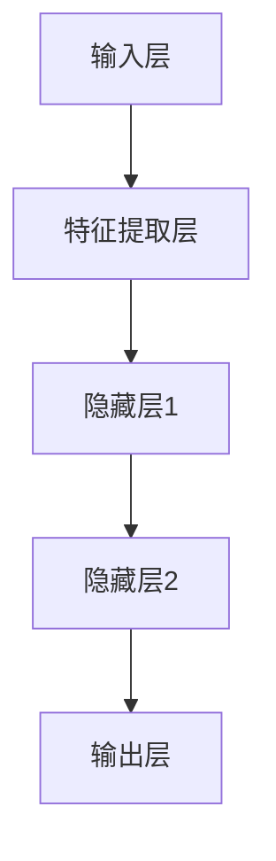

                 

# 《AI大模型创业：如何利用管理优势？》

## 概述

人工智能（AI）技术正迅速发展，大模型作为AI领域的重要方向，已经成为众多企业和创业者的关注焦点。AI大模型在图像识别、自然语言处理、推荐系统等多个领域展现出强大的能力，为商业应用提供了无限可能。然而，AI大模型创业不仅需要技术上的创新，更需要高效的管理来确保项目的成功。本文将探讨AI大模型创业中的管理优势，分析如何在团队建设、项目管理和资源整合等方面发挥管理优势，助力创业成功。

## 关键词

- AI大模型
- 创业
- 管理优势
- 团队建设
- 项目管理
- 资源整合

## 摘要

本文将从AI大模型的基本概念、核心算法和管理优势三个方面入手，详细探讨AI大模型创业过程中的管理优势。通过分析团队建设、项目管理和资源整合等方面，本文旨在为创业者提供一套实用的管理策略，帮助他们在竞争激烈的AI市场中脱颖而出。

### 第一部分：AI大模型基础

### 第1章：AI大模型概述

#### 1.1 AI大模型的概念与重要性

AI大模型是指具有强大学习和推理能力的人工智能系统，通过深度学习和神经网络等技术，能够处理海量数据并生成复杂决策。大模型的重要性体现在其能够为各行业提供智能化解决方案，如自动驾驶、智能医疗、智能金融等。

**AI大模型的定义**：AI大模型是指参数规模超过数十亿、甚至千亿级别的神经网络模型。

**AI大模型的特点**：高参数规模、强大的学习能力、适用于复杂任务、需要大量数据训练。

**AI大模型的发展历程**：从最早的简单神经网络到现代深度学习框架，AI大模型经历了数次技术革新，性能和规模不断提升。

#### 1.2 AI大模型的基本架构

**Mermaid流程图**：以下是一个简化的AI大模型基本架构图：

**AI大模型的模块化设计**：AI大模型通常由输入层、隐藏层和输出层组成，每个层次负责不同的信息处理任务。

#### 1.3 AI大模型的应用领域

**人工智能在各个行业的应用**：AI大模型在金融、医疗、教育、零售等多个行业都有广泛应用，如智能投顾、医疗影像分析、智能教育等。

**AI大模型在商业价值中的体现**：AI大模型能够显著提升企业运营效率、降低成本，创造新的商业模式和价值。

#### 1.4 AI大模型与创业的关系

**AI大模型在创业中的机会**：AI大模型为创业者提供了丰富的商业机会，特别是在需求日益增长的智能应用领域。

**AI大模型在创业中的挑战**：AI大模型的开发需要大量资源、技术和人才，对创业者的综合素质提出了高要求。

### 第2章：AI大模型的核心算法

#### 2.1 机器学习与深度学习基础

**机器学习的基本概念**：机器学习是AI的核心技术，通过算法让计算机从数据中学习，进行预测和决策。

**深度学习的基本原理**：深度学习是机器学习的一个分支，通过多层神经网络模拟人类大脑的学习过程。

**机器学习与深度学习的区别**：机器学习强调通用算法，而深度学习强调模型结构和大规模数据。

#### 2.2 神经网络与深度学习架构

**神经网络的基本结构**：神经网络由多个节点（神经元）组成，通过前向传播和反向传播进行信息传递和处理。

**深度学习的主要架构**：卷积神经网络（CNN）、循环神经网络（RNN）、生成对抗网络（GAN）等。

**深度学习的优化算法**：梯度下降、Adam优化器等。

#### 2.3 自然语言处理与生成模型

**自然语言处理的基本概念**：自然语言处理（NLP）是AI的重要分支，旨在使计算机理解和处理人类语言。

**生成模型的工作原理**：生成模型通过学习数据分布，生成新的数据样本，如文本、图像等。

**生成模型的优化方法**：变分自编码器（VAE）、生成对抗网络（GAN）等。

### 第3章：AI大模型的数学原理

#### 3.1 数学模型与公式

**概率论与统计模型**：概率论和统计学是机器学习的基础，用于描述数据的概率分布和统计特性。

**运筹学与优化算法**：运筹学用于解决资源分配和决策优化问题，如线性规划、动态规划等。

**信息论与熵**：信息论研究信息传递和处理的规律，熵是衡量信息不确定性的指标。

#### 3.2 数学公式与示例

**概率密度函数**：

$$
p(x) = \frac{1}{\sigma\sqrt{2\pi}}e^{-\frac{(x-\mu)^2}{2\sigma^2}}
$$

**拉格朗日乘数法**：

$$
L(\theta, \lambda) = \frac{1}{2n}\sum_{i=1}^{n}(h_\theta(x^{(i)}) - y^{(i)})^2 + \lambda\frac{1}{2}\sum_{j=1}^{m}\theta_j^2
$$

**熵的计算公式**：

$$
H(X) = -\sum_{i=1}^{n}p(x_i)\log_2(p(x_i))
$$

### 第二部分：管理优势在AI大模型创业中的应用

#### 第4章：管理优势与AI大模型创业

##### 4.1 管理优势的定义与分类

**团队管理优势**：高效的团队管理能够提高团队协作效率，确保项目顺利进行。

**项目管理优势**：合理的项目管理能够确保项目按计划完成，降低风险。

**资源整合优势**：有效的资源整合能够最大化利用资源，提高项目成功率。

##### 4.2 管理优势在AI大模型创业中的应用

**如何利用团队管理优势**：建立明确的团队目标，优化团队协作流程，提高团队凝聚力。

**如何利用项目管理优势**：制定详细的项目计划，实时监控项目进度，及时调整策略。

**如何利用资源整合优势**：优化资源配置，降低成本，提高资源利用率。

### 第5章：团队建设与管理

##### 5.1 团队建设的原则与方法

**团队角色的划分**：明确团队中的各个角色，确保每个成员都能发挥所长。

**团队协作的模式**：建立高效的团队协作模式，如敏捷开发、看板管理等。

**团队文化的建设**：培养积极向上的团队文化，提高团队凝聚力。

##### 5.2 团队管理的技巧

**沟通与反馈**：建立有效的沟通机制，确保信息的透明和及时反馈。

**冲突处理**：及时处理团队冲突，避免影响项目进度。

**能力培养与激励**：培养团队成员的能力，激发其工作积极性。

### 第6章：项目管理与执行

##### 6.1 项目管理的流程与工具

**项目计划**：制定详细的项目计划，明确项目目标、任务和进度。

**风险管理**：识别和评估项目风险，制定应对措施。

**质量控制**：确保项目输出符合质量要求，持续改进。

##### 6.2 项目执行的策略与技巧

**进度控制**：实时监控项目进度，确保项目按计划进行。

**成本控制**：合理控制项目成本，避免资源浪费。

**范围管理**：明确项目范围，避免项目范围蔓延。

### 第7章：资源整合与优化

##### 7.1 资源整合的方法与策略

**人才资源**：吸引和培养优秀人才，提高团队整体能力。

**技术资源**：整合先进技术，确保项目技术领先。

**资金资源**：合理规划资金，确保项目资金充足。

##### 7.2 资源优化的实践与案例分析

**如何提高资源利用率**：通过资源调配和优化，提高资源利用率。

**如何降低资源成本**：通过采购优化和成本控制，降低项目成本。

**资源优化在AI大模型创业中的应用案例**：分析成功案例，探讨资源优化的实践方法。

### 第8章：案例研究

##### 8.1 成功案例分享

**成功AI大模型创业案例**：分析成功创业案例，探讨成功的原因。

**案例中的管理优势体现**：探讨成功案例中的管理优势如何发挥作用。

##### 8.2 失败案例剖析

**失败原因分析**：分析失败案例的原因，总结教训。

**管理改进建议**：提出改进建议，避免类似失败。

### 第三部分：AI大模型创业的未来趋势与挑战

##### 9章：AI大模型创业的未来趋势

**9.1 AI技术的发展趋势**：探讨AI技术的发展方向，如大模型、自主决策等。

**9.2 创业环境的变化**：分析市场竞争、政策法规、投资趋势等变化。

##### 10章：AI大模型创业的挑战与应对策略

**10.1 技术挑战**：分析大模型训练与优化、数据安全与隐私保护等挑战。

**10.2 管理挑战**：探讨团队管理的复杂性、项目管理的风险等挑战。

##### 11章：结论与展望

**11.1 AI大模型创业的机遇与风险**：分析创业成功的因素和风险。

**11.2 AI大模型创业的未来展望**：探讨未来发展趋势和创业策略。

### 附录

##### 附录A：AI大模型创业工具与资源

**附录A：AI大模型创业工具与资源**：介绍常用的AI大模型开发工具和资源，如深度学习框架、编程语言等。

##### 附录B：AI大模型创业案例集

**附录B：AI大模型创业案例集**：收集和分析成功和失败的AI大模型创业案例，为创业者提供借鉴和参考。

### 作者

**作者：** AI天才研究院/AI Genius Institute & 禅与计算机程序设计艺术/Zen And The Art of Computer Programming

---

在撰写文章的过程中，请注意以下几点：

1. **逻辑清晰**：确保文章的结构和逻辑清晰，每章、每节都要有明确的主题和目标。
2. **专业术语**：使用专业术语和通俗易懂的语言相结合，避免使用过于生僻的词汇。
3. **实例分析**：结合实际案例进行分析，增加文章的实用性和说服力。
4. **图表与公式**：适当使用图表和公式，帮助读者更好地理解技术概念。
5. **排版规范**：确保文章的排版规范，使用markdown格式进行排版，使文章易于阅读。

最后，请根据文章的实际情况进行适当调整和完善，以确保文章的质量和完整性。期待您的佳作！

