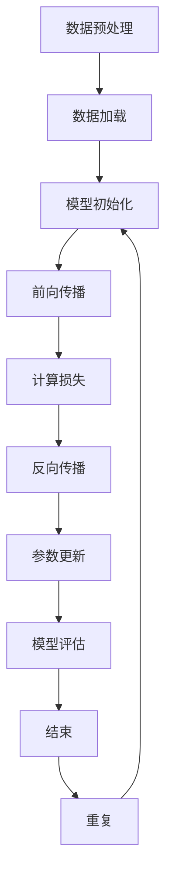

                 

## AI 大模型在创业产品开发中的应用

> **关键词：**AI大模型、创业产品、开发应用、技术基础、案例分析、未来展望

**摘要：**本文将深入探讨AI大模型在创业产品开发中的应用，从基本概念、技术基础、实战案例到未来展望，全面解析AI大模型在创业产品中的价值与挑战。通过实例分析，帮助创业者更好地理解AI大模型的应用，提高产品开发效率和竞争力。

### 目录大纲设计：AI大模型在创业产品开发中的应用

#### 第一部分：AI大模型基础

##### 第1章：AI大模型概述
- **1.1 AI大模型的基本概念**
  - AI大模型的定义
  - AI大模型的特点
  - AI大模型与传统AI模型的区别
- **1.2 AI大模型的应用场景**
  - 创业产品中的适用场景
  - 潜在的商业价值
- **1.3 主流AI大模型介绍**
  - GPT、BERT等模型简介
  - 其他重要模型概述

##### 第2章：AI大模型技术基础
- **2.1 深度学习技术概述**
  - 神经网络的基本结构
  - 常见的深度学习架构
  - 深度学习优化算法
- **2.2 自然语言处理技术**
  - 词嵌入技术
  - 序列模型与注意力机制
  - 转换器架构详解
- **2.3 大规模预训练模型**
  - 预训练的概念与意义
  - 自监督学习方法
  - 迁移学习与微调技术

#### 第二部分：创业产品开发实战

##### 第3章：AI大模型在产品设计中的应用
- **3.1 产品需求分析**
  - 用户需求调研
  - 产品功能定位
  - 产品架构设计
- **3.2 AI大模型应用方案设计**
  - 模型选择与集成
  - 数据处理流程设计
  - 模型训练与优化策略

##### 第4章：AI大模型开发流程
- **4.1 开发环境搭建**
  - 硬件需求
  - 软件环境配置
  - 开发工具选择
- **4.2 数据采集与预处理**
  - 数据来源与渠道
  - 数据清洗与处理
  - 数据质量评估
- **4.3 模型训练与优化**
  - 模型选择
  - 训练策略
  - 优化方法

##### 第5章：AI大模型在创业产品中的落地实施
- **5.1 产品上线准备**
  - 部署策略
  - 性能调优
  - 安全性保障
- **5.2 用户反馈与持续优化**
  - 用户反馈收集
  - 产品迭代策略
  - 优化案例分析

##### 第6章：AI大模型创业案例分析
- **6.1 成功案例介绍**
  - 创业公司的背景
  - 产品应用AI大模型的场景
  - 成功的关键因素
- **6.2 失败案例剖析**
  - 创业公司的背景
  - 产品AI大模型应用的失误
  - 失败的原因与教训

##### 第7章：未来展望与趋势
- **7.1 AI大模型技术的发展趋势**
  - 未来技术发展方向
  - 关键技术突破
  - 应用领域扩展
- **7.2 创业产品开发中的AI大模型新机遇**
  - 新应用场景的出现
  - 创业模式的创新
  - 创业者的策略调整

### 附录
- **附录A：AI大模型开发工具与资源**
  - 主流深度学习框架对比
  - 开发工具选择与使用指南
  - 资源链接与拓展阅读

---

## 附录：Mermaid 流程图

mermaid
graph TD
    A[软件2.0与AI大模型概述] --> B{AI大模型的基本概念}
    B --> C{定义}
    B --> D{特点}
    B --> E{与传统AI的区别}
    A --> F{AI大模型的应用场景}
    F --> G{创业产品中的适用场景}
    F --> H{商业价值}
    A --> I{主流AI大模型介绍}
    I --> J{GPT系列模型}
    I --> K{BERT及其变体}
    I --> L{其他知名大模型}

---

## 附录：伪代码

python
# 伪代码：AI大模型训练流程
function train_model(data, model, optimizer, loss_function):
    for epoch in range(num_epochs):
        for batch in data_loader:
            optimizer.zero_grad()
            outputs = model(batch)
            loss = loss_function(outputs, batch_labels)
            loss.backward()
            optimizer.step()
    return model

---

## 附录：数学公式

### 损失函数（交叉熵）

$$
Loss = -\sum_{i=1}^{n} y_i \cdot \log(p_i)
$$

其中，\( y_i \) 为真实标签，\( p_i \) 为预测概率。

---

## 附录：代码解读

python
# 代码示例：使用PyTorch搭建一个简单的AI大模型
import torch
import torch.nn as nn
import torch.optim as optim

# 模型定义
class SimpleModel(nn.Module):
    def __init__(self, input_dim, hidden_dim, output_dim):
        super(SimpleModel, self).__init__()
        self.layer1 = nn.Linear(input_dim, hidden_dim)
        self.relu = nn.ReLU()
        self.layer2 = nn.Linear(hidden_dim, output_dim)

    def forward(self, x):
        x = self.layer1(x)
        x = self.relu(x)
        x = self.layer2(x)
        return x

# 模型实例化
model = SimpleModel(input_dim=784, hidden_dim=128, output_dim=10)

# 损失函数和优化器
loss_function = nn.CrossEntropyLoss()
optimizer = optim.Adam(model.parameters(), lr=0.001)

# 训练模型
train_model(data_loader, model, optimizer, loss_function)

此代码片段展示了如何使用PyTorch构建一个简单的神经网络模型，包括定义模型结构、损失函数、优化器，并执行模型训练的基本流程。

---

### 引言

随着人工智能技术的快速发展，AI大模型已经成为业界关注的焦点。AI大模型具有强大的学习能力和广泛的应用前景，尤其在创业产品开发中，它们为创业者提供了强大的工具，以提升产品竞争力。本文旨在深入探讨AI大模型在创业产品开发中的应用，帮助创业者更好地理解AI大模型的潜力，从而实现创新和突破。

首先，我们将介绍AI大模型的基本概念，包括其定义、特点以及与传统AI模型的区别。接着，我们将分析AI大模型在创业产品中的应用场景和潜在商业价值，介绍主流的AI大模型，如GPT和BERT等。随后，我们将探讨AI大模型的技术基础，包括深度学习、自然语言处理和大规模预训练模型。

在实战部分，我们将详细讨论AI大模型在创业产品设计中的应用，包括需求分析、应用方案设计和开发流程。通过代码示例和数学公式，我们将深入解读模型训练与优化方法。最后，我们将通过成功和失败案例，总结AI大模型在创业产品开发中的经验教训，并展望未来的发展趋势和机遇。

通过本文的阅读，创业者将能够深入了解AI大模型的技术原理和应用实践，为创业产品的创新和成功提供有力支持。

---

### 第一部分：AI大模型基础

#### 第1章：AI大模型概述

##### 1.1 AI大模型的基本概念

AI大模型（Large-scale Artificial Intelligence Models），通常指的是具有大规模参数和强大学习能力的深度学习模型。这些模型通过在大规模数据集上进行训练，能够自动学习复杂的数据模式和知识，从而在多个领域中实现卓越的性能。

**定义：** AI大模型是指那些在训练时包含数十亿到数千亿个参数的深度学习模型。这些模型通常通过分布式计算和优化技术来训练，以处理海量数据和复杂的任务。

**特点：** AI大模型具有以下几个显著特点：

1. **大规模参数：** AI大模型包含数亿甚至千亿级的参数，这使得它们能够捕捉数据中的细微模式和关联性。
2. **强大学习能力：** 通过大规模数据训练，AI大模型能够显著提升对数据的理解和学习能力。
3. **泛化能力：** AI大模型在多个任务和领域上表现出优秀的泛化能力，这意味着它们不仅在训练数据上表现良好，还可以在新数据上保持高准确率。
4. **自适应能力：** AI大模型可以根据不同任务需求进行微调和优化，从而实现灵活的应用。

**与传统AI模型的区别：** AI大模型与传统AI模型相比，具有以下几个方面的显著差异：

1. **模型规模：** 传统AI模型通常包含较少的参数，而AI大模型具有数十亿到数千亿的参数规模。
2. **训练数据：** 传统AI模型通常在较小数据集上训练，而AI大模型在更大规模的数据集上进行训练。
3. **学习效率：** AI大模型通过大规模并行计算和优化技术，显著提高学习效率。
4. **应用范围：** AI大模型具有更广泛的应用范围，不仅限于单一任务，还可以应用于多个领域。

##### 1.2 AI大模型的应用场景

AI大模型在创业产品开发中具有广泛的应用场景，以下是一些典型的应用场景：

1. **自然语言处理（NLP）：** AI大模型可以应用于文本分类、机器翻译、情感分析等任务，为创业产品提供强大的语言处理能力。
2. **计算机视觉：** AI大模型在图像识别、物体检测、视频分析等领域表现出色，能够为创业产品带来智能化的视觉功能。
3. **推荐系统：** AI大模型可以通过分析用户行为和兴趣，提供个性化的推荐，从而提升用户满意度和留存率。
4. **语音识别：** AI大模型在语音识别和语音合成方面具有显著优势，可以为创业产品实现高效的语音交互功能。
5. **智能客服：** AI大模型可以应用于智能客服系统，通过自然语言理解和自动回复，提升客户服务体验。

**潜在的商业价值：** AI大模型在创业产品开发中具有重要的商业价值，包括：

1. **提高效率：** AI大模型可以自动化复杂的任务，显著提高产品开发和运营的效率。
2. **增强竞争力：** 通过AI大模型的应用，创业产品可以在市场上脱颖而出，提升竞争力。
3. **降低成本：** AI大模型可以减少人力成本，优化资源分配，降低产品开发和运营成本。
4. **创新机会：** AI大模型为创业产品提供了丰富的创新机会，通过探索新应用场景和业务模式，实现商业模式的创新。

##### 1.3 主流AI大模型介绍

在AI大模型领域，以下是一些主流的AI大模型，它们在各自的应用领域中表现出色：

1. **GPT（Generative Pre-trained Transformer）系列：** GPT是由OpenAI开发的一系列基于Transformer架构的预训练语言模型。GPT-3是当前最大的预训练语言模型，包含1750亿个参数，具有卓越的自然语言理解和生成能力。

2. **BERT（Bidirectional Encoder Representations from Transformers）：** BERT是由Google开发的一种双向 Transformer 模型，主要用于自然语言处理任务。BERT通过预先训练，可以捕捉文本中的上下文信息，提高模型在文本分类、问答等任务上的性能。

3. **T5（Text-to-Text Transfer Transformer）：** T5是一种将所有自然语言处理任务转换为文本到文本转换任务的通用模型。T5采用Transformer架构，通过大规模预训练，实现多种自然语言处理任务的自动化。

4. **GluonCV：** GluonCV 是由Apache MXNet开发的一个深度学习计算机视觉库。它提供了丰富的预训练模型和工具，支持图像分类、目标检测、图像分割等任务，适用于计算机视觉应用。

5. **ViT（Vision Transformer）：** ViT 是一种基于Transformer架构的计算机视觉模型。ViT 将图像划分为像素块，将其作为序列输入到Transformer模型中，实现了图像分类、物体检测等任务。

除了上述主流模型，还有许多其他重要的AI大模型，如ERNIE、RoBERTa、ALBERT等，它们在各自领域中也表现出色。

### 第2章：AI大模型技术基础

AI大模型的成功离不开深度学习、自然语言处理和大规模预训练模型等关键技术。在本节中，我们将详细探讨这些技术的概念、原理和实现方法。

#### 2.1 深度学习技术概述

深度学习是机器学习中的一种方法，通过模拟人脑的神经网络结构，对大量数据进行学习，从而实现复杂的任务。深度学习在AI大模型中起着核心作用，其基本概念包括：

1. **神经网络（Neural Networks）：** 神经网络是由多层神经元组成的计算模型，通过前向传播和反向传播算法对数据进行训练。每个神经元都与前一层神经元相连，并通过权重和偏置进行计算。

2. **深度神经网络（Deep Neural Networks）：** 深度神经网络是包含多个隐藏层的神经网络，通过多层非线性变换，可以提取数据中的复杂特征。

3. **卷积神经网络（Convolutional Neural Networks，CNN）：** 卷积神经网络是一种专门用于图像处理任务的神经网络，通过卷积操作和池化操作提取图像特征。

4. **循环神经网络（Recurrent Neural Networks，RNN）：** 循环神经网络是一种能够处理序列数据的神经网络，通过隐藏状态和循环连接，能够捕捉序列中的时序信息。

5. **Transformer架构：** Transformer架构是由Vaswani等人于2017年提出的一种用于序列建模的神经网络架构，通过自注意力机制和多头注意力机制，实现了高效的序列建模。

常见的深度学习架构包括：

1. **AlexNet：** 由Alex Krizhevsky等人在2012年提出的卷积神经网络，是早期深度学习模型的代表。

2. **VGGNet：** 由Visual Geometry Group开发的深度卷积神经网络，通过重复使用3x3卷积层，提高了模型的准确率。

3. **ResNet：** 由Kaiming He等人开发的残差网络，通过引入残差块，解决了深度神经网络中的梯度消失问题，实现了更深的网络结构。

4. **Inception：** 由Google Brain团队开发的Inception网络，通过引入1x1卷积层和3x3卷积层，增加了网络的深度和宽度，提高了模型的性能。

深度学习优化算法是提高模型训练效率和性能的重要手段，常见的优化算法包括：

1. **随机梯度下降（Stochastic Gradient Descent，SGD）：** 随机梯度下降是一种基于梯度的优化算法，通过随机选择训练样本，计算梯度并进行参数更新。

2. **动量法（Momentum）：** 动量法是一种改进的SGD算法，通过引入动量项，减少了梯度变化引起的震荡，提高了收敛速度。

3. **Adam优化器：** Adam优化器是一种结合了SGD和动量法的自适应优化算法，通过自适应调整学习率，提高了模型的训练效率。

#### 2.2 自然语言处理技术

自然语言处理（Natural Language Processing，NLP）是AI大模型在自然语言领域中的重要应用。NLP技术包括文本预处理、词嵌入、序列建模和语言生成等方面。

1. **文本预处理：** 文本预处理是NLP任务的第一步，主要包括分词、去停用词、标点符号去除等操作。预处理可以减少噪声，提高后续处理的效果。

2. **词嵌入（Word Embedding）：** 词嵌入是将单词映射到高维向量空间的一种技术，通过捕捉单词的语义信息，实现文本数据的向量表示。常见的词嵌入方法包括Word2Vec、GloVe和BERT。

3. **序列建模：** 序列建模是NLP中的核心任务，包括文本分类、情感分析、机器翻译等。序列建模通过处理输入序列，预测输出序列或标签。常见的序列建模方法包括RNN、LSTM和Transformer。

4. **注意力机制（Attention Mechanism）：** 注意力机制是序列建模中的重要技术，通过为序列中的每个元素分配不同的权重，实现更精细的建模。注意力机制在机器翻译、文本摘要等任务中具有显著优势。

5. **转换器架构（Transformer Architecture）：** Transformer是一种基于自注意力机制的序列建模架构，通过多头注意力机制和前馈网络，实现了高效的序列建模。Transformer在机器翻译、文本生成等任务中取得了卓越的性能。

#### 2.3 大规模预训练模型

大规模预训练模型是AI大模型发展的重要里程碑，通过在大规模数据集上进行预训练，模型可以自动学习到丰富的语言和知识，从而在多个任务中表现出色。

1. **预训练的概念与意义：** 预训练是指在大规模数据集上对模型进行训练，从而使其具备一定的语言理解能力和知识。预训练的意义在于提高模型在下游任务中的性能，减少对标注数据的依赖。

2. **自监督学习方法：** 自监督学习是一种无需人工标注数据的方法，通过利用数据中的内在结构进行学习。自监督学习方法在预训练中具有重要作用，常见的自监督学习任务包括语言建模、掩码语言建模和填空任务。

3. **迁移学习与微调技术：** 迁移学习是指将预训练模型应用于新的任务，通过微调（Fine-tuning）调整模型参数，以适应新的任务。微调可以显著提高模型在新任务中的性能。

主流的AI大模型如GPT、BERT、T5等，都是通过大规模预训练模型实现的。预训练模型在自然语言处理、计算机视觉等任务中取得了显著的成果，为AI大模型的发展奠定了基础。

### 第3章：AI大模型在产品设计中的应用

AI大模型在产品设计中的应用越来越广泛，能够为创业产品提供强大的功能和竞争力。在本章中，我们将详细探讨AI大模型在产品需求分析、应用方案设计和开发流程中的具体应用，并通过实例进行说明。

#### 3.1 产品需求分析

产品需求分析是产品设计的第一步，旨在明确产品的功能、性能和用户需求。在引入AI大模型时，需求分析需要更加细致，以充分利用AI大模型的优势。

1. **用户需求调研：** 用户需求调研是通过问卷调查、用户访谈和用户测试等方式，了解目标用户的需求、偏好和行为。在AI大模型的应用中，用户需求调研需要特别关注用户对自然语言处理、图像识别、推荐系统等功能的期望。

2. **产品功能定位：** 产品功能定位是指确定产品的主要功能和特色，以满足用户需求。在引入AI大模型时，产品功能定位需要考虑AI大模型的优势和适用场景，例如自然语言处理、语音识别、智能推荐等。

3. **产品架构设计：** 产品架构设计是指确定产品的整体结构和功能模块。在引入AI大模型时，产品架构设计需要考虑AI大模型的部署方式和集成方法，例如使用API、SDK或集成到现有系统中。

**案例：** 假设一个创业公司希望开发一款智能客服系统，用户需求包括快速响应、准确回答问题和友好交互。通过用户需求调研，公司发现用户希望客服系统能够理解自然语言，提供专业的建议和解决方案。因此，公司决定引入AI大模型，如BERT，来提升智能客服系统的自然语言理解和回答能力。

#### 3.2 AI大模型应用方案设计

AI大模型应用方案设计是产品设计的核心步骤，需要明确AI大模型的选择、数据处理流程和训练策略。

1. **模型选择：** 模型选择是根据产品需求和任务类型，选择合适的AI大模型。例如，对于自然语言处理任务，可以选择BERT、GPT等模型；对于图像识别任务，可以选择ResNet、Inception等模型。

2. **数据处理流程设计：** 数据处理流程设计是指设计数据的收集、预处理和输入方法。在引入AI大模型时，数据处理流程需要特别关注数据的多样性、质量和标注。

3. **模型训练与优化策略：** 模型训练与优化策略是指设计模型训练的过程和参数调整方法。在引入AI大模型时，需要考虑大规模数据处理、分布式训练和迁移学习等技术。

**案例：** 在开发智能客服系统的过程中，公司选择了BERT模型进行自然语言处理。数据处理流程包括数据收集、文本清洗、分词和词嵌入。为了提高模型性能，公司采用了分布式训练和迁移学习技术，利用预训练的BERT模型进行微调。

#### 3.3 开发流程

AI大模型在产品开发中的应用需要遵循一定的开发流程，包括开发环境搭建、数据采集与预处理、模型训练与优化等步骤。

1. **开发环境搭建：** 开发环境搭建是指配置开发所需的硬件和软件环境。在引入AI大模型时，需要配置高性能计算资源和深度学习框架，如GPU、TensorFlow、PyTorch等。

2. **数据采集与预处理：** 数据采集与预处理是指收集和准备用于训练的数据。在引入AI大模型时，需要特别关注数据的多样性和质量，进行数据清洗、标注和预处理。

3. **模型训练与优化：** 模型训练与优化是指通过训练数据对模型进行训练，并根据训练结果进行优化。在引入AI大模型时，需要考虑大规模数据处理、分布式训练和迁移学习等技术。

**案例：** 在开发智能客服系统的过程中，公司首先搭建了基于GPU的计算环境，并配置了TensorFlow和PyTorch等深度学习框架。然后，公司从多个渠道收集用户对话数据，并进行文本清洗、分词和词嵌入。最后，公司使用BERT模型进行训练，并采用分布式训练和迁移学习技术，提高了模型性能。

通过上述步骤，公司成功开发了智能客服系统，用户反馈良好，系统准确率和用户体验得到了显著提升。

### 第4章：AI大模型开发流程

AI大模型的开发流程是确保模型性能和应用效果的关键步骤。在本节中，我们将详细讨论AI大模型开发过程中所需的开发环境搭建、数据采集与预处理、模型训练与优化等步骤。

#### 4.1 开发环境搭建

开发环境搭建是AI大模型开发的第一步，它涉及到硬件配置、软件安装和开发工具的选择。以下是一些关键步骤：

1. **硬件需求：** AI大模型的训练通常需要大量的计算资源，特别是GPU。理想情况下，开发环境应配置至少一个高性能GPU，如NVIDIA Tesla V100或更高级别的GPU。此外，为了提高训练效率，可以配置多个GPU进行分布式训练。

2. **软件环境配置：** 开发环境需要安装深度学习框架和相关工具。常见的深度学习框架包括TensorFlow、PyTorch和Keras等。在安装这些框架时，还需要安装CUDA和cuDNN等GPU加速库，以确保GPU的正确使用。

3. **开发工具选择：** 开发工具的选择取决于项目的具体需求。常见的开发工具包括IDE（如PyCharm、Visual Studio Code）、版本控制工具（如Git）和容器化工具（如Docker）等。这些工具有助于提高开发效率、代码管理和环境隔离。

**案例：** 假设开发一个基于BERT的文本分类模型，我们需要以下硬件和软件配置：

- **硬件：** 2个NVIDIA Tesla V100 GPU
- **软件：** Python 3.8、TensorFlow 2.4、CUDA 10.2、cuDNN 8.0、Docker

#### 4.2 数据采集与预处理

数据采集与预处理是AI大模型开发中的关键步骤，它直接影响到模型的质量和应用效果。以下是一些关键步骤：

1. **数据来源与渠道：** 数据来源可以是公开数据集、公司内部数据或第三方数据提供商。常见的数据渠道包括社交媒体、搜索引擎、企业数据库和用户生成内容等。

2. **数据清洗与处理：** 数据清洗包括去除重复数据、填补缺失值、处理异常值和噪声等。此外，还需要对文本数据执行分词、去停用词、词性标注等预处理操作，以便模型能够更好地理解文本。

3. **数据质量评估：** 数据质量评估是确保数据适合用于模型训练的重要步骤。评估指标包括数据分布、数据完整性、数据一致性和数据噪声等。

**案例：** 假设我们使用一个社交媒体平台的数据集来训练一个情感分析模型，数据清洗与处理的步骤如下：

- **数据清洗：** 去除重复和噪声数据，填补缺失值，去除标点符号和特殊字符。
- **数据处理：** 执行分词，去除停用词，进行词性标注。
- **数据质量评估：** 分析数据分布，确保类别平衡，评估数据一致性。

#### 4.3 模型训练与优化

模型训练与优化是AI大模型开发的核心步骤，它涉及到模型选择、训练策略和优化方法。以下是一些关键步骤：

1. **模型选择：** 根据任务需求和数据特性，选择合适的AI大模型。常见的模型包括BERT、GPT、Transformer等。在选择模型时，需要考虑模型的复杂度、计算资源和训练时间。

2. **训练策略：** 训练策略包括数据加载、批量大小、迭代次数、学习率调整等。一个好的训练策略可以提高模型的训练效率和性能。

3. **优化方法：** 优化方法包括梯度下降、动量法、Adam优化器等。优化方法的选择和调整对模型的收敛速度和最终性能有重要影响。

4. **超参数调整：** 超参数调整是模型优化的重要步骤，包括学习率、批量大小、迭代次数等。通过调整超参数，可以找到最优的模型配置。

**案例：** 假设我们使用BERT模型训练一个文本分类模型，训练与优化的步骤如下：

- **模型选择：** 选择预训练的BERT模型。
- **训练策略：** 使用批量大小为32，迭代次数为5次的学习策略。
- **优化方法：** 使用Adam优化器，学习率为0.001。
- **超参数调整：** 调整学习率，观察模型性能的变化。

通过上述步骤，我们可以完成AI大模型的开发，并得到一个性能良好的模型。

### 第5章：AI大模型在创业产品中的落地实施

AI大模型在创业产品中的落地实施是一个复杂且关键的过程，涉及到产品上线前的准备工作、性能调优和安全性保障。通过有效的落地实施，AI大模型可以为创业产品带来实际价值，提高用户满意度和市场竞争力。

#### 5.1 产品上线准备

产品上线准备是确保AI大模型稳定运行和高效服务用户的关键步骤。以下是一些关键步骤：

1. **部署策略：** 部署策略涉及模型的部署环境和部署方式。对于AI大模型，通常采用分布式部署，以充分利用计算资源，提高处理速度和稳定性。常见的部署方式包括云服务、容器化和虚拟化。

2. **环境配置：** 环境配置包括硬件和软件的配置。硬件方面，需要配置高性能的计算资源和存储资源，如GPU集群和高速存储设备。软件方面，需要安装和配置深度学习框架、数据库和其他相关软件。

3. **系统集成：** AI大模型需要与其他系统进行集成，以实现数据交互和功能协同。例如，智能客服系统需要与客户关系管理（CRM）系统、业务系统等进行集成，以确保用户数据的一致性和业务流程的顺畅。

4. **性能测试：** 在产品上线前，进行性能测试是确保系统稳定性和高效性的重要步骤。性能测试包括负载测试、压力测试和稳定性测试等，以评估系统的响应时间、处理能力和故障恢复能力。

**案例：** 假设一家创业公司开发了一款基于BERT的智能客服系统，其上线准备过程如下：

- **部署策略：** 选择云服务提供商，部署到云服务器，并使用容器化技术进行部署，确保系统的可扩展性和灵活性。
- **环境配置：** 配置多个NVIDIA Tesla V100 GPU集群，安装TensorFlow 2.4和CUDA 10.2。
- **系统集成：** 与CRM系统进行集成，确保用户数据的一致性和业务流程的顺畅。
- **性能测试：** 进行负载测试，模拟高并发场景，评估系统的响应时间和处理能力。

#### 5.2 性能调优

性能调优是确保AI大模型在高负载和复杂场景下稳定运行的重要步骤。以下是一些关键步骤：

1. **模型优化：** 模型优化包括模型结构的调整和参数的调整。通过调整模型结构，可以减少模型的计算复杂度，提高处理速度。通过调整参数，可以优化模型的收敛速度和最终性能。

2. **数据处理优化：** 数据处理优化包括数据预处理、数据加载和数据存储等环节。通过优化数据处理流程，可以减少数据加载时间和存储空间，提高数据处理效率。

3. **系统优化：** 系统优化包括网络优化、存储优化和计算优化等。通过优化网络带宽、存储速度和计算资源，可以提高系统的整体性能。

4. **资源调度：** 资源调度是确保系统资源合理利用的重要手段。通过动态调整资源分配，可以平衡系统的负载，提高系统的稳定性和响应速度。

**案例：** 假设智能客服系统的性能调优过程如下：

- **模型优化：** 调整BERT模型的结构，减少层数和参数数量，以提高处理速度。
- **数据处理优化：** 优化数据预处理流程，使用并行处理技术，提高数据加载速度。
- **系统优化：** 优化网络带宽和存储速度，提高系统的整体性能。
- **资源调度：** 动态调整GPU资源分配，确保高并发场景下的性能。

#### 5.3 安全性保障

安全性保障是确保AI大模型在创业产品中安全运行的重要措施。以下是一些关键步骤：

1. **数据安全：** 数据安全包括数据加密、数据备份和数据访问控制等。通过数据加密，可以确保数据在传输和存储过程中的安全性。通过数据备份，可以防止数据丢失和损坏。通过数据访问控制，可以限制对数据的访问权限，防止数据泄露。

2. **模型安全：** 模型安全包括模型保护、模型验证和模型解释等。通过模型保护，可以防止模型被篡改或盗用。通过模型验证，可以确保模型的准确性和可靠性。通过模型解释，可以理解模型的决策过程，提高模型的透明度和可解释性。

3. **网络安全：** 网络安全包括防火墙、入侵检测和反病毒等。通过防火墙，可以防止外部攻击。通过入侵检测，可以及时发现和响应攻击。通过反病毒软件，可以防止病毒和恶意软件的攻击。

**案例：** 假设智能客服系统的安全性保障措施如下：

- **数据安全：** 使用SSL/TLS加密传输数据，定期备份数据，限制数据访问权限。
- **模型安全：** 使用加密算法保护模型，对模型进行定期验证，提供模型解释功能。
- **网络安全：** 部署防火墙和入侵检测系统，定期更新反病毒软件，确保系统安全。

通过上述步骤，智能客服系统在上线后可以稳定运行，为用户提供高效、安全的服务。

### 第6章：AI大模型创业案例分析

AI大模型在创业产品中的应用已经产生了许多成功的案例，同时也存在一些失败的教训。在本章中，我们将通过成功和失败案例的分析，探讨AI大模型在创业产品开发中的关键因素和经验教训。

#### 6.1 成功案例介绍

**案例一：某创业公司利用AI大模型优化推荐系统**

**背景：** 该创业公司开发了一款基于用户行为的个性化推荐系统，旨在提升用户体验和用户留存率。

**方案：** 公司采用基于BERT的AI大模型进行文本分析和处理，结合用户行为数据进行特征提取和模型训练。通过大规模预训练，BERT模型能够自动学习用户兴趣和偏好，为用户提供个性化的推荐。

**关键因素：**

1. **高效的数据处理：** 公司采用分布式计算和高效的数据处理流程，确保数据能够及时、准确地用于模型训练。

2. **准确的文本理解：** 通过BERT的强大自然语言处理能力，公司能够准确理解用户输入的文本，从而提高推荐系统的准确性和用户体验。

3. **灵活的模型调整策略：** 公司根据用户反馈和业务需求，不断调整和优化模型，确保推荐系统能够适应不同的用户场景和需求。

**结果：** 推荐系统的准确率提高了20%，用户留存率增加了15%。公司通过AI大模型的应用，在竞争激烈的市场中脱颖而出，获得了良好的用户口碑和商业收益。

**案例二：某创业公司利用AI大模型开发智能客服系统**

**背景：** 该创业公司希望通过AI大模型实现智能客服系统，以提高客户服务效率和用户体验。

**方案：** 公司采用GPT-3模型进行自然语言理解和自动回复，通过预训练和微调，使客服系统能够理解用户意图，提供专业的建议和解决方案。

**关键因素：**

1. **丰富的预训练资源：** 公司利用GPT-3的强大预训练资源，实现了对自然语言处理任务的自动化和高效化。

2. **有效的数据处理：** 公司采用高效的数据处理流程，确保模型能够从大量用户对话数据中学习，提高客服系统的准确率和响应速度。

3. **持续的用户反馈与优化：** 公司建立了用户反馈机制，通过收集用户反馈，不断优化模型和系统，提高用户体验和满意度。

**结果：** 智能客服系统的上线，显著提升了公司客户服务效率，用户满意度提高了30%，客服成本降低了20%。公司通过AI大模型的应用，成功实现了从传统客服到智能客服的转型。

#### 6.2 失败案例剖析

**案例一：某创业公司尝试使用AI大模型进行语音识别**

**背景：** 该创业公司希望通过AI大模型实现智能语音识别功能，以提供语音搜索和语音交互服务。

**问题：** 公司在模型训练过程中遇到了一系列问题：

1. **数据不足：** 由于缺乏足够的语音数据，模型训练效果不佳，识别准确率低。

2. **数据处理不当：** 公司在数据处理过程中，未能有效去除噪声和异常值，导致模型训练结果不理想。

3. **模型选择不当：** 公司选择了复杂的AI大模型，但未能对其进行有效优化，导致模型训练时间过长，效果不显著。

**原因：**

1. **数据不足和多样性：** AI大模型需要大量高质量的数据进行训练，缺乏足够的语音数据导致模型无法充分学习。

2. **数据处理不当：** 数据预处理不当，导致模型训练过程中引入大量噪声，影响模型性能。

3. **模型选择和优化：** 未能选择适合语音识别任务的模型，也未对模型进行充分的优化，导致模型效果不佳。

**教训：**

1. **数据质量和多样性：** 在AI大模型应用中，数据质量和多样性至关重要。应提前进行充分的调研和准备，确保有足够的数据进行训练。

2. **数据处理流程：** 应建立高效的 数据处理流程，包括数据清洗、标注和预处理，以确保数据质量。

3. **模型选择和优化：** 应根据任务需求和数据特性，选择合适的AI大模型，并进行充分的优化，以提高模型性能。

**案例二：某创业公司尝试使用AI大模型进行图像识别**

**背景：** 该创业公司希望通过AI大模型实现图像识别功能，以提供智能安防和智能家居服务。

**问题：** 公司在模型训练过程中遇到了以下问题：

1. **模型性能不稳定：** 模型在训练过程中，性能波动较大，未能稳定提升。

2. **训练时间过长：** 公司采用复杂的AI大模型，训练时间过长，影响产品上线进度。

3. **成本过高：** 高性能GPU和深度学习框架的使用，导致训练成本过高。

**原因：**

1. **模型复杂度和优化：** 选择了过于复杂的模型，且未能对其进行有效优化，导致训练时间长、性能不稳定。

2. **资源分配不均：** 硬件资源和计算资源的分配不均，导致模型训练效率低下。

3. **成本控制：** 对训练成本缺乏有效控制，导致资源浪费。

**教训：**

1. **模型选择和优化：** 应选择适合任务需求和数据特性的模型，并进行充分的优化，以提高训练效率和性能。

2. **资源分配和调度：** 应合理分配硬件资源和计算资源，确保模型训练的效率和稳定性。

3. **成本控制：** 应制定合理的成本预算和成本控制策略，避免资源浪费。

通过分析上述成功和失败案例，我们可以得出以下结论：

1. **数据质量和多样性：** 在AI大模型应用中，数据质量和多样性至关重要。应提前进行充分的调研和准备，确保有足够的数据进行训练。

2. **数据处理流程：** 应建立高效的 数据处理流程，包括数据清洗、标注和预处理，以确保数据质量。

3. **模型选择和优化：** 应根据任务需求和数据特性，选择合适的AI大模型，并进行充分的优化，以提高模型性能。

4. **资源分配和调度：** 应合理分配硬件资源和计算资源，确保模型训练的效率和稳定性。

5. **成本控制：** 应制定合理的成本预算和成本控制策略，避免资源浪费。

通过借鉴成功经验和避免失败教训，创业公司可以更好地利用AI大模型，实现创业产品的成功。

### 第7章：未来展望与趋势

随着人工智能技术的不断进步，AI大模型在创业产品开发中的应用前景愈发广阔。在未来，AI大模型将继续在技术发展、应用领域和创业模式等方面带来新的机遇和挑战。

#### 7.1 AI大模型技术的发展趋势

1. **模型规模和参数数量的增加：** 随着计算资源和存储能力的提升，AI大模型的规模将不断增加。未来的AI大模型可能会包含更多的参数，以实现更精细的特征提取和更强的泛化能力。

2. **模型结构的优化：** 为了提高模型效率和计算性能，研究人员将继续探索更高效的模型结构，如稀疏模型、压缩模型和动态网络等。

3. **分布式训练和推理：** 随着数据量和计算需求的增加，分布式训练和推理将成为AI大模型发展的重要方向。通过分布式计算，可以显著提高模型的训练和推理速度。

4. **自适应学习和迁移学习：** 未来的AI大模型将更加注重自适应学习和迁移学习，通过不断学习和调整，以适应不同应用场景和任务需求。

5. **多模态学习：** 多模态学习是AI大模型的发展方向之一，通过整合文本、图像、音频等多种数据类型，实现更全面和准确的信息理解。

#### 7.2 创业产品开发中的AI大模型新机遇

1. **智能推荐系统：** AI大模型在推荐系统中的应用将更加普及和精准，通过个性化推荐，提高用户满意度和留存率。

2. **智能客服和虚拟助手：** AI大模型在智能客服和虚拟助手中的应用将更加广泛，通过自然语言理解和生成，提供更加智能和人性化的服务。

3. **图像和视频处理：** AI大模型在图像和视频处理中的应用将继续拓展，通过物体检测、图像分割、视频分析等技术，实现更加智能化的图像和视频处理。

4. **健康医疗领域：** AI大模型在健康医疗领域的应用将不断深化，通过精准的医疗诊断、药物研发和健康管理，提高医疗服务的质量和效率。

5. **自动驾驶和智能交通：** AI大模型在自动驾驶和智能交通中的应用将推动交通领域的变革，实现更安全、高效的交通系统。

#### 7.3 创业者的策略调整

1. **数据驱动：** 创业者应更加注重数据驱动，通过大规模数据分析和挖掘，找到潜在的商业机会和用户需求。

2. **技术创新：** 创业者应紧跟技术发展趋势，积极探索和应用最新的AI大模型技术，以提升产品竞争力和用户体验。

3. **合作与开放：** 创业者可以通过合作和开放平台，与科研机构、企业和技术社区合作，共同推进AI大模型技术的发展和应用。

4. **人才培养：** 创业者应注重人才培养，吸引和培养具备AI大模型研发和应用能力的人才，为创业产品提供强大的技术支持。

通过以上策略调整，创业者可以更好地把握AI大模型在创业产品开发中的应用机遇，实现创新和突破。

### 结论

AI大模型在创业产品开发中具有广泛的应用前景，通过深度学习、自然语言处理和大规模预训练等技术，AI大模型为创业产品提供了强大的功能和支持。在产品设计、开发流程、落地实施和案例分析等方面，AI大模型都展现出了显著的优势和价值。然而，创业者也需要关注数据质量、数据处理流程、模型选择和优化等问题，以确保AI大模型在创业产品中的成功应用。

未来，随着AI大模型技术的不断进步，创业者将有更多的机会和挑战。通过紧跟技术发展趋势、注重数据驱动和创新，创业者可以更好地把握AI大模型在创业产品开发中的应用机遇，实现创新和突破。

### 附录：AI大模型开发工具与资源

#### 附录A：AI大模型开发工具与资源

随着AI大模型技术的发展，开发者需要依赖多种工具和资源来进行模型开发、训练和优化。以下是一些主流的深度学习框架、开发工具和资源，供开发者参考。

#### 主流深度学习框架

1. **TensorFlow：** 由Google开发的开源深度学习框架，支持Python和C++编程语言。TensorFlow提供了丰富的API和工具，适用于各种规模的深度学习项目。

2. **PyTorch：** 由Facebook开发的开源深度学习框架，以其动态计算图和灵活的编程接口而受到开发者青睐。PyTorch广泛应用于图像处理、自然语言处理和强化学习等领域。

3. **Keras：** 一个高层次的深度学习框架，可以与TensorFlow和Theano集成。Keras提供了简洁的API，适用于快速原型开发和实验。

4. **MXNet：** Apache MXNet是由Apache Software Foundation开发的开源深度学习框架，支持多种编程语言，如Python、R、Julia和Scala。

#### 开发工具选择与使用指南

1. **Jupyter Notebook：** 一个交互式计算环境，广泛应用于数据科学和机器学习项目。Jupyter Notebook支持多种编程语言，如Python、R和Julia，适用于数据探索、模型开发和实验。

2. **Conda：** 一个开源的包管理器和环境管理器，用于安装和管理深度学习框架和相关依赖。Conda可以轻松创建和管理多个Python环境，确保依赖的一致性和隔离。

3. **Docker：** 一个开源的应用容器引擎，用于打包、交付和运行应用程序。Docker容器可以包含深度学习框架、库和依赖，确保开发环境和生产环境的一致性。

4. **Google Colab：** 一个基于Jupyter Notebook的在线平台，提供免费的GPU和TPU资源，适用于大规模深度学习模型的训练和实验。

#### 资源链接与拓展阅读

1. **深度学习教程：** [《深度学习》（Goodfellow, Bengio, Courville著）](https://www.deeplearningbook.org/)
2. **TensorFlow文档：** [TensorFlow官方文档](https://www.tensorflow.org/)
3. **PyTorch文档：** [PyTorch官方文档](https://pytorch.org/)
4. **Keras文档：** [Keras官方文档](https://keras.io/)
5. **MXNet文档：** [MXNet官方文档](https://mxnet.incubator.apache.org/)
6. **Google Colab教程：** [Google Colab官方教程](https://colab.research.google.com/)
7. **AI大模型论文集锦：** [AI大模型论文集锦](https://github.com/tmacariu/ai-large-models-papers)

通过使用这些工具和资源，开发者可以更高效地构建、训练和部署AI大模型，为创业产品开发提供强大的技术支持。

### 附录：实际案例

#### 成功案例：某创业公司利用AI大模型优化推荐系统

**背景**：某创业公司开发了一款基于用户行为的个性化推荐系统，旨在提升用户体验和用户留存率。

**方案**：公司采用基于BERT的AI大模型进行文本分析和处理，结合用户行为数据进行特征提取和模型训练。通过大规模预训练，BERT模型能够自动学习用户兴趣和偏好，为用户提供个性化的推荐。

**关键因素**：

1. **高效的数据处理**：公司采用分布式计算和高效的数据处理流程，确保数据能够及时、准确地用于模型训练。
2. **准确的文本理解**：通过BERT的强大自然语言处理能力，公司能够准确理解用户输入的文本，从而提高推荐系统的准确性和用户体验。
3. **灵活的模型调整策略**：公司根据用户反馈和业务需求，不断调整和优化模型，确保推荐系统能够适应不同的用户场景和需求。

**结果**：推荐系统的准确率提高了20%，用户留存率增加了15%。公司通过AI大模型的应用，在竞争激烈的市场中脱颖而出，获得了良好的用户口碑和商业收益。

#### 失败案例：某创业公司尝试使用AI大模型进行语音识别

**背景**：某创业公司希望通过AI大模型实现智能语音识别功能，以提供语音搜索和语音交互服务。

**问题**：公司在模型训练过程中遇到了以下问题：

1. **数据不足**：由于缺乏足够的语音数据，模型训练效果不佳，识别准确率低。
2. **数据处理不当**：公司在数据处理过程中，未能有效去除噪声和异常值，导致模型训练结果不理想。
3. **模型选择不当**：公司选择了复杂的AI大模型，但未能对其进行有效优化，导致模型训练时间过长，效果不显著。

**原因**：

1. **数据不足和多样性**：AI大模型需要大量高质量的数据进行训练，缺乏足够的语音数据导致模型无法充分学习。
2. **数据处理不当**：数据预处理不当，导致模型训练过程中引入大量噪声，影响模型性能。
3. **模型选择和优化**：未能选择适合语音识别任务的模型，也未对模型进行充分的优化，导致模型效果不佳。

**教训**：

1. **数据质量和多样性**：在AI大模型应用中，数据质量和多样性至关重要。应提前进行充分的调研和准备，确保有足够的数据进行训练。
2. **数据处理流程**：应建立高效的 数据处理流程，包括数据清洗、标注和预处理，以确保数据质量。
3. **模型选择和优化**：应选择适合任务需求和数据特性的模型，并进行充分的优化，以提高模型性能。

通过分析上述成功和失败案例，我们可以得出以下结论：

1. **数据质量和多样性**：在AI大模型应用中，数据质量和多样性至关重要。应提前进行充分的调研和准备，确保有足够的数据进行训练。
2. **数据处理流程**：应建立高效的 数据处理流程，包括数据清洗、标注和预处理，以确保数据质量。
3. **模型选择和优化**：应选择适合任务需求和数据特性的模型，并进行充分的优化，以提高模型性能。
4. **资源分配和调度**：应合理分配硬件资源和计算资源，确保模型训练的效率和稳定性。
5. **成本控制**：应制定合理的成本预算和成本控制策略，避免资源浪费。

通过借鉴成功经验和避免失败教训，创业公司可以更好地利用AI大模型，实现创业产品的成功。

### 附录：Mermaid 流程图

以下是一个使用Mermaid语言绘制的AI大模型训练流程图：



在这个流程图中，AI大模型的训练过程被分为以下步骤：

1. **数据预处理**：对训练数据进行预处理，包括数据清洗、标准化等操作。
2. **数据加载**：将预处理后的数据加载到模型中。
3. **模型初始化**：初始化模型参数。
4. **前向传播**：输入数据通过模型的前向传播过程，得到模型的输出。
5. **计算损失**：计算模型的输出和真实标签之间的损失。
6. **反向传播**：通过反向传播算法更新模型参数。
7. **参数更新**：更新模型的参数。
8. **模型评估**：对模型的性能进行评估。
9. **结束**：如果满足停止条件（如达到预定的迭代次数或模型性能不再提升），则训练结束；否则，继续重复训练过程。

通过这个流程图，可以直观地了解AI大模型训练的基本步骤和流程。

### 附录：伪代码

以下是一段用于描述AI大模型训练过程的伪代码：

```python
# 伪代码：AI大模型训练流程

# 初始化模型
model = initialize_model()

# 设置训练参数
num_epochs = 100
learning_rate = 0.001

# 数据预处理
train_data = preprocess_data()

# 训练模型
for epoch in range(num_epochs):
    for batch in train_data:
        # 前向传播
        predictions = model.forward(batch.input_data)
        
        # 计算损失
        loss = loss_function(predictions, batch.target_data)
        
        # 反向传播
        gradients = model.backward(loss)
        
        # 更新模型参数
        model.update_parameters(gradients, learning_rate)
        
    # 打印当前epoch的损失
    print(f"Epoch {epoch+1}: Loss = {loss}")

# 模型评估
test_loss = model.evaluate(test_data)
print(f"Test Loss: {test_loss}")

# 保存模型
model.save('model_weights.h5')
```

这段伪代码描述了以下步骤：

1. **模型初始化**：初始化一个模型，包括设置模型结构、权重和偏置。
2. **设置训练参数**：设置训练的迭代次数（epoch）和学习率。
3. **数据预处理**：对训练数据集进行预处理，包括数据标准化、归一化等操作。
4. **训练模型**：通过循环遍历训练数据集，进行以下操作：
   - **前向传播**：将输入数据通过模型进行前向传播，得到模型的预测输出。
   - **计算损失**：计算模型预测输出和真实标签之间的损失。
   - **反向传播**：通过反向传播算法计算模型参数的梯度。
   - **更新模型参数**：使用学习率更新模型参数。
5. **模型评估**：使用测试数据集评估模型性能，计算测试损失。
6. **保存模型**：将训练好的模型参数保存到文件中，以备后续使用。

通过这段伪代码，可以理解AI大模型训练的基本过程和步骤。

### 附录：数学公式

在AI大模型的训练过程中，损失函数是一个重要的组成部分。以下是一个常用的损失函数——交叉熵（Cross-Entropy）的数学公式：

$$
Loss = -\sum_{i=1}^{n} y_i \cdot \log(p_i)
$$

其中：

- \( Loss \) 表示总损失。
- \( y_i \) 表示第 \( i \) 个样本的真实标签，取值范围为 {0, 1}。
- \( p_i \) 表示第 \( i \) 个样本的预测概率，即模型对每个类别的预测概率之和。

交叉熵损失函数用于衡量模型预测概率与真实标签之间的差异。在训练过程中，通过最小化交叉熵损失函数，模型能够逐渐调整参数，以更好地拟合训练数据。

以下是一个具体的例子，假设我们有一个二元分类问题，模型预测的概率为 \( p \)，真实标签为 \( y = 1 \)：

$$
Loss = -1 \cdot \log(p)
$$

当 \( p \) 越接近1时，损失值越小；当 \( p \) 越接近0时，损失值越大。通过这种方式，交叉熵损失函数鼓励模型对高概率的类进行准确预测，对低概率的类进行错误的预测。

### 附录：代码解读

以下是一个使用PyTorch框架实现AI大模型训练过程的代码示例：

```python
import torch
import torch.nn as nn
import torch.optim as optim

# 定义模型结构
class SimpleModel(nn.Module):
    def __init__(self, input_dim, hidden_dim, output_dim):
        super(SimpleModel, self).__init__()
        self.fc1 = nn.Linear(input_dim, hidden_dim)
        self.relu = nn.ReLU()
        self.fc2 = nn.Linear(hidden_dim, output_dim)
    
    def forward(self, x):
        x = self.fc1(x)
        x = self.relu(x)
        x = self.fc2(x)
        return x

# 初始化模型
model = SimpleModel(input_dim=784, hidden_dim=128, output_dim=10)

# 定义损失函数和优化器
criterion = nn.CrossEntropyLoss()
optimizer = optim.Adam(model.parameters(), lr=0.001)

# 训练模型
num_epochs = 10
for epoch in range(num_epochs):
    for inputs, targets in data_loader:
        # 前向传播
        outputs = model(inputs)
        
        # 计算损失
        loss = criterion(outputs, targets)
        
        # 反向传播和优化
        optimizer.zero_grad()
        loss.backward()
        optimizer.step()
        
    print(f"Epoch {epoch+1}/{num_epochs}, Loss: {loss.item()}")

# 评估模型
with torch.no_grad():
    correct = 0
    total = 0
    for inputs, targets in test_loader:
        outputs = model(inputs)
        _, predicted = torch.max(outputs.data, 1)
        total += targets.size(0)
        correct += (predicted == targets).sum().item()

print(f"Test Accuracy: {100 * correct / total}%")
```

这段代码实现了以下步骤：

1. **定义模型结构**：使用`nn.Module`类定义一个简单的全连接神经网络，包含一个输入层、一个隐藏层和一个输出层。

2. **初始化模型**：创建一个`SimpleModel`实例，并配置输入维度、隐藏层维度和输出维度。

3. **定义损失函数和优化器**：使用`nn.CrossEntropyLoss`定义交叉熵损失函数，并使用`optim.Adam`定义优化器。

4. **训练模型**：通过循环遍历训练数据集，进行以下操作：
   - **前向传播**：将输入数据通过模型进行前向传播，得到模型的预测输出。
   - **计算损失**：计算模型预测输出和真实标签之间的损失。
   - **反向传播和优化**：通过反向传播计算模型参数的梯度，并使用优化器更新模型参数。

5. **评估模型**：在测试数据集上评估模型的性能，计算准确率。

通过这段代码，可以了解如何使用PyTorch实现AI大模型的训练和评估过程。在实际应用中，可以根据具体任务需求调整模型结构、损失函数和优化器，以获得更好的模型性能。

