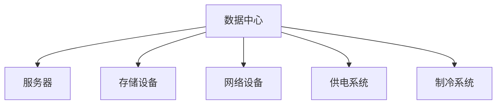

                 

## 文章标题

### AI大模型应用数据中心建设：数据中心标准与规范

**关键词：** AI大模型，数据中心，建设标准，规范，技术框架，计算资源，数据处理，安全性，运维管理

**摘要：** 本文详细探讨了AI大模型应用数据中心的建设，包括数据中心的设计原则、硬件设备选型、软件系统配置、计算架构、数据处理与存储、安全性与隐私保护、运营与管理等方面的内容。通过对核心概念、算法原理、项目实战的深入讲解，为读者提供了全面的数据中心建设指南，旨在推动AI大模型数据中心的发展和应用。

### 目录大纲

#### 第一部分：标准与规范概述

- **第1章 AI大模型应用数据中心概述**
  - **1.1 数据中心的基本概念**
  - **1.2 AI大模型数据中心的特点**
  - **1.3 AI大模型数据中心的作用**

- **第2章 数据中心设计原则**
  - **2.1 数据中心布局设计**
  - **2.2 能耗管理与优化**
  - **2.3 可靠性与容错性设计**

- **第3章 数据中心硬件设备选型**
  - **3.1 服务器与存储设备选型**
  - **3.2 网络设备选型**
  - **3.3 温控设备选型**

- **第4章 数据中心软件系统**
  - **4.1 操作系统选择**
  - **4.2 管理系统配置**
  - **4.3 监控与运维系统**

- **第5章 AI大模型计算架构**
  - **5.1 分布式计算架构**
  - **5.2 GPU与TPU计算资源**
  - **5.3 AI模型并行处理**

- **第6章 数据处理与存储**
  - **6.1 数据预处理**
  - **6.2 数据存储方案设计**
  - **6.3 数据备份与恢复策略**

- **第7章 安全性与隐私保护**
  - **7.1 数据中心安全架构**
  - **7.2 防火墙与入侵检测**
  - **7.3 数据加密与隐私保护**

- **第8章 数据中心运营与管理**
  - **8.1 运维流程优化**
  - **8.2 故障处理与应急预案**
  - **8.3 性能优化与资源调度**

- **第9章 案例研究**
  - **9.1 大型互联网公司的AI数据中心建设**
  - **9.2 金融行业的AI数据中心实践**
  - **9.3 制造业的AI数据中心部署**

- **第10章 未来发展趋势与挑战**
  - **10.1 AI大模型数据中心的发展趋势**
  - **10.2 面临的挑战与应对策略**
  - **10.3 未来展望**

- **附录**
  - **附录A 常用工具与技术概览**

---

现在我们将开始第一部分：标准与规范概述，逐步深入探讨AI大模型应用数据中心的相关概念、原则和标准。

## 第1章 AI大模型应用数据中心概述

### 1.1 数据中心的基本概念

**核心概念与联系**

数据中心（Data Center）是一个集中化设施，为组织提供计算、存储、网络和其他服务。它通常由一系列设备组成，包括服务器、存储设备、网络设备、制冷和供电系统等。其目的是为组织提供高效、可靠、安全的计算和存储环境。



**数据中心的作用**

数据中心的作用可以概括为以下几点：

1. **计算资源提供**：数据中心提供计算资源，包括服务器、GPU、TPU等，以支持数据分析和处理。
2. **数据存储**：数据中心提供大容量、高效能的存储解决方案，满足组织的存储需求。
3. **网络连接**：数据中心提供高速、稳定、安全的网络连接，确保数据传输和模型推理的效率。
4. **数据安全**：数据中心提供安全防护措施，包括防火墙、入侵检测、数据加密等，确保数据安全。
5. **环境控制**：数据中心提供稳定的温控和供电环境，确保设备正常运行。

**核心算法原理讲解**

数据中心的设计和运营涉及到多个核心算法和原理，包括网络拓扑设计、负载均衡、能耗优化等。以下是对这些算法原理的简单概述：

- **网络拓扑设计**：数据中心网络拓扑设计的目标是提供高可靠性、高带宽、低延迟的网络连接。常用的网络拓扑结构有环形、星形、混合形等。

  ```mermaid
  graph TB
  A[服务器A] --> B[服务器B]
  B --> C[服务器C]
  C --> D[服务器D]
  A --> E[核心交换机]
  B --> E
  C --> E
  D --> E
  ```

- **负载均衡**：负载均衡算法用于优化资源分配，确保数据中心内的设备负载均衡。常用的负载均衡算法有轮询、最小连接数、哈希等。

  ```python
  # Python伪代码：轮询负载均衡算法
  def round_robin(load_balance_list):
      for server in load_balance_list:
          if server.is_idle():
              return server
  ```

- **能耗优化**：能耗优化算法用于降低数据中心的能耗，提高能源利用效率。常见的能耗优化方法有设备休眠、动态功耗调节、冷却系统优化等。

  ```python
  # Python伪代码：设备休眠算法
  def power_saving/devices_shut_down(devices):
      for device in devices:
          if device.is_underload():
              device.sleep()
  ```

**数学模型和公式**

在数据中心设计过程中，涉及到多个数学模型和公式，用于计算能耗、负载均衡、性能优化等。以下是一个简单的能耗优化公式的例子：

\[ E = P \times t \]

其中，\( E \) 是能耗（单位：焦耳），\( P \) 是设备功率（单位：瓦特），\( t \) 是设备运行时间（单位：秒）。

**举例说明**

假设一个服务器每天运行24小时，功率为1000瓦特，那么这个服务器的日均能耗为：

\[ E = 1000 \times 24 \times 3600 = 86400000 \text{ 焦耳} \]

**项目实战**

为了更好地理解数据中心的基本概念，我们可以通过一个简单的项目实战来搭建一个最小规模的数据中心。

1. **硬件环境**：准备一台服务器、一个路由器和一台存储设备。
2. **软件环境**：安装Linux操作系统、Apache Web服务器和MySQL数据库。
3. **网络环境**：通过路由器将服务器和存储设备连接到互联网。

在项目实战中，我们可以通过以下步骤来实现：

1. **服务器配置**：安装Linux操作系统，配置SSH服务，确保安全。
2. **存储设备配置**：通过SMB或NFS共享存储，配置文件共享服务。
3. **Web服务器配置**：安装Apache Web服务器，配置HTTP服务。
4. **数据库配置**：安装MySQL数据库，配置数据库服务。

通过这个项目实战，我们可以深入了解数据中心的基本组成部分和配置方法。

**总结**

本章介绍了数据中心的基本概念、作用和核心算法原理，并通过举例说明和项目实战来加深理解。在后续章节中，我们将进一步探讨数据中心的硬件设备选型、软件系统配置、计算架构、数据处理与存储、安全性与隐私保护、运营与管理等方面的内容。

---

接下来，我们将继续探讨第2章：数据中心设计原则。

## 第2章 数据中心设计原则

### 2.1 数据中心布局设计

数据中心布局设计是数据中心建设的重要环节，它关系到数据中心的性能、可靠性和安全性。以下是数据中心布局设计的几个关键要素：

#### 2.1.1 数据中心物理布局

**场地选择**

- **地理位置**：选择地理位置优越、交通便利、电力供应稳定的地段。例如，远离地震带、洪水区等自然灾害高风险区域。
- **建筑结构**：选择符合抗震、防火、防水等要求的建筑结构，确保数据中心的物理安全。
- **电力供应**：确保数据中心有稳定的电力供应，可配备备用电源和UPS系统，以应对电力中断。

**内部布局**

- **服务器区**：放置服务器设备和存储设备，确保设备运行环境。应考虑通风、散热和电源供应。
- **网络设备区**：放置网络交换机、路由器等网络设备，确保网络稳定运行。
- **运维管理区**：设置运维人员办公区域，配备监控系统和运维工具。
- **冷却系统区**：设置冷却系统设备，确保数据中心内部温度适宜。

**网络布局**

- **内部网络**：设计高速、稳定、安全的内部网络，支持数据传输和模型推理。应采用冗余设计，确保网络可靠性。
- **外部网络**：与互联网和其他数据中心建立高效连接，确保数据访问和通信。应采用高性能网络设备，如MPLS、SD-WAN等。

#### 2.1.2 数据中心网络布局

**网络拓扑设计**

- **环形拓扑**：通过将网络设备连接成环形，实现数据的高速传输和冗余备份。
- **星形拓扑**：通过将网络设备连接到中心交换机，实现网络的集中管理和高可靠性。
- **混合形拓扑**：结合环形和星形拓扑的优点，实现更加灵活的网络布局。

**网络架构**

- **内部网络架构**：采用分层设计，包括核心层、分布层和接入层。核心层负责高速数据传输，分布层负责网络流量的分发，接入层负责终端设备的接入。
- **外部网络架构**：采用多路径传输，通过多个出口连接互联网，提高网络带宽和可靠性。

**网络设备选型**

- **交换机**：选择高性能、高可靠性的交换机，如Cisco、HPE、华为等品牌的产品。
- **路由器**：选择适合数据中心规模和业务需求的路由器，如MPLS路由器、SD-WAN路由器等。
- **防火墙**：选择具备高安全性能的防火墙，如Cisco ASA、Palo Alto Networks等。

#### 2.1.3 数据中心功能区域划分

**功能区域划分**

- **服务器区**：划分专门区域用于放置服务器设备，确保设备之间有足够的间距，便于散热和维护。
- **网络设备区**：划分区域用于放置网络设备，确保网络设备的布局合理，便于管理和维护。
- **运维管理区**：设置专门的办公区域，配备运维工具和设备，便于运维人员的工作。
- **冷却系统区**：划分区域用于放置冷却系统设备，确保冷却系统的布局合理，便于维护和优化。

**总结**

数据中心布局设计是数据中心建设的重要环节，涉及到场地选择、内部布局、网络布局和功能区域划分等方面。合理的布局设计可以确保数据中心的高性能、高可靠性和安全性，为AI大模型应用提供坚实的基础。

接下来，我们将探讨第2章的第二个关键要素：能耗管理与优化。

### 2.2 能耗管理与优化

能耗管理与优化是数据中心设计中的重要一环，直接关系到数据中心的运行成本和环保责任。以下是能耗管理与优化的几个关键要素：

#### 2.2.1 数据中心的能耗构成

数据中心的能耗主要由以下几部分构成：

1. **IT设备能耗**：包括服务器、存储设备、网络设备等IT设备的能耗。
2. **基础设施能耗**：包括空调、UPS、照明等基础设施的能耗。
3. **制冷能耗**：冷却系统的能耗，包括冷冻水系统、空气冷却系统等。

**能耗数据统计**

为了有效管理和优化能耗，数据中心需要对能耗数据进行统计和分析。常用的能耗统计方法包括：

- **实时监控**：通过能耗监测系统，实时监控数据中心的能耗数据，包括电表读数、设备功耗等。
- **能耗分析**：通过对能耗数据进行统计分析，找出能耗高值点，识别能耗异常。

**能耗数据报表**

数据中心应定期生成能耗数据报表，包括：

- **每日能耗报表**：记录每日能耗数据，便于监控能耗变化。
- **月度能耗报表**：记录每月能耗数据，分析能耗趋势和异常。
- **年度能耗报表**：记录年度能耗数据，评估能耗优化效果。

#### 2.2.2 数据中心能耗优化的方法

数据中心能耗优化可以通过以下方法实现：

1. **设备选型优化**：选择能效比高的设备，如高效率服务器、节能存储设备等，降低能耗。
2. **负载均衡**：合理分配负载，避免设备过载，提高设备利用效率。
3. **自动化管理**：采用自动化管理系统，实现能耗监控和优化。

**能耗优化策略**

数据中心能耗优化策略包括：

- **设备休眠策略**：根据设备负载情况，自动调整设备的工作状态，降低能耗。
- **功耗调节策略**：根据实时功耗数据，动态调整设备功耗，实现能耗优化。
- **冷却系统优化**：通过优化冷却系统的运行模式，降低制冷能耗。

**能耗优化工具**

数据中心能耗优化工具包括：

- **能耗监测工具**：如IBM Tivoli、HP OpenView等，用于实时监控能耗数据。
- **能耗分析工具**：如Nimsoft、VMware vCenter等，用于分析能耗数据，优化能耗。

**总结**

能耗管理与优化是数据中心设计中的重要一环，通过能耗数据统计、能耗优化方法和策略，可以有效地降低数据中心的能耗，提高能源利用效率，降低运行成本，实现绿色数据中心的建设。

接下来，我们将探讨第2章的第三个关键要素：可靠性与容错性设计。

### 2.3 可靠性与容错性设计

数据中心的可靠性和容错性设计是确保数据中心稳定运行、数据安全的重要保障。以下是可靠性与容错性设计的几个关键要素：

#### 2.3.1 数据中心可靠性的重要性

数据中心可靠性的重要性体现在以下几个方面：

1. **数据安全**：数据中心需要确保数据的安全性和完整性，防止数据丢失、损坏或泄露。
2. **系统稳定性**：数据中心需要确保系统的稳定性，减少故障和停机时间，提高业务连续性。
3. **业务连续性**：数据中心需要为关键业务提供连续的服务，确保业务不因故障而中断。

#### 2.3.2 数据中心容错性设计方法

数据中心容错性设计主要通过以下方法实现：

1. **冗余设计**：通过冗余设备、路径和系统，实现故障转移和恢复。冗余设计包括硬件冗余、软件冗余和链路冗余。
2. **故障检测与恢复**：实时检测系统故障，自动进行故障恢复，确保系统快速恢复。
3. **备份与恢复**：定期备份数据，确保在故障发生时能够快速恢复。

**冗余设计**

- **硬件冗余**：通过增加硬件设备冗余，实现设备故障时的自动切换。例如，双电源冗余、双硬盘冗余等。
- **软件冗余**：通过增加软件冗余，实现系统故障时的自动切换。例如，负载均衡、集群等。
- **链路冗余**：通过增加网络链路冗余，实现网络故障时的自动切换。例如，多路径传输、负载均衡等。

**故障检测与恢复**

- **实时检测**：通过监控系统实时检测系统故障，包括硬件故障、软件故障、网络故障等。
- **自动恢复**：在检测到故障时，自动进行故障恢复，包括切换冗余设备、重启系统等。

**备份与恢复**

- **数据备份**：定期备份数据，包括系统数据、应用程序数据等，确保在故障发生时能够快速恢复。
- **数据恢复**：在故障发生时，通过备份数据进行数据恢复，确保系统快速恢复。

**总结**

可靠性与容错性设计是数据中心设计中的重要一环，通过冗余设计、故障检测与恢复、备份与恢复等方法，可以确保数据中心的高可靠性和稳定性，为AI大模型应用提供坚实的基础。

接下来，我们将进入第3章：数据中心硬件设备选型。

## 第3章 数据中心硬件设备选型

### 3.1 服务器与存储设备选型

服务器与存储设备是数据中心的核心硬件设备，它们的选型直接影响到数据中心的性能、可靠性和扩展性。以下是服务器与存储设备选型的几个关键要素：

#### 3.1.1 服务器选型原则

**计算性能**

- **CPU**：选择计算性能强大的CPU，支持多核、高主频。
- **内存**：选择大容量内存，支持虚拟化和大数据处理。
- **GPU**：对于AI大模型应用，选择支持深度学习和并行计算的GPU。

**存储性能**

- **硬盘类型**：选择SSD硬盘，具有更高的读写速度和耐用性。
- **硬盘容量**：根据存储需求，选择合适的硬盘容量。

**可靠性**

- **品牌**：选择知名品牌的硬件设备，确保质量可靠。
- **冗余设计**：考虑设备的冗余设计，如双电源、热插拔硬盘等。

**扩展性**

- **I/O扩展**：选择支持更多I/O接口的设备，如PCIe、SATA等。
- **虚拟化支持**：选择支持虚拟化技术的服务器，提高资源利用效率。

**总结**

服务器选型原则主要包括计算性能、存储性能、可靠性和扩展性。根据AI大模型应用的需求，选择合适的服务器配置，确保数据中心的高性能和可靠性。

#### 3.1.2 存储设备选型原则

**存储类型**

- **磁盘阵列**：选择适合数据密集型应用的磁盘阵列，如DAS、NAS、SAN等。
- **分布式存储**：选择适合大规模数据存储和快速访问的分布式存储系统，如Ceph、GlusterFS等。

**容量与性能**

- **容量**：根据数据存储需求，选择合适的存储容量。
- **性能**：根据数据读写速度要求，选择性能足够的存储设备。

**可靠性**

- **RAID级别**：选择合适的RAID级别，确保数据安全。
- **冗余设计**：考虑存储设备的冗余设计，如冗余硬盘、冗余网络接口等。

**可扩展性**

- **集群扩展**：选择支持集群扩展的存储系统，提高存储容量和性能。
- **接口兼容性**：选择兼容性强、易于扩展的存储设备。

**总结**

存储设备选型原则主要包括存储类型、容量与性能、可靠性和可扩展性。根据数据存储和访问需求，选择合适类型的存储设备，确保数据中心的高性能和可靠性。

#### 3.1.3 主流服务器与存储设备介绍

**主流服务器**

- **传统服务器**：如Dell PowerEdge、HPE ProLiant、华为企业级服务器等。
  - **优势**：稳定性高、兼容性好、市场普及度高。
  - **适用场景**：企业级应用、云计算、大数据处理等。

- **云服务器**：如阿里云ECS、腾讯云CVM、华为云云服务器等。
  - **优势**：弹性伸缩、按需付费、便捷管理。
  - **适用场景**：开发测试、网站托管、在线应用等。

**主流存储设备**

- **磁盘阵列**：
  - **DAS**（直接附加存储）：适用于小规模数据存储，如Dell MD系列。
  - **NAS**（网络附加存储）：适用于文件共享和数据存储，如Synology、QNAP等。
  - **SAN**（存储区域网络）：适用于大规模数据存储和快速访问，如Dell EqualLogic、NetApp FAS等。

- **分布式存储**：
  - **Ceph**：开源分布式存储系统，适用于大规模数据存储和高可用性。
  - **GlusterFS**：开源分布式文件系统，适用于大规模数据存储和文件共享。

**总结**

主流服务器与存储设备包括传统服务器、云服务器、磁盘阵列和分布式存储系统。根据不同的应用需求和场景，选择合适的服务器和存储设备，确保数据中心的高性能和可靠性。

接下来，我们将探讨第3章的第二个关键要素：网络设备选型。

### 3.2 网络设备选型

网络设备选型是数据中心建设中的重要环节，它直接关系到数据中心的网络性能、可靠性和安全性。以下是网络设备选型的几个关键要素：

#### 3.2.1 网络设备选型原则

**性能**

- **带宽**：根据数据中心的带宽需求，选择合适的网络设备。例如，选择支持万兆以太网的网络设备。
- **吞吐量**：根据数据中心的吞吐量需求，选择性能足够的网络设备。
- **处理能力**：选择具备高处理能力的网络设备，支持高速数据传输和复杂协议处理。

**可靠性**

- **冗余设计**：选择支持冗余设计的网络设备，如冗余电源、冗余接口等。
- **故障恢复**：选择具备快速故障恢复功能的网络设备，如自动切换、快速收敛等。

**可扩展性**

- **模块化设计**：选择模块化设计的网络设备，支持扩展接口和功能模块。
- **协议支持**：选择支持多种网络协议和技术的网络设备，如MPLS、VXLAN等。

**管理性**

- **管理界面**：选择具备易用性管理界面的网络设备，便于日常管理和配置。
- **远程管理**：选择支持远程管理的网络设备，提高运维效率和灵活性。

**总结**

网络设备选型原则主要包括性能、可靠性、可扩展性和管理性。根据数据中心的网络需求，选择合适类型的网络设备，确保数据中心的高性能和可靠性。

#### 3.2.2 主流网络设备介绍

**交换机**

- **核心交换机**：如Cisco Nexus、HPE Aruba、华为S5700等。
  - **优势**：高性能、高可靠性、支持多种网络协议。
  - **适用场景**：数据中心核心网络、高性能计算环境等。

- **分布交换机**：如Cisco Catalyst、HPE OfficeConnect、华为S3700等。
  - **优势**：高密度、低成本、易管理。
  - **适用场景**：数据中心接入层、企业办公网络等。

**路由器**

- **高端路由器**：如Cisco ASR、Juniper MX、华为AR等。
  - **优势**：高性能、高可靠性、支持多协议。
  - **适用场景**：数据中心骨干网络、广域网连接等。

- **中低端路由器**：如Cisco ISR、Juniper JUNOS、华为AR等。
  - **优势**：多功能、易扩展、低成本。
  - **适用场景**：企业分支网络、远程接入等。

**防火墙**

- **硬件防火墙**：如Palo Alto Networks、Fortinet、Cisco ASA等。
  - **优势**：高性能、高安全性、支持多种安全功能。
  - **适用场景**：数据中心网络安全、企业网络安全等。

- **软件防火墙**：如Windows Defender Firewall、pfSense、OPNsense等。
  - **优势**：低成本、灵活性强、易于部署。
  - **适用场景**：个人用户、小型企业网络等。

**总结**

主流网络设备包括核心交换机、分布交换机、路由器和防火墙。根据数据中心的网络需求，选择合适类型的网络设备，确保数据中心的高性能和可靠性。

接下来，我们将探讨第3章的第三个关键要素：温控设备选型。

### 3.3 温控设备选型

温控设备选型是数据中心建设中确保设备正常运行的重要一环，它直接影响到数据中心的能耗、效率和设备寿命。以下是温控设备选型的几个关键要素：

#### 3.3.1 温控设备选型原则

**温度控制范围**

- **设备运行温度**：根据设备运行温度要求，选择合适的温控设备。通常服务器运行温度范围在20°C至25°C。
- **环境温度**：考虑数据中心环境温度，选择温控设备能够适应的环境温度范围。

**制冷能力**

- **设备功率**：根据数据中心设备功率，选择制冷能力足够的温控设备。
- **负载变化**：考虑数据中心负载变化，选择具有调节能力的温控设备。

**能耗**

- **能效比**：选择能效比高的温控设备，降低能耗。
- **运行费用**：考虑温控设备的运行费用，选择成本效益高的设备。

**可靠性**

- **品牌信誉**：选择知名品牌的温控设备，确保质量可靠。
- **维护成本**：考虑温控设备的维护成本，选择易于维护的设备。

**可扩展性**

- **模块化设计**：选择模块化设计的温控设备，支持扩展制冷模块。
- **远程监控**：选择支持远程监控的温控设备，提高运维效率和灵活性。

**总结**

温控设备选型原则主要包括温度控制范围、制冷能力、能耗、可靠性和可扩展性。根据数据中心的温度需求和运行条件，选择合适类型的温控设备，确保数据中心的高效运行和设备寿命。

#### 3.3.2 主流温控设备介绍

**空调**

- **离心式空调**：适用于大中型数据中心，制冷能力强，能效比高。
  - **优势**：制冷效率高、制冷量大、运行稳定。
  - **适用场景**：大型数据中心、高性能计算环境等。

- **活塞式空调**：适用于中小型数据中心，制冷能力适中，维护成本低。
  - **优势**：制冷能力适中、运行成本低、维护方便。
  - **适用场景**：中小型数据中心、企业办公网络等。

**冷却系统**

- **水冷系统**：通过水循环冷却设备，适用于大中型数据中心。
  - **优势**：制冷效率高、冷却效果好、运行稳定。
  - **适用场景**：大型数据中心、高性能计算环境等。

- **风冷系统**：通过风循环冷却设备，适用于中小型数据中心。
  - **优势**：制冷能力适中、安装方便、运行成本较低。
  - **适用场景**：中小型数据中心、企业办公网络等。

**温控设备**：如温控器、传感器等。
  - **优势**：实时监控数据中心温度，确保设备运行在最佳温度范围内。
  - **适用场景**：各类数据中心，用于温度监控和调节。

**总结**

主流温控设备包括离心式空调、活塞式空调、水冷系统和风冷系统。根据数据中心的规模和运行条件，选择合适类型的温控设备，确保数据中心的高效运行和设备寿命。

### 3.3.3 温控系统设计与实现

温控系统设计是实现数据中心设备正常运行的关键，以下是如何设计与实现温控系统的几个关键步骤：

**温度监控**

- **传感器布置**：在数据中心关键位置布置温度传感器，实时监测设备温度和环境温度。
- **数据采集**：通过数据采集系统，实时采集温度传感器数据，上传至监控系统。

**制冷系统**

- **空调配置**：根据设备功率和环境温度，配置合适的空调设备。例如，使用离心式空调或活塞式空调。
- **制冷方式**：选择合适的制冷方式，如水冷或风冷。水冷系统通过水循环冷却设备，风冷系统通过风循环冷却设备。

**温控策略**

- **温度设定**：根据设备运行温度要求，设定合适的温度范围，确保设备在最佳温度范围内运行。
- **自动调节**：通过温控设备自动调节制冷能力，确保温度稳定。例如，当环境温度升高时，空调制冷能力增强。

**数据分析和优化**

- **温度数据分析**：对温度数据进行统计分析，找出温度异常点和优化潜力。
- **策略调整**：根据温度数据分析结果，调整温控策略，优化温度控制效果。

**总结**

温控系统设计与实现包括温度监控、制冷系统和温控策略三个关键部分。通过科学设计和优化，确保数据中心设备在最佳温度范围内运行，提高设备寿命和运行效率。

## 第4章 数据中心软件系统

### 4.1 操作系统选择

数据中心操作系统（Data Center Operating System，DCOS）是数据中心的核心软件，它负责管理数据中心的硬件资源、运行应用程序和提供安全保护。选择合适的操作系统对于确保数据中心的高性能、可靠性和安全性至关重要。以下是数据中心操作系统选择的几个关键要素：

#### 4.1.1 操作系统在数据中心的作用

**资源管理**

- **服务器资源管理**：操作系统负责管理服务器资源，包括CPU、内存、硬盘和网络接口等。
- **存储资源管理**：操作系统管理存储资源，包括文件系统、存储网络和存储设备。
- **网络资源管理**：操作系统管理网络资源，包括网络接口、网络带宽和路由策略。

**系统服务**

- **数据库服务**：操作系统提供数据库服务，如MySQL、PostgreSQL等，支持数据存储和查询。
- **应用服务**：操作系统提供各种应用服务，如Web服务器、FTP服务器等，支持业务应用运行。
- **安全服务**：操作系统提供安全服务，如防火墙、入侵检测等，保障数据中心安全。

**用户管理**

- **用户权限控制**：操作系统提供用户权限控制，确保只有授权用户可以访问系统资源和数据。
- **用户认证**：操作系统提供用户认证机制，如密码认证、双因素认证等，保障用户身份安全。

#### 4.1.2 主流操作系统介绍

**Linux操作系统**

- **优势**：开源、社区支持强大、稳定性高。
- **适用场景**：适用于高性能计算、云计算、大数据处理等。
- **代表性操作系统**：Ubuntu、CentOS、Red Hat。

**Windows操作系统**

- **优势**：兼容性好、用户界面友好。
- **适用场景**：适用于企业级应用、软件开发等。
- **代表性操作系统**：Windows Server。

**其他操作系统**

- **AIX**：IBM开发的Unix操作系统，适用于大型企业和数据中心。
- **Solaris**：Sun Microsystems开发的Unix操作系统，适用于高性能计算和服务器环境。
- **z/OS**：IBM开发的操作系统，适用于大型企业级数据中心和商业应用。

#### 4.1.3 操作系统选型考虑因素

**性能需求**

- **计算性能**：根据数据中心计算需求，选择计算性能强的操作系统。
- **存储性能**：根据数据中心存储需求，选择存储性能高的操作系统。
- **网络性能**：根据数据中心网络需求，选择网络性能好的操作系统。

**兼容性**

- **硬件兼容性**：确保操作系统与数据中心硬件设备兼容。
- **软件兼容性**：确保操作系统与数据中心内应用程序兼容。

**安全性**

- **安全功能**：选择具备强大安全功能的操作系统，如防火墙、安全审计等。
- **安全更新**：选择提供定期安全更新的操作系统，确保系统安全。

**支持与服务**

- **技术支持**：选择提供强大技术支持的操作系统，确保在遇到问题时能够及时解决。
- **服务协议**：选择具有良好服务协议的操作系统，如定期维护、故障修复等。

### 4.2 管理系统配置

数据中心管理系统（Data Center Management System，DCMS）是数据中心的核心软件系统，它负责监控、管理、维护和优化数据中心的各种资源。合理的系统配置对于提高数据中心的管理效率和运行稳定性至关重要。以下是数据中心管理系统配置的几个关键要素：

#### 4.2.1 管理系统概述

数据中心管理系统主要包括以下几个功能模块：

- **设备监控**：实时监控数据中心设备状态，包括CPU、内存、硬盘、网络等。
- **资源管理**：管理数据中心资源，包括服务器、存储、网络等。
- **故障处理**：及时发现和处理设备故障，确保系统稳定运行。
- **安全管理**：提供安全策略，防止网络攻击和数据泄露。

#### 4.2.2 管理系统功能模块

**设备监控**

- **实时监控**：通过监控软件实时监控数据中心设备状态，包括CPU利用率、内存使用率、硬盘空间等。
- **告警管理**：设置告警阈值，当设备状态异常时自动发送告警通知，如邮件、短信等。

**资源管理**

- **资源分配**：根据业务需求，合理分配服务器、存储、网络等资源。
- **负载均衡**：通过负载均衡技术，优化资源利用效率，提高系统性能。

**故障处理**

- **故障检测**：通过监控系统实时检测设备故障，如硬盘故障、网络故障等。
- **故障处理**：根据故障类型，采取相应的故障处理措施，如重启系统、更换设备等。

**安全管理**

- **访问控制**：限制访问权限，确保只有授权人员可以访问系统资源。
- **安全审计**：实时监控系统操作日志，发现异常操作和潜在风险。

#### 4.2.3 管理系统配置方法

**硬件配置**

- **服务器配置**：根据数据中心计算需求，选择合适的CPU、内存、硬盘等硬件设备。
- **存储配置**：根据数据存储需求，选择合适的存储设备和文件系统。
- **网络配置**：根据网络需求，配置网络设备和网络接口。

**软件配置**

- **操作系统安装**：安装数据中心操作系统，如Linux、Windows Server等。
- **管理软件安装**：安装数据中心管理软件，如Nagios、Zabbix等。
- **安全软件安装**：安装安全软件，如防火墙、入侵检测等。

**网络配置**

- **IP地址分配**：配置数据中心设备的IP地址，确保网络通信。
- **子网划分**：根据业务需求，合理划分子网，提高网络性能。
- **网络策略配置**：配置网络策略，如访问控制列表、路由策略等。

**安全配置**

- **访问控制配置**：配置访问控制策略，限制对系统资源的访问。
- **防火墙配置**：配置防火墙规则，防止非法访问和攻击。
- **入侵检测配置**：配置入侵检测规则，监控网络和系统的异常行为。

### 4.3 监控与运维系统

数据中心监控与运维系统（Data Center Monitoring and Operations System，DCMOS）是数据中心的核心软件系统，它负责实时监控数据中心运行状态、处理故障和优化资源分配。高效的监控与运维系统对于确保数据中心稳定运行和提升管理效率至关重要。以下是数据中心监控与运维系统的主要功能和配置方法：

#### 4.3.1 监控与运维系统的概念

数据中心监控与运维系统主要包括以下几个部分：

- **监控系统**：实时监控数据中心设备状态，包括CPU、内存、硬盘、网络等。
- **运维系统**：负责数据中心设备的运维管理，包括故障处理、资源调度等。
- **日志系统**：记录系统运行日志，便于故障排查和性能优化。

#### 4.3.2 监控与运维系统功能

**监控系统**

- **实时监控**：通过监控软件实时监控数据中心设备状态，如CPU利用率、内存使用率、硬盘空间等。
- **性能监控**：监控服务器、存储、网络等设备的性能指标，如响应时间、吞吐量等。
- **告警管理**：设置告警阈值，当设备状态异常或性能指标超过阈值时，自动发送告警通知。

**运维系统**

- **故障处理**：及时发现和处理设备故障，如硬盘故障、网络故障等。
- **资源调度**：根据业务需求，动态调整资源分配，如虚拟机迁移、存储扩展等。
- **运维流程**：建立运维流程，包括故障处理流程、资源调度流程等，确保运维工作规范有序。

**日志系统**

- **日志记录**：记录系统运行日志，包括设备日志、操作日志、错误日志等。
- **日志分析**：分析日志数据，找出潜在问题和优化点。
- **日志告警**：根据日志分析结果，自动生成告警通知，提醒运维人员处理。

#### 4.3.3 监控与运维系统实现方案

**监控软件**

- **Nagios**：开源的监控系统，支持服务器、网络设备、应用服务等监控，提供丰富的插件和告警功能。
- **Zabbix**：开源的监控系统，支持大规模监控，提供Web界面、告警和报告功能。

**运维管理平台**

- **Ansible**：开源的自动化运维工具，支持配置管理、应用部署等，提供简明的 playbook 语法。
- **Puppet**：开源的配置管理工具，支持大规模系统配置和管理，提供声明式语言。
- **Chef**：开源的自动化工具，支持配置管理、应用部署等，提供 Ruby 语言脚本。

**日志管理工具**

- **ELK Stack**：开源的日志管理平台，包括 Elasticsearch、Logstash、Kibana，提供日志收集、存储、分析和可视化。
- **Graylog**：开源的日志管理平台，提供集中化的日志收集、分析和告警功能。

**总结**

数据中心监控与运维系统是确保数据中心稳定运行和提升管理效率的关键。通过选择合适的监控软件、运维管理平台和日志管理工具，建立完善的监控与运维系统，可以有效提高数据中心的管理水平和运行效率。

## 第5章 AI大模型计算架构

### 5.1 分布式计算架构

分布式计算架构（Distributed Computing Architecture）是一种通过多台计算机协同工作来完成大型计算任务的架构。在AI大模型应用中，分布式计算架构能够充分利用多台计算机的计算资源，提高计算效率和性能。以下是分布式计算架构的关键概念、设计原则和应用场景。

#### 5.1.1 分布式计算基本概念

**计算节点**

计算节点（Computational Node）是分布式计算架构中的基本单元，它可以是物理机或虚拟机。计算节点负责执行计算任务，通过分布式计算框架协调工作。

**任务调度**

任务调度（Task Scheduling）是指将大任务分解为多个小任务，并分配给不同的计算节点执行。任务调度的目标是优化计算资源的利用率，提高计算效率。

**数据通信**

数据通信（Data Communication）是计算节点之间交换数据的过程。高效的数据通信对于分布式计算至关重要，它决定了任务的执行速度和整体性能。

**容错机制**

容错机制（Fault Tolerance）是指分布式计算系统在计算节点发生故障时，能够自动切换到其他节点继续执行任务，确保计算任务的连续性和稳定性。

#### 5.1.2 分布式计算架构设计原则

**高可用性**

高可用性（High Availability）是指系统在出现故障时能够快速恢复，确保服务的连续性。分布式计算架构应具备高可用性，通过冗余设计、故障检测和自动切换等机制实现。

**高性能**

高性能（Performance）是指系统在处理大量数据时能够快速完成任务。分布式计算架构应设计高效的通信机制、任务调度策略和负载均衡方法，提高整体计算性能。

**可扩展性**

可扩展性（Scalability）是指系统在处理更多数据或任务时能够线性扩展。分布式计算架构应支持水平扩展，通过增加计算节点来提高系统处理能力。

**易管理性**

易管理性（Manageability）是指系统便于监控和管理。分布式计算架构应提供便捷的管理工具和接口，便于运维人员监控和管理计算节点。

#### 5.1.3 分布式计算框架介绍

**MapReduce**

MapReduce是由Google提出的分布式计算模型，适用于数据处理任务。MapReduce将大任务分解为Map和Reduce两个阶段，Map阶段对数据进行映射，Reduce阶段对映射结果进行归并。MapReduce具有高可用性、可扩展性和易管理性。

**Hadoop**

Hadoop是基于MapReduce的分布式计算框架，适用于大数据处理。Hadoop包括HDFS（分布式文件系统）和YARN（资源调度框架）两个核心组件。HDFS负责存储大数据，YARN负责资源调度和管理。

**Spark**

Spark是内存计算的分布式计算框架，适用于实时数据处理和分析。Spark具有高吞吐量、低延迟和易扩展性，支持多种编程语言，如Scala、Python和Java。

#### 5.1.4 应用场景

**大数据处理**

分布式计算架构适用于大数据处理，如搜索引擎、数据挖掘、机器学习等。通过分布式计算，能够快速处理海量数据，提高数据处理效率和准确性。

**机器学习**

机器学习中的大规模模型训练和推理需要大量计算资源。分布式计算架构能够将训练和推理任务分解为多个子任务，并行执行，提高计算效率。

**高性能计算**

分布式计算架构适用于高性能计算，如科学计算、金融计算、基因测序等。通过分布式计算，能够提高计算速度和精度，支持复杂计算任务。

**总结**

分布式计算架构是AI大模型应用中提高计算效率和性能的关键。通过合理设计分布式计算架构，选择合适的分布式计算框架，能够实现高效、可靠、可扩展的计算能力，为AI大模型应用提供强有力的支持。

### 5.2 GPU与TPU计算资源

在AI大模型应用中，GPU（图形处理单元）和TPU（张量处理单元）是两种重要的计算资源。它们具有高并行处理能力和低延迟，能够显著提高AI大模型的训练和推理效率。以下是GPU与TPU的基本概念、选型原则和应用场景。

#### 5.2.1 GPU与TPU基本概念

**GPU**

GPU（Graphics Processing Unit）是一种专门用于图形渲染的处理器，具有高度并行计算能力。近年来，GPU在AI领域得到广泛应用，成为AI大模型训练和推理的重要计算资源。

**TPU**

TPU（Tensor Processing Unit）是Google专门为深度学习任务设计的处理器。TPU具有优化的张量操作单元，能够显著提高深度学习模型的训练速度和效率。

#### 5.2.2 GPU与TPU选型原则

**计算性能**

- **GPU**：选择计算性能强大的GPU，如NVIDIA Tesla V100、A100等，支持深度学习和大数据处理。
- **TPU**：选择适合深度学习任务的TPU，如Google TPU v3、TPU v2等，具有优化的张量操作单元。

**功耗**

- **GPU**：考虑GPU的功耗，选择能效比高的GPU，降低能耗。
- **TPU**：TPU的功耗较低，通常不需要特别关注功耗问题。

**兼容性**

- **GPU**：确保GPU与现有系统兼容，包括硬件和软件层面。
- **TPU**：TPU通常与Google Cloud平台集成，确保与平台兼容。

**扩展性**

- **GPU**：选择支持扩展的GPU，如支持更多GPU卡槽的硬件平台，便于未来扩展。
- **TPU**：TPU通常作为单独的计算节点，扩展性较高。

#### 5.2.3 GPU与TPU计算资源管理

**资源调度**

- **GPU**：通过调度算法，合理分配GPU资源，避免资源浪费和过载。
- **TPU**：通过Google Cloud平台提供的TPU调度工具，实现TPU资源的动态分配和优化。

**负载均衡**

- **GPU**：通过负载均衡策略，确保GPU资源得到充分利用，避免单点过载。
- **TPU**：TPU资源通常自动负载均衡，无需额外配置。

**性能优化**

- **GPU**：通过优化GPU驱动程序、并行计算算法等，提高GPU性能。
- **TPU**：通过优化深度学习模型、TPU程序等，提高TPU性能。

#### 5.2.4 应用场景

**深度学习**

- **GPU**：适用于大规模深度学习模型的训练和推理，如图像识别、自然语言处理等。
- **TPU**：适用于大规模深度学习模型的训练和推理，如搜索引擎、推荐系统等。

**大数据处理**

- **GPU**：适用于大规模数据处理和分析，如数据挖掘、机器学习等。
- **TPU**：适用于大规模数据处理和分析，如搜索引擎、推荐系统等。

**高性能计算**

- **GPU**：适用于科学计算、金融计算等高性能计算任务。
- **TPU**：适用于科学计算、金融计算等高性能计算任务。

**总结**

GPU和TPU是AI大模型应用中重要的计算资源。通过合理选型和管理，能够充分发挥GPU和TPU的计算性能，提高AI大模型的训练和推理效率，为各类AI应用提供强有力的支持。

### 5.3 AI模型并行处理

在AI大模型应用中，并行处理是一种有效的计算优化方法，能够显著提高模型的训练和推理速度。并行处理通过将大任务分解为多个小任务，同时在不同计算资源上执行，实现计算任务的高效执行。以下是AI模型并行处理的基本概念、算法设计和实现方法。

#### 5.3.1 并行处理基本概念

**并行度**

并行度（Parallelism）是指将大任务分解为多个小任务的程度。高并行度意味着任务能够被更细粒度地分解，从而充分利用计算资源。

**任务分解**

任务分解（Task Decomposition）是将大任务分解为多个小任务的过程。通过任务分解，可以降低单个任务的复杂度，提高计算效率。

**数据通信**

数据通信（Data Communication）是任务之间交换数据的过程。高效的数据通信对于并行处理至关重要，它决定了任务的执行速度和整体性能。

**同步与异步**

同步（Synchronization）是指任务在执行过程中需要等待其他任务的完成。异步（Asynchronization）是指任务可以独立执行，无需等待其他任务。

#### 5.3.2 并行处理算法设计

**任务调度**

任务调度（Task Scheduling）是并行处理的核心算法，负责将任务分配给不同的计算资源。任务调度的目标是优化计算资源的利用率和整体计算性能。

- **静态调度**：根据预设规则，静态分配任务。例如，轮询调度、最小完成时间调度等。
- **动态调度**：根据实时负载和资源状况，动态调整任务分配。例如，动态负载均衡、自适应调度等。

**负载均衡**

负载均衡（Load Balancing）是确保计算资源得到充分利用的重要手段。通过负载均衡，可以避免某些计算资源过载，同时充分利用空闲资源。

- **均匀负载均衡**：将任务均匀分配到各个计算资源上。
- **非均匀负载均衡**：根据任务性质和资源状况，动态调整任务分配。

**并行算法**

并行算法（Parallel Algorithms）是针对并行处理的算法设计。常用的并行算法包括：

- **MapReduce**：由Google提出的分布式计算模型，适用于数据处理任务。Map阶段对数据进行映射，Reduce阶段对映射结果进行归并。
- **并行前向-后向传播**：适用于深度学习模型的并行训练。通过将输入数据和权重矩阵分解，实现模型的并行前向传播和后向传播。
- **并行梯度下降**：适用于大规模机器学习模型的训练。通过将数据集分解为多个子集，实现并行梯度下降。

#### 5.3.3 并行处理框架应用

**TensorFlow**

TensorFlow是Google开源的深度学习框架，支持并行处理。TensorFlow通过其内置的分布式计算引擎，支持模型训练和推理的并行化。

- **分布式训练**：通过多台GPU或TPU卡实现模型训练的并行化。通过参数服务器和worker节点，实现大规模模型的分布式训练。
- **分布式推理**：通过多台GPU或TPU卡实现模型推理的并行化。通过TensorFlow的分布式策略，实现推理任务的并行执行。

**PyTorch**

PyTorch是Facebook开源的深度学习框架，支持并行处理。PyTorch通过其分布式扩展库，支持模型的并行训练和推理。

- **分布式训练**：通过多台GPU卡实现模型训练的并行化。通过并行数据加载和并行梯度更新，实现大规模模型的分布式训练。
- **分布式推理**：通过多台GPU卡实现模型推理的并行化。通过并行数据加载和并行前向传播，实现大规模模型的分布式推理。

**总结**

AI模型并行处理是提高模型训练和推理速度的有效方法。通过合理设计并行处理算法和调度策略，利用分布式计算框架，可以显著提高AI大模型的应用性能。并行处理在深度学习和机器学习领域具有广泛的应用前景，为各类AI应用提供了强大的计算支持。

## 第6章 数据处理与存储

数据处理与存储是AI大模型应用数据中心建设的关键组成部分。数据处理涉及到数据采集、预处理、分析和存储，而存储则关注数据的持久化、备份和恢复。以下是关于数据处理与存储的详细介绍。

### 6.1 数据预处理

数据预处理是数据分析和机器学习模型训练的重要步骤。它的目标是清洗、转换和归一化数据，使其适合后续分析。

#### 6.1.1 数据预处理的重要性

- **数据清洗**：去除数据中的噪声和异常值，确保数据质量。
- **数据转换**：将数据格式转换为适合模型输入的格式。
- **数据归一化**：将不同量纲的数据转换为相同的量纲，便于计算。

#### 6.1.2 数据预处理方法

- **缺失值处理**：常见的处理方法包括填充缺失值（如平均值、中位数）或删除缺失数据。
- **异常值检测**：使用统计学方法或机器学习算法检测异常值，然后决定保留或删除。
- **数据转换**：将分类数据转换为数值数据，如使用独热编码（One-Hot Encoding）处理类别变量。
- **数据归一化**：使用标准化（Standardization）或归一化（Normalization）方法调整数据分布。

#### 6.1.3 数据预处理工具

- **Python**：Python是数据处理和机器学习的常用编程语言，具有丰富的数据处理库，如Pandas、NumPy、SciPy等。
- **Hadoop**：Hadoop是一个分布式数据处理平台，适用于大规模数据预处理。
- **Spark**：Spark是一个快速且通用的分布式计算框架，适用于大规模数据预处理和分析。

### 6.2 数据存储方案设计

数据存储方案设计是确保数据安全、可靠、高效存储的关键。一个有效的数据存储方案应考虑数据的容量、性能、可靠性、可扩展性和成本效益。

#### 6.2.1 数据存储基本概念

- **关系型数据库**：如MySQL、PostgreSQL，适用于结构化数据的存储和查询。
- **非关系型数据库**：如MongoDB、Redis，适用于非结构化数据和快速访问。
- **分布式存储系统**：如Ceph、HDFS，适用于大规模数据存储和分布式计算。

#### 6.2.2 数据存储方案设计原则

- **高可靠性**：确保数据不丢失，支持数据备份和恢复。
- **高性能**：支持快速数据读写，满足AI大模型处理需求。
- **可扩展性**：支持系统规模扩展，满足日益增长的数据需求。
- **成本效益**：在保证性能和可靠性的同时，降低存储成本。

#### 6.2.3 主流数据存储方案介绍

- **关系型数据库**：
  - **MySQL**：开源的关系型数据库，适用于中小规模数据存储。
  - **PostgreSQL**：开源的关系型数据库，适用于大规模数据存储。
- **非关系型数据库**：
  - **MongoDB**：开源的NoSQL数据库，适用于大规模数据存储。
  - **Redis**：开源的内存数据库，适用于快速数据读写。
- **分布式存储系统**：
  - **Ceph**：开源的分布式存储系统，适用于大规模数据存储和分布式计算。
  - **HDFS**（Hadoop Distributed File System）：适用于大规模数据存储和Hadoop生态系统。

### 6.3 数据备份与恢复策略

数据备份与恢复策略是确保数据安全性的重要措施。一个有效的备份策略应考虑数据的重要性、备份频率、备份方式、备份存储位置和恢复流程。

#### 6.3.1 数据备份策略

- **全备份**：备份所有数据，确保在数据丢失时能够完全恢复。
- **增量备份**：仅备份自上次备份以来新增或修改的数据，节省存储空间。
- **差异备份**：备份自上次全备份以来新增和修改的数据，减少备份次数。

#### 6.3.2 数据恢复策略

- **手动恢复**：通过备份文件手动恢复数据。
- **自动化恢复**：使用备份工具自动恢复数据。
- **多版本恢复**：支持恢复不同时间点的数据版本，提高数据恢复的灵活性。

#### 6.3.3 备份与恢复工具介绍

- **Bak**：开源的备份工具，支持多种备份策略。
- **Rsync**：开源的同步工具，支持数据备份和恢复。
- **Veeam**：商业备份与恢复工具，提供自动化备份和恢复功能。

### 6.4 数据处理与存储的核心技术

**数据处理**

- **流处理**：如Apache Kafka、Apache Flink，适用于实时数据处理。
- **批处理**：如Hadoop MapReduce、Apache Spark，适用于批量数据处理。
- **图处理**：如Neo4j、Apache Giraph，适用于图数据分析和处理。

**存储**

- **分布式文件系统**：如HDFS、Ceph，适用于大规模数据存储。
- **分布式数据库**：如Apache Cassandra、MongoDB，适用于分布式数据存储和查询。
- **NoSQL数据库**：如Redis、MongoDB，适用于快速数据访问和大规模数据存储。

### 6.5 总结

数据处理与存储是AI大模型应用数据中心建设的重要组成部分。通过合理的数据预处理、数据存储方案设计和备份与恢复策略，可以确保数据的安全、可靠、高效存储，为AI大模型的应用提供坚实的基础。

## 第7章 安全性与隐私保护

在AI大模型应用数据中心中，安全性与隐私保护是确保数据安全和用户隐私的核心问题。一个完善的安全架构和有效的安全策略对于数据中心的稳定运行和业务持续发展至关重要。以下是关于数据中心安全性与隐私保护的相关内容。

### 7.1 数据中心安全架构

数据中心安全架构是确保数据中心安全的基础，它包括物理安全、网络安全、系统和数据安全等多个方面。

#### 7.1.1 数据中心安全基本概念

- **物理安全**：包括门禁系统、视频监控、安全人员巡逻等，保护数据中心设备和设施不受物理威胁。
- **网络安全**：包括防火墙、入侵检测系统（IDS）、入侵防御系统（IPS）等，保护网络不受网络攻击。
- **系统和数据安全**：包括操作系统安全、应用程序安全、数据加密和访问控制等，保护系统资源和数据安全。

#### 7.1.2 数据中心安全架构设计

- **物理安全设计**：
  - **门禁系统**：使用智能卡、生物识别技术等，确保只有授权人员可以进入数据中心。
  - **视频监控**：在数据中心关键位置安装高清摄像头，实时监控数据中心内部情况。
  - **安全人员巡逻**：安排安全人员进行定期巡逻，确保数据中心设备安全。

- **网络安全设计**：
  - **防火墙**：设置防火墙规则，控制进出数据中心的网络流量，阻止非法访问。
  - **入侵检测系统**：实时监控网络流量，检测和报警潜在的网络攻击。
  - **入侵防御系统**：主动防御网络攻击，阻止攻击行为。

- **系统和数据安全设计**：
  - **操作系统安全**：定期更新操作系统和应用程序，安装安全补丁，确保系统漏洞得到及时修复。
  - **数据加密**：使用加密算法对敏感数据进行加密，确保数据在传输和存储过程中安全。
  - **访问控制**：设置访问控制策略，限制只有授权人员可以访问特定数据和系统资源。

### 7.2 防火墙与入侵检测

防火墙和入侵检测系统是数据中心网络安全的重要组件，它们共同作用，确保网络的安全性和可靠性。

#### 7.2.1 防火墙原理与配置

**防火墙原理**：
- **包过滤**：根据IP地址、端口号、协议等包头部信息，过滤进出网络的流量。
- **状态检测**：根据连接的状态信息，如TCP连接的三次握手和四次挥手，过滤流量。
- **应用层过滤**：根据应用层协议，如HTTP、FTP等，过滤流量。

**防火墙配置**：
- **基础配置**：设置防火墙规则，允许或拒绝特定类型的流量。
- **高级配置**：配置防火墙策略，如NAT（网络地址转换）、VPN（虚拟专用网络）等。

#### 7.2.2 入侵检测原理与配置

**入侵检测原理**：
- **异常检测**：检测网络流量中的异常行为，如流量突增、不常见的协议使用等。
- **误用检测**：检测已知的攻击模式和行为，如DDoS攻击、SQL注入等。

**入侵检测配置**：
- **传感器配置**：配置入侵检测传感器，采集网络流量数据。
- **规则配置**：配置入侵检测规则，定义检测哪些类型的攻击。

### 7.3 数据加密与隐私保护

数据加密和隐私保护是保护数据安全的重要手段，它确保数据在传输和存储过程中不被未授权访问。

#### 7.3.1 数据加密基本概念

- **对称加密**：使用相同的密钥进行加密和解密，如AES。
- **非对称加密**：使用不同的密钥进行加密和解密，如RSA。
- **混合加密**：结合对称加密和非对称加密，提高加密效率和安全性。

#### 7.3.2 数据加密方法

- **传输加密**：使用SSL/TLS协议对数据进行传输加密。
- **存储加密**：使用加密算法对存储在磁盘上的数据进行加密。

#### 7.3.3 隐私保护策略

- **数据匿名化**：通过去除或掩盖数据中的个人身份信息，确保数据隐私。
- **访问控制**：设置严格的访问控制策略，确保只有授权人员可以访问敏感数据。
- **数据备份与恢复**：定期备份数据，确保在数据泄露或丢失时能够恢复。
- **安全审计**：实时监控数据访问和操作，确保数据安全。

### 7.4 总结

数据中心安全性与隐私保护是确保数据安全和用户隐私的关键。通过设计完善的安全架构、配置防火墙和入侵检测系统、实施数据加密和隐私保护策略，可以确保数据中心的稳定运行和业务持续发展。

## 第8章 数据中心运营与管理

数据中心运营与管理是确保数据中心稳定运行和高效服务的重要环节。有效的运营管理策略和流程能够提高数据中心的服务质量，降低运维成本，提升运维效率。以下是关于数据中心运营与管理的详细内容。

### 8.1 运维流程优化

运维流程优化是提高数据中心运维效率的关键。通过合理的流程设计和优化，可以减少运维工作量，提高运维效率，确保数据中心稳定运行。

#### 8.1.1 运维流程概述

运维流程主要包括以下环节：

- **监控与报警**：实时监控数据中心设备状态，发现异常情况，及时报警。
- **故障处理**：及时发现和处理设备故障，确保系统稳定运行。
- **资源管理**：合理分配和管理数据中心资源，确保资源得到充分利用。
- **性能优化**：定期对数据中心性能进行分析和优化，提高系统性能。
- **安全管理**：实施严格的安全管理策略，确保数据中心安全。

#### 8.1.2 运维流程优化方法

- **自动化运维**：通过自动化工具和脚本，实现运维流程的自动化，减少手动操作，提高运维效率。
- **监控优化**：优化监控系统，提高监控数据的准确性和实时性，及时发现和处理异常。
- **故障处理流程**：制定详细的故障处理流程，确保故障处理快速、有效。
- **资源调度**：通过负载均衡和资源调度算法，优化资源分配，提高资源利用率。
- **性能优化**：定期进行性能测试和分析，找出性能瓶颈，采取优化措施。

#### 8.1.3 运维流程工具选型

- **监控工具**：如Zabbix、Nagios等，用于实时监控数据中心设备状态。
- **自动化工具**：如Ansible、Puppet等，用于自动化配置和管理。
- **运维管理平台**：如Microsoft System Center、AWS Management Console等，用于集中管理和监控。

### 8.2 故障处理与应急预案

故障处理和应急预案是确保数据中心稳定运行的重要措施。通过合理的故障处理流程和应急预案，可以在故障发生时快速响应，减少故障影响，确保业务连续性。

#### 8.2.1 故障处理原则

- **快速响应**：及时接收故障报告，迅速开展故障排查和处理。
- **精准定位**：通过监控数据和日志分析，准确确定故障原因。
- **快速修复**：采取有效措施，尽快修复故障，恢复系统正常运行。

#### 8.2.2 故障处理流程

故障处理流程主要包括以下步骤：

- **故障接收**：接收故障报告，记录故障信息。
- **故障分析**：分析故障原因，制定修复方案。
- **故障修复**：执行修复操作，确保故障得到解决。
- **故障总结**：总结故障处理过程，为后续故障处理提供参考。

#### 8.2.3 应急预案设计与实施

应急预案设计包括以下步骤：

- **应急预案编制**：根据数据中心的特点和潜在风险，制定详细的应急预案。
- **应急演练**：定期进行应急演练，检验应急预案的有效性。
- **应急响应**：在发生紧急情况时，按照应急预案进行响应。

应急响应主要包括以下内容：

- **应急启动**：迅速启动应急预案，组织应急队伍。
- **故障定位**：通过监控数据和日志分析，确定故障原因。
- **故障处理**：采取紧急措施，快速修复故障。
- **灾后处理**：总结应急响应过程，进行灾后评估和改进。

### 8.3 性能优化与资源调度

性能优化和资源调度是提高数据中心整体性能和资源利用率的重要手段。通过合理的性能优化策略和资源调度算法，可以提高数据中心的运行效率，降低运行成本。

#### 8.3.1 性能优化策略

- **负载均衡**：通过负载均衡策略，合理分配负载，避免设备过载，提高设备利用率。
- **缓存策略**：通过缓存策略，减少数据访问次数，提高系统响应速度。
- **性能监控**：定期进行性能监控，找出性能瓶颈，采取优化措施。

#### 8.3.2 资源调度算法

- **静态调度**：根据预设规则，静态分配资源。
- **动态调度**：根据实时监控数据，动态调整资源分配。
- **基于需求的调度**：根据业务需求，动态调整资源分配。

#### 8.3.3 性能优化工具

- **性能监控工具**：如New Relic、AppDynamics等，用于实时监控数据中心性能。
- **资源调度工具**：如Kubernetes、Docker等，用于容器化应用部署和资源调度。
- **自动化性能优化工具**：如APM（应用性能管理）、AWR（自动工作负载报告）等，用于自动化性能优化。

### 8.4 总结

数据中心运营与管理是确保数据中心稳定运行和高效服务的重要环节。通过优化运维流程、制定完善的故障处理和应急预案、实施性能优化和资源调度策略，可以提高数据中心的运营效率和服务质量，确保业务的连续性和可靠性。

### 第九章 案例研究

在本章中，我们将通过分析几个实际案例，深入探讨AI大模型应用数据中心的建设与实践。这些案例涵盖了不同行业和规模的数据中心建设，旨在为读者提供实用的经验和教训。

### 9.1 案例一：大型互联网公司的AI数据中心建设

**案例背景**

一家大型互联网公司，在业务快速发展的背景下，面临着计算资源需求急剧增加的挑战。为了确保业务的连续性和高效性，公司决定建设一个高性能、高可靠的AI数据中心。

**数据中心设计思路**

1. **硬件设备选型**：选择高性能的服务器、GPU加速卡和高速存储设备，确保计算和存储能力。
2. **网络架构设计**：采用高性能网络设备，构建高效、稳定的网络架构，支持大规模数据传输。
3. **温控系统设计**：设计先进的温控系统，确保设备运行在最佳温度范围内，降低能耗。
4. **安全架构设计**：部署防火墙、入侵检测系统和数据加密技术，确保数据安全和用户隐私。

**数据中心建设成果**

1. **硬件设备**：完成了高性能服务器、GPU加速卡和高速存储设备的部署，满足了业务需求。
2. **软件系统**：部署了操作系统、监控软件和运维管理平台，实现了自动化运维。
3. **安全防护**：建立了完善的网络安全防护体系，包括防火墙、入侵检测系统和数据加密技术。
4. **性能优化**：通过负载均衡和缓存策略，提高了数据中心的性能和响应速度。

**案例分析**

该案例展示了如何通过科学规划和合理设计，建设一个高性能、高可靠的AI数据中心。以下是一些关键经验：

1. **硬件设备选型**：根据业务需求，选择适合的硬件设备，确保计算和存储能力。
2. **网络架构设计**：采用高性能网络设备，提高数据传输速度和稳定性。
3. **温控系统设计**：先进的温控系统设计，确保设备运行在最佳温度范围内，降低能耗。
4. **安全架构设计**：建立完善的网络安全防护体系，确保数据安全和用户隐私。

### 9.2 案例二：金融行业的AI数据中心实践

**案例背景**


