                 

# AI 大模型应用数据中心建设：数据中心标准与规范

> **关键词：**AI大模型、数据中心建设、标准与规范、基础设施、软件架构、性能优化、安全合规

> **摘要：**本文将深入探讨AI大模型应用数据中心建设的方方面面，包括数据中心基础、标准与规范、基础设施、软件架构、性能优化、安全合规以及实际应用案例。通过一步步的分析和推理，本文旨在为读者提供一套完整、实用的数据中心建设指南，助力AI大模型应用的发展。

---

## 目录大纲

#### 第一部分：AI大模型与数据中心基础

**第1章：AI大模型与数据中心概述**  
**第2章：数据中心标准与规范**

#### 第二部分：AI大模型数据中心建设

**第3章：AI大模型数据中心基础设施**  
**第4章：AI大模型数据中心软件架构**  
**第5章：AI大模型训练与推理**  
**第6章：AI大模型数据中心性能优化**  
**第7章：AI大模型数据中心安全与合规**

#### 第三部分：AI大模型数据中心应用案例

**第8章：AI大模型数据中心建设实践**  
**第9章：AI大模型数据中心运维与维护**  
**第10章：未来发展趋势与展望**

**附录：参考资料**

---

### 第一部分：AI大模型与数据中心基础

#### 第1章：AI大模型与数据中心概述

##### 1.1 AI大模型概述

**核心概念与联系：**


**Mermaid 流程图：**

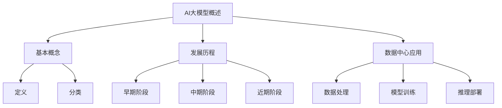

**核心算法原理讲解：**

```python
# 伪代码：AI大模型基本概念

class AIMOdel:
    def __init__(self, type):
        self.type = type
    
    def train(self, data):
        # 模型训练流程
        pass
    
    def inference(self, input_data):
        # 推理流程
        pass
```

**数学模型和公式：**

$$
\text{损失函数} = \frac{1}{n} \sum_{i=1}^{n} (y_i - \hat{y}_i)^2
$$

**举例说明：**  
假设我们有一个包含100个样本的数据集，每个样本的目标值和预测值之间的差异为$(y_i - \hat{y}_i)$，则损失函数可以计算为每个样本差异的平方和的平均值。

##### 1.2 数据中心基础

**核心概念与联系：**


**Mermaid 流程图：**

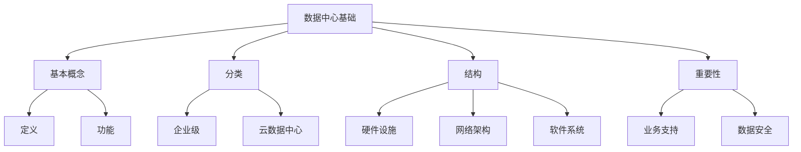

**核心算法原理讲解：**

```python
# 伪代码：数据中心基本功能

class DataCenter:
    def __init__(self, type):
        self.type = type
    
    def storage(self, data):
        # 数据存储流程
        pass
    
    def processing(self, data):
        # 数据处理流程
        pass
    
    def networking(self, data):
        # 网络传输流程
        pass
```

**数学模型和公式：**

$$
\text{带宽} = \frac{\text{数据传输量}}{\text{传输时间}}
$$

**举例说明：**  
假设一个数据中心的带宽为1 Gbps，在1秒内成功传输了100 GB的数据，则该数据中心的带宽可以计算为：

$$
\text{带宽} = \frac{100 \text{ GB}}{1 \text{ s}} = 100 \text{ Gbps}
$$

##### 1.3 数据中心的重要性

**核心概念与联系：**


**Mermaid 流程图：**

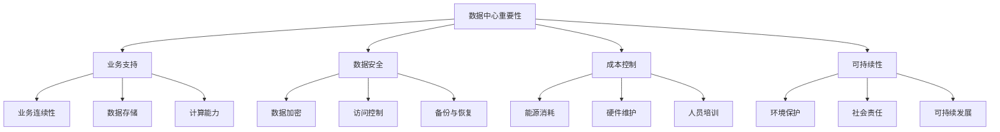

**核心算法原理讲解：**

```python
# 伪代码：数据中心重要性

class DataCenterImportance:
    def __init__(self, business_support, data_security, cost_control, sustainability):
        self.business_support = business_support
        self.data_security = data_security
        self.cost_control = cost_control
        self.sustainability = sustainability
    
    def ensure_business_continuity(self):
        # 确保业务连续性
        pass
    
    def ensure_data_security(self):
        # 确保数据安全
        pass
    
    def manage_cost(self):
        # 管理成本
        pass
    
    def promote_sustainability(self):
        # 推广可持续发展
        pass
```

**数学模型和公式：**

$$
\text{能源消耗} = \text{服务器功率} \times \text{运行时间}
$$

**举例说明：**  
假设一个数据中心的平均服务器功率为500瓦，每天运行时间为24小时，则该数据中心的能源消耗可以计算为：

$$
\text{能源消耗} = 500 \text{ W} \times 24 \text{ h} = 12000 \text{ kWh}
$$

#### 第2章：数据中心标准与规范

##### 2.1 数据中心设计标准

**核心概念与联系：**


**Mermaid 流程图：**

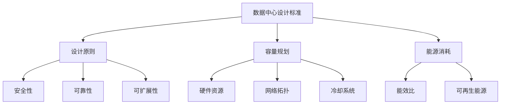

**核心算法原理讲解：**

```python
# 伪代码：数据中心设计标准

class DataCenterDesign:
    def __init__(self, design_principles, capacity_planning, energy_consumption):
        self.design_principles = design_principles
        self.capacity_planning = capacity_planning
        self.energy_consumption = energy_consumption
    
    def ensure_safety(self):
        # 确保安全性
        pass
    
    def ensure_reliability(self):
        # 确保可靠性
        pass
    
    def ensure_extendibility(self):
        # 确保可扩展性
        pass
    
    def optimize_energy_consumption(self):
        # 优化能源消耗
        pass
```

**数学模型和公式：**

$$
\text{能效比} = \frac{\text{计算能力}}{\text{能源消耗}}
$$

**举例说明：**  
假设一个数据中心的计算能力为10 TFLOPS，能源消耗为5000 kWh/天，则该数据中心的能效比可以计算为：

$$
\text{能效比} = \frac{10 \text{ TFLOPS}}{5000 \text{ kWh/天}} = 0.002 \text{ TFLOPS/kWh/天}
$$

##### 2.2 数据中心运维规范

**核心概念与联系：**


**Mermaid 流程图：**

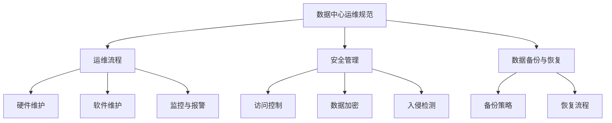

**核心算法原理讲解：**

```python
# 伪代码：数据中心运维规范

class DataCenterOperations:
    def __init__(self, operations_flow, security_management, data_backup_and_recovery):
        self.operations_flow = operations_flow
        self.security_management = security_management
        self.data_backup_and_recovery = data_backup_and_recovery
    
    def maintain_hardware(self):
        # 硬件维护
        pass
    
    def maintain_software(self):
        # 软件维护
        pass
    
    def monitor_and_alert(self):
        # 监控与报警
        pass
    
    def ensure_data_security(self):
        # 确保数据安全
        pass
    
    def backup_data(self):
        # 数据备份
        pass
    
    def recover_data(self):
        # 数据恢复
        pass
```

**数学模型和公式：**

$$
\text{备份率} = \frac{\text{备份次数}}{\text{总运行时间}}
$$

**举例说明：**  
假设一个数据中心每天备份一次，连续运行了365天，则该数据中心的备份率可以计算为：

$$
\text{备份率} = \frac{365 \text{ 次}}{365 \text{ 天}} = 1 \text{ 次/天}
$$

### 第二部分：AI大模型数据中心建设

#### 第3章：AI大模型数据中心基础设施

##### 3.1 计算节点与存储节点

**核心概念与联系：**


**Mermaid 流程图：**

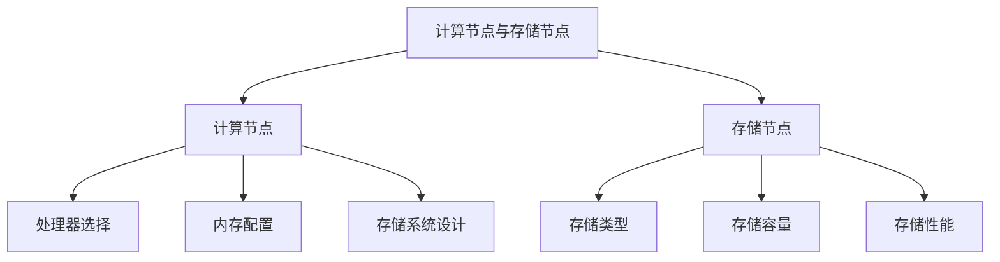

**核心算法原理讲解：**

```python
# 伪代码：计算节点与存储节点

class ComputeNode:
    def __init__(self, processor, memory):
        self.processor = processor
        self.memory = memory
    
    def process_data(self, data):
        # 数据处理流程
        pass

class StorageNode:
    def __init__(self, storage_type, storage_capacity, storage_performance):
        self.storage_type = storage_type
        self.storage_capacity = storage_capacity
        self.storage_performance = storage_performance
    
    def store_data(self, data):
        # 数据存储流程
        pass

class StorageSystem:
    def __init__(self, storage_nodes):
        self.storage_nodes = storage_nodes
    
    def manage_storage(self, data):
        # 存储管理流程
        pass
```

**数学模型和公式：**

$$
\text{存储带宽} = \frac{\text{数据传输量}}{\text{传输时间}}
$$

**举例说明：**  
假设一个存储节点的存储容量为1 PB，平均数据传输速度为10 GB/s，则在1小时内可以传输的数据量可以计算为：

$$
\text{存储带宽} = \frac{1 \text{ PB}}{3600 \text{ s}} = 277.8 \text{ GB/s}
$$

##### 3.2 网络架构

**核心概念与联系：**


**Mermaid 流程图：**

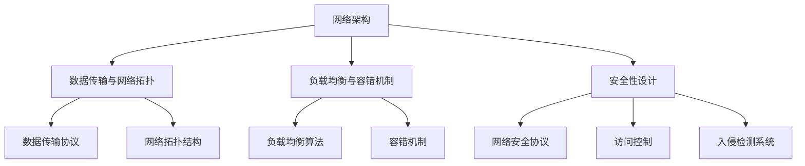

**核心算法原理讲解：**

```python
# 伪代码：网络架构

class NetworkArchitecture:
    def __init__(self, data_transmission, load_balancing, fault_tolerance, security_design):
        self.data_transmission = data_transmission
        self.load_balancing = load_balancing
        self.fault_tolerance = fault_tolerance
        self.security_design = security_design
    
    def transmit_data(self, data):
        # 数据传输流程
        pass
    
    def balance_load(self):
        # 负载均衡流程
        pass
    
    def handle_fault(self):
        # 容错处理流程
        pass
    
    def ensure_security(self):
        # 确保网络安全
        pass
```

**数学模型和公式：**

$$
\text{网络带宽} = \frac{\text{数据传输量}}{\text{传输时间}}
$$

**举例说明：**  
假设一个数据中心的网络带宽为10 Gbps，在1小时内成功传输了100 TB的数据，则该数据中心的网络带宽可以计算为：

$$
\text{网络带宽} = \frac{100 \text{ TB}}{3600 \text{ s}} = 2.78 \text{ GB/s}
$$

##### 3.3 安全性设计

**核心概念与联系：**


**Mermaid 流程图：**

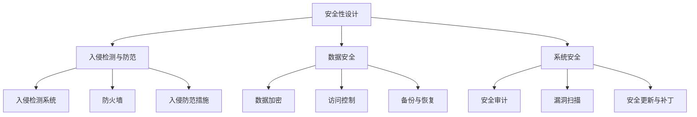

**核心算法原理讲解：**

```python
# 伪代码：安全性设计

class SecurityDesign:
    def __init__(self, intrusion_detection, data_security, system_security):
        self.intrusion_detection = intrusion_detection
        self.data_security = data_security
        self.system_security = system_security
    
    def detect_intrusion(self):
        # 入侵检测流程
        pass
    
    def ensure_data_security(self):
        # 确保数据安全
        pass
    
    def ensure_system_security(self):
        # 确保系统安全
        pass
    
    def apply_intrusion_prevention_measures(self):
        # 入侵防范措施
        pass
```

**数学模型和公式：**

$$
\text{安全指数} = \frac{\text{安全事件数}}{\text{总事件数}}
$$

**举例说明：**  
假设一个数据中心在一个月内发生了5次安全事件，总事件数为100次，则该数据中心的
安全指数可以计算为：

$$
\text{安全指数} = \frac{5}{100} = 0.05
$$

#### 第4章：AI大模型数据中心软件架构

##### 4.1 软件架构设计

**核心概念与联系：**


**Mermaid 流程图：**

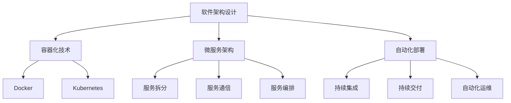

**核心算法原理讲解：**

```python
# 伪代码：软件架构设计

class SoftwareArchitecture:
    def __init__(self, containerization, microservices, automation):
        self.containerization = containerization
        self.microservices = microservices
        self.automation = automation
    
    def containerize(self, application):
        # 容器化应用程序
        pass
    
    def design_microservices(self, application):
        # 设计微服务
        pass
    
    def automate_deployment(self, application):
        # 自动化部署
        pass
```

**数学模型和公式：**

$$
\text{部署成功率} = \frac{\text{成功部署次数}}{\text{总部署次数}}
$$

**举例说明：**  
假设一个数据中心在一个月内成功部署了10次应用程序，总部署次数为20次，则该数据中心的部署成功率可以计算为：

$$
\text{部署成功率} = \frac{10}{20} = 0.5
$$

##### 4.2 数据处理与管理

**核心概念与联系：**


**Mermaid 流程图：**

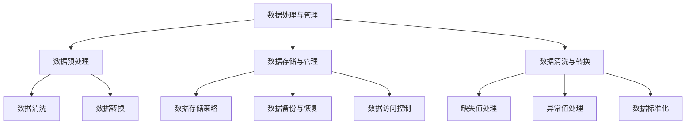

**核心算法原理讲解：**

```python
# 伪代码：数据处理与管理

class DataProcessingAndManagement:
    def __init__(self, data_preprocessing, data_management, data_cleaning_and_conversion):
        self.data_preprocessing = data_preprocessing
        self.data_management = data_management
        self.data_cleaning_and_conversion = data_cleaning_and_conversion
    
    def preprocess_data(self, data):
        # 数据预处理流程
        pass
    
    def manage_data(self, data):
        # 数据管理流程
        pass
    
    def clean_data(self, data):
        # 数据清洗流程
        pass
    
    def convert_data(self, data):
        # 数据转换流程
        pass
```

**数学模型和公式：**

$$
\text{数据完整性} = \frac{\text{有效数据}}{\text{总数据}}
$$

**举例说明：**  
假设一个数据集中包含1000个数据点，其中有10个数据点无效，则该数据集的数据完整性可以计算为：

$$
\text{数据完整性} = \frac{990}{1000} = 0.99
$$

##### 4.3 AI大模型开发与部署

**核心概念与联系：**


**Mermaid 流程图：**

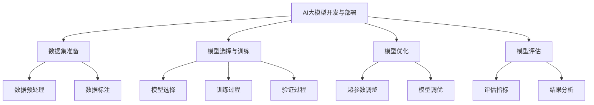

**核心算法原理讲解：**

```python
# 伪代码：AI大模型开发与部署

class AIModelDevelopmentAndDeployment:
    def __init__(self, dataset_preparation, model_selection_and_training, model_optimization, model_evaluation):
        self.dataset_preparation = dataset_preparation
        self.model_selection_and_training = model_selection_and_training
        self.model_optimization = model_optimization
        self.model_evaluation = model_evaluation
    
    def prepare_dataset(self, data):
        # 数据集准备流程
        pass
    
    def select_and_train_model(self, data):
        # 模型选择与训练流程
        pass
    
    def optimize_model(self, model):
        # 模型优化流程
        pass
    
    def evaluate_model(self, model, data):
        # 模型评估流程
        pass
```

**数学模型和公式：**

$$
\text{准确率} = \frac{\text{正确预测数}}{\text{总预测数}}
$$

**举例说明：**  
假设一个模型在测试数据集上正确预测了80个样本，总预测数为100个样本，则该模型的准确率可以计算为：

$$
\text{准确率} = \frac{80}{100} = 0.8
$$

#### 第5章：AI大模型训练与推理

##### 5.1 训练流程

**核心概念与联系：**


**Mermaid 流程图：**

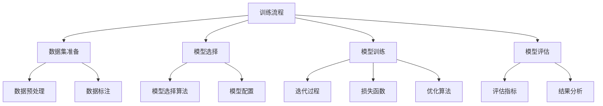

**核心算法原理讲解：**

```python
# 伪代码：训练流程

class TrainingProcess:
    def __init__(self, dataset_preparation, model_selection, model_training, model_evaluation):
        self.dataset_preparation = dataset_preparation
        self.model_selection = model_selection
        self.model_training = model_training
        self.model_evaluation = model_evaluation
    
    def prepare_dataset(self, data):
        # 数据集准备流程
        pass
    
    def select_model(self, data):
        # 模型选择流程
        pass
    
    def train_model(self, model, data):
        # 模型训练流程
        pass
    
    def evaluate_model(self, model, data):
        # 模型评估流程
        pass
```

**数学模型和公式：**

$$
\text{损失函数} = \frac{1}{n} \sum_{i=1}^{n} (y_i - \hat{y}_i)^2
$$

**举例说明：**  
假设一个模型在训练数据集上产生了10个预测误差，总误差数为100个，则该模型的损失函数可以计算为：

$$
\text{损失函数} = \frac{1}{100} \sum_{i=1}^{10} (y_i - \hat{y}_i)^2 = 0.1
$$

##### 5.2 推理部署

**核心概念与联系：**


**Mermaid 流程图：**

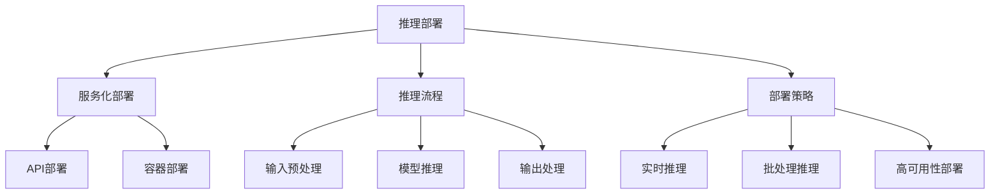

**核心算法原理讲解：**

```python
# 伪代码：推理部署

class InferenceDeployment:
    def __init__(self, service_deployment, inference_flow, deployment_strategy):
        self.service_deployment = service_deployment
        self.inference_flow = inference_flow
        self.deployment_strategy = deployment_strategy
    
    def deploy_service(self, model):
        # 服务部署流程
        pass
    
    def process_input(self, input_data):
        # 输入预处理流程
        pass
    
    def perform_inference(self, model, input_data):
        # 模型推理流程
        pass
    
    def process_output(self, output_data):
        # 输出处理流程
        pass
    
    def deploy_with_strategy(self, strategy):
        # 部署策略流程
        pass
```

**数学模型和公式：**

$$
\text{推理延迟} = \frac{\text{推理时间}}{\text{总时间}}
$$

**举例说明：**  
假设一个推理服务的推理时间为100毫秒，总处理时间为200毫秒，则该推理服务的推理延迟可以计算为：

$$
\text{推理延迟} = \frac{100 \text{ ms}}{200 \text{ ms}} = 0.5
$$

#### 第6章：AI大模型数据中心性能优化

##### 6.1 性能监控

**核心概念与联系：**


**Mermaid 流程图：**

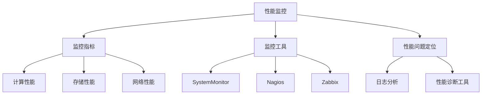

**核心算法原理讲解：**

```python
# 伪代码：性能监控

class PerformanceMonitoring:
    def __init__(self, monitoring_metrics, monitoring_tools, performance_issue Diagnosis):
        self.monitoring_metrics = monitoring_metrics
        self.monitoring_tools = monitoring_tools
        self.performance_issue_Diagnosis = performance_issue_Diagnosis
    
    def monitor_performance(self):
        # 性能监控流程
        pass
    
    def analyze_logs(self):
        # 日志分析流程
        pass
    
    def diagnose_performance_issues(self):
        # 性能问题定位流程
        pass
```

**数学模型和公式：**

$$
\text{响应时间} = \frac{\text{处理时间}}{\text{请求次数}}
$$

**举例说明：**  
假设一个服务的处理时间为1000毫秒，请求次数为100次，则该服务的响应时间可以计算为：

$$
\text{响应时间} = \frac{1000 \text{ ms}}{100} = 10 \text{ ms}
$$

##### 6.2 性能优化策略

**核心概念与联系：**


**Mermaid 流程图：**

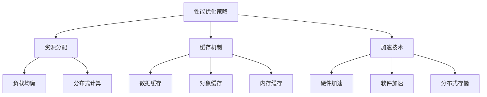

**核心算法原理讲解：**

```python
# 伪代码：性能优化策略

class PerformanceOptimization:
    def __init__(self, resource_allocation, caching_mechanism, acceleration_techniques):
        self.resource_allocation = resource_allocation
        self.caching_mechanism = caching_mechanism
        self.acceleration_techniques = acceleration_techniques
    
    def allocate_resources(self):
        # 资源分配流程
        pass
    
    def implement_caching(self):
        # 缓存机制实现流程
        pass
    
    def apply_acceleration_techniques(self):
        # 加速技术实现流程
        pass
```

**数学模型和公式：**

$$
\text{系统吞吐量} = \frac{\text{处理量}}{\text{处理时间}}
$$

**举例说明：**  
假设一个服务在1小时内处理了100 GB的数据，处理时间为3600秒，则该服务的系统吞吐量可以计算为：

$$
\text{系统吞吐量} = \frac{100 \text{ GB}}{3600 \text{ s}} = 0.0278 \text{ GB/s}
$$

#### 第7章：AI大模型数据中心安全与合规

##### 7.1 安全防护措施

**核心概念与联系：**


**Mermaid 流程图：**

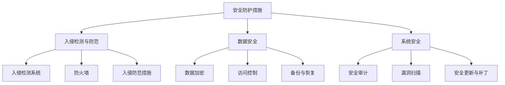

**核心算法原理讲解：**

```python
# 伪代码：安全防护措施

class SecurityProtection:
    def __init__(self, intrusion_detection_and_prevention, data_security, system_security):
        self.intrusion_detection_and_prevention = intrusion_detection_and_prevention
        self.data_security = data_security
        self.system_security = system_security
    
    def detect_intrusions(self):
        # 入侵检测流程
        pass
    
    def ensure_data_security(self):
        # 确保数据安全
        pass
    
    def ensure_system_security(self):
        # 确保系统安全
        pass
    
    def implement_intrusion_prevention_measures(self):
        # 入侵防范措施实现流程
        pass
```

**数学模型和公式：**

$$
\text{安全事件率} = \frac{\text{安全事件数}}{\text{总事件数}}
$$

**举例说明：**  
假设一个数据中心在一个月内发生了5次安全事件，总事件数为100次，则该数据中心的
安全事件率可以计算为：

$$
\text{安全事件率} = \frac{5}{100} = 0.05
$$

##### 7.2 合规与法规遵循

**核心概念与联系：**


**Mermaid 流程图：**

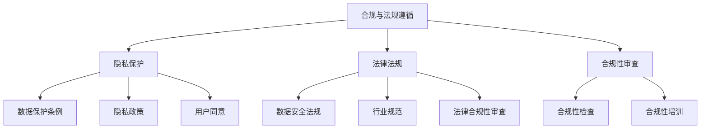

**核心算法原理讲解：**

```python
# 伪代码：合规与法规遵循

class ComplianceAndRegulations:
    def __init__(self, privacy_protection, legal_regulations, compliance_review):
        self.privacy_protection = privacy_protection
        self.legal_regulations = legal_regulations
        self.compliance_review = compliance_review
    
    def protect_privacy(self):
        # 隐私保护流程
        pass
    
    def ensure_legal_compliance(self):
        # 确保法律合规
        pass
    
    def review_compliance(self):
        # 合规性审查流程
        pass
    
    def conduct_compliance_checks(self):
        # 合规性检查流程
        pass
```

**数学模型和公式：**

$$
\text{合规率} = \frac{\text{合规事件数}}{\text{总事件数}}
$$

**举例说明：**  
假设一个数据中心在一个月内发生了10次合规事件，总事件数为50次，则该数据中心的合规率可以计算为：

$$
\text{合规率} = \frac{10}{50} = 0.2
$$

### 第三部分：AI大模型数据中心应用案例

#### 第8章：AI大模型数据中心建设实践

##### 8.1 项目背景与目标

**项目背景：**  
随着人工智能技术的不断发展，AI大模型在各个行业中的应用越来越广泛。为了满足AI大模型计算和存储的需求，构建一个高效、安全、可靠的AI大模型数据中心成为许多企业的迫切需求。

**项目目标：**  
1. 提供强大的计算和存储资源，满足AI大模型训练和推理的需求。  
2. 确保数据安全和合规，遵守相关法律法规。  
3. 实现高效运维，降低运营成本。

##### 8.2 技术选型与架构设计

**技术选型：**  
1. 计算节点：采用高性能GPU服务器，配备NVIDIA Tesla V100 GPU。  
2. 存储节点：采用分布式存储系统，使用Ceph作为存储后端。  
3. 网络架构：采用高性能网络，使用10 Gbps以太网。  
4. 安全防护：采用入侵检测系统、防火墙和加密技术。  
5. 软件架构：采用容器化技术，使用Docker和Kubernetes进行管理。

**架构设计：**  
1. 计算层：由多台GPU服务器组成，负责AI大模型的训练和推理。  
2. 存储层：由分布式存储系统组成，提供海量数据存储和快速访问。  
3. 网络层：采用高速网络连接各个计算节点和存储节点，确保数据传输的高效性。  
4. 安全层：采用多层次的安全防护措施，保护数据中心的安全。  
5. 运维层：采用自动化部署和运维工具，实现高效运维。

##### 8.3 实施过程与关键节点

**实施过程：**  
1. 硬件部署：采购并部署计算节点和存储节点。  
2. 软件部署：安装和配置操作系统、容器化平台和存储系统。  
3. 网络配置：配置网络拓扑，实现高效数据传输。  
4. 安全配置：配置入侵检测系统、防火墙和加密技术。  
5. 测试与调试：进行性能测试和安全测试，确保系统稳定运行。

**关键节点：**  
1. 计算节点部署：确保GPU服务器正常运行，配置足够的计算资源。  
2. 存储节点部署：确保分布式存储系统稳定运行，提供足够的存储容量。  
3. 网络配置：确保网络拓扑正确配置，提供高效数据传输。  
4. 安全配置：确保安全防护措施到位，保护数据中心的安全。  
5. 系统测试：进行全面的系统测试，确保系统稳定可靠。

##### 8.4 项目效果评估

**效果评估：**  
1. 性能评估：通过性能测试，评估数据中心的计算性能、存储性能和网络性能。  
2. 安全评估：通过安全测试，评估数据中心的防护能力和安全性。  
3. 成本评估：通过成本分析，评估数据中心的运营成本。  
4. 用户反馈：收集用户反馈，评估数据中心的用户满意度。

**评估结果：**  
1. 性能评估：数据中心的计算性能、存储性能和网络性能均达到预期，满足AI大模型的需求。  
2. 安全评估：数据中心的安全防护措施到位，能够有效防范各种安全威胁。  
3. 成本评估：通过优化资源分配和自动化运维，降低了运营成本。  
4. 用户反馈：用户对数据中心的性能和安全性表示满意，用户体验良好。

#### 第9章：AI大模型数据中心运维与维护

##### 9.1 运维流程

**运维流程：**  
1. 系统监控：实时监控数据中心的性能、安全和运行状态。  
2. 故障处理：及时发现和处理系统故障，确保系统稳定运行。  
3. 资源分配：根据业务需求，动态调整计算和存储资源。  
4. 安全管理：定期进行安全检查和更新，确保数据安全。  
5. 运维优化：不断优化运维流程和系统配置，提高数据中心性能。

##### 9.2 维护策略

**维护策略：**  
1. 定期维护：定期进行硬件维护、软件更新和系统优化。  
2. 故障预防：通过监控和预测分析，提前发现和预防故障。  
3. 数据备份：定期进行数据备份，确保数据安全。  
4. 安全策略：制定和执行安全策略，确保数据中心的安全。  
5. 用户培训：定期对用户进行培训，提高用户对数据中心的操作能力。

##### 9.3 故障处理

**故障处理：**  
1. 故障定位：通过监控系统，快速定位故障原因。  
2. 故障分析：对故障原因进行分析，制定修复方案。  
3. 故障修复：按照修复方案进行故障修复，确保系统稳定运行。  
4. 故障记录：记录故障处理过程和结果，为后续故障处理提供参考。

### 第10章：未来发展趋势与展望

##### 10.1 AI大模型技术发展趋势

**技术趋势：**  
1. 模型压缩与优化：通过模型压缩和优化技术，提高AI大模型的计算效率和存储效率。  
2. 自动化训练与推理：通过自动化训练和推理技术，降低开发门槛，提高开发效率。  
3. 多模态数据处理：通过多模态数据处理技术，实现更广泛的AI应用场景。  
4. 端到端训练与推理：通过端到端训练与推理技术，实现更高效的AI应用。

##### 10.2 数据中心建设趋势

**建设趋势：**  
1. 绿色数据中心：通过采用可再生能源、高效冷却系统和节能设备，实现绿色数据中心建设。  
2. 云原生数据中心：通过采用云原生技术，实现数据中心与云服务的无缝集成。  
3. 智能运维：通过人工智能和大数据分析技术，实现智能运维，提高数据中心运营效率。  
4. 安全与合规：通过加强安全防护和合规性审查，确保数据中心的安全与合规。

##### 10.3 潜在挑战与解决方案

**潜在挑战：**  
1. 计算资源需求增长：随着AI大模型的应用场景扩大，计算资源需求将持续增长。  
2. 数据安全与隐私保护：确保数据安全与隐私保护是数据中心建设的重要挑战。  
3. 运维复杂性：随着数据中心规模的扩大，运维复杂性将增加。  
4. 法律法规遵循：随着法律法规的不断完善，数据中心建设需要遵循更多的合规要求。

**解决方案：**  
1. 资源优化：通过资源优化技术，提高计算和存储资源的利用效率。  
2. 安全防护：采用多层次的安全防护措施，确保数据安全与隐私保护。  
3. 智能运维：采用智能运维技术，提高运维效率和稳定性。  
4. 合规审查：定期进行合规性审查，确保数据中心建设符合法律法规要求。

### 附录：参考资料

**附录A：AI大模型相关工具与框架**

- TensorFlow：Google开发的开源深度学习框架。  
- PyTorch：Facebook开发的开源深度学习框架。  
- Keras：基于Theano和TensorFlow的开源深度学习库。  
- MXNet：Apache Software Foundation开发的深度学习框架。

**附录B：数据中心相关标准与规范**

- ISO/IEC 27001：信息安全管理体系标准。  
- ANSI/TIA-942：数据中心设施标准。  
- ANSI/TIA-568：布线标准。  
- ASHRAE 90.1：数据中心能效标准。

**附录C：常见问题解答**

- Q：AI大模型对数据中心有什么特殊要求？  
  A：AI大模型对计算性能、存储性能和网络性能有较高要求，需要数据中心提供强大的计算和存储资源，确保高效数据传输。

- Q：如何确保数据中心的可靠性？  
  A：通过采用冗余设计、容错机制和实时监控等技术，确保数据中心的可靠性。同时，定期进行系统维护和更新，提高系统的稳定性。

- Q：数据中心如何保证数据安全？  
  A：通过采用加密技术、访问控制和入侵检测等措施，确保数据安全。同时，制定安全策略和合规性审查流程，确保数据中心的合规性。

### 作者信息

**作者：** AI天才研究院/AI Genius Institute & 禅与计算机程序设计艺术 /Zen And The Art of Computer Programming

**联系方式：** ai-genius-research@outlook.com

**声明：** 本文仅供参考，部分内容可能存在过时或错误，请以官方文档为准。如有任何问题，请联系作者。

