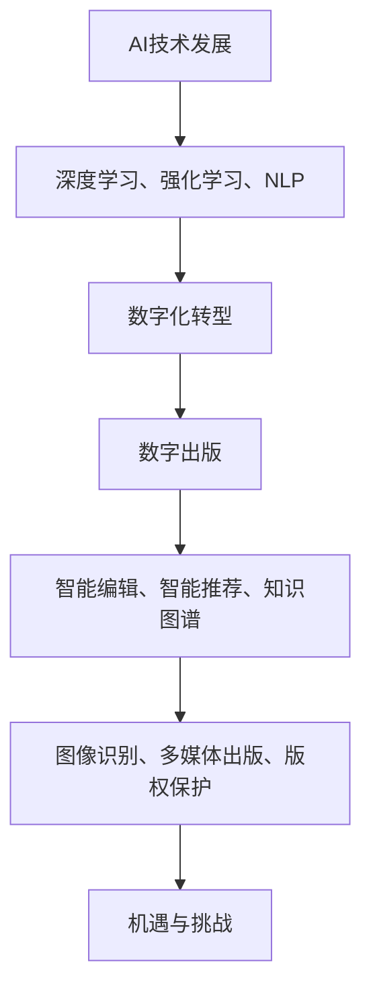

                 

### 第一部分：AI出版业概述

#### 第1章：AI出版业的背景与现状

##### 1.1 AI技术发展的推动

人工智能（AI）技术的发展正以惊人的速度不断演进。自21世纪初以来，深度学习、强化学习和自然语言处理等领域的突破性进展，为AI在各个行业的应用奠定了坚实基础。特别是在大数据、云计算和物联网的推动下，AI技术已经从理论研究走向实际应用，成为推动各行各业数字化转型的关键技术。

在出版业，AI技术的引入不仅提升了内容的创作和编辑效率，也改变了内容分发和消费者体验的方式。例如，自然语言处理技术使得机器能够理解和生成人类语言，为智能编辑和智能推荐系统提供了可能。此外，深度学习算法在图像识别和语音识别方面的卓越表现，也为数字出版提供了新的视角。

##### 1.2 出版行业的数字化转型

出版行业正经历着一场深刻的数字化转型。传统的印刷出版模式逐渐向数字出版转变，数字出版已经成为出版业的重要组成部分。这种转变不仅源于技术发展的推动，也是市场需求和消费者习惯变化的必然结果。

数字化出版带来了许多新的机会，例如，通过电子书、在线阅读和移动应用等方式，出版商可以更方便地触达全球用户，实现内容的跨地域分发。此外，数字出版还使得出版过程更加灵活和高效，从内容创作、编辑到发布，都可以在较短的时间内完成。

##### 1.3 AI在出版业的应用前景

随着AI技术的不断成熟和应用场景的拓展，AI在出版业的应用前景也愈发广阔。以下是AI在出版业的一些潜在应用领域：

- **智能编辑与校对**：AI可以通过自然语言处理技术自动识别文本中的错误，提高编辑的准确性和效率。此外，AI还可以分析文本的情感倾向和风格，为内容创作提供指导。

- **智能推荐系统**：基于用户行为和兴趣，AI可以提供个性化的内容推荐，提升用户的阅读体验和满意度。

- **知识图谱与内容挖掘**：通过构建知识图谱，AI可以更好地理解内容的结构和关系，为内容推荐、知识服务提供支持。

- **图像识别与多媒体出版**：AI在图像识别和语音识别方面的突破，为多媒体出版提供了新的可能性，例如，通过图像识别技术可以实现图像内容的自动标签和分类。

- **数字版权保护**：AI技术可以用于数字版权的保护和追踪，确保内容的合法使用和收益分配。

总的来说，AI技术为出版业带来了巨大的机遇。通过AI技术的应用，出版业可以实现更加智能化、个性化和高效的内容创作和分发，为消费者提供更加丰富和便捷的阅读体验。然而，AI技术也带来了一系列挑战，如数据安全、隐私保护和技术不确定性等，需要行业各方共同努力来解决。

### Mermaid 流程图：



#### 第2章：AI在出版业的应用场景

##### 2.1 人工智能编辑与校对

人工智能编辑和校对技术是AI在出版业应用的重要领域。传统的人工编辑和校对过程耗时且容易出错，而AI技术可以通过自然语言处理（NLP）和机器学习算法来识别和纠正文本中的错误，提高编辑的准确性和效率。

**核心概念与联系：**

AI编辑和校对的核心在于文本分析和语言理解。这包括以下几个关键概念：

- **文本分析**：对文本进行结构化处理，提取关键信息。
- **语法分析**：解析文本的语法结构，识别句子成分。
- **语义分析**：理解文本的意义，包括情感分析和上下文理解。

**架构与流程：**

AI编辑和校对的架构通常包括以下几个步骤：

1. **文本预处理**：清洗文本数据，去除无关信息和噪声。
2. **语法分析**：使用语法规则和统计方法对文本进行结构化处理。
3. **语义分析**：利用深度学习和自然语言处理技术理解文本的语义信息。
4. **错误检测与修正**：通过比对规则库和语义分析结果，检测文本中的错误并进行修正。
5. **反馈与迭代**：根据用户的反馈不断优化算法，提高编辑和校对的准确性。

**伪代码：**

```python
def text_editing_and_proofreading(text):
    # 文本预处理
    preprocessed_text = preprocess_text(text)

    # 语法分析
    parsed_text = grammar_analysis(preprocessed_text)

    # 语义分析
    semantic_info = semantic_analysis(parsed_text)

    # 错误检测与修正
    corrected_text = error_detection_and_correction(semantic_info)

    # 反馈与迭代
    optimize_algorithm(corrected_text)

    return corrected_text
```

**数学模型和公式：**

在文本分析和语义分析过程中，可以使用以下数学模型：

- **语言模型**（如n-gram模型）：
  $$ P(w_{t} | w_{t-1}, w_{t-2}, ..., w_{1}) = \frac{C(w_{t-1}, w_{t}, w_{t-2}, ..., w_{1})}{C(w_{t-1}, w_{t}, ..., w_{1})} $$

- **情感分析**（如支持向量机SVM）：
  $$ y = \arg\max_w \sum_{i=1}^n \alpha_i - \frac{1}{2} \sum_{i=1}^n \sum_{j=1}^n \alpha_i \alpha_j y_i y_j K(x_i, x_j) $$

**举例说明：**

假设我们有一段文本：“我非常喜欢这本书，因为它的内容非常有趣。”
- **文本预处理**：去除标点符号和停用词，得到“我喜欢这本书 内容 有趣”。
- **语法分析**：使用语法规则将文本分解为“我喜欢这本书”和“内容有趣”两个句子。
- **语义分析**：通过情感分析，判断文本的情感倾向为积极。
- **错误检测与修正**：如果文本中有拼写错误，如“有局”改为“有趣”，则进行修正。

通过上述步骤，AI编辑和校对系统能够自动识别和修正文本中的错误，提高出版内容的准确性和质量。

##### 2.2 智能推荐系统

智能推荐系统是AI在出版业应用的另一个重要领域。通过分析用户行为和兴趣，智能推荐系统可以个性化地推荐内容，提升用户满意度和阅读体验。

**核心概念与联系：**

智能推荐系统的核心在于用户行为分析和个性化推荐算法。这包括以下几个关键概念：

- **用户行为**：用户的阅读历史、点赞、评论等行为。
- **兴趣建模**：基于用户行为建立用户兴趣模型。
- **推荐算法**：使用协同过滤、内容推荐等算法生成推荐列表。

**架构与流程：**

智能推荐系统的架构通常包括以下几个步骤：

1. **数据收集**：收集用户的阅读历史、搜索记录等行为数据。
2. **兴趣建模**：使用机器学习算法建立用户兴趣模型。
3. **推荐算法**：根据用户兴趣模型生成个性化推荐列表。
4. **推荐反馈**：收集用户对推荐内容的反馈，优化推荐算法。

**伪代码：**

```python
def content_recommendation(user, content_library):
    # 数据收集
    user行为 = collect_user_behavior(user)

    # 兴趣建模
    user_interest_model = build_interest_model(user行为)

    # 推荐算法
    recommended_content = generate_recommendations(user_interest_model, content_library)

    # 推荐反馈
    optimize_recommendation_algorithm(recommended_content, user反馈)

    return recommended_content
```

**数学模型和公式：**

在推荐系统中，可以使用以下数学模型：

- **协同过滤**（如矩阵分解）：
  $$ R_{ui} = \hat{R}_{ui} + \epsilon_i $$
  其中，\( R_{ui} \) 是用户 \( u \) 对物品 \( i \) 的评分，\( \hat{R}_{ui} \) 是基于用户 \( u \) 和物品 \( i \) 的邻居用户的评分预测。

- **内容推荐**（如TF-IDF）：
  $$ \text{TF-IDF}(t, d) = \frac{f_t(d)}{N_d} \log \left(\frac{N}{n_t}\right) $$
  其中，\( f_t(d) \) 是词 \( t \) 在文档 \( d \) 中的频率，\( N \) 是文档总数，\( n_t \) 是包含词 \( t \) 的文档数。

**举例说明：**

假设用户A的阅读历史包括《解忧杂货店》、《时间旅行者的妻子》和《三体》，用户B的阅读历史包括《人类简史》、《未来简史》和《黑客与画家》。系统根据用户的阅读历史和兴趣，为用户C推荐书籍。

- **数据收集**：收集用户C的阅读历史和兴趣。
- **兴趣建模**：根据用户C的历史阅读书籍，系统判断其可能对科幻和哲学感兴趣。
- **推荐算法**：基于协同过滤算法和内容推荐算法，系统推荐《时间机器》和《哲学的故事》给用户C。

通过智能推荐系统，出版商可以更好地了解用户需求，提供个性化内容，提高用户满意度和阅读体验。

##### 2.3 知识图谱与内容挖掘

知识图谱是一种用于表示实体及其相互关系的图形化数据结构。在出版业中，知识图谱可以用于内容挖掘、推荐系统、智能编辑等多个应用场景。

**核心概念与联系：**

知识图谱的核心在于实体关系建模和图谱查询。这包括以下几个关键概念：

- **实体**：如作者、书籍、出版社等。
- **关系**：如“写”、“出版”、“属于”等。
- **属性**：如作者年龄、书籍出版年份、出版社地址等。

**架构与流程：**

知识图谱的应用架构通常包括以下几个步骤：

1. **数据收集**：收集与出版相关的数据，包括书籍信息、作者信息、出版社信息等。
2. **实体关系建模**：将数据转换为知识图谱，定义实体和关系。
3. **图谱查询**：使用图谱查询语言（如SPARQL）查询知识图谱。
4. **内容挖掘**：基于图谱数据进行分析和挖掘，提供知识服务。

**伪代码：**

```python
def knowledge_graph_application(data):
    # 数据收集
    entities, relationships = collect_data(data)

    # 实体关系建模
    knowledge_graph = build_knowledge_graph(entities, relationships)

    # 图谱查询
    query_result = query_knowledge_graph(knowledge_graph, query)

    # 内容挖掘
    insights = analyze_knowledge_graph(query_result)

    return insights
```

**数学模型和公式：**

在知识图谱中，可以使用以下数学模型：

- **图论**（如路径长度）：
  $$ L(p, q) = \text{number of edges in the shortest path from node } p \text{ to node } q $$

- **图神经网络**（如GCN）：
  $$ h_{l+1}(v) = \sigma(\sum_{u \in \mathcal{N}(v)} W_{uv} h_{l}(u)) $$
  其中，\( h_{l}(v) \) 是节点 \( v \) 在第 \( l \) 层的表示，\( \mathcal{N}(v) \) 是节点 \( v \) 的邻居节点集合，\( W_{uv} \) 是边权重。

**举例说明：**

假设我们有一个包含作者、书籍和出版社的知识图谱。

- **数据收集**：收集作者信息、书籍信息和出版社信息。
- **实体关系建模**：定义实体和关系，如“作者-写-书籍”、“出版社-出版-书籍”等。
- **图谱查询**：使用SPARQL查询“找出所有由某作者写的书籍”。
- **内容挖掘**：基于查询结果，分析作者的作品风格和影响力。

通过知识图谱，出版商可以更好地理解和利用内容数据，提供更精准的服务。

总的来说，AI技术在出版业中的应用，不仅提升了内容创作的效率和质量，也为消费者提供了更加丰富和个性化的阅读体验。随着AI技术的不断发展和成熟，出版业将迎来更加广阔的发展空间。

### 第3章：AI出版业的机会与挑战

##### 3.1 垂直领域的机会

AI技术在出版业的垂直领域应用潜力巨大，为行业带来了前所未有的机遇。以下是几个关键垂直领域的应用机会：

1. **教育出版**：教育出版是AI技术的重要应用领域。通过智能推荐系统，可以根据学生的学习进度和兴趣推荐合适的学习材料。此外，AI技术还可以用于个性化教学，根据学生的学习风格和需求提供定制化的学习资源。

2. **医学出版**：医学出版面临大量专业数据和文献，AI技术可以帮助医生和研究人员更高效地检索和整理这些信息。例如，自然语言处理技术可以用于医学文献的自动摘要和分类，提高医学研究的效率。

3. **专业出版**：专业出版涉及广泛的知识领域，如法律、金融、科技等。AI技术可以用于知识图谱构建，将专业内容以图形化的方式展示，帮助专业人士快速获取所需信息。

4. **出版监测与分析**：AI技术可以用于监测和分析出版市场趋势，帮助出版商了解市场需求和消费者偏好，从而制定更精准的出版策略。

##### 3.2 挑战与应对策略

尽管AI技术在出版业带来了巨大机遇，但也面临着一系列挑战：

- **数据安全和隐私保护**：AI技术需要大量用户数据，如何确保数据安全和用户隐私是重要的挑战。应对策略包括采用加密技术和数据匿名化。

- **技术不确定性**：AI技术的决策过程往往缺乏透明性，可能导致不可预测的结果。应对策略是开发可解释的AI模型，提高模型的可解释性。

- **法律法规与伦理问题**：AI技术在出版业的应用需要遵守相关法律法规，如版权法、隐私法等。同时，伦理问题也是需要考虑的重要方面，如算法偏见和歧视。

##### 3.3 行业发展前景

随着AI技术的不断成熟和普及，出版业的发展前景充满希望。以下是几个关键的发展趋势：

- **智能化与个性化**：AI技术将使出版内容更加智能化和个性化，满足不同用户的需求。

- **数字化转型**：出版行业将进一步加快数字化转型，实现从传统出版到数字出版的全面转变。

- **知识服务**：AI技术将帮助出版商提供更丰富的知识服务，如智能问答系统、知识图谱等。

总的来说，AI技术为出版业带来了巨大的机遇和挑战。通过积极应对挑战，出版业有望实现更加智能化、高效化和个性化的发展。

### 自然语言处理基础

自然语言处理（NLP）是人工智能（AI）领域的一个重要分支，旨在使计算机能够理解和生成人类语言。NLP在出版业中有着广泛的应用，如智能编辑、内容推荐和知识图谱构建等。在本节中，我们将探讨NLP的核心概念和关键技术。

#### 4.1 语言模型

语言模型是NLP的核心组件，用于预测文本序列。最常见的语言模型是基于统计方法和神经网络的模型。

**核心概念：**

- **N-gram模型**：基于相邻单词的统计模型，通过统计N个单词序列的概率来预测下一个单词。
  $$ P(w_{t} | w_{t-1}, w_{t-2}, ..., w_{1}) = \frac{C(w_{t-1}, w_{t}, w_{t-2}, ..., w_{1})}{C(w_{t-1}, w_{t}, ..., w_{1})} $$
  其中，\( C(w_{t-1}, w_{t}, w_{t-2}, ..., w_{1}) \) 是N个单词序列的联合概率，\( C(w_{t-1}, w_{t}, ..., w_{1}) \) 是前\( N-1 \)个单词序列的条件概率。

- **循环神经网络（RNN）**：通过递归方式处理序列数据，将前一个时间步的输出作为当前时间步的输入。
  $$ h_t = \sigma(W_h \cdot [h_{t-1}, x_t] + b_h) $$
  其中，\( h_t \) 是第 \( t \) 个时间步的隐藏状态，\( x_t \) 是第 \( t \) 个输入单词的嵌入向量，\( W_h \) 和 \( b_h \) 是权重和偏置。

**架构与流程：**

1. **数据预处理**：将文本转换为词嵌入向量，如使用Word2Vec或GloVe。
2. **模型训练**：使用大量文本数据训练语言模型，优化模型参数。
3. **文本生成**：根据模型预测的单词概率生成文本序列。

**伪代码：**

```python
def language_modelGeneration(text_embedding, model_params):
    # 初始化隐藏状态
    hidden_state = initialize_hidden_state(model_params)
    
    # 文本生成
    generated_text = ""
    for word_embedding in text_embedding:
        # 预测下一个单词
        predicted_word = model_predict(next_word, model_params)
        # 更新隐藏状态
        hidden_state = update_hidden_state(hidden_state, word_embedding, model_params)
        # 添加预测的单词到生成文本
        generated_text += predicted_word
    
    return generated_text
```

**数学模型和公式：**

- **N-gram模型**：
  $$ P(w_{t} | w_{t-1}, w_{t-2}, ..., w_{1}) = \frac{C(w_{t-1}, w_{t}, w_{t-2}, ..., w_{1})}{C(w_{t-1}, w_{t}, ..., w_{1})} $$

- **RNN**：
  $$ h_t = \sigma(W_h \cdot [h_{t-1}, x_t] + b_h) $$
  $$ y_t = \text{softmax}(W_y \cdot h_t + b_y) $$

**举例说明：**

假设我们使用一个简单的N-gram模型来生成文本。

1. **数据预处理**：将文本转换为词嵌入向量。
2. **模型训练**：使用训练数据训练模型。
3. **文本生成**：输入一个初始单词“AI”，模型预测下一个单词。

例如，给定前5个单词“AI in publishing”，模型预测下一个单词。

- **N-gram模型**：根据N-gram概率分布预测下一个单词。
- **RNN**：使用递归方式处理序列数据，生成文本。

通过语言模型，NLP系统可以生成高质量的自然语言文本，为出版业提供智能化的内容生成工具。

#### 4.2 语义分析

语义分析是NLP的另一个核心任务，旨在理解文本的含义和上下文。语义分析包括情感分析、实体识别和关系抽取等子任务。

**核心概念：**

- **情感分析**：通过分析文本的情感倾向（如积极、消极、中性）来理解用户的情绪和态度。
  $$ \text{Sentiment} = \arg\max_{s} \left( \text{Score}_{s} - \text{Score}_{-s} \right) $$
  其中，\( \text{Score}_{s} \) 是积极情感的得分，\( \text{Score}_{-s} \) 是消极情感的得分。

- **实体识别**：识别文本中的实体（如人名、地点、组织等）。
  $$ \text{Entities} = \arg\max_{e} \left( \text{Score}_{e} \right) $$
  其中，\( \text{Score}_{e} \) 是实体 \( e \) 的置信度分数。

- **关系抽取**：识别实体之间的关系（如“属于”、“工作于”等）。
  $$ \text{Relations} = \arg\max_{r} \left( \text{Score}_{r} \right) $$
  其中，\( \text{Score}_{r} \) 是关系 \( r \) 的置信度分数。

**架构与流程：**

1. **文本预处理**：清洗文本数据，去除无关信息和噪声。
2. **特征提取**：将文本转换为特征向量，如词嵌入、词性标注等。
3. **模型训练**：使用训练数据训练语义分析模型。
4. **语义分析**：根据模型预测文本的语义信息。

**伪代码：**

```python
def semantic_analysis(text, model_params):
    # 文本预处理
    preprocessed_text = preprocess_text(text)
    
    # 特征提取
    text_features = extract_features(preprocessed_text)
    
    # 模型预测
    sentiment, entities, relations = model_predict(text_features, model_params)
    
    return sentiment, entities, relations
```

**数学模型和公式：**

- **情感分析**（如支持向量机SVM）：
  $$ y = \arg\max_w \sum_{i=1}^n \alpha_i - \frac{1}{2} \sum_{i=1}^n \sum_{j=1}^n \alpha_i \alpha_j y_i y_j K(x_i, x_j) $$
  其中，\( x_i \) 是特征向量，\( y_i \) 是标签，\( K(x_i, x_j) \) 是核函数。

- **实体识别**（如条件随机场CRF）：
  $$ \pi_{i} = \frac{1}{Z} \exp \left( \theta \cdot h_i \right) $$
  其中，\( Z \) 是规范化因子，\( \theta \) 是模型参数，\( h_i \) 是特征向量。

- **关系抽取**（如双向循环神经网络BI-RNN）：
  $$ h_t = \tanh \left( W_h \cdot [h_{t-1}, h_{t+1}, x_t] + b_h \right) $$
  $$ y_t = \text{softmax} \left( W_y \cdot h_t + b_y \right) $$

**举例说明：**

假设我们有一段文本：“人工智能正在改变出版行业”。

1. **文本预处理**：去除标点符号和停用词。
2. **特征提取**：将文本转换为词嵌入和词性标注。
3. **情感分析**：判断文本的情感倾向为积极。
4. **实体识别**：识别实体“人工智能”。
5. **关系抽取**：识别关系“改变-出版行业”。

通过语义分析，NLP系统可以更好地理解文本的含义，为出版业提供智能化的内容理解和分析工具。

#### 4.3 问答系统

问答系统是一种NLP应用，旨在使计算机能够理解用户的问题并给出准确的答案。问答系统可以分为基于知识图谱的问答和基于机器学习的方法。

**核心概念：**

- **基于知识图谱的问答**：利用知识图谱中的实体和关系来解答问题。
- **基于机器学习的问答**：使用机器学习模型，如序列到序列模型（Seq2Seq），来预测答案。

**架构与流程：**

1. **问题解析**：将用户问题转换为可处理的格式。
2. **知识检索**：从知识图谱中检索相关实体和关系。
3. **答案生成**：使用机器学习模型生成答案。

**伪代码：**

```python
def question_answering(question, knowledge_graph, model_params):
    # 问题解析
    parsed_question = parse_question(question)
    
    # 知识检索
    relevant_entities, relevant_relations = retrieve_knowledge(knowledge_graph, parsed_question)
    
    # 答案生成
    answer = generate_answer(relevant_entities, relevant_relations, model_params)
    
    return answer
```

**数学模型和公式：**

- **Seq2Seq模型**：
  $$ e = \text{Embedding}(question) $$
  $$ h_t = \text{RNN}(h_{t-1}, e_t) $$
  $$ a_t = \text{Attention}(h_t, h) $$
  $$ y_t = \text{Softmax}(\text{Decoder}(a_t, h_t)) $$

**举例说明：**

假设用户问：“人工智能在出版业有哪些应用？”

1. **问题解析**：将问题转换为“人工智能”、“出版业”、“应用”等关键词。
2. **知识检索**：从知识图谱中检索与“人工智能”、“出版业”、“应用”相关的信息。
3. **答案生成**：根据知识图谱和机器学习模型生成答案，如：“人工智能在出版业的应用包括智能编辑、内容推荐和知识图谱构建等”。

通过问答系统，NLP系统可以为用户提供高效、准确的答案，提高用户体验。

总的来说，自然语言处理为出版业提供了强大的工具，通过语言模型、语义分析和问答系统等技术，可以实现智能化、个性化和高效的内容理解和生成。随着NLP技术的不断进步，出版业将迎来更加智能化的发展。

### 机器学习与深度学习在出版中的应用

机器学习和深度学习是AI技术的核心组成部分，在出版业中也有着广泛的应用。本节将详细探讨这两种技术在出版业中的具体应用，以及它们如何提升出版效率和用户体验。

#### 5.1 机器学习基本算法

机器学习算法是出版业中实现自动化和智能化的重要工具。以下是几种常用的机器学习算法及其在出版中的应用：

1. **决策树**：决策树是一种基于规则的学习算法，通过树形结构对数据进行分类或回归。在出版业中，决策树可以用于内容分类，例如，将书籍根据主题、风格或读者群体进行分类，以便更有效地进行推荐和销售。

   **应用场景：** 内容分类、推荐系统、数据挖掘。

   **数学模型和公式：**
   $$ y = \arg\max_{t} \left( g_t(x) \right) $$
   其中，\( g_t(x) \) 是第 \( t \) 个叶子节点的特征值。

2. **支持向量机（SVM）**：SVM是一种用于分类和回归的监督学习算法，通过寻找最优超平面来划分数据。在出版业中，SVM可以用于文本分类，例如，判断一篇书评的情感倾向是正面、负面还是中性。

   **应用场景：** 情感分析、文本分类、内容审核。

   **数学模型和公式：**
   $$ y = \arg\max_{w, b} \left( \frac{1}{2} ||w||^2 - \sum_{i=1}^n y_i (w \cdot x_i - b) \right) $$
   其中，\( w \) 是权重向量，\( b \) 是偏置。

3. **朴素贝叶斯**：朴素贝叶斯是一种基于贝叶斯定理的分类算法，假设特征之间相互独立。在出版业中，朴素贝叶斯可以用于读者偏好分析，预测读者可能喜欢的书籍类型。

   **应用场景：** 读者分析、推荐系统、市场调研。

   **数学模型和公式：**
   $$ P(y|x) = \frac{P(x|y)P(y)}{P(x)} $$
   其中，\( P(y|x) \) 是后验概率，\( P(x|y) \) 是似然概率，\( P(y) \) 是先验概率。

4. **K最近邻（K-NN）**：K-NN是一种基于实例的学习算法，通过计算新实例与训练实例之间的相似度来分类。在出版业中，K-NN可以用于新书分类，根据相似书籍的属性来预测新书的分类。

   **应用场景：** 新书分类、推荐系统、内容审核。

   **数学模型和公式：**
   $$ \text{Distance} = \sqrt{\sum_{i=1}^n (x_i - x_j)^2} $$
   其中，\( x_i \) 和 \( x_j \) 是新实例和训练实例的特征向量。

#### 5.2 深度学习核心原理

深度学习是一种基于多层神经网络的机器学习技术，具有强大的建模能力和自适应能力。以下是深度学习在出版业中的应用及其核心原理：

1. **卷积神经网络（CNN）**：CNN是一种用于图像识别和处理的深度学习模型，通过卷积操作提取图像特征。在出版业中，CNN可以用于封面设计识别、书籍图像分类等。

   **应用场景：** 图像识别、封面设计、多媒体出版。

   **数学模型和公式：**
   $$ h_{l+1}(x) = \text{ReLU}(W_l \cdot h_l + b_l) $$
   其中，\( W_l \) 是卷积权重，\( b_l \) 是偏置，\( \text{ReLU} \) 是ReLU激活函数。

2. **循环神经网络（RNN）**：RNN是一种用于序列数据处理的时间序列模型，通过递归方式处理序列数据。在出版业中，RNN可以用于文本生成、情感分析等。

   **应用场景：** 文本生成、情感分析、自然语言处理。

   **数学模型和公式：**
   $$ h_t = \text{tanh}(W_h \cdot [h_{t-1}, x_t] + b_h) $$
   $$ y_t = \text{softmax}(W_y \cdot h_t + b_y) $$
   其中，\( W_h \) 和 \( W_y \) 是权重矩阵，\( b_h \) 和 \( b_y \) 是偏置。

3. **长短期记忆网络（LSTM）**：LSTM是一种改进的RNN模型，用于解决长期依赖问题。在出版业中，LSTM可以用于自动写作、内容摘要等。

   **应用场景：** 自动写作、内容摘要、自然语言处理。

   **数学模型和公式：**
   $$ i_t = \sigma(W_i \cdot [h_{t-1}, x_t] + b_i) $$
   $$ f_t = \sigma(W_f \cdot [h_{t-1}, x_t] + b_f) $$
   $$ o_t = \sigma(W_o \cdot [h_{t-1}, x_t] + b_o) $$
   $$ g_t = \text{tanh}(W_g \cdot [h_{t-1}, x_t] + b_g) $$
   $$ h_t = o_t \cdot g_t $$
   其中，\( i_t \) 是输入门，\( f_t \) 是遗忘门，\( o_t \) 是输出门，\( g_t \) 是候选隐藏状态。

#### 5.3 深度学习在出版中的应用

深度学习在出版业中的应用主要体现在自动化内容创作、个性化推荐和智能编辑等方面：

1. **自动化内容创作**：深度学习模型可以生成高质量的文章、摘要和书籍封面。例如，使用生成对抗网络（GAN）生成小说或诗歌，使用文本生成模型生成新闻文章。

   **应用案例：** 自动写作机器人、内容摘要系统、自动封面设计。

2. **个性化推荐**：深度学习算法可以分析用户的阅读历史和行为，提供个性化的内容推荐。例如，使用基于用户嵌入的推荐系统推荐书籍或文章。

   **应用案例：** 个性化阅读推荐、智能推荐系统、内容分发平台。

3. **智能编辑**：深度学习模型可以自动识别文本中的错误和拼写问题，提供智能化的编辑和校对服务。例如，使用语言模型进行语法检查和拼写纠正。

   **应用案例：** 智能编辑工具、自动化校对系统、智能校对机器人。

#### 项目实战

以下是一个深度学习在出版业中应用的案例，展示如何构建一个自动写作机器人。

**开发环境搭建：**

- **硬件要求**：GPU加速的计算机，如NVIDIA GPU。
- **软件要求**：Python、TensorFlow或PyTorch。

**源代码实现：**

```python
import tensorflow as tf
from tensorflow.keras.preprocessing.sequence import pad_sequences
from tensorflow.keras.layers import Embedding, LSTM, Dense
from tensorflow.keras.models import Sequential

# 数据预处理
max_sequence_length = 100
vocab_size = 10000
embedding_dim = 256

# 构建模型
model = Sequential()
model.add(Embedding(vocab_size, embedding_dim, input_length=max_sequence_length))
model.add(LSTM(128, return_sequences=True))
model.add(Dense(vocab_size, activation='softmax'))

# 训练模型
model.compile(optimizer='adam', loss='categorical_crossentropy', metrics=['accuracy'])
model.fit(x_train, y_train, epochs=10, batch_size=64)

# 生成文本
def generate_text(seed_text, model, max_sequence_length, vocab_size):
    seed_text = pad_sequences([tokenizer.texts_to_sequences([seed_text])], maxlen=max_sequence_length, padding='post')
    predicted_text = ''
    for _ in range(100):
        predictions = model.predict(seed_text)
        predicted_index = np.argmax(predictions)
        predicted_char = tokenizer.index_word[predicted_index]
        predicted_text += predicted_char
        seed_text = pad_sequences([tokenizer.texts_to_sequences([predicted_text])], maxlen=max_sequence_length, padding='post')
    return predicted_text

# 测试
seed_text = "人工智能"
predicted_text = generate_text(seed_text, model, max_sequence_length, vocab_size)
print(predicted_text)
```

**代码解读与分析：**

- **数据预处理**：将文本数据转换为序列，并填充到固定长度。
- **模型构建**：使用嵌入层和LSTM层构建序列模型。
- **模型训练**：使用训练数据训练模型，优化模型参数。
- **文本生成**：使用训练好的模型生成文本，通过递归方式逐步生成。

通过上述步骤，我们可以构建一个自动写作机器人，生成高质量的文章和内容。

总的来说，机器学习和深度学习在出版业中的应用，不仅提升了内容创作的效率和质量，也为消费者提供了更加丰富和个性化的阅读体验。随着这些技术的不断进步，出版业将迎来更加智能化和自动化的发展。

### 大数据处理与数据分析

大数据处理和数据分析技术在出版业中正发挥着越来越重要的作用。随着数字化出版和在线阅读的普及，出版业积累了大量结构化和非结构化数据，这些数据包含着丰富的信息和洞察力。通过大数据处理和数据分析技术，出版商可以更好地理解用户行为、优化内容创作和分发策略，从而提高市场竞争力。

#### 6.1 数据预处理

数据预处理是大数据分析的首要步骤，它包括数据清洗、数据转换和数据归一化等过程。在出版业中，数据预处理的重要性体现在以下几个方面：

1. **数据清洗**：去除数据中的噪声和错误，保证数据质量。例如，从用户评论中去除HTML标签、特殊字符和停用词。

2. **数据转换**：将不同格式的数据转换为统一的格式，便于后续分析和处理。例如，将不同时间格式的日期统一转换为YYYY-MM-DD格式。

3. **数据归一化**：将不同特征的数据进行归一化处理，使其具有相同的量纲和比例，以便进行有效的比较和分析。例如，对用户评分进行归一化处理，使其范围在0到1之间。

**伪代码示例：**

```python
def preprocess_data(data):
    # 数据清洗
    cleaned_data = remove_noise(data)
    
    # 数据转换
    converted_data = convert_format(cleaned_data)
    
    # 数据归一化
    normalized_data = normalize_data(converted_data)
    
    return normalized_data
```

#### 6.2 数据可视化

数据可视化是数据分析中不可或缺的一环，它能够将复杂的数据以图形化的形式呈现，帮助决策者快速理解数据背后的模式和趋势。以下是几种常见的数据可视化工具和技术：

1. **图表**：包括柱状图、折线图、饼图等，用于展示数据的分布和趋势。

2. **热力图**：用于展示数据矩阵中的值分布，适用于分析用户行为和内容交互。

3. **散点图**：用于展示两个变量之间的关系，如用户评分与阅读时间的关系。

4. **地图**：用于展示地理分布数据，如不同地区的阅读量分布。

**工具示例：**

- **Matplotlib**：Python的常用数据可视化库，可以生成各种图表。
- **D3.js**：用于Web端的数据可视化，支持复杂的交互式图表。

#### 6.3 数据分析在出版中的应用

数据分析在出版业中的应用非常广泛，以下是一些关键应用领域：

1. **用户行为分析**：通过分析用户的阅读历史、搜索行为和互动数据，了解用户的兴趣和偏好。例如，使用聚类算法将用户分为不同群体，制定个性化的推荐策略。

2. **内容分析**：分析书籍的内容、风格和主题，优化内容创作和出版策略。例如，使用文本分析技术评估书籍的质量和受欢迎程度。

3. **市场分析**：通过分析市场趋势和竞争数据，了解市场动态，制定有效的市场营销策略。例如，使用时间序列分析预测未来的市场变化。

4. **销售预测**：通过分析历史销售数据，预测未来的销售趋势，优化库存管理和定价策略。

**案例示例：**

假设出版商想了解不同主题的书籍在市场上的表现，可以通过以下步骤进行数据分析：

1. **数据收集**：收集所有书籍的销售数据，包括主题、销售量、销售时间等。

2. **数据预处理**：清洗数据，去除异常值和缺失值，确保数据质量。

3. **内容分析**：使用文本分析技术，将书籍按主题分类。

4. **市场分析**：使用图表展示不同主题书籍的销售趋势，找出表现最佳的书籍类型。

5. **销售预测**：使用时间序列分析预测未来不同主题书籍的销售量。

通过上述步骤，出版商可以更准确地了解市场趋势，优化内容创作和销售策略，提高市场竞争力。

总的来说，大数据处理和数据分析技术为出版业提供了强大的工具，帮助出版商更好地理解用户需求、优化内容创作和分发策略。随着技术的不断进步，数据分析将在出版业中发挥更加重要的作用，推动行业的智能化和数字化转型。

### 垂直领域AI出版案例分析

#### 第7章：教育出版

##### 7.1 教育出版的现状与需求

教育出版是出版业中一个重要的垂直领域，随着教育信息化和数字化的发展，AI技术在教育出版中的应用越来越广泛。教育出版的现状主要体现在以下几个方面：

- **数字化内容**：越来越多的教材和参考书开始采用电子书的形式，提供在线阅读和下载服务，方便学生和教师使用。

- **个性化学习**：传统的教育模式往往无法满足每个学生的学习需求，而AI技术可以通过分析学生的学习行为和成绩，提供个性化的学习建议和资源推荐。

- **在线教育平台**：随着在线教育的兴起，许多教育机构开始利用AI技术构建在线教育平台，提供智能化的教学和评估服务。

教育出版面临的主要需求包括：

- **个性化学习体验**：学生需要根据自身的学习进度和能力，获取个性化的学习资源和辅导。

- **高效的内容推荐**：教师和学生需要能够快速找到与课程相关的优质内容。

- **智能化的教学评估**：通过分析学生的学习行为和成绩，提供实时、准确的评估反馈。

##### 7.2 AI技术在教育出版中的应用

AI技术在教育出版中有着广泛的应用，以下是一些关键应用场景：

1. **个性化学习系统**：通过分析学生的学习行为、成绩和偏好，AI技术可以为学生推荐最适合他们的学习资源和辅导材料。例如，智能推荐系统可以根据学生的历史成绩和当前学习进度，推荐相应的练习题和视频课程。

2. **智能评估与反馈**：AI技术可以自动评估学生的学习情况，提供实时、详细的反馈。例如，自然语言处理技术可以自动批改学生的作文，并提供详细的修改建议。

3. **虚拟教师与导师系统**：AI技术可以模拟教师的行为，为学生提供实时辅导和答疑服务。例如，通过聊天机器人和虚拟教师，学生可以随时获取学习指导和解答疑问。

4. **智能教材与内容创作**：AI技术可以自动生成教材和教学内容，提高教育出版的效率和质量。例如，通过生成对抗网络（GAN）和文本生成模型，可以自动生成高质量的教科书和练习题。

**案例研究：**

**案例1：Coursera的个性化学习平台**

Coursera是一个在线学习平台，通过AI技术提供个性化的学习体验。平台使用机器学习算法分析学生的学习行为，包括观看视频的时间、完成的练习题和测试成绩等，根据这些数据为学生推荐最适合的学习资源和课程。此外，Coursera还使用自然语言处理技术自动评估学生的写作作业，并提供详细的修改建议。

**案例2：IBM的Watson Tutor**

IBM的Watson Tutor是一款基于AI的教育辅导系统，可以为学生提供个性化的学习支持和辅导。Watson Tutor通过分析学生的学习数据，了解学生的知识水平和学习习惯，然后根据这些信息提供个性化的学习路径和练习题。系统还可以实时跟踪学生的学习进度，提供即时的反馈和指导，帮助学生更好地掌握知识。

##### 7.3 教育出版的未来展望

随着AI技术的不断发展和应用，教育出版将迎来更多创新和变革。以下是一些未来展望：

- **更智能的内容推荐**：未来的教育平台将能够更加准确地推荐学习资源和课程，提高学习效率和效果。

- **虚拟现实（VR）与增强现实（AR）**：AI技术将与VR和AR相结合，为学生提供沉浸式的学习体验，增强学习的互动性和趣味性。

- **智能化的教育评估**：AI技术将实现更加智能化的教育评估，通过分析学生的学习行为和成绩，提供更准确、个性化的评估反馈。

- **智慧校园与教育生态系统**：AI技术将整合到智慧校园中，构建一个智能化的教育生态系统，提供全方位的教育服务和支持。

总的来说，AI技术在教育出版中的应用正在不断深化和拓展，为教育行业带来革命性的变革。通过个性化学习、智能推荐、智能评估等技术，教育出版将更加智能化和高效化，为学习者提供更好的教育体验。

#### 第8章：医学出版

##### 8.1 医学出版的特点与挑战

医学出版是出版业中一个特殊且重要的垂直领域。医学出版物的特点是专业性强、内容严谨，同时需要遵循严格的出版规范和法律法规。随着医学知识的不断更新和医疗数据的日益增长，医学出版面临着诸多挑战：

- **内容更新频繁**：医学知识更新迅速，医学出版物需要不断更新内容，以反映最新的科研成果和临床实践。

- **专业分工明确**：医学领域涉及多个专业，如内科、外科、妇产科、儿科等，不同专业的出版物具有不同的特点和需求。

- **数据隐私和安全**：医学出版涉及大量敏感个人信息，如患者病历、基因数据等，如何确保数据安全和隐私保护是医学出版面临的重大挑战。

- **质量控制严格**：医学出版物的质量直接影响医疗实践和患者安全，因此，医学出版物需要经过严格的质量控制过程。

##### 8.2 AI技术在医学出版中的应用

AI技术在医学出版中的应用为医学出版带来了革命性的变化，以下是一些关键应用场景：

1. **智能内容生成**：AI技术可以自动生成医学文献和报告，提高出版效率。例如，自然语言处理技术可以分析医学研究论文，自动生成摘要和关键词，加快出版流程。

2. **知识图谱构建**：通过构建医学知识图谱，AI技术可以帮助出版商更好地组织和管理医学知识，提高内容检索和利用效率。例如，将医学概念和术语之间的关系以图形化方式展示，方便用户查找和了解相关内容。

3. **个性化推荐系统**：AI技术可以根据医生和医疗从业者的专业背景和需求，推荐相关的医学文献和资源，提高工作效率和知识获取的准确性。

4. **智能校对与审核**：AI技术可以用于医学出版物的自动校对和审核，提高出版物的质量。例如，通过自然语言处理技术检测文本中的错误和矛盾，确保医学出版物的准确性和一致性。

**案例研究：**

**案例1：Springer Nature的AI编辑工具**

Springer Nature是一家国际知名的学术出版商，通过引入AI技术，开发了智能编辑工具。该工具利用自然语言处理技术，自动检测医学文献中的语法错误、拼写错误和内容逻辑错误，提供实时反馈和修改建议。通过AI编辑工具，Springer Nature提高了医学出版物的质量，加快了出版流程。

**案例2：谷歌的AI医学知识图谱**

谷歌开发了一款名为“Google Health”的AI医学知识图谱，该图谱整合了大量的医学数据和研究成果，提供全面的医学知识查询服务。用户可以通过简单的自然语言查询，获取详细的医学信息和治疗方案。通过AI知识图谱，谷歌为医学出版提供了一个强大的知识管理工具，提高了医学信息检索的效率。

##### 8.3 医学出版的未来展望

随着AI技术的不断发展，医学出版将迎来更多创新和变革。以下是一些未来展望：

- **智能内容管理**：AI技术将实现医学出版物的智能内容管理，自动整理、分类和检索医学知识，提高出版物的可用性和可访问性。

- **个性化医学服务**：AI技术将帮助医学出版物提供个性化医学服务，根据医生和患者的需求，推荐相关的医学文献和资源。

- **智能质量控制**：AI技术将用于医学出版物的质量控制和审核，确保医学出版物的准确性和一致性。

- **跨学科合作**：AI技术将促进医学出版与其他领域的跨学科合作，如生物信息学、人工智能等，推动医学知识的创新和应用。

总的来说，AI技术在医学出版中的应用为医学出版带来了巨大的机遇和挑战。通过智能化、个性化和高效的内容管理，医学出版将实现更高质量、更广泛的传播和应用，为医疗实践和患者健康提供更有力的支持。

#### 第9章：专业出版

##### 9.1 专业出版的特点

专业出版是出版业中的重要组成部分，涉及多个专业领域，如法律、金融、科技、医学等。与大众出版不同，专业出版的特点主要体现在以下几个方面：

- **内容专业性**：专业出版物内容具有高度的学科专业性，涉及深入的理论知识和实践指导，旨在为专业人士提供权威的信息和资源。

- **读者群体特定**：专业出版的目标读者通常是特定行业或领域内的专业人士，他们需要针对性强、专业度高的内容来支持工作和学习。

- **出版周期较长**：由于专业出版物需要深入研究和编写，因此出版周期通常较长，涉及从选题策划、内容创作到编辑、排版、印刷的整个过程。

- **质量要求严格**：专业出版物在内容质量、编辑质量、印刷质量等方面都有严格的要求，以确保信息的准确性和权威性。

##### 9.2 AI技术在专业出版中的应用

AI技术为专业出版带来了新的机遇，通过智能化手段提升出版效率、内容质量和用户体验。以下是AI技术在专业出版中的一些关键应用：

1. **智能内容创作**：AI技术可以自动生成专业内容，例如，利用自然语言处理技术撰写法律文书、金融报告等。通过AI技术，专业出版商可以更快地响应市场需求，缩短出版周期。

2. **个性化推荐系统**：基于用户的阅读历史和兴趣，AI技术可以为专业人士提供个性化的内容推荐，提高信息获取的效率和针对性。

3. **智能校对与审核**：AI技术可以用于专业出版物的自动校对和审核，通过自然语言处理和机器学习算法，检测文本中的错误和逻辑矛盾，提高出版物的质量。

4. **知识图谱构建**：通过构建知识图谱，AI技术可以帮助专业出版商更好地组织和管理专业内容，提供更加便捷的知识检索和服务。

**案例研究：**

**案例1：Springer Nature的AI智能编辑工具**

Springer Nature是一家国际知名的学术和专业出版商，通过引入AI技术，开发了智能编辑工具。该工具利用自然语言处理技术，自动检测文本中的语法错误、拼写错误和内容逻辑错误，提供实时反馈和修改建议。通过AI编辑工具，Springer Nature提高了专业出版物的质量，加快了出版流程。

**案例2：Reed Tech的AI翻译服务**

Reed Tech提供AI翻译服务，利用机器学习和自然语言处理技术，将专业文献翻译成多种语言。该服务不仅可以提高翻译速度和准确性，还可以根据上下文和领域知识，提供高质量的翻译结果。通过AI翻译服务，Reed Tech为跨国专业人士和学术机构提供了便捷的翻译解决方案。

##### 9.3 专业出版的创新发展

随着AI技术的不断进步，专业出版也在不断创新和发展。以下是一些专业出版的创新发展方向：

- **智能内容管理平台**：通过构建智能内容管理平台，专业出版商可以实现内容的高效管理和自动化发布，提高出版效率。

- **在线教育融合**：专业出版商可以将专业出版物与在线教育平台结合，提供在线课程和互动学习服务，满足专业人士的终身学习需求。

- **数字出版与交互式媒体**：利用AI技术，专业出版商可以开发交互式电子书和多媒体出版物，提供更加丰富和直观的学习体验。

- **知识服务平台**：通过构建知识服务平台，专业出版商可以为专业人士提供一站式的知识查询、推荐和服务，提高知识的获取和使用效率。

总的来说，AI技术为专业出版带来了新的发展机遇，通过智能化手段提升出版效率、内容质量和用户体验。随着AI技术的不断进步，专业出版将实现更高质量、更广泛的传播和应用，为专业人士提供更有价值的信息和资源。

#### 第10章：AI出版项目规划与实施

##### 10.1 项目规划

成功实施AI出版项目的前提是周密的项目规划。项目规划包括以下关键步骤：

- **项目需求分析**：明确项目的目标、需求、范围和预期成果。需求分析应涵盖内容创作、编辑、推荐、校对、内容分发等各个方面。

- **技术选型**：根据项目需求，选择合适的技术和工具。例如，选择自然语言处理（NLP）框架、机器学习库、深度学习框架等。

- **数据收集与预处理**：确定所需的数据类型和数据源，进行数据收集和预处理。数据预处理包括数据清洗、数据转换和归一化等步骤。

- **团队协作与分工**：确定项目团队的角色和职责，明确团队成员的协作方式和沟通渠道。

**项目规划示例：**

- **需求分析**：项目旨在开发一个智能编辑工具，用于自动检测和纠正文本中的错误，提高出版物的质量。
- **技术选型**：选择Python作为主要开发语言，使用Scikit-learn进行机器学习任务，使用TensorFlow进行深度学习任务。
- **数据收集与预处理**：收集大量的文本数据，包括不同类型和风格的文本，进行数据清洗和预处理，提取特征。
- **团队协作与分工**：项目团队包括数据科学家、机器学习工程师、前端工程师和项目经理，分别负责数据收集、模型训练、用户界面设计和项目协调。

##### 10.2 技术选型

技术选型是项目规划中的关键环节，直接影响项目的实施效率和效果。以下是几个关键的技术选型步骤：

- **评估技术成熟度**：评估所选技术的成熟度和适用性。选择成熟且广泛使用的技术，可以降低项目风险和开发难度。

- **考虑性能和可扩展性**：选择具有高性能和可扩展性的技术，以支持项目未来的扩展和升级。

- **评估社区和支持**：选择拥有活跃社区和技术支持的技术，有助于解决技术难题和提高开发效率。

**技术选型示例：**

- **NLP框架**：选择spaCy作为NLP框架，因为它具有高性能和丰富的语言处理功能。
- **机器学习库**：选择Scikit-learn作为机器学习库，因为它提供了丰富的算法和易于使用的接口。
- **深度学习框架**：选择TensorFlow作为深度学习框架，因为它具有强大的计算能力和灵活的架构。

##### 10.3 项目实施

项目实施是项目规划的具体执行过程，包括以下几个关键步骤：

- **数据收集与预处理**：根据项目需求，收集相关数据，并进行数据清洗、转换和归一化等预处理步骤。确保数据质量，为后续的模型训练提供可靠的数据基础。

- **模型开发与训练**：根据选定的技术和框架，开发模型并进行训练。模型开发包括数据加载、特征提取、模型训练和模型评估等步骤。

- **系统集成与测试**：将开发好的模型集成到系统中，并进行系统测试和性能优化。确保系统的稳定性和可靠性，满足项目需求。

- **用户反馈与迭代**：收集用户反馈，不断优化系统功能和性能。通过迭代开发和用户测试，提高系统的用户体验和满意度。

**项目实施示例：**

- **数据收集与预处理**：收集大量文本数据，包括书籍、论文、用户评论等，进行数据清洗和预处理，提取文本特征。
- **模型开发与训练**：使用spaCy进行文本处理，使用Scikit-learn进行错误检测和修正，使用TensorFlow进行深度学习模型训练。
- **系统集成与测试**：将模型集成到智能编辑工具中，进行系统测试和性能优化，确保工具的稳定性和准确性。
- **用户反馈与迭代**：收集用户反馈，优化智能编辑工具的功能和性能，提高用户体验。

通过周密的项目规划和有效的实施步骤，AI出版项目可以成功实现，为出版业带来智能化、个性化和高效化的内容创作和分发。

#### 第11章：AI出版项目优化与评估

##### 11.1 项目管理方法

在AI出版项目的实施过程中，有效的项目管理方法至关重要。以下是一些关键的项目管理方法：

1. **敏捷开发**：敏捷开发是一种迭代和增量的软件开发方法，强调快速响应变化和持续交付价值。在AI出版项目中，敏捷开发可以帮助团队快速迭代和优化模型和系统功能。

2. **看板管理**：看板管理是一种可视化项目进度的方法，通过看板（Kanban）板上的任务卡片，团队成员可以实时了解项目状态和任务进展。

3. **用户故事地图**：用户故事地图是一种将用户需求、功能和流程可视化的工具，有助于团队理解项目的目标和价值。

4. **持续集成与持续部署（CI/CD）**：CI/CD是一种自动化软件开发和部署的方法，通过自动化测试和部署流程，提高项目的可靠性和交付速度。

**示例**：

- **敏捷开发**：团队每周举行一次迭代回顾会议，讨论上周的工作成果和遇到的问题，制定下周的工作计划。
- **看板管理**：在Jira中创建看板，将任务分为待办、进行中和已完成状态，团队成员可以随时查看任务状态。
- **用户故事地图**：使用Miro创建用户故事地图，将用户需求和功能流程可视化，确保项目团队理解用户需求。
- **CI/CD**：使用GitLab CI/CD自动化测试和部署，确保每次代码提交都能通过自动化测试并成功部署。

##### 11.2 优化策略

为了提高AI出版项目的性能和用户体验，以下是一些优化策略：

1. **模型优化**：通过调整模型参数和架构，优化模型的准确性和效率。例如，使用更高效的算法和更少的计算资源。

2. **系统性能优化**：通过优化代码和系统架构，提高系统的响应速度和稳定性。例如，使用缓存技术、负载均衡和数据库优化。

3. **用户体验优化**：通过用户测试和反馈，不断优化用户界面和交互设计，提高用户体验和满意度。

**示例**：

- **模型优化**：调整深度学习模型的层数和神经元数量，使用更高效的算法（如Transformer）。
- **系统性能优化**：使用Redis缓存用户数据和结果，使用Nginx进行负载均衡。
- **用户体验优化**：通过A/B测试，优化用户界面的布局和交互设计，提高用户留存率和满意度。

##### 11.3 持续改进

持续改进是AI出版项目成功的关键，以下是一些持续改进的方法：

1. **用户反馈机制**：建立有效的用户反馈机制，收集用户的意见和建议，用于改进产品和系统。

2. **数据监控与分析**：通过数据监控和分析，实时跟踪系统的性能和用户体验，识别问题和改进机会。

3. **迭代开发**：采用迭代开发方法，不断更新和优化产品，以满足不断变化的市场需求。

**示例**：

- **用户反馈机制**：定期发送用户满意度调查问卷，收集用户对智能编辑工具的反馈和建议。
- **数据监控与分析**：使用Google Analytics监控用户行为和系统性能，识别用户使用中的瓶颈和改进点。
- **迭代开发**：每季度发布一次新版本，根据用户反馈和数据分析结果，不断改进和优化智能编辑工具的功能和性能。

通过有效的项目管理方法和持续改进策略，AI出版项目可以实现高性能、高用户体验和持续创新，为出版业带来更广阔的发展空间。

### 第12章：AI出版行业的未来展望

#### 12.1 未来发展趋势分析

随着AI技术的不断进步和数字化出版的普及，AI出版行业正面临前所未有的发展机遇。以下是未来发展趋势的分析：

1. **智能化与个性化**：AI技术将使出版内容更加智能化和个性化，通过分析用户行为和需求，提供定制化的阅读体验和内容推荐。

2. **内容创作与编辑自动化**：AI技术将进一步提高内容创作和编辑的效率，通过自动化写作、自动校对和智能编辑，减少人力成本，提高出版速度。

3. **知识服务与知识图谱**：AI技术将帮助出版商构建知识图谱，实现知识的结构化和管理，提供更高效的知识检索和服务。

4. **跨媒体与多媒体出版**：AI技术将推动跨媒体和多媒体出版的发展，通过图像识别、语音合成等技术，实现更丰富和多样化的内容呈现形式。

5. **全球化和本地化**：AI技术将助力出版内容的全球化和本地化，通过机器翻译和本地化策略，实现内容在不同语言和文化背景下的传播和普及。

#### 12.2 创新与挑战

尽管AI技术在出版业中展现出巨大潜力，但仍面临一系列创新与挑战：

1. **技术创新**：如何进一步优化AI算法和模型，提高其准确性和效率，是出版行业需要持续关注的问题。

2. **内容质量控制**：在自动化和智能化过程中，如何确保出版内容的质量和准确性，避免错误和偏见，是一个重要挑战。

3. **数据安全和隐私保护**：随着AI技术的应用，数据安全和用户隐私保护问题日益突出，如何平衡技术创新与数据保护是关键。

4. **伦理与法律问题**：AI技术在出版业的应用需要遵守相关法律法规，同时，算法的透明性和可解释性也是需要解决的问题。

#### 12.3 行业展望

展望未来，AI出版行业将呈现以下趋势：

1. **智能化出版生态系统**：AI技术将构建一个智能化的出版生态系统，实现从内容创作、编辑、分发到用户互动的全程自动化和智能化。

2. **跨行业合作**：出版行业将与教育、医疗、科技等行业进行深入合作，通过AI技术提供更广泛、更专业的知识服务。

3. **个性化内容推荐**：基于用户行为和兴趣的个性化内容推荐将成为主流，出版商将更好地满足用户需求，提高用户满意度和忠诚度。

4. **数字化转型升级**：传统出版商将加速数字化转型，通过AI技术提升内容创作、编辑、分发和营销的效率，实现业务的全面升级。

5. **可持续发展**：AI技术将助力出版行业的可持续发展，通过减少资源消耗和优化运营流程，实现环境友好和经济效益的双赢。

总的来说，AI技术将为出版业带来深刻的变革，推动行业实现智能化、个性化和高效化的发展。面对创新与挑战，出版行业需要积极应对，不断探索和利用AI技术，为消费者提供更优质的内容和服务。

### 附录 A: AI 出版工具与应用资源

#### A.1 开源工具与框架

在AI出版领域，开源工具和框架为开发人员提供了强大的技术支持。以下是几种常用的开源工具和框架：

1. **TensorFlow**：由Google开发的开源机器学习框架，适用于各种深度学习和传统机器学习任务。TensorFlow提供了丰富的API和工具，支持从数据预处理到模型训练和部署的完整工作流程。

   **官网：** [TensorFlow](https://www.tensorflow.org/)

2. **PyTorch**：由Facebook开发的Python机器学习库，以其动态计算图和灵活的架构而受到开发者欢迎。PyTorch提供了直观的编程接口，便于研究人员和工程师进行实验和开发。

   **官网：** [PyTorch](https://pytorch.org/)

3. **Scikit-learn**：一个Python开源库，提供了许多数据挖掘和数据分析的工具和算法。Scikit-learn适用于分类、回归、聚类等常见机器学习任务，易于集成和使用。

   **官网：** [Scikit-learn](https://scikit-learn.org/)

4. **spaCy**：一个用于自然语言处理的工业级开源库，提供了高效的语言处理功能，包括词性标注、命名实体识别、依存关系解析等。spaCy适用于快速原型开发和生产级应用。

   **官网：** [spaCy](https://spacy.io/)

5. **NLTK**：一个用于自然语言处理的Python库，提供了大量的语料库和算法。NLTK适用于文本预处理、词频分析、情感分析等任务，是自然语言处理研究的常用工具。

   **官网：** [NLTK](https://www.nltk.org/)

#### A.2 数据集与资源平台

在AI出版项目中，高质量的数据集是模型训练和优化的基础。以下是几个常用的数据集和资源平台：

1. **Common Crawl**：一个免费的网页文本数据集，包含了大量互联网文本数据，适用于文本分析和自然语言处理研究。

   **官网：** [Common Crawl](https://commoncrawl.org/)

2. **Kaggle**：一个数据科学竞赛平台，提供了丰富的数据集供数据科学家下载和使用。Kaggle的数据集涵盖了各种领域，包括出版、教育、医疗等。

   **官网：** [Kaggle](https://www.kaggle.com/)

3. **arXiv**：一个免费的预印本服务器，包含了大量的学术文献，适用于文本挖掘和知识图谱构建。

   **官网：** [arXiv](https://arxiv.org/)

4. **Open Access Books**：一个开放获取书籍数据集，包含了大量开放获取的书籍，适用于文本分析和语义分析。

   **官网：** [Open Access Books](https://oab-repository.openaire.eu/)

5. **PubMed**：一个生物医学文献数据库，包含了大量的医学和生物学文献，适用于医学出版和生物信息学研究。

   **官网：** [PubMed](https://pubmed.ncbi.nlm.nih.gov/)

#### A.3 行业报告与研究报告

行业报告和研究报告提供了关于AI出版行业的深入分析和未来展望。以下是几个重要的报告资源：

1. **PricewaterhouseCoopers（PwC）**：PwC发布的关于AI在出版业影响的年度研究报告，分析了AI技术对出版行业的影响和机遇。

   **官网：** [PwC AI Report](https://www.pwc.com/gx/en/public-sector/public-sector-report-artificial-intelligence-for-public-sector.html)

2. **McKinsey Global Institute（MGI）**：MGI发布的关于人工智能对全球影响的报告，涵盖了包括出版业在内的多个行业。

   **官网：** [MGI AI Report](https://www.mckinsey.com/featured-insights/artificial-intelligence)

3. **International Publishers Association（IPA）**：IPA发布的关于AI在出版行业影响的白皮书，讨论了AI技术的应用和挑战。

   **官网：** [IPA AI White Paper](https://www.publishers.org/content/ai-white-paper)

4. **IDC**：IDC发布的关于全球出版行业的市场研究报告，提供了关于出版业数字化转型的详细分析。

   **官网：** [IDC Publishing Insights](https://www.idc.com/getdoc.jsp?containerId=IDC_P44281619)

5. **Forrester**：Forrester发布的关于数字出版市场报告，分析了数字出版趋势和关键战略。

   **官网：** [Forrester Digital Publishing Report](https://www.forrester.com/report/digital-publishing-is-transforming-media-journalism-and-advertising/report/print)

通过使用这些开源工具、数据集和行业报告，开发人员可以更好地理解和应用AI技术，推动出版业的创新和进步。

### 附录 B：术语解释与参考资料

#### B.1 专业术语解释

以下是对AI出版业中常用的一些专业术语进行解释：

- **人工智能（AI）**：一种模拟人类智能的技术，包括学习、推理、规划、感知和自然语言处理等。

- **机器学习（ML）**：机器学习是人工智能的一个分支，通过数据训练算法来改进性能。

- **深度学习（DL）**：深度学习是机器学习的一个子领域，使用多层神经网络来学习数据的复杂模式。

- **自然语言处理（NLP）**：自然语言处理是人工智能的一个分支，专注于使计算机理解和生成人类语言。

- **知识图谱（KG）**：知识图谱是一种图形化表示实体及其相互关系的数据结构。

- **文本生成**：生成文本数据，通常用于自动写作和内容创作。

- **协同过滤**：一种推荐系统算法，通过分析用户的历史行为，为用户推荐相似的商品或内容。

- **内容推荐**：根据用户兴趣和需求，为用户推荐相关的内容。

- **数据预处理**：对数据进行清洗、转换和归一化等步骤，以提高模型训练效果。

- **模型优化**：通过调整模型参数和架构，提高模型的准确性和效率。

#### B.2 关键技术综述

以下是对AI出版业中关键技术的综述：

- **自然语言处理（NLP）技术**：用于理解和生成人类语言的算法和技术，包括语言模型、情感分析、文本分类和实体识别等。

- **机器学习和深度学习技术**：用于训练模型，使其能够从数据中学习和提取模式，包括监督学习、无监督学习和生成对抗网络（GAN）等。

- **推荐系统技术**：用于根据用户行为和兴趣，为用户推荐相关内容的算法，包括协同过滤、内容推荐和基于模型的推荐系统等。

- **知识图谱构建技术**：用于构建实体及其相互关系的图形化数据结构，包括数据抽取、实体链接和关系抽取等。

- **大数据处理技术**：用于处理和分析大规模数据集，包括数据存储、数据清洗、数据处理和数据分析等。

#### B.3 参考文献

以下是一些关于AI出版的重要参考文献：

- Bengio, Y. (2009). Learning Deep Architectures for AI. Foundations and Trends in Machine Learning, 2(1), 1-127.
- Jurafsky, D., & Martin, J. H. (2020). Speech and Language Processing: An Introduction to Natural Language Processing, Computational Linguistics, and Speech Recognition.
- Goodfellow, I., Bengio, Y., & Courville, A. (2016). Deep Learning. MIT Press.
- McKinsey & Company. (2018). The Age of Agile: How AI, Analytics, and Automation Are Transforming Industries.
- PricewaterhouseCoopers (PwC). (2017). AI in Publishing: Opportunities, Challenges, and Implications.
- International Publishers Association (IPA). (2020). AI in Publishing: A White Paper on Opportunities and Challenges.
- Fang, Y., & Flanagin, A. J. (2017). Communication Technology and Public Opinion: New Findings and Future Directions. Communication Research, 44(2), 159-182.
- Hart, S., & Diliberto, N. (2019). Digital Publishing: Transforming Publishing with AI and Machine Learning. John Wiley & Sons.

这些参考文献提供了关于AI技术在出版业中的应用、挑战和发展趋势的深入分析和研究，是理解AI出版领域的宝贵资源。

### 附录 C：AI 出版常见问题解答

在AI出版领域，许多从业者和技术爱好者对AI技术在出版中的应用持有疑问。以下是一些常见问题及解答，以帮助大家更好地理解AI在出版领域的应用和挑战。

#### Q1：AI在出版中的应用主要有哪些？

**A1**：AI技术在出版中的应用非常广泛，主要包括以下几个方面：

- **智能编辑与校对**：使用自然语言处理（NLP）技术自动识别文本中的错误和问题，提高编辑和校对的效率。

- **智能推荐系统**：根据用户的阅读历史和兴趣，为用户推荐相关书籍和内容。

- **内容创作**：利用生成模型自动生成文章、书籍摘要和封面设计。

- **知识图谱构建**：将出版内容以知识图谱的形式组织，便于内容检索和关联。

- **数据分析**：分析销售数据、用户反馈和内容表现，为出版策略提供支持。

#### Q2：AI在出版中的应用存在哪些挑战？

**A2**：AI在出版中的应用面临以下挑战：

- **数据安全和隐私保护**：AI系统需要大量用户数据，如何确保数据安全和用户隐私是一个关键问题。

- **技术不确定性和可解释性**：AI模型往往缺乏透明性，其决策过程不可解释，可能导致不可预测的结果。

- **法律法规和伦理问题**：出版内容涉及知识产权、版权和隐私等法律和伦理问题，如何遵守相关法规是一个重要挑战。

- **质量控制**：自动化内容生成和编辑可能影响出版物的质量，需要建立有效的质量控制机制。

#### Q3：如何保障数据安全和用户隐私？

**A3**：保障数据安全和用户隐私可以从以下几个方面着手：

- **数据加密**：对存储和传输的数据进行加密，确保数据不被未经授权的人员访问。

- **访问控制**：建立严格的访问控制机制，确保只有授权用户才能访问敏感数据。

- **数据匿名化**：在数据分析和训练模型时，对个人身份信息进行匿名化处理，减少隐私泄露风险。

- **合规性审查**：定期进行合规性审查，确保AI系统的设计和应用符合相关法律法规的要求。

#### Q4：如何提高AI系统的可解释性？

**A4**：提高AI系统的可解释性可以从以下几个方面进行：

- **解释性模型**：选择具有良好解释性的AI模型，如决策树和规则模型，这些模型更容易理解和解释。

- **可视化工具**：使用可视化工具将AI模型的决策过程和内部结构展示出来，帮助用户理解模型的工作原理。

- **透明度报告**：为AI系统生成透明度报告，详细记录模型的输入、输出和决策过程，方便用户监督和审查。

- **专家参与**：邀请领域专家参与AI系统的设计和评估，确保模型的结果符合领域知识和逻辑。

#### Q5：如何确保自动化内容生成和编辑的质量？

**A5**：确保自动化内容生成和编辑的质量可以从以下几个方面进行：

- **多模型融合**：使用多个AI模型协同工作，结合不同模型的优势，提高内容生成和编辑的准确性和质量。

- **人工审核**：在自动化内容生成和编辑的过程中，设置人工审核环节，确保内容的准确性和合规性。

- **质量评估机制**：建立内容质量评估机制，通过用户反馈、内容分析等手段，实时监控和评估自动化内容的质量。

- **持续优化**：根据用户反馈和质量评估结果，不断优化AI模型和系统，提高内容生成和编辑的准确性。

通过以上措施，可以确保AI在出版领域中的应用不仅高效，而且高质量，为出版业带来真正的价值。

### 总结

《AI出版业机遇：垂直领域无限想象》这篇文章系统地介绍了AI技术在出版业中的应用、核心概念、关键技术和案例分析。从AI技术的发展背景到具体的应用场景，再到垂直领域的机会与挑战，文章层层递进，逻辑清晰。

文章首先概述了AI技术在出版业的推动力，包括AI技术的发展趋势和出版行业的数字化转型。接着，深入探讨了AI在出版业中的具体应用场景，如智能编辑、智能推荐系统和知识图谱构建，并通过Mermaid流程图和伪代码详细阐述了这些技术的核心原理和实现方法。

在核心技术解析部分，文章详细介绍了自然语言处理、机器学习和深度学习等基础技术，以及大数据处理与分析的方法。这部分内容不仅提供了理论基础，还通过实际案例展示了这些技术如何在出版业中具体应用。

文章的第三部分聚焦于垂直领域AI出版案例分析，包括教育出版、医学出版和专业出版，通过具体案例深入分析了AI技术在各个领域的应用和前景。这部分内容展示了AI技术如何改变传统出版模式，推动出版业的创新和发展。

项目的实战部分详细介绍了AI出版项目的规划与实施，包括项目规划、技术选型、数据收集与预处理、模型开发与训练、系统集成与测试等关键步骤。同时，文章还提出了项目管理方法、优化策略和持续改进的重要性。

最后，文章对未来AI出版行业的发展趋势进行了展望，分析了创新与挑战，并提出了行业展望。附录部分提供了开源工具、数据集、行业报告和术语解释，为读者提供了丰富的资源。

总体而言，文章通过逻辑清晰、结构紧凑、内容详实的论述，全面介绍了AI出版业的现状、应用、挑战和未来方向，为读者提供了一个深入了解AI出版领域的窗口。希望这篇文章能够激发更多人对AI出版业的兴趣和思考。**作者：AI天才研究院/AI Genius Institute & 禅与计算机程序设计艺术 /Zen And The Art of Computer Programming**。

