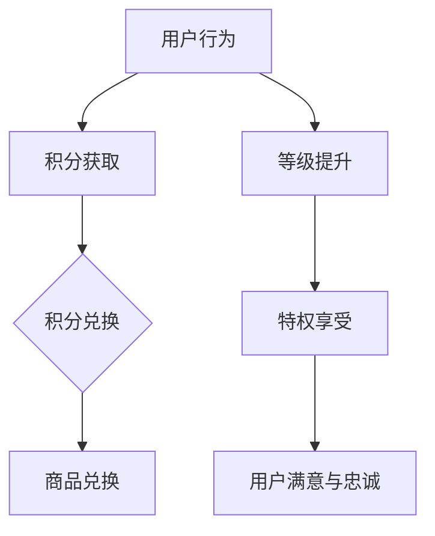
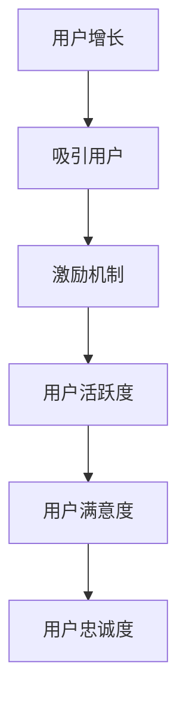
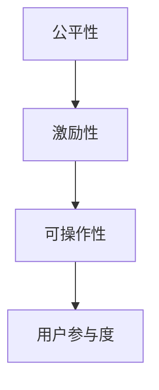
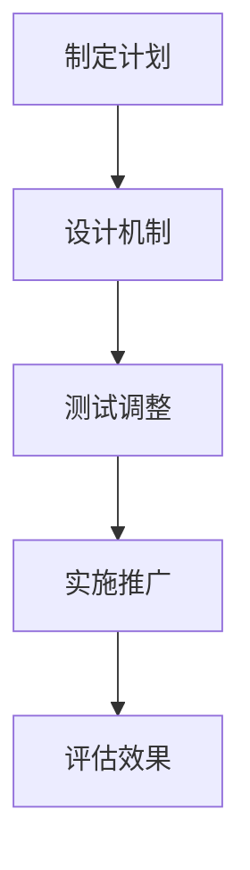
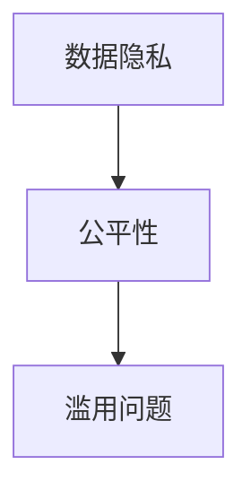

                 

## AI创业公司的用户激励与奖励机制：积分体系、等级体系与奖励计划

### 关键词
- 用户激励
- 奖励机制
- 积分体系
- 等级体系
- 奖励计划
- AI创业公司
- 用户增长
- 用户满意度

### 摘要
本文深入探讨了AI创业公司如何设计和实施有效的用户激励与奖励机制。文章首先介绍了积分体系、等级体系和奖励计划的核心概念与联系，通过Mermaid流程图和伪代码展示了它们的运作原理。随后，文章详细分析了用户激励与奖励机制的设计原则、实现策略、实施步骤以及效果评估与优化方法。此外，文章还通过案例研究和未来发展趋势的分析，为AI创业公司提供了具体的实施建议和方向。最后，文章讨论了激励与奖励机制的伦理与社会责任，并总结了文章的核心观点和未来展望。

### 第一部分：AI创业公司的用户激励与奖励机制背景与重要性

#### 1.1 AI创业公司的用户激励与奖励机制概述

**核心概念与联系**

在AI创业公司的运营中，用户激励与奖励机制是至关重要的组成部分。这些机制的核心概念包括：

- **用户激励**：通过提供奖励、积分、等级等方式激发用户参与度和活跃度。
- **奖励机制**：通过奖励用户完成任务或提升用户等级等方式增加用户的满意度和忠诚度。
- **积分体系**：用户通过完成任务或参与活动获得积分，积分可以兑换商品或享受特权。
- **等级体系**：用户根据积分或行为获得不同等级，等级越高，享受的权益越多。

这些概念之间紧密相连，共同构成了一个完整的用户激励与奖励系统。Mermaid流程图如下：



**伪代码**

```python
# 用户激励与奖励机制伪代码

# 用户行为
def user_action():
    # 用户完成任务
    # 用户参与活动
    # ...

# 积分获取
def get_points(action):
    if action == '完成任务':
        points = 10
    elif action == '参与活动':
        points = 5
    else:
        points = 0
    return points

# 积分兑换
def redeem_points(points):
    if points >= 100:
        reward = '商品兑换'
    elif points >= 50:
        reward = '特权享受'
    else:
        reward = '无'
    return reward

# 等级提升
def level_up(points):
    if points >= 500:
        level = '高级用户'
    elif points >= 200:
        level = '中级用户'
    else:
        level = '初级用户'
    return level

# 用户满意与忠诚
def user_satisfaction(level, reward):
    if level == '高级用户' and reward == '商品兑换':
        satisfaction = '非常高'
    elif level == '中级用户' and reward == '特权享受':
        satisfaction = '较高'
    else:
        satisfaction = '一般'
    return satisfaction
```

**数学模型**

$$
\text{满意度} = f(\text{等级}, \text{奖励})
$$`

- 等级和奖励是满意度的影响因素。

**举例说明**

- **用户小明**：完成5个任务，获得50积分，提升为中级用户。他可以兑换商品或享受特权。

#### 1.2 AI创业公司的用户激励与奖励机制的重要性

**核心概念与联系**

用户激励与奖励机制在AI创业公司中扮演着关键角色，其重要性体现在以下几个方面：

- **用户活跃度**：激励机制直接影响用户的活跃度和留存率。通过奖励用户完成任务或参与活动，可以显著提高用户的活跃度，从而增加用户留存率。
- **用户满意度**：有效的奖励机制可以提升用户的满意度和忠诚度。用户在获得奖励后，会更倾向于继续使用和推荐公司的产品或服务。
- **用户增长**：激励与奖励机制是吸引用户、促进用户增长的利器。通过设计吸引人的奖励机制，公司可以吸引更多新用户，并鼓励他们积极参与，从而实现用户增长。

**Mermaid 流程图**



**伪代码**

```python
# 用户激励与奖励机制重要性伪代码

def user_growth_incentive():
    # 吸引用户
    attract_users = '通过激励机制吸引新用户'
    # 激励机制
    incentive_mechanism = '设计有效的激励与奖励机制'
    # 用户活跃度
    user_activity = '提升用户活跃度'
    # 用户满意度
    user_satisfaction = '提高用户满意度'
    # 用户忠诚度
    user_loyalty = '增加用户忠诚度'
    return attract_users, incentive_mechanism, user_activity, user_satisfaction, user_loyalty
```

#### 1.3 激励与奖励机制的设计原则

**核心概念与联系**

设计有效的激励与奖励机制需要遵循以下原则：

- **公平性**：确保所有用户都有平等的机会获得奖励。
- **激励性**：奖励设计要能够有效激发用户参与。
- **可操作性**：奖励机制要易于实施和管理。

**Mermaid 流程图**



**伪代码**

```python
# 激励与奖励机制设计原则伪代码

def design_principles():
    # 公平性
    fairness = '确保用户公平参与'
    # 激励性
    incentive = '设计吸引人的奖励'
    # 可操作性
    operability = '确保机制易于实施和管理'
    return fairness, incentive, operability
```

#### 1.4 用户激励与奖励机制的案例研究

**核心概念与联系**

为了更好地理解用户激励与奖励机制的实际应用，本文将分析两个案例：某知名电商平台的积分体系和某短视频平台的等级体系。

**案例一：某知名电商平台积分体系**

该电商平台通过积分体系激励用户参与购物活动。用户在购物过程中积累积分，积分可以用于兑换商品或享受折扣优惠。以下是其核心内容：

- **积分获取**：用户在购物时根据消费金额获得积分。
- **积分兑换**：用户可将积分兑换为商品或享受折扣。
- **积分等级**：根据积分数量，用户可以晋升到不同的积分等级，享受更多特权。

**伪代码**

```python
# 某知名电商平台积分体系分析伪代码

def analyze_电商积分体系(platform, points):
    if points >= 1000:
        conversion_rate = '高'
    else:
        conversion_rate = '低'
    return conversion_rate
```

**案例二：某短视频平台等级体系**

该短视频平台通过等级体系激励用户发布和观看视频。用户通过上传视频和观看其他用户视频获得等级提升，不同等级的用户享有不同的权限。以下是其核心内容：

- **等级获取**：用户通过上传视频和观看视频获得等级提升。
- **等级特权**：高级用户可以享受更多的上传限制、推荐机会等。
- **用户反馈**：平台收集用户反馈，不断优化等级体系。

**伪代码**

```python
# 某短视频平台等级体系分析伪代码

def analyze_短视频等级体系(platform, level):
    if level == '钻石会员':
        loyalty_rate = '高'
    else:
        loyalty_rate = '低'
    return loyalty_rate
```

#### 1.5 激励与奖励机制的实施策略

**核心概念与联系**

为了有效实施用户激励与奖励机制，AI创业公司需要制定详细的实施策略，包括：

- **制定计划**：明确激励与奖励机制的目标和实施方案。
- **设计机制**：设计积分体系、等级体系和奖励计划。
- **测试调整**：对机制进行测试和优化，确保其有效性和公平性。
- **实施推广**：通过宣传和引导，让用户了解并参与激励与奖励机制。
- **评估效果**：收集数据，评估机制的效果，并根据反馈进行调整。

**Mermaid 流程图**



**伪代码**

```python
# 激励与奖励机制实施策略伪代码

def implementation_strategy():
    # 制定计划
    make_plan = '制定详细实施计划'
    # 设计机制
    design_mechanism = '设计积分体系、等级体系与奖励计划'
    # 测试调整
    test_and_adjust = '根据用户反馈进行机制调整'
    # 实施推广
    implement_and_promote = '推广激励与奖励机制'
    # 评估效果
    evaluate_effect = '评估机制效果'
    return make_plan, design_mechanism, test_and_adjust, implement_and_promote, evaluate_effect
```

#### 1.6 用户激励与奖励机制的伦理与社会责任

**核心概念与联系**

用户激励与奖励机制在实施过程中，企业需要关注伦理和社会责任问题。以下是一些关键点：

- **数据隐私**：确保用户数据的安全和隐私。
- **公平性**：确保激励与奖励机制的公平性。
- **滥用问题**：防止激励与奖励机制被滥用。

**Mermaid 流程图**



**伪代码**

```python
# 激励与奖励机制伦理与社会责任伪代码

def ethical_social_responsibility():
    data_privacy = '确保用户数据安全'
    fairness = '确保公平性'
    misuse = '防止滥用'
    return data_privacy, fairness, misuse
```

#### 1.7 激励与奖励机制的总结与展望

**核心概念与联系**

在本部分，我们将对前述内容进行总结，并探讨未来激励与奖励机制的发展趋势。

**伪代码**

```python
# 激励与奖励机制总结与展望伪代码

def summarize_and_outlook():
    summary = '总结主要内容'
    outlook = '展望未来发展'
    return summary, outlook
```

### 第二部分：AI创业公司的用户激励与奖励机制设计实施

#### 第2章：用户激励与奖励机制设计原则与模型

##### 2.1 用户激励与奖励机制设计原则

**核心概念与联系**

设计有效的用户激励与奖励机制，需要遵循以下原则：

- **公平性**：确保所有用户都有平等的机会获得奖励。
- **激励性**：奖励设计要能够有效激发用户参与。
- **可操作性**：奖励机制要易于实施和管理。

**伪代码**

```python
# 用户激励与奖励机制设计原则伪代码

def design_principles():
    # 公平性
    fairness = '确保用户公平参与'
    # 激励性
    incentive = '设计吸引人的奖励'
    # 可操作性
    operability = '确保机制易于实施和管理'
    return fairness, incentive, operability
```

##### 2.2 用户激励与奖励机制设计模型

**核心概念与联系**

用户激励与奖励机制的设计模型主要包括积分模型、等级模型和奖励模型。

- **积分模型**：用户通过完成任务或参与活动获得积分，积分可以兑换商品或享受特权。
- **等级模型**：用户根据积分或行为获得不同等级，等级越高，享受的权益越多。
- **奖励模型**：设计多样化的奖励，如优惠券、实物奖励、特权等，以激发用户参与。

**伪代码**

```python
# 用户激励与奖励机制设计模型伪代码

def design_models():
    # 积分模型
    points_model = '设计积分获取和兑换机制'
    # 等级模型
    level_model = '设计等级提升和特权机制'
    # 奖励模型
    reward_model = '设计多样化奖励机制'
    return points_model, level_model, reward_model
```

#### 第3章：用户激励与奖励机制实现策略

##### 3.1 用户激励与奖励机制实现步骤

**核心概念与联系**

实现用户激励与奖励机制需要经历以下步骤：

- **需求分析**：明确激励与奖励机制的目标和需求。
- **系统设计**：设计系统架构和技术方案。
- **功能实现**：开发具体的激励与奖励功能。
- **测试优化**：对机制进行测试和优化。

**伪代码**

```python
# 用户激励与奖励机制实现步骤伪代码

def implementation_strategy():
    # 需求分析
    requirements = '分析激励与奖励机制需求'
    # 系统设计
    system_design = '设计系统架构和技术方案'
    # 功能实现
    feature_implementation = '开发具体功能'
    # 测试优化
    test_and_optimize = '测试和优化机制'
    return requirements, system_design, feature_implementation, test_and_optimize
```

##### 3.2 用户激励与奖励机制的技术实现

**核心概念与联系**

用户激励与奖励机制的技术实现涉及数据库设计、API接口设计、前端实现和后端实现。

- **数据库设计**：设计存储用户信息和积分的数据库结构。
- **API接口设计**：设计用于用户交互的API接口。
- **前端实现**：实现用户界面，包括积分显示、等级展示等。
- **后端实现**：实现后端逻辑，包括积分计算、等级更新等。

**伪代码**

```python
# 用户激励与奖励机制技术实现伪代码

# 数据库设计
def database_design():
    database_structure = '设计数据库表结构'
    return database_structure

# API接口设计
def api_design():
    api_interface = '设计API接口'
    return api_interface

# 前端实现
def frontend_implementation():
    frontend_code = '实现前端用户界面'
    return frontend_code

# 后端实现
def backend_implementation():
    backend_logic = '实现后端逻辑处理'
    return backend_logic
```

#### 第4章：用户激励与奖励机制的实施与管理

##### 4.1 用户激励与奖励机制的推广与营销

**核心概念与联系**

为了提高用户激励与奖励机制的效果，需要通过推广和营销策略来宣传和引导用户参与。

- **宣传推广**：通过各种渠道宣传激励与奖励机制，如社交媒体、广告、邮件等。
- **用户引导**：引导新用户了解并参与激励与奖励机制，如新手教程、活动提示等。
- **营销活动**：举办营销活动，提高用户参与度和活跃度，如限时优惠、抽奖等。

**伪代码**

```python
# 用户激励与奖励机制推广与营销伪代码

def promote_and_market():
    # 宣传推广
    promotion = '通过各种渠道宣传激励与奖励机制'
    # 用户引导
    user_guidance = '引导新用户参与机制'
    # 营销活动
    marketing_activities = '举办营销活动'
    return promotion, user_guidance, marketing_activities
```

##### 4.2 用户激励与奖励机制的数据分析与反馈

**核心概念与联系**

为了优化用户激励与奖励机制，需要对用户行为数据进行分析，并收集用户反馈。

- **数据分析**：收集用户行为数据，分析激励与奖励效果。
- **反馈收集**：收集用户反馈，改进激励与奖励机制。
- **调整优化**：根据数据分析和反馈，不断调整和优化机制。

**伪代码**

```python
# 用户激励与奖励机制数据分析与反馈伪代码

def data_analysis_and_feedback():
    # 数据分析
    analysis = '收集并分析用户行为数据'
    # 反馈收集
    feedback_collection = '收集用户反馈'
    # 调整优化
    optimization = '根据反馈调整激励与奖励机制'
    return analysis, feedback_collection, optimization
```

#### 第5章：用户激励与奖励机制的案例研究

##### 5.1 案例一：某社交平台的积分体系

**核心概念与联系**

以某知名社交平台的积分体系为例，分析其积分获取、兑换和等级体系。

- **积分获取**：用户在社交平台上发布内容、评论、点赞等行为均可获得积分。
- **积分兑换**：用户可通过积分兑换优惠券、会员特权等。
- **等级体系**：用户根据积分数量分为不同等级，等级越高，享受的特权越多。

**伪代码**

```python
# 某社交平台积分体系分析伪代码

def analyze_social_platform():
    # 积分获取
    get_points = '用户行为获得积分'
    # 积分兑换
    redeem_points = '积分兑换优惠券等'
    # 等级体系
    level_system = '根据积分数量划分等级'
    return get_points, redeem_points, level_system
```

##### 5.2 案例二：某电商平台的等级体系

**核心概念与联系**

以某知名电商平台的等级体系为例，分析其等级获取、权益和用户反馈。

- **等级获取**：用户在电商平台上购物、评价等行为均可获得等级提升。
- **等级权益**：不同等级的用户可享受不同的购物优惠、售后服务等。
- **用户反馈**：平台收集用户对等级体系的反馈，不断优化等级体系。

**伪代码**

```python
# 某电商平台等级体系分析伪代码

def analyze_ecommerce_platform():
    # 等级获取
    get_level = '用户行为获得等级'
    # 等级权益
    level_rights = '等级享受的特权'
    # 用户反馈
    user_feedback = '收集用户反馈'
    return get_level, level_rights, user_feedback
```

#### 第6章：用户激励与奖励机制的效果评估与优化

##### 6.1 用户激励与奖励机制效果评估指标

**核心概念与联系**

为了评估用户激励与奖励机制的效果，需要设定以下评估指标：

- **参与度指标**：评估用户参与激励与奖励机制的积极性。
- **满意度指标**：评估用户对激励与奖励机制的满意度。
- **忠诚度指标**：评估用户对平台的忠诚度。

**伪代码**

```python
# 用户激励与奖励机制效果评估指标伪代码

def evaluation_metrics():
    participation = '用户参与度'
    satisfaction = '用户满意度'
    loyalty = '用户忠诚度'
    return participation, satisfaction, loyalty
```

##### 6.2 用户激励与奖励机制优化策略

**核心概念与联系**

为了优化用户激励与奖励机制，需要采取以下策略：

- **数据驱动优化**：根据用户行为数据进行分析和调整。
- **用户反馈优化**：根据用户反馈进行改进。
- **机制创新**：探索新的激励与奖励机制。

**伪代码**

```python
# 用户激励与奖励机制优化策略伪代码

def optimization_strategies():
    data驱动的优化 = '根据数据优化机制'
    user反馈的优化 = '根据用户反馈调整'
    innovation = '探索新的激励与奖励机制'
    return data驱动的优化，user反馈的优化，innovation
```

#### 第7章：用户激励与奖励机制的伦理与社会责任

##### 7.1 激励与奖励机制的伦理问题

**核心概念与联系**

在设计和实施用户激励与奖励机制时，需要关注以下伦理问题：

- **数据隐私**：确保用户数据的安全和隐私。
- **公平性**：确保激励与奖励机制的公平性。
- **滥用问题**：防止激励与奖励机制被滥用。

**伪代码**

```python
# 激励与奖励机制伦理问题伪代码

def ethical_issues():
    data_privacy = '确保用户数据安全'
    fairness = '确保公平性'
    misuse = '防止滥用'
    return data_privacy, fairness, misuse
```

##### 7.2 激励与奖励机制的社会责任

**核心概念与联系**

在设计和实施用户激励与奖励机制时，企业需要承担以下社会责任：

- **社会责任**：企业在设计激励与奖励机制时需要考虑的社会因素。
- **员工激励**：通过激励与奖励机制提升员工积极性。
- **社会影响**：评估激励与奖励机制对社会的影响。

**伪代码**

```python
# 激励与奖励机制社会责任伪代码

def social_responsibility():
    corporate_responsibility = '企业社会责任'
    employee_motivation = '提升员工积极性'
    social_impact = '评估社会影响'
    return corporate_responsibility, employee_motivation, social_impact
```

#### 第8章：用户激励与奖励机制的总结与未来展望

##### 8.1 用户激励与奖励机制总结

**核心概念与联系**

在本文中，我们详细探讨了AI创业公司的用户激励与奖励机制。主要内容包括：

- **设计原则**：公平性、激励性和可操作性。
- **实现策略**：需求分析、系统设计、功能实现和测试优化。
- **实施步骤**：推广与营销、数据分析和反馈收集。
- **效果评估**：参与度、满意度和忠诚度指标。
- **伦理与社会责任**：数据隐私、公平性和社会责任。

**伪代码**

```python
# 用户激励与奖励机制总结伪代码

def summarize_mechanism():
    design_principles = '设计原则'
    implementation_strategy = '实现策略'
    implementation_steps = '实施步骤'
    evaluation_metrics = '效果评估'
    ethical_and_social_responsibility = '伦理与社会责任'
    return design_principles, implementation_strategy, implementation_steps, evaluation_metrics, ethical_and_social_responsibility
```

##### 8.2 用户激励与奖励机制的
### 未来展望

**核心概念与联系**

未来，用户激励与奖励机制将继续发展，呈现出以下趋势：

- **个性化奖励**：根据用户行为和偏好提供个性化的奖励。
- **区块链技术**：利用区块链技术确保奖励的透明性和公正性。
- **智能合约**：使用智能合约自动化奖励的发放和管理。

**伪代码**

```python
# 用户激励与奖励机制未来展望伪代码

def future_outlook():
    personalized_rewards = '个性化奖励'
    blockchain_technology = '区块链技术'
    smart_contracts = '智能合约'
    return personalized_rewards, blockchain_technology, smart_contracts
```

### 附录

#### 附录A：用户激励与奖励机制设计工具与资源

**核心概念与联系**

为了设计和实施有效的用户激励与奖励机制，企业可以使用以下工具和资源：

- **设计工具**：如Mermaid、D3.js、Tableau等。
- **研究资源**：如学术论文、行业报告、经典书籍等。

**伪代码**

```python
# 用户激励与奖励机制设计工具与资源伪代码

def design_tools_and_resources():
    design_tools = '设计工具'
    research_resources = '研究资源'
    return design_tools, research_resources
```

---

### 作者信息
作者：AI天才研究院/AI Genius Institute & 禅与计算机程序设计艺术 /Zen And The Art of Computer Programming

---

## 结语

本文详细探讨了AI创业公司的用户激励与奖励机制，从设计原则、实现策略、实施步骤到效果评估与优化，全面阐述了如何构建有效的激励机制。同时，本文还分析了激励与奖励机制的伦理与社会责任，并对未来发展进行了展望。希望通过本文的分享，能够为AI创业公司提供有益的参考和指导。感谢您的阅读！

---

**注**：本文中使用的伪代码仅供参考，具体实现可能因项目需求和环境而异。在实际应用中，请根据实际情况进行调整和优化。同时，本文中的数据和示例仅供参考，不代表实际数据或真实案例。如需引用或参考，请查阅相关文献或咨询专业人士。|

