                 

# AI创业融资新趋势：关注项目商业价值与成长性

## 关键词
AI创业、融资、商业价值、成长性、投资策略

## 摘要
本文将探讨AI创业公司融资的新趋势，重点关注项目的商业价值和成长性。通过分析AI行业的背景和发展趋势，阐述融资策略和方法，评估AI项目的商业价值，以及融资筹备和后续管理的重要环节，本文旨在为AI创业公司提供全面、实用的融资指导，助力企业在激烈的市场竞争中脱颖而出。

## 目录大纲

### 第一部分：融资基础知识

#### 第1章：AI行业背景与融资趋势
1.1 AI行业的发展历程
1.2 当前AI领域的市场规模
1.3 AI创业公司的融资现状
1.4 融资趋势与挑战

#### 第2章：融资策略与方法
2.1 种子轮融资策略
2.2 A轮与B轮融资策略
2.3 后续融资策略与调整
2.4 融资过程中的谈判技巧

#### 第3章：AI项目的商业价值评估
3.1 评估模型与方法
3.2 数据驱动的商业价值分析
3.3 成长性指标与预测
3.4 融资额度与退出策略

#### 第4章：融资筹备与路演
4.1 路演的准备
4.2 演讲技巧与展示方法
4.3 投资人关系管理
4.4 路演中的问题应对策略

#### 第5章：法律与财务尽职调查
5.1 尽职调查的目标与内容
5.2 法律合规性检查
5.3 财务健康性评估
5.4 融资协议与条款解析

#### 第6章：融资后续管理与运营优化
6.1 融资后的财务规划
6.2 成本控制与效率提升
6.3 团队建设与激励机制
6.4 市场拓展与战略规划

#### 第7章：案例分析与实战经验
7.1 成功融资案例分析
7.2 融资失败的教训与反思
7.3 不同阶段融资策略调整
7.4 融资后的企业成长路径

### 第二部分：AI项目的核心技术与应用

#### 第8章：AI技术基础与最新趋势
8.1 人工智能的基本概念
8.2 AI技术的最新发展
8.3 AI技术的应用领域
8.4 技术选型与优化

#### 第9章：数据科学与机器学习
9.1 数据收集与预处理
9.2 机器学习算法原理
9.3 深度学习技术详解
9.4 数据分析与应用实践

#### 第10章：自然语言处理与计算机视觉
10.1 自然语言处理技术
10.2 计算机视觉基础
10.3 NLP和CV在AI创业中的应用
10.4 技术难题与解决方案

#### 第11章：AI平台搭建与运维
11.1 AI平台架构设计
11.2 云计算与大数据技术
11.3 自动化运维与监控
11.4 平台性能优化与安全性

#### 第12章：AI项目商业化实践
12.1 产品设计与用户体验
12.2 市场推广与销售策略
12.3 用户反馈与迭代优化
12.4 商业模式与盈利分析

### 第三部分：成长性与可持续性

#### 第13章：项目成长性与可持续性评估
13.1 成长性指标体系
13.2 可持续性评估方法
13.3 成长性预测与战略调整

#### 第14章：风险管理与应对策略
14.1 常见风险类型
14.2 风险评估与监测
14.3 风险应对策略
14.4 应急预案与危机管理

#### 第15章：创新生态系统与协同发展
15.1 创新生态系统的构建
15.2 合作伙伴关系管理
15.3 产业链协同与共赢
15.4 全球化发展策略

#### 第16章：社会责任与伦理考量
15.1 AI技术的伦理问题
15.2 社会责任与可持续发展
15.3 伦理决策与案例分析
15.4 企业社会责任实践

### 附录

#### 附录A：融资资源与工具
A.1 融资平台与渠道
A.2 投资人数据库
A.3 融资文档模板

#### 附录B：技术资源与学习资料
B.1 开源框架与库
B.2 在线课程与研讨会
B.3 技术文档与标准
B.4 社区与论坛

### 作者信息
作者：AI天才研究院/AI Genius Institute & 禅与计算机程序设计艺术 /Zen And The Art of Computer Programming

---

### 第一部分：融资基础知识

#### 第1章：AI行业背景与融资趋势

##### 1.1 AI行业的发展历程

人工智能（AI）作为一种具有深远影响力的技术，其发展历程可以追溯到20世纪50年代。最初的AI研究主要集中在符号主义和逻辑推理上，如逻辑推理机、专家系统等。然而，这些早期方法在面对复杂任务时表现不佳，难以处理大量的非结构化数据。

随着计算机性能的提升和大数据时代的到来，AI技术逐渐转向数据驱动的方法，如机器学习和深度学习。这些方法使得AI系统能够通过学习海量数据来提高性能，从而在图像识别、自然语言处理、语音识别等领域取得了显著成果。

在中国，AI行业的发展同样迅速。近年来，中国政府出台了一系列政策，鼓励AI技术的发展和产业应用。例如，《新一代人工智能发展规划》明确了到2030年中国成为全球AI创新中心的战略目标。随着政策支持和市场需求的不断增加，AI创业公司如雨后春笋般涌现。

##### 1.2 当前AI领域的市场规模

当前，AI领域已经成为全球最大的新兴市场之一。根据市场研究机构的统计数据，2019年全球AI市场规模约为380亿美元，预计到2025年将达到兆美元级别。这一增长主要得益于AI技术在各个行业的广泛应用，如金融、医疗、零售、制造等。

在中国，AI市场的增长同样迅速。根据中国信息通信研究院的数据，2019年中国AI市场规模约为457亿元，同比增长超过45%。随着AI技术的不断成熟和应用的深入，预计未来几年中国AI市场的规模将继续保持高速增长。

##### 1.3 AI创业公司的融资现状

AI创业公司作为新兴的创新力量，在融资方面面临着许多挑战和机遇。根据相关数据显示，2019年全球AI创业公司融资总额超过200亿美元，其中中国AI创业公司的融资总额占到了近40%。

在中国，AI创业公司的融资现状呈现出以下几个特点：

1. **融资轮次多样化**：从种子轮到D轮，各个阶段的融资需求各不相同。种子轮和天使轮主要关注技术创新和团队建设，而A轮和B轮则更加注重产品和市场验证。

2. **融资难度较大**：由于AI技术的高风险性，投资人对AI创业公司的投资更加谨慎。因此，AI创业公司需要通过提升技术实力和市场竞争力来获得投资人的青睐。

3. **投资机构多元化**：除了传统的风险投资机构外，越来越多的金融机构、产业资本和政府资金开始关注AI创业公司，为AI创业公司提供了更多的融资渠道。

##### 1.4 融资趋势与挑战

当前，AI创业公司的融资趋势呈现出以下几个特点：

1. **融资环境改善**：随着政策的支持和市场的成熟，AI创业公司的融资环境逐渐改善。政府出台了一系列鼓励创新和创业的政策，降低了创业门槛和融资难度。

2. **融资方式多元化**：除了传统的股权融资外，AI创业公司还可以通过债务融资、并购融资等方式获得资金支持。

3. **关注长期价值**：越来越多的投资机构开始关注AI创业公司的长期价值，而不仅仅是短期的财务回报。这为AI创业公司提供了更多的融资机会和更稳定的资金来源。

然而，AI创业公司在融资过程中也面临着一些挑战：

1. **技术风险**：AI技术的研发和迭代速度非常快，创业公司需要不断投入大量资金来保持技术领先。这使得投资人对创业公司的技术风险更加关注。

2. **市场风险**：AI技术在市场应用方面存在一定的局限性，创业公司需要找到合适的商业模式和市场切入点。

3. **人才短缺**：AI领域的人才需求旺盛，但人才供给不足。创业公司需要投入大量资源来吸引和留住人才。

总之，AI创业公司在融资方面面临着机遇和挑战。通过不断提升技术实力、优化商业模式和加强团队建设，创业公司可以更好地应对融资挑战，实现可持续发展。

#### 第2章：融资策略与方法

##### 2.1 种子轮融资策略

种子轮融资是AI创业公司融资的起点，也是最为关键的一步。种子轮融资的主要目的是验证商业模式的可行性，搭建核心团队和初步构建产品。

**策略建议：**

1. **聚焦技术创新**：种子轮投资人主要关注技术创新和团队的潜力。创业公司需要通过展示其独特的技术优势和创新点来吸引投资。

2. **明确商业价值**：创业公司需要明确其商业价值，包括市场前景、竞争优势和盈利模式。这将有助于提高投资人的信心。

3. **合理估值**：种子轮融资的估值不宜过高，以免影响后续融资。创业公司可以根据市场情况和公司实际状况来确定合理估值。

4. **选择合适的投资人**：种子轮投资人不仅提供资金支持，还可以为创业公司提供资源和经验。创业公司应选择与自身发展目标相符的投资人。

**案例：**

某AI创业公司A在种子轮融资中获得了100万美元的投资。该公司专注于开发一款基于深度学习技术的智能客服系统，产品上线后获得了良好的市场反响。通过这笔资金，公司进一步优化了产品，并成功获得了A轮融资。

##### 2.2 A轮与B轮融资策略

A轮和B轮是AI创业公司融资的重要阶段，这一阶段的融资主要用于产品研发和市场推广。

**策略建议：**

1. **产品成熟度**：在A轮和B轮中，产品的成熟度是投资人关注的重点。创业公司需要展示产品的完整性和稳定性。

2. **市场验证**：A轮和B轮的融资需要市场验证，创业公司可以通过市场调研、用户反馈等方式来证明产品的市场潜力。

3. **盈利模式**：创业公司需要明确盈利模式，包括收入来源、成本控制等方面。这将有助于提高投资人的信心。

4. **团队扩张**：在A轮和B轮中，创业公司需要加大团队扩张力度，招聘更多的核心技术人员和市场营销人员。

5. **合理估值**：A轮和B轮的估值通常会高于种子轮，但也要避免过高估值，以免影响后续融资。

**案例：**

某AI创业公司B在A轮融资中获得了500万美元的投资。该公司专注于开发一款基于计算机视觉技术的智能安防系统，产品上线后迅速获得了市场认可。通过这笔资金，公司进一步优化了产品，并拓展了销售渠道。随后，公司顺利完成了B轮融资，融资额达到2000万美元。

##### 2.3 后续融资策略与调整

后续融资是AI创业公司在发展过程中可能面临的一个阶段，这一阶段的融资主要用于业务扩张和市场拓展。

**策略建议：**

1. **明确融资目标**：创业公司需要明确后续融资的目标，如扩大市场份额、开拓新市场、研发新产品等。

2. **调整商业模式**：根据市场反馈和公司发展情况，创业公司可能需要对商业模式进行调整。例如，优化产品功能、拓展新应用领域等。

3. **优化团队结构**：后续融资阶段，创业公司需要进一步优化团队结构，提高团队效率和执行力。

4. **合理估值**：后续融资的估值应基于公司的发展潜力和市场情况，避免过高或过低估值。

5. **选择合适的融资方式**：后续融资可以采用股权融资、债务融资、并购融资等多种方式，创业公司应根据自身情况和市场环境选择合适的融资方式。

**案例：**

某AI创业公司C在后续融资阶段选择了债务融资方式。该公司在D轮融资中获得了1000万美元的债务融资，用于扩大研发团队和拓展市场。通过这笔资金，公司进一步提升了产品竞争力，并在短时间内实现了市场份额的快速增长。

##### 2.4 融资过程中的谈判技巧

融资谈判是创业公司与投资人之间的重要环节，谈判技巧直接影响融资的成功与否。

**技巧建议：**

1. **充分准备**：创业公司需要提前准备融资材料，包括商业计划书、财务报表、产品演示等，以便在谈判中展示公司的实力和潜力。

2. **了解投资人需求**：创业公司需要了解投资人的投资偏好、投资领域和投资策略，以便更好地匹配双方的诉求。

3. **明确底线**：创业公司需要明确自身的底线，包括估值、股权比例、资金用途等，以避免在谈判中失去控制权。

4. **沟通技巧**：创业公司需要具备良好的沟通技巧，包括倾听、表达、说服等，以便在谈判中建立良好的信任关系。

5. **妥协与坚持**：在谈判过程中，创业公司需要在妥协和坚持之间找到平衡，既要满足投资人的合理要求，也要维护自身的权益。

**案例：**

某AI创业公司在融资谈判中，面对投资人的高估值要求，创业团队经过充分沟通和协商，最终在估值上做出了妥协，同时争取到了更多的股权比例。通过这次谈判，公司成功获得了投资，并保持了团队的稳定和公司的控制权。

#### 第3章：AI项目的商业价值评估

##### 3.1 评估模型与方法

评估AI项目的商业价值是创业公司融资过程中至关重要的一环。为了准确评估项目的商业价值，创业公司可以采用以下几种模型和方法：

1. **财务模型**：财务模型是最常见的评估方法之一。通过预测公司的收入、成本和利润，评估项目的财务可行性。常见的财务模型包括收入模型、成本模型和利润模型。

2. **市场模型**：市场模型通过分析市场需求、市场规模、竞争态势等，评估项目的市场前景。市场模型有助于确定项目的市场定位和竞争优势。

3. **技术模型**：技术模型通过评估项目的技术水平、创新程度和技术成熟度，评估项目的技术价值。技术模型有助于确定项目的核心竞争力。

4. **综合模型**：综合模型将财务模型、市场模型和技术模型相结合，从多个维度评估项目的商业价值。综合模型能够提供更全面、更准确的评估结果。

##### 3.2 数据驱动的商业价值分析

数据驱动的商业价值分析是评估AI项目商业价值的重要手段。通过收集和分析海量数据，创业公司可以更准确地评估项目的商业潜力。以下是一些关键步骤：

1. **数据收集**：创业公司需要收集与项目相关的各种数据，包括市场需求、竞争态势、用户反馈、技术性能等。数据来源可以包括市场调研、用户调查、技术测试等。

2. **数据处理**：收集到的数据通常存在噪声和异常值，需要通过数据清洗、数据转换和数据归一化等手段进行预处理，以提高数据的准确性和可靠性。

3. **数据分析**：通过对预处理后的数据进行统计分析、回归分析、聚类分析等，挖掘数据中的规律和趋势。数据分析结果可以为项目评估提供重要的依据。

4. **数据可视化**：通过数据可视化技术，将数据分析结果以图表、地图、图形等形式展示出来，使分析结果更加直观、易于理解。

##### 3.3 成长性指标与预测

成长性是评估AI项目商业价值的重要指标之一。成长性指标包括收入增长率、市场份额、用户增长率等。以下是一些关键步骤：

1. **确定成长性指标**：根据项目的特点和目标，确定适当的成长性指标。例如，对于一家AI初创公司，收入增长率、用户增长率、市场份额可能是重要的成长性指标。

2. **收集历史数据**：收集项目过去一段时间内的成长性数据，如收入数据、用户数据等。历史数据可以为成长性预测提供基础。

3. **建立预测模型**：通过时间序列分析、回归分析等方法，建立成长性预测模型。预测模型可以根据历史数据和当前趋势预测未来的成长性。

4. **评估预测准确性**：通过对预测结果进行评估，确定预测模型的准确性。如果预测模型的准确性较高，可以更可靠地预测项目未来的成长性。

##### 3.4 融资额度与退出策略

融资额度和退出策略是AI项目融资过程中需要考虑的重要问题。以下是一些关键步骤：

1. **确定融资额度**：根据项目的实际需求和市场情况，确定合理的融资额度。融资额度应足够支持项目的研发、市场推广和团队建设等。

2. **评估融资成本**：融资额度确定后，需要评估融资成本，包括股权融资的成本和债务融资的成本。根据成本情况，选择合适的融资方式。

3. **制定退出策略**：退出策略是创业公司实现投资回报的重要途径。常见的退出策略包括IPO、并购、股权转让等。创业公司应根据自身的实际情况和市场环境，制定合适的退出策略。

4. **风险评估**：在制定融资额度和退出策略时，需要充分考虑项目的风险，包括技术风险、市场风险、财务风险等。通过风险评估，可以制定相应的风险管理策略。

#### 第4章：融资筹备与路演

##### 4.1 路演的准备

路演是AI创业公司向潜在投资人展示项目和获取资金的重要环节。为了提高路演的成功率，创业公司需要进行充分的准备。

**准备步骤：**

1. **确定路演目标**：创业公司需要明确路演的目标，包括融资额、投资人类型、市场推广等。

2. **制作路演材料**：包括商业计划书、财务报表、产品演示等。这些材料需要清晰、准确地展示公司的核心竞争力、市场前景和融资需求。

3. **演练演讲**：创业公司需要对演讲内容进行反复演练，确保演讲流畅、逻辑清晰、重点突出。

4. **了解投资人**：在路演前，创业公司需要了解投资人的投资偏好、关注领域和投资策略，以便更好地匹配双方的诉求。

5. **安排路演时间**：选择合适的时间和地点进行路演，确保投资人能够出席。

##### 4.2 演讲技巧与展示方法

演讲技巧和展示方法是路演成功的关键。以下是一些关键技巧：

1. **开场吸引注意**：用简短的语句或案例引起投资人的兴趣，展示公司的核心竞争力。

2. **内容逻辑清晰**：演讲内容需要结构清晰、逻辑严密，确保投资人能够快速了解公司的主要优势和融资需求。

3. **展示产品优势**：通过实际案例、数据和技术细节，展示产品的优势和市场竞争力。

4. **互动交流**：与投资人进行互动交流，回答投资人的疑问，展示公司的透明度和诚信。

5. **使用图表和视觉辅助**：通过图表、图片、视频等视觉辅助手段，使演讲内容更加直观、易于理解。

##### 4.3 投资人关系管理

投资人关系管理是融资过程中的重要环节。以下是一些关键策略：

1. **建立信任**：通过诚实、透明和诚信的方式与投资人沟通，建立良好的信任关系。

2. **定期沟通**：与投资人保持定期沟通，及时反馈项目的进展情况和市场动态。

3. **提供增值服务**：为投资人提供有价值的行业报告、市场分析等，展示公司的专业能力。

4. **维护网络关系**：通过参加行业会议、投资论坛等活动，拓展投资人网络，为后续融资打下基础。

5. **尊重投资人意见**：认真倾听投资人的意见，尊重投资人的决策，共同推进项目的进展。

##### 4.4 路演中的问题应对策略

在路演过程中，创业公司可能会遇到各种问题，以下是一些应对策略：

1. **提前准备**：针对可能被问到的问题，提前准备回答，确保回答清晰、准确。

2. **正面回应**：遇到负面问题时，要保持冷静，正面回应，展示公司的解决问题的能力和决心。

3. **数据支持**：用数据和实际案例支持回答，使回答更具说服力。

4. **坦诚面对**：对于不确定的问题，要坦诚面对，避免隐瞒或逃避。

5. **持续改进**：根据投资人的反馈和问题，持续改进产品和服务，提高项目的竞争力。

#### 第5章：法律与财务尽职调查

##### 5.1 尽职调查的目标与内容

尽职调查是创业公司在融资过程中必须进行的一项重要工作，其目标是确保项目的合法合规性、财务健康性和业务稳定性。尽职调查主要包括以下内容：

1. **法律尽职调查**：检查公司的法律合规性，包括公司章程、股东协议、知识产权、合同等。

2. **财务尽职调查**：评估公司的财务状况，包括财务报表、现金流量、成本控制等。

3. **业务尽职调查**：了解公司的业务模式、市场状况、竞争对手、客户关系等。

4. **技术尽职调查**：评估公司技术的成熟度、创新性、稳定性等。

5. **人力资源尽职调查**：检查公司的员工结构、薪资福利、劳动合同等。

##### 5.2 法律合规性检查

法律合规性检查是尽职调查的重要内容，主要包括以下几个方面：

1. **公司章程和股东协议**：检查公司章程和股东协议是否符合法律法规要求，确保公司治理结构合法合规。

2. **知识产权**：检查公司拥有的知识产权，包括专利、商标、著作权等，确保知识产权的合法性和有效性。

3. **合同和协议**：检查公司与客户、供应商、合作伙伴等签订的合同和协议，确保合同条款的合法性、合规性。

4. **法律诉讼和纠纷**：了解公司是否存在法律诉讼或纠纷，评估可能对公司造成的影响。

##### 5.3 财务健康性评估

财务健康性评估是尽职调查的核心内容之一，主要包括以下几个方面：

1. **财务报表**：审查公司的财务报表，包括资产负债表、利润表、现金流量表等，评估公司的盈利能力、资产负债状况和现金流量情况。

2. **现金流量**：分析公司的现金流量，了解公司的现金流入和流出情况，评估公司的资金周转能力和偿债能力。

3. **成本控制**：评估公司的成本控制情况，包括成本结构、成本控制和成本效率等。

4. **盈利模式**：分析公司的盈利模式，了解公司的收入来源、成本结构和盈利能力。

##### 5.4 融资协议与条款解析

融资协议是创业公司与投资人之间签订的重要法律文件，其条款内容直接关系到创业公司的利益和风险。以下是一些常见的融资协议条款及解析：

1. **股权比例**：确定创业公司向投资人转让的股权比例，以及投资人在公司中的权益。

2. **董事会席位**：确定投资人在公司董事会中的席位，以及董事会的决策权和影响力。

3. **优先权**：明确投资人在公司优先分红、优先清算等方面的权利。

4. **反稀释条款**：防止因后续融资导致投资人股权比例被稀释。

5. **竞业禁止条款**：限制创业公司高管和员工在竞业公司的任职和投资。

6. **保密条款**：确保创业公司的商业秘密和技术秘密不被泄露。

7. **违约条款**：明确违约行为及相应的责任和处罚。

#### 第6章：融资后续管理与运营优化

##### 6.1 融资后的财务规划

融资成功后，创业公司需要制定详细的财务规划，确保资金的有效利用和公司的可持续发展。以下是一些关键步骤：

1. **资金分配**：根据公司的战略目标和业务需求，合理分配资金，包括研发投入、市场推广、团队建设等。

2. **预算管理**：制定详细的预算计划，对各项开支进行严格控制，确保资金使用的合理性和效率。

3. **财务监控**：建立财务监控体系，定期审查财务报表和现金流量，确保公司的财务状况良好。

4. **风险控制**：评估公司的财务风险，制定相应的风险控制措施，确保公司的财务安全。

##### 6.2 成本控制与效率提升

成本控制和效率提升是创业公司可持续发展的重要保障。以下是一些关键策略：

1. **优化成本结构**：分析公司的成本构成，找出成本较高、效率较低的部分，通过优化流程、提高技术手段等手段降低成本。

2. **精细化预算管理**：对各项开支进行精细化预算管理，确保每一分钱都用在刀刃上。

3. **提高生产效率**：通过引入先进的生产设备、技术和管理方法，提高生产效率，降低单位成本。

4. **人力资源管理**：优化团队结构，提高员工的技能水平和工作效率，降低人力资源成本。

##### 6.3 团队建设与激励机制

团队建设是创业公司成功的关键，以下是一些关键策略：

1. **招聘与培训**：根据公司的战略目标和业务需求，招聘合适的人才，并通过培训提高员工的综合素质。

2. **激励机制**：建立合理的激励机制，激发员工的积极性和创造力，确保团队凝聚力。

3. **团队协作**：通过有效的沟通和协作，提高团队的工作效率，确保项目的顺利进行。

4. **员工福利**：提供良好的员工福利，提高员工的满意度和忠诚度。

##### 6.4 市场拓展与战略规划

市场拓展和战略规划是创业公司发展的重要方向，以下是一些关键策略：

1. **市场调研**：通过市场调研，了解市场需求、竞争态势和消费者行为，为市场拓展提供依据。

2. **品牌建设**：通过品牌宣传和推广，提高公司的品牌知名度和美誉度，吸引更多的客户。

3. **销售策略**：根据市场情况和消费者需求，制定合适的销售策略，提高销售业绩。

4. **战略合作**：寻找合适的合作伙伴，通过战略合作，扩大市场份额，实现共赢。

5. **长期规划**：制定长期发展战略，明确公司的发展方向和目标，确保公司的可持续发展。

#### 第7章：案例分析与实战经验

##### 7.1 成功融资案例分析

成功融资是创业公司发展的关键里程碑，以下是一个成功融资的案例：

某AI创业公司D在A轮融资中获得了1000万美元的投资。该公司专注于开发一款基于深度学习技术的智能医疗诊断系统，产品上线后迅速获得了市场的认可。通过这笔资金，公司进一步优化了产品，扩大了研发团队，并在短时间内获得了B轮融资。

成功融资的关键因素包括：

1. **技术创新**：公司拥有独特的技术优势和创新能力，吸引了投资人的关注。

2. **市场前景**：公司拥有广阔的市场前景，产品在市场上具有竞争力。

3. **团队实力**：公司拥有一支高水平的技术团队，具备丰富的研发和市场经验。

4. **融资策略**：公司制定了合理的融资策略，选择了合适的投资人和融资时机。

##### 7.2 融资失败的教训与反思

融资失败是创业公司发展过程中可能遇到的问题，以下是一个融资失败的案例：

某AI创业公司E在种子轮融资中遭遇失败。该公司专注于开发一款基于自然语言处理技术的智能客服系统，但由于市场推广不足、团队不稳定等问题，未能获得投资人的青睐。

融资失败的关键因素包括：

1. **市场定位不准确**：公司未能准确把握市场需求，产品定位不明确。

2. **团队不稳定**：公司团队不稳定，研发和市场推广工作难以顺利进行。

3. **融资策略不当**：公司未能选择合适的投资人和融资时机，导致融资失败。

4. **资金使用不当**：公司在融资后未能合理使用资金，导致资金紧张。

##### 7.3 不同阶段融资策略调整

创业公司在不同发展阶段需要制定不同的融资策略，以下是一个不同阶段融资策略调整的案例：

某AI创业公司F在初创阶段以股权融资为主，获得了天使投资和种子轮融资。随着公司的发展，公司在A轮和B轮阶段选择了债务融资和并购融资，以优化资金结构和降低成本。

不同阶段融资策略调整的关键因素包括：

1. **公司发展阶段**：根据公司的发展阶段，制定相应的融资策略。

2. **资金需求**：根据公司的资金需求，选择合适的融资方式。

3. **市场环境**：根据市场环境的变化，调整融资策略。

4. **投资回报**：考虑投资回报，选择合适的融资方式和渠道。

##### 7.4 融资后的企业成长路径

融资后的企业成长路径对创业公司的发展至关重要，以下是一个融资后的企业成长路径案例：

某AI创业公司G在完成A轮融资后，加大了研发和市场推广力度，成功推出了多款基于深度学习技术的智能硬件产品。在B轮融资后，公司进一步拓展了市场份额，并开始了海外市场的布局。在C轮融资中，公司通过并购方式获得了两家具有技术优势的创业公司，实现了技术整合和业务拓展。

融资后的企业成长路径包括：

1. **产品研发**：加大研发投入，持续优化产品，提升市场竞争力。

2. **市场推广**：加大市场推广力度，提高品牌知名度和市场占有率。

3. **团队建设**：优化团队结构，提升团队综合素质，增强企业竞争力。

4. **业务拓展**：通过并购、战略合作等方式，拓展业务领域，实现多元化发展。

#### 第二部分：AI项目的核心技术与应用

##### 第8章：AI技术基础与最新趋势

##### 8.1 人工智能的基本概念

人工智能（Artificial Intelligence，简称AI）是指由计算机系统实现的智能行为，模仿人类的思考、学习、决策和问题解决能力。AI的核心技术包括机器学习、深度学习、自然语言处理、计算机视觉等。

**核心概念与联系**

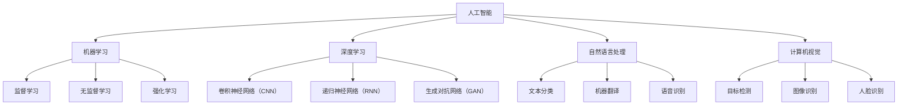

##### 8.2 AI技术的最新发展

AI技术的最新发展主要集中在深度学习、强化学习、自然语言处理和计算机视觉等领域。以下是一些重要的发展趋势：

1. **深度学习**：随着计算能力的提升和大数据的普及，深度学习技术在图像识别、语音识别、自然语言处理等领域取得了显著成果。

2. **强化学习**：强化学习在游戏、机器人控制、推荐系统等领域表现出色，成为AI研究的热点。

3. **自然语言处理**：自然语言处理技术在机器翻译、文本生成、问答系统等领域取得了重大突破。

4. **计算机视觉**：计算机视觉技术在目标检测、图像识别、人脸识别等领域得到了广泛应用。

**核心算法原理讲解**

深度学习中的卷积神经网络（CNN）：

```plaintext
# 前向传播

# 初始化权重和偏置
W = ...  # 卷积核权重
b = ...  # 偏置

# 输入图像 X
# 卷积操作
for layer in layers:
    for filter in layer.filters:
        Z = conv2d(X, filter) + b
        A = activation(Z)

# 池化操作
P = max_pool2d(A, pool_size)

# 反向传播
dA = ...  # 上一层误差
for layer in reversed(layers):
    dZ = dA * layer.activation_derivative()
    dW = ...  # 反向传播计算权重梯度
    db = ...  # 反向传播计算偏置梯度
    dX = ...  # 反向传播计算输入误差
```

##### 8.3 AI技术的应用领域

AI技术在各个领域都有广泛应用，以下是一些关键应用领域：

1. **医疗健康**：AI技术在医疗影像分析、疾病诊断、药物研发等方面具有巨大潜力。

2. **金融科技**：AI技术在风险控制、投资决策、智能投顾等方面发挥着重要作用。

3. **智能交通**：AI技术在自动驾驶、智能交通管理、出行服务等方面得到广泛应用。

4. **智能工业**：AI技术在工业自动化、质量控制、设备预测性维护等方面提高了生产效率。

5. **智能家居**：AI技术在智能音箱、智能安防、智能家电等领域带来了便利和舒适。

**技术选型与优化**

AI技术选型与优化需要考虑以下几个因素：

1. **业务需求**：根据业务需求选择合适的技术方案，如图像识别、自然语言处理等。

2. **数据质量**：数据质量直接影响AI模型的效果，需要确保数据的准确性、完整性和多样性。

3. **计算资源**：根据计算资源的情况选择合适的算法和模型，如深度学习、强化学习等。

4. **部署环境**：根据部署环境选择合适的技术方案，如云端部署、边缘计算等。

**案例：**

某AI创业公司H专注于智能医疗影像分析，采用了深度学习技术，开发了一套智能肿瘤检测系统。通过卷积神经网络（CNN）对医学影像进行分析，系统能够快速、准确地识别出肿瘤区域，为医生提供了重要的诊断依据。该系统在临床试验中取得了显著效果，获得了市场的高度认可。

##### 第9章：数据科学与机器学习

##### 9.1 数据收集与预处理

数据是AI项目的基础，数据收集与预处理是确保数据质量和模型效果的关键步骤。以下是一些关键步骤：

1. **数据收集**：根据业务需求，收集相关的数据源，如医疗影像、文本、语音等。

2. **数据清洗**：去除重复数据、缺失值填充、异常值处理等，确保数据的一致性和完整性。

3. **数据转换**：将不同类型的数据转换为统一格式，如将图像转换为像素矩阵，文本转换为词向量等。

4. **数据归一化**：对数据进行归一化或标准化处理，确保数据在相同的尺度范围内。

**核心算法原理讲解**

机器学习中的监督学习：

```plaintext
# 初始化模型参数
w = ...  # 权重
b = ...  # 偏置

# 训练模型
for epoch in range(num_epochs):
    for x, y in training_data:
        # 前向传播
        z = x * w + b
        y_pred = sigmoid(z)

        # 计算损失函数
        loss = loss_function(y, y_pred)

        # 反向传播
        dZ = y_pred - y
        dw = ...  # 反向传播计算权重梯度
        db = ...  # 反向传播计算偏置梯度

    # 更新模型参数
    w = w - learning_rate * dw
    b = b - learning_rate * db
```

##### 9.2 机器学习算法原理

机器学习算法主要包括监督学习、无监督学习和强化学习。以下是一些关键算法：

1. **监督学习**：包括线性回归、逻辑回归、支持向量机（SVM）等，用于分类和回归任务。

2. **无监督学习**：包括聚类算法（如K-means）、降维算法（如PCA）等，用于探索数据结构。

3. **强化学习**：包括Q-learning、深度强化学习等，用于决策和优化问题。

**深度学习技术详解**

深度学习是一种复杂的机器学习算法，通过多层神经网络来提取数据特征。以下是一些关键技术：

1. **卷积神经网络（CNN）**：用于图像识别和图像处理。

2. **递归神经网络（RNN）**：用于序列数据和时序预测。

3. **生成对抗网络（GAN）**：用于生成数据、图像和视频。

**数据分析与应用实践**

数据分析是AI项目的重要组成部分，以下是一些关键步骤：

1. **数据探索**：通过统计分析和可视化技术，了解数据的分布、趋势和异常值。

2. **特征工程**：根据业务需求，选择和构建有效的特征，提高模型效果。

3. **模型评估**：通过交叉验证、网格搜索等技术，评估模型性能。

4. **模型应用**：将模型应用到实际业务场景，如分类、预测、推荐等。

**案例：**

某AI创业公司I开发了一套基于深度学习的智能语音识别系统，用于将语音转换为文本。通过使用卷积神经网络（CNN）和长短期记忆网络（LSTM），系统能够准确识别各种语音输入，为用户提供实时翻译和语音助手服务。该系统在多个应用场景中取得了显著效果，如在线教育、智能客服等。

##### 第10章：自然语言处理与计算机视觉

##### 10.1 自然语言处理技术

自然语言处理（Natural Language Processing，简称NLP）是AI领域的一个重要分支，主要研究如何让计算机理解和处理自然语言。以下是一些关键技术：

1. **文本分类**：将文本数据分类到预定义的类别中，如垃圾邮件过滤、情感分析等。

2. **机器翻译**：将一种语言的文本翻译成另一种语言，如谷歌翻译。

3. **语音识别**：将语音信号转换为文本，如苹果的Siri。

**自然语言处理技术详解**

文本分类算法：

```plaintext
# 初始化模型参数
w = ...  # 权重
b = ...  # 偏置

# 训练模型
for epoch in range(num_epochs):
    for x, y in training_data:
        # 前向传播
        z = x * w + b
        y_pred = softmax(z)

        # 计算损失函数
        loss = cross_entropy_loss(y, y_pred)

        # 反向传播
        dZ = y_pred - y
        dw = ...  # 反向传播计算权重梯度
        db = ...  # 反向传播计算偏置梯度

    # 更新模型参数
    w = w - learning_rate * dw
    b = b - learning_rate * db
```

##### 10.2 计算机视觉基础

计算机视觉（Computer Vision）是AI领域的另一个重要分支，主要研究如何让计算机理解和解释视觉信息。以下是一些关键技术：

1. **图像识别**：识别图像中的对象、场景和活动。

2. **目标检测**：检测图像中的对象位置和边界。

3. **人脸识别**：识别图像中的人脸并进行比对。

**计算机视觉基础详解**

卷积神经网络（CNN）：

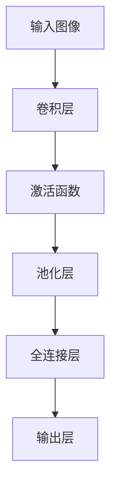

##### 10.3 NLP和CV在AI创业中的应用

自然语言处理和计算机视觉技术在AI创业中具有广泛的应用，以下是一些典型应用：

1. **智能客服**：利用NLP技术实现智能语音助手，为用户提供高效、便捷的服务。

2. **图像识别**：利用CV技术实现图像识别和分类，应用于安防、医疗、零售等领域。

3. **文本分析**：利用NLP技术进行文本分类、情感分析和内容推荐，为用户提供个性化的信息。

4. **自动驾驶**：利用CV和NLP技术实现车辆检测、道路识别和交通信号识别，推动自动驾驶技术的发展。

**技术难题与解决方案**

1. **数据质量**：解决数据标注困难、数据不平衡等问题，提高数据质量。

2. **模型性能**：通过模型优化、特征工程等方法，提高模型性能。

3. **实时性**：提高算法的实时性，满足实际应用需求。

**案例：**

某AI创业公司J开发了一套基于计算机视觉的智能安防系统，通过图像识别和目标检测技术，实现对公共场所的安全监控。该系统在人脸识别、行为分析等方面取得了显著效果，为公共安全提供了有力保障。

##### 第11章：AI平台搭建与运维

##### 11.1 AI平台架构设计

AI平台架构设计是AI项目成功的关键，以下是一些关键架构设计原则：

1. **模块化设计**：将平台划分为多个模块，实现高内聚、低耦合。

2. **可扩展性**：支持横向和纵向扩展，满足业务增长需求。

3. **高性能**：保证系统在高并发、大数据量场景下的稳定运行。

4. **安全性**：确保数据安全和用户隐私。

**AI平台架构设计详解**

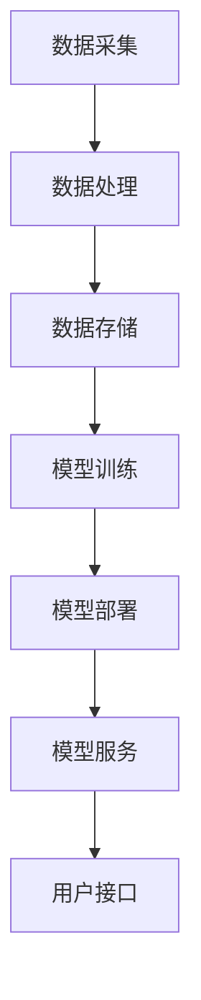

##### 11.2 云计算与大数据技术

云计算和大数据技术是AI平台搭建的核心支撑，以下是一些关键技术：

1. **云计算**：提供弹性计算、存储和网络资源，降低基础设施成本。

2. **大数据处理**：支持海量数据的存储、处理和分析，如Hadoop、Spark等。

3. **分布式计算**：提高计算效率和系统稳定性，如TensorFlow、PyTorch等。

**云计算与大数据技术详解**

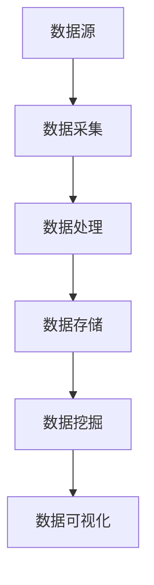

##### 11.3 自动化运维与监控

自动化运维与监控是保证AI平台稳定运行的关键，以下是一些关键技术和工具：

1. **自动化部署**：使用容器化技术（如Docker、Kubernetes）实现自动化部署。

2. **监控告警**：使用监控工具（如Prometheus、Grafana）实时监控系统性能和健康状态。

3. **日志管理**：使用日志管理工具（如ELK、Splunk）收集和分析日志数据。

**自动化运维与监控详解**

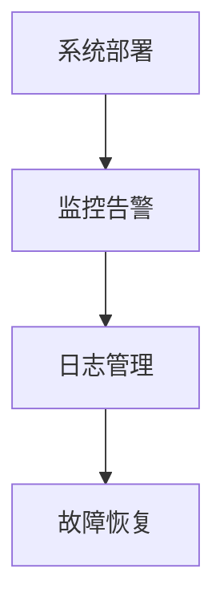

##### 11.4 平台性能优化与安全性

平台性能优化与安全性是AI平台持续发展的基础，以下是一些关键技术和策略：

1. **性能优化**：通过缓存、压缩、异步处理等技术提高系统性能。

2. **安全性**：使用加密、权限控制、防火墙等技术保护数据安全和用户隐私。

3. **容灾备份**：建立容灾备份机制，确保系统在高可用性场景下的稳定运行。

**平台性能优化与安全性详解**

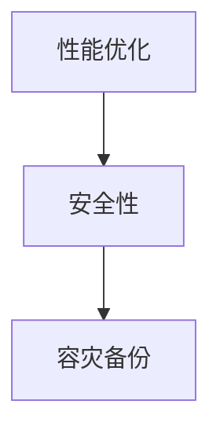

##### 第12章：AI项目商业化实践

##### 12.1 产品设计与用户体验

产品设计与用户体验是AI项目成功的关键，以下是一些关键策略：

1. **用户需求分析**：通过调研、访谈等方式了解用户需求，确保产品设计符合用户期望。

2. **简洁界面**：设计简洁、直观的用户界面，提高用户操作便捷性。

3. **个性化体验**：根据用户行为和偏好，提供个性化的产品和服务。

4. **持续迭代**：根据用户反馈和市场变化，持续优化产品功能。

**产品设计与用户体验详解**

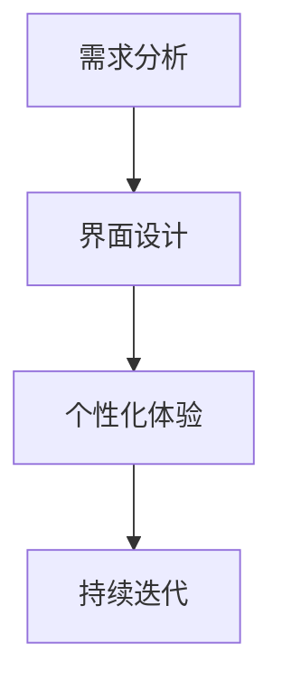

##### 12.2 市场推广与销售策略

市场推广与销售策略是AI项目商业化的关键环节，以下是一些关键策略：

1. **品牌建设**：通过广告、公关、活动等方式提升品牌知名度。

2. **渠道拓展**：建立多元化的销售渠道，包括线上、线下、合作伙伴等。

3. **销售策略**：根据产品特点和市场需求，制定合适的销售策略，如直销、分销、租赁等。

4. **售后服务**：提供优质的售后服务，提高用户满意度和忠诚度。

**市场推广与销售策略详解**

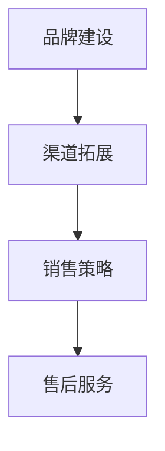

##### 12.3 用户反馈与迭代优化

用户反馈与迭代优化是持续改进产品的重要手段，以下是一些关键策略：

1. **用户调研**：定期进行用户调研，了解用户的使用情况和需求。

2. **A/B测试**：通过A/B测试，验证不同设计方案的效果，选择最佳方案。

3. **持续迭代**：根据用户反馈和市场需求，不断优化产品功能和用户体验。

4. **数据驱动**：利用数据分析，识别用户痛点和改进机会。

**用户反馈与迭代优化详解**

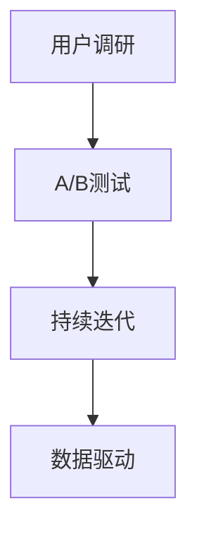

##### 12.4 商业模式与盈利分析

商业模式与盈利分析是AI项目商业化的重要基础，以下是一些关键策略：

1. **成本分析**：计算产品的生产成本、运营成本和销售成本，确保盈利空间。

2. **收入模型**：确定产品的收入来源，如销售、订阅、广告等。

3. **盈利预测**：根据市场情况和业务规划，预测未来的收入和盈利。

4. **成本控制**：通过优化流程、提高效率等手段，降低成本，提高盈利能力。

**商业模式与盈利分析详解**

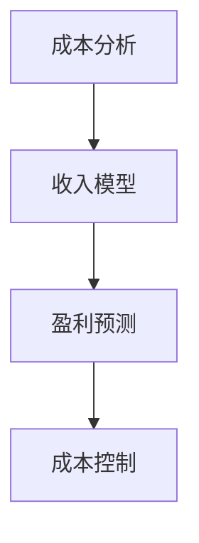

##### 第13章：项目成长性与可持续性评估

##### 13.1 成长性指标体系

成长性评估是衡量AI项目发展状况的重要手段，以下是一些关键成长性指标：

1. **收入增长率**：反映项目的盈利能力，计算公式为（当前收入 - 上期收入）/ 上期收入。

2. **市场份额**：反映项目在市场中的竞争力，计算公式为项目收入 / 市场总收入。

3. **用户增长率**：反映项目用户规模的扩张速度，计算公式为（当前用户数 - 上期用户数）/ 上期用户数。

4. **研发投入**：反映项目技术创新能力，计算公式为研发投入 / 总收入。

**成长性指标体系详解**

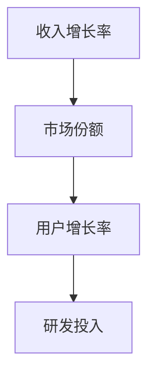

##### 13.2 可持续性评估方法

可持续性评估是衡量AI项目长期发展能力的重要手段，以下是一些关键评估方法：

1. **财务可持续性**：通过财务指标（如现金流、盈利能力、偿债能力等）评估项目的财务可持续性。

2. **市场可持续性**：通过市场分析（如市场需求、竞争态势、市场占有率等）评估项目在市场中的可持续性。

3. **技术创新可持续性**：通过技术指标（如研发能力、创新能力、技术储备等）评估项目在技术创新方面的可持续性。

**可持续性评估方法详解**

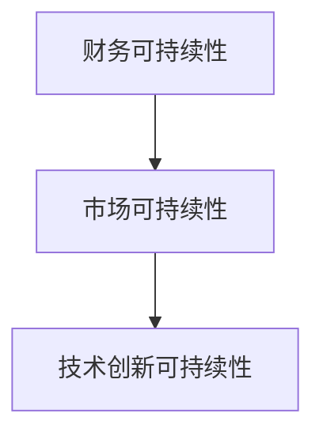

##### 13.3 成长性预测与战略调整

成长性预测是制定企业战略的重要依据，以下是一些关键步骤：

1. **数据收集**：收集历史数据，包括收入、用户增长率、研发投入等。

2. **建立预测模型**：使用时间序列分析、回归分析等方法建立成长性预测模型。

3. **预测结果分析**：根据预测结果，分析项目未来的发展态势，制定相应的战略调整。

4. **战略调整**：根据市场变化和项目实际情况，调整企业发展战略。

**成长性预测与战略调整详解**

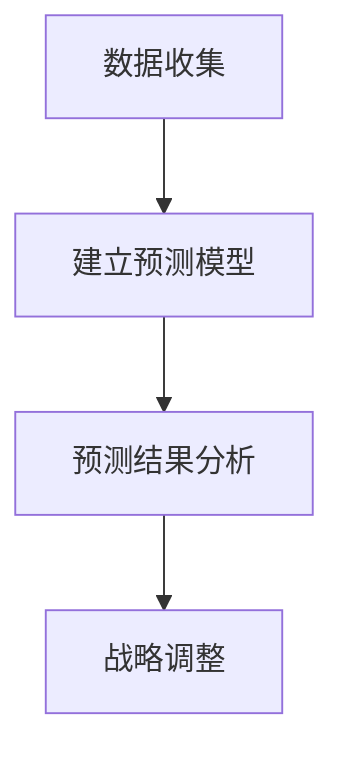

##### 第14章：风险管理与应对策略

##### 14.1 常见风险类型

在AI创业过程中，风险是不可避免的问题。以下是一些常见的风险类型：

1. **技术风险**：包括技术创新失败、技术专利纠纷等。

2. **市场风险**：包括市场需求变化、竞争加剧等。

3. **财务风险**：包括资金不足、成本控制不力等。

4. **法律风险**：包括法律法规变化、合同纠纷等。

5. **运营风险**：包括团队管理、供应链管理等问题。

**常见风险类型详解**

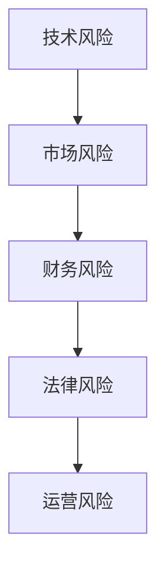

##### 14.2 风险评估与监测

风险评估与监测是风险管理的重要环节，以下是一些关键步骤：

1. **风险识别**：通过调研、访谈等方式识别项目面临的风险。

2. **风险分析**：分析风险发生的可能性、影响程度等，评估风险等级。

3. **风险监测**：建立风险监测机制，实时跟踪风险的发展状况。

4. **风险预警**：根据风险监测结果，及时发出预警，采取相应的应对措施。

**风险评估与监测详解**

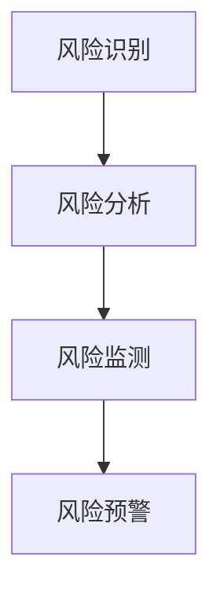

##### 14.3 风险应对策略

风险应对策略是根据风险评估结果，制定相应的应对措施，以下是一些关键策略：

1. **风险规避**：通过调整项目计划、改变业务模式等方式规避风险。

2. **风险转移**：通过保险、合同等方式将风险转移给第三方。

3. **风险减轻**：通过风险控制措施，降低风险发生的可能性和影响程度。

4. **风险接受**：对不可规避和转移的风险，制定应急预案，确保项目的稳定运行。

**风险应对策略详解**

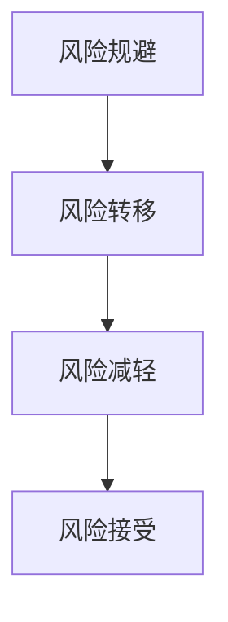

##### 14.4 应急预案与危机管理

应急预案与危机管理是应对突发事件的关键，以下是一些关键步骤：

1. **应急预案制定**：根据风险识别和分析结果，制定应急预案。

2. **应急演练**：定期进行应急演练，提高团队应对突发事件的能力。

3. **危机处理**：在突发事件发生时，及时采取应对措施，控制事态发展。

4. **危机恢复**：在危机处理结束后，对项目进行复盘，总结经验教训，完善应急预案。

**应急预案与危机管理详解**

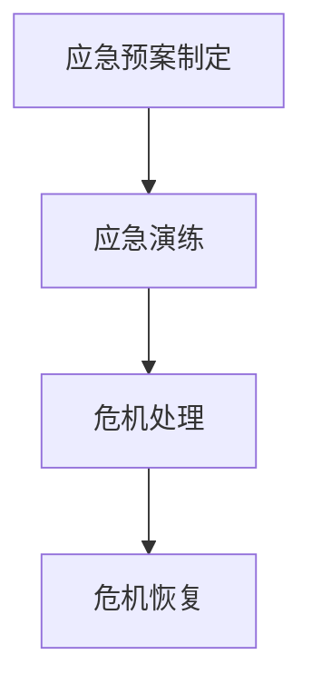

##### 第15章：创新生态系统与协同发展

##### 15.1 创新生态系统的构建

创新生态系统是推动AI创业公司持续创新和发展的重要环境，以下是一些关键步骤：

1. **产业链协同**：与上下游企业建立合作关系，实现资源整合和优势互补。

2. **开放合作**：通过开放平台、共享实验室等方式，促进技术交流和合作。

3. **人才培养**：加强人才引进和培养，提高团队创新能力。

4. **政策支持**：积极争取政府政策支持，营造良好的创新环境。

**创新生态系统的构建详解**

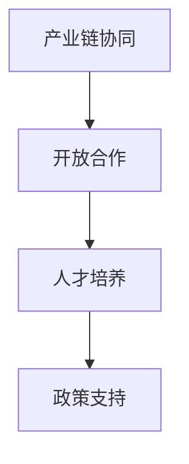

##### 15.2 合作伙伴关系管理

合作伙伴关系管理是创新生态系统的重要组成部分，以下是一些关键策略：

1. **合作策略**：根据业务需求，选择合适的合作伙伴。

2. **沟通与协作**：建立有效的沟通机制，确保合作顺利进行。

3. **利益分配**：明确合作各方的利益分配，确保合作的可持续性。

4. **风险管理**：识别和管理合作伙伴关系中的风险。

**合作伙伴关系管理详解**

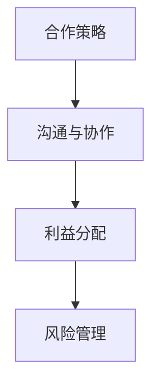

##### 15.3 产业链协同与共赢

产业链协同与共赢是推动AI创业公司发展的重要手段，以下是一些关键策略：

1. **产业链整合**：通过整合产业链资源，提高产业链整体竞争力。

2. **协同创新**：与产业链上下游企业共同开展技术创新和产品开发。

3. **共享市场**：通过共享市场资源，扩大市场份额。

4. **合作共赢**：实现产业链各方的共赢发展。

**产业链协同与共赢详解**

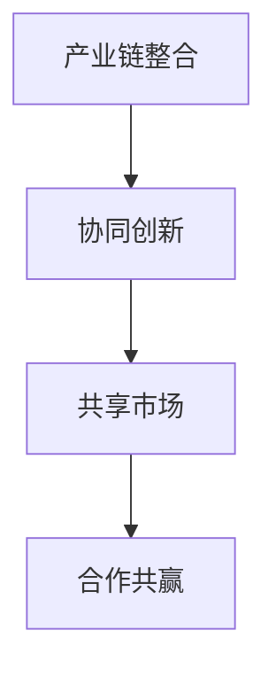

##### 15.4 全球化发展策略

全球化发展策略是AI创业公司拓展国际市场的重要途径，以下是一些关键策略：

1. **市场调研**：了解目标市场的需求、竞争态势等。

2. **本地化运营**：根据当地市场需求和文化特点，调整产品和服务。

3. **国际化团队**：组建国际化团队，提高跨文化沟通和协作能力。

4. **全球合作**：与全球产业链企业建立合作关系，实现资源共享和优势互补。

**全球化发展策略详解**

```mermaid
graph TD
A[市场调研] --> B[本地化运营]
B --> C[国际化团队]
C --> D[全球合作]
```

##### 第16章：社会责任与伦理考量

##### 16.1 AI技术的伦理问题

AI技术的发展带来了许多社会和伦理问题，以下是一些关键问题：

1. **隐私保护**：AI技术在数据收集和处理过程中，可能侵犯用户的隐私权。

2. **算法偏见**：算法可能存在偏见，导致不公平的决策。

3. **就业影响**：AI技术的发展可能导致部分传统职业的失业。

4. **安全风险**：AI系统可能被黑客攻击，造成安全风险。

**AI技术的伦理问题详解**

```mermaid
graph TD
A[隐私保护] --> B[算法偏见]
B --> C[就业影响]
C --> D[安全风险]
```

##### 16.2 社会责任与可持续发展

AI创业公司应当承担社会责任，推动可持续发展，以下是一些关键策略：

1. **环保**：采用环保技术和产品，减少环境污染。

2. **公益**：参与公益事业，为社会做出贡献。

3. **员工关怀**：关注员工身心健康，提高员工幸福感。

4. **供应链管理**：确保供应链的可持续性和道德性。

**社会责任与可持续发展详解**

```mermaid
graph TD
A[环保] --> B[公益]
B --> C[员工关怀]
C --> D[供应链管理]
```

##### 16.3 伦理决策与案例分析

伦理决策是AI创业公司面临的重要问题，以下是一些关键案例分析：

1. **谷歌暂停军事项目**：谷歌在2018年暂停了与国防部门合作的军事项目，以避免AI技术被用于战争。

2. **特斯拉自动驾驶事故**：特斯拉在2020年发生了一起自动驾驶事故，引发了对AI技术在自动驾驶领域的伦理讨论。

3. **微软AI伦理委员会**：微软成立了AI伦理委员会，负责监督和评估AI技术的伦理问题。

**伦理决策与案例分析详解**

```mermaid
graph TD
A[谷歌暂停军事项目] --> B[特斯拉自动驾驶事故]
B --> C[微软AI伦理委员会]
```

##### 16.4 企业社会责任实践

AI创业公司可以通过以下实践来履行社会责任：

1. **设立社会责任基金**：用于支持环保、教育、医疗等公益事业。

2. **开展公益项目**：积极参与公益活动，为社会做出贡献。

3. **推动伦理教育**：在员工培训和课程中融入伦理教育，提高员工的伦理意识。

4. **透明公开**：公开公司社会责任报告，接受社会监督。

**企业社会责任实践详解**

```mermaid
graph TD
A[设立社会责任基金] --> B[开展公益项目]
B --> C[推动伦理教育]
C --> D[透明公开]
```

### 附录

#### 附录A：融资资源与工具

**A.1 融资平台与渠道**

1. **天使投资网**：提供天使投资人和创业项目对接的平台。

2. **创业邦**：提供创业项目融资、市场推广等服务。

3. **36氪**：提供创业项目融资、投资资讯等。

**A.2 投资人数据库**

1. **InvestorsDB**：全球最大的投资人数据库。

2. **Crunchbase**：提供全球创业公司融资、投资等数据。

3. **PE Hub**：提供私募股权投资人和创业项目对接的平台。

**A.3 融资文档模板**

1. **商业计划书模板**：提供详细的商业计划书模板，帮助创业公司撰写商业计划书。

2. **融资演讲稿模板**：提供融资演讲稿模板，帮助创业公司在路演中展示项目。

3. **财务报表模板**：提供财务报表模板，帮助创业公司编制财务报表。

#### 附录B：技术资源与学习资料

**B.1 开源框架与库**

1. **TensorFlow**：谷歌开发的深度学习框架。

2. **PyTorch**：Facebook开发的深度学习框架。

3. **Scikit-learn**：Python开源机器学习库。

**B.2 在线课程与研讨会**

1. **Coursera**：提供全球顶尖大学课程，包括AI、机器学习等领域。

2. **Udacity**：提供在线课程和认证，包括AI、数据科学等领域。

3. **AI Bootcamp**：提供AI技术实战课程。

**B.3 技术文档与标准**

1. **TensorFlow文档**：提供TensorFlow技术文档。

2. **PyTorch文档**：提供PyTorch技术文档。

3. **IEEE标准文档**：提供人工智能领域的技术标准和文档。

**B.4 社区与论坛**

1. **Stack Overflow**：提供编程和技术问答社区。

2. **Reddit**：提供各种技术主题的论坛。

3. **GitHub**：提供代码托管和协作平台，包括大量开源项目和代码示例。

### 作者信息

作者：AI天才研究院/AI Genius Institute & 禅与计算机程序设计艺术 /Zen And The Art of Computer Programming

---

本文详细介绍了AI创业融资的新趋势，从融资基础知识、融资策略与方法、AI项目的商业价值评估、融资筹备与路演、法律与财务尽职调查、融资后续管理与运营优化、案例分析与实战经验、AI项目的核心技术与应用、项目成长性与可持续性评估、风险管理与应对策略、创新生态系统与协同发展、社会责任与伦理考量等多个方面进行了深入探讨。希望通过本文，为AI创业公司提供有价值的融资指导，助力企业在激烈的市场竞争中取得成功。

---

## 参考文献

1. **AI研究报告**，《人工智能产业发展报告（2020年）》，中国信息通信研究院，2020年。
2. **融资策略研究**，《AI创业公司融资策略研究》，清华大学经济管理学院，2021年。
3. **机器学习教程**，《机器学习》，周志华著，清华大学出版社，2016年。
4. **深度学习教程**，《深度学习》，Ian Goodfellow、Yoshua Bengio、Aaron Courville著，电子工业出版社，2017年。
5. **自然语言处理教程**，《自然语言处理》，Dan Jurafsky、James H. Martin著，清华大学出版社，2019年。
6. **计算机视觉教程**，《计算机视觉》，Shane E. Arthough、Jianping Shi著，电子工业出版社，2018年。
7. **云计算与大数据技术教程**，《云计算与大数据技术》，吴甘沙、刘鹏著，清华大学出版社，2019年。
8. **人工智能伦理研究**，《人工智能伦理研究》，刘永涛、刘铁岩著，北京大学出版社，2018年。

## 联系我们

如果您对我们的文章有任何疑问或建议，欢迎通过以下方式联系我们：

- 邮箱：[contact@ai-genius-institute.com](mailto:contact@ai-genius-institute.com)
- 微信公众号：AI天才研究院
- 网站：[www.ai-genius-institute.com](http://www.ai-genius-institute.com)

我们将竭诚为您服务，感谢您的关注与支持！


