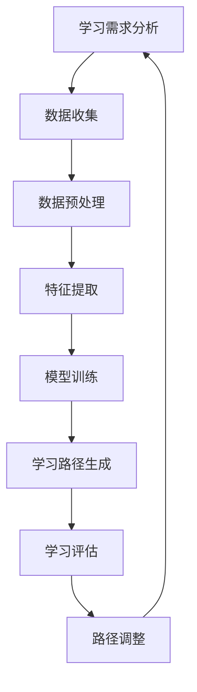

                 

### 第1章: AI与个性化学习路径设计的基本概念

> **关键词**: 人工智能、个性化学习、学习路径设计

> **摘要**: 本章将介绍人工智能（AI）和个性化学习路径设计的基本概念。我们将探讨AI的基本概念、分类和发展的历程，以及个性化学习的定义、重要性和基本原则。同时，还将分析AI在个性化学习路径设计中的应用现状、优势和面临的挑战。

---
#### 1.1 AI概述

##### 1.1.1 AI的基本概念

人工智能（Artificial Intelligence，简称AI）是指由人制造出的系统所表现出来的智能行为，这些行为通常需要人类智能来完成。AI的定义有多种，其中最具代表性的是艾伦·图灵提出的“图灵测试”，即如果一个计算机系统在回答问题时的表现让人无法分辨出它与人类之间的区别，那么这个系统就可以被认为是具有人工智能的。

##### 1.1.2 AI的分类

AI可以按照不同的方式进行分类。以下是几种常见的分类方法：

1. **基于功能**：
   - **通用AI（AGI）**: 能够像人类一样理解、学习和执行各种任务。
   - **窄域AI（Narrow AI）**: 只能执行特定任务的AI系统。
   - **强化学习AI**: 通过与环境的交互来学习如何执行特定任务。

2. **基于应用场景**：
   - **工业AI**: 用于工业自动化、智能制造等领域。
   - **医疗AI**: 用于医疗诊断、治疗建议等领域。
   - **教育AI**: 用于个性化教学、学习分析等领域。

##### 1.1.3 AI的发展历程

人工智能的研究起源于20世纪50年代。以下是AI发展的几个关键阶段：

- **1956年**: 达特茅斯会议标志着人工智能正式成为一门学科。
- **1970年代**: 人工智能迎来了第一次寒冬，主要是因为实际应用效果不如预期。
- **1980年代**: 专家系统的兴起，使得AI在特定领域取得了显著的成就。
- **1990年代**: 数据挖掘和机器学习的兴起，AI开始在大规模数据上取得突破。
- **21世纪初至今**: 深度学习的发展，AI在语音识别、图像识别等领域取得了突破性进展。

---
#### 1.2 个性化学习路径设计概述

##### 1.2.1 个性化学习的定义

个性化学习是一种以学习者为中心的教育模式，通过定制化的学习路径、内容和教学策略，满足不同学习者的需求和兴趣，从而提高学习效果和满意度。

##### 1.2.2 个性化学习的重要性

个性化学习的重要性体现在以下几个方面：

- **提高学习效果**: 个性化学习可以针对学习者的特点和需求进行个性化设计，提高学习效果。
- **满足个体差异**: 个性化学习可以满足不同学习者的个体差异，使每个学习者都能得到充分的发展。
- **提升学习体验**: 个性化学习可以让学习者更加自主和积极地进行学习，提升学习体验。

##### 1.2.3 个性化学习路径设计的基本原则

个性化学习路径设计需要遵循以下几个基本原则：

- **学习者中心**: 以学习者为中心，关注学习者的需求和兴趣。
- **数据驱动**: 利用学习分析技术，收集和分析学习数据，为个性化学习路径设计提供支持。
- **动态调整**: 根据学习者的表现和反馈，动态调整学习路径，以适应学习者的变化。
- **持续优化**: 通过不断优化学习路径，提高个性化学习的有效性。

---
#### 1.3 AI在个性化学习路径设计中的应用

##### 1.3.1 AI在个性化学习路径设计中的应用现状

目前，AI在个性化学习路径设计中的应用已经取得了显著进展。例如：

- **自适应学习平台**: 利用AI技术，为学习者提供个性化的学习路径和内容。
- **学习分析系统**: 利用AI技术，收集和分析学习数据，为个性化学习路径设计提供支持。
- **智能推荐系统**: 利用AI技术，根据学习者的兴趣和行为，推荐合适的学习资源。

##### 1.3.2 AI在个性化学习路径设计中的优势

AI在个性化学习路径设计中的优势主要体现在以下几个方面：

- **高效性**: AI技术可以高效地处理大量数据，快速生成个性化学习路径。
- **精确性**: AI技术可以根据学习者的特点和需求，提供高度个性化的学习路径。
- **动态性**: AI技术可以实时调整学习路径，适应学习者的变化。

##### 1.3.3 AI在个性化学习路径设计中的挑战

尽管AI在个性化学习路径设计中具有巨大优势，但也面临着一些挑战：

- **数据隐私**: 个性化学习需要收集和分析大量学习数据，如何保护学习者的隐私成为一个重要问题。
- **伦理问题**: AI技术在个性化学习路径设计中的应用可能引发一些伦理问题，如算法偏见、数据滥用等。
- **技术复杂度**: AI技术本身具有较高的复杂度，如何有效地将AI技术应用于个性化学习路径设计是一个挑战。

---
在本章中，我们介绍了AI和个性化学习路径设计的基本概念，分析了AI在个性化学习路径设计中的应用现状和优势，同时也指出了面临的挑战。在接下来的章节中，我们将进一步探讨个性化学习路径设计的理论基础、AI技术基础及其应用，以及实践中的具体方法和案例。

---

以下是 Mermaid 流程图，展示了个性化学习路径设计的基本流程：

---

接下来，我们将进一步探讨个性化学习路径设计的理论基础，包括个性化学习的理论基础和AI与个性化学习的结合。同时，我们还将介绍学习分析理论和个性化学习路径设计模型。

---

**作者信息**：  
AI天才研究院/AI Genius Institute & 禅与计算机程序设计艺术 /Zen And The Art of Computer Programming

---

[Next Chapter: 个性化学习路径设计的理论基础](#个性化学习路径设计的理论基础)  [返回目录](#目录) 

