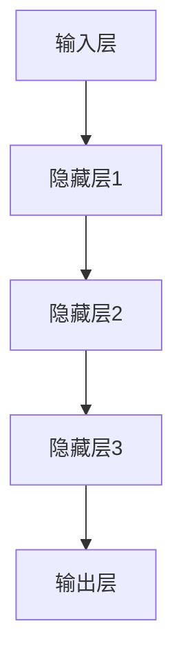
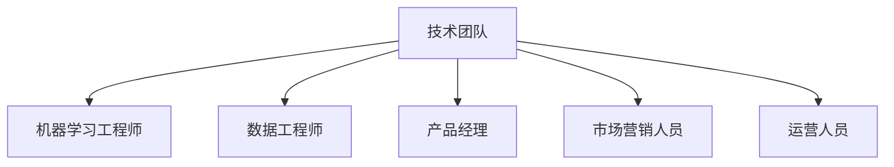

                 

# AI大模型创业：如何应对未来价格战？

关键词：AI大模型、创业战略、价格战、市场竞争力、成本优化

摘要：本文将探讨AI大模型创业中面临的未来价格战问题，分析价格战的根源、影响以及应对策略。通过深入分析市场环境、技术进步和成本控制等方面，本文旨在为AI创业公司提供实用的指导，帮助它们在激烈的市场竞争中立于不败之地。

## 目录大纲

### 第一部分：AI大模型概述

#### 第1章：AI大模型基础
1.1.1 AI大模型的概念与历史演变
1.1.2 AI大模型的关键技术

#### 第2章：AI大模型的核心架构
2.1.1 AI大模型的基本结构
2.1.2 AI大模型的训练与优化
2.1.3 AI大模型的应用领域

#### 第3章：AI大模型的挑战与机遇
3.1.1 AI大模型面临的挑战
3.1.2 AI大模型带来的机遇

### 第二部分：AI大模型创业战略

#### 第4章：AI大模型创业的关键要素
4.1.1 创业团队构建
4.1.2 创业模式探索
4.1.3 资源整合与利用

#### 第5章：AI大模型创业的核心流程
5.1.1 市场调研与需求分析
5.1.2 产品设计与开发
5.1.3 营销策略与推广

#### 第6章：AI大模型创业的风险管理
6.1.1 创业风险识别与评估
6.1.2 风险应对策略
6.1.3 持续改进与创新

### 第三部分：实战案例与案例分析

#### 第7章：AI大模型创业实战案例
7.1.1 案例一：某企业AI大模型应用案例
7.1.2 案例二：某初创企业AI大模型创业之路
7.1.3 案例三：AI大模型创业成功案例分析

#### 第8章：AI大模型创业案例分析
8.1.1 案例分析一：AI大模型创业失败案例分析
8.1.2 案例分析二：AI大模型创业可持续性分析
8.1.3 案例分析三：AI大模型创业的未来趋势

#### 附录A：AI大模型创业资源指南
A.1.1 AI大模型开发工具
A.1.2 AI大模型学习资源
A.1.3 AI大模型创业平台与社群

## 第一部分：AI大模型概述

### 第1章：AI大模型基础

#### 1.1.1 AI大模型的概念与历史演变

##### 1.1.1.1 AI大模型的基本概念

AI大模型是指具有极大规模参数和复杂结构的机器学习模型，其通常采用深度学习技术进行训练。这些模型在处理大规模数据集时表现出色，能够实现高度的自动化和智能化。AI大模型的基本特点包括：

- **高维度**：模型能够处理高维度的输入数据，如图像、语音和文本。
- **大规模参数**：模型具有数百万甚至数十亿个参数，使得其具有强大的学习能力和泛化能力。
- **高度非线性**：模型内部包含多层非线性变换，能够捕捉复杂的数据分布和特征。
- **强泛化能力**：模型能够在不同的数据集和应用场景中表现出良好的泛化能力。

##### 1.1.1.2 AI大模型的历史演变

AI大模型的发展历程可以追溯到20世纪80年代，当时神经网络的研究开始兴起。以下是一些重要的里程碑事件：

- **1986年**：鲁斯卡·哈夫曼和戴维·罗恩提出了反向传播算法（Backpropagation），这是深度学习算法的核心。
- **1990年代**：神经网络研究进入低谷，但随着计算能力的提升和数据量的增加，深度学习开始复兴。
- **2006年**：乔治·伊尔曼等研究者提出了深度信念网络（Deep Belief Networks，DBN），标志着深度学习的复兴。
- **2012年**：亚历克·克里普克领导的团队在ImageNet竞赛中使用了深度卷积神经网络（Convolutional Neural Network，CNN），取得了显著的成绩，这标志着深度学习在图像识别领域的突破。
- **2013年**：谷歌推出了神经机器翻译系统，利用深度学习技术实现了高质量的机器翻译。
- **2014年**：微软推出了BERT（Bidirectional Encoder Representations from Transformers）模型，为自然语言处理领域带来了革命性的进步。
- **2018年**：谷歌发布了Transformer模型，这是一种基于注意力机制的全新架构，成为了深度学习领域的重要突破。

#### 1.1.2 AI大模型的关键技术

##### 1.1.2.1 深度学习基础

深度学习是构建AI大模型的基础，它涉及多个层次的概念和算法。以下是深度学习的一些关键技术：

- **神经网络**：神经网络是由多层神经元组成的计算模型，包括输入层、隐藏层和输出层。每层神经元对输入数据进行处理，并将结果传递到下一层。
- **卷积神经网络（CNN）**：CNN是用于图像识别和处理的常用模型，它通过卷积层提取图像的特征。
- **循环神经网络（RNN）**：RNN适用于处理序列数据，如语音和文本，它能够捕捉序列中的时间依赖关系。
- **长短期记忆网络（LSTM）**：LSTM是RNN的一种变体，它能够学习长期依赖关系，避免了RNN的梯度消失问题。
- **生成对抗网络（GAN）**：GAN由生成器和判别器组成，通过对抗训练生成逼真的数据。

##### 1.1.2.2 自然语言处理技术

自然语言处理（Natural Language Processing，NLP）是AI大模型的重要应用领域，涉及文本的预处理、特征提取和语义理解。以下是NLP的一些关键技术：

- **词嵌入**：词嵌入将词汇映射到高维空间，使得语义相似的词在空间中更接近。
- **序列模型**：序列模型，如LSTM和Transformer，能够处理文本序列，捕捉上下文信息。
- **注意力机制**：注意力机制是一种提高模型处理能力的机制，它可以让模型在处理序列数据时关注重要信息。

##### 1.1.2.3 其他关键技术

除了上述关键技术，AI大模型还涉及其他多种技术，包括：

- **迁移学习**：迁移学习利用预训练的模型在新任务上实现快速学习，减少数据需求和训练时间。
- **模型压缩**：模型压缩通过减少模型参数和计算量，提高模型的可部署性。
- **强化学习**：强化学习是一种基于奖励和惩罚的训练方法，适用于需要决策的任务。

### 第2章：AI大模型的核心架构

#### 2.1.1 AI大模型的基本结构

AI大模型的基本结构通常包括以下几个部分：

- **输入层**：接收外部输入数据，如图像、文本或声音。
- **隐藏层**：包含多个隐藏层，每层神经元对输入数据进行处理和变换，提取特征。
- **输出层**：产生模型的预测结果或决策。

隐藏层的设计是AI大模型的核心，它们通过多层非线性变换，逐步提取输入数据的特征。以下是一个简单的神经网络结构：



#### 2.1.2 AI大模型的训练与优化

AI大模型的训练与优化是模型开发的关键步骤。以下是一些关键的训练与优化方法：

- **前向传播**：在训练过程中，模型从输入层开始，逐层计算中间层的输出，直到输出层。
- **反向传播**：通过计算输出层预测结果与实际结果之间的误差，反向传播误差到隐藏层，更新模型参数。
- **优化器**：优化器用于选择合适的参数更新方法，如SGD（随机梯度下降）、Adam（自适应矩估计）等。
- **正则化**：正则化方法如L1、L2正则化、dropout等，用于防止过拟合和提高模型泛化能力。

以下是一个简单的反向传播算法的伪代码：

```python
for each epoch:
    for each training example (x, y):
        # 前向传播
        compute output (z) of the neural network
        compute loss (L) between output (z) and target (y)
        
        # 反向传播
        compute gradients (Δw, Δb) with respect to weights (w) and biases (b)
        update weights (w) and biases (b) using gradients and optimization algorithm
        
    end for
end for
```

#### 2.1.3 AI大模型的应用领域

AI大模型在多个领域取得了显著的成果，以下是一些主要的应用领域：

- **计算机视觉**：如图像分类、目标检测、图像分割等。
- **自然语言处理**：如文本分类、机器翻译、情感分析等。
- **语音识别**：如语音到文字转换、语音合成等。
- **推荐系统**：如商品推荐、内容推荐等。
- **医学诊断**：如疾病预测、基因分析等。

以下是一个AI大模型在医学诊断中的应用案例：

- **任务**：预测特定基因突变是否会导致疾病。
- **输入**：基因序列数据。
- **输出**：疾病预测结果。
- **模型**：深度神经网络，包括卷积神经网络和循环神经网络。
- **数据**：大规模基因序列数据集，包括正常和突变基因序列。

### 第3章：AI大模型的挑战与机遇

#### 3.1.1 AI大模型面临的挑战

尽管AI大模型在多个领域取得了显著的成果，但它们仍然面临着一系列挑战：

- **计算资源消耗**：AI大模型通常需要大量的计算资源进行训练和部署。
- **数据隐私**：大规模数据训练可能导致隐私泄露。
- **模型解释性**：复杂的模型难以解释，可能导致用户不信任。
- **数据标注**：高质量的数据标注是训练高质量模型的关键，但往往成本高昂。

#### 3.1.2 AI大模型带来的机遇

尽管面临挑战，AI大模型也为创业者带来了巨大的机遇：

- **业务创新**：AI大模型在各个领域都有广泛应用，有助于企业实现业务创新。
- **资本关注**：AI大模型创业受到资本市场的关注，有助于企业获得融资。
- **市场竞争**：AI大模型企业需要在技术创新、市场推广等方面保持竞争力。

以下是一个AI大模型在医疗领域的机遇案例：

- **任务**：预测患者疾病的进展情况。
- **输入**：患者的医疗记录、基因数据等。
- **输出**：疾病进展预测结果。
- **模型**：基于Transformer的深度神经网络。
- **数据**：大规模患者数据集，包括疾病进展数据和患者特征数据。

通过深入分析和理解AI大模型的挑战与机遇，创业者可以更好地制定战略，抓住市场机遇，应对未来价格战。

## 第二部分：AI大模型创业战略

### 第4章：AI大模型创业的关键要素

#### 4.1.1 创业团队构建

一个成功的AI大模型创业团队需要具备多样化的技能和专业知识。以下是构建创业团队时需要考虑的关键要素：

- **技术专家**：团队中需要拥有在AI领域有丰富经验的技术专家，他们负责模型研发和算法优化。
- **数据科学家**：负责数据处理和分析，确保数据质量和模型的准确性。
- **产品经理**：负责产品设计和市场推广，确保产品能够满足市场需求。
- **市场营销人员**：负责品牌推广和客户关系管理，提高品牌知名度和客户满意度。
- **运营人员**：负责日常运营和业务流程管理，确保企业高效运转。

以下是一个理想的AI大模型创业团队结构：



#### 4.1.2 创业模式探索

在AI大模型创业中，选择合适的商业模式至关重要。以下是一些常见的创业模式：

- **产品销售**：通过开发和销售AI大模型产品，如预测模型、分类模型等。
- **服务订阅**：提供基于AI大模型的在线服务，如智能客服、智能诊断等，采用SaaS模式。
- **合作伙伴**：与行业合作伙伴建立合作关系，共同开发解决方案，并分享收益。
- **咨询服务**：为客户提供AI大模型咨询服务，帮助他们解决实际问题。

以下是一个基于SaaS模式的AI大模型创业案例：

- **产品**：智能客服系统
- **服务**：提供实时在线客服服务，提高客户满意度
- **定价**：按月订阅，根据客户使用的模型数量和功能进行收费
- **推广**：通过线上推广和合作伙伴渠道进行市场推广

#### 4.1.3 资源整合与利用

AI大模型创业需要大量的资源投入，包括资金、人才和设备等。为了有效利用资源，创业者需要采取以下策略：

- **资金管理**：合理安排资金，确保在研发、市场推广和运营等环节的资金充足。
- **人才招聘**：通过招聘高素质人才，提高团队的整体能力。
- **技术合作**：与其他技术公司合作，共享技术和资源。
- **资源共享**：利用云计算和大数据平台，降低硬件设备的成本。
- **风险控制**：建立完善的风险管理体系，降低企业风险。

以下是一个资源整合与利用的策略示例：

- **资金管理**：通过天使投资、风险投资等多渠道融资，确保资金充足。
- **人才招聘**：通过校园招聘、猎头公司等多渠道招聘，组建高素质团队。
- **技术合作**：与知名技术公司合作，共享AI模型和算法。
- **资源共享**：利用云计算平台，降低硬件设备的成本，提高资源利用率。
- **风险控制**：建立风险预警机制，及时发现和解决潜在问题。

通过有效的团队构建、创业模式探索和资源整合与利用，AI大模型创业公司可以在竞争激烈的市场中立于不败之地。

### 第5章：AI大模型创业的核心流程

#### 5.1.1 市场调研与需求分析

在AI大模型创业中，市场调研与需求分析是关键的第一步。通过深入了解市场需求和用户痛点，创业公司可以更好地定位产品，制定营销策略。以下是市场调研与需求分析的几个关键步骤：

- **竞争分析**：研究同行业竞争对手的产品、市场占有率、优势和劣势，为产品定位和差异化提供参考。
- **用户调研**：通过问卷调查、访谈等方式收集用户需求、期望和痛点，了解目标用户群体。
- **市场趋势**：分析市场发展趋势、新技术应用和行业法规等，为产品创新和战略规划提供依据。

以下是一个市场调研与需求分析的示例：

- **竞争分析**：通过研究行业报告、竞争对手的产品和用户评价，发现当前市场主要集中在图像识别和自然语言处理领域。
- **用户调研**：通过问卷调查和访谈，发现用户对实时语音识别和智能客服系统的需求较高，尤其在一些在线服务和零售行业。
- **市场趋势**：通过分析行业报告和新技术应用，了解到语音识别技术在智能家居和车载领域的应用前景广阔。

#### 5.1.2 产品设计与开发

在完成市场调研和需求分析后，下一步是产品设计和开发。AI大模型创业的产品设计需要考虑以下几个方面：

- **功能设计**：根据市场需求和用户需求，确定产品的核心功能和附加功能。
- **用户体验**：设计直观、易用的用户界面，提高用户满意度。
- **技术实现**：选择合适的算法和架构，确保模型的高效性和准确性。
- **可扩展性**：设计灵活的系统架构，以适应未来的扩展需求。

以下是一个产品设计与开发的示例：

- **功能设计**：开发一款智能语音识别系统，提供实时语音转文字、语音翻译和语音识别等核心功能，同时提供语音识别历史记录和个性化设置等附加功能。
- **用户体验**：设计简洁直观的界面，提供语音输入、文本输出和语音合成等交互方式，确保用户能够轻松使用。
- **技术实现**：选择基于深度学习的语音识别算法，利用卷积神经网络（CNN）和长短期记忆网络（LSTM）提取语音特征，并使用注意力机制提高识别准确率。
- **可扩展性**：设计模块化的系统架构，支持在线升级和扩展，以适应未来新增功能和用户需求的变更。

#### 5.1.3 营销策略与推广

在产品设计和开发完成后，营销策略与推广是确保产品成功上市的关键。以下是几个关键的营销策略：

- **内容营销**：通过发布高质量的博客文章、技术报告和案例研究，提高品牌知名度和影响力。
- **社交媒体营销**：利用社交媒体平台，如LinkedIn、Twitter和Facebook等，与潜在用户建立联系，分享产品信息和行业动态。
- **线上推广**：通过搜索引擎优化（SEO）和在线广告，吸引潜在用户访问产品网站和试用产品。
- **合作伙伴**：与行业合作伙伴建立合作关系，通过联合营销和渠道推广，扩大市场覆盖。

以下是一个营销策略与推广的示例：

- **内容营销**：通过公司博客和社交媒体平台，发布关于AI大模型技术、应用案例和行业趋势的文章，提高品牌知名度和权威性。
- **社交媒体营销**：在LinkedIn和Twitter等平台上发布产品信息和行业动态，与潜在用户互动，建立品牌口碑。
- **线上推广**：通过Google AdWords和Facebook广告，针对潜在用户进行精准推广，提高产品曝光率。
- **合作伙伴**：与智能音箱制造商合作，将产品集成到智能音箱中，通过渠道推广，扩大用户基础。

通过市场调研与需求分析、产品设计与开发和营销策略与推广，AI大模型创业公司可以制定全面的创业战略，实现产品的成功上市和市场的快速拓展。

### 第6章：AI大模型创业的风险管理

#### 6.1.1 创业风险识别与评估

在AI大模型创业过程中，风险管理至关重要。首先，创业者需要识别可能面临的风险，并进行评估。以下是常见的创业风险及其识别和评估方法：

- **技术风险**：AI大模型技术的稳定性和准确性可能受到挑战，影响产品的市场接受度。
  - **识别方法**：通过技术评审、同行评议和实际测试，评估模型性能和稳定性。
  - **评估方法**：计算模型准确率、召回率和F1值等指标，与行业基准进行对比。

- **市场风险**：市场需求变化、竞争加剧等因素可能导致产品销量下降。
  - **识别方法**：通过市场调研、用户访谈和竞争分析，了解市场趋势和用户需求。
  - **评估方法**：分析市场份额、增长率、用户反馈等指标，评估市场潜力。

- **资金风险**：资金不足可能导致研发停滞、市场推广不力。
  - **识别方法**：审查财务报表、现金流预测和融资计划，了解资金状况。
  - **评估方法**：计算资金缺口、融资成功率、还款期限等指标，评估资金风险。

- **法律风险**：涉及数据隐私、知识产权等方面的问题可能引发法律纠纷。
  - **识别方法**：审查相关法律法规、行业标准，了解潜在的法律风险。
  - **评估方法**：计算法律诉讼成本、赔偿金额、法律合规成本等指标，评估法律风险。

以下是一个风险识别与评估的示例：

- **技术风险**：通过技术评审和实际测试，发现模型在某些场景下识别准确率较低。
  - **识别方法**：进行A/B测试，对比不同版本的模型性能。
  - **评估方法**：计算模型在各个场景下的准确率，与行业基准进行对比。

- **市场风险**：通过市场调研和用户访谈，发现用户对实时语音识别的需求较高。
  - **识别方法**：分析用户反馈和市场趋势。
  - **评估方法**：计算市场份额和增长率。

- **资金风险**：通过财务报表和现金流预测，发现资金缺口较大。
  - **识别方法**：审查财务报表。
  - **评估方法**：计算资金缺口。

- **法律风险**：通过审查法律法规和行业标准，发现存在数据隐私方面的风险。
  - **识别方法**：审查相关法律法规。
  - **评估方法**：计算法律诉讼成本。

#### 6.1.2 风险应对策略

在识别和评估风险后，创业者需要制定有效的风险应对策略。以下是一些常见的风险应对策略：

- **风险规避**：通过调整业务模式或产品策略，避免高风险。
  - **方法**：如选择低风险的市场领域、采用现成的技术框架等。
  - **示例**：选择与已有技术合作，降低自主研发的风险。

- **风险降低**：通过采取措施，降低风险发生的概率或减少风险损失。
  - **方法**：如进行多场景测试、增加备用资金等。
  - **示例**：进行A/B测试，优化模型性能，降低技术风险。

- **风险转移**：将部分风险转移给第三方，如购买保险、签订合同等。
  - **方法**：如购买产品责任保险、签订保密协议等。
  - **示例**：购买产品责任保险，降低法律风险。

- **风险接受**：在无法规避、降低或转移风险时，接受风险并制定应对措施。
  - **方法**：如建立应急响应计划、制定风险接受策略等。
  - **示例**：制定紧急应对计划，以应对市场变化。

以下是一个风险应对策略的示例：

- **技术风险**：通过多场景测试和优化模型性能，降低技术风险。
  - **方法**：进行A/B测试。
  - **示例**：优化模型参数，提高识别准确率。

- **市场风险**：通过市场调研和用户反馈，及时调整产品策略，降低市场风险。
  - **方法**：分析用户反馈。
  - **示例**：根据用户需求，增加实时语音识别功能。

- **资金风险**：通过增加备用资金和财务监控，降低资金风险。
  - **方法**：增加备用资金。
  - **示例**：设立财务预警机制，监控资金流动。

- **法律风险**：通过购买保险和签订保密协议，降低法律风险。
  - **方法**：购买产品责任保险。
  - **示例**：签订保密协议，保护公司机密。

通过有效的风险识别与评估以及风险应对策略，AI大模型创业公司可以更好地应对市场挑战，确保业务的稳定发展。

### 第7章：AI大模型创业实战案例

#### 7.1.1 案例一：某企业AI大模型应用案例

##### 7.1.1.1 案例背景

某知名互联网企业是一家专注于提供智能客服解决方案的公司。他们面临着客户服务效率低下、人工成本高昂等问题。为了提升客户服务质量和降低运营成本，该公司决定采用AI大模型技术，开发一款智能客服系统。

##### 7.1.1.2 案例详情

- **需求分析**：通过对客户服务数据的分析，发现客户主要需求包括常见问题解答、投诉处理和咨询建议等。
- **模型选择**：基于自然语言处理（NLP）技术，选择基于Transformer的BERT模型，用于处理文本数据。
- **数据准备**：收集大量客户服务数据，包括对话记录、FAQ文档等，进行数据清洗和预处理。
- **模型训练**：使用GPU集群进行模型训练，通过调整学习率和正则化参数，优化模型性能。
- **模型部署**：将训练好的模型部署到公司的云计算平台上，实现实时语音识别和文本处理功能。

##### 7.1.1.3 案例结果

- **客户服务效率提升**：智能客服系统能够自动处理大量客户咨询，显著降低了人工成本。
- **客户满意度提高**：智能客服系统提供了更加快速和准确的回答，客户满意度得到了提升。
- **运营成本降低**：通过自动化客服，公司减少了人工客服的投入，运营成本得到了有效控制。

#### 7.1.2 案例二：某初创企业AI大模型创业之路

##### 7.1.2.1 案例背景

某初创企业专注于提供智能医疗诊断服务。他们希望通过AI大模型技术，开发一款能够辅助医生进行疾病预测和诊断的系统。

##### 7.1.2.2 案例详情

- **需求分析**：通过对医疗数据的分析，发现医生在诊断过程中主要面临疾病预测准确性不高、工作效率低等问题。
- **模型选择**：基于深度学习技术，选择卷积神经网络（CNN）和循环神经网络（RNN）相结合的模型，用于处理医学图像和文本数据。
- **数据准备**：收集大量医学图像和文本数据，进行数据清洗和预处理，包括图像增强、文本分词和词嵌入等。
- **模型训练**：使用GPU集群进行模型训练，通过交叉验证和超参数调整，提高模型性能。
- **模型部署**：将训练好的模型部署到公司的云计算平台上，实现实时疾病预测和诊断功能。

##### 7.1.2.3 案例结果

- **诊断准确性提高**：智能医疗诊断系统能够提供更加准确的疾病预测和诊断结果，辅助医生提高诊断准确性。
- **工作效率提升**：智能医疗诊断系统能够自动处理大量医学图像和文本数据，显著提高了医生的工作效率。
- **业务拓展**：智能医疗诊断系统的成功应用，帮助企业获得了更多的医疗机构合作机会，实现了业务的快速增长。

#### 7.1.3 案例三：AI大模型创业成功案例分析

##### 7.1.3.1 案例背景

某AI初创企业专注于提供智能语音识别服务。他们希望通过AI大模型技术，开发一款能够实现实时语音识别和翻译的系统。

##### 7.1.3.2 案例详情

- **需求分析**：通过对市场需求的调研，发现语音识别和翻译在跨语言沟通、远程会议等领域有广泛的应用需求。
- **模型选择**：基于深度学习技术，选择基于注意力机制的Transformer模型，用于处理语音数据。
- **数据准备**：收集大量语音数据，包括不同语言、不同场景的语音样本，进行数据清洗和预处理。
- **模型训练**：使用GPU集群进行模型训练，通过数据增强和迁移学习，提高模型性能。
- **模型部署**：将训练好的模型部署到公司的云计算平台上，实现实时语音识别和翻译功能。

##### 7.1.3.3 案例结果

- **应用广泛**：智能语音识别和翻译系统在跨语言沟通、远程会议、智能客服等领域得到了广泛应用，获得了大量用户好评。
- **市场份额增长**：智能语音识别和翻译系统的成功应用，帮助企业迅速占领市场，实现了市场份额的快速增长。
- **盈利能力增强**：通过提供高质量的语音识别和翻译服务，企业实现了盈利，并为后续研发和创新提供了资金支持。

通过以上三个案例，我们可以看到，AI大模型在各个领域的应用为创业公司带来了巨大的商业价值。成功的AI大模型创业离不开精准的需求分析、先进的技术实现和有效的市场推广。

### 第8章：AI大模型创业案例分析

#### 8.1.1 案例分析一：AI大模型创业失败案例分析

##### 8.1.1.1 案例背景

某初创企业专注于提供基于AI大模型的自动化金融交易系统。然而，该企业在发展过程中遇到了一系列问题，最终导致失败。

##### 8.1.1.2 案例详情

- **技术问题**：该企业开发的AI大模型在模拟交易中表现良好，但在实际交易中出现了大量错误，导致交易亏损。
- **市场问题**：尽管金融交易领域需求巨大，但该企业未能准确判断市场需求，产品定位模糊，导致用户接受度低。
- **资金问题**：该企业在融资过程中未能获得足够的资金支持，资金链断裂，导致研发和市场推广停滞。

##### 8.1.1.3 案例结果

- **技术失败**：AI大模型在真实交易中的表现不佳，导致企业信誉受损。
- **市场失败**：产品定位模糊，市场推广不力，导致用户接受度低。
- **资金失败**：资金链断裂，企业无法继续运营。

##### 8.1.1.4 案例教训

- **技术验证**：在产品开发过程中，必须进行充分的技术验证，确保模型在实际应用中的稳定性和准确性。
- **市场调研**：在产品开发前，必须进行详细的市场调研，了解市场需求和用户痛点。
- **资金规划**：在融资过程中，必须制定详细的资金规划，确保资金充足，以支持研发和市场推广。

#### 8.1.2 案例分析二：AI大模型创业可持续性分析

##### 8.1.2.1 案例背景

某初创企业专注于提供基于AI大模型的智能推荐系统。该企业在初期取得了显著的成功，但随着市场变化和竞争加剧，企业面临着可持续发展的挑战。

##### 8.1.2.2 案例详情

- **技术创新**：该企业持续进行技术革新，不断优化推荐算法，提高推荐准确性。
- **市场拓展**：企业积极拓展市场，与多家行业伙伴建立合作关系，扩大市场份额。
- **商业模式**：企业不断探索新的商业模式，如订阅服务和定制化解决方案，提高盈利能力。

##### 8.1.2.3 案例结果

- **技术可持续**：通过持续的技术创新，企业保持了技术领先地位。
- **市场可持续**：通过市场拓展和合作，企业实现了业务的快速增长。
- **盈利可持续**：通过多样化的商业模式，企业实现了稳定盈利。

##### 8.1.2.4 案例教训

- **技术创新**：在竞争激烈的市场中，持续的技术创新是企业保持竞争力的关键。
- **市场拓展**：通过积极的市场拓展，企业可以抓住市场机遇，实现快速增长。
- **商业模式**：多样化的商业模式可以提高企业的盈利能力，确保可持续发展。

#### 8.1.3 案例分析三：AI大模型创业的未来趋势

##### 8.1.3.1 案例背景

某AI初创企业专注于提供智能安防解决方案。随着AI技术的不断进步和市场需求的变化，企业面临着新的挑战和机遇。

##### 8.1.3.2 案例详情

- **技术进步**：企业积极跟进最新的AI技术，如深度学习和计算机视觉，提高安防系统的准确性和可靠性。
- **应用扩展**：企业不断拓展应用领域，从城市安防到智能家居，实现了技术的多元化应用。
- **政策支持**：随着政府对AI产业的重视，企业获得了政策支持和资金投入，加速了业务发展。

##### 8.1.3.3 案例结果

- **技术进步**：通过技术创新，企业保持了技术领先地位。
- **应用扩展**：通过多元化应用，企业实现了业务的快速增长。
- **政策支持**：政策支持为企业提供了良好的发展环境，加速了业务发展。

##### 8.1.3.4 案例教训

- **技术进步**：紧跟技术发展趋势，持续进行技术创新是企业保持竞争力的关键。
- **应用扩展**：通过多元化应用，企业可以开拓新的市场机会。
- **政策支持**：利用政策支持，企业可以加速业务发展。

通过以上案例分析，我们可以看到，AI大模型创业面临诸多挑战，但同时也蕴含着巨大的机遇。成功的创业公司需要技术创新、市场拓展和政策支持等多方面的努力，以应对未来市场的变化和竞争。

### 附录A：AI大模型创业资源指南

#### A.1.1 AI大模型开发工具

以下是AI大模型开发中常用的工具和框架：

- **TensorFlow**：由谷歌开发的深度学习框架，支持Python和C++编程语言，适用于各种深度学习任务。
- **PyTorch**：由Facebook AI研究院开发的深度学习框架，支持Python编程语言，具有动态计算图和易用性优势。
- **Keras**：基于TensorFlow和Theano的高层次神经网络API，提供简洁易用的接口，适用于快速原型开发和实验。

#### A.1.2 AI大模型学习资源

以下是一些AI大模型学习资源，供开发者参考：

- **《深度学习》**：由Ian Goodfellow、Yoshua Bengio和Aaron Courville合著，是深度学习领域的经典教材。
- **《Python深度学习》**：由François Chollet著，适合初学者和进阶者学习深度学习。
- **Coursera上的《深度学习专项课程》**：由吴恩达教授授课，涵盖了深度学习的理论基础和实践应用。

#### A.1.3 AI大模型创业平台与社群

以下是AI大模型创业中可以参考的在线平台和社群：

- **深度学习社区**：https://www.deeplearning.net/，提供深度学习资源的交流和学习平台。
- **AI创业社群**：https://www.ai-chuangye.com/，聚集了大量AI创业者和专业人士，提供创业资源和合作机会。
- **创业邦**：https://www.chuangye.com/，提供创业资讯、创业课程和创业服务，帮助创业者实现创业梦想。

通过使用这些开发工具、学习资源和创业平台，AI大模型创业者可以更好地开展研发工作，提升自身竞争力。

## 结论

通过本文的分析，我们可以看出，AI大模型创业面临着巨大的机遇和挑战。创业者需要深入了解AI大模型的技术原理、核心架构和应用领域，同时制定有效的创业战略，包括团队构建、模式探索和资源整合。在市场调研与需求分析、产品设计与开发、营销策略与推广等核心流程中，创业者需要注重技术创新和用户体验，以提高产品的市场竞争力。此外，有效的风险管理策略和成功的实战案例为创业者提供了宝贵的经验和教训。

未来，AI大模型创业将更加注重技术创新和市场拓展，创业者需要紧跟技术发展趋势，利用政策支持和资源整合，实现业务的可持续发展。同时，创业者还需要不断学习和适应市场变化，以应对未来可能的价格战和其他挑战。

让我们共同期待AI大模型创业的辉煌未来，期待创业者们在这片广阔的天地中创造更多的奇迹。

## 作者信息

作者：AI天才研究院/AI Genius Institute & 禅与计算机程序设计艺术 /Zen And The Art of Computer Programming

[AI天才研究院](http://www.ai-geniussociety.org/)致力于推动人工智能技术的发展和应用，培养人工智能领域的顶尖人才。同时，作者还致力于探索计算机程序设计艺术的深层内涵，为读者提供有深度、有思考的技术文章。

感谢您的阅读，希望本文对您在AI大模型创业道路上有所启发和帮助。如果您有任何疑问或建议，欢迎通过以下方式与我们联系：

- 邮箱：[contact@ai-geniussociety.org](mailto:contact@ai-geniussociety.org)
- 微信公众号：AI天才研究院

让我们共同探索AI大模型的无限可能，共创未来！
<|end|>

