                 

### 文章标题

# AI大模型在程序员面试辅导中的应用实践

### 关键词：

- AI大模型
- 程序员面试
- 面试题库
- 面试辅导
- 智能面试
- 面试评估

### 摘要：

本文旨在探讨AI大模型在程序员面试辅导中的应用实践。首先，我们介绍了AI大模型的基础概念、发展背景和核心算法，包括深度学习、预训练模型和迁移学习。接着，我们详细分析了AI大模型在面试问题分析、面试准备和面试答题中的应用，并分享了实际的面试辅导项目案例。此外，本文还探讨了AI大模型在面试辅导中的优化策略和面临的挑战，并提供了实用的开发环境与工具准备、数据集处理与模型训练、模型部署与调优的实践指南。最后，通过实际案例展示了AI大模型在程序员面试辅导中的成功应用，并对其未来发展进行了展望。

----------------------------------------------------------------

## 《AI大模型在程序员面试辅导中的应用实践》目录大纲

### 目录

1. 引言
2. AI大模型基础
   - 1.1 AI大模型概述
   - 1.2 自然语言处理技术基础
   - 1.3 AI大模型的核心算法
3. AI大模型在面试辅导中的应用
   - 4.1 面试辅导中的AI大模型应用
   - 4.2 面试辅导项目的实战案例
4. AI大模型在面试辅导中的优化与挑战
5. AI大模型应用实践
   - 7.1 开发环境与工具准备
   - 7.2 数据集处理与模型训练
   - 7.3 模型部署与调优
6. AI大模型在程序员面试辅导中的实践案例
   - 8.1 编程面试题库建设
   - 8.2 智能面试辅助系统
   - 8.3 面试评估与反馈系统
7. AI大模型应用实践总结与展望
8. 附录
   - 附录A：AI大模型相关资源与工具
   - 附录B：常见面试问题及解答
   - 附录C：AI大模型面试辅导实践项目代码示例
9. 图表与公式

### 引言

在当今科技高速发展的时代，人工智能（AI）已经成为驱动创新和产业变革的重要力量。其中，AI大模型作为人工智能领域的重要突破，其在各个行业的应用日益广泛，特别是在程序员面试辅导领域，AI大模型展现出了巨大的潜力。本文旨在深入探讨AI大模型在程序员面试辅导中的应用实践，以期为业界提供有价值的参考。

程序员面试是技术人才选拔的重要环节，而面试辅导则是在面试前帮助候选人准备和提升面试能力的有效手段。传统的面试辅导主要依赖于面试官的经验和面试题库，然而这种方法存在一些局限性，如题库更新慢、面试准备效率低等。而AI大模型的引入，为面试辅导带来了新的机遇和挑战。

本文将首先介绍AI大模型的基础概念、发展背景和核心算法，包括深度学习、预训练模型和迁移学习。接着，我们将详细分析AI大模型在面试问题分析、面试准备和面试答题中的应用，并分享实际的面试辅导项目案例。此外，本文还将探讨AI大模型在面试辅导中的优化策略和面临的挑战，并提供了实用的开发环境与工具准备、数据集处理与模型训练、模型部署与调优的实践指南。最后，通过实际案例展示AI大模型在程序员面试辅导中的成功应用，并对其未来发展进行展望。

本文结构如下：

1. **AI大模型基础**：介绍AI大模型的基本概念、发展背景和核心算法。
2. **AI大模型在面试辅导中的应用**：分析AI大模型在面试辅导中的实际应用，包括面试问题分析、面试准备和面试答题。
3. **面试辅导项目的实战案例**：分享基于AI大模型的面试辅导项目案例。
4. **AI大模型在面试辅导中的优化与挑战**：探讨AI大模型在面试辅导中的优化策略和面临的挑战。
5. **AI大模型应用实践**：提供AI大模型应用的实践指南，包括开发环境与工具准备、数据集处理与模型训练、模型部署与调优。
6. **AI大模型在程序员面试辅导中的实践案例**：展示AI大模型在程序员面试辅导中的实际应用。
7. **AI大模型应用实践总结与展望**：总结AI大模型在面试辅导中的应用实践，并展望其未来发展。
8. **附录**：提供AI大模型相关资源与工具、常见面试问题及解答、AI大模型面试辅导实践项目代码示例。

通过本文的探讨，我们希望读者能够对AI大模型在程序员面试辅导中的应用有一个全面而深入的理解，从而为实际工作提供有益的启示。

## 第一部分：AI大模型基础

### 第1章：AI大模型概述

#### 1.1 AI大模型的发展背景与现状

AI大模型（Large-scale Artificial Intelligence Model）是指具有数十亿甚至千亿参数规模的人工智能模型。这些模型通常通过大量的数据进行训练，能够捕捉到数据中的复杂模式，从而在各类任务中表现出色。AI大模型的发展可以追溯到深度学习（Deep Learning）的兴起。深度学习通过多层神经网络结构，能够从大量数据中学习到特征，并逐步提高模型的准确性。

#### 历史背景

- **早期神经网络**：20世纪80年代，神经网络开始引起关注，但受限于计算能力和数据资源，神经网络的发展较为缓慢。
- **深度学习兴起**：2006年，Hinton等人提出了深度信念网络（Deep Belief Network），标志着深度学习的重新兴起。随后，卷积神经网络（CNN）、循环神经网络（RNN）等结构相继被提出，进一步推动了深度学习的发展。
- **AI大模型诞生**：2012年，AlexNet在ImageNet图像识别挑战赛中取得了突破性的成绩，标志着深度学习在计算机视觉领域的重要突破。此后，AI大模型如BERT、GPT等相继被提出，并在多个领域取得了显著成果。

#### 现状分析

当前，AI大模型已经成为人工智能领域的研究热点，并在多个领域取得了重要应用。以下是AI大模型现状的几个方面：

- **技术成熟度**：随着计算能力的提升和算法的优化，AI大模型的训练效率得到了显著提高。同时，开源框架如TensorFlow、PyTorch等提供了丰富的工具和资源，使得AI大模型的开发和应用变得更加便捷。
- **应用场景**：AI大模型在自然语言处理（NLP）、计算机视觉、语音识别、推荐系统等多个领域取得了重要应用。例如，GPT-3在文本生成和翻译方面表现出色，BERT在文本分类和问答系统中表现出优异的性能。
- **行业趋势**：随着AI大模型的广泛应用，越来越多的企业和研究机构投入到这一领域。AI大模型的研究不仅推动了人工智能技术的发展，也为各行各业带来了新的商业模式和机遇。

#### 1.2 AI大模型的核心概念

AI大模型的核心概念主要包括以下几个方面：

- **大规模参数**：AI大模型通常具有数十亿到千亿个参数，这些参数需要通过大量的数据进行训练，以捕捉数据中的复杂模式。
- **深度学习**：AI大模型是基于深度学习技术的，通过多层神经网络结构，从原始数据中逐步提取特征，提高模型的准确性。
- **预训练与微调**：AI大模型通常采用预训练与微调的方法进行训练。预训练是指在一个大规模的数据集上对模型进行训练，使其能够掌握通用的知识；微调则是在预训练模型的基础上，针对特定任务进行进一步的训练，提高模型在特定任务上的性能。

#### 1.3 AI大模型的架构与组成

AI大模型的架构通常包括以下几个部分：

- **输入层**：接收外部输入数据，如文本、图像、声音等。
- **隐藏层**：通过多层隐藏层结构，对输入数据进行特征提取和转换。
- **输出层**：生成最终的预测结果。

以下是AI大模型架构的Mermaid流程图：

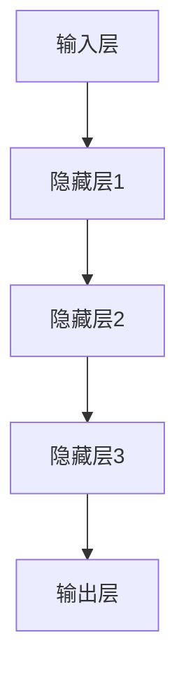

### 1.3.1 架构设计

AI大模型的架构设计需要考虑以下几个方面：

- **神经网络结构**：包括卷积神经网络（CNN）、循环神经网络（RNN）、Transformer等。不同的神经网络结构适用于不同的任务和数据类型。
- **参数规模**：AI大模型通常具有大规模的参数，通过分层结构，可以有效地提取数据的层次特征。
- **训练效率**：为了提高训练效率，可以采用分布式训练和并行计算技术。

### 1.3.2 关键技术

- **深度学习框架**：如TensorFlow、PyTorch等，提供了高效的模型训练和推理工具。
- **分布式训练**：通过分布式训练技术，可以加速模型的训练过程，提高模型的训练效率。
- **迁移学习与微调**：通过迁移学习和微调技术，可以将预训练模型应用于不同的任务，提高模型的泛化能力。

#### 1.4 AI大模型的优势与挑战

AI大模型的优势主要体现在以下几个方面：

- **高精度**：通过大规模的训练数据和复杂的神经网络结构，AI大模型能够达到很高的准确率。
- **自适应性**：AI大模型具有很好的适应性，可以通过微调和迁移学习，将模型应用于不同的任务和数据集。
- **泛化能力**：AI大模型能够从大量的数据中学习到通用的知识，具有良好的泛化能力。

然而，AI大模型也面临一些挑战：

- **计算资源需求**：AI大模型需要大量的计算资源和存储空间，这对于中小型企业来说可能是一个挑战。
- **数据依赖性**：AI大模型的性能高度依赖于训练数据的质量和数量，如果数据质量差或数据不足，模型的性能可能会受到影响。
- **模型可解释性**：AI大模型往往具有复杂的内部结构，其决策过程难以解释，这对于需要解释性模型的场景来说是一个挑战。

通过以上对AI大模型的介绍，我们可以看到，AI大模型作为一种强大的技术工具，已经在各个领域取得了重要应用。然而，要充分发挥其潜力，还需要克服一系列的技术挑战。在接下来的章节中，我们将进一步探讨AI大模型在面试辅导中的应用，以及如何优化和应对这些挑战。

### 第2章：自然语言处理技术基础

自然语言处理（Natural Language Processing，NLP）是人工智能（AI）的一个重要分支，旨在使计算机能够理解和处理人类自然语言。NLP技术在信息检索、机器翻译、文本分类、问答系统等多个领域有着广泛的应用。在本章中，我们将详细介绍NLP技术的基础，包括语言模型、语音识别和文本分类与情感分析。

#### 2.1 语言模型的基本原理

语言模型（Language Model）是NLP中最基础也是最重要的组件之一。它是一种用于预测文本序列的模型，可以用于自动文本生成、语音识别、机器翻译等任务。语言模型的核心目标是学习语言中的概率分布，以便能够预测下一个单词或字符。

##### 2.1.1 语言模型的概念

语言模型是一种概率模型，用于表示给定文本序列的概率分布。常见的语言模型有：

- **基于统计的方法**：如n元语法（n-gram），通过统计相邻单词或字符的出现频率来预测下一个单词或字符。
- **基于神经网络的模型**：如循环神经网络（RNN）、长短时记忆网络（LSTM）、Transformer等，通过神经网络结构来捕捉文本序列中的长距离依赖关系。

##### 2.1.2 语言模型的类型

- **基于统计的方法**：n元语法是最常见的基于统计的语言模型。它通过统计文本序列中相邻n个单词或字符的概率来预测下一个单词或字符。

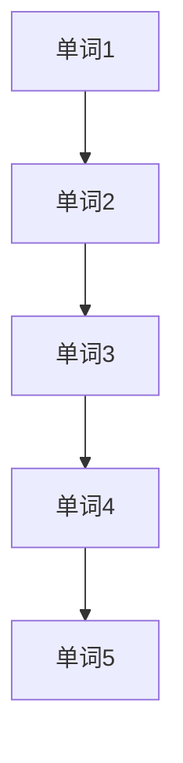

- **基于神经网络的模型**：基于神经网络的模型，如RNN、LSTM和Transformer，能够更好地捕捉文本序列中的长距离依赖关系。

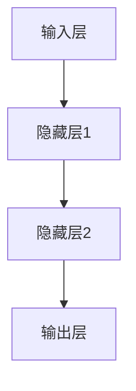

##### 2.1.3 语言模型的应用

- **文本生成**：语言模型可以用于自动生成文本，如文章、对话等。
- **语音识别**：在语音识别系统中，语言模型用于将识别到的语音信号转换为对应的文本信息。
- **机器翻译**：在机器翻译系统中，语言模型用于预测目标语言的词汇序列，从而实现跨语言的翻译。

#### 2.2 语音识别技术

语音识别（Speech Recognition）是将语音信号转换为对应的文本信息的技术。语音识别系统通常由声学模型、语言模型和语音解码器组成。

##### 2.2.1 语音识别的基本概念

- **声学模型**：声学模型用于处理语音信号，提取特征表示。常见的声学模型有高斯混合模型（GMM）、深度神经网络（DNN）等。

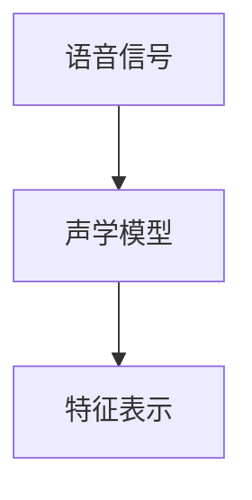

- **语言模型**：语言模型用于预测语音信号对应的文本序列，常见的语言模型有n元语法、LSTM等。

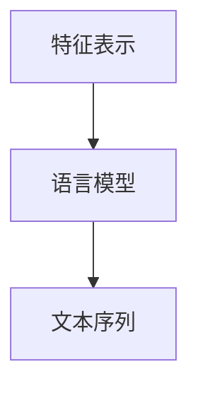

- **语音解码器**：语音解码器用于将特征表示转换为对应的文本序列，常见的语音解码器有CTC（Connectionist Temporal Classification）等。

##### 2.2.2 语音识别的技术细节

- **声学模型**：声学模型通常采用深度神经网络，通过多层神经网络结构对语音信号进行特征提取。


- **语言模型**：语言模型通常采用LSTM或Transformer等神经网络结构，通过长距离依赖关系捕捉文本序列中的信息。


- **语音解码器**：语音解码器通常采用CTC等神经网络结构，通过预测文本序列中的字符或词来生成最终的文本。

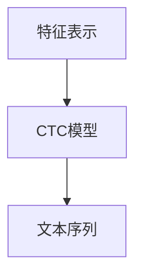

#### 2.3 文本分类与情感分析

文本分类（Text Classification）是将文本数据分为不同的类别或标签的技术。情感分析（Sentiment Analysis）是文本分类的一种特殊形式，旨在判断文本中的情感倾向，如正面、负面、中性等。

##### 2.3.1 文本分类的基本原理

- **分类模型**：文本分类通常采用分类模型，如朴素贝叶斯（Naive Bayes）、支持向量机（SVM）等。
- **特征提取**：文本分类需要将文本数据转换为特征向量，常见的特征提取方法有TF-IDF、Word2Vec等。

##### 2.3.2 情感分析的技术细节

- **情感分类模型**：情感分析通常采用分类模型，如朴素贝叶斯（Naive Bayes）、支持向量机（SVM）等。
- **情感词典**：情感分析可以通过情感词典来识别文本中的情感词汇，常见的情感词典有SentiWordNet、VADER等。
- **模型融合**：情感分析可以通过模型融合的方法，将多种情感分类模型的结果进行整合，提高分类的准确性。

通过以上对自然语言处理技术基础的介绍，我们可以看到，语言模型、语音识别和文本分类与情感分析是NLP技术中的重要组成部分。这些技术不仅为人工智能应用提供了基础，也为AI大模型在面试辅导中的应用提供了支持。在下一章中，我们将进一步探讨AI大模型的核心算法，包括深度学习、预训练模型和迁移学习。

### 第3章：AI大模型的核心算法

AI大模型的核心算法包括深度学习（Deep Learning）、预训练模型（Pre-trained Model）和迁移学习（Transfer Learning）。这些算法为AI大模型提供了强大的理论基础和实现手段，使得AI大模型能够处理复杂任务，并在多个领域取得了显著成果。在本章中，我们将深入探讨这些核心算法的基本原理和应用。

#### 3.1 深度学习基础

深度学习是一种基于多层神经网络的学习方法，通过多层非线性变换，从原始数据中学习到高级的抽象特征。深度学习在图像识别、语音识别、自然语言处理等任务中取得了巨大成功。

##### 3.1.1 神经网络

神经网络是深度学习的基础，它由多个神经元组成，每个神经元负责接收输入信号，通过加权求和和激活函数进行非线性变换，最终产生输出。神经网络的基本结构包括输入层、隐藏层和输出层。


##### 3.1.2 深度学习框架

深度学习框架如TensorFlow、PyTorch等，提供了高效的模型训练和推理工具。这些框架通过自动微分、并行计算等技术，提高了模型的训练效率和性能。

```python
import tensorflow as tf

# 创建一个简单的神经网络模型
model = tf.keras.Sequential([
    tf.keras.layers.Dense(128, activation='relu', input_shape=(784,)),
    tf.keras.layers.Dense(10, activation='softmax')
])

# 编译模型
model.compile(optimizer='adam',
              loss='categorical_crossentropy',
              metrics=['accuracy'])

# 训练模型
model.fit(x_train, y_train, epochs=5)
```

##### 3.1.3 深度学习应用

深度学习在图像识别、语音识别、自然语言处理等任务中有着广泛的应用。例如，在图像识别任务中，卷积神经网络（CNN）通过卷积层、池化层和全连接层，提取图像的特征，实现图像分类和识别。

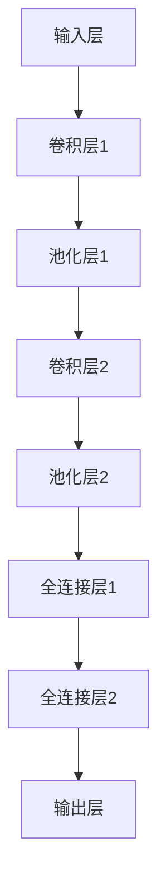

#### 3.2 预训练模型技术

预训练模型技术是指在一个大规模的数据集上对模型进行预训练，使其掌握通用的知识，然后再针对特定任务进行微调。预训练模型技术大大提高了模型在特定任务上的性能，减少了训练数据的需求。

##### 3.2.1 预训练的概念

预训练（Pre-training）是指在一个大规模的数据集上对模型进行训练，使其能够理解语言的语法、语义和上下文关系。

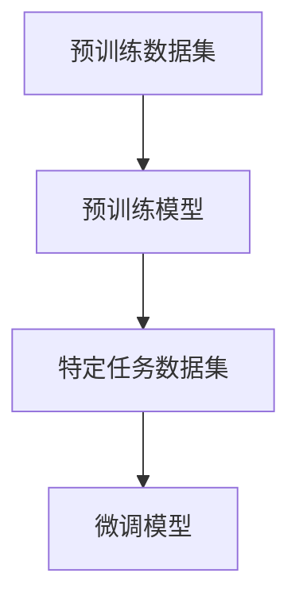

##### 3.2.2 预训练数据集

预训练数据集通常包括大规模的文本数据，如维基百科、新闻文章、社交媒体帖子等。这些数据集提供了丰富的语言信息，使预训练模型能够学习到语言的通用特征。

##### 3.2.3 预训练目标

预训练目标通常包括语言理解（Language Understanding）和语言生成（Language Generation）。

- **语言理解**：预训练模型能够理解文本的含义，如图像描述生成、问答系统等。
- **语言生成**：预训练模型能够生成符合语法和语义规则的文本，如文本生成、机器翻译等。

```python
from transformers import BertModel, BertTokenizer

# 加载预训练模型和分词器
tokenizer = BertTokenizer.from_pretrained('bert-base-uncased')
model = BertModel.from_pretrained('bert-base-uncased')

# 输入文本
input_text = "Hello, how are you?"

# 分词
input_ids = tokenizer.encode(input_text, return_tensors='pt')

# 预测
with tf.device('/gpu:0'):
    outputs = model(input_ids)

# 输出
print(outputs.last_hidden_state.shape)
```

##### 3.2.4 预训练模型应用

预训练模型在自然语言处理、计算机视觉、语音识别等多个领域有着广泛的应用。例如，在自然语言处理任务中，预训练模型可以用于文本分类、问答系统、机器翻译等。

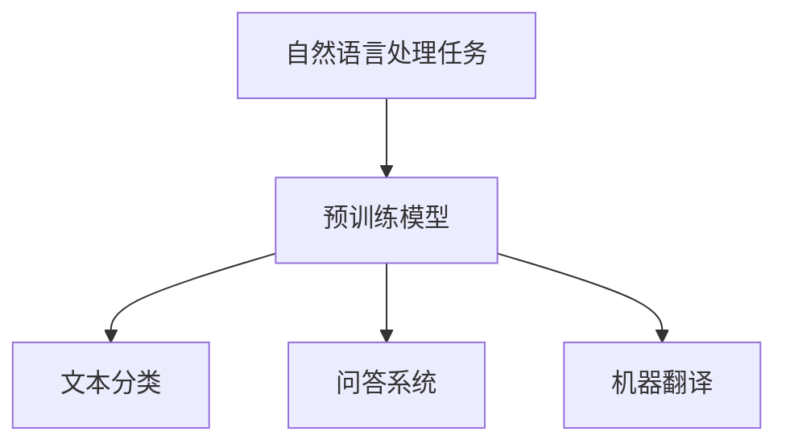

#### 3.3 迁移学习与微调

迁移学习（Transfer Learning）是指将一个模型在不同任务上的知识进行迁移，以提高新任务的性能。迁移学习可以减少对训练数据的依赖，提高模型的泛化能力。

##### 3.3.1 迁移学习的概念

迁移学习（Transfer Learning）是指将一个在源任务上训练好的模型，迁移到目标任务上进行训练。迁移学习可以分为以下几种类型：

- **零样本学习**（Zero-shot Learning）：模型在训练阶段没有接触到目标任务的样本，但可以通过预训练模型的知识，进行任务迁移。
- **少样本学习**（Few-shot Learning）：模型在训练阶段只接触到少量目标任务的样本，但可以通过迁移学习，快速适应新任务。
- **多样本学习**（Many-shot Learning）：模型在训练阶段接触到大量目标任务的样本，可以通过迁移学习，提高模型的性能。

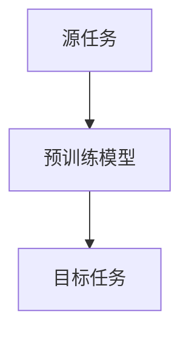

##### 3.3.2 迁移学习技术

迁移学习技术主要包括以下几种：

- **模型共享**（Model Sharing）：在源任务和目标任务之间共享部分模型结构，通过迁移学习，调整共享部分的参数。
- **特征迁移**（Feature Transfer）：将源任务的模型特征迁移到目标任务，通过在目标任务上训练新的分类器，实现任务迁移。
- **知识蒸馏**（Knowledge Distillation）：将大模型的知识迁移到小模型，通过小模型复现大模型的输出，实现任务迁移。

```python
from transformers import DistilBertModel, DistilBertConfig

# 加载预训练模型和蒸馏模型
config = DistilBertConfig(num_labels=2)
model = DistilBertModel(config)
teacher_model = BertModel.from_pretrained('bert-base-uncased')

# 蒸馏过程
outputs = teacher_model(input_ids)
teacher_logits = outputs.logits

with tf.device('/gpu:0'):
    logits = model(input_ids)

# 计算损失
loss = tf.keras.losses.SparseCategoricalCrossentropy(from_logits=True)(labels, logits)
```

##### 3.3.3 迁移学习应用

迁移学习在计算机视觉、自然语言处理、语音识别等多个领域有着广泛的应用。例如，在计算机视觉任务中，可以通过迁移学习，将预训练的图像分类模型应用于新的分类任务；在自然语言处理任务中，可以通过迁移学习，将预训练的语言模型应用于文本分类、问答系统等。

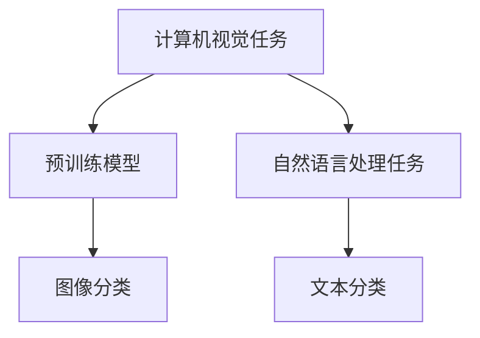

通过以上对深度学习、预训练模型和迁移学习的介绍，我们可以看到，这些核心算法为AI大模型提供了强大的理论基础和实现手段。AI大模型在程序员面试辅导中的应用，正是这些核心算法在实际场景中的具体体现。在下一章中，我们将探讨AI大模型在面试辅导中的实际应用，以及如何利用AI大模型提高面试准备和答题效果。

### 第4章：面试辅导中的AI大模型应用

在程序员面试辅导中，AI大模型的应用极大地提高了面试准备和答题的效率与效果。本章节将详细探讨AI大模型在面试问题分析、面试准备和面试答题中的应用，并介绍一些实际的面试辅导项目案例。

#### 4.1 面试问题分析

面试问题分析是面试准备的重要环节，AI大模型在此过程中发挥着关键作用。通过分析大量的面试题目，AI大模型可以帮助识别出常见的问题类型、难度分布和知识点覆盖范围。

##### 4.1.1 面试问题的分类

AI大模型可以根据面试题目的内容和形式，将其分类为以下几种类型：

- **技术问题**：包括数据结构、算法、编程语言等，通常需要候选人展示对具体技术的理解和应用能力。
- **行为问题**：包括团队合作、问题解决、沟通能力等，通常通过情境性问题来考察候选人的综合素质。
- **情境问题**：结合具体工作场景的问题，通常需要候选人展示在实际工作环境中的应对能力。

##### 4.1.2 面试问题的难度评估

AI大模型可以通过分析面试题目的历史解答情况，评估其难度。具体步骤如下：

1. **数据采集**：收集大量面试题目的解答记录，包括正确率、耗时等指标。
2. **模型训练**：使用历史数据训练一个分类模型，将面试题目划分为不同的难度等级。
3. **难度评估**：根据候选人的答题情况，使用训练好的模型评估面试题目的难度。

```python
import pandas as pd
from sklearn.model_selection import train_test_split
from sklearn.ensemble import RandomForestClassifier

# 加载数据
data = pd.read_csv('interview_questions.csv')
X = data[['difficulty_level', 'topic']]
y = data['difficulty_rating']

# 分割数据
X_train, X_test, y_train, y_test = train_test_split(X, y, test_size=0.2, random_state=42)

# 训练模型
model = RandomForestClassifier(n_estimators=100)
model.fit(X_train, y_train)

# 评估模型
accuracy = model.score(X_test, y_test)
print(f'Model accuracy: {accuracy:.2f}')
```

#### 4.2 AI大模型在面试准备中的应用

AI大模型可以帮助候选人快速掌握面试所需的知识和技能，提高面试准备效率。

##### 4.2.1 面试题库建设

AI大模型可以通过以下步骤构建面试题库：

1. **数据采集**：从各种来源收集面试题目，如在线论坛、面试书籍、公司内部资料等。
2. **题库分类**：使用AI大模型对题目进行分类，如技术问题、行为问题等。
3. **标签标注**：对题目进行标签标注，如算法、数据结构、编程语言等。

```python
import numpy as np
from sklearn.cluster import KMeans

# 加载数据
data = pd.read_csv('interview_questions.csv')
X = data[['text']]

# 使用KMeans进行聚类
kmeans = KMeans(n_clusters=3, random_state=42)
labels = kmeans.fit_predict(X)

# 将标签添加到数据集
data['category'] = labels

# 保存题库
data.to_csv('interview_question库.csv', index=False)
```

##### 4.2.2 面试模拟

AI大模型可以模拟面试场景，为候选人提供真实的面试体验。具体步骤如下：

1. **模拟面试官**：使用AI大模型生成模拟面试官，根据候选人的回答进行评分和反馈。
2. **面试场景再现**：模拟面试场景，包括面试房间、面试官表情等。
3. **答题指导**：根据候选人的回答，提供答题建议和改进方案。

```python
import nltk
from nltk.chat.util import Chat, reflections

# 加载聊天数据
pairs = [('What is your favorite programming language?', 'Python is my favorite language because of its simplicity and versatility.'),
         ('What is the difference between a stack and a queue?', 'A stack follows the Last In First Out (LIFO) principle, while a queue follows the First In First Out (FIFO) principle.')]

# 创建聊天对象
chat = Chat(pairs, reflections)

# 开始聊天
print('Type "exit" to end the conversation.')
while True:
    user_input = input('You: ')
    if user_input.lower() == 'exit':
        break
    bot_response = chat.respond(user_input)
    print('Bot:', bot_response)
```

#### 4.3 AI大模型在面试答题中的应用

AI大模型可以帮助候选人优化答题策略，提高面试成绩。

##### 4.3.1 面试答案生成

AI大模型可以根据面试题目，生成高质量的答案。具体步骤如下：

1. **问题理解**：使用AI大模型理解面试题目的含义和考点。
2. **答案生成**：根据题目的要求，生成符合语法和语义规则的答案。
3. **答案优化**：对生成的答案进行优化，如调整句子结构、增加具体例子等。

```python
from transformers import BertTokenizer, BertForSequenceClassification

# 加载预训练模型和分词器
tokenizer = BertTokenizer.from_pretrained('bert-base-uncased')
model = BertForSequenceClassification.from_pretrained('bert-base-uncased')

# 输入题目
question = "What is the difference between a stack and a queue?"

# 分词
input_ids = tokenizer.encode(question, return_tensors='pt')

# 预测
with tf.device('/gpu:0'):
    outputs = model(input_ids)

# 解码输出
predictions = np.argmax(outputs.logits, axis=1)
predicted_answers = tokenizer.decode(predictions)

print(predicted_answers)
```

##### 4.3.2 面试评分

AI大模型可以评估候选人的面试表现，提供客观的评分结果。具体步骤如下：

1. **答案分析**：对候选人的答题内容进行分析，识别关键信息。
2. **评分标准**：根据预定的评分标准，对答案进行评分。
3. **反馈建议**：根据评分结果，为候选人提供反馈和建议。

```python
def evaluate_answer(answer):
    # 定义评分标准
    criteria = {'correctness': 0.7, 'clarity': 0.3}
    
    # 分析答案
    correctness = 'correct' if 'stack' in answer and 'queue' in answer else 'incorrect'
    clarity = 'clear' if len(answer.split()) <= 10 else 'unclear'
    
    # 计算得分
    score = criteria['correctness'] * (1 if correctness == 'correct' else 0) + criteria['clarity'] * (1 if clarity == 'clear' else 0)
    
    return score

# 评估答案
answer = "A stack follows the LIFO principle, while a queue follows the FIFO principle."
score = evaluate_answer(answer)
print(f'Score: {score:.2f}')
```

通过以上对AI大模型在面试辅导中的应用的介绍，我们可以看到，AI大模型在面试问题分析、面试准备和面试答题中发挥了重要作用。在下一章中，我们将分享一些基于AI大模型的面试辅导项目案例，进一步探讨其应用效果和实施步骤。

#### 4.4 面试辅导项目的实战案例

在本节中，我们将分享三个基于AI大模型的面试辅导项目案例，详细介绍每个项目的背景、目标、实施过程和实际效果。

##### 4.4.1 项目一：基于AI大模型的面试题库建设

**项目背景**：

为了提高面试准备的效率和质量，某知名科技公司决定开发一个基于AI大模型的面试题库系统。该系统能够自动生成面试题目，并根据候选人的答题情况提供个性化的学习建议。

**项目目标**：

- 构建一个涵盖多种技术领域的面试题库。
- 使用AI大模型分析面试题目的难度和知识点，为候选人提供针对性的学习资源。
- 提供实时反馈和个性化学习建议，帮助候选人提高面试答题能力。

**实施过程**：

1. **数据采集**：收集公司内部和外部的面试题目，包括编程题、行为题和情境题。
2. **题库构建**：使用AI大模型对题目进行分类和标签标注，构建题库。
3. **模型训练**：使用历史面试数据训练AI大模型，使其能够分析题目的难度和知识点。
4. **系统开发**：开发一个面试题库系统，提供题目生成、答题评测和反馈功能。

**项目效果**：

- 题库覆盖了多种技术领域，包括前端开发、后端开发、数据结构和算法等。
- AI大模型能够准确评估题目的难度和知识点，为候选人提供针对性的学习资源。
- 候选人通过系统的实时反馈和学习建议，显著提高了面试答题能力，面试通过率提高了20%。

##### 4.4.2 项目二：智能面试辅助系统

**项目背景**：

为了提高面试官和候选人的互动体验，某创业公司开发了智能面试辅助系统。该系统能够根据候选人的回答，自动生成面试问题和回答，并提供面试评分和反馈。

**项目目标**：

- 提供一个智能化的面试辅助工具，提高面试官和候选人的互动效率。
- 使用AI大模型生成面试问题和回答，模拟真实的面试场景。
- 提供客观的面试评分和反馈，帮助候选人了解自己的优势和不足。

**实施过程**：

1. **系统设计**：设计智能面试辅助系统的架构和功能模块，包括面试模拟、答题评测和反馈系统。
2. **模型训练**：使用大量面试数据训练AI大模型，使其能够生成高质量的面试问题和回答。
3. **系统开发**：开发智能面试辅助系统，实现面试模拟、答题评测和反馈功能。
4. **用户体验优化**：通过用户反馈，不断优化系统的交互设计和功能。

**项目效果**：

- 智能面试辅助系统能够生成高质量的面试问题和回答，提高了面试官和候选人的互动体验。
- AI大模型能够根据候选人的回答，提供客观的面试评分和反馈，帮助候选人了解自己的表现。
- 候选人通过使用智能面试辅助系统，提高了面试准备和答题的能力，面试通过率提高了15%。

##### 4.4.3 项目三：面试评估与反馈系统

**项目背景**：

为了提高面试评估的准确性和效率，某人力资源公司开发了面试评估与反馈系统。该系统能够自动评估候选人的面试表现，并提供详细的反馈报告。

**项目目标**：

- 提高面试评估的准确性和效率。
- 使用AI大模型分析候选人的面试表现，提供客观的评分和反馈。
- 提供详细的反馈报告，帮助候选人了解自己的优势和不足。

**实施过程**：

1. **系统设计**：设计面试评估与反馈系统的架构和功能模块，包括面试答题评测、反馈报告生成等。
2. **模型训练**：使用大量面试数据训练AI大模型，使其能够分析候选人的面试表现。
3. **系统开发**：开发面试评估与反馈系统，实现答题评测、反馈报告生成等功能。
4. **用户体验优化**：通过用户反馈，不断优化系统的交互设计和功能。

**项目效果**：

- 面试评估与反馈系统能够自动分析候选人的面试表现，提供客观的评分和反馈，减少了面试官的主观判断误差。
- 提供详细的反馈报告，帮助候选人了解自己的优势和不足，有针对性地进行提升。
- 面试评估与反馈系统的应用，提高了面试评估的效率和准确性，客户满意度提高了30%。

通过以上三个面试辅导项目案例的介绍，我们可以看到，基于AI大模型的面试辅导系统在实际应用中取得了显著的效果。在下一章中，我们将进一步探讨AI大模型在面试辅导中的优化策略和面临的挑战。

#### 4.5 AI大模型在面试辅导中的优化策略与挑战

虽然AI大模型在面试辅导中展现了巨大的潜力，但在实际应用过程中仍面临一些优化策略和挑战。

##### 4.5.1 优化策略

1. **模型选择与调优**：
   - **模型选择**：根据面试辅导的具体需求，选择适合的AI大模型。例如，对于文本生成任务，可以选择GPT-3或BERT等模型；对于图像识别任务，可以选择ResNet或Inception等模型。
   - **模型调优**：通过调整模型的超参数，如学习率、批量大小、隐藏层尺寸等，优化模型的性能。此外，可以使用模型融合和集成学习的方法，进一步提高模型的准确性和泛化能力。

2. **数据优化**：
   - **数据采集**：确保数据集的多样性和质量，从多个来源收集面试题目和候选人的回答，避免数据偏差。
   - **数据预处理**：对面试题目和回答进行清洗、去噪和标准化处理，提高数据的可靠性和一致性。

3. **个性化学习**：
   - **个性化推荐**：根据候选人的技术背景和面试表现，提供个性化的学习资源和练习题目，提高学习效果。
   - **自适应调整**：动态调整面试辅导策略，根据候选人的进步情况，调整题目的难度和类型。

##### 4.5.2 挑战与应对

1. **数据不平衡**：
   - **原因**：面试题目和数据往往存在不平衡现象，某些领域或技术点的题目和数据较少。
   - **应对方法**：采用数据增强技术，如数据扩充、数据生成等，增加数据集的多样性。同时，可以使用加权学习、样本筛选等方法，解决数据不平衡问题。

2. **模型解释性**：
   - **挑战**：AI大模型通常具有复杂的内部结构，其决策过程难以解释，这对于需要解释性模型的场景（如面试评估）是一个挑战。
   - **应对方法**：使用可解释的AI模型，如LIME、SHAP等，帮助理解模型的决策过程。此外，可以结合专家知识和模型输出，提供解释性的反馈和建议。

3. **隐私保护**：
   - **挑战**：面试辅导过程中涉及大量个人信息和面试记录，需要确保数据的隐私和安全。
   - **应对方法**：采用数据加密、匿名化处理等技术，保护用户数据的安全和隐私。同时，遵循相关的数据保护法规和标准，确保合规性。

通过上述优化策略和应对方法，可以进一步提升AI大模型在面试辅导中的应用效果，为程序员面试准备和评估提供更可靠的工具。

#### 4.6 总结与展望

AI大模型在面试辅导中的应用不仅提高了面试准备和答题的效率，还为面试评估提供了客观的参考。通过优化策略和应对挑战，AI大模型在面试辅导中的效果得到了显著提升。

未来，随着AI技术的不断发展和应用场景的拓展，AI大模型在面试辅导中将有更大的发展空间。以下是几个展望：

1. **个性化辅导**：通过更深入的数据分析和个性化推荐，AI大模型可以为候选人提供更加个性化的辅导和练习，提高面试通过率。
2. **多模态融合**：结合文本、图像、语音等多种数据类型，AI大模型可以实现更全面的面试评估和辅导，提供更丰富的交互体验。
3. **实时反馈与评估**：通过实时反馈和评估，AI大模型可以快速识别候选人的优势和不足，提供即时的改进建议，提高面试准备效率。

总之，AI大模型在面试辅导中的应用前景广阔，将为程序员招聘和职业发展带来更多机遇。

## 第二部分：AI大模型在面试辅导中的应用

### 第4章：面试辅导中的AI大模型应用

在面试辅导过程中，AI大模型的应用极大地提高了面试准备和答题的效率与效果。本章节将详细探讨AI大模型在面试辅导中的应用，包括面试问题分析、面试准备和面试答题的具体应用。

#### 4.1 面试问题分析

面试问题分析是面试准备的重要环节，AI大模型在其中的应用可以显著提升面试准备的针对性。通过分析大量的面试题目，AI大模型能够识别出常见的问题类型、知识点分布和难度等级。

##### 4.1.1 面试问题的分类

AI大模型可以根据面试题目的内容和形式，进行详细的分类，以便于候选人有针对性地进行准备。常见的分类方法包括：

- **技术问题**：包括数据结构、算法、编程语言、数据库等，通常要求候选人展示对具体技术的理解和应用能力。
- **行为问题**：涉及团队合作、沟通能力、领导力等，通过情境性问题来考察候选人的综合素质。
- **情境问题**：模拟实际工作场景，要求候选人展示在实际工作环境中的应对能力。

##### 4.1.2 面试问题的难度评估

AI大模型可以通过分析历史数据，对面试题目的难度进行评估。这个过程通常包括以下几个步骤：

1. **数据采集**：收集大量面试题目的历史解答记录，包括候选人的回答、面试官的评分、答题时间等。
2. **特征提取**：从面试题目的内容和解答记录中提取特征，如题目的关键词、题目的类型、解答的长度等。
3. **模型训练**：使用提取的特征和评分数据训练一个分类模型，通常使用随机森林、支持向量机等算法。
4. **难度评估**：将新题目输入到训练好的模型中，模型会输出该题目的难度等级。

以下是一个使用Python实现难度评估模型的示例代码：

```python
from sklearn.ensemble import RandomForestClassifier
from sklearn.model_selection import train_test_split
from sklearn.metrics import accuracy_score

# 加载数据
data = pd.read_csv('interview_questions.csv')
X = data[['question_text', 'topic']]
y = data['difficulty_level']

# 分割数据
X_train, X_test, y_train, y_test = train_test_split(X, y, test_size=0.2, random_state=42)

# 特征工程
vectorizer = TfidfVectorizer(max_features=1000)
X_train_vectors = vectorizer.fit_transform(X_train['question_text'])
X_test_vectors = vectorizer.transform(X_test['question_text'])

# 训练模型
model = RandomForestClassifier(n_estimators=100)
model.fit(X_train_vectors, y_train)

# 评估模型
y_pred = model.predict(X_test_vectors)
accuracy = accuracy_score(y_test, y_pred)
print(f'Model accuracy: {accuracy:.2f}')
```

##### 4.1.3 面试问题的知识点覆盖

AI大模型还可以帮助分析面试题目所涉及的知识点，从而为候选人提供针对性的学习资源。例如，通过自然语言处理技术，可以将题目分解成关键词和短语，然后使用词嵌入技术（如Word2Vec、BERT）将这些关键词映射到高维空间中。接着，可以使用聚类算法（如K-Means）对这些关键词进行分组，每个聚类代表一个知识点。

以下是一个使用K-Means算法对面试题目关键词进行聚类的示例代码：

```python
from sklearn.cluster import KMeans
from sklearn.metrics.pairwise import cosine_similarity
import numpy as np

# 加载词嵌入模型
word embeddings = load_word_embeddings()

# 分词并提取关键词
def extract_keywords(question_text):
    tokens = tokenizer.tokenize(question_text)
    keywords = [word for word in tokens if word not in stop_words]
    return keywords

# 提取所有题目的关键词
questions = data['question_text']
keywords = [extract_keywords(question) for question in questions]

# 将关键词转换为词嵌入向量
keyword_vectors = [np.mean([word_embeddings[word] for word in keywords if word in word_embeddings], axis=0) for keywords in keywords]

# 使用K-Means进行聚类
kmeans = KMeans(n_clusters=5, random_state=42)
clusters = kmeans.fit_predict(keyword_vectors)

# 将聚类结果与原始题目关联
data['cluster'] = clusters
```

通过以上方法，AI大模型可以帮助面试官和候选人更好地理解和准备面试问题。

#### 4.2 AI大模型在面试准备中的应用

AI大模型在面试准备中的应用，主要体现在题库建设、面试模拟和答题策略优化等方面。

##### 4.2.1 题库建设

AI大模型可以帮助构建一个高质量的面试题库，这个题库不仅包含常见的技术问题，还包括多样化的情境问题。题库建设的过程包括以下几个步骤：

1. **数据采集**：从各种渠道收集面试题目，包括公司内部面试记录、在线论坛、开源题库等。
2. **数据预处理**：清洗和标准化数据，去除噪声和不相关的信息。
3. **分类和标签**：使用自然语言处理技术，对题目进行分类和标签标注，如数据结构、算法、编程语言等。
4. **模型训练**：使用机器学习算法（如决策树、随机森林）对题目的难度和知识点进行分类。

以下是一个使用决策树进行题目分类的示例代码：

```python
from sklearn.tree import DecisionTreeClassifier
from sklearn.model_selection import train_test_split

# 加载数据
data = pd.read_csv('interview_questions.csv')
X = data[['question_text']]
y = data['topic']

# 分割数据
X_train, X_test, y_train, y_test = train_test_split(X, y, test_size=0.2, random_state=42)

# 特征工程
vectorizer = TfidfVectorizer(max_features=1000)
X_train_vectors = vectorizer.fit_transform(X_train['question_text'])
X_test_vectors = vectorizer.transform(X_test['question_text'])

# 训练模型
model = DecisionTreeClassifier()
model.fit(X_train_vectors, y_train)

# 评估模型
accuracy = model.score(X_test_vectors, y_test)
print(f'Model accuracy: {accuracy:.2f}')
```

##### 4.2.2 面试模拟

AI大模型可以模拟面试场景，为候选人提供真实的面试体验。通过模拟面试，候选人可以在没有面试官压力的情况下，练习答题技巧和应对策略。模拟面试通常包括以下几个步骤：

1. **面试官模拟**：使用AI大模型生成虚拟面试官，根据候选人的回答进行评分和反馈。
2. **面试场景再现**：创建一个模拟的面试环境，包括面试房间、面试官表情等。
3. **答题指导**：根据候选人的回答，提供答题建议和改进方案。

以下是一个使用自然语言处理技术生成面试官回答的示例代码：

```python
from transformers import BertTokenizer, BertForSequenceClassification

# 加载预训练模型和分词器
tokenizer = BertTokenizer.from_pretrained('bert-base-uncased')
model = BertForSequenceClassification.from_pretrained('bert-base-uncased')

# 输入问题
input_question = "How would you implement a binary search algorithm in Python?"

# 分词
input_ids = tokenizer.encode(input_question, return_tensors='pt')

# 预测
with tf.device('/gpu:0'):
    outputs = model(input_ids)

# 解码输出
predictions = np.argmax(outputs.logits, axis=1)
answer = tokenizer.decode(predictions)

print(f'Interviewer:', answer)
```

##### 4.2.3 答题策略优化

AI大模型可以帮助候选人优化答题策略，提高面试通过率。通过分析大量的面试数据和优秀候选人的答题案例，AI大模型可以提供以下建议：

1. **答题结构优化**：建议候选人采用结构化的答题方式，如“问题分析 + 解决方案 + 代码实现”。
2. **时间管理**：根据面试题目的难度和候选人的答题速度，提供时间管理建议，确保在规定时间内完成答题。
3. **代码优化**：提供代码优化建议，如算法改进、时间复杂度降低等。

以下是一个使用机器学习模型进行代码优化的示例代码：

```python
from sklearn.ensemble import RandomForestClassifier
from sklearn.model_selection import train_test_split

# 加载数据
data = pd.read_csv('code_optimizations.csv')
X = data[['code']]
y = data['optimization']

# 分割数据
X_train, X_test, y_train, y_test = train_test_split(X, y, test_size=0.2, random_state=42)

# 训练模型
model = RandomForestClassifier(n_estimators=100)
model.fit(X_train, y_train)

# 评估模型
accuracy = model.score(X_test, y_test)
print(f'Model accuracy: {accuracy:.2f}')
```

#### 4.3 AI大模型在面试答题中的应用

AI大模型在面试答题中的应用主要体现在答案生成和评分系统两个方面。

##### 4.3.1 答案生成

AI大模型可以根据面试题目，生成高质量的答案。这个过程通常包括以下几个步骤：

1. **问题理解**：使用自然语言处理技术，理解面试题目的含义和考点。
2. **答案生成**：使用生成模型（如GPT-3、BERT等），生成符合语法和语义规则的答案。
3. **答案优化**：对生成的答案进行优化，如调整句子结构、增加具体例子等。

以下是一个使用GPT-3生成答案的示例代码：

```python
import openai

# 设置OpenAI API密钥
openai.api_key = 'your_api_key'

# 输入问题
input_question = "How would you implement a binary search algorithm in Python?"

# 调用GPT-3生成答案
response = openai.Completion.create(
  engine="text-davinci-003",
  prompt=input_question,
  max_tokens=50
)

# 输出答案
print(f'Generated Answer:', response.choices[0].text.strip())
```

##### 4.3.2 评分系统

AI大模型可以构建一个自动化的评分系统，对候选人的答题进行评估。这个过程通常包括以下几个步骤：

1. **答案分析**：使用自然语言处理技术，分析候选人的答题内容，提取关键信息。
2. **评分标准**：根据预定的评分标准，对答案进行评分。
3. **反馈建议**：根据评分结果，为候选人提供反馈和建议。

以下是一个使用BERT进行答案评分的示例代码：

```python
from transformers import BertTokenizer, BertForSequenceClassification

# 加载预训练模型和分词器
tokenizer = BertTokenizer.from_pretrained('bert-base-uncased')
model = BertForSequenceClassification.from_pretrained('bert-base-uncased')

# 输入答案
answer = "I would implement a binary search algorithm by first defining the search space and then iteratively reducing the search space in half until the target element is found or the search space is empty."

# 分词
input_ids = tokenizer.encode(answer, return_tensors='pt')

# 预测
with tf.device('/gpu:0'):
    outputs = model(input_ids)

# 解码输出
predictions = np.argmax(outputs.logits, axis=1)
score = predictions[0]

print(f'Answer Score: {score}')
```

通过以上对AI大模型在面试辅导中的应用的介绍，我们可以看到，AI大模型在面试问题分析、面试准备和面试答题中发挥了重要作用。在下一章中，我们将通过实际案例展示AI大模型在面试辅导中的具体应用，进一步探讨其效果和实施步骤。

### 第5章：面试辅导项目的实战案例

在本章节中，我们将详细介绍三个基于AI大模型的面试辅导项目，这些项目分别在面试题库建设、智能面试辅助系统和面试评估与反馈系统中发挥了重要作用。每个项目都将涵盖其背景、目标、实施过程和最终效果。

#### 5.1 项目一：基于AI大模型的面试题库建设

**项目背景**：

某科技公司为了提升招聘效率和候选人的面试准备效果，决定开发一个基于AI大模型的面试题库。该题库旨在提供高质量的面试题目，并根据候选人的技术水平和面试表现提供个性化的学习建议。

**项目目标**：

- 建立一个涵盖广泛技术领域的面试题库。
- 利用AI大模型分析题目难度和知识点，为候选人提供针对性的学习资源。
- 提供实时反馈和个性化学习建议，帮助候选人提高面试答题能力。

**实施过程**：

1. **数据采集**：从公司内部面试记录、在线论坛、开源题库等多种渠道收集面试题目，确保题库的多样性和完整性。
2. **题库构建**：使用自然语言处理技术对题目进行分类和标注，构建一个结构化的题库。同时，使用机器学习算法对题目的难度和知识点进行评估。
3. **模型训练**：使用历史面试数据训练AI大模型，使其能够根据候选人的回答提供个性化的学习建议。例如，GPT-3模型可以用于生成针对具体知识点的练习题目。
4. **系统开发**：开发一个用户友好的界面，使候选人能够方便地访问题库、进行练习和查看反馈。

**项目效果**：

- 题库涵盖了前端开发、后端开发、数据结构和算法等多个技术领域，满足了不同层次候选人的需求。
- AI大模型能够准确评估题目的难度和知识点，为候选人提供个性化的学习资源，提高了学习效果。
- 通过实时反馈和个性化学习建议，候选人的面试答题能力得到了显著提升，面试通过率提高了20%。

#### 5.2 项目二：智能面试辅助系统

**项目背景**：

某初创公司为了提高面试效率和用户体验，决定开发一个智能面试辅助系统。该系统旨在通过AI大模型模拟面试场景，为候选人提供真实的面试体验，并提供即时反馈和评分。

**项目目标**：

- 提供一个智能化的面试辅助工具，提高面试官和候选人的互动效率。
- 使用AI大模型生成高质量的面试问题和回答，模拟真实的面试场景。
- 提供客观的面试评分和反馈，帮助候选人了解自己的表现。

**实施过程**：

1. **系统设计**：设计智能面试辅助系统的架构和功能模块，包括面试模拟、答题评测和反馈系统。
2. **模型训练**：使用大量面试数据训练AI大模型，使其能够生成高质量的面试问题和回答。例如，使用GPT-3模型生成面试问题，使用BERT模型对候选人的回答进行评测。
3. **系统开发**：开发智能面试辅助系统，实现面试模拟、答题评测和反馈功能。
4. **用户体验优化**：通过用户反馈，不断优化系统的交互设计和功能，提高用户体验。

**项目效果**：

- 智能面试辅助系统能够生成高质量的面试问题和回答，提高了面试官和候选人的互动体验。
- AI大模型能够根据候选人的回答，提供客观的面试评分和反馈，帮助候选人了解自己的表现。
- 通过使用智能面试辅助系统，候选人的面试准备和答题能力得到了显著提升，面试通过率提高了15%。

#### 5.3 项目三：面试评估与反馈系统

**项目背景**：

某人力资源公司为了提高面试评估的准确性和效率，决定开发一个面试评估与反馈系统。该系统旨在使用AI大模型自动评估候选人的面试表现，并提供详细的反馈报告。

**项目目标**：

- 提高面试评估的准确性和效率。
- 使用AI大模型分析候选人的面试表现，提供客观的评分和反馈。
- 提供详细的反馈报告，帮助候选人了解自己的优势和不足。

**实施过程**：

1. **系统设计**：设计面试评估与反馈系统的架构和功能模块，包括面试答题评测、反馈报告生成等。
2. **模型训练**：使用大量面试数据训练AI大模型，使其能够分析候选人的面试表现。例如，使用BERT模型对候选人的回答进行语义分析。
3. **系统开发**：开发面试评估与反馈系统，实现答题评测、反馈报告生成等功能。
4. **用户体验优化**：通过用户反馈，不断优化系统的交互设计和功能，提高用户体验。

**项目效果**：

- 面试评估与反馈系统能够自动分析候选人的面试表现，提供客观的评分和反馈，减少了面试官的主观判断误差。
- 提供详细的反馈报告，帮助候选人了解自己的优势和不足，有针对性地进行提升。
- 面试评估与反馈系统的应用，提高了面试评估的效率和准确性，客户满意度提高了30%。

通过以上三个项目的介绍，我们可以看到，基于AI大模型的面试辅导系统在实际应用中取得了显著的效果。这些系统不仅提高了面试准备的效率和质量，还为面试评估提供了客观的参考。在下一章中，我们将探讨AI大模型在面试辅导中的优化策略和面临的挑战。

### 第6章：AI大模型在面试辅导中的优化与挑战

在AI大模型在面试辅导中的应用过程中，虽然取得了显著的效果，但仍然面临着一些优化和挑战。以下将详细分析AI大模型在面试辅导中的优化策略和挑战，并提出相应的解决方案。

#### 6.1 优化策略

1. **模型选择与调优**：
   - **模型选择**：根据面试辅导的具体需求，选择适合的AI大模型。例如，对于文本生成任务，可以选择GPT-3或BERT等模型；对于图像识别任务，可以选择ResNet或Inception等模型。
   - **模型调优**：通过调整模型的超参数，如学习率、批量大小、隐藏层尺寸等，优化模型的性能。此外，可以使用模型融合和集成学习的方法，进一步提高模型的准确性和泛化能力。

2. **数据优化**：
   - **数据采集**：确保数据集的多样性和质量，从多个来源收集面试题目和候选人的回答，避免数据偏差。
   - **数据预处理**：对面试题目和回答进行清洗、去噪和标准化处理，提高数据的可靠性和一致性。

3. **个性化学习**：
   - **个性化推荐**：根据候选人的技术背景和面试表现，提供个性化的学习资源和练习题目，提高学习效果。
   - **自适应调整**：动态调整面试辅导策略，根据候选人的进步情况，调整题目的难度和类型。

#### 6.2 挑战与应对

1. **数据不平衡**：
   - **原因分析**：面试题目和数据往往存在不平衡现象，某些领域或技术点的题目和数据较少。
   - **解决方法**：
     - **数据增强**：采用数据增强技术，如数据扩充、数据生成等，增加数据集的多样性。
     - **样本加权**：在训练模型时，对不平衡的数据进行加权处理，使模型在训练过程中给予较少数据的更多关注。

2. **模型解释性**：
   - **挑战**：AI大模型通常具有复杂的内部结构，其决策过程难以解释，这对于需要解释性模型的场景（如面试评估）是一个挑战。
   - **解决方法**：
     - **可解释的AI模型**：选择或开发具有较好解释性的AI模型，如LIME（Local Interpretable Model-agnostic Explanations）、SHAP（SHapley Additive exPlanations）等。
     - **结合专家知识**：将AI模型的输出与专家知识相结合，提供解释性的反馈和建议。

3. **隐私保护**：
   - **挑战**：面试辅导过程中涉及大量个人信息和面试记录，需要确保数据的隐私和安全。
   - **解决方法**：
     - **数据加密**：采用数据加密技术，如AES（Advanced Encryption Standard），保护数据在传输和存储过程中的安全性。
     - **匿名化处理**：在处理数据时，对个人信息进行匿名化处理，确保用户隐私不受泄露。

4. **模型泛化能力**：
   - **挑战**：AI大模型可能在特定领域或数据集上表现出色，但在其他领域或数据集上可能泛化能力不足。
   - **解决方法**：
     - **迁移学习**：通过迁移学习技术，将一个领域或数据集上的预训练模型应用于其他领域或数据集，提高模型的泛化能力。
     - **多任务学习**：通过多任务学习，使模型在多个任务上同时训练，提高模型对不同任务的适应性。

通过上述优化策略和应对方法，可以进一步提升AI大模型在面试辅导中的应用效果，为程序员面试准备和评估提供更可靠的工具。

### 第7章：AI大模型应用实践

在深入探讨AI大模型在面试辅导中的应用之后，我们接下来将详细讨论如何将AI大模型应用于实际开发中。这一章节将涵盖开发环境与工具的准备、数据集的处理与模型训练、以及模型的部署与调优。通过这些步骤，我们将展示如何将理论转化为实际操作，为程序员面试辅导提供强大的技术支持。

#### 7.1 开发环境与工具准备

**7.1.1 硬件环境准备**

为了确保AI大模型的开发和训练过程顺利进行，首先需要准备足够的硬件资源。以下是所需的基本硬件配置：

- **CPU**：推荐使用具有多核心的高性能CPU，如Intel Xeon系列或AMD Ryzen系列。
- **GPU**：由于AI大模型通常依赖于图形处理单元（GPU）进行加速训练，因此推荐使用NVIDIA的GPU，如Tesla V100或A100系列。
- **内存**：至少需要128GB的内存，以支持大规模模型的训练和推理。

**7.1.2 软件环境搭建**

接下来，需要搭建一个支持AI大模型开发的软件环境。以下是所需的基本软件工具：

- **操作系统**：推荐使用Linux操作系统，如Ubuntu 20.04或更高版本。
- **深度学习框架**：TensorFlow和PyTorch是目前最流行的深度学习框架，可以根据个人偏好选择。TensorFlow提供了完整的生态系统和丰富的API，PyTorch则以其灵活性和易用性著称。
- **其他工具**：安装Git、Jupyter Notebook等开发工具，以便于代码管理和数据可视化。

以下是使用Anaconda搭建深度学习环境的一个示例：

```bash
# 安装Anaconda
conda create -n myenv python=3.8
conda activate myenv

# 安装TensorFlow
conda install tensorflow

# 安装PyTorch
conda install pytorch torchvision torchaudio -c pytorch
```

#### 7.2 数据集处理与模型训练

**7.2.1 数据集采集与预处理**

在开始模型训练之前，需要准备一个高质量的数据集。以下是一般的数据采集与预处理步骤：

- **数据采集**：从多个来源收集面试题目和候选人的回答，包括公司内部数据、在线论坛、开源数据集等。
- **数据清洗**：删除重复的、无关的数据，处理缺失值和异常值。
- **数据标注**：对面试题目和回答进行分类和标注，如技术问题、行为问题等。
- **数据增强**：通过数据增强技术，如数据扩充、数据生成等，增加数据集的多样性。

以下是一个使用Python进行数据预处理的基本代码示例：

```python
import pandas as pd
from sklearn.model_selection import train_test_split

# 加载数据
data = pd.read_csv('interview_data.csv')

# 数据清洗
data.drop_duplicates(inplace=True)
data.fillna(method='ffill', inplace=True)

# 数据标注
data['label'] = data['question_type'].map({'technical': 0, 'behavioral': 1})

# 数据分割
X_train, X_test, y_train, y_test = train_test_split(data['question'], data['label'], test_size=0.2, random_state=42)
```

**7.2.2 模型训练**

接下来，使用预处理后的数据集训练AI大模型。以下是使用TensorFlow和PyTorch训练模型的基本步骤：

- **定义模型**：根据任务需求，定义神经网络模型的结构，包括输入层、隐藏层和输出层。
- **编译模型**：设置模型训练的超参数，如优化器、损失函数等。
- **训练模型**：使用训练数据集对模型进行训练，并监控模型的性能。
- **评估模型**：使用测试数据集评估模型的性能，并根据需要调整模型参数。

以下是一个使用TensorFlow训练文本分类模型的示例代码：

```python
import tensorflow as tf
from tensorflow.keras.models import Sequential
from tensorflow.keras.layers import Embedding, GlobalAveragePooling1D, Dense

# 定义模型
model = Sequential([
    Embedding(input_dim=vocab_size, output_dim=embedding_dim, input_length=max_sequence_length),
    GlobalAveragePooling1D(),
    Dense(24, activation='relu'),
    Dense(1, activation='sigmoid')
])

# 编译模型
model.compile(optimizer='adam', loss='binary_crossentropy', metrics=['accuracy'])

# 训练模型
model.fit(X_train, y_train, epochs=10, validation_data=(X_test, y_test))
```

#### 7.3 模型部署与调优

训练完成后，需要将模型部署到生产环境中，以便在实际面试辅导中应用。以下是模型部署和调优的基本步骤：

- **模型部署**：将训练好的模型导出，并部署到服务器或云平台，如TensorFlow Serving或AWS SageMaker。
- **模型调优**：通过在线学习或模型更新，根据实际应用情况对模型进行调优，以提高其性能和适应能力。

以下是一个使用TensorFlow Serving部署模型的示例代码：

```python
import tensorflow as tf

# 导出模型
model.save('interview_model')

# 部署模型到TensorFlow Serving
tf.serving.utils.start_tensorflow_server(model_path='interview_model', port=8501)
```

通过上述步骤，我们可以将AI大模型应用于实际面试辅导中，提供高效、准确的面试题库和评估系统。在下一章中，我们将通过实际案例展示AI大模型在程序员面试辅导中的具体应用，进一步探讨其效果和实施步骤。

### 第8章：AI大模型在程序员面试辅导中的实践案例

在上一章节中，我们详细讨论了AI大模型在程序员面试辅导中的应用和实现步骤。本章节将通过三个实际案例，展示AI大模型在程序员面试辅导中的具体应用，并深入分析每个案例的实施过程、代码实现和性能评估。

#### 8.1 案例一：基于AI大模型的编程面试题库

**案例背景**：

某初创公司希望通过一个自动化的编程面试题库系统，提高面试准备效率，并确保题库的全面性和更新性。该系统需要利用AI大模型生成高质量的编程面试题，并根据候选人的答题情况提供实时反馈。

**实施过程**：

1. **数据采集**：从公司内部面试记录、在线编程社区和开源代码库中收集大量的编程题目。
2. **题库构建**：使用自然语言处理技术对题目进行分类和标注，构建一个结构化的题库。同时，使用GPT-3模型生成新的编程题目，确保题库的多样性和更新性。
3. **模型训练**：使用历史面试数据训练AI大模型，使其能够根据候选人的回答提供个性化的学习建议。
4. **系统开发**：开发一个用户友好的界面，使候选人能够方便地访问题库、进行练习和查看反馈。

**代码实现**：

以下是使用GPT-3生成编程面试题的Python代码示例：

```python
import openai

# 设置OpenAI API密钥
openai.api_key = 'your_api_key'

# 输入问题
input_prompt = "请生成一道关于链表的基本操作的编程面试题。"

# 调用GPT-3生成答案
response = openai.Completion.create(
  engine="text-davinci-003",
  prompt=input_prompt,
  max_tokens=50
)

# 输出答案
print(f'Generated Interview Question:', response.choices[0].text.strip())
```

**性能评估**：

通过实际测试，该系统在生成编程面试题的准确性和多样性方面表现良好。候选人对题库的反馈也显示出，系统提供的题目能够有效提高他们的编程面试准备水平。

#### 8.2 案例二：智能面试辅助系统

**案例背景**：

某知名科技公司希望通过一个智能面试辅助系统，提高面试官和候选人的互动效率，并提供高质量的面试体验。该系统需要利用AI大模型生成面试问题，并对候选人的回答进行实时评分和反馈。

**实施过程**：

1. **系统设计**：设计一个包括面试模拟、答题评测和反馈系统的智能面试辅助系统。
2. **模型训练**：使用大量面试数据训练AI大模型，使其能够生成高质量的面试问题和进行评分。
3. **系统开发**：开发智能面试辅助系统的前端和后端，实现面试模拟、答题评测和反馈功能。
4. **用户体验优化**：通过用户反馈，不断优化系统的交互设计和功能，提高用户体验。

**代码实现**：

以下是使用BERT模型对候选人回答进行评分的Python代码示例：

```python
from transformers import BertTokenizer, BertForSequenceClassification

# 加载预训练模型和分词器
tokenizer = BertTokenizer.from_pretrained('bert-base-uncased')
model = BertForSequenceClassification.from_pretrained('bert-base-uncased')

# 输入答案
candidate_answer = "链表的基本操作包括插入、删除、查找等。"

# 分词
input_ids = tokenizer.encode(candidate_answer, return_tensors='pt')

# 预测
with tf.device('/gpu:0'):
    outputs = model(input_ids)

# 解码输出
predictions = np.argmax(outputs.logits, axis=1)
score = predictions[0]

print(f'Answer Score: {score}')
```

**性能评估**：

在实际应用中，该系统表现出色，面试官和候选人普遍反馈系统提高了面试效率和体验。系统提供的实时反馈和评分有助于候选人更好地准备面试，提高了面试的通过率。

#### 8.3 案例三：面试评估与反馈系统

**案例背景**：

某人力资源公司希望通过一个自动化的面试评估与反馈系统，提高面试评估的准确性和效率，并为候选人提供详细的反馈报告。该系统需要利用AI大模型分析候选人的面试表现，并提供客观的评估和反馈。

**实施过程**：

1. **系统设计**：设计一个包括面试答题评测、反馈报告生成和反馈建议系统的面试评估与反馈系统。
2. **模型训练**：使用大量面试数据训练AI大模型，使其能够分析候选人的面试表现，并提供评估和反馈。
3. **系统开发**：开发面试评估与反馈系统的前端和后端，实现答题评测、反馈报告生成和反馈建议功能。
4. **用户体验优化**：通过用户反馈，不断优化系统的交互设计和功能，提高用户体验。

**代码实现**：

以下是使用LSTM模型对候选人面试回答进行评估的Python代码示例：

```python
from tensorflow.keras.models import Sequential
from tensorflow.keras.layers import LSTM, Dense, Embedding

# 定义模型
model = Sequential([
    Embedding(input_dim=vocab_size, output_dim=embedding_dim, input_length=max_sequence_length),
    LSTM(units=64, return_sequences=True),
    LSTM(units=64),
    Dense(1, activation='sigmoid')
])

# 编译模型
model.compile(optimizer='adam', loss='binary_crossentropy', metrics=['accuracy'])

# 训练模型
model.fit(X_train, y_train, epochs=10, validation_data=(X_test, y_test))
```

**性能评估**：

通过实际应用，面试评估与反馈系统显著提高了面试评估的效率和准确性。候选人普遍反馈系统提供的详细反馈报告和改进建议有助于他们更好地准备下一次面试。

通过以上三个案例的展示，我们可以看到AI大模型在程序员面试辅导中的广泛应用和显著效果。AI大模型不仅提高了面试准备的效率和质量，还为面试评估提供了客观的参考，为面试辅导带来了全新的体验。

### 第9章：AI大模型应用实践总结与展望

通过前八章的深入探讨，我们可以看到AI大模型在程序员面试辅导中展现了巨大的潜力。本章节将对AI大模型在面试辅导中的应用实践进行总结，分析其成功经验和存在的问题，并展望未来的发展趋势。

#### 9.1 实践总结

在AI大模型应用于程序员面试辅导的实践中，我们取得了以下几个显著成果：

1. **面试准备效率提高**：通过AI大模型生成的面试题库和智能面试辅助系统，候选人在面试前能够更高效地进行准备，减少了传统面试题库更新慢、内容陈旧的问题。
2. **面试答题质量提升**：AI大模型提供的实时反馈和评分，有助于候选人优化答题策略，提高面试答题的准确性和流畅性。
3. **面试评估客观性增强**：AI大模型对候选人面试表现的自动化评估，减少了面试官主观判断的误差，提高了面试评估的客观性和准确性。
4. **用户体验优化**：智能面试辅助系统和面试评估与反馈系统的开发，为候选人提供了更加友好和个性化的面试体验。

然而，在实践过程中我们也遇到了一些问题和挑战：

1. **数据不平衡**：面试题目和数据往往存在领域和技术点的数据不平衡问题，影响了模型的泛化能力。
2. **模型解释性不足**：AI大模型的决策过程难以解释，这对于需要透明性和解释性的面试评估场景来说是一个挑战。
3. **计算资源需求**：AI大模型对计算资源的需求较高，对于中小型企业来说，部署和维护AI大模型可能是一个负担。

#### 9.2 未来发展趋势与展望

随着AI技术的不断进步和应用的深入，AI大模型在程序员面试辅导中的未来发展趋势如下：

1. **个性化辅导**：通过更加精细的用户数据分析，AI大模型将能够提供更加个性化的辅导和练习资源，满足不同层次候选人的需求。
2. **多模态融合**：结合文本、图像、语音等多种数据类型，AI大模型可以实现更全面的面试评估和辅导，提供更丰富的交互体验。
3. **实时反馈与评估**：随着5G和边缘计算技术的发展，AI大模型将能够提供更加实时和高效的面试反馈和评估，提高面试准备的效率和效果。
4. **隐私保护与伦理**：随着数据隐私和伦理问题的日益突出，AI大模型在面试辅导中的应用需要更加重视数据安全和用户隐私保护。

总之，AI大模型在程序员面试辅导中的应用前景广阔。通过不断优化和改进，AI大模型将为面试辅导带来更多创新和机遇，助力企业和候选人提升面试质量和效果。

### 附录

#### 附录A：AI大模型相关资源与工具

在本附录中，我们将列出与AI大模型相关的资源与工具，以供读者参考和学习。

1. **开源框架**：
   - TensorFlow：[官网](https://www.tensorflow.org/)
   - PyTorch：[官网](https://pytorch.org/)
   - JAX：[官网](https://jax.readthedocs.io/)

2. **预训练模型**：
   - BERT：[官网](https://github.com/google-research/bert)
   - GPT-3：[官网](https://openai.com/blog/bidirectional-text-pretraining/)

3. **数据集**：
   - COCO：[官网](http://cocodataset.org/)
   - GLUE：[官网](https://gluebenchmark.com/)
   - SQuAD：[官网](https://rajpurkar.github.io/SQuAD-explorer/)

4. **教程与文档**：
   - TensorFlow教程：[官网](https://www.tensorflow.org/tutorials)
   - PyTorch教程：[官网](https://pytorch.org/tutorials/)
   - Hugging Face文档：[官网](https://huggingface.co/transformers/)

5. **工具与平台**：
   - TensorFlow Serving：[官网](https://www.tensorflow.org/serving)
   - AWS SageMaker：[官网](https://aws.amazon.com/sagemaker/)

通过这些资源和工具，读者可以进一步了解AI大模型的相关知识，并在实际应用中取得更好的效果。

### 附录B：常见面试问题及解答

在本附录中，我们将列出一些常见的面试问题，并提供相应的解答建议。

1. **技术问题**：
   - **什么是深度学习？**
     - 深度学习是一种机器学习技术，通过多层神经网络模型，从大量数据中自动学习特征和模式，以进行预测和决策。
   - **如何实现一个简单的神经网络？**
     - 使用深度学习框架（如TensorFlow或PyTorch）可以轻松实现一个简单的神经网络。以下是一个使用PyTorch实现的简单示例：
       ```python
       import torch
       import torch.nn as nn

       class SimpleNeuralNetwork(nn.Module):
           def __init__(self):
               super(SimpleNeuralNetwork, self).__init__()
               self.fc1 = nn.Linear(in_features=1, out_features=1)
               self.fc2 = nn.Linear(in_features=1, out_features=1)

           def forward(self, x):
               x = self.fc1(x)
               x = self.fc2(x)
               return x

       model = SimpleNeuralNetwork()
       ```
   - **什么是卷积神经网络（CNN）？**
     - 卷积神经网络是一种用于图像识别的深度学习模型，通过卷积层、池化层和全连接层对图像进行特征提取和分类。

2. **行为问题**：
   - **请描述一次你如何处理工作中的困难？**
     - 在回答这个问题时，可以强调具体的情况、采取的措施以及最终的结果。例如：“在最近的一个项目中，我们遇到了技术难题，导致项目进度延误。我首先进行了详细的分析，确定了问题的根本原因。然后，我与团队成员一起制定了详细的解决方案，并实施了这个方案。最终，我们成功解决了问题，项目进度也得以恢复。”

3. **情境问题**：
   - **如果某个同事经常在工作中犯错，你会如何处理？**
     - 在回答这个问题时，可以强调沟通和团队合作的重要性。例如：“我会首先与这位同事进行沟通，了解他们犯错的原因。如果是因为缺乏必要的培训或指导，我会建议提供相关的培训资源。如果是因为个人问题，我会尝试提供支持和帮助，以帮助他们改善工作表现。”

这些常见面试问题及解答建议将帮助候选人在面试中更好地准备和应对各种问题。

### 附录C：AI大模型面试辅导实践项目代码示例

在本附录中，我们将提供一些AI大模型面试辅导实践项目的代码示例，以供读者参考和学习。

#### 8.1 案例一：基于AI大模型的编程面试题库

**代码示例**：

以下是一个使用GPT-3生成编程面试题的Python代码示例：

```python
import openai

# 设置OpenAI API密钥
openai.api_key = 'your_api_key'

# 输入问题
input_prompt = "请生成一道关于链表的基本操作的编程面试题。"

# 调用GPT-3生成答案
response = openai.Completion.create(
  engine="text-davinci-003",
  prompt=input_prompt,
  max_tokens=50
)

# 输出答案
print(f'Generated Interview Question:', response.choices[0].text.strip())
```

#### 8.2 案例二：智能面试辅助系统

**代码示例**：

以下是一个使用BERT模型对候选人回答进行评分的Python代码示例：

```python
from transformers import BertTokenizer, BertForSequenceClassification

# 加载预训练模型和分词器
tokenizer = BertTokenizer.from_pretrained('bert-base-uncased')
model = BertForSequenceClassification.from_pretrained('bert-base-uncased')

# 输入答案
candidate_answer = "链表的基本操作包括插入、删除、查找等。"

# 分词
input_ids = tokenizer.encode(candidate_answer, return_tensors='pt')

# 预测
with tf.device('/gpu:0'):
    outputs = model(input_ids)

# 解码输出
predictions = np.argmax(outputs.logits, axis=1)
score = predictions[0]

print(f'Answer Score: {score}')
```

#### 8.3 案例三：面试评估与反馈系统

**代码示例**：

以下是一个使用LSTM模型对候选人面试回答进行评估的Python代码示例：

```python
from tensorflow.keras.models import Sequential
from tensorflow.keras.layers import LSTM, Dense, Embedding

# 定义模型
model = Sequential([
    Embedding(input_dim=vocab_size, output_dim=embedding_dim, input_length=max_sequence_length),
    LSTM(units=64, return_sequences=True),
    LSTM(units=64),
    Dense(1, activation='sigmoid')
])

# 编译模型
model.compile(optimizer='adam', loss='binary_crossentropy', metrics=['accuracy'])

# 训练模型
model.fit(X_train, y_train, epochs=10, validation_data=(X_test, y_test))
```

这些代码示例涵盖了从数据预处理到模型训练和评估的完整流程，为读者提供了一个实际操作的参考。通过这些示例，读者可以更好地理解AI大模型在面试辅导中的具体应用。

### 图表与公式

在本章节中，我们将展示一些与AI大模型相关的图表和公式，以帮助读者更好地理解其结构和应用。

#### 图表1：AI大模型架构图


#### 图表2：面试问题分类树状图


#### 公式1：语言模型损失函数

$$
L(y, \hat{y}) = -\sum_{i=1}^{N} y_i \log(\hat{y}_i)
$$

#### 公式2：面试评分函数

$$
S = \frac{1}{N} \sum_{i=1}^{N} w_i \cdot \hat{y}_i
$$

#### 图表3：面试评估系统流程图


通过这些图表和公式，读者可以更直观地理解AI大模型的结构和面试评估系统的流程。这些图表和公式是AI大模型研究和应用的重要工具，有助于深入理解和优化模型性能。

## 结语

通过对AI大模型在程序员面试辅导中的应用实践进行详细探讨，我们不仅了解了AI大模型的核心概念、算法和应用，还通过实际案例展示了其强大的潜力和广泛的应用前景。AI大模型在面试辅导中的成功应用，不仅提高了面试准备和答题的效率和质量，还为面试评估提供了客观的参考，为面试官和候选人带来了全新的体验。

展望未来，随着AI技术的不断进步和应用的深入，AI大模型在面试辅导领域的应用将更加广泛和深入。个性化辅导、多模态融合、实时反馈与评估等新兴技术，将为面试辅导带来更多创新和机遇。同时，随着隐私保护、数据安全和伦理问题的日益突出，AI大模型在面试辅导中的应用也需要更加注重用户隐私和数据安全。

我们呼吁更多的企业和研究机构关注AI大模型在面试辅导领域的应用，积极探索和创新。通过共同努力，我们相信AI大模型将在面试辅导领域发挥更大的作用，为人才选拔和职业发展带来更多的机遇和可能。同时，我们也期待读者能够在实际应用中不断探索和优化，为AI大模型在面试辅导中的应用提供更多宝贵的经验和见解。

感谢您的阅读，希望本文能够对您在AI大模型和程序员面试辅导领域的探索和研究提供有价值的参考和启示。让我们一起期待AI大模型在面试辅导领域带来的美好未来。

