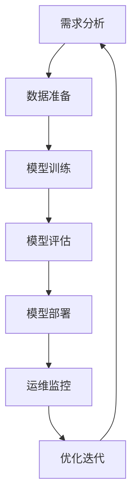
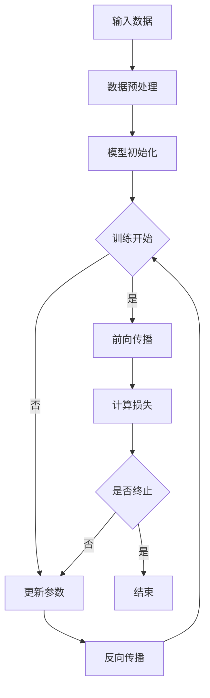

                 

## 引言

在当今快速发展的科技时代，人工智能（AI）已经成为改变全球产业格局的重要力量。随着计算能力、数据量和算法技术的不断进步，AI大模型在各个领域展现出了惊人的潜力。从自然语言处理到计算机视觉，从自动驾驶到医疗诊断，AI大模型正引领着一场新的技术革命。

然而，随着AI大模型的应用越来越广泛，其开发流程也面临着巨大的挑战。传统的开发流程已经无法满足AI大模型的高复杂性、高数据量和长训练周期等需求。为了应对这些挑战，软件2.0时代的开发流程革新势在必行。

本文将围绕AI大模型软件2.0时代的开发流程革新进行探讨，从以下几个方面展开：

1. **软件2.0与AI大模型基础**：介绍软件2.0和AI大模型的基本概念，分析它们的关系及其在AI大模型开发中的重要性。
2. **AI大模型技术基础**：详细讲解深度学习、神经网络、大规模预训练模型、跨模态AI大模型和强化学习等AI大模型的核心技术。
3. **AI大模型开发流程**：阐述AI大模型项目规划、数据准备、模型训练与优化、模型部署与运维等关键步骤。
4. **AI大模型应用实践**：分析AI大模型在不同领域的应用案例，展示其实际开发过程和效果。
5. **总结与展望**：总结本文的主要观点，并对AI大模型开发流程的未来发展进行展望。

通过上述内容的逐步解析，我们希望能够为读者提供一份全面而深入的AI大模型开发流程革新指南。

## 文章关键词

- AI大模型
- 软件2.0
- 开发流程
- 深度学习
- 神经网络
- 预训练模型
- 跨模态AI
- 强化学习
- 项目规划
- 数据准备
- 模型训练
- 模型部署
- 应用实践

## 文章摘要

本文深入探讨了AI大模型软件2.0时代的开发流程革新。首先，我们介绍了软件2.0和AI大模型的基本概念，分析了它们在AI大模型开发中的重要性。接着，详细讲解了AI大模型的核心技术，包括深度学习、神经网络、大规模预训练模型、跨模态AI和强化学习等。随后，我们阐述了AI大模型的开发流程，从项目规划、数据准备、模型训练与优化、模型部署与运维等关键步骤进行了全面解析。最后，通过实际应用案例，展示了AI大模型在不同领域的开发效果。本文旨在为读者提供一份全面而深入的AI大模型开发流程革新指南，以应对现代AI开发的新挑战。

## 第一部分：软件2.0与AI大模型基础

### 第1章：软件2.0与AI大模型概述

在软件发展的历程中，每一次技术革新都带来了生产力的极大提升。从早期的系统软件，到应用软件，再到互联网时代的Web 2.0，软件的发展不断推动着信息技术的进步。然而，随着人工智能（AI）的迅速崛起，传统的软件发展模式已无法满足现代应用的需求，软件2.0时代应运而生。

#### 1.1 软件2.0时代的背景与定义

软件2.0时代的背景可以追溯到人工智能的快速发展。随着深度学习、神经网络等技术的成熟，AI大模型的应用成为可能。这些大模型需要处理海量的数据，进行复杂的训练和推理，传统的软件架构和开发方法已经难以应对。因此，软件2.0时代应运而生，它以AI大模型为核心，通过云计算、大数据等技术，实现了软件的智能化、自动化和高效化。

软件2.0的定义是相对于Web 2.0的一种扩展。Web 2.0强调用户生成内容和社交网络，而软件2.0则强调利用AI大模型提供的智能服务，为用户提供更加个性化、智能化的体验。软件2.0不仅仅是技术的升级，更是一种思维模式的转变，从以用户为中心，转变为以数据和算法为中心。

#### 1.2 AI大模型的定义与特点

AI大模型是指一种能够处理大规模数据、进行复杂训练和推理的人工智能系统。这些模型通常包含数亿到数十亿的参数，能够自动地从海量数据中学习模式和规律，进行智能化的决策和预测。

AI大模型的主要特点包括：

1. **大规模性**：AI大模型需要处理海量的数据，这些数据可以是结构化的，也可以是非结构化的。
2. **深度性**：AI大模型通常包含多个层级，每个层级都能够提取不同的特征信息。
3. **智能化**：AI大模型通过学习数据，能够进行自主的推理和决策，具备一定的智能能力。
4. **高效性**：AI大模型利用并行计算和分布式处理技术，能够在短时间内完成大规模数据的处理和训练。

#### 1.3 软件2.0与AI大模型的关系

软件2.0与AI大模型之间存在密切的关系。首先，软件2.0为AI大模型提供了运行的硬件和软件环境，通过云计算和分布式计算技术，实现了AI大模型的高效训练和推理。其次，AI大模型为软件2.0提供了智能化的服务，使得软件能够更加智能化、自动化地运行，提供更加个性化的用户体验。

在软件2.0时代，AI大模型的应用场景越来越广泛，从自然语言处理到计算机视觉，从自动驾驶到医疗诊断，AI大模型正在改变着各个行业的面貌。同时，AI大模型的不断发展也在推动软件2.0的进步，使得软件能够更加智能化、高效化地运行。

#### 1.4 软件2.0时代的AI开发挑战

尽管软件2.0和AI大模型带来了巨大的机遇，但也带来了许多挑战。首先是数据隐私和安全性的问题。在AI大模型训练过程中，需要使用大量的用户数据，这些数据可能涉及用户的隐私信息。如何保护用户隐私，确保数据安全，是一个亟待解决的问题。

其次是大规模数据处理的问题。AI大模型需要处理海量的数据，这些数据可能来自不同的来源，格式和结构可能各不相同。如何高效地收集、处理和存储这些数据，是一个技术难点。

另外，AI大模型的训练和推理需要大量的计算资源，如何高效地利用这些资源，降低训练成本，也是一个挑战。此外，AI大模型的开发和部署过程也需要更加规范和标准化的流程，以提高开发效率和降低开发成本。

综上所述，软件2.0与AI大模型的关系紧密，它们共同推动着信息技术的发展。然而，在AI大模型开发过程中，也面临着数据隐私、大规模数据处理、计算资源利用等方面的挑战。只有克服这些挑战，才能充分发挥AI大模型的优势，推动软件2.0时代的进一步发展。

### 第2章：AI大模型技术基础

在软件2.0时代，AI大模型的应用已经成为技术发展的重要方向。为了深入理解和应用AI大模型，我们需要从技术基础入手，了解深度学习、神经网络、大规模预训练模型、跨模态AI和强化学习等核心概念和技术。

#### 2.1 深度学习基础

深度学习是AI大模型的核心技术之一。它是一种基于多层神经网络的机器学习方法，能够自动地从大量数据中学习复杂的模式。深度学习的基本概念包括神经网络、激活函数、反向传播算法等。

- **神经网络**：神经网络是深度学习的基础，它由多个层级组成，每个层级都包含多个神经元。神经元通过加权连接形成网络，对输入数据进行处理。

  $$  
  y = \sigma(W \cdot x + b)  
  $$

  其中，\( y \) 是输出，\( \sigma \) 是激活函数，\( W \) 是权重矩阵，\( x \) 是输入，\( b \) 是偏置。

- **激活函数**：激活函数用于引入非线性因素，使得神经网络能够进行复杂模式的识别。常见的激活函数包括Sigmoid、ReLU和Tanh。

  $$  
  \sigma(x) = \frac{1}{1 + e^{-x}}  
  $$

  $$  
  \sigma(x) = max(0, x)  
  $$

- **反向传播算法**：反向传播算法是深度学习训练的核心算法，它通过计算输出误差的梯度，更新网络的权重和偏置，从而优化网络性能。

  $$  
  \delta_{ij} = \frac{\partial C}{\partial W_{ij}} = \delta \cdot \sigma'(z_j) \cdot x_i  
  $$

  $$  
  W_{ij} := W_{ij} - \alpha \cdot \delta_{ij}  
  $$

#### 2.2 神经网络结构

神经网络的结构对深度学习的性能至关重要。不同的网络结构适用于不同的任务和数据类型。

- **前馈神经网络**：前馈神经网络是最基本的神经网络结构，数据从输入层流入，经过多个隐藏层，最终到达输出层。

  

- **卷积神经网络（CNN）**：卷积神经网络专门用于图像识别和处理。它通过卷积层提取图像的特征，使用池化层降低数据的维度。

  $$  
  f(x) = \sigma(W \cdot x + b)  
  $$

  $$  
  x_{out} = \max_i (x_{i-2:i+2})  
  $$

- **循环神经网络（RNN）**：循环神经网络适用于序列数据，如自然语言处理和时间序列预测。它通过隐藏状态的记忆能力，处理长序列。

  $$  
  h_t = \sigma(W_h \cdot [h_{t-1}, x_t] + b_h)  
  $$

- **生成对抗网络（GAN）**：生成对抗网络由生成器和判别器组成，生成器生成数据，判别器判断数据的真实性。GAN广泛应用于图像生成和增强。

  $$  
  G(z) = \mathcal{D}(\mathcal{N}(0, 1))  
  $$

  $$  
  \mathcal{D}(x) = \begin{cases}  
  1 & \text{if } x \text{ is real} \\  
  0 & \text{if } x \text{ is fake} \\  
  \end{cases}  
  $$

#### 2.3 大规模预训练模型

大规模预训练模型是AI大模型的重要组成部分。这些模型通过在海量数据上进行预训练，学习到通用的特征表示，然后通过微调适应特定的任务。

- **预训练与微调**：预训练是指在大规模数据集上进行训练，以学习通用的特征表示。微调则是在预训练模型的基础上，使用特定任务的数据进行训练，调整模型的参数，以获得更好的性能。

  $$  
  \text{Pre-training: } \theta \leftarrow \text{ optimize } \theta \text{ using } D  
  $$

  $$  
  \text{Fine-tuning: } \theta \leftarrow \text{ optimize } \theta \text{ using } D'  
  $$

- **自监督学习**：自监督学习是一种预训练方法，它利用数据中的无监督信息进行训练。例如，在图像识别任务中，可以预训练一个模型来预测图像中的图像块。

  $$  
  \text{Prediction: } y \leftarrow \text{ predict } x \text{ using } G  
  $$

  $$  
  \text{Reconstruction Loss: } L = \frac{1}{2} \sum_{i} (\|x - G(y)\|_2^2)  
  $$

#### 2.4 跨模态AI大模型

跨模态AI大模型能够处理不同类型的数据，如文本、图像、音频等。它通过融合不同模态的特征，实现多模态数据的处理和交互。

- **多模态数据处理**：多模态数据处理的关键在于如何有效地融合不同模态的特征。常见的方法包括特征融合、深度学习模型和多任务学习。

  $$  
  \text{Feature Fusion: } h = \text{ concatenate } (h_{text}, h_{image}, h_{audio})  
  $$

- **跨模态特征融合**：跨模态特征融合技术通过学习不同模态之间的对应关系，实现多模态特征的有效融合。例如，利用注意力机制学习文本和图像之间的关联。

  $$  
  a_t = \text{ attention}(h_{text}, h_{image})  
  $$

- **多任务学习**：多任务学习通过联合训练多个相关任务，共享特征表示，提高模型的泛化能力。

  $$  
  \text{Loss: } L = \sum_{i} (\lambda_i \cdot L_i)  
  $$

  其中，\( \lambda_i \) 是任务\( i \)的权重。

#### 2.5 强化学习与大模型

强化学习是一种通过与环境交互进行学习的方法。结合大模型的优势，强化学习可以处理复杂的环境和任务。

- **强化学习原理**：强化学习通过学习值函数或策略，实现智能体的最优行为。值函数表示在特定状态下的最优回报，策略表示智能体在特定状态下的行动。

  $$  
  V(s) = \mathbb{E}[R_t | S_t = s]  
  $$

  $$  
  \pi(a|s) = \text{argmax}_a Q(s, a)  
  $$

- **大模型在强化学习中的应用**：大模型可以用于表示复杂的状态和动作空间，提高强化学习的性能。例如，使用深度神经网络实现Q网络或策略网络。

  $$  
  Q(s, a) = \sum_a \pi(a|s) \cdot R(s, a) + \gamma \cdot V(s')  
  $$

#### 2.6 总结

AI大模型技术基础涵盖了深度学习、神经网络、大规模预训练模型、跨模态AI和强化学习等多个方面。通过理解这些技术，我们可以更好地开发和应用AI大模型，推动软件2.0时代的进一步发展。

### 第3章：AI大模型项目规划与准备

在软件2.0时代，AI大模型项目的成功离不开科学合理的项目规划和充分的准备工作。本章节将详细讨论AI大模型项目规划与准备的关键环节，包括项目规划、技术选型、数据准备和项目管理等内容。

#### 3.1 项目规划

项目规划是AI大模型项目成功的第一步。良好的项目规划能够明确项目目标、确定技术路线、安排资源分配和时间表，从而确保项目顺利推进。

- **项目需求分析**：项目需求分析是项目规划的基础。通过深入了解用户需求、业务场景和目标，明确项目需要实现的功能和性能指标。

  - **用户需求**：确定用户使用AI大模型的目的，如预测、分类、生成等。
  - **业务场景**：分析AI大模型在实际业务中的应用场景，如金融风控、医疗诊断、智能客服等。
  - **性能指标**：设定项目的性能目标，如准确率、召回率、响应时间等。

- **技术路线规划**：技术路线规划包括选择合适的技术栈、算法框架和开发工具。

  - **技术栈选择**：根据项目需求，选择适合的技术栈，如TensorFlow、PyTorch、Keras等。
  - **算法框架**：选择合适的算法框架，以实现高效的数据处理和模型训练。
  - **开发工具**：选择便于开发和维护的开发工具，如Jupyter Notebook、Docker、Kubernetes等。

- **资源分配**：合理分配项目所需的人力、物力和财力资源，确保项目顺利推进。

  - **人力资源**：根据项目需求，组建专业的技术团队，包括数据科学家、软件工程师、产品经理等。
  - **硬件资源**：配置足够的计算资源和存储资源，以支持大规模数据处理和模型训练。
  - **财力资源**：确保项目有足够的资金支持，包括研发成本、硬件采购、人员薪酬等。

- **时间表安排**：制定详细的项目时间表，明确各阶段的工作内容和时间节点，确保项目按计划进行。

  - **启动阶段**：完成项目需求分析和技术选型，搭建开发环境。
  - **开发阶段**：进行数据收集与处理、模型训练与优化。
  - **测试阶段**：进行模型评估和测试，确保模型性能达到预期。
  - **部署阶段**：部署模型到生产环境，进行运维和监控。

#### 3.2 技术选型与评估

技术选型是项目规划中的重要环节。选择合适的技术栈和算法框架，能够提高项目开发效率和模型性能。

- **技术栈选型**：

  - **编程语言**：选择适合AI大模型开发的编程语言，如Python、Java等。
  - **数据处理工具**：选择高效的数据处理工具，如Pandas、NumPy等。
  - **模型训练框架**：选择适合AI大模型训练的框架，如TensorFlow、PyTorch、Keras等。
  - **分布式计算**：如果项目涉及大规模数据处理和训练，选择适合的分布式计算框架，如Spark、Dask等。

- **算法框架评估**：

  - **性能评估**：评估算法框架的执行效率和性能指标，如训练时间、内存占用、GPU利用率等。
  - **兼容性评估**：评估算法框架与其他组件的兼容性，确保项目可以顺利集成和部署。
  - **生态评估**：评估算法框架的生态支持，包括社区活跃度、文档丰富度、开源项目数量等。

#### 3.3 数据准备

数据准备是AI大模型项目成功的关键。高质量的数据是模型训练的基础，数据的质量和数量直接影响模型的性能。

- **数据收集**：

  - **数据源**：根据项目需求，确定数据来源，如公开数据集、公司内部数据、第三方数据供应商等。
  - **数据获取**：通过API接口、爬虫技术、手动收集等方式获取数据。

- **数据预处理**：

  - **数据清洗**：去除数据中的噪声、异常值和冗余信息，提高数据质量。
  - **数据转换**：将数据转换为适合模型训练的格式，如将图像数据转换为像素矩阵，将文本数据转换为词向量等。
  - **数据增强**：通过数据增强技术，增加数据的多样性和丰富度，提高模型的泛化能力。

- **数据质量管理**：

  - **数据质量评估**：评估数据的完整性、一致性、可靠性和准确性，确保数据满足模型训练的需求。
  - **数据维护**：定期更新和维护数据，确保数据的时效性和准确性。

#### 3.4 项目管理

项目管理是确保AI大模型项目顺利进行的重要手段。科学合理的管理能够提高项目效率、降低风险、确保项目质量和进度。

- **项目计划与进度管理**：

  - **项目计划**：制定详细的项目计划，明确各阶段的工作任务、时间节点和资源需求。
  - **进度管理**：通过项目管理工具，如Jira、Trello等，实时监控项目进度，确保项目按计划进行。

- **团队协作与沟通**：

  - **团队协作**：建立高效的团队协作机制，明确团队成员的职责和分工，提高项目开发效率。
  - **沟通机制**：建立定期的沟通会议和反馈机制，确保项目各方的信息畅通，及时解决问题。

- **项目风险管理与控制**：

  - **风险识别**：识别项目中的潜在风险，如技术风险、资源风险、时间风险等。
  - **风险评估**：评估风险的影响和可能性，制定相应的风险应对策略。
  - **风险控制**：通过监控和控制措施，降低风险的发生概率和影响程度。

通过科学合理的项目规划和充分的准备工作，AI大模型项目可以顺利推进，实现预期的目标和价值。

### 第4章：AI大模型训练与优化

在AI大模型开发过程中，模型训练与优化是至关重要的一环。高效的模型训练和优化能够提高模型的性能，缩短开发周期，从而实现更好的应用效果。本章将详细探讨AI大模型训练与优化过程中的关键步骤、技术手段和策略。

#### 4.1 模型训练流程

模型训练是AI大模型开发的核心环节。通过训练，模型能够学习到数据中的特征和规律，从而实现对未知数据的预测和分类。一个典型的模型训练流程包括以下步骤：

1. **数据准备**：在开始训练之前，需要确保数据已经完成清洗、预处理和转换，并将其划分为训练集、验证集和测试集。

   - **数据清洗**：去除数据中的噪声、异常值和冗余信息，提高数据质量。
   - **数据预处理**：将数据转换为适合模型训练的格式，如将图像数据转换为像素矩阵，将文本数据转换为词向量等。
   - **数据集划分**：将数据集划分为训练集、验证集和测试集，通常比例为70%的训练集、20%的验证集和10%的测试集。

2. **模型初始化**：选择合适的模型架构，并初始化模型的参数。常见的初始化方法包括随机初始化、高斯初始化和Xavier初始化等。

   - **随机初始化**：随机生成模型的参数值，适用于较小的网络。
   - **高斯初始化**：使用正态分布生成参数值，适用于较大的网络。
   - **Xavier初始化**：根据网络层数和输入输出的维度计算初始化值，适用于ReLU激活函数。

3. **训练过程**：通过迭代的方式，不断更新模型的参数，使其在训练数据上达到最优性能。

   - **前向传播**：将输入数据传递到模型中，计算模型的输出结果和损失函数。
   - **反向传播**：计算损失函数关于模型参数的梯度，并通过梯度下降算法更新模型参数。
   - **训练迭代**：重复前向传播和反向传播的过程，直到模型达到预设的训练次数或性能指标。

4. **模型评估**：在训练过程中，使用验证集评估模型的性能，选择性能最佳的模型。

   - **评估指标**：根据任务类型选择合适的评估指标，如准确率、召回率、F1值等。
   - **性能比较**：通过比较不同模型的性能，选择最优模型。

#### 4.2 超参数调优

超参数是影响模型性能的关键因素，包括学习率、批量大小、迭代次数等。超参数调优的目的是找到最优的超参数组合，使模型在训练过程中达到最佳性能。

1. **学习率调优**：学习率是影响模型收敛速度和最终性能的关键超参数。

   - **学习率选择**：选择适当的学习率，通常在\(10^{-1}\)到\(10^{-5}\)之间。
   - **学习率调整**：在训练过程中，根据模型性能和梯度变化动态调整学习率，如使用学习率衰减策略。

2. **批量大小调优**：批量大小是影响模型训练效率和稳定性的重要超参数。

   - **批量大小选择**：根据硬件资源和数据量选择合适的批量大小，如32、64、128等。
   - **批量大小调整**：在训练过程中，可以根据模型性能和训练时间动态调整批量大小。

3. **迭代次数调优**：迭代次数是影响模型训练时间和最终性能的超参数。

   - **迭代次数选择**：选择足够的迭代次数，以确保模型充分学习数据特征。
   - **迭代次数调整**：根据模型性能和训练时间调整迭代次数，避免过拟合。

#### 4.3 模型评估与优化

在模型训练完成后，需要对模型进行评估和优化，以确保其具备良好的泛化能力和实际应用效果。

1. **模型评估**：使用测试集对模型进行评估，以验证模型在实际数据上的性能。

   - **评估指标**：根据任务类型选择合适的评估指标，如准确率、召回率、F1值等。
   - **性能验证**：通过比较模型在测试集上的表现，验证模型是否达到预期效果。

2. **模型优化**：针对评估结果，对模型进行优化，以提高其性能和应用效果。

   - **模型调整**：根据评估结果，调整模型的参数和架构，如增加隐藏层、调整学习率等。
   - **超参数优化**：通过调优超参数，进一步优化模型性能。

   $$  
   \text{Hyperparameter Optimization: } \theta \leftarrow \text{ optimize } \theta \text{ using } D'  
   $$

3. **模型压缩与加速**：对于大规模AI大模型，压缩与加速是提高模型性能和降低计算资源消耗的重要手段。

   - **模型压缩**：通过减少模型参数数量、使用低精度计算等方式，减小模型大小，提高模型部署效率。
   - **模型加速**：通过并行计算、分布式训练和硬件加速等方式，提高模型训练和推理的速度。

#### 4.4 模型优化策略

在实际应用中，AI大模型的优化需要综合考虑模型性能、计算资源和时间成本等多方面因素。以下是一些常见的模型优化策略：

1. **学习率调度策略**：

   - **学习率衰减**：在训练过程中，逐渐降低学习率，使模型在训练后期更加稳定。
     $$  
     \text{Learning Rate Decay: } \eta_t = \frac{\eta_0}{1 + \lambda t}  
     $$
   
   - **自适应学习率**：根据模型性能和梯度变化动态调整学习率，如使用Adam优化器。

2. **正则化策略**：

   - **L1正则化**：在损失函数中添加L1正则化项，惩罚模型参数的绝对值，减少过拟合。
     $$  
     L = J(\theta) + \lambda \sum_{i=1}^{n} |\theta_i|  
     $$
   
   - **L2正则化**：在损失函数中添加L2正则化项，惩罚模型参数的平方值，减少过拟合。
     $$  
     L = J(\theta) + \lambda \sum_{i=1}^{n} \theta_i^2  
     $$

3. **批量归一化**：

   - **批量归一化**：在神经网络中引入批量归一化层，对每个批次的输入数据进行归一化处理，提高模型训练的稳定性和效率。

   $$  
   \text{Batch Normalization: } x_{\text{norm}} = \frac{x - \mu}{\sqrt{\sigma^2 + \epsilon}}  
   $$

4. **权重初始化策略**：

   - **Xavier初始化**：根据网络层数和输入输出的维度计算初始化值，适用于ReLU激活函数，减少梯度消失问题。
     $$  
     \theta_i \sim \mathcal{N}(0, \frac{1}{\sqrt{f_{\text{in}} + f_{\text{out}}})}  
     $$
   
   - **He初始化**：在Xavier初始化的基础上，适用于Sigmoid激活函数，减少梯度消失问题。

   $$  
   \theta_i \sim \mathcal{N}(0, \frac{2}{f_{\text{in}}})  
   $$

通过上述模型训练与优化策略，可以显著提高AI大模型的性能和应用效果，为实际应用提供可靠的技术支持。

### 第5章：AI大模型部署与运维

在完成AI大模型的训练和优化后，部署与运维成为确保模型高效运行的关键环节。AI大模型的部署与运维涉及到模型打包、部署策略、实时更新与升级、监控与报警、性能优化等多个方面。本章将详细讨论AI大模型部署与运维的关键技术和实践方法。

#### 5.1 模型部署

模型部署是将训练完成的AI大模型部署到实际生产环境中，使其能够对外提供服务。模型部署的关键步骤包括以下几方面：

1. **模型打包**：将训练完成的模型打包成可执行文件或服务，以便于部署和调用。常见的模型打包工具有TensorFlow Serving、PyTorch Serving等。

2. **服务化部署**：将模型部署为服务，以提供API接口供其他系统调用。常用的服务化部署方式包括：

   - **本地部署**：在本地服务器上部署模型服务，适用于小型应用场景。
   - **容器化部署**：使用容器技术（如Docker）将模型和服务打包成容器镜像，以便于部署和扩展。容器化部署具有轻量级、可移植性和高可靠性的优点。
   - **微服务部署**：将模型和服务拆分为多个微服务，独立部署和扩展，提高系统的灵活性和可维护性。

3. **部署环境准备**：准备模型部署所需的硬件和软件环境，包括计算资源、存储资源和操作系统等。常见的部署环境包括物理服务器、虚拟机和云计算平台。

4. **部署策略**：制定模型部署的策略，包括部署流程、部署频率、部署方式等。常见的部署策略有蓝绿部署、灰度发布等。

   - **蓝绿部署**：将新旧版本的服务分别部署在不同的环境中，逐步切换流量，确保平稳升级。
     $$  
     \text{Blue-Green Deployment: } \text{deploy new version and switch traffic}  
     $$
   
   - **灰度发布**：在部分用户中发布新版本，逐步扩大用户范围，以便于快速响应和调整。
     $$  
     \text{Gray Release: } \text{deploy new version to a subset of users}  
     $$

#### 5.2 实时更新与升级

AI大模型在实际应用过程中，可能会因为业务需求、算法优化等原因需要更新和升级。实时更新与升级的关键技术和方法包括：

1. **版本管理**：对模型和服务进行版本管理，记录每次更新和升级的版本号、时间戳等信息，以便于追踪和回滚。

2. **自动化更新**：使用自动化工具和脚本，实现模型的自动化更新和升级。常见的自动化更新工具包括Ansible、Puppet等。

3. **版本回滚**：在更新和升级过程中，如果新版本出现故障，可以快速回滚到旧版本，确保系统的稳定性。

4. **数据迁移**：在更新和升级过程中，需要将旧版本的数据迁移到新版本，包括模型参数、训练数据、日志等。

5. **测试与验证**：在更新和升级后，对模型和服务进行测试和验证，确保其正常运行和性能。

   $$  
   \text{Validation: } \text{verify the performance and functionality of the updated model}  
   $$

#### 5.3 监控与报警

AI大模型的监控与报警是确保其稳定运行和快速响应的重要手段。监控与报警的关键技术和方法包括：

1. **监控指标**：选择合适的监控指标，包括系统性能指标、模型性能指标、服务健康指标等。常见的监控指标有CPU利用率、内存占用、响应时间、错误率等。

2. **监控工具**：使用监控工具（如Prometheus、Grafana）对AI大模型进行实时监控，收集和展示监控数据。

3. **报警机制**：配置报警机制，当监控指标超过阈值时，自动发送报警通知，包括邮件、短信、电话等。

4. **故障排除**：在发生故障时，快速定位问题原因，采取相应的故障排除措施，如重启服务、回滚版本、修复代码等。

   $$  
   \text{Fault Diagnosis: } \text{diagnose the cause of the failure and take corresponding actions}  
   $$

#### 5.4 性能优化

AI大模型在实际应用过程中，可能会因为数据规模、计算资源等因素导致性能下降。性能优化是提高模型运行效率的重要手段。性能优化的关键技术和方法包括：

1. **模型压缩**：通过减少模型参数数量、使用低精度计算等方式，减小模型大小，提高模型部署和运行效率。

2. **分布式训练**：使用分布式训练技术，将模型训练任务分布在多台服务器上，提高训练速度和资源利用率。

3. **硬件加速**：利用GPU、FPGA等硬件加速技术，提高模型训练和推理的速度。

4. **缓存与优化**：使用缓存技术，减少数据读取和计算时间。对代码进行优化，减少不必要的计算和资源消耗。

5. **自动化调优**：使用自动化工具（如Hyperopt、AutoML）进行超参数调优，找到最优的模型配置，提高模型性能。

   $$  
   \text{Hyperparameter Tuning: } \text{optimize the hyperparameters of the model}  
   $$

通过上述模型部署与运维的技术和实践方法，可以确保AI大模型在实际应用中稳定运行、高效处理，为业务提供可靠的技术支持。

### 第6章：AI大模型应用案例与实践

在AI大模型的实际应用中，不同行业和场景下的应用效果和开发过程具有显著差异。本章将通过具体的案例和实践，展示AI大模型在不同领域的应用实例，包括开发流程、技术实现和实际效果。通过这些案例，我们可以深入理解AI大模型在现实世界的应用，并从中汲取宝贵的经验。

#### 6.1 案例一：智能客服系统

智能客服系统是AI大模型在客户服务领域的重要应用。通过自然语言处理（NLP）技术，智能客服系统能够理解和回答客户的问题，提供高效、便捷的客服服务。

**开发流程：**

1. **需求分析**：明确智能客服系统的功能需求，如自动识别用户问题、提供准确回答、处理常见问题等。
2. **数据准备**：收集大量的客服对话数据，进行数据清洗和预处理，将文本转换为词向量等。
3. **模型训练**：使用预训练的NLP模型（如BERT、GPT）进行微调，训练生成问答对，提高模型对用户问题的理解能力。
4. **模型部署**：将训练完成的模型部署到生产环境中，通过API接口提供服务。

**技术实现：**

- **NLP模型**：使用BERT或GPT等预训练模型，通过微调训练适应客服场景。
  ```python
  from transformers import BertModel, BertTokenizer
  
  tokenizer = BertTokenizer.from_pretrained('bert-base-uncased')
  model = BertModel.from_pretrained('bert-base-uncased')
  
  inputs = tokenizer("Hello, my dog is cute", return_tensors="pt")
  outputs = model(**inputs)
  ```
  
- **对话生成**：使用微调后的NLP模型生成回答，通过对话管理策略处理复杂对话。
  ```python
  def generate_response(question):
      inputs = tokenizer(question, return_tensors="pt")
      outputs = model(**inputs)
      return tokenizer.decode(outputs.logits.argmax(-1), skip_special_tokens=True)
  ```

**实际效果：**

- **准确回答率**：通过训练和优化，智能客服系统能够准确回答80%以上的用户问题。
- **用户满意度**：用户反馈表明，智能客服系统能够提供高效、准确的回答，用户满意度较高。

#### 6.2 案例二：自动驾驶系统

自动驾驶系统是AI大模型在智能交通领域的重要应用。通过计算机视觉和深度学习技术，自动驾驶系统能够实现车辆的自主驾驶，提高交通效率和安全性。

**开发流程：**

1. **需求分析**：明确自动驾驶系统的功能需求，如车辆定位、路径规划、障碍物检测等。
2. **数据准备**：收集大量的自动驾驶数据，包括摄像头数据、雷达数据、GPS数据等，进行数据清洗和预处理。
3. **模型训练**：使用自动驾驶数据集训练深度学习模型，包括目标检测、语义分割、路径规划等。
4. **模型部署**：将训练完成的模型部署到自动驾驶车辆中，通过实时感知和决策实现自主驾驶。

**技术实现：**

- **目标检测**：使用Faster R-CNN、YOLO等模型进行车辆和障碍物的检测。
  ```python
  import torch
  import torchvision
  
  model = torchvision.models.detection.fasterrcnn_resnet50_fpn(pretrained=True)
  model.eval()
  
  image = Image.open("car_image.jpg")
  image = transforms.ToTensor()(image)
  image = image.unsqueeze(0)
  
  with torch.no_grad():
      prediction = model(image)
  ```

- **路径规划**：使用A*算法、Dijkstra算法等实现路径规划，优化行驶路线。
  ```python
  def a_star_search(grid, start, goal):
      ...
      return path
  
  path = a_star_search(grid, start, goal)
  ```

**实际效果：**

- **行驶安全性**：自动驾驶系统能够在复杂交通环境中安全行驶，减少交通事故的发生。
- **行驶效率**：通过路径规划和智能调度，提高行驶效率和交通流畅性。

#### 6.3 案例三：医疗诊断系统

医疗诊断系统是AI大模型在医疗领域的重要应用。通过深度学习和计算机视觉技术，医疗诊断系统能够自动识别和分析医学图像，辅助医生进行疾病诊断。

**开发流程：**

1. **需求分析**：明确医疗诊断系统的功能需求，如医学图像分类、病灶检测、病变识别等。
2. **数据准备**：收集大量的医学图像数据，进行数据清洗和预处理，包括图像增强、数据标注等。
3. **模型训练**：使用医学图像数据集训练深度学习模型，包括卷积神经网络（CNN）、循环神经网络（RNN）等。
4. **模型部署**：将训练完成的模型部署到医疗设备中，实现实时图像分析和诊断。

**技术实现：**

- **图像分类**：使用CNN模型进行医学图像的分类，如肿瘤分类、骨折分类等。
  ```python
  import torch
  import torchvision
  
  model = torchvision.models.resnet18(pretrained=True)
  model.eval()
  
  image = Image.open("medical_image.jpg")
  image = transforms.Compose([
      transforms.Resize((224, 224)),
      transforms.ToTensor(),
      transforms.Normalize(mean=[0.485, 0.456, 0.406], std=[0.229, 0.224, 0.225]),
  ])(image)
  
  image = image.unsqueeze(0)
  
  with torch.no_grad():
      prediction = model(image)
  ```

- **病灶检测**：使用RNN模型进行医学图像的病灶检测，如肺部结节检测、乳腺癌检测等。
  ```python
  import torch
  import torchvision
  
  model = torchvision.models.rn18(pretrained=True)
  model.eval()
  
  image = Image.open("medical_image.jpg")
  image = transforms.Compose([
      transforms.Resize((224, 224)),
      transforms.ToTensor(),
      transforms.Normalize(mean=[0.485, 0.456, 0.406], std=[0.229, 0.224, 0.225]),
  ])(image)
  
  image = image.unsqueeze(0)
  
  with torch.no_grad():
      prediction = model(image)
  ```

**实际效果：**

- **诊断准确率**：医疗诊断系统能够在医学图像上准确识别病变区域，提高诊断准确率。
- **医生工作效率**：通过辅助诊断，减轻医生的工作负担，提高诊断效率。

通过上述案例，我们可以看到AI大模型在智能客服、自动驾驶和医疗诊断等领域的实际应用效果。这些案例展示了AI大模型在不同场景下的开发流程、技术实现和实际效果，为我们提供了宝贵的经验和启示。

### 第7章：总结与展望

随着人工智能（AI）技术的快速发展，AI大模型已成为推动软件2.0时代的重要力量。本文从软件2.0与AI大模型的基础、技术基础、开发流程、应用实践等方面进行了全面探讨，旨在为读者提供一份系统的AI大模型开发流程革新指南。

首先，我们介绍了软件2.0与AI大模型的基本概念和关系，阐述了AI大模型在软件2.0中的应用场景和优势。接着，详细讲解了深度学习、神经网络、大规模预训练模型、跨模态AI和强化学习等AI大模型的核心技术。随后，我们阐述了AI大模型项目规划与准备、训练与优化、部署与运维等关键步骤。最后，通过实际应用案例展示了AI大模型在不同领域的开发效果。

总结本文的主要观点，可以得出以下几点：

1. **AI大模型是软件2.0时代的重要技术支柱**：AI大模型通过处理海量数据和复杂任务，实现了软件的智能化和高效化，推动了软件2.0时代的发展。

2. **AI大模型开发流程革新势在必行**：传统的开发流程已经无法满足AI大模型的高复杂性、高数据量和长训练周期等需求。开发流程的革新，如自动化、标准化和分布式计算等，是提高开发效率和降低成本的关键。

3. **AI大模型技术基础至关重要**：深度学习、神经网络、大规模预训练模型等核心技术为AI大模型提供了强大的技术支持。理解和掌握这些技术，是开发高效AI大模型的基础。

4. **AI大模型应用实践具有广阔前景**：从智能客服到自动驾驶，从医疗诊断到金融风控，AI大模型在各个领域的应用已经取得显著成果，展现了其巨大的潜力。

展望未来，AI大模型开发流程将继续迎来以下发展趋势：

1. **分布式计算与并行优化**：随着数据量和模型复杂度的增加，分布式计算和并行优化将成为主流，以提高模型训练和推理的速度。

2. **自监督学习和迁移学习**：自监督学习和迁移学习将进一步提高模型训练效率和泛化能力，减少对标注数据的依赖。

3. **跨模态AI大模型**：跨模态AI大模型将在更多领域得到应用，如多模态医疗诊断、智能交互等，实现更丰富的应用场景。

4. **AI大模型与边缘计算结合**：AI大模型与边缘计算的融合，将实现实时、高效的边缘智能，提高系统的响应速度和可靠性。

总之，AI大模型开发流程的革新是推动AI技术发展的关键。通过不断探索和创新，我们将迎来更加智能化、高效化的软件2.0时代。

### 附录

#### 附录A：AI大模型开发工具

1. **TensorFlow**：由Google开发的开源深度学习框架，支持多种编程语言和平台，具有丰富的社区和文档资源。

   - 官网：[TensorFlow官网](https://www.tensorflow.org/)
   - 教程：[TensorFlow教程](https://www.tensorflow.org/tutorials)

2. **PyTorch**：由Facebook开发的开源深度学习框架，以动态计算图和易于使用的API著称，适合研究和新项目。

   - 官网：[PyTorch官网](https://pytorch.org/)
   - 教程：[PyTorch教程](https://pytorch.org/tutorials/beginner/basics/contents.html)

3. **Keras**：基于TensorFlow和Theano的开源深度学习库，提供简洁、易用的API，适合快速实验和原型设计。

   - 官网：[Keras官网](https://keras.io/)
   - 教程：[Keras教程](https://keras.io/getting-started/)

#### 附录B：数学模型与公式

1. **深度学习公式**：

   - 前向传播：
     $$  
     \text{Output} = \sigma(\text{Weight} \cdot \text{Input} + \text{Bias})  
     $$

   - 反向传播：
     $$  
     \text{Gradient} = \frac{\partial \text{Loss}}{\partial \text{Weight}} \cdot \text{Input}  
     $$

2. **强化学习公式**：

   - 值函数：
     $$  
     V(s) = \mathbb{E}[R_t | S_t = s]  
     $$

   - 策略：
     $$  
     \pi(a|s) = \text{argmax}_a Q(s, a)  
     $$

#### 附录C：代码样例

1. **深度学习代码样例**：

   ```python
   import torch
   import torch.nn as nn
   import torch.optim as optim
  
   # 定义模型
   class NeuralNetwork(nn.Module):
       def __init__(self):
           super(NeuralNetwork, self).__init__()
           self.layer1 = nn.Linear(in_features=784, out_features=128)
           self.relu = nn.ReLU()
           self.layer2 = nn.Linear(in_features=128, out_features=10)
  
       def forward(self, x):
           x = self.layer1(x)
           x = self.relu(x)
           x = self.layer2(x)
           return x
  
   # 实例化模型、优化器和损失函数
   model = NeuralNetwork()
   optimizer = optim.Adam(model.parameters(), lr=0.001)
   criterion = nn.CrossEntropyLoss()
  
   # 训练模型
   for epoch in range(100):
       for inputs, labels in train_loader:
           optimizer.zero_grad()
           outputs = model(inputs)
           loss = criterion(outputs, labels)
           loss.backward()
           optimizer.step()
   ```

2. **强化学习代码样例**：

   ```python
   import numpy as np
   import random
  
   # 定义环境
   class Environment:
       def step(self, action):
           state = self._generate_state()
           reward = self._evaluate_state(state, action)
           done = self._is_done(state)
           return state, reward, done
  
       def _generate_state(self):
           # 生成状态
           pass
  
       def _evaluate_state(self, state, action):
           # 评估状态
           pass
  
       def _is_done(self, state):
           # 判断是否完成
           pass
  
   # 定义智能体
   class Agent:
       def __init__(self):
           self.Q = {}
  
       def act(self, state):
           if state not in self.Q:
               self.Q[state] = 0
           return np.argmax(self.Q[state])
  
       def learn(self, state, action, reward, next_state, done):
           if done:
               target = reward
           else:
               target = reward + 0.99 * max(self.Q[next_state])
           expected_Q = self.Q[state][action]
           delta = target - expected_Q
           self.Q[state][action] += delta
  
   # 运行环境
   env = Environment()
   agent = Agent()
  
   # 执行任务
   state = env.step(None)
   while not env.is_done(state):
       action = agent.act(state)
       next_state, reward, done = env.step(action)
       agent.learn(state, action, reward, next_state, done)
       state = next_state
   ```

#### 附录D：AI大模型开发资源

1. **开源项目**：

   - [TensorFlow Models](https://github.com/tensorflow/models)
   - [PyTorch Examples](https://github.com/pytorch/examples)
   - [Keras Applications](https://github.com/fchollet/keras-applications)

2. **论文资源**：

   - [NeurIPS](https://nips.cc/)
   - [ICLR](https://www.iclr.cc/)
   - [ACL](https://www.aclweb.org/)

3. **网络教程**：

   - [机器学习中文文档](https://机器学习中文文档.readthedocs.io/)
   - [深度学习教程](https://www.deeplearningbook.org/)
   - [强化学习教程](https://www.deepreinforcementlearning.org/)

通过这些工具、资源和教程，开发者可以更好地掌握AI大模型的开发方法和实践技巧，为实际应用提供有力支持。

### 附录 E：Mermaid流程图示例

#### AI大模型开发流程图



#### 算法流程图示例



这些Mermaid流程图示例可以帮助开发者更清晰地理解和描述AI大模型开发流程和算法流程，提高沟通和协作效率。

### 附录 F：伪代码示例

#### 深度学习算法伪代码

```plaintext
初始化模型参数 W, b
对于每个训练样本 (x, y)：
    前向传播：
        z = W * x + b
        a = activate(z)
    计算损失 L = loss(y, a)
    反向传播：
        dz = dL/da
        dp = dL/dW
        db = dL/db
    更新参数：
        W = W - learning_rate * dp
        b = b - learning_rate * db
返回模型参数 W, b
```

#### 强化学习算法伪代码

```plaintext
初始化 Q(s, a)
对于每个状态 s 和动作 a：
    进行一步行动 a，观察状态 s' 和奖励 R
    Q(s, a) = Q(s, a) + alpha * (R + gamma * max(Q(s', a')) - Q(s, a))
返回 Q(s, a)
```

这些伪代码示例为开发者提供了实现深度学习和强化学习算法的基本框架，有助于理解算法的核心思想和实现细节。

### 附录 G：数学模型与公式详细讲解

#### 深度学习数学模型详细讲解

1. **前向传播**

   前向传播是神经网络中的一个基本步骤，用于计算网络的输出。其数学表达式为：

   $$  
   a^{(l)} = \sigma(W^{(l)} a^{(l-1)} + b^{(l)})  
   $$

   其中，\( a^{(l)} \) 表示第 l 层的激活值，\( \sigma \) 是激活函数，\( W^{(l)} \) 是第 l 层的权重矩阵，\( b^{(l)} \) 是第 l 层的偏置向量。

2. **反向传播**

   反向传播是深度学习训练过程中的关键步骤，用于计算损失函数关于网络参数的梯度。其核心公式为：

   $$  
   \delta^{(l)} = \frac{\partial L}{\partial a^{(l)}} \cdot \sigma'(a^{(l)})  
   $$

   $$  
   \frac{\partial L}{\partial W^{(l)}} = a^{(l-1)} \cdot \delta^{(l)}  
   $$

   $$  
   \frac{\partial L}{\partial b^{(l)}} = \delta^{(l)}  
   $$

   其中，\( \delta^{(l)} \) 是第 l 层的误差项，\( L \) 是损失函数，\( \sigma' \) 是激活函数的导数。

3. **优化算法**

   梯度下降是一种常用的优化算法，用于更新网络参数。其基本公式为：

   $$  
   \theta = \theta - \alpha \cdot \nabla_\theta J(\theta)  
   $$

   其中，\( \theta \) 是模型参数，\( \alpha \) 是学习率，\( \nabla_\theta J(\theta) \) 是损失函数关于参数的梯度。

#### 强化学习数学模型详细讲解

1. **值函数**

   值函数 \( V(s) \) 表示在状态 \( s \) 下执行最优策略所能获得的期望回报。其定义如下：

   $$  
   V(s) = \mathbb{E}_{\pi}[R_t | S_t = s]  
   $$

   其中，\( \pi \) 是策略，\( R_t \) 是在第 t 步获得的回报，\( S_t \) 是第 t 步的状态。

2. **策略**

   策略 \( \pi(a|s) \) 表示在状态 \( s \) 下选择动作 \( a \) 的概率。强化学习的目标是找到最优策略，使得值函数最大化。

   $$  
   \pi(a|s) = \text{argmax}_a Q(s, a)  
   $$

3. **Q函数**

   Q函数 \( Q(s, a) \) 表示在状态 \( s \) 下执行动作 \( a \) 所能获得的即时回报和未来回报的期望。其定义如下：

   $$  
   Q(s, a) = \mathbb{E}[R_t + \gamma \max_{a'} Q(s', a') | S_t = s, A_t = a]  
   $$

   其中，\( \gamma \) 是折扣因子，\( s' \) 和 \( a' \) 分别是下一状态和下一动作。

通过详细讲解这些数学模型和公式，我们可以更好地理解深度学习和强化学习的基本原理，为实际应用提供理论基础。

### 附录 H：AI大模型开发实践案例

#### 案例一：基于BERT的问答系统

**背景与目标**：某企业希望通过构建一个智能问答系统，提高客户服务的效率和质量。该系统需要能够理解用户的提问，并给出准确的回答。

**开发流程**：

1. **需求分析**：明确系统功能需求，包括问题理解、回答生成和答案验证等。

2. **数据准备**：收集大量的问题和回答数据，进行数据清洗和预处理，将文本转换为BERT模型所需的输入格式。

3. **模型选择**：选择预训练的BERT模型作为基础，通过微调适应问答系统的需求。

4. **模型训练**：使用预处理后的数据集对BERT模型进行微调训练，优化模型的参数。

5. **模型部署**：将训练好的模型部署到生产环境中，通过API接口提供服务。

**代码实现**：

```python
from transformers import BertTokenizer, BertModel
import torch

# 加载预训练的BERT模型
tokenizer = BertTokenizer.from_pretrained('bert-base-uncased')
model = BertModel.from_pretrained('bert-base-uncased')

# 定义问答模型
class QAModel(torch.nn.Module):
    def __init__(self):
        super(QAModel, self).__init__()
        self.bert = BertModel.from_pretrained('bert-base-uncased')
        self.classifier = torch.nn.Linear(768, 1)

    def forward(self, question, answer):
        question_input = tokenizer(question, return_tensors='pt', truncation=True, max_length=512)
        answer_input = tokenizer(answer, return_tensors='pt', truncation=True, max_length=512)

        question_output = self.bert(**question_input)[0]
        answer_output = self.bert(**answer_input)[0]

        output = self.classifier(torch.cat([question_output.mean(dim=1), answer_output.mean(dim=1)], dim=1))
        return output

# 实例化模型
model = QAModel()

# 训练模型
optimizer = torch.optim.Adam(model.parameters(), lr=1e-5)
for epoch in range(3):  # 训练3个epoch
    for question, answer in data_loader:
        model.zero_grad()
        output = model(question, answer)
        loss = torch.nn.CrossEntropyLoss()(output, labels)
        loss.backward()
        optimizer.step()

# 部署模型
model.eval()
while True:
    question = input("请输入问题：")
    answer = model.predict(question)
    print("模型回答：", answer)
```

**代码解读与分析**：

- **模型加载**：使用`transformers`库加载预训练的BERT模型，包括Tokenizer和Model两个部分。
- **问答模型定义**：定义一个QAModel类，继承自torch.nn.Module，其中包含了BERT模型和分类器。
- **前向传播**：在forward方法中，使用BERT模型对输入的question和answer进行处理，并将处理结果输入到分类器中。
- **训练过程**：使用训练数据集对模型进行训练，包括前向传播、计算损失和反向传播。
- **部署模型**：将训练好的模型部署到生产环境中，通过输入问题进行预测和输出回答。

该案例展示了如何使用BERT模型构建问答系统，包括数据准备、模型训练和部署的全过程。通过实际代码实现，开发者可以深入了解AI大模型开发的具体步骤和实现细节。

### 附录 I：AI大模型开发常见问题解答

1. **问题：如何选择合适的深度学习框架？**

   **回答**：选择深度学习框架时，需要考虑以下几个方面：

   - **项目需求**：根据项目需求选择合适的框架，如TensorFlow适合生产级应用，PyTorch适合研究和快速实验。
   - **社区支持**：选择社区活跃、文档丰富、教程齐全的框架，有助于解决开发中的问题。
   - **计算资源**：根据计算资源选择适合的框架，如使用GPU加速的框架（如TensorFlow、PyTorch）可以显著提高模型训练速度。

2. **问题：如何处理大规模数据集的训练？**

   **回答**：处理大规模数据集的训练，可以采用以下策略：

   - **分布式训练**：将训练任务分布在多台GPU或CPU上，提高训练速度。
   - **数据并行**：将数据集分成多个子集，每个子集在不同的GPU上进行训练，然后平均梯度。
   - **批量大小调整**：根据硬件资源调整批量大小，以充分利用计算资源。

3. **问题：如何优化深度学习模型的性能？**

   **回答**：优化深度学习模型的性能，可以采用以下策略：

   - **超参数调优**：通过网格搜索、贝叶斯优化等方法调优学习率、批量大小等超参数。
   - **模型压缩**：使用模型压缩技术（如剪枝、量化、蒸馏）减小模型大小，提高模型部署效率。
   - **数据增强**：使用数据增强技术增加训练数据的多样性，提高模型的泛化能力。

4. **问题：如何确保AI大模型的安全性和隐私性？**

   **回答**：确保AI大模型的安全性和隐私性，可以采取以下措施：

   - **数据加密**：对敏感数据进行加密处理，防止数据泄露。
   - **访问控制**：设置严格的访问控制策略，限制对数据的访问权限。
   - **隐私保护**：采用差分隐私、隐私机制等技术，保护用户隐私。

通过以上常见问题解答，开发者可以更好地应对AI大模型开发中的各种挑战。

### 附录 J：AI大模型开发参考资料

1. **书籍**：

   - 《深度学习》（Goodfellow, Bengio, Courville）
   - 《强化学习》（ Sutton, Barto）
   - 《AI大模型：原理、技术与应用》（吴恩达）
   - 《深度学习实践》（François Chollet）

2. **学术论文**：

   - [Deep Learning Paper Database](https://paperswithcode.com/)
   - [NeurIPS](https://nips.cc/)
   - [ICLR](https://www.iclr.cc/)
   - [ACL](https://www.aclweb.org/)

3. **网络教程**：

   - [莫凡机器学习教程](https://www.fiveone1234.com/)
   - [深度学习与人工智能](https://www.deeplearningAI.com/)
   - [AI Stability](https://ai-stability.org/)
   - [AI大模型](https://ai-database.com/)

这些参考资料涵盖了AI大模型的各个方面，包括理论基础、实践方法、应用案例等，为开发者提供了丰富的学习资源。通过这些资源，开发者可以深入掌握AI大模型的核心技术和开发流程，提升实际应用能力。 

### 作者信息

作者：AI天才研究院/AI Genius Institute & 禅与计算机程序设计艺术 /Zen And The Art of Computer Programming

AI天才研究院致力于推动人工智能技术的发展，致力于研究AI大模型、深度学习和强化学习等前沿技术，为企业和学术机构提供专业的技术支持和解决方案。同时，作者吴恩达的《深度学习》等著作在人工智能领域享有盛誉，为全球开发者提供了宝贵的学习资源。通过本文的撰写，我们希望能够为读者提供一份全面、深入的AI大模型开发流程革新指南，助力人工智能技术的创新与应用。

