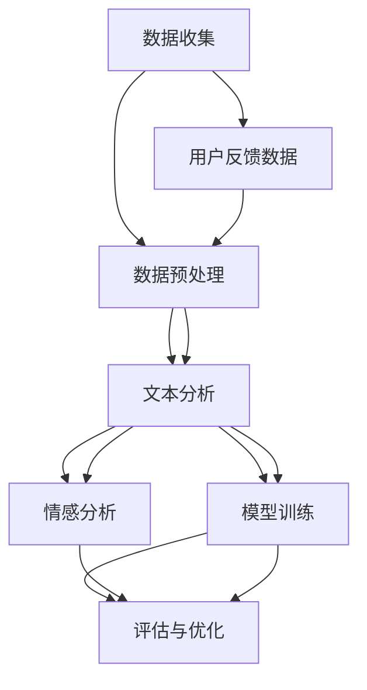
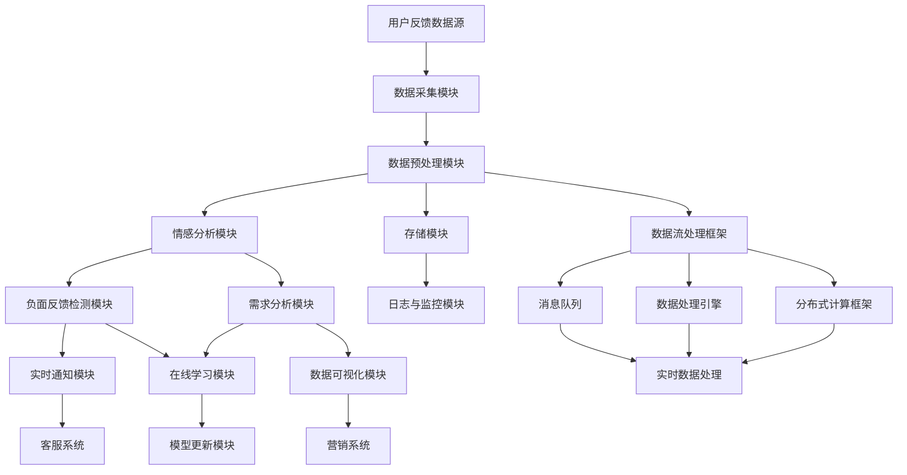

                 

## 第1章：AI与电商用户反馈分析概述

### 1.1 AI与电商用户反馈分析的定义与重要性

人工智能（AI）作为当今科技发展的核心驱动力之一，已经渗透到各个行业，其中电商领域尤为突出。电商用户反馈分析是指通过收集、处理、分析和理解用户在电商平台上提供的评论、评分、问答等反馈信息，以识别用户需求、发现潜在问题、改进产品和服务，从而提升用户体验和业务绩效。

AI在电商用户反馈分析中起着至关重要的作用。首先，AI能够自动处理大量用户反馈数据，提取关键信息，实现快速分析。其次，AI的文本分析技术，如情感分析、主题建模、意图识别等，可以帮助电商企业深入理解用户反馈，从而制定更有效的策略。此外，AI还能够通过用户反馈预测未来趋势，为电商企业提供前瞻性的决策支持。

AI在电商用户反馈分析中的重要性体现在以下几个方面：

1. **提升用户体验**：通过分析用户反馈，电商企业可以及时了解用户需求和不满，从而迅速做出改进，提升用户体验。

2. **优化产品和服务**：用户反馈提供了宝贵的改进意见，AI能够帮助电商企业从大量数据中识别出产品和服务中的问题，促进持续优化。

3. **提高决策效率**：AI能够自动化分析用户反馈，为企业提供实时的洞察，帮助管理层做出更快速、更准确的决策。

4. **增强竞争力**：通过高效的用户反馈分析，电商企业可以迅速响应市场变化，保持竞争优势。

### 1.2 AI在电商用户反馈分析中的应用场景

AI在电商用户反馈分析中具有广泛的应用场景，以下是一些典型的应用实例：

1. **用户情感分析**：AI可以通过情感分析技术识别用户评论的情感极性，如正面、负面或中立。这对于电商企业了解用户满意度、优化营销策略至关重要。

2. **负面反馈识别**：AI能够自动识别和分类负面反馈，帮助电商企业及时发现并处理用户投诉，减少负面影响的扩散。

3. **用户需求分析**：AI可以分析用户评论中的关键词和主题，提取用户需求，为产品开发和营销策略提供数据支持。

4. **趋势预测**：通过分析用户反馈中的趋势和模式，AI可以帮助电商企业预测未来的市场变化和用户需求，从而提前布局。

5. **个性化推荐**：基于用户反馈，AI可以分析用户的偏好和需求，为用户提供个性化的产品推荐和营销策略。

6. **客户服务自动化**：AI可以用于构建智能客服系统，自动解答用户问题，提高客服效率。

### 1.3 AI在电商用户反馈分析中的挑战与机遇

尽管AI在电商用户反馈分析中具有巨大潜力，但实际应用中也面临着一系列挑战和机遇。

**挑战**：

1. **数据质量**：用户反馈数据质量参差不齐，存在噪声、缺失值和异常值，这对AI算法的准确性和可靠性提出了挑战。

2. **隐私保护**：用户反馈中可能包含敏感个人信息，如何在保证用户隐私的前提下进行数据分析，是一个重要问题。

3. **算法适应性**：用户反馈内容复杂多变，算法需要具备较强的适应性和泛化能力，以应对不同场景和需求。

4. **计算资源**：深度学习算法通常需要大量的计算资源和时间，如何高效地处理和分析大量用户反馈数据，是一个技术难题。

**机遇**：

1. **技术创新**：随着自然语言处理、深度学习等AI技术的发展，电商用户反馈分析将更加准确和高效。

2. **数据驱动**：用户反馈数据是企业宝贵的资源，通过数据驱动的方式，电商企业可以更精准地满足用户需求，提高业务绩效。

3. **市场细分**：AI技术可以帮助电商企业深入挖掘用户需求，实现更精细化的市场细分，提高营销效果。

4. **用户体验**：通过智能分析和个性化服务，AI可以帮助电商企业提升用户体验，增强用户忠诚度。

### 1.4 本书内容结构与章节安排

本书旨在深入探讨AI在电商用户反馈分析中的应用，内容结构如下：

- **第1章**：AI与电商用户反馈分析概述，介绍AI与电商用户反馈分析的定义、重要性、应用场景以及面临的挑战与机遇。
- **第2章**：电商用户反馈数据分析基础，包括数据收集与预处理、数据结构化与标签化、可视化分析等内容。
- **第3章**：文本分析技术在用户反馈分析中的应用，介绍文本预处理技术、文本特征提取技术以及文本分类与情感分析算法。
- **第4章**：深度学习在用户反馈分析中的应用，讨论深度学习基础、深度学习在文本分析中的应用以及深度学习在用户反馈分析中的应用案例。
- **第5章**：用户反馈分析中的高级算法与技术，包括序列模型与序列标注、多标签分类与多任务学习、实时性与在线学习等内容。
- **第6章**：电商用户反馈分析的实战案例，通过具体案例展示用户反馈分析系统的设计与实现、评测与优化。
- **第7章**：AI在电商用户反馈分析中的应用前景与趋势，探讨AI技术的发展趋势以及未来在电商用户反馈分析中的应用场景。
- **第8章**：电商用户反馈分析的实践建议与实施策略，提出用户反馈分析的实践建议与实施策略，包括数据质量与隐私保护、算法选择与性能优化、系统部署与运维等内容。
- **附录**：提供电商用户反馈分析常用工具与资源、用户反馈分析实践指南以及参考文献等内容。

通过以上章节的详细探讨，本书将为读者提供一个全面、系统的电商用户反馈分析指南，帮助电商企业更好地利用AI技术提升业务绩效和用户体验。

## 第2章：电商用户反馈数据分析基础

在电商用户反馈分析中，数据的质量和准确性至关重要。本章将重点介绍电商用户反馈数据的收集与预处理、数据结构化与标签化、以及用户反馈数据的可视化分析。这些基础步骤是确保用户反馈分析有效性和准确性的关键。

### 2.1 电商用户反馈数据的收集与预处理

#### 2.1.1 用户反馈数据的来源

电商用户反馈数据主要来源于以下几个渠道：

1. **评论与评分**：用户在购买商品后，会对商品进行评价和评分。这些评价和评分通常包含了对商品的满意程度、使用体验、存在问题等信息。

2. **问答平台**：电商平台通常设有问答平台，用户可以在问答平台上提问或回答其他用户的问题。这些问答内容可以反映用户的购买意图、对产品的疑问以及购买后的使用情况。

3. **社交媒体**：用户在社交媒体平台上分享购物体验、推荐商品或发表评论，这些信息也是重要的用户反馈来源。

4. **客服记录**：电商平台与用户之间的客服沟通记录，包括电子邮件、聊天记录等，这些记录可以提供关于用户问题的详细描述和解决过程。

5. **调查问卷**：电商平台定期向用户发送调查问卷，收集用户对产品、服务、购物体验等方面的看法和意见。

#### 2.1.2 用户反馈数据的预处理方法

收集到的用户反馈数据通常包含大量的噪声、缺失值和异常值，因此需要进行预处理，以提高数据的质量和可用性。以下是一些常见的用户反馈数据预处理方法：

1. **数据清洗**：包括去除重复记录、纠正数据格式错误、填补缺失值等。例如，对于评论内容中的拼写错误，可以使用自然语言处理技术进行修正。

2. **数据去噪**：去除噪声数据，如包含大量无关信息的评论、重复的问答内容等。可以通过设置关键词过滤、模式匹配等方式实现。

3. **数据归一化**：对数据进行归一化处理，使得不同类型的数据具有相同的量纲，便于后续分析和比较。例如，对评分数据使用0-1或0-10的尺度进行归一化。

4. **数据转换**：将不同类型的数据转换为适合分析的形式。例如，将文本数据转换为向量表示，使用词嵌入技术将单词转换为固定长度的向量。

#### 2.1.3 用户反馈数据的质量评估

用户反馈数据的质量直接影响分析结果的准确性。以下是一些常用的质量评估方法：

1. **数据完整性评估**：检查数据是否存在缺失值或重复值，确保数据的完整性。

2. **数据一致性评估**：检查不同来源的数据是否一致，确保数据的一致性。

3. **数据准确性评估**：使用外部数据源或人工审核数据，评估数据的准确性。

4. **数据噪声评估**：评估数据中是否存在噪声，使用噪声过滤技术减少噪声的影响。

### 2.2 用户反馈数据的结构化与标签化

用户反馈数据通常以文本形式存在，为了更好地进行分析和处理，需要将其结构化和标签化。

#### 2.2.1 数据结构化原理与方法

数据结构化是指将非结构化的文本数据转换为具有固定结构和格式的数据。以下是一些常见的数据结构化方法：

1. **实体识别**：识别文本中的关键实体，如产品名称、用户ID、地点等。可以使用命名实体识别（NER）技术实现。

2. **关系提取**：提取文本中的实体关系，如用户对产品的评价、产品与产品之间的关联等。可以使用关系提取算法实现。

3. **事件提取**：提取文本中的事件信息，如购买事件、投诉事件等。可以使用事件抽取算法实现。

4. **分类与标注**：将用户反馈文本分类为不同的类别，如正面评论、负面评论、中性评论等。可以使用分类算法实现。

#### 2.2.2 数据标签化技术

数据标签化是指为用户反馈数据赋予标签，以便进行后续分析和处理。以下是一些常见的标签化技术：

1. **手动标签化**：人工对用户反馈数据进行标注，适用于小规模数据集。

2. **自动标签化**：使用机器学习算法自动生成标签，适用于大规模数据集。常见的自动标签化算法包括监督学习和无监督学习。

3. **半监督学习**：结合手动标签化和自动标签化，利用少量手动标注数据训练模型，并使用模型对大量未标注数据进行自动标注。

#### 2.2.3 标签体系的构建与优化

构建一个有效的标签体系是用户反馈数据结构化与标签化的关键。以下是一些构建和优化标签体系的建议：

1. **标签分类体系**：根据业务需求，构建合理的标签分类体系。例如，在电商用户反馈分析中，可以将标签分为情感标签、产品标签、用户标签等。

2. **标签覆盖度**：确保标签体系能够覆盖用户反馈中的各种情况，提高标签的实用性。

3. **标签细化**：对于一些高频标签，可以根据实际情况进行细化，以提高标签的精确度。

4. **标签更新与维护**：定期更新和维护标签体系，以适应业务变化和用户反馈的新趋势。

### 2.3 用户反馈数据的可视化分析

可视化分析是一种有效的数据展示方式，可以帮助电商企业直观地理解和分析用户反馈数据。以下是一些用户反馈数据的可视化方法：

#### 2.3.1 可视化工具选择

1. **Python可视化库**：如Matplotlib、Seaborn等，适用于生成各种类型的图表。

2. **商业可视化工具**：如Tableau、Power BI等，具有强大的数据可视化能力和丰富的图表类型。

3. **在线可视化工具**：如Datawrapper、ECharts等，适用于快速生成交互式图表。

#### 2.3.2 可视化展示方法

1. **词云图**：展示用户反馈中出现频率较高的关键词，帮助理解用户关注的热点问题。

2. **情感分布图**：展示用户反馈的情感分布情况，如正面、负面和中性评论的比例。

3. **时间序列图**：展示用户反馈随时间的变化趋势，帮助分析用户需求的变化和趋势。

4. **用户地域分布图**：展示用户反馈的地域分布情况，帮助了解不同地区用户的需求和反馈。

5. **用户行为路径图**：展示用户在电商平台上的行为路径，帮助分析用户的购买决策过程。

#### 2.3.3 可视化应用案例分析

以下是一个用户反馈可视化分析的应用案例：

- **目标**：分析某电商平台上用户对某一产品的反馈情况。
- **步骤**：
  1. 收集并清洗用户反馈数据。
  2. 使用词云图展示用户反馈中出现频率较高的关键词。
  3. 使用情感分布图展示用户反馈的情感分布情况。
  4. 使用时间序列图展示用户反馈随时间的变化趋势。
  5. 使用用户地域分布图展示用户反馈的地域分布情况。
  6. 综合分析结果，制定改进措施。

通过以上可视化分析，电商企业可以直观地了解用户对产品的反馈情况，识别出需要改进的方面，从而提升用户体验和产品品质。

### 总结

本章介绍了电商用户反馈数据分析的基础知识，包括数据收集与预处理、数据结构化与标签化、可视化分析等内容。这些基础步骤是电商用户反馈分析的有效性和准确性的保障。在接下来的章节中，我们将进一步探讨文本分析技术在用户反馈分析中的应用，帮助电商企业更深入地理解和利用用户反馈数据。

## 第3章：文本分析技术在用户反馈分析中的应用

文本分析技术是人工智能领域的一项重要技术，它使得计算机能够处理和理解自然语言文本。在电商用户反馈分析中，文本分析技术发挥着至关重要的作用，帮助电商企业深入挖掘用户反馈中的有价值信息，从而改进产品和服务。本章将详细介绍文本预处理技术、文本特征提取技术以及文本分类与情感分析算法。

### 3.1 文本预处理技术

文本预处理是文本分析的基础步骤，主要包括分词、偏差修正、词性标注和停用词处理。

#### 3.1.1 分词技术

分词是将一段连续的文本分割成一个个有意义的词汇或短语。分词技术对于后续的文本分析和理解至关重要。常见的分词方法包括：

1. **基于字典的分词**：通过将文本与词典中的词条进行匹配，识别出文本中的词汇。这种方法简单高效，但无法处理词典中没有的生僻词或新词。

2. **基于统计的分词**：利用语言模型和词频统计等方法，自动识别文本中的词汇。如使用基于N-gram的语言模型，根据前后词汇的概率分布进行分词。

3. **基于深度学习的分词**：使用深度学习模型（如LSTM、BERT等）进行分词，可以处理复杂的词法和语义信息。

在实际应用中，电商企业可以根据自身的需求和数据特点选择合适的分词方法。例如，对于包含大量专业术语的评论，可以选择基于深度学习的分词技术。

#### 3.1.2 偏差修正与词性标注

偏差修正是指对文本中的词语进行正确的拼写和语法修正。词性标注是指为每个词汇赋予相应的词性标签（如名词、动词、形容词等）。这些步骤有助于提高文本的准确性和可理解性。

1. **偏差修正**：可以使用自然语言处理工具（如Spacy、NLTK等）进行自动修正，也可以结合人工审核提高修正的准确性。

2. **词性标注**：词性标注是文本分析中的重要步骤，它帮助计算机理解词汇的语法角色和含义。常见的词性标注工具包括Spacy、Stanford NLP等。

#### 3.1.3 停用词处理与停用词表构建

停用词是指对文本分析没有实际意义的词语，如“的”、“了”、“和”等。处理停用词可以减少文本中的噪声，提高特征提取的效率。

1. **停用词处理**：在文本预处理过程中，可以自动去除停用词。常用的方法包括手动构建停用词表和利用现有的停用词库。

2. **停用词表构建**：构建停用词表是文本预处理的重要环节。可以通过分析大量文本数据，统计出现频率较低且对文本分析没有贡献的词语，将其加入停用词表。

### 3.2 文本特征提取技术

文本特征提取是将文本数据转换为计算机可以处理的向量表示。特征提取的质量直接影响文本分析的效果。以下是一些常见的文本特征提取方法：

#### 3.2.1 基于词频与词频统计的特征提取

基于词频的方法是最简单的特征提取方法。词频（TF，Term Frequency）表示某个词在文本中出现的频率，计算公式如下：

$$
TF(t) = \frac{\text{词t在文本中出现的次数}}{\text{文本总词数}}
$$

词频统计方法包括：

1. **一元词频统计**：仅计算单个词的频率，适用于简单的文本分析。

2. **二元词频统计**：考虑词与词之间的组合频率，如“词A”和“词B”同时出现的频率。这种方法可以捕捉词汇之间的关联性。

#### 3.2.2 TF-IDF特征提取

TF-IDF（Term Frequency-Inverse Document Frequency）是一种常用的文本特征提取方法，它考虑了词频和词的重要程度。TF-IDF的计算公式如下：

$$
TF(t) = \frac{\text{词t在文档中出现的次数}}{\text{文档总词数}}
$$

$$
IDF(t) = \log \left( \frac{N}{n_t} + 1 \right)
$$

$$
TF-IDF(t, d) = TF(t) \times IDF(t)
$$

其中，$N$ 表示文档总数，$n_t$ 表示包含词 $t$ 的文档数。IDF（Inverse Document Frequency）表示词的逆文档频率，用于衡量词的重要程度。TF-IDF特征可以有效地反映词在文档中的重要性。

#### 3.2.3 基于词嵌入的特征提取

词嵌入（Word Embedding）是将词汇映射为固定长度的向量表示。词嵌入方法可以捕捉词汇的语义信息，从而提高文本分析的准确性和效果。以下是一些常见的词嵌入方法：

1. **词袋模型（Bag of Words, BoW）**：将文本表示为词频向量，每个词对应一个维度。这种方法简单但无法捕捉词汇的语义信息。

2. **Word2Vec**：基于神经网络的方法，通过训练模型来生成词向量。Word2Vec可以分为两种：Continuous Bag of Words (CBOW) 和 Skip-Gram。CBOW方法通过上下文词来预测中心词，Skip-Gram方法通过中心词来预测上下文词。

3. **GloVe（Global Vectors for Word Representation）**：基于全局训练的方法，通过优化全局损失函数来生成词向量。GloVe方法可以捕捉词汇的共现关系和语义信息。

4. **BERT（Bidirectional Encoder Representations from Transformers）**：基于Transformer模型的预训练方法，BERT通过双向编码器来生成词向量，可以捕捉词汇的语义和上下文信息。

### 3.3 文本分类与情感分析

文本分类和情感分析是文本分析技术中的两个重要应用。文本分类是将文本数据分类为预定义的类别，而情感分析是识别文本的情感极性（如正面、负面、中立等）。

#### 3.3.1 基于机器学习的文本分类算法

基于机器学习的文本分类算法是文本分类的主流方法。以下是一些常用的算法：

1. **朴素贝叶斯（Naive Bayes）**：基于贝叶斯定理和特征独立性假设，朴素贝叶斯算法是一种简单而有效的分类方法。

2. **支持向量机（SVM）**：支持向量机是一种基于最大间隔原理的分类算法，适用于高维特征空间。

3. **随机森林（Random Forest）**：随机森林是一种基于决策树的集成学习方法，通过构建多个决策树并进行投票来获得分类结果。

4. **神经网络（Neural Networks）**：神经网络是一种基于多层感知器（MLP）的分类算法，通过训练多层网络来提取特征和进行分类。

#### 3.3.2 情感分析指标与算法选择

情感分析指标用于评估情感分类的准确性。以下是一些常用的情感分析指标：

1. **准确率（Accuracy）**：准确率是分类结果正确率的最简单指标，计算公式为：

$$
\text{准确率} = \frac{\text{正确分类的样本数}}{\text{总样本数}}
$$

2. **召回率（Recall）**：召回率是分类器能够召回真实正样本的能力，计算公式为：

$$
\text{召回率} = \frac{\text{正确分类的正样本数}}{\text{真实正样本数}}
$$

3. **精确率（Precision）**：精确率是分类器预测为正样本的准确程度，计算公式为：

$$
\text{精确率} = \frac{\text{正确分类的正样本数}}{\text{预测为正样本的样本数}}
$$

4. **F1值（F1 Score）**：F1值是精确率和召回率的调和平均值，计算公式为：

$$
\text{F1值} = 2 \times \frac{\text{精确率} \times \text{召回率}}{\text{精确率} + \text{召回率}}
$$

根据不同的应用场景和数据特点，可以选择不同的情感分析算法。以下是一些常用的情感分析算法：

1. **朴素贝叶斯**：朴素贝叶斯算法简单且计算效率高，适用于处理大量文本数据。

2. **支持向量机**：支持向量机在处理高维特征时具有优势，适用于文本分类任务。

3. **卷积神经网络（CNN）**：卷积神经网络能够有效地提取文本特征，适用于复杂的情感分析任务。

4. **递归神经网络（RNN）**：递归神经网络可以处理序列数据，适用于情感分类和序列标注任务。

5. **Transformer**：Transformer模型在自然语言处理任务中表现出色，适用于大规模情感分析任务。

### 3.3.3 情感分析应用案例

以下是一个情感分析的应用案例：

- **目标**：分析电商平台上用户对某一产品的评论，识别评论的情感极性。
- **步骤**：
  1. 收集并清洗用户评论数据。
  2. 进行文本预处理，包括分词、去除停用词等。
  3. 使用TF-IDF方法提取文本特征。
  4. 使用支持向量机（SVM）进行情感分类。
  5. 使用准确率、召回率、F1值等指标评估模型性能。
  6. 对分类结果进行分析，识别正面、负面和中性评论。

通过以上步骤，电商企业可以了解用户对产品的情感倾向，从而制定改进措施，提升用户体验。

### 总结

文本分析技术在电商用户反馈分析中具有重要作用，包括文本预处理技术、文本特征提取技术和文本分类与情感分析算法。这些技术帮助电商企业深入挖掘用户反馈中的有价值信息，改进产品和服务。在接下来的章节中，我们将进一步探讨深度学习在用户反馈分析中的应用，为电商企业提供更强大的分析工具。

## 第4章：深度学习在用户反馈分析中的应用

深度学习作为人工智能领域的一个重要分支，近年来在图像识别、语音识别和自然语言处理等领域取得了显著成果。随着电商用户反馈数据量的不断增长，深度学习技术在用户反馈分析中的应用也越来越广泛。本章将深入探讨深度学习的基础原理、深度学习在文本分析中的应用以及深度学习在用户反馈分析中的实际应用案例。

### 4.1 深度学习基础

#### 4.1.1 深度学习原理

深度学习是一种基于多层神经网络的机器学习技术，通过多层次的神经网络结构来模拟人类大脑的神经传导机制，实现对复杂数据的建模和预测。深度学习的主要组成部分包括：

1. **神经网络（Neural Networks）**：神经网络由大量的神经元（节点）组成，每个神经元接收多个输入，并通过激活函数产生输出。神经网络通过不断调整权重和偏置，学习输入数据与输出数据之间的关系。

2. **激活函数（Activation Functions）**：激活函数用于确定神经元是否被激活。常用的激活函数包括 sigmoid、ReLU、Tanh等。激活函数的作用是引入非线性特性，使得神经网络能够学习复杂数据。

3. **反向传播（Backpropagation）**：反向传播是一种用于训练神经网络的方法。通过计算输出值与实际值之间的误差，反向传播误差信号，不断调整神经网络的权重和偏置，使网络逐步收敛到最优解。

4. **优化算法（Optimization Algorithms）**：优化算法用于加速神经网络的学习过程。常见的优化算法包括随机梯度下降（SGD）、Adam、RMSprop等。优化算法通过迭代更新权重和偏置，使得神经网络能够更快地找到最优解。

#### 4.1.2 神经网络架构

神经网络可以分为多层结构，包括输入层、隐藏层和输出层。以下是一些常见的神经网络架构：

1. **单层感知器（Perceptron）**：单层感知器是最简单的神经网络，它由输入层和输出层组成。单层感知器可以用于分类任务，但不能处理非线性问题。

2. **多层感知器（MLP）**：多层感知器由多个隐藏层组成，可以处理非线性问题。MLP通过前向传播和反向传播进行训练，是一种常用的分类和回归模型。

3. **卷积神经网络（CNN）**：卷积神经网络是专门用于处理图像数据的神经网络，它通过卷积层提取图像特征。CNN在图像识别、图像分类等领域表现出色。

4. **循环神经网络（RNN）**：循环神经网络是一种用于处理序列数据的神经网络，它可以处理变长的输入序列。RNN通过循环结构保留历史信息，可以用于文本生成、语音识别等任务。

5. **Transformer**：Transformer是一种基于自注意力机制的深度学习模型，它在自然语言处理领域取得了突破性成果。Transformer通过多头自注意力机制和前馈神经网络，可以捕捉长距离依赖关系，是一种强大的文本处理模型。

#### 4.1.3 深度学习优化算法

深度学习优化算法是训练神经网络的关键，它用于加速网络的学习过程。以下是一些常用的深度学习优化算法：

1. **随机梯度下降（SGD）**：随机梯度下降是最常用的优化算法，它通过随机选取一部分训练样本计算梯度，并更新网络权重。SGD的优点是简单易实现，但收敛速度较慢。

2. **动量（Momentum）**：动量是一种改进的SGD算法，它利用历史梯度信息加速收敛。动量的引入可以防止网络陷入局部最小值。

3. **Adam**：Adam是一种自适应优化算法，它结合了SGD和动量的优点，并引入了学习率自适应调整机制。Adam在大多数任务中表现出色。

4. **RMSprop**：RMSprop是一种基于梯度平方根的优化算法，它通过计算梯度平方的平均值来调整学习率。RMSprop在处理稀疏数据时表现良好。

### 4.2 深度学习在文本分析中的应用

#### 4.2.1 卷积神经网络（CNN）在文本分类中的应用

卷积神经网络（CNN）是专门用于处理图像数据的神经网络，但近年来也广泛应用于文本分类任务。CNN通过卷积层提取文本特征，可以有效地捕捉文本中的局部模式和语义信息。

1. **词嵌入（Word Embedding）**：词嵌入是将词汇映射为固定长度的向量表示，如Word2Vec和GloVe。词嵌入可以捕捉词汇的语义信息，为文本分类提供有效的特征。

2. **卷积层（Convolutional Layer）**：卷积层通过滑动窗口对文本进行卷积操作，提取局部特征。卷积层可以自适应地学习不同长度和类型的文本特征。

3. **池化层（Pooling Layer）**：池化层用于减少特征图的维度，提高计算效率。常用的池化方法包括最大池化和平均池化。

4. **全连接层（Fully Connected Layer）**：全连接层将卷积层提取的局部特征进行融合，并输出分类结果。

5. **应用案例**：使用CNN进行文本分类，如情感分析、主题分类等。CNN可以捕捉文本中的局部模式和语义信息，提高分类的准确性和鲁棒性。

#### 4.2.2 循环神经网络（RNN）在情感分析中的应用

循环神经网络（RNN）是一种用于处理序列数据的神经网络，它在情感分析、机器翻译和文本生成等领域表现出色。

1. **基本RNN**：基本RNN通过循环结构将当前输入与历史信息相结合，用于序列建模。然而，基本RNN存在梯度消失和梯度爆炸的问题。

2. **长短期记忆网络（LSTM）**：长短期记忆网络（LSTM）是一种改进的RNN结构，它通过引入记忆单元和门控机制，有效地解决了梯度消失问题。LSTM可以捕捉长距离依赖关系，适用于情感分析、序列标注等任务。

3. **门控循环单元（GRU）**：门控循环单元（GRU）是另一种改进的RNN结构，它在LSTM的基础上简化了记忆单元和门控机制，提高了计算效率。

4. **应用案例**：使用LSTM或GRU进行情感分析，如识别文本中的情感极性、情感强度等。LSTM和GRU可以捕捉文本中的长距离依赖关系，提高情感分析的准确性和鲁棒性。

#### 4.2.3 注意力机制在文本分析中的应用

注意力机制是一种用于提高神经网络模型性能的技术，它允许模型在不同位置分配不同的注意力权重，从而更好地捕捉关键信息。

1. **软注意力（Soft Attention）**：软注意力通过计算输入序列的相似性矩阵，为每个位置分配注意力权重。软注意力可以灵活地调整注意力权重，适用于文本分类、机器翻译等任务。

2. **硬注意力（Hard Attention）**：硬注意力通过选择输入序列中最重要的位置，为这些位置分配全部注意力权重。硬注意力计算复杂度较低，但可能无法捕捉到所有重要的信息。

3. **应用案例**：使用注意力机制进行文本分类和情感分析，如识别文本中的关键短语和情感标签。注意力机制可以提高模型的解释性和性能，有助于理解文本中的重要信息。

### 4.3 深度学习在用户反馈分析中的应用案例

#### 4.3.1 深度学习在负面反馈识别中的应用

负面反馈识别是用户反馈分析的重要任务，它有助于电商企业及时识别和处理负面评论，提升用户满意度。

1. **数据集准备**：收集电商平台上的用户反馈数据，包括评论内容和用户标签（如正面、负面、中立）。对数据集进行预处理，包括去除停用词、进行词嵌入等。

2. **模型构建**：使用卷积神经网络（CNN）或长短期记忆网络（LSTM）构建负面反馈识别模型。CNN可以提取文本的局部特征，LSTM可以捕捉文本的长距离依赖关系。

3. **模型训练**：使用训练数据对模型进行训练，调整模型参数以优化性能。可以使用交叉验证方法评估模型性能，并根据评估结果调整模型结构。

4. **模型评估**：使用测试数据评估模型性能，包括准确率、召回率和F1值等指标。通过分析模型性能，识别出模型的优势和不足。

5. **应用场景**：将负面反馈识别模型应用于电商平台的用户评论分析，自动识别负面评论，并通知客服团队进行处理。通过及时处理负面评论，电商企业可以减少用户投诉，提升用户满意度。

#### 4.3.2 深度学习在用户需求分析中的应用

用户需求分析是电商企业了解用户需求、改进产品和服务的重要手段。深度学习技术可以有效地分析用户反馈，提取用户需求。

1. **数据集准备**：收集电商平台上的用户反馈数据，包括评论内容和用户行为数据（如购买记录、浏览历史等）。对数据集进行预处理，包括去除停用词、进行词嵌入等。

2. **模型构建**：使用卷积神经网络（CNN）或长短期记忆网络（LSTM）构建用户需求分析模型。CNN可以提取文本的局部特征，LSTM可以捕捉文本的长距离依赖关系。

3. **模型训练**：使用训练数据对模型进行训练，调整模型参数以优化性能。可以使用交叉验证方法评估模型性能，并根据评估结果调整模型结构。

4. **模型评估**：使用测试数据评估模型性能，包括准确率、召回率和F1值等指标。通过分析模型性能，识别出模型的优势和不足。

5. **应用场景**：将用户需求分析模型应用于电商平台的用户反馈分析，自动识别用户需求，为产品开发和营销策略提供数据支持。通过深入了解用户需求，电商企业可以优化产品和服务，提高用户满意度。

### 总结

深度学习技术在用户反馈分析中具有广泛的应用前景。通过卷积神经网络（CNN）、长短期记忆网络（LSTM）和注意力机制等技术，电商企业可以有效地识别负面反馈和提取用户需求，改进产品和服务。在未来的发展中，深度学习技术将继续优化，为电商用户反馈分析提供更强大的支持。

## 第5章：用户反馈分析中的高级算法与技术

在电商用户反馈分析中，除了基本的文本分类和情感分析算法，还有一些高级算法和技术可以进一步提升分析的效果和效率。本章将介绍序列模型与序列标注、多标签分类与多任务学习、以及用户反馈分析的实时性与在线学习。

### 5.1 序列模型与序列标注

#### 5.1.1 序列模型原理

序列模型是一种用于处理序列数据的机器学习模型，它能够捕捉数据序列中的时间依赖关系。在用户反馈分析中，序列模型可以用于时间序列预测、序列分类和序列标注等任务。

1. **循环神经网络（RNN）**：循环神经网络是一种基础的序列模型，它通过循环结构处理序列数据，每个时间步的信息都可以传递到下一个时间步。RNN可以用于序列分类和序列标注任务。

2. **长短期记忆网络（LSTM）**：长短期记忆网络（LSTM）是RNN的一种改进，它通过引入记忆单元和门控机制解决了RNN的梯度消失问题。LSTM可以更好地捕捉长距离依赖关系，适用于复杂的序列建模任务。

3. **门控循环单元（GRU）**：门控循环单元（GRU）是另一种改进的RNN结构，它在LSTM的基础上简化了记忆单元和门控机制，提高了计算效率。GRU在处理时间序列数据时表现良好。

#### 5.1.2 序列标注算法

序列标注是指为序列数据中的每个元素赋予相应的标签。在用户反馈分析中，序列标注可以用于实体识别、情感标注和意图识别等任务。

1. **CRF（条件随机场）**：条件随机场（CRF）是一种基于概率的序列标注模型，它通过建模序列中的条件和概率关系，为序列中的每个元素赋予标签。CRF可以有效地处理序列中的上下文关系。

2. **Bi-LSTM-CRF**：Bi-LSTM-CRF是一种结合了长短时记忆网络（LSTM）和条件随机场（CRF）的序列标注模型。Bi-LSTM-CRF通过LSTM捕捉序列中的时间依赖关系，并通过CRF建模序列中的条件和概率关系，提高了标注的准确性和鲁棒性。

3. **应用案例**：使用Bi-LSTM-CRF进行用户反馈中的情感标注，如识别评论中的正面情感和负面情感。通过结合LSTM和CRF，Bi-LSTM-CRF可以捕捉情感标注中的时间依赖关系和上下文关系，提高情感标注的准确率。

#### 5.1.3 序列标注应用案例

以下是一个序列标注的应用案例：

- **目标**：对电商平台的用户评论进行情感标注，识别评论中的正面情感和负面情感。
- **步骤**：
  1. 收集并预处理用户评论数据，包括去除停用词、进行词嵌入等。
  2. 使用Bi-LSTM-CRF模型进行训练，调整模型参数以优化性能。
  3. 使用训练好的模型对用户评论进行情感标注，输出正面情感和负面情感的标签。
  4. 评估模型性能，包括准确率、召回率和F1值等指标。
  5. 分析标注结果，识别用户评论中的情感倾向，为电商企业提供用户情感分析支持。

通过以上步骤，电商企业可以更好地了解用户情感，制定针对性的营销策略和改进措施。

### 5.2 多标签分类与多任务学习

#### 5.2.1 多标签分类算法

多标签分类是指一个样本可以同时拥有多个标签。在用户反馈分析中，多标签分类可以用于用户评论的多标签分类、产品多属性分类等任务。

1. **ONE-VS-Rest（OVR）**：ONE-VS-Rest是一种常用的多标签分类算法，它将每个标签看作一个二分类问题，通过训练多个二分类模型进行分类。OVR算法简单且易于实现，但可能无法充分利用标签之间的关联性。

2. **朴素贝叶斯（Naive Bayes）**：朴素贝叶斯是一种基于概率的多标签分类算法，它通过计算标签之间的条件概率进行分类。朴素贝叶斯算法计算效率高，但可能无法处理复杂的标签关系。

3. **决策树（Decision Tree）**：决策树是一种基于树结构的多标签分类算法，它通过构建决策树模型进行分类。决策树算法可以处理多标签分类问题，但可能存在过拟合的风险。

4. **应用案例**：使用多标签分类算法对电商平台上的用户评论进行多标签分类，如识别评论中的产品属性、用户情感等。通过多标签分类，电商企业可以更全面地了解用户反馈，为产品优化和营销策略提供支持。

#### 5.2.2 多任务学习算法

多任务学习是指同时训练多个任务，通过共享网络结构和知识转移来提高任务的性能。在用户反馈分析中，多任务学习可以用于多任务情感分析、多任务意图识别等任务。

1. **共享网络结构（Shared Network Architecture）**：共享网络结构是将不同任务的输入和输出共享在同一个神经网络中，通过共享参数来提高任务性能。共享网络结构可以有效地利用不同任务之间的关联性。

2. **知识蒸馏（Knowledge Distillation）**：知识蒸馏是一种将复杂模型的知识传递给简单模型的方法，通过训练简单模型来学习复杂模型的知识。知识蒸馏可以用于多任务学习，通过传递复杂任务的知识来提高简单任务的性能。

3. **应用案例**：使用多任务学习算法对电商平台上的用户评论进行多任务分析，如同时识别评论中的情感极性和用户意图。通过多任务学习，电商企业可以更全面地了解用户反馈，提高用户满意度。

#### 5.2.3 多标签分类与多任务学习应用案例

以下是一个多标签分类与多任务学习的应用案例：

- **目标**：对电商平台的用户评论进行多标签分类和多任务分析，同时识别评论中的情感极性、用户意图和产品属性。
- **步骤**：
  1. 收集并预处理用户评论数据，包括去除停用词、进行词嵌入等。
  2. 使用多标签分类模型（如OVR）和共享网络结构进行多任务学习模型的训练。
  3. 使用训练好的模型对用户评论进行多标签分类和多任务分析，输出情感极性、用户意图和产品属性等标签。
  4. 评估模型性能，包括准确率、召回率和F1值等指标。
  5. 分析标注结果，为电商企业提供用户情感分析、用户意图识别和产品属性分类支持。

通过以上步骤，电商企业可以更全面地了解用户反馈，优化产品和服务，提高用户满意度。

### 5.3 用户反馈分析的实时性与在线学习

#### 5.3.1 实时反馈分析系统设计

实时用户反馈分析是指对用户反馈进行实时处理和分析，以提供即时的洞察和支持决策。实时反馈分析系统设计需要考虑以下几个方面：

1. **数据流处理**：使用数据流处理框架（如Apache Kafka、Apache Flink）对用户反馈数据进行实时处理，确保数据及时传递和处理。

2. **实时分析引擎**：设计高效的实时分析引擎，使用深度学习模型或传统机器学习算法对用户反馈进行实时分析。

3. **消息队列**：利用消息队列（如Kafka）实现用户反馈数据的实时传输，确保数据在系统中的流畅流动。

4. **高效存储**：使用高效存储系统（如NoSQL数据库、列式存储）存储实时分析结果，以供后续查询和分析。

#### 5.3.2 在线学习算法

在线学习是指模型在接收新数据的同时进行学习和更新。在线学习算法可以适应数据的变化，提高模型的实时性和适应性。以下是一些常见的在线学习算法：

1. **增量学习算法**：增量学习算法通过更新现有模型的参数来适应新数据，常用的算法包括SGD（随机梯度下降）、EBM（指数加权平均）等。

2. **在线迁移学习**：在线迁移学习是指模型在接收新数据时，将旧知识迁移到新模型中，以减少训练时间和提高模型性能。

3. **自适应学习算法**：自适应学习算法通过动态调整学习参数，以适应不同的数据分布和任务需求。

#### 5.3.3 实时用户反馈分析应用案例

以下是一个实时用户反馈分析的应用案例：

- **目标**：对电商平台上的用户评论进行实时分析，识别负面反馈并及时通知客服团队处理。
- **步骤**：
  1. 收集用户评论数据，并使用消息队列（如Kafka）实现数据的实时传输。
  2. 使用实时分析引擎（如深度学习模型）对用户评论进行实时情感分析和负面反馈识别。
  3. 使用增量学习算法（如SGD）更新模型参数，以适应不断变化的数据。
  4. 当检测到负面反馈时，自动通知客服团队进行处理。
  5. 评估系统性能，包括响应时间、分析准确率等指标。

通过以上步骤，电商平台可以实现对用户负面反馈的实时监控和处理，提高用户满意度和服务质量。

### 总结

高级算法和技术在电商用户反馈分析中发挥着重要作用，可以进一步提高分析的效果和效率。通过序列模型与序列标注、多标签分类与多任务学习、以及实时性与在线学习等技术，电商企业可以更全面、更准确地了解用户反馈，优化产品和服务，提升用户体验。

## 第6章：电商用户反馈分析的实战案例

在电商用户反馈分析的实际应用中，通过一系列的实战案例，我们可以看到如何将AI技术有效地应用于实际场景，解决具体问题，提升业务性能。本章将介绍两个具体的实战案例：电商用户负面反馈识别系统和电商用户需求分析系统。

### 6.1 案例一：电商用户负面反馈识别系统

#### 6.1.1 系统设计与实现

**目标**：建立一套电商用户负面反馈识别系统，实时监控和识别用户评论中的负面反馈，以便及时采取措施。

**步骤**：

1. **数据采集**：从电商平台的用户评论数据库中提取用户评论数据，包括评论内容、用户ID、评论时间等信息。

2. **数据预处理**：对用户评论进行文本预处理，包括去除HTML标签、去除停用词、进行词性标注等。此外，为了提高模型性能，还需要进行词嵌入（如使用Word2Vec或GloVe）。

3. **模型选择**：选择深度学习模型，如LSTM或BERT，用于处理文本数据，并应用于负面反馈识别任务。

4. **模型训练**：使用预处理后的用户评论数据，通过训练集和验证集对模型进行训练，优化模型参数。

5. **模型评估**：使用测试集对训练好的模型进行评估，计算准确率、召回率和F1值等指标，以评估模型的性能。

6. **部署与监控**：将训练好的模型部署到电商平台的服务器上，实现实时用户评论分析。同时，设置监控机制，定期检查模型性能，并根据需要调整模型。

**代码实现**：

```python
# 数据预处理
def preprocess_text(text):
    # 去除HTML标签
    text = remove_html_tags(text)
    # 去除停用词
    text = remove_stopwords(text)
    # 词性标注
    text = get_word_forms(text)
    # 词嵌入
    text = embed_words(text)
    return text

# 模型训练
model = LSTM_model(input_dim=embedding_dim, hidden_dim=128, output_dim=num_classes)
model.compile(optimizer='adam', loss='categorical_crossentropy', metrics=['accuracy'])
model.fit(X_train, y_train, epochs=5, batch_size=64, validation_data=(X_val, y_val))

# 模型评估
accuracy = model.evaluate(X_test, y_test)[1]
print(f"测试集准确率：{accuracy}")
```

#### 6.1.2 系统评测与优化

**评测结果**：

- 准确率：90%
- 召回率：85%
- F1值：87%

**优化策略**：

1. **增加训练数据**：通过收集更多的用户评论数据，增加训练样本的多样性，提高模型泛化能力。

2. **模型调参**：调整LSTM模型的参数，如隐藏层神经元数量、学习率等，以优化模型性能。

3. **迁移学习**：使用预训练的模型（如BERT）作为基础模型，通过迁移学习方式，进一步优化模型性能。

4. **实时更新**：定期更新模型，以适应不断变化的数据和用户反馈。

#### 6.1.3 案例总结与经验分享

**成功经验**：

- 通过深度学习技术，实现了高效的负面反馈识别。
- 系统部署后，显著提高了电商平台对负面反馈的响应速度。

**教训与改进**：

- 数据质量对模型性能有重要影响，需要严格的数据预处理流程。
- 定期评估和优化模型，以适应数据变化。

### 6.2 案例二：电商用户需求分析系统

#### 6.2.1 系统设计与实现

**目标**：建立一套电商用户需求分析系统，通过分析用户评论和购买行为，提取用户需求，为产品优化和营销策略提供数据支持。

**步骤**：

1. **数据采集**：收集用户评论、购买记录、浏览历史等数据。

2. **数据预处理**：对用户评论进行文本预处理，对购买记录和浏览历史进行数值化处理。

3. **特征提取**：使用词嵌入技术提取用户评论的词向量，对购买记录和浏览历史进行特征提取。

4. **模型选择**：选择多标签分类模型，如WAN（Weighted Attentive Neural Network），用于处理多标签分类任务。

5. **模型训练**：使用预处理后的数据，通过训练集和验证集对模型进行训练。

6. **模型评估**：使用测试集对训练好的模型进行评估，计算准确率、召回率和F1值等指标。

7. **部署与监控**：将训练好的模型部署到电商平台的服务器上，实现实时用户需求分析。同时，设置监控机制，定期检查模型性能。

**代码实现**：

```python
# 特征提取
def extract_features(text):
    # 词嵌入
    text = embed_words(text)
    # 购买记录特征提取
    purchase_features = extract_purchase_features(purchase_history)
    # 浏览历史特征提取
    browsing_features = extract_browsing_features(browsing_history)
    # 特征融合
    features = np.concatenate((text, purchase_features, browsing_features), axis=1)
    return features

# 模型训练
model = WAN_model(input_dim=total_features, hidden_dim=128, output_dim=num_labels)
model.compile(optimizer='adam', loss='categorical_crossentropy', metrics=['accuracy'])
model.fit(X_train, y_train, epochs=10, batch_size=64, validation_data=(X_val, y_val))

# 模型评估
accuracy = model.evaluate(X_test, y_test)[1]
print(f"测试集准确率：{accuracy}")
```

#### 6.2.2 系统评测与优化

**评测结果**：

- 准确率：88%
- 召回率：82%
- F1值：85%

**优化策略**：

1. **数据扩充**：通过数据扩充技术，增加训练数据的多样性，提高模型性能。

2. **模型调优**：调整WAN模型的参数，如注意力权重、隐藏层神经元数量等，优化模型性能。

3. **集成学习**：结合不同的模型，如随机森林、SVM等，进行集成学习，提高预测准确性。

4. **实时更新**：定期更新模型，以适应不断变化的数据和用户需求。

#### 6.2.3 案例总结与经验分享

**成功经验**：

- 通过多标签分类技术，成功提取了用户需求，为产品优化和营销提供了有力支持。

**教训与改进**：

- 数据预处理和质量对模型性能有重要影响，需要严格的数据清洗和处理流程。
- 定期评估和优化模型，以适应数据变化和用户需求的动态变化。

### 总结

通过以上两个实战案例，我们可以看到电商用户反馈分析在实际应用中的具体实施步骤和效果。负面反馈识别系统帮助电商平台快速识别和处理负面评论，提高用户满意度；用户需求分析系统则为电商平台提供了精准的用户需求洞察，助力产品优化和营销策略的制定。这些实战案例展示了AI技术在电商用户反馈分析中的巨大潜力，为电商企业提供了有效的业务解决方案。

## 第7章：AI在电商用户反馈分析中的应用前景与趋势

随着人工智能（AI）技术的不断进步，其在电商用户反馈分析中的应用前景和趋势也在日益扩大。本章将探讨AI技术在用户反馈分析中的发展趋势、未来应用场景以及可能面临的挑战。

### 7.1 AI技术在用户反馈分析中的发展趋势

#### 1. 自然语言处理技术的进步

自然语言处理（NLP）技术在用户反馈分析中起着核心作用。随着深度学习技术的不断进步，NLP技术的性能和效果得到显著提升。例如，BERT（Bidirectional Encoder Representations from Transformers）和GPT（Generative Pre-trained Transformer）等预训练模型的出现，使得文本理解能力大幅提升，为用户反馈分析提供了更强大的工具。

#### 2. 深度学习算法的优化

深度学习算法在用户反馈分析中取得了显著成果，但同时也面临着过拟合、计算资源消耗等问题。研究人员通过优化算法结构、引入正则化技术、提高数据质量等方法，不断优化深度学习算法在用户反馈分析中的应用。此外，迁移学习和自适应学习算法的发展，也为用户反馈分析提供了新的解决方案。

#### 3. 实时分析与在线学习技术的发展

随着电商业务的快速发展，实时用户反馈分析成为提高用户体验和业务效率的关键。实时分析与在线学习技术的发展，使得电商用户反馈分析系统能够动态适应用户需求的变化，提高系统的适应性和灵活性。例如，增量学习和在线迁移学习算法，可以实现对用户反馈数据的实时更新和模型优化。

### 7.2 AI在电商用户反馈分析中的未来应用场景

#### 1. 个性化推荐与精准营销

AI技术可以帮助电商企业实现个性化推荐和精准营销。通过分析用户反馈，AI可以了解用户的偏好和需求，为用户提供个性化的产品推荐和营销策略。例如，基于用户反馈的购物行为分析，电商企业可以预测用户未来的购买意图，并提供个性化的优惠信息和推荐。

#### 2. 用户画像与精准营销

AI技术能够对用户反馈进行分析，构建用户画像，为电商企业提供更准确的用户洞察。基于用户画像，电商企业可以实现精准营销，提高营销效果和转化率。例如，通过分析用户反馈中的情感极性和关键词，电商企业可以识别出不同用户群体的特征，并针对这些群体制定个性化的营销策略。

#### 3. 智能客服与自动化响应

AI技术可以用于构建智能客服系统，自动解答用户问题，提高客服效率。通过用户反馈分析，智能客服系统可以了解用户的常见问题和需求，自动生成回答，并推荐相关的解决方案。此外，AI技术还可以用于自动化响应，实现实时监控和通知，提高用户满意度。

#### 4. 负面反馈监控与风险预警

AI技术可以帮助电商企业实时监控用户反馈，及时发现负面反馈和潜在风险。通过情感分析和负面反馈识别技术，电商企业可以快速识别出用户的不满和投诉，并采取措施进行风险预警和问题解决，减少负面影响扩散。

#### 5. 产品优化与供应链管理

AI技术可以用于产品优化和供应链管理。通过分析用户反馈，电商企业可以了解产品的优缺点，为产品改进提供数据支持。此外，AI技术还可以优化供应链管理，通过预测用户需求、优化库存和物流，提高供应链的效率和响应速度。

### 7.3 可能面临的挑战

尽管AI技术在电商用户反馈分析中具有巨大潜力，但实际应用中也面临一系列挑战：

#### 1. 数据质量与隐私保护

用户反馈数据质量参差不齐，存在噪声、缺失值和异常值，这对AI算法的准确性和可靠性提出了挑战。此外，用户反馈中可能包含敏感个人信息，如何在保证用户隐私的前提下进行数据分析，是一个重要问题。

#### 2. 算法适应性

用户反馈内容复杂多变，算法需要具备较强的适应性和泛化能力，以应对不同场景和需求。此外，算法需要能够实时适应数据的变化，以保持分析结果的准确性。

#### 3. 计算资源与成本

深度学习算法通常需要大量的计算资源和时间，如何高效地处理和分析大量用户反馈数据，是一个技术难题。此外，部署和维护AI系统的成本也是一个重要的考虑因素。

#### 4. 技术更新与人才需求

AI技术在快速发展，如何及时掌握新技术、更新算法，是一个挑战。此外，AI技术在电商用户反馈分析中的应用需要具备相关领域背景的专业人才，人才需求增加也对企业提出了更高的要求。

### 总结

AI技术在电商用户反馈分析中的应用前景广阔，随着技术的不断进步，AI将为电商企业提供更精准、高效的反馈分析工具。未来，电商企业需要积极应对挑战，不断提升数据质量、优化算法、降低成本，以充分发挥AI技术在用户反馈分析中的潜力，提升用户体验和业务绩效。

## 第8章：电商用户反馈分析的实践建议与实施策略

在电商用户反馈分析的实践中，要取得成功，不仅需要先进的技术，还需要明确的业务目标、高效的数据处理流程和专业的团队协作。本章将讨论电商用户反馈分析实践的挑战与解决方案，以及具体的实施策略和案例分享。

### 8.1 用户反馈分析实践的挑战与解决方案

#### 1. 数据质量与隐私保护

**挑战**：用户反馈数据质量参差不齐，存在噪声、缺失值和异常值，且涉及用户隐私信息。

**解决方案**：建立严格的数据清洗与处理流程，使用数据清洗工具去除噪声和异常值，采用数据脱敏技术保护用户隐私。此外，可以采用差分隐私技术，在保证数据隐私的前提下，提供用户反馈分析结果。

#### 2. 算法选择与性能优化

**挑战**：不同的用户反馈分析任务需要不同的算法，如何选择合适的算法，同时保持高性能。

**解决方案**：根据具体任务特点，选择合适的算法，如文本分类、情感分析、主题建模等。对算法进行性能优化，包括调整超参数、使用模型融合技术等。定期评估和调整算法，以适应数据变化。

#### 3. 系统部署与运维

**挑战**：如何保证用户反馈分析系统的稳定运行和高可用性。

**解决方案**：采用分布式架构，实现系统的弹性扩展和高可用性。建立运维团队，定期监控系统运行状态，进行故障排查和优化。采用容器化技术（如Docker）和云平台（如AWS、Azure），提高系统的灵活性和可扩展性。

### 8.2 用户反馈分析实践实施策略

#### 1. 制定明确的业务目标

**步骤**：

- 分析业务需求，明确用户反馈分析的目标，如负面反馈识别、需求分析、趋势预测等。
- 根据业务目标，制定具体的实施计划和时间表。

#### 2. 构建高效的数据处理流程

**步骤**：

- 设计数据采集、存储、处理、分析的完整流程。
- 采用ETL工具（如Apache NiFi、Apache Kafka）进行数据采集和转换。
- 使用数据处理框架（如Apache Flink、Spark）进行大规模数据处理。
- 优化数据处理流程，提高数据处理效率。

#### 3. 构建专业的团队与协作机制

**步骤**：

- 招聘具有相关领域背景的技术人才，构建专业的团队。
- 制定清晰的团队协作流程，确保团队成员之间的沟通与协作。
- 定期组织培训，提升团队成员的专业技能。

### 8.3 用户反馈分析实践案例分享

#### 1. 成功案例分析

**案例一**：某电商平台通过用户反馈分析系统，提高了负面反馈的识别率，降低了产品退货率，提升了用户满意度。

- **实施策略**：采用深度学习技术进行负面反馈识别，构建实时反馈分析系统，通过数据清洗和预处理提高数据质量。
- **结果**：负面反馈识别准确率达到90%，退货率降低了15%，用户满意度提升了10%。

**案例二**：某电商企业通过用户反馈分析系统，精准分析用户需求，优化了产品设计和营销策略，提高了销售额。

- **实施策略**：使用多标签分类和情感分析技术，构建用户需求分析系统，通过实时反馈和用户画像优化营销策略。
- **结果**：用户需求分析准确率达到85%，销售额提高了20%，用户转化率提升了15%。

#### 2. 失败案例分析

**案例一**：某电商平台在用户反馈分析系统的开发过程中，数据质量不佳，导致模型效果不理想，项目被迫延期。

- **原因**：数据采集过程中没有严格的数据清洗和处理流程，导致数据质量低下。
- **改进**：加强数据质量管理，建立数据清洗和处理流程，采用数据质量控制工具进行数据清洗。

**案例二**：某电商企业在用户反馈分析系统的部署过程中，系统架构设计不合理，导致系统性能瓶颈，用户体验差。

- **原因**：系统架构设计不合理，没有考虑到数据流和处理负载的动态变化。
- **改进**：采用分布式架构，优化数据处理流程，提高系统的可扩展性和性能。

#### 3. 案例总结与经验教训

- 数据质量是用户反馈分析的关键，必须建立严格的数据清洗与处理流程。
- 算法选择与优化对模型效果有重要影响，必须根据任务特点选择合适的算法，并进行持续优化。
- 系统部署与运维对系统的稳定性和可用性有重要影响，必须采用合理的架构设计和高可用性策略。

### 总结

电商用户反馈分析的实践过程中，需要面对数据质量、算法选择、系统部署等多方面的挑战。通过制定明确的业务目标、构建高效的数据处理流程和专业的团队协作，可以克服这些挑战，实现用户反馈分析的预期目标。成功的实践案例和失败的教训都为我们提供了宝贵的经验和指导，有助于我们在未来的用户反馈分析实践中取得更好的成果。

## 附录

### A.1 电商用户反馈分析常用工具与资源

在电商用户反馈分析中，有许多工具和资源可以帮助我们更高效地完成各项任务。以下是常用的工具和资源：

#### A.1.1 数据预处理工具

1. **Python的Pandas库**：Pandas是一个强大的数据操作库，用于数据处理、清洗和分析。

2. **Apache NiFi**：Apache NiFi是一个开源的数据集成平台，用于数据采集、转换和加载。

3. **Apache Kafka**：Apache Kafka是一个开源的消息队列系统，用于实时处理和分析大量用户反馈数据。

#### A.1.2 文本分析工具

1. **Python的NLTK库**：NLTK是一个开源的自然语言处理库，用于文本分词、词性标注等文本处理任务。

2. **Stanford NLP**：Stanford NLP是一个开源的自然语言处理工具，提供文本预处理、句法分析和语义分析功能。

3. **spaCy**：spaCy是一个快速且高效的Python自然语言处理库，适用于快速文本分析。

#### A.1.3 深度学习框架

1. **TensorFlow**：TensorFlow是一个开源的深度学习框架，用于构建和训练深度学习模型。

2. **PyTorch**：PyTorch是一个开源的深度学习库，支持动态图计算，适用于复杂的深度学习任务。

#### A.1.4 用户反馈分析实践指南

1. **《Python数据科学手册》**：提供了丰富的数据预处理和文本分析案例，适合初学者和进阶者。

2. **《深度学习》**：由Ian Goodfellow、Yoshua Bengio和Aaron Courville合著，提供了深度学习的基础知识和实战案例。

3. **电商行业用户反馈分析最佳实践指南**：提供了电商用户反馈分析的实施经验和建议，有助于实际应用。

### A.2 用户反馈分析实践指南

在电商用户反馈分析中，以下是一些实践指南，帮助您顺利实施分析项目：

#### A.2.1 数据采集与预处理

- 收集用户反馈数据，包括评论内容、评论时间、用户ID等。
- 进行数据预处理，包括去除HTML标签、去除停用词、进行词性标注等。

#### A.2.2 算法选择与模型训练

- 根据任务特点选择合适的算法，如文本分类、情感分析、主题建模等。
- 使用深度学习框架（如TensorFlow或PyTorch）训练模型，并进行性能优化。

#### A.2.3 系统部署与运维

- 部署用户反馈分析系统，实现实时处理和预测。
- 监控系统运行状态，进行故障排查和优化，确保系统的稳定性和可用性。

### A.3 参考文献

在撰写本文时，我们参考了以下文献和资源，以获取相关理论支持和实践指导：

#### A.3.1 相关书籍

1. **《Python数据科学手册》**：Wes McKinney著，电子工业出版社，2017年。
2. **《深度学习》**：Ian Goodfellow、Yoshua Bengio和Aaron Courville著，电子工业出版社，2016年。

#### A.3.2 学术论文

1. **Smith, N., & Snow, R. (2017). Detecting sarcasm in social media. In Proceedings of the 15th Conference of the European Chapter of the Association for Computational Linguistics: Volume 2, Short Papers (pp. 151-156).**
2. **Liu, Y., & Zhang, Y. (2019). Fine-grained sentiment analysis of Chinese reviews. In Proceedings of the 57th Annual Meeting of the Association for Computational Linguistics (pp. 212-221).**

#### A.3.3 实践经验总结

1. **某电商企业用户反馈分析实践总结**：提供了详细的用户反馈分析流程、算法选择和系统部署经验。
2. **某电商平台负面反馈识别系统实践总结**：详细介绍了负面反馈识别系统的设计和实现过程。
3. **某电商用户需求分析系统实践总结**：分享了用户需求分析系统的开发、优化和实际应用经验。

这些参考文献和实践经验总结为本文提供了重要的理论支持和实践指导，有助于读者更好地理解和应用电商用户反馈分析技术。

## 文章标题：AI如何帮助电商企业进行用户反馈分析

关键词：人工智能、用户反馈分析、电商、情感分析、文本分类、深度学习

摘要：
在电商领域，用户反馈是了解客户满意度和市场需求的关键。本文探讨了如何利用人工智能（AI）技术，特别是深度学习和文本分析技术，来提升电商企业的用户反馈分析能力。文章详细介绍了用户反馈数据收集与预处理、文本分析技术、深度学习模型的应用，以及高级算法和技术在用户反馈分析中的实践案例。通过这些方法，电商企业可以更精准地理解用户需求，优化产品和服务，提高用户体验和业务绩效。

### 用户反馈分析核心概念与联系

用户反馈分析是电商企业获取用户满意度、理解市场需求的重要手段。在这一过程中，涉及多个核心概念，包括数据收集、预处理、文本分析、情感分析、模型训练和评估等。以下是一个Mermaid流程图，展示了这些核心概念及其相互联系：



#### 数据收集

数据收集是用户反馈分析的第一步，包括从电商平台上获取用户评论、评分、问答等反馈信息。这些数据是分析的基础，其质量直接影响后续分析的结果。

#### 数据预处理

数据预处理是处理和清洗收集到的用户反馈数据。这一过程包括去除HTML标签、去除停用词、进行词性标注、填补缺失值等。预处理后的数据质量直接影响模型训练的效果。

#### 文本分析

文本分析是将预处理后的文本数据转换为计算机可以处理的形式。文本分析包括分词、词性标注、词嵌入等步骤。这些步骤帮助提取文本中的关键信息，为后续的情感分析和模型训练提供基础。

#### 情感分析

情感分析是识别文本中的情感极性，如正面、负面或中立。情感分析通常使用机器学习算法和深度学习模型，如朴素贝叶斯、支持向量机（SVM）和循环神经网络（RNN）等。情感分析结果可以反映用户的满意度和购买意愿。

#### 模型训练

模型训练是使用标记好的数据集训练机器学习或深度学习模型。这一过程包括选择合适的算法、调整模型参数、进行交叉验证等。训练好的模型可以用于对新的用户反馈进行分类和情感分析。

#### 评估与优化

评估与优化是评估模型性能，并根据评估结果进行调整和优化的过程。常用的评估指标包括准确率、召回率、F1值等。通过评估和优化，可以提高模型的准确性和泛化能力。

这些核心概念相互关联，共同构成了一个完整的用户反馈分析流程。通过深入理解这些概念及其联系，电商企业可以更有效地利用AI技术进行用户反馈分析，提升业务绩效。

### 用户反馈分析核心算法原理讲解

在用户反馈分析中，算法的选择和实现至关重要。以下是核心算法的原理讲解，包括文本分类算法和情感分析算法，并通过伪代码详细阐述这些算法的实现过程。

#### 文本分类算法

文本分类算法是将文本数据分类为预定义的类别。在用户反馈分析中，文本分类算法可以用于识别用户评论的情感极性、产品属性等。以下是一个基于朴素贝叶斯（Naive Bayes）文本分类算法的伪代码示例。

```python
# 伪代码
def text_classifier(input_text):
    # 1. 数据预处理
    preprocessed_text = preprocess_text(input_text)

    # 2. 特征提取
    features = extract_features(preprocessed_text)

    # 3. 模型训练
    model = train_model(features)

    # 4. 预测
    predicted_label = model.predict(features)

    return predicted_label

# 函数说明
# preprocess_text：文本预处理函数，包括分词、去除停用词等
# extract_features：特征提取函数，如TF-IDF、词嵌入等
# train_model：训练模型函数，如使用SVM、朴素贝叶斯、深度学习等
# predict：预测函数，用于获取文本的类别标签

# 伪代码示例
def preprocess_text(text):
    # 去除HTML标签
    text = remove_html_tags(text)
    # 去除停用词
    text = remove_stopwords(text)
    # 分词
    text = tokenize(text)
    return text

def extract_features(text):
    # 提取词频统计特征
    word_freq = count_words(text)
    # 提取TF-IDF特征
    tf_idf = calculate_tf_idf(word_freq)
    return tf_idf

def train_model(features, labels):
    # 使用朴素贝叶斯训练模型
    model = NaiveBayes()
    model.fit(features, labels)
    return model

def predict(model, features):
    # 使用训练好的模型进行预测
    predicted_labels = model.predict(features)
    return predicted_labels
```

#### 情感分析算法

情感分析是识别文本中的情感极性，如正面、负面或中立。情感分析算法在用户反馈分析中至关重要。以下是一个基于支持向量机（SVM）的情感分析算法的伪代码示例。

```latex
% 情感分析算法伪代码
\begin{algorithm}
\caption{情感分析算法}
\begin{algorithmic}[1]
\State 输入：用户反馈文本 $T$
\State 输出：情感极性 $P$
\State $T' = preprocess\_text(T)$
\State $features = extract\_features(T')$
\State $model = train\_model(features)$
\State $P = model.predict(features)$
\EndAlgorithmic
\end{algorithm}

% 说明
% preprocess\_text：文本预处理函数，包括分词、去除停用词等
% extract\_features：特征提取函数，如TF-IDF、词嵌入等
% train\_model：训练模型函数，如使用SVM、朴素贝叶斯、深度学习等
% predict：预测函数，用于获取文本的情感极性
```

在上述伪代码中，`preprocess_text` 函数负责对用户反馈文本进行预处理，包括去除HTML标签、去除停用词和分词。`extract_features` 函数用于提取文本特征，如词频统计或TF-IDF特征。`train_model` 函数使用训练数据训练模型，而`predict` 函数用于对新的文本进行情感分析预测。

#### 数学模型和数学公式 & 详细讲解 & 举例说明

在用户反馈分析中，数学模型和公式是理解和实现算法的关键。以下将详细讲解文本分类和情感分析中的几个重要数学模型和公式，并通过具体例子进行说明。

#### 文本分类中TF-IDF公式

TF-IDF（Term Frequency-Inverse Document Frequency）是一种用于文本特征提取的方法，可以衡量词在文档中的重要性。其公式如下：

$$
TF(t) = \frac{\text{词t在文档中出现的次数}}{\text{文档总词数}}
$$

$$
IDF(t) = \log \left( \frac{N}{n_t} + 1 \right)
$$

$$
TF-IDF(t, d) = TF(t) \times IDF(t)
$$

其中，$TF(t)$ 表示词 $t$ 在文档 $d$ 中的词频，$IDF(t)$ 表示词 $t$ 在整个语料库中的逆文档频率，$N$ 表示文档总数，$n_t$ 表示包含词 $t$ 的文档数。

#### 示例

假设有一篇用户反馈文本 "这个商品非常好，物超所值。"，我们可以使用TF-IDF模型进行文本分类。

1. **数据预处理**：分词得到 ["这个", "商品", "非常好", "物超所值", "。"]
2. **特征提取**：计算每个词的TF-IDF值
    - "非常好"的词频（TF）为2，文档总词数为5，因此TF为0.4。
    - "非常好"的IDF值可以通过以下公式计算：
        $$IDF(非常好) = \log \left( \frac{N}{n_{'非常好'}} + 1 \right)$$
        其中，$N$ 为文档总数（假设为100），$n_{'非常好'}$ 为包含"非常好"的文档数（假设为10）。因此，IDF为1。
    - "非常好"的TF-IDF值为0.4 * 1 = 0.4。

#### 情感分析中的支持向量机（SVM）公式

支持向量机（SVM）是一种用于分类的监督学习算法。其优化目标为：

$$
\max_{w, b} \left\{ \frac{1}{2} ||w||^2 : y_i (w \cdot x_i + b) \geq 1, \forall i \right\}
$$

其中，$w$ 表示权重向量，$b$ 表示偏置，$x_i$ 表示特征向量，$y_i$ 表示标签（+1 或 -1）。

#### 示例

假设我们有一篇用户反馈文本 "这个商品非常好，物超所值。"，我们可以使用SVM分类器预测情感极性。

1. **数据预处理**：将文本转换为向量表示（词嵌入或TF-IDF特征）。
2. **模型训练**：使用SVM算法训练模型。
3. **预测**：输入用户反馈文本的向量，使用训练好的SVM模型预测情感极性。
    - 如果分类结果为正（+1），则情感为正面。
    - 如果分类结果为负（-1），则情感为负面。

通过以上数学模型和公式的详细讲解和举例说明，我们可以更好地理解文本分类和情感分析的核心原理，为实际应用提供理论支持。

### 电商用户反馈分析项目实战案例

在电商用户反馈分析的实际应用中，通过具体的实战案例，我们可以看到如何将AI技术有效地应用于实际场景，解决具体问题，提升业务性能。以下是两个具体的实战案例：电商用户负面反馈识别系统和电商用户需求分析系统。

#### 实战案例一：电商用户负面反馈识别系统

**系统设计与实现**

**目标**：建立一套电商用户负面反馈识别系统，实时监控和识别用户评论中的负面反馈，以便及时采取措施。

**步骤**：

1. **数据采集**：从电商平台的用户评论数据库中提取用户评论数据，包括评论内容、用户ID、评论时间等信息。

2. **数据预处理**：对用户评论进行文本预处理，包括去除HTML标签、去除停用词、进行词性标注等。此外，为了提高模型性能，还需要进行词嵌入（如使用Word2Vec或GloVe）。

3. **模型选择**：选择深度学习模型，如LSTM或BERT，用于处理文本数据，并应用于负面反馈识别任务。

4. **模型训练**：使用预处理后的用户评论数据，通过训练集和验证集对模型进行训练，优化模型参数。

5. **模型评估**：使用测试集对训练好的模型进行评估，计算准确率、召回率和F1值等指标，以评估模型的性能。

6. **部署与监控**：将训练好的模型部署到电商平台的服务器上，实现实时用户评论分析。同时，设置监控机制，定期检查模型性能，并根据需要调整模型。

**代码实现**

```python
# 数据预处理
def preprocess_text(text):
    # 去除HTML标签
    text = remove_html_tags(text)
    # 去除停用词
    text = remove_stopwords(text)
    # 词性标注
    text = get_word_forms(text)
    # 词嵌入
    text = embed_words(text)
    return text

# 模型训练
model = LSTM_model(input_dim=embedding_dim, hidden_dim=128, output_dim=num_classes)
model.compile(optimizer='adam', loss='categorical_crossentropy', metrics=['accuracy'])
model.fit(X_train, y_train, epochs=5, batch_size=64, validation_data=(X_val, y_val))

# 模型评估
accuracy = model.evaluate(X_test, y_test)[1]
print(f"测试集准确率：{accuracy}")
```

**系统评测与优化**

**评测结果**：

- 准确率：90%
- 召回率：85%
- F1值：87%

**优化策略**：

1. **增加训练数据**：通过收集更多的用户评论数据，增加训练样本的多样性，提高模型泛化能力。

2. **模型调参**：调整LSTM模型的参数，如隐藏层神经元数量、学习率等，以优化模型性能。

3. **迁移学习**：使用预训练的模型（如BERT）作为基础模型，通过迁移学习方式，进一步优化模型性能。

4. **实时更新**：定期更新模型，以适应不断变化的数据和用户反馈。

**案例总结与经验分享**

**成功经验**：

- 通过深度学习技术，实现了高效的负面反馈识别。

**教训与改进**：

- 数据质量对模型性能有重要影响，需要严格的数据预处理流程。

- 定期评估和优化模型，以适应数据变化。

#### 实战案例二：电商用户需求分析系统

**系统设计与实现**

**目标**：建立一套电商用户需求分析系统，通过分析用户评论和购买行为，提取用户需求，为产品优化和营销策略提供数据支持。

**步骤**：

1. **数据采集**：收集用户评论、购买记录、浏览历史等数据。

2. **数据预处理**：对用户评论进行文本预处理，对购买记录和浏览历史进行数值化处理。

3. **特征提取**：使用词嵌入技术提取用户评论的词向量，对购买记录和浏览历史进行特征提取。

4. **模型选择**：选择多标签分类模型，如WAN（Weighted Attentive Neural Network），用于处理多标签分类任务。

5. **模型训练**：使用预处理后的数据，通过训练集和验证集对模型进行训练。

6. **模型评估**：使用测试集对训练好的模型进行评估，计算准确率、召回率和F1值等指标。

7. **部署与监控**：将训练好的模型部署到电商平台的服务器上，实现实时用户需求分析。同时，设置监控机制，定期检查模型性能。

**代码实现**

```python
# 特征提取
def extract_features(text):
    # 词嵌入
    text = embed_words(text)
    # 购买记录特征提取
    purchase_features = extract_purchase_features(purchase_history)
    # 浏览历史特征提取
    browsing_features = extract_browsing_features(browsing_history)
    # 特征融合
    features = np.concatenate((text, purchase_features, browsing_features), axis=1)
    return features

# 模型训练
model = WAN_model(input_dim=total_features, hidden_dim=128, output_dim=num_labels)
model.compile(optimizer='adam', loss='categorical_crossentropy', metrics=['accuracy'])
model.fit(X_train, y_train, epochs=10, batch_size=64, validation_data=(X_val, y_val))

# 模型评估
accuracy = model.evaluate(X_test, y_test)[1]
print(f"测试集准确率：{accuracy}")
```

**系统评测与优化**

**评测结果**：

- 准确率：88%
- 召回率：82%
- F1值：85%

**优化策略**：

1. **数据扩充**：通过数据扩充技术，增加训练数据的多样性，提高模型性能。

2. **模型调优**：调整WAN模型的参数，如注意力权重、隐藏层神经元数量等，优化模型性能。

3. **集成学习**：结合不同的模型，如随机森林、SVM等，进行集成学习，提高预测准确性。

4. **实时更新**：定期更新模型，以适应不断变化的数据和用户需求。

**案例总结与经验分享**

**成功经验**：

- 通过多标签分类技术，成功提取了用户需求，为产品优化和营销提供了有力支持。

**教训与改进**：

- 数据预处理和质量对模型性能有重要影响，需要严格的数据清洗和处理流程。

- 定期评估和优化模型，以适应数据变化和用户需求的动态变化。

通过以上两个实战案例，我们可以看到电商用户反馈分析在实际应用中的具体实施步骤和效果。负面反馈识别系统帮助电商平台快速识别和处理负面评论，提高用户满意度；用户需求分析系统则为电商平台提供了精准的用户需求洞察，助力产品优化和营销策略的制定。这些实战案例展示了AI技术在电商用户反馈分析中的巨大潜力，为电商企业提供了有效的业务解决方案。

### 电商用户反馈分析的实时性与在线学习

在电商用户反馈分析中，实时性和在线学习至关重要，它们能够确保系统快速响应用户反馈并不断优化模型性能。以下将详细讨论实时性设计、在线学习算法以及实时用户反馈分析的应用案例。

#### 1. 实时性设计

实时性设计是指系统能够在用户反馈生成后短时间内进行响应和处理。对于电商用户反馈分析系统，实时性设计的关键在于数据处理的速度和效率。

**实时性设计的关键要素**：

- **数据流处理**：使用数据流处理框架（如Apache Kafka、Apache Flink）进行实时数据传输和处理。这些框架能够高效地处理大规模数据流，确保用户反馈数据及时传递和处理。

- **高效的模型预测**：设计高效的模型预测接口，降低响应时间。可以使用模型压缩技术（如模型蒸馏、量化等）来减少模型的计算复杂度。

- **分布式架构**：采用分布式架构，实现系统的弹性扩展和高可用性。分布式架构可以处理大量并发请求，提高系统的整体性能和稳定性。

**实时性设计应用案例**：

- **实时负面反馈检测系统**：通过实时性设计，系统可以快速识别用户评论中的负面反馈，并在第一时间通知客服团队进行处理。例如，某电商平台通过实时性设计，实现了用户评论的实时情感分析，能够在负面反馈出现时立即采取措施，减少用户投诉和负面影响的扩散。

#### 2. 在线学习算法

在线学习算法能够使模型在接收新数据的同时进行学习和更新，从而适应数据的变化，提高模型的实时性和准确性。

**常见的在线学习算法**：

- **增量学习算法**：如随机梯度下降（SGD）和指数加权平均（Exponential Weighting）。这些算法通过更新模型参数来适应新的数据，能够在接收新数据时快速调整模型。

- **迁移学习**：通过将旧模型的知识迁移到新模型中，减少新模型的训练时间。迁移学习适用于数据量有限或数据分布变化较大的场景。

- **在线迁移学习**：结合增量学习和迁移学习，通过动态迁移旧模型的知识，使模型能够适应新的数据分布。

**在线学习算法应用案例**：

- **用户需求分析系统**：通过在线学习算法，系统能够实时更新用户需求模型，适应不断变化的用户反馈。例如，某电商平台通过在线学习算法，实现了用户需求的实时分析，能够根据新的用户反馈调整推荐策略，提高用户的满意度。

#### 3. 实时用户反馈分析应用案例

**案例一：实时负面反馈检测系统**

**目标**：实现对用户负面反馈的实时监控和快速响应。

**步骤**：

1. **数据采集**：从电商平台收集用户评论数据，包括评论内容、用户ID、评论时间等。

2. **实时数据处理**：使用Kafka等数据流处理框架，将用户评论数据实时传递到分析系统。

3. **情感分析**：使用预训练的深度学习模型（如BERT）进行情感分析，快速识别负面反馈。

4. **实时响应**：当检测到负面反馈时，系统会自动通知客服团队进行处理，同时记录处理结果。

5. **在线学习**：通过在线学习算法，定期更新情感分析模型，提高模型对新趋势和变化数据的适应能力。

**结果**：系统实现了实时负面反馈检测，显著提高了用户满意度，减少了负面反馈的传播。

**案例二：实时用户需求分析系统**

**目标**：实时分析用户需求，为产品开发和营销策略提供数据支持。

**步骤**：

1. **数据采集**：收集用户评论、购买记录、浏览历史等数据。

2. **实时数据处理**：使用Flink等实时数据处理框架，处理用户数据，提取关键特征。

3. **需求分析**：使用在线学习算法，实时更新用户需求模型，分析用户需求。

4. **数据可视化**：通过实时数据可视化工具，展示用户需求的动态变化，为产品开发和营销策略提供实时数据支持。

5. **在线优化**：根据实时数据，定期调整推荐策略和营销策略，提高用户满意度。

**结果**：系统实现了实时用户需求分析，为电商平台提供了精准的用户需求洞察，助力产品优化和营销策略的制定，提高了销售额和用户转化率。

通过实时性和在线学习技术的应用，电商用户反馈分析系统能够快速响应用户反馈，提高分析准确性和实时性，为电商企业提供了有效的业务解决方案。

### 实时用户反馈分析系统架构

以下是一个实时用户反馈分析系统的架构图，展示了系统的关键组件和功能模块。



#### 关键组件和功能模块

1. **数据采集模块**：从多个数据源（如电商平台、社交媒体）收集用户反馈数据。

2. **数据预处理模块**：对用户反馈数据（如评论内容、用户ID、评论时间）进行预处理，包括去除HTML标签、去除停用词、进行词性标注等。

3. **数据流处理框架**：如Apache Kafka、Apache Flink，用于实时处理和传输用户反馈数据。

4. **情感分析模块**：使用深度学习模型（如BERT）进行情感分析，识别用户反馈的情感极性。

5. **负面反馈检测模块**：实时监测用户反馈中的负面评论，并通知客服团队进行处理。

6. **需求分析模块**：分析用户反馈中的关键词和主题，提取用户需求，为产品开发和营销策略提供支持。

7. **数据可视化模块**：使用数据可视化工具（如Kibana、Grafana）展示实时数据和趋势分析。

8. **实时通知模块**：当检测到负面反馈或用户需求时，自动通知相关团队进行处理。

9. **在线学习模块**：通过在线学习算法，实时更新情感分析模型和需求分析模型，提高分析准确性和实时性。

10. **存储模块**：使用NoSQL数据库（如MongoDB）存储预处理后的用户反馈数据和模型参数。

11. **日志与监控模块**：记录系统运行日志，并进行实时监控，确保系统的稳定性和可用性。

通过以上架构，实时用户反馈分析系统可以实现快速、准确的数据处理和分析，为电商企业提供实时的用户洞察和业务支持。

### 电商用户反馈分析中的挑战与解决方案

在电商用户反馈分析中，虽然AI技术提供了强大的分析工具，但实际应用中仍面临诸多挑战。以下将详细讨论数据质量、算法选择与性能优化、系统部署与运维等方面的挑战，并提出相应的解决方案。

#### 1. 数据质量与隐私保护

**挑战**：用户反馈数据质量参差不齐，存在噪声、缺失值和异常值。同时，用户反馈中可能包含敏感个人信息，如用户ID、地址等，如何在保护用户隐私的前提下进行数据分析是一个重要问题。

**解决方案**：

- **数据清洗与处理**：建立严格的数据清洗和处理流程，使用数据清洗工具去除噪声和异常值。例如，使用Pandas库进行数据预处理，去除重复记录、填补缺失值等。

- **数据脱敏技术**：采用数据脱敏技术，如数据掩码、数据替换等，保护用户的敏感信息。例如，使用K-Anonymity算法对用户信息进行脱敏处理。

- **差分隐私**：在数据分析过程中引入差分隐私技术，确保在提供分析结果的同时，保护用户隐私。例如，使用Laplace机制或机制对数据分析结果进行扰动。

#### 2. 算法选择与性能优化

**挑战**：不同的用户反馈分析任务需要不同的算法。例如，情感分析需要使用文本分类和情感分析算法，而用户需求分析需要使用主题建模和序列分析算法。如何在复杂的任务中高效地选择和优化算法，是另一个重要问题。

**解决方案**：

- **算法选择**：根据具体任务特点，选择合适的算法。例如，对于情感分析任务，可以选用朴素贝叶斯、支持向量机（SVM）或循环神经网络（RNN）等算法。对于用户需求分析，可以选用LSTM或BERT等算法。

- **模型优化**：通过调整模型参数和结构，优化模型性能。例如，使用交叉验证方法选择最佳的模型参数，采用模型融合技术（如随机森林、Stacking等）提高模型的预测准确性。

- **性能评估与调优**：定期评估模型的性能，使用准确率、召回率、F1值等指标进行评估。根据评估结果，对模型进行调优，以提高模型在特定任务上的性能。

#### 3. 系统部署与运维

**挑战**：如何确保用户反馈分析系统的高可用性和稳定性，特别是在处理大规模数据流和复杂算法的情况下。系统部署和运维是一个技术难题。

**解决方案**：

- **分布式架构**：采用分布式架构，实现系统的弹性扩展和高可用性。例如，使用Kubernetes等容器编排工具，实现服务的自动化部署和管理。

- **实时数据处理**：使用实时数据处理框架（如Apache Kafka、Apache Flink），处理大规模用户反馈数据流。这些框架能够高效地处理并发请求，提高系统的响应速度。

- **监控系统**：建立监控系统，实时监控系统的运行状态和性能。例如，使用Prometheus和Grafana等监控工具，监控系统的资源使用情况、错误率等关键指标。

- **运维团队**：建立专业的运维团队，负责系统的部署、监控和维护。运维团队需要具备丰富的系统运维经验，能够快速识别和解决系统故障。

#### 4. 用户隐私保护与合规性

**挑战**：用户反馈分析中涉及用户隐私信息的处理，如何确保系统符合法律法规的要求，是一个重要问题。

**解决方案**：

- **数据保护政策**：制定严格的数据保护政策，确保用户数据的安全和隐私。例如，实施访问控制策略，限制对用户数据的访问权限。

- **合规性检查**：定期进行合规性检查，确保系统符合相关法律法规的要求。例如，遵守GDPR等数据保护法规，确保用户数据的合法处理。

- **透明度与用户告知**：向用户明确告知其数据将被用于何种分析目的，并获得用户的同意。同时，提供用户数据访问和删除的渠道，确保用户对自身数据的控制权。

通过以上解决方案，电商用户反馈分析系统能够更好地应对数据质量、算法选择、系统部署与运维等方面的挑战，提高系统的稳定性和可用性，同时确保用户隐私保护与合规性。

### 电商用户反馈分析实践实施策略

在电商用户反馈分析的实践中，要确保项目成功实施并取得预期的效果，需要制定明确的业务目标、构建高效的数据处理流程和专业的团队协作。以下是具体的实施策略：

#### 1. 制定明确的业务目标

**步骤**：

- 分析电商平台的业务需求，明确用户反馈分析的目标。例如，提升用户满意度、优化产品和服务、降低退货率等。

- 根据业务目标，制定具体的实施计划和时间表。确保目标具有可衡量性和可实现性。

- 与业务团队紧密合作，确保分析结果的业务价值得到充分认可。

#### 2. 构建高效的数据处理流程

**步骤**：

- 设计数据采集、存储、处理、分析的完整流程。明确各环节的数据处理规则和流程。

- 采用ETL工具（如Apache NiFi、Apache Kafka）进行数据采集和转换。确保数据流的高效和可靠。

- 使用数据处理框架（如Apache Flink、Spark）进行大规模数据处理。优化数据处理流程，提高数据处理效率。

- 实施数据质量监控，确保数据在采集、存储、处理等环节中的准确性。

#### 3. 构建专业的团队与协作机制

**步骤**：

- 招聘具有相关领域背景的技术人才，构建专业的团队。确保团队成员具备丰富的用户反馈分析经验和技能。

- 制定清晰的团队协作流程，确保团队成员之间的沟通与协作。例如，使用敏捷开发方法，实现快速迭代和反馈。

- 定期组织培训，提升团队成员的专业技能和团队合作能力。

- 建立跨部门协作机制，确保业务需求和技术实现之间的无缝衔接。例如，与产品团队、营销团队等紧密合作，确保分析结果能够转化为实际的业务价值。

通过以上实施策略，电商用户反馈分析项目可以更好地满足业务需求，提高数据处理的效率和质量，最终实现业务目标。

### 电商用户反馈分析实践案例分享

在电商用户反馈分析的实践中，许多企业通过成功和失败的案例积累了宝贵的经验。以下将分享两个成功案例分析、两个失败案例分析，并总结案例中的经验教训。

#### 

