                 

# AI如何帮助电商企业进行用户数据隐私保护

> **关键词：** AI、电商、用户数据隐私、保护、算法、法律合规

> **摘要：** 在电商行业高速发展的今天，用户数据隐私保护已成为企业面临的重要挑战。本文将详细探讨AI技术在电商用户数据隐私保护中的应用，包括核心概念、算法原理、实践方法以及法律法规与最佳实践等内容，旨在为电商企业提供切实可行的数据隐私保护策略。

## 第一部分：AI与数据隐私保护基础

### 第1章：AI与电商概述

#### 1.1 电商行业现状与挑战

随着互联网技术的飞速发展，电商行业在全球范围内取得了巨大的成功。电商平台的便捷性、多样性和即时性吸引了越来越多的消费者，同时也为企业带来了前所未有的商业机会。然而，随着用户数据的积累，电商行业也面临着一系列挑战，其中最为突出的是用户数据隐私保护问题。

在电商行业，用户数据包括个人信息、消费行为、购物偏好等，这些数据对于企业来说具有巨大的商业价值。然而，数据隐私问题也随之而来。用户担心自己的个人信息被泄露、滥用或被不法分子盗取，从而对电商平台的信任度下降。此外，数据隐私保护法律法规如GDPR（通用数据保护条例）和CCPA（加州消费者隐私法）等也对电商企业提出了更高的要求。

#### 1.2 AI在电商中的应用

人工智能（AI）技术为电商行业带来了诸多机遇。通过AI技术，电商企业可以实现个性化推荐、智能客服、图像识别、智能搜索等功能，从而提升用户体验、降低运营成本、提高销售额。

1. **个性化推荐**：AI算法可以通过分析用户的历史行为和偏好，为其推荐最符合其需求的商品和服务，从而提高用户满意度和忠诚度。

2. **智能客服**：通过自然语言处理（NLP）和机器学习技术，AI可以模拟人类客服的行为，自动回答用户的问题，提供24/7的客服支持。

3. **图像识别**：AI可以通过图像识别技术，自动识别商品图片，从而提高商品检索效率和准确性。

4. **智能搜索**：AI算法可以根据用户的搜索历史和兴趣偏好，自动优化搜索结果，提高用户的搜索体验。

#### 1.3 用户数据隐私保护的重要性

在电商行业中，用户数据隐私保护具有重要意义。首先，良好的隐私保护能够增强用户对电商平台的信任，提高用户留存率和转化率。其次，隐私保护是遵守法律法规的必要条件，否则企业可能会面临巨额罚款和声誉损失。最后，隐私保护有助于企业实现可持续发展，避免因隐私问题导致的市场萎缩和业务停滞。

### 第2章：AI与数据隐私保护核心概念

#### 2.1 数据隐私定义与原则

数据隐私是指个人或组织对其数据所拥有的控制权和自主权。数据隐私保护的核心原则包括：

1. **数据最小化原则**：只收集必要的用户数据，避免过度收集。
2. **数据匿名化原则**：通过数据匿名化技术，消除数据中的个人身份信息。
3. **数据安全原则**：确保用户数据在存储、传输和处理过程中的安全性。
4. **用户知情权原则**：用户有权了解其数据被收集、使用和共享的情况。

#### 2.2 GDPR与CCPA介绍

GDPR（通用数据保护条例）和CCPA（加州消费者隐私法）是国际上最重要的数据隐私保护法律法规。

1. **GDPR**：GDPR是欧盟于2018年实施的一项数据隐私保护法规，旨在加强个人数据保护，规范数据处理活动。GDPR的核心要求包括数据最小化、用户知情权、数据匿名化等。
2. **CCPA**：CCPA是加利福尼亚州于2020年实施的一项消费者隐私保护法，旨在保障加州居民的个人信息隐私。CCPA要求企业公开其收集、使用和共享用户信息的方式，并赋予用户权利如信息访问、删除等。

#### 2.3 AI隐私保护方法概述

AI技术在数据隐私保护中具有重要作用。以下是一些常见的AI隐私保护方法：

1. **差分隐私**：通过在数据处理过程中引入噪声，保护用户隐私。
2. **同态加密**：在数据加密的状态下进行计算，确保数据隐私。
3. **联邦学习**：通过分布式计算，在不泄露原始数据的情况下进行模型训练。

### 第3章：AI算法在数据隐私保护中的应用

#### 3.1 隐私保护算法简介

隐私保护算法是AI技术在数据隐私保护中的核心工具。以下是一些常见的隐私保护算法：

1. **差分隐私算法**：通过在数据处理过程中引入噪声，保护用户隐私。
2. **同态加密算法**：在数据加密的状态下进行计算，确保数据隐私。
3. **联邦学习算法**：通过分布式计算，在不泄露原始数据的情况下进行模型训练。

#### 3.2 差分隐私算法原理与实现

差分隐私算法通过在数据处理过程中引入噪声，确保数据隐私。其原理如下：

1. **噪声生成**：在数据处理过程中，为每个数据点生成噪声，使其与原始数据点有所不同。
2. **隐私预算**：为每个数据处理操作设定隐私预算，限制噪声生成的程度。

实现差分隐私算法的伪代码如下：

```python
# 输入：数据集D，噪声生成函数Noise()
# 输出：隐私保护数据集D'

D' = []
for data_point in D:
    noise = Noise(data_point)
    D'.append(data_point + noise)
return D'
```

#### 3.3 同态加密算法原理与实现

同态加密算法在数据加密的状态下进行计算，确保数据隐私。其原理如下：

1. **加密函数**：对数据进行加密，生成加密数据。
2. **同态运算**：在加密数据上执行计算操作，确保计算结果正确。

实现同态加密算法的伪代码如下：

```python
# 输入：明文数据M，加密函数Encrypt()
# 输出：加密数据C

C = Encrypt(M)
# 在C上执行计算操作
C' = Compute(C)
# 解密结果
M' = Decrypt(C')
return M'
```

## 第二部分：电商用户数据隐私保护实践

### 第4章：用户数据收集与处理

#### 4.1 用户数据收集原则

在用户数据收集过程中，电商企业应遵循以下原则：

1. **数据最小化原则**：只收集必要的用户数据，避免过度收集。
2. **合法合规原则**：确保数据收集过程符合相关法律法规的要求。
3. **用户知情同意原则**：在收集用户数据前，确保用户了解并同意数据收集和使用。

#### 4.2 用户数据处理流程

电商企业应建立完善的用户数据处理流程，确保数据在存储、传输和处理过程中的安全性。以下是一个典型的用户数据处理流程：

1. **数据收集**：通过网站、APP等渠道收集用户数据，如个人信息、消费行为等。
2. **数据存储**：将收集到的数据存储在安全可靠的数据中心，采用加密技术保护数据安全。
3. **数据处理**：对用户数据进行清洗、整合和分析，用于个性化推荐、智能客服等应用。
4. **数据共享**：在遵守法律法规和用户同意的前提下，与其他企业或第三方共享数据。

#### 4.3 用户数据安全存储

用户数据安全存储是数据隐私保护的关键环节。以下是一些常见的用户数据安全存储方法：

1. **数据加密**：采用加密技术对用户数据进行加密存储，确保数据在未经授权的情况下无法被读取。
2. **访问控制**：实施严格的访问控制策略，确保只有授权用户可以访问用户数据。
3. **备份与恢复**：定期对用户数据进行备份，确保在数据丢失或损坏时能够迅速恢复。

### 第5章：用户数据匿名化与脱敏

#### 5.1 数据匿名化方法

数据匿名化是保护用户隐私的重要手段。以下是一些常见的数据匿名化方法：

1. **K-匿名性**：确保数据集中的每个记录至少有K个相同属性的记录。
2. **l-diversity**：确保数据集中的每个记录至少有l个不同的属性值。
3. **t-closeness**：确保数据集中的每个记录与最邻近的t个记录的属性分布相似。

#### 5.2 数据脱敏技术

数据脱敏技术主要用于保护敏感数据，确保数据在存储、传输和处理过程中的安全性。以下是一些常见的数据脱敏技术：

1. **掩码技术**：通过将敏感数据替换为特定的掩码字符，如“*”、“#”等，保护敏感数据。
2. **随机化技术**：通过随机替换敏感数据，使其无法被识别。
3. **数据混淆技术**：通过将敏感数据与其他非敏感数据进行混淆，降低敏感数据的识别风险。

#### 5.3 实际案例：用户数据匿名化与脱敏实现

以下是一个用户数据匿名化与脱敏的实现案例：

```python
# 输入：原始用户数据data
# 输出：匿名化与脱敏后的用户数据data'

# 数据匿名化
data' = Anonymize(data)

# 数据脱敏
data' = Deidentify(data')

# 输出匿名化与脱敏后的用户数据
print(data')
```

### 第6章：用户行为分析与隐私保护

#### 6.1 用户行为分析概述

用户行为分析是电商企业了解用户需求、优化服务的重要手段。通过分析用户行为数据，企业可以深入了解用户的偏好、购买习惯等，从而提供更个性化的服务。

#### 6.2 隐私保护用户行为分析

在用户行为分析过程中，隐私保护至关重要。以下是一些隐私保护用户行为分析的方法：

1. **差分隐私用户行为分析**：在用户行为分析过程中引入噪声，保护用户隐私。
2. **同态加密用户行为分析**：在用户行为分析过程中，使用同态加密技术保护用户隐私。
3. **联邦学习用户行为分析**：通过分布式计算，在不泄露原始用户数据的情况下进行用户行为分析。

#### 6.3 实际案例：隐私保护用户行为分析实现

以下是一个隐私保护用户行为分析的实现案例：

```python
# 输入：原始用户行为数据data
# 输出：隐私保护后的用户行为数据data'

# 差分隐私用户行为分析
data' = DifferentialPrivacyAnalysis(data)

# 同态加密用户行为分析
data' = HomomorphicEncryptionAnalysis(data)

# 联邦学习用户行为分析
data' = FederatedLearningAnalysis(data)

# 输出隐私保护后的用户行为数据
print(data')
```

### 第7章：用户数据共享与隐私保护

#### 7.1 用户数据共享原则

在用户数据共享过程中，电商企业应遵循以下原则：

1. **合法合规原则**：确保数据共享符合相关法律法规的要求。
2. **最小化共享原则**：只共享必要的用户数据，避免过度共享。
3. **用户知情同意原则**：在共享用户数据前，确保用户了解并同意数据共享。

#### 7.2 用户数据共享模型

电商企业可以采用以下用户数据共享模型：

1. **第三方数据处理模型**：将用户数据交给第三方进行处理和分析，但需确保第三方具备数据隐私保护能力。
2. **联邦学习模型**：通过分布式计算，在不泄露原始用户数据的情况下，与其他企业共享模型训练结果。
3. **差分隐私共享模型**：在数据共享过程中引入噪声，保护用户隐私。

#### 7.3 实际案例：用户数据共享与隐私保护实现

以下是一个用户数据共享与隐私保护的实现案例：

```python
# 输入：原始用户数据data，第三方数据处理方data_third_party
# 输出：隐私保护后的用户数据data'

# 第三方数据处理
data' = ThirdPartyProcessing(data, data_third_party)

# 联邦学习共享
data' = FederatedLearningSharing(data')

# 差分隐私共享
data' = DifferentialPrivacySharing(data')

# 输出隐私保护后的用户数据
print(data')
```

### 第8章：用户数据隐私保护法律法规与合规

#### 8.1 用户数据隐私保护法律法规概述

用户数据隐私保护法律法规是确保电商企业合规运营的重要保障。以下是一些主要的国家和地区的用户数据隐私保护法律法规：

1. **GDPR（通用数据保护条例）**：欧盟实施的一项数据隐私保护法规，旨在加强个人数据保护。
2. **CCPA（加州消费者隐私法）**：加利福尼亚州实施的一项消费者隐私保护法，保障加州居民的个人信息隐私。
3. **隐私盾协议（Privacy Shield）**：美国和欧盟之间的一项数据传输协议，旨在确保在数据跨境传输过程中的隐私保护。
4. **个人信息保护法（PIPL）**：中国实施的一项个人信息保护法规，旨在保护个人信息的隐私和安全。

#### 8.2 GDPR与CCPA合规实践

电商企业应确保其用户数据隐私保护实践符合GDPR和CCPA的要求。以下是一些具体的合规实践：

1. **数据最小化原则**：只收集必要的用户数据，避免过度收集。
2. **用户知情同意**：在收集用户数据前，确保用户了解并同意数据收集和使用。
3. **用户权利保障**：确保用户有权访问、修改和删除其个人信息。
4. **数据安全保护**：采用加密、访问控制等技术保护用户数据安全。
5. **数据泄露通知**：在发生数据泄露事件时，及时通知受影响的用户。

#### 8.3 其他隐私保护法律法规

除了GDPR和CCPA，其他国家和地区也实施了一系列用户数据隐私保护法律法规。电商企业应根据其业务覆盖范围，确保符合所有相关法律法规的要求。以下是一些主要的国家和地区的隐私保护法律法规：

1. **隐私法（Privacy Act）**：澳大利亚实施的一项个人信息保护法规。
2. **个人信息保护法（Privacy Law）**：加拿大实施的一项个人信息保护法规。
3. **隐私法（Privacy Law）**：日本实施的一项个人信息保护法规。
4. **隐私法（Privacy Law）**：新加坡实施的一项个人信息保护法规。

### 第9章：用户数据隐私保护最佳实践

#### 9.1 用户数据隐私保护策略

电商企业应制定完善的用户数据隐私保护策略，确保数据隐私保护工作的有效实施。以下是一些关键的用户数据隐私保护策略：

1. **数据最小化策略**：只收集必要的用户数据，避免过度收集。
2. **数据安全策略**：采用加密、访问控制等技术保护用户数据安全。
3. **用户知情同意策略**：在收集用户数据前，确保用户了解并同意数据收集和使用。
4. **用户权利保障策略**：确保用户有权访问、修改和删除其个人信息。
5. **数据泄露应对策略**：制定数据泄露应急预案，及时通知受影响的用户并采取相应措施。

#### 9.2 用户数据隐私保护技术栈

电商企业应构建完善的用户数据隐私保护技术栈，确保数据隐私保护工作的顺利实施。以下是一些常见的用户数据隐私保护技术：

1. **数据加密技术**：采用加密技术保护用户数据安全。
2. **访问控制技术**：实施严格的访问控制策略，确保只有授权用户可以访问用户数据。
3. **数据脱敏技术**：通过数据脱敏技术，消除用户数据中的个人身份信息。
4. **差分隐私技术**：在数据处理过程中引入噪声，保护用户隐私。
5. **同态加密技术**：在数据加密的状态下进行计算，确保数据隐私。
6. **联邦学习技术**：通过分布式计算，在不泄露原始用户数据的情况下进行模型训练。

#### 9.3 实际案例：用户数据隐私保护最佳实践

以下是一个用户数据隐私保护最佳实践的实际案例：

1. **数据最小化策略**：电商企业通过分析用户行为数据，识别出用户购买行为的主要影响因素，只收集与购买行为相关的用户数据，避免过度收集。
2. **数据安全策略**：电商企业采用加密技术对用户数据进行加密存储，并实施严格的访问控制策略，确保只有授权用户可以访问用户数据。
3. **用户知情同意策略**：在用户注册时，电商企业明确告知用户其数据将被收集和使用的目的，并要求用户同意数据收集和使用。
4. **用户权利保障策略**：电商企业为用户提供个人信息访问、修改和删除的权利，确保用户可以随时管理其个人信息。
5. **数据泄露应对策略**：电商企业制定数据泄露应急预案，定期进行数据泄露演练，并在发生数据泄露事件时及时通知受影响的用户，并采取相应措施。

### 第10章：展望与未来

#### 10.1 电商用户数据隐私保护趋势

随着人工智能技术的不断发展，电商用户数据隐私保护面临着新的挑战和机遇。以下是一些电商用户数据隐私保护的趋势：

1. **隐私保护算法的优化与发展**：随着隐私保护算法的不断优化，电商企业可以更好地保护用户数据隐私，提高用户体验。
2. **隐私计算技术的普及**：隐私计算技术如同态加密、联邦学习等将在电商用户数据隐私保护中得到更广泛的应用。
3. **法律法规的完善**：随着全球范围内用户数据隐私保护法律法规的不断完善，电商企业需要更加重视数据隐私保护，确保合规运营。

#### 10.2 AI与数据隐私保护技术展望

人工智能与数据隐私保护技术的结合将为电商用户数据隐私保护带来新的机遇。以下是一些AI与数据隐私保护技术的展望：

1. **差分隐私算法的优化**：通过引入更先进的差分隐私算法，电商企业可以实现更高效的用户数据隐私保护。
2. **联邦学习技术的应用**：联邦学习技术将使电商企业能够在不泄露原始用户数据的情况下进行模型训练，提高数据隐私保护水平。
3. **隐私计算平台的建设**：电商企业可以建设专门的隐私计算平台，集成多种隐私保护技术，实现统一的数据隐私保护管理。

#### 10.3 电商行业数据隐私保护挑战与机遇

电商行业数据隐私保护面临着一系列挑战和机遇。以下是一些电商行业数据隐私保护挑战与机遇：

1. **挑战**：
   - **隐私保护技术的挑战**：随着用户数据量的增加，隐私保护技术的复杂度也在不断提高，电商企业需要不断优化隐私保护技术，确保数据隐私保护的有效性。
   - **法律法规的挑战**：全球范围内用户数据隐私保护法律法规的不断完善，要求电商企业更加重视数据隐私保护，确保合规运营。

2. **机遇**：
   - **用户体验的提升**：通过有效的数据隐私保护，电商企业可以提高用户对平台的信任度，提升用户体验。
   - **商业价值的挖掘**：通过合法合规的数据利用，电商企业可以更好地挖掘用户数据中的商业价值，提高业务收益。

## 结论

在电商行业高速发展的今天，用户数据隐私保护已成为企业面临的重要挑战。AI技术为电商企业提供了有效的数据隐私保护手段，如差分隐私、同态加密、联邦学习等。通过AI技术的应用，电商企业可以实现用户数据的合法合规收集、处理、共享和保护，从而提高用户体验、增强用户信任、保障企业可持续发展。未来，随着AI与数据隐私保护技术的不断优化与发展，电商行业数据隐私保护将迎来更加美好的前景。

### 作者信息

- 作者：AI天才研究院/AI Genius Institute & 禅与计算机程序设计艺术 /Zen And The Art of Computer Programming

[Mermaid 流程图]

```mermaid
graph TD
    A[电商用户数据隐私保护] --> B[AI与数据隐私保护基础]
    B --> C[数据隐私定义与原则]
    B --> D[GDPR与CCPA介绍]
    B --> E[AI隐私保护方法概述]
    C --> F[数据匿名化方法]
    C --> G[数据脱敏技术]
    D --> H[GDPR合规实践]
    D --> I[CCPA合规实践]
    E --> J[差分隐私算法原理与实现]
    E --> K[同态加密算法原理与实现]
    E --> L[联邦学习算法原理与实现]
    A --> M[用户数据收集与处理]
    M --> N[用户数据安全存储]
    A --> O[用户数据匿名化与脱敏]
    O --> P[实际案例：用户数据匿名化与脱敏实现]
    A --> Q[用户行为分析与隐私保护]
    Q --> R[隐私保护用户行为分析]
    Q --> S[实际案例：隐私保护用户行为分析实现]
    A --> T[用户数据共享与隐私保护]
    T --> U[用户数据共享原则]
    T --> V[用户数据共享模型]
    T --> W[实际案例：用户数据共享与隐私保护实现]
    A --> X[用户数据隐私保护法律法规与合规]
    X --> Y[用户数据隐私保护法律法规概述]
    X --> Z[GDPR与CCPA合规实践]
    X --> AA[其他隐私保护法律法规]
    A --> BB[用户数据隐私保护最佳实践]
    BB --> CC[用户数据隐私保护策略]
    BB --> DD[用户数据隐私保护技术栈]
    BB --> EE[实际案例：用户数据隐私保护最佳实践]
    A --> FF[展望与未来]
    FF --> GG[电商用户数据隐私保护趋势]
    FF --> HH[AI与数据隐私保护技术展望]
    FF --> II[电商行业数据隐私保护挑战与机遇]
```



[伪代码示例]

```python
# 差分隐私用户行为分析
def DifferentialPrivacyAnalysis(data):
    # 引入噪声
    noise = GenerateNoise(data)
    # 生成隐私保护数据集
    data' = []
    for data_point in data:
        data_point' = data_point + noise
        data'.append(data_point')
    return data'

# 同态加密用户行为分析
def HomomorphicEncryptionAnalysis(data):
    # 加密数据
    data_encrypted = EncryptData(data)
    # 在加密数据上执行计算操作
    data' = Compute(data_encrypted)
    # 解密结果
    data' = Decrypt(data')
    return data'

# 联邦学习用户行为分析
def FederatedLearningAnalysis(data):
    # 分发数据到各节点
    data_distributed = DistributeData(data)
    # 在各节点上执行计算操作
    data' = []
    for data_point in data_distributed:
        data_point' = Compute(data_point)
        data'.append(data_point')
    return data'
```

[数学模型与公式]

$$
\begin{aligned}
\text{隐私预算} &= \alpha \cdot \log_2(N) \\
\text{噪声} &= \text{rand}() \cdot \sqrt{\frac{\alpha}{N}}
\end{aligned}
$$

[代码实际案例与详细解释]

以下是一个用户数据隐私保护的代码实现案例：

```python
# 导入相关库
import random
import math

# 差分隐私算法
def DifferentialPrivacy(data, alpha):
    noise = random.random() * math.sqrt(alpha / len(data))
    return [x + noise for x in data]

# 用户数据匿名化
def Anonymize(data, k):
    # 对数据进行排序
    data_sorted = sorted(data)
    # 对数据进行分组
    groups = [data_sorted[i * k:(i + 1) * k] for i in range(len(data_sorted) // k)]
    # 对每个分组进行去重
    groups_anonymized = [list(set(group)) for group in groups]
    return groups_anonymized

# 用户数据脱敏
def Deidentify(data, mask_char='*'):
    return [mask_char * len(data_point) for data_point in data]

# 实际案例：用户数据隐私保护
data = [1, 2, 3, 4, 5]
alpha = 1
data_privacy = DifferentialPrivacy(data, alpha)
data_anonymized = Anonymize(data_privacy, 2)
data_deidentified = Deidentify(data_anonymized)

print("原始数据：", data)
print("差分隐私数据：", data_privacy)
print("匿名化数据：", data_anonymized)
print("脱敏数据：", data_deidentified)
```

在上面的代码中，我们首先定义了差分隐私算法，通过在数据上引入噪声来实现隐私保护。然后，我们定义了用户数据匿名化函数，通过对数据进行排序、分组和去重来实现数据匿名化。最后，我们定义了用户数据脱敏函数，通过将数据替换为特定的掩码字符来实现数据脱敏。

通过实际案例，我们可以看到用户数据隐私保护的不同步骤如何协同工作，从而实现对用户数据的全面保护。当然，这只是一个简单的示例，实际应用中可能会更加复杂，需要结合具体的业务场景和需求进行调整。但是，这个示例为我们提供了一个关于用户数据隐私保护的基本思路和框架。

