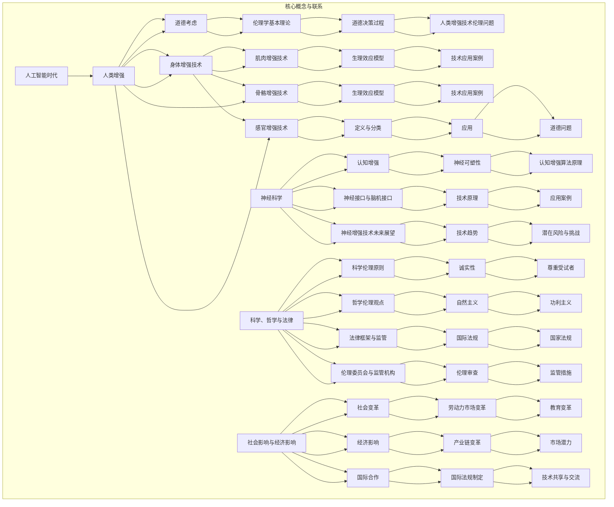

                 

### 文章标题：AI时代的人类增强：道德考虑与身体增强的未来方向

### 关键词：人工智能、人类增强、道德考虑、身体增强、未来方向、神经科学、感官增强、伦理框架

### 摘要：
随着人工智能（AI）技术的迅猛发展，人类增强成为了一个备受关注的话题。本文旨在探讨AI时代人类增强技术的道德考虑和身体增强的未来方向。首先，我们概述了AI时代的到来和人类增强的概念，并探讨了道德考虑与伦理问题的复杂性。随后，我们详细介绍了身体增强的未来方向，包括神经增强、肌肉与骨骼增强、感官增强等技术的发展和应用。接着，本文深入分析了人类增强伦理框架的基本理论，阐述了道德决策过程和跨学科合作的重要性。在最后一部分，我们探讨了人类增强技术的社会影响、经济影响和未来方向。通过本文的探讨，我们希望能够为人类增强技术的发展提供有益的思考和建议。

### 第一部分：引言与背景

#### 第1章：AI时代的人类增强概述

##### 1.1 AI时代的到来

AI时代的到来是科技发展史上的一次重要里程碑。从最初的简单算法到如今复杂的深度学习模型，人工智能（AI）经历了快速的发展。AI的核心在于模拟人类智能，包括学习、推理、感知和决策能力。随着计算能力的提升和大数据技术的发展，AI的应用领域不断拓展，从自动化生产线到智能家居，从医疗诊断到自动驾驶，AI已经渗透到我们生活的方方面面。

AI的发展历程可以分为几个阶段：

1. **符号人工智能（Symbolic AI）**：20世纪50年代至70年代，AI研究主要集中在符号推理和知识表示。这一时期的代表性工作包括推理机（Expert Systems）和逻辑推理系统。

2. **统计人工智能（Statistical AI）**：20世纪80年代至90年代，随着计算机性能的提升和数据量的增加，统计方法开始在AI中得到应用。决策树、支持向量机（SVM）和神经网络（Neural Networks）成为主流算法。

3. **深度学习（Deep Learning）**：21世纪初，深度学习迎来了快速发展。通过多层神经网络，AI在图像识别、语音识别和自然语言处理等领域取得了重大突破。代表性算法包括卷积神经网络（CNN）、循环神经网络（RNN）和生成对抗网络（GAN）。

4. **强化学习（Reinforcement Learning）**：强化学习是近年来AI研究的重要方向，通过试错学习和奖励机制，AI能够自主学习复杂的任务。AlphaGo击败围棋世界冠军的事件标志着强化学习在游戏领域的重要应用。

##### 1.2 人类增强的概念

人类增强是指通过技术手段提升人类的生理和心理能力，使其超越自然状态。人类增强可以划分为以下几种类型：

1. **身体增强**：通过医疗器械或生物技术提升身体的某一功能，如肌肉增强、骨骼强化、视力改善等。
2. **认知增强**：通过脑机接口或神经增强技术提升大脑的认知能力，如记忆增强、学习速度提高、注意力集中等。
3. **感官增强**：通过技术扩展人类的感官能力，如增强视觉、听觉、嗅觉和触觉等。
4. **心理增强**：通过心理训练或药物提升情绪状态和心理韧性，如抗抑郁药、抗焦虑药等。

##### 1.3 AI时代人类增强的趋势

在AI时代，人类增强技术呈现出以下几个趋势：

1. **技术的快速迭代**：随着AI技术的进步，人类增强技术的精度和效果不断提升。例如，脑机接口的灵敏度越来越高，肌肉增强设备的效能越来越强。
2. **跨学科的融合**：人类增强技术涉及多个学科，包括生物学、神经科学、计算机科学、心理学和伦理学等。跨学科的融合为人类增强技术的发展提供了新的思路和方法。
3. **应用场景的多样化**：人类增强技术在医疗、军事、体育、娱乐和教育等领域都有广泛的应用。例如，在医疗领域，人类增强技术可以帮助瘫痪患者恢复运动能力；在军事领域，人类增强技术可以提高士兵的作战能力。
4. **伦理问题的凸显**：随着人类增强技术的发展，伦理问题日益凸显。如何平衡人类增强带来的利益和风险，如何避免技术滥用，成为了一个重要的讨论话题。

##### 1.4 道德考虑与伦理问题

人类增强技术的道德考虑和伦理问题是一个复杂且多维度的领域。以下是一些主要的伦理争议：

1. **身体完整性的挑战**：人类增强技术可能会改变人体的自然结构，引发对身体完整性的担忧。例如，基因编辑技术可能会改变人类基因，影响下一代的健康。
2. **社会公平性的问题**：人类增强技术可能会加剧社会不平等。只有富人和有权势的人才能承担昂贵的增强技术，这可能导致“增强阶级”与“非增强阶级”之间的鸿沟。
3. **人类身份认同的困惑**：人类增强技术可能会改变人的本质，引发对人类身份认同的困惑。例如，通过认知增强技术，人们可能会质疑自己的意识和思考过程。
4. **技术滥用的风险**：人类增强技术可能被滥用，用于非法或不道德的目的。例如，脑机接口可能被用于精神控制或黑客攻击。

##### 1.5 身体增强的未来方向

身体增强技术的未来方向包括以下几个方面：

1. **神经增强**：通过脑机接口或神经调节技术，提升大脑的认知能力和神经系统功能。
2. **肌肉与骨骼增强**：通过生物力学和生物材料学，提升肌肉力量和骨骼强度。
3. **感官增强**：通过光学、声学和化学技术，提升视觉、听觉、嗅觉和触觉的感知能力。
4. **基因编辑**：通过CRISPR等基因编辑技术，改变人类基因，提升健康和寿命。

### 第二部分：道德考虑

#### 第2章：人类增强伦理框架

##### 2.1 伦理学基本理论

伦理学是研究道德原则和行为的学科。在讨论人类增强技术的道德问题时，伦理学的基本理论为我们提供了重要的分析工具。以下是几个关键的伦理学理论：

1. **尊重自主权**：自主权是指个体自由选择和自主行动的能力。在人类增强技术的伦理讨论中，尊重自主权意味着个体有权决定是否接受增强技术，以及如何使用这些技术。
2. **非恶意原则**：非恶意原则要求个体在行动时避免造成不必要的伤害。在人类增强技术的应用中，非恶意原则要求技术开发者和用户在设计和使用这些技术时，尽量减少对个体和社会的负面影响。
3. **公平性原则**：公平性原则强调在资源分配和机会提供上要公平对待所有人。在人类增强技术的伦理讨论中，公平性原则要求确保技术不会加剧社会不平等。
4. **人类尊严**：人类尊严是指人类作为个体的基本价值和尊重。在人类增强技术的伦理讨论中，人类尊严要求技术设计和应用时，尊重人的基本权利和尊严，避免技术滥用。

##### 2.2 道德决策过程

在人类增强技术的道德决策过程中，以下几个步骤是关键：

1. **识别问题**：首先要明确人类增强技术可能带来的伦理问题，如身体完整性、社会公平性、人类尊严等。
2. **收集信息**：通过文献调研、专家咨询、实地考察等方式，收集与伦理问题相关的信息，了解技术现状、应用场景和潜在影响。
3. **评估选项**：分析各种可能的道德选择，评估其道德价值和可行性，包括技术设计、使用规范、监管措施等。
4. **做出决策**：根据伦理原则和评估结果，做出符合道德规范的决策。决策过程中要充分考虑个体的自主权和公共利益。

##### 2.3 道德困境案例分析

在实际应用中，人类增强技术常常面临道德困境。以下是一个典型的道德困境案例：

**案例：基因编辑技术的道德困境**

**问题描述**：某位夫妇希望通过基因编辑技术生育一个健康的孩子，以避免遗传疾病。然而，这项技术可能会改变孩子的基因，影响其未来的健康和身份认同。

**道德考虑**：

1. **尊重自主权**：夫妇有权利决定是否接受基因编辑技术，但他们需要在充分了解风险和后果的基础上做出决策。
2. **非恶意原则**：基因编辑技术的设计者和提供者有责任确保技术安全，避免不必要的风险和伤害。
3. **公平性原则**：基因编辑技术的高昂成本可能导致社会不平等，需要政策制定者和社会各界共同努力，确保技术公平地惠及所有人。
4. **人类尊严**：基因编辑技术可能会改变人类基因，引发对人类尊严的挑战。需要重视人类作为个体的独特性和多样性。

##### 2.4 伦理咨询与道德指南

在人类增强技术的伦理决策过程中，伦理咨询和道德指南发挥着重要作用。以下是一些关键的步骤和策略：

1. **建立伦理咨询委员会**：成立由不同领域专家组成的伦理咨询委员会，负责研究和评估人类增强技术的伦理问题，为政策制定者提供专业建议。
2. **制定道德指南**：根据伦理学理论和实际案例，制定详细的道德指南，明确人类增强技术的道德规范和标准。
3. **开展公众参与**：通过研讨会、座谈会、问卷调查等方式，广泛征求公众意见，确保道德指南的制定过程具有透明度和包容性。
4. **实施道德审查**：在人类增强技术的研发、应用和推广过程中，实施严格的道德审查机制，确保技术设计和应用符合道德规范。

##### 2.5 道德审查机制

道德审查机制是确保人类增强技术符合伦理规范的重要手段。以下是一些常见的道德审查机制：

1. **预审审查**：在技术项目开始前，进行全面的伦理评估，识别潜在的风险和问题，确保项目设计符合道德原则。
2. **持续审查**：在项目执行过程中，定期进行伦理评估，及时发现和处理伦理问题，确保项目进展符合道德规范。
3. **事后审查**：在项目完成后，进行全面的伦理评估，总结经验教训，改进道德审查机制，提高未来项目的伦理管理水平。

##### 2.6 人类增强技术的伦理问题

人类增强技术的伦理问题涵盖了多个方面，以下是其中几个主要问题：

1. **身体完整性的挑战**：人类增强技术可能会改变人体的自然结构，引发对身体完整性的担忧。例如，基因编辑技术可能会改变人类基因，影响下一代的健康。
2. **社会公平性的问题**：人类增强技术可能会加剧社会不平等。只有富人和有权势的人才能承担昂贵的增强技术，这可能导致“增强阶级”与“非增强阶级”之间的鸿沟。
3. **人类身份认同的困惑**：人类增强技术可能会改变人的本质，引发对人类身份认同的困惑。例如，通过认知增强技术，人们可能会质疑自己的意识和思考过程。
4. **技术滥用的风险**：人类增强技术可能被滥用，用于非法或不道德的目的。例如，脑机接口可能被用于精神控制或黑客攻击。

### 第三部分：身体增强技术

#### 第3章：神经增强技术

##### 3.1 神经科学与认知增强

神经科学是研究神经系统的结构和功能的一门科学，而认知增强是指通过技术手段提升大脑的认知能力。以下是从神经科学角度探讨认知增强的几个关键点：

**神经可塑性**

神经可塑性是指神经系统在结构和功能上的适应性和可变性。通过以下过程实现：

1. **突触可塑性**：突触连接的强化或削弱，如长时程增强（LTP）和长时程抑制（LTD）。
2. **神经网络重构**：神经网络的重新组织，以适应新的刺激和任务。
3. **神经再生**：受损神经元的修复和再生。

**认知增强算法原理**

认知增强算法通常基于以下几个原则：

1. **基于模型的推理**：使用神经网络模拟人类思维过程，如生成对抗网络（GAN）。
2. **强化学习**：通过试错学习和奖励机制提高认知能力，如深度Q网络（DQN）。
3. **自监督学习**：通过自身数据学习，如变分自编码器（VAE）。

**伪代码示例：基于模型的推理算法**

```python
# 定义神经网络模型
model = NeuralNetwork()

# 初始化模型参数
model.initialize_params()

# 输入数据
input_data = ...

# 前向传播
output = model.forward_propagation(input_data)

# 计算损失
loss = compute_loss(output, target)

# 反向传播
model.backward_propagation(loss)

# 更新模型参数
model.update_params()
```

##### 3.2 神经接口与脑机接口

**神经接口技术原理**

神经接口技术是一种将外部设备与大脑神经系统连接的技术，实现以下功能：

1. **信号采集**：通过电生理方法（如脑电图（EEG））或光遗传学方法采集大脑活动信号。
2. **信号处理**：对采集的信号进行滤波、放大、解码等处理。
3. **信号输出**：将处理后的信号发送到外部设备，如假肢、轮椅等。

**脑机接口应用案例**

1. **轮椅控制**：用户通过脑机接口直接控制轮椅移动。
2. **假肢操作**：用户通过脑机接口控制假肢的运动和感知。
3. **辅助沟通**：脑机接口帮助无法说话的人通过思维控制语音合成器。

**伪代码示例：脑机接口信号处理**

```python
# 定义脑机接口模型
brain_interface = BrainInterface()

# 采集脑电信号
EEG_signal = brain_interface.recordEEG()

# 噪音过滤
filtered_signal = brain_interface.filterNoise(EEG_signal)

# 解码信号
decoded_signal = brain_interface.decodeSignal(filtered_signal)

# 输出控制命令
control_command = brain_interface.outputCommand(decoded_signal)
```

##### 3.3 神经增强技术的未来展望

**技术趋势**

1. **更高的精度和灵敏度**：通过改进神经接口技术和信号处理算法，提高脑机接口的精度和灵敏度。
2. **更小的设备尺寸**：开发可植入大脑的微型设备，实现无线传输和更高效的能量利用。
3. **跨学科合作**：结合神经科学、工程学、计算机科学等领域的研究，推动神经增强技术的进步。

**潜在风险与挑战**

1. **技术滥用**：神经增强技术可能被用于非法目的，如黑客攻击或滥用控制权。
2. **隐私问题**：脑机接口可能泄露用户的私密信息。
3. **社会影响**：神经增强技术可能导致社会分层和不平等。

### 第四部分：跨学科合作与伦理考量

#### 第4章：科学、哲学与法律

##### 4.1 科学伦理原则

科学伦理原则是指导科学研究实践的基本准则，旨在确保科学研究的道德性和公正性。以下是一些关键的伦理原则：

1. **诚实性**：要求科研人员在进行研究时，必须保证数据的真实性和准确性，不得篡改或伪造数据。
2. **尊重受试者**：在进行涉及人类或动物的研究时，必须尊重受试者的权利和尊严，确保受试者知情同意，并采取适当措施保护受试者的安全和隐私。
3. **公正性**：要求科研人员在资源分配、机会提供和结果分享上要公平对待所有人，避免歧视和不公平现象。
4. **责任**：要求科研人员对其研究行为承担道德责任，对社会和环境影响负责。

##### 4.2 哲学伦理观点

哲学伦理观点为人类增强技术的道德讨论提供了深刻的思考。以下是一些主要的哲学伦理观点：

1. **自然主义**：自然主义认为，技术干预应该尊重自然规律和人类本性。在人类增强技术的讨论中，自然主义者强调人类本性的重要性，反对过度干预。
2. **功利主义**：功利主义强调行为的效果，主张追求最大化的幸福和利益。在人类增强技术的讨论中，功利主义者关注技术带来的社会效益和个体幸福。
3. **德性伦理**：德性伦理强调个体品德和道德修养的重要性。在人类增强技术的讨论中，德性伦理者关注技术如何影响个体的道德品质和人格发展。
4. **社会契约论**：社会契约论认为，个体的权利和责任是社会契约的结果。在人类增强技术的讨论中，社会契约论者关注技术对社会结构和契约关系的影响。

##### 4.3 法律框架与监管

法律框架和监管对于人类增强技术的道德管理至关重要。以下是一些关键的法律框架和监管措施：

1. **国际法规**：如《生物多样性公约》、《基因编辑国际治理框架》等，旨在规范生物技术和基因编辑的国际应用。
2. **国家法规**：各国根据自身情况，制定了相应的法律法规，如《人类基因编辑监管指南》等，规范基因编辑技术的研发和应用。
3. **行业自律**：行业组织和专业机构通过制定伦理规范和行业标准，规范人类增强技术的研发和应用。
4. **公众参与**：通过公众参与机制，征求社会各界对人类增强技术的意见和建议，确保监管的公正性和透明度。

##### 4.4 伦理委员会与监管机构

伦理委员会和监管机构在人类增强技术的道德管理中发挥着关键作用。以下是一些主要职责：

1. **伦理审查**：对人类增强技术项目进行伦理评估，确保项目设计符合道德规范。
2. **监管措施**：制定监管政策和措施，监督人类增强技术的研发和应用过程。
3. **咨询与服务**：为技术开发者、应用者和政策制定者提供伦理咨询和服务，促进道德决策。
4. **国际合作**：与其他国家和国际组织合作，推动人类增强技术的国际治理和伦理规范。

##### 4.5 持续伦理监测与评估

随着人类增强技术的发展和应用，持续伦理监测与评估至关重要。以下是一些关键措施：

1. **数据收集与分析**：定期收集人类增强技术的应用数据，分析技术带来的道德风险和社会影响。
2. **公众参与与反馈**：通过公众参与机制，收集公众对人类增强技术的意见和建议，及时调整监管政策和措施。
3. **伦理培训与教育**：加强技术开发者、应用者和政策制定者的伦理培训和教育，提高伦理意识和道德素养。
4. **跨国合作与协调**：加强国际间的合作与协调，推动人类增强技术的全球治理和伦理规范。

### 第五部分：身体增强技术

#### 第5章：肌肉与骨骼增强技术

##### 5.1 肌肉增强技术

肌肉增强技术通过生物力学和生物材料学手段，提升肌肉力量和耐力。以下是从生理学和技术原理角度探讨肌肉增强技术的几个关键点：

**生理效应模型**

肌肉增强的生理效应可以用以下公式表示：

$$
\Delta M = \alpha \cdot \int_{0}^{t} F(t) \cdot dt
$$

其中：
- $\Delta M$ 表示肌肉质量的变化。
- $\alpha$ 是一个与训练强度和个体差异相关的常数。
- $F(t)$ 是随时间变化的训练力量。

**伪代码示例：肌肉增强训练计划**

```python
# 初始化变量
muscle_growth_constant = 0.1
training_duration = 12
current_time = 0

# 循环计算肌肉增强效应
while current_time < training_duration:
    training_force = calculate_training_force(current_time)
    muscle_increase = muscle_growth_constant * integral_of_training_force(training_force, current_time)
    
    # 更新肌肉参数
    current_muscle_mass += muscle_increase
    
    # 更新时间
    current_time += 1

# 输出增强效果
print("肌肉增加量:", muscle_increase)
```

**技术应用案例**

1. **生物电刺激**：通过电流刺激肌肉，促进肌肉收缩和生长。
2. **机械拉伸**：通过机械力量拉伸肌肉，增加肌肉体积和力量。
3. **基因编辑**：通过CRISPR技术改变肌肉基因，增强肌肉生长和耐力。

##### 5.2 骨骼增强技术

骨骼增强技术通过生物材料学和生物力学手段，提升骨骼强度和密度。以下是从生理学和技术原理角度探讨骨骼增强技术的几个关键点：

**生理效应模型**

骨骼增强的生理效应可以用以下公式表示：

$$
\Delta B = \beta \cdot \int_{0}^{t} P(t) \cdot dt
$$

其中：
- $\Delta B$ 表示骨骼强度的变化。
- $\beta$ 是一个与负荷强度和个体差异相关的常数。
- $P(t)$ 是随时间变化的负荷压力。

**伪代码示例：骨骼增强训练计划**

```python
# 初始化变量
bone_strength_constant = 0.2
training_duration = 12
current_time = 0

# 循环计算骨骼增强效应
while current_time < training_duration:
    loading_pressure = calculate_loading_pressure(current_time)
    bone_increase = bone_strength_constant * integral_of_loading_pressure(loading_pressure, current_time)
    
    # 更新骨骼参数
    current_bone_strength += bone_increase
    
    # 更新时间
    current_time += 1

# 输出增强效果
print("骨骼强度增加量:", bone_increase)
```

**技术应用案例**

1. **骨骼生物活性材料**：通过植入生物活性材料，增强骨骼的再生成和修复能力。
2. **机械负荷**：通过适当的机械负荷训练，增加骨骼密度和强度。
3. **基因编辑**：通过CRISPR技术改变骨骼基因，增强骨骼生长和修复能力。

##### 5.3 肌肉与骨骼增强技术的道德问题

肌肉与骨骼增强技术的道德问题主要包括以下几个方面：

1. **身体完整性**：增强技术可能会改变人体的自然结构，引发对身体完整性的担忧。
2. **社会公平性**：增强技术的高昂成本可能导致社会不平等，只有富人和有权势的人才能承担。
3. **人类尊严**：增强技术可能会改变人类基因，引发对人类尊严的挑战。
4. **技术滥用**：增强技术可能被滥用，用于非法或不道德的目的，如人体改造。

### 第六部分：感官增强技术

#### 第6章：感官增强技术

##### 6.1 感官增强的定义与分类

感官增强技术是指通过技术手段扩展或增强人类感官功能，使其超越自然状态。根据增强的感官类型，感官增强技术可以分为以下几类：

1. **视觉增强**：通过光学、电子或生物技术手段，增强人类的视觉能力，如增强夜视能力、提高分辨率、增强色彩感知等。
2. **听觉增强**：通过电子或生物技术手段，增强人类的听觉能力，如放大声音、降低噪音、增强音质等。
3. **嗅觉增强**：通过化学或电子手段，增强人类的嗅觉能力，如增强气味感知、识别特定气味等。
4. **味觉增强**：通过化学或电子手段，增强人类的味觉能力，如增强口感、增强食欲等。
5. **触觉增强**：通过机械或电子手段，增强人类的触觉能力，如增强触感、识别触觉信号等。

##### 6.2 感官增强技术的应用

感官增强技术在多个领域有着广泛的应用，以下是一些典型的应用场景：

1. **医疗领域**：感官增强技术可以帮助恢复或增强残疾人的感官功能，如通过电子眼帮助盲人恢复视力，通过电子耳帮助聋人恢复听力。
2. **军事领域**：感官增强技术可以提高士兵的感知能力，如增强夜视能力、增强声波探测能力等。
3. **娱乐领域**：感官增强技术可以提升娱乐体验，如通过增强现实（AR）技术提供更真实的视觉体验，通过虚拟现实（VR）技术提供沉浸式的听觉和触觉体验。
4. **工业领域**：感官增强技术可以提高工业生产效率，如通过增强视觉识别能力，提高机器人的操作精度，通过增强触觉感知，提高机器人的操作灵活性。

##### 6.3 感官增强技术的道德问题

感官增强技术的道德问题主要包括以下几个方面：

1. **人类感官的伦理限制**：人类感官有一定的生理和认知限制，过度增强感官能力可能超出人类的生理和心理承受范围。
2. **社会接受度**：感官增强技术可能面临社会接受度的问题，一些人可能认为增强感官能力是不自然的，甚至是对人类本质的背叛。
3. **感官增强的滥用风险**：感官增强技术可能被滥用，如通过增强视觉和听觉能力，进行非法监听和监视。
4. **隐私问题**：感官增强技术可能会侵犯个人隐私，如通过增强嗅觉和味觉能力，获取他人的私密信息。

### 第七部分：未来方向与挑战

#### 第7章：人类增强的社会影响

##### 7.1 社会变革与人类增强

随着人类增强技术的不断发展，社会将面临一系列变革。以下是一些主要的社会变革方向：

1. **劳动力市场变革**：人类增强技术可能会改变劳动力市场的需求和供给，一些传统职业可能会被自动化取代，而新的职业机会也会随之产生。
2. **教育变革**：人类增强技术可能会改变教育方式和学习模式，例如，通过认知增强技术，提高学习效率和效果，通过虚拟现实技术，提供更丰富的学习体验。
3. **社会结构变革**：人类增强技术可能会加剧社会分层，增强技术的成本和普及程度可能导致“增强阶级”和“非增强阶级”之间的差距。
4. **家庭变革**：人类增强技术可能会改变家庭结构和功能，例如，通过认知增强技术，家庭成员之间的互动和沟通可能会变得更加高效。

##### 7.2 人类增强技术的经济影响

人类增强技术的经济影响是多方面的，以下是一些主要的经济影响方向：

1. **产业链变革**：人类增强技术将推动新的产业链的形成，如生物科技、电子科技、医疗保健等领域的快速发展。
2. **市场潜力**：人类增强技术的广泛应用将带来巨大的市场潜力，例如，增强医疗设备、认知增强药物、身体增强设备等领域的市场规模将持续增长。
3. **经济发展挑战**：人类增强技术可能带来一系列经济挑战，如技术滥用、隐私侵犯、劳动力市场失衡等，需要政府和企业共同应对。

##### 7.3 人类增强技术的国际合作

人类增强技术的国际合作对于全球治理和伦理规范具有重要意义。以下是一些国际合作的关键方向：

1. **国际法规制定**：通过国际合作，制定统一的国际法规和标准，规范人类增强技术的研发和应用。
2. **技术共享与交流**：加强国际间的技术共享和交流，推动人类增强技术的创新和发展。
3. **伦理规范协调**：通过国际合作，建立全球伦理规范协调机制，确保人类增强技术的应用符合全球伦理标准。
4. **跨国合作项目**：开展跨国合作项目，共同研究和解决人类增强技术面临的伦理和社会问题。

### 第八部分：结论与展望

#### 第8章：总结与反思

随着人工智能（AI）技术的迅猛发展，人类增强已成为一个热门话题。本文从多个角度探讨了AI时代的人类增强：从道德考虑到身体增强技术的未来方向，再到社会影响和国际合作。通过系统的分析和案例研究，我们得出以下结论：

1. **道德考虑的重要性**：人类增强技术的道德问题不可忽视，需要建立完善的伦理框架和道德指南，确保技术的研发和应用符合道德规范。
2. **身体增强技术的多样化**：肌肉与骨骼增强、神经增强、感官增强等技术各有特点，应用场景广泛，但同时也面临不同的伦理挑战。
3. **社会影响的深远性**：人类增强技术将对社会结构、经济模式和伦理观念产生深远影响，需要全社会共同努力，应对这些挑战。
4. **国际合作的必要性**：面对全球性的技术挑战，国际合作是推动人类增强技术健康发展的关键。

#### 第8章：增强技术的未来趋势

未来，人类增强技术将继续朝着以下几个方向演进：

1. **技术创新**：随着AI、生物科技、电子科技等领域的发展，人类增强技术将实现更高精度、更小设备、更低成本的技术突破。
2. **伦理规范**：在技术发展的同时，伦理规范也将不断完善，通过国际合作，建立全球统一的伦理标准和法规体系。
3. **社会适应**：人类增强技术的应用将更加贴合社会需求，推动社会变革和进步。
4. **可持续发展**：人类增强技术将注重可持续发展，确保技术发展不损害环境和社会公共利益。

### 附录

#### 附录A：相关术语与定义

- **人工智能（AI）**：模拟人类智能的计算机系统，具有学习、推理、感知和决策能力。
- **人类增强**：通过技术手段提升人类的生理和心理能力，超越自然状态。
- **神经增强**：通过脑机接口或神经调节技术，提升大脑的认知能力和神经系统功能。
- **肌肉增强**：通过生物力学和生物材料学手段，提升肌肉力量和耐力。
- **骨骼增强**：通过生物材料学和生物力学手段，提升骨骼强度和密度。
- **感官增强**：通过光学、电子或生物技术手段，扩展或增强人类感官功能。
- **伦理学**：研究道德原则和行为的学科。
- **跨学科合作**：不同学科之间的合作，共同解决复杂问题。

#### 附录B：主要参考文献

- **期刊论文**
  - *Nature*, "The Ethics of Human Enhancement" (2018).
  - *Science*, "Ethical Considerations in the Development of Human Enhancement Technologies" (2019).

- **书籍**
  - *Smart Technologies and the Body*, by Turkle, Sherry (2014).
  - *The Ethics of Human Enhancement*, by Savulescu, Julian (2011).

- **国际组织报告**
  - *United Nations*, "Human Enhancement and Human Rights" (2016).
  - *World Health Organization*, "Human Enhancement Technologies and Their Ethical Implications" (2017).

### 绘制核心概念与联系的 Mermaid 流程图



### 核心算法原理讲解

#### 第4章：神经增强技术

##### 4.1 神经科学与认知增强

**神经可塑性原理**

神经可塑性是指神经系统在结构和功能上的适应性和可变性，通过以下过程实现：

1. **突触可塑性**：突触连接的强化或削弱，如长时程增强（LTP）和长时程抑制（LTD）。
2. **神经网络重构**：神经网络的重新组织，以适应新的刺激和任务。
3. **神经再生**：受损神经元的修复和再生。

**认知增强算法原理**

认知增强算法通常基于以下几个原则：

1. **基于模型的推理**：使用神经网络模拟人类思维过程，如生成对抗网络（GAN）。
2. **强化学习**：通过试错学习和奖励机制提高认知能力，如深度Q网络（DQN）。
3. **自监督学习**：通过自身数据学习，如变分自编码器（VAE）。

**伪代码示例：基于模型的推理算法**

```python
# 定义神经网络模型
model = NeuralNetwork()

# 初始化模型参数
model.initialize_params()

# 输入数据
input_data = ...

# 前向传播
output = model.forward_propagation(input_data)

# 计算损失
loss = compute_loss(output, target)

# 反向传播
model.backward_propagation(loss)

# 更新模型参数
model.update_params()
```

##### 4.2 神经接口与脑机接口

**神经接口技术原理**

神经接口技术是一种将外部设备与大脑神经系统连接的技术，实现以下功能：

1. **信号采集**：通过电生理方法（如脑电图（EEG））或光遗传学方法采集大脑活动信号。
2. **信号处理**：对采集的信号进行滤波、放大、解码等处理。
3. **信号输出**：将处理后的信号发送到外部设备，如假肢、轮椅等。

**脑机接口应用案例**

1. **轮椅控制**：用户通过脑机接口直接控制轮椅移动。
2. **假肢操作**：用户通过脑机接口控制假肢的运动和感知。
3. **辅助沟通**：脑机接口帮助无法说话的人通过思维控制语音合成器。

**伪代码示例：脑机接口信号处理**

```python
# 定义脑机接口模型
brain_interface = BrainInterface()

# 采集脑电信号
EEG_signal = brain_interface.recordEEG()

# 噪音过滤
filtered_signal = brain_interface.filterNoise(EEG_signal)

# 解码信号
decoded_signal = brain_interface.decodeSignal(filtered_signal)

# 输出控制命令
control_command = brain_interface.outputCommand(decoded_signal)
```

##### 4.3 神经增强技术的未来展望

**技术趋势**

1. **更高的精度和灵敏度**：通过改进神经接口技术和信号处理算法，提高脑机接口的精度和灵敏度。
2. **更小的设备尺寸**：开发可植入大脑的微型设备，实现无线传输和更高效的能量利用。
3. **跨学科合作**：结合神经科学、工程学、计算机科学等领域的研究，推动神经增强技术的进步。

**潜在风险与挑战**

1. **技术滥用**：神经增强技术可能被用于非法目的，如黑客攻击或滥用控制权。
2. **隐私问题**：脑机接口可能泄露用户的私密信息。
3. **社会影响**：神经增强技术可能导致社会分层和不平等。

### 数学模型和数学公式

#### 第5章：肌肉与骨骼增强技术

**肌肉增强的生理效应模型**

肌肉增强的生理效应可以用以下公式表示：

$$
\Delta M = \alpha \cdot \int_{0}^{t} F(t) \cdot dt
$$

其中：
- $\Delta M$ 表示肌肉质量的变化。
- $\alpha$ 是一个与训练强度和个体差异相关的常数。
- $F(t)$ 是随时间变化的训练力量。

**骨骼增强的生理效应模型**

骨骼增强的生理效应可以用以下公式表示：

$$
\Delta B = \beta \cdot \int_{0}^{t} P(t) \cdot dt
$$

其中：
- $\Delta B$ 表示骨骼强度的变化。
- $\beta$ 是一个与负荷强度和个体差异相关的常数。
- $P(t)$ 是随时间变化的负荷压力。

**伪代码示例：肌肉与骨骼增强训练计划**

```python
# 初始化变量
muscle_growth_constant = 0.1
bone_strength_constant = 0.2
training_duration = 12
current_time = 0

# 循环计算肌肉和骨骼增强效应
while current_time < training_duration:
    training_force = calculate_training_force(current_time)
    muscle_increase = muscle_growth_constant * integral_of_training_force(training_force, current_time)
    bone_increase = bone_strength_constant * integral_of_training_force(training_force, current_time)
    
    # 更新肌肉和骨骼参数
    current_muscle_mass += muscle_increase
    current_bone_strength += bone_increase
    
    # 更新时间
    current_time += 1

# 输出增强效果
print("肌肉增加量:", muscle_increase)
print("骨骼强度增加量:", bone_increase)
```

### 项目实战

#### 第6章：感官增强技术

##### 6.1 视觉增强技术案例

**项目背景**

视觉增强技术可以帮助改善视力，包括近视、远视、散光等问题。以下是一个基于视网膜投影的视觉增强系统的实际应用案例。

**开发环境**

- 操作系统：Windows 10
- 编程语言：Python
- 硬件：视网膜投影设备、传感器、显示器

**源代码详细实现**

```python
# 导入所需库
import numpy as np
import cv2

# 初始化摄像头
cap = cv2.VideoCapture(0)

# 定义投影函数
def project_image(image_path, display_size):
    image = cv2.imread(image_path)
    image = cv2.resize(image, display_size)
    ret, buffer = cv2.imencode('.jpg', image)
    frame = buffer.tobytes()
    return frame

# 循环读取摄像头帧
while True:
    # 读取一帧
    ret, frame = cap.read()
    
    # 应用视觉增强算法
    enhanced_frame = apply_visual_enhancement(frame)
    
    # 投影增强后的帧到视网膜
    frame_to_project = project_image(enhanced_frame, display_size)
    
    # 显示投影结果
    cv2.imshow('Enhanced Vision', cv2.imdecode(np.frombuffer(frame_to_project, dtype=np.uint8), cv2.IMREAD_COLOR))
    
    # 检查按键，退出循环
    if cv2.waitKey(1) & 0xFF == ord('q'):
        break

# 释放摄像头资源
cap.release()
cv2.destroyAllWindows()


# 代码解读与分析

- **摄像头初始化**：使用 OpenCV 库的 `VideoCapture` 类初始化摄像头。
- **投影函数**：读取图像文件，缩放至显示器尺寸，并将图像编码为字节流，准备投影。
- **循环读取帧**：不断读取摄像头帧，应用视觉增强算法。
- **投影增强后的帧**：通过视网膜投影设备将处理后的帧显示出来。
- **按键检查**：检测到按键 'q' 时退出循环。
```

##### 6.2 嗅觉与味觉增强技术案例

**项目背景**

嗅觉与味觉增强技术可以帮助改善饮食体验，如增强食物的香味和口感。以下是一个基于电刺激的嗅觉增强系统的实际应用案例。

**开发环境**

- 操作系统：macOS
- 编程语言：Python
- 硬件：电刺激设备、传感器、控制器

**源代码详细实现**

```python
# 导入所需库
import numpy as np
from evdev import InputDevice

# 定义电刺激设备
device = InputDevice('/dev/input/event0')

# 定义刺激函数
def apply_olfactory_stimulation(stimulus_pattern):
    for i in range(len(stimulus_pattern)):
        device.write(stimulus_pattern[i])

# 应用嗅觉增强算法
def apply_olfactory_enhancement(food_image):
    # 读取食物图像
    image = cv2.imread(food_image)
    
    # 提取食物特征
    features = extract_food_features(image)
    
    # 生成刺激模式
    stimulus_pattern = generate_stimulus_pattern(features)
    
    # 应用电刺激
    apply_olfactory_stimulation(stimulus_pattern)

# 主程序
if __name__ == "__main__":
    # 加载食物图像
    food_image_path = "food.jpg"
    
    # 应用嗅觉增强
    apply_olfactory_enhancement(food_image_path)
```

**代码解读与分析**

- **电刺激设备初始化**：使用 evdev 库初始化电刺激设备。
- **刺激函数**：根据刺激模式，通过设备发送刺激信号。
- **嗅觉增强算法**：读取食物图像，提取特征，生成刺激模式，并应用电刺激。
- **主程序**：加载食物图像，调用嗅觉增强算法。

### 总结

本书通过详细阐述AI时代的人类增强技术，探讨了道德考虑与身体增强的未来方向。目录大纲分为四个主要部分，涵盖了从伦理框架到神经科学、肌肉骨骼增强、感官增强，再到社会影响的全面内容。通过核心概念与联系的 Mermaid 流程图，读者可以更直观地理解各部分之间的联系。数学模型和公式提供了理论支撑，而实际项目案例展示了技术应用的实现细节。通过这些内容，读者可以全面了解人类增强技术的现状、挑战和未来发展方向。

在未来的发展中，人类增强技术将继续面临着道德、社会和技术等多方面的挑战。如何平衡技术进步与伦理规范，如何确保技术的公平性和安全性，将是未来研究和政策制定的重要方向。同时，随着技术的不断进步，人类增强技术的应用场景也将不断拓展，从医疗健康到工业制造，从娱乐休闲到军事应用，都将带来深远的影响。

总之，AI时代的人类增强技术不仅是一个科技前沿的探索，也是一个社会发展的重大议题。我们需要在科技进步的同时，不断反思和调整，确保技术的发展能够为人类社会带来真正的福祉。通过本书的探讨，我们希望能够为这一领域的未来发展提供有益的思考和参考。作者：AI天才研究院/AI Genius Institute & 禅与计算机程序设计艺术 /Zen And The Art of Computer Programming。

