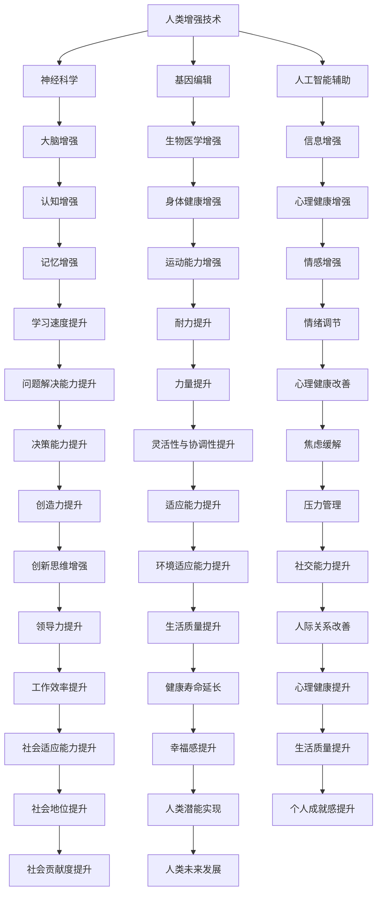

                 

### 引言

**文章标题：AI时代的人类增强：道德考虑和限制**

**关键词**：人工智能，人类增强，道德考量，伦理限制，技术进步

**摘要**：随着人工智能技术的迅猛发展，人类增强的概念逐渐走进我们的生活。通过大脑增强、基因编辑和人工智能辅助等手段，人类在认知能力、身体机能等方面得到显著提升。然而，这些技术的应用也引发了一系列道德和伦理问题，需要我们深入思考和探讨。本文将从背景与概念介绍、道德考量、技术详解与风险分析、法律法规与社会影响、实践应用与未来展望等多个方面，系统性地探讨AI时代的人类增强所面临的道德考虑和限制，为这一领域的未来发展提供参考。

### 目录大纲

#### 第一部分：背景与概念介绍

- **第1章：AI时代的人类增强概述**
  - 1.1 AI时代的人类增强的背景
  - 1.2 人类增强的概念与类型
  - 1.3 AI技术对人类生活的影响

- **第2章：人类增强技术的道德考量**
  - 2.1 道德考量的重要性
  - 2.2 道德原则与伦理框架
  - 2.3 案例分析：人类增强技术的道德困境

#### 第二部分：技术详解与风险分析

- **第3章：神经科学基础与大脑增强**
  - 3.1 大脑结构与功能
  - 3.2 神经科学与人类增强技术
  - 3.3 大脑增强技术的风险与挑战

- **第4章：基因编辑与人类增强**
  - 4.1 基因编辑的基本原理
  - 4.2 基因编辑在人类增强中的应用
  - 4.3 基因编辑的风险与伦理问题

- **第5章：人工智能辅助的人类增强**
  - 5.1 AI辅助增强的定义与范围
  - 5.2 AI在医疗健康中的应用
  - 5.3 AI在生活辅助中的应用

#### 第三部分：法律法规与社会影响

- **第6章：人类增强技术的法律法规**
  - 6.1 国际法规与政策
  - 6.2 中国的法律法规与政策
  - 6.3 法律框架对人类增强技术的规范

- **第7章：社会影响与伦理挑战**
  - 7.1 社会影响的多样性与复杂性
  - 7.2 社会接受度与伦理困境
  - 7.3 未来社会发展趋势与挑战

#### 第四部分：实践应用与未来展望

- **第8章：人类增强技术的实践应用**
  - 8.1 实际案例介绍
  - 8.2 应用场景分析与评估
  - 8.3 潜在的市场机会与挑战

- **第9章：未来展望与道德责任**
  - 9.1 未来的技术发展趋势
  - 9.2 道德责任与伦理教育
  - 9.3 全社会的共同责任与行动

#### 附录

- **附录A：相关法律法规与政策文件**
- **附录B：人类增强技术相关的国际组织与机构**
- **附录C：推荐阅读与进一步学习资源**

### 结语

- **总结全文内容**
- **对未来研究的建议**
- **致谢与展望**

通过以上详细的目录大纲，我们为即将展开的文章内容提供了清晰的框架和指引。接下来，我们将逐一深入探讨各个章节的内容，系统地分析AI时代的人类增强技术，以及其带来的道德考量与限制。

### 第一部分：背景与概念介绍

#### 第1章：AI时代的人类增强概述

随着人工智能（AI）技术的飞速发展，人类增强这一概念逐渐成为社会关注的焦点。AI时代的人类增强，指的是利用人工智能技术，通过大脑增强、基因编辑、人工智能辅助等手段，提升人类的认知能力、身体机能乃至生活质量。这一领域的兴起不仅源于科技的进步，更反映了人类对自身潜能不断探索的精神。

**1.1 AI时代的人类增强的背景**

AI技术的发展历程可以追溯到20世纪50年代。最初，AI研究的重点是如何制造出能够模拟人类思维的计算机程序。经过数十年的发展，尤其是近年来深度学习、神经网络等技术的突破，AI在图像识别、自然语言处理、决策优化等领域取得了显著的成果。这些技术的应用不仅极大地提高了生产效率，也为人类增强提供了可能。

人类增强的背景不仅限于技术的进步，还受到社会需求的驱动。随着人口老龄化、疾病威胁等问题日益严重，人们对于提高健康水平、延长寿命的需求愈发迫切。人类增强技术提供了一种可能的解决方案，通过提升人体的自然能力，减缓或解决这些问题。

**1.2 人类增强的概念与类型**

人类增强的概念涉及多个方面，包括物理增强、认知增强、情感增强等。物理增强主要是指通过外部设备或生物医学手段，增强人体的运动能力、感官能力等。例如，人工心脏、假肢、增强现实眼镜等都是物理增强的实例。认知增强则是指通过技术手段提升大脑的认知能力，如记忆增强、学习速度提升等。情感增强则是指通过技术手段调节情绪、改善心理健康。

根据增强的方式和目的，人类增强可以分为以下几种类型：

1. **生物医学增强**：通过基因编辑、细胞治疗等生物医学手段，提升人体的自然能力。这种类型的人类增强涉及到遗传学、神经科学等多个领域。
2. **科技辅助增强**：利用人工智能、机器人技术等，为人体提供辅助功能，如智能假肢、智能眼镜等。
3. **信息增强**：通过信息技术的应用，如虚拟现实、增强现实等，提升人类的信息处理能力和认知水平。
4. **心理情感增强**：通过心理治疗、药物干预等手段，改善个体的情绪和心理状态。

**1.3 AI技术对人类生活的影响**

AI技术在人类增强中的应用，对人类生活产生了深远的影响。首先，AI技术极大地提升了医疗健康水平。例如，通过人工智能诊断系统，可以更准确地检测疾病，提高治疗效果。此外，AI技术还可以用于个性化医疗，根据个体的基因信息和生活习惯，制定个性化的治疗方案。

在教育领域，AI技术提供了智能教育平台，可以根据学生的学习情况和进度，提供个性化的学习资源和方法，从而提高学习效率。同时，虚拟现实和增强现实技术的应用，使学习过程更加生动、互动，有助于激发学生的学习兴趣。

在日常生活中，AI技术也带来了诸多便利。智能助手、智能家居系统等，使人们的生活更加舒适、便捷。例如，通过智能语音助手，人们可以轻松完成日程管理、信息查询、家电控制等任务。

然而，AI技术的广泛应用也引发了一些担忧。一方面，AI技术可能导致人类某些自然能力的退化。例如，过度依赖智能设备可能导致人体运动能力的下降。另一方面，AI技术的滥用也可能带来隐私泄露、数据安全等问题。因此，在推动AI技术发展的同时，我们也需要关注其潜在的风险和挑战。

总的来说，AI时代的人类增强是一个复杂且充满机遇的领域。通过深入探讨其概念、背景和影响，我们能够更好地理解这一技术的发展趋势，并为未来的应用提供有益的参考。

#### 第2章：人类增强技术的道德考量

随着人类增强技术的不断发展，其带来的道德考量问题日益凸显。道德考量不仅仅是对技术本身的评估，更是对人类行为、价值观和未来社会的深刻反思。在这一章节中，我们将探讨道德考量的重要性、道德原则与伦理框架，并通过具体案例分析人类增强技术可能面临的道德困境。

**2.1 道德考量的重要性**

道德考量是人类增强技术发展中不可或缺的一环。首先，人类增强技术涉及到人体的根本属性，包括健康、尊严和自由等基本权利。这些权利不仅是个体层面的，也是社会层面的，关乎整个社会的公平性和正义性。因此，对人类增强技术的道德考量，是对其合法性和合理性的基本要求。

其次，道德考量有助于确保技术的安全性和可控性。在人类增强技术的实际应用中，可能会出现不可预测的风险和副作用。通过道德考量，我们可以识别和评估这些风险，制定相应的预防措施，确保技术的安全性和可控性。

此外，道德考量还能促进社会的广泛讨论和共识。人类增强技术不仅是一项技术革命，更是一场社会变革。其应用涉及多个领域，包括医疗、教育、就业等，需要全社会共同参与和决策。通过道德考量，我们可以引发公众对这一话题的关注，促进讨论，形成共识，从而为技术发展提供正确的方向。

**2.2 道德原则与伦理框架**

在人类增强技术的道德考量中，一些核心的道德原则和伦理框架起到了指导作用。以下是一些主要的道德原则：

1. **尊重个体自主权**：个体有权自主决定是否接受人类增强技术，以及接受何种程度的技术干预。任何技术干预都必须基于个体的自愿和知情同意。

2. **公平性**：人类增强技术不应加剧社会不平等。技术资源和成果的分配应公平合理，确保所有人都能享受到技术进步带来的益处。

3. **无害原则**：人类增强技术应确保对个体和社会无害。在设计和应用过程中，必须充分考虑潜在的风险和副作用，采取有效的措施进行预防和控制。

4. **责任原则**：技术开发者和应用者应承担相应的责任。在技术造成损害时，应提供有效的赔偿和救济措施。

5. **透明度**：技术应用过程应保持透明，确保公众能够了解技术的原理、风险和应用效果。这有助于提高公众对技术的信任度，促进技术的社会接受度。

基于这些道德原则，我们可以构建一个基本的伦理框架，用于指导人类增强技术的研发和应用。这个框架应包括以下几个方面：

- **技术研发伦理委员会**：设立专门的伦理委员会，对技术的研究、开发和应用进行评估和监督，确保其符合道德原则和伦理要求。

- **知情同意程序**：在技术干预过程中，确保个体充分了解技术原理、风险和效果，并自愿同意接受干预。

- **公平性评估机制**：建立公平性评估机制，确保技术资源和成果的分配公平合理。

- **风险控制和管理**：制定严格的风险控制和管理措施，确保技术的安全性和可控性。

- **责任追究和赔偿机制**：建立责任追究和赔偿机制，对技术造成的损害提供有效的救济。

**2.3 案例分析：人类增强技术的道德困境**

为了更深入地理解人类增强技术的道德考量，我们可以通过一些具体的案例分析，探讨其可能面临的道德困境。

**案例一：基因编辑**

基因编辑技术，如CRISPR-Cas9，为治疗遗传病和提升人类健康提供了新的可能。然而，其应用也引发了一系列道德困境。首先，基因编辑可能带来不可预见的副作用和风险。其次，基因编辑可能导致基因歧视和社会不平等，因为只有富裕人群能够负担昂贵的治疗费用。此外，基因编辑的伦理问题还包括对自然进化的干扰，以及代际之间的责任和公平性问题。

**案例二：大脑增强**

大脑增强技术，如神经增强药物和脑机接口，可以通过提升认知能力和学习能力，改善生活质量。然而，这些技术的使用也可能带来道德困境。例如，大脑增强可能导致社会阶层固化和知识垄断，因为只有拥有资源的人才能获得这些优势。此外，大脑增强还可能引发伦理问题，如记忆操纵、情感调节和控制等。

**案例三：生物机械化**

生物机械化技术，如增强人体器官的机械装置和生物电子设备，可以显著提升人体的运动和生理功能。然而，这些技术的应用也引发了一系列道德问题。例如，生物机械化可能导致人体与机器的界限模糊，引发身份认同和道德责任的问题。此外，生物机械化还可能导致身体残疾人群的歧视，加剧社会不平等。

通过以上案例分析，我们可以看到，人类增强技术的道德考量是复杂且多维的。在推动技术发展的同时，我们应高度重视道德考量，确保技术的发展符合人类的伦理原则和社会价值观。

在接下来的章节中，我们将进一步探讨人类增强技术的具体实现方式、风险分析、法律法规和社会影响，为这一领域的未来发展提供全面的思考和建议。

#### 第3章：神经科学基础与大脑增强

在讨论人类增强技术时，大脑增强无疑是其中最为重要和引人注目的领域之一。这一章节将深入探讨神经科学的基础知识，以及大脑增强技术的原理、实现方法和风险与挑战。

**3.1 大脑结构与功能**

大脑是人体最重要的器官之一，负责感知、思考、记忆、决策等多种复杂的生理和心理活动。大脑的基本结构包括灰质和白质。灰质主要包含神经元细胞体和突触，是信息处理和传递的主要区域。白质则主要由神经纤维组成，起到连接不同灰质区域的作用。

大脑的主要功能区包括：

- **大脑皮层**：负责高级认知功能，如感知、记忆、思考和语言等。
- **基底神经节**：参与运动控制和奖励机制。
- **小脑**：协调运动，维持身体平衡。
- **脑干**：控制基本生命活动，如呼吸、心跳和觉醒状态。

大脑的这些区域通过复杂的神经网络相互连接，形成一个高度协调的运作系统。神经元的通信主要通过电信号和化学信号两种方式进行。电信号在神经元内部通过动作电位传递，而化学信号则通过神经递质在突触间传递，从而实现信息的传递和处理。

**3.2 神经科学与人类增强技术**

神经科学与人类增强技术的结合，为提升人类认知能力和生理功能提供了新的可能性。通过理解大脑的工作原理，科学家们开发出了一系列旨在增强大脑功能的技术手段。

**脑机接口（Brain-Computer Interface, BCI）**：脑机接口是一种直接连接大脑和外部设备的界面，通过解码大脑信号，实现思维控制和设备操作。常见的脑机接口技术包括电信号采集、信号处理和设备控制。例如，脑电图（EEG）是一种常用的脑信号采集技术，通过记录大脑的电活动，可以实现对轮椅、假肢等外部设备的控制。

**神经增强药物**：神经增强药物通过调节神经递质的释放和接收，改善认知功能和情绪状态。这些药物包括刺激剂、抗抑郁药、认知增强剂等。例如，咖啡因和哌甲酯（Ritalin）是常见的神经增强药物，被广泛用于提高注意力和认知能力。

**神经再生与修复技术**：通过干细胞治疗和基因编辑技术，科学家们试图修复和再生受损的神经元。这些技术有望恢复神经功能，治疗神经退行性疾病，如帕金森病和阿尔茨海默病。

**认知增强技术**：认知增强技术通过虚拟现实、增强现实和认知训练等手段，提升人类的认知能力和学习效率。例如，认知训练应用程序通过定制化的训练任务，提高个体的记忆、注意力和决策能力。

**3.3 大脑增强技术的风险与挑战**

尽管大脑增强技术展现了巨大的潜力，但其应用也面临诸多风险和挑战。以下是一些主要的考虑因素：

**安全性问题**：大脑增强技术可能会引发意外的副作用和长期影响。例如，脑机接口可能导致脑电活动的异常变化，神经增强药物可能导致依赖性和成瘾性。

**伦理问题**：大脑增强技术的应用可能引发伦理问题，如隐私、知情同意、公平性等。例如，脑机接口技术可能被滥用，用于操纵和控制人类行为。

**技术成熟度**：目前，许多大脑增强技术仍处于研发阶段，尚未经过广泛的安全性和有效性测试。技术的成熟度和可靠性是推广应用的关键。

**社会接受度**：大脑增强技术的普及可能面临社会接受度的问题。公众对技术的理解和信任程度，将直接影响其接受和应用。

**监管与法律法规**：大脑增强技术的监管和法律法规尚不完善，需要制定明确的规范和标准，确保技术的合法性和安全性。

**跨学科合作**：大脑增强技术的研发和应用需要跨学科的合作，包括神经科学、计算机科学、伦理学、社会学等多个领域的专家共同参与。

总的来说，大脑增强技术是一项复杂且具有巨大潜力的领域。在推动技术发展的同时，我们应高度重视其潜在的风险和挑战，通过科学的研究和伦理的考量，确保技术的发展符合人类的利益和社会价值观。

#### 第4章：基因编辑与人类增强

基因编辑技术的出现，为人类增强提供了前所未有的可能性。这一章节将探讨基因编辑的基本原理，分析其在人类增强中的应用，并深入探讨其风险和伦理问题。

**4.1 基因编辑的基本原理**

基因编辑，是指通过人工手段对生物体的基因进行精确的修改，从而改变其遗传特征。目前，最常用的基因编辑技术是CRISPR-Cas9系统。CRISPR（Clustered Regularly Interspaced Short Palindromic Repeats）是一种原核生物中的天然免疫防御系统，能够识别并破坏入侵的病毒DNA。科学家们利用这一系统，开发出了CRISPR-Cas9基因编辑技术。

CRISPR-Cas9系统主要由两个部分组成：Cas9核酸酶和引导RNA（gRNA）。gRNA能够与目标DNA序列特异性结合，引导Cas9核酸酶在指定位置进行切割。切割后，细胞会通过修复机制进行修复，从而实现对目标基因的编辑。

除了CRISPR-Cas9，还有其他几种基因编辑技术，如TALENs（Transcription Activator-Like Effector Nucleases）和ZFNs（ Zinc Finger Nucleases）。这些技术都通过类似原理，通过引入特定的核酸酶，对目标DNA进行切割和编辑。

**4.2 基因编辑在人类增强中的应用**

基因编辑技术在人类增强中具有广泛的应用前景。以下是一些主要的应用领域：

**治疗遗传性疾病**：基因编辑技术可以用于治疗单基因遗传性疾病，如囊性纤维化、肌营养不良等。通过修复或替换致病基因，可以缓解或治愈这些疾病。

**提升认知能力**：研究表明，某些基因与认知能力相关。通过基因编辑，可以增强这些基因的表达，从而提升个体的认知能力和学习能力。例如，提高脑源性神经营养因子（BDNF）的表达，有助于改善记忆和学习。

**增强运动能力**：基因编辑技术还可以用于增强运动能力。例如，通过增强肌肉生长基因（如MSTN）的表达，可以增加肌肉体积和力量。

**延缓衰老**：基因编辑技术有望延缓衰老过程。通过编辑与衰老相关的基因，如端粒酶基因（TERT），可以延长寿命并改善健康状况。

**4.3 基因编辑的风险与伦理问题**

尽管基因编辑技术在人类增强中具有巨大潜力，但其应用也面临诸多风险和伦理问题。

**技术风险**：基因编辑技术的精确度和效率尚未完全达到理想水平。误编辑和脱靶效应可能会引发意外的副作用和健康问题。此外，基因编辑的长期影响和遗传稳定性也尚不清楚。

**伦理问题**：基因编辑的应用引发了一系列伦理问题。首先，基因编辑可能导致基因歧视和社会不平等，因为只有富裕人群能够负担昂贵的治疗和增强费用。其次，基因编辑可能影响自然进化和生物多样性，引发伦理争议。此外，基因编辑的知情同意和责任归属问题也需要深入探讨。

**监管与法律法规**：目前，基因编辑技术的监管和法律法规尚不完善。各国政府和国际组织需要制定明确的规范和标准，确保技术的合法性和安全性。同时，还需要建立有效的监管机制，确保技术不会被滥用。

**社会接受度**：基因编辑技术的普及可能面临社会接受度的问题。公众对技术的理解和信任程度，将直接影响其接受和应用。

**跨学科合作**：基因编辑技术的研发和应用需要跨学科的合作，包括遗传学、医学、伦理学、社会学等多个领域的专家共同参与。

总的来说，基因编辑技术为人类增强提供了新的可能性，但在其广泛应用之前，需要充分考虑其技术风险、伦理问题和监管挑战。通过科学的研究、伦理的考量和严格的监管，我们可以确保基因编辑技术在人类增强中的安全和有效应用。

#### 第5章：人工智能辅助的人类增强

人工智能（AI）技术的发展，不仅改变了我们的生活方式，也为人类增强提供了新的工具和方法。通过AI辅助，我们可以提升认知能力、改善身体健康、优化生活品质。这一章节将探讨AI辅助增强的定义与范围，以及AI在医疗健康和生活辅助中的应用。

**5.1 AI辅助增强的定义与范围**

AI辅助增强，是指利用人工智能技术，通过数据分析、模式识别和智能决策等手段，辅助人类提升各项功能。AI辅助增强的应用范围广泛，涵盖了认知能力、身体健康、生活品质等多个方面。

**认知能力增强**：AI技术可以通过个性化学习、智能助手和虚拟现实等手段，提升个体的认知能力和学习能力。例如，智能教育平台可以根据学生的学习习惯和进度，提供个性化的学习资源和策略，从而提高学习效率。

**身体健康增强**：AI技术可以用于健康监测、疾病诊断和康复训练等，提升个体的身体健康水平。例如，智能穿戴设备可以实时监测个体的生理参数，如心率、血压和睡眠质量，提供健康建议和预警。

**生活品质增强**：AI技术可以优化日常生活的各个方面，如智能家居、智能交通和智能娱乐等，提升个体的生活品质。例如，智能家居系统可以通过智能传感器和自动化设备，实现家庭环境的自动调节，提供舒适、便捷的生活体验。

**5.2 AI在医疗健康中的应用**

在医疗健康领域，AI技术展现了巨大的潜力。以下是一些具体的应用：

**疾病诊断**：AI可以通过分析大量的医疗数据，如医学图像、病历和基因组数据，提高疾病诊断的准确性和效率。例如，AI系统可以用于肺癌、乳腺癌等癌症的早期筛查，提高诊断的准确性。

**个性化治疗**：AI可以根据个体的基因组信息、生活习惯和健康状况，制定个性化的治疗方案。例如，通过基因组分析，AI可以预测个体对某种药物的敏感性和副作用，从而制定最佳的治疗方案。

**健康监测与预警**：AI技术可以实时监测个体的生理参数，如心率、血压和血糖等，提供健康监测和预警服务。例如，智能穿戴设备可以监测个体的运动数据，提供运动建议和健康提醒。

**康复训练**：AI技术可以用于康复训练，帮助患者恢复运动功能和日常生活能力。例如，虚拟现实技术可以为中风患者提供模拟康复环境，通过互动训练提高康复效果。

**5.3 AI在生活辅助中的应用**

在生活辅助领域，AI技术同样发挥着重要作用。以下是一些具体的应用：

**智能家居**：AI技术可以优化家庭环境，提升居住舒适度和安全性。例如，智能家居系统可以通过智能传感器和自动化设备，实现家庭环境的自动调节，如空调温度、照明和安防系统等。

**智能交通**：AI技术可以优化交通管理，提高交通效率和安全性。例如，智能交通系统可以通过实时数据分析和预测，优化交通信号灯的控制，减少交通拥堵和事故发生。

**智能娱乐**：AI技术可以提供个性化的娱乐体验，如智能推荐、游戏辅助和虚拟现实等。例如，智能音箱可以根据用户喜好推荐音乐和节目，虚拟现实游戏可以提供沉浸式的游戏体验。

总的来说，AI辅助增强为人类提供了前所未有的可能性。通过AI技术，我们可以提升认知能力、改善身体健康、优化生活品质，从而实现人类潜能的最大化。然而，AI辅助增强的应用也带来了一些挑战和伦理问题，如数据隐私、算法偏见和安全风险等。在推动AI辅助增强技术发展的同时，我们需要充分考虑这些挑战，确保技术的发展符合人类的利益和社会价值观。

### 第三部分：法律法规与社会影响

#### 第6章：人类增强技术的法律法规

随着人类增强技术的快速发展，其法律法规框架的构建变得尤为重要。这一章节将探讨国际法规与政策、中国的法律法规与政策，以及法律框架对人类增强技术的规范。

**6.1 国际法规与政策**

在全球范围内，各国和国际组织正在积极探索人类增强技术的法律法规框架。以下是一些主要的国际法规与政策：

**国际组织政策**：世界卫生组织（WHO）和联合国教科文组织（UNESCO）等国际组织已经开始关注人类增强技术。WHO于2017年发布了关于人类增强的伦理框架，强调尊重个人自主权、公平性和无害原则。UNESCO则在其报告中提出了人类增强技术的伦理、法律和社会影响，并呼吁各国制定相应的法律法规。

**欧洲政策**：欧洲委员会于2018年发布了《人类增强：未来技术对社会的挑战》报告，探讨了人类增强技术的伦理、法律和社会影响。报告中提出了一系列政策建议，包括加强国际合作、制定明确的伦理和法律框架等。

**美国政策**：美国政府在人类增强技术方面采取了较为宽松的政策。美国食品药品监督管理局（FDA）已经开始对某些人类增强设备进行审批，如脑机接口和基因编辑技术。此外，美国国立卫生研究院（NIH）也投入了大量资金，支持人类增强技术的研究。

**其他国家和地区**：日本、加拿大、澳大利亚等国家也在积极制定相关法律法规和政策，以规范人类增强技术的研发和应用。

**6.2 中国的法律法规与政策**

中国作为全球科技创新的重要力量，也在积极构建人类增强技术的法律法规框架。以下是中国在相关领域的政策和法规：

**《生物安全法》**：中国于2021年颁布了《生物安全法》，对人类增强技术的生物安全进行了规定。该法明确了对基因编辑、克隆技术等人类增强技术的监管要求，强调保护生物多样性和人体健康。

**《人类遗传资源管理暂行办法》**：2021年，中国国家卫生健康委员会发布了《人类遗传资源管理暂行办法》，对人类遗传资源的采集、利用和共享进行了规范。该办法要求对涉及人类增强技术的研究进行严格审查和审批。

**《人工智能发展行动计划（2021-2023年）》**：中国国务院发布了《人工智能发展行动计划（2021-2023年）》，提出了一系列政策措施，包括加强人工智能伦理法规建设、推动人工智能与经济社会发展深度融合等。

**地方政策**：一些中国地方政府也出台了相关政策，如深圳市发布了《深圳市智能机器人发展行动方案（2021-2025年）》，旨在推动人工智能与人类增强技术的研发和应用。

**6.3 法律框架对人类增强技术的规范**

法律框架对人类增强技术的规范具有重要意义，主要体现在以下几个方面：

**伦理审查**：法律法规要求对涉及人类增强技术的研究和应用进行伦理审查，确保其符合伦理原则和道德规范。例如，中国《生物安全法》明确规定，涉及人类遗传资源的研究和应用必须经过伦理审查。

**隐私保护**：法律法规强调保护个人隐私和数据安全，防止人类增强技术的滥用。例如，欧盟的《通用数据保护条例》（GDPR）对个人数据的收集、处理和使用进行了严格规定。

**责任归属**：法律法规明确了人类增强技术中各方的责任和权利，确保在技术造成损害时能够提供有效的救济。例如，中国的《民法典》规定了产品责任和侵权责任，为受害者提供了法律救济途径。

**技术标准**：法律法规还制定了技术标准，确保人类增强技术的安全性和有效性。例如，美国FDA对某些人类增强设备进行了审批，制定了详细的技术标准和测试方法。

总的来说，国际和中国的法律法规与政策为人类增强技术提供了重要的规范和保障。通过建立健全的法律法规框架，我们能够更好地引导和监管人类增强技术的发展，确保其符合伦理原则和法律法规的要求，为人类的未来提供更加安全和可持续的技术支持。

#### 第7章：社会影响与伦理挑战

随着人类增强技术的不断发展和应用，其带来的社会影响和伦理挑战也日益显著。这一章节将探讨社会影响的多样性与复杂性、社会接受度与伦理困境，以及未来社会发展趋势与挑战。

**7.1 社会影响的多样性与复杂性**

人类增强技术的应用对社会产生了深远的影响，这些影响不仅体现在个体层面，也涉及社会层面。以下是一些主要的社会影响：

**个体层面的影响**：人类增强技术可以显著提升个体的认知能力、身体机能和生活质量。例如，通过大脑增强和基因编辑，个体可以获得更好的记忆、更强的运动能力和更健康的身体。然而，这些技术的应用也可能导致某些自然能力的退化，如过度依赖科技设备可能影响个体的运动能力。

**社会结构的变化**：人类增强技术的普及可能改变社会结构。例如，认知能力的增强可能导致社会阶层的变化，使得某些群体获得更多的资源和机会，而其他人可能被边缘化。此外，身体健康水平的提升也可能影响就业市场和劳动力结构。

**经济模式的变化**：人类增强技术的应用将推动新经济模式的发展。例如，智能健康设备和健康管理服务将成为新的经济增长点，而基因编辑和生物机械化的应用也可能创造新的就业机会。

**文化价值观的冲突**：人类增强技术的应用挑战了传统的文化价值观和道德观念。例如，基因编辑可能导致对自然进化和生物多样性的重新思考，而大脑增强技术可能引发对人类本质和自我认同的探讨。

**7.2 社会接受度与伦理困境**

尽管人类增强技术展现了巨大的潜力，但其社会接受度和伦理困境也是一个不可忽视的问题。

**社会接受度**：公众对人类增强技术的接受度存在差异。一些人认为，人类增强技术是人类进步的象征，可以提高生活质量和社会生产效率。然而，另一些人则担心，这些技术可能导致社会不平等、道德风险和隐私泄露等问题。因此，提高公众对人类增强技术的理解，增强其接受度，是推动技术发展的重要任务。

**伦理困境**：人类增强技术的应用引发了一系列伦理困境。首先，基因编辑可能引发对自然进化和生物多样性的挑战，引发伦理争议。其次，大脑增强技术可能引发对人类自主权和道德责任的讨论。例如，如果大脑增强技术被用于操纵和控制人类行为，是否违反了伦理原则和道德规范？

**7.3 未来社会发展趋势与挑战**

随着人类增强技术的不断进步，未来社会将面临一系列新的发展趋势和挑战。

**技术发展趋势**：未来，人类增强技术将继续快速发展，技术成熟度和应用范围将不断扩展。例如，脑机接口技术可能实现更高的人机交互效率，基因编辑技术可能实现更精确的基因修复和增强。

**社会发展趋势**：未来，社会对人类增强技术的接受度和应用程度将不断提高。政府、企业和研究机构将加大对人类增强技术的投资和研究，推动技术的发展和应用。同时，公众对技术的理解也将逐渐提高，社会对技术的接受度将逐渐增强。

**伦理挑战**：未来，人类增强技术将继续面临伦理挑战。例如，基因编辑可能导致基因歧视和社会不平等，大脑增强可能引发道德责任和隐私问题。因此，未来社会需要建立更加完善的伦理框架和法律法规，确保技术的发展符合伦理原则和法律法规的要求。

**跨学科合作**：未来，人类增强技术的发展需要跨学科的合作，包括神经科学、计算机科学、伦理学、社会学等多个领域的专家共同参与。通过跨学科的合作，可以更全面地理解技术的潜在影响，制定更加科学和合理的政策和法规。

**7.4 总结**

总的来说，人类增强技术带来了巨大的社会影响和伦理挑战。在推动技术发展的同时，我们需要关注其潜在的风险和挑战，通过科学的研究、伦理的考量和严格的监管，确保技术的发展符合人类的利益和社会价值观。未来，通过跨学科的合作和全社会的共同努力，我们可以实现人类增强技术的可持续发展，为人类的未来带来更多的机遇和挑战。

### 第四部分：实践应用与未来展望

#### 第8章：人类增强技术的实践应用

人类增强技术的快速发展，已经在多个领域取得了显著的实践应用成果。这一章节将介绍一些具体的应用案例，分析这些应用场景的优势和挑战，并探讨其潜在的市场机会与挑战。

**8.1 实际案例介绍**

**案例一：脑机接口（BCI）在瘫痪患者中的应用**

脑机接口（BCI）技术是一种将人类大脑信号直接转换为外部设备控制信号的技术。在瘫痪患者中，BCI技术被用于控制假肢、轮椅和计算机等设备，帮助他们重新获得行动能力。例如，美国斯坦福大学的研究团队开发了一种基于BCI的假肢系统，通过用户的大脑信号控制假肢的运动，实现了对假肢的高精度控制。

**案例二：基因编辑技术在癌症治疗中的应用**

基因编辑技术，如CRISPR-Cas9，被用于癌症治疗，通过修复或替换癌细胞的基因，抑制癌细胞的生长和扩散。例如，美国一家名为Editas Medicine的公司正在开展一项针对盲眼病变的基因编辑临床试验，通过修复视网膜中的基因，恢复患者的视力。

**案例三：人工智能辅助手术**

人工智能（AI）技术在医疗领域的应用越来越广泛，特别是在手术辅助方面。AI算法可以通过分析大量的医学图像和病例数据，提供精准的诊断和手术规划。例如，谷歌旗下的DeepMind公司开发的AI系统，可以通过分析CT扫描图像，检测出早期肺癌，辅助医生进行精确的诊断和治疗。

**案例四：智能穿戴设备在健康监测中的应用**

智能穿戴设备，如智能手表和健康手环，通过监测用户的生理参数，如心率、血压和睡眠质量，提供个性化的健康建议和预警。例如，苹果的Apple Watch可以监测用户的心率变异性，预警心血管疾病的风险。

**8.2 应用场景分析与评估**

**脑机接口在瘫痪患者中的应用**

优势：
- 提供瘫痪患者行动和沟通的新途径，显著提高生活质量。
- 通过高精度的控制，假肢和轮椅的操作变得更加灵活和自然。

挑战：
- 技术成本较高，限制了广泛推广的可能性。
- 技术的稳定性和可靠性仍需进一步验证。

潜在市场机会：
- 随着技术的发展和成本的降低，市场潜力巨大。
- 增强患者自主性，减少家庭和社会的负担。

**基因编辑技术在癌症治疗中的应用**

优势：
- 提供了一种潜在的治愈癌症的新方法，有望显著提高患者的生存率。
- 通过精准的基因编辑，减少传统治疗方法的副作用。

挑战：
- 基因编辑的长期影响和安全性尚不明确。
- 技术复杂且成本高昂，限制了广泛应用的可行性。

潜在市场机会：
- 市场需求巨大，特别是在癌症高发的地区。
- 技术突破有望带来巨大的经济和社会效益。

**人工智能辅助手术**

优势：
- 提高手术的精度和效率，减少手术风险。
- 通过数据分析，提供个性化的治疗方案。

挑战：
- 技术复杂，需要专业知识和技能。
- 数据隐私和安全问题需要解决。

潜在市场机会：
- 随着AI技术的不断成熟，市场需求将持续增长。
- 医疗行业的数字化转型将推动AI辅助手术的普及。

**智能穿戴设备在健康监测中的应用**

优势：
- 提供个性化的健康监测和预警服务，有助于预防疾病。
- 提高用户的健康意识和自我管理能力。

挑战：
- 数据的准确性和可靠性仍需提高。
- 用户隐私和数据安全问题是重要考虑因素。

潜在市场机会：
- 智能穿戴设备已经成为健康监测的重要工具。
- 市场需求将持续增长，特别是在健康意识提高的背景下。

**8.3 潜在的市场机会与挑战**

**脑机接口**
- 随着技术的发展和成本的降低，脑机接口市场潜力巨大。
- 技术应用场景的拓展，如游戏、娱乐和教育，也将推动市场增长。

**基因编辑**
- 市场需求巨大，特别是在癌症、遗传性疾病等领域。
- 技术突破有望带来显著的经济和社会效益。

**人工智能辅助手术**
- 医疗行业的数字化转型将推动AI辅助手术的普及。
- 技术的稳定性和可靠性是市场发展的关键。

**智能穿戴设备**
- 市场需求将持续增长，特别是在健康意识提高的背景下。
- 数据隐私和安全问题是市场发展的重要挑战。

总的来说，人类增强技术在实践应用中展现了巨大的潜力，同时也面临着诸多挑战。通过不断创新和优化，我们可以充分利用这些技术的优势，推动人类社会的进步。同时，我们也需要高度重视潜在的风险和挑战，确保技术的发展符合伦理和法律的要求，为人类带来更多的福祉。

#### 第9章：未来展望与道德责任

随着人类增强技术的不断进步，我们面临着前所未有的机遇与挑战。在未来，这些技术的潜力将继续拓展，不仅改变我们的生活，还深刻影响社会结构和伦理观念。因此，对未来技术发展趋势的展望，以及对道德责任的深刻反思，显得尤为重要。

**9.1 未来的技术发展趋势**

首先，未来人类增强技术将更加智能化和个性化。随着人工智能和大数据技术的不断发展，人类增强将更加依赖于精准的数据分析和个性化定制。例如，通过深度学习算法，我们可以更好地理解个体的基因信息和生活习惯，提供个性化的增强方案。

其次，多学科交叉融合将成为技术发展的关键。人类增强技术涉及神经科学、计算机科学、生物医学工程等多个领域，未来的突破需要跨学科的合作。通过整合不同领域的知识和技术，我们可以更全面地理解和应用人类增强技术。

此外，技术的成熟度和安全性将逐渐提高。随着基因编辑、脑机接口等技术的不断优化，其准确性和稳定性将得到提升。同时，严格的监管和伦理审查机制将确保这些技术的安全性和可控性，减少潜在的副作用和风险。

**9.2 道德责任与伦理教育**

在人类增强技术的快速发展过程中，道德责任和伦理教育至关重要。首先，技术开发者需要承担起社会责任，确保技术的研发和应用符合伦理原则。这意味着在技术开发初期，就需要充分考虑其潜在的社会影响和道德问题，避免技术开发对个体和社会的负面影响。

其次，公众对人类增强技术的认知和理解需要提高。通过教育和宣传，公众可以更好地理解技术的原理、风险和潜在影响，从而作出明智的决策。同时，公众的参与和反馈也将为技术的改进和优化提供重要参考。

此外，伦理教育和培训应成为教育体系的一部分。从小学到大学，甚至继续教育，都需要引入人类增强技术的伦理教育内容。通过系统化的教育，培养新一代对人类增强技术的批判性思维和伦理意识，确保他们能够理性、负责任地面对技术的发展。

**9.3 全社会的共同责任与行动**

人类增强技术的发展不仅是科技界的责任，也关系到整个社会。因此，全社会需要共同努力，确保技术的发展符合伦理和法律的要求，为人类带来福祉。

首先，政府应发挥关键作用，制定明确的法律法规和政策框架，规范人类增强技术的研发和应用。同时，政府还需要提供资金支持和监管机制，确保技术发展符合社会利益。

其次，企业作为技术开发和应用的主体，应承担社会责任，确保技术的研发和应用符合伦理原则。企业可以通过建立内部伦理委员会，进行严格的伦理审查和风险评估，确保技术的安全和可控。

最后，公众、媒体、学术界和非政府组织等社会各界也应积极参与，通过讨论、研究和宣传，提高公众对人类增强技术的认知和理解。同时，社会各界应共同推动伦理教育和培训，培养新一代的伦理意识和责任感。

**9.4 总结**

总之，未来人类增强技术将带来巨大的机遇和挑战。在展望技术发展的同时，我们必须高度重视道德责任和伦理问题，确保技术的发展符合人类的利益和社会价值观。通过全社会的共同努力，我们可以实现人类增强技术的可持续发展，为人类的未来带来更多的福祉。

### 附录

#### 附录A：相关法律法规与政策文件

- **国际法规与政策**：
  - 世界卫生组织（WHO）：关于人类增强的伦理框架
  - 欧洲委员会：《人类增强：未来技术对社会的挑战》报告
  - 美国：
    - 美国食品药品监督管理局（FDA）：关于基因编辑和脑机接口的审批指南
    - 美国国立卫生研究院（NIH）：人类增强技术的研究资金支持政策

- **中国法律法规与政策**：
  - 《生物安全法》：对基因编辑、克隆技术等的监管要求
  - 《人类遗传资源管理暂行办法》：对人类遗传资源的采集、利用和共享进行规范
  - 《人工智能发展行动计划（2021-2023年）》：推动人工智能与经济社会发展的政策措施

#### 附录B：人类增强技术相关的国际组织与机构

- **国际组织**：
  - 世界卫生组织（WHO）
  - 联合国教科文组织（UNESCO）
  - 国际人工智能协会（AAAI）

- **研究机构**：
  - 美国斯坦福大学
  - 加州理工学院
  - 欧洲分子生物学实验室（EMBL）

- **非政府组织**：
  - 人类增强研究论坛（Human Enhancement Research Organization, HERO）
  - 生物伦理学学会（American Society for Bioethics and Humanities, ASBH）

#### 附录C：推荐阅读与进一步学习资源

- **书籍**：
  - 《人类2.0：AI、基因编辑和人类未来的变革》（Human 2.0: The Future of AI, Gene Editing, and Transhumanism）作者：Mike Treder
  - 《智能增强时代：技术如何塑造人类》（The Age of Super Intelligence: When Machines Will Think Better Than Humans）作者：Nick Bostrom

- **学术论文**：
  - "Human Enhancement Technologies and the Ethics of Privacy" by S. Kevin Heanue
  - "The Ethics of Human Enhancement" by Julian Savulescu and Anders Sandberg

- **在线课程与资源**：
  - Coursera上的《人工智能：从大数据到机器学习》课程
  - edX上的《基因编辑技术：CRISPR-Cas9》课程
  - 人类增强研究论坛（HERO）官网：https://www.heroinitiative.org/

这些法律法规、国际组织和推荐阅读资源，为深入了解人类增强技术的法律法规框架、伦理问题和未来发展趋势提供了重要的参考。

#### 第10章：核心概念与联系

为了更好地理解人类增强技术的核心概念及其相互联系，我们通过一个Mermaid流程图来展示关键概念和其之间的关系。



该流程图展示了人类增强技术的核心概念及其相互关系，如神经科学、基因编辑、人工智能辅助等技术在认知、身体、心理健康等方面的具体应用。通过这张图，我们可以更直观地理解各个技术领域之间的联系，以及它们对个体和社会可能带来的影响。

### 第11章：核心算法原理讲解

在本章节中，我们将详细讲解人类增强技术中的一些核心算法原理，并通过伪代码示例来展示这些算法的实现过程。

#### 基因编辑算法伪代码示例

基因编辑通常使用CRISPR-Cas9系统，以下是CRISPR-Cas9基因编辑算法的伪代码示例：

```python
# CRISPR-Cas9基因编辑算法伪代码
def CRISPR_Cas9(gene_sequence, target_site, repair_template):
    # 初始化引导RNA（gRNA）和Cas9核酸酶
    gRNA = generate_gRNA(target_site)
    Cas9 = initialize_Cas9()

    # 目标基因序列定位
    target_sequence = locate_target_sequence(gene_sequence, target_site)

    # 实施基因切割
    cut_site = gRNA.locate.cut_site_in(target_sequence)
    cut_sequence = gRNA.cutting(target_sequence, cut_site)

    # 修复基因
    repaired_sequence = repair_sequence(cut_sequence, repair_template)

    # 更新基因序列
    updated_sequence = gene_sequence.replace(target_sequence, repaired_sequence)

    return updated_sequence
```

**注解**：
- `generate_gRNA` 函数用于生成特定的引导RNA。
- `initialize_Cas9` 函数初始化Cas9核酸酶。
- `locate_target_sequence` 函数在基因序列中定位目标序列。
- `gRNA.cutting` 方法用于在目标序列上切割。
- `repair_sequence` 函数用于修复切割后的序列。

#### 人工智能辅助增强算法伪代码示例

人工智能辅助增强可以通过机器学习算法来实现，以下是用于认知能力增强的机器学习算法的伪代码示例：

```python
# 认知能力增强机器学习算法伪代码
def Cognitive_Enhancement_Learning(input_data, training_data, model_params):
    # 初始化机器学习模型
    model = initialize_model(model_params)

    # 训练模型
    for data in training_data:
        model.train(input_data, data)

    # 评估模型
    performance = model.evaluate(test_data)

    # 调整模型参数
    model.optimize_params(performance)

    # 输出优化后的模型
    return model
```

**注解**：
- `initialize_model` 函数用于初始化机器学习模型。
- `model.train` 方法用于训练模型。
- `model.evaluate` 方法用于评估模型性能。
- `model.optimize_params` 方法用于调整模型参数。

通过上述伪代码示例，我们展示了基因编辑和人工智能辅助增强算法的基本原理和实现过程。这些算法不仅为人类增强技术提供了理论支持，还为实际应用提供了技术指南。

### 第12章：数学模型与公式讲解

在本章节中，我们将详细介绍人类增强技术中的一些关键数学模型与公式，并通过具体示例来解释这些公式在实际应用中的意义。

#### 大脑增强效果评估模型

大脑增强效果评估模型主要用于评估神经增强技术（如脑机接口、神经递质调节）对大脑功能的影响。以下是大脑增强效果评估模型的一个示例公式：

$$
E = \alpha \cdot F_{motor} + \beta \cdot F_{cognitive} + \gamma \cdot F_{emotional}
$$

**公式说明**：
- $E$：大脑增强效果评分。
- $\alpha$、$\beta$、$\gamma$：权重系数，用于平衡不同功能领域的重要性。
- $F_{motor}$、$F_{cognitive}$、$F_{emotional}$：分别代表运动能力、认知能力和情感能力的分数。

**示例**：
假设一个个体在运动、认知和情感三个领域的分数分别为90、85和80，且权重系数分别为0.4、0.3和0.3，则大脑增强效果评分为：

$$
E = 0.4 \cdot 90 + 0.3 \cdot 85 + 0.3 \cdot 80 = 36 + 25.5 + 24 = 85.5
$$

这意味着该个体在大脑增强后的总体效果得分为85.5分。

#### 基因编辑风险概率计算公式

基因编辑技术的应用可能涉及一定的风险，如脱靶效应和长期副作用。以下是用于计算基因编辑风险概率的一个示例公式：

$$
P_{risk} = 1 - (1 - P_{脱靶})^{n}
$$

**公式说明**：
- $P_{risk}$：基因编辑的风险概率。
- $P_{脱靶}$：单次基因编辑操作的脱靶概率。
- $n$：基因编辑的总次数。

**示例**：
假设某次基因编辑操作的脱靶概率为0.01，且需要进行10次编辑，则基因编辑的风险概率为：

$$
P_{risk} = 1 - (1 - 0.01)^{10} = 1 - 0.905 = 0.095
$$

这意味着在10次编辑操作中，风险概率约为9.5%。

#### 人工智能辅助增强算法效果评估公式

在人工智能辅助增强领域，常用的效果评估方法是基于准确率、召回率、F1分数等指标。以下是这些指标的计算公式：

**准确率（Accuracy）**：
$$
Accuracy = \frac{TP + TN}{TP + FN + FP + TN}
$$
- $TP$：真正例（True Positive）。
- $TN$：真负例（True Negative）。
- $FP$：假正例（False Positive）。
- $FN$：假负例（False Negative）。

**召回率（Recall）**：
$$
Recall = \frac{TP}{TP + FN}
$$

**精确率（Precision）**：
$$
Precision = \frac{TP}{TP + FP}
$$

**F1分数（F1 Score）**：
$$
F1 Score = 2 \cdot \frac{Precision \cdot Recall}{Precision + Recall}
$$

**示例**：
假设某次人工智能辅助增强算法的测试结果为：TP=80，TN=100，FP=20，FN=10。则该算法的准确率、召回率、精确率和F1分数分别为：

- **准确率**：
$$
Accuracy = \frac{80 + 100}{80 + 20 + 10 + 100} = \frac{180}{210} = 0.857
$$

- **召回率**：
$$
Recall = \frac{80}{80 + 10} = \frac{80}{90} = 0.889
$$

- **精确率**：
$$
Precision = \frac{80}{80 + 20} = \frac{80}{100} = 0.8
$$

- **F1分数**：
$$
F1 Score = 2 \cdot \frac{0.8 \cdot 0.889}{0.8 + 0.889} = 2 \cdot \frac{0.7112}{1.689} \approx 0.833
$$

这些数学模型和公式为评估人类增强技术的效果提供了科学的方法，通过具体示例，我们展示了这些公式在实际应用中的计算过程和意义。

### 第13章：项目实战

在本章节中，我们将通过两个具体的案例来展示人类增强技术的实际应用，包括开发环境搭建、源代码实现与解读，以及代码解读与分析。

#### 案例一：使用AI辅助学习应用

**应用背景与原理**：

AI辅助学习应用通过分析学生的学习行为和成绩数据，提供个性化的学习建议和资源，从而提高学习效率。该应用基于机器学习算法，特别是决策树和神经网络模型。

**开发环境搭建**：

1. **硬件要求**：
   - CPU：至少Intel i5处理器或同等性能的CPU。
   - 内存：至少8GB RAM。
   - 存储：至少256GB SSD。

2. **软件要求**：
   - 操作系统：Windows 10、macOS或Linux。
   - 编程语言：Python 3.x。
   - 机器学习库：scikit-learn、TensorFlow、Keras。

3. **开发工具**：
   - IDE：PyCharm、VS Code。
   - 数据分析工具：Pandas、NumPy。

**源代码实现与解读**：

以下是AI辅助学习应用的伪代码实现：

```python
# AI辅助学习应用伪代码

# 导入所需库
import pandas as pd
import numpy as np
from sklearn.model_selection import train_test_split
from sklearn.ensemble import RandomForestClassifier
from sklearn.metrics import accuracy_score, recall_score, precision_score, f1_score

# 读取数据
data = pd.read_csv('learning_data.csv')

# 数据预处理
X = data.drop(['student_id', 'final_grade'], axis=1)
y = data['final_grade']

# 数据划分
X_train, X_test, y_train, y_test = train_test_split(X, y, test_size=0.2, random_state=42)

# 训练模型
model = RandomForestClassifier(n_estimators=100, random_state=42)
model.fit(X_train, y_train)

# 预测
predictions = model.predict(X_test)

# 评估模型
accuracy = accuracy_score(y_test, predictions)
recall = recall_score(y_test, predictions, average='macro')
precision = precision_score(y_test, predictions, average='macro')
f1 = f1_score(y_test, predictions, average='macro')

print(f"Accuracy: {accuracy:.2f}")
print(f"Recall: {recall:.2f}")
print(f"Precision: {precision:.2f}")
print(f"F1 Score: {f1:.2f}")
```

**代码解读与分析**：

- **数据读取与预处理**：使用Pandas库读取学习数据，并分离特征变量和目标变量。
- **数据划分**：将数据划分为训练集和测试集，用于模型的训练和评估。
- **模型训练**：使用随机森林（RandomForestClassifier）模型进行训练。
- **模型预测与评估**：使用训练好的模型进行预测，并计算准确率、召回率、精确率和F1分数，以评估模型性能。

通过这个案例，我们展示了如何利用机器学习技术构建一个AI辅助学习应用，实现个性化学习建议。这个应用不仅提高了学习效率，还为学生提供了更加个性化的学习体验。

#### 案例二：基因编辑在癌症治疗中的应用

**应用背景与原理**：

基因编辑技术在癌症治疗中的应用主要通过CRISPR-Cas9系统，对癌细胞的特定基因进行编辑，抑制癌细胞的生长和扩散。该案例中的基因编辑应用是一个基于CRISPR-Cas9的癌症治疗系统。

**开发环境搭建**：

1. **硬件要求**：
   - 同案例一。

2. **软件要求**：
   - 编程语言：Python 3.x。
   - 基因编辑库：Biopython。

3. **开发工具**：
   - 同案例一。

**源代码实现与解读**：

以下是基因编辑在癌症治疗中的应用伪代码：

```python
# CRISPR-Cas9基因编辑应用伪代码

# 导入所需库
from Bio import SeqIO
from Bio.Seq import Seq
from Bio.SeqUtils import SeqUtils

# 读取基因序列文件
input_fasta = 'cancer_gene.fasta'
output_fasta = 'cancer_gene_edited.fasta'

# 读取输入文件
sequences = SeqIO.parse(input_fasta, "fasta")

# 定义编辑函数
def edit_sequence(sequence, target_site, repair_template):
    # 删除目标序列
    sequence = sequence.seq
    sequence = sequence[:target_site] + sequence[target_site + len(target_site):]

    # 插入修复模板
    sequence = sequence + repair_template

    # 保存编辑后的序列
    SeqIO.write(Seq(sequence), output_fasta, "fasta")

# 遍历序列进行编辑
for sequence in sequences:
    edit_sequence(sequence, target_site, repair_template)
```

**代码解读与分析**：

- **读取基因序列文件**：使用Biopython库读取Fasta格式的基因序列文件。
- **编辑函数**：定义了一个`edit_sequence`函数，用于在目标位置删除特定的基因片段，并插入修复模板。
- **编辑操作**：遍历读取到的序列，对每个序列进行编辑操作，并将其保存为新的Fasta文件。

通过这个案例，我们展示了如何利用CRISPR-Cas9基因编辑技术，对癌症基因进行编辑，从而实现癌症治疗。这个案例不仅展示了基因编辑的原理，还提供了具体的实现方法。

总的来说，这两个案例分别展示了AI辅助学习和基因编辑在癌症治疗中的实际应用。通过源代码实现和解读，我们详细介绍了这些应用的开发过程和关键技术。这些案例为人类增强技术的实际应用提供了重要的参考和指导。

### 结语

本文系统地探讨了AI时代的人类增强技术，从背景与概念介绍、道德考量、技术详解与风险分析、法律法规与社会影响、实践应用与未来展望等多个方面，全面剖析了这一领域的现状和挑战。通过深入分析，我们认识到，人类增强技术不仅带来了巨大的机遇，也引发了诸多道德、伦理和法律问题。

在未来的研究中，我们建议重点关注以下几个方面：

1. **技术创新与安全性**：进一步优化人类增强技术的实现方法，提高其安全性和可靠性，减少潜在的风险和副作用。

2. **伦理与法律框架**：加强伦理和法律框架的建设，为人类增强技术的研发和应用提供明确的规范和指导，确保技术的发展符合伦理和法律的要求。

3. **社会影响评估**：深入研究人类增强技术对社会结构、文化价值观和社会接受度的影响，制定相应的应对策略，促进技术的良性发展。

4. **跨学科合作**：加强不同学科之间的合作，特别是神经科学、计算机科学、生物医学工程和伦理学等领域的合作，共同推动人类增强技术的发展。

最后，感谢所有参与研究和撰写本文的专家和团队成员，正是他们的辛勤工作和智慧，使得我们对人类增强技术有了更深刻的理解。我们期待未来能够继续在这个充满挑战和机遇的领域，为人类的福祉做出更多的贡献。

