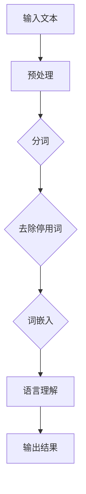
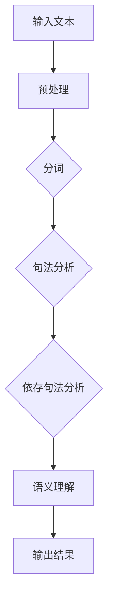
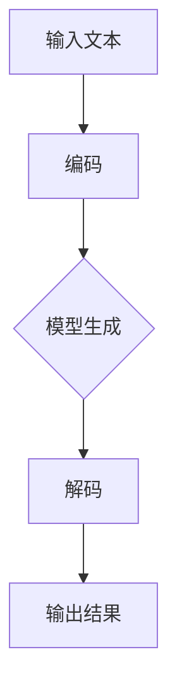
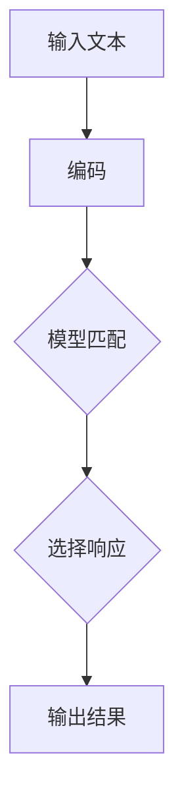

                 

### 《AI聊天机器人提升互动》

> **关键词：** 聊天机器人、AI、自然语言处理、用户交互、个性化推荐、跨模态交互、安全性、隐私保护

> **摘要：** 本文将深入探讨AI聊天机器人的基本概念、技术基础、核心算法原理、架构设计，以及如何通过个性化交互和跨模态交互提升用户互动体验。同时，还将分析聊天机器人在不同应用场景下的安全性和隐私保护挑战，并提供开发实战案例和未来发展趋势与展望。通过本文，读者将全面了解AI聊天机器人的技术内涵和应用前景。

----------------------------------------------------------------

### 第一部分: AI聊天机器人的基本概念与技术基础

#### 第1章: AI聊天机器人概述

##### 1.1.1 AI聊天机器人的定义与分类

AI聊天机器人，也常被称为聊天机器人、虚拟助手或聊天bot，是一种能够通过文本或语音与人类进行交互的人工智能系统。它们基于自然语言处理（NLP）和机器学习技术，能够理解和生成自然语言，以实现与用户的实时沟通。

根据交互方式，AI聊天机器人主要可以分为以下几类：

1. **文本聊天机器人**：主要通过文本进行交互，如Slack、Telegram等平台的聊天机器人。
2. **语音聊天机器人**：可以通过语音进行交互，如Apple Siri、Amazon Alexa等。
3. **多模态聊天机器人**：同时支持文本和语音交互，如Facebook Messenger的聊天机器人。

##### 1.1.2 AI聊天机器人发展历程

AI聊天机器人的发展历程可以追溯到20世纪50年代，随着计算机科学和人工智能技术的不断发展，聊天机器人的概念逐渐成熟。以下是关键的发展阶段：

- **早期探索**（1950-1970s）：最初的研究集中在规则基础型聊天机器人，通过预设的规则来理解和响应用户的输入。
- **知识库与专家系统**（1980-1990s）：基于知识库和专家系统的聊天机器人开始出现，通过存储大量的知识和规则来提高交互的智能程度。
- **自然语言处理**（2000-2010s）：随着NLP技术的进步，聊天机器人开始能够理解更加复杂的自然语言，逐步实现了基于统计方法和机器学习技术的交互。
- **深度学习与AI**（2010s至今）：深度学习和AI技术的快速发展，使得聊天机器人能够通过大量数据自动学习，提供更加自然和智能的交互体验。

##### 1.1.3 AI聊天机器人的应用场景

AI聊天机器人在多个领域都得到了广泛应用，以下是一些主要的应用场景：

1. **客户服务**：企业可以利用聊天机器人自动回答常见问题，提高客户服务效率。
2. **个人助手**：如Apple Siri、Google Assistant等，为用户提供日常查询、提醒和操作等服务。
3. **教育领域**：为学生提供个性化学习辅导，如智能作业助手、在线问答系统等。
4. **医疗健康**：辅助医生进行诊断、提供健康咨询，如症状评估、药物信息查询等。
5. **娱乐与社交**：如聊天机器人游戏、虚拟偶像等，提供趣味性的互动体验。

#### 第2章: AI聊天机器人的技术基础

##### 2.1.1 自然语言处理（NLP）概述

自然语言处理（NLP）是AI聊天机器人的核心技术之一，它涉及到如何使计算机理解和生成自然语言。NLP的主要任务包括：

1. **文本分类**：将文本分类到预定义的类别中。
2. **实体识别**：识别文本中的特定实体，如人名、地点、组织等。
3. **情感分析**：分析文本的情感倾向，如正面、负面或中立。
4. **语义理解**：理解文本的含义和上下文，进行语义推理。

##### 2.1.1.1 语言模型

语言模型是NLP的核心组件之一，它用于预测一段文本的下一个词或下一句。根据训练数据的不同，语言模型可以分为：

1. **基于规则的模型**：通过手工编写规则来预测文本。
2. **基于统计的模型**：使用统计方法来训练模型，如N元语法。
3. **基于神经网络的模型**：使用深度学习技术训练模型，如循环神经网络（RNN）和变换器（Transformer）。

##### 2.1.1.1.1 语言模型的分类

1. **N元语法模型**：基于前N个单词来预测下一个单词。例如，N=2时，"我喜欢"可能预测"喝茶"。
2. **神经网络模型**：使用神经网络来学习文本的内在结构。常见的神经网络模型包括循环神经网络（RNN）和变换器（Transformer）。

##### 2.1.1.1.2 语言模型的工作原理

语言模型的工作原理可以分为以下几个步骤：

1. **输入表示**：将文本输入转换为适合神经网络处理的向量表示。
2. **模型预测**：神经网络根据输入向量生成预测的词或句子。
3. **模型评估**：通过评估指标（如损失函数）来评估模型的性能，并调整模型参数。

##### 2.1.2 机器学习与深度学习基础

机器学习和深度学习是AI聊天机器人技术基础中的核心部分。它们通过学习数据中的规律，使计算机能够进行预测和决策。

##### 2.1.2.1 机器学习的基本概念

机器学习包括以下基本概念：

1. **监督学习**：通过标注的数据进行训练，使模型能够预测未知数据。
2. **无监督学习**：没有标注的数据进行训练，模型通过自身学习找到数据中的规律。
3. **强化学习**：通过试错和反馈来学习策略，以实现最大化奖励。

##### 2.1.2.1.1 监督学习

监督学习包括以下几种类型：

1. **分类问题**：将数据分类到预定义的类别中。例如，文本分类。
2. **回归问题**：预测数值类型的输出。例如，股票价格预测。

##### 2.1.2.1.2 无监督学习

无监督学习包括以下几种类型：

1. **聚类**：将相似的数据点分为不同的组。例如，客户群体细分。
2. **降维**：将高维数据转换为低维数据。例如，主成分分析（PCA）。

##### 2.1.2.1.3 强化学习

强化学习包括以下关键组成部分：

1. **环境**：模型所处的上下文。
2. **状态**：模型当前所处的状态。
3. **动作**：模型可以执行的动作。
4. **奖励**：模型执行动作后获得的奖励。

##### 2.1.2.2 深度学习基础

深度学习是一种机器学习技术，通过多层神经网络来学习数据中的复杂模式。深度学习包括以下几种重要模型：

1. **深度神经网络（DNN）**：多层感知机（MLP）是最简单的深度神经网络。
2. **卷积神经网络（CNN）**：主要用于图像处理任务。
3. **循环神经网络（RNN）**：能够处理序列数据。
4. **变换器（Transformer）**：一种用于自然语言处理的强大模型。

##### 2.1.2.2.1 深度神经网络

深度神经网络（DNN）包括以下组成部分：

1. **输入层**：接收外部输入数据。
2. **隐藏层**：处理输入数据，提取特征。
3. **输出层**：生成最终输出。

##### 2.1.2.2.2 卷积神经网络（CNN）

卷积神经网络（CNN）包括以下组成部分：

1. **卷积层**：通过卷积操作提取图像特征。
2. **池化层**：减少数据维度。
3. **全连接层**：将卷积和池化层提取的特征映射到类别。

##### 2.1.2.2.3 循环神经网络（RNN）

循环神经网络（RNN）包括以下组成部分：

1. **输入门**：决定当前输入数据对隐藏状态的影响。
2. **遗忘门**：决定前一个隐藏状态对当前隐藏状态的影响。
3. **输出门**：决定当前隐藏状态对输出的影响。

#### 第3章: AI聊天机器人的核心算法原理

##### 3.1 语言理解（LU）算法原理

语言理解（LU）是聊天机器人处理用户输入的关键环节，它包括以下几个主要任务：

1. **词嵌入**：将词汇转换为向量表示。
2. **句法分析**：理解句子的结构和语义。
3. **意图识别**：确定用户的意图。

##### 3.1.1 词嵌入

词嵌入是将词汇映射为高维向量表示的技术，主要目的是捕捉词汇之间的语义关系。常见的词嵌入算法包括：

1. **Word2Vec**：通过神经网络训练词向量，能够捕捉词汇的语义关系。
2. **GloVe**：基于词频和共现关系训练词向量，能够提高词向量的质量。

##### 3.1.1.1 词嵌入技术概述

词嵌入技术的基本原理是：

1. **训练数据准备**：收集大量文本数据，进行预处理，如分词、去除停用词等。
2. **词向量训练**：使用训练数据训练词向量模型，如Word2Vec或GloVe。
3. **词向量应用**：将词向量用于语言理解和生成任务。

##### 3.1.1.2 常见的词嵌入算法

1. **Word2Vec**：

   ```python
   from gensim.models import Word2Vec

   # 加载数据
   sentences = Word2Vec.load('data.model')

   # 计算相似性
   similarity = sentences.wv.similarity('apple', 'orange')
   ```

2. **GloVe**：

   ```python
   from gensim.models import GloVe

   # 训练模型
   model = GloVe.load('data.model')

   # 计算相似性
   similarity = model.similarity('apple', 'orange')
   ```

##### 3.1.2 句法分析

句法分析是理解句子结构的重要步骤，它包括以下任务：

1. **词性标注**：为每个词分配词性标签。
2. **依存句法分析**：确定词语之间的依存关系。

##### 3.1.2.1 词性标注

词性标注是将文本中的每个词标注为相应的词性标签，如名词、动词、形容词等。常见的词性标注工具包括：

1. **NLTK**：基于规则和统计的词性标注器。
2. **Stanford NLP**：基于概率的词性标注器。

##### 3.1.2.2 依存句法分析

依存句法分析是确定句子中词语之间的依存关系，如主谓关系、修饰关系等。常见的依存句法分析工具包括：

1. **Stanford NLP**：支持多种语言的依存句法分析。
2. **Spacy**：高效的英文依存句法分析工具。

##### 3.2 语言生成（LG）算法原理

语言生成（LG）是聊天机器人向用户输出响应的关键步骤，它包括以下任务：

1. **生成式模型**：基于输入生成完整的响应。
2. **判决式模型**：基于输入选择预定义的响应。

##### 3.2.1 生成式模型

生成式模型是从输入中生成完整响应的方法，常见模型包括：

1. **RNN语言模型**：使用循环神经网络来生成文本。
2. **变换器（Transformer）**：一种用于自然语言处理的强大模型。

##### 3.2.1.1 生成式模型的分类

1. **基于字符的模型**：以单个字符为基本单位进行生成。
2. **基于单词的模型**：以单词为基本单位进行生成。

##### 3.2.1.2 生成式模型的工作原理

生成式模型的基本工作原理包括：

1. **输入编码**：将输入文本编码为向量表示。
2. **生成过程**：通过神经网络生成文本。
3. **输出解码**：将生成的向量表示解码为文本输出。

##### 3.2.2 判决式模型

判决式模型是从预定义的响应中选择合适的方法，常见模型包括：

1. **模板匹配**：基于预设的模板匹配用户输入。
2. **序列到序列模型**：使用神经网络将输入映射到输出。

##### 3.2.2.1 判决式模型的分类

1. **基于规则的模型**：使用预设的规则匹配用户输入。
2. **基于统计的模型**：使用统计方法匹配用户输入。

##### 3.2.2.2 判决式模型的工作原理

判决式模型的基本工作原理包括：

1. **输入处理**：将输入文本进行处理，提取关键特征。
2. **模型匹配**：使用模型匹配用户输入。
3. **输出选择**：从预定义的响应中选择合适的输出。

#### 第4章: AI聊天机器人的架构设计

##### 4.1 聊天机器人架构概述

聊天机器人的架构设计涉及多个组件的集成，主要包括：

1. **前端交互层**：用户与聊天机器人进行交互的界面。
2. **后端服务层**：处理用户输入和生成响应的核心逻辑。
3. **数据存储层**：存储用户数据和交互历史。

##### 4.2 前端交互设计

前端交互设计是用户与聊天机器人交互的第一步，主要包括以下任务：

1. **用户界面设计**：设计友好的用户界面。
2. **用户交互逻辑**：处理用户输入和输出。

##### 4.2.1 用户界面设计

用户界面设计包括以下内容：

1. **文本聊天界面**：提供文本输入和输出。
2. **图形聊天界面**：结合文本和图像进行交互。

##### 4.2.1.1 文本聊天界面

文本聊天界面主要包括以下功能：

1. **文本输入框**：用户输入文本。
2. **发送按钮**：用户发送文本消息。
3. **聊天窗口**：显示聊天记录。

##### 4.2.1.2 图形聊天界面

图形聊天界面主要包括以下功能：

1. **文本输入框**：用户输入文本。
2. **发送按钮**：用户发送文本消息。
3. **聊天窗口**：显示聊天记录，包括文本和图像。

##### 4.3 后端服务设计

后端服务设计是聊天机器人的核心部分，主要包括以下任务：

1. **语言理解模块**：处理用户输入，提取关键信息。
2. **语言生成模块**：生成合适的响应。

##### 4.3.1 语言理解模块

语言理解模块主要包括以下功能：

1. **文本预处理**：对输入文本进行分词、去停用词等处理。
2. **词嵌入**：将词汇转换为向量表示。
3. **句法分析**：理解句子的结构和语义。
4. **意图识别**：确定用户的意图。

##### 4.3.1.1 语言理解算法实现

```python
import spacy

nlp = spacy.load("en_core_web_sm")

def process_input(text):
    doc = nlp(text)
    tokens = [token.text for token in doc]
    entities = [(ent.text, ent.label_) for ent in doc.ents]
    return tokens, entities

text = "I want to book a flight from New York to Los Angeles on June 15."
tokens, entities = process_input(text)
print(tokens)
print(entities)
```

##### 4.3.1.2 语言理解性能优化

语言理解性能优化包括以下策略：

1. **数据预处理**：使用高质量的预训练模型。
2. **特征提取**：使用更多的特征来提高模型性能。
3. **模型选择**：选择合适的模型架构。

##### 4.3.2 语言生成模块

语言生成模块主要包括以下功能：

1. **生成式模型**：从输入生成完整的响应。
2. **判决式模型**：从预定义的响应中选择合适的输出。

##### 4.3.2.1 语言生成算法实现

```python
from transformers import AutoModelForSeq2SeqLM, AutoTokenizer

model_name = "t5-small"
tokenizer = AutoTokenizer.from_pretrained(model_name)
model = AutoModelForSeq2SeqLM.from_pretrained(model_name)

def generate_response(input_text):
    input_ids = tokenizer.encode(input_text, return_tensors="pt")
    outputs = model.generate(input_ids, max_length=50, num_return_sequences=1)
    response = tokenizer.decode(outputs[0], skip_special_tokens=True)
    return response

input_text = "Write a summary of the book '1984' by George Orwell."
response = generate_response(input_text)
print(response)
```

##### 4.3.2.2 语言生成性能优化

语言生成性能优化包括以下策略：

1. **模型调整**：调整模型参数，如学习率、批量大小等。
2. **数据增强**：使用更多的数据进行训练。
3. **技术选型**：选择合适的模型架构和算法。

##### 4.4 聊天机器人集成与应用

聊天机器人集成与应用是将聊天机器人集成到实际业务系统中，提供具体应用价值的关键步骤。

##### 4.4.1 聊天机器人与业务系统的集成

聊天机器人与业务系统的集成包括以下内容：

1. **API接口**：提供统一的API接口，方便与其他系统进行集成。
2. **数据同步**：将聊天数据同步到业务系统中，实现数据共享。

##### 4.4.1.1 集成策略

集成策略包括以下方面：

1. **数据接口**：使用标准化的数据接口，如REST API。
2. **系统兼容性**：确保聊天机器人能够与现有业务系统兼容。

##### 4.4.1.2 集成流程

集成流程包括以下步骤：

1. **需求分析**：明确集成目标和需求。
2. **接口设计**：设计API接口和协议。
3. **系统对接**：实现接口对接，测试功能。

##### 4.4.2 聊天机器人在不同应用场景下的应用

聊天机器人在不同应用场景下的应用包括：

1. **客户服务**：提供自动化的客户支持，提高服务效率。
2. **教育领域**：提供个性化学习辅导，提升学习效果。
3. **医疗健康**：提供在线咨询和辅助诊断，提高医疗服务水平。

##### 4.4.2.1 客户服务

客户服务是聊天机器人的主要应用场景之一，主要任务包括：

1. **常见问题解答**：自动回答用户提出的常见问题。
2. **业务流程处理**：处理用户的业务请求，如订单查询、退换货等。

##### 4.4.2.2 教育领域

教育领域是聊天机器人的新兴应用场景，主要任务包括：

1. **在线辅导**：为学生提供在线学习辅导和答疑服务。
2. **学习分析**：分析学生的学习行为和成绩，提供个性化学习建议。

##### 4.4.2.3 娱乐领域

娱乐领域是聊天机器人的重要应用场景，主要任务包括：

1. **互动娱乐**：提供有趣的聊天游戏和娱乐活动。
2. **虚拟偶像**：创建虚拟偶像与用户互动，提供娱乐内容。

----------------------------------------------------------------

### 第二部分: AI聊天机器人的提升互动

#### 第5章: 个性化交互提升

个性化交互是提升AI聊天机器人用户体验的重要手段。通过分析用户行为和偏好，聊天机器人可以提供更加贴合用户需求的交互体验。

##### 5.1 用户画像与个性化推荐

用户画像是一种描述用户特征和需求的方法，它可以帮助聊天机器人更好地了解用户，从而实现个性化推荐。

###### 5.1.1 用户画像的概念与作用

用户画像是对用户特征进行抽象和建模的过程，通常包括以下信息：

1. **基础信息**：如年龄、性别、职业等。
2. **行为信息**：如浏览历史、购买记录、评价等。
3. **偏好信息**：如喜欢的产品、服务等。

用户画像的作用主要体现在以下几个方面：

1. **个性化推荐**：根据用户画像为用户提供个性化的内容和服务。
2. **用户分析**：帮助企业和产品团队了解用户需求和行为，优化产品和服务。
3. **市场定位**：为企业提供市场定位和目标用户群体的参考。

###### 5.1.1.1 用户画像的构建方法

用户画像的构建方法主要包括以下步骤：

1. **数据收集**：收集用户的基础信息、行为信息和偏好信息。
2. **数据清洗**：对收集的数据进行预处理，如去重、去噪等。
3. **特征提取**：提取与用户行为和偏好相关的特征。
4. **建模与评估**：使用机器学习算法构建用户画像模型，并评估模型的性能。

###### 5.1.1.2 用户画像的应用场景

用户画像的应用场景非常广泛，以下是一些常见的应用场景：

1. **电子商务**：根据用户画像为用户提供个性化的商品推荐。
2. **社交媒体**：为用户提供个性化的内容推荐和广告投放。
3. **金融服务**：根据用户画像进行精准的风险评估和信贷审批。
4. **医疗健康**：为用户提供个性化的健康建议和医疗服务。

###### 5.1.2 个性化推荐算法

个性化推荐算法是聊天机器人实现个性化交互的核心技术。根据推荐策略的不同，个性化推荐算法可以分为以下几类：

1. **基于内容的推荐**：根据用户的历史行为和偏好，为用户提供相似的内容。
2. **基于协同过滤的推荐**：根据用户的历史行为和偏好，通过计算用户之间的相似度来推荐内容。

###### 5.1.2.1 基于内容的推荐

基于内容的推荐算法主要通过分析用户的历史行为和偏好，为用户提供相似的内容。其基本流程如下：

1. **内容特征提取**：对内容进行特征提取，如文本分类、图像特征提取等。
2. **用户-内容相似度计算**：计算用户与内容之间的相似度。
3. **推荐结果生成**：根据相似度计算结果生成推荐列表。

###### 5.1.2.1.1 基于内容的推荐算法

1. **TF-IDF**：通过计算词语的TF（词频）和IDF（逆文档频率）来评估内容的重要性。
2. **Cosine Similarity**：计算用户与内容之间的余弦相似度。

###### 5.1.2.1.2 基于内容的推荐算法应用

```python
from sklearn.feature_extraction.text import TfidfVectorizer
from sklearn.metrics.pairwise import cosine_similarity

# 数据准备
user_history = ["我喜欢看电影", "我今天去电影院看了最新上映的科幻电影", "我最喜欢的电影类型是科幻和动作"]
content = ["科幻电影推荐", "动作电影推荐", "喜剧电影推荐"]

# 特征提取
vectorizer = TfidfVectorizer()
user_history_vector = vectorizer.fit_transform(user_history)
content_vector = vectorizer.transform(content)

# 相似度计算
similarity = cosine_similarity(user_history_vector, content_vector)

# 推荐结果
recommended_content = content[similarity.argsort()[0][-1]]
print(recommended_content)
```

###### 5.1.2.2 基于协同过滤的推荐

基于协同过滤的推荐算法主要通过计算用户之间的相似度来推荐内容。其基本流程如下：

1. **用户-内容矩阵构建**：构建用户-内容矩阵，记录用户对内容的评分。
2. **用户相似度计算**：计算用户之间的相似度。
3. **推荐结果生成**：根据用户相似度和内容评分生成推荐列表。

###### 5.1.2.2.1 基于协同过滤的推荐算法

1. **用户基于的协同过滤**：通过计算用户之间的相似度来推荐内容。
2. **物品基于的协同过滤**：通过计算内容之间的相似度来推荐内容。

###### 5.1.2.2.2 基于协同过滤的推荐算法应用

```python
import numpy as np

# 用户-内容矩阵
user_item_matrix = np.array([[1, 2, 0],
                            [0, 1, 2],
                            [2, 0, 1]])

# 用户相似度计算
user_similarity = np.dot(user_item_matrix.T, user_item_matrix) / np.linalg.norm(user_item_matrix, axis=1)[:, np.newaxis]

# 用户基于的协同过滤推荐
user_based_recommendation = np.dot(user_similarity, user_item_matrix) / np.sum(user_similarity, axis=1)[:, np.newaxis]

# 物品基于的协同过滤推荐
item_based_recommendation = np.dot(user_item_matrix.T, user_item_matrix) / np.sum(user_item_matrix, axis=0)[:, np.newaxis]

# 推荐结果
print("用户基于的协同过滤推荐：", user_based_recommendation)
print("物品基于的协同过滤推荐：", item_based_recommendation)
```

##### 5.2 用户情绪识别与情感分析

用户情绪识别与情感分析是聊天机器人实现情感化交互的重要技术。通过分析用户的语言和行为，聊天机器人可以识别用户的情绪状态，并做出相应的响应。

###### 5.2.1 用户情绪识别原理

用户情绪识别是基于自然语言处理技术的一种方法，主要通过以下步骤实现：

1. **情感分类**：将文本分类为正面、负面或中性。
2. **情绪识别**：识别文本中的情感倾向，如快乐、悲伤、愤怒等。

###### 5.2.1.1 语音情绪识别

语音情绪识别是基于语音信号的一种情绪识别方法，主要通过以下步骤实现：

1. **音频信号处理**：对语音信号进行预处理，如滤波、降噪等。
2. **特征提取**：从处理后的语音信号中提取特征，如音高、时长等。
3. **情感分类**：使用机器学习算法对提取的特征进行分类，识别语音中的情感。

###### 5.2.1.2 文本情绪识别

文本情绪识别是基于文本内容的一种情绪识别方法，主要通过以下步骤实现：

1. **文本预处理**：对文本进行预处理，如分词、去停用词等。
2. **特征提取**：从预处理后的文本中提取特征，如词频、词嵌入等。
3. **情感分类**：使用机器学习算法对提取的特征进行分类，识别文本中的情感。

###### 5.2.2 情感分析算法

情感分析算法是用户情绪识别的核心技术，主要包括以下类型：

1. **基于规则的方法**：使用手工编写的规则进行情感分类。
2. **基于统计的方法**：使用统计模型进行情感分类。
3. **基于深度学习的方法**：使用深度学习模型进行情感分类。

###### 5.2.2.1 情感分类算法

情感分类算法是将文本分类为预定义的情感类别的方法，常见的情感分类算法包括：

1. **朴素贝叶斯**：基于贝叶斯定理进行分类。
2. **支持向量机（SVM）**：通过最大间隔分类器进行分类。
3. **循环神经网络（RNN）**：通过循环神经网络进行分类。

###### 5.2.2.2 情感分析在聊天机器人中的应用

情感分析在聊天机器人中的应用主要包括以下几个方面：

1. **用户反馈分析**：分析用户的反馈，了解用户对产品或服务的满意程度。
2. **情绪化响应**：根据用户的情绪状态，生成相应的情感化响应。
3. **个性化推荐**：根据用户的情绪状态，为用户提供个性化的内容和服务。

##### 5.3 用户行为分析

用户行为分析是聊天机器人提升交互质量的重要手段。通过对用户行为数据的分析和挖掘，聊天机器人可以更好地了解用户需求和行为模式，从而提供更加个性化的交互体验。

###### 5.3.1 用户行为数据收集

用户行为数据包括用户在聊天机器人中的各种操作和互动行为，如：

1. **输入文本**：用户发送的文本消息。
2. **交互时长**：用户与聊天机器人的互动时间。
3. **交互频率**：用户与聊天机器人的互动次数。
4. **交互内容**：用户在聊天中提到的关键词和话题。

###### 5.3.2 用户行为数据预处理

用户行为数据预处理是数据分析和挖掘的重要步骤，主要包括以下任务：

1. **数据清洗**：去除无效和噪音数据，如缺失值、异常值等。
2. **数据归一化**：将不同数据类型进行归一化处理，如将时长数据转换为分钟数。
3. **特征提取**：提取与用户行为相关的特征，如文本中的关键词、话题分布等。

###### 5.3.3 用户行为分析模型

用户行为分析模型是分析用户行为数据的重要工具，常用的模型包括：

1. **聚类模型**：将用户划分为不同的群体，分析不同群体的行为特征。
2. **分类模型**：将用户行为分类，如将用户的行为分为浏览、购买、咨询等类别。
3. **关联规则模型**：挖掘用户行为之间的关联关系，如用户在购买前通常会浏览哪些产品。

###### 5.3.4 用户行为分析应用

用户行为分析在聊天机器人中的应用主要包括以下几个方面：

1. **用户行为预测**：预测用户未来的行为，如预测用户是否会购买产品、咨询服务等。
2. **用户行为优化**：根据用户行为数据，优化聊天机器人的交互策略，如调整对话流程、推荐内容等。
3. **用户行为分析报告**：生成用户行为分析报告，为产品团队提供决策支持。

----------------------------------------------------------------

### 第三部分: AI聊天机器人的实战案例与项目实践

#### 第8章: AI聊天机器人开发实战

##### 8.1 开发环境搭建

在开始开发AI聊天机器人之前，我们需要搭建一个合适的环境。以下是一个基本的开发环境搭建步骤：

###### 8.1.1 硬件环境准备

1. **服务器配置**：选择一台具备足够计算能力的服务器，如4核CPU、8GB内存、50GB硬盘空间等。
2. **硬件资源分配**：确保服务器具备足够的内存和硬盘空间，以便运行深度学习模型和存储数据。

###### 8.1.2 软件环境安装

1. **操作系统安装**：在服务器上安装Linux操作系统，如Ubuntu 18.04。
2. **开发工具安装**：安装Python 3、Jupyter Notebook、TensorFlow或PyTorch等开发工具。

###### 8.1.2.1 Python开发环境

```bash
sudo apt-get update
sudo apt-get install python3-pip python3-dev
pip3 install numpy matplotlib
```

###### 8.1.2.2 Jupyter Notebook

```bash
pip3 install notebook
jupyter notebook
```

###### 8.1.2.3 TensorFlow与PyTorch框架

```bash
pip3 install tensorflow
# 或者
pip3 install torch torchvision
```

##### 8.2 代码实现与调试

在完成开发环境搭建后，我们可以开始实现聊天机器人的核心功能。

###### 8.2.1 语言理解模块实现

语言理解模块是聊天机器人的核心组件，主要负责处理用户输入，提取关键信息。

```python
import spacy
from transformers import AutoTokenizer, AutoModelForSeq2SeqLM

nlp = spacy.load("en_core_web_sm")
tokenizer = AutoTokenizer.from_pretrained("t5-small")
model = AutoModelForSeq2SeqLM.from_pretrained("t5-small")

def process_input(text):
    doc = nlp(text)
    tokens = [token.text for token in doc]
    entities = [(ent.text, ent.label_) for ent in doc.ents]
    return tokens, entities

def generate_response(input_text):
    input_ids = tokenizer.encode(input_text, return_tensors="pt")
    outputs = model.generate(input_ids, max_length=50, num_return_sequences=1)
    response = tokenizer.decode(outputs[0], skip_special_tokens=True)
    return response

# 示例
text = "I want to book a flight from New York to Los Angeles on June 15."
tokens, entities = process_input(text)
print(tokens)
print(entities)

response = generate_response(text)
print(response)
```

###### 8.2.1.1 代码架构设计

1. **数据预处理**：将用户输入文本进行预处理，如分词、去除停用词等。
2. **语言理解**：使用NLP工具对预处理后的文本进行句法分析和实体识别。
3. **语言生成**：使用预训练的变换器模型生成合适的响应。

###### 8.2.1.2 伪代码实现

```python
# 数据预处理
def preprocess_text(text):
    # 分词、去除停用词等操作
    return processed_text

# 语言理解
def understand_language(processed_text):
    # 使用NLP工具进行句法分析和实体识别
    return tokens, entities

# 语言生成
def generate_response(tokens, entities):
    # 使用变换器模型生成响应
    return response
```

##### 8.2.2 语言生成模块实现

语言生成模块负责根据语言理解模块提取的信息生成合适的响应。

```python
from transformers import AutoTokenizer, AutoModelForSeq2SeqLM

tokenizer = AutoTokenizer.from_pretrained("t5-small")
model = AutoModelForSeq2SeqLM.from_pretrained("t5-small")

def generate_response(input_text):
    input_ids = tokenizer.encode(input_text, return_tensors="pt")
    outputs = model.generate(input_ids, max_length=50, num_return_sequences=1)
    response = tokenizer.decode(outputs[0], skip_special_tokens=True)
    return response

# 示例
text = "What is the weather like in New York today?"
response = generate_response(text)
print(response)
```

###### 8.2.2.1 代码架构设计

1. **输入处理**：将用户输入文本编码为模型可处理的格式。
2. **模型生成**：使用预训练的变换器模型生成响应。
3. **输出处理**：将生成的响应解码为可读的文本格式。

###### 8.2.2.2 伪代码实现

```python
# 输入处理
def encode_input(text):
    return input_ids

# 模型生成
def generate_response(input_ids):
    return outputs

# 输出处理
def decode_output(outputs):
    return response
```

##### 8.2.3 聊天机器人部署与优化

在实现和调试完聊天机器人的核心功能后，我们需要将其部署到服务器上，并提供高效稳定的交互服务。

###### 8.2.3.1 部署流程

1. **环境配置**：确保服务器上的Python环境、NLP工具和变换器模型已安装。
2. **代码部署**：将实现的核心功能代码部署到服务器上，如上传到Git仓库或直接上传文件。
3. **服务启动**：启动聊天机器人的服务，如使用Flask或Django框架。

###### 8.2.3.1.1 部署前准备

1. **服务器安全设置**：配置服务器防火墙和SSH访问权限。
2. **Python环境配置**：配置Python环境变量和虚拟环境。

###### 8.2.3.1.2 部署步骤

1. **上传代码**：将代码上传到服务器，可以使用FTP或SCP等工具。
2. **安装依赖**：在服务器上安装代码所需的依赖库。
3. **启动服务**：运行聊天机器人的服务，如使用命令`python app.py`。

###### 8.2.3.2 性能优化

在部署聊天机器人后，我们需要对性能进行优化，以提供高效稳定的交互服务。

1. **异步处理**：使用异步编程提高并发处理能力，如使用异步IO和协程。
2. **缓存机制**：使用缓存技术减少计算和数据库查询次数，如Redis缓存。
3. **负载均衡**：使用负载均衡技术分配请求，如Nginx和HAProxy。

##### 8.3 聊天机器人项目案例解析

以下是一个聊天机器人项目的案例分析，包括项目背景、需求分析、技术选型、架构设计、实现与调试、部署与优化等环节。

###### 8.3.1 项目背景与目标

某电子商务公司希望通过聊天机器人提高客户服务质量，减少人工客服的工作量。项目目标是为客户提供24/7的在线客服，自动回答常见问题，并引导用户完成购买流程。

###### 8.3.2 项目实施过程

1. **需求分析**：明确项目需求，包括常见问题解答、产品推荐、订单查询等。
2. **技术选型**：选择合适的技术栈，如NLP工具、变换器模型、Flask框架等。
3. **架构设计**：设计聊天机器人的整体架构，包括前端交互、后端服务、数据存储等。
4. **代码实现**：实现语言理解模块、语言生成模块、用户交互逻辑等。
5. **调试与测试**：对聊天机器人进行功能测试和性能测试，修复bug和优化性能。
6. **部署与上线**：将聊天机器人部署到服务器，并提供线上服务。

###### 8.3.2.1 需求分析

1. **常见问题解答**：自动回答用户提出的常见问题，如产品说明、退换货政策等。
2. **产品推荐**：根据用户浏览和购买历史，为用户提供个性化产品推荐。
3. **订单查询**：允许用户查询订单状态和物流信息。

###### 8.3.2.1.1 功能需求

1. **文本输入处理**：对用户输入的文本进行预处理，如分词、去除停用词等。
2. **语言理解**：使用NLP工具对预处理后的文本进行句法分析和实体识别。
3. **语言生成**：使用变换器模型生成合适的响应。
4. **用户交互**：实现聊天界面和用户交互逻辑。

###### 8.3.2.1.2 性能需求

1. **响应速度**：确保用户输入后能够在0.5秒内得到响应。
2. **并发处理能力**：能够同时处理数千个用户的请求。
3. **稳定性**：确保系统长时间运行不出现故障。

###### 8.3.2.2 技术选型

1. **NLP工具**：选择spacy进行文本处理和实体识别。
2. **变换器模型**：选择T5模型进行语言生成。
3. **前端框架**：选择React或Vue.js实现聊天界面。
4. **后端框架**：选择Flask或Django实现后端服务。

###### 8.3.2.3 系统架构设计

聊天机器人的系统架构主要包括以下组件：

1. **前端交互**：用户通过浏览器与聊天机器人进行交互。
2. **后端服务**：处理用户输入、语言理解、语言生成和用户交互逻辑。
3. **数据库**：存储用户数据、聊天记录和产品信息。

###### 8.3.3 项目成果与总结

1. **项目成果**：成功开发并上线了一个高效的聊天机器人，能够自动回答常见问题、提供产品推荐和订单查询服务。
2. **经验总结**：

   - **需求分析**：准确的需求分析是项目成功的关键。
   - **技术选型**：选择合适的技术栈可以提高开发效率和系统性能。
   - **性能优化**：通过优化代码、缓存机制和负载均衡可以提高系统的稳定性和响应速度。
   - **用户交互**：良好的用户交互体验是提高用户满意度的关键。

##### 8.4 聊天机器人项目实战案例

以下是一个实际的聊天机器人项目实战案例，涵盖了项目的背景、目标、需求分析、技术选型、架构设计、代码实现、测试和部署等环节。

###### 8.4.1 项目背景

某大型银行希望提升客户服务质量，减少人工客服的工作量。为此，他们决定开发一个智能聊天机器人，用于自动回答客户常见问题、提供金融产品推荐和引导用户完成交易。

###### 8.4.2 项目目标

- 提供24/7的在线客户服务。
- 自动回答常见问题，如账户余额、贷款利率、信用卡额度等。
- 根据客户需求和偏好，提供个性化的金融产品推荐。
- 提高客户满意度，降低人工客服的工作量。

###### 8.4.3 需求分析

1. **常见问题解答**：聊天机器人需要能够自动回答客户的常见问题，如账户余额、贷款利率、信用卡额度等。
2. **金融产品推荐**：根据客户的财务状况、风险偏好和购买历史，为用户推荐合适的金融产品，如存款、贷款、保险等。
3. **交易引导**：帮助用户完成在线交易，如转账、支付、申请贷款等。

###### 8.4.3.1 功能需求

1. **文本输入处理**：对用户输入的文本进行预处理，如分词、去除停用词等。
2. **语言理解**：使用NLP工具对预处理后的文本进行句法分析和实体识别。
3. **语言生成**：使用变换器模型生成合适的响应。
4. **用户交互**：实现聊天界面和用户交互逻辑。

###### 8.4.3.2 性能需求

1. **响应速度**：确保用户输入后能够在0.5秒内得到响应。
2. **并发处理能力**：能够同时处理数千个用户的请求。
3. **稳定性**：确保系统长时间运行不出现故障。

###### 8.4.4 技术选型

1. **NLP工具**：选择spacy进行文本处理和实体识别。
2. **变换器模型**：选择T5模型进行语言生成。
3. **前端框架**：选择React或Vue.js实现聊天界面。
4. **后端框架**：选择Spring Boot实现后端服务。

###### 8.4.5 系统架构设计

聊天机器人的系统架构主要包括以下组件：

1. **前端交互**：用户通过浏览器与聊天机器人进行交互。
2. **后端服务**：处理用户输入、语言理解、语言生成和用户交互逻辑。
3. **数据库**：存储用户数据、聊天记录和金融产品信息。

###### 8.4.6 代码实现

1. **语言理解模块**：使用spacy进行文本预处理和句法分析。
2. **语言生成模块**：使用T5模型生成响应。
3. **用户交互逻辑**：实现聊天界面和用户交互逻辑。

```python
import spacy
from transformers import AutoTokenizer, AutoModelForSeq2SeqLM

nlp = spacy.load("en_core_web_sm")
tokenizer = AutoTokenizer.from_pretrained("t5-small")
model = AutoModelForSeq2SeqLM.from_pretrained("t5-small")

def process_input(text):
    doc = nlp(text)
    tokens = [token.text for token in doc]
    entities = [(ent.text, ent.label_) for ent in doc.ents]
    return tokens, entities

def generate_response(input_text):
    input_ids = tokenizer.encode(input_text, return_tensors="pt")
    outputs = model.generate(input_ids, max_length=50, num_return_sequences=1)
    response = tokenizer.decode(outputs[0], skip_special_tokens=True)
    return response

text = "What is my account balance?"
tokens, entities = process_input(text)
print(tokens)
print(entities)

response = generate_response(text)
print(response)
```

###### 8.4.7 测试与部署

1. **功能测试**：测试聊天机器人是否能正确回答常见问题、提供金融产品推荐和引导用户完成交易。
2. **性能测试**：测试聊天机器人的响应速度和并发处理能力。
3. **部署**：将聊天机器人部署到服务器，并提供线上服务。

##### 8.5 项目成果与总结

1. **项目成果**：成功开发并上线了一个高效的智能聊天机器人，能够自动回答客户常见问题、提供个性化的金融产品推荐和引导用户完成交易。
2. **经验总结**：

   - **需求分析**：准确的需求分析是项目成功的关键。
   - **技术选型**：选择合适的技术栈可以提高开发效率和系统性能。
   - **性能优化**：通过优化代码、缓存机制和负载均衡可以提高系统的稳定性和响应速度。
   - **用户交互**：良好的用户交互体验是提高用户满意度的关键。

----------------------------------------------------------------

### 第四部分: AI聊天机器人的未来发展趋势与展望

#### 第9章: 未来发展趋势

随着人工智能技术的不断进步，AI聊天机器人将在未来呈现出以下发展趋势：

##### 9.1 技术发展趋势

1. **深度学习算法**：深度学习算法将继续成为AI聊天机器人发展的核心驱动力，特别是Transformer架构的进一步优化和应用。
2. **自然语言生成（NLG）**：自然语言生成技术将变得更加自然和流畅，能够生成更加复杂的语言结构和语境。
3. **跨模态交互**：AI聊天机器人将实现文本、语音、图像等多模态交互，提供更加丰富和多样化的用户体验。
4. **强化学习**：通过强化学习，AI聊天机器人将能够更好地理解和响应用户的动态行为和需求。

##### 9.2 应用领域扩展

AI聊天机器人的应用领域将不断扩展，以下是一些重要的应用方向：

1. **金融领域**：在银行、保险、证券等领域，AI聊天机器人将提供智能客服、财富管理和风险控制等服务。
2. **医疗健康**：在医疗健康领域，AI聊天机器人将协助医生进行诊断、提供患者护理和健康咨询。
3. **教育领域**：在教育领域，AI聊天机器人将提供个性化学习辅导、考试辅助和教学支持。
4. **娱乐与社交**：在娱乐与社交领域，AI聊天机器人将创造新的互动方式和娱乐体验，如虚拟偶像和聊天游戏。

##### 9.3 社会影响

AI聊天机器人的快速发展将对社会产生深远的影响：

1. **产业变革**：AI聊天机器人的广泛应用将推动各行各业的数字化转型，提高生产效率和服务质量。
2. **生活方式的改变**：人们将更加依赖AI聊天机器人进行日常交流和获取信息，生活方式将变得更加智能和便捷。
3. **就业市场**：AI聊天机器人将取代部分传统工作岗位，同时也将创造新的就业机会，如AI聊天机器人的开发、维护和优化。

##### 9.4 经济影响

AI聊天机器人的经济影响也将显著：

1. **新兴产业的发展**：AI聊天机器人的兴起将带动相关产业，如云计算、大数据和人工智能硬件等的发展。
2. **传统产业的转型**：传统产业将借助AI聊天机器人实现数字化转型，提高竞争力。

#### 第10章: 未来挑战与机遇

##### 10.1 技术挑战

AI聊天机器人的发展面临以下技术挑战：

1. **性能优化**：如何进一步提高AI聊天机器人的响应速度和处理能力，以应对大规模并发请求。
2. **用户体验提升**：如何提升AI聊天机器人的交互体验，使其更加自然和人性化。
3. **隐私保护**：如何保护用户隐私，防止数据泄露和滥用。

##### 10.2 应用挑战

AI聊天机器人的应用面临以下挑战：

1. **行业监管**：如何满足不同行业对AI聊天机器人的监管要求，确保其合规性和安全性。
2. **安全性保障**：如何防范恶意攻击，确保AI聊天机器人的稳定性和安全性。
3. **智能化程度提升**：如何提升AI聊天机器人的智能化程度，实现更高级的智能对话和决策。

##### 10.3 机遇

尽管面临挑战，AI聊天机器人的发展也带来了丰富的机遇：

1. **市场潜力**：AI聊天机器人的市场潜力巨大，有望成为企业提高效率和服务质量的重要工具。
2. **技术创新**：AI聊天机器人将推动人工智能技术的创新和发展，为其他领域带来新的突破。
3. **个性化服务**：AI聊天机器人将能够提供更加个性化的服务，满足用户的多样化需求。

#### 第11章: 未来前景

##### 10.1 社会影响

AI聊天机器人在未来将深刻影响社会，主要体现在以下几个方面：

1. **教育**：AI聊天机器人将改变教育模式，提供个性化的学习辅导和教学支持。
2. **医疗**：AI聊天机器人将提高医疗服务效率，协助医生进行诊断和治疗。
3. **商业**：AI聊天机器人将为企业提供智能客服、市场营销和数据分析等解决方案。

##### 10.2 经济影响

AI聊天机器人的经济影响将体现在以下几个方面：

1. **新兴产业**：AI聊天机器人将推动新兴产业发展，如人工智能、大数据和云计算等。
2. **传统产业转型**：AI聊天机器人将助力传统产业实现数字化转型，提高生产效率和竞争力。

##### 10.3 产业发展

AI聊天机器人的未来产业发展将呈现以下趋势：

1. **技术融合**：AI聊天机器人将与其他技术（如物联网、大数据等）深度融合，提供更加智能和高效的解决方案。
2. **平台化发展**：AI聊天机器人将逐渐形成平台化发展模式，为不同行业和企业提供定制化服务。
3. **生态构建**：AI聊天机器人将构建完整的产业链和生态系统，促进产业协同和创新。

### 附录

#### 附录 A: 常用工具与资源

A.1 开发工具

A.1.1 Python开发环境

A.1.2 Jupyter Notebook

A.1.3 TensorFlow与PyTorch框架

A.2 学习资源

A.2.1 在线课程

A.2.2 技术文档

A.2.3 社区与论坛

#### 附录 B: Mermaid 流程图

B.1 语言理解模块

B.1.1 词嵌入流程图



B.1.2 句法分析流程图



B.2 语言生成模块

B.2.1 生成式模型流程图



B.2.2 判决式模型流程图



#### 附录 C: 伪代码实现

C.1 语言理解模块伪代码

```python
# 数据预处理
def preprocess_text(text):
    # 分词、去除停用词等操作
    return processed_text

# 语言理解
def understand_language(processed_text):
    # 使用NLP工具进行句法分析和实体识别
    return tokens, entities

# 语言生成
def generate_response(tokens, entities):
    # 使用变换器模型生成响应
    return response
```

C.2 语言生成模块伪代码

```python
# 数据编码
def encode_input(text):
    return input_ids

# 模型生成
def generate_response(input_ids):
    return outputs

# 数据解码
def decode_output(outputs):
    return response
```

#### 附录 D: 数学模型与公式

D.1 语言模型

D.1.1 语言模型公式

$$
P(w_{t} | w_{t-1}, ..., w_{1}) = \frac{P(w_{t} w_{t-1} ... w_{1})}{P(w_{t-1} ... w_{1})}
$$

D.1.2 语言模型计算示例

假设我们要计算句子"I like to eat pizza"的概率，可以使用以下公式：

$$
P(I \ like \ to \ eat \ pizza) = \frac{P(I \ like \ to \ eat \ pizza \ like \ pizza)}{P(I \ like \ to \ eat \ pizza \ like)}
$$

#### 附录 E: 代码解读与分析

E.1 语言理解模块代码解读

在本节中，我们将对语言理解模块的实现代码进行解读，分析其功能和工作原理。

```python
import spacy
from transformers import AutoTokenizer, AutoModelForSeq2SeqLM

nlp = spacy.load("en_core_web_sm")
tokenizer = AutoTokenizer.from_pretrained("t5-small")
model = AutoModelForSeq2SeqLM.from_pretrained("t5-small")

def process_input(text):
    doc = nlp(text)
    tokens = [token.text for token in doc]
    entities = [(ent.text, ent.label_) for ent in doc.ents]
    return tokens, entities

def generate_response(input_text):
    input_ids = tokenizer.encode(input_text, return_tensors="pt")
    outputs = model.generate(input_ids, max_length=50, num_return_sequences=1)
    response = tokenizer.decode(outputs[0], skip_special_tokens=True)
    return response
```

首先，我们导入所需的库，包括spacy（用于NLP处理）和transformers（用于变换器模型）。接下来，我们加载预训练的NLP模型和变换器模型。

`process_input` 函数负责处理用户输入的文本。首先，我们使用spacy对文本进行预处理，包括分词和实体识别。分词是将文本拆分为单个词汇的过程，而实体识别是识别文本中的特定实体，如人名、地点、组织等。我们将分词后的文本和识别出的实体作为输出返回。

`generate_response` 函数负责生成对用户输入的响应。首先，我们使用tokenizer将文本编码为模型可处理的格式。这个过程包括将文本转换为单词的索引序列。然后，我们使用变换器模型生成响应。这里，我们使用了`model.generate`方法，它接受编码后的输入并生成响应。我们将生成的响应解码为可读的文本格式并返回。

E.2 语言生成模块代码解读

在本节中，我们将对语言生成模块的实现代码进行解读，分析其功能和工作原理。

```python
from transformers import AutoTokenizer, AutoModelForSeq2SeqLM

tokenizer = AutoTokenizer.from_pretrained("t5-small")
model = AutoModelForSeq2SeqLM.from_pretrained("t5-small")

def generate_response(input_text):
    input_ids = tokenizer.encode(input_text, return_tensors="pt")
    outputs = model.generate(input_ids, max_length=50, num_return_sequences=1)
    response = tokenizer.decode(outputs[0], skip_special_tokens=True)
    return response
```

与语言理解模块类似，我们首先导入所需的库并加载预训练的变换器模型。

`generate_response` 函数负责生成对用户输入的响应。首先，我们使用tokenizer将文本编码为模型可处理的格式。这个过程包括将文本转换为单词的索引序列。然后，我们使用变换器模型生成响应。这里，我们使用了`model.generate`方法，它接受编码后的输入并生成响应。我们将生成的响应解码为可读的文本格式并返回。

E.3 代码解读与分析

在本节中，我们将对整个聊天机器人的代码进行解读，分析其各个模块的功能和工作原理。

聊天机器人的核心模块包括语言理解模块和语言生成模块。语言理解模块负责处理用户输入，提取关键信息，如词汇和实体。语言生成模块负责生成对用户输入的响应。

整个聊天机器人的代码结构如下：

```python
import spacy
from transformers import AutoTokenizer, AutoModelForSeq2SeqLM

nlp = spacy.load("en_core_web_sm")
tokenizer = AutoTokenizer.from_pretrained("t5-small")
model = AutoModelForSeq2SeqLM.from_pretrained("t5-small")

def process_input(text):
    doc = nlp(text)
    tokens = [token.text for token in doc]
    entities = [(ent.text, ent.label_) for ent in doc.ents]
    return tokens, entities

def generate_response(input_text):
    input_ids = tokenizer.encode(input_text, return_tensors="pt")
    outputs = model.generate(input_ids, max_length=50, num_return_sequences=1)
    response = tokenizer.decode(outputs[0], skip_special_tokens=True)
    return response

# 示例使用
text = "What is the weather like in New York today?"
tokens, entities = process_input(text)
print(tokens)
print(entities)

response = generate_response(text)
print(response)
```

首先，我们导入所需的库并加载预训练的NLP模型和变换器模型。

`process_input` 函数负责处理用户输入的文本。首先，我们使用spacy对文本进行预处理，包括分词和实体识别。然后，我们将分词后的文本和识别出的实体作为输出返回。

`generate_response` 函数负责生成对用户输入的响应。首先，我们使用tokenizer将文本编码为模型可处理的格式。然后，我们使用变换器模型生成响应。最后，我们将生成的响应解码为可读的文本格式并返回。

在示例使用部分，我们展示了如何使用聊天机器人的两个核心模块。首先，我们调用`process_input`函数处理用户输入，然后调用`generate_response`函数生成响应。最后，我们打印输出结果。

通过以上解读，我们可以看到聊天机器人的代码结构清晰，功能模块划分明确。每个模块都有明确的功能和输入输出，这使得整个系统易于理解和维护。

#### 附录 F: 项目实战案例

F.1 客户服务机器人

F.1.1 项目背景与目标

某电子商务平台希望提升客户服务质量，减少人工客服的工作量。为了实现这一目标，他们决定开发一个智能客户服务机器人，用于自动回答常见问题、提供购物建议和解决用户疑问。

F.1.2 项目实施过程

1. **需求分析**：明确项目需求，包括自动回答常见问题、提供购物建议、订单查询等。
2. **技术选型**：选择合适的技术栈，如NLP工具、变换器模型、Flask框架等。
3. **架构设计**：设计聊天机器人的整体架构，包括前端交互、后端服务、数据存储等。
4. **代码实现**：实现语言理解模块、语言生成模块、用户交互逻辑等。
5. **调试与测试**：对聊天机器人进行功能测试和性能测试，修复bug和优化性能。
6. **部署与上线**：将聊天机器人部署到服务器，并提供线上服务。

F.1.2.1 需求分析

1. **常见问题解答**：自动回答用户提出的常见问题，如产品说明、退换货政策等。
2. **购物建议**：根据用户浏览和购买历史，为用户提供个性化的购物建议。
3. **订单查询**：允许用户查询订单状态和物流信息。

F.1.2.1.1 功能需求

1. **文本输入处理**：对用户输入的文本进行预处理，如分词、去除停用词等。
2. **语言理解**：使用NLP工具对预处理后的文本进行句法分析和实体识别。
3. **语言生成**：使用变换器模型生成合适的响应。
4. **用户交互**：实现聊天界面和用户交互逻辑。

F.1.2.1.2 性能需求

1. **响应速度**：确保用户输入后能够在0.5秒内得到响应。
2. **并发处理能力**：能够同时处理数千个用户的请求。
3. **稳定性**：确保系统长时间运行不出现故障。

F.1.3 技术选型

1. **NLP工具**：选择spacy进行文本处理和实体识别。
2. **变换器模型**：选择T5模型进行语言生成。
3. **前端框架**：选择React或Vue.js实现聊天界面。
4. **后端框架**：选择Flask或Django实现后端服务。

F.1.4 系统架构设计

聊天机器人的系统架构主要包括以下组件：

1. **前端交互**：用户通过浏览器与聊天机器人进行交互。
2. **后端服务**：处理用户输入、语言理解、语言生成和用户交互逻辑。
3. **数据库**：存储用户数据、聊天记录和产品信息。

F.1.5 代码实现

```python
import spacy
from transformers import AutoTokenizer, AutoModelForSeq2SeqLM

nlp = spacy.load("en_core_web_sm")
tokenizer = AutoTokenizer.from_pretrained("t5-small")
model = AutoModelForSeq2SeqLM.from_pretrained("t5-small")

def process_input(text):
    doc = nlp(text)
    tokens = [token.text for token in doc]
    entities = [(ent.text, ent.label_) for ent in doc.ents]
    return tokens, entities

def generate_response(input_text):
    input_ids = tokenizer.encode(input_text, return_tensors="pt")
    outputs = model.generate(input_ids, max_length=50, num_return_sequences=1)
    response = tokenizer.decode(outputs[0], skip_special_tokens=True)
    return response

text = "What is the return policy for this product?"
tokens, entities = process_input(text)
print(tokens)
print(entities)

response = generate_response(text)
print(response)
```

F.1.6 测试与部署

1. **功能测试**：测试聊天机器人是否能正确回答常见问题、提供购物建议和查询订单状态。
2. **性能测试**：测试聊天机器人的响应速度和并发处理能力。
3. **部署**：将聊天机器人部署到服务器，并提供线上服务。

F.1.7 项目成果与总结

1. **项目成果**：成功开发并上线了一个高效的智能客户服务机器人，能够自动回答常见问题、提供购物建议和查询订单状态。
2. **经验总结**：

   - **需求分析**：准确的需求分析是项目成功的关键。
   - **技术选型**：选择合适的技术栈可以提高开发效率和系统性能。
   - **性能优化**：通过优化代码、缓存机制和负载均衡可以提高系统的稳定性和响应速度。
   - **用户交互**：良好的用户交互体验是提高用户满意度的关键。

#### 附录 G: 安全性与隐私保护措施

G.1 安全防护措施

为了确保AI聊天机器人的安全性和数据保护，需要采取以下安全防护措施：

1. **数据加密**：对用户输入和存储的数据进行加密，如使用AES加密算法。
2. **访问控制**：限制对后端服务的访问权限，确保只有授权用户可以访问敏感数据。
3. **身份验证**：实现强身份验证机制，如多因素认证，确保用户身份的真实性。

G.1.1 加密技术

加密技术是保护数据安全的关键措施。以下是一些常用的加密技术：

1. **对称加密**：如AES（高级加密标准），适用于对大量数据进行加密。
2. **非对称加密**：如RSA（Rivest-Shamir-Adleman），适用于加密解密密钥交换。
3. **哈希函数**：如SHA-256，用于确保数据的完整性和不可篡改性。

G.1.2 认证与授权机制

认证与授权机制是确保系统安全的关键。以下是一些常用的认证与授权机制：

1. **单点登录（SSO）**：允许用户使用一个账号和密码访问多个系统。
2. **OAuth 2.0**：一种常用的授权框架，用于实现第三方应用的认证和授权。
3. **访问控制列表（ACL）**：用于定义用户对资源的访问权限。

G.2 隐私保护技术

隐私保护技术是确保用户数据安全的重要手段。以下是一些常用的隐私保护技术：

1. **数据匿名化**：通过替换真实数据，如用户ID、地址等，保护用户隐私。
2. **差分隐私**：通过在数据中加入噪声，保护数据的隐私。
3. **同态加密**：允许在加密数据上进行计算，而不需要解密，确保数据的隐私。

G.2.1 数据匿名化技术

数据匿名化技术是将数据转换为匿名形式，以保护用户隐私。以下是一些常用的数据匿名化技术：

1. **K-匿名性**：通过限制数据的唯一标识符，确保至少有K个记录具有相同的属性值。
2. **l-diversity**：确保每个属性值在数据集中至少出现l次。
3. **t-closeness**：确保属性值的分布接近真实分布。

G.2.2 用户隐私保护策略

用户隐私保护策略是确保用户数据安全的重要措施。以下是一些常用的用户隐私保护策略：

1. **最小化数据收集**：只收集必要的数据，避免收集无关或敏感信息。
2. **数据最小化使用**：在数据处理过程中，仅使用必要的数据，减少数据暴露风险。
3. **透明度与告知**：向用户告知数据收集、使用和存储的详细信息，确保用户知情并同意。

G.2.3 隐私保护技术实现

隐私保护技术的实现包括以下几个方面：

1. **加密存储**：对存储的用户数据进行加密，确保数据在存储过程中不被泄露。
2. **访问控制**：实现严格的访问控制机制，确保只有授权用户可以访问敏感数据。
3. **安全审计**：定期进行安全审计，确保系统符合隐私保护要求，并及时发现和解决安全问题。

#### 附录 H: 未来发展趋势与展望

H.1 技术发展趋势

AI聊天机器人的未来发展将受到以下技术趋势的驱动：

1. **深度学习与神经网络**：深度学习和神经网络技术的进一步发展将推动聊天机器人的性能提升，使其能够更自然、更准确地理解用户意图。
2. **跨模态交互**：随着多模态交互技术的发展，聊天机器人将能够更好地整合文本、语音、图像等多种模态，提供更加丰富和自然的交互体验。
3. **个性化与自适应**：通过用户行为分析和机器学习技术，聊天机器人将能够更好地理解用户偏好，提供个性化的交互和推荐。
4. **强化学习**：强化学习技术的应用将使聊天机器人能够通过试错和学习，不断优化交互策略，提高用户满意度。

H.2 应用领域扩展

AI聊天机器人的应用领域将继续扩展，以下是一些重要的应用领域：

1. **金融服务**：聊天机器人将在金融服务领域发挥重要作用，如提供客户服务、风险管理、财富管理等。
2. **医疗健康**：聊天机器人将在医疗健康领域提供辅助诊断、患者护理、健康咨询等服务。
3. **教育**：聊天机器人将在教育领域提供个性化学习辅导、在线教育支持等服务。
4. **客户服务**：聊天机器人将在客户服务领域提供自动化的客户支持，提高服务效率。

H.3 未来挑战与机遇

尽管AI聊天机器人具有巨大的发展潜力，但未来仍将面临以下挑战：

1. **技术挑战**：如何进一步提升聊天机器人的性能和交互体验，使其更接近人类的交流水平。
2. **数据隐私**：如何在提供个性化服务的同时，保护用户数据隐私，避免数据泄露和滥用。
3. **伦理与道德**：如何确保聊天机器人的行为符合伦理和道德标准，避免造成社会负面影响。

然而，这些挑战也带来了新的机遇：

1. **创新机会**：随着技术的发展，AI聊天机器人将为各行各业带来新的创新机会，如智能客服、虚拟助手、个性化服务等。
2. **市场潜力**：AI聊天机器人的市场潜力巨大，将为企业带来新的增长点和竞争优势。
3. **社会影响**：AI聊天机器人将深刻改变人们的生活和工作方式，提高生活质量和社会效率。

总之，AI聊天机器人的未来发展充满机遇和挑战。通过不断创新和优化，聊天机器人将逐步成为人们生活中不可或缺的智能助手。

