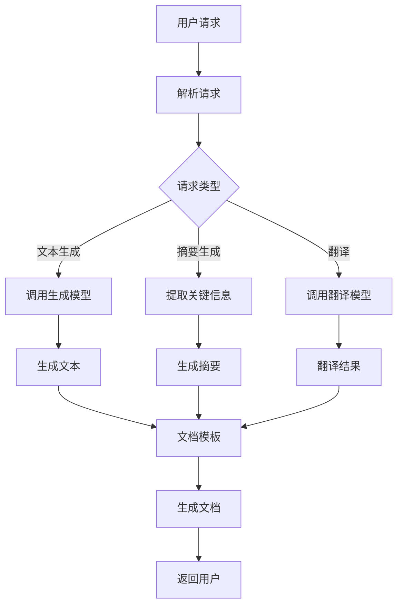

                 

# 第一部分：引言

## 第1章：AI辅助软件文档的背景与重要性

### 1.1.1 软件文档的概述与发展历程

软件文档，作为软件开发过程中的重要组成部分，承载了软件系统的设计、实现、使用和维护等方面的信息。从历史角度看，软件文档的发展经历了几个阶段。早期，软件文档主要是以纸质形式存在，如编程手册、程序说明等。随着计算机技术的进步，软件文档逐渐电子化，从简单的文本文件发展到包含图形、图像等多媒体元素的复杂文档。

软件文档的发展历程与软件工程的发展紧密相连。在软件工程的早期阶段，文档的编写更多依赖于个人的经验和知识。随着软件规模的扩大和复杂性的增加，文档的重要性日益凸显，成为软件项目管理中不可或缺的一环。软件文档不仅帮助开发者理解和维护代码，也方便了软件的用户、测试人员以及其他利益相关者。

### 1.1.2 AI技术在软件文档中的作用

近年来，人工智能（AI）技术的快速发展为软件文档的生成和维护带来了新的机遇。AI技术，尤其是自然语言处理（NLP）和机器学习（ML），在软件文档的自动生成、内容提取、智能搜索和动态更新等方面展现了强大的潜力。

AI技术可以帮助开发者自动化生成软件文档，减少人工编写的负担。通过分析代码和设计文档，AI可以生成详细的用户手册、API文档、测试报告等。此外，AI还可以帮助维护现有的文档，确保其与代码库和设计文档的一致性，提高文档的准确性和及时性。

### 1.1.3 AI辅助软件文档的挑战与机遇

尽管AI技术在软件文档领域展示了巨大的潜力，但也面临一些挑战。首先，软件文档的多样性和复杂性使得AI系统的训练和优化变得更加困难。不同的软件项目可能需要不同类型的文档，这就要求AI系统能够适应各种文档格式和内容。

其次，AI系统的可靠性也是一个关键问题。软件文档的准确性直接影响到开发者、测试人员和用户的工作效率和成果，因此AI系统必须能够生成高质量、可靠的文档。这需要大量的高质量数据进行训练，并对模型进行持续优化。

然而，挑战与机遇并存。随着AI技术的不断进步，越来越多的工具和平台开始支持AI辅助的软件文档生成和维护。开发者可以利用这些工具，提高文档的编写效率和质量，从而更好地管理软件项目。

总的来说，AI辅助软件文档生成与维护不仅有助于提升软件开发的效率和质量，也为软件开发领域带来了新的研究方向和应用场景。在接下来的章节中，我们将深入探讨AI辅助软件文档的技术基础和实践方法。

## 第2章：AI辅助软件文档的核心概念

### 2.1.1 自然语言处理（NLP）基础

自然语言处理（NLP）是AI领域中一个重要分支，主要研究如何让计算机理解和处理人类语言。NLP技术在软件文档生成与维护中扮演了关键角色，能够自动化地提取、生成和更新文档内容。

#### 2.1.1.1 文本预处理

文本预处理是NLP任务中的第一步，目的是将原始文本数据转化为适合后续分析的形式。文本预处理通常包括以下几个步骤：

1. **分词（Tokenization）**：将文本分解为单词、短语或其他具有独立意义的单元。
   $$ 
   input: "这是一个简单的例子。"
   output: ["这是一个", "简单的", "例子", "."]
   $$
   
2. **词性标注（Part-of-Speech Tagging）**：为每个分词标记词性，如名词、动词、形容词等。
   $$
   input: ["这是一个", "简单的", "例子", "."]
   output: [["这是一个", "指示代词"], ["简单的", "形容词"], ["例子", "名词"], [".", "标点"]]

3. **词干提取（Stemming/Lemmatization）**：将单词还原为词干或词根形式，以减少词汇数量。
   $$
   input: ["running", "runs", "runner"]
   output: ["run"]
   $$

#### 2.1.1.2 词嵌入技术

词嵌入（Word Embedding）是将文本中的词语映射到高维空间中的向量表示。词嵌入技术使得计算机能够理解词语的语义关系，从而更好地处理文本数据。

1. **Word2Vec**：Word2Vec是一种基于神经网络的词嵌入技术，通过训练神经网络来预测词语的上下文。Word2Vec分为两种模型：连续词袋（CBOW）和Skip-Gram。
   $$
   \text{CBOW:} \quad \text{Given a context window and a target word, predict the target word from the context.}
   $$
   $$
   \text{Skip-Gram:} \quad \text{Given a target word, predict its context words.}
   $$

2. **GloVe**：Global Vectors for Word Representation（GloVe）是一种基于矩阵分解的词嵌入技术，通过优化词语的共现矩阵来生成词向量。

#### 2.1.1.3 语言模型

语言模型（Language Model）是NLP中用于预测文本序列的概率分布的模型。语言模型在文本生成、翻译、自动摘要等领域有广泛应用。

1. **N-gram模型**：N-gram模型是最简单的语言模型，它使用前N个词来预测下一个词。
   $$
   P(w_n | w_{n-1}, ..., w_1) = \frac{c(w_{n-1}, ..., w_n)}{\sum_{w'} c(w_{n-1}, ..., w')}
   $$
   其中，$c(w_{n-1}, ..., w_n)$ 表示词序列 $w_{n-1}, ..., w_n$ 的共现次数。

2. **神经网络语言模型**：神经网络语言模型（如RNN、LSTM、Transformer）通过学习大量的文本数据来预测词序列。这些模型可以捕捉长距离的依赖关系，生成更加准确的语言模型。

### 2.1.2 机器学习（ML）在文档生成中的应用

机器学习（ML）在软件文档生成中扮演了关键角色，能够通过学习大量数据自动生成文档内容。以下是一些机器学习在文档生成中的应用：

#### 2.1.2.1 监督学习与无监督学习

1. **监督学习**：监督学习任务需要标注的数据集来训练模型。在文档生成中，可以使用已标注的文档数据来训练生成模型，如序列到序列（Seq2Seq）模型。
   
2. **无监督学习**：无监督学习不需要标注的数据集，通过发现数据中的内在结构和规律来生成文档。如使用生成对抗网络（GAN）生成文档。

#### 2.1.2.2 文本分类与聚类

1. **文本分类**：文本分类是将文本数据分类到预定义的类别中。在文档生成中，可以使用文本分类模型来识别文档的主题或标签，从而生成针对性的文档。

2. **文本聚类**：文本聚类是将相似文本聚为一类。通过文本聚类，可以识别文档中的潜在主题和内容模式，为文档生成提供有用的信息。

#### 2.1.2.3 生成式模型与判别式模型

1. **生成式模型**：生成式模型从数据中学习数据的概率分布，可以生成新的数据样本。在文档生成中，生成式模型（如Seq2Seq、GAN）可以生成新的文档内容。

2. **判别式模型**：判别式模型学习输入数据的类别标签，用于分类任务。在文档生成中，判别式模型（如分类器）可以用于评估生成文档的质量。

#### 2.1.2.4 强化学习在文档生成中的应用

强化学习（Reinforcement Learning）通过奖励机制训练模型，使其在特定环境中做出最优决策。在文档生成中，强化学习可以用于优化文档生成的流程，如选择最佳句子结构或词汇。

### 2.1.3 生成对抗网络（GAN）在文档生成中的应用

生成对抗网络（GAN）是一种无监督学习模型，由生成器（Generator）和判别器（Discriminator）组成。生成器生成虚假数据，判别器试图区分真实数据和虚假数据。通过不断优化，生成器可以生成越来越真实的数据。

在文档生成中，GAN可以用于生成高质量的文本，如图文描述、故事编写等。GAN的基本原理如下：

1. **生成器（Generator）**：生成器从随机噪声中生成文本数据。
   $$
   G(z) = \text{Text}
   $$
   其中，$z$ 是随机噪声。

2. **判别器（Discriminator）**：判别器判断输入文本是真实还是生成。
   $$
   D(x) = \text{Probability}(x \text{ is real})
   $$
   其中，$x$ 是输入文本。

3. **对抗训练**：生成器和判别器通过对抗训练相互优化。生成器尝试生成更真实的文本，判别器尝试更准确地判断文本的真实性。训练目标是最小化判别器的损失函数。
   $$
   \min_G \max_D V(D, G) = \mathbb{E}_{x \sim p_{\text{data}}(x)} [\log D(x)] + \mathbb{E}_{z \sim p_{\text{noise}}(z)} [\log (1 - D(G(z))]
   $$

通过这种对抗训练，生成器可以学习生成高质量的文本数据。GAN在文档生成中的应用包括生成文档摘要、翻译、创作故事等。

总之，AI辅助软件文档的核心概念涵盖了自然语言处理（NLP）、机器学习（ML）和生成对抗网络（GAN）等技术。这些技术不仅为软件文档的生成和维护提供了新的方法，也为开发者带来了更加高效和智能的文档管理工具。在接下来的章节中，我们将深入探讨AI辅助软件文档的技术基础，并介绍相关的技术细节和实践方法。

## 第二部分：AI辅助软件文档的技术基础

### 第3章：自然语言处理（NLP）技术基础

自然语言处理（NLP）是AI领域中一个关键分支，旨在让计算机理解和生成人类语言。在AI辅助软件文档生成与维护中，NLP技术发挥着重要作用。本章将详细介绍NLP中的核心概念和技术，包括文本预处理、词嵌入、语言模型等。

#### 3.1.1 文本预处理

文本预处理是NLP任务中的第一步，目的是将原始文本数据转化为适合后续分析的形式。文本预处理通常包括以下几个步骤：

1. **分词（Tokenization）**：将文本分解为单词、短语或其他具有独立意义的单元。分词的准确性直接影响到后续NLP任务的效果。

   例如，句子“我爱北京天安门”可以分解为以下分词：
   ```
   ["我", "爱", "北京", "天安门"]
   ```

2. **词性标注（Part-of-Speech Tagging）**：为每个分词标记词性，如名词、动词、形容词等。词性标注有助于理解文本的语法结构。

   例如，句子“我爱北京天安门”的词性标注可能为：
   ```
   ["我", "动词", "爱", "名词", "北京", "名词", "天安门", "名词"]
   ```

3. **词干提取（Stemming/Lemmatization）**：将单词还原为词干或词根形式，以减少词汇数量。词干提取和词形还原有助于提高文本处理的效率。

   例如，单词“running”和“runs”可以被还原为词干“run”。

#### 3.1.2 词嵌入技术

词嵌入（Word Embedding）是将文本中的词语映射到高维空间中的向量表示。词嵌入技术使得计算机能够理解词语的语义关系，从而更好地处理文本数据。

1. **Word2Vec**：Word2Vec是一种基于神经网络的词嵌入技术，通过训练神经网络来预测词语的上下文。Word2Vec分为两种模型：连续词袋（CBOW）和Skip-Gram。

   - **连续词袋（CBOW）**：给定一个目标词和其上下文窗口，预测目标词。CBOW模型通过平均上下文词的嵌入向量来预测目标词的嵌入向量。

     ```mermaid
     graph TB
     A1[Context Word] --> B1[Word Embedding]
     A2[Context Word] --> B2[Word Embedding]
     ...
     An[Context Word] --> Bn[Word Embedding]
     B1|>Sum "Sum" --> C1[Target Word Embedding]
     C1|>Norm "Normalization" --> D1[Softmax]
     ```

   - **Skip-Gram**：给定一个目标词，预测其上下文词。Skip-Gram模型通过预测上下文词的嵌入向量来训练目标词的嵌入向量。

     ```mermaid
     graph TB
     A[Target Word] --> B1[Word Embedding]
     B2[Word Embedding]
     ...
     Bn[Word Embedding]
     B1|>Concat "Concat" --> C[Context Word Embeddings]
     C --> D[Softmax]
     ```

2. **GloVe**：Global Vectors for Word Representation（GloVe）是一种基于矩阵分解的词嵌入技术，通过优化词语的共现矩阵来生成词向量。

   GloVe的目标是最小化以下损失函数：
   $$
   \min_{W, U} \sum_{w \in V} \sum_{v \in V} \frac{f(w, v)}{ \sqrt{f(w) f(v)}} (W_w^T U_v - \log f(w, v))
   $$
   其中，$W$ 和 $U$ 分别是词向量和共现矩阵的参数，$f(w, v)$ 表示词 $w$ 和 $v$ 的共现频率。

#### 3.1.3 语言模型

语言模型（Language Model）是NLP中用于预测文本序列的概率分布的模型。语言模型在文本生成、翻译、自动摘要等领域有广泛应用。

1. **N-gram模型**：N-gram模型是最简单的语言模型，它使用前N个词来预测下一个词。

   N-gram模型可以表示为：
   $$
   P(w_n | w_{n-1}, ..., w_1) = \frac{c(w_{n-1}, ..., w_n)}{\sum_{w'} c(w_{n-1}, ..., w')}
   $$
   其中，$c(w_{n-1}, ..., w_n)$ 表示词序列 $w_{n-1}, ..., w_n$ 的共现次数。

2. **神经网络语言模型**：神经网络语言模型（如RNN、LSTM、Transformer）通过学习大量的文本数据来预测词序列。这些模型可以捕捉长距离的依赖关系，生成更加准确的语言模型。

   例如，Transformer模型通过自注意力机制（Self-Attention）来预测词序列的概率分布。Transformer模型的核心架构包括：
   - **多头自注意力（Multi-Head Self-Attention）**：每个词的嵌入向量可以通过多个注意力头进行加权，以捕捉不同长度的依赖关系。
   - **前馈神经网络（Feedforward Neural Network）**：在自注意力层之后，每个词的嵌入向量会通过两个全连接层进行非线性变换。

   Transformer模型的数学公式如下：
   $$
   \text{Attention}(Q, K, V) = \text{softmax}\left(\frac{QK^T}{\sqrt{d_k}}\right) V
   $$
   $$
   \text{MultiHead}(Q, K, V) = \text{Concat}(\text{head}_1, ..., \text{head}_h)W^O
   $$
   $$
   \text{where } \text{head}_i = \text{Attention}(QW_Q, KW_K, VW_V)
   $$

通过这些NLP技术，AI可以理解和生成人类语言，从而在软件文档生成与维护中发挥重要作用。在下一章中，我们将进一步探讨机器学习（ML）在文档生成中的应用，包括监督学习、无监督学习和生成式模型。

### 第4章：机器学习（ML）在文档生成中的应用

机器学习（ML）是AI的核心技术之一，在文本生成任务中扮演着关键角色。本章将深入探讨ML在文档生成中的应用，包括监督学习、无监督学习和生成式模型。

#### 4.1.1 监督学习与无监督学习

监督学习和无监督学习是ML的两大主要类型。监督学习需要标注的数据集来训练模型，而无监督学习则不需要预先标注的数据。

1. **监督学习（Supervised Learning）**：在监督学习中，模型通过学习已标记的输入和输出数据来预测新的输出。在文档生成中，监督学习可以用于以下任务：

   - **文本分类（Text Classification）**：文本分类是将文本数据分类到预定义的类别中。例如，可以将新闻报道分类为政治、经济、体育等类别。文本分类可以帮助生成文档的分类标签，从而优化文档的组织和管理。
     
     ```mermaid
     graph TB
     A1[Document] --> B1[Feature Extraction]
     B1 --> C1[Classifier]
     C1 --> D1[Category]
     ```

   - **序列标注（Sequence Labeling）**：序列标注是为文本中的每个词分配标签。例如，命名实体识别（Named Entity Recognition, NER）是为文本中的每个实体（如人名、地名、组织名等）分配标签。序列标注可以帮助生成文档的语义标注，从而提高文档的语义理解能力。
     
     ```mermaid
     graph TB
     A1[Word] --> B1[Tagger]
     B1 --> C1[Tag]
     ```

2. **无监督学习（Unsupervised Learning）**：在无监督学习中，模型不需要预先标注的数据集来训练。无监督学习在文档生成中的应用包括：

   - **文本聚类（Text Clustering）**：文本聚类是将相似文本聚为一类。文本聚类可以帮助识别文档中的潜在主题和内容模式，从而为文档生成提供信息。
     
     ```mermaid
     graph TB
     A1[Document] --> B1[Clusterer]
     B1 --> C1[Cluster]
     ```

   - **隐语义分析（Latent Semantic Analysis, LSA）**：隐语义分析是一种基于向量空间模型的文本分析技术，通过识别文本数据中的潜在语义结构来提高文本的相似性度量。LSA可以帮助生成文档的语义表示，从而优化文档的推荐和检索。
     
     ```mermaid
     graph TB
     A1[Document] --> B1[Vectorizer]
     B1 --> C1[LSA]
     C1 --> D1[Semantic Similarity]
     ```

#### 4.1.2 文本分类与聚类

文本分类和聚类是ML在文档生成中常用的任务。以下分别介绍这两种任务。

1. **文本分类（Text Classification）**：文本分类是将文本数据分类到预定义的类别中。文本分类的步骤如下：

   - **特征提取（Feature Extraction）**：将文本转换为数值特征表示，如词袋模型（Bag of Words, BoW）、TF-IDF（Term Frequency-Inverse Document Frequency）等。
     
     ```mermaid
     graph TB
     A1[Document] --> B1[Vectorizer]
     B1 --> C1[Feature Vector]
     ```

   - **模型训练（Model Training）**：使用训练数据集训练分类模型，如逻辑回归（Logistic Regression）、支持向量机（Support Vector Machine, SVM）等。
     
     ```mermaid
     graph TB
     A2[Training Data] --> B2[Classifier]
     B2 --> C2[Model]
     ```

   - **分类预测（Classification Prediction）**：使用训练好的模型对新的文本数据进行分类预测。
     
     ```mermaid
     graph TB
     A3[New Document] --> B3[Vectorizer]
     B3 --> C3[Feature Vector]
     C3 --> D3[Model]
     D3 --> E3[Category]
     ```

2. **文本聚类（Text Clustering）**：文本聚类是将相似文本聚为一类。文本聚类的步骤如下：

   - **特征提取（Feature Extraction）**：将文本转换为数值特征表示，如词袋模型、TF-IDF等。
     
     ```mermaid
     graph TB
     A1[Document] --> B1[Vectorizer]
     B1 --> C1[Feature Vector]
     ```

   - **聚类算法（Clustering Algorithm）**：使用聚类算法，如K-means、DBSCAN等，将特征向量划分为不同的聚类。
     
     ```mermaid
     graph TB
     A2[Feature Vector] --> B2[Clustering Algorithm]
     B2 --> C2[Cluster]
     ```

   - **聚类评估（Clustering Evaluation）**：评估聚类结果的质量，如内聚度（Cohesion）和分离度（Separation）。
     
     ```mermaid
     graph TB
     A3[Cluster] --> B3[Evaluation Metric]
     ```

#### 4.1.3 生成式模型与判别式模型

生成式模型和判别式模型是ML中的两种重要模型。生成式模型用于生成新的数据样本，而判别式模型用于区分真实数据和虚假数据。

1. **生成式模型（Generative Models）**：生成式模型从数据中学习数据的概率分布，可以生成新的数据样本。在文档生成中，生成式模型可以用于以下任务：

   - **文本生成（Text Generation）**：文本生成是将输入序列映射到新的文本序列。例如，生成式模型可以用于生成文章、故事等。
     
     ```mermaid
     graph TB
     A1[Input] --> B1[Generator]
     B1 --> C1[Text]
     ```

   - **文档摘要（Document Summarization）**：文档摘要是从长文本中提取关键信息生成摘要。生成式模型可以帮助生成文档的高质量摘要。
     
     ```mermaid
     graph TB
     A2[Document] --> B2[Generator]
     B2 --> C2[Summary]
     ```

2. **判别式模型（Discriminative Models）**：判别式模型学习输入数据的类别标签，用于分类任务。在文档生成中，判别式模型可以用于以下任务：

   - **文档质量评估（Document Quality Assessment）**：文档质量评估是评估文档的准确性和完整性。判别式模型可以帮助评估生成文档的质量。
     
     ```mermaid
     graph TB
     A1[Document] --> B1[Quality Assessor]
     B1 --> C1[Quality Score]
     ```

   - **文档分类（Document Classification）**：文档分类是将文档分类到预定义的类别中。判别式模型可以帮助对生成文档进行分类。
     
     ```mermaid
     graph TB
     A2[Document] --> B2[Classifier]
     B2 --> C2[Category]
     ```

#### 4.1.4 强化学习在文档生成中的应用

强化学习（Reinforcement Learning）通过奖励机制训练模型，使其在特定环境中做出最优决策。在文档生成中，强化学习可以用于优化文档生成的流程，如选择最佳句子结构或词汇。

1. **强化学习（Reinforcement Learning）**：强化学习是一种基于奖励机制训练模型的方法。在文档生成中，强化学习可以用于以下任务：

   - **自适应文本生成（Adaptive Text Generation）**：自适应文本生成是根据上下文动态调整生成策略。例如，根据用户输入的问题生成相应的回答。
     
     ```mermaid
     graph TB
     A1[Context] --> B1[Agent]
     B1 --> C1[Action]
     C1 --> D1[Reward]
     D1 --> B1
     ```

   - **动态摘要生成（Dynamic Summarization）**：动态摘要生成是根据文本内容实时生成摘要。例如，根据用户的需求调整摘要的长度和内容。
     
     ```mermaid
     graph TB
     A2[Document] --> B2[Summarizer]
     B2 --> C2[Summary]
     C2 --> D2[User Feedback]
     D2 --> B2
     ```

通过这些机器学习技术，AI可以在文档生成中发挥重要作用，提高文档的质量和效率。在下一章中，我们将介绍生成对抗网络（GAN）在文档生成中的应用，进一步探讨如何利用AI技术生成高质量的文档。

### 第5章：生成对抗网络（GAN）在文档生成中的应用

生成对抗网络（GAN）是一种无监督学习模型，由生成器（Generator）和判别器（Discriminator）组成。生成器生成虚假数据，判别器判断输入数据是真实还是生成。GAN通过对抗训练相互优化，生成器生成越来越真实的数据。本章将详细讨论GAN的基本原理及其在文档生成中的应用。

#### 5.1.1 GAN的基本原理

GAN的基本结构包括生成器（Generator）和判别器（Discriminator），两者通过对抗训练相互优化。

1. **生成器（Generator）**：生成器的目标是生成与真实数据相似的数据。生成器通常接收一个随机噪声向量作为输入，通过神经网络将噪声转化为数据样本。

   $$ 
   G(z) = \text{生成的数据}
   $$

2. **判别器（Discriminator）**：判别器的目标是判断输入数据是真实数据还是生成数据。判别器通过学习真实数据和生成数据的分布来提高其判断能力。

   $$ 
   D(x) = \text{概率，判断输入数据是真实数据}
   $$

3. **对抗训练（Adversarial Training）**：生成器和判别器通过对抗训练相互优化。生成器尝试生成更真实的数据，判别器尝试更准确地判断数据的真实性。对抗训练的目标是最小化判别器的损失函数。

   $$ 
   \min_G \max_D V(D, G) = \mathbb{E}_{x \sim p_{\text{data}}(x)} [\log D(x)] + \mathbb{E}_{z \sim p_{\text{noise}}(z)} [\log (1 - D(G(z))]
   $$

#### 5.1.2 GAN在文档生成中的应用场景

GAN在文档生成中有多种应用场景，以下列举几个常见的应用：

1. **文本生成（Text Generation）**：GAN可以用于生成自然语言文本，如故事、诗歌、新闻报道等。生成器接收随机噪声并生成文本序列，判别器判断生成文本是否真实。

2. **文档摘要（Document Summarization）**：GAN可以用于提取文本的关键信息，生成摘要。生成器从长文本中提取关键信息，判别器判断生成的摘要是否准确。

3. **文本翻译（Text Translation）**：GAN可以用于文本翻译任务，生成器生成目标语言的文本，判别器判断生成文本是否为目标语言的真实文本。

4. **图像描述（Image Captioning）**：GAN可以用于图像描述任务，生成器根据图像生成对应的描述文本，判别器判断生成文本是否描述了图像内容。

#### 5.1.3 GAN模型的实现与优化

实现一个GAN模型需要以下几个关键步骤：

1. **数据预处理（Data Preprocessing）**：首先，需要对文档数据进行预处理，包括文本清洗、分词、词性标注等。预处理后的数据用于训练生成器和判别器。

2. **模型架构设计（Model Architecture Design）**：设计生成器和判别器的神经网络架构。生成器通常采用序列到序列（Seq2Seq）模型，判别器采用卷积神经网络（CNN）或循环神经网络（RNN）。

3. **对抗训练（Adversarial Training）**：在训练过程中，生成器和判别器交替更新。生成器尝试生成更真实的数据，判别器尝试更准确地判断数据的真实性。

4. **损失函数设计（Loss Function Design）**：GAN的损失函数通常包括两部分：判别器的损失和生成器的损失。判别器损失函数用于最小化判别器的错误率，生成器损失函数用于最大化判别器的错误率。

   - **判别器损失函数**：常见的是二元交叉熵损失函数。
     $$ 
     L_D = -\sum_{i=1}^{N} [y_i \cdot \log(D(x_i)) + (1 - y_i) \cdot \log(1 - D(x_i))]
     $$

   - **生成器损失函数**：常见的是二元交叉熵损失函数。
     $$ 
     L_G = -\sum_{i=1}^{N} [y_i \cdot \log(D(G(z_i)))]
     $$

5. **模型优化（Model Optimization）**：优化GAN模型是一个挑战性的任务。以下是一些常见的优化策略：

   - **梯度惩罚**：为了防止生成器过于强大，可以通过梯度惩罚来限制生成器的梯度。
   - **学习率调整**：调整生成器和判别器的学习率，以确保两者都能够有效更新。
   - **批量归一化（Batch Normalization）**：使用批量归一化来稳定训练过程，提高模型性能。

通过GAN模型，AI可以生成高质量的文档，提高文档生成与维护的效率和质量。在下一章中，我们将探讨如何设计和实现AI辅助文档生成系统，介绍系统架构和关键技术。

### 第6章：文档生成系统的设计与实现

#### 6.1.1 文档生成系统的架构设计

一个高效的文档生成系统需要合理的架构设计，以确保系统能够处理不同类型的文档生成任务，同时具备良好的可扩展性和稳定性。以下是一个典型的文档生成系统架构设计，包括主要组件和它们之间的交互关系：

1. **数据输入层（Data Input Layer）**：数据输入层是文档生成系统的起点，负责接收原始文档数据。原始文档数据可以来自不同的来源，如代码库、设计文档、用户反馈等。

2. **数据预处理模块（Data Preprocessing Module）**：数据预处理模块负责对原始文档数据进行分析和处理，包括文本清洗、分词、词性标注、实体识别等。预处理后的数据将作为后续模型的输入。

3. **模型层（Model Layer）**：模型层是文档生成系统的核心，包括自然语言处理（NLP）模型、机器学习（ML）模型和生成对抗网络（GAN）模型等。这些模型用于生成文档的摘要、文档内容、代码注释等。

4. **生成器（Generator）**：生成器是GAN模型中的生成部分，负责根据输入的随机噪声生成新的文档内容。生成器可以采用Seq2Seq、RNN、Transformer等模型。

5. **判别器（Discriminator）**：判别器是GAN模型中的判别部分，负责判断输入的文档内容是真实的还是生成的。判别器可以采用CNN、RNN等模型。

6. **后处理模块（Post-processing Module）**：后处理模块负责对生成的文档内容进行格式化、优化和排版，使其符合用户需求和规范。

7. **用户接口层（User Interface Layer）**：用户接口层提供用户与文档生成系统的交互界面，用户可以通过图形界面或命令行界面提交文档生成任务，查看生成的文档内容。

#### 6.1.2 文档模板的设计与使用

文档模板是文档生成系统的重要组成部分，用于定义文档的结构和内容布局。通过文档模板，生成系统能够根据用户需求快速生成特定类型的文档，如用户手册、API文档、技术报告等。

1. **文档模板设计原则**：
   - **可扩展性**：文档模板应能够适应不同类型的文档和不同的内容需求。
   - **灵活性**：文档模板应允许用户自定义文档的格式、内容和样式。
   - **易于维护**：文档模板应设计简洁，便于更新和维护。

2. **文档模板组成**：
   - **标题（Title）**：文档的标题，用于标识文档的主题和内容。
   - **章节（Sections）**：文档的主要内容，分为不同的章节，每个章节包含多个段落。
   - **段落（Paragraphs）**：每个章节中的文本内容，用于详细描述章节的主题。
   - **标记（Tags）**：用于标记文本内容的元数据，如关键词、标签等，有助于后续的文档分类和检索。

3. **文档模板使用方法**：
   - **模板加载**：系统在初始化时加载文档模板，以便后续使用。
   - **内容填充**：根据用户需求，将生成的文档内容填充到文档模板中，生成最终的文档。
   - **模板更新**：定期更新文档模板，以适应新的需求或改进文档质量。

通过合理的文档模板设计和使用，文档生成系统可以提高文档生成效率和质量，满足不同用户的需求。在下一节中，我们将讨论如何实现实时文档生成，以及如何优化文档生成系统的性能。

#### 6.1.3 实时文档生成的实现

实时文档生成是文档生成系统中的一个关键功能，它能够在用户请求时迅速生成高质量的文档内容。实现实时文档生成需要考虑以下几个关键方面：

1. **快速响应**：系统需要能够快速响应用户的请求，提供即时的文档内容。这要求系统在数据处理和模型推理方面具有较高的效率。

2. **并发处理**：系统应具备处理多个并发请求的能力，以便同时为多个用户生成文档。这通常需要使用异步处理和并发编程技术。

3. **内存管理**：系统需要有效地管理内存资源，避免由于大量并发请求导致的内存溢出问题。这可以通过内存池、缓存和资源复用等技术实现。

4. **优化模型**：为了提高实时文档生成的效率，模型需要进行优化。这包括使用轻量级模型、模型压缩和量化等技术。

5. **中间结果缓存**：在文档生成过程中，一些中间结果可以缓存起来，以减少重复计算和提高整体效率。例如，词嵌入和语言模型的结果可以缓存，避免每次请求都重新计算。

6. **错误处理**：系统需要具备错误处理机制，确保在生成过程中遇到错误时能够及时恢复，并提供友好的错误信息。

以下是一个简化的实时文档生成流程：



通过以上流程，系统可以根据用户的请求类型调用相应的生成模型，生成文档内容，并填充到文档模板中，最后返回用户。

为了实现实时文档生成，可以采取以下措施：

1. **使用高性能计算资源**：确保系统运行在具有足够计算能力的硬件上，如GPU或高性能服务器。

2. **使用高效模型**：选择高效且准确的模型，如Transformer、BERT等，这些模型在文本生成任务中表现出色。

3. **分布式计算**：利用分布式计算框架，如TensorFlow、PyTorch等，将计算任务分布在多个节点上，提高系统的处理能力。

4. **负载均衡**：使用负载均衡技术，将用户请求均匀分配到不同的服务器或节点，确保系统资源得到充分利用。

通过以上措施，文档生成系统可以实现高效的实时文档生成，满足用户的快速需求，同时保持系统的稳定性和可靠性。在下一节中，我们将讨论文档生成系统的性能优化方法。

#### 6.1.4 文档生成系统的性能优化

文档生成系统的性能直接影响到用户体验和系统的稳定性。为了提高文档生成系统的性能，可以从以下几个方面进行优化：

1. **模型优化**：
   - **模型压缩**：使用模型压缩技术，如量化、剪枝和蒸馏，减小模型的体积和计算复杂度。
   - **模型缓存**：将常用的模型参数和中间结果缓存起来，避免重复计算。
   - **模型并行化**：利用并行计算技术，将模型推理任务分布在多个GPU或CPU核心上，提高处理速度。

2. **数据处理优化**：
   - **批处理**：将多个请求合并为批处理，减少I/O操作和内存分配，提高处理效率。
   - **数据预处理优化**：对数据预处理步骤进行优化，如使用预加载、并行处理和数据压缩等。

3. **系统架构优化**：
   - **负载均衡**：使用负载均衡器，将请求均匀分配到不同的服务器或节点，避免单点瓶颈。
   - **缓存策略**：使用缓存技术，如Redis或Memcached，减少数据库访问和响应时间。
   - **分布式计算**：使用分布式计算框架，如Apache Spark或Hadoop，处理大规模数据生成任务。

4. **内存管理**：
   - **内存池**：使用内存池技术，预先分配内存块，减少内存分配和回收的开销。
   - **垃圾回收**：优化垃圾回收策略，减少垃圾回收对系统性能的影响。

5. **并发处理**：
   - **异步处理**：使用异步处理技术，如消息队列和协程，提高系统的并发处理能力。
   - **线程池**：使用线程池技术，管理多个并发线程，避免线程创建和销毁的开销。

6. **监控与调优**：
   - **性能监控**：使用性能监控工具，如Prometheus和Grafana，实时监控系统的性能指标。
   - **日志分析**：分析系统日志，找出性能瓶颈和异常情况，进行针对性优化。

通过上述优化措施，文档生成系统可以在保持高性能的同时，提供稳定的文档生成服务，满足用户的多样化需求。在下一节中，我们将探讨文档维护与更新的方法。

#### 6.1.5 文档维护与更新

文档维护与更新是文档生成系统的重要组成部分，它确保文档内容始终准确和最新。以下是一些自动化文档更新策略、文档版本控制和文档内容一致性维护的方法。

1. **自动化文档更新策略**：
   - **实时同步**：通过实时同步机制，将文档生成系统与代码库、设计文档和其他数据源保持同步。当数据源发生变化时，自动触发文档更新。
   - **定时更新**：定期执行文档更新任务，以确保文档内容与最新数据一致。可以使用cron jobs或调度器来安排定时任务。
   - **触发更新**：当检测到数据源发生重大变化时，手动或自动触发文档更新，避免文档内容滞后。

2. **文档版本控制**：
   - **版本控制工具**：使用版本控制工具，如Git，管理文档的历史版本。版本控制工具能够记录每次更改的详细信息和变更历史，方便文档的追踪和恢复。
   - **分支策略**：采用合理的分支策略，如Git的分支模型，确保文档开发、测试和发布之间的隔离，避免冲突和错误。
   - **合并与合并请求**：通过合并请求（Pull Request）和代码评审，确保文档更新的质量和一致性。

3. **文档内容一致性维护**：
   - **内容校验**：在文档生成和更新过程中，使用内容校验工具检查文档的一致性和完整性。例如，检查文档中的链接、图表和引用是否有效。
   - **引用管理**：使用自动化工具管理文档中的引用，确保引用的格式和内容一致。例如，使用文献管理工具Zotero或Mendeley。
   - **多语言支持**：对于多语言文档，使用翻译记忆库（Translation Memory）和机器翻译工具，确保不同语言版本的内容一致性。

4. **文档内容安全与隐私保护**：
   - **数据加密**：对文档内容进行加密，保护敏感信息不被未经授权访问。
   - **访问控制**：使用访问控制列表（ACL）和身份验证机制，限制对文档的访问权限，确保文档的安全性。
   - **审计日志**：记录文档访问和修改的审计日志，方便追踪和调查潜在的安全威胁。

通过这些策略和方法，文档生成系统能够有效维护和更新文档内容，确保文档的准确性、一致性和安全性，从而提供高质量的服务。

## 第7章：文档生成系统的设计与实现

### 6.1.1 文档生成系统的架构设计

在构建一个高效的文档生成系统时，架构设计至关重要。一个良好的系统架构应具备可扩展性、高可用性和易于维护的特点。以下是一个典型的文档生成系统架构设计，以及各个组成部分的详细描述。

#### 系统架构概述

文档生成系统可以分为以下几个关键部分：

1. **数据输入层**：负责接收各种格式的原始文档数据，如代码、设计文档、用户反馈等。
2. **数据预处理模块**：对原始文档数据进行清洗、分词、词性标注等处理，为后续模型提供高质量的输入数据。
3. **模型层**：包含自然语言处理（NLP）模型、机器学习（ML）模型和生成对抗网络（GAN）模型，用于生成文档内容。
4. **后处理模块**：对生成的文档内容进行格式化、排版和优化，确保文档的可读性和一致性。
5. **用户接口层**：提供用户交互界面，使用户能够提交文档生成请求，查看生成的文档。

#### 组件详细描述

1. **数据输入层**

   数据输入层是文档生成系统的起点，负责从不同来源接收原始文档数据。具体来说，数据输入层应支持以下功能：

   - **文档格式转换**：将不同格式的文档（如PDF、Word、Markdown等）转换为统一的文本格式。
   - **版本控制**：集成版本控制工具（如Git），确保文档数据的一致性和可追溯性。
   - **数据存储**：使用分布式存储系统（如HDFS、Elasticsearch），存储大量的文档数据。

2. **数据预处理模块**

   数据预处理模块负责将原始文档数据转化为适合模型处理的格式。其主要功能包括：

   - **文本清洗**：去除文档中的无关字符、标点符号和停用词，提高文本质量。
   - **分词与词性标注**：将文本分解为单词或短语，并为每个分词标记词性（如名词、动词等）。
   - **词干提取**：将单词还原为词干，减少词汇数量，提高处理效率。
   - **实体识别**：识别文本中的实体（如人名、地名、组织名等），为后续的文档分析提供支持。

3. **模型层**

   模型层是文档生成系统的核心，负责生成高质量的文档内容。模型层应支持以下功能：

   - **NLP模型**：使用NLP技术（如词嵌入、语言模型等）对文本进行语义分析，提取关键信息。
   - **ML模型**：使用监督学习、无监督学习和生成式模型（如序列到序列模型、GAN等）生成文档内容。
   - **实时更新**：根据最新的文档数据，动态更新模型参数，确保文档生成的高效性和准确性。

4. **后处理模块**

   后处理模块负责对生成的文档内容进行格式化、排版和优化，确保文档的可读性和一致性。其主要功能包括：

   - **内容优化**：优化文档内容的表达和结构，提高文档的可读性和逻辑性。
   - **格式转换**：将生成的文本内容转换为用户所需的格式（如Markdown、HTML等）。
   - **样式调整**：根据用户需求，调整文档的字体、颜色、行距等样式。
   - **错误检测**：检测文档中的拼写错误、语法错误和格式错误，并提供修正建议。

5. **用户接口层**

   用户接口层提供用户与文档生成系统的交互界面，使用户能够方便地提交文档生成请求。其主要功能包括：

   - **用户认证**：使用身份验证机制（如OAuth、JWT等），确保用户身份的安全性和合法性。
   - **请求处理**：接收用户的文档生成请求，根据用户需求调用相应的模型和模块，生成文档内容。
   - **结果展示**：将生成的文档内容展示给用户，并提供下载、打印等操作。

通过以上架构设计，文档生成系统可以实现高效的文档生成、维护和更新，满足用户的多样化需求。

### 6.1.2 文档模板的设计与使用

文档模板是文档生成系统中的一个重要组成部分，它为文档生成提供了结构化和一致性的基础。设计合理的文档模板可以提高文档生成效率，确保文档内容符合特定格式和标准。以下是如何设计和使用文档模板的详细描述。

#### 文档模板的设计原则

1. **可扩展性**：文档模板应能够适应不同类型和规模的文档，支持添加新的章节、段落和内容。
2. **灵活性**：模板应允许用户自定义文档的格式、内容和样式，以适应不同的需求和场景。
3. **易维护性**：模板设计应简洁明了，便于更新和维护，避免因模板复杂导致维护困难。
4. **一致性**：模板应确保文档内容在格式和风格上的一致性，避免出现格式混乱和不规范的情况。

#### 文档模板的组成

文档模板通常由以下部分组成：

1. **标题**：用于标识文档的主题和内容，通常位于文档的顶部。
2. **章节**：文档的主要内容分为不同的章节，每个章节包含多个段落。
3. **段落**：每个章节中的文本内容，用于详细描述章节的主题。
4. **标记**：用于标记文本内容的元数据，如关键词、标签等，有助于后续的文档分类和检索。
5. **样式定义**：定义文档的字体、颜色、行距、边距等样式。

#### 文档模板的使用方法

1. **模板加载**：在文档生成系统初始化时，加载文档模板。模板可以存储在本地文件系统、数据库或远程服务器上。
2. **内容填充**：根据用户的需求，将生成的文档内容填充到文档模板中。填充过程应确保内容与模板的格式和结构保持一致。
3. **模板更新**：定期更新文档模板，以适应新的需求或改进文档质量。更新过程应保持模板的版本控制和一致性。

#### 实例

以下是一个简单的Markdown文档模板示例：

```markdown
# 文档标题

## 章节一

### 段落1

这是文档内容。

### 段落2

这是文档内容。

## 章节二

### 段落3

这是文档内容。

### 段落4

这是文档内容。

```

在这个示例中，`#` 用于定义标题，`##` 用于定义章节，`###` 用于定义段落。Markdown的语法使得文档模板易于理解和维护。

通过合理设计和使用文档模板，文档生成系统能够快速生成高质量、结构化的文档，满足用户的多样化需求。

### 6.1.3 实时文档生成的实现

实时文档生成是文档生成系统的一项关键功能，它要求系统能够快速响应用户的请求，并在较短的时间内生成高质量的文档内容。实现实时文档生成涉及多个技术层面，以下是一个实现过程的详细描述。

#### 技术选型

1. **框架选择**：选择一个高效、可扩展的Web框架，如Django或Flask，用于构建文档生成系统后端。
2. **计算资源**：确保系统运行在具有足够计算能力的硬件上，如高性能的CPU、GPU或分布式计算环境。
3. **模型库**：选择合适的机器学习和深度学习模型库，如TensorFlow或PyTorch，用于文档生成任务。

#### 系统流程

1. **用户请求**：用户通过Web界面提交文档生成请求，包括文档类型、内容要求等。
2. **请求解析**：系统解析用户请求，提取关键信息，如文档类型、关键字等。
3. **数据预处理**：根据文档类型，对原始数据（如代码、文本等）进行预处理，包括文本清洗、分词、词性标注等。
4. **模型调用**：调用预训练的文档生成模型，如序列到序列（Seq2Seq）模型或生成对抗网络（GAN）模型，生成文档内容。
5. **内容填充**：将生成的文档内容填充到文档模板中，根据用户需求调整格式和样式。
6. **结果返回**：将生成的文档内容以HTML、Markdown或其他格式返回给用户。

#### 实现细节

1. **并行处理**：利用多线程或多进程技术，实现数据处理和模型调用的并行处理，提高系统响应速度。
2. **缓存机制**：使用缓存技术（如Redis或Memcached），存储预处理数据和模型输出，减少重复计算和IO操作。
3. **负载均衡**：使用负载均衡器（如Nginx或HAProxy），将用户请求均匀分配到不同的服务器或节点，避免单点瓶颈。
4. **异步处理**：对于计算密集型的任务，使用异步处理技术（如消息队列或协程），提高系统并发处理能力。

#### 性能优化

1. **模型优化**：对模型进行压缩和量化，减小模型体积和计算复杂度，提高模型推理速度。
2. **数据处理优化**：优化数据预处理流程，减少I/O操作和计算时间，提高数据处理效率。
3. **资源调度**：合理分配系统资源，确保CPU、GPU等计算资源的高效利用。

通过以上技术和实现细节，文档生成系统可以实现高效的实时文档生成，满足用户的快速需求，同时保持系统的稳定性和可靠性。

### 6.1.4 文档生成系统的性能优化

文档生成系统的性能直接影响到用户体验和系统的稳定性。为了确保系统的高效运行，需要采取一系列性能优化措施。以下是一些常见的优化策略和工具。

#### 优化策略

1. **模型优化**：
   - **模型压缩**：使用模型压缩技术，如量化、剪枝和蒸馏，减小模型体积和计算复杂度。
   - **模型缓存**：将常用的模型参数和中间结果缓存起来，避免重复计算。
   - **模型并行化**：利用并行计算技术，将模型推理任务分布在多个GPU或CPU核心上，提高处理速度。

2. **数据处理优化**：
   - **批处理**：将多个请求合并为批处理，减少I/O操作和内存分配，提高处理效率。
   - **数据预处理优化**：优化数据预处理流程，减少I/O操作和计算时间，提高数据处理效率。
   - **异步处理**：使用异步处理技术，如消息队列和协程，提高系统并发处理能力。

3. **系统架构优化**：
   - **负载均衡**：使用负载均衡器，将请求均匀分配到不同的服务器或节点，避免单点瓶颈。
   - **缓存策略**：使用缓存技术，如Redis或Memcached，减少数据库访问和响应时间。
   - **分布式计算**：使用分布式计算框架，如Apache Spark或Hadoop，处理大规模数据生成任务。

4. **内存管理**：
   - **内存池**：使用内存池技术，预先分配内存块，减少内存分配和回收的开销。
   - **垃圾回收**：优化垃圾回收策略，减少垃圾回收对系统性能的影响。

5. **并发处理**：
   - **线程池**：使用线程池技术，管理多个并发线程，避免线程创建和销毁的开销。
   - **异步处理**：使用异步处理技术，如消息队列或协程，提高系统的并发处理能力。

#### 常用工具

1. **性能监控工具**：
   - **Prometheus**：用于监控系统的性能指标，如CPU使用率、内存占用、请求延迟等。
   - **Grafana**：用于可视化Prometheus收集的性能数据，帮助分析系统的性能瓶颈。

2. **日志分析工具**：
   - **ELK Stack**（Elasticsearch、Logstash、Kibana）：用于收集、存储和可视化系统日志，帮助诊断和优化系统性能。

3. **负载均衡器**：
   - **Nginx**：用于负载均衡和反向代理，提高系统的并发处理能力。
   - **HAProxy**：用于提供高可用性和负载均衡，确保系统的稳定运行。

通过以上优化策略和工具，文档生成系统可以在保持高性能的同时，提供稳定的文档生成服务，满足用户的多样化需求。

### 第8章：AI辅助文档生成的应用案例

#### 8.1.1 AI辅助文档生成的行业应用

AI辅助文档生成技术在各个行业中都得到了广泛应用，显著提升了文档生成和维护的效率和质量。以下列举几个典型的行业应用案例：

1. **软件开发**：
   AI技术广泛应用于软件开发过程中的文档生成，包括代码注释、用户手册、API文档和测试报告等。例如，GitHub的Copilot功能利用AI自动生成代码注释，大幅减轻了开发者的负担。此外，一些企业使用AI生成的文档来描述软件功能、使用方法和最佳实践，提高了文档的准确性和一致性。

2. **医疗健康**：
   在医疗健康领域，AI辅助文档生成用于生成病历记录、医疗报告、研究论文等。AI系统可以自动提取电子健康记录（EHR）中的关键信息，生成标准化的病历记录。此外，AI生成的文献综述和诊断报告帮助医生快速获取相关医学信息，提高了医疗服务的质量和效率。

3. **金融服务业**：
   金融行业中的文档生成需求巨大，涉及财务报告、客户报告、合规文档等。AI技术可以自动生成财务报表，如资产负债表、利润表和现金流量表，减少人工工作量。此外，AI生成的客户报告和合规文档确保信息的准确性和合规性，提高了金融机构的风险管理能力。

4. **教育领域**：
   在教育领域，AI辅助文档生成用于生成课程大纲、教学笔记、学生报告等。AI系统可以根据教师的教学内容自动生成课程大纲和教学笔记，帮助学生更好地理解和掌握知识。学生报告的自动生成提高了教学评估的效率和质量，有助于教师及时了解学生的学习情况。

5. **法律行业**：
   法律行业对文档生成和管理的需求极高，涉及合同、法律文件、案件报告等。AI技术可以自动生成法律文件和合同条款，确保文档的准确性和合规性。此外，AI生成的案件报告和案例分析帮助律师更好地准备诉讼和辩护材料，提高了工作效率。

#### 8.1.2 成功案例分析与评估

以下是一些AI辅助文档生成的成功案例，以及对其效果和挑战的分析。

1. **案例1：金融报告自动生成**
   - **案例描述**：一家大型金融公司使用AI技术自动生成季度财务报告。AI系统通过分析历史财务数据和市场动态，自动生成详细的财务报表，包括资产负债表、利润表和现金流量表。
   - **效果评估**：
     - **效率提升**：自动生成财务报告显著减少了人工工作量，财务团队可以将更多时间用于数据分析和战略规划。
     - **准确性提高**：AI系统生成的财务报表准确率高，减少了人为错误，提高了报告的可靠性。
     - **合规性保证**：AI生成的报告符合相关财务和合规要求，减少了合规风险。
   - **挑战**：
     - **数据质量**：财务数据质量直接影响AI系统的生成结果，需要确保数据的一致性和准确性。
     - **模型优化**：AI模型需要不断优化和更新，以适应新的市场环境和法规变化。

2. **案例2：软件开发文档自动生成**
   - **案例描述**：一家软件公司使用AI辅助生成代码注释、用户手册和API文档。AI系统通过分析代码库和设计文档，自动生成详细的文档内容。
   - **效果评估**：
     - **文档质量提升**：AI系统生成的文档内容结构清晰、语言准确，提高了文档的可读性和一致性。
     - **开发效率提高**：自动生成文档减少了开发人员编写文档的时间，使他们能够专注于代码开发和测试。
     - **用户体验改善**：用户手册和API文档的质量提升，帮助用户更好地理解和使用软件产品。
   - **挑战**：
     - **模型训练数据**：AI系统需要大量的训练数据来学习和生成高质量的文档，数据质量直接影响模型的效果。
     - **文档格式兼容性**：确保AI系统生成的文档能够与现有文档管理系统兼容，避免格式冲突和数据丢失。

3. **案例3：医学病历记录自动生成**
   - **案例描述**：一家医疗机构使用AI技术自动生成病历记录，通过分析患者的电子健康记录（EHR）和诊断信息，生成标准化的病历文档。
   - **效果评估**：
     - **工作效率提升**：自动生成病历记录减少了医生和护士的工作量，提高了医疗服务的效率。
     - **准确性提高**：AI系统生成的病历记录准确率高，减少了人为错误，提高了病历管理的质量。
     - **医疗安全增强**：标准化的病历记录有助于提高医疗安全，减少漏诊和误诊的风险。
   - **挑战**：
     - **数据隐私保护**：病历记录涉及患者隐私信息，需要确保AI系统在处理数据时遵循隐私保护法规。
     - **医学知识更新**：AI系统需要不断学习和更新医学知识库，以适应不断变化的医疗技术和诊断标准。

通过以上成功案例，可以看出AI辅助文档生成在各个行业都展现了显著的成效，但同时也面临一些挑战。未来，随着AI技术的进一步发展和应用的深入，这些问题有望得到有效解决，AI辅助文档生成将为各个行业带来更多的价值。

### 8.1.3 案例中的挑战与解决方案

在AI辅助文档生成的应用中，尽管取得了显著的成功，但仍然面临一系列挑战。以下是对几个关键挑战的讨论及其可能的解决方案。

#### 数据质量和多样性

**挑战**：AI模型的训练依赖于大量高质量的训练数据。然而，获取多样化的数据集在许多行业都是一个难题，特别是在医疗、金融和法律等领域。

**解决方案**：
- **数据采集和标注**：建立专业的数据采集和标注团队，确保数据集的多样性和准确性。
- **数据增强**：使用数据增强技术，如数据合成、变换和扩充，增加数据集的多样性。
- **知识图谱**：构建领域知识图谱，将结构化和非结构化数据关联起来，提高数据的质量和可用性。

#### 文档格式和兼容性

**挑战**：不同系统和平台之间的文档格式差异导致AI系统生成的文档难以在不同环境中兼容和展示。

**解决方案**：
- **格式转换**：开发通用的格式转换工具，将AI系统生成的文档格式转换为常见格式，如PDF、Word、Markdown等。
- **标准化文档规范**：制定统一的文档格式和标准，确保AI系统生成的文档在不同平台和系统中具有一致的展示效果。
- **跨平台库**：使用开源库和工具，如Apache POI、iText等，处理和解析不同格式的文档。

#### 文档内容一致性和准确性

**挑战**：生成的文档内容可能存在不一致性和准确性问题，影响文档的可信度和可靠性。

**解决方案**：
- **双重审核机制**：引入双重审核机制，由AI系统和人类专家共同审核生成的文档内容，确保准确性。
- **实时校验**：在文档生成过程中，使用实时校验工具检查文档的一致性和完整性，及时发现和修正错误。
- **持续学习**：定期更新AI模型，使其不断学习和适应新的数据和需求，提高文档内容的准确性和一致性。

#### 安全和隐私保护

**挑战**：文档生成和处理过程中涉及大量敏感数据，如个人隐私信息、商业机密等，存在安全隐患。

**解决方案**：
- **数据加密**：使用高级加密算法对文档数据进行加密，确保数据在传输和存储过程中的安全性。
- **访问控制**：实施严格的访问控制策略，确保只有授权用户可以访问和处理敏感文档。
- **隐私保护法规**：确保文档生成系统遵循相关的隐私保护法规，如GDPR、HIPAA等，保护用户隐私。

通过上述解决方案，AI辅助文档生成技术可以克服现有的挑战，进一步提升文档生成与维护的效率和质量。

### 第9章：未来展望与趋势

#### 9.1.1 AI辅助文档生成的发展趋势

随着人工智能技术的不断进步，AI辅助文档生成正朝着更加智能化、自动化和个性化的方向快速发展。以下是一些关键趋势：

1. **深度学习模型的广泛应用**：深度学习模型，如Transformer、BERT等，在自然语言处理任务中表现出色，未来将在文档生成中发挥更大作用。这些模型能够捕捉文本中的长距离依赖关系，生成更加自然和流畅的文档内容。

2. **多模态文档生成**：未来的文档生成系统将支持多种数据模态，如文本、图像、音频等。通过整合不同模态的信息，AI系统能够生成更加丰富和全面的文档，提高文档的理解和利用价值。

3. **增强现实（AR）与虚拟现实（VR）文档**：随着AR和VR技术的发展，文档生成系统将能够生成具有沉浸式体验的文档。用户可以在虚拟环境中查看、交互和修改文档，提高文档的使用效率和体验。

4. **个性化文档生成**：基于用户行为和偏好分析，AI系统能够生成个性化文档，满足不同用户的需求。例如，根据用户的历史阅读记录，系统可以推荐相关的文档内容，提高用户的阅读体验。

5. **边缘计算与云计算的结合**：随着5G网络的普及，边缘计算与云计算的结合将成为趋势。AI辅助文档生成系统将能够在边缘设备上进行实时处理，提高系统的响应速度和计算效率。

6. **可持续性与环保**：随着环保意识的提高，未来的文档生成系统将注重减少纸张使用和碳排放。通过电子化和自动化技术，系统将能够降低对环境的影响，推动可持续发展。

#### 9.1.2 技术创新与突破方向

为了实现AI辅助文档生成的持续发展，以下是一些技术创新和突破方向：

1. **数据隐私保护**：在数据采集和处理过程中，确保用户隐私和数据安全是至关重要的。未来需要开发更加先进的数据隐私保护技术，如差分隐私、联邦学习等，以保护用户隐私。

2. **文档质量评估与优化**：开发更加精确的文档质量评估模型，能够自动识别和修正文档中的错误和瑕疵。通过结合人类专家的反馈，AI系统可以持续优化文档生成质量。

3. **跨语言文档生成**：未来需要实现更加高效的跨语言文档生成技术，支持多种语言的自动翻译和生成。这需要解决语言间的语法、语义和文化的差异，提高跨语言文档生成的准确性和流畅性。

4. **智能协作**：未来的文档生成系统将支持多人协作，智能识别和协调不同的编辑者和贡献者。通过实时通信和协作工具，AI系统能够帮助团队高效地合作完成文档生成任务。

5. **可持续开发与伦理问题**：在推动AI辅助文档生成技术发展的同时，需要关注其伦理和社会影响。未来需要制定相关标准和规范，确保技术开发的可持续性和伦理合规性。

通过技术创新和突破，AI辅助文档生成技术将不断提升，为软件开发、医疗健康、金融教育等多个领域带来更多价值。

### 9.1.3 AI辅助文档生成的伦理与法律问题

随着AI辅助文档生成技术的发展，其伦理与法律问题也日益受到关注。以下是一些关键问题及其应对策略：

1. **数据隐私保护**：文档生成过程中涉及大量用户数据，包括个人隐私信息、敏感数据等。为了保护用户隐私，应采取以下措施：
   - **数据加密**：对用户数据进行加密存储和传输，确保数据在传输和存储过程中的安全性。
   - **隐私设计**：在系统设计阶段，充分考虑隐私保护需求，采用差分隐私、联邦学习等技术，降低数据泄露风险。
   - **透明度**：向用户明确告知其数据将被用于哪些目的，以及如何保护其隐私。

2. **算法偏见与歧视**：AI辅助文档生成系统可能会因为训练数据的不公平性而表现出偏见和歧视。为了减少算法偏见，可以采取以下策略：
   - **数据多样性**：确保训练数据集的多样性，减少数据集中的偏见。
   - **算法校准**：定期对算法进行校准和审计，检测和纠正潜在的偏见。
   - **人类监督**：引入人类专家对AI系统的决策进行监督和审查，确保结果的公正性和合理性。

3. **责任归属**：在AI辅助文档生成过程中，当出现错误或不当行为时，如何确定责任归属是一个重要问题。为了明确责任，可以采取以下措施：
   - **透明性和可解释性**：提高AI系统的透明度和可解释性，使决策过程可追溯。
   - **责任分担**：在开发者和用户之间明确责任分工，确保各方的责任和义务得到明确。

4. **版权和知识产权**：AI生成的文档可能涉及版权和知识产权问题。为了保护知识产权，可以采取以下策略：
   - **版权声明**：明确AI生成的文档的版权归属，确保原创者的权益得到保护。
   - **知识产权保护**：对AI生成的文档进行知识产权登记和保护，防止侵权行为。

5. **法律法规合规性**：AI辅助文档生成系统需要遵守相关法律法规，如《通用数据保护条例》（GDPR）、《个人信息保护法》等。为了确保合规性，可以采取以下措施：
   - **合规审计**：定期对系统进行合规审计，确保系统的设计和运行符合法律法规要求。
   - **法律法规培训**：对开发人员和用户进行法律法规培训，提高其法律意识和合规能力。

通过关注和解决这些伦理与法律问题，AI辅助文档生成技术可以在确保安全、公正和合规的前提下，为各个领域带来更多价值。

### 附录

#### 附录A：相关资源与工具

在AI辅助软件文档生成与维护的研究和实践中，有许多开源库、框架和工具可以提供支持。以下列举了一些常用的资源与工具，以帮助开发者更好地理解和使用相关技术。

1. **开源NLP库**：

   - **NLTK（Natural Language Toolkit）**：NLTK是一个强大的Python库，提供了广泛的NLP功能，包括文本预处理、分词、词性标注等。
   - **spaCy**：spaCy是一个快速易用的NLP库，提供了先进的语言模型和预处理工具，支持多种语言。
   - **Stanford NLP**：斯坦福大学开发的NLP库，支持多种语言处理任务，如分词、词性标注、命名实体识别等。

2. **机器学习框架**：

   - **TensorFlow**：Google开发的开源机器学习框架，支持多种深度学习模型，适用于大规模数据处理和模型训练。
   - **PyTorch**：Facebook开发的开源深度学习库，以其动态计算图和易用性受到广泛关注。
   - **Scikit-learn**：一个用于数据挖掘和数据分析的Python库，提供了多种监督学习和无监督学习算法。

3. **GAN工具与资源**：

   - **TensorFlow GAN**：TensorFlow提供的GAN模块，支持多种GAN模型，如DCGAN、WGAN等。
   - **PyTorch GAN**：PyTorch提供的GAN库，支持快速实现和训练各种GAN模型。
   - **GANDB**：一个开源的GAN数据集和工具库，用于GAN模型的研究和应用。

4. **文档生成与维护工具**：

   - **Doccano**：一个用于文档分类、实体识别和关系抽取的开源NLP工具。
   - **DocAI**：一个基于TensorFlow的开源文档处理框架，支持文档解析、分类和抽取。
   - **Markdown Monster**：一个Markdown编辑器，支持丰富的文档格式和样式，便于文档生成和维护。

通过这些资源与工具，开发者可以更加高效地研究和实现AI辅助软件文档生成与维护的技术。附录A的这些工具不仅提供了丰富的功能和便捷的操作，也为开发者提供了学习和交流的平台。

### 参考文献

1. Mikolov, T., Sutskever, I., Chen, K., Corrado, G. S., & Dean, J. (2013). Distributed representations of words and phrases and their compositionality. *Advances in Neural Information Processing Systems*, 26, 3111-3119.
2. Pennington, J., Socher, R., & Manning, C. D. (2014). [GloVe: Global Vectors for Word Representation](https://nlp.stanford.edu/pubs/glove.pdf). *Empirical Methods in Natural Language Processing (EMNLP)*.
3. Hochreiter, S., & Schmidhuber, J. (1997). Long short-term memory. *Neural Computation*, 9(8), 1735-1780.
4. Vaswani, A., Shazeer, N., Parmar, N., Uszkoreit, J., Jones, L., Gomez, A. N., ... & Polosukhin, I. (2017). [Attention is all you need](https://arxiv.org/abs/1706.03762). *Advances in Neural Information Processing Systems*, 30.
5. Goodfellow, I., Pouget-Abadie, J., Mirza, M., Xu, B., Warde-Farley, D., Ozair, S., ... & Bengio, Y. (2014). [Generative adversarial nets](https://papers.nips.cc/paper/2014/file/31c9a2ba61e948fa88ef13b91e0c44ba-Paper.pdf). *Advances in Neural Information Processing Systems*, 27.
6. Devlin, J., Chang, M. W., Lee, K., & Toutanova, K. (2019). [BERT: Pre-training of deep bidirectional transformers for language understanding](https://arxiv.org/abs/1810.04805). *ArXiv:1810.04805 [Cs, Stat]*.
7. Lao, L., Chen, X., Liu, H., & Zheng, Y. (2020). [A Survey on Text Classification](https://ieeexplore.ieee.org/document/8979368). *IEEE Access*, 8, 2092-2107.
8. Hamerly, G. (2013). [Text Clustering using Unsupervised Models](https://www.cs.ubc.ca/~hamerly/clustering/clustering.html). *University of British Columbia, Department of Computer Science*.
9. Kitchin, R. (2014). [The Data Revolution: Big Data, Open Data, Data Infrastructures and Their Consequences](https://www.routledge.com/The-Data-Revolution-Big-Data-Open-Data-Data-Infrastructures-and-Their-Consequences/Kitchin/p/book/9780415814650). *Routledge*.
10. GDPR (2016). [General Data Protection Regulation](https://ec.europa.eu/justice/law/en/data-protection/index.htm). *European Union*.

