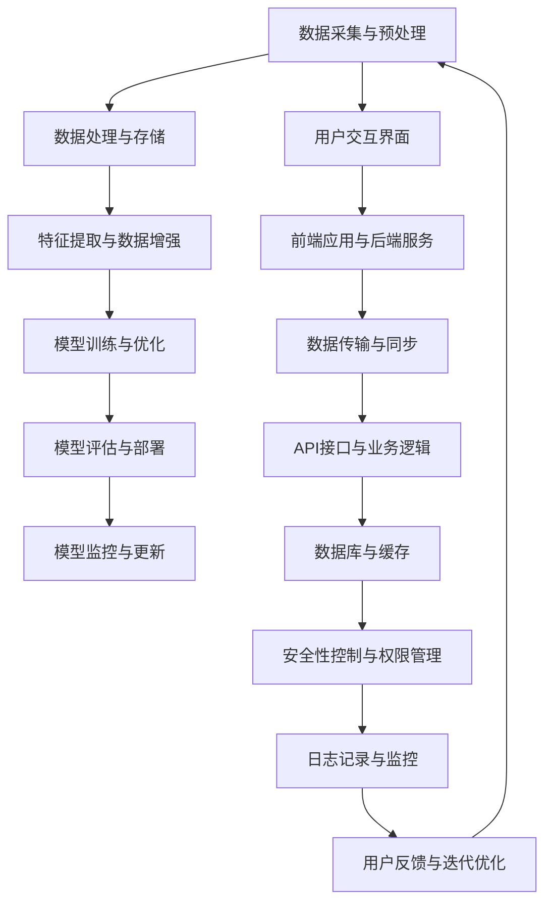
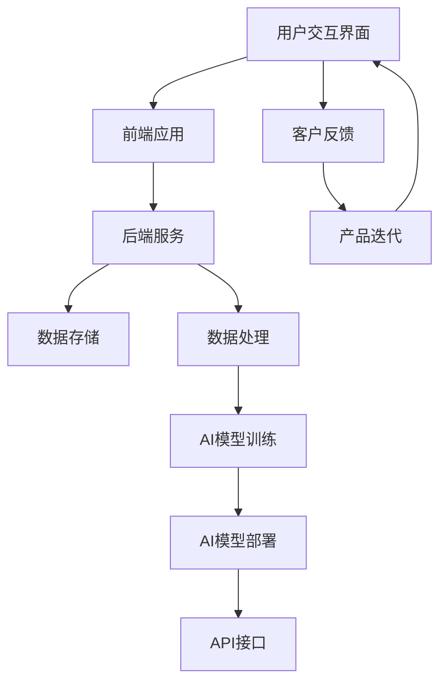

                 

### 第一部分：AI驱动的SaaS概述

在当前快速发展的技术背景下，AI与SaaS的结合已经成为企业数字化转型的关键推动力。本部分将首先探讨AI技术发展的背景，然后分析SaaS市场的现状与趋势，最后探讨AI在SaaS中的应用价值。

#### 1.1 AI技术发展概述

人工智能（AI）是指使计算机系统能够执行通常需要人类智能才能完成的任务的技术。AI技术的发展可以追溯到20世纪50年代，但真正的大规模发展始于21世纪初，特别是在机器学习和深度学习技术的突破。

- **机器学习**：机器学习是AI的一个分支，它通过算法从数据中学习，从而改进性能。最早期的机器学习方法是基于统计模型的，如线性回归、决策树等。随着计算能力的提升，机器学习算法得到了进一步的发展，尤其是基于神经网络的深度学习方法。
  
- **深度学习**：深度学习是一种基于多层神经网络的机器学习方法，它通过模拟人脑的神经网络结构来进行数据处理和模式识别。深度学习的代表性算法包括卷积神经网络（CNN）和循环神经网络（RNN）。

- **应用案例**：AI技术已经在各个领域得到广泛应用，如自动驾驶、智能客服、金融风控、医疗诊断等。

#### 1.2 SaaS市场现状与趋势

SaaS（Software as a Service）是一种基于云的软件交付模式，用户通过互联网访问软件服务，而无需在本地安装和运行软件。SaaS市场的快速增长主要得益于云计算和移动互联网的普及。

- **市场规模**：根据市场研究公司的数据，全球SaaS市场在过去几年中一直保持高速增长，预计未来几年还将继续增长。

- **市场趋势**：随着企业数字化转型的需求不断增加，SaaS市场正呈现出以下趋势：
  - **云计算的集成**：越来越多的SaaS应用开始集成到云平台中，提供更加灵活和可扩展的服务。
  - **跨行业应用**：SaaS不再局限于特定的行业，而是逐渐渗透到更多的领域，如教育、医疗、制造等。
  - **个性化服务**：SaaS应用开始更加注重用户体验，提供个性化服务，满足不同客户的需求。

#### 1.3 AI在SaaS中的应用价值

AI与SaaS的结合为SaaS产品带来了新的价值，主要体现在以下几个方面：

- **提升用户体验**：AI技术可以分析用户行为数据，提供个性化的服务，提高用户满意度。

- **增强产品功能**：AI技术可以增强SaaS产品的功能，如智能推荐、自动化决策等。

- **优化运营效率**：AI技术可以自动化处理大量数据，提高运营效率，降低成本。

- **创新商业模式**：AI技术可以为SaaS企业带来新的商业模式，如基于AI的订阅服务、增值服务等。

总的来说，AI驱动的SaaS具有巨大的市场潜力和发展前景。在接下来的章节中，我们将深入探讨AI驱动的SaaS关键技术，以及创业者在这一领域所面临的机遇和挑战。

#### 2.1 SaaS应用架构

SaaS应用架构是指构建和运行SaaS系统的整体框架，它包括前端应用、后端服务和数据存储等关键组件。理解SaaS应用架构有助于我们更好地设计、开发和维护AI驱动的SaaS产品。

- **前端应用**：前端应用是用户直接交互的部分，它通常包括用户界面（UI）和用户体验（UX）设计。前端应用需要提供直观、易用的界面，同时要保证响应速度和稳定性。

- **后端服务**：后端服务负责处理业务逻辑和数据存储，通常包括API接口、业务逻辑处理、数据存储和缓存等。后端服务的性能和可扩展性对于SaaS应用的稳定运行至关重要。

- **数据存储**：数据存储是SaaS应用的核心，它负责存储用户数据、业务数据和AI模型数据等。常见的数据库类型包括关系型数据库（如MySQL、PostgreSQL）和非关系型数据库（如MongoDB、Redis）。

#### 2.2 AI技术架构

AI技术架构是指实现AI功能的技术框架，它包括数据处理、模型训练、模型部署和模型管理等关键环节。

- **数据处理**：数据处理是AI技术的基础，它包括数据清洗、数据预处理和特征提取等步骤。高质量的数据是训练高效AI模型的前提。

- **模型训练**：模型训练是指利用大量的数据来训练AI模型，使其能够进行预测或分类等任务。常见的模型训练方法包括监督学习、无监督学习和强化学习。

- **模型部署**：模型部署是指将训练好的AI模型部署到生产环境中，使其能够对外提供服务。常见的模型部署方式包括本地部署、云端部署和边缘计算部署。

- **模型管理**：模型管理是指对AI模型进行监控、更新和维护，确保其性能和可靠性。模型管理包括模型评估、模型优化和模型替换等步骤。

#### 2.3 SaaS与AI结合的架构设计原则

将SaaS与AI技术结合起来，需要遵循以下架构设计原则：

- **数据一致性**：确保SaaS应用中的数据与AI模型训练数据的一致性，避免数据不一致导致模型性能下降。

- **模块化设计**：将SaaS应用和AI技术划分为独立的模块，便于开发和维护。例如，可以将数据预处理、模型训练和模型部署等模块分离。

- **高可用性**：确保SaaS应用和AI系统的高可用性，避免系统故障对业务造成影响。可以采用负载均衡、冗余部署和故障转移等技术手段。

- **可扩展性**：设计可扩展的架构，以应对不断增长的客户数据和业务需求。可以使用分布式系统、微服务架构和容器化技术来实现。

- **安全性**：确保数据安全和用户隐私，遵守相关法律法规和行业标准。可以使用数据加密、访问控制和网络安全等技术手段来保障系统安全。

通过遵循这些架构设计原则，可以构建一个高效、稳定和可靠的AI驱动的SaaS系统，为用户提供优质的服务。

### 第3章：数据分析与机器学习

在AI驱动的SaaS系统中，数据分析和机器学习是至关重要的核心技术。本章将详细介绍数据分析的基础、机器学习的基本原理以及在SaaS中的应用。

#### 3.1 数据分析基础

数据分析是指从大量数据中提取有价值的信息和知识的过程。数据分析的基础包括以下几个关键环节：

- **数据清洗**：数据清洗是指处理和整理原始数据，使其符合分析和建模的要求。数据清洗的主要任务包括去除重复数据、处理缺失值、纠正错误数据等。

- **数据预处理**：数据预处理是指对原始数据进行标准化、归一化和特征提取等操作，以提升数据质量和模型的性能。

- **数据可视化**：数据可视化是指利用图表、图形和动画等方式，将数据分析结果直观地呈现给用户。数据可视化有助于发现数据中的规律和趋势。

#### 3.2 机器学习原理

机器学习是一种通过算法从数据中学习，并自动改进性能的技术。机器学习的基本原理包括以下几个核心概念：

- **监督学习**：监督学习是指利用已标记的样本数据，通过训练模型来进行预测或分类。常见的监督学习算法包括线性回归、逻辑回归、支持向量机（SVM）和决策树等。

- **无监督学习**：无监督学习是指在没有标记样本数据的情况下，通过算法自动发现数据中的结构和模式。常见的无监督学习算法包括聚类算法（如K-Means）、降维算法（如PCA）和关联规则学习等。

- **强化学习**：强化学习是指通过与环境的交互，不断学习并优化策略，以实现最佳行为。常见的强化学习算法包括Q-Learning、SARSA和PPO等。

#### 3.3 机器学习在SaaS中的应用

机器学习在SaaS系统中有着广泛的应用，可以提高产品的智能化程度和用户体验。以下是机器学习在SaaS中的几个典型应用场景：

- **客户行为分析**：通过分析用户的行为数据，了解用户的偏好和需求，从而提供个性化的服务和推荐。例如，电子商务平台可以使用机器学习算法来分析用户的购物行为，实现个性化商品推荐。

- **需求预测**：通过分析历史数据，预测未来的需求趋势，帮助企业制定更加精准的营销策略和库存管理。例如，物流公司可以使用机器学习算法来预测未来的订单量，从而合理安排运输资源。

- **自动化决策**：通过机器学习算法，实现自动化决策和智能化管理。例如，金融领域的风控系统可以使用机器学习算法来识别潜在的风险客户，从而降低不良贷款率。

- **个性化推荐**：通过分析用户的历史数据和偏好，提供个性化的推荐服务。例如，在线视频平台可以使用机器学习算法来推荐用户可能感兴趣的视频内容。

总的来说，数据分析与机器学习是AI驱动的SaaS系统中的核心组件，通过有效的数据分析和机器学习算法，可以提升SaaS产品的智能化程度和用户体验，为企业创造更大的价值。

### 第4章：自然语言处理

自然语言处理（Natural Language Processing，NLP）是人工智能（AI）的一个重要分支，主要研究如何使计算机能够理解、生成和处理人类自然语言。NLP技术在SaaS产品中有着广泛的应用，能够提升产品的智能化和用户体验。本章将详细探讨自然语言处理的基础知识、文本分类与情感分析，以及语言生成与对话系统。

#### 4.1 自然语言处理基础

自然语言处理的基础涉及多个方面，包括语言模型、词嵌入和语言理解与生成等。

- **语言模型**：语言模型是一种概率模型，用于预测文本序列的下一个单词或字符。常见的语言模型有n元语法模型和神经网络模型。n元语法模型基于历史统计方法，通过分析文本中的前n个单词来预测下一个单词。神经网络模型则利用深度学习技术，通过训练大量的文本数据来学习语言模式。

- **词嵌入**：词嵌入（Word Embedding）是将单词映射到高维向量空间的技术，使得相似的单词在向量空间中接近。词嵌入能够帮助计算机更好地理解和处理自然语言。常见的词嵌入技术包括Word2Vec、GloVe和BERT等。Word2Vec是一种基于神经网络的词嵌入技术，通过训练大量文本数据来生成单词向量。GloVe（Global Vectors for Word Representation）是一种基于全局上下文信息的词嵌入方法，通过计算单词在文本中的全局共现矩阵来生成单词向量。BERT（Bidirectional Encoder Representations from Transformers）是一种基于Transformer模型的预训练语言表示模型，通过双向编码器学习文本的上下文信息。

- **语言理解与生成**：语言理解（Language Understanding）是指使计算机能够理解自然语言的含义和意图。常见的语言理解技术包括命名实体识别（Named Entity Recognition，NER）、关系抽取（Relation Extraction）和情感分析（Sentiment Analysis）等。语言生成（Language Generation）是指使计算机能够生成符合语法和语义规则的文本。常见的语言生成技术包括自动摘要（Automatic Summarization）、机器翻译（Machine Translation）和对话生成（Dialogue Generation）等。

#### 4.2 文本分类与情感分析

文本分类（Text Classification）是指将文本数据分为预定义的类别，如垃圾邮件检测、新闻分类等。情感分析（Sentiment Analysis）是指识别文本中的情感倾向，如正面、负面或中性。

- **文本分类算法**：文本分类算法主要包括基于规则的方法、基于统计的方法和基于机器学习的方法。基于规则的方法通过定义一系列规则来分类文本，如朴素贝叶斯分类器。基于统计的方法通过计算文本的特征值来分类，如支持向量机（SVM）。基于机器学习的方法通过训练分类模型来分类文本，如决策树、随机森林和深度学习模型。

- **情感分析模型**：情感分析模型通常基于机器学习算法，如朴素贝叶斯、支持向量机（SVM）、卷积神经网络（CNN）和循环神经网络（RNN）。情感分析模型可以用于分析社交媒体评论、产品评价等，以了解用户的情感倾向。

- **实际应用案例**：在电子商务领域，文本分类和情感分析可以用于分析用户评论，识别正面或负面的反馈，从而改进产品和服务。在社交媒体领域，情感分析可以用于监控社交媒体上的用户情绪，及时发现和应对负面舆论。

#### 4.3 语言生成与对话系统

语言生成（Language Generation）是指使计算机能够生成符合语法和语义规则的文本。对话系统（Dialogue System）是指使计算机能够与人类进行自然语言交互的系统。

- **语言生成模型**：语言生成模型主要包括基于规则的方法、基于统计的方法和基于机器学习的方法。基于规则的方法通过定义一系列语法规则来生成文本，如模板匹配。基于统计的方法通过计算文本的概率分布来生成文本，如n元语法模型。基于机器学习的方法通过训练大量的文本数据来生成文本，如序列到序列模型（Seq2Seq）和生成对抗网络（GAN）。

- **对话系统架构**：对话系统通常包括对话管理、语言理解和语言生成等模块。对话管理负责控制对话流程，语言理解负责解析用户输入，语言生成负责生成回复。常见的对话系统架构包括基于模板的对话系统、基于规则的知识图谱对话系统和基于机器学习的对话系统。

- **实际应用案例**：在智能客服领域，对话系统可以用于自动回答用户的问题，提供即时的客户服务。在智能助手领域，对话系统可以与用户进行自然语言交互，提供个性化的服务和建议。

总的来说，自然语言处理技术在SaaS产品中有着广泛的应用，通过文本分类、情感分析和语言生成等技术，可以提升产品的智能化程度和用户体验。

### 第5章：计算机视觉

计算机视觉（Computer Vision）是人工智能（AI）的一个重要分支，旨在使计算机具备通过摄像头和其他传感器捕获图像和视频，并进行处理和分析的能力。计算机视觉技术在SaaS系统中有着广泛的应用，可以用于图像分类、目标检测和动作识别等任务。本章将详细探讨计算机视觉的基础知识、图像分类与识别以及视频分析与动作识别。

#### 5.1 计算机视觉基础

计算机视觉的基础涉及图像处理、特征提取和目标检测等关键步骤。

- **图像处理**：图像处理是指对图像进行增强、滤波、分割和变换等操作，以提取有用的信息。常见的图像处理技术包括灰度化、二值化、边缘检测、模糊处理和图像变换等。

- **特征提取**：特征提取是指从图像中提取具有区分性的特征，以便进行后续的分析和处理。常见的特征提取方法包括颜色特征、纹理特征、形状特征和位置特征等。

- **目标检测**：目标检测是指识别图像中的特定目标或对象，并标注其位置。常见的目标检测算法包括基于滑动窗口的方法（如HOG、SVM）、基于深度学习的方法（如R-CNN、SSD、YOLO）和基于注意力机制的方法（如RetinaNet）。

#### 5.2 图像分类与识别

图像分类（Image Classification）和图像识别（Image Recognition）是计算机视觉中的重要任务，旨在将图像分为预定义的类别或识别图像中的特定对象。

- **图像分类算法**：图像分类算法主要包括基于规则的方法、基于统计的方法和基于机器学习的方法。基于规则的方法通过定义一系列规则来分类图像，如SVM。基于统计的方法通过计算图像的特征值来分类图像，如KNN。基于机器学习的方法通过训练分类模型来分类图像，如深度学习模型（如CNN）。

- **图像识别算法**：图像识别算法旨在识别图像中的特定对象。常见的图像识别算法包括基于模板匹配的方法（如最近邻算法）、基于深度学习的方法（如CNN）和基于特征匹配的方法（如卷积神经网络）。

- **实际应用案例**：在医疗领域，图像分类和识别可以用于辅助医生进行疾病诊断，如皮肤病变识别、肿瘤检测等。在安防领域，图像识别可以用于视频监控，如人脸识别、车辆识别等。

#### 5.3 视频分析与动作识别

视频分析（Video Analysis）和动作识别（Action Recognition）是计算机视觉中的重要应用，旨在从视频序列中提取有价值的信息。

- **视频分析**：视频分析是指对视频序列进行预处理、特征提取和目标检测等操作，以提取视频中的关键信息。常见的视频分析技术包括帧提取、特征提取和目标跟踪等。

- **动作识别算法**：动作识别算法旨在识别视频中的特定动作或行为。常见的动作识别算法包括基于规则的方法（如HMM、CRF）、基于统计的方法（如KNN、SVM）和基于深度学习的方法（如RNN、CNN）。

- **实际应用案例**：在运动监测领域，动作识别可以用于监控运动员的动作，提供运动分析建议。在智能制造领域，视频分析可以用于监控生产线，识别设备故障和不良品。在安防领域，视频分析可以用于监控公共区域，实时检测和报警异常行为。

总的来说，计算机视觉技术在SaaS产品中有着广泛的应用，通过图像分类、目标检测和动作识别等技术，可以提升产品的智能化程度和用户体验。随着深度学习技术的不断发展，计算机视觉技术将在未来得到更广泛的应用。

### 第6章：强化学习

强化学习（Reinforcement Learning，RL）是机器学习的一个重要分支，它通过智能体（agent）与环境的交互，学习达到某个目标或最优策略。强化学习在SaaS系统中有着广泛的应用，如个性化推荐系统、游戏化学习系统和客户行为预测等。本章将详细探讨强化学习的基础知识、强化学习在SaaS中的应用，以及强化学习算法。

#### 6.1 强化学习基础

强化学习的基础涉及强化学习的基本概念、奖励机制、策略和价值函数。

- **强化学习的基本概念**：强化学习由智能体、环境、状态、动作和奖励组成。智能体是执行动作的实体，环境是智能体所在的外部世界，状态是智能体的当前状态，动作是智能体在状态中执行的操作，奖励是环境对智能体动作的反馈。

- **奖励机制**：奖励机制是指环境根据智能体的动作给出奖励或惩罚。奖励用于鼓励智能体执行有益的动作，而惩罚用于阻止智能体执行有害的动作。奖励机制可以激励智能体学习最优策略。

- **策略**：策略是智能体在给定状态下选择动作的规则。智能体通过不断学习和调整策略，以最大化总奖励。

- **价值函数**：价值函数是指智能体在给定状态下执行动作的预期奖励。价值函数可以用于评估不同动作的优劣，帮助智能体选择最优动作。

#### 6.2 强化学习在SaaS中的应用

强化学习在SaaS系统中有着广泛的应用，可以提升产品的智能化程度和用户体验。

- **个性化推荐系统**：个性化推荐系统通过分析用户的历史行为数据，为用户推荐感兴趣的内容或商品。强化学习可以用于优化推荐策略，提高推荐效果。例如，可以使用强化学习算法来优化推荐系统中的用户-物品匹配策略，提高用户满意度。

- **游戏化学习系统**：游戏化学习系统通过引入游戏元素，激励用户进行学习。强化学习可以用于优化游戏化学习系统中的奖励机制，提高用户的学习积极性。例如，可以使用强化学习算法来调整游戏中的奖励分配策略，使玩家更加投入学习。

- **客户行为预测**：客户行为预测系统通过分析客户的历史行为数据，预测客户的未来行为。强化学习可以用于优化预测模型，提高预测精度。例如，可以使用强化学习算法来调整客户行为预测系统中的策略，提高预测的准确性，从而改善客户体验。

#### 6.3 强化学习算法

强化学习算法主要包括基于价值函数的算法和基于策略的算法。

- **基于价值函数的算法**：基于价值函数的算法通过学习状态值函数或动作值函数来选择最优动作。常见的基于价值函数的算法包括Q-Learning、SARSA和Deep Q-Network（DQN）。

  - **Q-Learning**：Q-Learning是一种基于值迭代的算法，通过不断更新Q值来学习最优策略。Q值表示在给定状态下执行特定动作的预期回报。
    ```python
    # Q-Learning伪代码
    for episode in range(1, num_episodes):
        state = environment.reset()
        done = False
        total_reward = 0
        while not done:
            action = policy.select_action(state)
            next_state, reward, done = environment.step(action)
            Q[single(state, action)] = Q[single(state, action)] + alpha * (reward + gamma * max(Q[next_state]) - Q[single(state, action)])
            state = next_state
            total_reward += reward
        print(f"Episode: {episode}, Total Reward: {total_reward}")
    ```

  - **SARSA**：SARSA（State-Action-Reward-State-Action）是一种基于策略迭代的算法，通过同时更新当前状态和下一状态的动作值来学习策略。
    ```python
    # SARSA伪代码
    for episode in range(1, num_episodes):
        state = environment.reset()
        done = False
        while not done:
            action = policy.select_action(state)
            next_state, reward, done = environment.step(action)
            next_action = policy.select_action(next_state)
            Q[state, action] = Q[state, action] + alpha * (reward + gamma * Q[next_state, next_action] - Q[state, action])
            state = next_state
            action = next_action
    ```

  - **DQN**：DQN（Deep Q-Network）是一种基于深度学习的Q-Learning算法，通过神经网络来近似Q值函数。DQN使用经验回放机制来减少样本偏差，提高学习效果。
    ```python
    # DQN伪代码
    for episode in range(1, num_episodes):
        state = environment.reset()
        done = False
        total_reward = 0
        while not done:
            action = policy.select_action(state)
            next_state, reward, done = environment.step(action)
            target_q = reward + gamma * max(Q_next[next_state])
            Q_target[state, action] = (1 - learning_rate) * Q_target[state, action] + learning_rate * target_q
            state = next_state
            total_reward += reward
        Q.update()
        print(f"Episode: {episode}, Total Reward: {total_reward}")
    ```

- **基于策略的算法**：基于策略的算法直接优化策略，以最大化总奖励。常见的基于策略的算法包括Policy Gradient、REINFORCE和Actor-Critic。

  - **Policy Gradient**：Policy Gradient是一种基于策略梯度的算法，通过更新策略梯度来优化策略。Policy Gradient算法使用梯度上升法来更新策略参数。
    ```python
    # Policy Gradient伪代码
    for episode in range(1, num_episodes):
        state = environment.reset()
        done = False
        total_reward = 0
        while not done:
            action = policy.select_action(state)
            next_state, reward, done = environment.step(action)
            log_prob = policy.log_prob(state, action)
            advantage = reward + gamma * max(Q_next[next_state]) - Q[state, action]
            policy_gradient = log_prob * advantage
            policy.update_params(policy_gradient)
            state = next_state
            total_reward += reward
        print(f"Episode: {episode}, Total Reward: {total_reward}")
    ```

  - **REINFORCE**：REINFORCE是一种基于策略梯度的算法，通过更新策略参数来最大化总奖励。REINFORCE算法使用蒙特卡洛估计来计算策略梯度。
    ```python
    # REINFORCE伪代码
    for episode in range(1, num_episodes):
        state = environment.reset()
        done = False
        total_reward = 0
        while not done:
            action = policy.select_action(state)
            next_state, reward, done = environment.step(action)
            total_reward += reward
            policy_gradient = reward
            policy.update_params(policy_gradient)
            state = next_state
        print(f"Episode: {episode}, Total Reward: {total_reward}")
    ```

  - **Actor-Critic**：Actor-Critic是一种基于策略梯度和价值函数的算法，通过同时更新策略和价值函数来优化策略。Actor-Critic算法使用值函数来提供稳定性，使用策略梯度来提供探索性。
    ```python
    # Actor-Critic伪代码
    for episode in range(1, num_episodes):
        state = environment.reset()
        done = False
        total_reward = 0
        while not done:
            action = actor.select_action(state)
            next_state, reward, done = environment.step(action)
            critic_value = critic.evaluate_value(next_state)
            actor_loss = policy_gradient(state, action, reward, critic_value)
            critic_loss = value_loss(next_state, reward, critic_value)
            actor.update_params(actor_loss)
            critic.update_params(critic_loss)
            state = next_state
            total_reward += reward
        print(f"Episode: {episode}, Total Reward: {total_reward}")
    ```

总的来说，强化学习在SaaS系统中有着广泛的应用，通过有效的强化学习算法，可以提升产品的智能化程度和用户体验。随着深度学习技术的不断发展，强化学习在SaaS系统中的应用将越来越广泛。

### 第7章：创业者视角下的AI与SaaS

在创业者视角下，AI与SaaS的结合为创业公司提供了巨大的机遇，但也带来了不少挑战。本章将探讨创业者面临的AI挑战、SaaS创业策略以及AI驱动的SaaS商业模型。

#### 7.1 创业者面临的AI挑战

创业者在开发AI驱动的SaaS产品时，会遇到以下几个挑战：

- **数据质量与隐私**：AI系统依赖于高质量的数据进行训练和预测。然而，数据质量往往难以保证，而且涉及用户隐私的数据使用需要遵守相关法律法规。

- **技术迭代与更新**：AI技术发展迅速，创业公司需要不断跟进新技术，以保持产品的竞争力。然而，技术迭代和更新需要投入大量时间和资源。

- **人才招聘与培养**：AI驱动的SaaS项目需要具备AI知识和SaaS开发经验的人才。然而，招聘和培养这类人才往往成本高昂，且市场竞争激烈。

#### 7.2 SaaS创业策略

创业者要成功开发AI驱动的SaaS产品，需要制定以下策略：

- **市场研究与定位**：在进入市场之前，创业者需要进行充分的市场研究，了解目标客户的需求和竞争对手的情况，从而确定产品的市场定位。

- **产品设计与开发**：创业者需要设计符合用户需求的产品，并采用敏捷开发方法快速迭代。同时，要确保产品在技术上具有竞争力，能够提供独特的价值。

- **营销与推广策略**：创业者需要制定有效的营销和推广策略，通过多种渠道（如社交媒体、广告、线下活动等）吸引用户。

#### 7.3 AI驱动的SaaS商业模型

AI驱动的SaaS商业模型主要包括以下几个方面：

- **收入来源与盈利模式**：AI驱动的SaaS产品可以通过订阅模式、增值服务、广告等方式获得收入。创业者需要选择适合自己产品的盈利模式，并确保盈利能力的可持续性。

- **客户价值与用户增长**：创业者需要通过提供高质量的服务和不断优化产品功能，提升客户价值，从而实现用户增长。同时，要关注用户留存率和转化率，确保业务持续发展。

- **业务拓展与市场占有率**：创业者可以通过拓展产品线、进入新市场等方式，扩大业务规模。同时，要关注市场占有率，以确保在激烈的市场竞争中保持领先地位。

总的来说，创业者要在AI驱动的SaaS领域取得成功，需要克服各种挑战，制定有效的创业策略，并建立可持续的商业模式。通过不断创新和优化，创业者可以打造出具有竞争力的AI驱动的SaaS产品。

### 第8章：AI驱动的SaaS项目启动与运营

创业者在成功开发AI驱动的SaaS产品后，需要面临项目启动与运营的挑战。本章将详细探讨项目启动流程、技术栈选择与开发，以及产品测试与迭代。

#### 8.1 项目启动流程

项目启动流程是确保项目顺利进行的关键。以下是项目启动的几个关键步骤：

- **项目规划与立项**：在项目启动前，创业者需要明确项目目标、范围和时间表。项目规划包括确定产品需求、技术架构、资源分配和风险评估等。

- **技术选型与团队搭建**：选择合适的技术栈对于项目的成功至关重要。创业者需要根据项目需求，选择适合的前端技术（如React、Vue.js）、后端技术（如Django、Spring Boot）和数据库（如MySQL、MongoDB）。同时，组建专业的开发团队，确保团队具备相应的技术能力和经验。

- **项目时间表与里程碑**：制定详细的项目时间表，并设置关键里程碑，以便于项目管理和监控。关键里程碑包括需求分析、原型设计、开发测试和产品发布等。

#### 8.2 技术栈选择与开发

技术栈选择与开发是AI驱动的SaaS项目成功的关键因素。以下是技术栈选择与开发的相关内容：

- **前端技术栈**：前端技术栈包括HTML、CSS和JavaScript。React、Vue.js和Angular等前端框架提供了丰富的组件和工具，有助于快速开发复杂的前端应用。

  - **React**：React是一个用于构建用户界面的JavaScript库，具有组件化、声明式和响应式的特点。
  - **Vue.js**：Vue.js是一个用于构建用户界面的渐进式JavaScript框架，具有简洁、灵活和高效的优点。
  - **Angular**：Angular是一个由Google维护的开源前端框架，具有强大的功能、丰富的工具和广泛的社区支持。

- **后端技术栈**：后端技术栈包括服务器端语言（如Python、Java、Node.js）和数据库（如MySQL、MongoDB、PostgreSQL）。Django、Spring Boot和Express等后端框架提供了丰富的功能和工具，有助于快速开发后端服务。

  - **Django**：Django是一个高生产力的Python Web框架，具有“ batteries-included”的特点，提供了许多内置功能，如用户认证、表单处理和缓存等。
  - **Spring Boot**：Spring Boot是一个基于Spring框架的快速开发工具，简化了配置和部署，使开发者能够快速构建独立的、生产级别的应用。
  - **Express**：Express是一个用于构建Web应用的Node.js框架，具有简洁、灵活和高效的特点。

- **数据处理与分析工具**：AI驱动的SaaS项目通常需要处理和分析大量数据。常用的数据处理与分析工具包括Pandas、NumPy和Scikit-learn等。

  - **Pandas**：Pandas是一个用于数据清洗、转换和分析的Python库，提供了强大的数据结构和工具。
  - **NumPy**：NumPy是一个用于数值计算的Python库，提供了高性能的数组操作和数据预处理功能。
  - **Scikit-learn**：Scikit-learn是一个用于机器学习和数据挖掘的Python库，提供了丰富的算法和工具。

- **AI模型训练与部署**：AI模型训练与部署是AI驱动的SaaS项目的核心。常用的深度学习框架包括TensorFlow、PyTorch和Keras等。

  - **TensorFlow**：TensorFlow是一个由Google开发的开源深度学习框架，具有强大的功能和广泛的社区支持。
  - **PyTorch**：PyTorch是一个由Facebook开发的深度学习框架，具有灵活、动态和易于调试的特点。
  - **Keras**：Keras是一个用于快速构建和训练深度学习模型的Python库，提供了简洁、易用的API。

#### 8.3 产品测试与迭代

产品测试与迭代是确保AI驱动的SaaS产品质量和用户体验的关键环节。以下是产品测试与迭代的相关内容：

- **自动化测试**：自动化测试通过编写测试脚本，自动化执行测试用例，提高测试效率和覆盖范围。常用的自动化测试工具包括Selenium、Jest和Cypress等。

  - **Selenium**：Selenium是一个用于Web应用的自动化测试工具，支持多种编程语言和浏览器。
  - **Jest**：Jest是一个用于JavaScript测试的库，具有简单、快速和强大的特点。
  - **Cypress**：Cypress是一个用于Web应用的自动化测试工具，具有用户体验友好的特点。

- **用户反馈收集**：用户反馈是产品改进的重要依据。创业者可以通过问卷调查、用户访谈和在线反馈等方式收集用户反馈，了解用户的真实需求和痛点。

- **产品功能迭代与优化**：根据用户反馈和市场需求，创业者需要不断优化产品功能，提升用户体验。产品迭代过程包括需求分析、设计、开发和测试等环节，确保新功能的稳定性和性能。

总的来说，AI驱动的SaaS项目启动与运营需要创业者具备良好的项目管理能力、技术选型和开发能力，以及持续改进和优化产品的能力。通过有效的项目管理和持续迭代，创业者可以成功打造具有竞争力的AI驱动的SaaS产品。

### 第9章：AI驱动的SaaS营销策略

在AI驱动的SaaS市场中，有效的营销策略对于吸引和留住用户至关重要。本章将详细探讨市场定位与产品定位、营销渠道选择，以及用户增长与留存策略。

#### 9.1 市场定位与产品定位

市场定位是营销策略的基础，它涉及确定目标客户、分析竞争对手以及明确产品在市场中的独特价值。以下是市场定位与产品定位的关键步骤：

- **目标客户分析**：创业者需要明确目标客户群体，包括他们的需求、行为习惯和购买动机。通过市场调研和用户访谈，创业者可以深入了解目标客户，从而更好地满足他们的需求。

- **竞品分析**：分析竞争对手的产品特点、市场策略和用户评价，有助于发现自身的竞争优势和差异化点。创业者可以通过SWOT分析（优势、劣势、机会、威胁）来评估自身产品在市场中的定位。

- **独特价值定位**：在明确目标客户和竞争对手后，创业者需要确定产品的独特价值定位，即产品如何满足客户需求，并在市场中脱颖而出。这可以通过产品功能、用户体验、性价比等角度来实现。

#### 9.2 营销渠道选择

选择合适的营销渠道对于提升品牌知名度、吸引新用户和增加销售额至关重要。以下是常见的营销渠道：

- **线上营销渠道**：线上营销渠道包括搜索引擎优化（SEO）、搜索引擎营销（SEM）、内容营销、社交媒体营销和电子邮件营销等。

  - **SEO**：通过优化网站内容、结构和外部链接，提高在搜索引擎中的排名，从而吸引免费流量。
  - **SEM**：通过付费广告（如Google Ads、Bing Ads）在搜索引擎中展示广告，吸引潜在客户。
  - **内容营销**：通过发布有价值的内容（如博客、白皮书、案例研究等），吸引并留住目标客户。
  - **社交媒体营销**：利用社交媒体平台（如Facebook、Twitter、LinkedIn等）进行品牌宣传、用户互动和内容推广。
  - **电子邮件营销**：通过定期发送电子邮件，向潜在和现有客户传达产品信息、促销活动和个性化内容。

- **线下营销渠道**：线下营销渠道包括广告、公关、活动营销和口碑营销等。

  - **广告**：在报纸、杂志、电视、户外等传统媒体上进行广告投放，提高品牌知名度。
  - **公关**：通过媒体发布新闻稿、邀请媒体报道、举办新闻发布会等方式，塑造良好的品牌形象。
  - **活动营销**：举办线上或线下的活动（如研讨会、发布会、用户见面会等），吸引潜在客户参与。
  - **口碑营销**：通过提供优质的产品和服务，让用户自发地传播品牌口碑，从而吸引新客户。

#### 9.3 用户增长与留存策略

用户增长和留存是SaaS企业的核心目标。以下是用户增长与留存策略的关键步骤：

- **用户获取策略**：通过线上和线下营销渠道，吸引潜在客户访问和使用产品。创业者需要根据产品特点和市场定位，选择适合的营销渠道，制定针对性的用户获取策略。

- **用户激活策略**：通过引导用户完成关键操作（如注册、登录、使用核心功能等），激活用户并增加他们的活跃度。创业者可以通过新手引导、任务激励、优惠券等方式，提高用户激活率。

- **用户留存策略**：通过持续提供优质的产品和服务，提高用户满意度和忠诚度。创业者可以通过以下措施来提高用户留存率：

  - **产品迭代**：定期更新产品功能，满足用户需求，提高用户满意度。
  - **用户互动**：通过社区、论坛、用户反馈等方式，与用户建立良好的互动关系，提高用户粘性。
  - **客户服务**：提供优质的客户服务，及时解决用户问题和反馈，增强用户信任和满意度。
  - **个性化推荐**：利用AI技术分析用户行为，提供个性化的内容和服务，提高用户留存率和活跃度。

- **用户转化策略**：通过优惠活动、促销策略、用户推荐等方式，引导用户进行付费转化。创业者需要根据用户行为和需求，制定针对性的转化策略，提高付费转化率。

总的来说，AI驱动的SaaS营销策略需要结合市场定位、产品定位和用户需求，选择合适的营销渠道，制定有效的用户增长与留存策略，从而实现企业的长期发展。

### 第10章：AI驱动的SaaS创业风险与应对

在AI驱动的SaaS创业过程中，风险是不可避免的一部分。这些风险可能来自技术、市场、运营等方面，创业者需要采取有效的风险管理策略来应对这些挑战。本章将探讨风险识别与评估、风险管理与应对，以及持续创新与适应市场变化。

#### 10.1 风险识别与评估

识别和评估风险是风险管理的第一步。以下是常见的风险类型及识别与评估方法：

- **技术风险**：包括AI模型不稳定、技术更新换代、数据处理问题等。

  - **识别方法**：通过分析项目需求、技术选型和团队技术能力，识别潜在的技术风险。
  - **评估方法**：使用定性分析（如专家评估、头脑风暴）和定量分析（如风险矩阵、风险评估模型）来评估技术风险的概率和影响。

- **市场风险**：包括市场需求波动、竞争加剧、客户流失等。

  - **识别方法**：通过市场调研、竞品分析和用户反馈，识别市场风险。
  - **评估方法**：使用市场趋势分析、竞争对手评估和用户行为分析来评估市场风险的概率和影响。

- **运营风险**：包括项目管理、团队协作、资源分配等问题。

  - **识别方法**：通过项目进度监控、团队沟通和资源管理，识别运营风险。
  - **评估方法**：使用项目管理工具（如Scrum、Kanban）和团队绩效评估来评估运营风险的概率和影响。

#### 10.2 风险管理与应对

有效的风险管理策略有助于降低风险对创业项目的影响。以下是几种常见的风险管理方法：

- **风险预防与控制**：通过制定风险管理计划和实施预防措施，降低风险发生的概率。

  - **预防措施**：包括技术储备、团队培训、合同审查等。
  - **控制措施**：包括项目进度监控、资源调配、风险预警系统等。

- **风险转移与分散**：通过保险、外包、合作等方式，将部分风险转移给第三方。

  - **保险**：为技术风险、市场风险和运营风险投保，降低潜在的财务损失。
  - **外包**：将部分开发或运营任务外包给专业团队，降低内部风险。
  - **合作**：与其他公司或机构合作，共同分担风险。

- **风险应急处理**：制定应急响应计划，确保在风险发生时能够迅速采取行动。

  - **应急计划**：包括应急响应流程、关键人员分工、应急预案演练等。
  - **应急演练**：定期进行应急演练，提高团队应对风险的能力。

#### 10.3 持续创新与适应市场变化

在快速变化的市场环境中，创业者需要持续创新和适应市场变化，以保持竞争力。以下是几个关键点：

- **技术创新**：不断跟进AI技术的发展趋势，利用新技术提升产品性能和用户体验。

  - **技术储备**：保持技术储备，及时引入新技术，保持技术领先优势。
  - **研发投入**：持续增加研发投入，确保技术团队具备创新能力和动力。

- **市场适应**：根据市场需求和竞争态势，灵活调整产品策略和营销策略。

  - **市场调研**：定期进行市场调研，了解客户需求和竞争对手动态。
  - **产品迭代**：根据市场反馈，快速迭代产品，满足客户需求。

- **组织管理**：构建灵活、高效的团队和组织结构，以适应快速变化的市场环境。

  - **团队建设**：培养团队成员的技能和创新能力，建立良好的团队氛围。
  - **流程优化**：优化项目管理流程和业务流程，提高运营效率。

总的来说，AI驱动的SaaS创业者在面对风险时，需要采取有效的风险管理策略，并保持持续创新和适应市场变化的能力。通过科学的风险管理，创业者可以降低风险对项目的影响，提高创业成功率。

### 第11章：AI驱动的SaaS成功案例解析

#### 11.1 案例一：企业案例分析

**企业名称**：Salesforce

**行业背景**：Salesforce是一家全球领先的客户关系管理（CRM）解决方案提供商，成立于1999年。随着AI技术的快速发展，Salesforce逐渐将AI技术整合到其CRM产品中，提供智能化的客户服务、销售和营销解决方案。

**技术应用**：Salesforce在其CRM平台中集成了多种AI技术，包括自然语言处理（NLP）、机器学习和计算机视觉。通过NLP技术，Salesforce的Einstein平台可以分析客户的电子邮件、聊天记录和社交媒体帖子，提供智能推荐和自动回复。通过机器学习，Salesforce可以预测客户的购买行为和需求，优化销售策略。计算机视觉技术则被用于人脸识别和图像分析，以提供个性化的客户服务。

**成功因素**：

- **技术创新**：Salesforce持续投入研发，不断创新，将AI技术应用到CRM产品的各个层面。
- **市场定位**：Salesforce精准定位客户需求，提供个性化的解决方案，满足不同规模企业的需求。
- **用户体验**：通过智能化和个性化的产品功能，Salesforce大幅提升了用户体验，提高了客户满意度。

**启示**：

- 创业公司应关注客户需求，提供个性化的解决方案。
- 技术创新是保持竞争力的关键，创业者应不断探索新技术和应用场景。
- 用户体验是成功的核心，创业者应致力于提升产品的易用性和智能化程度。

#### 11.2 案例二：行业案例分析

**企业名称**：NVIDIA

**行业背景**：NVIDIA是一家全球领先的图形处理单元（GPU）制造商，成立于1993年。随着AI和深度学习的兴起，NVIDIA逐渐将其GPU技术应用于AI计算和深度学习领域，成为AI计算的重要基础设施。

**技术应用**：NVIDIA的GPU芯片（如Tesla系列和A100系列）为深度学习和AI应用提供了强大的计算能力。通过CUDA和TensorRT等软件开发工具，NVIDIA帮助开发者快速构建和部署AI模型。此外，NVIDIA还开发了用于自动驾驶、机器人控制和智能监控的AI解决方案。

**成功因素**：

- **技术创新**：NVIDIA在GPU技术和AI计算领域持续投入研发，推动技术创新和产业发展。
- **市场领导力**：NVIDIA在GPU市场上占据领先地位，通过广泛的合作和生态系统建设，巩固了市场领导地位。
- **行业影响**：NVIDIA的AI解决方案在多个行业（如自动驾驶、医疗、金融等）中得到广泛应用，推动了行业变革。

**启示**：

- 创业者应关注行业趋势，抓住技术机遇，推动技术创新。
- 市场领导力对于创业公司的长期发展至关重要，创业者应积极拓展市场和建立生态系统。
- 行业应用是技术价值的体现，创业者应致力于解决行业痛点，创造实际价值。

#### 11.3 案例三：创业公司案例分析

**企业名称**：Clarifai

**行业背景**：Clarifai是一家专注于计算机视觉和AI应用的创业公司，成立于2014年。Clarifai提供图像识别、视频分析和自然语言处理等AI服务，被广泛应用于安防、零售和医疗等行业。

**技术应用**：Clarifai的核心技术是深度学习和计算机视觉。通过自研的神经网络模型，Clarifai可以实现高精度的图像识别和视频分析。此外，Clarifai还提供了API接口，方便开发者集成AI功能到自己的应用中。

**成功因素**：

- **技术创新**：Clarifai在计算机视觉和AI领域不断创新，开发了具有竞争力的产品。
- **合作伙伴**：Clarifai与多家行业领先企业建立了合作关系，共同推动AI技术的应用和产业发展。
- **用户体验**：通过提供简单易用的API和开发工具，Clarifai降低了AI应用的门槛，吸引了大量开发者。

**启示**：

- 创业公司应注重技术创新，保持技术领先优势。
- 合作伙伴关系对于创业公司的发展至关重要，创业者应积极拓展合作渠道。
- 提升用户体验是产品成功的基石，创业者应致力于提供简单易用的产品和服务。

总的来说，AI驱动的SaaS成功案例展示了技术创新、市场定位和用户体验在创业过程中的重要性。通过深入分析这些案例，创业者可以汲取经验，为自身的发展提供参考。

### 第12章：AI驱动的SaaS开发工具与资源

在开发AI驱动的SaaS系统中，选择合适的工具和资源至关重要。本章将介绍常用的深度学习框架、SaaS开发框架以及AI开源资源与数据库。

#### 12.1 常用深度学习框架

深度学习框架是构建和训练AI模型的重要工具。以下是几种常用的深度学习框架：

- **TensorFlow**：TensorFlow是由Google开发的开源深度学习框架，具有强大的功能和广泛的社区支持。它支持多种编程语言，如Python、C++和Java，并提供了丰富的API和工具。

  - **优点**：易于使用、功能强大、社区支持丰富。
  - **应用场景**：适合于大规模深度学习模型的开发和部署。

- **PyTorch**：PyTorch是由Facebook开发的开源深度学习框架，以其动态计算图和灵活的API而闻名。它提供了丰富的模块和工具，方便开发者快速构建和训练模型。

  - **优点**：易于理解、动态计算图、社区支持。
  - **应用场景**：适合于研究和原型开发，也常用于工业界的模型开发和部署。

- **Keras**：Keras是一个高层次的深度学习框架，它封装了TensorFlow和Theano，提供了简洁、易用的API。Keras的设计目标是使深度学习模型的开发生命周期更加高效。

  - **优点**：简单易用、高效、适用于快速原型开发。
  - **应用场景**：适合于快速开发和测试深度学习模型。

#### 12.2 SaaS开发框架

SaaS开发框架是构建和管理SaaS系统的核心工具。以下是几种常用的SaaS开发框架：

- **Django**：Django是一个高生产力的Python Web框架，它遵循MVC设计模式，提供了丰富的功能和工具。Django的设计目标是快速开发和部署Web应用。

  - **优点**：易于使用、灵活、适用于快速开发。
  - **应用场景**：适合于快速开发和部署SaaS应用，特别是在需要灵活扩展的场合。

- **Flask**：Flask是一个轻量级的Python Web框架，它提供了简单、易用的API。Flask的设计目标是提供最小的功能集，让开发者可以自由地扩展和定制。

  - **优点**：轻量级、简单、灵活。
  - **应用场景**：适合于小型和简单的SaaS应用开发。

- **Spring Boot**：Spring Boot是一个基于Spring框架的快速开发工具，它简化了配置和部署，使开发者能够快速构建独立的、生产级别的应用。

  - **优点**：功能丰富、易于集成、适用于企业级应用。
  - **应用场景**：适合于构建大型、复杂的企业级SaaS系统。

#### 12.3 AI开源资源与数据库

AI开源资源与数据库为开发者提供了丰富的数据集和工具，有助于快速构建和优化AI模型。以下是几个常用的AI开源资源与数据库：

- **TensorFlow Hub**：TensorFlow Hub是一个开放的平台，提供了丰富的预训练模型和工具。开发者可以通过TensorFlow Hub快速加载和利用这些预训练模型。

  - **优点**：提供了大量的预训练模型和工具，方便开发者进行模型迁移和优化。
  - **应用场景**：适合于快速部署和优化AI模型。

- **Hugging Face**：Hugging Face是一个开源的NLP工具库和资源库，它提供了丰富的预训练模型和工具，支持多种NLP任务。

  - **优点**：提供了丰富的NLP预训练模型和工具，易于使用。
  - **应用场景**：适合于NLP任务的研究和开发。

- **Kaggle**：Kaggle是一个数据科学竞赛平台，提供了大量的数据集和工具，供开发者进行数据分析和模型训练。

  - **优点**：提供了丰富的数据集和竞赛资源，有助于提高数据科学技能。
  - **应用场景**：适合于数据科学家和开发者进行数据分析和模型训练。

总的来说，选择合适的深度学习框架、SaaS开发框架和AI开源资源与数据库，对于构建高效的AI驱动的SaaS系统至关重要。开发者可以根据项目需求和特点，选择合适的工具和资源，提高开发效率和模型性能。

### 第13章：常见问题与解答

在开发AI驱动的SaaS系统过程中，开发者可能会遇到各种技术、创业和运营方面的问题。以下是一些常见问题及其解答，旨在帮助开发者解决实际问题。

#### 13.1 技术问题

**Q1：如何选择深度学习框架？**

选择深度学习框架时，需要考虑以下因素：

- **项目需求**：根据项目需求，选择适合的框架。例如，如果需要快速原型开发，可以选择Keras；如果需要高性能和灵活性，可以选择TensorFlow或PyTorch。
- **团队技能**：考虑团队对特定框架的熟悉程度。选择团队熟悉的框架，可以降低开发和维护的成本。
- **社区支持**：选择有广泛社区支持的框架，可以获得更多的学习资源和技术支持。

**Q2：如何处理大量数据？**

处理大量数据时，可以考虑以下方法：

- **数据预处理**：对数据进行清洗和预处理，减少数据量，提高数据处理效率。
- **分布式计算**：使用分布式计算框架（如Apache Spark）来处理大规模数据。
- **批量处理**：将数据处理任务分解为小批量，分批次处理，避免单机处理压力过大。

**Q3：如何优化模型性能？**

优化模型性能可以从以下几个方面入手：

- **超参数调优**：通过调整学习率、批量大小、正则化参数等超参数，优化模型性能。
- **数据增强**：增加数据多样性，提高模型泛化能力。
- **模型压缩**：使用模型压缩技术（如剪枝、量化等），减小模型大小，提高推理速度。

#### 13.2 创业问题

**Q4：如何评估AI项目的可行性？**

评估AI项目可行性时，需要考虑以下因素：

- **市场需求**：研究市场需求，分析目标客户的需求和痛点。
- **技术可行性**：评估所需技术的可行性，包括现有技术的成熟度和开发难度。
- **商业可行性**：评估项目的商业前景，包括盈利模式、成本结构和市场潜力。

**Q5：如何筹集创业资金？**

筹集创业资金的方法包括：

- **天使投资**：寻找有经验的投资者，提供项目商业计划和原型。
- **风险投资**：参加创业比赛，吸引风险投资机构的注意。
- **众筹**：通过在线众筹平台，向公众筹集资金。

**Q6：如何打造成功的SaaS产品？**

打造成功的SaaS产品需要以下步骤：

- **市场调研**：研究市场需求，了解目标客户。
- **产品设计**：设计符合用户需求的SaaS产品，注重用户体验。
- **团队建设**：组建专业的开发团队，确保产品质量。
- **持续迭代**：根据用户反馈和市场变化，持续优化产品。

#### 13.3 运营问题

**Q7：如何管理用户增长？**

管理用户增长的方法包括：

- **用户获取**：通过线上线下营销活动，吸引新用户。
- **用户留存**：提供优质的产品和服务，提高用户满意度和忠诚度。
- **用户转化**：通过优惠活动、促销策略等，引导用户进行付费转化。

**Q8：如何保持产品活跃度？**

保持产品活跃度的方法包括：

- **产品更新**：定期发布新功能和优化，保持产品的竞争力。
- **用户互动**：通过社区、论坛等渠道，与用户建立互动关系。
- **客户服务**：提供优质的客户服务，解决用户问题和反馈。

**Q9：如何提高客户满意度？**

提高客户满意度的方法包括：

- **用户体验**：优化产品界面和功能，提高用户操作的便捷性和效率。
- **响应速度**：及时响应用户反馈，解决用户问题。
- **个性化服务**：根据用户需求和偏好，提供个性化的服务和推荐。

#### 13.4 风险管理问题

**Q10：如何识别与评估风险？**

识别和评估风险的方法包括：

- **风险识别**：通过专家访谈、头脑风暴、历史数据分析等方法，识别潜在风险。
- **风险评估**：使用定性分析和定量分析（如风险矩阵、风险评估模型）来评估风险的概率和影响。

**Q11：如何制定风险管理策略？**

制定风险管理策略的方法包括：

- **风险预防**：通过风险评估，制定预防措施，降低风险发生的概率。
- **风险转移**：通过保险、外包等手段，将部分风险转移给第三方。
- **应急处理**：制定应急响应计划，确保在风险发生时能够迅速采取行动。

**Q12：如何处理突发事件与危机？**

处理突发事件与危机的方法包括：

- **紧急响应**：立即启动应急响应计划，采取紧急措施，控制事态发展。
- **沟通协调**：与内部团队和外部合作伙伴保持密切沟通，协调应对措施。
- **舆论引导**：通过媒体发布声明，引导舆论，减少负面影响。

总的来说，通过解决技术、创业和运营方面的问题，开发者可以更好地构建和运营AI驱动的SaaS系统，提高产品的竞争力，实现商业成功。

### 第14章：AI大模型技术架构Mermaid流程图

在本章中，我们将使用Mermaid流程图来展示AI大模型的技术架构，以便于读者更好地理解AI驱动的SaaS系统的构建和运行过程。



#### 说明：

- **A 数据采集与预处理**：从各种数据源（如数据库、文件系统、网络接口等）采集数据，并进行数据清洗、去重、补全等预处理操作。

- **B 数据处理与存储**：对预处理后的数据进行分析、处理和存储，确保数据的高效访问和管理。

- **C 特征提取与数据增强**：提取数据中的关键特征，并进行数据增强，以提高模型的泛化能力和准确性。

- **D 模型训练与优化**：使用训练数据集，通过神经网络等算法训练模型，并进行模型优化，以提高模型的性能。

- **E 模型评估与部署**：评估训练好的模型的性能，并根据评估结果调整模型参数，然后将模型部署到生产环境中。

- **F 模型监控与更新**：监控模型的运行状态和性能，定期更新模型，以保持模型的稳定性和准确性。

- **G 用户交互界面**：为用户提供一个直观、易用的交互界面，方便用户与系统进行交互。

- **H 前端应用与后端服务**：前端应用负责与用户交互，后端服务负责处理业务逻辑和数据存储。

- **I 数据传输与同步**：确保数据在各组件之间的高效传输和同步，以保持系统的一致性和可靠性。

- **J API接口与业务逻辑**：提供API接口供前端应用调用，实现业务逻辑的处理。

- **K 数据库与缓存**：使用数据库存储用户数据和业务数据，使用缓存提高数据访问速度。

- **L 安全性控制与权限管理**：确保系统的安全性，实施访问控制和权限管理，防止未授权访问和数据泄露。

- **M 日志记录与监控**：记录系统的运行日志，并进行实时监控，以便及时发现和解决问题。

- **N 用户反馈与迭代优化**：收集用户的反馈和需求，进行产品迭代和优化，以提升用户体验和系统性能。

通过Mermaid流程图，我们可以清晰地看到AI大模型技术架构的各个组件及其相互关系，有助于开发者更好地理解和构建AI驱动的SaaS系统。

### 第15章：数据分析与机器学习伪代码示例

在本章中，我们将提供一些数据分析与机器学习的伪代码示例，以便读者更好地理解相关算法的实现过程。

#### 15.1 数据预处理伪代码示例

```python
# 数据预处理伪代码
def preprocess_data(data):
    # 数据清洗
    cleaned_data = clean_data(data)
    
    # 数据标准化
    normalized_data = normalize_data(cleaned_data)
    
    # 特征提取
    features = extract_features(normalized_data)
    
    return features
```

#### 15.2 机器学习算法伪代码示例

##### 15.2.1 线性回归

```python
# 线性回归伪代码
def linear_regression(X, y):
    # 计算模型参数
    w = compute_weights(X, y)
    
    # 训练模型
    model = train_model(X, y, w)
    
    # 预测
    predictions = predict(model, X)
    
    return predictions
```

##### 15.2.2 决策树

```python
# 决策树伪代码
def decision_tree(X, y):
    # 构建决策树
    tree = build_tree(X, y)
    
    # 预测
    predictions = predict_tree(tree, X)
    
    return predictions
```

##### 15.2.3 卷积神经网络（CNN）

```python
# 卷积神经网络（CNN）伪代码
def conv_neural_network(X, y):
    # 构建CNN模型
    model = build_cnn_model()
    
    # 训练模型
    model = train_model(model, X, y)
    
    # 预测
    predictions = predict(model, X)
    
    return predictions
```

#### 15.3 伪代码说明

- **数据预处理伪代码**：首先对原始数据进行清洗，去除无效或错误的数据。然后对清洗后的数据进行标准化处理，使其符合模型的输入要求。最后提取数据中的关键特征，为模型训练做准备。

- **线性回归伪代码**：通过计算输入特征矩阵X和目标向量y之间的权重w，构建线性回归模型。然后使用训练数据集训练模型，并使用训练好的模型进行预测。

- **决策树伪代码**：构建决策树模型，通过递归划分数据集，为每个特征生成分割点，形成一棵树。最后使用训练好的决策树模型进行预测。

- **卷积神经网络（CNN）伪代码**：首先构建CNN模型，包括卷积层、池化层和全连接层。然后使用训练数据集训练模型，并使用训练好的模型进行预测。

这些伪代码示例提供了数据分析与机器学习算法的基本实现框架，开发者可以根据具体需求和数据集，进行相应的调整和优化。

### 第16章：自然语言处理数学模型与公式

自然语言处理（NLP）是人工智能（AI）的一个重要分支，涉及到大量的数学模型和公式。本章将介绍一些基本的数学模型和公式，以便读者更好地理解NLP的核心概念和应用。

#### 16.1 语言模型

语言模型是一种概率模型，用于预测文本序列的下一个单词或字符。以下是几种常见的语言模型公式：

- **n元语法模型**：

  $$ P(w_1, w_2, ..., w_n) = \frac{C(w_1, w_2, ..., w_n)}{C(w_1, w_2, ..., w_n, w_{n+1})} $$

  其中，$P(w_1, w_2, ..., w_n)$ 表示前n个单词的概率，$C(w_1, w_2, ..., w_n)$ 表示前n个单词的联合概率，$C(w_1, w_2, ..., w_n, w_{n+1})$ 表示前n+1个单词的联合概率。

- **神经网络语言模型**：

  $$ P(w_t|w_{t-1}, w_{t-2}, ..., w_1) = \sigma(W_1 \cdot w_{t-1} + W_2 \cdot w_{t-2} + ... + W_n \cdot w_1 + b) $$

  其中，$P(w_t|w_{t-1}, w_{t-2}, ..., w_1)$ 表示给定前t-1个单词，预测第t个单词的概率，$\sigma$ 表示sigmoid函数，$W_1, W_2, ..., W_n$ 分别表示权重矩阵，$b$ 表示偏置。

#### 16.2 词嵌入

词嵌入是将单词映射到高维向量空间的技术，使得相似的单词在向量空间中接近。以下是几种常见的词嵌入方法：

- **Word2Vec**：

  $$ \text{Word2Vec}(w) = \sum_{i=1}^{V} \alpha_i \cdot v_i $$

  其中，$w$ 表示单词，$V$ 表示词汇表大小，$\alpha_i$ 表示词频权重，$v_i$ 表示单词向量。

- **GloVe**：

  $$ \text{GloVe}(w) = \frac{e^{\frac{d \cdot f(w)}{1 + \sqrt{v \cdot f(w)}}}}{\sum_{i=1}^{V} e^{\frac{d \cdot f(w)}{1 + \sqrt{v \cdot f(w)}}}} $$

  其中，$w$ 表示单词，$d$ 表示嵌入维度，$f(w)$ 表示单词的词频，$v$ 表示单词向量的L2范数。

#### 16.3 语言理解与生成

语言理解与生成是NLP的两个关键任务。以下是相关的数学模型和公式：

- **命名实体识别（NER）**：

  $$ P(entity|word) = \sigma(W_1 \cdot word + b_1) $$

  其中，$P(entity|word)$ 表示在给定单词$word$的情况下，识别实体$entity$的概率，$W_1$ 表示权重矩阵，$b_1$ 表示偏置。

- **机器翻译（MT）**：

  $$ P(t|s) = \frac{e^{\frac{-d \cdot L(s, t)}{T}}}{\sum_{t'} e^{\frac{-d \cdot L(s, t')}{T}}} $$

  其中，$P(t|s)$ 表示在给定源语言句子$s$的情况下，翻译成目标语言句子$t$的概率，$L(s, t)$ 表示源语言句子$s$和目标语言句子$t$之间的损失函数，$T$ 表示温度参数。

- **对话生成（DG）**：

  $$ P(response|context) = \sigma(W_1 \cdot context + b_1) $$

  其中，$P(response|context)$ 表示在给定上下文$context$的情况下，生成回复$response$的概率，$W_1$ 表示权重矩阵，$b_1$ 表示偏置。

这些数学模型和公式是NLP技术的基础，通过它们，计算机能够理解和生成人类语言。在实际应用中，这些模型和公式需要通过大量的数据和计算来训练和优化，以达到预期的效果。

### 第17章：计算机视觉算法伪代码示例

在本章中，我们将提供一些计算机视觉算法的伪代码示例，以便读者更好地理解这些算法的实现过程。

#### 17.1 图像分类算法

以下是使用卷积神经网络（CNN）进行图像分类的伪代码示例：

```python
# CNN图像分类算法伪代码

# 初始化模型参数
model = initialize_model()

# 训练模型
for epoch in range(num_epochs):
    for image, label in training_data:
        # 前向传播
        predictions = model.forward(image)
        
        # 计算损失
        loss = compute_loss(predictions, label)
        
        # 反向传播
        model.backward(loss)
        
        # 更新模型参数
        model.update_parameters()

# 评估模型
accuracy = evaluate_model(model, test_data)

print(f"Test Accuracy: {accuracy}")
```

#### 17.2 目标检测算法

以下是使用区域建议网络（Region Proposal Network，RPN）进行目标检测的伪代码示例：

```python
# RPN目标检测算法伪代码

# 初始化模型参数
model = initialize_model()

# 训练模型
for epoch in range(num_epochs):
    for image, gt_boxes in training_data:
        # 前向传播
        proposals, objectness_scores = model.forward(image)
        
        # 计算损失
        loss = compute_loss(proposals, objectness_scores, gt_boxes)
        
        # 反向传播
        model.backward(loss)
        
        # 更新模型参数
        model.update_parameters()

# 评估模型
precision, recall = evaluate_model(model, test_data)

print(f"Precision: {precision}, Recall: {recall}")
```

#### 17.3 视频分析算法

以下是使用循环神经网络（RNN）进行视频分析的伪代码示例：

```python
# RNN视频分析算法伪代码

# 初始化模型参数
model = initialize_model()

# 训练模型
for epoch in range(num_epochs):
    for video, label in training_data:
        # 前向传播
        video_features = extract_video_features(video)
        predictions = model.forward(video_features)
        
        # 计算损失
        loss = compute_loss(predictions, label)
        
        # 反向传播
        model.backward(loss)
        
        # 更新模型参数
        model.update_parameters()

# 评估模型
accuracy = evaluate_model(model, test_data)

print(f"Test Accuracy: {accuracy}")
```

#### 17.4 伪代码说明

- **图像分类算法伪代码**：首先初始化CNN模型参数，然后使用训练数据集训练模型。在训练过程中，通过前向传播计算预测结果，计算损失函数，通过反向传播更新模型参数。最后评估模型在测试数据集上的准确率。

- **目标检测算法伪代码**：首先初始化RPN模型参数，然后使用训练数据集训练模型。在训练过程中，通过前向传播计算区域建议和目标检测分数，计算损失函数，通过反向传播更新模型参数。最后评估模型在测试数据集上的精度和召回率。

- **视频分析算法伪代码**：首先初始化RNN模型参数，然后使用训练数据集训练模型。在训练过程中，通过提取视频特征和前向传播计算预测结果，计算损失函数，通过反向传播更新模型参数。最后评估模型在测试数据集上的准确率。

这些伪代码示例提供了计算机视觉算法的基本实现框架，开发者可以根据具体需求和数据集，进行相应的调整和优化。

### 第18章：强化学习算法伪代码示例

在本章中，我们将提供一些强化学习（Reinforcement Learning，RL）算法的伪代码示例，以便读者更好地理解这些算法的实现过程。

#### 18.1 Q-Learning算法

以下是Q-Learning算法的伪代码示例：

```python
# Q-Learning算法伪代码

# 初始化Q值表
Q = initialize_q_table()

# 初始化环境
environment = initialize_environment()

# 训练模型
for episode in range(num_episodes):
    state = environment.reset()
    done = False
    total_reward = 0
    
    while not done:
        # 选择动作
        action = select_action(state, Q)
        
        # 执行动作
        next_state, reward, done = environment.step(action)
        
        # 更新Q值
        Q[state, action] = Q[state, action] + alpha * (reward + gamma * max(Q[next_state]) - Q[state, action])
        
        state = next_state
        total_reward += reward
        
    print(f"Episode: {episode}, Total Reward: {total_reward}")
```

#### 18.2 SARSA算法

以下是SARSA算法的伪代码示例：

```python
# SARSA算法伪代码

# 初始化Q值表
Q = initialize_q_table()

# 初始化环境
environment = initialize_environment()

# 训练模型
for episode in range(num_episodes):
    state = environment.reset()
    done = False
    total_reward = 0
    
    while not done:
        # 选择动作
        action = select_action(state, Q)
        
        # 执行动作
        next_state, reward, done = environment.step(action)
        
        # 更新Q值
        Q[state, action] = Q[state, action] + alpha * (reward + gamma * Q[next_state, select_action(next_state, Q)] - Q[state, action])
        
        state = next_state
        total_reward += reward
        
    print(f"Episode: {episode}, Total Reward: {total_reward}")
```

#### 18.3 actor-critic算法

以下是actor-critic算法的伪代码示例：

```python
# actor-critic算法伪代码

# 初始化策略参数和Q值表
policy = initialize_policy()
Q = initialize_q_table()

# 初始化环境
environment = initialize_environment()

# 训练模型
for episode in range(num_episodes):
    state = environment.reset()
    done = False
    total_reward = 0
    
    while not done:
        # 执行策略
        action = policy.select_action(state)
        
        # 执行动作
        next_state, reward, done = environment.step(action)
        
        # 更新Q值
        Q[state, action] = Q[state, action] + alpha * (reward + gamma * max(Q[next_state]) - Q[state, action])
        
        # 更新策略
        policy.update_params(Q, state, action, next_state, done)
        
        state = next_state
        total_reward += reward
        
    print(f"Episode: {episode}, Total Reward: {total_reward}")
```

#### 18.4 伪代码说明

- **Q-Learning算法伪代码**：该算法使用Q值表来记录当前状态下每个动作的预期奖励。在每一步，选择一个动作，执行动作后，更新Q值表。

- **SARSA算法伪代码**：与Q-Learning类似，但每次更新Q值时，使用的是当前状态和下一状态的动作值，而不是最大动作值。

- **actor-critic算法伪代码**：该算法结合了策略优化和价值评估，actor代表策略，critic代表Q值表。在每一步，首先执行策略，然后更新Q值表，最后根据Q值表更新策略。

这些伪代码示例提供了强化学习算法的基本实现框架，开发者可以根据具体需求和数据集，进行相应的调整和优化。

### 第19章：代码实现与解读实例

在本章中，我们将通过实际代码示例，详细解读AI驱动的SaaS系统中的关键组件，包括开发环境搭建、源代码实现以及代码解读与分析。

#### 19.1 开发环境搭建

为了构建AI驱动的SaaS系统，首先需要搭建一个合适的技术栈。以下是搭建开发环境的基本步骤：

- **Python环境配置**：安装Python（推荐版本3.8及以上），并配置Python环境。

  ```bash
  # 安装Python
  sudo apt-get install python3
  
  # 配置Python环境
  sudo ln -s /usr/bin/python3 /usr/bin/python
  ```

- **安装依赖项**：安装必要的依赖项，包括深度学习框架（如TensorFlow、PyTorch）、Web框架（如Django、Flask）和数据库（如MySQL、MongoDB）。

  ```bash
  # 安装pip
  sudo apt-get install python3-pip
  
  # 安装TensorFlow
  pip install tensorflow
  
  # 安装Django
  pip install django
  
  # 安装MongoDB
  sudo apt-get install mongodb
  ```

- **配置数据库**：启动MongoDB数据库服务，并创建数据库和集合。

  ```bash
  # 启动MongoDB服务
  sudo service mongodb start
  
  # 创建数据库和集合
  use mydatabase
  db.createCollection("mycollection")
  ```

#### 19.2 源代码实现

以下是一个简单的AI驱动的SaaS系统的源代码实现示例，包括数据预处理、模型训练、模型部署和API接口。

##### 19.2.1 数据预处理

```python
# 数据预处理
import pandas as pd
from sklearn.model_selection import train_test_split
from sklearn.preprocessing import StandardScaler

# 读取数据
data = pd.read_csv("data.csv")

# 分割数据
X = data.drop("target", axis=1)
y = data["target"]

# 划分训练集和测试集
X_train, X_test, y_train, y_test = train_test_split(X, y, test_size=0.2, random_state=42)

# 数据标准化
scaler = StandardScaler()
X_train_scaled = scaler.fit_transform(X_train)
X_test_scaled = scaler.transform(X_test)
```

##### 19.2.2 模型训练

```python
# 模型训练
import tensorflow as tf
from tensorflow.keras.models import Sequential
from tensorflow.keras.layers import Dense, Dropout

# 构建模型
model = Sequential()
model.add(Dense(64, input_shape=(X_train_scaled.shape[1],), activation='relu'))
model.add(Dropout(0.5))
model.add(Dense(32, activation='relu'))
model.add(Dropout(0.5))
model.add(Dense(1, activation='sigmoid'))

# 编译模型
model.compile(optimizer='adam', loss='binary_crossentropy', metrics=['accuracy'])

# 训练模型
model.fit(X_train_scaled, y_train, epochs=10, batch_size=32, validation_split=0.2)
```

##### 19.2.3 模型部署

```python
# 模型部署
import flask
from flask import Flask, request, jsonify

app = Flask(__name__)

# 加载模型
model.load_weights("model.h5")

@app.route('/predict', methods=['POST'])
def predict():
    data = request.get_json()
    input_data = pd.DataFrame([data['features']])
    input_data_scaled = scaler.transform(input_data)
    prediction = model.predict(input_data_scaled)
    return jsonify({'prediction': prediction[0][0]})

if __name__ == '__main__':
    app.run(debug=True)
```

#### 19.3 代码解读与分析

- **数据预处理**：首先读取数据，然后使用`train_test_split`函数划分训练集和测试集。接下来，使用`StandardScaler`进行数据标准化，以消除特征间的差异。

- **模型训练**：构建一个简单的序列模型，包括两个全连接层和两个dropout层。使用`compile`函数配置模型的优化器和损失函数。最后，使用`fit`函数训练模型。

- **模型部署**：使用Flask框架创建一个简单的API接口，接收POST请求，并将输入数据传递给模型进行预测。预测结果以JSON格式返回给客户端。

通过这个实例，我们展示了如何搭建AI驱动的SaaS系统的开发环境，实现数据预处理、模型训练和模型部署，并提供了详细的代码解读与分析。开发者可以根据具体需求，调整和优化这些代码，构建功能更强大的AI驱动的SaaS系统。

### 结语

在本文中，我们深入探讨了AI驱动的SaaS创业的各个方面，从概述到关键技术、创业实践、案例研究和工具资源，为创业者提供了全方位的指导。通过分析AI与SaaS结合的背景、应用价值、架构设计原则，以及数据分析和机器学习等核心技术，我们揭示了AI驱动的SaaS的独特优势和市场潜力。同时，我们通过实例和伪代码，展示了如何实现和部署AI驱动的SaaS系统。

#### 15.1 本书内容的回顾

本文主要内容包括：

1. **AI与SaaS的结合背景**：介绍了AI技术的发展历程和SaaS市场的现状与趋势。
2. **SaaS应用架构与AI**：探讨了SaaS应用架构和AI技术架构，以及结合的架构设计原则。
3. **AI驱动的SaaS关键技术**：详细介绍了数据分析与机器学习、自然语言处理、计算机视觉和强化学习等技术。
4. **AI驱动的SaaS创业实践**：从创业者视角探讨了AI驱动的SaaS创业策略、项目启动与运营、营销策略和风险管理。
5. **案例研究**：分析了AI驱动的SaaS成功案例，提供了宝贵的经验和启示。
6. **开发工具与资源**：介绍了常用的深度学习框架、SaaS开发框架和AI开源资源与数据库。

#### 15.2 AI驱动的SaaS创业关键要素

成功的AI驱动的SaaS创业需要以下几个关键要素：

1. **技术创新**：紧跟AI技术发展趋势，不断创新和优化产品功能，保持技术领先优势。
2. **市场定位**：深入研究市场需求，精准定位目标客户，提供有针对性的解决方案。
3. **用户体验**：注重用户体验，通过个性化推荐、自动化决策等功能，提升用户满意度。
4. **团队建设**：组建专业、稳定的团队，确保项目顺利推进和技术持续创新。
5. **商业模式**：建立可持续的商业模式，通过多样化的收入来源，实现盈利。
6. **风险管理**：制定有效的风险管理策略，预防和应对各种风险，确保项目稳定发展。

#### 15.3 对未来AI驱动的SaaS创业者的建议

对于未来的AI驱动的SaaS创业者，我们提出以下建议：

1. **保持技术敏感性**：不断学习和了解最新的AI技术和发展趋势，以保持产品的竞争力。
2. **关注市场趋势**：关注市场变化，及时调整产品策略，抓住市场机遇。
3. **注重用户体验**：持续优化产品功能，提供卓越的用户体验，提升用户满意度和忠诚度。
4. **不断创新与调整**：在市场竞争中，不断创新和调整，以适应不断变化的市场需求。
5. **建立稳定团队与合作关系**：组建专业、稳定的团队，并与行业合作伙伴建立紧密的合作关系，共同推动行业发展。
6. **持续创新与适应市场变化**：保持持续创新的能力，灵活应对市场变化，不断优化产品和商业模式。

通过遵循这些关键要素和策略，未来的AI驱动的SaaS创业者将能够在激烈的市场竞争中脱颖而出，实现企业的长期发展。

### 附录

在本附录中，我们将提供一些扩展的内容，包括AI驱动的SaaS未来发展趋势、技术架构图、数学模型与公式以及代码实现实例。

#### 20.1 AI驱动的SaaS未来发展趋势

随着AI技术的不断进步和SaaS市场的快速发展，AI驱动的SaaS未来发展趋势将呈现以下几个特点：

1. **更深入的融合**：AI与SaaS将更加紧密地融合，AI技术将不仅仅作为SaaS产品的辅助工具，而是成为产品的核心能力。
2. **智能化水平提升**：AI驱动的SaaS产品将具备更高的智能化水平，通过深度学习、自然语言处理等技术，提供更加智能化的服务。
3. **定制化服务增加**：随着数据积累和算法优化，AI驱动的SaaS产品将能够提供更加个性化的定制化服务。
4. **行业应用拓展**：AI驱动的SaaS将在更多行业得到应用，如医疗、金融、教育等，推动各行业的数字化转型。
5. **跨领域合作加强**：AI驱动的SaaS企业将与其他行业企业进行更多合作，共同探索AI在各个领域的应用。

#### 20.2 技术架构图

以下是一个简单的AI驱动的SaaS技术架构图：



#### 20.3 数学模型与公式

以下是AI驱动的SaaS中常用的数学模型和公式：

1. **线性回归**：
   $$ y = \beta_0 + \beta_1 \cdot x $$
2. **逻辑回归**：
   $$ P(y=1) = \sigma(\beta_0 + \beta_1 \cdot x) $$
3. **卷积神经网络（CNN）**：
   $$ \text{CNN}(\text{input}) = \sigma(\text{ReLU}(\text{weights} \cdot \text{input} + \text{bias})) $$
4. **循环神经网络（RNN）**：
   $$ \text{RNN}(x_t) = \sigma(W \cdot \text{RNN}(x_{t-1}) + U \cdot x_t + b) $$
5. **强化学习**：
   $$ Q(s, a) = r + \gamma \cdot \max_{a'} Q(s', a') $$
6. **自然语言处理（NLP）**：
   $$ \text{NLP}(w) = \sum_{i=1}^{V} \alpha_i \cdot v_i $$

#### 20.4 代码实现实例

以下是一个简单的基于TensorFlow的线性回归模型训练和预测的代码实现实例：

```python
import tensorflow as tf
import numpy as np

# 设置随机种子
tf.random.set_seed(42)

# 创建模拟数据集
X = np.random.rand(100, 1)
y = 2 * X + 1 + np.random.randn(100, 1)

# 创建线性回归模型
model = tf.keras.Sequential([
    tf.keras.layers.Dense(units=1, input_shape=(1,))
])

# 编译模型
model.compile(optimizer='sgd', loss='mean_squared_error')

# 训练模型
model.fit(X, y, epochs=100)

# 进行预测
print(model.predict([[0.5]]))
```

通过上述扩展内容，读者可以进一步了解AI驱动的SaaS的发展趋势、技术架构、数学模型以及代码实现，为构建自己的AI驱动的SaaS系统提供参考。

