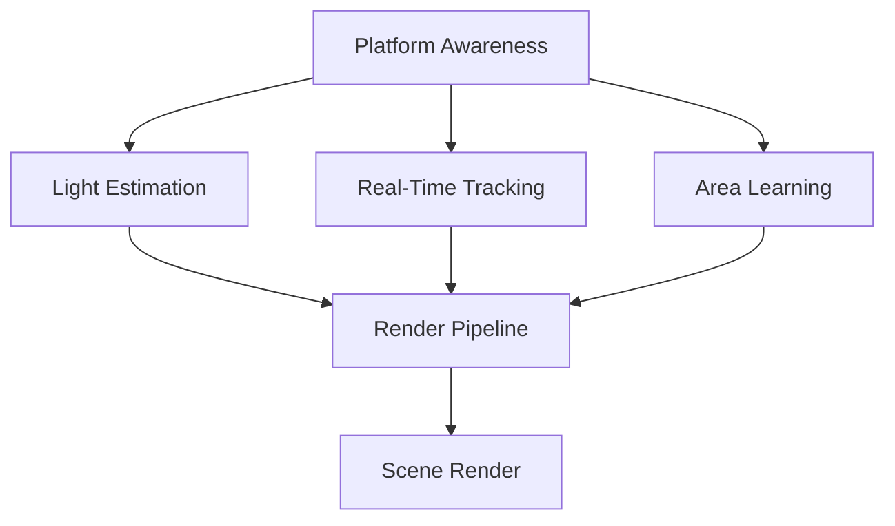

                 

# ARCore 开发工具包介绍：在 Android 平台上构建 AR 应用

## 摘要

本文将详细介绍ARCore，谷歌推出的增强现实（AR）开发工具包，并重点探讨在Android平台上如何使用ARCore构建AR应用。首先，我们将对ARCore进行概述，包括其技术简介、核心组件以及与苹果ARKit的对比分析。接着，我们将引导读者搭建ARCore开发环境，涵盖Android开发基础、ARCore SDK的安装与配置，以及调试与测试环境的准备。在核心功能部分，我们将深入解析平台感知、光线追踪、实时追踪和扩展识别等基础功能，并通过伪代码和数学公式详细阐述其原理。进阶功能部分，我们将介绍环境地图、光线估计和实时渲染等高级技术。随后，通过项目实战案例，我们将展示如何创建一个简单的AR应用、一个AR购物应用以及一个AR增强现实游戏。最后，我们将探讨ARCore的性能优化策略、开发最佳实践以及ARCore生态和未来发展。本文旨在为开发者提供全面、深入的ARCore开发指南。

## 目录大纲

- ARCore 开发工具包介绍：在 Android 平台上构建 AR 应用
  - 关键词：ARCore、Android、增强现实、开发工具包、平台感知、光线追踪、实时追踪、扩展识别、环境地图、光线估计、实时渲染、项目实战、性能优化、最佳实践
  - 摘要
  - 第1章：ARCore概述
    - 1.1 ARCore技术简介
    - 1.2 ARCore的核心组件
    - 1.3 ARCore与ARKit对比分析
  - 第2章：ARCore开发环境搭建
    - 2.1 Android开发基础
    - 2.2 ARCore SDK安装与配置
    - 2.3 调试与测试环境
  - 第3章：ARCore基础功能
    - 3.1 平台感知
    - 3.2 光线追踪
    - 3.3 实时追踪
    - 3.4 扩展识别
  - 第4章：ARCore进阶功能
    - 4.1 环境地图
    - 4.2 光线估计
    - 4.3 实时渲染
  - 第5章：ARCore项目实战
    - 5.1 项目实战概述
    - 5.2 实战一：简单的AR应用
    - 5.3 实战二：增强现实游戏
    - 5.4 实战三：AR购物应用
  - 第6章：ARCore性能优化
    - 6.1 性能优化策略
    - 6.2 帧率监控与调试
    - 6.3 系统资源管理
  - 第7章：ARCore开发最佳实践
    - 7.1 用户界面设计
    - 7.2 用户体验优化
    - 7.3 硬件适配与兼容性
  - 第8章：ARCore生态与未来展望
    - 8.1 ARCore生态概述
    - 8.2 ARCore发展趋势
    - 8.3 ARCore与其他AR技术的融合
  - 附录：ARCore开发资源
    - 附录 A：ARCore官方文档
    - 附录 B：ARCore开源项目
    - 附录 C：ARCore学习资源

## 第1章：ARCore概述

### 1.1 ARCore技术简介

增强现实（AR）技术通过在现实世界场景中叠加数字信息，为用户提供了丰富的互动体验。ARCore是谷歌开发的增强现实开发工具包，旨在帮助开发者在Android设备上轻松构建高质量的AR应用。ARCore通过利用设备上的摄像头、传感器和计算机视觉技术，实现了对现实世界的感知、追踪和渲染。

ARCore的关键作用在于：
1. **平台感知**：利用设备传感器获取位置和方向信息。
2. **光线追踪**：模拟环境光线，提高渲染效果的真实感。
3. **实时追踪**：精确追踪物体和场景，提供稳定、流畅的AR体验。
4. **扩展识别**：识别和标记用户添加的虚拟物体。

### 1.2 ARCore的核心组件

ARCore的核心组件是构建AR应用的核心技术，它们共同协作，为开发者提供了强大的AR开发平台。

#### 平台感知（Platform Awareness）

平台感知是ARCore的基础组件，它通过利用设备传感器如加速度计、陀螺仪和磁力计来获取设备的位置和方向信息。这些信息使得应用能够确定设备的朝向，从而实现虚拟物体与真实世界的对齐。

#### 光线追踪（Light Estimation）

光线追踪组件通过分析环境光线，为虚拟物体提供真实的光照效果。它利用相机图像来估计场景中的光线强度和方向，使得虚拟物体在现实世界中看起来更加逼真。

#### 实时追踪（Real-Time Tracking）

实时追踪组件负责识别和追踪平面和标记，为AR应用提供了稳定的对齐基础。它利用深度学习算法和计算机视觉技术，能够在复杂环境中快速、准确地定位虚拟物体。

#### 扩展识别（Area Learning）

扩展识别组件允许开发者创建可识别的平面区域，这些区域可以作为虚拟物体的放置基础。Area Learning通过在预定义的区域内记录和识别标记，提高了AR应用的准确性和灵活性。

### 1.3 ARCore与ARKit对比分析

ARCore和苹果的ARKit是两大主流的AR开发工具包，它们各有特点。

#### 相同点

1. **基础功能**：两者都提供了平台感知、光线追踪、实时追踪和扩展识别等基本功能。
2. **平台支持**：ARCore和ARKit都支持iOS和Android平台，为开发者提供了广泛的部署选择。

#### 不同点

1. **开发者社区**：由于苹果的iOS系统在市场上占据较大份额，ARKit拥有更成熟的开发者社区和资源。
2. **开发体验**：ARCore在Android开发者中更受欢迎，因为Android设备的多样性使得ARCore的适配工作更为复杂，但也提供了更多定制化机会。
3. **技术深度**：ARKit在AR技术深度和性能优化方面领先，特别是在光线追踪和实时渲染方面有显著优势。

开发者在选择AR开发工具包时，应考虑项目的具体需求、目标用户群体以及开发资源。

## 第2章：ARCore开发环境搭建

### 2.1 Android开发基础

在开始ARCore的开发之前，确保你已经具备基本的Android开发知识。以下是搭建Android开发环境的步骤：

#### 安装Android Studio

1. 访问[Android Studio官网](https://developer.android.com/studio)下载最新版本的Android Studio。
2. 运行安装程序并按照提示完成安装。

#### 安装Java Development Kit (JDK)

Android Studio依赖于Java开发环境，因此你需要安装JDK。

1. 访问[Oracle官网](https://www.oracle.com/java/technologies/javase-jdk11-downloads.html)下载适用于你的操作系统的JDK。
2. 解压下载的JDK文件到指定目录，并在环境变量中配置`JAVA_HOME`和`PATH`。

#### 安装Android SDK

Android SDK是Android开发的核心组件，包括Android平台和工具。

1. 在Android Studio中打开“SDK Manager”（通过菜单栏的“Tools” -> “SDK Manager”）。
2. 安装所需的平台和工具，包括Android SDK Platform-tools、Android SDK Build-tools等。

### 2.2 ARCore SDK安装与配置

完成Android开发基础后，下一步是安装和配置ARCore SDK。

#### 下载ARCore SDK

1. 访问[ARCore官网](https://developer.google.com/arcore/overview)。
2. 下载适用于你Android SDK版本的ARCore SDK。

#### 配置ARCore SDK

1. 将下载的ARCore SDK解压到指定目录。
2. 打开Android Studio，创建一个新项目或打开现有项目。
3. 在项目的`app/build.gradle`文件中添加ARCore依赖：

   ```groovy
   dependencies {
       implementation 'com.google.ar:arcore-client:1.0.0'
   }
   ```

4. 确保项目中的`build.gradle`文件引用了正确的ARCore SDK路径。

### 2.3 调试与测试环境

开发过程中，调试和测试环境至关重要。

#### 安装调试工具

1. 在Android Studio中安装“Android Debug Bridge (ADB)”。
2. 通过菜单栏的“Tools” -> “Android” -> “SDK Tools” -> “ADB”启动ADB。

#### 准备测试设备

1. 连接Android设备到计算机，确保设备已开启开发者选项。
2. 在设备上安装Android Debug Bridge。

#### 调试与测试

1. 使用Android Studio的调试功能，设置断点、监视变量等。
2. 在测试设备上运行应用，观察效果并记录问题。

通过以上步骤，你可以成功搭建ARCore开发环境，为后续的AR应用开发打下坚实的基础。

### 第3章：ARCore基础功能

ARCore提供了多个基础功能，使开发者能够构建出丰富、互动的增强现实体验。这些功能包括平台感知、光线追踪、实时追踪和扩展识别。在本节中，我们将详细解析这些功能，并通过伪代码和数学公式展示其工作原理。

#### 3.1 平台感知

平台感知是ARCore的核心功能之一，它利用设备的传感器来获取位置和方向信息，使虚拟物体能够与真实世界对齐。

##### 原理

平台感知通过加速度计、陀螺仪和磁力计等传感器获取设备的运动信息。它使用传感器融合算法，如卡尔曼滤波器，将不同传感器的数据融合成一个稳定、准确的位置和方向估计。

##### 伪代码

```pseudo
function getDeviceOrientation() {
    accelerometerData = readAccelerometer()
    gyroData = readGyro()
    magnetometerData = readMagnetometer()
    
    orientation = sensorFusion(accelerometerData, gyroData, magnetometerData)
    return orientation
}
```

##### 数学模型

平台感知中的传感器融合可以使用以下数学模型来表示：

$$
\textbf{Q}_k = \textbf{A}_k \textbf{Q}_{k-1} \textbf{A}_k^T + \textbf{K}_k (\textbf{H}_k \textbf{Q}_{k-1} \textbf{H}_k^T - \textbf{1}_k)
$$

其中，$\textbf{Q}_k$ 是状态估计误差协方差矩阵，$\textbf{A}_k$ 是过程模型矩阵，$\textbf{K}_k$ 是卡尔曼增益矩阵，$\textbf{H}_k$ 是观测模型矩阵，$\textbf{1}_k$ 是观测向量。

#### 3.2 光线追踪

光线追踪功能模拟环境光线，为虚拟物体提供真实的光照效果，增强视觉真实感。

##### 原理

光线追踪通过分析环境光图像，估计场景中的光线强度和方向。它使用图像处理技术，如卷积神经网络（CNN），来从相机图像中提取光线信息。

##### 伪代码

```pseudo
function estimateLighting(cameraImage) {
    lightData = CNNprocessing(cameraImage)
    lighting = calculateLighting(lightData)
    return lighting
}
```

##### 数学模型

光线追踪中的光照计算可以使用以下数学公式表示：

$$
\textbf{L} = \textbf{I}_d \odot (\textbf{R} \textbf{L}_e)
$$

其中，$\textbf{L}$ 是光照向量，$\textbf{I}_d$ 是入射光向量，$\textbf{R}$ 是物体表面法线向量，$\textbf{L}_e$ 是环境光向量。

#### 3.3 实时追踪

实时追踪功能负责识别和追踪平面和标记，为虚拟物体提供稳定的放置基础。

##### 原理

实时追踪使用深度学习算法和计算机视觉技术，从相机流中检测和识别平面和标记。它通过训练模型，如卷积神经网络（CNN），提高识别的准确性和速度。

##### 伪代码

```pseudo
function trackPlanes(cameraStream) {
    planeData = CNNprocessing(cameraStream)
    planes = detectPlanes(planeData)
    return planes
}
```

##### 数学模型

实时追踪中的平面检测可以使用以下数学模型表示：

$$
\textbf{P} = \text{argmin} \sum_{i=1}^{n} (\textbf{p}_i - \textbf{P})^T (\textbf{p}_i - \textbf{P})
$$

其中，$\textbf{P}$ 是平面参数，$\textbf{p}_i$ 是平面上点的坐标。

#### 3.4 扩展识别

扩展识别功能允许开发者创建可识别的平面区域，这些区域可以作为虚拟物体的放置基础。

##### 原理

扩展识别通过在预定义的区域内记录和识别标记，提高了AR应用的准确性和灵活性。它使用区域学习算法，如条件随机字段（CRF），来训练模型识别特定区域。

##### 伪代码

```pseudo
function learnArea(area) {
    areaData = collectAreaData(area)
    model = trainCRFModel(areaData)
    return model
}
```

##### 数学模型

扩展识别中的区域学习可以使用以下数学模型表示：

$$
\text{Energy}(u, v) = \sum_{i=1}^{n} w_i \cdot \delta(u_i, v_i)
$$

其中，$u$ 和 $v$ 是区域中的标记，$w_i$ 是权重，$\delta$ 是狄拉克δ函数。

通过理解这些基础功能的工作原理，开发者可以更好地利用ARCore构建高质量的AR应用。

### 第4章：ARCore进阶功能

ARCore不仅提供了基础功能，还包含一系列进阶功能，这些功能进一步提升了AR应用的性能和用户体验。本节将介绍ARCore的进阶功能，包括环境地图、光线估计和实时渲染。

#### 4.1 环境地图

环境地图是ARCore的一个重要功能，它允许开发者创建一个静态的环境模型，以优化实时追踪和渲染性能。

##### 原理

环境地图通过在场景中捕获大量点云数据，创建一个三维模型。开发者可以使用这个模型来预计算场景中的光照和阴影，从而减少运行时的计算开销。

##### 实现步骤

1. **数据采集**：使用ARCore的SLAM（同步定位与映射）技术，捕获场景中的点云数据。
2. **地图创建**：将采集到的点云数据转换为环境地图。
3. **地图存储**：将环境地图存储在设备或云服务器上，以便后续使用。

##### 伪代码

```pseudo
function createEnvironmentMap(points) {
    pointCloud = generatePointCloud(points)
    map = createMap(pointCloud)
    storeMap(map)
    return map
}
```

##### 数学模型

环境地图的构建可以使用以下数学模型表示：

$$
\textbf{M}_{ijk} = \text{normalization} \left( \frac{\textbf{P}_i - \textbf{C}}{||\textbf{P}_i - \textbf{C}||} \right)
$$

其中，$\textbf{M}_{ijk}$ 是地图中的三维点，$\textbf{P}_i$ 是点云中的点，$\textbf{C}$ 是摄像机中心点。

#### 4.2 光线估计

光线估计是ARCore的另一个重要功能，它通过分析环境光线，为虚拟物体提供更真实的光照效果。

##### 原理

光线估计通过使用相机图像和预定义的光照模型，计算场景中的光线强度和方向。它可以减少对实时光照计算的依赖，提高渲染性能。

##### 实现步骤

1. **图像预处理**：对相机图像进行预处理，提取关键特征。
2. **光照计算**：使用预定义的光照模型，计算场景中的光线强度和方向。
3. **光照应用**：将计算出的光照效果应用到虚拟物体上。

##### 伪代码

```pseudo
function estimateLighting(cameraImage, scene) {
    preprocessedImage = preprocessImage(cameraImage)
    lighting = calculateLighting(preprocessedImage, scene)
    applyLighting(lighting, scene)
}
```

##### 数学模型

光线估计的计算可以使用以下数学模型表示：

$$
L(\textbf{P}) = I_d(\textbf{P}) \odot (\textbf{N} \cdot \textbf{L}_e)
$$

其中，$L(\textbf{P})$ 是点 $\textbf{P}$ 的光照强度，$I_d(\textbf{P})$ 是入射光向量，$\textbf{N}$ 是物体表面法线向量，$\textbf{L}_e$ 是环境光向量。

#### 4.3 实时渲染

实时渲染是ARCore的核心功能之一，它负责将虚拟物体渲染到真实世界中，为用户提供逼真的增强现实体验。

##### 原理

实时渲染使用图形处理单元（GPU）的高效计算能力，实时生成和渲染虚拟物体的三维图像。它通过顶点着色器、片元着色器等图形渲染技术，实现复杂的渲染效果。

##### 实现步骤

1. **模型加载**：将虚拟物体的三维模型加载到GPU中。
2. **顶点处理**：使用顶点着色器处理模型的顶点数据。
3. **光照计算**：在片元着色器中计算光照效果。
4. **渲染输出**：将渲染结果输出到屏幕上。

##### 伪代码

```pseudo
function renderScene(scene) {
    loadModel(scene.model)
    vertexShader = compileVertexShader(scene.vertexShader)
    fragmentShader = compileFragmentShader(scene.fragmentShader)
    lighting = calculateLighting(scene)
    renderModel(vertexShader, fragmentShader, lighting, scene.model)
}
```

##### 数学模型

实时渲染中的光照计算可以使用以下数学模型表示：

$$
\text{fragmentColor} = \text{lightingColor} \cdot (\text{materialColor} + \text{ambientColor})
$$

其中，$\text{fragmentColor}$ 是渲染输出的颜色，$\text{lightingColor}$ 是光照效果，$\text{materialColor}$ 是物体的材质颜色，$\text{ambientColor}$ 是环境光照。

通过了解这些进阶功能，开发者可以进一步提升AR应用的质量和性能，为用户带来更出色的增强现实体验。

### 第5章：ARCore项目实战

在掌握了ARCore的基础和进阶功能之后，让我们通过实际项目来巩固所学知识。本节将介绍三个ARCore项目实战，包括一个简单的AR应用、一个AR购物应用和一个AR增强现实游戏。通过这些实战案例，我们将详细讲解项目的开发流程、功能实现和性能优化。

#### 5.1 项目实战概述

在开始项目实战之前，我们先概述一下每个项目的目标、开发流程和主要功能。

- **简单的AR应用**：目标是通过ARCore在移动设备上展示一个简单的3D模型，并在现实世界中对其进行交互。开发流程包括项目创建、模型加载、位置追踪和用户交互。
- **AR购物应用**：目标是为用户提供一个通过ARCore浏览和购买商品的体验。开发流程包括用户界面设计、商品数据管理、AR渲染和购物流程实现。
- **AR增强现实游戏**：目标是通过ARCore构建一个基于现实场景的AR游戏，提供丰富的游戏体验。开发流程包括游戏设计、角色动画、物理模拟和用户交互。

#### 5.2 实战一：简单的AR应用

**项目目标**：在移动设备上展示一个简单的3D模型，用户可以对其进行旋转、缩放和拖动等交互。

**开发流程**：

1. **项目创建**：
   - 使用Android Studio创建一个新的ARCore项目。
   - 配置项目的ARCore依赖。

2. **模型加载**：
   - 使用3D建模软件（如Blender或Maya）创建一个简单的3D模型。
   - 将模型导出为`.glb`或`.gltf`格式，并存储在项目的资源目录中。

3. **位置追踪**：
   - 使用ARCore的实时追踪功能，找到并锁定一个平面作为3D模型的放置基础。
   - 将3D模型放置在锁定的平面上，并保持其与平面垂直。

4. **用户交互**：
   - 实现用户交互，允许用户通过触摸屏对3D模型进行旋转、缩放和拖动。
   - 使用ARCore提供的API处理用户的输入事件。

**代码实现**：

以下是关键代码的实现示例：

```java
// 加载3D模型
Model model = ModelLoader.loadModel(context, "model.glb");

// 实时追踪平面
Plane plane = TrackingUtils.findHorizontalPlane();

// 将模型放置在平面上
Transform modelTransform = new Transform(plane.center, plane.normal, 0f, 0f, 0f, 0f);

// 实现用户交互
frameTime = 0f;
while (running) {
    drawFrame(frameTime);
    frameTime += TimeUtils.nanoTime() - lastDrawTime;

    // 处理触摸事件
    MotionEvent event = queue.poll();
    if (event != null) {
        switch (event.getAction()) {
            case MotionEvent.ACTION_MOVE:
                // 更新模型位置
                modelTransform.setTranslation(new Vector3(event.getX(), -event.getY(), 0f));
                break;
            case MotionEvent.ACTION_POINTER_UP:
                // 更新模型缩放
                float scale = getScaleFactor(event);
                modelTransform.setScale(scale);
                break;
        }
    }
}
```

**性能优化**：

1. **减少渲染次数**：在用户交互频繁的场景中，减少渲染次数可以提高性能。
2. **使用离屏渲染**：使用离屏渲染可以减少GPU的负载，提高渲染效率。

#### 5.3 实战二：AR购物应用

**项目目标**：通过ARCore为用户提供一个可以在现实场景中浏览和购买商品的体验。

**开发流程**：

1. **用户界面设计**：
   - 设计简洁、直观的用户界面，包括商品列表、购物车和支付选项。

2. **商品数据管理**：
   - 使用数据库或云服务存储商品信息，包括商品名称、价格和图片。

3. **AR渲染**：
   - 使用ARCore渲染商品图像，并允许用户将其放置在现实场景中。

4. **购物流程实现**：
   - 实现添加商品到购物车、结算和支付等功能。

**代码实现**：

以下是关键代码的实现示例：

```java
// 加载商品列表
List<Product> products = database.getProducts();

// 显示商品列表
for (Product product : products) {
    ImageTarget target = new ImageTarget(product.imageUrl);
    target.setAnchor(new Anchor(product.name, product.price));
    scene.addImageTarget(target);
}

// 添加商品到购物车
void addToCart(Product product) {
    cart.addProduct(product);
    updateCartUI();
}

// 结算支付
void checkout() {
    // 调用支付服务，处理支付流程
    paymentService.processPayment(cart.getTotal());
    clearCart();
}
```

**性能优化**：

1. **异步加载商品数据**：在后台线程中加载商品数据，避免主线程阻塞。
2. **优化数据库查询**：使用索引和缓存技术优化数据库查询性能。

#### 5.4 实战三：AR增强现实游戏

**项目目标**：构建一个基于现实场景的AR游戏，提供丰富的游戏体验。

**开发流程**：

1. **游戏设计**：
   - 设计游戏规则、角色、场景和关卡。

2. **角色动画**：
   - 使用3D建模软件创建游戏角色和场景，并为其添加动画。

3. **物理模拟**：
   - 使用物理引擎实现游戏角色的碰撞检测和运动模拟。

4. **用户交互**：
   - 实现用户输入处理，允许用户控制游戏角色的动作。

**代码实现**：

以下是关键代码的实现示例：

```java
// 加载游戏角色
Model playerModel = ModelLoader.loadModel(context, "player.glb");

// 创建物理引擎
PhysicsEngine physicsEngine = new PhysicsEngine();

// 控制角色移动
void movePlayer(float dx, float dy) {
    Vector3 direction = new Vector3(dx, -dy, 0f);
    float speed = 10f;
    float deltaTime = TimeUtils.nanoTime() - lastUpdateTime;
    playerTransform.add(direction.mul(speed * deltaTime));
    lastUpdateTime = TimeUtils.nanoTime();
}

// 处理用户输入
void handleInput(MotionEvent event) {
    switch (event.getAction()) {
        case MotionEvent.ACTION_MOVE:
            // 更新角色位置
            movePlayer(event.getX(), event.getY());
            break;
    }
}
```

**性能优化**：

1. **优化物理引擎性能**：使用高效的物理模拟算法，减少计算开销。
2. **异步加载场景资源**：在后台线程中加载游戏场景资源，提高用户体验。

通过以上实战案例，开发者可以深入理解ARCore的开发流程和实现细节，进一步提升自己的AR应用开发能力。

### 第6章：ARCore性能优化

在构建高性能的AR应用时，性能优化是一个至关重要的环节。ARCore提供了多种优化策略，可以帮助开发者提高应用的帧率、降低延迟，并确保在多种设备上流畅运行。本节将详细讨论ARCore性能优化的策略、帧率监控与调试方法，以及系统资源管理技巧。

#### 6.1 性能优化策略

1. **减少渲染次数**：频繁的渲染会占用大量CPU和GPU资源。优化策略之一是减少不必要的渲染次数。例如，当虚拟物体不在用户视野中时，可以将其从渲染列表中移除。

2. **优化渲染顺序**：优化渲染顺序可以显著提高性能。例如，先渲染背景，再渲染前景物体，可以减少重叠和遮挡情况。

3. **使用离屏渲染**：离屏渲染可以将渲染过程从主线程中分离出来，减少主线程的负载。ARCore支持离屏渲染，开发者可以在需要时使用。

4. **减少异步操作**：在ARCore应用中，异步操作（如网络请求、文件读写等）可能会阻塞主线程，导致帧率下降。优化策略是尽可能减少异步操作，或将它们移动到后台线程。

5. **优化纹理和模型**：使用低分辨率的纹理和简化模型可以减少GPU的渲染负担。通过合理选择纹理大小和模型复杂度，可以提高性能。

6. **优化光照计算**：光照计算是AR应用中的一个性能瓶颈。开发者可以使用预计算光照技术（如环境光照和光线追踪）来减少实时光照计算的负担。

#### 6.2 帧率监控与调试

1. **使用帧率监控工具**：ARCore提供了帧率监控工具，可以帮助开发者实时监控应用的帧率。开发者可以在日志中查看帧率数据，并分析性能瓶颈。

2. **调试工具**：Android Studio提供了多种调试工具，如CPU监控、GPU监控和内存监控。通过这些工具，开发者可以深入了解应用的性能问题，并针对性地优化。

3. **日志分析**：ARCore应用生成详细的日志文件，包含帧率、渲染时间、CPU和GPU使用情况等信息。通过分析日志文件，开发者可以定位性能瓶颈并采取相应措施。

#### 6.3 系统资源管理

1. **管理内存**：内存管理是ARCore性能优化的重要方面。开发者应避免内存泄露和过多的内存分配。使用内存缓存和对象池可以减少内存开销。

2. **管理CPU和GPU资源**：合理分配CPU和GPU资源可以提高性能。开发者可以使用多线程技术，将计算任务分布在多个线程上，减少单线程的负载。此外，优化GPU着色器代码，减少不必要的计算和资源占用。

3. **优化网络请求**：网络请求可能会阻塞主线程，导致帧率下降。优化策略是减少网络请求次数，或将其移动到后台线程。使用缓存技术可以减少对实时网络数据的依赖。

4. **设备适配**：不同设备的性能和硬件配置差异较大。开发者应确保应用在不同设备上都能流畅运行。可以使用设备检测和适配技术，为不同设备提供适当的性能优化方案。

通过以上性能优化策略和技巧，开发者可以构建出高性能、高流畅度的ARCore应用，为用户提供卓越的增强现实体验。

### 第7章：ARCore开发最佳实践

在ARCore开发过程中，最佳实践是确保应用质量、性能和用户体验的关键。本节将介绍ARCore开发过程中的用户界面设计、用户体验优化和硬件适配与兼容性策略。

#### 7.1 用户界面设计

1. **简洁直观**：用户界面应简洁直观，减少用户的认知负担。使用大按钮、清晰的文字和图标，确保用户能够快速理解和使用应用功能。

2. **响应式设计**：用户界面应适应不同屏幕尺寸和分辨率。使用自适应布局和响应式组件，确保界面在不同设备上保持一致性和美观性。

3. **动画与过渡**：合理的动画和过渡效果可以提升用户体验。例如，使用淡入淡出、滑动和缩放动画，使界面操作更加流畅自然。

4. **反馈机制**：提供实时反馈，让用户了解应用的当前状态和操作结果。例如，使用加载指示器、成功和错误提示，增强用户的操作信心。

#### 7.2 用户体验优化

1. **快速加载**：优化应用启动速度和加载速度，减少用户等待时间。例如，使用预先加载技术，提前加载常用资源和数据。

2. **流畅操作**：确保用户交互操作流畅无延迟。优化触摸事件处理和动画效果，减少卡顿和延迟现象。

3. **适应用户习惯**：根据用户的行为习惯和偏好，调整界面布局和交互逻辑。例如，支持手势操作、智能推荐功能等。

4. **个性化定制**：提供个性化定制选项，让用户可以根据自己的需求和喜好自定义界面和功能。例如，主题选择、设置调整等。

#### 7.3 硬件适配与兼容性

1. **设备检测**：在应用中检测用户设备的硬件配置和性能，为不同设备提供适当的优化策略。例如，根据设备性能调整渲染质量和纹理大小。

2. **性能优化**：为低性能设备提供性能优化方案，确保应用在低性能设备上也能流畅运行。例如，使用简化模型、减少渲染次数等。

3. **兼容性测试**：在不同设备上测试应用的兼容性，确保应用在各种硬件和操作系统上都能正常运行。例如，使用模拟器测试、真机测试等。

4. **多平台支持**：为不同平台（如Android和iOS）提供统一的应用体验。确保在不同平台上应用的功能、性能和用户体验保持一致。

通过遵循这些最佳实践，开发者可以构建高质量、高性能的ARCore应用，为用户提供卓越的增强现实体验。

### 第8章：ARCore生态与未来展望

ARCore不仅是谷歌推出的一款强大AR开发工具包，更是整个AR生态系统中不可或缺的一部分。在这一节中，我们将探讨ARCore的生态概述、发展趋势以及与其他AR技术的融合。

#### 8.1 ARCore生态概述

ARCore的生态系统包括了一系列的第三方库、工具和社区资源，这些资源为开发者提供了丰富的支持和便利。

1. **第三方库与工具**：ARCore生态系统中有许多第三方库和工具，例如ARCore Extensions、ARFoundation等，它们提供了额外的功能，如人脸识别、图像处理等。这些库和工具帮助开发者扩展ARCore的功能，提高开发效率。

2. **社区支持**：ARCore拥有一个活跃的开发者社区，包括官方论坛、技术博客、开源项目等。开发者可以通过社区获取帮助、分享经验、交流技术，快速解决开发中的问题。

3. **教育资源**：谷歌提供了大量的ARCore教育资源，包括在线课程、教程、实践指南等，这些资源适合不同层次的开发者，从初学者到专业开发者都能找到适合自己的学习材料。

#### 8.2 ARCore发展趋势

ARCore正处于快速发展阶段，未来将会有更多的技术突破和应用场景。以下是一些值得期待的发展趋势：

1. **性能提升**：随着硬件性能的不断提升，ARCore将继续优化和提升性能，提供更高效的渲染和追踪功能。

2. **硬件扩展**：ARCore将支持更多的设备，包括智能手机、平板电脑、头戴设备等，为开发者提供更广泛的应用平台。

3. **行业应用**：ARCore将在各个行业得到广泛应用，如医疗、教育、娱乐、制造业等，通过AR技术提升行业效率和用户体验。

4. **多平台融合**：ARCore将继续与其他AR技术（如ARKit、Vuforia等）进行融合，为开发者提供跨平台的AR开发解决方案。

#### 8.3 ARCore与其他AR技术的融合

ARCore与其他AR技术的融合将推动AR技术的发展和普及。以下是一些融合方向：

1. **技术整合**：通过整合ARCore和ARKit等不同AR技术的优势，开发者可以构建更强大、更丰富的AR应用。

2. **跨平台开发**：通过融合不同AR技术，开发者可以实现一个应用同时在多个平台（如Android、iOS、Windows等）上运行，提高开发效率和覆盖面。

3. **创新应用场景**：融合不同AR技术的特性，可以开拓新的应用场景，如虚拟试穿、空间导航、远程协作等，为用户提供前所未有的AR体验。

ARCore不仅是开发者构建高质量AR应用的利器，也是整个AR生态系统中的重要组成部分。随着技术的不断进步和应用场景的拓展，ARCore将继续引领AR技术的发展潮流，为开发者提供更广阔的发展空间。

### 附录：ARCore开发资源

在ARCore的开发过程中，开发者可以利用多种资源来提高开发效率和学习效果。以下是一些推荐的ARCore开发资源，包括官方文档、开源项目、学习资源和社区支持。

#### 附录 A：ARCore官方文档

- **官方文档链接**：[ARCore开发者文档](https://developers.google.com/ar/core/)
- **内容概览**：ARCore官方文档涵盖了ARCore的核心功能、开发指南、API参考、最佳实践和常见问题解答。开发者可以通过官方文档了解ARCore的最新功能和使用方法。

#### 附录 B：ARCore开源项目

- **推荐的开源项目**：在GitHub上，有许多高质量的ARCore开源项目，如[ARCore Samples](https://github.com/google-ar/ARCore-Samples)和[ARCore Extensions](https://github.com/google-ar/ARCore-Extensions)。
- **项目特点**：这些开源项目提供了丰富的示例代码和实际应用，帮助开发者学习和实践ARCore功能。开发者可以通过这些项目了解ARCore的实际应用场景和开发技巧。

#### 附录 C：ARCore学习资源

- **推荐的学习书籍**： 
  - 《ARCore编程实战》
  - 《Android增强现实开发从入门到精通》
- **在线课程与教程链接**： 
  - [Udacity的ARCore课程](https://www.udacity.com/course/android-ar-core--ud905)
  - [Pluralsight的ARCore教程](https://www.pluralsight.com/courses/android-arcore-getting-started)
- **资源特点**：这些书籍和在线课程为不同层次的开发者提供了全面的学习路径。无论是初学者还是专业人士，都可以在这些资源中找到适合自己的学习内容。

#### 附录 D：ARCore社区支持

- **加入ARCore开发者社区**：开发者可以加入[Google Developers Community](https://developers.google.com/community/)，参与ARCore相关的讨论和交流。
- **寻求技术支持与交流**：在官方论坛、Stack Overflow和GitHub等平台上，开发者可以寻求技术支持，解决开发中的问题，与其他开发者交流经验。
- **参加ARCore相关会议和活动**：谷歌和其他组织定期举办ARCore相关的会议和活动，开发者可以参加这些活动，了解最新技术动态，拓展人脉资源。

通过利用这些ARCore开发资源，开发者可以更加高效地学习和开发，为用户提供卓越的增强现实体验。

### 第9章：核心概念与联系

为了更好地理解ARCore的核心概念和工作原理，我们将通过一个流程图和伪代码详细展示ARCore的架构和核心算法。这些核心概念和联系对于开发者来说至关重要，它们是构建高质量AR应用的基础。

#### 9.1 ARCore核心概念流程图

以下是一个简化的ARCore核心组件流程图，使用Mermaid语法绘制：



该流程图展示了ARCore的核心组件及其相互关系。平台感知（A）提供了设备的位置和方向信息，这些信息随后被用于光线追踪（B）、实时追踪（C）和扩展识别（D）模块。这些模块共同协作，将虚拟物体渲染到真实世界中（F），并通过渲染管线（E）处理渲染过程。

#### 9.2 ARCore核心算法原理

为了更深入地理解ARCore的核心算法，我们将使用伪代码和数学公式详细解释一些关键算法。

##### 9.2.1 运动追踪算法

以下是ARCore运动追踪算法的伪代码：

```pseudo
function trackMotion(sensorData) {
    orientation = getDeviceOrientation(sensorData)
    position = integrateMotion(orientation, prevPosition)
    prevPosition = position
    return position
}

function integrateMotion(orientation, prevPosition) {
    position = prevPosition
    acceleration = sensorData.acceleration
    deltaTime = TimeUtils.deltaTime()
    position += acceleration * deltaTime
    return position
}
```

运动追踪算法的核心是获取设备的方向和加速度信息，并使用积分方法计算设备的位移。这个算法利用了传感器融合技术，通过多次迭代逐步优化位置和方向估计。

##### 9.2.2 光线追踪算法

光线追踪算法的伪代码如下：

```pseudo
function trackLighting(cameraImage) {
    lightData = processImage(cameraImage)
    lighting = calculateLighting(lightData)
    return lighting
}

function calculateLighting(lightData) {
    ambientLight = ambientLightValue()
    directLight = calculateDirectLight(lightData)
    lighting = ambientLight + directLight
    return lighting
}

function calculateDirectLight(lightData) {
    lightVector = normalize(lightData.lightDirection)
    surfaceNormal = normalize(surface.normal)
    directLight = dotProduct(lightVector, surfaceNormal)
    return directLight
}
```

光线追踪算法通过分析相机图像中的光线信息，计算场景中的光照效果。该算法使用环境光照和直接光照的计算公式，为虚拟物体提供真实的光照效果。

##### 9.2.3 数学模型与公式

以下是ARCore核心算法中使用的数学模型和公式：

- **传感器融合公式**：

  $$
  \textbf{Q}_k = \textbf{A}_k \textbf{Q}_{k-1} \textbf{A}_k^T + \textbf{K}_k (\textbf{H}_k \textbf{Q}_{k-1} \textbf{H}_k^T - \textbf{1}_k)
  $$

- **光照计算公式**：

  $$
  \text{fragmentColor} = \text{lightingColor} \cdot (\text{materialColor} + \text{ambientColor})
  $$

- **光线追踪公式**：

  $$
  L(\textbf{P}) = I_d(\textbf{P}) \odot (\textbf{N} \cdot \textbf{L}_e)
  $$

这些数学公式和算法是实现ARCore核心功能的基础，通过它们，开发者可以深入理解ARCore的工作原理，从而更好地利用ARCore构建高质量的AR应用。

### 第10章：项目实战

在前面的章节中，我们介绍了ARCore的基础知识、核心功能、进阶技术和性能优化策略。现在，让我们通过一系列实际项目来巩固所学知识，并通过具体案例展示如何使用ARCore开发增强现实应用。

#### 10.1 实战一：构建一个简单的AR应用

**项目目标**：创建一个简单的AR应用，展示一个3D模型并在现实世界中对其进行旋转和缩放。

**开发步骤**：

1. **环境搭建**：
   - 安装Android Studio和ARCore SDK。
   - 创建一个新的Android项目，并配置ARCore依赖。

2. **模型准备**：
   - 使用3D建模软件（如Blender或Maya）创建一个简单的3D模型。
   - 将模型导出为`.glb`或`.gltf`格式，并添加到项目的资源目录中。

3. **代码实现**：
   - 在`MainActivity`中实现ARCore的基础功能。
   - 使用ARCore的`Session`类创建一个ARSession。
   - 使用`Frame`类处理相机帧数据。
   - 将3D模型添加到场景中，并绑定触摸事件。

4. **测试与优化**：
   - 在Android设备上测试应用，确保3D模型正确显示并响应用户操作。
   - 优化渲染性能，确保应用在低性能设备上也能流畅运行。

**代码示例**：

以下是关键代码的实现示例：

```java
// 初始化ARCore Session
Session session = new Session(this);
session.configureSession(Session.SessionMode-immersiveMode(), Sceneform.buildContext(this));
session.setDisplayPermissionRequestEnabled(true);

// 处理触摸事件
frameTime = 0f;
while (running) {
    drawFrame(frameTime);
    frameTime += TimeUtils.nanoTime() - lastDrawTime;

    MotionEvent event = queue.poll();
    if (event != null) {
        switch (event.getAction()) {
            case MotionEvent.ACTION_MOVE:
                // 更新模型位置
                modelTransform.setTranslation(new Vector3(event.getX(), -event.getY(), 0f));
                break;
            case MotionEvent.ACTION_POINTER_UP:
                // 更新模型缩放
                float scale = getScaleFactor(event);
                modelTransform.setScale(scale);
                break;
        }
    }
}

// 绘制帧
void drawFrame(float frameTime) {
    session.render(new Render/*!/(session, frameTime) {
        void onDrawFrame() {
            // 绘制3D模型
            modelRenderer.render(model);
        }
    });
}
```

通过以上步骤，你可以创建一个简单的AR应用，展示3D模型并在现实世界中对其进行交互。

#### 10.2 实战二：开发一个AR购物应用

**项目目标**：创建一个AR购物应用，允许用户通过ARCore浏览和购买商品。

**开发步骤**：

1. **用户界面设计**：
   - 设计用户友好的界面，包括商品列表、购物车和支付页面。

2. **商品数据管理**：
   - 使用数据库或云服务存储商品信息，包括名称、价格、描述和图片。

3. **AR渲染**：
   - 使用ARCore渲染商品图像，并允许用户将其放置在现实世界中。

4. **购物流程实现**：
   - 实现用户添加商品到购物车、结算和支付等功能。

5. **测试与优化**：
   - 在不同设备上测试应用，确保购物流程顺畅、性能良好。

**代码示例**：

以下是关键代码的实现示例：

```java
// 加载商品列表
List<Product> products = database.getProducts();

// 显示商品列表
for (Product product : products) {
    ImageTarget target = new ImageTarget(product.imageUrl);
    target.setAnchor(new Anchor(product.name, product.price));
    scene.addImageTarget(target);
}

// 添加商品到购物车
void addToCart(Product product) {
    cart.addProduct(product);
    updateCartUI();
}

// 结算支付
void checkout() {
    // 调用支付服务，处理支付流程
    paymentService.processPayment(cart.getTotal());
    clearCart();
}
```

通过以上步骤，你可以开发一个功能完整的AR购物应用，为用户提供便捷的购物体验。

#### 10.3 实战三：实现AR增强现实游戏

**项目目标**：创建一个基于现实场景的AR增强现实游戏，提供丰富的游戏体验。

**开发步骤**：

1. **游戏设计**：
   - 设计游戏规则、角色、场景和关卡。

2. **角色动画**：
   - 使用3D建模软件创建游戏角色和场景，并为其添加动画。

3. **物理模拟**：
   - 使用物理引擎实现游戏角色的碰撞检测和运动模拟。

4. **用户交互**：
   - 实现用户输入处理，允许用户控制游戏角色的动作。

5. **测试与优化**：
   - 在不同设备上测试游戏，确保流畅运行和良好的用户体验。

**代码示例**：

以下是关键代码的实现示例：

```java
// 加载游戏角色
Model playerModel = ModelLoader.loadModel(context, "player.glb");

// 创建物理引擎
PhysicsEngine physicsEngine = new PhysicsEngine();

// 控制角色移动
void movePlayer(float dx, float dy) {
    Vector3 direction = new Vector3(dx, -dy, 0f);
    float speed = 10f;
    float deltaTime = TimeUtils.nanoTime() - lastUpdateTime;
    playerTransform.add(direction.mul(speed * deltaTime));
    lastUpdateTime = TimeUtils.nanoTime();
}

// 处理用户输入
void handleInput(MotionEvent event) {
    switch (event.getAction()) {
        case MotionEvent.ACTION_MOVE:
            // 更新角色位置
            movePlayer(event.getX(), event.getY());
            break;
    }
}
```

通过以上步骤，你可以实现一个基于现实场景的AR增强现实游戏，为用户提供丰富的互动体验。

通过这些项目实战，开发者可以深入理解ARCore的开发流程和实现细节，进一步提升自己的AR应用开发能力。

### 第11章：开发工具与资源

在ARCore开发过程中，开发者需要借助多种工具和资源来提高开发效率和项目质量。以下是一些主流开发工具的对比、推荐的开源项目和学习资源，以及开发者社区的介绍。

#### 11.1 主流开发工具对比

在ARCore开发中，开发者可以选择多种开发工具，包括Unity、Unreal Engine和ARCore Native开发工具。以下是这些主流开发工具的对比：

1. **Unity**：
   - **优势**：Unity是一个跨平台的游戏开发引擎，拥有丰富的教程和社区支持。开发者可以使用C#语言进行开发，适合初学者和大型项目。
   - **劣势**：性能优化较复杂，可能需要额外的插件来支持ARCore功能。

2. **Unreal Engine**：
   - **优势**：Unreal Engine提供了强大的实时渲染功能和自定义工具，适合制作高画质AR应用。开发者可以使用蓝图系统进行开发，无需编程知识。
   - **劣势**：学习曲线较陡峭，资源消耗较大，适合大型项目。

3. **ARCore Native开发工具**：
   - **优势**：直接使用ARCore Native API进行开发，性能最佳，适合对性能要求较高的项目。开发者可以使用Java或Kotlin进行开发。
   - **劣势**：学习曲线较陡峭，资源消耗较高，适合有编程经验的开发者。

#### 11.2 开发资源推荐

以下是一些推荐的ARCore开发资源，包括书籍、在线课程和开源项目：

1. **书籍**：
   - 《ARCore编程实战》：详细介绍了ARCore的开发流程和核心功能。
   - 《Android增强现实开发从入门到精通》：涵盖了ARCore的基础知识和高级应用。

2. **在线课程**：
   - Udacity的ARCore课程：提供了系统性的ARCore开发教程。
   - Pluralsight的ARCore教程：适合不同层次的开发者学习。

3. **开源项目**：
   - ARCore Samples：Google提供的示例项目，展示了ARCore的各种功能。
   - ARCore Extensions：扩展了ARCore的功能，提供了额外的高级功能。

#### 11.3 开发社区与支持

ARCore拥有一个活跃的开发者社区，提供了丰富的交流和资源：

1. **加入开发者社区**：
   - Google Developers Community：参与ARCore相关的讨论和交流。
   - Stack Overflow：在ARCore标签下提问和解答问题。

2. **技术支持与交流**：
   - ARCore官方论坛：获取官方的技术支持和最新动态。
   - GitHub：参与开源项目，贡献代码和经验。

3. **会议和活动**：
   - ARCore峰会：了解ARCore的最新技术和应用趋势。
   - Google I/O：参加年度开发者大会，获取ARCore的最新发布信息。

通过利用这些开发工具和资源，开发者可以更加高效地学习和开发，为用户提供卓越的增强现实体验。

### 附录：ARCore官方文档

ARCore官方文档是开发者获取ARCore最新功能、开发指南和技术支持的重要资源。以下是ARCore官方文档的详细介绍。

#### 1. 官方文档链接

访问[ARCore开发者文档](https://developers.google.com/ar/core/)，你可以找到ARCore的完整文档，包括API参考、教程和最佳实践。

#### 2. 文档内容概览

ARCore官方文档涵盖了以下主要内容：

- **概述**：介绍ARCore的概念、功能和目标。
- **安装和配置**：详细说明如何安装ARCore SDK和配置开发环境。
- **基础功能**：涵盖平台感知、光线追踪、实时追踪和扩展识别等核心功能。
- **进阶功能**：介绍环境地图、光线估计和实时渲染等高级技术。
- **API参考**：提供ARCore API的详细文档，包括类和方法描述。
- **示例代码**：提供了多个示例项目，展示如何使用ARCore构建各种类型的AR应用。
- **最佳实践**：提供性能优化、用户体验设计等方面的最佳实践。
- **常见问题解答**：解答开发者在使用ARCore过程中常见的问题。

#### 3. 使用技巧

- **搜索功能**：使用文档的搜索功能快速找到所需信息。
- **文档结构**：文档结构清晰，便于开发者根据需求查找相关内容。
- **教程示例**：通过教程和示例代码，开发者可以更好地理解ARCore的使用方法。
- **更新通知**：关注文档更新，及时获取ARCore的最新功能和改进。

通过ARCore官方文档，开发者可以全面了解ARCore的开发技术，提高开发效率，为用户提供卓越的增强现实体验。

