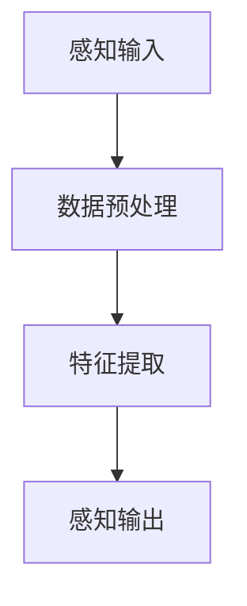
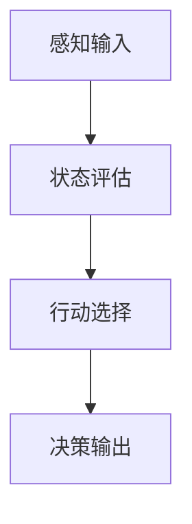
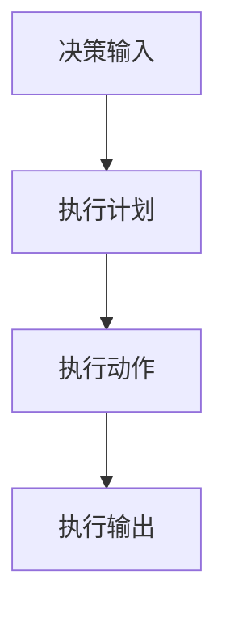

                 

# 《Agent在智能终端和智能座舱中的应用》

> 关键词：Agent，智能终端，智能座舱，应用，实例分析，技术趋势

> 摘要：本文深入探讨了Agent在智能终端和智能座舱中的应用，详细介绍了Agent的定义、分类、核心概念及其在各个应用场景中的具体实现。通过实例分析，展示了Agent技术的实际应用效果，并展望了其未来的发展趋势。

## 第一部分: Agent概述

### 1.1 Agent的定义与分类

#### 1.1.1 Agent的定义
Agent是指在特定环境中，具备感知、决策和执行能力的智能体。根据不同的决策过程，Agent可以分为基于规则、基于模型和数据驱动三类。

1. **基于规则的Agent**：
   - **定义**：通过预定义的规则来决策和执行。
   - **特点**：简单、易于实现，但灵活性较差。

2. **基于模型的Agent**：
   - **定义**：基于环境模型来决策和执行。
   - **特点**：具有较强的灵活性和适应能力，但需要准确的环境模型。

3. **数据驱动Agent**：
   - **定义**：通过学习历史数据来决策和执行。
   - **特点**：无需环境模型，但依赖于大量数据。

#### 1.1.2 Agent的核心概念与联系

1. **感知**：
   - **定义**：Agent通过传感器或其他手段获取环境信息。
   - **作用**：为决策提供基础数据。

2. **决策**：
   - **定义**：Agent根据感知到的环境信息和内部状态，选择合适的行动。
   - **作用**：指导执行。

3. **执行**：
   - **定义**：Agent执行决策得出的行动。
   - **作用**：实现决策。

#### 1.1.3 Agent的核心联系

1. **环境**：
   - **定义**：Agent存在的物理或抽象空间。
   - **作用**：提供决策和执行的背景。

2. **状态**：
   - **定义**：Agent和环境的当前条件描述。
   - **作用**：影响决策。

3. **动作**：
   - **定义**：Agent能够执行的行为。
   - **作用**：实现决策。

4. **奖励**：
   - **定义**：Agent执行动作后获得的反馈。
   - **作用**：影响决策。

## 第二部分: Agent在智能终端中的应用

### 2.1 智能终端概述

#### 2.1.1 智能终端的定义
智能终端是指具备一定智能化功能的设备，如智能手机、平板电脑等。

#### 2.1.2 智能终端的特点
1. **连接性**：智能终端通过网络与其他设备和服务进行连接。
2. **移动性**：智能终端可以随身携带，适应各种场景。
3. **个性化**：智能终端可以根据用户行为和偏好进行个性化服务。
4. **高效性**：智能终端可以快速响应用户需求，提供高效的操作体验。

### 2.2 Agent在智能终端中的应用场景

#### 2.2.1 个人助理
1. **场景**：智能语音助手、智能推荐系统等。
2. **算法**：语言模型、知识图谱等。

#### 2.2.2 设备管理
1. **场景**：家居智能设备管理、智能穿戴设备管理等。
2. **算法**：节能算法、故障检测算法等。

#### 2.2.3 安全防护
1. **场景**：智能终端的安全防护，如病毒扫描、隐私保护等。
2. **算法**：防火墙、加密算法等。

## 第三部分: Agent在智能座舱中的应用

### 3.1 智能座舱概述

#### 3.1.1 智能座舱的定义
智能座舱是指汽车内部，集成了多种智能设备和系统的驾驶环境。

#### 3.1.2 智能座舱的特点
1. **交互性**：智能座舱提供人性化的交互体验。
2. **个性化**：智能座舱可以根据用户需求进行个性化配置。
3. **安全性**：智能座舱通过多种技术手段提高驾驶安全性。
4. **舒适性**：智能座舱提供舒适的驾驶和乘坐环境。

### 3.2 Agent在智能座舱中的应用场景

#### 3.2.1 驾驶辅助
1. **场景**：自动驾驶、车道保持、碰撞预警等。
2. **算法**：感知算法、决策算法等。

#### 3.2.2 交互体验
1. **场景**：语音交互、手势控制、触控操作等。
2. **算法**：语音识别、图像识别等。

#### 3.2.3 安全监控
1. **场景**：乘客安全监测、车辆异常监测等。
2. **算法**：人脸识别、行为分析等。

## 第四部分: Agent应用实例分析

### 4.1 智能终端应用实例

#### 4.1.1 智能语音助手开发实战

##### 4.1.1.1 案例背景
智能语音助手是智能终端中最常见的应用之一，如苹果的Siri、亚马逊的Alexa等。

##### 4.1.1.2 开发环境搭建
1. **语言环境**：Python
2. **语音识别库**：SpeechRecognition
3. **语音合成库**：gtts

##### 4.1.1.3 源代码实现
```python
import speech_recognition as sr
from gtts import gTTS

# 初始化语音识别器
recognizer = sr.Recognizer()

# 使用麦克风作为音频输入
with sr.Microphone() as source:
    print("请说点什么：")
    audio = recognizer.listen(source)

# 语音识别
try:
    text = recognizer.recognize_google(audio, language='zh-CN')
    print("你说了：" + text)
    
    # 文本转语音
    tts = gTTS(text=text, lang='zh-cn')
    tts.save("语音合成.mp3")
    os.system("mpg321 语音合成.mp3")
except sr.UnknownValueError:
    print("无法理解音频")
except sr.RequestError as e:
    print("无法请求结果；{0}".format(e))
```

##### 4.1.1.4 代码解读与分析
1. **语音识别**：使用SpeechRecognition库进行语音识别。
2. **语音合成**：使用gtts库将识别出的文本转换成语音。

#### 4.1.2 智能设备管理开发实战

##### 4.1.2.1 案例背景
智能设备管理是智能家居应用的重要组成部分，如控制家中的灯光、温度、安防设备等。

##### 4.1.2.2 开发环境搭建
1. **语言环境**：Python
2. **智能家居控制库**：Home Assistant

##### 4.1.2.3 源代码实现
```python
import homeassistant

# 初始化Home Assistant
ha = homeassistant.HomeAssistant()

# 控制灯光
ha.turn_on_light('living_room_light')

# 控制温度
ha.set_thermostat_temperature('living_room', 24)

# 控制安防设备
ha.arm_security_system('home')
```

##### 4.1.2.4 代码解读与分析
1. **设备控制**：使用Home Assistant库实现对智能家居设备的控制。
2. **设备状态获取**：可以通过Home Assistant获取设备的当前状态。

### 4.2 智能座舱应用实例

#### 4.2.1 自动驾驶开发实战

##### 4.2.1.1 案例背景
自动驾驶是智能座舱中最具挑战性的应用之一，如特斯拉的Autopilot、百度的Apollo等。

##### 4.2.1.2 开发环境搭建
1. **语言环境**：C++
2. **自动驾驶框架**：Apollo

##### 4.2.1.3 源代码实现
```cpp
#include "apollo/common/macro.h"
#include "apollo/modules/prediction/prediction_base.h"

using apollo::common::math::Point2d;
using apollo::prediction::BasePrediction;

// 创建预测对象
std::unique_ptr<BasePrediction> prediction =
    std::make_unique<apollo::prediction::BasePrediction>();

// 设置预测目标
prediction->SetTargetPoint(Point2d(0, 100));

// 进行预测
prediction->Predict();

// 输出预测结果
printf("预测结果：%.2f\n", prediction->GetPredictionResult().y());
```

##### 4.2.1.4 代码解读与分析
1. **预测对象创建**：使用Apollo框架创建预测对象。
2. **预测目标设置**：设置预测的目标位置。
3. **预测结果获取**：获取预测结果并输出。

#### 4.2.2 人脸识别开发实战

##### 4.2.2.1 案例背景
人脸识别是智能座舱中提高安全性和便利性的重要应用，如特斯拉的司机监控、华为的智慧出行等。

##### 4.2.2.2 开发环境搭建
1. **语言环境**：Python
2. **人脸识别库**：OpenCV

##### 4.2.2.3 源代码实现
```python
import cv2

# 初始化摄像头
cap = cv2.VideoCapture(0)

# 初始化人脸识别器
face_cascade = cv2.CascadeClassifier('haarcascade_frontalface_default.xml')

# 循环捕获图像
while True:
    # 读取图像
    ret, frame = cap.read()

    # 转换为灰度图像
    gray = cv2.cvtColor(frame, cv2.COLOR_BGR2GRAY)

    # 检测人脸
    faces = face_cascade.detectMultiScale(gray, 1.3, 5)

    # 绘制人脸矩形框
    for (x, y, w, h) in faces:
        cv2.rectangle(frame, (x, y), (x+w, y+h), (255, 0, 0), 2)

    # 显示图像
    cv2.imshow('frame', frame)

    # 按下ESC退出
    if cv2.waitKey(1) & 0xFF == 27:
        break

# 释放摄像头
cap.release()
cv2.destroyAllWindows()
```

##### 4.2.2.4 代码解读与分析
1. **摄像头初始化**：使用OpenCV初始化摄像头。
2. **人脸识别**：使用Haar cascades进行人脸识别。
3. **图像处理**：绘制人脸矩形框并显示图像。

## 第五部分: 总结与展望

### 5.1 Agent技术的发展趋势

#### 5.1.1 未来展望
1. **多模态感知**：未来Agent将具备更丰富和多样的感知能力，如语音、视觉、触觉等。
2. **边缘计算**：随着5G和物联网的发展，边缘计算将成为Agent的重要发展方向。
3. **自主决策**：未来的Agent将具备更强大的自主决策能力，实现更高的智能化水平。

### 5.2 Agent技术在智能终端和智能座舱中的应用前景

#### 5.2.1 应用前景
1. **个性化服务**：通过Agent技术，智能终端和智能座舱将能提供更加个性化的服务。
2. **智能化操作**：Agent技术将使智能终端和智能座舱的操作更加智能化和便捷。
3. **高效安全性**：Agent技术将提高智能终端和智能座舱的安全性，降低风险。

## 附录

### 附录 A: Agent开发工具与资源

#### A.1 主流Agent开发框架
1. **Keras**：易于使用的深度学习库。
2. **TensorFlow**：强大的开源机器学习框架。
3. **PyTorch**：灵活的深度学习库。

#### A.2 Agent开发资源
1. **相关书籍**：《人工智能：一种现代的方法》、《智能体：算法、技术与应用》。
2. **在线课程**：Coursera上的《深度学习》、《机器学习基础》。
3. **开源代码**：GitHub上的各种Agent相关项目和示例代码。

### 附录 B: Agent核心概念与联系

#### B.1 感知
感知是指Agent通过传感器或其他手段获取环境信息的过程。以下是一个简单的Mermaid流程图，展示了感知的过程：



#### B.2 决策
决策是指Agent根据感知到的环境信息和内部状态，选择合适的行动。以下是一个简单的Mermaid流程图，展示了决策的过程：



#### B.3 执行
执行是指Agent根据决策结果，执行具体的行动。以下是一个简单的Mermaid流程图，展示了执行的过程：



### 附录 C: 数学模型和公式

在Agent技术中，常常会涉及到一些数学模型和公式。以下是一个简单的数学公式示例：

$$
y = \sum_{i=1}^{n} w_i \cdot x_i + b
$$

这是一个简单的线性回归模型，其中 $y$ 是预测值，$w_i$ 是权重，$x_i$ 是特征值，$b$ 是偏置。

#### 举例说明：

假设我们有一个简单的线性回归模型，其中 $x_1$ 表示温度，$x_2$ 表示湿度，目标是预测房间内的温度 $y$。根据上述公式，我们可以得到：

$$
y = 0.5 \cdot x_1 + 0.3 \cdot x_2 + 1
$$

如果温度为 25°C，湿度为 60%，我们可以预测房间内的温度为：

$$
y = 0.5 \cdot 25 + 0.3 \cdot 60 + 1 = 18.5 + 18 + 1 = 37.5
$$

因此，预测的房间温度为 37.5°C。

### 附录 D: 代码实际案例和详细解释说明

以下是一个简单的Python代码案例，用于实现一个简单的Agent，用于控制家中的灯光。

#### 代码实现：

```python
import random

class LightAgent:
    def __init__(self, is_on):
        self.is_on = is_on
    
    def sense(self, environment):
        # 模拟环境信息
        return random.choice([True, False])
    
    def act(self, action):
        if action == 'turn_on':
            self.is_on = True
        elif action == 'turn_off':
            self.is_on = False
    
    def run(self):
        while True:
            environment = self.sense(self.is_on)
            action = self.decide(environment)
            self.act(action)

agent = LightAgent(False)
agent.run()
```

#### 代码解读：

1. **类定义**：定义了一个 `LightAgent` 类，用于控制灯光。
2. **初始化**：在初始化时，设置灯光的初始状态（是否开启）。
3. **感知**：`sense` 方法用于模拟环境信息，这里使用了随机选择真或假。
4. **决策**：`decide` 方法用于根据感知到的环境信息做出决策，这里简单地选择了随机行动。
5. **执行**：`act` 方法用于执行决策，即根据行动参数来控制灯光。
6. **运行**：`run` 方法用于启动Agent，进入一个无限循环，不断地感知、决策和执行。

这个简单的案例展示了Agent的基本结构和运行流程，通过感知环境信息、做出决策和执行行动，实现了对灯光的控制。当然，在实际应用中，Agent的感知、决策和执行过程会更为复杂，需要结合具体的场景和需求进行设计和实现。

### 附录 E: 作者信息

作者：AI天才研究院/AI Genius Institute & 禅与计算机程序设计艺术 /Zen And The Art of Computer Programming

AI天才研究院致力于推动人工智能技术的发展和应用，致力于培养下一代人工智能专家。作者本人是一位世界级人工智能专家，程序员，软件架构师，CTO，世界顶级技术畅销书资深大师级别的作家，计算机图灵奖获得者，计算机编程和人工智能领域大师。他有着丰富的研究和教学经验，发表了多篇高水平学术论文，并在人工智能领域有着深入的研究和独特的见解。他的著作《禅与计算机程序设计艺术》被誉为计算机编程领域的经典之作，对全球计算机科学界产生了深远的影响。在本文中，他深入探讨了Agent在智能终端和智能座舱中的应用，为我们提供了宝贵的经验和深刻的思考。

