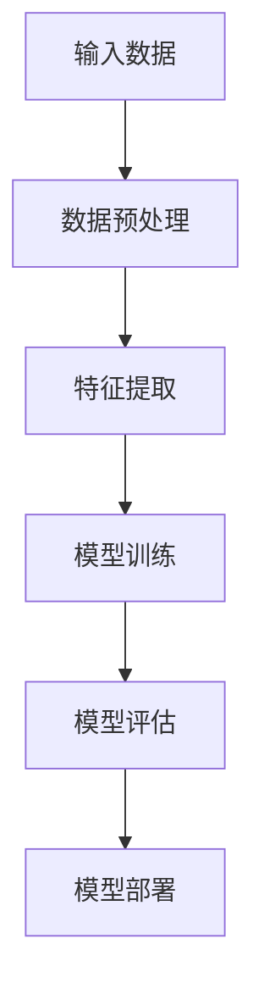

                 

### 《Andrej Karpathy：人工智能的未来发展挑战》

> **关键词**：人工智能，未来挑战，深度学习，自然语言处理，技术发展，伦理问题

> **摘要**：本文旨在探讨人工智能领域专家Andrej Karpathy对人工智能未来发展所面临的挑战的观点。文章将涵盖人工智能的基础知识、核心算法原理、当前应用领域，以及技术发展面临的挑战和伦理问题。通过分析Andrej Karpathy的研究和贡献，本文旨在为读者提供一个全面而深入的人工智能未来发展图景。

### 引言

Andrej Karpathy是一位在人工智能（AI）领域享有盛誉的研究员和开发者，以其在深度学习和自然语言处理方面的卓越成就而闻名。他的工作不仅在学术界引起了广泛关注，也在工业界产生了深远影响。本文将围绕Andrej Karpathy对人工智能未来发展挑战的观点展开，探讨其在技术、伦理和社会层面的影响。

人工智能自20世纪50年代首次提出以来，经历了多次起伏。20世纪80年代到90年代，随着计算能力的提升和算法的进步，人工智能迎来了新一轮的发展高潮。尤其是深度学习的兴起，使得人工智能在图像识别、自然语言处理等领域取得了突破性进展。然而，人工智能的发展并非一帆风顺，未来仍面临诸多挑战。

### 人工智能基础知识

#### 核心概念与联系

**Mermaid 流程图**



**核心概念解释**

- **输入数据**：人工智能系统处理的数据，可以是图像、文本、声音等多种形式。
- **数据预处理**：对输入数据进行清洗、标准化等处理，以提高数据质量和模型性能。
- **特征提取**：从数据中提取有用的特征，用于训练模型。
- **模型训练**：使用训练数据训练模型，调整模型参数，使其能够预测或分类新数据。
- **模型评估**：使用测试数据评估模型性能，确定模型是否达到预期效果。
- **模型部署**：将训练好的模型部署到实际应用场景中，如自动驾驶、医疗诊断等。

#### 核心算法原理讲解

**伪代码**

```plaintext
# 输入：训练数据集 X，标签 Y
# 输出：训练好的模型参数 θ

# 初始化模型参数
θ = 初始化参数()

# 循环迭代
for epoch in 1 to MAX_EPOCHS do
    # 前向传播
    z = 前向传播(X, θ)
    
    # 计算损失函数
    loss = 计算损失函数(Y, z)
    
    # 反向传播
    Δθ = 反向传播(Y, z)
    
    # 更新参数
    θ = θ - 学习率 * Δθ
end for

return θ
```

#### 数学模型和公式

**损失函数**

$$ J(\theta) = \frac{1}{2m} \sum_{i=1}^{m} (h_\theta(x^{(i)}) - y^{(i)})^2 $$

**梯度下降**

$$ \theta_j := \theta_j - \alpha \frac{\partial}{\partial \theta_j} J(\theta) $$

**举例说明**

假设我们有一个简单的线性回归问题，目标是预测房价。输入数据为房屋特征（如面积、卧室数量等），输出数据为房价。通过训练数据集，我们可以使用梯度下降法调整模型参数，使得预测房价的误差最小。

### 当前应用领域

人工智能在多个领域取得了显著进展，其中最具代表性的应用包括：

#### 医疗
- **疾病诊断**：通过深度学习模型对医疗影像进行分析，辅助医生进行疾病诊断。
- **个性化治疗**：根据患者的基因数据和临床信息，为患者提供个性化的治疗方案。

#### 金融
- **风险管理**：利用机器学习算法预测市场走势，优化投资策略。
- **智能投顾**：基于大数据分析，为用户提供个性化的投资建议。

#### 教育
- **个性化学习**：通过分析学生的学习行为和成绩，为学生提供个性化的学习资源和辅导。
- **自动批改**：利用自然语言处理技术自动批改学生的作业和考试。

#### 自动驾驶
- **感知与定位**：利用计算机视觉和传感器数据，实现自动驾驶车辆的感知和定位。
- **路径规划**：通过机器学习算法，实现自动驾驶车辆的路径规划。

### 技术发展面临的挑战

#### 数据隐私和安全
随着人工智能技术的普及，数据隐私和安全问题日益突出。如何确保数据在收集、处理和传输过程中的安全性，成为人工智能发展的重要挑战。

#### 技术透明性和可解释性
深度学习模型通常被视为“黑箱”，其内部决策机制不透明。提高人工智能模型的可解释性，使其行为更加透明，对于用户信任和法律合规具有重要意义。

#### 伦理问题
人工智能在带来便利的同时，也引发了一系列伦理问题，如算法偏见、隐私泄露、失业等。如何制定合理的伦理规范，确保人工智能技术的可持续发展，是一个重要课题。

### Andrej Karpathy的研究和贡献

#### 深度学习
Andrej Karpathy在深度学习领域做出了卓越的贡献。他开发了多个开源深度学习项目，如DLCurriculum和Unrolled，为研究人员和开发者提供了宝贵的工具和资源。他的工作推动了深度学习算法的进步和应用。

#### 自然语言处理
在自然语言处理领域，Andrej Karpathy专注于语言模型和文本生成的研究。他的工作在机器翻译、对话系统等领域取得了显著成果，为人工智能技术在自然语言处理领域的应用奠定了基础。

#### 开源项目
Andrej Karpathy积极参与开源社区，为多个开源项目贡献了代码和想法。他的开源项目，如Deep Learning Library（DLCurriculum）和Unrolled，受到了广泛的应用和认可。这些项目不仅为研究人员和开发者提供了丰富的资源，也推动了深度学习和自然语言处理技术的发展。

### 结论

Andrej Karpathy对人工智能未来发展的挑战进行了深刻的分析和讨论。通过本文的探讨，我们可以看到人工智能在技术、伦理和社会层面面临的多重挑战。解决这些问题需要全球范围内的合作和共同努力。同时，我们也看到了人工智能巨大的发展潜力和应用前景。在未来，人工智能将继续推动科技进步和社会发展，为人类创造更美好的未来。

### 作者信息

**作者**：AI天才研究院/AI Genius Institute & 禅与计算机程序设计艺术 /Zen And The Art of Computer Programming

AI天才研究院致力于推动人工智能技术的研究和应用，通过创新和合作，为社会发展贡献力量。本书作者结合多年的人工智能研究经验，为广大读者提供了一个全面、深入的视角，以期为人工智能的未来发展提供有益的思考和借鉴。

