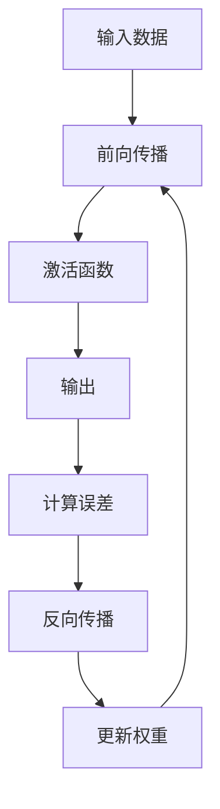

                 

### 《Andrej Karpathy：人工智能的未来发展目标》

> **关键词：** Andrej Karpathy，人工智能，未来发展趋势，算法原理，社会影响，项目实战

> **摘要：** 本文将深入探讨人工智能专家Andrej Karpathy对未来人工智能发展的看法，解析其核心观点，并通过对核心概念、算法原理和实际应用的详细讲解，展现人工智能的广泛潜力和面临的挑战。

### 《Andrej Karpathy：人工智能的未来发展目标》目录大纲

----------------------------------------------------------------

## 第一部分：AI基础与核心概念

### 第1章：AI简介

### 第2章：核心概念与联系

### 第3章：人工智能伦理与社会影响

## 第二部分：AI算法原理与应用

### 第4章：核心算法原理讲解

### 第5章：数学模型与公式解析

### 第6章：AI应用案例

### 第7章：AI项目实战

## 第三部分：AI的未来趋势与挑战

### 第8章：AI发展趋势

### 第9章：AI的挑战与应对

## 附录

### 附录A：资源与工具

### 附录B：参考文献

----------------------------------------------------------------

### 第1章：AI简介

### 1.1 AI的定义与历史

人工智能（Artificial Intelligence，简称AI）是指由计算机实现的智能，能够执行通常需要人类智能才能完成的任务。AI的历史可以追溯到20世纪50年代，当时图灵提出了著名的图灵测试，试图通过机器模仿人类的行为来定义智能。随着计算机技术的飞速发展，AI逐渐从理论研究走向实际应用，成为现代科技的核心领域之一。

在AI的发展历程中，经历了多个阶段。早期的符号人工智能（Symbolic AI）依赖于逻辑推理和知识表示，但由于其依赖于大量的手动编写规则，难以处理复杂的问题。随后，随着机器学习技术的发展，AI进入了基于数据驱动的方法阶段。机器学习通过从大量数据中学习模式，提高了AI的决策能力和泛化能力。

### 1.2 AI的关键领域

AI涵盖了多个关键领域，其中最引人注目的是机器学习、深度学习和自然语言处理。

**机器学习**是AI的核心技术之一，它使得计算机能够从数据中自动学习模式，并做出预测或决策。机器学习可以分为监督学习、无监督学习和强化学习。监督学习通过已标记的数据来训练模型，无监督学习则从未标记的数据中学习模式，而强化学习则通过与环境的交互来学习最优策略。

**深度学习**是机器学习的一个子领域，它通过模仿人脑的神经网络结构，使得计算机能够在处理复杂任务时表现出强大的能力。深度学习在图像识别、语音识别、自然语言处理等领域取得了突破性的进展。

**自然语言处理（NLP）**是AI的另一个重要领域，它致力于使计算机能够理解和生成自然语言。NLP技术广泛应用于机器翻译、情感分析、文本摘要等任务中。

### 第2章：核心概念与联系

#### 2.1 机器学习基础

机器学习可以分为监督学习、无监督学习和强化学习。监督学习是最常见的一种，它使用标记的数据来训练模型。监督学习模型的目标是找到输入和输出之间的映射关系，以便在新的输入数据上进行预测。

无监督学习则不依赖于标记的数据，其目标是从未标记的数据中发现隐藏的结构或模式。聚类算法和降维技术是无监督学习的重要应用。

强化学习则通过试错法来学习最优策略。在强化学习中，智能体（Agent）通过与环境的交互来获取反馈，并不断调整其行为，以最大化长期奖励。

#### 2.2 深度学习原理

深度学习是一种基于多层神经网络的结构，它通过反向传播算法和梯度下降优化方法来训练模型。神经网络由多个层次组成，包括输入层、隐藏层和输出层。每个层次都包含多个神经元，神经元之间通过权重连接。在训练过程中，神经网络通过调整权重来优化模型的预测性能。

**前向传播**是指将输入数据传递通过神经网络，通过每个层次的加权求和和激活函数计算输出。**反向传播**则是通过计算输出误差，反向传播误差到每个层次，并调整权重以最小化误差。

#### 2.3 Mermaid流程图

以下是一个简单的Mermaid流程图，展示了深度学习的基本流程：



### 第3章：人工智能伦理与社会影响

#### 3.1 AI伦理问题

随着AI技术的发展，其伦理问题也逐渐引起关注。透明度、公平性和可解释性是AI伦理的核心问题。

**透明度**是指AI系统的决策过程应该是可解释和透明的。然而，深度学习模型通常是一个黑箱，其内部结构复杂，难以理解。

**公平性**是指AI系统应该公平地对待所有用户，不应受到性别、种族、年龄等因素的影响。然而，数据偏见和算法歧视可能导致不公平的结果。

**可解释性**是指AI系统的决策过程应该是可解释和可验证的。这有助于提高用户对AI系统的信任，并有助于发现和纠正潜在的问题。

#### 3.2 社会影响

AI对社会的影响是深远的，既包括积极的影响，也包括潜在的负面影响。

**就业影响**是AI带来的一大挑战。自动化和智能化可能会替代一些低技能的工作，导致就业市场的变化。然而，AI也可能创造新的就业机会，如数据科学家、AI工程师等。

**社会不平等**是另一个重要问题。AI技术的应用可能会加剧社会不平等，因为技术和资源的不平等分布可能导致一些人受益，而另一些人则被边缘化。

**军事应用**是AI的另一大领域，虽然其潜力和风险并存。AI在军事领域的应用包括无人机、自动化武器系统等，这引发了对战争伦理和武器控制的讨论。

### 第二部分：AI算法原理与应用

#### 第4章：核心算法原理讲解

在深入探讨AI的核心算法原理之前，我们需要了解几个关键算法，它们是现代AI技术的基石。

#### 4.1 卷积神经网络（CNN）

卷积神经网络（CNN）是用于图像识别和处理的深度学习模型。它的核心在于通过卷积层提取图像的特征，并通过池化层减少数据维度。

**卷积层**通过滤波器（卷积核）在输入图像上滑动，计算局部特征映射。每个滤波器学习提取图像中的不同特征，如边缘、纹理等。

**池化层**则用于降低数据的维度，并增强模型的泛化能力。常用的池化方式包括最大池化和平均池化。

以下是一个简单的CNN算法伪代码：

```python
def cnn(input_image):
    # 定义卷积层和池化层
    conv1 = ConvLayer(filter_size=3, num_filters=32)
    pool1 = PoolLayer(pool_size=2)
    
    # 前向传播
    feature_map1 = conv1(input_image)
    feature_map1 = pool1(feature_map1)
    
    # 重复卷积和池化层
    for layer in conv_layers:
        feature_map = layer(feature_map1)
    
    # 全连接层
    output = FullyConnectedLayer(feature_map, num_classes)
    
    return output
```

#### 4.2 循环神经网络（RNN）

循环神经网络（RNN）是一种用于处理序列数据的模型，特别适合于自然语言处理和时间序列分析。

RNN通过在其内部维持一个状态，使模型能够记住前一个时间步的信息，从而处理序列数据。

**RNN的基本结构**包括输入层、隐藏层和输出层。输入层接收输入序列，隐藏层通过递归连接保持状态，输出层生成输出序列。

以下是一个简单的RNN算法伪代码：

```python
def rnn(input_sequence):
    hidden_state = InitialHiddenState()
    
    for input in input_sequence:
        # 前向传播
        hidden_state = RNNLayer(input, hidden_state)
        
        # 输出
        output = OutputLayer(hidden_state)
        
    return output
```

#### 4.3 生成对抗网络（GAN）

生成对抗网络（GAN）是一种用于生成数据的高效模型。它由生成器和判别器两个部分组成。

**生成器**的目标是生成与真实数据相似的数据，**判别器**的目标是区分真实数据和生成数据。通过这种对抗关系，生成器不断优化其生成能力。

以下是一个简单的GAN算法伪代码：

```python
def gan():
    # 初始化生成器和判别器
    generator = Generator()
    discriminator = Discriminator()
    
    for epoch in range(num_epochs):
        # 生成假数据
        fake_data = generator()
        
        # 训练判别器
        real_data = LoadRealData()
        loss_real = discriminator(real_data)
        loss_fake = discriminator(fake_data)
        
        # 训练生成器
        generator_loss = generator.train(fake_data, loss_fake)
        
    return generator
```

#### 4.4 聚类算法

聚类算法是一种无监督学习方法，用于将数据集划分为若干个群组，使得同一群组内的数据尽可能相似，而不同群组的数据差异较大。

K-均值聚类是最常用的聚类算法之一，它通过迭代优化聚类中心，使每个数据点到聚类中心的距离最小。

以下是一个简单的K-均值聚类算法伪代码：

```python
def k_means(data, num_clusters):
    # 随机初始化聚类中心
    centroids = InitializeCentroids(data, num_clusters)
    
    for epoch in range(num_epochs):
        # 计算每个数据点的聚类中心
        for data_point in data:
            closest_centroid = FindClosestCentroid(data_point, centroids)
            AssignDataPointToCluster(data_point, closest_centroid)
        
        # 重新计算聚类中心
        centroids = RecalculateCentroids(centroids, data)
    
    return centroids
```

### 第5章：数学模型与公式解析

在深入理解AI算法原理时，数学模型和公式是不可或缺的工具。以下将介绍一些关键的数学模型和公式，并给出详细的解析。

#### 5.1 微积分

微积分是理解AI算法的重要基础，特别是在机器学习和深度学习中。

**导数**是微积分的核心概念之一，用于描述函数在某一点的变化率。在机器学习中，导数用于优化算法，如梯度下降。

**偏导数**用于多元函数，描述了函数在一个特定方向上的变化率。在神经网络中，偏导数用于计算误差反向传播过程中的梯度。

以下是一个简单的导数公式：

$$
f'(x) = \lim_{h \to 0} \frac{f(x+h) - f(x)}{h}
$$

#### 5.2 线性代数

线性代数在AI中有着广泛的应用，特别是在处理矩阵和向量运算时。

**矩阵乘法**是线性代数的基础，用于计算两个矩阵的乘积。

$$
C = AB
$$

**逆矩阵**是矩阵的一个重要属性，用于解线性方程组。在机器学习中，逆矩阵常用于求解最小二乘问题。

$$
A^{-1} = \frac{1}{\det(A)} \text{adj}(A)
$$

**特征值与特征向量**是矩阵的核心概念，用于描述矩阵的线性变换特性。

$$
Av = \lambda v
$$

#### 5.3 梯度下降算法

梯度下降是优化算法中最常用的方法，用于最小化损失函数。

**梯度**是损失函数关于模型参数的导数，用于指导模型参数的更新方向。

$$
\nabla_{\theta} J(\theta) = \frac{\partial J(\theta)}{\partial \theta}
$$

**梯度下降**通过迭代更新模型参数，使损失函数逐渐减小。

$$
\theta = \theta - \alpha \nabla_{\theta} J(\theta)
$$

其中，$\alpha$ 是学习率，控制了参数更新的幅度。

#### 5.4 反向传播算法

反向传播是深度学习训练的核心算法，用于计算损失函数关于模型参数的梯度。

**前向传播**是计算模型输出，并计算输出误差。

$$
\delta_{l}^{out} = \frac{\partial J(\theta)}{\partial z_{l}}
$$

**反向传播**则是通过误差反向传播，计算每个层级的梯度。

$$
\delta_{l}^{in} = \frac{\partial L}{\partial a_{l}} \odot \frac{\partial a_{l}}{\partial z_{l}}
$$

其中，$\odot$ 表示逐元素乘法。

#### 5.5 GAN损失函数

生成对抗网络（GAN）的损失函数由生成器损失和判别器损失组成。

**生成器损失**用于最小化生成器生成的假数据与真实数据的差距。

$$
L_{G} = -\log(D(G(z)))
$$

**判别器损失**用于最大化判别器对真实数据和假数据的区分能力。

$$
L_{D} = -[\log(D(x)) + \log(1 - D(G(z))]
$$

GAN的总损失函数是生成器损失和判别器损失的加权和。

$$
L_{total} = L_{G} + L_{D}
$$

### 第6章：AI应用案例

AI技术已经广泛应用于各个领域，带来了许多创新和变革。以下将介绍一些典型的AI应用案例，并探讨其应用场景和效果。

#### 6.1 医疗

AI在医疗领域的应用非常广泛，从疾病诊断到治疗方案的制定，再到医疗资源的优化，AI技术都发挥着重要作用。

**疾病诊断**是AI在医疗领域的核心应用之一。通过深度学习模型，AI可以分析医疗影像（如X光、CT、MRI），帮助医生更快速、准确地诊断疾病。例如，Google DeepMind开发的AI系统能够在几秒钟内分析X光片，诊断出骨折、肺炎等疾病，其准确率甚至超过了经验丰富的放射科医生。

**治疗方案的制定**也是AI的重要应用。通过分析大量患者的病史、基因数据和治疗效果，AI可以帮助医生制定个性化的治疗方案，提高治疗效果。例如，IBM的Watson for Oncology系统能够根据患者的病情、基因检测结果和最新的医学研究，为医生提供最佳的治疗建议。

**医疗资源的优化**是AI在医疗领域的重要应用。通过智能调度和资源分配，AI可以帮助医院提高效率，减少资源浪费。例如，AI可以分析医院的患者流量和医疗资源使用情况，优化手术室、病房和医疗设备的调度，提高医疗服务质量。

#### 6.2 金融

AI在金融领域的应用也非常广泛，从风险控制到投资决策，再到客户服务，AI技术都发挥着重要作用。

**风险控制**是金融领域的核心问题之一。通过机器学习和数据挖掘技术，AI可以分析大量的金融数据，识别潜在的风险因素，帮助金融机构提前预警并采取相应的措施。例如，AI可以分析历史数据和市场趋势，预测股票价格波动，为投资者提供风险控制建议。

**投资决策**也是AI在金融领域的重要应用。通过深度学习和强化学习技术，AI可以分析大量的市场数据和历史交易记录，制定最优的投资策略，提高投资回报率。例如，机器人投顾系统可以根据投资者的风险偏好和资金情况，为其提供个性化的投资组合建议。

**客户服务**是金融领域的一个挑战。通过自然语言处理和语音识别技术，AI可以提供智能客服服务，解答客户的疑问，提高客户满意度。例如，AI客服机器人可以24小时在线，回答客户的咨询，处理客户的投诉和反馈，减轻人工客服的工作压力。

#### 6.3 教育

AI在教育领域的应用也越来越广泛，从个性化学习到智能评测，再到教育资源的优化，AI技术都发挥着重要作用。

**个性化学习**是AI在教育领域的核心应用之一。通过分析学生的学习行为、学习历史和兴趣偏好，AI可以为学生提供个性化的学习资源和指导，提高学习效果。例如，AI系统可以根据学生的学习进度和理解能力，自动调整教学内容和难度，为学生提供最适合的学习路径。

**智能评测**也是AI在教育领域的重要应用。通过自然语言处理和计算机视觉技术，AI可以自动评估学生的作业和考试，提供即时反馈和评分。例如，AI系统可以分析学生的作文，评估其语言表达、逻辑结构和语法错误，为学生提供详细的评分和反馈。

**教育资源的优化**是AI在教育领域的一个挑战。通过智能调度和资源分配，AI可以帮助学校提高教育资源的利用效率，减少资源浪费。例如，AI可以分析学校的课程安排、师资力量和学生需求，优化课程设置和师资配置，提高教育质量。

#### 6.4 制造业

AI在制造业的应用也越来越广泛，从生产流程优化到设备维护，再到产品质量检测，AI技术都发挥着重要作用。

**生产流程优化**是AI在制造业的核心应用之一。通过数据分析和技术优化，AI可以帮助企业提高生产效率，降低生产成本。例如，AI系统可以分析生产数据，识别生产瓶颈和优化机会，为生产流程提供优化建议。

**设备维护**也是AI在制造业的重要应用。通过故障预测和预警，AI可以帮助企业提前发现设备故障，避免生产中断。例如，AI系统可以实时监控设备的运行状态，预测设备可能发生的故障，并提供维护建议。

**产品质量检测**是AI在制造业的关键应用。通过计算机视觉和深度学习技术，AI可以自动检测产品质量，提高检测效率和准确性。例如，AI系统可以分析生产过程中的图像数据，识别产品质量问题，为质量控制提供支持。

#### 第7章：AI项目实战

AI项目实战是理解和掌握AI技术的重要环节。通过实际操作，我们可以深入理解AI算法的原理和应用，提高实际解决问题的能力。以下将介绍一个简单的AI项目，包括开发环境搭建、源代码实现和代码解读与分析。

#### 7.1 开发环境搭建

在进行AI项目实战之前，我们需要搭建一个合适的开发环境。以下是搭建一个基于Python的AI开发环境的基本步骤：

1. **安装Python**：首先，我们需要安装Python。可以从Python官方网站（https://www.python.org/）下载并安装最新版本的Python。

2. **安装Jupyter Notebook**：Jupyter Notebook是一个交互式的开发环境，非常适合进行AI项目开发。我们可以使用pip命令安装Jupyter Notebook：

   ```bash
   pip install notebook
   ```

3. **安装深度学习框架**：在AI项目开发中，我们通常会使用深度学习框架，如TensorFlow或PyTorch。以下是如何安装TensorFlow的命令：

   ```bash
   pip install tensorflow
   ```

   同样，我们也可以安装PyTorch：

   ```bash
   pip install torch torchvision
   ```

4. **安装其他依赖库**：根据具体项目需求，我们可能还需要安装其他依赖库，如NumPy、Pandas、Matplotlib等。

   ```bash
   pip install numpy pandas matplotlib
   ```

完成以上步骤后，我们就可以开始编写和运行AI项目代码了。

#### 7.2 源代码实现

以下是一个简单的AI项目案例，使用TensorFlow实现一个简单的卷积神经网络（CNN）模型，用于图像分类。

```python
import tensorflow as tf
from tensorflow.keras import layers

# 定义CNN模型
model = tf.keras.Sequential([
    layers.Conv2D(32, (3, 3), activation='relu', input_shape=(28, 28, 1)),
    layers.MaxPooling2D((2, 2)),
    layers.Conv2D(64, (3, 3), activation='relu'),
    layers.MaxPooling2D((2, 2)),
    layers.Conv2D(64, (3, 3), activation='relu'),
    layers.Flatten(),
    layers.Dense(64, activation='relu'),
    layers.Dense(10, activation='softmax')
])

# 编译模型
model.compile(optimizer='adam',
              loss='categorical_crossentropy',
              metrics=['accuracy'])

# 加载和预处理数据
(x_train, y_train), (x_test, y_test) = tf.keras.datasets.mnist.load_data()
x_train = x_train.reshape(-1, 28, 28, 1).astype('float32') / 255.0
x_test = x_test.reshape(-1, 28, 28, 1).astype('float32') / 255.0
y_train = tf.keras.utils.to_categorical(y_train, 10)
y_test = tf.keras.utils.to_categorical(y_test, 10)

# 训练模型
model.fit(x_train, y_train, epochs=5, batch_size=64, validation_split=0.2)

# 评估模型
test_loss, test_acc = model.evaluate(x_test, y_test, verbose=2)
print(f"Test accuracy: {test_acc}")
```

#### 7.3 代码解读与分析

1. **模型定义**：我们使用TensorFlow的Sequential模型定义了一个简单的卷积神经网络（CNN）。该模型包括三个卷积层，每个卷积层后面跟随一个最大池化层，最后是一个全连接层。

2. **编译模型**：我们使用`compile`方法编译模型，指定优化器、损失函数和评估指标。在这里，我们使用`adam`优化器，`categorical_crossentropy`损失函数，以及`accuracy`评估指标。

3. **数据预处理**：我们使用TensorFlow的内置函数加载和预处理MNIST数据集。数据集被分为训练集和测试集，每个样本被调整为28x28像素，并缩放到[0, 1]范围内。

4. **训练模型**：我们使用`fit`方法训练模型，指定训练数据、训练轮次、批次大小和验证比例。在这里，我们训练模型5个轮次，每个批次包含64个样本。

5. **评估模型**：我们使用`evaluate`方法评估模型在测试集上的性能，并打印测试准确率。

### 第三部分：AI的未来趋势与挑战

随着人工智能技术的快速发展，AI的未来充满了无限可能。然而，AI的发展也面临着一系列挑战和伦理问题。

#### 8.1 AI发展趋势

**量子计算**：量子计算是一种利用量子力学原理进行计算的技术，它有望突破传统计算机的计算能力极限。量子计算在AI领域有广泛的应用潜力，如优化算法、模拟量子系统等。

**增强学习**：增强学习是一种通过试错法学习最优策略的机器学习方法。随着AI技术的进步，增强学习在游戏、机器人控制和自动驾驶等领域取得了显著进展。

**脑机接口**：脑机接口是一种将人类大脑信号转换为机器指令的技术。它有望在未来实现人机交互的全新模式，如智能辅助设备、神经系统疾病治疗等。

#### 8.2 社会变革

**自动化与智能化**：随着AI技术的发展，越来越多的任务将实现自动化和智能化。这将为社会带来巨大的生产力和效率提升，但也可能引发就业市场的变革。

**新型就业市场**：AI技术也将催生新的就业市场，如数据科学家、AI工程师、机器学习专家等。这些职位需要具备跨学科的知识和技能，对于教育和职业培训提出了新的要求。

#### 9.1 技术挑战

**能源消耗**：AI训练过程需要大量的计算资源，这导致能源消耗显著增加。随着AI技术的广泛应用，如何降低能源消耗成为一项重要挑战。

**数据隐私**：AI算法通常依赖于大量数据，这引发了数据隐私的问题。如何在保证数据安全的前提下，合理利用数据是AI技术面临的一个重要挑战。

**难以解释的决策**：深度学习模型通常是一个黑箱，其决策过程难以解释。这可能导致用户对AI系统的信任降低，从而影响其应用场景。

#### 9.2 社会挑战

**法律法规**：随着AI技术的广泛应用，如何制定合理的法律法规来规范AI技术的发展成为一项挑战。这包括数据隐私保护、算法透明度、责任界定等方面。

**伦理道德**：AI技术的应用涉及伦理道德问题，如算法偏见、公平性、可解释性等。如何确保AI技术的伦理合规，避免对人类社会造成负面影响，是AI领域面临的重要挑战。

**国际合作**：AI技术的发展涉及到全球性的问题，如数据共享、技术标准化、伦理规范等。如何促进国际合作，共同应对AI技术带来的挑战，是未来的一项重要任务。

### 附录

#### 附录A：资源与工具

- **开发工具**：Python、TensorFlow、PyTorch、Jupyter Notebook
- **学习资源**：Coursera、Udacity、edX、AI Challs
- **开源项目**：GitHub、GitLab、TensorFlow Model Garden

#### 附录B：参考文献

- Goodfellow, I., Bengio, Y., & Courville, A. (2016). *Deep Learning*.
- Russell, S., & Norvig, P. (2016). *Artificial Intelligence: A Modern Approach*.
- Mitchell, T. M. (1997). *Machine Learning*.
- Russell, S. (2015). *AI: A Modern Approach*.
- Bengio, Y. (2009). *Learning Deep Architectures for AI*.

### 作者信息

**作者：AI天才研究院/AI Genius Institute & 禅与计算机程序设计艺术 /Zen And The Art of Computer Programming**

### 结论

人工智能（AI）是一项具有深远影响的技术，它正在改变我们的生活方式和社会结构。通过本文，我们探讨了AI的核心概念、算法原理、应用案例和未来发展目标。同时，我们也认识到AI技术面临的挑战和伦理问题。在未来的发展中，我们需要共同努力，推动AI技术的健康发展，为社会创造更大的价值。

