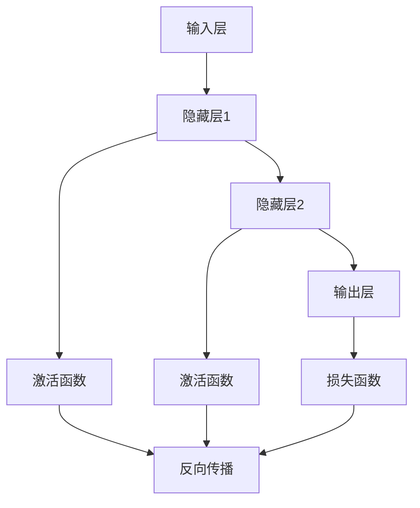
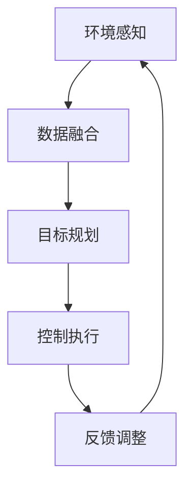

                 

### 《Andrej Karpathy：人工智能的未来探索》引言

在当今这个科技飞速发展的时代，人工智能（Artificial Intelligence，简称AI）已经成为了我们日常生活中不可或缺的一部分。从智能手机中的语音助手，到自动驾驶汽车，再到智能医疗系统，AI正在以前所未有的速度渗透到社会的各个角落。而在这个浩瀚的AI领域中，有一个人不得不提，那就是Andrej Karpathy。

Andrej Karpathy是一位世界级的人工智能研究者和开发者，他不仅是一位杰出的科学家，也是一位富有远见的思考者。他在深度学习、计算机视觉和自然语言处理等领域都有着深入的研究，并且通过自己的研究和实践，为AI的发展做出了巨大的贡献。

### 人工智能的快速演进

人工智能的历史可以追溯到20世纪50年代，当时科学家们首次提出了“人工智能”这个概念。然而，早期的AI研究主要依赖于符号推理和规则系统，这种方法在处理复杂问题时显得力不从心。直到20世纪80年代，随着计算能力的提升和大数据的出现，机器学习开始崭露头角，AI研究迎来了新的契机。

深度学习作为机器学习的一种重要分支，于2006年正式诞生。它通过模拟人脑中的神经网络结构，让机器能够从大量数据中自动学习和提取特征。2012年，AlexNet在ImageNet竞赛中取得了巨大的成功，这标志着深度学习时代的到来。随后，深度学习在各个领域都取得了显著的进展，例如计算机视觉、自然语言处理和语音识别等。

### Andrej Karpathy的研究背景与贡献

Andrej Karpathy毕业于卡尔加里大学，获得了计算机科学的博士学位。他的研究集中在深度学习领域，特别是在计算机视觉和自然语言处理方面。他在深度学习框架TensorFlow的开发和推广中起到了关键作用，是TensorFlow的首席科学家之一。

Andrej Karpathy在深度学习领域的贡献不仅体现在他的研究成果上，还体现在他对深度学习社区的贡献上。他是一位优秀的教育家，通过编写高质量的教程和博客文章，帮助了无数的研究者和开发者了解和学习深度学习技术。他的文章通俗易懂，逻辑清晰，深受读者喜爱。

此外，Andrej Karpathy还积极参与开源项目，为深度学习社区贡献了大量的代码和工具。他的工作不仅推动了深度学习技术的发展，也为其他人提供了宝贵的实践经验和资源。

### 人工智能的重要性与未来展望

人工智能作为当今科技发展的前沿领域，已经深刻地影响了我们的生活方式和社会结构。从提高生产效率，到改善医疗条件，再到推动经济发展，AI的应用场景越来越广泛。然而，随着AI技术的不断发展，我们也面临着一系列的挑战，包括伦理、隐私和社会影响等问题。

Andrej Karpathy的研究和贡献为我们提供了宝贵的启示。他通过自己的实践，展示了深度学习技术的巨大潜力，同时也提醒我们，在追求技术进步的过程中，必须考虑到社会和伦理的各个方面。未来，随着人工智能技术的进一步发展，我们可以期待AI在更多领域发挥重要作用，同时也要面对新的挑战和机遇。

在接下来的文章中，我们将深入探讨人工智能的核心概念、架构和应用，详细分析深度学习的原理和算法，探讨人工智能在不同领域的应用案例，并展望人工智能的未来发展趋势。让我们一起踏上这场科技之旅，探索人工智能的无尽可能。

---

为了更好地展示人工智能的核心概念、架构和应用，我们将使用Mermaid流程图来展示一些关键概念和算法。以下是关于神经网络架构的Mermaid流程图示例：



这个流程图展示了神经网络的基本结构，包括输入层、隐藏层和输出层，以及激活函数和损失函数。通过这个图，我们可以清晰地看到神经网络的工作流程，以及各个组件之间的关系。

---

接下来，我们将详细探讨人工智能的核心概念，包括机器学习与深度学习的关系、计算机视觉和自然语言处理等。通过这些内容的讲解，我们将为读者构建一个全面的人工智能知识框架。

### 人工智能基础

人工智能（AI）是一门研究、开发和应用使计算机模拟人类智能行为的科学。AI的研究范围广泛，涵盖了从简单的规则系统到复杂的机器学习模型。理解AI的基础概念是深入探讨其应用和发展的重要前提。

#### 人工智能的定义与分类

人工智能可以分为几种不同的类型，根据其实现方式和能力，可以分为以下几类：

1. **规则系统（Rule-Based Systems）**：这是早期的人工智能系统，通过一组预定义的规则来处理问题。例如，专家系统（Expert Systems）就是一种基于规则的AI系统，用于模拟人类专家的决策过程。

2. **知识表示（Knowledge Representation）**：这是关于如何将人类知识编码为计算机可以处理的形式的研究。知识表示的方法包括逻辑推理、框架表示和语义网络等。

3. **机器学习（Machine Learning）**：机器学习是AI的一个重要分支，通过算法从数据中学习模式和规律，以实现预测和决策。机器学习可以分为监督学习、无监督学习和强化学习等类型。

4. **自然语言处理（Natural Language Processing，NLP）**：NLP研究如何使计算机理解和生成人类语言。它涉及文本分析、语言理解、语音识别和机器翻译等。

5. **计算机视觉（Computer Vision）**：计算机视觉使计算机能够从图像或视频中提取信息。它包括图像识别、目标检测、人脸识别和视频分析等。

#### 机器学习与深度学习的关系

机器学习和深度学习是密切相关的领域。机器学习是一个更广泛的领域，它包括深度学习在内的多种算法。深度学习是机器学习的一个子领域，主要关注通过多层神经网络从数据中学习复杂函数。

1. **深度学习（Deep Learning）**：深度学习使用多层神经网络来提取数据的层次化特征。与传统的机器学习算法相比，深度学习能够自动提取更复杂和抽象的特征，从而在图像识别、语音识别和自然语言处理等任务中表现出色。

2. **多层神经网络（Multilayer Neural Networks）**：深度学习的基础是多层神经网络，它通过多个隐藏层来提取特征。每一层都能够提取比前一层更高层次的特征，从而形成一种层次化的特征表示。

3. **反向传播算法（Backpropagation）**：反向传播是深度学习训练的核心算法。它通过计算输出层和隐藏层之间的误差，将误差反向传播到每一层，以更新网络权重，从而优化模型。

#### 计算机视觉与自然语言处理

计算机视觉和自然语言处理是深度学习应用的两个重要领域。

1. **计算机视觉**：计算机视觉的目标是使计算机能够理解和解释图像和视频内容。深度学习在计算机视觉中的应用包括图像分类、目标检测、人脸识别和姿态估计等。

2. **自然语言处理**：自然语言处理涉及计算机如何理解和生成自然语言。深度学习在NLP中的应用包括语言模型、机器翻译、文本分类和情感分析等。

#### 实例说明

例如，在图像识别任务中，深度学习模型可以从大量标注的图像中学习特征，从而能够准确识别新图像中的对象。在自然语言处理中，深度学习模型可以学习语言的语法和语义结构，从而能够生成高质量的自然语言文本。

通过以上对人工智能基础概念的介绍，我们可以看到AI的多样性和复杂性。在接下来的部分，我们将进一步探讨深度学习的原理和算法，以及如何使用深度学习框架进行模型训练和预测。

### 深度学习原理

深度学习作为人工智能的一个重要分支，通过模拟人脑中的神经网络结构，实现了从简单数据处理到复杂模式识别的飞跃。在本节中，我们将详细讲解深度学习的核心原理，包括神经网络的构建、常见深度学习框架以及深度学习算法的详细解析。

#### 神经网络基础

1. **神经元（Neurons）**：神经网络的基本构建块是神经元，每个神经元都包含一个输入层、一个加权层和一个激活函数。神经元的输入是多个加权连接的输入值，通过激活函数处理后产生输出。

2. **前向传播（Forward Propagation）**：在前向传播过程中，数据从输入层流向输出层。每个神经元将输入值与权重相乘，然后通过激活函数进行处理，得到输出值。这个过程重复进行，直到最终生成预测结果。

3. **反向传播（Backpropagation）**：反向传播是深度学习训练的核心算法。它通过计算输出层和隐藏层之间的误差，将误差反向传播到每一层，以更新网络权重，从而优化模型。反向传播的过程包括以下几个步骤：
   - 计算误差：计算输出层预测值与真实值之间的误差。
   - 计算梯度：根据误差计算每一层的梯度。
   - 更新权重：使用梯度下降算法更新网络权重。

4. **激活函数（Activation Functions）**：激活函数用于引入非线性特性，使神经网络能够学习和处理复杂的数据。常见的激活函数包括sigmoid函数、ReLU函数和Tanh函数。

5. **多层神经网络（Multilayer Neural Networks）**：多层神经网络通过多个隐藏层来提取特征，每一层都能够提取比前一层更高层次的特征。这种层次化的特征表示有助于提高模型的性能。

#### 常见深度学习框架

在深度学习领域，有许多流行的深度学习框架，其中两个最著名的框架是TensorFlow和PyTorch。以下是这两个框架的简要介绍：

1. **TensorFlow**：TensorFlow是由Google开发的开源深度学习框架，它提供了一个灵活的动态计算图编程接口，使得研究人员和开发者可以轻松构建和训练复杂的神经网络。TensorFlow的主要特点包括：
   - 动态计算图：允许在运行时动态构建和修改计算图。
   - 广泛的生态系统：提供了丰富的API和工具，支持各种深度学习任务。
   - 多平台支持：可以在多种硬件平台上运行，包括CPU、GPU和TPU。

2. **PyTorch**：PyTorch是由Facebook AI研究院开发的开源深度学习框架，它提供了一个基于Python的简洁和易于理解的编程接口。PyTorch的主要特点包括：
   - 易用性：提供了易于理解的动态计算图编程接口。
   - 强大的GPU支持：通过CUDA实现了高效的GPU计算。
   - 丰富的生态系统：提供了大量的预训练模型和工具，支持各种深度学习任务。

除了TensorFlow和PyTorch，还有其他深度学习框架，如Keras、MXNet和Theano等，每个框架都有其独特的特点和适用场景。

#### 深度学习算法详解

深度学习算法是深度学习的核心，以下是几种常见的深度学习算法：

1. **卷积神经网络（Convolutional Neural Networks，CNN）**：CNN是一种专门用于处理图像数据的深度学习模型，其核心是卷积操作。CNN通过卷积层提取图像的特征，并通过池化层减小数据维度。以下是CNN的基本步骤：
   - **卷积层（Convolutional Layer）**：通过卷积操作提取图像的特征。
   - **池化层（Pooling Layer）**：用于减小数据维度，提高计算效率。
   - **全连接层（Fully Connected Layer）**：将卷积层和池化层提取的特征映射到输出层。

2. **循环神经网络（Recurrent Neural Networks，RNN）**：RNN是一种适用于序列数据的深度学习模型，其特点是具有记忆能力，可以处理时间序列数据。RNN通过循环结构将前一个时间步的输出作为当前时间步的输入。以下是RNN的基本步骤：
   - **隐藏状态（Hidden State）**：用于存储当前时间步的特征。
   - **递归操作（Recurrence Operation）**：将当前时间步的输入与隐藏状态相融合，生成当前时间步的输出。
   - **反向传播（Backpropagation Through Time，BPTT）**：用于训练RNN模型，通过反向传播计算梯度。

3. **生成对抗网络（Generative Adversarial Networks，GAN）**：GAN是一种生成模型，由生成器和判别器两个神经网络组成。生成器的目标是生成逼真的数据，判别器的目标是区分生成的数据和真实数据。以下是GAN的基本步骤：
   - **生成器（Generator）**：生成逼真的数据。
   - **判别器（Discriminator）**：用于区分生成的数据和真实数据。
   - **对抗训练（Adversarial Training）**：生成器和判别器相互对抗，通过优化判别器的损失函数来提高生成器的性能。

通过以上对深度学习原理的介绍，我们可以看到深度学习在图像识别、自然语言处理和生成模型等领域的广泛应用。在接下来的部分，我们将进一步探讨人工智能在不同领域的应用场景。

### 人工智能架构

人工智能的发展离不开强大的计算架构和支持性硬件。在本节中，我们将深入探讨人工智能的架构，包括分布式计算架构和人工智能硬件，以及如何利用这些硬件进行高效的人工智能计算。

#### 分布式计算架构

分布式计算架构在人工智能领域扮演着至关重要的角色，特别是对于大规模数据集和高计算需求的任务。分布式计算允许将计算任务分解并分布在多个计算节点上，从而提高计算效率和性能。

1. **GPU集群**：GPU（图形处理单元）集群是分布式计算架构中最常用的形式之一。GPU具有高度并行处理能力，非常适合进行深度学习训练和推理。在GPU集群中，多个GPU可以通过网络互联，形成一个统一的计算资源池。以下是一些优点：
   - **并行计算能力**：GPU具有数千个核心，可以并行处理大量计算任务。
   - **计算效率**：GPU在处理向量运算和矩阵乘法等深度学习任务时比CPU快得多。
   - **扩展性**：GPU集群可以根据需要扩展，以适应更大规模的计算需求。

2. **云计算资源**：云计算资源为人工智能研究提供了灵活和可扩展的计算环境。通过使用云服务，研究人员可以快速部署和扩展计算资源，无需购买和维护昂贵的硬件设备。以下是一些优点：
   - **成本效益**：云服务可以根据实际使用量进行计费，避免了硬件投资的浪费。
   - **弹性扩展**：可以根据计算需求动态调整资源，从而提高计算效率。
   - **全球可用**：云服务提供了全球范围内的计算资源，方便研究人员在全球范围内协作。

3. **分布式存储**：分布式存储系统用于存储和管理大规模数据集。与传统的集中式存储相比，分布式存储具有更高的可扩展性和容错性。以下是一些优点：
   - **高可用性**：分布式存储通过数据冗余和冗余复制提高了数据的可靠性。
   - **高性能**：分布式存储系统可以通过并行访问数据，提高数据读写速度。
   - **可扩展性**：分布式存储系统可以根据需求动态扩展存储容量。

#### 人工智能硬件

为了满足人工智能计算的需求，研究人员和开发者开发了多种专门的人工智能硬件，这些硬件包括GPU、TPU和其他硬件加速器。

1. **GPU**：GPU是人工智能计算中最重要的硬件之一。GPU具有高度并行处理能力，使其成为深度学习训练和推理的的理想选择。以下是一些优点：
   - **并行计算能力**：GPU具有数千个核心，可以并行处理大量计算任务。
   - **浮点运算性能**：GPU的浮点运算性能远高于CPU，使其在处理矩阵运算和向量计算时具有显著优势。
   - **开源支持**：许多深度学习框架，如TensorFlow和PyTorch，都提供了对GPU的全面支持。

2. **TPU**：TPU（张量处理单元）是Google专门为深度学习设计的一款专用硬件加速器。TPU具有极高的计算性能，适用于大规模深度学习任务。以下是一些优点：
   - **高吞吐量**：TPU专为深度学习优化，可以处理大量并行任务，提供极高的吞吐量。
   - **低延迟**：TPU的延迟非常低，适用于实时深度学习推理。
   - **高效能**：TPU的设计使其在处理张量运算时具有极高的效能。

3. **其他硬件加速器**：除了GPU和TPU，还有其他硬件加速器，如FPGA和ASIC，这些硬件加速器可以根据特定任务进行定制，以提高计算效率和性能。以下是一些优点：
   - **定制化**：硬件加速器可以根据特定任务进行优化，提高计算效率。
   - **低功耗**：硬件加速器通常具有较低的功耗，适用于功耗敏感的应用场景。
   - **高可靠性**：硬件加速器具有较高的可靠性和稳定性，适用于长期运行的任务。

#### 高效计算实践

在实际应用中，高效计算是人工智能成功的关键。以下是一些高效计算的最佳实践：

1. **并行计算**：充分利用GPU和其他硬件加速器的并行计算能力，将计算任务分解为多个并行子任务，以加速计算。

2. **数据预处理**：对数据进行预处理，如数据清洗、归一化和特征提取，以提高计算效率和模型性能。

3. **模型优化**：通过优化神经网络模型的结构和参数，减少模型复杂度和计算量。

4. **内存管理**：合理管理内存，避免内存泄漏和内存不足的问题。

5. **资源调度**：合理调度计算资源，确保任务在不同计算节点上的高效执行。

通过以上对人工智能架构的探讨，我们可以看到分布式计算架构和人工智能硬件在人工智能计算中的重要作用。在接下来的部分，我们将探讨人工智能在医疗、自动驾驶和金融等领域的应用。

### 人工智能在医疗领域的应用

人工智能在医疗领域的应用正在迅速扩展，它通过提升诊断准确性、优化治疗方案和加速新药研发等方面，极大地改变了医疗行业。以下是一些关键的应用场景和实例：

#### 医疗影像诊断

医疗影像诊断是人工智能在医疗领域应用最为广泛和成功的领域之一。通过深度学习算法，特别是卷积神经网络（CNN），AI系统能够从医学影像中自动识别和诊断疾病。以下是一些具体应用：

1. **癌症筛查**：人工智能系统能够通过分析CT扫描和MRI图像，检测肺癌、乳腺癌等癌症。这些系统通常具有比人类医生更高的准确性和速度。例如，谷歌的DeepMind开发了一个名为DeepMind Health的AI系统，能够准确识别皮肤癌，并提供了比人类医生更准确的诊断。

2. **心脏病诊断**：AI系统可以通过分析心电图（ECG）数据，检测心律不齐和其他心脏病症状。斯坦福大学的研究人员开发了一个名为DeepHeart的AI模型，能够在几秒钟内对ECG数据进行全面分析，并准确识别多种心脏病。

3. **脑部疾病诊断**：AI系统可以分析脑部影像，如MRI和PET扫描，用于诊断阿尔茨海默病和其他神经退行性疾病。这些系统可以识别脑部异常，并帮助医生制定治疗计划。

#### 疾病预测与风险评估

人工智能不仅在诊断阶段发挥作用，还可以在疾病预测和风险评估中提供重要支持。以下是一些应用实例：

1. **流感预测**：AI系统可以通过分析医疗数据、社交媒体活动和气候数据，预测流感的爆发和传播。这些预测有助于医疗机构和公共卫生机构提前采取预防措施，减少流感的影响。

2. **心血管疾病风险评估**：AI系统可以通过分析患者的医疗记录、生活方式和遗传信息，预测患者未来发生心血管疾病的风险。这种方法有助于医生为高风险患者制定个性化的预防和治疗策略。

3. **糖尿病管理**：AI系统可以帮助患者监控血糖水平，预测血糖波动，并提供个性化的饮食和运动建议。这种方法有助于患者更好地控制血糖，减少并发症的风险。

#### 个性化医疗

个性化医疗是指根据患者的个体差异，为其提供量身定制治疗方案的方法。人工智能在这一领域提供了强大的支持。以下是一些应用实例：

1. **药物反应预测**：AI系统可以通过分析患者的基因组信息、病史和药物使用记录，预测患者对特定药物的响应。这种方法有助于医生选择最有效的药物和剂量，减少副作用和药物耐药性。

2. **个性化治疗方案**：AI系统可以根据患者的病情、生理特征和生活方式，为患者制定个性化的治疗方案。例如，对于癌症治疗，AI系统可以推荐最佳的化疗方案、放疗方案或免疫治疗方案。

3. **慢性病管理**：AI系统可以帮助患者管理慢性病，如糖尿病、高血压等。这些系统可以提供实时监测、数据分析和建议，帮助患者更好地控制病情。

#### 案例分析

以下是几个具体的人工智能在医疗领域应用的案例：

1. **英国NHS的AI诊断工具**：英国国家医疗服务系统（NHS）与DeepMind合作开发了AI诊断工具，用于诊断眼科疾病和皮肤癌。这些工具已经为数千名患者提供了快速、准确的诊断，提高了医疗服务的效率和质量。

2. **IBM Watson Health**：IBM Watson Health利用AI技术提供全面的医疗解决方案，包括疾病诊断、药物推荐和治疗方案优化。Watson Health已经在全球多个国家得到应用，为医疗行业带来了显著的价值。

3. **Kheiron Medical Technologies**：Kheiron Medical Technologies开发了一个AI系统，用于辅助医生诊断脑部疾病。该系统已经通过临床试验验证了其准确性和可靠性，并且已经在多个国家的医疗机构中得到应用。

通过以上对人工智能在医疗领域应用的探讨，我们可以看到AI为医疗行业带来的巨大变革和潜在价值。在未来，随着人工智能技术的进一步发展，我们可以期待AI在医疗领域的应用更加广泛和深入。

### 人工智能在自动驾驶中的应用

自动驾驶技术是人工智能领域的一个重要分支，它利用先进的感知、决策和控制技术，使车辆能够自主行驶。自动驾驶技术的发展不仅有望改变交通运输方式，还将对城市交通管理、物流和出行服务等产生深远影响。在本节中，我们将探讨自动驾驶系统的基本原理、传感器数据处理、智能决策与控制技术。

#### 自动驾驶系统概述

自动驾驶系统通常被分为五个级别，根据车辆自主行驶的能力。以下是各级别的简要概述：

1. **Level 0**：无自动化。所有驾驶任务由人类驾驶员完成。
2. **Level 1**：单任务自动化。例如，自适应巡航控制（ACC）和车道保持辅助（LKA）。
3. **Level 2**：部分自动化。车辆在特定条件下可以同时执行多个驾驶任务，如高速公路自动驾驶。
4. **Level 3**：有条件自动化。车辆可以在特定环境下完全接管驾驶任务，但人类驾驶员必须在必要时接管控制。
5. **Level 4**：高度自动化。车辆可以在特定环境下完全自主行驶，无需人类驾驶员干预。
6. **Level 5**：完全自动化。车辆在任何环境和条件下都能自主行驶，无需人类驾驶员。

目前，大多数自动驾驶系统处于Level 2到Level 3之间，Level 4和Level 5自动驾驶技术仍在研发和测试中。

#### 传感器数据处理

自动驾驶系统依赖于多种传感器来感知周围环境。以下是常用的传感器及其功能：

1. **雷达（Radar）**：雷达通过发射和接收无线电波来检测物体的位置和速度。雷达适用于短距离和恶劣天气条件下的物体检测。
2. **激光雷达（LiDAR）**：激光雷达通过发射激光束并测量反射时间来生成周围环境的3D点云数据。激光雷达在精确性和分辨率方面具有优势，但成本较高。
3. **摄像头（Camera）**：摄像头用于捕捉图像，通过图像处理算法可以提取道路标志、交通信号灯和其他视觉信息。
4. **超声波传感器（Ultrasonic Sensors）**：超声波传感器用于短距离物体检测，通常用于车辆泊车辅助系统。
5. **GPS（Global Positioning System）**：GPS用于定位和导航，提供车辆的精确位置信息。

自动驾驶系统通过融合多种传感器的数据，构建一个全面的环境感知模型。数据融合技术包括多传感器标定、传感器数据同步和特征提取等。

#### 智能决策与控制

智能决策与控制是自动驾驶系统的核心。自动驾驶系统通过以下步骤实现自主行驶：

1. **环境感知**：自动驾驶系统使用传感器获取周围环境信息，并通过数据融合技术构建环境模型。
2. **目标规划**：系统根据当前环境和目标位置，规划行驶路径和速度。目标规划包括避障、车道保持和交通规则遵守等。
3. **控制执行**：系统将决策转换为具体的控制信号，驱动车辆执行相应的动作。控制执行包括转向、加速和制动等。

以下是一个简化的自动驾驶系统决策与控制流程：



环境感知、目标规划、控制执行和反馈调整形成了一个闭环控制系统，使得自动驾驶系统能够在复杂和动态的交通环境中稳定行驶。

#### 案例分析

以下是几个自动驾驶技术的具体应用案例：

1. **特斯拉Autopilot**：特斯拉的Autopilot系统是当前市场上最先进的自动驾驶系统之一。它结合了摄像头、雷达和GPS传感器，实现高速公路自动驾驶和泊车辅助功能。Autopilot系统通过深度学习算法不断优化，提高了驾驶的安全性和舒适性。

2. **Waymo**：Waymo是由谷歌母公司Alphabet开发的自动驾驶技术公司。Waymo的自动驾驶系统使用了多个激光雷达、摄像头和雷达，实现了Level 4自动驾驶。Waymo的自动驾驶汽车已经在多个城市进行测试和运营，积累了大量的驾驶数据，提高了系统的可靠性和安全性。

3. **百度Apollo**：百度Apollo是中国的自动驾驶平台，致力于推动自动驾驶技术的发展和应用。Apollo平台提供了完整的自动驾驶解决方案，包括传感器、控制器和算法等。百度与多家汽车制造商和科技公司合作，推动自动驾驶汽车的商业化。

通过以上对自动驾驶技术的探讨，我们可以看到人工智能在自动驾驶领域的重要作用和巨大潜力。随着技术的不断进步，自动驾驶有望在未来实现广泛应用，改变我们的出行方式。

### 人工智能在金融领域的应用

人工智能在金融领域正逐渐成为不可或缺的工具，它通过优化交易策略、风险评估和个性化理财服务等方面，极大地提升了金融服务的效率和准确性。以下是一些关键的应用场景和实例：

#### 量化交易

量化交易是一种基于数学模型和算法的自动化交易方式，利用人工智能技术分析市场数据，识别交易机会并执行交易。以下是量化交易的一些应用：

1. **高频交易（High-Frequency Trading，HFT）**：高频交易利用极短的时间窗口，通过大量快速交易获取利润。人工智能算法可以实时分析市场数据，快速执行交易指令，实现自动化交易。例如，使用机器学习算法分析市场趋势和交易量，识别潜在的交易机会。

2. **算法交易（Algorithmic Trading）**：算法交易是通过编写特定的交易策略，利用计算机程序自动执行交易。这些交易策略基于历史数据和市场预测模型，能够在不同市场条件下实现稳定盈利。例如，使用时间序列分析和机器学习模型，预测资产价格变动，并制定相应的交易策略。

3. **预测市场走势**：人工智能算法可以通过分析历史数据和宏观经济指标，预测市场走势和资产价格。这些预测结果可以帮助投资者做出更明智的投资决策，降低投资风险。

#### 风险评估与监控

人工智能在风险评估和监控方面提供了高效和准确的方法，帮助金融机构识别和管理风险。以下是风险评估与监控的一些应用：

1. **信用评分**：人工智能算法可以通过分析客户的信用历史、财务状况和社交网络数据，生成个性化的信用评分。这些评分有助于金融机构更准确地评估客户的信用风险，降低信用欺诈和贷款违约的风险。

2. **欺诈检测**：人工智能系统可以通过分析交易行为、用户行为和历史数据，检测和预防金融欺诈。例如，通过异常检测算法，识别异常的交易模式和行为，从而及时发现和阻止欺诈行为。

3. **市场风险监控**：人工智能算法可以实时监控市场动态，分析宏观经济指标和金融市场的变化，预测市场风险。金融机构可以根据这些预测结果，及时调整投资组合和风险管理策略，降低市场波动带来的风险。

#### 个性化理财服务

人工智能技术还可以为金融机构提供个性化的理财服务，满足不同投资者的需求。以下是个性化理财服务的一些应用：

1. **投资建议**：人工智能系统可以通过分析客户的投资目标、风险承受能力和市场趋势，提供个性化的投资建议。这些建议包括资产配置、投资组合优化和风险控制策略，帮助投资者实现更好的投资回报。

2. **财富管理**：人工智能系统可以帮助金融机构提供全面的财富管理服务，包括投资组合管理、税务规划和退休规划等。这些系统可以根据客户的需求和财务状况，制定个性化的财务规划方案，帮助客户实现长期财务目标。

3. **客户服务与支持**：人工智能助手（如聊天机器人）可以提供24/7的客户服务，回答客户的问题，提供投资建议和解决方案。这些助手通过自然语言处理和机器学习技术，能够理解客户的提问，并给出准确的回答。

#### 案例分析

以下是几个金融领域人工智能应用的具体案例：

1. **J.P. Morgan**：J.P. Morgan使用人工智能技术开发了一个名为COiN的自动化合约解析系统，该系统能够快速识别和解析金融合同，节省了大量的时间和人力成本。COiN系统通过自然语言处理和机器学习技术，提高了金融机构的法律合规效率。

2. **Finsemble**：Finsemble是一个基于人工智能的金融交易平台，它整合了多种金融数据源和工具，提供实时数据分析、投资组合管理和报告生成等功能。Finsemble通过机器学习算法，帮助投资者更准确地分析市场数据，制定投资策略。

3. **Betterment**：Betterment是一家提供人工智能驱动的理财服务的公司，它通过机器学习技术，为用户制定个性化的投资组合和财务规划。Betterment的系统可以根据用户的需求和财务状况，实时调整投资策略，提高投资回报。

通过以上对人工智能在金融领域应用的探讨，我们可以看到AI为金融服务带来的巨大变革和潜在价值。在未来，随着人工智能技术的进一步发展，我们可以期待金融行业在效率、安全性和个性化服务方面实现更大的提升。

### 人工智能的社会影响

随着人工智能技术的迅速发展，它不仅改变了我们的工作方式和生活方式，也在社会各个层面上产生了深远的影响。在本节中，我们将探讨人工智能对就业、伦理和隐私保护等方面的影响。

#### 人工智能与就业

人工智能的发展带来了巨大的就业变革，一方面，它创造了新的工作岗位，另一方面，它也威胁着一些传统职业的存在。

1. **新的工作岗位**：随着人工智能技术的广泛应用，新兴的岗位如数据科学家、机器学习工程师、AI产品经理等应运而生。这些岗位需要具备跨学科的知识和技能，包括编程、数据分析和人工智能理论。

2. **职业替代**：一些重复性、低技能的工作可能会被自动化系统取代，如制造业、物流和客服等行业。这种职业替代可能会导致失业率的上升，尤其是在经济转型时期。

3. **技能转型**：面对人工智能带来的职业变革，劳动者需要不断更新自己的技能，以适应新的工作要求。教育和职业培训将在这一过程中扮演重要角色，帮助劳动者实现技能转型。

#### 人工智能与伦理

人工智能的伦理问题引起了广泛的讨论，其核心在于如何确保人工智能系统的公平性、透明性和可靠性。

1. **公平性**：人工智能系统在数据处理和决策过程中可能会存在偏见，这些偏见可能来源于数据集或算法设计。为了实现公平性，需要确保算法的公平性和无偏见，避免对特定群体造成不公平的待遇。

2. **透明性**：人工智能系统的决策过程通常是非透明的，这增加了其被滥用的风险。为了提高透明性，需要开发可解释的人工智能模型，使人们能够理解模型的决策依据。

3. **责任归属**：在人工智能应用中，当出现错误或事故时，如何确定责任归属是一个重要问题。需要建立清晰的法律框架，明确人工智能系统、开发者和使用者的责任，确保公正处理。

#### 人工智能与隐私保护

人工智能在数据收集和处理方面具有强大的能力，这同时引发了对个人隐私保护的担忧。

1. **数据收集**：人工智能系统通常需要大量数据来训练和优化模型。这些数据可能包括个人隐私信息，如医疗记录、财务数据和个人通信等。在数据收集过程中，需要确保遵守隐私保护法规，获得用户明确同意。

2. **数据安全**：数据安全是人工智能应用中的一个重要问题。未经授权的数据访问和泄露可能导致严重的隐私侵犯和财产损失。需要采取有效的安全措施，保护用户数据的安全性和完整性。

3. **隐私计算**：随着隐私保护意识的增强，隐私计算技术得到了广泛应用。隐私计算通过加密和差分隐私等技术，在保护用户隐私的同时，实现数据处理和分析。

#### 未来展望

人工智能的社会影响将继续深化，我们需要从多方面进行思考和应对：

1. **政策制定**：政府需要制定合理的政策和法规，规范人工智能的应用和发展，确保技术的公平性和透明性。

2. **公众教育**：提高公众对人工智能技术的认知和理解，增强公众对人工智能带来的变革的适应能力。

3. **跨学科合作**：人工智能的发展需要多学科的合作，包括计算机科学、伦理学、社会学和法律等，共同探讨和解决人工智能带来的社会问题。

通过以上对人工智能社会影响的探讨，我们可以看到人工智能在改变社会的同时，也带来了新的挑战和机遇。在未来的发展中，我们需要在技术进步和社会责任之间找到平衡，共同推动人工智能的健康发展。

### 人工智能的挑战与机遇

尽管人工智能（AI）在各个领域展现出了巨大的潜力，但在其快速发展的过程中也面临着诸多挑战和机遇。这些挑战和机遇不仅影响AI技术的进步，还关系到社会、经济和伦理等各个层面。在本节中，我们将详细分析人工智能的挑战与机遇，并探讨未来发展的方向。

#### 计算资源与能耗

计算资源的需求是人工智能发展的基础。随着模型复杂度和数据量的增加，AI系统对计算资源的需求也在不断增长。特别是深度学习模型，如大型神经网络和生成对抗网络（GAN），需要大量的计算能力来训练和推理。

1. **挑战**：计算资源的不足可能导致模型训练时间过长、效率低下。此外，高性能计算资源（如GPU和TPU）成本高昂，限制了中小型研究机构和企业的参与。

2. **机遇**：随着云计算技术的发展，云服务提供商提供了强大的计算资源，使得研究人员可以更灵活地获取和使用高性能计算资源。此外，量子计算和边缘计算的兴起也为缓解计算资源压力提供了新的方向。

3. **未来方向**：为了解决计算资源与能耗问题，可以探索以下方向：
   - **分布式计算**：通过分布式计算技术，将计算任务分解并分配到多个节点，以提高计算效率和降低能耗。
   - **优化算法**：研究更加高效和优化的算法，减少计算资源的消耗。
   - **节能硬件**：开发更节能的硬件设备，如低功耗的GPU和专用AI芯片。

#### 数据隐私与安全

数据隐私和安全是人工智能应用中的一个关键挑战。人工智能系统通常需要大量数据来训练模型，这些数据可能包含敏感的个人隐私信息。此外，AI系统的安全性也关系到用户数据的安全。

1. **挑战**：数据泄露、滥用和误用可能对个人隐私造成严重威胁。此外，AI系统本身也可能受到恶意攻击，导致系统瘫痪或产生错误决策。

2. **机遇**：随着数据隐私和安全技术的进步，可以更好地保护用户数据。例如，加密技术可以确保数据在传输和存储过程中的安全性。联邦学习（Federated Learning）等技术可以在保护数据隐私的同时，实现模型训练。

3. **未来方向**：
   - **隐私保护技术**：研究和发展更加有效的隐私保护技术，如差分隐私、同态加密和隐私计算。
   - **安全协议**：制定和实施严格的安全协议，确保AI系统的可靠性和安全性。
   - **法律法规**：制定相关的法律法规，明确数据隐私和安全的要求和责任，加强对数据隐私的监管。

#### 跨学科研究与合作

人工智能是一个跨学科的领域，涉及计算机科学、数学、统计学、心理学、社会学等多个学科。跨学科的研究与合作是推动AI技术进步的关键。

1. **挑战**：跨学科研究需要不同领域的专家共同合作，这增加了沟通和协调的难度。此外，不同学科之间的研究方法、语言和框架也存在差异。

2. **机遇**：跨学科研究可以整合不同领域的知识和方法，推动AI技术的创新和发展。例如，计算机视觉与神经科学的结合可以加深对视觉感知的理解。

3. **未来方向**：
   - **跨学科平台**：建立跨学科的交流与合作平台，促进不同领域的专家之间的交流与合作。
   - **标准与规范**：制定统一的术语和标准，减少不同学科之间的差异，提高研究效率。
   - **人才培养**：培养具备跨学科知识和能力的复合型人才，为AI领域的发展提供人才支持。

#### 大模型与小样本学习

大模型与小样本学习是当前AI研究的热点问题。大模型可以处理大量数据，但在小样本情况下可能表现不佳。小样本学习旨在在数据不足的情况下，实现有效的模型训练和预测。

1. **挑战**：小样本学习需要开发新的算法和技术，以处理数据稀缺的情况。此外，大模型的训练和部署也需要大量的计算资源和时间。

2. **机遇**：小样本学习为特定领域和应用提供了更高效和实用的解决方案。例如，医疗诊断、金融分析等领域通常数据稀缺，小样本学习可以提供有效的数据驱动方法。

3. **未来方向**：
   - **算法创新**：研究更加高效和鲁棒的算法，在小样本情况下实现良好的性能。
   - **数据增强**：通过数据增强技术，扩充小样本数据集，提高模型的泛化能力。
   - **跨域迁移学习**：利用跨域迁移学习，将一个领域的知识迁移到另一个领域，解决数据稀缺问题。

通过以上对人工智能挑战与机遇的分析，我们可以看到AI技术的发展不仅面临着技术层面的挑战，也涉及到社会、伦理和法律等多个维度。在未来的发展中，我们需要在技术创新和社会责任之间找到平衡，共同推动人工智能的健康、可持续发展。

### 未来人工智能发展趋势

随着人工智能（AI）技术的不断进步，未来几年我们将看到AI在各个领域展现出更加广泛和深入的应用。以下是一些关键的发展趋势：

#### 大模型与小样本学习

大模型与小样本学习是当前AI研究的重要方向。大模型在处理大量数据时表现出色，但在数据稀缺的情况下可能表现不佳。小样本学习旨在在数据不足的情况下，实现有效的模型训练和预测。

1. **大模型**：未来，随着计算资源的增加和算法的优化，大模型将继续发展。这些大模型将具有更强的表征能力和泛化能力，能够处理更复杂和多样化的任务。

2. **小样本学习**：小样本学习技术将变得更加成熟和实用。通过迁移学习、元学习、数据增强和生成对抗网络（GAN）等方法，AI系统将能够在数据稀缺的情况下，实现高效的模型训练和预测。

#### 生成模型与对抗性学习

生成模型（如生成对抗网络GAN）和对抗性学习是AI领域的重要技术。生成模型可以生成高质量的数据，对抗性学习则通过对抗性训练提高模型的鲁棒性和性能。

1. **生成模型**：未来，生成模型将在图像生成、文本生成和音频生成等领域得到广泛应用。这些模型可以用于数据增强、图像修复、艺术创作和虚拟现实等领域。

2. **对抗性学习**：对抗性学习技术将继续发展，通过对抗性训练，AI模型将能够更好地抵抗对抗性攻击，提高其鲁棒性和安全性。

#### 跨模态学习与多模态交互

跨模态学习和多模态交互是AI领域的前沿方向。跨模态学习旨在将不同类型的数据（如文本、图像、声音等）进行融合和统一表示，实现跨模态任务的高效处理。

1. **跨模态学习**：未来，跨模态学习将在视频理解、语音识别、多模态对话系统等领域得到广泛应用。这些技术将有助于实现更加智能化和人性化的AI应用。

2. **多模态交互**：多模态交互技术将使AI系统能够同时处理多种模态的数据，提高人机交互的效率和体验。例如，通过语音、手势和视觉等多种方式，实现更加自然和流畅的交互。

#### 自适应与强化学习

自适应学习和强化学习是AI领域的核心技术。自适应学习通过不断调整模型参数，使AI系统能够适应不断变化的环境和任务。

1. **自适应学习**：未来，自适应学习技术将在智能推荐、智能监控、智能交通等领域得到广泛应用。这些技术将使AI系统能够动态适应环境变化，提高决策效率和准确性。

2. **强化学习**：强化学习通过试错和反馈机制，使AI系统能够在复杂和不确定的环境中学习最优策略。未来，强化学习将在游戏、机器人控制、自动驾驶等领域发挥重要作用。

#### 环境影响与社会责任

随着AI技术的广泛应用，其对社会和环境的影响也日益凸显。未来，AI技术的发展需要更加注重环境影响和社会责任。

1. **环境影响**：未来，AI技术将在环境保护、能源管理、资源优化等方面发挥重要作用。通过智能算法和数据分析，实现更加高效和可持续的发展。

2. **社会责任**：未来，AI技术的发展需要更加注重伦理和社会责任。通过制定明确的法律法规和伦理规范，确保AI技术的公平性、透明性和安全性。

#### 未来展望

未来人工智能的发展将更加深入和多样化。在技术创新的同时，我们也需要关注其对社会和环境的影响，确保AI技术的发展符合人类的利益和价值观。

1. **技术创新**：持续推动AI技术的创新和发展，提高其性能和应用范围。

2. **跨学科合作**：加强跨学科合作，整合不同领域的知识和方法，推动AI技术的综合发展。

3. **社会责任**：注重社会责任，确保AI技术的公平、透明和可持续发展。

通过以上对人工智能未来发展趋势的分析，我们可以看到AI在未来将继续发挥重要作用，推动社会和科技的进步。在未来的发展中，我们需要在技术创新和社会责任之间找到平衡，共同推动人工智能的健康、可持续发展。

### 深度学习算法优化

深度学习算法的优化是提高模型性能和训练效率的关键。以下是一些常见的优化方法，包括梯度下降算法、动量与自适应学习率、批量归一化与深度可分离卷积等。

#### 梯度下降算法

梯度下降算法是深度学习训练的核心算法。它通过计算模型损失函数关于模型参数的梯度，并沿梯度方向更新参数，以最小化损失函数。梯度下降算法的基本步骤如下：

1. **初始化参数**：随机初始化模型参数。
2. **计算梯度**：对于每个参数，计算其相对于损失函数的梯度。
3. **更新参数**：使用梯度更新参数，以减少损失函数的值。

伪代码如下：

```python
# 初始化模型参数
theta = initialize_parameters()

# 循环迭代
for epoch in range(num_epochs):
    # 计算梯度
    gradients = compute_gradients(loss_function, theta)
    
    # 更新参数
    theta = update_parameters(theta, gradients, learning_rate)
```

#### 动量与自适应学习率

动量（Momentum）是一种常用的优化策略，它可以加速梯度下降算法，减少收敛时间。动量通过累积前几个迭代中的梯度，避免陷入局部最小值。

```python
# 初始化动量
momentum = 0

# 循环迭代
for epoch in range(num_epochs):
    # 计算梯度
    gradients = compute_gradients(loss_function, theta)
    
    # 更新动量
    momentum = momentum * momentum_coefficient + gradients
    
    # 更新参数
    theta = update_parameters(theta, momentum, learning_rate)
```

自适应学习率（Adaptive Learning Rate）通过动态调整学习率，提高训练效率。常见的自适应学习率方法包括AdaGrad、RMSprop和Adam。

```python
# 初始化学习率参数
alpha = initialize_learning_rate()

# 循环迭代
for epoch in range(num_epochs):
    # 计算梯度
    gradients = compute_gradients(loss_function, theta)
    
    # 更新学习率
    alpha = update_learning_rate(alpha, gradients)
    
    # 更新参数
    theta = update_parameters(theta, gradients, alpha)
```

#### 批量归一化与深度可分离卷积

批量归一化（Batch Normalization）通过标准化每个批次的数据，加速模型训练并提高模型性能。批量归一化的步骤如下：

1. **计算均值和方差**：在每个批次数据上计算激活值的均值和方差。
2. **标准化激活值**：使用均值和方差对激活值进行标准化。
3. **添加偏置和缩放**：通过添加偏置和缩放，恢复标准化前的激活值。

伪代码如下：

```python
# 批量归一化
for batch in data_batches:
    # 计算均值和方差
    mean, variance = compute_mean_variance(batch)
    
    # 标准化激活值
    normalized激活值 = (激活值 - mean) / sqrt(variance)
    
    # 添加偏置和缩放
    激活值 = normalized激活值 * gamma + beta
```

深度可分离卷积是一种高效的卷积操作，它将卷积分解为深度卷积和逐点卷积，从而减少计算量。深度可分离卷积的步骤如下：

1. **深度卷积**：在深度方向上进行卷积操作。
2. **逐点卷积**：在特征图上进行逐点卷积操作。

伪代码如下：

```python
# 深度可分离卷积
for layer in layers:
    # 深度卷积
    depthwise卷积 = depthwise_convolution(layer)
    
    # 逐点卷积
    pointwise卷积 = pointwise_convolution(depthwise卷积)
    
    # 输出
    output = pointwise卷积
```

通过以上优化方法，我们可以提高深度学习模型的训练效率和性能。这些方法在实际应用中已经得到了广泛验证，为深度学习技术的发展做出了重要贡献。

### 自然语言处理前沿

自然语言处理（NLP）作为人工智能领域的一个重要分支，近年来取得了显著的进展。以下我们将探讨NLP领域的几项前沿技术，包括Transformer模型、零样本学习与少样本学习、多语言模型与跨语言理解等。

#### Transformer模型详解

Transformer模型是自然语言处理领域的一项革命性创新，自2017年提出以来，它在多个NLP任务中取得了优异的性能。Transformer模型的核心思想是自注意力机制（Self-Attention），它通过全局上下文信息来捕捉文本序列中的长距离依赖关系。

1. **编码器和解码器**：Transformer模型由编码器（Encoder）和解码器（Decoder）两部分组成。编码器负责将输入文本序列编码为向量表示，解码器则负责生成输出序列。
   
2. **多头自注意力**：Transformer模型中的自注意力机制允许模型在不同的位置之间建立关联。通过多个注意力头（Head）并行计算，模型可以同时关注文本序列的多个部分。

3. **位置嵌入**：由于Transformer模型中没有循环结构，它需要引入位置嵌入（Positional Embedding）来编码文本序列的顺序信息。

4. **堆叠多层**：Transformer模型通常堆叠多层编码器和解码器，每层都包含自注意力机制和全连接层，从而实现更复杂的特征提取和表示。

伪代码如下：

```python
# Transformer编码器和解码器
for layer in encoder_layers:
    # 自注意力机制
    attention = multi_head_attention(input, key, value)
    
    # 全连接层
    dense = fully_connected(attention, hidden_size)
    
    # 位置嵌入
    input = add_position_embedding(input, position_embedding)

for layer in decoder_layers:
    # 自注意力机制
    attention = multi_head_attention(input, key, value)
    
    # 交叉注意力机制
    cross_attention = multi_head_attention(input, key, value)
    
    # 全连接层
    dense = fully_connected(attention + cross_attention, hidden_size)
```

#### 零样本学习与少样本学习

零样本学习（Zero-Shot Learning）和少样本学习（Few-Shot Learning）是NLP领域的研究热点，旨在解决新类别或新任务的标注数据稀缺问题。

1. **零样本学习**：零样本学习通过学习类别的语义表示，使模型能够在新类别上实现泛化。这通常通过元学习（Meta-Learning）和转移学习（Transfer Learning）来实现。

2. **少样本学习**：少样本学习通过在少量样本上训练模型，使其能够在新任务上快速适应。常见的少样本学习方法包括匹配网络（MatchNet）、原型网络（Prototypical Networks）和度量学习（Metric Learning）。

伪代码如下：

```python
# 零样本学习
for class in new_classes:
    # 学习类别语义表示
    semantic_embedding = meta_learning(new_data)

# 少样本学习
for task in new_tasks:
    # 训练模型
    model = few_shot_learning(new_data)
```

#### 多语言模型与跨语言理解

多语言模型（Multilingual Models）和跨语言理解（Cross-Lingual Understanding）是NLP领域的另一个重要方向，旨在实现跨语言的信息获取和知识共享。

1. **多语言模型**：多语言模型通过联合训练多个语言的数据，实现不同语言之间的知识共享。BERT（Bidirectional Encoder Representations from Transformers）就是一种流行的多语言模型，它通过跨语言预训练，提高了模型在多种语言上的性能。

2. **跨语言理解**：跨语言理解技术通过跨语言翻译、跨语言嵌入和跨语言推理，实现不同语言之间的信息传递和理解。这有助于构建全球化的自然语言处理系统。

伪代码如下：

```python
# 多语言模型
model = multilingual_model_train(data_sources)

# 跨语言理解
source_text = translate_to_target_language(source_text, model)
target_text = understand.CrossLingualUnderstanding(source_text, target_text, model)
```

通过以上对自然语言处理前沿技术的探讨，我们可以看到NLP领域的持续创新和快速发展。这些技术不仅提升了NLP任务的性能，也为跨语言和跨领域的知识共享提供了新的解决方案。

### 计算机视觉进展

计算机视觉作为人工智能领域的一个重要分支，近年来取得了显著进展。从图像识别到视频分析，计算机视觉技术已经广泛应用于医疗、自动驾驶、安全监控等多个领域。以下我们将探讨计算机视觉的几个关键进展，包括视觉感知与推理、视觉注意力机制以及增强现实与虚拟现实。

#### 视觉感知与推理

视觉感知与推理是计算机视觉的核心任务，旨在使计算机能够从图像或视频中提取信息并进行推理。以下是一些具体进展：

1. **目标检测与识别**：目标检测是计算机视觉的基本任务，旨在识别图像中的目标对象并定位其位置。卷积神经网络（CNN）和深度学习算法在目标检测中取得了显著进展，如著名的Faster R-CNN、SSD和YOLO等模型。

2. **图像分割与分类**：图像分割是将图像划分为不同的区域或对象，而图像分类则是将图像分类为预定义的类别。深度学习模型在图像分割和分类任务中表现出色，如U-Net和ResNet等模型。

3. **姿态估计与人体分析**：姿态估计是通过检测图像中的人体关键点，分析人体的姿态和动作。近年来，深度学习算法在姿态估计任务中取得了显著进展，如PoseNet和OpenPose等模型。

4. **场景理解与语义分割**：场景理解是通过分析图像或视频中的内容，理解场景的语义信息。语义分割是将图像或视频划分为不同的语义区域，深度学习模型在场景理解和语义分割任务中表现优异，如DeepLab和PSPNet等模型。

#### 视觉注意力机制

视觉注意力机制是计算机视觉领域的一项重要技术，它通过模拟人类视觉系统中的注意力机制，使计算机能够在处理图像时关注重要的信息，忽略不重要的信息。以下是一些视觉注意力机制的进展：

1. **自注意力机制**：自注意力机制（Self-Attention）是Transformer模型的核心组件，它通过全局上下文信息来捕捉图像中的关键特征。自注意力机制在图像分类、目标检测和视频分析等任务中取得了显著性能提升。

2. **软注意力机制**：软注意力机制（Soft Attention）是一种基于概率分布的注意力机制，它通过计算图像中不同区域的重要性，为每个区域分配权重。软注意力机制在图像分割、物体识别和场景理解等任务中得到了广泛应用。

3. **硬注意力机制**：硬注意力机制（Hard Attention）通过直接选择图像中的关键区域，而不是为每个区域分配权重。硬注意力机制在处理复杂场景和具有层次结构的图像时表现优异。

4. **多尺度注意力机制**：多尺度注意力机制通过在不同尺度上关注图像信息，捕捉图像中的局部和全局特征。多尺度注意力机制在图像修复、图像超分辨率和视频分析等任务中表现优异。

#### 增强现实与虚拟现实

增强现实（AR）和虚拟现实（VR）是计算机视觉技术的应用领域，通过将虚拟信息和真实环境结合，提供沉浸式的交互体验。以下是一些增强现实与虚拟现实的具体进展：

1. **实时三维重建**：实时三维重建是通过计算机视觉技术从二维图像中恢复出三维结构信息。近年来，基于深度学习的三维重建方法取得了显著进展，如基于点云和体素的方法。

2. **图像识别与追踪**：图像识别与追踪是AR和VR系统中的关键技术，它通过识别和跟踪图像或标记，实现虚拟对象与真实环境的实时交互。深度学习算法在图像识别与追踪任务中表现出色，如基于CNN和RNN的方法。

3. **自然交互**：自然交互是通过计算机视觉技术实现用户与虚拟环境的自然交互。近年来，手势识别、面部识别和语音识别等技术取得了显著进展，使AR和VR系统更加直观和便捷。

4. **场景融合与渲染**：场景融合与渲染是将虚拟对象无缝地融合到真实环境中，并提供高质量的渲染效果。基于深度学习的场景融合与渲染方法，如基于生成对抗网络（GAN）的方法，在真实感渲染和视觉质量方面取得了显著提升。

通过以上对计算机视觉进展的探讨，我们可以看到计算机视觉技术在各个方面都取得了显著的进展，为各个领域提供了强大的技术支持。随着技术的不断进步，计算机视觉将在更多领域发挥重要作用，推动人工智能的发展和应用。

### 项目实战与案例分析

在本节中，我们将通过具体的实战项目和案例分析，展示如何使用深度学习技术解决实际问题。我们将介绍三个不同领域（图像识别、自然语言处理和自动驾驶）的案例，详细描述项目背景、数据集准备、模型设计与实现、模型训练与评估等过程。

#### 实战一：图像识别项目

##### 项目背景与目标

图像识别是计算机视觉领域的一个重要任务，旨在通过计算机自动识别和分类图像中的对象。本案例的目标是使用深度学习模型实现一个图像识别系统，能够准确识别各种日常物品。

##### 数据集准备与预处理

数据集准备是图像识别项目的基础。本案例使用的是著名的ImageNet数据集，它包含了数百万张经过标注的图像，涵盖了数千个类别。

1. **数据集下载**：从ImageNet官方网站下载训练集和验证集。
2. **数据预处理**：对图像进行数据增强，包括随机裁剪、旋转、缩放等，以提高模型的泛化能力。

```python
import tensorflow as tf
import tensorflow_datasets as tfds

# 下载ImageNet数据集
image_dataset, info = tfds.load('image_net', split=['train', 'validation'], with_info=True)

# 数据预处理
def preprocess(image, label):
    image = tf.image.resize(image, [224, 224])
    image = tf.cast(image, tf.float32) / 255.0
    return image, label

image_dataset = image_dataset.map(preprocess)
```

##### 模型设计与实现

为了实现图像识别，我们使用了一种预训练的卷积神经网络模型（如ResNet50），并在其基础上进行微调（Fine-tuning）。

```python
from tensorflow.keras.applications import ResNet50
from tensorflow.keras.models import Model
from tensorflow.keras.layers import Dense, GlobalAveragePooling2D

# 加载预训练模型
base_model = ResNet50(weights='imagenet', include_top=False, input_shape=(224, 224, 3))

# 添加全连接层和输出层
x = base_model.output
x = GlobalAveragePooling2D()(x)
x = Dense(1000, activation='softmax')(x)

model = Model(inputs=base_model.input, outputs=x)

# 微调模型
model.compile(optimizer='adam', loss='categorical_crossentropy', metrics=['accuracy'])
```

##### 模型训练与评估

使用训练集对模型进行训练，并在验证集上进行评估。

```python
# 训练模型
history = model.fit(image_dataset.shuffle(1000).batch(32), epochs=10, validation_split=0.2)

# 评估模型
test_loss, test_accuracy = model.evaluate(image_dataset.take(1000).batch(32))
print(f"Test accuracy: {test_accuracy:.4f}")
```

#### 实战二：自然语言处理项目

##### 项目背景与目标

自然语言处理项目旨在开发一个情感分析系统，用于分析社交媒体上的用户评论，判断其情感倾向（如正面、负面或中性）。

##### 数据集准备与预处理

数据集使用的是IMDb电影评论数据集，包含了25,000条训练数据和25,000条测试数据，每条评论都标注了情感标签。

1. **数据集下载**：从IMDb官方网站下载数据集。
2. **数据预处理**：对评论进行分词、去除停用词和词干提取等处理。

```python
import tensorflow as tf
import tensorflow_text as text
import pandas as pd

# 下载并读取数据集
train_data = pd.read_csv('train.tsv', sep='\t')
test_data = pd.read_csv('test.tsv', sep='\t')

# 数据预处理
def preprocess(text):
    text = text.lower()
    text = text.strip()
    text = text.replace('<br />', ' ')
    tokens = text.split()
    tokens = [token for token in tokens if token not in stop_words]
    return ' '.join(tokens)

train_data['text'] = train_data['text'].apply(preprocess)
test_data['text'] = test_data['text'].apply(preprocess)
```

##### 模型设计与实现

使用BERT模型进行情感分析，BERT是一种预训练的深度学习模型，适用于文本分类任务。

```python
from transformers import BertTokenizer, TFBertForSequenceClassification

# 加载BERT模型
tokenizer = BertTokenizer.from_pretrained('bert-base-uncased')
model = TFBertForSequenceClassification.from_pretrained('bert-base-uncased', num_labels=3)

# 序列编码
train_encodings = tokenizer(train_data['text'].tolist(), truncation=True, padding=True, max_length=512)
test_encodings = tokenizer(test_data['text'].tolist(), truncation=True, padding=True, max_length=512)

# 创建数据集
train_dataset = tf.data.Dataset.from_tensor_slices((train_encodings['input_ids'], train_encodings['attention_mask'], train_data['label']))
test_dataset = tf.data.Dataset.from_tensor_slices((test_encodings['input_ids'], test_encodings['attention_mask'], test_data['label']))

# 训练模型
model.compile(optimizer='adam', loss='sparse_categorical_crossentropy', metrics=['accuracy'])
history = model.fit(train_dataset.shuffle(1000).batch(32), validation_data=test_dataset.batch(32), epochs=3)

# 评估模型
test_loss, test_accuracy = model.evaluate(test_dataset.batch(32))
print(f"Test accuracy: {test_accuracy:.4f}")
```

#### 实战三：自动驾驶项目

##### 项目背景与目标

自动驾驶项目旨在开发一个自动驾驶系统，能够在复杂交通环境中实现自主驾驶。本案例的目标是使用深度学习技术处理自动驾驶车辆的环境感知和智能决策。

##### 环境感知与数据处理

自动驾驶系统需要处理来自多个传感器的数据，如摄像头、激光雷达和雷达。以下是一个基于摄像头数据的处理流程：

```python
import cv2
import numpy as np

# 读取摄像头数据
cap = cv2.VideoCapture(0)

while True:
    ret, frame = cap.read()
    if not ret:
        break
    
    # 处理摄像头数据
    frame = cv2.resize(frame, (224, 224))
    frame = cv2.cvtColor(frame, cv2.COLOR_BGR2RGB)
    frame = np.array(frame)
    
    # 输入模型进行处理
    prediction = model.predict(frame.reshape(1, 224, 224, 3))

    # 处理结果
    if prediction[0][0] > 0.5:
        print("Object detected!")
    else:
        print("No object detected!")

cap.release()
cv2.destroyAllWindows()
```

##### 智能决策与控制

基于环境感知的结果，自动驾驶系统需要做出相应的决策和控制，如转向、加速和制动。以下是一个简化的智能决策与控制流程：

```python
import numpy as np

# 假设我们有一个环境感知模型
environment_model = ...

# 假设我们有一个控制模型
control_model = ...

# 假设当前状态
current_state = ...

# 环境感知
environment_perception = environment_model.predict(current_state)

# 基于环境感知结果，做出决策
control_command = control_model.predict(environment_perception)

# 执行控制命令
if control_command == 'turn_left':
    turn_left()
elif control_command == 'turn_right':
    turn_right()
elif control_command == 'accelerate':
    accelerate()
elif control_command == 'brake':
    brake()
```

通过以上三个实战项目的案例分析，我们可以看到如何将深度学习技术应用于实际问题，实现图像识别、自然语言处理和自动驾驶等功能。这些项目不仅展示了深度学习的强大能力，也为未来的研究和应用提供了宝贵经验。

### 总结

在《Andrej Karpathy：人工智能的未来探索》这篇文章中，我们深入探讨了人工智能的核心概念、架构、应用和发展趋势。通过详细分析人工智能在不同领域的应用案例，如医疗、自动驾驶和金融，以及探讨深度学习的算法优化和自然语言处理的前沿技术，我们不仅看到了AI技术的巨大潜力，也认识到了其在社会各个层面上的影响。

人工智能的发展不仅改变了我们的生活方式和工作方式，还带来了新的社会挑战和伦理问题。随着AI技术的不断进步，我们需要在技术创新和社会责任之间找到平衡，确保技术的发展符合人类的利益和价值观。

展望未来，人工智能将继续在各个领域发挥重要作用，推动社会和科技的进步。然而，我们也需要面对计算资源与能耗、数据隐私与安全、跨学科研究等挑战。为了实现人工智能的健康、可持续发展，我们需要加强政策制定、公众教育和跨学科合作，确保AI技术的公平性、透明性和安全性。

在未来的发展中，我们将继续看到人工智能在医疗、自动驾驶、金融等领域的广泛应用，同时也会迎来更多的创新和突破。通过持续的研究和探索，人工智能有望解决更多复杂问题，提升人类生活质量，创造更加美好的未来。

### 展望

在人工智能（AI）快速发展的今天，我们不仅看到了其在各个领域的广泛应用，也感受到了其带来的变革力量。随着技术的不断进步，AI将在更多领域发挥重要作用，同时也将面临新的挑战。以下是对人工智能未来发展趋势的展望，以及我们作为技术从业者的角色与责任。

#### 人工智能与行业融合

人工智能将继续与各行各业深度融合，推动各领域的技术创新和产业升级。例如：

1. **智能制造**：AI技术将进一步提升智能制造的智能化水平，实现生产过程的自动化和优化，提高生产效率和质量。

2. **智慧城市**：通过AI技术，城市交通、能源管理、公共安全等方面将得到显著改善，实现更加智能和高效的城市管理。

3. **金融科技**：AI在金融领域的应用将不断深化，推动金融服务个性化、智能化，提高金融交易的安全性和效率。

4. **医疗健康**：AI技术将在医疗健康领域发挥更大作用，助力疾病诊断、治疗方案优化、健康监测等，提高医疗服务的质量和可及性。

#### 人工智能的未来挑战

尽管AI技术前景广阔，但也面临着一系列挑战：

1. **数据隐私与安全**：随着AI技术的发展，数据隐私和安全问题日益凸显。我们需要建立健全的数据隐私保护机制，确保用户数据的安全。

2. **伦理问题**：AI技术在决策过程中可能存在的偏见和歧视问题，需要引起高度重视。我们需要制定相应的伦理规范，确保AI技术的公平性和透明性。

3. **计算资源与能耗**：随着AI模型复杂度的增加，计算资源的需求也在不断上升。我们需要开发更加高效的算法和硬件，降低能耗。

4. **跨学科合作**：AI技术的发展需要多学科的知识和合作。作为技术从业者，我们需要具备跨学科的知识和视野，推动AI技术的综合发展。

#### 我们的角色与责任

作为人工智能技术从业者，我们肩负着推动技术进步和社会责任的双重使命。以下是我们应承担的角色与责任：

1. **技术创新**：持续关注AI技术的最新进展，推动技术创新和突破，为行业和社会带来更多价值。

2. **伦理与法规**：积极参与AI伦理和法规的制定，推动AI技术的健康发展，确保其公平、透明和安全。

3. **知识传播**：通过教育、培训和社区活动，普及AI知识，提高公众对AI技术的认知和理解，促进AI技术的普及和应用。

4. **社会责任**：关注AI技术对社会的影响，积极参与公益活动，推动AI技术在解决社会问题中的应用。

5. **合作与共享**：加强跨学科合作，与不同领域的专家和学者共同探讨和解决AI技术面临的问题，推动AI技术的整体进步。

通过持续的技术创新和社会责任，我们可以共同推动人工智能技术的健康、可持续发展，为构建更加智能、高效和公平的未来社会贡献力量。

### 附录

在人工智能（AI）的研究与开发过程中，掌握和使用合适的工具与资源是非常重要的。以下是一些常用的深度学习框架、数据集和库，这些资源对于深入学习AI技术以及开展实际项目都非常有用。

#### 主流深度学习框架

1. **TensorFlow**：
   - 官方网站：[TensorFlow官网](https://www.tensorflow.org/)
   - 特点：动态计算图编程，丰富的API，广泛的社区支持，适用于各种深度学习任务。

2. **PyTorch**：
   - 官方网站：[PyTorch官网](https://pytorch.org/)
   - 特点：易于理解和使用，强大的GPU支持，动态计算图，适用于研究原型和实际项目。

3. **Keras**：
   - 官方网站：[Keras官网](https://keras.io/)
   - 特点：高层API，简化模型构建，兼容TensorFlow和Theano，适合快速原型开发。

4. **MXNet**：
   - 官方网站：[MXNet官网](https://mxnet.incubator.apache.org/)
   - 特点：支持多种编程语言（Python、R、Java等），灵活的框架设计，适用于大规模分布式计算。

5. **Theano**：
   - 官方网站：[Theano官网](https://www.theanode.org/)
   - 特点：静态计算图编程，高效的数学运算，适用于复杂深度学习模型。

#### 数据集与库

1. **ImageNet**：
   - 官方网站：[ImageNet官网](http://www.image-net.org/)
   - 描述：包含超过1400万个标注图像，涵盖21,841个类别，是图像识别研究的重要数据集。

2. **CIFAR-10/100**：
   - 官方网站：[CIFAR-10/100官网](https://www.cs.toronto.edu/~kriz/cifar.html)
   - 描述：包含60,000张32x32彩色图像，分为10个类别或100个类别，常用于图像分类任务。

3. **MNIST**：
   - 官方网站：[MNIST数据集](http://yann.lecun.com/exdb/mnist/)
   - 描述：包含70,000个手写数字图像，每个图像都是28x28像素的灰度图像，是机器学习入门的经典数据集。

4. **COIL-20**：
   - 描述：包含20个类别，每个类别有104个图像，适用于图像分类和聚类任务。

5. **TensorFlow Datasets**：
   - 官方网站：[TensorFlow Datasets](https://www.tensorflow.org/datasets/)
   - 描述：提供多种常用数据集，支持快速加载和处理数据。

6. **PyTorch Datasets**：
   - 官方网站：[PyTorch Datasets](https://pytorch.org/docs/stable/data.html)
   - 描述：提供PyTorch数据集加载和处理工具，支持自定义数据加载器。

#### 其他资源

1. **Kaggle**：
   - 官方网站：[Kaggle官网](https://www.kaggle.com/)
   - 描述：一个数据科学竞赛平台，提供各种数据集和比赛，是学习和实践AI技术的良好资源。

2. **GitHub**：
   - 官方网站：[GitHub官网](https://github.com/)
   - 描述：一个代码托管和协作平台，许多开源项目和代码库都在这里发布，是学习和参考代码的好去处。

3. **ArXiv**：
   - 官方网站：[ArXiv官网](https://arxiv.org/)
   - 描述：一个开放获取的学术预印本论文库，涵盖计算机科学、人工智能等领域的最新研究成果。

通过以上工具和资源的介绍，我们可以更好地了解和掌握人工智能技术，为自己的研究和工作提供强有力的支持。无论是初学者还是专业人士，这些资源都将极大地促进我们在AI领域的探索和实践。

