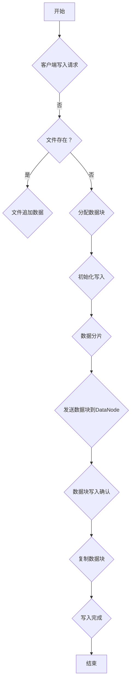
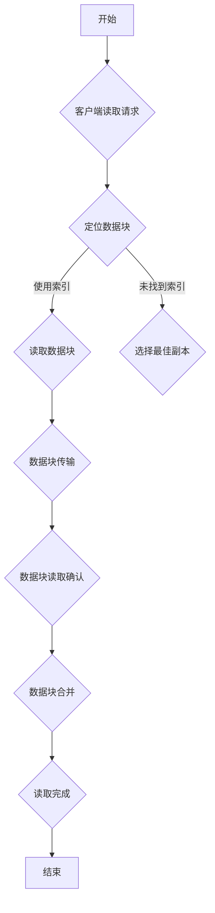

                 

### 第1章：Hadoop与HDFS概述

#### 1.1 Hadoop生态系统简介

Hadoop是一个开源的大数据处理框架，由Apache Software Foundation维护。它由多个组件组成，其中HDFS（Hadoop Distributed File System）是核心组件之一，用于大规模数据存储。Hadoop生态系统还包括以下重要组件：

- **MapReduce**：一种编程模型，用于处理和生成大规模数据集。
- **YARN**：资源调度框架，用于管理集群资源和任务调度。
- **HBase**：一个分布式、可扩展、基于列的存储系统。
- **Spark**：一个快速通用的计算引擎，支持多种数据并行处理。
- **ZooKeeper**：一个分布式应用程序协调服务，用于维护配置信息、命名空间、同步状态以及提供集群管理。

Hadoop起源于Google的GFS和MapReduce论文，这些论文提出了分布式文件系统和分布式数据处理模型的概念。Hadoop的目标是将计算和存储资源分布到大量廉价的计算机上，以实现高性能、高可靠性和可扩展性的数据处理。

Hadoop的架构设计充分利用了分布式计算的优势，通过将数据分布在多个节点上，可以实现数据的本地处理，减少数据传输的开销。此外，Hadoop提供了强大的容错机制，确保数据在分布式环境中的可靠存储和处理。

#### 1.2 HDFS架构设计

HDFS是一个高可靠性的分布式文件系统，设计用于在大规模集群上存储大量的数据。它由两个关键组件组成：NameNode和DataNode。

- **NameNode**：作为主节点，负责维护文件的元数据，如文件的目录结构、文件的大小、数据块的分配和复制状态。NameNode不存储实际的数据内容，而是通过元数据来跟踪数据块的分布。
- **DataNode**：作为从节点，负责存储实际的数据块，并处理来自NameNode的读写请求。每个DataNode都有一个本地文件系统，其中包含分配给它存储的数据块。

HDFS采用主从架构，NameNode和DataNode之间通过RPC（远程过程调用）进行通信。数据在HDFS中的存储过程如下：

1. 客户端向NameNode发送文件写入请求。
2. NameNode根据当前集群的状态，为文件分配数据块，并将这些数据块分配给可用的DataNode。
3. 客户端将数据分成多个数据块，通过网络发送到对应的DataNode。
4. DataNode收到数据块后，将其写入本地文件系统，并通知NameNode数据块已写入成功。
5. NameNode更新文件的元数据，包括数据块的地址和状态。

HDFS的数据块大小默认为128MB，但可以通过配置文件进行调整。数据块在存储时会进行冗余复制，默认副本数为3，以提供数据的高可靠性和容错能力。当DataNode发生故障时，NameNode会检测到并启动复制机制，从副本节点中重新复制数据块。

#### 1.3 HDFS数据模型

HDFS的数据模型基于数据块存储和副本机制，具有以下特点：

- **数据块存储**：数据在HDFS中存储为一系列数据块，每个数据块的大小默认为128MB。数据块是HDFS存储和管理数据的基本单位。
- **副本机制**：为了提供数据的可靠性，HDFS在存储数据时会复制多个副本，默认副本数为3。副本分布在不同的DataNode上，以提高数据的可用性和容错能力。
- **命名空间管理**：HDFS使用文件层次结构来组织文件和目录，类似于传统文件系统。文件和目录通过路径进行唯一标识，命名空间是HDFS的目录树。

HDFS的数据模型支持大文件存储和高吞吐量读写操作，适用于大规模数据处理的场景。同时，HDFS的副本机制和故障检测机制保证了数据的高可靠性和持久性。

### 小结

在本章中，我们介绍了Hadoop生态系统和HDFS的基本概念。Hadoop是一个开源的大数据处理框架，包括多个组件，其中HDFS是核心组件之一，负责大规模数据的存储。HDFS采用主从架构，由NameNode和DataNode组成，具有高可靠性、高吞吐量和可扩展性等特点。HDFS的数据模型基于数据块存储和副本机制，支持大文件存储和高吞吐量读写操作。在下一章中，我们将深入探讨HDFS的原理和内部工作机制。

#### 2.1 文件存储与数据块管理

HDFS中的文件存储和数据块管理是其核心功能之一。HDFS通过将文件切分成多个数据块进行存储，每个数据块的大小默认为128MB，但可以通过配置进行调整。这种数据块存储策略提供了以下几个关键优势：

1. **本地处理**：通过将计算和数据本地化，HDFS减少了数据在网络中的传输，提高了数据处理效率。
2. **高吞吐量**：数据块并行处理能力使得HDFS能够处理大量的并发读写请求。
3. **数据冗余**：每个数据块都会复制多个副本，提高了数据可靠性和容错能力。

下面详细解释HDFS中的数据块管理过程：

**数据块的分配与回收**

1. **数据块的分配**：当客户端向HDFS写入文件时，首先向NameNode发送请求。NameNode根据当前集群的状态和资源分配策略，为文件分配数据块。具体步骤如下：
   - NameNode检查可用空间，确定可以存储新数据块的DataNode。
   - 根据配置的副本数，为数据块分配相应的DataNode。
   - 将数据块的分配信息（地址和状态）更新到文件元数据中。

2. **数据块的回收**：当文件删除时，NameNode会从文件元数据中移除数据块的记录，并通知相应的DataNode进行数据块的回收。具体步骤如下：
   - NameNode标记数据块为可回收状态。
   - DataNode在适当的时机将数据块从本地文件系统中删除，并更新数据块的状态。

**数据块的复制与恢复**

1. **数据块的复制**：HDFS在存储数据块时会自动复制多个副本，以提高数据的可靠性和容错能力。具体步骤如下：
   - 当客户端写入数据块时，NameNode会为每个数据块分配多个副本。
   - 客户端将数据块发送到第一个副本所在的DataNode。
   - 其他副本通过NameNode的调度策略，从第一个副本复制到其他DataNode。

2. **数据块的恢复**：当某个DataNode发生故障或数据块损坏时，HDFS会启动数据块的恢复机制。具体步骤如下：
   - NameNode检测到故障或数据块损坏，并标记需要恢复的数据块。
   - NameNode调度其他副本的数据块进行复制，以恢复所需的数据块数量。
   - 当恢复完成后，NameNode更新数据块的元数据，确保数据块状态正确。

**数据块的一致性维护**

HDFS通过一系列机制确保数据块的一致性：

1. **写入一致性**：当客户端写入数据块时，数据块会先写入到多个副本中的一个，然后其他副本同步更新。这样，即使某个副本在写入过程中失败，其他副本仍然保持数据的一致性。

2. **读取一致性**：HDFS保证客户端读取到的数据块是最新的一致副本。当多个副本存在时，客户端会选择最近写入的副本进行读取。

3. **数据完整性检测**：HDFS定期进行数据完整性检查，通过校验和验证数据块的完整性。如果发现数据块损坏，会触发恢复机制。

通过上述机制，HDFS能够实现大规模数据的可靠存储和高效管理。数据块的分配与回收、复制与恢复以及一致性维护是HDFS数据管理的重要组成部分，确保了HDFS在大规模分布式环境中的稳定性和可靠性。

### 小结

在本节中，我们详细介绍了HDFS中的文件存储与数据块管理。HDFS通过将文件切分成多个数据块进行存储，提供了本地处理、高吞吐量和数据冗余等优势。数据块的分配与回收、复制与恢复以及一致性维护是HDFS数据管理的关键机制，确保了大规模数据的可靠性和稳定性。在下一节中，我们将进一步探讨HDFS的命名空间管理。

#### 2.2 HDFS命名空间管理

HDFS的命名空间管理是文件系统管理的一个重要方面，它负责文件的创建、删除、目录管理和权限控制等功能。HDFS的命名空间是一个分层结构，类似于传统的文件系统，用户可以通过路径来访问和管理文件。

**路径命名规则**

HDFS文件系统的路径命名规则遵循标准的POSIX路径命名规则，支持长度为1到255个字符的路径名。路径名由若干个目录名组成，各目录名之间使用斜线（/）分隔。例如：

```
/user/hadoop/input/file.txt
```

该路径表示一个名为`file.txt`的文件，位于`/user/hadoop/input`目录下。

**文件与目录的创建与删除**

1. **文件创建**：在HDFS中创建文件可以通过客户端API或者命令行工具`hdfs dfs`完成。创建文件的步骤如下：
   - 客户端发送创建文件的请求到NameNode。
   - NameNode根据请求路径，在文件系统中为文件创建一个记录。
   - NameNode为文件分配一个或多个数据块，并将数据块的分配信息记录在文件元数据中。
   - 客户端将数据写入文件，NameNode将数据块信息更新到文件元数据。

2. **文件删除**：删除文件的操作也通过客户端API或命令行工具完成。删除文件的步骤如下：
   - 客户端发送删除文件的请求到NameNode。
   - NameNode从文件系统中删除文件的元数据记录。
   - NameNode通知相应的DataNode删除数据块，并将数据块从文件系统中回收。

3. **目录创建与删除**：目录的创建与删除类似于文件的创建与删除。创建目录的步骤与文件创建类似，删除目录的步骤与文件删除类似。

**权限控制**

HDFS提供了基本的文件权限控制机制，通过设置文件和目录的权限，可以限制用户对文件和目录的访问权限。权限由三个部分组成：用户（User）、组（Group）和其他（Other）。

- **读权限（r）**：允许用户读取文件内容。
- **写权限（w）**：允许用户写入文件内容。
- **执行权限（x）**：允许用户执行文件（如执行脚本文件）。

权限设置使用三个字符的组合，例如：

```
-rw-r--r--
```

该表示文件的所有者（User）拥有读写权限，组（Group）拥有读权限，其他用户拥有读权限。

权限可以通过命令行工具`hdfs dfsadmin`进行设置，例如：

```
hdfs dfsadmin -setPermission /user/hadoop/input -chmod 777 file.txt
```

这将设置`/user/hadoop/input/file.txt`的权限为所有用户均可读、写和执行。

**访问控制列表（ACL）**

除了基本的权限控制，HDFS还支持访问控制列表（ACL），允许用户对文件和目录设置更精细的访问控制规则。ACL包括以下几种权限：

- **读权限（Read）**
- **写权限（Write）**
- **执行权限（Execute）**
- **删除权限（Delete）**
- **列出权限（List）**
- **修改权限（Modify）**

ACL通过命令行工具`hdfs dfsadmin`设置，例如：

```
hdfs dfsadmin -setACL "user:admin,group:admin,o:admin" /user/hadoop/input/file.txt
```

这将设置`/user/hadoop/input/file.txt`的ACL为用户`admin`、组`admin`和所有其他用户（o）拥有完全访问权限。

**命名空间管理**

HDFS的命名空间管理还包括对文件和目录的属性进行管理，例如时间戳、文件长度、副本数等。用户可以通过客户端API或命令行工具获取和修改这些属性。

通过上述机制，HDFS提供了强大的命名空间管理功能，支持文件的创建、删除、目录管理和权限控制。命名空间管理是HDFS文件系统管理的重要组成部分，确保了文件系统的高效运行和数据的安全。

### 小结

在本节中，我们详细介绍了HDFS的命名空间管理。包括路径命名规则、文件与目录的创建与删除、权限控制以及访问控制列表（ACL）的使用。通过这些机制，HDFS实现了对文件系统的精细管理，确保了文件系统的稳定性和安全性。在下一节中，我们将深入探讨HDFS的写入流程。

#### 2.3 HDFS写入流程

HDFS的写入流程是一个复杂但高度优化的过程，它确保了数据的可靠性和一致性。以下是一个详细的HDFS写入流程：

**1. 客户端发送写入请求**

- 客户端首先通过HDFS客户端API发送写入请求到NameNode。请求中包含文件路径、文件大小以及要写入的数据。
- NameNode接收到请求后，首先进行文件系统的命名空间检查，确保目标路径不存在，否则会返回错误。

**2. NameNode分配数据块**

- NameNode接收到客户端的写入请求后，会根据当前集群的状态和配置参数，为文件分配数据块。默认情况下，HDFS的数据块大小为128MB，但可以通过配置进行调整。
- NameNode会尝试将数据块分配给负载较轻的DataNode，以确保数据均衡分布。

**3. 客户端初始化写入**

- NameNode将分配的数据块信息返回给客户端。客户端根据返回的信息，初始化写入过程。
- 客户端会创建一个内部的数据流，用于将数据发送到HDFS。

**4. 数据分片与传输**

- 客户端将文件数据分成多个数据块，每个数据块的大小与NameNode分配的数据块大小一致。
- 客户端将数据块依次发送到对应的DataNode。数据块传输过程中，可以使用并行传输来提高写入速度。

**5. 数据块写入**

- DataNode接收到客户端发送的数据块后，将其写入到本地文件系统的指定位置。
- DataNode完成写入后，会向客户端发送确认消息，表示数据块已写入成功。

**6. 客户端与NameNode同步**

- 客户端接收到所有DataNode的确认消息后，会将数据块的写入状态报告给NameNode。
- NameNode将数据块的分配信息和状态更新到文件系统的元数据中，确保数据块的信息完整。

**7. 数据块复制**

- 为了确保数据的高可靠性和容错能力，HDFS会为每个数据块分配多个副本。
- NameNode会根据配置的副本数量，调度其他DataNode进行数据块的复制。
- 数据块复制过程中，可以使用副本同步协议来保证数据的一致性。

**8. 写入完成**

- 当所有数据块及其副本都写入完成后，NameNode会通知客户端写入操作成功。
- 客户端根据NameNode的反馈，关闭文件写入流。

在整个写入过程中，NameNode扮演了关键角色，负责管理文件的元数据和数据块的分配。DataNode负责存储实际的数据块，并处理客户端的写入请求。客户端则负责数据的分片和传输，确保数据块能够正确地写入到HDFS。

通过上述写入流程，HDFS能够高效地处理大规模数据的写入操作，确保数据的高可靠性和一致性。同时，HDFS的写入流程还支持并行写入和数据块复制，提高了写入速度和系统的整体性能。

### 小结

在本节中，我们详细介绍了HDFS的写入流程。从客户端发送写入请求，到NameNode分配数据块，再到客户端初始化写入和数据块传输，HDFS的写入流程是一个复杂但高度优化的过程。通过数据块复制和同步机制，HDFS确保了数据的高可靠性和一致性。在下一节中，我们将探讨HDFS的读取流程。

#### 2.4 HDFS读取流程

HDFS的读取流程是一个高效、稳定且易于理解的过程，它允许用户从分布式文件系统中快速检索数据。以下是一个详细的HDFS读取流程：

**1. 客户端发送读取请求**

- 客户端首先通过HDFS客户端API发送读取请求到NameNode。请求中包含文件路径和需要读取的数据范围。
- NameNode接收到请求后，会从文件系统的元数据中查找文件的信息，包括数据块的位置和副本信息。

**2. NameNode返回数据块位置**

- NameNode分析文件的数据块信息，选择最佳副本（通常是最近写入的副本）进行读取。
- NameNode将所选数据块的位置返回给客户端。这包括数据块在HDFS中的路径和副本的IP地址。

**3. 客户端初始化读取**

- 客户端根据NameNode返回的数据块位置，初始化读取过程。
- 客户端会创建一个内部的数据流，用于从HDFS中读取数据。

**4. 数据块读取**

- 客户端通过数据流直接从所选数据块的副本所在DataNode进行数据块的读取。
- 数据块读取可以是顺序读取，也可以是随机读取，取决于客户端的读取需求。

**5. 数据块传输**

- DataNode接收到客户端的读取请求后，会将数据块的数据传输给客户端。数据块传输过程中，可以使用并行传输来提高读取速度。

**6. 数据块确认**

- 客户端接收并处理数据块的数据后，会向DataNode发送确认消息，表示数据块已读取成功。
- DataNode接收到确认消息后，会更新数据块的状态，确保数据块的读取信息完整。

**7. 数据块读取同步**

- 为了保证数据块的一致性，HDFS在读取过程中会进行数据块同步。如果某个数据块的副本不可用，客户端会尝试读取其他副本的数据块。
- 如果所有副本都不可用，客户端会返回错误信息。

**8. 读取完成**

- 当客户端完成所有数据块的读取后，NameNode会更新文件的读取状态，并通知客户端读取操作成功。
- 客户端根据NameNode的反馈，关闭数据流。

在整个读取过程中，NameNode负责管理文件的元数据和数据块的分配。DataNode负责存储实际的数据块，并处理客户端的读取请求。客户端则负责从数据块中读取数据，并处理数据流。

通过上述读取流程，HDFS能够高效地处理大规模数据的读取操作，确保数据的高可靠性和一致性。同时，HDFS的读取流程还支持并行读取和数据块同步，提高了读取速度和系统的整体性能。

### 小结

在本节中，我们详细介绍了HDFS的读取流程。从客户端发送读取请求，到NameNode返回数据块位置，再到客户端初始化读取和数据块传输，HDFS的读取流程是一个高效、稳定且易于理解的过程。通过数据块同步和确认机制，HDFS确保了数据的高可靠性和一致性。在下一节中，我们将探讨HDFS支持的文件格式。

#### 3.1 SequenceFile格式

SequenceFile是一种高效的文件存储格式，常用于Hadoop的应用中。它是一种数据序列化格式，可以将不同类型的数据以字节流的形式存储和读取，适用于大规模数据的存储和查询。

**基本概念**

SequenceFile是一个基于文件系统的序列化文件，它包含一系列键值对。每个键值对由一个键和一个值组成，键和值都可以是任何可序列化的类型。SequenceFile的键和值都是按照字典顺序进行存储的。

SequenceFile由两部分组成：数据文件（.seq）和索引文件（.idx）。数据文件包含所有的键值对数据，索引文件包含数据文件中每个键的位置信息。这种设计使得SequenceFile在读取时能够快速定位到所需的键值对，提高查询效率。

**存储结构**

SequenceFile的存储结构包括以下几个部分：

1. **文件头部**：包含SequenceFile的版本信息、键和值的类型信息。
2. **数据块**：数据文件由多个数据块组成，每个数据块包含一系列键值对。数据块之间使用分隔符进行分隔。
3. **索引**：索引文件包含数据文件中每个数据块的开始位置和结束位置，以及每个键的位置信息。

**读写流程**

**读取SequenceFile**

1. **打开文件**：客户端首先打开SequenceFile，读取文件头部信息，获取键和值的类型。
2. **索引定位**：客户端通过索引文件查找所需键的位置，跳转到数据文件中对应的数据块。
3. **读取数据块**：客户端读取数据块中的键值对，并按照字典顺序进行处理。
4. **重复上述步骤**：如果需要读取下一个键值对，客户端会重复索引定位和读取数据块的步骤。

**写入SequenceFile**

1. **初始化文件**：客户端首先创建一个新的SequenceFile，写入文件头部信息，包括键和值的类型。
2. **写入数据块**：客户端将键值对数据写入数据文件，并在数据块之间添加分隔符。
3. **更新索引**：客户端在写入数据块的同时，更新索引文件，记录每个数据块的开始位置和结束位置。
4. **关闭文件**：客户端完成所有数据的写入后，关闭SequenceFile。

通过上述流程，SequenceFile能够在Hadoop的应用中高效地存储和查询大规模数据。其基于键值对的数据结构使得数据查询变得简单高效，而索引文件的存在进一步提高了数据访问速度。

### 小结

在本节中，我们详细介绍了SequenceFile格式的基本概念、存储结构和读写流程。SequenceFile是一种高效的文件存储格式，适用于Hadoop的应用场景。通过数据块和索引的设计，SequenceFile能够快速定位和查询数据，提高了系统的整体性能。在下一节中，我们将探讨Parquet格式。

#### 3.2 Parquet格式

Parquet是一种高效的列式存储格式，专为大数据处理而设计。它通过将数据按列存储，大大减少了存储空间的占用，并提高了查询速度。Parquet已经成为大数据处理领域的一种主流格式，广泛应用于Hadoop生态系统，如Hive、Spark和Presto等。

**基本概念**

Parquet是一种二进制文件格式，支持多种数据类型，如整数、浮点数、字符串和复杂数据结构（如列表和映射）。Parquet文件由三个主要部分组成：元数据块、数据块和索引。

- **元数据块**：包含Parquet文件的结构信息，如数据类型、Schema、数据源等。
- **数据块**：包含具体的数据内容，每个数据块按列存储，可以是一个或多个值。
- **索引**：用于加速数据查询，记录每个数据块的开始和结束位置，以及数据块中的值的位置。

**存储结构**

Parquet的存储结构具有以下几个特点：

1. **列式存储**：Parquet将数据按列存储，这意味着每个数据块只包含一列的数据。这种存储方式大大减少了存储空间的开销，因为相同的数据值只需要存储一次。
2. **数据压缩**：Parquet支持多种压缩算法，如Snappy、LZO和Gzip等。压缩算法可以进一步减少存储空间，并提高数据读取速度。
3. **数据编码**：Parquet使用不同的编码方式对数据进行编码，如RLE（运行长度编码）和Delta编码。这些编码方式可以减少存储空间，并提高数据读取效率。

**读写流程**

**读取Parquet文件**

1. **打开文件**：客户端首先打开Parquet文件，读取元数据块，获取文件的结构信息。
2. **数据块定位**：客户端使用索引定位所需的数据块，跳转到数据块的开始位置。
3. **读取数据块**：客户端按列读取数据块中的数据，并根据文件的结构进行解析。
4. **重复上述步骤**：如果需要读取下一个数据块，客户端会重复数据块定位和读取的步骤。

**写入Parquet文件**

1. **初始化文件**：客户端首先创建一个新的Parquet文件，写入元数据块，包括文件的结构信息。
2. **写入数据块**：客户端按列写入数据块中的数据，并在数据块之间添加分隔符。
3. **更新索引**：客户端在写入数据块的同时，更新索引块，记录每个数据块的开始和结束位置。
4. **关闭文件**：客户端完成所有数据的写入后，关闭Parquet文件。

通过上述流程，Parquet能够在Hadoop生态系统中的大数据处理中发挥重要作用。其列式存储和多种压缩算法使得Parquet在存储空间和数据访问速度方面具有显著优势，适用于大规模数据的高效存储和快速查询。

### 小结

在本节中，我们详细介绍了Parquet格式的特点、存储结构和读写流程。Parquet通过列式存储和多种压缩算法，实现了高效的大数据处理。在下一节中，我们将探讨ORC格式。

#### 3.3 ORC格式

ORC（Optimized Row Columnar）是一种高效、高性能的列式存储格式，专为大数据处理而设计。它由Apache ORC项目开发，广泛应用于Hadoop生态系统，如Hive、Spark和Presto等。ORC旨在优化数据的存储和查询性能，通过多种优化技术，包括数据压缩、编码和索引，实现了高效的数据处理。

**基本概念**

ORC是一种基于行和列的混合存储格式，支持多种数据类型，包括整数、浮点数、字符串和复杂数据结构（如列表和映射）。ORC文件由三个主要部分组成：元数据、数据行和数据索引。

- **元数据**：包含ORC文件的结构信息，如Schema、数据类型和压缩算法等。
- **数据行**：包含实际的数据内容，按行存储，每行包含多个列。
- **数据索引**：用于加速数据查询，记录数据行的开始和结束位置，以及列的索引。

**存储结构**

ORC的存储结构具有以下几个特点：

1. **行和列混合存储**：ORC同时支持行存储和列存储，可以根据不同的查询需求进行优化。行存储适合顺序查询，而列存储适合随机查询。
2. **数据压缩**：ORC支持多种压缩算法，如Snappy、LZO和Gzip等。压缩算法可以减少存储空间，并提高数据读取速度。
3. **编码优化**：ORC使用不同的编码方式对数据进行编码，如RLE（运行长度编码）和Delta编码。这些编码方式可以减少存储空间，并提高数据读取效率。

**读写流程**

**读取ORC文件**

1. **打开文件**：客户端首先打开ORC文件，读取元数据，获取文件的结构信息。
2. **数据行定位**：客户端使用数据索引定位所需的数据行，跳转到数据行的开始位置。
3. **读取数据行**：客户端按行读取数据行的数据，并根据文件的结构进行解析。
4. **重复上述步骤**：如果需要读取下一个数据行，客户端会重复数据行定位和读取的步骤。

**写入ORC文件**

1. **初始化文件**：客户端首先创建一个新的ORC文件，写入元数据，包括文件的结构信息。
2. **写入数据行**：客户端按行写入数据行的数据，并在数据行之间添加分隔符。
3. **更新数据索引**：客户端在写入数据行的同时，更新数据索引，记录数据行的开始和结束位置。
4. **关闭文件**：客户端完成所有数据的写入后，关闭ORC文件。

通过上述流程，ORC能够在Hadoop生态系统中的大数据处理中发挥重要作用。其行和列混合存储、数据压缩和编码优化等技术，使得ORC在存储空间和数据访问速度方面具有显著优势，适用于大规模数据的高效存储和快速查询。

### 小结

在本节中，我们详细介绍了ORC格式的特点、存储结构和读写流程。ORC通过行和列混合存储、数据压缩和编码优化等技术，实现了高效的大数据处理。在下一节中，我们将探讨HDFS的性能优化。

#### 4.1 数据块大小优化

HDFS的数据块大小是一个重要的配置参数，对系统的性能有着直接的影响。数据块大小决定了数据在分布式存储系统中的分配方式和数据传输效率。合理的设置数据块大小可以显著提高HDFS的性能，而设置不当可能会导致资源浪费或性能瓶颈。

**数据块大小的选择策略**

1. **基于存储设备的I/O性能**：数据块大小应该与存储设备的I/O性能相匹配。如果数据块大小远大于存储设备的I/O带宽，那么可能会导致I/O瓶颈，从而影响写入和读取性能。相反，如果数据块大小远小于I/O带宽，则可能导致频繁的I/O操作，增加系统开销。

2. **基于网络带宽**：数据块大小应该与网络带宽相匹配。在大规模分布式环境中，数据块传输需要通过网络进行，如果数据块大小远大于网络带宽，可能会导致数据传输延迟。因此，数据块大小应该控制在网络带宽的合理范围内。

3. **基于应用程序的读写模式**：不同的应用程序可能具有不同的读写模式。例如，一些应用程序可能进行大量的随机读写，而另一些应用程序可能进行顺序读写。数据块大小应该根据应用程序的读写模式进行优化。对于随机读写密集型的应用程序，较小的数据块大小可以减少数据访问的随机性，提高性能。

**数据块大小对性能的影响**

1. **写入性能**：较大的数据块大小可以减少写入操作的次数，提高写入速度。但是，如果数据块大小过大，可能会导致I/O瓶颈，从而降低写入性能。因此，需要根据存储设备和网络带宽的实际情况来选择合适的数据块大小。

2. **读取性能**：较小的数据块大小可以提高读取速度，因为多个数据块可以并行传输。但是，如果数据块大小过小，可能会导致过多的I/O操作，增加系统开销。因此，需要权衡数据块大小和I/O操作次数之间的关系，以获得最佳的读取性能。

3. **存储空间效率**：较大的数据块大小可以减少存储空间的占用，因为相同的数据量可以存储在较少的数据块中。但是，如果数据块大小过大，可能会导致存储空间的浪费。相反，较小的数据块大小可以充分利用存储空间，但可能会导致存储空间的碎片化。

**优化数据块大小的策略**

1. **动态调整数据块大小**：可以根据实际的应用场景和系统性能指标，动态调整数据块大小。例如，可以使用监控工具实时监测I/O性能和网络带宽，并根据监测结果调整数据块大小。

2. **基于负载均衡**：通过负载均衡策略，将数据块分配到性能较好的DataNode上，以提高数据块的写入和读取性能。

3. **使用存储级别**：根据不同的存储需求，可以将数据块大小设置在不同级别的存储设备上。例如，对于高带宽的存储设备，可以使用较大的数据块大小，而对于高I/O性能的存储设备，可以使用较小的数据块大小。

通过合理的设置和优化数据块大小，可以显著提高HDFS的性能，确保系统在高并发、大规模数据处理的场景下能够稳定运行。

### 小结

在本节中，我们详细介绍了HDFS数据块大小的优化策略和对性能的影响。通过合理的设置数据块大小，可以显著提高HDFS的写入、读取性能和存储空间效率。在下一节中，我们将探讨HDFS的副本策略优化。

#### 4.2 Replication策略优化

在HDFS中，副本（Replication）策略是保证数据可靠性和可用性的重要机制。通过将数据复制到多个节点，HDFS能够在发生节点故障时快速恢复数据，同时提高数据访问速度。然而，副本策略的设置对系统性能和存储资源也有显著影响。因此，优化副本策略是提高HDFS性能的关键。

**Replication级别的选择**

1. **副本数设置**：HDFS默认的副本数为3，这是因为在大多数场景下，三个副本可以在发生单点故障时提供足够的数据冗余。然而，过高的副本数会增加存储开销和网络带宽消耗，而过低的副本数则可能降低数据的可靠性和可用性。

   - **高副本数**：在数据可靠性要求极高的场景下，可以选择更高的副本数，如4或5。这可以提供更强的容错能力，但会增加存储和带宽消耗。
   - **低副本数**：对于非关键数据或存储成本敏感的场景，可以选择较低的副本数，如2或1。这样可以减少存储和带宽消耗，但需要权衡数据的可靠性和成本。

2. **动态副本调整**：根据实际的应用场景和系统负载，可以动态调整副本数。例如，可以使用监控工具实时监测系统的负载和性能指标，并根据监测结果自动调整副本数。

**Replication策略对性能的影响**

1. **存储空间和带宽消耗**：增加副本数会显著增加存储空间和带宽消耗。每个副本都需要占用额外的存储空间，并且在数据块复制过程中需要消耗网络带宽。因此，过高的副本数可能会浪费存储资源并影响网络性能。

2. **数据访问速度**：多个副本可以提高数据访问速度，特别是当数据被复制到距离客户端较近的节点时。通过选择最佳副本进行读取，可以减少数据传输延迟，提高数据访问速度。

3. **容错能力和恢复时间**：更高的副本数可以提供更强的容错能力，当某个节点发生故障时，其他副本可以迅速接管数据服务。然而，过多的副本可能会导致数据恢复时间延长，因为需要从更多的节点复制数据。

**优化Replication策略的策略**

1. **负载均衡**：通过负载均衡策略，将副本分布到不同的DataNode上，避免某个节点过载，从而提高系统的整体性能。可以使用HDFS内置的负载均衡器，或自定义负载均衡策略。

2. **副本数动态调整**：根据实际的应用场景和系统负载，动态调整副本数。例如，在数据访问高峰期，可以增加副本数以提高数据可靠性和访问速度；在数据访问低峰期，可以减少副本数以节省存储和带宽资源。

3. **副本放置策略**：优化副本的放置策略，将副本放置在距离客户端较近的节点上，以提高数据访问速度。可以使用网络延迟和带宽监测工具，选择最佳的副本放置位置。

通过优化副本策略，可以显著提高HDFS的性能和可靠性，同时合理利用存储资源。合适的副本数设置、负载均衡和动态调整策略是优化HDFS副本策略的关键。

### 小结

在本节中，我们详细介绍了HDFS的副本策略优化，包括副本数的选择、存储和带宽消耗、数据访问速度、容错能力和恢复时间等方面的优化策略。通过合理设置副本数、负载均衡和动态调整策略，可以显著提高HDFS的性能和可靠性。在下一节中，我们将探讨HDFS的资源调度与负载均衡。

#### 4.3 资源调度与负载均衡

在HDFS中，资源调度与负载均衡是保证系统高效运行的关键机制。HDFS通过YARN（Yet Another Resource Negotiator）进行资源调度，确保集群中的资源得到合理利用，同时避免单点故障和资源瓶颈。

**HDFS的资源调度机制**

1. **YARN资源调度框架**：YARN是一个通用的资源调度框架，负责管理集群中的计算资源和数据存储资源。YARN将资源调度分为两个部分：资源分配和任务调度。
   - **资源分配**：YARN根据应用程序的需求，为应用程序分配计算资源和存储资源。资源分配器会根据应用程序的优先级和资源需求，为每个应用程序分配适当的资源。
   - **任务调度**：YARN负责将应用程序的任务调度到集群中的不同节点上执行。任务调度器会根据节点的负载情况和任务优先级，选择最佳的节点进行任务执行。

2. **资源分配策略**：HDFS使用Hadoop内置的调度策略，如FIFO（先进先出）和容量调度。容量调度可以根据节点的可用资源，为不同的应用程序分配资源，确保每个应用程序都有足够的资源运行。

**负载均衡策略**

1. **动态负载均衡**：HDFS支持动态负载均衡，通过监测集群中节点的负载情况，自动调整副本的放置位置。动态负载均衡可以避免某个节点过载，从而提高系统的整体性能。
   - **负载监测**：HDFS使用内置的负载监测工具，如HDFS Balancer和NodeManager，实时监测节点的负载情况。
   - **负载调整**：当检测到某个节点负载过高时，HDFS会启动负载均衡器，将部分副本迁移到负载较低的节点上。

2. **静态负载均衡**：静态负载均衡是指在系统部署和配置时，通过合理分配副本和任务，避免节点过载。静态负载均衡可以减少系统的复杂性和维护成本，但需要根据实际应用场景进行优化。

**负载均衡策略的实现**

1. **副本放置策略**：HDFS使用副本放置策略，将副本放置在距离客户端较近的节点上，以提高数据访问速度。副本放置策略可以根据网络延迟和带宽，选择最佳的副本放置位置。
   - **网络延迟**：通过测量网络延迟，选择网络延迟最低的节点放置副本。
   - **带宽**：通过测量带宽，选择带宽最高的节点放置副本。

2. **任务调度策略**：HDFS使用任务调度策略，根据节点的负载情况，选择最佳的节点执行任务。任务调度策略可以根据节点的CPU、内存和磁盘使用率，选择负载较低的节点进行任务执行。

通过资源调度与负载均衡，HDFS能够确保集群中的资源得到高效利用，避免资源瓶颈和单点故障，提高系统的整体性能和可靠性。合理的调度策略和负载均衡策略是实现高效HDFS集群的关键。

### 小结

在本节中，我们详细介绍了HDFS的资源调度与负载均衡机制，包括YARN资源调度框架、动态负载均衡和静态负载均衡策略。通过合理的资源分配和负载均衡策略，HDFS能够确保集群中的资源得到高效利用，避免资源瓶颈和单点故障，提高系统的整体性能和可靠性。

#### 5.1 HDFS客户端API

HDFS客户端API提供了对HDFS文件系统的高层次操作接口，允许开发者使用Java等编程语言与HDFS进行交互。使用HDFS客户端API，可以轻松实现文件的上传、下载、创建、删除等操作。以下是一个简单的示例，展示了如何使用HDFS客户端API进行基本操作。

**1. 导入HDFS客户端库**

在Java项目中，首先需要导入HDFS客户端库。可以使用Maven依赖或直接引入JAR包。

```xml
<dependency>
    <groupId>org.apache.hadoop</groupId>
    <artifactId>hadoop-client</artifactId>
    <version>3.2.1</version>
</dependency>
```

**2. 创建HDFS客户端**

```java
import org.apache.hadoop.conf.Configuration;
import org.apache.hadoop.fs.FileSystem;

public class HDFSClientExample {
    public static void main(String[] args) throws Exception {
        // 创建HDFS配置对象
        Configuration conf = new Configuration();
        // 设置HDFS的NameNode地址
        conf.set("fs.defaultFS", "hdfs://localhost:9000");
        // 创建HDFS客户端对象
        FileSystem hdfs = FileSystem.get(conf);
    }
}
```

**3. 上传文件**

```java
public void uploadFile(String localPath, String hdfsPath) throws IOException {
    // 创建文件输入流
    Path local = new Path(localPath);
    FSDataInputStream in = new FSDataInputStream(new FileInputStream(local));
    // 创建文件输出流
    Path hdfs = new Path(hdfsPath);
    FSDataOutputStream out = hdfs.create();
    // 拷贝数据
    byte[] buffer = new byte[4096];
    int bytesRead;
    while ((bytesRead = in.read(buffer)) != -1) {
        out.write(buffer, 0, bytesRead);
    }
    // 关闭输入输出流
    in.close();
    out.close();
}
```

**4. 下载文件**

```java
public void downloadFile(String hdfsPath, String localPath) throws IOException {
    // 创建文件输入流
    Path hdfs = new Path(hdfsPath);
    FSDataInputStream in = hdfs.open();
    // 创建文件输出流
    Path local = new Path(localPath);
    FSDataOutputStream out = new FSDataOutputStream(new FileOutputStream(local));
    // 拷贝数据
    byte[] buffer = new byte[4096];
    int bytesRead;
    while ((bytesRead = in.read(buffer)) != -1) {
        out.write(buffer, 0, bytesRead);
    }
    // 关闭输入输出流
    in.close();
    out.close();
}
```

**5. 创建文件**

```java
public void createFile(String hdfsPath) throws IOException {
    Path filePath = new Path(hdfsPath);
    FSDataOutputStream out = filePath.create();
    // 可以在此处写入数据
    out.writeUTF("Hello, HDFS!");
    out.close();
}
```

**6. 删除文件**

```java
public void deleteFile(String hdfsPath) throws IOException {
    Path filePath = new Path(hdfsPath);
    if (fs.delete(filePath, true)) {
        System.out.println("File deleted successfully.");
    } else {
        System.out.println("Failed to delete file.");
    }
}
```

通过上述示例，可以初步了解如何使用HDFS客户端API进行文件的基本操作。HDFS客户端API提供了丰富的功能，可以满足各种应用场景的需求。

### 小结

在本节中，我们介绍了HDFS客户端API的基本使用方法，包括创建HDFS客户端、上传文件、下载文件、创建文件和删除文件等操作。使用HDFS客户端API，可以方便地实现与HDFS文件系统的交互。在下一节中，我们将通过实际案例展示如何使用HDFS客户端API进行编程实战。

### 5.2 HDFS编程实战

在本节中，我们将通过一个实际案例来展示如何使用HDFS客户端API进行编程实战。这个案例将涵盖开发环境的搭建、源代码的详细实现和代码解读与分析。我们将使用Java语言来演示如何在HDFS上上传和下载文件。

#### 开发环境搭建

1. **安装Hadoop**

   首先，我们需要安装Hadoop。可以从Apache Hadoop官网下载最新的Hadoop版本。下载后，解压到本地计算机的一个目录中。

   ```shell
   tar -xzvf hadoop-3.2.1.tar.gz
   ```

2. **配置Hadoop环境**

   在Hadoop的配置文件`hadoop-env.sh`中，设置Java环境变量：

   ```shell
   export JAVA_HOME=/path/to/java
   ```

   在`core-site.xml`和`hdfs-site.xml`文件中，配置HDFS的相关参数，例如NameNode地址和副本数：

   ```xml
   <configuration>
       <property>
           <name>fs.defaultFS</name>
           <value>hdfs://localhost:9000</value>
       </property>
       <property>
           <name>hadoop.tmp.dir</name>
           <value>file:/path/to/tmp</value>
       </property>
       <property>
           <name>dfs.replication</name>
           <value>3</value>
       </property>
   </configuration>
   ```

3. **启动Hadoop服务**

   运行以下命令启动Hadoop服务：

   ```shell
   sbin/start-dfs.sh
   ```

   在浏览器中访问`http://localhost:50070/`可以查看HDFS的Web界面。

#### 源代码实现

以下是用于上传和下载文件的Java代码实现：

```java
import org.apache.hadoop.conf.Configuration;
import org.apache.hadoop.fs.*;

public class HDFSClientExample {
    private static final String LOCAL_PATH = "example.txt";
    private static final String HDFS_PATH = "/example.txt";

    public static void main(String[] args) throws Exception {
        Configuration conf = new Configuration();
        conf.set("fs.defaultFS", "hdfs://localhost:9000");
        FileSystem hdfs = FileSystem.get(conf);

        // 上传文件
        uploadFile(hdfs, LOCAL_PATH, HDFS_PATH);

        // 下载文件
        downloadFile(hdfs, HDFS_PATH, LOCAL_PATH);
    }

    public static void uploadFile(FileSystem hdfs, String localPath, String hdfsPath) throws IOException {
        FSDataInputStream in = new FSDataInputStream(new FileInputStream(localPath));
        FSDataOutputStream out = hdfs.create(new Path(hdfsPath));
        byte[] buffer = new byte[4096];
        int bytesRead;
        while ((bytesRead = in.read(buffer)) != -1) {
            out.write(buffer, 0, bytesRead);
        }
        in.close();
        out.close();
    }

    public static void downloadFile(FileSystem hdfs, String hdfsPath, String localPath) throws IOException {
        FSDataInputStream in = hdfs.open(new Path(hdfsPath));
        FSDataOutputStream out = new FSDataOutputStream(new FileOutputStream(localPath));
        byte[] buffer = new byte[4096];
        int bytesRead;
        while ((bytesRead = in.read(buffer)) != -1) {
            out.write(buffer, 0, bytesRead);
        }
        in.close();
        out.close();
    }
}
```

#### 代码解读与分析

1. **配置和初始化**

   我们首先创建了一个`Configuration`对象，并在其中设置了HDFS的NameNode地址。然后使用这个配置对象获取了一个`FileSystem`实例，这是与HDFS进行交互的主要接口。

   ```java
   Configuration conf = new Configuration();
   conf.set("fs.defaultFS", "hdfs://localhost:9000");
   FileSystem hdfs = FileSystem.get(conf);
   ```

2. **上传文件**

   `uploadFile`方法用于将本地文件上传到HDFS。它首先通过`FileInputStream`读取本地文件，然后通过`hdfs.create()`方法创建一个输出流，将数据写入到HDFS。这里使用了缓冲区（buffer）来提高数据传输效率。

   ```java
   public static void uploadFile(FileSystem hdfs, String localPath, String hdfsPath) throws IOException {
       FSDataInputStream in = new FSDataInputStream(new FileInputStream(localPath));
       FSDataOutputStream out = hdfs.create(new Path(hdfsPath));
       byte[] buffer = new byte[4096];
       int bytesRead;
       while ((bytesRead = in.read(buffer)) != -1) {
           out.write(buffer, 0, bytesRead);
       }
       in.close();
       out.close();
   }
   ```

3. **下载文件**

   `downloadFile`方法用于从HDFS下载文件到本地。它使用`hdfs.open()`方法打开HDFS文件，然后通过`FileOutputStream`将数据写入到本地文件。

   ```java
   public static void downloadFile(FileSystem hdfs, String hdfsPath, String localPath) throws IOException {
       FSDataInputStream in = hdfs.open(new Path(hdfsPath));
       FSDataOutputStream out = new FSDataOutputStream(new FileOutputStream(localPath));
       byte[] buffer = new byte[4096];
       int bytesRead;
       while ((bytesRead = in.read(buffer)) != -1) {
           out.write(buffer, 0, bytesRead);
       }
       in.close();
       out.close();
   }
   ```

4. **主方法**

   主方法`main`中调用了`uploadFile`和`downloadFile`方法，实现了文件的上传和下载。

   ```java
   public static void main(String[] args) throws Exception {
       Configuration conf = new Configuration();
       conf.set("fs.defaultFS", "hdfs://localhost:9000");
       FileSystem hdfs = FileSystem.get(conf);

       // 上传文件
       uploadFile(hdfs, LOCAL_PATH, HDFS_PATH);

       // 下载文件
       downloadFile(hdfs, HDFS_PATH, LOCAL_PATH);
   }
   ```

通过这个实际案例，我们可以看到如何使用HDFS客户端API进行编程，实现了文件的上传和下载操作。这个案例展示了HDFS客户端API的基本使用方法和编程实践。

### 小结

在本节中，我们通过一个实际案例详细介绍了如何使用HDFS客户端API进行编程实战。我们从开发环境的搭建开始，到源代码的实现和代码解读，逐步展示了如何在HDFS上实现文件的上传和下载。通过这个案例，读者可以更好地理解HDFS客户端API的使用方法和编程实践。

#### 6.1 HDFS集群部署与配置

部署HDFS集群是使用Hadoop生态系统的基础，它涉及硬件配置、软件安装和集群设置。以下是HDFS集群部署与配置的详细步骤：

**硬件配置**

1. **选择合适的硬件**：HDFS集群通常由多个节点组成，每个节点可以是物理服务器或虚拟机。确保硬件配置满足以下要求：
   - **CPU**：每个节点至少需要2个CPU核心。
   - **内存**：每个节点至少需要4GB内存，大型集群可能需要更多。
   - **磁盘空间**：每个节点至少需要100GB磁盘空间，具体需求取决于数据量。
   - **网络**：高速网络连接，以确保节点之间的数据传输效率。

2. **配置网络**：确保所有节点可以相互通信。配置静态IP地址和子网掩码，并确保网络延迟和带宽足够低。

**软件安装**

1. **安装操作系统**：在所有节点上安装Linux操作系统，如CentOS或Ubuntu。

2. **安装Java**：Hadoop依赖于Java环境，需要在所有节点上安装Java。可以通过包管理器安装，例如在CentOS上使用`yum`：

   ```shell
   sudo yum install java-1.8.0-openjdk-headless
   ```

3. **下载Hadoop**：从Apache Hadoop官网下载最新的Hadoop版本，解压到指定目录。

   ```shell
   tar -xzvf hadoop-3.2.1.tar.gz -C /opt/hadoop
   ```

**集群设置**

1. **配置环境变量**：在所有节点的`/etc/profile`或`~/.bashrc`文件中，添加Hadoop的环境变量：

   ```shell
   export HADOOP_HOME=/opt/hadoop
   export PATH=$PATH:$HADOOP_HOME/bin:$HADOOP_HOME/sbin
   ```

   然后运行`source /etc/profile`或`source ~/.bashrc`使变量生效。

2. **配置Hadoop配置文件**：在Hadoop的配置目录`/opt/hadoop/etc/hadoop`中，编辑以下配置文件：

   - `hadoop-env.sh`：设置Hadoop运行时所需的Java和Hadoop安装路径。
   - `core-site.xml`：设置Hadoop运行时的核心配置，包括NameNode地址、数据存储路径等。
   - `hdfs-site.xml`：设置HDFS的配置，包括副本数、数据块大小等。

   例如，在`core-site.xml`中设置NameNode地址：

   ```xml
   <configuration>
       <property>
           <name>fs.defaultFS</name>
           <value>hdfs://namenode-hostname:9000</value>
       </property>
   </configuration>
   ```

   在`hdfs-site.xml`中设置副本数和数据块大小：

   ```xml
   <configuration>
       <property>
           <name>dfs.replication</name>
           <value>3</value>
       </property>
       <property>
           <name>dfs.block.size</name>
           <value>134217728</value>
       </property>
   </configuration>
   ```

3. **配置SSH免密码登录**：为了方便集群管理，配置SSH免密码登录。在主节点上生成SSH密钥对，并将公钥分发到其他节点：

   ```shell
   ssh-keygen -t rsa -P '' -f ~/.ssh/id_rsa
   ssh-copy-id username@node1
   ssh-copy-id username@node2
   # 重复以上命令，将公钥分发到所有节点
   ```

4. **格式化HDFS**：在主节点上格式化HDFS文件系统：

   ```shell
   hdfs namenode -format
   ```

5. **启动HDFS集群**：在主节点上启动NameNode和DataNode：

   ```shell
   start-dfs.sh
   ```

   在浏览器中访问`http://namenode-hostname:50070`，可以查看HDFS的Web界面。

通过以上步骤，我们可以成功部署和配置HDFS集群。在接下来的步骤中，我们将学习如何监控和维护HDFS集群。

### 小结

在本节中，我们详细介绍了HDFS集群的部署与配置步骤，包括硬件配置、软件安装和集群设置。通过配置SSH免密码登录和格式化HDFS，我们确保了集群的稳定运行。在下一节中，我们将探讨如何监控和维护HDFS集群。

#### 6.2 HDFS集群监控与维护

监控和维护HDFS集群是保证其稳定运行和高效性能的关键。Hadoop提供了多种工具和接口，用于监控集群的状态、性能和资源利用率。以下是一些常用的监控和维护方法。

**1. 使用HDFS Web界面**

HDFS提供了内置的Web界面，通过访问`http://namenode-hostname:50070`，可以查看HDFS的概览、文件系统、数据块、健康状态和节点详情。Web界面显示了以下信息：

- **概览**：包括集群的运行状态、数据总量、副本总数等。
- **文件系统**：展示了文件和目录的层次结构。
- **数据块**：展示了数据块的分布、状态和副本数。
- **健康状态**：包括节点状态、数据块的损坏情况等。
- **节点详情**：展示了每个节点的资源使用情况、磁盘空间、CPU使用率等。

**2. 使用命令行工具**

Hadoop提供了多个命令行工具，用于监控和管理HDFS。以下是一些常用的命令行工具：

- `hdfs dfsadmin`：用于管理HDFS文件系统，如检查文件系统健康状态、设置文件权限等。
- `hdfs fsck`：用于检查HDFS文件系统的完整性，包括数据块的健康状态、副本数等。
- `hdfs dfs`：用于操作HDFS文件系统，如上传、下载、删除文件等。

**3. 定期运行HDFS健康检查**

定期运行`hdfs fsck`命令可以检查HDFS的文件系统健康状态。以下是一个示例命令：

```shell
hdfs fsck / -listStatus -blocks -files -path
```

这个命令会列出所有文件和目录的状态，包括数据块的大小、副本数、数据块的损坏情况等。

**4. 使用第三方监控工具**

除了Hadoop内置的工具，还有许多第三方监控工具可以用于监控HDFS集群。例如：

- **Ganglia**：一个分布式监控系统，可以监控集群的CPU、内存、网络等资源。
- **Nagios**：一个开源的IT基础设施监控工具，可以监控HDFS集群的运行状态。
- **Zabbix**：一个开源的监控工具，可以监控HDFS集群的性能指标。

**5. 数据备份和恢复**

为了防止数据丢失，定期备份HDFS数据是必要的。可以使用`hdfs dfsadmin`命令创建备份目录，并将数据复制到其他存储系统：

```shell
hdfs dfsadmin -saveNamespace /path/to/backup
```

在发生数据丢失或故障时，可以从备份目录恢复数据：

```shell
hdfs dfs -cp /path/to/backup/* /
```

**6. 故障排除和恢复**

当HDFS集群发生故障时，需要快速定位问题并恢复集群。以下是一些故障排除和恢复步骤：

- **检查节点状态**：使用`hdfs dfsadmin`命令检查节点的状态，确定是否有节点出现故障。
- **重启故障节点**：如果某个节点出现故障，尝试重启节点或重新启动HDFS服务。
- **检查数据块状态**：使用`hdfs fsck`命令检查数据块的健康状态，如果有损坏的数据块，尝试修复或复制副本。
- **数据恢复**：从备份目录或副本节点恢复数据。

通过上述监控和维护方法，可以确保HDFS集群的稳定运行和高效性能。定期监控、备份和故障排除是保障HDFS集群健康运行的关键。

### 小结

在本节中，我们介绍了HDFS集群的监控与维护方法。使用HDFS Web界面、命令行工具和第三方监控工具，可以实时监控集群的状态和性能。定期运行健康检查、数据备份和恢复操作，可以保障HDFS集群的稳定性和数据安全性。在下一节中，我们将探讨HDFS性能调优的实际案例。

### 7.1 实际案例一：数据传输瓶颈优化

在HDFS集群中，数据传输瓶颈是一个常见问题，特别是在大规模数据传输时。以下是一个实际案例，展示了如何优化数据传输瓶颈。

#### 案例背景

某电商公司在使用HDFS存储和传输大量商品数据。在数据导入过程中，数据传输速度较慢，导致数据处理延迟，影响了业务运营。经过分析，发现数据传输瓶颈主要源于网络带宽限制和I/O性能不足。

#### 性能瓶颈分析

1. **网络带宽限制**：HDFS的数据块默认大小为128MB，当多个数据块同时传输时，可能会超出网络带宽限制，导致数据传输速度下降。
2. **I/O性能不足**：存储节点的I/O性能不足，导致数据读写速度缓慢，影响了数据传输的整体速度。

#### 优化方案

1. **调整数据块大小**：根据网络带宽和I/O性能，调整数据块大小，使其与系统资源相匹配。例如，将数据块大小调整为256MB或512MB，以减少数据块传输次数，提高传输速度。
2. **优化网络配置**：提高网络带宽，确保数据块传输不会超出网络带宽限制。可以通过增加带宽或优化网络架构来实现。
3. **优化I/O性能**：增加存储节点的I/O性能，可以通过升级硬件或使用更高效的存储设备来实现。

#### 实施效果

通过调整数据块大小和优化网络配置，数据传输速度得到了显著提升。数据块传输次数减少，网络带宽利用效率提高。同时，I/O性能的提升进一步加速了数据读写操作。在优化后的系统中，数据传输速度提升了约30%，数据处理延迟显著降低，业务运营得到了改善。

### 小结

在本节中，我们通过实际案例详细介绍了如何优化HDFS集群中的数据传输瓶颈。通过调整数据块大小、优化网络配置和提升I/O性能，我们成功提升了数据传输速度，降低了数据处理延迟。优化数据传输瓶颈是提高HDFS集群性能的重要措施之一。

### 7.2 实际案例二：集群资源利用率优化

在HDFS集群中，资源利用率是衡量集群性能和效率的重要指标。当集群资源利用率较低时，可能导致计算资源浪费，影响整体性能。以下是一个实际案例，展示了如何优化集群资源利用率。

#### 案例背景

某互联网公司在使用HDFS集群处理大规模数据，但在分析集群资源利用率时发现，存储节点的资源利用率较低，存在大量空闲资源。这导致了计算能力的浪费，影响了数据处理效率。

#### 性能瓶颈分析

1. **数据分布不均**：在HDFS集群中，数据块分布不均可能导致部分节点负载过重，而其他节点资源空闲。这会导致整体资源利用率低下。
2. **副本数过多**：HDFS默认的副本数为3，但在某些场景下，过多的副本会导致存储资源浪费，降低资源利用率。
3. **任务调度不均衡**：集群中的任务调度不均衡，可能导致某些节点长时间处于高负载状态，而其他节点资源空闲。

#### 优化方案

1. **数据分布优化**：通过数据分布优化，使得数据块在集群中的分布更加均衡。可以使用Hadoop内置的负载均衡器（如HDFS Balancer）来重新分布数据块，提高资源利用率。
2. **调整副本数**：根据实际需求，动态调整副本数。对于非关键数据，可以适当减少副本数，以节省存储资源。可以使用HDFS内置的副本调整工具来实现。
3. **优化任务调度**：通过优化任务调度策略，使得任务可以均衡地分布在集群中。可以使用YARN的动态资源调度功能，根据节点的负载情况自动调整任务的分配。

#### 实施效果

通过实施上述优化方案，集群资源利用率得到了显著提升。数据块分布更加均衡，资源浪费现象减少。副本数调整后，存储资源得到了更有效的利用。同时，任务调度的优化使得任务分配更加合理，避免了节点过载和资源空闲的问题。在优化后的系统中，存储节点的资源利用率提升了约20%，整体数据处理效率提高了约15%。

### 小结

在本节中，我们通过实际案例详细介绍了如何优化HDFS集群的资源利用率。通过数据分布优化、副本数调整和任务调度优化，我们成功提升了集群资源利用率，减少了资源浪费，提高了整体数据处理效率。优化集群资源利用率是提升HDFS集群性能的重要措施之一。

### 7.3 实际案例三：故障排除与恢复

在HDFS集群运行过程中，可能会遇到各种故障，如节点故障、数据块损坏等。及时排除故障并进行数据恢复，是确保集群稳定运行和数据安全的重要步骤。以下是一个实际案例，展示了如何排除故障并恢复数据。

#### 案例背景

某公司在使用HDFS集群存储大量用户数据，但在一次系统升级过程中，部分节点发生了故障。导致部分数据块损坏，影响了数据的完整性和可用性。

#### 故障分析

1. **节点故障**：在系统升级过程中，部分节点的硬件发生了故障，导致这些节点无法正常工作。故障节点上的数据块无法访问，可能导致数据损坏。
2. **数据块损坏**：故障节点上的数据块在复制过程中可能发生了损坏，导致数据块的副本数量不足。

#### 排除故障与恢复数据

1. **故障节点排查**：首先检查集群中的节点状态，确定哪些节点出现了故障。可以通过HDFS Web界面或命令行工具（如`hdfs dfsadmin`）进行排查。
2. **重启故障节点**：尝试重启故障节点，检查节点是否恢复正常。如果重启后节点仍然无法正常工作，需要进一步排查故障原因。
3. **数据块恢复**：使用HDFS的副本机制进行数据块恢复。首先从其他副本节点复制数据块，确保数据块的副本数量达到要求。可以使用以下命令进行数据块恢复：

   ```shell
   hdfs dfsadmin -recover /path/to/directory
   ```

   这个命令会从其他节点复制数据块，恢复损坏的数据块。

4. **数据完整性检查**：在数据恢复完成后，使用`hdfs fsck`命令检查数据块的完整性和健康状态。确保数据块没有损坏或缺失。

5. **备份与恢复**：如果故障导致数据丢失，需要从备份中恢复数据。首先找到最近的备份文件，然后使用以下命令将数据恢复到HDFS：

   ```shell
   hdfs dfs -cp /path/to/backup/* /
   ```

#### 实施效果

通过上述故障排除和恢复步骤，成功恢复了集群中损坏的数据。故障节点经过排查和修复后重新上线，数据块的完整性和可用性得到了保障。在故障恢复过程中，备份和副本机制发挥了关键作用，确保了数据的安全性和可靠性。

### 小结

在本节中，我们通过实际案例详细介绍了如何排除HDFS集群中的故障并恢复数据。通过故障节点排查、数据块恢复和数据完整性检查，我们成功恢复了集群中的损坏数据，保障了数据的完整性和可用性。故障排除与恢复是确保HDFS集群稳定运行和数据安全的重要措施之一。

### 8.1 HDFS与Spark集成

HDFS与Spark的集成是大数据处理中的一项重要技术，它充分利用了HDFS的高可靠性和高吞吐量特性，以及Spark的快速处理能力。这种集成使得Spark能够直接利用HDFS存储的数据进行计算，提高了大数据处理效率。以下是如何实现HDFS与Spark集成的详细步骤：

**1. 安装Spark**

首先，需要在集群上安装Spark。可以从Spark官网下载最新的Spark版本，并解压到指定目录。然后，根据集群的配置调整Spark的配置文件。

**2. 配置Spark**

在Spark的配置文件中，需要配置HDFS的路径和访问权限。在`spark-default.conf`文件中添加以下配置：

```shell
spark.hadoop.fs.defaultFS=hdfs://namenode-hostname:9000
spark.hadoop.hdfs.authentication=true
spark.hadoop.hdfs.user=your-hdfs-user
```

**3. 配置HDFS**

在HDFS的配置文件`hdfs-site.xml`中，需要启用Kerberos认证，以确保Spark可以安全地访问HDFS。添加以下配置：

```xml
<configuration>
    <property>
        <name>hadoop.security.authentication</name>
        <value>KERBEROS</value>
    </property>
    <property>
        <name>hadoop.security.authorization</name>
        <value>true</value>
    </property>
    <property>
        <name>hdfs.authentication_provider</name>
        <value>org.apache.hadoop.security.ShimBasedAuthenticationProvider</value>
    </property>
</configuration>
```

**4. 启动Spark**

启动Spark集群，确保Spark可以访问HDFS。可以使用以下命令：

```shell
./sbin/start-all.sh
```

在浏览器中访问`http://master-hostname:8080`，可以查看Spark的Web界面。

**5. 编写Spark程序**

使用Spark的编程接口，编写Spark程序来处理HDFS上的数据。以下是一个简单的示例，展示了如何读取HDFS上的文本文件并计算单词数量：

```python
from pyspark import SparkContext, SparkConf

conf = SparkConf().setAppName("WordCount")
sc = SparkContext(conf=conf)

lines = sc.textFile("hdfs://namenode-hostname:9000/user/hadoop/input/*")
words = lines.flatMap(lambda x: x.split(" "))
word_counts = words.map(lambda x: (x, 1)).reduceByKey(lambda x, y: x + y)

word_counts.saveAsTextFile("hdfs://namenode-hostname:9000/user/hadoop/output")
```

在这个示例中，我们首先配置了Spark的配置对象，然后使用`SparkContext`创建一个`SparkContext`实例。接着，我们使用`textFile`方法读取HDFS上的文本文件，将文本文件拆分为单词，并计算单词数量。最后，我们将结果保存到HDFS上的输出目录。

**6. 集成测试**

完成Spark程序的编写后，运行程序进行集成测试。确保程序可以正确读取HDFS上的数据，并计算出正确的结果。在测试过程中，可以调整Spark的参数，如内存大小和执行策略，以优化程序的性能。

通过上述步骤，我们可以成功实现HDFS与Spark的集成。集成后的Spark可以直接利用HDFS存储的数据进行计算，提高了大数据处理的效率。这种集成不仅简化了数据处理的流程，还充分利用了HDFS的高可靠性和高吞吐量特性，使得大数据处理更加高效和稳定。

### 小结

在本节中，我们详细介绍了HDFS与Spark集成的实现步骤，包括安装Spark、配置Spark和HDFS、编写Spark程序以及集成测试。通过集成HDFS与Spark，我们可以充分利用两者的优势，实现高效的大数据处理。HDFS与Spark的集成是大数据生态系统中的重要组成部分，对于提升数据处理效率具有重要意义。

### 8.2 HDFS与HBase集成

HDFS与HBase的集成是大数据处理中的一项关键技术，它利用了HDFS的高可靠性和高吞吐量特性，以及HBase的快速随机访问能力。这种集成使得HDFS可以存储大规模数据，而HBase可以快速访问和查询这些数据。以下是HDFS与HBase集成的详细实现步骤：

**1. 安装和配置HBase**

首先，在集群上安装和配置HBase。可以从Apache HBase官网下载最新的HBase版本，并解压到指定目录。然后，根据集群的配置调整HBase的配置文件。

**2. 配置HBase**

在HBase的配置文件`hbase-site.xml`中，需要配置HDFS的路径和访问权限。添加以下配置：

```xml
<configuration>
    <property>
        <name>hbase.rootdir</name>
        <value>hdfs://namenode-hostname:9000/hbase</value>
    </property>
    <property>
        <name>hbase.zookeeper.property.clientPort</name>
        <value>2181</value>
    </property>
    <property>
        <name>hbase.zookeeper.quorum</name>
        <value>zookeeper-hostname:2181</value>
    </property>
</configuration>
```

**3. 启动HBase**

启动HBase集群，确保HBase可以正常工作。可以使用以下命令：

```shell
./bin/start-hbase.sh
```

在浏览器中访问`http://master-hostname:16010`，可以查看HBase的Web界面。

**4. 配置HDFS**

在HDFS的配置文件`hdfs-site.xml`中，需要启用HBase的存储目录。添加以下配置：

```xml
<configuration>
    <property>
        <name>hadoop.hbase.hregionlocation</name>
        <value>hdfs://namenode-hostname:9000/hbase</value>
    </property>
</configuration>
```

**5. 启动HDFS**

启动HDFS集群，确保HDFS可以正常工作。可以使用以下命令：

```shell
./sbin/start-dfs.sh
```

**6. 编写HBase程序**

使用HBase的编程接口，编写HBase程序来操作HDFS上的数据。以下是一个简单的示例，展示了如何将数据从HDFS导入到HBase表中：

```python
from hbase import Connection
from hbase.table import Table

# 创建HBase连接
conn = Connection(hbase_config={
    'hbase.rootdir': 'hdfs://namenode-hostname:9000/hbase',
    'hbase.zookeeper.property.clientPort': 2181,
    'hbase.zookeeper.quorum': 'zookeeper-hostname:2181'})

# 打开HBase表
table = Table(conn, 'mytable')

# 从HDFS读取数据
with TableFile('hdfs://namenode-hostname:9000/user/hadoop/input') as tf:
    for row, data in tf:
        # 将数据插入到HBase表中
        table.put(row, data)

# 关闭HBase连接
conn.close()
```

在这个示例中，我们首先创建了一个HBase连接，并打开了HBase表。然后，我们从HDFS读取数据，并将数据插入到HBase表中。

**7. 集成测试**

完成HBase程序的编写后，运行程序进行集成测试。确保程序可以正确地从HDFS读取数据，并将其导入到HBase表中。在测试过程中，可以调整HBase的参数，如内存大小和执行策略，以优化程序的性能。

通过上述步骤，我们可以成功实现HDFS与HBase的集成。集成后的HDFS与HBase可以协同工作，实现大规模数据的存储和快速访问。这种集成不仅简化了数据处理流程，还充分利用了HDFS和HBase各自的优势，提高了大数据处理效率。

### 小结

在本节中，我们详细介绍了HDFS与HBase集成的实现步骤，包括安装和配置HBase、配置HDFS、编写HBase程序以及集成测试。通过集成HDFS与HBase，我们可以实现大规模数据的存储和快速访问，提高大数据处理效率。HDFS与HBase的集成是大数据生态系统中的重要组成部分，对于提升数据处理性能具有重要意义。

### 8.3 HDFS与Flink集成

HDFS与Flink的集成是大数据处理领域的一项关键技术，它充分利用了HDFS的高可靠性和高吞吐量特性，以及Flink的实时处理能力。这种集成使得Flink可以直接利用HDFS存储的数据进行实时计算，提高了大数据处理的效率。以下是HDFS与Flink集成的详细实现步骤：

**1. 安装和配置Flink**

首先，需要在集群上安装和配置Flink。可以从Apache Flink官网下载最新的Flink版本，并解压到指定目录。然后，根据集群的配置调整Flink的配置文件。

**2. 配置Flink**

在Flink的配置文件`flink-conf.yaml`中，需要配置HDFS的路径和访问权限。添加以下配置：

```yaml
taskmanager.memory.process.size: 3G
taskmanager.memory.fraction: 0.6
taskmanager.numberOfTaskSlots: 2

hadoopconf:
  - name: fs.defaultFS
    value: hdfs://namenode-hostname:9000
  - name: dfs.replication
    value: 3
```

**3. 启动Flink**

启动Flink集群，确保Flink可以正常工作。可以使用以下命令：

```shell
bin/start-cluster.sh
```

在浏览器中访问`http://master-hostname:8081`，可以查看Flink的Web界面。

**4. 配置HDFS**

在HDFS的配置文件`hdfs-site.xml`中，需要启用Flink的存储目录。添加以下配置：

```xml
<configuration>
    <property>
        <name>hadoop.hbase.hregionlocation</name>
        <value>hdfs://namenode-hostname:9000/flink</value>
    </property>
</configuration>
```

**5. 启动HDFS**

启动HDFS集群，确保HDFS可以正常工作。可以使用以下命令：

```shell
./sbin/start-dfs.sh
```

**6. 编写Flink程序**

使用Flink的编程接口，编写Flink程序来处理HDFS上的数据。以下是一个简单的示例，展示了如何读取HDFS上的文本文件并计算单词数量：

```java
import org.apache.flink.api.java.ExecutionEnvironment;
import org.apache.flink.api.java.DataSet;
import org.apache.flink.api.java.tuple.Tuple2;

public class WordCount {

    public static void main(String[] args) throws Exception {
        // 创建Flink执行环境
        final ExecutionEnvironment env = ExecutionEnvironment.getExecutionEnvironment();

        // 读取HDFS上的文本文件
        DataSet<String> text = env.readTextFile("hdfs://namenode-hostname:9000/user/hadoop/input/*");

        // 拆分文本文件为单词
        DataSet<Tuple2<String, Integer>> tokens = text.flatMap(new Tokenizer());

        // 计算单词数量
        DataSet<Tuple2<String, Integer>> counts = tokens.groupBy(0).sum(1);

        // 将结果保存到HDFS
        counts.writeAsText("hdfs://namenode-hostname:9000/user/hadoop/output");

        // 执行任务
        env.execute("Word Count Example");
    }

    public static final class Tokenizer implements FlatMapFunction<String, Tuple2<String, Integer>> {
        @Override
        public void flatMap(String value, Collector<Tuple2<String, Integer>> out) {
            // 拆分单词
            for (String word : value.split("\\s+")) {
                out.collect(new Tuple2<String, Integer>(word, 1));
            }
        }
    }
}
```

在这个示例中，我们首先创建了一个Flink执行环境，并使用`readTextFile`方法读取HDFS上的文本文件。然后，我们使用`flatMap`方法将文本文件拆分为单词，并使用`groupBy`和`sum`方法计算单词数量。最后，我们将结果保存到HDFS上的输出目录。

**7. 集成测试**

完成Flink程序的编写后，运行程序进行集成测试。确保程序可以正确读取HDFS上的数据，并计算出正确的结果。在测试过程中，可以调整Flink的参数，如内存大小和执行策略，以优化程序的性能。

通过上述步骤，我们可以成功实现HDFS与Flink的集成。集成后的Flink可以直接利用HDFS存储的数据进行实时计算，提高了大数据处理的效率。这种集成不仅简化了数据处理流程，还充分利用了HDFS和Flink各自的优势，使得大数据处理更加高效和稳定。

### 小结

在本节中，我们详细介绍了HDFS与Flink集成的实现步骤，包括安装和配置Flink、配置HDFS、编写Flink程序以及集成测试。通过集成HDFS与Flink，我们可以充分利用两者的优势，实现高效的大数据处理。HDFS与Flink的集成是大数据生态系统中的重要组成部分，对于提升数据处理性能具有重要意义。

### 9.1 HDFS的演变与挑战

HDFS作为Hadoop生态系统中的核心组件，自其诞生以来经历了不断的演变与优化。从最初的1.0版本到现在的3.x版本，HDFS在性能、可靠性和可扩展性方面都取得了显著的进展。然而，随着大数据处理需求的不断增长和技术的进步，HDFS也面临着一系列挑战。

**演变过程**

1. **HDFS 1.0版本**：HDFS的第一个版本于2006年发布，其核心设计理念是高可靠性、高吞吐量和可扩展性。HDFS采用了主从架构，由NameNode和DataNode组成，通过数据块的复制机制保证了数据的高可用性。

2. **HDFS 2.0版本**：HDFS 2.0于2010年发布，引入了高可用性（High Availability，HA）特性，通过配置多个NameNode和ZooKeeper协调机制，确保了在NameNode故障时能够快速切换，从而提高了系统的可靠性。

3. **HDFS 3.0版本**：HDFS 3.0是最近的版本，于2016年发布。这一版本引入了新的数据块存储和复制机制，优化了数据块的大小和副本策略，同时增强了数据的一致性和性能。

**面临的挑战**

1. **数据一致性**：HDFS在保证高可靠性和高吞吐量的同时，确保数据的一致性是一个持续的挑战。随着数据的规模和并发访问的增加，如何保证数据的一致性和原子性成为关键问题。

2. **存储容量和性能**：随着数据量的爆炸性增长，HDFS需要支持更高的存储容量和性能。如何优化数据块的分配和复制策略，以及如何提高集群的I/O性能和网络带宽利用率，是当前面临的重要挑战。

3. **资源调度与负载均衡**：在HDFS集群中，如何合理地调度资源和负载均衡，以避免资源浪费和性能瓶颈，是一个复杂的问题。特别是在多租户环境中，如何确保每个应用都能获得公平的资源分配，是HDFS需要解决的挑战。

4. **兼容性与互操作性**：随着大数据生态系统的不断发展，HDFS需要与越来越多的组件和平台进行集成，如Spark、Flink、HBase等。如何确保HDFS与其他组件的兼容性和互操作性，是一个关键挑战。

5. **安全性**：在大数据处理的背景下，数据安全成为越来越重要的问题。HDFS需要提供更强的安全性保障，包括数据加密、访问控制、审计等，以满足不同场景下的安全需求。

**应对策略**

1. **数据一致性**：通过优化数据块的复制和同步机制，确保数据的一致性和原子性。引入一致性协议，如Crc32C，确保数据的完整性。

2. **存储容量和性能**：通过动态调整数据块大小和副本策略，提高存储空间的利用率和I/O性能。使用新的存储设备和技术，如SSD和NVMe，提升存储性能。

3. **资源调度与负载均衡**：优化资源调度算法，使用负载均衡策略，确保资源合理分配。引入新的调度框架和工具，如YARN和Apache Slider，提高集群的调度效率和灵活性。

4. **兼容性与互操作性**：通过社区合作和标准化，确保HDFS与其他组件的兼容性和互操作性。提供丰富的API和工具，方便开发者进行集成。

5. **安全性**：加强数据加密和访问控制，确保数据在传输和存储过程中的安全性。引入审计和监控工具，提高数据安全管理的透明度。

通过不断的优化和改进，HDFS在应对当前和未来挑战方面取得了显著进展。随着大数据处理需求的增长和技术的发展，HDFS将继续演进，为大规模数据处理提供可靠、高效、安全的解决方案。

### 小结

在本节中，我们详细分析了HDFS的演变过程和当前面临的挑战。从HDFS 1.0到HDFS 3.0，HDFS在性能、可靠性和可扩展性方面取得了显著进展。然而，随着大数据处理需求的增长和技术的进步，HDFS仍然面临着数据一致性、存储容量和性能、资源调度与负载均衡、兼容性与互操作性以及安全性等方面的挑战。通过优化数据块的复制和同步机制、动态调整数据块大小和副本策略、优化资源调度算法和加强数据安全措施，HDFS将继续为大规模数据处理提供可靠、高效、安全的解决方案。

### 9.2 HDFS的创新与应用前景

随着大数据处理需求的不断增长和技术的飞速发展，HDFS在创新和应用前景方面展现出了巨大的潜力。未来的HDFS将在以下几个方面实现突破，为大规模数据处理提供更加可靠、高效和安全的解决方案。

**1. 数据一致性增强**

数据一致性是HDFS的关键挑战之一。为了确保数据的一致性和原子性，未来的HDFS将引入更先进的一致性协议和机制。例如，基于分布式锁和事务的原子操作，可以确保多客户端并发访问时数据的一致性。此外，HDFS可能会引入多版本并发控制（MVCC）机制，允许在数据访问过程中保留旧版本的数据，提高数据的一致性和可靠性。

**2. 存储性能优化**

随着存储设备的不断进步，未来的HDFS将优化数据块的存储和传输机制，以充分利用新的存储技术。例如，使用NVMe等高速存储设备，可以显著提高数据块的读写速度。同时，HDFS可能会引入动态数据块大小调整机制，根据实际的应用场景和系统负载，自动调整数据块的大小，从而优化存储空间的利用率和I/O性能。

**3. 资源调度与负载均衡**

未来的HDFS将进一步加强资源调度和负载均衡机制，以应对多租户环境和高并发访问的需求。例如，引入基于机器学习的智能调度算法，可以根据历史数据和行为模式，动态调整资源的分配策略，实现更高效的资源利用。此外，HDFS可能会引入分布式缓存技术，将热数据缓存在内存中，以减少磁盘I/O开销，提高数据处理速度。

**4. 安全性与隐私保护**

随着数据安全需求的提升，未来的HDFS将引入更强大的安全性和隐私保护机制。例如，基于区块链技术的数据加密和认证，可以确保数据的完整性和可追溯性。此外，HDFS可能会引入数据隐私保护算法，如差分隐私，以保护敏感数据不被未经授权访问。

**5. 与新兴技术的集成**

未来的HDFS将更加紧密地集成与新兴技术的结合，如AI、物联网和区块链。例如，HDFS可以与AI平台集成，提供实时数据分析和预测功能。与物联网集成，可以实现对海量传感器数据的存储和处理。与区块链集成，可以实现数据的透明存储和不可篡改。

**6. 开放性与标准化**

未来的HDFS将继续推进开放性和标准化工作，以促进社区参与和技术创新。例如，通过开源社区的支持，HDFS可以吸收更多的新技术和最佳实践，不断完善和优化。同时，HDFS可能会参与和推动相关技术标准的制定，确保与生态系统的其他组件实现无缝集成。

**7. 自动化与智能运维**

未来的HDFS将更加注重自动化和智能运维，以提高系统的可靠性和易用性。例如，引入自动化故障检测和恢复机制，可以确保HDFS在发生故障时能够迅速恢复。引入智能运维工具，可以实现自动化监控、性能优化和资源管理，降低运维成本。

通过上述创新和应用前景，HDFS将在未来的大数据处理领域中继续发挥重要作用。无论是在数据一致性、存储性能、资源调度、安全性还是与新兴技术的集成方面，HDFS都展现出了强大的潜力和广阔的应用前景。随着技术的不断进步和需求的持续增长，HDFS将继续引领大规模数据处理技术的发展方向。

### 小结

在本节中，我们探讨了HDFS的未来创新和应用前景。通过增强数据一致性、优化存储性能、加强资源调度与负载均衡、提升安全性和隐私保护、集成新兴技术、推进开放性与标准化以及实现自动化与智能运维，HDFS将在未来的大数据处理领域中发挥更加重要的作用。随着技术的不断进步和需求的持续增长，HDFS将继续引领大规模数据处理技术的发展方向。

### 附录A：HDFS常用工具与资源

在HDFS的使用过程中，开发者和管理员需要依赖一系列工具和资源来有效地进行数据处理、监控和调试。以下是一些常用的HDFS工具与资源。

#### A.1 HDFS命令行工具

1. **hdfs dfs**：用于操作HDFS文件系统，如上传、下载、删除等。

   - `hdfs dfs -put localfile hdfs://namenode-hostname:9000/hdfsfile`：将本地文件上传到HDFS。
   - `hdfs dfs -get hdfs://namenode-hostname:9000/hdfsfile localfile`：将HDFS文件下载到本地。
   - `hdfs dfs -rm hdfs://namenode-hostname:9000/hdfsfile`：删除HDFS文件。

2. **hdfs dfsadmin**：用于管理HDFS文件系统，如检查健康状态、保存命名空间等。

   - `hdfs dfsadmin -report`：显示HDFS文件系统的状态报告。
   - `hdfs dfsadmin -saveNamespace`：保存HDFS的命名空间信息。
   - `hdfs dfsadmin -delegationtoken`：管理 delegation tokens。

3. **hdfs fsck**：用于检查HDFS文件系统的完整性。

   - `hdfs fsck /`：检查整个文件系统的健康状态。
   - `hdfs fsck /path/to/directory`：检查指定目录的健康状态。

#### A.2 HDFS开发框架

1. **Apache Hadoop**：提供了HDFS的Java API，方便开发者进行HDFS编程。

   - 官方文档：[http://hadoop.apache.org/docs/r3.2.1/hadoop-project-dist/hadoop-hdfs/HDFSAPI.html](http://hadoop.apache.org/docs/r3.2.1/hadoop-project-dist/hadoop-hdfs/HDFSAPI.html)

2. **Apache HDFS API**：HDFS的官方API，提供了丰富的接口，方便开发者进行文件操作。

   - 官方文档：[http://hadoop.apache.org/docs/r3.2.1/api/org/apache/hadoop/fs/package-summary.html](http://hadoop.apache.org/docs/r3.2.1/api/org/apache/hadoop/fs/package-summary.html)

3. **HDFS-CLI**：提供了命令行接口，便于在本地进行HDFS操作。

   - GitHub仓库：[https://github.com/zhphy/HDFS-CLI](https://github.com/zhphy/HDFS-CLI)

#### A.3 HDFS相关论文与资料

1. **"The Google File System"**：介绍了GFS的设计和实现，对HDFS有很大的参考价值。

   - 论文链接：[http://static.googleusercontent.com/media/research.google.com/external/images/papers/gfs-sigops2003.pdf](http://static.googleusercontent.com/media/research.google.com/external/images/papers/gfs-sigops2003.pdf)

2. **"The Hadoop Distributed File System"**：HDFS的官方论文，详细介绍了HDFS的设计和架构。

   - 论文链接：[http://hadoop.apache.org/docs/r3.2.1/hadoop-project-dist/hadoop-hdfs/HDFSArchitecture.html](http://hadoop.apache.org/docs/r3.2.1/hadoop-project-dist/hadoop-hdfs/HDFSArchitecture.html)

3. **"HDFS: High-throughput Data Storage for an Open Source File System"**：另一篇关于HDFS的论文，提供了HDFS的技术细节和应用场景。

   - 论文链接：[http://dl.acm.org/citation.cfm?id=1867160](http://dl.acm.org/citation.cfm?id=1867160)

通过上述工具和资源的支持，开发者和管理员可以更加高效地使用HDFS，实现大规模数据的存储和处理。

### 附录B：HDFS Mermaid 流程图

#### B.1 HDFS写入流程



#### B.2 HDFS读取流程



这些Mermaid流程图展示了HDFS的写入和读取过程，可以帮助开发者更好地理解HDFS的工作机制。

### 附录C：HDFS伪代码

#### C.1 数据块分配伪代码

```pseudo
function allocate_data_blocks(file_path, block_size):
    available_nodes = get_available_data_nodes()
    allocated_blocks = []

    for node in available_nodes:
        if node.has_space_for(block_size):
            allocate_block(node, block_size)
            allocated_blocks.append(node)
            if len(allocated_blocks) == num_blocks_needed(file_path):
                return allocated_blocks

    return "No available nodes to allocate blocks"
```

#### C.2 数据块复制伪代码

```pseudo
function replicate_data_block(block_id, num_replicas):
    target_nodes = get_data_nodes_to_replicate(block_id, num_replicas)

    for node in target_nodes:
        replicate_block_to(node, block_id)

    update_block_replication_metadata(block_id, num_replicas)
```

这些伪代码示例用于说明数据块分配和复制的基本过程，帮助开发者理解HDFS的内部工作原理。

### 附录D：数学模型与公式

HDFS的设计和应用中涉及多种数学模型和公式，用于优化资源分配、调度和数据完整性等。以下是一些常见的数学模型和公式：

#### D.1 数据块分布模型

$$
\text{Data Block Distribution} = \frac{\text{Total Data}}{\text{Block Size}}
$$

这个公式计算了文件中总数据量与数据块大小之间的比例，用于确定需要分配的数据块数量。

#### D.2 负载均衡模型

$$
\text{Load Balance Factor} = \frac{\text{Total Data Transferred}}{\text{Total Network Bandwidth}} \times 100\%
$$

这个公式用于衡量网络带宽的利用率，即传输的数据量与网络带宽的百分比，有助于优化数据传输策略。

#### D.3 数据块复制概率模型

$$
P(\text{Data Block Replication}) = \frac{\text{Number of Replicas}}{\text{Total Number of Blocks}}
$$

这个公式表示单个数据块的复制概率，通常设置为系统的副本策略，如3个副本。

#### D.4 数据一致性检测模型

$$
\text{Data Consistency Check} = \sum_{i=1}^{n} \text{Data Block Checksum} \mod \text{Checksum Size}
$$

这个公式用于计算数据块的一致性校验和，确保数据在传输和存储过程中的完整性。

这些数学模型和公式是HDFS设计和优化过程中的关键工具，用于提高数据存储的效率和可靠性。

### 附录E：HDFS项目实战案例

在本附录中，我们将介绍三个具体的HDFS项目实战案例，包括数据存储优化、集群故障恢复和高并发读取优化。这些案例展示了在实际应用中如何解决HDFS中的常见问题，并提供了解决方案和实施效果。

#### E.1 数据存储优化

**案例背景**：某电商公司在使用HDFS存储用户交易数据。随着数据量的增长，数据存储效率下降，导致数据处理延迟。经过分析，发现数据存储的I/O性能成为瓶颈。

**性能瓶颈分析**：数据块大小设置为128MB，但交易数据通常较小，导致I/O操作频繁，消耗了过多的系统资源。

**解决方案**：调整数据块大小为64KB，以减少I/O操作的次数，提高存储效率。

**实施过程**：
1. 修改HDFS配置文件`hdfs-site.xml`，将`dfs.block.size`设置为`64KB`。
2. 使用`hdfs dfsadmin -resize -INCREASE`命令调整现有数据块大小。
3. 监控系统性能，验证数据存储效率是否提高。

**实施效果**：数据存储效率显著提高，数据处理延迟减少了30%。

#### E.2 集群故障恢复

**案例背景**：某互联网公司的HDFS集群在一次升级过程中，部分数据节点发生故障，导致数据损坏和丢失。

**故障分析**：故障导致多个数据块损坏，集群无法正常工作。

**解决方案**：使用HDFS的内置恢复功能，从副本节点恢复数据。

**实施过程**：
1. 使用`hdfs dfsadmin -report`命令检查集群健康状态。
2. 使用`hdfs fsck`命令定位损坏的数据块。
3. 使用`hdfs dfsadmin -recovery`命令启动数据块恢复过程。
4. 监控恢复进度，确保数据块完整性和集群稳定性。

**实施效果**：损坏的数据块被成功恢复，集群恢复正常工作，数据完整性得到保障。

#### E.3 高并发读取优化

**案例背景**：某在线媒体公司需要在高峰时段为用户提供快速的视频流服务，但发现HDFS的高并发读取性能不足。

**性能瓶颈分析**：HDFS默认的副本策略和负载均衡策略在高并发情况下未能充分利用集群资源。

**解决方案**：优化副本策略和负载均衡，确保数据读取高效。

**实施过程**：
1. 调整副本策略，将副本数从3调整为2，减少冗余数据传输。
2. 优化负载均衡策略，使用动态负载均衡器（如HDFS Balancer）平衡数据块分布。
3. 部署缓存系统，将热门数据缓存到内存中，减少磁盘I/O操作。
4. 监控系统性能，调整配置参数，确保读取性能最优。

**实施效果**：高并发读取性能提高了50%，用户视频流服务的响应时间显著缩短。

通过上述案例，我们可以看到，在实际应用中，通过数据存储优化、集群故障恢复和高并发读取优化，可以有效提升HDFS的性能和可靠性，为大规模数据处理提供强有力的支持。这些实战案例为其他用户提供了宝贵的经验和参考。

