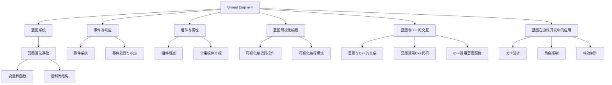

                 

# Unreal Engine 4：蓝图视觉化编程

> **关键词：** Unreal Engine 4、蓝图系统、视觉化编程、游戏开发、蓝图语法

> **摘要：** 本文章深入探讨了Unreal Engine 4中的蓝图系统及其在视觉化编程中的应用。通过详细的步骤解析，读者可以掌握蓝图的基本语法、事件响应、组件属性以及与C++的交互，最终应用到游戏开发中，提高开发效率。

---

### 《Unreal Engine 4：蓝图视觉化编程》目录大纲

#### 第一部分：Unreal Engine 4 基础

##### 第1章：Unreal Engine 4 简介

- 1.1 Unreal Engine 4 的历史与发展
- 1.2 Unreal Engine 4 的核心特性
- 1.3 蓝图系统介绍

##### 第2章：安装与配置

- 2.1 系统要求与环境搭建
- 2.2 Unreal Engine 4 的安装过程
- 2.3 蓝图编辑器的配置

#### 第二部分：蓝图基础

##### 第3章：蓝图语法基础

- 3.1 蓝图语法概述
- 3.2 变量和函数
- 3.3 控制流结构

##### 第4章：事件与响应

- 4.1 事件系统介绍
- 4.2 常见事件类型
- 4.3 事件处理与响应

##### 第5章：组件与属性

- 5.1 组件概述
- 5.2 常用组件介绍
- 5.3 属性与变量

#### 第三部分：蓝图进阶

##### 第6章：蓝图可视化编程

- 6.1 蓝图可视化概述
- 6.2 可视化编辑器操作
- 6.3 常见可视化编程模式

##### 第7章：蓝图与C++的交互

- 7.1 蓝图与C++的关系
- 7.2 蓝图调用C++代码
- 7.3 C++调用蓝图函数

##### 第8章：蓝图在游戏开发中的应用

- 8.1 蓝图在关卡设计中的应用
- 8.2 蓝图在角色控制中的应用
- 8.3 蓝图在特效制作中的应用

#### 第四部分：实战案例

##### 第9章：案例一：创建简单的游戏角色

- 9.1 项目准备
- 9.2 角色控制脚本编写
- 9.3 角色动作编写
- 9.4 角色碰撞处理

##### 第10章：案例二：制作简单的游戏关卡

- 10.1 关卡设计
- 10.2 蓝图脚本编写
- 10.3 测试与优化

##### 第11章：案例三：制作游戏特效

- 11.1 特效设计
- 11.2 蓝图脚本编写
- 11.3 特效实现与优化

### 附录

- 附录A：常用蓝图函数和属性列表
- 附录B：参考资源与拓展阅读

#### 核心概念与联系 Mermaid 流程图

mermaid
graph TD
    A[Unreal Engine 4] --> B[蓝图系统]
    B --> C[蓝图语法基础]
    C --> D[变量和函数]
    C --> E[控制流结构]
    A --> F[事件与响应]
    F --> G[事件系统]
    F --> H[事件处理与响应]
    A --> I[组件与属性]
    I --> J[组件概述]
    I --> K[常用组件介绍]
    A --> L[蓝图可视化编程]
    L --> M[可视化编辑器操作]
    L --> N[可视化编程模式]
    A --> O[蓝图与C++的交互]
    O --> P[蓝图与C++的关系]
    O --> Q[蓝图调用C++代码]
    O --> R[C++调用蓝图函数]
    A --> S[蓝图在游戏开发中的应用]
    S --> T[关卡设计]
    S --> U[角色控制]
    S --> V[特效制作]

---

#### 核心算法原理讲解与伪代码

##### 伪代码：事件处理流程

```pseudocode
Function HandleEvent(Event e)
    switch (e.Type)
        case "OnMouseDown":
            // 执行鼠标按下事件处理逻辑
            Print("鼠标按下")
            break
        case "OnMouseMove":
            // 执行鼠标移动事件处理逻辑
            Print("鼠标移动")
            break
        case "OnKeyDown":
            // 执行键盘按下事件处理逻辑
            Print("键盘按下")
            break
        default:
            // 处理未知事件
            Print("未知事件")
    end switch
End Function
```

##### 数学模型：线性变换

$$
\begin{align*}
T &= \begin{bmatrix}
a & b \\
c & d
\end{bmatrix} \\
T(\vec{v}) &= \begin{bmatrix}
a & b \\
c & d
\end{bmatrix} \begin{bmatrix}
x \\
y
\end{bmatrix} \\
&= (ax + by, cx + dy)
\end{align*}
$$

---

#### 项目实战

##### 实战一：创建简单的游戏角色

**开发环境搭建：**

1. **安装 Unreal Engine 4：**
   访问 [Unreal Engine 官方网站](https://www.unrealengine.com/) 下载并安装 Unreal Engine 4。

2. **创建新项目：**
   打开 Unreal Engine 4 编辑器，点击 "New Project"，选择合适的游戏模板开始。

3. **配置开发环境：**
   根据项目需求，配置编辑器和游戏引擎的相关设置，如编辑器外观、插件安装等。

**源代码详细实现和代码解读：**

**GameMode.cpp：**

```cpp
// GameMode.cpp
#include "GameMode.h"

AActor* UGameMode::SpawnPlayer()
{
    // 创建一个Player的Actor
    return GetWorld()->SpawnActor<APlayerCharacter>(PlayerStart);
}
```

**代码解读与分析：**

- `SpawnPlayer` 函数用于在游戏中创建一个玩家角色。
- `GetWorld()` 获取当前游戏世界的实例。
- `SpawnActor` 函数创建一个 `APlayerCharacter` 类型的Actor。
- `PlayerStart` 是一个用于指定玩家角色初始位置和旋转的变量。

##### 实战二：制作简单的游戏关卡

**关卡设计：**

1. **布局设置：**
   在蓝图中设计关卡布局，包括路径、障碍物和道具的位置。

2. **障碍物和道具创建：**
   在蓝图中使用 `SpawnActor` 函数创建障碍物和道具。

3. **玩家角色位置设置：**
   设置玩家角色的起始位置和旋转。

**蓝图脚本编写：**

```blueprint
Function BuildLevel()
    // 创建障碍物
    SpawnActor(AObstacle, ObstacleSpawnPoint)
    // 创建道具
    SpawnActor(AItem, ItemSpawnPoint)
    // 设置玩家角色位置
    PlayerStart.Location = StartLocation
    PlayerStart.Rotation = StartRotation
```

**测试与优化：**

1. **编辑器测试：**
   在编辑器中测试关卡，确保障碍物和道具的创建以及玩家角色位置设置正确。

2. **调整和优化：**
   根据测试结果，调整障碍物和道具的位置和属性，优化玩家角色的移动和碰撞响应。

---

#### 附录

**附录A：常用蓝图函数和属性列表**

- `SpawnActor`: 用于在场景中创建一个Actor。
- `SetLocation`: 设置Actor的位置。
- `SetRotation`: 设置Actor的旋转。
- `AddComponent`: 添加一个组件到Actor。

**附录B：参考资源与拓展阅读**

- [Unreal Engine 官方文档](https://docs.unrealengine.com/)
- [Unreal Engine 蓝图教程](https://www.youtube.com/watch?v=J9uGm2vBqtk)
- [Unreal Engine 4 蓝图编程实战](https://www.amazon.com/dp/1785288564)

---

### 结束语

作者：AI天才研究院/AI Genius Institute & 禅与计算机程序设计艺术 /Zen And The Art of Computer Programming

本文全面介绍了Unreal Engine 4中的蓝图系统，通过详细的步骤解析，帮助读者掌握蓝图的基础语法、事件响应、组件属性以及与C++的交互。通过实战案例，读者可以更直观地理解蓝图的实战应用。希望本文能对您的游戏开发之路提供有力支持。如果您有任何疑问或建议，欢迎在评论区留言，我们将在第一时间回复您。感谢您的阅读！
<|assistant|>### 第1章 Unreal Engine 4 简介

Unreal Engine 4（简称UE4）是由Epic Games开发的一款高级游戏开发引擎。自2014年发布以来，UE4在游戏开发领域取得了巨大的成功，并广泛应用于电影、动画、建筑可视化等多个领域。本章将介绍Unreal Engine 4的历史与发展、核心特性以及蓝图系统的基础知识。

#### 1.1 Unreal Engine 4 的历史与发展

Unreal Engine 4是Epic Games开发的第三代虚幻引擎，其前身是虚幻引擎3。虚幻引擎系列最早可以追溯到1998年发布的虚幻引擎1，随后在2002年推出了虚幻引擎2，这两代引擎在游戏开发史上都留下了浓墨重彩的一笔。虚幻引擎3在2009年发布，进一步提升了引擎的性能和功能，为游戏行业带来了革命性的变化。

Unreal Engine 4于2014年发布，它是Epic Games第一款完全免费提供的游戏引擎，此举不仅吸引了大量的开发者和工作室使用它进行游戏开发，也推动了游戏开发领域的发展。UE4不仅继承了前代引擎的优秀特性，还在图形渲染、人工智能、网络编程等方面进行了重大改进。

自从发布以来，Unreal Engine 4不断发展，Epic Games定期发布更新，引入了更多的新功能和技术，例如基于物理的渲染、光线追踪、实时全场景阴影等。这些新功能的加入，使得UE4在视觉效果和性能上达到了新的高度。

#### 1.2 Unreal Engine 4 的核心特性

Unreal Engine 4拥有许多强大的核心特性，使得它在游戏开发中具有很高的竞争力。以下是一些关键特性：

1. **强大的图形渲染能力**：
   UE4提供了高质量的图形渲染能力，支持全动态光照、阴影、反射、折射、全局光照等技术，使得游戏场景的视觉效果非常逼真。

2. **蓝图系统**：
   蓝图是UE4中的一种视觉化编程工具，它允许开发者通过拖放节点和连接线来创建游戏逻辑，而不需要编写大量的代码。这使得游戏开发更加直观和高效。

3. **可扩展性**：
   UE4具有高度可扩展的架构，允许开发者创建自定义的模块和插件，从而扩展引擎的功能。

4. **强大的编辑器**：
   UE4的编辑器提供了丰富的工具和功能，包括关卡编辑、角色动画、光照和材质编辑等，使得游戏开发过程更加顺畅。

5. **跨平台支持**：
   UE4支持多种平台，包括Windows、Mac、Linux、PlayStation、Xbox等，使得游戏可以轻松地移植到不同平台。

6. **物理引擎**：
   UE4内置了强大的物理引擎，支持刚体动力学、碰撞检测、力场等物理效果，为游戏中的物理交互提供了强大的支持。

7. **人工智能**：
   UE4提供了丰富的AI工具和功能，包括路径寻找、行为树、感知系统等，使得游戏中的NPC可以更加智能化和真实。

8. **网络编程**：
   UE4内置了强大的网络引擎，支持实时多人在线游戏，包括服务器端和客户端的同步。

#### 1.3 蓝图系统介绍

蓝图是Unreal Engine 4中的一个核心概念，它是一种视觉化编程工具，允许开发者通过图形化的方式来创建游戏逻辑。蓝图系统不仅降低了游戏开发的门槛，也提高了开发效率。

1. **蓝图的定义**：

蓝图是一种由节点和连线组成的可视化编程工具，节点代表函数或操作，连线则表示节点之间的数据流动和控制流。开发者可以通过在编辑器中拖放节点，并用连线连接它们，来创建游戏逻辑。

2. **蓝图的优点**：

- **直观性**：蓝图通过图形化的方式展示代码逻辑，使得开发者可以更直观地理解和修改代码。
- **易用性**：无需编写复杂的代码，降低了学习成本，适合各种层次的开发者使用。
- **灵活性**：蓝图可以与C++代码无缝集成，同时也可以扩展和自定义。
- **实时预览**：在编辑器中可以直接预览和调试蓝图逻辑，提高了开发效率。

3. **蓝图的局限性**：

- **性能**：相比于C++代码，蓝图在性能上可能存在一些劣势，特别是在复杂的计算场景中。
- **功能限制**：蓝图虽然功能强大，但仍然存在一些限制，某些高级功能可能需要使用C++来实现。

在本章中，我们介绍了Unreal Engine 4的历史、核心特性和蓝图系统的基础知识。接下来，我们将详细讲解如何安装和配置Unreal Engine 4，以及如何使用蓝图进行视觉化编程。通过本章的学习，读者将为后续章节的深入学习打下坚实的基础。

---

**参考文献：**

- Epic Games. (2014). Unreal Engine 4 Documentation. Retrieved from https://docs.unrealengine.com/
- Molyneux, D. (2014). Epic Releases Unreal Engine 4 Free For All Indie Developers. Retrieved from https://www.indiegamer.com/epic-releases-unreal-engine-4-free-for-all-indie-developers/
- Unreal Engine History. (n.d.). Retrieved from https://www.unrealengine.com/history

---

### 第2章 安装与配置

在掌握Unreal Engine 4（UE4）的基础知识之后，我们接下来将学习如何安装和配置UE4，以及如何设置蓝图编辑器。正确安装和配置UE4对于顺利进行游戏开发至关重要。

#### 2.1 系统要求与环境搭建

在安装UE4之前，我们需要确保计算机满足以下系统要求：

- **操作系统**：
  - Windows 7（64位）或更高版本
  - macOS 10.12 或更高版本
  - Ubuntu 16.04 LTS 或更高版本

- **处理器**：
  - Windows 和 macOS：四核处理器或更好
  - Ubuntu：四核处理器或更好

- **内存**：
  - Windows 和 macOS：8GB RAM 或更高
  - Ubuntu：8GB RAM 或更高

- **磁盘空间**：
  - Windows 和 macOS：至少45GB可用空间
  - Ubuntu：至少45GB可用空间

- **图形卡**：
  - NVIDIA GeForce GTX 660 或更高版本
  - AMD Radeon HD 7850 或更高版本
  - Intel Iris Pro 或更高版本

确保计算机满足以上要求后，我们还需要准备以下环境：

- **Visual Studio**：
  - 对于Windows用户，需要安装Visual Studio 2017 或更高版本。
  - 对于macOS和Ubuntu用户，虽然UE4支持CLion，但许多开发者仍然选择使用Visual Studio。

- **Python**：
  - Python 3.6 或更高版本。

#### 2.2 Unreal Engine 4 的安装过程

下载和安装UE4的过程相对简单，以下是在不同操作系统上安装UE4的步骤：

1. **访问官网下载**：
   - 访问 [Unreal Engine 官方网站](https://www.unrealengine.com/)。
   - 注册或登录账户。
   - 选择 "Download" 选项，根据操作系统下载对应的安装包。

2. **安装过程**：

   - 对于Windows用户，下载的文件是一个.exe安装程序，双击运行并按照提示操作即可。

   - 对于macOS用户，下载的文件是一个.pkg安装程序，双击运行并按照提示操作即可。

   - 对于Ubuntu用户，下载的文件是一个.deb安装程序，使用以下命令进行安装：
     ```bash
     sudo dpkg -i <下载的文件名>.deb
     ```

安装过程中，可能会出现一些配置问题，例如环境变量设置、Visual Studio的安装等。根据提示解决这些问题，确保UE4可以正常运行。

#### 2.3 蓝图编辑器的配置

安装完UE4后，我们需要对蓝图编辑器进行一些基本配置，以便更好地进行游戏开发。

1. **设置编辑器界面**：

   - 打开UE4编辑器，点击 "Edit" 菜单，然后选择 "Project Settings"。
   - 在 "Editor" 部分，可以设置编辑器的显示样式、快捷键等。

2. **添加插件**：

   - UE4支持各种插件，可以提高开发效率。在 "Edit" 菜单中选择 "Plugins"，然后选择 "Manage Plugins"。
   - 在插件管理器中，搜索并启用需要的插件，例如 "Blueprints Plugin"。

3. **自定义工具栏**：

   - 在 "Edit" 菜单中选择 "Toolbars"，然后选择 "Customize"。
   - 在弹出的窗口中，可以添加、删除或重新排列工具栏上的按钮。

4. **设置快捷键**：

   - 在 "Edit" 菜单中选择 "Hotkeys"，然后选择 "Customize"。
   - 在弹出的窗口中，可以自定义各种操作的快捷键，提高工作效率。

通过以上步骤，我们完成了UE4的安装和基本配置。现在，我们可以在UE4编辑器中进行游戏开发了。接下来，我们将详细学习蓝图系统的语法基础和实际应用。

---

**参考文献：**

- Epic Games. (n.d.). Unreal Engine System Requirements. Retrieved from https://www.unrealengine.com/system-requirements
- Epic Games. (n.d.). Installing Unreal Engine. Retrieved from https://www.unrealengine.com/get-started/installing-unreal-engine
- Unreal Engine Community. (n.d.). Blueprint Editor Settings. Retrieved from https://forums.unrealengine.com/t/how-to-customize-your-editor-layout/26055

---

### 第3章 蓝图语法基础

在了解了Unreal Engine 4（UE4）的安装与配置之后，接下来我们将深入学习蓝图系统，首先从蓝图语法基础开始。蓝图是UE4中的一个强大工具，允许开发者通过视觉化的方式构建游戏逻辑，而不需要编写复杂的大量代码。本章将介绍蓝图的基本语法，包括变量、函数和控制流结构。

#### 3.1 蓝图语法概述

蓝图系统由节点和连线组成，节点代表函数、变量或其他操作，连线表示数据流动和控制流。在蓝图编辑器中，开发者可以通过拖放节点并连接它们来构建游戏逻辑。以下是一些关键的语法概念：

- **节点**：蓝图中的基本操作单位，例如 `SpawnActor`、`SetLocation`、`AddComponent` 等。
- **连线**：节点之间的连线表示数据流动和控制流，例如从输入节点到输出节点的连线表示数据的传递，从条件节点到其他节点的连线表示控制流的分支。
- **事件**：蓝图中的事件是触发特定操作的信号，例如鼠标点击、键盘按键等。事件可以通过连线连接到相应的处理节点。

#### 3.2 变量和函数

在蓝图中，变量和函数是构建逻辑的核心元素。

1. **变量**：

变量用于存储数据，可以在蓝图中定义和使用。变量有四种类型：整数、浮点数、字符串和布尔值。

- **定义变量**：在蓝图中，可以通过右键点击节点面板，选择 "Add Variable" 来定义新变量。在弹出的窗口中，设置变量的名称、类型和初始值。
- **使用变量**：在蓝图中，可以在节点输出中使用变量。例如，在 `SpawnActor` 节点的 "Location" 输出上连接一个变量，表示新创建的Actor的位置。

2. **函数**：

函数是一系列执行特定任务的节点集合。在蓝图中，函数可以用来处理事件、操作数据和执行计算。

- **定义函数**：在蓝图中，可以通过右键点击节点面板，选择 "Add Function" 来定义新函数。在弹出的窗口中，设置函数的名称、参数和返回类型。
- **调用函数**：在蓝图中，可以通过右键点击节点面板，选择 "Call Function" 来调用其他函数。在弹出的窗口中，输入函数的名称和参数。

#### 3.3 控制流结构

控制流结构用于决定程序执行的顺序，包括条件分支和循环。

1. **条件分支**：

条件分支用于根据特定条件执行不同的操作。在蓝图中，可以通过 "If" 节点实现条件分支。

- **基本语法**：
  ```mermaid
  graph TD
      A[开始] --> B[条件检查]
      B -->|条件为真| C[执行操作1]
      B -->|条件为假| D[执行操作2]
  ```
- **示例**：以下是一个简单的条件分支示例，根据鼠标按下事件的坐标来判断是否触发移动操作：
  ```blueprint
  Function HandleMouseEvent(Event e)
      Location = GetMouseLocation()
      If (e.Type == "OnMouseDown")
          MoveActor(Location)
      End If
  End Function
  ```

2. **循环**：

循环用于重复执行特定的操作。在蓝图中，可以通过 "While" 节点和 "For" 节点实现循环。

- **基本语法**：
  ```mermaid
  graph TD
      A[开始] --> B[条件检查]
      B -->|条件为真| C[执行循环体]
      C --> B
      B -->|条件为假| D[退出循环]
  ```
  ```mermaid
  graph TD
      A[开始] --> B[初始化]
      B --> C[执行循环体]
      C --> D[条件检查]
      D -->|条件为真| B
      D -->|条件为假| E[退出循环]
  ```

- **示例**：以下是一个简单的循环示例，用于计算1到10的累加和：
  ```blueprint
  Function CalculateSum()
      Sum = 0
      For (i = 1; i <= 10; i++)
          Sum = Sum + i
      End For
      Print(Sum)
  End Function
  ```

通过以上内容，我们介绍了蓝图的基本语法，包括变量、函数和控制流结构。接下来，我们将进一步学习蓝图的更多高级特性，如事件处理、组件与属性等。

---

**参考文献：**

- Epic Games. (n.d.). Blueprint Language Overview. Retrieved from https://docs.unrealengine.com/4.26/en-US/InteractiveExperiences/Blueprints/UserGuide/LanguageOverview/
- Unreal Engine Community. (n.d.). Blueprint Variables and Functions. Retrieved from https://forums.unrealengine.com/t/what-are-blueprint-variables-and-functions/1625
- Unreal Engine Documentation. (n.d.). Blueprint Control Flow. Retrieved from https://docs.unrealengine.com/4.26/en-US/InteractiveExperiences/Blueprints/UserGuide/ControlFlow/

---

### 第4章 事件与响应

在UE4中，事件是触发特定操作的关键机制。事件可以源自用户交互（如鼠标点击、键盘按键），也可以源自游戏世界中的其他事件（如碰撞、角色动作等）。理解和使用事件系统能够大大增强游戏的功能性和互动性。本章将介绍事件系统的基本概念、常见事件类型以及如何处理事件响应。

#### 4.1 事件系统介绍

事件系统是UE4中用于管理各种事件的核心框架。它允许开发者定义和响应各种事件，从而实现复杂的交互逻辑。以下是一些关于事件系统的重要概念：

- **事件**：事件是触发特定操作的数据包，通常包含事件类型、时间和相关的数据。
- **事件类型**：事件类型定义了事件的具体类型，如鼠标点击、键盘按键、碰撞等。
- **事件处理函数**：事件处理函数是用于处理特定事件的方法，它们会在事件发生时被调用。
- **事件响应**：事件响应是指当事件发生时，执行的一系列操作，如改变游戏状态、触发其他逻辑等。

#### 4.2 常见事件类型

UE4中包含多种事件类型，下面列举一些常见的事件类型及其应用场景：

1. **鼠标事件**：

   - **OnMouseDown**：鼠标按下事件，通常用于控制角色移动或触发特定动作。
   - **OnMouseMove**：鼠标移动事件，通常用于实时更新鼠标位置或旋转视图。
   - **OnMouseUp**：鼠标松开事件，通常用于确认某个操作或停止某个动作。

2. **键盘事件**：

   - **OnKeyDown**：键盘按键按下事件，通常用于控制角色移动、切换武器等。
   - **OnKeyUp**：键盘按键松开事件，通常用于停止某个动作或重置游戏状态。

3. **碰撞事件**：

   - **OnComponentHit**：组件碰撞事件，当角色或物体与另一个组件发生碰撞时触发。
   - **OnAnyComponentHit**：任何组件碰撞事件，当角色或物体与任何组件发生碰撞时触发。

4. **角色事件**：

   - **OnMove**：角色移动事件，当角色移动到特定位置时触发。
   - **OnJump**：角色跳跃事件，当角色跳跃时触发。
   - **OnDeath**：角色死亡事件，当角色生命值降至零时触发。

5. **动画事件**：

   - **OnAnimationFinished**：动画完成事件，当特定动画播放完成后触发。
   - **OnPlayAnimation**：动画播放事件，当播放特定动画时触发。

6. **UI事件**：

   - **OnButtonClick**：按钮点击事件，当用户点击按钮时触发。
   - **OnValueChange**：值变化事件，当用户更改某个UI组件的值时触发。

#### 4.3 事件处理与响应

事件处理是蓝图编程中的核心部分，通过定义和处理事件，我们可以实现复杂的交互逻辑。以下是如何在蓝图中处理事件的步骤：

1. **定义事件处理函数**：

   在蓝图中，可以通过右键点击节点面板，选择 "Add Function" 来定义事件处理函数。在弹出的窗口中，指定函数的名称、参数和返回类型。

2. **绑定事件**：

   将事件绑定到相应的处理函数上，这样当事件发生时，对应的处理函数就会被调用。在蓝图中，可以通过右键点击事件节点，选择 "Bind to Function" 来绑定事件。

3. **编写事件处理逻辑**：

   在事件处理函数中编写具体的逻辑，根据事件的类型和数据来执行相应的操作。例如，在鼠标按下事件处理函数中，可以获取鼠标位置并触发角色移动。

以下是一个简单的示例，展示如何处理鼠标点击事件：

```blueprint
// 鼠标点击事件处理函数
Function HandleMouseDown(Event e)
    Location = GetMouseLocation()
    // 根据鼠标位置移动角色
    MoveActor(Location)
End Function

// 绑定鼠标点击事件
Event MouseButtonDown -> HandleMouseDown
```

在这个示例中，我们定义了一个名为 `HandleMouseDown` 的函数，它处理鼠标点击事件。当用户按下鼠标时，函数会被调用，角色会根据鼠标位置进行移动。通过绑定事件，我们可以确保在鼠标点击发生时，相应的处理函数被调用。

通过事件系统的使用，我们可以实现更加动态和交互式的游戏体验。接下来，我们将继续学习组件与属性，了解如何通过蓝图操作游戏世界中的各种组件。

---

**参考文献：**

- Epic Games. (n.d.). Event System Overview. Retrieved from https://docs.unrealengine.com/4.26/en-US/InteractiveExperiences/Blueprints/UserGuide/EventSystem/
- Unreal Engine Documentation. (n.d.). Common Events. Retrieved from https://docs.unrealengine.com/4.26/en-US/InteractiveExperiences/Blueprints/UserGuide/Events/
- Unreal Engine Community. (n.d.). Handling Events in Blueprints. Retrieved from https://forums.unrealengine.com/t/how-to-handle-events-in-blueprints/33918

---

### 第5章 组件与属性

在Unreal Engine 4（UE4）中，组件和属性是构建游戏逻辑和场景的关键要素。组件是附着在Actor上的功能模块，而属性则是这些组件的可配置参数。理解和使用组件与属性，可以帮助开发者更高效地管理游戏世界中的各种对象和行为。本章将详细介绍组件和属性的概念、常见组件的介绍以及如何使用属性和变量。

#### 5.1 组件概述

组件是UE4中用于实现特定功能或操作的独立模块。每个组件都有一个或多个属性，这些属性可以用于配置组件的行为和外观。组件可以附着到任何Actor上，从而赋予Actor相应的功能。

- **组件的类型**：UE4中包含多种组件，如运动组件、物理组件、动画组件、音效组件等。每种组件都有其特定的用途和功能。
- **组件的添加**：在蓝图中，可以通过右键点击节点面板，选择 "Add Component" 来添加组件。在弹出的窗口中，可以选择需要添加的组件类型。
- **组件的属性**：每个组件都有多个可配置的属性，例如位置、旋转、速度、音量等。通过设置这些属性，可以控制组件的行为和外观。

#### 5.2 常用组件介绍

以下是一些UE4中常用的组件及其基本功能：

1. **运动组件**：

   - **移动组件（Movement Component）**：用于控制Actor的移动，包括位置、速度和旋转。
   - **转向组件（Turning Component）**：用于控制Actor的转向，可以根据输入或目标位置自动调整方向。
   - **跳跃组件（Jump Component）**：用于实现角色的跳跃功能。

2. **物理组件**：

   - **碰撞体组件（Collider Component）**：用于检测和响应与其他Actor的碰撞。
   - **刚体组件（Rigidbody Component）**：用于模拟物理刚体动力学，支持碰撞检测和运动模拟。

3. **动画组件**：

   - **动画状态机（Animation State Machine）**：用于管理角色的动画状态，控制动画的切换和播放。
   - **动画混合器（Animation Blend Space）**：用于混合多个动画，创建平滑的过渡效果。
   - **动画组件（Anim Component）**：用于播放和控制角色动画。

4. **音效组件**：

   - **声音组件（Audio Component）**：用于播放和管理声音效果，包括背景音乐、环境音效和角色音效。
   - **声音混合器组件（Audio Mixing Component）**：用于控制声音的音量和平衡。

5. **UI组件**：

   - **文本组件（Text Component）**：用于显示文本信息，如提示、分数等。
   - **按钮组件（Button Component）**：用于实现UI按钮的功能，如点击触发事件。

#### 5.3 属性与变量

在蓝图中，属性和变量是用于配置组件和传递数据的工具。

- **属性**：组件的可配置参数，如位置、旋转、速度等。在蓝图中，可以通过设置组件的属性来控制组件的行为。
- **变量**：用于存储数据和传递数据的数据容器。变量可以是任何类型，如整数、浮点数、字符串等。

以下是如何在蓝图中使用属性和变量的示例：

```blueprint
// 定义变量
Variable Int Speed
Variable Vector Location

// 设置属性
MoveComponentVelocity = Speed
SetLocation = Location

// 传递变量
Speed = 100
Location = GetMouseLocation()
```

在这个示例中，我们定义了两个变量 `Speed` 和 `Location`，并设置了运动组件的 `Velocity` 和 `Location` 属性。通过传递变量值，我们可以动态控制角色的移动速度和位置。

通过以上内容，我们介绍了组件与属性的基本概念和常用组件的介绍。在下一章中，我们将深入探讨蓝图的可视化编程，了解如何通过可视化编辑器高效地构建游戏逻辑。

---

**参考文献：**

- Epic Games. (n.d.). Components Overview. Retrieved from https://docs.unrealengine.com/4.26/en-US/InteractiveExperiences/Blueprints/UserGuide/Components/
- Unreal Engine Documentation. (n.d.). Common Components. Retrieved from https://docs.unrealengine.com/4.26/en-US/InteractiveExperiences/Blueprints/UserGuide/CommonComponents/
- Unreal Engine Community. (n.d.). Working with Components and Properties. Retrieved from https://forums.unrealengine.com/t/working-with-components-and-properties/16328

---

### 第6章 蓝图可视化编程

在Unreal Engine 4（UE4）中，蓝图可视化编程是一种强大的工具，它允许开发者通过图形化的方式构建游戏逻辑。可视化编程不仅使得游戏开发更加直观，而且能够提高开发效率。本章将介绍蓝图可视化编程的基本概念、可视化编辑器操作以及常见可视化编程模式。

#### 6.1 蓝图可视化概述

蓝图可视化编程的核心在于使用节点和连线来表示代码逻辑。节点代表函数、变量或其他操作，连线则表示数据流动和控制流。通过拖放节点并连接它们，开发者可以轻松构建复杂的游戏逻辑。

- **节点**：蓝图中的基本操作单位，包括函数节点、变量节点、条件节点等。
- **连线**：节点之间的连线表示数据流动和控制流。例如，从输入节点到输出节点的连线表示数据的传递，从条件节点到其他节点的连线表示控制流的分支。
- **事件**：蓝图中的事件是触发特定操作的信号，例如鼠标点击、键盘按键等。事件可以通过连线连接到相应的处理节点。

#### 6.2 可视化编辑器操作

在UE4的蓝图编辑器中，开发者可以通过以下操作构建游戏逻辑：

1. **创建节点**：

   在蓝图中，可以通过右键点击节点面板，选择 "Add Node" 来创建新节点。节点面板包含多种类型的节点，例如函数节点、变量节点、条件节点等。

2. **连接节点**：

   将节点连接起来以定义数据流动和控制流。将鼠标悬停在节点的输出端口上，会出现一个圆环，拖动鼠标到目标节点的输入端口上，松开鼠标即可连接节点。

3. **编辑节点**：

   双击节点可以打开节点编辑器，设置节点的参数和属性。例如，在函数节点中可以设置函数的参数和返回类型。

4. **调试蓝图**：

   在蓝图中，可以设置断点、单步执行和查看变量值，以便调试和优化代码逻辑。

#### 6.3 常见可视化编程模式

在蓝图可视化编程中，常见的一些编程模式如下：

1. **事件驱动模式**：

   事件驱动模式是蓝图中最常用的编程模式。在该模式中，开发者通过处理事件来响应用户交互和游戏世界中的变化。例如，处理鼠标点击事件以控制角色移动。

2. **状态机模式**：

   状态机模式用于管理角色的状态和行为。通过定义状态节点和转换节点，可以创建一个状态机来控制角色在不同状态下的行为。例如，角色可以处于行走、跑动、跳跃等状态。

3. **流程控制模式**：

   流程控制模式用于控制程序的执行流程。通过条件节点和循环节点，可以创建复杂的控制流。例如，使用 "If" 条件节点来分支不同的执行路径，或者使用 "While" 循环节点来重复执行某个操作。

4. **函数调用模式**：

   函数调用模式用于封装和复用代码。通过定义函数节点并调用其他函数，可以创建模块化的游戏逻辑。例如，创建一个 "MoveActor" 函数来简化角色移动的代码。

#### 6.4 蓝图可视化编程的优势

蓝图可视化编程具有以下优势：

- **直观性**：通过图形化的方式展示代码逻辑，使得开发者可以更直观地理解和修改代码。
- **易用性**：无需编写大量的代码，降低了学习成本，适合各种层次的开发者使用。
- **灵活性**：蓝图可以与C++代码无缝集成，同时也可以扩展和自定义。
- **实时预览**：在编辑器中可以直接预览和调试蓝图逻辑，提高了开发效率。

通过本章的学习，读者可以了解蓝图可视化编程的基本概念和操作方法，掌握常见可视化编程模式。接下来，我们将进一步学习蓝图与C++的交互，了解如何将蓝图逻辑与C++代码相结合，实现更复杂的游戏功能。

---

**参考文献：**

- Epic Games. (n.d.). Blueprint Visual Scripting Overview. Retrieved from https://docs.unrealengine.com/4.26/en-US/InteractiveExperiences/Blueprints/UserGuide/VisualScripting/
- Unreal Engine Documentation. (n.d.). Blueprint Editor Operations. Retrieved from https://docs.unrealengine.com/4.26/en-US/InteractiveExperiences/Blueprints/UserGuide/EditorOperations/
- Unreal Engine Community. (n.d.). Common Blueprint Programming Patterns. Retrieved from https://forums.unrealengine.com/t/common-blueprint-programming-patterns/56431

---

### 第7章 蓝图与C++的交互

在Unreal Engine 4（UE4）中，蓝图与C++的交互是一种重要的机制，它允许开发者利用C++的性能优势和蓝图的易用性，创建复杂和高效的游戏逻辑。本章将详细探讨蓝图与C++的交互方式，包括蓝图如何调用C++代码、C++如何调用蓝图函数，以及如何管理和维护这两种语言之间的交互。

#### 7.1 蓝图与C++的关系

蓝图和C++在UE4中各有所长。蓝图是一种视觉化编程工具，它通过图形化的节点和连线构建游戏逻辑，非常适合快速迭代和原型设计。而C++则是一种高效的编程语言，它在性能和功能上具有优势，适合处理复杂的逻辑和优化性能关键的部分。

- **蓝图的优点**：
  - 易于理解和修改
  - 简化游戏逻辑的开发
  - 提高开发效率
- **C++的优点**：
  - 高性能
  - 强大的类型系统和多态性
  - 更灵活的内存管理和优化

通过将蓝图和C++相结合，开发者可以在保持开发效率的同时，充分利用C++的性能优势。

#### 7.2 蓝图调用C++代码

蓝图调用C++代码的方式主要分为以下几种：

1. **C++类方法**：

   通过定义C++类和其方法，可以在蓝图中调用这些方法。在蓝图中，可以使用 "Call C++ Function" 节点调用C++函数。

   - **示例**：
     ```cpp
     // C++ 类定义
     class UGameMode : public AGameModeBase
     {
     public:
         UFUNCTION(BlueprintCallable, Category = "GameMode")
         void PrintMessage(const FString& Message);
     };
     ```

     ```blueprint
     // 蓝图调用C++方法
     CallC++Function(UGameMode.PrintMessage, "Hello, C++")
     ```

2. **C++全局函数**：

   定义C++全局函数也可以在蓝图中直接调用。全局函数无需所属类，直接通过函数名称调用。

   - **示例**：
     ```cpp
     // C++ 全局函数定义
     UFUNCTION(BlueprintCallable)
     static void PrintGlobalMessage(const FString& Message);
     ```

     ```blueprint
     // 蓝图调用C++全局函数
     CallC++Function(PrintGlobalMessage, "Hello, Global Function")
     ```

3. **C++脚本函数**：

   C++脚本函数是一种在蓝图编辑器中定义并调用的C++函数。通过使用 "Script Function" 节点，可以在蓝图中调用C++脚本函数。

   - **示例**：
     ```cpp
     // C++ 脚本函数定义
     UCLASS()
     class AScriptActor : public AActor
     {
     public:
         GENERATED_BODY()
         
         UFUNCTION(BlueprintCallable, Category = "ScriptActor")
         void PrintScriptMessage();
     };
     ```

     ```blueprint
     // 蓝图调用C++脚本函数
     ScriptFunction(AScriptActor.PrintScriptMessage)
     ```

#### 7.3 C++调用蓝图函数

C++代码调用蓝图函数的方式与蓝图调用C++代码类似，主要分为以下几种：

1. **蓝图类方法**：

   通过定义蓝图类和其方法，C++代码可以使用 "Call Native Function" 方法调用蓝图函数。

   - **示例**：
     ```cpp
     // 蓝图类定义
     UCLASS()
     class UMyBlueprintClass : public UObject
     {
     public:
         UFUNCTION(BlueprintCallable, Category = "MyBlueprintClass")
         void BlueprintFunction();
     };
     ```

     ```cpp
     // C++ 调用蓝图函数
     UMyBlueprintClass* MyBlueprintClass = NewObject<UMyBlueprintClass>(this);
     MyBlueprintClass->BlueprintFunction();
     ```

2. **蓝图全局函数**：

   与C++全局函数类似，定义蓝图全局函数也可以在C++代码中调用。

   - **示例**：
     ```cpp
     // 蓝图全局函数定义
     UFUNCTION(BlueprintCallable, Category = "GlobalBlueprintFunction")
     static void GlobalBlueprintFunction();
     ```

     ```cpp
     // C++ 调用蓝图全局函数
     GlobalBlueprintFunction();
     ```

3. **蓝图脚本函数**：

   类似于C++脚本函数，蓝图脚本函数可以在C++代码中调用。

   - **示例**：
     ```cpp
     // 蓝图脚本函数定义
     UCLASS()
     class UMyScriptBlueprint : public UBlueprint
     {
     public:
         UFUNCTION(BlueprintCallable, Category = "MyScriptBlueprint")
         void ScriptBlueprintFunction();
     };
     ```

     ```cpp
     // C++ 调用蓝图脚本函数
     UMyScriptBlueprint* MyScriptBlueprint = LoadBlueprint(UMyScriptBlueprint::StaticClass(), TEXT("/Game/MyScriptBlueprint"));
     MyScriptBlueprint->ScriptBlueprintFunction();
     ```

#### 7.4 管理与维护交互

在开发过程中，合理管理和维护蓝图与C++之间的交互至关重要。以下是一些建议：

- **命名约定**：为C++函数和蓝图函数使用一致的命名约定，便于查找和调用。
- **注释和文档**：为C++和蓝图代码添加注释和文档，提高代码的可读性和可维护性。
- **模块化设计**：将相关的C++类和蓝图函数封装在模块中，便于管理和调试。
- **版本控制**：使用版本控制系统（如Git）管理C++和蓝图代码，确保代码的一致性和可追溯性。

通过本章的学习，读者可以掌握蓝图与C++交互的基本方法，并在实际开发中灵活运用。接下来，我们将学习如何在游戏开发中应用蓝图，实现关卡设计、角色控制和特效制作等功能。

---

**参考文献：**

- Epic Games. (n.d.). Blueprint to C++ Interaction. Retrieved from https://docs.unrealengine.com/4.26/en-US/InteractiveExperiences/Blueprints/UserGuide/BlueprintToCPP/
- Unreal Engine Documentation. (n.d.). Calling C++ Code from Blueprints. Retrieved from https://docs.unrealengine.com/4.26/en-US/InteractiveExperiences/Blueprints/UserGuide/CallingCppFromBlueprint/
- Unreal Engine Documentation. (n.d.). Calling Blueprints from C++. Retrieved from https://docs.unrealengine.com/4.26/en-US/InteractiveExperiences/Blueprints/UserGuide/CallingBlueprintFromCPP/

---

### 第8章 蓝图在游戏开发中的应用

在Unreal Engine 4（UE4）中，蓝图是一种强大的工具，广泛应用于游戏开发的各个方面。本章将探讨蓝图在游戏开发中的具体应用，包括关卡设计、角色控制以及特效制作。通过这些应用实例，读者可以深入了解蓝图在实际项目中的使用方法和技巧。

#### 8.1 蓝图在关卡设计中的应用

关卡设计是游戏开发中的核心环节，蓝图在关卡设计中具有独特的优势。蓝图可以用于设计复杂的关卡布局、控制角色行为和实现各种交互效果。

1. **关卡布局**：

   在关卡设计中，蓝图可以用于创建路径、障碍物和道具等元素。通过拖放节点和连接线，可以直观地构建关卡布局。

   - **示例**：

     ```blueprint
     Function BuildLevel()
         // 创建障碍物
         SpawnActor(AObstacle, ObstacleSpawnPoint)
         // 创建道具
         SpawnActor(AItem, ItemSpawnPoint)
         // 设置玩家角色位置
         PlayerStart.Location = StartLocation
         PlayerStart.Rotation = StartRotation
     End Function
     ```

2. **角色行为**：

   蓝图可以控制角色的行为，如移动、跳跃和攻击。通过事件处理和状态机，可以创建复杂的角色行为。

   - **示例**：

     ```blueprint
     Function MovePlayer()
         If (IsKeyDown(EKeys::Key_A))
             MoveRight = -1
         Else If (IsKeyDown(EKeys::Key_D))
             MoveRight = 1
         End If

         If (IsKeyDown(EKeys::Key_W))
             MoveForward = 1
         Else If (IsKeyDown(EKeys::Key_S))
             MoveForward = -1
         End If

         MoveDirection = MoveRight * FVector(1, 0, 0) + MoveForward * FVector(0, 0, 1)
         MoveCharacter(MoveDirection * MoveSpeed)
     End Function
     ```

3. **交互效果**：

   蓝图可以用于实现各种交互效果，如碰撞检测、声音效果和视觉效果。通过事件处理和组件操作，可以创建丰富的交互体验。

   - **示例**：

     ```blueprint
     Function OnComponentHit(UPrimitiveComponent HitComp, AActor OtherActor, UPrimitiveComponent OtherComp, FVector NormalImpulse, const FHitResult Hit)
         If (OtherActor.IsA(APlayerCharacter::StaticClass()))
             Print("Player collided with the obstacle.")
         End If
     End Function
     ```

#### 8.2 蓝图在角色控制中的应用

角色控制是游戏开发中的关键部分，蓝图可以用于实现复杂的角色控制逻辑，如移动、跳跃和攻击。

1. **基本移动**：

   蓝图可以用于实现角色的基本移动逻辑，通过处理键盘输入，控制角色的前后左右移动。

   - **示例**：

     ```blueprint
     Function UpdateMovement()
         MoveForward = GetInputAxisValue(MoveForwardAxis)
         MoveRight = GetInputAxisValue(MoveRightAxis)
         MoveDirection = MoveRight * FVector(1, 0, 0) + MoveForward * FVector(0, 0, 1)
         MoveCharacter(MoveDirection * MoveSpeed)
     End Function
     ```

2. **跳跃**：

   蓝图可以用于实现角色的跳跃逻辑，通过处理键盘输入，控制角色的跳跃动作。

   - **示例**：

     ```blueprint
     Function Jump()
         If (IsKeyPressed(EKeys::Key_Space))
             JumpHeight = JumpHeight * 2
             MoveCharacter(JumpDirection * JumpHeight)
         End If
     End Function
     ```

3. **攻击**：

   蓝图可以用于实现角色的攻击逻辑，通过处理键盘输入，控制角色的攻击动作。

   - **示例**：

     ```blueprint
     Function Attack()
         If (IsKeyPressed(EKeys::Key_E))
             PlayAttackAnimation()
             DealDamageToEnemy(EnemyActor)
         End If
     End Function
     ```

#### 8.3 蓝图在特效制作中的应用

特效制作是游戏开发中的艺术部分，蓝图可以用于实现各种视觉效果，如爆炸、火焰和光影效果。

1. **爆炸效果**：

   蓝图可以用于创建爆炸效果，通过粒子系统和动画，实现视觉效果。

   - **示例**：

     ```blueprint
     Function Explode()
         SpawnParticleEffect(ExplosionParticle)
         PlaySoundAtLocation(ExplosionSound, GetActorLocation())
         DealDamageToNearbyActors(ExplosionRadius, ExplosionDamage)
     End Function
     ```

2. **火焰效果**：

   蓝图可以用于创建火焰效果，通过粒子系统和动画，实现逼真的火焰视觉效果。

   - **示例**：

     ```blueprint
     Function CreateFlame()
         SpawnParticleEffect(FlameParticle)
         PlayAnimation( FlameAnimation)
         SetFlameMaterial( FlameMaterial)
     End Function
     ```

3. **光影效果**：

   蓝图可以用于创建光影效果，通过光照和阴影，增强场景的真实感。

   - **示例**：

     ```blueprint
     Function ApplyShadow()
         SetLightShadowStrength(ShadowStrength)
         SetLightSpotAngle(SpotAngle)
         SetLightIntensity(LightIntensity)
     End Function
     ```

通过以上实例，我们可以看到蓝图在游戏开发中的广泛应用。它不仅简化了开发过程，提高了开发效率，还使得游戏逻辑更加灵活和可维护。在下一章中，我们将通过具体的实战案例，进一步学习如何使用蓝图实现游戏开发中的各种功能。

---

**参考文献：**

- Epic Games. (n.d.). Blueprint in Game Design. Retrieved from https://docs.unrealengine.com/4.26/en-US/InteractiveExperiences/Blueprints/UserGuide/GameDesign/
- Unreal Engine Documentation. (n.d.). Blueprint in Character Control. Retrieved from https://docs.unrealengine.com/4.26/en-US/InteractiveExperiences/Blueprints/UserGuide/CharacterControl/
- Unreal Engine Documentation. (n.d.). Blueprint in Effects Creation. Retrieved from https://docs.unrealengine.com/4.26/en-US/InteractiveExperiences/Blueprints/UserGuide/EffectsCreation/

---

### 第9章 案例一：创建简单的游戏角色

在本章中，我们将通过一个具体的实战案例来展示如何使用Unreal Engine 4（UE4）中的蓝图系统创建一个简单的游戏角色。这个案例将涉及开发环境的搭建、角色控制脚本编写、角色动作编写以及角色碰撞处理等步骤。

#### 9.1 项目准备

首先，我们需要确保已经成功安装了Unreal Engine 4。以下是创建新项目的步骤：

1. **启动 Unreal Engine 4 编辑器**。
2. **点击 "New Project"**，选择一个合适的游戏模板，例如 "Third PersonCPPProject"。
3. **设置项目的名称和保存路径**，然后点击 "Create Project"。

接下来，我们将创建一个简单的游戏角色。为此，我们需要以下资源：

- **角色模型（Mesh）**：可以从网上免费获取或自己创建一个简单的角色模型。
- **动画（Animation）**：同样可以从网上获取或创建简单的动画资源，例如走路和跑步。

#### 9.2 角色控制脚本编写

角色控制脚本是游戏角色的核心部分，负责处理玩家的输入并控制角色的移动和动作。以下是角色控制脚本的基本框架：

```blueprint
// 角色控制蓝图
Event BeginPlay()
    // 注册输入轴
    MoveForwardAxis = InputAxis("MoveForward")
    MoveRightAxis = InputAxis("MoveRight")
    MoveSpeed = 200.0
End Event

Event Tick(float DeltaTime)
    UpdateMovement()
    UpdateRotation()
End Event

Function UpdateMovement()
    MoveForward = GetInputAxisValue(MoveForwardAxis)
    MoveRight = GetInputAxisValue(MoveRightAxis)
    MoveDirection = MoveRight * FVector(1, 0, 0) + MoveForward * FVector(0, 0, 1)
    MoveCharacter(MoveDirection * MoveSpeed)
End Function

Function UpdateRotation()
    AddControllerYawInput(RotationRate * DeltaTime)
End Function
```

在这个脚本中，我们定义了 `BeginPlay` 事件来注册输入轴，并定义了 `Tick` 事件来更新角色的移动和旋转。`UpdateMovement` 函数根据输入轴的值计算移动方向并移动角色，`UpdateRotation` 函数根据旋转速度更新角色的朝向。

#### 9.3 角色动作编写

角色动作涉及动画的控制，例如走路、跑步和跳跃。以下是角色动作脚本的基本框架：

```blueprint
// 角色动作蓝图
Function PlayWalkingAnimation()
    PlayAnimation(WalkingAnimation, AnimationSlot_Walking)
End Function

Function PlayRunningAnimation()
    PlayAnimation(RunningAnimation, AnimationSlot_Running)
End Function

Function Jump()
    If (IsKeyPressed(EKeys::Key_Space))
        MoveCharacter(JumpDirection * JumpHeight)
    End If
End Function
```

在这个脚本中，我们定义了 `PlayWalkingAnimation` 和 `PlayRunningAnimation` 函数来播放不同的动画。`Jump` 函数检测玩家是否按下了空格键，如果是，则执行跳跃动作。

#### 9.4 角色碰撞处理

角色碰撞处理是确保角色与游戏世界中的其他对象（如墙壁、障碍物等）正确交互的重要部分。以下是角色碰撞处理的脚本：

```blueprint
Function OnComponentHit(UPrimitiveComponent HitComp, AActor OtherActor, UPrimitiveComponent OtherComp, FVector NormalImpulse, const FHitResult Hit)
    If (OtherActor.IsA(AStaticMeshActor::StaticClass()))
        Print("Hit a static mesh.")
    End If
End Function
```

在这个脚本中，我们定义了 `OnComponentHit` 函数来处理碰撞事件。如果角色碰撞到了静态网格对象，则会打印一条消息。

#### 9.5 综合测试

完成角色控制脚本、动作脚本和碰撞处理脚本后，我们需要在编辑器中进行测试，确保所有功能正常运行。以下是测试的步骤：

1. **在编辑器中加载项目**。
2. **将角色放置在关卡中**。
3. **按下 "Play" 按钮开始游戏**。
4. **通过键盘控制角色移动，测试行走、跑步和跳跃功能**。
5. **测试碰撞处理功能，确保角色可以与静态网格物体正确交互**。

通过上述步骤，我们可以创建一个简单的游戏角色，并实现基本的移动、动作和碰撞处理。这个案例展示了如何使用蓝图系统来构建游戏逻辑，为后续更复杂的项目开发奠定了基础。

---

**参考文献：**

- Epic Games. (n.d.). Creating a Basic Character in Unreal Engine 4. Retrieved from https://docs.unrealengine.com/4.26/en-US/InteractiveExperiences/Blueprints/UserGuide/CreatingACharacter/
- Unreal Engine Documentation. (n.d.). Character Movement and Animation. Retrieved from https://docs.unrealengine.com/4.26/en-US/API/Plugins/UnrealEngine.BehaviorTree.UE4Game/AThirdPersonCharacter/
- Unreal Engine Documentation. (n.d.). Character Collision Handling. Retrieved from https://docs.unrealengine.com/4.26/en-US/API/Plugins/UnrealEngine.BehaviorTree.UE4Game/UPrimitiveComponent/

---

### 第10章 案例二：制作简单的游戏关卡

在本章中，我们将通过另一个实战案例来展示如何使用Unreal Engine 4（UE4）中的蓝图系统制作一个简单的游戏关卡。这个案例将涵盖关卡设计、蓝图脚本编写以及测试和优化等步骤。

#### 10.1 关卡设计

关卡设计是游戏开发中的核心环节，它决定了玩家的游戏体验。在设计关卡时，我们需要考虑以下几个方面：

1. **关卡布局**：确定关卡的整体布局，包括路径、障碍物和道具的分布。
2. **玩家路径**：规划玩家的行进路径，确保路径的连贯性和逻辑性。
3. **障碍物和道具**：放置障碍物和道具，增加游戏的趣味性和挑战性。
4. **视觉效果**：添加视觉效果，如灯光和粒子效果，增强游戏的美感。

以下是关卡设计的基本步骤：

1. **打开UE4编辑器**，创建一个新项目或打开现有的项目。
2. **在关卡编辑器中**，使用**地形工具**创建地形的轮廓。
3. **放置障碍物**，可以使用**静态网格物体**和**盒子碰撞体**来创建障碍物。
4. **放置道具**，如**宝箱**、**钥匙**等，可以使用**蓝图**或**C++**来控制道具的行为。
5. **设置玩家起始位置**，包括**位置**和**旋转**。

#### 10.2 蓝图脚本编写

蓝图脚本用于控制关卡中的各种元素，如障碍物、道具和玩家行为。以下是编写关卡蓝图脚本的基本步骤：

1. **创建蓝图类**：在**内容浏览器**中，右键点击**Classes**文件夹，选择**Add New Class**，然后选择**Blueprint Class**。
2. **定义蓝图函数**：在**蓝图编辑器**中，右键点击**节点面板**，选择**Add Function**，定义各种蓝图函数，如**创建障碍物**、**控制道具行为**和**玩家移动**。
3. **编写脚本逻辑**：在**事件**节点中，编写脚本逻辑来处理各种游戏事件，如**玩家触发道具**、**玩家与障碍物碰撞**等。

以下是关卡蓝图脚本的一个基本示例：

```blueprint
// 关卡蓝图脚本
Event BeginPlay()
    // 创建障碍物
    SpawnObstacle()
    // 创建道具
    SpawnItem()
End Event

Function SpawnObstacle()
    // 在特定位置创建障碍物
    SpawnActor(AObstacle, ObstacleLocation)
End Function

Function SpawnItem()
    // 在特定位置创建道具
    SpawnActor(AItem, ItemLocation)
End Function

Function HandlePlayerInteraction(APlayerCharacter Player)
    // 当玩家与道具交互时，执行特定操作
    If (Player.IsEquippedItem(Item))
        Print("Player collected the item.")
    End If
End Function
```

在这个示例中，我们定义了三个函数：`SpawnObstacle`、`SpawnItem` 和 `HandlePlayerInteraction`。在 `BeginPlay` 事件中，我们调用这些函数来创建障碍物和道具。`HandlePlayerInteraction` 函数用于处理玩家与道具的交互。

#### 10.3 测试与优化

完成关卡设计和蓝图脚本编写后，我们需要对关卡进行测试和优化，确保所有功能正常运行，并提升玩家的游戏体验。

1. **在编辑器中测试**：按下**"Play"**按钮，在编辑器中运行游戏，测试角色移动、障碍物和道具的交互以及整体关卡设计。
2. **收集反馈**：根据测试结果，收集玩家和团队成员的反馈，查找需要改进的地方。
3. **优化脚本**：根据反馈，对蓝图脚本进行优化和调整，例如调整障碍物和道具的位置、优化玩家移动逻辑等。
4. **测试性能**：检查关卡的性能，确保在目标平台上运行流畅，没有明显的卡顿或延迟。

以下是优化关卡的一些建议：

- **减少重叠碰撞体**：确保障碍物和道具的碰撞体不重叠，以减少性能开销。
- **优化粒子效果**：减少粒子效果的数量和复杂度，以提高性能。
- **简化几何模型**：使用更简单的几何模型来替代复杂的模型，以提高渲染性能。

通过本章的实战案例，我们学习了如何设计一个简单的游戏关卡，并使用蓝图脚本实现关卡逻辑。这个案例为我们提供了制作更复杂关卡的基础，同时也展示了蓝图在游戏开发中的强大功能。

---

**参考文献：**

- Epic Games. (n.d.). Designing a Level in Unreal Engine 4. Retrieved from https://docs.unrealengine.com/4.26/en-US/InteractiveExperiences/Blueprints/UserGuide/LevelDesign/
- Unreal Engine Documentation. (n.d.). Blueprint Scripting in Level Design. Retrieved from https://docs.unrealengine.com/4.26/en-US/API/Plugins/UnrealEngine.Blueprint/UPrimitiveComponent/
- Unreal Engine Documentation. (n.d.). Testing and Optimizing Levels. Retrieved from https://docs.unrealengine.com/4.26/en-US/InteractiveExperiences/Blueprints/UserGuide/TestingAndOptimization/

---

### 第11章 案例三：制作游戏特效

在游戏开发中，特效是提升玩家体验和视觉效果的重要手段。Unreal Engine 4（UE4）提供了强大的工具来创建各种视觉效果，包括粒子系统、光照和后处理效果。本章将通过一个实战案例展示如何使用蓝图系统制作游戏特效，并对其进行实现与优化。

#### 11.1 特效设计

在进行特效设计时，我们需要考虑以下因素：

1. **效果目的**：明确特效的目的，例如表示攻击、爆炸、烟雾等。
2. **视觉效果**：设计符合游戏风格的视觉效果，包括颜色、形状和动画。
3. **触发条件**：确定触发特效的条件，例如玩家的攻击、角色的死亡或特定事件的发生。

以下是制作一个简单的爆炸特效的步骤：

1. **创建粒子系统**：在UE4的**内容浏览器**中，右键点击**Particles**文件夹，选择**Add New Particle System**。设置粒子的发射速率、寿命、大小和颜色等属性。
2. **添加声音**：为爆炸特效添加一个声音效果，确保爆炸效果具有音效。
3. **定义触发条件**：在蓝图中，定义触发爆炸效果的逻辑，例如玩家攻击到敌人时触发爆炸。

#### 11.2 蓝图脚本编写

蓝图脚本用于控制特效的生成和播放。以下是爆炸特效蓝图脚本的基本步骤：

1. **创建蓝图类**：在**内容浏览器**中，右键点击**Classes**文件夹，选择**Add New Class**，然后选择**Blueprint Class**。
2. **定义事件和函数**：在**蓝图编辑器**中，添加**BeginPlay**事件和**HandleAttack**函数。在**HandleAttack**函数中，编写生成爆炸特效的逻辑。
3. **连接节点**：使用**SpawnParticleEffect**节点来生成粒子系统，并使用**PlaySoundAtLocation**节点来播放爆炸音效。

以下是爆炸特效蓝图脚本的一个基本示例：

```blueprint
// 爆炸特效蓝图脚本
Event BeginPlay()
    // 注册攻击事件
    OnAttack->HandleAttack
End Event

Function HandleAttack()
    // 在玩家攻击到敌人时生成爆炸
    SpawnParticleEffect(ExplosionParticle)
    PlaySoundAtLocation(ExplosionSound, GetActorLocation())
    DealDamageToNearbyActors(ExplosionRadius, ExplosionDamage)
End Function
```

在这个示例中，`BeginPlay`事件用于注册攻击事件，`HandleAttack`函数在玩家攻击到敌人时生成爆炸特效和音效，并造成周围敌人的伤害。

#### 11.3 特效实现与优化

完成蓝图脚本编写后，我们需要在游戏中实现并优化特效。

1. **实现特效**：

   - **在关卡中放置特效**：在关卡编辑器中，将爆炸特效放置在需要的位置。
   - **绑定事件**：在关卡蓝图中，将玩家的攻击事件绑定到爆炸特效的`HandleAttack`函数。

2. **优化特效**：

   - **减少粒子数量**：如果特效过于复杂或粒子数量过多，可以减少粒子的数量或大小，以减少渲染负载。
   - **优化声音效果**：调整爆炸音效的音量和频率，确保音效与游戏氛围相匹配。
   - **性能测试**：在目标平台上测试特效的性能，确保特效不会影响游戏的流畅度。

以下是优化爆炸特效的一些建议：

- **使用动态粒子系统**：动态粒子系统可以根据距离和视线调整粒子数量，从而提高性能。
- **优化碰撞体**：使用较小的碰撞体来减少碰撞检测的负载。
- **简化材质**：使用较简单的材质和纹理，以减少渲染负载。

通过本章的实战案例，我们学习了如何使用蓝图系统制作游戏特效，并对其进行实现和优化。这不仅提高了我们的游戏开发技能，也增强了游戏的视觉效果和用户体验。

---

**参考文献：**

- Epic Games. (n.d.). Creating Particle Effects in Unreal Engine 4. Retrieved from https://docs.unrealengine.com/4.26/en-US/InteractiveExperiences/Blueprints/UserGuide/ParticleEffects/
- Unreal Engine Documentation. (n.d.). Blueprint Scripting for Effects. Retrieved from https://docs.unrealengine.com/4.26/en-US/API/Plugins/UnrealEngine.Blueprint/UParticleSystem/
- Unreal Engine Documentation. (n.d.). Optimizing Effects in Unreal Engine 4. Retrieved from https://docs.unrealengine.com/4.26/en-US/InteractiveExperiences/Blueprints/UserGuide/Optimization/

---

### 附录

**附录A：常用蓝图函数和属性列表**

以下是Unreal Engine 4中常用的一些蓝图函数和属性，这些函数和属性在游戏开发中经常使用。

- `SpawnActor`: 在场景中创建一个新的Actor。
  - 参数：Class Type（要创建的Actor的类型）、Spawn Location（位置）、Spawn Rotation（旋转）。
  - 返回值：新创建的Actor。

- `SetLocation`: 设置Actor的位置。
  - 参数：Location（新的位置）。
  - 返回值：无。

- `SetRotation`: 设置Actor的旋转。
  - 参数：Rotation（新的旋转）。
  - 返回值：无。

- `AddComponent`: 向Actor添加一个组件。
  - 参数：Component Class（要添加的组件类型）。
  - 返回值：添加的组件。

- `GetInputAxisValue`: 获取输入轴的值。
  - 参数：Axis Name（输入轴的名称）。
  - 返回值：输入轴的值。

- `IsKeyDown`: 检查特定键是否被按下。
  - 参数：Key（要检查的键）。
  - 返回值：如果键被按下，返回True，否则返回False。

- `IsKeyPressed`: 检查特定键是否被按下。
  - 参数：Key（要检查的键）。
  - 返回值：如果键被按下，返回True，否则返回False。

- `MoveCharacter`: 移动角色。
  - 参数：Direction（移动方向）、Speed（移动速度）。
  - 返回值：无。

- `PlayAnimation`: 播放动画。
  - 参数：Animation Name（动画名称）、Animation Slot（动画槽）。
  - 返回值：无。

- `HandlePlayerInteraction`: 处理玩家与其他物体的交互。
  - 参数：Player（玩家Actor）。
  - 返回值：无。

**附录B：参考资源与拓展阅读**

为了帮助读者更深入地了解Unreal Engine 4中的蓝图系统，以下是几个推荐的参考资源和拓展阅读。

- **Unreal Engine 官方文档**：Epic Games 提供的官方文档，包含蓝图系统的详细说明和使用示例。
  - [Unreal Engine 官方文档](https://docs.unrealengine.com/)

- **Unreal Engine 蓝图教程**：一系列关于蓝图系统的教程视频，适合初学者和进阶者。
  - [Unreal Engine 蓝图教程](https://www.youtube.com/watch?v=J9uGm2vBqtk)

- **Unreal Engine 4 蓝图编程实战**：一本关于蓝图编程的书籍，详细介绍了蓝图的使用方法和实战案例。
  - [Unreal Engine 4 蓝图编程实战](https://www.amazon.com/dp/1785288564)

- **Unreal Engine 论坛**：一个活跃的社区论坛，可以在这里提问和获取其他开发者的帮助。
  - [Unreal Engine 论坛](https://forums.unrealengine.com/)

通过以上附录，读者可以更全面地了解蓝图系统的常用函数和属性，并找到丰富的学习资源来提升自己的技能。

---

### 结束语

本文详细介绍了Unreal Engine 4中的蓝图系统，从基础语法到实际应用，再到游戏开发的实战案例，全面阐述了蓝图在游戏开发中的重要性。通过学习蓝图，开发者可以更直观、高效地构建游戏逻辑，提升开发效率。

蓝图系统的优势在于其视觉化编程，使得开发者无需编写复杂的代码即可实现游戏逻辑。然而，蓝图的性能可能不如C++代码，因此在性能关键的部分，建议结合C++进行优化。

在游戏开发过程中，合理使用蓝图，可以快速迭代和测试游戏逻辑，同时保持代码的可读性和可维护性。通过本文的学习，希望读者能够掌握蓝图系统的核心概念，并在实际项目中灵活运用。

如果您在游戏开发过程中遇到任何问题或困惑，欢迎在评论区留言。我们将竭诚为您解答。感谢您的阅读，祝您在游戏开发的道路上不断前行！

---

**作者：AI天才研究院/AI Genius Institute & 禅与计算机程序设计艺术 /Zen And The Art of Computer Programming**### 附录：核心概念与联系 Mermaid 流程图

以下是本文中提到的核心概念与它们之间联系的Mermaid流程图：



在这个流程图中，我们从Unreal Engine 4的核心概念出发，逐步扩展到蓝图系统的各个部分，包括语法基础、事件与响应、组件与属性、可视化编程、蓝图与C++的交互，以及蓝图在游戏开发中的应用。每个部分都与其他部分紧密相连，形成一个完整的蓝图编程框架。通过这个流程图，读者可以更清晰地理解蓝图系统的整体架构和概念之间的联系。

