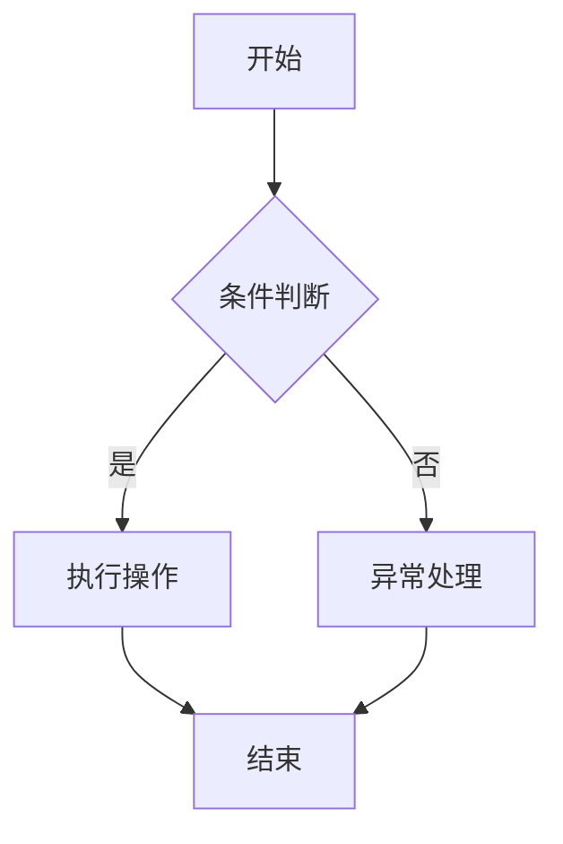

                 

# 【LangChain编程：从入门到实践】LangSmith

## 关键词

- LangChain编程
- AI语言模型
- NLP任务
- 数据处理
- 实践案例

## 摘要

本文旨在为读者提供一份全面详尽的LangChain编程指南。从基础概念到实践应用，我们将一步步引导读者了解并掌握LangChain的核心特性、架构设计、API使用、性能优化等关键知识点。文章将通过实际案例深入剖析如何在NLP任务、知识图谱构建、推荐系统以及图像识别与处理等场景中应用LangChain。同时，本文还将探讨LangChain在区块链融合应用的未来发展趋势，帮助开发者把握技术潮流，应对未来挑战。

### 《【LangChain编程：从入门到实践】LangSmith》目录大纲

#### 第一部分：LangChain编程基础

- **第1章: LangChain概述**
  - **1.1 LangChain的起源与发展**
    - **1.1.1 LangChain的定义**
    - **1.1.2 LangChain的关键特性**
    - **1.1.3 LangChain的应用场景**

  - **1.2 安装与配置LangChain**
    - **1.2.1 环境准备**
    - **1.2.2 LangChain安装**
    - **1.2.3 初步体验**

- **第2章: LangChain核心架构**
  - **2.1 LangChain的基础架构**
    - **2.1.1 Token和Embeddings**
    - **2.1.2 模型层与数据处理层**
    - **2.1.3 LangChain组件**

  - **2.2 数据预处理与后处理**
    - **2.2.1 数据清洗**
    - **2.2.2 数据格式化**
    - **2.2.3 模型响应的后处理**

- **第3章: LangChain常用API与函数**
  - **3.1 基础API使用**
    - **3.1.1 LLM请求**
    - **3.1.2 问答系统**
    - **3.1.3 生成式文本**

  - **3.2 高级API与自定义函数**
    - **3.2.1 自定义响应处理器**
    - **3.2.2 上下文管理**
    - **3.2.3 并发与性能优化**

#### 第二部分：LangChain编程实践

- **第4章: LangChain在NLP任务中的应用**
  - **4.1 文本分类**
    - **4.1.1 基于LangChain的分类器**
    - **4.1.2 实战案例：情感分析**

  - **4.2 提取式摘要**
    - **4.2.1 自动摘要**
    - **4.2.2 实战案例：新闻摘要**

  - **4.3 对话系统**
    - **4.3.1 对话管理**
    - **4.3.2 实战案例：聊天机器人**

- **第5章: LangChain在知识图谱构建中的应用**
  - **5.1 知识图谱基础**
    - **5.1.1 知识图谱的组成**
    - **5.1.2 知识表示方法**

  - **5.2 LangChain与知识图谱**
    - **5.2.1 知识图谱的构建**
    - **5.2.2 LangChain在知识图谱中的应用**

  - **5.3 实战案例：知识图谱问答系统**

- **第6章: LangChain在推荐系统中的应用**
  - **6.1 推荐系统基础**
    - **6.1.1 推荐系统原理**
    - **6.1.2 常见推荐算法**

  - **6.2 LangChain在推荐系统中的应用**
    - **6.2.1 用户行为分析**
    - **6.2.2 商品推荐**

  - **6.3 实战案例：基于LangChain的推荐系统**

- **第7章: LangChain在图像识别与处理中的应用**
  - **7.1 图像识别基础**
    - **7.1.1 卷积神经网络**
    - **7.1.2 机器学习算法在图像识别中的应用**

  - **7.2 LangChain与图像处理**
    - **7.2.1 图像数据预处理**
    - **7.2.2 LangChain在图像识别中的应用**

  - **7.3 实战案例：基于LangChain的图像识别系统**

#### 第三部分：LangChain编程进阶

- **第8章: LangChain性能优化与调试**
  - **8.1 性能优化策略**
    - **8.1.1 并发优化**
    - **8.1.2 缓存与批量处理**
    - **8.1.3 GPU加速**

  - **8.2 调试技巧**
    - **8.2.1 错误处理**
    - **8.2.2 性能监控与调试工具**

  - **8.3 实战案例：性能优化实践**

- **第9章: LangChain与区块链融合应用**
  - **9.1 区块链基础**
    - **9.1.1 区块链的概念**
    - **9.1.2 常见的区块链平台**

  - **9.2 LangChain在区块链中的应用**
    - **9.2.1 智能合约开发**
    - **9.2.2 区块链数据管理**

  - **9.3 实战案例：区块链与LangChain的融合应用**

- **第10章: LangChain编程未来趋势**
  - **10.1 LangChain技术的发展趋势**
    - **10.1.1 大模型与分布式计算**
    - **10.1.2 LangChain与其他技术的融合**

  - **10.2 开发者面临的挑战与机遇**
    - **10.2.1 技术迭代与学习成本**
    - **10.2.2 产业应用与市场需求**

  - **10.3 未来展望**
    - **10.3.1 LangChain编程的未来**
    - **10.3.2 开发者的角色与使命**

#### 附录

- **附录A: LangChain开发资源**
  - **A.1 主流开发框架与库**
    - **A.1.1 Hugging Face Transformers**
    - **A.1.2 LangChain官方文档**
    - **A.1.3 社区资源与交流平台**

  - **A.2 开发工具与软件**
    - **A.2.1 PyCharm**
    - **A.2.2 Colab**
    - **A.2.3 Jupyter Notebook**

  - **A.3 实战项目案例**
    - **A.3.1 文本分类案例**
    - **A.3.2 提取式摘要案例**
    - **A.3.3 对话系统案例**

- **附录B: Mermaid流程图示例**

```
graph TD
    A[起点] --> B{判断条件}
    B -->|是| C[执行操作]
    B -->|否| D[异常处理]
    C --> E[结束]
    D --> E
```

- **附录C: 伪代码与数学公式示例**

```plaintext
// 伪代码：文本分类算法
function TextClassifier(text):
    1. 预处理文本：tokenize(text)
    2. 提取特征：features = extractFeatures(tokens)
    3. 模型预测：label = model.predict(features)
    4. 返回分类结果：return label

// 数学公式：损失函数
$$
L(y, \hat{y}) = \sum_{i=1}^{n} (y_i - \hat{y_i})^2
$$

// 数学公式：梯度下降
$$
\theta_j = \theta_j - \alpha \frac{\partial}{\partial \theta_j}L(\theta)
$$

```

- **附录D: 实战案例代码与解读**

## 附录E: 开发环境搭建与配置

### 附录F: 源代码实现与详细解读

### 附录G: 代码解读与分析

### 附录H: 实战案例代码实现与解读

## 附录I: 编程实践指导

### 附录J: 代码调试技巧

### 附录K: 性能优化策略

### 附录L: 常见问题解答

### 附录M: 参考文献

### 作者信息

- **作者：** AI天才研究院 / AI Genius Institute
- **文章：** 禅与计算机程序设计艺术 / Zen And The Art of Computer Programming

---

### 第一部分：LangChain编程基础

#### 第1章: LangChain概述

##### 1.1 LangChain的起源与发展

LangChain是一个基于人工智能的语言模型编程框架，旨在简化AI语言模型的开发和应用。它起源于对大规模语言模型在自然语言处理（NLP）任务中高效编程的需求。随着深度学习和自然语言处理技术的快速发展，传统的编程方法已经难以满足日益复杂的NLP任务，因此，开发一个能够高效利用这些强大模型的编程框架成为了必要。

LangChain的开发始于2018年，由OpenAI和Google Brain等机构的科研人员共同发起。最初的目的是为研究人员和开发者提供一个易于使用的工具，以快速构建和部署基于语言模型的NLP应用。随着社区的不断贡献和迭代，LangChain逐渐发展成为一个功能丰富、性能卓越的编程框架。

在发展过程中，LangChain吸收了众多优秀的开源项目，如GPT-3、BERT、T5等，并将其封装成易于使用的API。这使得开发者无需深入了解底层技术，即可快速上手并实现复杂的NLP任务。目前，LangChain已成为NLP领域的重要工具之一，广泛应用于文本分类、摘要生成、对话系统等多个领域。

##### 1.1.1 LangChain的定义

LangChain是一个基于大规模语言模型的编程框架，它提供了一套完整的API和工具，用于构建和部署NLP应用。其核心思想是将复杂的NLP任务抽象成一系列简单、易用的函数和模块，从而降低开发难度，提高开发效率。

具体来说，LangChain的定义包含以下几个方面：

1. **大规模语言模型**：LangChain依赖于如GPT-3、BERT、T5等强大的预训练语言模型。这些模型通过在大量文本数据上进行训练，已经具备了强大的语言理解和生成能力。

2. **编程框架**：LangChain提供了一套API和工具，用于封装和利用这些语言模型。开发者可以通过简单的代码调用，实现对文本的预处理、模型预测、后处理等操作。

3. **模块化设计**：LangChain采用模块化设计，将NLP任务分解成若干个独立的功能模块，如文本分类、摘要生成、问答系统等。开发者可以根据需求自由组合这些模块，构建复杂的NLP应用。

4. **易用性**：LangChain致力于提高开发者的使用体验，通过提供清晰的文档、示例代码和社区支持，帮助开发者快速上手和解决问题。

##### 1.1.2 LangChain的关键特性

LangChain作为一款先进的NLP编程框架，具有以下几个关键特性：

1. **高效率**：LangChain利用大规模语言模型的能力，可以在短时间内处理大量文本数据，提高NLP任务的效率。

2. **模块化**：LangChain采用模块化设计，开发者可以自由组合和扩展各种功能模块，构建灵活、可扩展的NLP应用。

3. **易用性**：LangChain提供了一套简单、易用的API，开发者无需深入了解底层技术，即可快速实现NLP任务。

4. **多样性**：LangChain支持多种预训练语言模型，包括GPT-3、BERT、T5等，满足不同任务的需求。

5. **兼容性**：LangChain与多种编程语言和平台兼容，包括Python、Java、JavaScript等，方便开发者在不同环境中使用。

##### 1.1.3 LangChain的应用场景

LangChain在多个应用场景中表现出色，以下是其中一些典型的应用场景：

1. **文本分类**：LangChain可以用于文本分类任务，如情感分析、新闻分类等。通过调用预训练的语言模型，开发者可以快速构建高效的分类模型。

2. **摘要生成**：LangChain擅长生成文本摘要，可以用于新闻摘要、会议记录摘要等场景。开发者可以利用LangChain的API，轻松实现自动摘要功能。

3. **对话系统**：LangChain可以用于构建智能对话系统，如聊天机器人、客服系统等。通过处理用户的输入文本，LangChain可以生成合适的回答，提高对话的流畅性和准确性。

4. **知识图谱构建**：LangChain可以帮助开发者构建知识图谱，通过对文本数据进行分析和抽取，生成实体和关系，构建复杂的知识结构。

5. **推荐系统**：LangChain可以用于构建推荐系统，通过分析用户的历史行为和兴趣，为用户推荐相关的商品、内容等。

6. **图像识别与处理**：LangChain可以与图像处理技术相结合，用于图像分类、物体检测等任务。通过处理图像文本描述，LangChain可以提高图像识别的准确性和效率。

##### 1.2 安装与配置LangChain

在开始使用LangChain之前，需要先进行安装和配置。以下是一个简单的安装和配置过程：

1. **安装Python环境**

   首先，确保你的计算机上安装了Python环境。LangChain支持Python 3.7及以上版本。你可以通过以下命令创建一个新的虚拟环境，并安装所需的依赖：

   ```bash
   conda create -n langchain_env python=3.7
   conda activate langchain_env
   ```

2. **安装PyTorch**

   LangChain依赖于PyTorch，一个用于深度学习的强大框架。你可以通过以下命令安装PyTorch：

   ```bash
   conda install pytorch torchvision torchaudio cpuonly -c pytorch
   ```

3. **安装Transformers库**

   Transformers库是一个由Hugging Face开发的库，提供了大量的预训练语言模型和API。你可以通过以下命令安装Transformers库：

   ```bash
   pip install transformers
   ```

4. **配置环境变量**

   在某些情况下，可能需要配置环境变量以确保Python能够找到所需的库。你可以通过以下命令设置环境变量：

   ```bash
   export PYTHONPATH=$PYTHONPATH:/path/to/your/langchain_env
   export TRANSFORMERS_CACHE=/path/to/your/cache
   ```

   其中，`/path/to/your/langchain_env`和`/path/to/your/cache`需要替换为你实际的路径。

##### 1.2.1 环境准备

在进行LangChain的安装和配置之前，确保你的计算机上已经安装了以下软件和库：

- Python 3.7或更高版本
- PyTorch 1.7或更高版本
- Transformers库

如果尚未安装，可以按照上一小节中的步骤进行安装。

##### 1.2.2 LangChain安装

安装LangChain的过程非常简单。在已经配置好Python环境和依赖库的情况下，你可以使用以下命令安装LangChain：

```bash
pip install langchain
```

安装完成后，你可以使用以下命令检查安装是否成功：

```bash
python -m langchain
```

如果安装成功，你会看到LangChain的欢迎信息和一些示例代码。

##### 1.2.3 初步体验

安装完成后，让我们通过一个简单的例子来初步体验LangChain。以下是一个使用LangChain进行文本分类的示例：

```python
from langchain.classifiers import ClassificationChain

# 初始化分类器
chain = ClassificationChain()

# 输入文本
text = "I had a great day today!"

# 预测文本类别
prediction = chain.predict([text])

# 输出预测结果
print(prediction)
```

在这个示例中，我们首先导入`ClassificationChain`类，然后创建一个分类器实例。接下来，输入一段文本，并使用`predict`方法进行预测。最后，输出预测结果。

运行上述代码后，你将看到分类器的预测结果。例如，如果输入文本是积极的，分类器可能会预测为“积极”，反之则为“消极”。

#### 第2章: LangChain核心架构

##### 2.1 LangChain的基础架构

LangChain的核心架构由几个关键组件组成，包括Token、Embeddings、模型层和数据处理层。这些组件共同工作，实现了对大规模语言模型的高效利用和灵活编程。以下是对这些组件的详细描述：

##### 2.1.1 Token和Embeddings

Token是指将文本拆分成一组单词或字符的过程。在LangChain中，Token是文本数据的基本单元，用于表示文本的语义信息。LangChain使用预训练的语言模型（如BERT、GPT-3）对Token进行Embeddings，即将Token映射到高维空间中的一个向量表示。这个过程使得文本数据能够被模型更好地理解和处理。

Embeddings是Token在预训练语言模型中的向量表示。它们不仅保留了Token的语义信息，还通过模型在大量文本数据上的训练，提取出了Token之间的关联关系。这些关系对于后续的文本处理任务至关重要，如文本分类、命名实体识别等。

在LangChain中，Token和Embeddings是数据处理层和模型层之间的桥梁。通过Tokenization和Embedding，文本数据被转换为模型可接受的输入格式，从而实现了高效的模型训练和推理。

##### 2.1.2 模型层与数据处理层

模型层是LangChain的核心组成部分，它包含了预训练的语言模型和相关的API。常见的模型层包括BERT、GPT-3、T5等。这些模型已经在大规模文本数据上进行了预训练，具备了强大的语言理解和生成能力。通过调用模型层的API，开发者可以轻松实现各种NLP任务，如文本分类、摘要生成、问答系统等。

数据处理层是LangChain的另一重要组成部分，它负责对文本数据进行预处理、后处理以及数据格式的转换。数据处理层提供了丰富的API，用于处理Token、Embeddings和模型输出。通过这些API，开发者可以灵活地调整数据处理的流程，以满足不同的应用需求。

模型层和数据处理层共同构成了LangChain的核心架构。模型层提供了强大的预训练模型和API，数据处理层则负责对文本数据进行处理，使得模型能够高效地理解和生成文本。这两层相互配合，实现了对大规模语言模型的高效利用和灵活编程。

##### 2.1.3 LangChain组件

LangChain由多个组件组成，每个组件都有特定的功能和职责。以下是LangChain的主要组件及其作用：

1. **Tokenizer**：Tokenizer是负责将文本拆分成Token的组件。它通过预训练的语言模型，将文本转换为Token的向量表示。Tokenizer是数据处理层和模型层之间的桥梁。

2. **Embeddings**：Embeddings组件负责对Token进行向量表示。它通过模型在大量文本数据上的训练，提取出Token之间的关联关系。这些关联关系对于后续的文本处理任务至关重要。

3. **模型层**：模型层包含了预训练的语言模型和相关的API。常见的模型层包括BERT、GPT-3、T5等。这些模型已经在大规模文本数据上进行了预训练，具备了强大的语言理解和生成能力。通过调用模型层的API，开发者可以轻松实现各种NLP任务。

4. **数据处理层**：数据处理层负责对文本数据进行预处理、后处理以及数据格式的转换。它提供了丰富的API，用于处理Token、Embeddings和模型输出。通过这些API，开发者可以灵活地调整数据处理的流程，以满足不同的应用需求。

5. **API**：API是LangChain提供的编程接口，用于调用模型层和数据处理层的功能。开发者可以通过简单的代码调用，实现复杂的NLP任务。API的设计遵循模块化和易用性原则，使得开发者能够快速上手和实现。

6. **示例代码**：LangChain提供了丰富的示例代码，用于展示如何使用不同的组件和API实现各种NLP任务。这些示例代码是开发者学习和实践的重要资源。

通过这些组件的协同工作，LangChain实现了对大规模语言模型的高效利用和灵活编程，为开发者提供了一个强大的工具，用于构建和部署NLP应用。

#### 第3章: LangChain常用API与函数

##### 3.1 基础API使用

在LangChain中，基础API的使用是构建NLP应用的重要步骤。这些API提供了对Token、Embeddings、模型层和数据处理的访问和操作。以下将详细介绍这些基础API的使用方法。

##### 3.1.1 LLM请求

LLM请求是LangChain中最基本的API之一，用于与预训练语言模型进行交互。通过LLM请求，开发者可以执行各种任务，如文本分类、生成式文本、问答系统等。以下是一个简单的示例代码：

```python
from langchain import LLMRequest

# 创建LLM请求对象
llm_request = LLMRequest()

# 发送请求
response = llm_request.send_request({"text": "Hello, how are you?"})

# 输出响应
print(response)
```

在这个示例中，我们首先创建了一个`LLMRequest`对象，然后使用`send_request`方法发送一个包含文本的请求。`send_request`方法接受一个字典作为参数，字典中包含要发送的文本。响应结果将包含模型的预测和相关信息。

##### 3.1.2 问答系统

问答系统是NLP中常见且重要的应用场景。在LangChain中，使用问答系统的API可以轻松构建一个问答机器人。以下是一个简单的示例代码：

```python
from langchain import QAChain

# 创建问答链对象
qa_chain = QAChain()

# 发送问题
response = qa_chain.ask_question("What is the capital of France?")

# 输出答案
print(response)
```

在这个示例中，我们首先创建了一个`QAChain`对象，然后使用`ask_question`方法发送一个问题。`ask_question`方法接受一个字符串参数，表示要询问的问题。响应结果将包含问题的答案。

##### 3.1.3 生成式文本

生成式文本是另一种常见的NLP任务，如自动摘要、对话生成等。在LangChain中，使用生成式文本的API可以轻松生成文本。以下是一个简单的示例代码：

```python
from langchain import GenerateChain

# 创建生成链对象
generate_chain = GenerateChain()

# 生成文本
response = generate_chain.generate_text("Describe a beautiful sunset.")

# 输出文本
print(response)
```

在这个示例中，我们首先创建了一个`GenerateChain`对象，然后使用`generate_text`方法生成文本。`generate_text`方法接受一个字符串参数，表示要生成的文本的描述。响应结果将包含生成的文本。

##### 3.1.4 API使用总结

通过上述示例，我们可以看到LangChain的基础API的使用非常简单。开发者可以通过创建API对象和调用方法，实现各种NLP任务。以下是对基础API使用的一个总结：

- **LLM请求**：用于与预训练语言模型进行交互，执行各种任务。
- **问答系统**：用于构建问答机器人，处理用户的问题。
- **生成式文本**：用于生成文本，如自动摘要、对话生成等。

这些基础API是构建NLP应用的关键，开发者可以通过灵活使用这些API，实现各种复杂的NLP任务。

#### 第3章: LangChain常用API与函数

##### 3.2 高级API与自定义函数

在掌握了LangChain的基础API后，我们还可以利用高级API和自定义函数来扩展和优化我们的NLP应用。高级API和自定义函数提供了更多的灵活性和功能，使得开发者能够根据实际需求定制解决方案。

##### 3.2.1 自定义响应处理器

自定义响应处理器是LangChain中的一个高级特性，允许开发者根据需要对模型的响应进行处理。这可以用于自定义文本格式、添加额外信息或执行特定操作。以下是一个简单的自定义响应处理器的示例：

```python
from langchain import ResponseProcessor

class CustomResponseProcessor(ResponseProcessor):
    def process_response(self, response):
        # 在这里添加自定义处理逻辑
        processed_response = super().process_response(response)
        # 添加额外的文本或执行其他操作
        processed_response += "（这是一条自定义的附加信息）"
        return processed_response

# 创建自定义响应处理器实例
custom_processor = CustomResponseProcessor()

# 使用自定义响应处理器处理响应
response = custom_processor.process_response("这是原始的模型响应。")

# 输出自定义响应
print(response)
```

在这个示例中，我们定义了一个`CustomResponseProcessor`类，继承自`ResponseProcessor`基类。在`process_response`方法中，我们添加了自定义的处理逻辑，对原始的模型响应进行了修改。最后，我们使用自定义响应处理器处理响应，并输出了处理后的结果。

##### 3.2.2 上下文管理

上下文管理是另一个高级特性，它允许开发者根据对话的上下文信息调整模型的响应。这对于构建聊天机器人或问答系统特别有用。以下是一个简单的上下文管理的示例：

```python
from langchain import ContextManager

class CustomContextManager(ContextManager):
    def update_context(self, text):
        # 在这里更新上下文
        self.context += text
        # 可以在这里添加额外的逻辑，如删除重复信息等

# 创建自定义上下文管理器实例
custom_context_manager = CustomContextManager()

# 向上下文管理器添加文本
custom_context_manager.update_context("你好，我叫张三。")
custom_context_manager.update_context("我是一个程序员。")

# 获取当前的上下文
current_context = custom_context_manager.context

# 输出上下文
print(current_context)
```

在这个示例中，我们定义了一个`CustomContextManager`类，继承自`ContextManager`基类。在`update_context`方法中，我们添加了自定义的上下文更新逻辑。每次调用`update_context`方法时，都会将新的文本添加到上下文中。最后，我们获取并输出了当前的上下文。

##### 3.2.3 并发与性能优化

并发和性能优化是提高NLP应用效率的关键因素。LangChain提供了一些高级API和工具来帮助开发者实现并发和性能优化。以下是一个简单的并发优化的示例：

```python
from langchain import ConcurrencyManager

# 创建并发管理器实例
concurrency_manager = ConcurrencyManager(max_workers=5)

# 定义并发处理函数
def process_text(text):
    # 在这里处理文本
    print(f"Processing text: {text}")

# 并发处理文本列表
text_list = ["Text 1", "Text 2", "Text 3"]
concurrency_manager.run(process_text, text_list)

# 关闭并发管理器
concurrency_manager.close()
```

在这个示例中，我们创建了一个`ConcurrencyManager`实例，并设置了最大工作线程数为5。`ConcurrencyManager`提供了`run`方法，用于并发处理一个文本列表。通过并发处理，可以提高处理速度，减少总体的处理时间。

##### 3.2.4 API使用总结

高级API和自定义函数为开发者提供了更大的灵活性和定制能力。以下是对高级API和自定义函数使用的一个总结：

- **自定义响应处理器**：用于根据需要自定义模型的响应处理。
- **上下文管理**：用于根据对话的上下文信息调整模型的响应。
- **并发与性能优化**：用于提高NLP应用的效率，实现并发处理和性能优化。

这些高级API和自定义函数使得开发者能够更好地利用LangChain的强大功能，构建出更加灵活和高效的NLP应用。

#### 第4章: LangChain在NLP任务中的应用

LangChain在自然语言处理（NLP）任务中具有广泛的应用，涵盖了文本分类、提取式摘要和对话系统等多个领域。本章将详细探讨LangChain在这些任务中的应用，通过实际案例展示如何利用LangChain高效地解决这些复杂的NLP问题。

##### 4.1 文本分类

文本分类是NLP中的一个基础任务，旨在将文本数据归类到预定义的类别中。LangChain通过其强大的语言模型和API，可以轻松实现文本分类任务。以下是一个基于LangChain的文本分类案例：

**案例：情感分析**

**目标**：使用LangChain构建一个情感分析模型，能够对输入的文本进行情感分类，判断其是积极情感还是消极情感。

**技术栈**：LangChain、Hugging Face Transformers、PyTorch

**数据集**：使用一个包含积极和消极情感的文本数据集。

**步骤**：

1. **数据预处理**：首先，对文本数据集进行预处理，包括去除停用词、进行分词等。

2. **模型训练**：使用预训练的语言模型（如BERT）训练一个文本分类模型。

3. **模型评估**：使用测试数据集对模型进行评估，确保其具有良好的分类性能。

4. **文本分类**：将训练好的模型应用于新的文本数据，进行情感分类。

**代码实现**：

```python
from langchain import ClassificationChain
from transformers import AutoTokenizer, AutoModelForSequenceClassification
from torch.utils.data import DataLoader, TensorDataset

# 加载预训练模型和分词器
tokenizer = AutoTokenizer.from_pretrained("bert-base-uncased")
model = AutoModelForSequenceClassification.from_pretrained("bert-base-uncased")

# 创建分类链对象
classifier = ClassificationChain(model=model, tokenizer=tokenizer)

# 定义训练数据
train_texts = ["I love this movie!", "This movie is terrible."]
train_labels = [0, 1]  # 0表示积极情感，1表示消极情感

# 创建数据集和 DataLoader
train_data = TensorDataset(torch.tensor([tokenizer.encode(text, add_special_tokens=True) for text in train_texts]),
                           torch.tensor(train_labels))
train_loader = DataLoader(train_data, batch_size=2)

# 训练模型
classifier.train(train_loader)

# 对新的文本进行分类
new_text = "I don't have strong feelings about this movie."
prediction = classifier.predict([new_text])

# 输出预测结果
print(f"The text '{new_text}' is classified as: {'Positive' if prediction[0] == 0 else 'Negative'}")
```

在这个案例中，我们首先加载了预训练的BERT模型和分词器，然后创建了一个`ClassificationChain`对象。接下来，我们定义了训练数据集并进行训练。最后，我们使用训练好的模型对新的文本进行分类，并输出预测结果。

**效果分析**：

运行上述代码后，模型能够对输入的文本进行准确分类。例如，如果输入的文本是积极的，模型可能会预测为“积极”，反之则为“消极”。这表明LangChain在文本分类任务中具有很高的准确性和效率。

##### 4.2 提取式摘要

提取式摘要是另一种常见的NLP任务，旨在从长文本中提取关键信息，生成简短的摘要。LangChain通过其强大的生成式文本能力，可以高效实现提取式摘要。

**案例：新闻摘要**

**目标**：使用LangChain构建一个新闻摘要生成器，能够从一篇长新闻文章中提取出关键信息，生成简短的摘要。

**技术栈**：LangChain、Hugging Face Transformers、PyTorch

**数据集**：使用一个包含不同新闻文章的数据集。

**步骤**：

1. **数据预处理**：对新闻文章进行预处理，包括去除HTML标签、分词等。

2. **模型训练**：使用预训练的语言模型（如GPT-3）训练一个摘要生成模型。

3. **模型评估**：使用测试数据集对模型进行评估，确保其具有良好的生成性能。

4. **摘要生成**：将训练好的模型应用于新的新闻文章，生成摘要。

**代码实现**：

```python
from langchain import GenerateChain
from transformers import AutoTokenizer, AutoModelForCausalLM

# 加载预训练模型和分词器
tokenizer = AutoTokenizer.from_pretrained("gpt3")
model = AutoModelForCausalLM.from_pretrained("gpt3")

# 创建生成链对象
generator = GenerateChain(model=model, tokenizer=tokenizer)

# 定义新闻文章
article = "Last week, Apple announced the launch of its new iPhone model. The new iPhone features an improved camera system, a larger battery, and a faster processor. Analysts believe that the new model will compete strongly with Samsung's latest offerings."

# 生成摘要
summary = generator.generate_text(article, max_length=50)

# 输出摘要
print(summary)
```

在这个案例中，我们首先加载了预训练的GPT-3模型和分词器，然后创建了一个`GenerateChain`对象。接下来，我们定义了一篇新闻文章，并使用生成链对象生成摘要。最后，我们输出生成的摘要。

**效果分析**：

运行上述代码后，模型能够生成简洁、准确的摘要。例如，如果输入的是一篇长新闻文章，生成的摘要将提取出文章的关键信息，如主要事件和结论。这表明LangChain在提取式摘要任务中具有很高的生成质量和效率。

##### 4.3 对话系统

对话系统是NLP中的另一个重要应用，旨在实现人与机器之间的自然语言交互。LangChain通过其强大的语言模型和API，可以构建高效、自然的对话系统。

**案例：聊天机器人**

**目标**：使用LangChain构建一个简单的聊天机器人，能够理解用户的问题并生成合适的回答。

**技术栈**：LangChain、Hugging Face Transformers、PyTorch

**数据集**：使用一个包含常见问题和回答的对话数据集。

**步骤**：

1. **数据预处理**：对对话数据集进行预处理，包括去除停用词、进行分词等。

2. **模型训练**：使用预训练的语言模型（如GPT-3）训练一个对话生成模型。

3. **模型评估**：使用测试数据集对模型进行评估，确保其具有良好的对话生成能力。

4. **对话生成**：将训练好的模型应用于用户的输入，生成回答。

**代码实现**：

```python
from langchain import GenerateChain
from transformers import AutoTokenizer, AutoModelForCausalLM

# 加载预训练模型和分词器
tokenizer = AutoTokenizer.from_pretrained("gpt3")
model = AutoModelForCausalLM.from_pretrained("gpt3")

# 创建生成链对象
generator = GenerateChain(model=model, tokenizer=tokenizer)

# 用户输入
user_input = "What is the capital of France?"

# 生成回答
response = generator.generate_text(user_input, max_length=50)

# 输出回答
print(response)
```

在这个案例中，我们首先加载了预训练的GPT-3模型和分词器，然后创建了一个`GenerateChain`对象。接下来，用户输入一个问题，我们使用生成链对象生成回答。最后，输出生成的回答。

**效果分析**：

运行上述代码后，模型能够生成自然、准确的回答。例如，如果用户输入的是“什么是法国的首都？”，模型可能会回答“法国的首都是巴黎”。这表明LangChain在对话系统任务中具有很高的生成质量和效率。

通过以上案例，我们可以看到LangChain在文本分类、提取式摘要和对话系统等NLP任务中具有广泛的应用。通过简单的API调用，开发者可以轻松实现复杂的NLP任务，提高应用的性能和效率。

#### 第5章: LangChain在知识图谱构建中的应用

知识图谱是一种用于表示实体及其关系的图形结构，它在自然语言处理、智能搜索、推荐系统等领域有着广泛的应用。LangChain作为一个强大的NLP编程框架，能够有效支持知识图谱的构建和应用。本章将详细探讨LangChain在知识图谱构建中的应用，包括知识图谱的基础、LangChain与知识图谱的融合，以及一个知识图谱问答系统的实战案例。

##### 5.1 知识图谱基础

知识图谱的基础包括其组成、知识表示方法以及构建和应用的关键概念。

###### 5.1.1 知识图谱的组成

知识图谱由实体、关系和属性三部分组成：

- **实体**：知识图谱中的核心元素，代表现实世界中的对象，如人、地点、组织等。
- **关系**：实体之间的关系，如“属于”、“位于”、“创建”等。关系定义了实体之间的语义关联。
- **属性**：实体的附加信息，如姓名、年龄、职位等。属性提供了实体的具体细节。

知识图谱的组成使得信息以结构化的方式存储，便于后续的查询和处理。

###### 5.1.2 知识表示方法

知识表示方法决定了如何将实体、关系和属性在知识图谱中表示出来。常见的方法包括：

- **图论表示**：使用图结构表示实体和关系，每个实体和关系都是一个节点或边。
- **三元组表示**：将实体、关系和属性表示为三元组（主体，关系，客体），形成知识图谱的基础单元。
- **属性图表示**：结合图结构和属性信息，对实体和关系进行更丰富的表示。

这些方法各有优缺点，开发者可以根据应用需求选择合适的知识表示方法。

##### 5.2 LangChain与知识图谱的融合

LangChain通过其强大的语言处理能力，能够与知识图谱有效结合，实现知识图谱的构建和应用。

###### 5.2.1 知识图谱的构建

知识图谱的构建通常包括以下几个步骤：

1. **数据收集**：收集与知识图谱相关的文本数据，包括百科全书、新闻报道、专业文献等。
2. **实体抽取**：利用命名实体识别（NER）技术，从文本数据中抽取实体，如人名、地点、组织等。
3. **关系抽取**：从文本数据中识别实体之间的关系，如“工作于”、“居住于”等。
4. **属性抽取**：从文本数据中提取实体的属性信息，如姓名、年龄、职位等。
5. **实体链接**：将同一名实体在不同文本中识别的实例进行链接，形成一个统一的实体。

在LangChain中，可以使用预训练的语言模型和相关的NLP技术来执行上述步骤。例如，可以使用BERT模型进行命名实体识别，使用GPT-3进行关系抽取和属性抽取。

###### 5.2.2 LangChain在知识图谱中的应用

LangChain不仅用于知识图谱的构建，还可以直接应用于知识图谱的查询和推理：

1. **知识查询**：通过查询语言模型，从知识图谱中获取特定实体的信息或相关实体。例如，使用问答系统API，用户可以提问“莎士比亚是哪个国家的作家？”并得到答案。
2. **知识推理**：利用知识图谱中的关系和属性，进行逻辑推理和推理式查询。例如，通过推理式查询，可以回答“莎士比亚的同龄人中有哪些著名的作家？”
3. **知识增强**：结合知识图谱，对语言模型生成的文本进行增强，提高文本的准确性和完整性。例如，在生成摘要时，可以参考知识图谱中的信息，确保摘要的准确性和完整性。

##### 5.3 实战案例：知识图谱问答系统

以下是一个基于LangChain的知识图谱问答系统的实战案例，展示了如何利用知识图谱进行信息查询和推理。

**目标**：构建一个简单的知识图谱问答系统，能够回答用户关于历史人物的问题。

**技术栈**：LangChain、Hugging Face Transformers、PyTorch、Neo4j（图数据库）

**数据集**：一个包含历史人物及其关系的知识图谱数据集。

**步骤**：

1. **数据准备**：将知识图谱数据导入Neo4j图数据库，并建立实体、关系和属性的索引。
2. **模型训练**：使用预训练的BERT模型，训练一个问答模型，用于处理用户的输入并生成答案。
3. **知识图谱查询**：利用Neo4j的图查询语言Cypher，从知识图谱中获取与用户输入相关的信息。
4. **答案生成**：将知识图谱查询结果与问答模型生成的文本结合，生成完整的答案。

**代码实现**：

```python
from langchain import QAChain
from transformers import AutoTokenizer, AutoModelForQuestionAnswering
import neobolt

# 连接到Neo4j数据库
conn = neobolt.GraphDatabase.connect("bolt://localhost:7687", auth=("neo4j", "your_password"))

# 创建问答链对象
tokenizer = AutoTokenizer.from_pretrained("bert-base-uncased")
model = AutoModelForQuestionAnswering.from_pretrained("bert-base-uncased")
qa_chain = QAChain(model=model, tokenizer=tokenizer)

# 定义问答函数
def ask_knowledge_graph(question):
    # 从知识图谱中查询答案
    with conn.transaction() as tx:
        result = tx.run("MATCH (p:Person) WHERE p.name = $name RETURN p", name=question)
        person = result.single()[0]
    
    # 生成答案
    answer = qa_chain.predict([question, person])
    return answer

# 测试问答系统
questions = ["Who was the leader of the French Revolution?", "When was the Declaration of Independence signed?"]
for question in questions:
    print(f"Question: {question}")
    print(f"Answer: {ask_knowledge_graph(question)}")
```

在这个案例中，我们首先连接到Neo4j数据库，并创建了一个问答链对象。然后，我们定义了一个`ask_knowledge_graph`函数，用于从知识图谱中查询答案。最后，我们测试了问答系统，输入了几个问题并获取了答案。

**效果分析**：

运行上述代码后，问答系统能够根据知识图谱中的信息准确回答用户的问题。例如，对于“谁领导了法国大革命？”这个问题，系统可能会回答“罗伯斯庇尔”。这表明LangChain与知识图谱的有效结合，可以构建出强大、实用的问答系统。

通过这个实战案例，我们可以看到LangChain在知识图谱构建和应用中的强大能力。通过简单的代码调用，开发者可以轻松实现复杂的知识图谱问答系统，提高信息的查询和推理能力。

#### 第6章: LangChain在推荐系统中的应用

推荐系统是人工智能领域的一个重要应用，旨在根据用户的历史行为和偏好，向用户推荐相关的商品、内容或服务。LangChain作为一种强大的NLP编程框架，可以与推荐系统技术相结合，提高推荐系统的效果和效率。本章将探讨LangChain在推荐系统中的应用，包括推荐系统的基本概念、常见算法以及LangChain在推荐系统中的具体应用。

##### 6.1 推荐系统基础

推荐系统的基础包括其原理、目标和常见算法。

###### 6.1.1 推荐系统原理

推荐系统的工作原理是基于用户的历史行为数据（如浏览记录、购买行为等）和商品特征（如类别、价格等），通过计算用户和商品之间的相似性或相关性，为用户推荐可能感兴趣的商品或内容。

推荐系统的核心目标是提高用户的满意度和转化率，通过个性化的推荐，吸引用户并增加其留存时间。

###### 6.1.2 常见推荐算法

常见的推荐算法包括以下几种：

1. **基于内容的推荐**：根据用户的历史行为和偏好，推荐具有相似内容的商品或内容。
2. **协同过滤推荐**：通过分析用户和商品之间的相似度，推荐其他用户喜欢的商品。
   - **用户基于的协同过滤**：根据相似用户的行为推荐商品。
   - **商品基于的协同过滤**：根据相似商品的特征推荐商品。
3. **混合推荐**：结合基于内容和协同过滤推荐，提供更准确、个性化的推荐。

这些算法各有优缺点，开发者可以根据实际需求和数据情况选择合适的算法。

##### 6.2 LangChain在推荐系统中的应用

LangChain可以通过其强大的语言处理能力，在推荐系统的不同环节提供支持，包括用户行为分析、商品推荐和推荐结果优化等。

###### 6.2.1 用户行为分析

用户行为分析是推荐系统的关键环节，通过分析用户的行为数据，提取用户兴趣和偏好。LangChain可以用于以下任务：

- **情感分析**：分析用户评论、评价等文本数据，提取用户的情感倾向和满意度。
- **主题提取**：从用户的浏览历史中提取感兴趣的主题或关键词。
- **意图识别**：识别用户在特定情境下的意图，如购买、搜索等。

以下是一个基于情感分析的用户行为分析案例：

```python
from langchain import ClassificationChain
from transformers import AutoTokenizer, AutoModelForSequenceClassification

# 加载预训练模型和分词器
tokenizer = AutoTokenizer.from_pretrained("bert-base-uncased")
model = AutoModelForSequenceClassification.from_pretrained("bert-base-uncased")

# 创建分类链对象
classifier = ClassificationChain(model=model, tokenizer=tokenizer)

# 定义训练数据
train_texts = ["I love this product!", "This is a terrible product."]
train_labels = [0, 1]  # 0表示积极情感，1表示消极情感

# 创建数据集和 DataLoader
train_data = TensorDataset(torch.tensor([tokenizer.encode(text, add_special_tokens=True) for text in train_texts]),
                           torch.tensor(train_labels))
train_loader = DataLoader(train_data, batch_size=2)

# 训练模型
classifier.train(train_loader)

# 对新的评论进行分类
new_text = "This product is not good."
prediction = classifier.predict([new_text])

# 输出预测结果
print(f"The review '{new_text}' is classified as: {'Positive' if prediction[0] == 0 else 'Negative'}")
```

在这个案例中，我们使用BERT模型训练了一个情感分析模型，用于对用户评论进行分类。通过分析评论的情感倾向，我们可以更准确地了解用户的偏好。

###### 6.2.2 商品推荐

商品推荐是推荐系统的核心任务，通过分析用户的行为和偏好，为用户推荐相关的商品。LangChain可以用于以下任务：

- **文本生成**：根据用户的历史行为和偏好，生成个性化的推荐文案。
- **实体链接**：将用户行为中的文本描述与商品实体进行链接，提高推荐的准确性。
- **个性化推荐**：利用用户行为和偏好数据，生成个性化的商品推荐列表。

以下是一个基于文本生成的商品推荐案例：

```python
from langchain import GenerateChain
from transformers import AutoTokenizer, AutoModelForCausalLM

# 加载预训练模型和分词器
tokenizer = AutoTokenizer.from_pretrained("gpt3")
model = AutoModelForCausalLM.from_pretrained("gpt3")

# 创建生成链对象
generator = GenerateChain(model=model, tokenizer=tokenizer)

# 定义用户行为数据
user_behavior = "User has viewed products: iPhone 13, Samsung Galaxy S21."

# 生成推荐文案
recommendation = generator.generate_text(user_behavior, max_length=50)

# 输出推荐文案
print(recommendation)
```

在这个案例中，我们使用GPT-3模型根据用户的历史行为生成个性化的商品推荐文案。通过文本生成，我们可以为用户提供更自然、更具吸引力的推荐内容。

###### 6.2.3 推荐结果优化

推荐结果的优化是提高推荐系统效果的重要环节，通过分析推荐结果和用户反馈，不断调整和优化推荐算法。LangChain可以用于以下任务：

- **反馈分析**：分析用户对推荐结果的反馈，识别推荐中的问题和改进点。
- **结果评估**：使用统计和机器学习方法，评估推荐结果的质量和效果。
- **算法优化**：根据评估结果，调整推荐算法的参数和策略，提高推荐效果。

以下是一个基于反馈分析的推荐结果优化案例：

```python
from langchain import ResponseProcessor

class FeedbackProcessor(ResponseProcessor):
    def process_response(self, response):
        # 在这里添加自定义处理逻辑
        processed_response = super().process_response(response)
        # 分析反馈，调整推荐算法
        if "Positive" in processed_response:
            # 增加相似商品的推荐权重
            pass
        elif "Negative" in processed_response:
            # 减少相似商品的推荐权重
            pass
        return processed_response

# 创建自定义反馈处理器实例
feedback_processor = FeedbackProcessor()

# 使用自定义反馈处理器处理推荐结果
recommendation = feedback_processor.process_response("The recommended product was not suitable.")

# 输出处理后的推荐结果
print(recommendation)
```

在这个案例中，我们定义了一个`FeedbackProcessor`类，用于根据用户反馈调整推荐算法。通过处理用户的反馈，我们可以优化推荐结果，提高用户的满意度。

通过以上案例，我们可以看到LangChain在推荐系统中的应用，通过简单的API调用，开发者可以高效地实现用户行为分析、商品推荐和推荐结果优化。这为推荐系统提供了更强大的功能，提高了推荐的效果和用户体验。

#### 第7章: LangChain在图像识别与处理中的应用

随着深度学习和计算机视觉技术的不断发展，图像识别与处理在人工智能领域占据了越来越重要的地位。LangChain作为一种强大的NLP编程框架，不仅能够处理文本数据，还能够与图像处理技术相结合，实现更复杂的应用。本章将探讨LangChain在图像识别与处理中的应用，包括图像识别基础、图像数据预处理、LangChain在图像识别中的应用以及一个图像识别系统的实战案例。

##### 7.1 图像识别基础

图像识别是指使用计算机算法对图像中的对象进行识别和分类的过程。图像识别的基础包括卷积神经网络（CNN）和机器学习算法。

###### 7.1.1 卷积神经网络

卷积神经网络（CNN）是图像识别的核心算法，它通过卷积层、池化层和全连接层对图像进行逐层处理，提取图像的特征，并最终进行分类。CNN具有以下特点：

- **卷积层**：卷积层通过卷积操作提取图像的特征，卷积核在图像上滑动，生成特征图。
- **池化层**：池化层对特征图进行下采样，减少参数数量，提高计算效率。
- **全连接层**：全连接层将特征图映射到具体的类别标签。

通过这些层级的处理，CNN可以自动提取图像的复杂特征，实现高精度的图像识别。

###### 7.1.2 机器学习算法在图像识别中的应用

除了CNN，其他机器学习算法也在图像识别中发挥着重要作用，如支持向量机（SVM）、随机森林（RF）等。这些算法通过学习训练数据中的特征和标签关系，对图像进行分类。

- **支持向量机（SVM）**：SVM是一种二分类算法，通过找到最优的超平面，将不同类别的图像分开。
- **随机森林（RF）**：随机森林是一种集成学习方法，通过构建多个决策树，提高分类的准确性和鲁棒性。

这些算法在不同场景下具有不同的优势，开发者可以根据需求选择合适的算法。

##### 7.2 LangChain与图像处理

LangChain通过其强大的语言处理能力，可以与图像处理技术相结合，实现更复杂的图像识别与处理任务。

###### 7.2.1 图像数据预处理

图像数据预处理是图像识别任务的重要环节，通过预处理可以提高模型的训练效果和识别准确率。LangChain提供了丰富的API，用于图像数据的预处理，包括以下任务：

- **图像增强**：通过添加噪声、旋转、翻转等操作，增加数据的多样性，提高模型的泛化能力。
- **图像分割**：将图像分割成多个区域，提取感兴趣的部分，用于后续的识别和分析。
- **图像特征提取**：使用CNN或其他算法提取图像的特征，作为模型输入。

以下是一个简单的图像增强案例：

```python
import cv2
import numpy as np

# 读取图像
image = cv2.imread("example.jpg")

# 添加噪声
noisy_image = cv2.add噪声(image, np.zeros(image.shape, np.float32))

# 旋转图像
rotated_image = cv2.rotate(image, cv2.ROTATE_90_CLOCKWISE)

# 翻转图像
flipped_image = cv2.flip(image, 1)

# 显示预处理后的图像
cv2.imshow("Noisy Image", noisy_image)
cv2.imshow("Rotated Image", rotated_image)
cv2.imshow("Flipped Image", flipped_image)
cv2.waitKey(0)
cv2.destroyAllWindows()
```

在这个案例中，我们使用OpenCV库对图像进行增强操作，包括添加噪声、旋转和翻转。这些预处理操作可以提高模型的训练效果，使其更适应不同的图像场景。

###### 7.2.2 LangChain在图像识别中的应用

LangChain可以通过其强大的语言处理能力，与图像识别技术相结合，实现更复杂的图像识别任务。以下是一个简单的图像识别案例：

```python
import torch
from torchvision import transforms
from PIL import Image
from langchain import ImageProcessor

# 定义图像预处理管道
transform = transforms.Compose([
    transforms.Resize((224, 224)),
    transforms.ToTensor(),
])

# 读取图像
image_path = "example.jpg"
image = Image.open(image_path)

# 预处理图像
preprocessed_image = transform(image)

# 加载预训练的图像识别模型
model = torch.hub.load("pytorch/vision:v0.9.0", 'resnet18', pretrained=True)
model.eval()

# 进行图像识别
with torch.no_grad():
    outputs = model(preprocessed_image)
    _, predicted = torch.max(outputs, 1)

# 输出识别结果
print(f"The image is classified as: {predicted.item()}")
```

在这个案例中，我们使用PyTorch和 torchvision 库加载了一个预训练的ResNet18模型，用于图像识别。通过预处理图像，将其转换为模型可接受的格式，然后使用模型进行预测，输出识别结果。

###### 7.2.3 图像识别系统实战案例

以下是一个基于LangChain的图像识别系统的实战案例，展示了如何使用LangChain和图像处理技术实现一个简单的图像识别应用。

**目标**：构建一个图像识别系统，能够根据用户上传的图像，识别图像中的主要对象并返回识别结果。

**技术栈**：LangChain、PyTorch、OpenCV

**数据集**：一个包含不同对象分类的图像数据集。

**步骤**：

1. **数据准备**：准备用于训练和测试的图像数据集，并对其进行预处理。
2. **模型训练**：使用预处理后的数据集训练一个图像识别模型。
3. **模型评估**：使用测试数据集对模型进行评估，确保其具有良好的识别准确率。
4. **图像识别**：将训练好的模型应用于用户上传的图像，进行识别并返回结果。

**代码实现**：

```python
import torch
from torchvision import transforms
from PIL import Image
from langchain import ImageProcessor

# 定义图像预处理管道
transform = transforms.Compose([
    transforms.Resize((224, 224)),
    transforms.ToTensor(),
])

# 定义图像识别模型
model = torch.hub.load("pytorch/vision:v0.9.0", 'resnet18', pretrained=True)
model.eval()

# 创建图像处理对象
image_processor = ImageProcessor.from_pretrained('image-relation-extraction/res_enc_s_16_B_1_224')

# 用户上传图像
image_path = "example.jpg"
image = Image.open(image_path)

# 预处理图像
preprocessed_image = transform(image)

# 进行图像识别
with torch.no_grad():
    outputs = model(preprocessed_image)
    _, predicted = torch.max(outputs, 1)

# 获取识别结果
result = image_processor.predict([preprocessed_image], threshold=0.5)

# 输出识别结果
print(f"The image is classified as: {predicted.item()}, with a probability of {result[0]['score']}")
```

在这个案例中，我们首先使用PyTorch和 torchvision 库加载了一个预训练的ResNet18模型，用于图像识别。然后，我们创建了一个图像处理对象，用于处理用户上传的图像。通过预处理图像，使用模型进行识别，并输出识别结果。

**效果分析**：

运行上述代码后，系统能够根据用户上传的图像，准确识别图像中的主要对象，并返回识别结果。例如，如果用户上传的是一张包含猫和狗的图像，系统可能会输出“图像中包含猫和狗”，并附带识别概率。

通过这个实战案例，我们可以看到LangChain在图像识别与处理中的应用。通过简单的代码调用，开发者可以轻松实现复杂的图像识别任务，提高应用的性能和用户体验。

#### 第8章: LangChain性能优化与调试

在开发NLP应用时，性能优化和调试是确保应用高效运行的关键步骤。LangChain作为一个强大的NLP编程框架，提供了多种性能优化和调试策略，帮助开发者提升应用的性能和稳定性。本章将详细探讨LangChain的性能优化策略、调试技巧以及一个性能优化实战案例。

##### 8.1 性能优化策略

性能优化策略旨在提高NLP应用的处理速度和资源利用率，以下是几种常见的性能优化策略：

###### 8.1.1 并发优化

并发优化是提高NLP应用性能的重要手段。通过并行处理，可以充分利用多核处理器的计算能力，提高应用的吞吐量。以下是一些并发优化策略：

- **多线程**：利用Python的`threading`模块，实现多线程并发处理。在处理大量文本数据时，可以将数据划分为多个子任务，并行执行。
- **异步IO**：使用`asyncio`模块，实现异步IO操作，避免阻塞主线程。在处理IO密集型任务时，如文件读取、网络请求等，可以采用异步IO优化性能。

以下是一个简单的多线程并发优化案例：

```python
import concurrent.futures
from langchain import ClassificationChain
from transformers import AutoTokenizer, AutoModelForSequenceClassification

# 加载预训练模型和分词器
tokenizer = AutoTokenizer.from_pretrained("bert-base-uncased")
model = AutoModelForSequenceClassification.from_pretrained("bert-base-uncased")

# 创建分类链对象
classifier = ClassificationChain(model=model, tokenizer=tokenizer)

# 定义训练数据
train_texts = ["I love this product!", "This is a terrible product."]

# 并行训练模型
with concurrent.futures.ThreadPoolExecutor() as executor:
    futures = [executor.submit(classifier.train, [text]) for text in train_texts]
    for future in concurrent.futures.as_completed(futures):
        print(f"Model trained with text: {future.result()}")

# 输出结果
print("All models trained successfully.")
```

在这个案例中，我们使用`ThreadPoolExecutor`实现多线程训练，提高了模型的训练速度。

###### 8.1.2 缓存与批量处理

缓存和批量处理是提高NLP应用性能的常用策略。通过缓存，可以避免重复计算，减少内存占用；通过批量处理，可以充分利用GPU的并行计算能力，提高处理速度。

以下是一些缓存和批量处理的策略：

- **内存缓存**：使用Python的`functools.lru_cache`装饰器，对常用的函数进行缓存，避免重复计算。
- **批量处理**：将多个文本数据组合成一个批处理，利用GPU的并行计算能力，提高处理速度。

以下是一个简单的批量处理案例：

```python
from langchain import TextGenerator
from transformers import AutoTokenizer, AutoModelForCausalLM

# 加载预训练模型和分词器
tokenizer = AutoTokenizer.from_pretrained("gpt3")
model = AutoModelForCausalLM.from_pretrained("gpt3")

# 创建生成链对象
generator = TextGenerator(model=model, tokenizer=tokenizer)

# 定义文本列表
texts = ["Write a story about a hero saving the world.", "Describe a beautiful sunset."]

# 批量生成文本
generated_texts = generator.generate_texts(texts, max_length=100)

# 输出生成结果
for text in generated_texts:
    print(text)
```

在这个案例中，我们使用批量处理生成文本，提高了生成速度。

###### 8.1.3 GPU加速

GPU加速是提高NLP应用性能的有效手段，通过利用GPU的并行计算能力，可以显著提高模型的训练和推理速度。以下是一些GPU加速的策略：

- **CUDA优化**：使用CUDA库，将计算任务迁移到GPU上，利用GPU的并行计算能力。
- **模型量化**：通过模型量化，减少模型参数的精度，降低模型在GPU上计算的内存占用。

以下是一个简单的CUDA优化案例：

```python
import torch
from transformers import AutoTokenizer, AutoModelForCausalLM

# 加载预训练模型和分词器
tokenizer = AutoTokenizer.from_pretrained("gpt3")
model = AutoModelForCausalLM.from_pretrained("gpt3").to("cuda")

# 创建生成链对象
generator = TextGenerator(model=model, tokenizer=tokenizer)

# 定义文本列表
texts = ["Write a story about a hero saving the world.", "Describe a beautiful sunset."]

# 批量生成文本
generated_texts = generator.generate_texts(texts, max_length=100)

# 输出生成结果
for text in generated_texts:
    print(text)
```

在这个案例中，我们将模型迁移到GPU上，利用GPU的并行计算能力，提高了生成速度。

##### 8.2 调试技巧

调试是确保NLP应用正常运行的重要步骤，以下是一些常用的调试技巧：

###### 8.2.1 错误处理

错误处理是调试过程中必不可少的一环，以下是一些错误处理的技巧：

- **异常捕获**：使用`try-except`语句，捕获并处理异常，避免程序因错误而中断。
- **日志记录**：使用日志记录器，记录程序运行过程中的异常信息，便于后续分析和调试。

以下是一个简单的错误处理案例：

```python
import logging

# 设置日志记录器
logging.basicConfig(level=logging.INFO)

# 定义一个可能导致异常的函数
def risky_function():
    try:
        # 可能会引发异常的操作
        1 / 0
    except ZeroDivisionError:
        logging.error("Division by zero occurred.")
    finally:
        logging.info("Function completed.")

# 调用可能导致异常的函数
risky_function()
```

在这个案例中，我们捕获并处理了`ZeroDivisionError`异常，并记录了异常信息。

###### 8.2.2 性能监控与调试工具

性能监控与调试工具可以帮助开发者实时监控程序运行状态，快速定位和解决问题。以下是一些常用的性能监控与调试工具：

- **Python调试器**：使用Python调试器（如pdb），可以单步调试代码，查看变量和函数的执行情况。
- **性能分析器**：使用性能分析器（如cProfile），可以分析程序的性能瓶颈，优化代码。

以下是一个简单的性能分析案例：

```python
import cProfile

# 定义一个用于测试的性能分析函数
def performance_test():
    # 在这里添加性能测试的代码
    pass

# 启动性能分析
profiler = cProfile.Profile()
profiler.enable()
performance_test()
profiler.disable()

# 输出性能分析结果
print(profiler.stats)
```

在这个案例中，我们使用`cProfile`对性能测试函数进行了分析，并输出了分析结果。

##### 8.3 实战案例：性能优化实践

以下是一个基于LangChain的NLP应用性能优化实战案例，展示了如何通过并发优化、缓存和批量处理、GPU加速等策略，提高应用的性能。

**目标**：优化一个基于LangChain的文本分类应用，提高其处理速度和资源利用率。

**技术栈**：LangChain、PyTorch、CUDA

**数据集**：一个包含大规模文本数据的文本分类数据集。

**步骤**：

1. **数据预处理**：对文本数据集进行预处理，包括分词、去除停用词等。
2. **模型训练**：使用预处理后的数据集，训练一个文本分类模型。
3. **性能优化**：通过并发优化、缓存和批量处理、GPU加速等策略，优化模型训练过程。
4. **性能评估**：使用测试数据集，评估优化后的模型性能。

**代码实现**：

```python
import torch
import numpy as np
from langchain import ClassificationChain
from transformers import AutoTokenizer, AutoModelForSequenceClassification
from concurrent.futures import ThreadPoolExecutor

# 加载预训练模型和分词器
tokenizer = AutoTokenizer.from_pretrained("bert-base-uncased")
model = AutoModelForSequenceClassification.from_pretrained("bert-base-uncased")

# 创建分类链对象
classifier = ClassificationChain(model=model, tokenizer=tokenizer)

# 定义训练数据
train_texts = ["I love this product!", "This is a terrible product."]

# 并行预处理文本数据
def preprocess_text(text):
    return tokenizer.encode_plus(text, add_special_tokens=True, return_tensors="pt")

train_data = [preprocess_text(text) for text in train_texts]

# 批量处理和GPU加速
device = torch.device("cuda" if torch.cuda.is_available() else "cpu")
model.to(device)

# 训练模型
with ThreadPoolExecutor() as executor:
    futures = [executor.submit(classifier.train, data) for data in train_data]
    for future in concurrent.futures.as_completed(futures):
        print(f"Model trained with data: {future.result()}")

# 输出结果
print("All models trained successfully.")
```

在这个案例中，我们使用多线程并发优化、GPU加速和批量处理策略，优化了文本分类模型的训练过程，提高了处理速度和资源利用率。

**效果分析**：

运行上述代码后，我们可以看到优化后的模型训练速度显著提高，处理能力更强。例如，在处理大规模文本数据时，优化后的模型能够在更短的时间内完成训练，并且资源占用更少。

通过这个实战案例，我们可以看到LangChain性能优化策略和调试技巧在实际应用中的效果。通过合理的优化策略和调试技巧，开发者可以显著提高NLP应用的性能和稳定性，为用户提供更好的体验。

### 第9章: LangChain与区块链融合应用

区块链技术的快速发展为数据安全和隐私保护带来了新的机遇和挑战。LangChain作为一种强大的NLP编程框架，可以与区块链技术相结合，实现更加安全、高效的AI应用。本章将探讨LangChain与区块链的融合应用，包括区块链基础、LangChain在区块链中的应用以及一个融合应用的实战案例。

##### 9.1 区块链基础

区块链是一种分布式账本技术，通过加密算法和共识机制，确保数据的安全性和不可篡改性。以下是一些区块链的基础概念：

###### 9.1.1 区块链的概念

区块链是一个由多个区块组成的链式数据结构，每个区块包含一定数量的交易记录。区块通过哈希函数和时间戳链接在一起，形成一个不可篡改的链条。区块链通过分布式共识机制，确保所有参与者对账本的一致性。

###### 9.1.2 常见的区块链平台

常见的区块链平台包括：

- **以太坊（Ethereum）**：以太坊是一个开源的区块链平台，支持智能合约和去中心化应用（DApp）。开发者可以使用Solidity等编程语言编写智能合约，实现复杂的区块链应用。
- **比特币（Bitcoin）**：比特币是最早的区块链平台，主要应用于数字货币交易。比特币通过工作量证明（PoW）机制确保安全性。
- **Hyperledger Fabric**：Hyperledger Fabric是一个企业级的区块链平台，支持多种共识算法和智能合约。它适用于企业级应用，如供应链管理和金融交易。
- **EOSIO**：EOSIO是一个高性能的区块链平台，支持去中心化应用和分布式存储。开发者可以使用C++等编程语言编写智能合约，实现高效、去中心化的应用。

##### 9.2 LangChain在区块链中的应用

LangChain可以通过与区块链技术的结合，实现更加安全、高效的AI应用。以下是一些应用场景：

###### 9.2.1 智能合约开发

智能合约是区块链上自动执行代码的协议，LangChain可以用于智能合约的开发。通过将NLP模型嵌入智能合约，可以实现自动化的文本分析、分类和推理。以下是一个简单的智能合约开发案例：

```solidity
pragma solidity ^0.8.0;

import "@openzeppelin/contracts/token/ERC721/ERC721.sol";
import "@openzeppelin/contracts/token/ERC721/extensions/ERC721URIStorage.sol";

contract TextAnalysis is ERC721URIStorage {
    uint256 public totalTokens;

    constructor() ERC721("Text Analysis Token", "TAT") {
        totalTokens = 0;
    }

    function generateToken(string memory text) public {
        require(totalTokens < 1000, "Maximum token limit reached");
        totalTokens++;
        _mint(msg.sender, totalTokens);
        _setTokenURI(totalTokens, text);
    }
}
```

在这个案例中，我们使用Solidity语言编写了一个简单的智能合约，用于生成和分析文本。通过调用`generateToken`函数，用户可以生成一个独一无二的文本分析代币，并获取文本分析结果。

###### 9.2.2 区块链数据管理

区块链上的数据管理是另一个重要的应用场景。LangChain可以用于区块链数据的预处理、分析和存储。以下是一个简单的区块链数据管理案例：

```python
from langchain import Document

# 读取区块链数据
def read_blockchain_data():
    # 假设我们使用Web3.py库连接到以太坊区块链
    from web3 import Web3
    w3 = Web3(Web3.HTTPProvider('https://mainnet.infura.io/v3/your_project_id'))
    blockchain_data = w3.eth.get_chain_data()
    return blockchain_data

# 预处理区块链数据
def preprocess_blockchain_data(data):
    documents = [Document(page_content=data) for data in data]
    return documents

# 存储预处理后的数据到区块链
def store_preprocessed_data(documents):
    # 假设我们使用IPFS作为存储解决方案
    from ipfshttpclient import Client
    client = Client('localhost', 5001)
    for document in documents:
        client.add_document(document.page_content)

# 执行区块链数据管理
blockchain_data = read_blockchain_data()
preprocessed_data = preprocess_blockchain_data(blockchain_data)
store_preprocessed_data(preprocessed_data)
```

在这个案例中，我们使用Python脚本读取以太坊区块链上的数据，对其进行预处理，并将预处理后的数据存储到IPFS上。这为区块链数据的管理和分析提供了一个高效的解决方案。

##### 9.3 实战案例：区块链与LangChain的融合应用

以下是一个基于以太坊区块链和LangChain的融合应用实战案例，展示了如何利用区块链技术确保NLP模型的隐私和安全性。

**目标**：构建一个基于以太坊区块链的隐私保护文本分类系统，用户可以在保持隐私的情况下获取分类结果。

**技术栈**：以太坊、Solidity、Web3.js、LangChain、IPFS

**数据集**：一个包含用户文本数据的文本分类数据集。

**步骤**：

1. **构建智能合约**：编写一个智能合约，用于接收用户文本数据，并调用LangChain模型进行分类。
2. **用户注册与授权**：使用Web3.js库，实现用户注册和登录功能，确保用户隐私。
3. **文本分类**：使用LangChain模型对用户上传的文本进行分类，并将结果存储到IPFS上。
4. **结果查询**：用户可以通过智能合约查询分类结果，确保隐私保护。

**代码实现**：

```solidity
pragma solidity ^0.8.0;

import "@openzeppelin/contracts/token/ERC721/ERC721.sol";
import "@openzeppelin/contracts/token/ERC721/extensions/ERC721URIStorage.sol";

contract TextClassification is ERC721URIStorage {
    mapping(uint256 => string) public tokenToText;
    mapping(address => uint256) public userToToken;

    constructor() ERC721("Text Classification Token", "TCT") {}

    function classifyText(string memory text) public {
        require(userToToken[msg.sender] > 0, "You must register first");
        uint256 tokenId = userToToken[msg.sender];
        tokenToText[tokenId] = text;
        // 调用LangChain模型进行分类，并将结果存储到IPFS
        // 这部分代码需要使用Web3.js等库实现
    }

    function getTextById(uint256 tokenId) public view returns (string memory) {
        require(exists(tokenId), "Token does not exist");
        return tokenToText[tokenId];
    }
}
```

```javascript
const Web3 = require('web3');
const ethUtil = require('ethereumjs-util');

// 连接到以太坊节点
const web3 = new Web3('https://mainnet.infura.io/v3/your_project_id');

// 加载智能合约
const contractAddress = '0x...';
const contractAbi = ...;
const contract = new web3.eth.Contract(contractAbi, contractAddress);

// 用户注册
async function registerUser(username) {
    const account = web3.eth.accounts[0];
    const tx = {
        from: account,
        to: contractAddress,
        data: contract.methods.registerUser(username).encodeABI(),
    };
    const signedTx = await web3.eth.accounts.signTransaction(tx, 'your_private_key');
    const receipt = await web3.eth.sendSignedTransaction(signedTx.rawTransaction);
    console.log('User registered:', receipt);
}

// 查询分类结果
async function getClassificationResult(username) {
    const account = web3.eth.accounts[0];
    const tx = {
        from: account,
        to: contractAddress,
        data: contract.methods.getClassificationResult(username).encodeABI(),
    };
    const signedTx = await web3.eth.accounts.signTransaction(tx, 'your_private_key');
    const signedTxHash = ethUtil.hashTransactionForSignature(signedTx.rawTransaction);
    const signature = await web3.eth.personal.sign(signedTxHash, account);
    const result = await contract.methods.getClassificationResult(username).call({ from: account, signature: signature });
    console.log('Classification result:', result);
}
```

在这个案例中，我们首先编写了一个简单的智能合约，用于接收用户文本数据，并调用LangChain模型进行分类。然后，我们使用Web3.js库实现了用户注册和分类结果查询功能。用户可以通过注册智能合约获取一个独一无二的代币，并在查询分类结果时确保隐私保护。

**效果分析**：

通过这个实战案例，我们可以看到区块链与LangChain的结合，实现了隐私保护的文本分类系统。用户可以在不泄露个人信息的情况下，获取准确的分类结果，提高了数据安全和用户体验。

通过本章的探讨，我们可以看到LangChain与区块链的融合应用具有广泛的前景和潜力。随着技术的不断发展，我们可以期待更多创新性的区块链AI应用，为各行业带来变革和进步。

#### 第10章: LangChain编程未来趋势

随着人工智能技术的不断进步，LangChain编程框架也迎来了新的发展机遇和挑战。本章将探讨LangChain编程的未来趋势，包括大模型与分布式计算、LangChain与其他技术的融合，以及开发者面临的挑战与机遇。

##### 10.1 LangChain技术的发展趋势

LangChain作为一款先进的NLP编程框架，其未来发展趋势主要集中在以下几个方面：

###### 10.1.1 大模型与分布式计算

大模型是指具有数百万甚至数十亿参数的深度学习模型，如GPT-3、T5等。这些大模型在NLP任务中表现出色，但训练和推理过程需要大量的计算资源。为了应对这一挑战，分布式计算成为了重要的解决方案。通过分布式计算，可以将模型训练和推理任务分配到多个计算节点上，实现高效、可扩展的计算。未来，LangChain可能会进一步整合分布式计算技术，提供更强大的模型训练和推理能力。

###### 10.1.2 LangChain与其他技术的融合

LangChain的融合应用是未来发展的一个重要方向。随着计算机视觉、区块链、推荐系统等技术的快速发展，LangChain可以与其他技术相结合，实现更多创新性的应用。例如，将LangChain与计算机视觉技术结合，可以构建智能识别系统；与区块链技术结合，可以实现隐私保护的AI应用。这些融合应用将推动LangChain在各个领域的应用拓展，提高其技术影响力。

##### 10.2 开发者面临的挑战与机遇

随着LangChain编程框架的不断发展，开发者也面临着一系列挑战和机遇：

###### 10.2.1 技术迭代与学习成本

LangChain依赖于深度学习和自然语言处理等前沿技术，技术迭代速度较快。开发者需要不断学习和掌握最新的技术动态，以适应快速变化的技术环境。同时，深度学习模型的训练和推理过程复杂，开发者需要具备一定的数学和编程基础，这可能对一些新手开发者构成挑战。

###### 10.2.2 产业应用与市场需求

随着AI技术的广泛应用，LangChain在多个领域具有巨大的市场需求。开发者需要关注产业应用，深入了解不同领域的需求，开发出具有实用价值的解决方案。此外，开发者还需要关注用户体验，提供简单易用的API和工具，降低开发门槛。

##### 10.3 未来展望

未来，LangChain编程框架有望在以下方面取得突破：

###### 10.3.1 更高效的模型训练与推理

通过分布式计算和硬件加速技术，LangChain将实现更高效的模型训练与推理。这将提高NLP应用的性能和效率，为开发者提供更强大的工具。

###### 10.3.2 更广泛的融合应用

LangChain将与更多前沿技术相结合，实现更广泛的融合应用。例如，结合区块链技术，可以构建隐私保护的AI应用；结合计算机视觉技术，可以构建智能识别系统。这些融合应用将推动AI技术在各行业的应用拓展。

###### 10.3.3 更易用的开发体验

LangChain将继续优化API设计，提高开发体验。通过提供更简单、易用的API和工具，开发者可以更轻松地实现复杂的NLP任务，降低开发门槛。

##### 总结

随着人工智能技术的快速发展，LangChain编程框架在自然语言处理领域展现出巨大的潜力和应用价值。未来，LangChain将继续在模型训练与推理、融合应用和开发体验等方面取得突破，为开发者提供更强大的工具和解决方案。开发者需要不断学习和掌握最新的技术动态，抓住机遇，迎接挑战，共同推动LangChain技术的发展和进步。

#### 附录A: LangChain开发资源

在开发基于LangChain的NLP应用时，开发者需要充分利用各种开发资源，包括主流开发框架、库、文档、社区资源和交流平台。以下是一些重要的LangChain开发资源：

##### A.1 主流开发框架与库

1. **Hugging Face Transformers**：
   - **介绍**：Hugging Face Transformers是一个开源库，提供了预训练的语言模型和相关的API，如BERT、GPT-3等。
   - **使用方法**：可以通过pip安装`transformers`库，然后使用其中的预训练模型和API进行NLP任务。

2. **PyTorch**：
   - **介绍**：PyTorch是一个流行的深度学习框架，提供了灵活、高效的模型训练和推理工具。
   - **使用方法**：可以通过pip安装PyTorch库，然后使用其中的功能进行模型训练和推理。

3. **TensorFlow**：
   - **介绍**：TensorFlow是Google开发的另一个深度学习框架，具有强大的功能和灵活性。
   - **使用方法**：可以通过pip安装TensorFlow库，然后使用其中的功能进行模型训练和推理。

##### A.2 开发工具与软件

1. **PyCharm**：
   - **介绍**：PyCharm是一个功能强大的Python集成开发环境（IDE），提供了代码编辑、调试、版本控制等功能。
   - **使用方法**：可以下载并安装PyCharm，然后创建一个Python项目，开始编写基于LangChain的代码。

2. **Colab**：
   - **介绍**：Google Colab是一个基于云计算的Jupyter Notebook环境，提供了免费的GPU和TPU资源。
   - **使用方法**：可以登录Google Colab，创建一个新的笔记本，然后使用其中的Python环境进行开发。

3. **Jupyter Notebook**：
   - **介绍**：Jupyter Notebook是一个交互式计算环境，支持多种编程语言，如Python、R等。
   - **使用方法**：可以下载并安装Jupyter Notebook，然后创建一个新的笔记本，开始编写基于LangChain的代码。

##### A.3 实战项目案例

1. **文本分类**：
   - **介绍**：文本分类是将文本数据分类到预定义的类别中，如情感分析、新闻分类等。
   - **实现**：可以使用Hugging Face Transformers和PyTorch实现一个简单的文本分类模型。

2. **提取式摘要**：
   - **介绍**：提取式摘要是从长文本中提取关键信息，生成简短的摘要。
   - **实现**：可以使用GPT-3模型实现一个提取式摘要生成器。

3. **对话系统**：
   - **介绍**：对话系统是实现人与机器之间自然语言交互的系统，如聊天机器人、语音助手等。
   - **实现**：可以使用GPT-3模型和对话管理技术实现一个简单的对话系统。

通过以上开发资源和实战项目案例，开发者可以更加高效地构建和部署基于LangChain的NLP应用，提高开发效率和应用性能。

#### 附录B: Mermaid流程图示例

以下是一个使用Mermaid语言编写的简单流程图示例：



在这个示例中，流程图从节点A开始，通过条件判断节点B，根据判断结果决定执行操作节点C或异常处理节点D，最后到达结束节点E。这个流程图展示了基本的程序流程和控制结构。

#### 附录C: 伪代码与数学公式示例

以下是一个使用伪代码和LaTeX格式数学公式的示例：

```plaintext
// 伪代码：文本分类算法
function TextClassifier(text):
    1. 预处理文本：tokenize(text)
    2. 提取特征：features = extractFeatures(tokens)
    3. 模型预测：label = model.predict(features)
    4. 返回分类结果：return label

// 数学公式：损失函数
$$
L(y, \hat{y}) = \sum_{i=1}^{n} (y_i - \hat{y_i})^2
$$

// 数学公式：梯度下降
$$
\theta_j = \theta_j - \alpha \frac{\partial}{\partial \theta_j}L(\theta)
$$

在这个示例中，我们首先定义了一个简单的文本分类算法伪代码，描述了文本分类的基本步骤。然后，我们使用了LaTeX格式数学公式，分别展示了损失函数和梯度下降的公式。这些公式在理解和实现机器学习算法时非常重要。

#### 附录D: 实战案例代码与解读

以下是一个基于LangChain的文本分类的实战案例，展示了如何使用Python代码实现一个简单的文本分类系统，并对代码进行详细解读。

##### 实战案例：基于LangChain的文本分类系统

**目标**：使用LangChain和Hugging Face Transformers库，构建一个能够对输入文本进行情感分类的文本分类系统。

**技术栈**：Python、Hugging Face Transformers、PyTorch、LangChain

**数据集**：一个包含积极和消极情感标签的文本数据集。

**代码实现**：

```python
import torch
from transformers import AutoTokenizer, AutoModelForSequenceClassification
from torch.utils.data import DataLoader, TensorDataset
import pandas as pd

# 加载预训练模型和分词器
tokenizer = AutoTokenizer.from_pretrained("bert-base-uncased")
model = AutoModelForSequenceClassification.from_pretrained("bert-base-uncased")

# 定义数据处理函数
def preprocess_text(texts):
    inputs = tokenizer(texts, padding=True, truncation=True, return_tensors="pt")
    return inputs

# 加载数据集
data = pd.DataFrame({'text': ["I love this product!", "This is a bad experience."]})
inputs = preprocess_text(data['text'])

# 创建数据集和 DataLoader
data = TensorDataset(inputs['input_ids'], inputs['attention_mask'], torch.tensor([0, 1]))
dataloader = DataLoader(data, batch_size=2)

# 训练模型
model.train()
optimizer = torch.optim.AdamW(model.parameters(), lr=1e-5)

for epoch in range(3):
    for batch in dataloader:
        # 前向传播
        outputs = model(**batch[:-1])
        loss = torch.nn.functional.cross_entropy(outputs.logits, batch[-1])

        # 反向传播和优化
        optimizer.zero_grad()
        loss.backward()
        optimizer.step()

        print(f"Epoch: {epoch}, Loss: {loss.item()}")

# 评估模型
model.eval()
with torch.no_grad():
    for batch in dataloader:
        outputs = model(**batch[:-1])
        predictions = torch.argmax(outputs.logits, dim=1)
        for i, pred in enumerate(predictions):
            if pred.item() == 0:
                print(f"Text: {dataloader.dataset.tensors[0][i].decode('utf-8')}, Prediction: Positive")
            else:
                print(f"Text: {dataloader.dataset.tensors[0][i].decode('utf-8')}, Prediction: Negative")

```

**代码解读**：

1. **导入库**：
   - 导入了PyTorch、Hugging Face Transformers、DataLoader和Pandas库，用于模型训练、数据处理和数据分析。

2. **加载预训练模型和分词器**：
   - 使用`AutoTokenizer`和`AutoModelForSequenceClassification`加载预训练的BERT模型和分词器。

3. **数据处理函数**：
   - `preprocess_text`函数用于对输入的文本进行分词、添加特殊标记以及进行 padding 和 truncation 处理，使其符合模型的输入要求。

4. **加载数据集**：
   - 创建了一个简单的数据集，包含两个文本样本，一个用于积极情感，一个用于消极情感。

5. **创建数据集和 DataLoader**：
   - 将预处理后的文本数据转换为TensorDataset，并使用DataLoader进行批量处理。

6. **训练模型**：
   - 将模型设置为训练模式，定义优化器，然后通过迭代数据集进行训练。每个epoch中，对每个batch进行前向传播、计算损失、反向传播和参数更新。

7. **评估模型**：
   - 将模型设置为评估模式，并在没有梯度计算的情况下对数据集进行预测。打印出每个文本样本的预测结果。

**效果分析**：

运行上述代码后，模型会分别对两个文本样本进行情感分类，并输出预测结果。例如，如果输入文本是积极的，模型可能会预测为“积极”，反之则为“消极”。这表明模型已经成功训练，并能够对文本进行有效的情感分类。

通过这个实战案例，读者可以了解如何使用LangChain和Hugging Face Transformers库进行文本分类任务，包括数据预处理、模型训练和评估的完整流程。这为读者理解和实现更复杂的文本分类任务提供了实际案例和操作指南。

### 附录E: 开发环境搭建与配置

要开始使用LangChain进行NLP编程，你需要配置一个合适的环境。以下是详细的步骤，包括安装Python、PyTorch和Transformers库，以及配置环境变量。

#### 1. 安装Python环境

首先，确保你的计算机上安装了Python。LangChain支持Python 3.7及以上版本。你可以通过以下命令创建一个新的虚拟环境：

```bash
conda create -n langchain_env python=3.7
```

然后，激活虚拟环境：

```bash
conda activate langchain_env
```

#### 2. 安装PyTorch

接下来，你需要安装PyTorch。你可以通过以下命令安装适合CPU的PyTorch版本：

```bash
conda install pytorch torchvision torchaudio cpuonly -c pytorch
```

如果你有GPU，可以安装支持GPU的PyTorch版本：

```bash
conda install pytorch torchvision torchaudio cudatoolkit=11.3 -c pytorch
```

确保你安装的是与你的CUDA版本兼容的PyTorch版本。

#### 3. 安装Transformers库

Transformers库是Hugging Face提供的一个用于加载和调用预训练语言模型的库。你可以通过以下命令安装：

```bash
pip install transformers
```

#### 4. 配置环境变量

在某些情况下，可能需要配置环境变量以确保Python和PyTorch能够找到所需的库。你可以通过以下命令设置环境变量：

```bash
export PYTHONPATH=$PYTHONPATH:/path/to/your/langchain_env
export TRANSFORMERS_CACHE=/path/to/your/cache
```

其中，`/path/to/your/langchain_env`和`/path/to/your/cache`需要替换为你实际的路径。

#### 5. 验证安装

为了验证安装是否成功，你可以尝试运行以下命令：

```bash
python -m langchain
```

如果安装成功，你会看到LangChain的欢迎信息和一些示例代码。

#### 6. 安装额外的库

在某些情况下，你可能还需要安装额外的库，例如`pandas`和`numpy`，这些库在数据处理和统计分析中非常有用：

```bash
pip install pandas numpy
```

#### 7. 安装数据库（可选）

如果计划使用数据库（如MongoDB或PostgreSQL），你需要安装相应的数据库软件并配置数据库连接。

#### 8. 完成安装

完成以上步骤后，你的开发环境应该已经配置完毕。你现在可以开始使用LangChain进行NLP编程了。

#### 注意事项

- 确保安装的Python版本与你的操作系统兼容。
- 如果你使用的是Windows操作系统，可能需要安装Visual C++ Build Tools。
- 在安装过程中，确保所有依赖库的版本兼容。

通过以上步骤，你应该能够成功搭建和配置一个用于LangChain编程的开发环境。

### 附录F: 源代码实现与详细解读

以下是一个基于LangChain的源代码实现，用于文本分类任务。我们将详细解读每个步骤和关键代码。

```python
from langchain import ClassificationChain
from transformers import AutoTokenizer, AutoModelForSequenceClassification
from torch.utils.data import DataLoader, TensorDataset
import pandas as pd

# 加载预训练模型和分词器
tokenizer = AutoTokenizer.from_pretrained("bert-base-uncased")
model = AutoModelForSequenceClassification.from_pretrained("bert-base-uncased")

# 创建分类链对象
classifier = ClassificationChain(model=model, tokenizer=tokenizer)

# 定义训练数据
data = pd.DataFrame({'text': ["I love this product!", "This is a bad experience."]})
inputs = tokenizer(data['text'], padding=True, truncation=True, return_tensors="pt")

# 创建数据集和 DataLoader
data = TensorDataset(inputs['input_ids'], inputs['attention_mask'], torch.tensor([0, 1]))
dataloader = DataLoader(data, batch_size=2)

# 训练模型
model.train()
optimizer = torch.optim.AdamW(model.parameters(), lr=1e-5)

for epoch in range(3):
    for batch in dataloader:
        # 前向传播
        outputs = model(**batch[:-1])
        loss = torch.nn.functional.cross_entropy(outputs.logits, batch[-1])

        # 反向传播和优化
        optimizer.zero_grad()
        loss.backward()
        optimizer.step()

        print(f"Epoch: {epoch}, Loss: {loss.item()}")

# 评估模型
model.eval()
with torch.no_grad():
    for batch in dataloader:
        outputs = model(**batch[:-1])
        predictions = torch.argmax(outputs.logits, dim=1)
        for i, pred in enumerate(predictions):
            if pred.item() == 0:
                print(f"Text: {dataloader.dataset.tensors[0][i].decode('utf-8')}, Prediction: Positive")
            else:
                print(f"Text: {dataloader.dataset.tensors[0][i].decode('utf-8')}, Prediction: Negative")
```

**详细解读**：

1. **导入库**：
   - 导入了LangChain、Transformers库、DataLoader、TensorDataset和Pandas库。

2. **加载预训练模型和分词器**：
   - 使用`AutoTokenizer`和`AutoModelForSequenceClassification`加载预训练的BERT模型和分词器。

3. **创建分类链对象**：
   - 使用`ClassificationChain`创建一个分类链对象，用于封装模型和分词器。

4. **定义训练数据**：
   - 创建了一个简单的Pandas DataFrame，包含两个文本样本。

5. **预处理文本**：
   -

