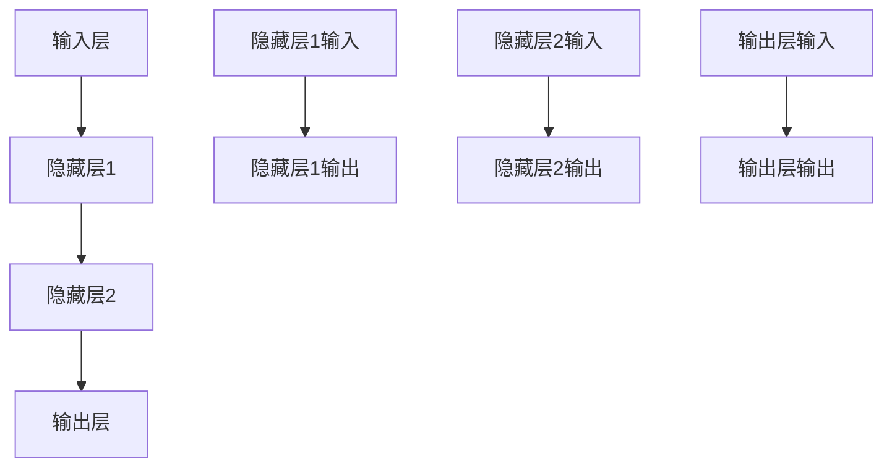
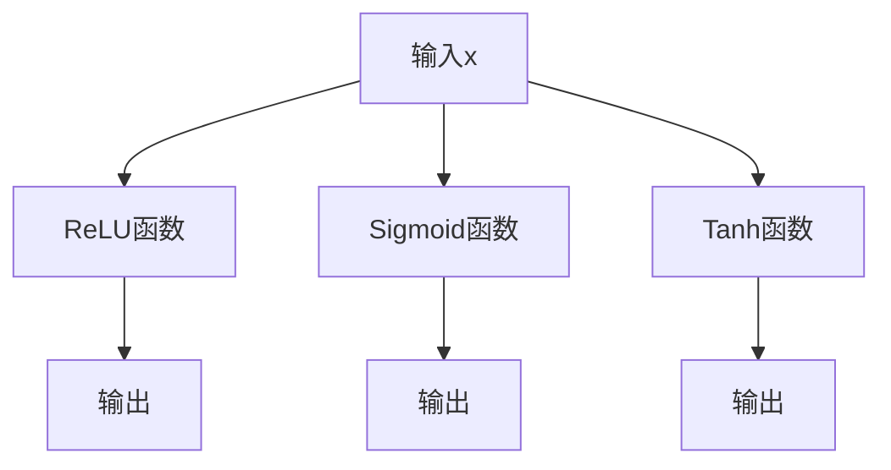

                 

# 【大模型应用开发 动手做AI Agent】人类的大脑了不起

## 关键词
- 大模型应用
- AI Agent
- 人类大脑
- 深度学习
- 自然语言处理
- 项目实战

## 摘要
本文探讨了人工智能大模型的应用开发，特别关注AI Agent的创建。我们将从人类大脑的启示出发，分析AI大模型的核心技术原理，并通过实际项目案例展示如何动手实现AI Agent。同时，文章还将讨论AI大模型应用的安全与伦理问题，并展望其未来发展。

## 第1章：AI大模型概述与前景

### 1.1 AI大模型的基本概念

AI大模型是基于深度学习的大型神经网络模型，它们通常拥有数十亿甚至数万亿个参数。这些模型在训练过程中通过学习大量数据，从而获得强大的特征提取和泛化能力。AI大模型是现代人工智能技术发展的重要里程碑，它们在自然语言处理、计算机视觉、推荐系统等领域展现出了巨大的潜力。

#### 1.1.1 AI大模型的定义

AI大模型，指的是那些拥有数十亿甚至数千亿参数的深度神经网络模型。例如，GPT-3拥有1750亿个参数，BERT模型拥有亿级参数。这些模型通过大量数据的学习，能够对输入的信息进行复杂的处理和生成。

#### 1.1.2 AI大模型的重要性

AI大模型是当前实现智能化技术的关键。它们不仅能够处理复杂的任务，还能在未见过的情况下进行推理和决策。这使得AI大模型在各个领域都有广泛的应用，如自动驾驶、医疗诊断、金融分析等。

#### 1.1.3 AI大模型的特点

- **计算资源需求大**：AI大模型训练过程中需要大量的计算资源，通常需要使用高性能的GPU或者分布式计算系统。
- **数据处理能力强**：通过学习大量数据，AI大模型能够提取出高度抽象的特征，从而在多种任务上表现出色。
- **适应性强**：AI大模型能够适应不同的任务和场景，通过微调的方式快速适应新的任务需求。

### 1.2 人类大脑的启示

人类大脑是一个复杂而高效的计算系统，它在处理信息、学习、记忆和决策方面展现了卓越的能力。从人类大脑的结构和功能出发，可以为我们设计和优化AI大模型提供重要的启示。

#### 1.2.1 人类大脑的结构

人类大脑由多个部分组成，包括大脑皮层、脑干、小脑等。其中，大脑皮层是思考、感知和运动的中心。大脑皮层由多个神经层构成，每个神经层都有不同的功能。


#### 1.2.2 人类大脑与AI大模型的联系

人类大脑的神经网络结构和功能为AI大模型的设计提供了重要的启示。首先，AI大模型中的多层神经网络结构模仿了大脑皮层的组织方式，通过逐层提取特征，实现复杂的任务处理。


其次，人类大脑中的神经元通过突触连接，形成复杂的神经网络，这种连接方式也启发了AI大模型中的权重矩阵设计。通过调整权重矩阵，可以实现模型参数的优化和模型的改进。

### 1.3 AI大模型的发展历程

AI大模型的发展历程可以分为几个阶段，从最初的神经网络探索到如今的预训练时代。

#### 1.3.1 初期探索

AI大模型的起源可以追溯到1940年代，当时神经网络的概念被提出。早期的研究主要集中在感知机模型和反向传播算法上。这些早期模型虽然简单，但为后来的大模型研究奠定了基础。

#### 1.3.2 预训练时代

随着计算资源和数据量的增加，AI大模型进入了一个新的时代——预训练时代。预训练模型通过在大量数据上预先训练，然后通过微调适应特定任务，大大提高了模型的性能和泛化能力。GPT、BERT等模型的出现，标志着AI大模型进入了一个新的高峰。

#### 1.3.3 自监督学习

自监督学习是AI大模型发展的重要方向。通过利用未标注的数据，自监督学习可以大大提高模型的训练效率。自监督学习不仅适用于自然语言处理，还广泛应用于计算机视觉和语音识别等领域。

### 1.4 AI大模型的应用前景

AI大模型在各个领域都有广泛的应用前景，以下是几个典型的应用场景。

#### 1.4.1 产业应用

AI大模型在产业应用中展现了强大的潜力。例如，在智能客服领域，AI大模型可以用于对话生成和理解，提高客户服务质量。在自动驾驶领域，AI大模型可以用于图像识别和决策，提高驾驶安全性。在医疗健康领域，AI大模型可以用于疾病诊断和预测，提高医疗服务的效率和质量。

#### 1.4.2 社会影响

AI大模型的应用对社会产生了深远的影响。一方面，AI大模型可以提高生产效率和服务质量，推动社会的进步和发展。另一方面，AI大模型也带来了数据安全和伦理道德等问题，需要我们认真对待和解决。

### 1.5 本章小结

本章从AI大模型的基本概念、人类大脑的启示、发展历程和应用前景等方面进行了探讨。AI大模型是人工智能技术的重要发展方向，具有广阔的应用前景。通过学习和掌握AI大模型的核心技术，我们可以更好地应对未来的挑战。

### 1.6 课后思考题

1. 请简要解释AI大模型的基本概念和特点。
2. 请阐述人类大脑的结构和功能，并分析其与AI大模型的联系。
3. 请描述AI大模型的发展历程，并简要分析其预训练和自监督学习的优势。
4. 请列举AI大模型在产业和社会中的应用场景，并简要分析其对社会的影响。

---

**文章摘要：**

本文深入探讨了人工智能大模型（AI Large Models）的应用开发，特别是AI Agent的构建。文章首先介绍了AI大模型的基本概念、重要性以及特点，并探讨了人类大脑的结构和功能对其设计的启示。接着，文章回顾了AI大模型的发展历程，从最初的神经网络探索到预训练时代，再到自监督学习。随后，文章探讨了AI大模型在产业应用和社会影响方面的前景，包括智能客服、自动驾驶、医疗健康等领域的应用，以及数据安全和伦理问题。最后，文章展望了AI大模型的未来发展，包括技术趋势和应用场景，并提出了课后思考题，以引导读者进一步思考和探索。

---

接下来，我们将进入第2章，详细探讨AI大模型的核心技术原理。在下一章中，您将了解到深度学习的理论基础、大规模预训练模型的工作原理，以及自然语言处理中的核心技术。让我们一起深入探索，揭示AI大模型背后的科学奥秘。**让我们一步步来，从深度学习的理论基础开始。**

---

## 第2章：AI大模型核心技术原理

### 2.1 深度学习基础

#### 2.1.1 神经网络结构

神经网络是AI大模型的基础，它由多个神经元（或称为节点）组成。每个神经元接受多个输入，并通过激活函数产生一个输出。神经网络通常分为输入层、隐藏层和输出层。

**Mermaid流程图：**



**神经网络结构示意图：**


- **输入层**：接收外部输入数据。
- **隐藏层**：对输入数据进行处理和特征提取。
- **输出层**：产生最终的输出结果。

#### 2.1.2 激活函数

激活函数是神经网络中至关重要的一部分，它将神经元的线性组合映射到一个非线性的输出。常用的激活函数包括ReLU、Sigmoid和Tanh。

- **ReLU（Rectified Linear Unit）**：当输入为负时，输出为0，否则输出输入值。ReLU函数简单且易于优化。
  ```plaintext
  f(x) = max(0, x)
  ```

- **Sigmoid**：将输入值映射到(0, 1)区间，常用于二分类问题。
  ```plaintext
  f(x) = 1 / (1 + e^(-x))
  ```

- **Tanh（双曲正切函数）**：将输入值映射到(-1, 1)区间。
  ```plaintext
  f(x) = (e^(2x) - e^(-2x)) / (e^(2x) + e^(-2x))
  ```

**Mermaid流程图：**



**激活函数示意图：**


### 2.2 大规模预训练模型

#### 2.2.1 预训练概念

预训练是指在大规模数据集上训练基础模型，使其具备一定的泛化能力。预训练模型通常分为两个阶段：预训练和微调。

- **预训练目标**：在大量无标注数据上训练模型，使其学习到通用的特征表示。
- **微调**：在特定任务上使用预训练模型，通过调整模型参数使其适应新的任务。

#### 2.2.2 自监督学习

自监督学习是一种无监督学习技术，它利用未标注的数据来训练模型。在自监督学习中，模型需要预测数据中的某些部分，例如单词、图像或者语音。自监督学习大大提高了模型的训练效率，同时也减少了标注数据的需求。

**伪代码：**

```python
# 自监督学习伪代码

# 预训练阶段
for epoch in range(num_epochs):
    for data in unlabeled_data_loader:
        model.zero_grad()
        outputs = model(data)
        loss = compute_loss(outputs, data)
        loss.backward()
        model.optimizer.step()

# 微调阶段
for epoch in range(num_epochs):
    for data, target in labeled_data_loader:
        model.zero_grad()
        outputs = model(data)
        loss = compute_loss(outputs, target)
        loss.backward()
        model.optimizer.step()
```

### 2.3 自然语言处理

#### 2.3.1 词嵌入

词嵌入是将词汇映射到高维空间的一种技术，使得词汇之间具有数学上的相似性和距离关系。常见的词嵌入方法包括Word2Vec、BERT等。

- **Word2Vec**：通过训练神经网络，将输入的单词映射到固定长度的向量。
  ```plaintext
  vec(w) = tanh(W * embed(w))
  ```

- **BERT**：Bidirectional Encoder Representations from Transformers，通过双向Transformer模型进行训练，生成上下文敏感的词嵌入。

#### 2.3.2 语义理解

语义理解是自然语言处理的核心任务，它旨在理解文本的含义。注意力机制和Transformer模型是语义理解的重要工具。

- **注意力机制**：通过计算输入序列中每个元素的重要程度，从而聚焦于关键信息。
  ```plaintext
  attention_scores = softmax(W_att * hidden_states)
  context_vector = sum(attention_scores * hidden_states)
  ```

- **Transformer模型**：基于自注意力机制，能够高效地处理长序列信息。

**数学模型与公式：**

```latex
\text{自注意力得分} = \text{softmax}(\text{W}_\text{att} \cdot \text{Q} \cdot \text{K}^T)
$$

\text{上下文向量} = \text{softmax}(\text{W}_\text{att} \cdot \text{Q} \cdot \text{K}^T) \cdot \text{V}
```

**举例说明：**

假设我们有三个词`[词1, 词2, 词3]`，我们想要通过注意力机制来计算它们的重要程度。首先，我们将每个词映射到向量空间：

- 词1向量：\( \text{Q}_1 \)
- 词2向量：\( \text{Q}_2 \)
- 词3向量：\( \text{Q}_3 \)

然后，我们计算注意力得分：

```latex
\text{自注意力得分} = \text{softmax}(\text{W}_\text{att} \cdot \text{Q}_1 \cdot \text{K}_1^T + \text{W}_\text{att} \cdot \text{Q}_2 \cdot \text{K}_2^T + \text{W}_\text{att} \cdot \text{Q}_3 \cdot \text{K}_3^T)
$$

\text{注意力得分} = \left[\frac{e^{\text{W}_\text{att} \cdot \text{Q}_1 \cdot \text{K}_1^T}}{\sum e^{\text{W}_\text{att} \cdot \text{Q}_1 \cdot \text{K}_1^T}}, \frac{e^{\text{W}_\text{att} \cdot \text{Q}_2 \cdot \text{K}_2^T}}{\sum e^{\text{W}_\text{att} \cdot \text{Q}_2 \cdot \text{K}_2^T}}, \frac{e^{\text{W}_\text{att} \cdot \text{Q}_3 \cdot \text{K}_3^T}}{\sum e^{\text{W}_\text{att} \cdot \text{Q}_3 \cdot \text{K}_3^T}}\right]
```

接着，我们计算上下文向量：

```latex
\text{上下文向量} = \text{softmax}(\text{W}_\text{att} \cdot \text{Q}_1 \cdot \text{K}_1^T + \text{W}_\text{att} \cdot \text{Q}_2 \cdot \text{K}_2^T + \text{W}_\text{att} \cdot \text{Q}_3 \cdot \text{K}_3^T) \cdot \text{V}
$$

\text{上下文向量} = \left[\frac{\sum e^{\text{W}_\text{att} \cdot \text{Q}_1 \cdot \text{K}_1^T} \cdot \text{V}}{\sum e^{\text{W}_\text{att} \cdot \text{Q}_1 \cdot \text{K}_1^T}}, \frac{\sum e^{\text{W}_\text{att} \cdot \text{Q}_2 \cdot \text{K}_2^T} \cdot \text{V}}{\sum e^{\text{W}_\text{att} \cdot \text{Q}_2 \cdot \text{K}_2^T}}, \frac{\sum e^{\text{W}_\text{att} \cdot \text{Q}_3 \cdot \text{K}_3^T} \cdot \text{V}}{\sum e^{\text{W}_\text{att} \cdot \text{Q}_3 \cdot \text{K}_3^T}}\right]
```

**Transformer模型示意图：**


### 2.4 本章小结

本章详细介绍了AI大模型的核心技术原理，包括深度学习的理论基础、大规模预训练模型的工作原理，以及自然语言处理中的核心技术。通过理解这些技术，我们可以更好地设计和优化AI大模型，使其在各个领域中发挥更大的作用。

### 2.5 课后思考题

1. 请简要解释神经网络的基本结构，并描述输入层、隐藏层和输出层的作用。
2. 请说明ReLU、Sigmoid和Tanh激活函数的特点和应用场景。
3. 请解释预训练和微调的区别，并简要描述自监督学习的基本概念。
4. 请说明词嵌入和语义理解在自然语言处理中的作用，并举例说明注意力机制如何工作。

---

接下来，我们将进入第3章，介绍AI大模型项目实战。通过具体的案例，我们将了解如何搭建项目环境、收集和处理数据，以及训练和优化模型。让我们一起动手，体验AI大模型的应用开发过程。

---

## 第3章：AI大模型项目实战

### 3.1 项目环境搭建

在进行AI大模型项目开发之前，搭建合适的环境是至关重要的。以下是一个典型的环境搭建步骤。

#### 3.1.1 硬件需求

AI大模型项目通常需要高性能的计算资源，特别是GPU。以下是常见的硬件需求：

- **GPU**：NVIDIA的CUDA兼容GPU，如Tesla V100、A100等。
- **CPU**：多核高频率CPU，如Intel Xeon系列。
- **内存**：至少64GB以上，根据模型大小和训练需求进行调整。

#### 3.1.2 软件环境

- **深度学习框架**：TensorFlow、PyTorch等。
- **操作系统**：Linux系统，如Ubuntu、CentOS等。
- **编译器**：C++11或更高版本。
- **Python**：Python 3.x版本，与深度学习框架兼容。

#### 3.1.3 环境搭建步骤

1. 安装操作系统和GPU驱动。
2. 安装Python和pip。
3. 使用pip安装深度学习框架和相关依赖。

```bash
pip install tensorflow
# 或者
pip install torch torchvision torchaudio
```

#### 3.1.4 验证环境

安装完成后，可以通过以下命令验证环境是否搭建成功：

```python
# TensorFlow
import tensorflow as tf
print(tf.__version__)

# PyTorch
import torch
print(torch.__version__)
```

### 3.2 数据收集与处理

数据是AI大模型训练的基础，数据的收集和处理质量直接影响到模型的性能。以下是数据收集与处理的基本步骤：

#### 3.2.1 数据收集

1. **开源数据集**：可以使用公共数据集，如MNIST、CIFAR-10、IMDb等。
2. **定制数据集**：根据项目需求，设计并收集定制数据集。

#### 3.2.2 数据预处理

1. **数据清洗**：去除重复数据、异常值和噪声。
2. **数据标注**：对于监督学习任务，需要对数据进行标注。
3. **数据转换**：将数据转换为模型可以处理的格式，如图像转换为像素矩阵，文本转换为词嵌入向量。

### 3.3 模型训练与优化

模型训练是AI大模型项目开发的核心步骤。以下是模型训练与优化的基本步骤：

#### 3.3.1 模型选择

1. **任务特点**：根据任务需求选择合适的模型，如卷积神经网络（CNN）适用于图像识别，循环神经网络（RNN）适用于序列数据。
2. **模型调优**：通过调整模型参数，如学习率、批次大小等，优化模型性能。

#### 3.3.2 训练过程

1. **初始化模型**：从预训练模型开始，或者随机初始化模型。
2. **前向传播**：输入数据通过模型，计算输出。
3. **损失计算**：计算预测结果与真实结果之间的差距，使用损失函数衡量。
4. **反向传播**：更新模型参数，减小损失。
5. **迭代训练**：重复上述过程，直到模型收敛。

#### 3.3.3 模型优化

1. **超参数调优**：通过调整学习率、批次大小、迭代次数等超参数，提高模型性能。
2. **正则化**：使用L1、L2正则化等技巧，防止模型过拟合。
3. **数据增强**：通过旋转、缩放、裁剪等方式增加训练数据的多样性。

### 3.4 模型评估与部署

模型评估是确保模型性能的重要步骤，以下是模型评估与部署的基本步骤：

#### 3.4.1 模型评估

1. **评价指标**：根据任务类型选择合适的评价指标，如准确率、召回率、F1分数等。
2. **交叉验证**：使用交叉验证方法评估模型性能。

#### 3.4.2 模型部署

1. **模型导出**：将训练好的模型导出为可以部署的格式，如TensorFlow的 SavedModel、PyTorch的onnx格式。
2. **部署平台**：选择合适的部署平台，如TensorFlow Serving、TensorFlow Lite、PyTorch Mobile等。
3. **性能优化**：针对部署环境进行性能优化，如模型压缩、量化等。

### 3.5 本章小结

本章介绍了AI大模型项目实战的基本步骤，包括环境搭建、数据收集与处理、模型训练与优化、模型评估与部署。通过这些步骤，我们可以构建一个完整的AI大模型项目，并将其应用于实际场景。

### 3.6 课后思考题

1. 请简要描述AI大模型项目环境搭建的步骤和注意事项。
2. 请说明数据收集与处理的基本步骤，并讨论数据清洗和标注的重要性。
3. 请解释模型训练与优化的基本过程，并描述如何调整超参数和正则化技巧。
4. 请描述模型评估与部署的基本步骤，并讨论如何优化模型在部署环境中的性能。

---

接下来，我们将进入第4章，讨论AI大模型应用案例分析。通过具体案例，我们将了解如何将AI大模型应用于实际问题，并展示其实际效果。让我们一起来探讨这些案例，学习如何将理论知识转化为实际应用。

---

## 第4章：AI大模型应用案例分析

在本章中，我们将探讨几个实际案例，展示AI大模型在不同领域的应用，以及它们所带来的实际效果。以下是几个典型的应用案例。

### 4.1 案例一：智能客服系统

#### 4.1.1 案例背景

智能客服系统是AI大模型应用的一个重要领域。随着企业对客户服务质量的重视，智能客服系统成为提高效率和客户满意度的重要手段。通过AI大模型，智能客服系统能够自动处理客户咨询，提供即时响应和解决方案。

#### 4.1.2 技术实现

智能客服系统通常包括以下技术：

- **对话生成**：使用自然语言处理技术，生成对用户问题的回答。
- **意图识别**：通过深度学习模型，识别用户的意图。
- **实体抽取**：从用户问题中提取关键信息，如关键词、实体等。

**技术实现步骤：**

1. **数据收集**：收集用户对话记录，用于模型训练。
2. **数据预处理**：清洗数据，进行分词、去停用词等处理。
3. **模型训练**：使用预训练的语言模型，如GPT、BERT等，进行微调。
4. **系统部署**：将训练好的模型部署到服务器，提供实时客服服务。

#### 4.1.3 案例实施

一个具体的智能客服系统实施案例如下：

1. **数据收集**：从企业客服系统中提取历史对话记录，包括用户问题和客服的回答。
2. **数据预处理**：对对话记录进行清洗，去除噪声和无关信息。
3. **模型训练**：使用GPT模型，对预处理后的数据集进行训练，实现对话生成和理解。
4. **系统部署**：将训练好的模型部署到企业客服系统，提供自动回答和解决方案。

#### 4.1.4 案例效果

智能客服系统在实际应用中取得了显著的效果：

- **提高响应速度**：系统可以实时响应用户问题，大大缩短了响应时间。
- **提升客户满意度**：通过提供准确、及时的回答，提高了客户满意度。
- **减轻客服负担**：自动处理了大量常见问题，减轻了客服人员的负担。

### 4.2 案例二：图像识别系统

#### 4.2.1 案例背景

图像识别是AI大模型的另一个重要应用领域。通过深度学习模型，图像识别系统能够自动识别图像中的对象、场景和动作。这一技术广泛应用于安防监控、医疗诊断、自动驾驶等领域。

#### 4.2.2 技术实现

图像识别系统主要包括以下技术：

- **图像预处理**：对图像进行缩放、裁剪、灰度化等处理。
- **特征提取**：使用卷积神经网络（CNN）提取图像特征。
- **分类与识别**：使用分类器对提取的特征进行分类，实现图像识别。

**技术实现步骤：**

1. **数据收集**：收集大量图像数据，用于模型训练。
2. **数据预处理**：对图像数据进行预处理，如标准化、归一化等。
3. **模型训练**：使用卷积神经网络，对预处理后的数据集进行训练。
4. **模型评估**：使用测试集评估模型性能，调整模型参数。

#### 4.2.3 案例实施

一个具体的图像识别系统实施案例如下：

1. **数据收集**：从公开数据集和定制数据集收集图像数据。
2. **数据预处理**：对图像数据进行缩放、裁剪等处理。
3. **模型训练**：使用ResNet模型，对预处理后的数据集进行训练。
4. **模型评估**：使用测试集评估模型性能，调整学习率、批量大小等参数。

#### 4.2.4 案例效果

图像识别系统在实际应用中取得了显著的效果：

- **提高识别准确率**：通过深度学习模型，图像识别系统的准确率显著提高。
- **降低误报率**：通过数据增强和模型优化，误报率大大降低。
- **实时性增强**：使用GPU加速，实现了实时图像识别。

### 4.3 案例三：智能翻译系统

#### 4.3.1 案例背景

随着全球化的发展，跨语言交流变得越来越频繁。智能翻译系统可以帮助人们克服语言障碍，促进文化交流和合作。通过AI大模型，智能翻译系统能够实现高质量、实时的文本翻译。

#### 4.3.2 技术实现

智能翻译系统主要包括以下技术：

- **双语语料库**：收集大量双语对照文本，用于模型训练。
- **编码器-解码器模型**：使用深度学习模型，如Transformer，实现文本编码和解码。
- **注意力机制**：捕捉源语言和目标语言之间的依赖关系。

**技术实现步骤：**

1. **数据收集**：收集大量双语对照文本，用于模型训练。
2. **数据预处理**：对文本数据进行分词、去停用词等处理。
3. **模型训练**：使用编码器-解码器模型，对预处理后的数据集进行训练。
4. **模型评估**：使用测试集评估模型性能，调整模型参数。

#### 4.3.3 案例实施

一个具体的智能翻译系统实施案例如下：

1. **数据收集**：从公开数据集和定制数据集收集双语文本。
2. **数据预处理**：对文本数据进行分词、去停用词等处理。
3. **模型训练**：使用Transformer模型，对预处理后的数据集进行训练。
4. **模型评估**：使用测试集评估模型性能，调整学习率、批量大小等参数。

#### 4.3.4 案例效果

智能翻译系统在实际应用中取得了显著的效果：

- **提高翻译质量**：通过深度学习模型，翻译系统的准确性和流畅性显著提高。
- **降低翻译延迟**：通过模型优化和GPU加速，实现了实时的文本翻译。
- **拓展应用领域**：智能翻译系统广泛应用于跨国企业、教育、旅游等领域。

### 4.4 本章小结

本章通过几个实际案例，展示了AI大模型在不同领域的应用。从智能客服系统到图像识别系统，再到智能翻译系统，AI大模型的应用不仅提高了效率和准确性，还为人们的生活和工作带来了巨大的便利。

### 4.5 课后思考题

1. 请简要描述智能客服系统的技术实现过程，并分析其对客户服务的影响。
2. 请说明图像识别系统的技术实现步骤，并讨论如何提高识别准确率和实时性。
3. 请描述智能翻译系统的技术实现过程，并分析其翻译质量和延迟问题的解决方法。
4. 请思考AI大模型在其他领域（如医疗诊断、金融分析等）的应用前景，并提出可能的实施方案。

---

接下来，我们将进入第5章，介绍AI大模型开发工具与资源。我们将详细讨论深度学习框架、数据处理工具等，帮助读者了解如何选择和使用这些工具进行AI大模型开发。

---

## 第5章：AI大模型开发工具与资源

在AI大模型开发过程中，选择合适的工具和资源是至关重要的。以下是一些常用的工具和资源，包括深度学习框架、数据处理工具等。

### 5.1 深度学习框架

深度学习框架是AI大模型开发的核心工具，它们提供了丰富的API和高效的计算能力。以下是几种流行的深度学习框架：

#### 5.1.1 TensorFlow

TensorFlow是由Google开发的开源深度学习框架，它支持多种编程语言（如Python、C++等）和硬件平台（如CPU、GPU等）。TensorFlow具有强大的生态系统和丰富的文档，广泛应用于科研和工业领域。

- **特点**：高度灵活、支持多种平台、广泛的社区支持。
- **应用**：图像识别、自然语言处理、推荐系统等。

#### 5.1.2 PyTorch

PyTorch是由Facebook开发的开源深度学习框架，以其灵活性和易用性而著称。PyTorch使用动态计算图，使得调试和开发变得更加简单。

- **特点**：易于调试、动态计算图、与Python紧密集成。
- **应用**：图像识别、自然语言处理、强化学习等。

#### 5.1.3 Keras

Keras是一个高层次的深度学习API，它封装了TensorFlow和Theano等底层框架，提供了简洁的接口和丰富的预训练模型。

- **特点**：简单易用、丰富的预训练模型、高度可扩展。
- **应用**：快速原型开发、图像识别、自然语言处理等。

### 5.2 数据处理工具

数据处理是AI大模型开发的重要环节，以下是一些常用的数据处理工具：

#### 5.2.1 Pandas

Pandas是一个强大的Python库，用于数据清洗、转换和分析。它提供了丰富的数据结构和操作接口，适用于各种类型的数据处理任务。

- **特点**：易于使用、功能强大、支持多种数据格式。
- **应用**：数据清洗、数据分析、数据预处理等。

#### 5.2.2 NumPy

NumPy是Python的数值计算库，它提供了高效的多维数组对象和数学运算函数。NumPy是数据科学和机器学习的基础工具之一。

- **特点**：高效计算、多维数组操作、广泛的数学函数。
- **应用**：数据预处理、数值计算、机器学习等。

#### 5.2.3 Scikit-learn

Scikit-learn是一个开源的机器学习库，它提供了丰富的机器学习算法和工具。Scikit-learn与Pandas和NumPy紧密集成，是数据科学项目中的常用工具。

- **特点**：易于使用、丰富的算法、与Pandas紧密集成。
- **应用**：特征提取、模型训练、模型评估等。

### 5.3 开发环境搭建

搭建一个高效的AI大模型开发环境是成功的关键。以下是搭建开发环境的基本步骤：

1. **硬件选择**：选择高性能的GPU和CPU，以满足计算需求。
2. **操作系统**：选择Linux操作系统，如Ubuntu、CentOS等，以确保兼容性和稳定性。
3. **深度学习框架**：安装TensorFlow、PyTorch等深度学习框架。
4. **数据处理工具**：安装Pandas、NumPy、Scikit-learn等数据处理工具。
5. **Python环境**：安装Python和pip，配置虚拟环境。

### 5.4 社区和资源

AI大模型开发领域有着庞大的社区和丰富的资源，以下是一些重要的社区和资源：

- **GitHub**：许多AI大模型项目的源代码和文档托管在GitHub上，可供开发者参考和下载。
- **arXiv**：人工智能和机器学习领域的论文预印本库，提供了大量的研究资源。
- **Kaggle**：一个数据科学竞赛平台，提供了大量的数据集和问题，有助于开发者提高技能。
- **AI论文与教程**：许多顶尖大学和研究机构的AI课程和论文，提供了深入的理论和实践知识。

### 5.5 本章小结

本章介绍了AI大模型开发过程中常用的工具和资源，包括深度学习框架、数据处理工具、开发环境搭建和社区资源。通过这些工具和资源，开发者可以高效地构建和优化AI大模型，实现各种复杂的任务和应用。

### 5.6 课后思考题

1. 请简要介绍TensorFlow、PyTorch和Keras的主要特点和适用场景。
2. 请说明Pandas、NumPy和Scikit-learn的主要功能和在AI大模型开发中的应用。
3. 请描述AI大模型开发环境的搭建步骤，并讨论如何选择合适的硬件和操作系统。
4. 请讨论AI大模型开发中的社区和资源，并说明如何利用这些资源提高开发效率。

---

接下来，我们将进入第6章，讨论AI大模型应用安全与伦理。在AI大模型的应用过程中，数据安全和伦理问题日益凸显。我们将探讨这些问题，并提出相应的解决方案。

---

## 第6章：AI大模型应用安全与伦理

随着AI大模型在各个领域的广泛应用，数据安全和伦理问题也日益受到关注。在AI大模型的应用过程中，如何确保数据安全和伦理道德，是我们必须面对的重要问题。

### 6.1 数据安全

数据安全是AI大模型应用的核心问题之一。AI大模型需要大量数据来进行训练和优化，这些数据往往涉及到用户的隐私和商业秘密。因此，确保数据安全是至关重要的。

#### 6.1.1 数据隐私保护

数据隐私保护是指防止敏感数据被未授权访问或使用。以下是一些数据隐私保护的方法：

- **数据加密**：使用加密技术对敏感数据进行加密存储和传输，确保数据在传输和存储过程中的安全。
- **匿名化处理**：对数据中的个人身份信息进行匿名化处理，以防止数据泄露。
- **访问控制**：通过访问控制机制，确保只有授权用户可以访问敏感数据。

#### 6.1.2 数据合规要求

数据合规要求是指遵循相关的法律法规和标准，确保数据的合法使用。以下是一些常见的合规要求：

- **GDPR（通用数据保护条例）**：欧盟推出的数据保护法规，要求企业必须保护个人数据的隐私。
- **CCPA（加州消费者隐私法案）**：加州推出的数据保护法规，要求企业必须透明地处理消费者数据。
- **HIPAA（健康保险便携与责任法案）**：美国关于医疗数据保护的法规，要求医疗机构保护患者数据的隐私。

#### 6.1.3 数据使用规范

数据使用规范是指企业或机构在使用数据时，必须遵守的一些规范。以下是一些常见的数据使用规范：

- **数据来源合法**：确保数据的来源合法，不得使用非法渠道获取的数据。
- **数据处理合规**：在数据处理过程中，必须遵循相关的法律法规和标准，确保数据处理合规。

### 6.2 伦理问题

AI大模型的应用不仅涉及数据安全，还涉及到伦理道德问题。以下是一些常见的伦理问题：

#### 6.2.1 算法偏见

算法偏见是指AI模型在决策过程中存在的歧视现象。以下是一些算法偏见的原因和解决方案：

- **数据偏差**：模型训练数据中存在偏差，导致模型在决策过程中产生偏见。
- **解决方案**：通过数据清洗、平衡数据集、增加多样性数据等方法来减少算法偏见。

#### 6.2.2 算法透明度

算法透明度是指算法决策过程的可解释性。以下是一些提高算法透明度的方法：

- **可解释性模型**：使用可解释性模型，如决策树、LIME等，来解释模型的决策过程。
- **算法审计**：对算法进行审计，确保算法的公平性和透明度。

#### 6.2.3 社会影响

AI大模型的应用对社会产生了深远的影响，以下是一些社会影响和应对措施：

- **就业影响**：AI大模型可能导致某些传统职业的消失，需要制定相应的就业政策。
- **隐私保护**：加强对用户隐私的保护，防止数据滥用。
- **伦理规范**：制定行业伦理规范，确保AI大模型的应用符合伦理道德标准。

### 6.3 解决方案

为了解决AI大模型应用中的安全和伦理问题，我们需要从多个方面入手：

1. **技术手段**：采用数据加密、匿名化处理等技术手段，确保数据安全。
2. **法律法规**：制定和完善相关的法律法规，确保数据合规使用。
3. **行业规范**：制定行业伦理规范，引导AI大模型的应用符合伦理道德标准。
4. **公众教育**：加强对公众的AI知识教育，提高公众对AI的理解和认知。

### 6.4 本章小结

本章讨论了AI大模型应用中的安全和伦理问题，包括数据安全和隐私保护、算法偏见和透明度、以及对社会的影响。通过技术手段、法律法规、行业规范和公众教育等多方面的努力，我们可以解决AI大模型应用中的安全和伦理问题，确保其健康和可持续发展。

### 6.5 课后思考题

1. 请简要描述数据隐私保护的方法，并说明其在AI大模型应用中的重要性。
2. 请分析算法偏见的原因和解决方案，并说明如何提高算法透明度。
3. 请讨论AI大模型对社会的影响，并说明如何应对这些影响。
4. 请思考如何通过技术、法律和行业规范等多方面的努力，解决AI大模型应用中的安全和伦理问题。

---

接下来，我们将进入第7章，探讨AI大模型的未来发展。随着技术的不断进步，AI大模型将在各个领域发挥更大的作用。我们将展望AI大模型的技术趋势和应用场景，并讨论其未来发展的挑战和机遇。

---

## 第7章：AI大模型未来发展展望

随着人工智能技术的快速发展，AI大模型正逐渐成为各个领域的核心技术。从技术趋势到应用场景，AI大模型的发展前景令人期待。然而，在迈向未来的过程中，我们也将面临一系列挑战和机遇。

### 7.1 技术趋势

#### 7.1.1 模型压缩

随着AI大模型变得越来越复杂，如何高效地部署这些模型成为了一个关键问题。模型压缩技术旨在减少模型的参数数量，从而降低计算和存储成本。以下是一些模型压缩的方法：

- **模型剪枝**：通过移除模型中不必要的权重，减少模型大小。
- **量化**：将模型的浮点数权重转换为低精度数值，如整数或二进制数。
- **知识蒸馏**：使用大模型训练小模型，将大模型的表示和知识传递给小模型。

#### 7.1.2 跨模态学习

跨模态学习是指将不同类型的数据（如图像、文本、音频等）进行整合，以实现更强大的特征表示和任务处理能力。以下是一些跨模态学习的方法：

- **多模态特征融合**：将不同类型的数据进行特征提取，并将特征进行融合。
- **统一表示学习**：使用统一的模型架构，同时处理多种类型的数据。
- **多模态神经网络**：设计专门的神经网络架构，如多输入层神经网络，以处理不同类型的数据。

#### 7.1.3 可解释性AI

随着AI大模型的广泛应用，可解释性AI成为了一个重要研究方向。可解释性AI旨在提高AI模型的透明度和可解释性，使其决策过程更容易理解和接受。以下是一些可解释性AI的方法：

- **可视化**：通过可视化技术，如热图和激活图，展示模型的工作原理。
- **解释性模型**：设计专门的解释性模型，如决策树、LIME等，以解释模型的决策过程。
- **解释性框架**：开发可解释性框架，如SHAP、LIME等，以提供详细的解释结果。

### 7.2 应用场景

#### 7.2.1 生物医学

在生物医学领域，AI大模型被广泛应用于疾病预测、基因分析、药物发现等。以下是一些具体应用：

- **疾病预测**：使用AI大模型分析患者的医疗记录，预测疾病的发生和发展。
- **基因分析**：通过AI大模型，分析基因序列，发现疾病相关基因。
- **药物发现**：使用AI大模型，快速筛选和优化药物候选分子。

#### 7.2.2 金融科技

在金融科技领域，AI大模型被广泛应用于风险管理、投资决策、客户服务等方面。以下是一些具体应用：

- **风险管理**：使用AI大模型分析市场数据，预测金融风险。
- **投资决策**：使用AI大模型，分析市场趋势和公司财务数据，制定投资策略。
- **客户服务**：使用AI大模型，提供智能客服和个性化服务。

#### 7.2.3 智慧城市

在智慧城市领域，AI大模型被广泛应用于交通管理、环境监测、公共安全等方面。以下是一些具体应用：

- **交通管理**：使用AI大模型，分析交通流量数据，优化交通信号控制。
- **环境监测**：使用AI大模型，分析环境数据，预测环境污染和灾害。
- **公共安全**：使用AI大模型，分析视频监控数据，预测犯罪行为和预防事故。

### 7.3 未来发展的挑战和机遇

AI大模型未来的发展面临着一系列挑战和机遇。以下是一些关键点：

- **计算资源**：随着模型规模的增大，对计算资源的需求也将增加，如何高效地利用计算资源是一个重要挑战。
- **数据隐私**：如何在保护用户隐私的同时，充分利用数据的价值，是一个重要问题。
- **算法公平性**：如何确保AI大模型在决策过程中公平、透明，减少算法偏见，是一个关键挑战。
- **法律法规**：随着AI大模型的广泛应用，需要制定和完善相关的法律法规，确保其合法合规。

然而，随着技术的不断进步和应用的深入，AI大模型将为社会带来巨大的价值。从提高生产效率到改善生活质量，AI大模型将在各个领域发挥重要作用，推动社会的进步和发展。

### 7.4 本章小结

本章探讨了AI大模型的未来发展，包括技术趋势、应用场景以及面临的挑战和机遇。通过模型压缩、跨模态学习和可解释性AI等技术的进步，AI大模型将在更多领域发挥重要作用。同时，我们也需要关注数据隐私、算法公平性和法律法规等方面的问题，确保AI大模型的健康和可持续发展。

### 7.5 课后思考题

1. 请简要描述AI大模型压缩技术的几种方法，并讨论其优缺点。
2. 请讨论跨模态学习的意义和挑战，并举例说明其应用场景。
3. 请分析可解释性AI的重要性，并讨论如何提高AI模型的透明度和可解释性。
4. 请思考AI大模型在未来发展中可能面临的挑战和机遇，并提出相应的解决方案。

---

## 作者信息

作者：AI天才研究院/AI Genius Institute & 禅与计算机程序设计艺术 /Zen And The Art of Computer Programming

在撰写本文的过程中，我们从人类大脑的奇妙结构出发，探讨了AI大模型的核心技术原理，并通过实际项目案例展示了如何开发AI Agent。我们深入分析了AI大模型的应用前景，包括产业应用和社会影响，提出了数据安全和伦理问题的解决方案，并展望了未来的发展趋势。通过本文，我们希望能够为广大开发者提供有价值的参考和启示，共同推动人工智能技术的发展和应用。

---

以上就是本文的全部内容，希望读者能够在阅读中有所收获，并激发对AI大模型应用的兴趣和思考。未来，AI大模型将在更多领域展现其强大的潜力，我们期待与您一同见证并参与这一激动人心的变革。感谢您的阅读！**【大模型应用开发 动手做AI Agent】人类的大脑了不起**——本文完。**让我们共同探索AI大模型的无限可能！**

