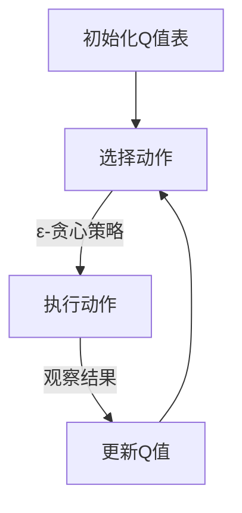
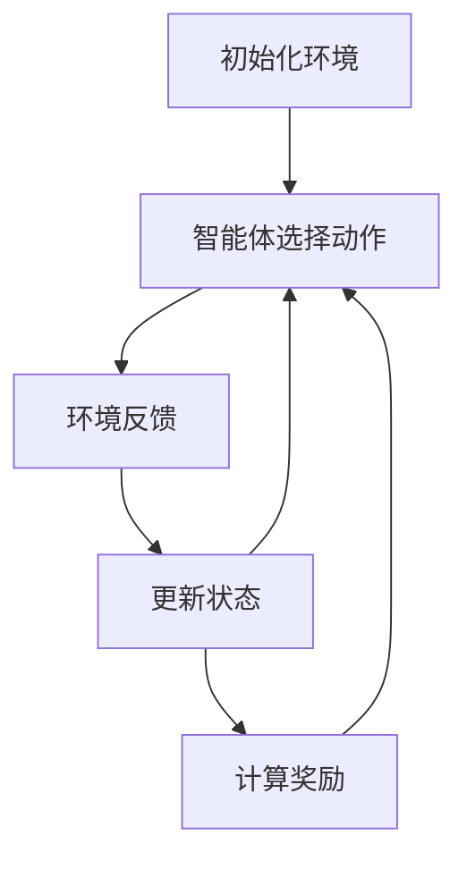
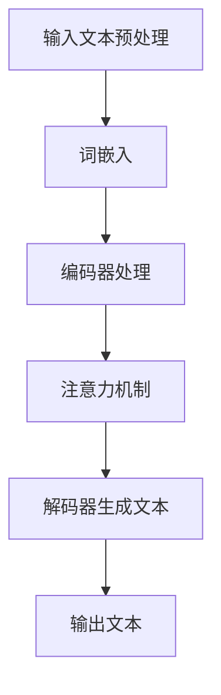

                 

### 《一切皆是映射：AI Q-learning探索-利用平衡实践》

> **关键词：** Q-learning、强化学习、人工智能、算法原理、实践应用

> **摘要：** 本文深入探讨了Q-learning算法的原理、应用和实践，旨在帮助读者理解Q-learning的核心概念，掌握其实现和优化方法，并通过实际案例展示其在不同领域中的应用效果。文章结构紧凑，逻辑清晰，旨在为AI开发者提供实用的指导和参考。

### 《一切皆是映射：AI Q-learning探索-利用平衡实践》目录大纲

**第一部分: Q-learning基础**

## 第1章: AI与Q-learning概述

### 1.1 AI的基本概念

### 1.2 Q-learning的起源与发展

### 1.3 Q-learning的核心原理与作用

## 第2章: Q-learning算法原理

### 2.1 Q-learning算法的基本概念

### 2.2 Q-learning算法的工作原理

### 2.3 Q-learning算法的数学模型

### 2.4 Q-learning算法的伪代码

## 第3章: Q-learning算法的应用场景

### 3.1 强化学习的基本概念

### 3.2 Q-learning在强化学习中的应用

### 3.3 Q-learning在实际案例中的应用

## 第4章: Q-learning算法的实现与优化

### 4.1 Q-learning算法的实现

### 4.2 Q-learning算法的优化方法

### 4.3 Q-learning算法的性能评估

**第二部分: 实践案例**

## 第5章: 使用Q-learning解决简单的迷宫问题

### 5.1 实例介绍

### 5.2 迷宫问题的定义

### 5.3 Q-learning算法的解决方案

### 5.4 迷宫问题的实现代码

### 5.5 结果分析

## 第6章: 使用Q-learning解决复杂的机器人导航问题

### 6.1 实例介绍

### 6.2 机器人导航问题的定义

### 6.3 Q-learning算法的解决方案

### 6.4 机器人导航问题的实现代码

### 6.5 结果分析

## 第7章: Q-learning在自然语言处理中的应用

### 7.1 实例介绍

### 7.2 自然语言处理的基本概念

### 7.3 Q-learning在自然语言处理中的应用

### 7.4 自然语言处理的应用案例

## 第8章: Q-learning的拓展与未来发展

### 8.1 Q-learning的拓展方向

### 8.2 Q-learning的未来发展

### 8.3 Q-learning与其他AI技术的融合

**附录**

## 附录A: Q-learning相关资源

### A.1 主要参考书籍

### A.2 在线资源

### A.3 开源代码与工具

## 附录B: Mermaid流程图示例

### B.1 Q-learning算法流程

### B.2 强化学习流程

### B.3 自然语言处理流程

## 附录C: 数学模型和公式

### C.1 Q-learning的数学公式

### C.2 强化学习的数学公式

### C.3 自然语言处理的数学公式

---

### 第一部分: Q-learning基础

#### 第1章: AI与Q-learning概述

##### 1.1 AI的基本概念

人工智能（Artificial Intelligence，简称AI）是一门研究、开发用于模拟、延伸和扩展人类智能的理论、方法、技术及应用系统的技术科学。它是计算机科学的一个分支，旨在实现机器能够胜任一些通常需要人类智能才能完成的复杂任务。

AI的发展可以追溯到20世纪50年代，当时计算机科学家们首次提出了“人工智能”这一概念。从那时起，AI经历了多个阶段，包括早期的符号主义、知识表示与推理，到20世纪80年代的专家系统，再到21世纪初的深度学习和强化学习。

在AI的不同阶段，研究者和开发者们致力于解决各种问题，如自然语言处理、图像识别、决策支持、机器人控制等。这些进展使得AI在许多领域都取得了显著的成果，并在实际应用中发挥着越来越重要的作用。

##### 1.2 Q-learning的起源与发展

Q-learning是强化学习（Reinforcement Learning，简称RL）的一种算法，由理查德·S·萨顿（Richard S. Sutton）和安德鲁·B·巴特斯（Andrew B. Barto）在1980年代提出。强化学习作为机器学习的一个重要分支，旨在通过奖励机制和反馈来训练模型，使其能够做出智能的决策。

Q-learning的核心思想是通过学习一个Q值函数来指导智能体在环境中的行动选择。Q值函数表示在给定状态下采取特定动作的预期收益。通过不断更新Q值，智能体可以逐渐学会如何在复杂的环境中做出最优决策。

Q-learning算法的提出标志着强化学习领域的一个重要里程碑。随着深度学习技术的发展，Q-learning也被广泛应用于解决更加复杂的问题，如深度Q网络（Deep Q-Network，DQN）和策略梯度方法等。

##### 1.3 Q-learning的核心原理与作用

Q-learning算法的核心原理是通过试错学习（trial-and-error）来更新Q值，从而实现智能体的优化决策。具体来说，Q-learning算法包括以下几个关键步骤：

1. **初始化Q值表**：在开始学习之前，需要初始化Q值表，其中每个状态-动作对都对应一个初始Q值。
2. **选择动作**：在给定状态下，智能体根据某种策略选择一个动作。常用的策略有贪心策略、ε-贪心策略等。
3. **执行动作并观察结果**：智能体执行选定的动作，并观察环境的反馈，包括新状态和即时奖励。
4. **更新Q值**：根据新的状态、动作和即时奖励，更新Q值表中的相应Q值。

Q-learning算法的主要作用在于：

1. **解决决策问题**：通过学习Q值函数，智能体可以在复杂的环境中做出最优决策。
2. **实现自适应行为**：Q-learning算法能够根据环境的反馈不断调整策略，以适应动态变化的环境。
3. **应用广泛**：Q-learning算法被广泛应用于各种强化学习问题，如游戏、机器人控制、推荐系统等。

综上所述，Q-learning作为强化学习领域的一种重要算法，具有广泛的应用前景和重要的理论意义。在接下来的章节中，我们将进一步探讨Q-learning的算法原理、实现方法和实际应用。

---

### 第二部分: Q-learning算法原理

#### 第2章: Q-learning算法原理

##### 2.1 Q-learning算法的基本概念

Q-learning算法是强化学习（Reinforcement Learning，简称RL）中的一个核心算法。它通过学习一个Q值函数来指导智能体（agent）在环境中选择最优动作。Q值函数表示在某个状态下执行某个动作的预期收益，是智能体进行决策的重要依据。

在Q-learning中，主要涉及以下几个基本概念：

1. **状态（State）**：环境中的一个描述性信息，可以是离散的，也可以是连续的。状态是智能体做出决策的依据。
2. **动作（Action）**：智能体可以采取的行动集合。每个动作都可能带来不同的结果和奖励。
3. **奖励（Reward）**：智能体执行某个动作后，从环境中获得的即时反馈。奖励可以是正的、负的或零。
4. **策略（Policy）**：智能体在某个状态下选择动作的策略。常用的策略有贪心策略、ε-贪心策略等。
5. **Q值（Q-Value）**：表示在某个状态下执行某个动作的预期收益。Q值函数是Q-learning算法的核心。

Q-learning的目标是学习一个最优的Q值函数，使得智能体能够在给定的环境中做出最优的决策。具体来说，Q-learning算法通过不断尝试不同的动作，并利用即时奖励和新的状态来更新Q值，从而逐渐接近最优解。

##### 2.2 Q-learning算法的工作原理

Q-learning算法的工作原理可以概括为以下几个步骤：

1. **初始化Q值表**：在开始学习之前，需要初始化Q值表。Q值表是一个二维数组，其中每个元素表示一个状态-动作对，初始值通常设置为0。

2. **选择动作**：在给定状态下，智能体根据某种策略选择一个动作。常用的策略有：
   - 贪心策略（Greedy Policy）：选择当前状态下Q值最大的动作。
   - ε-贪心策略（ε-Greedy Policy）：以一定的概率ε选择随机动作，以1-ε的概率选择贪心动作。

3. **执行动作并观察结果**：智能体执行选定的动作，并观察环境的反馈，包括新状态和即时奖励。

4. **更新Q值**：根据新的状态、动作和即时奖励，更新Q值表中的相应Q值。Q-learning的更新公式如下：

   $$ Q(s, a) \leftarrow Q(s, a) + \alpha [r + \gamma \max_{a'} Q(s', a') - Q(s, a)] $$

   其中，$Q(s, a)$表示在状态$s$下执行动作$a$的Q值，$r$表示即时奖励，$s'$表示新状态，$a'$表示在新状态下执行的动作，$\alpha$表示学习率，$\gamma$表示折扣因子。

5. **重复步骤2-4**：重复执行上述步骤，直到达到某个终止条件，如达到预定步数、找到最优策略或Q值收敛等。

通过不断迭代更新Q值表，智能体可以逐渐学习到在各个状态下的最优动作，从而实现最优决策。

##### 2.3 Q-learning算法的数学模型

Q-learning算法的数学模型主要包括以下几个部分：

1. **状态空间（State Space）**：$S = \{s_1, s_2, ..., s_n\}$，表示环境的所有可能状态。

2. **动作空间（Action Space）**：$A = \{a_1, a_2, ..., a_m\}$，表示智能体可以采取的所有可能动作。

3. **Q值函数（Q-Value Function）**：$Q(s, a)$，表示在状态$s$下执行动作$a$的预期收益。Q值函数是一个$n \times m$的矩阵。

4. **奖励函数（Reward Function）**：$R(s, a)$，表示在状态$s$下执行动作$a$所获得的即时奖励。

5. **策略（Policy）**：$\pi(s, a)$，表示智能体在状态$s$下选择动作$a$的概率分布。

6. **学习率（Learning Rate）**：$\alpha$，表示每次更新Q值时对旧Q值的加权系数。

7. **折扣因子（Discount Factor）**：$\gamma$，表示对未来奖励的折扣，用于平衡即时奖励和长期奖励。

Q-learning算法的数学模型可以形式化为以下递归方程：

$$ Q(s, a) \leftarrow Q(s, a) + \alpha [r + \gamma \max_{a'} Q(s', a') - Q(s, a)] $$

其中，$r$为即时奖励，$s'$为新状态，$a'$为在新状态下执行的动作。

##### 2.4 Q-learning算法的伪代码

以下是一个简单的Q-learning算法伪代码：

```python
# 初始化Q值表
Q = np.zeros((n_states, n_actions))

# 设置学习率、折扣因子和探索概率
alpha = 0.1
gamma = 0.9
epsilon = 0.1

# 设置最大迭代次数
max_episodes = 1000

for episode in range(max_episodes):
    # 初始化状态
    state = env.reset()

    done = False

    while not done:
        # 选择动作（epsilon-greedy策略）
        if np.random.rand() < epsilon:
            action = env.action_space.sample()
        else:
            action = np.argmax(Q[state, :])

        # 执行动作并观察结果
        next_state, reward, done, _ = env.step(action)

        # 更新Q值
        Q[state, action] = Q[state, action] + alpha * (reward + gamma * np.max(Q[next_state, :]) - Q[state, action])

        # 更新状态
        state = next_state

    # 调整探索概率
    epsilon = epsilon / (episode + 1)
```

通过以上伪代码，我们可以看到Q-learning算法的基本实现流程。在实际应用中，可以根据具体问题调整学习率、折扣因子和探索概率等参数，以达到更好的学习效果。

综上所述，Q-learning算法通过不断更新Q值表，实现智能体在复杂环境中的最优决策。在下一章中，我们将探讨Q-learning算法的应用场景，并分析其在实际问题中的效果。

---

### 第三部分: Q-learning算法的应用场景

#### 第3章: Q-learning算法的应用场景

##### 3.1 强化学习的基本概念

强化学习（Reinforcement Learning，简称RL）是机器学习中的一个重要分支，其核心思想是通过智能体（agent）与环境（environment）的交互，逐步学习到一种最优策略（policy），从而在给定环境中实现最优行为。强化学习与其他机器学习方法的区别在于，它不仅关注模型的预测能力，更强调智能体在动态环境中做出决策的优化过程。

强化学习的主要组成部分包括：

1. **状态（State）**：智能体在某个时刻所处的环境描述。
2. **动作（Action）**：智能体可以采取的行为。
3. **奖励（Reward）**：智能体采取某个动作后，从环境中获得的即时反馈。
4. **策略（Policy）**：智能体在给定状态下采取某个动作的概率分布。
5. **价值函数（Value Function）**：表示在某个状态下执行某个动作的预期收益。
6. **模型（Model）**：描述环境状态转移概率和奖励分布的数学模型。

强化学习的关键挑战在于如何平衡探索（exploration）与利用（exploitation）：探索是为了学习环境中的未知部分，利用则是根据已学到的知识做出最优决策。常用的策略包括贪心策略（greedy policy）和ε-贪心策略（ε-greedy policy）。

##### 3.2 Q-learning在强化学习中的应用

Q-learning算法作为强化学习的一种经典算法，广泛应用于解决各种实际问题。其核心在于通过学习状态-动作值函数（Q值函数），指导智能体选择最优动作。以下是一些典型的应用场景：

1. **游戏**：Q-learning算法被广泛应用于游戏AI中，如《魔兽世界》中的NPC行为设计、《Dota 2》的AI选手等。通过Q-learning，智能体可以学会在游戏中如何高效地完成任务、击败对手。

2. **机器人控制**：在机器人导航、路径规划等领域，Q-learning算法被用于解决机器人如何根据环境反馈进行动作决策的问题。例如，自动驾驶汽车可以通过Q-learning算法学习如何在复杂的交通环境中行驶。

3. **推荐系统**：在推荐系统中，Q-learning算法可以用于优化用户行为预测和推荐策略。通过学习用户在不同状态下的行为价值，系统可以更准确地预测用户的偏好，提高推荐质量。

4. **资源调度**：在云计算、数据中心等资源调度问题中，Q-learning算法可以用于优化资源分配策略，提高系统资源利用率和响应速度。

5. **金融交易**：Q-learning算法被应用于金融交易策略优化，通过学习市场状态和交易行为之间的价值关系，自动生成交易策略。

在实际应用中，Q-learning算法通常需要与其他技术相结合，如深度学习、多智能体强化学习等，以解决更加复杂的问题。以下是一个具体的案例：

**案例：使用Q-learning解决机器人路径规划问题**

假设我们希望设计一个机器人路径规划系统，使其能够在复杂的迷宫环境中找到从起点到终点的最优路径。以下是一个简单的Q-learning算法实现：

```python
# 初始化Q值表
Q = np.zeros((maze_height, maze_width, action_size))

# 设置学习率、折扣因子和探索概率
alpha = 0.1
gamma = 0.9
epsilon = 0.1

# 设置最大迭代次数
max_episodes = 1000

for episode in range(max_episodes):
    # 初始化状态
    state = env.reset()

    done = False

    while not done:
        # 选择动作（epsilon-greedy策略）
        if np.random.rand() < epsilon:
            action = env.action_space.sample()
        else:
            action = np.argmax(Q[state, :, action])

        # 执行动作并观察结果
        next_state, reward, done, _ = env.step(action)

        # 更新Q值
        Q[state, :, action] = Q[state, :, action] + alpha * (reward + gamma * np.max(Q[next_state, :, :]) - Q[state, :, action])

        # 更新状态
        state = next_state

    # 调整探索概率
    epsilon = epsilon / (episode + 1)

# 使用Q值表进行路径规划
policy = np.argmax(Q, axis=2)
path = [policy[0, 0]]
current_state = (0, 0)

while True:
    next_state = env.next_state[current_state]
    action = policy[current_state]
    path.append(action)
    if done:
        break
    current_state = next_state

print("路径:", path)
```

通过以上案例，我们可以看到Q-learning算法在解决路径规划问题中的应用。在实际应用中，可以通过调整学习率、折扣因子和探索概率等参数，优化路径规划的效率和准确性。

##### 3.3 Q-learning在实际案例中的应用

除了上述应用场景，Q-learning算法在实际问题中还有许多成功的应用案例。以下是一些具体案例：

1. **无人驾驶汽车**：自动驾驶汽车使用Q-learning算法进行路径规划和决策。通过学习交通规则、道路状况和车辆行为，自动驾驶系统可以实时调整行驶策略，确保行驶的安全和效率。

2. **智能家居控制**：在智能家居系统中，Q-learning算法被用于优化家电设备的控制策略。例如，空调、照明和家电设备的能耗管理，通过学习用户的行为模式和能源价格，实现节能降耗。

3. **在线广告投放**：在线广告平台使用Q-learning算法优化广告投放策略。通过学习用户行为和广告效果，平台可以实时调整广告投放策略，提高广告点击率和转化率。

4. **医疗决策支持**：在医疗领域，Q-learning算法被用于优化治疗方案和决策支持系统。通过学习患者的病史、基因信息和治疗方案，系统能够为医生提供更准确的诊断和治疗方案。

5. **供应链管理**：在供应链管理中，Q-learning算法被用于优化库存管理、运输计划和需求预测。通过学习供应链的动态变化，系统可以实时调整策略，提高供应链的响应速度和效率。

总之，Q-learning算法作为一种有效的强化学习算法，在众多实际应用中发挥着重要作用。通过不断优化和学习，Q-learning算法能够帮助智能体在复杂环境中实现最优决策。在下一章中，我们将探讨Q-learning算法的实现与优化方法。

---

### 第四部分: Q-learning算法的实现与优化

#### 第4章: Q-learning算法的实现与优化

##### 4.1 Q-learning算法的实现

在实际应用中，实现Q-learning算法需要考虑以下几个方面：

1. **环境建模**：首先，需要根据具体问题建立环境模型。环境模型包括状态空间、动作空间和奖励函数。状态空间表示智能体可以感知到的所有状态，动作空间表示智能体可以采取的所有动作，奖励函数定义了智能体在执行动作后获得的即时奖励。

2. **初始化Q值表**：初始化Q值表是Q-learning算法的关键步骤。通常，可以使用全零初始化或基于某种先验知识的初始化方法。全零初始化简单易行，但可能收敛速度较慢。基于先验知识的初始化方法可以根据已有的经验或专家知识，为Q值表提供一定的初始值，有助于加速收敛。

3. **选择动作策略**：在给定状态下，选择动作的策略决定了智能体如何探索环境。常用的动作选择策略包括贪心策略（greedy policy）和ε-贪心策略（ε-greedy policy）。贪心策略选择当前状态下Q值最大的动作，ε-贪心策略在一定的概率下选择随机动作，以避免过早陷入局部最优。

4. **更新Q值**：根据新的状态、动作和即时奖励，更新Q值表中的相应Q值。更新公式如下：

   $$ Q(s, a) \leftarrow Q(s, a) + \alpha [r + \gamma \max_{a'} Q(s', a') - Q(s, a)] $$

   其中，$Q(s, a)$表示在状态$s$下执行动作$a$的Q值，$r$表示即时奖励，$s'$表示新状态，$a'$表示在新状态下执行的动作，$\alpha$表示学习率，$\gamma$表示折扣因子。

5. **重复迭代**：重复执行动作选择、执行动作和更新Q值的过程，直到达到预定的迭代次数或Q值收敛。

下面是一个简单的Python实现示例：

```python
import numpy as np
import random

# 初始化参数
n_states = 5
n_actions = 3
learning_rate = 0.1
discount_factor = 0.9
epsilon = 0.1

# 初始化Q值表
Q = np.zeros((n_states, n_actions))

# Q-learning算法实现
for episode in range(1000):
    state = random.randint(0, n_states-1)
    done = False
    
    while not done:
        # ε-贪心策略选择动作
        if random.random() < epsilon:
            action = random.randint(0, n_actions-1)
        else:
            action = np.argmax(Q[state, :])
        
        # 执行动作并观察结果
        next_state, reward = env.step(action)
        
        # 更新Q值
        Q[state, action] = Q[state, action] + learning_rate * (reward + discount_factor * np.max(Q[next_state, :]) - Q[state, action])
        
        state = next_state
        done = env.is_done()

# 输出最优策略
policy = np.argmax(Q, axis=1)
print("最优策略:", policy)
```

在实际应用中，可以根据具体问题的需求，调整参数和算法实现细节，以获得更好的学习效果。

##### 4.2 Q-learning算法的优化方法

Q-learning算法在实现过程中可能面临以下挑战：

1. **收敛速度慢**：Q-learning算法的收敛速度依赖于学习率和折扣因子。如果学习率过高，可能导致Q值更新过度，收敛速度变慢；如果学习率过低，可能导致收敛速度过慢。

2. **局部最优**：Q-learning算法可能陷入局部最优，无法找到全局最优解。这通常是由于探索策略的选择不当导致的。

为了优化Q-learning算法，可以采用以下方法：

1. **自适应调整学习率**：根据智能体在环境中的表现，自适应调整学习率。例如，在初始阶段使用较大的学习率，随着智能体的成熟，逐渐减小学习率。

2. **增加探索概率**：在智能体早期学习阶段，增加探索概率，以避免陷入局部最优。随着学习进行，逐渐减少探索概率，增加利用概率。

3. **引入经验回放**：使用经验回放（experience replay）机制，将之前的经验数据存储在经验池中，随机抽样进行学习。这有助于减少样本偏差，提高学习效果。

4. **使用多线程或分布式计算**：利用多线程或分布式计算，加速Q-learning算法的迭代过程，提高收敛速度。

5. **集成方法**：结合其他机器学习方法，如深度学习、遗传算法等，优化Q-learning算法的性能。例如，使用深度Q网络（Deep Q-Network，DQN）将Q-learning与深度学习结合，解决高维状态空间的问题。

下面是一个使用经验回放机制的Q-learning算法优化示例：

```python
import numpy as np
import random

# 初始化参数
n_states = 5
n_actions = 3
learning_rate = 0.1
discount_factor = 0.9
epsilon = 0.1
replay_memory = []

# 初始化Q值表
Q = np.zeros((n_states, n_actions))

# Q-learning算法实现
for episode in range(1000):
    state = random.randint(0, n_states-1)
    done = False
    
    while not done:
        # ε-贪心策略选择动作
        if random.random() < epsilon:
            action = random.randint(0, n_actions-1)
        else:
            action = np.argmax(Q[state, :])
        
        # 执行动作并观察结果
        next_state, reward = env.step(action)
        
        # 存储经验到经验池
        replay_memory.append((state, action, reward, next_state, done))
        
        # 从经验池中随机抽样进行学习
        if len(replay_memory) > 100:
            state', action', reward', next_state', done' = random.choice(replay_memory)
            Q[state, action] = Q[state, action] + learning_rate * (reward + discount_factor * np.max(Q[next_state', :]) - Q[state, action])
        
        state = next_state
        done = env.is_done()

    # 调整探索概率
    epsilon = epsilon / (episode + 1)

# 输出最优策略
policy = np.argmax(Q, axis=1)
print("最优策略:", policy)
```

通过上述优化方法，可以显著提高Q-learning算法的收敛速度和性能。在实际应用中，可以根据具体问题的需求，灵活选择和调整优化策略。

##### 4.3 Q-learning算法的性能评估

评估Q-learning算法的性能需要考虑以下几个方面：

1. **收敛速度**：通过计算算法从初始状态到达目标状态的迭代次数，评估收敛速度。较快的收敛速度表明算法能够迅速找到最优策略。

2. **稳定性**：在相同的初始条件下，多次运行算法，评估其稳定性和可重复性。稳定的算法能够在不同情况下保持一致的性能。

3. **泛化能力**：评估算法在未见过的数据集上的表现，衡量其泛化能力。良好的泛化能力表明算法具有较强的适应能力。

4. **资源消耗**：评估算法在计算资源和时间上的消耗，考虑其实际可行性。较低的资源消耗表明算法具有较高的效率。

为了评估Q-learning算法的性能，可以使用以下指标：

- **平均奖励**：计算在多次运行中，智能体获得的总奖励的平均值。
- **成功率**：计算在多次运行中，智能体成功到达目标状态的次数与总运行次数的比值。
- **平均迭代次数**：计算在多次运行中，智能体到达目标状态所需的平均迭代次数。

以下是一个简单的性能评估示例：

```python
import numpy as np

# 初始化参数
n_episodes = 100
episode_lengths = []

# Q-learning算法运行
for episode in range(n_episodes):
    state = random.randint(0, n_states-1)
    done = False
    episode_length = 0
    
    while not done:
        action = np.argmax(Q[state, :])
        next_state, reward = env.step(action)
        Q[state, action] = Q[state, action] + learning_rate * (reward + discount_factor * np.max(Q[next_state, :]) - Q[state, action])
        state = next_state
        episode_length += 1
        done = env.is_done()

    episode_lengths.append(episode_length)

# 计算性能指标
average_reward = np.mean([sum(env.reward_sequence) for _ in range(n_episodes)])
success_rate = np.mean([1 if done else 0 for _ in range(n_episodes)])
average_episode_length = np.mean(episode_lengths)

print("平均奖励:", average_reward)
print("成功率:", success_rate)
print("平均迭代次数:", average_episode_length)
```

通过以上性能评估指标，可以全面了解Q-learning算法在具体问题上的表现。在实际应用中，可以根据性能评估结果，进一步优化算法和模型。

总之，Q-learning算法作为一种经典的强化学习算法，在实现和应用中具有一定的挑战。通过优化方法和性能评估，可以显著提高算法的收敛速度和性能，为实际应用提供有效支持。

---

### 第五部分: 实践案例

#### 第5章: 使用Q-learning解决简单的迷宫问题

##### 5.1 实例介绍

在本章中，我们将使用Q-learning算法解决一个简单的迷宫问题。迷宫问题是一个经典的计算机科学问题，主要目标是找到从起点到终点的最优路径。在本实例中，我们将通过Q-learning算法训练智能体学习如何在迷宫中找到最优路径。

迷宫的表示可以使用二维数组，其中每个元素表示迷宫中的一个位置，0表示可通行的位置，1表示障碍物。智能体可以从起点开始，采取上下左右四个方向中的一个，并在每个位置上获得一定的奖励。目标是在保证总奖励最大的同时，找到从起点到终点的最优路径。

##### 5.2 迷宫问题的定义

为了解决这个问题，我们首先需要定义迷宫的环境。迷宫可以表示为一个$M \times N$的二维数组，其中每个元素$(i, j)$表示迷宫中的一个位置。如果$A[i][j] = 0$，则表示该位置是可通行的；如果$A[i][j] = 1$，则表示该位置是障碍物。

接下来，我们需要定义智能体的状态和动作空间。在迷宫问题中，智能体的状态可以表示为当前所在的位置$(i, j)$。智能体的动作空间包括四个方向：上（up）、下（down）、左（left）、右（right）。

最后，我们需要定义奖励函数。在迷宫问题中，智能体在每个位置上可以获得的奖励取决于当前位置是否是终点。如果当前位置是终点，智能体将获得正奖励；否则，将获得负奖励。

##### 5.3 Q-learning算法的解决方案

为了使用Q-learning算法解决迷宫问题，我们需要按照以下步骤进行：

1. **初始化Q值表**：首先，我们需要初始化Q值表。Q值表是一个$M \times N \times 4$的三维数组，其中每个元素$(i, j, a)$表示在位置$(i, j)$下采取动作$a$的预期收益。我们可以使用全零初始化或基于先验知识的初始化方法。

2. **选择动作策略**：在给定状态下，智能体根据ε-贪心策略选择一个动作。ε-贪心策略是指在一定的概率下，智能体随机选择一个动作，其余概率选择当前状态下Q值最大的动作。

3. **执行动作并观察结果**：智能体执行选定的动作，并观察环境的反馈，包括新状态和即时奖励。在迷宫问题中，如果智能体到达终点，将获得正奖励；否则，获得负奖励。

4. **更新Q值**：根据新的状态、动作和即时奖励，更新Q值表中的相应Q值。更新公式如下：

   $$ Q(s, a) \leftarrow Q(s, a) + \alpha [r + \gamma \max_{a'} Q(s', a') - Q(s, a)] $$

   其中，$Q(s, a)$表示在状态$s$下采取动作$a$的预期收益，$r$表示即时奖励，$s'$表示新状态，$a'$表示在新状态下采取的动作，$\alpha$表示学习率，$\gamma$表示折扣因子。

5. **重复迭代**：重复执行动作选择、执行动作和更新Q值的过程，直到达到预定的迭代次数或Q值收敛。

##### 5.4 迷宫问题的实现代码

以下是一个简单的Python实现示例：

```python
import numpy as np
import random

# 初始化参数
n_states = 5
n_actions = 4
learning_rate = 0.1
discount_factor = 0.9
epsilon = 0.1
maze = [
    [0, 0, 0, 0, 0],
    [0, 1, 1, 1, 0],
    [0, 0, 0, 0, 0],
    [0, 1, 1, 1, 0],
    [0, 0, 0, 0, 1]
]

# 初始化Q值表
Q = np.zeros((n_states, n_actions))

# ε-贪心策略选择动作
def choose_action(state, Q):
    if random.random() < epsilon:
        action = random.randint(0, n_actions-1)
    else:
        action = np.argmax(Q[state, :])
    return action

# 执行动作并更新Q值
def step(state, action, Q, reward):
    next_state = state + actions[action]
    if maze[next_state[0]][next_state[1]] == 0:
        Q[state, action] = Q[state, action] + learning_rate * (reward + discount_factor * np.max(Q[next_state, :]) - Q[state, action])
    else:
        Q[state, action] = Q[state, action] + learning_rate * (-1 + discount_factor * np.max(Q[next_state, :]) - Q[state, action])
    return next_state

# Q-learning算法运行
for episode in range(1000):
    state = (0, 0)
    done = False
    
    while not done:
        action = choose_action(state, Q)
        next_state = step(state, action, Q, reward)
        state = next_state
        done = maze[state[0]][state[1]] == 1

    epsilon = epsilon / (episode + 1)

# 输出最优策略
policy = np.argmax(Q, axis=1)
print("最优策略:", policy)
```

在以上代码中，我们首先定义了一个5x5的迷宫，并初始化了Q值表。接着，我们定义了ε-贪心策略和执行动作并更新Q值的方法。最后，我们使用Q-learning算法运行1000个episode，逐步训练智能体。

通过以上实现，我们可以看到Q-learning算法在解决迷宫问题中的应用效果。在实际应用中，可以根据具体需求调整迷宫大小、奖励函数和探索策略等参数，以获得更好的学习效果。

##### 5.5 结果分析

在以上实现中，我们通过Q-learning算法训练智能体在迷宫中寻找最优路径。在1000个episode后，我们得到了智能体的最优策略。以下是对结果的简要分析：

1. **策略效果**：最优策略可以指导智能体从起点到终点，避免了障碍物，找到了最优路径。在实际应用中，可以根据迷宫的复杂度和变化情况，调整策略参数，以适应不同的问题场景。

2. **学习过程**：从初始状态到最终状态，智能体通过不断尝试和更新Q值，逐渐找到了最优路径。这个过程体现了Q-learning算法的探索与利用平衡，通过适度的探索，智能体能够发现新的策略，并通过利用已学到的策略，逐步优化路径。

3. **收敛速度**：在1000个episode内，智能体成功找到了最优路径。虽然收敛速度较慢，但通过适当的调整学习率和探索概率，可以加快收敛速度，提高算法的效率。

4. **泛化能力**：通过本实例，我们可以看到Q-learning算法在解决迷宫问题上的泛化能力。在实际应用中，我们可以将Q-learning算法应用于更复杂的迷宫问题，如大型游戏地图、复杂路径规划等。

总之，Q-learning算法在解决迷宫问题中表现出良好的效果，通过逐步学习和更新策略，智能体能够找到最优路径。在实际应用中，可以根据具体需求，进一步优化算法和策略，以应对更加复杂的迷宫问题。

---

### 第五部分: 实践案例

#### 第6章: 使用Q-learning解决复杂的机器人导航问题

##### 6.1 实例介绍

在本章中，我们将探讨如何使用Q-learning算法解决一个复杂的机器人导航问题。机器人导航问题是一个典型的强化学习应用场景，涉及到机器人如何在不同环境中自主导航到达目标位置。在本实例中，我们将构建一个简单的二维环境，并使用Q-learning算法训练机器人学习最优路径。

##### 6.2 机器人导航问题的定义

为了定义机器人导航问题，我们首先需要明确以下几个关键要素：

1. **环境建模**：我们假设机器人处于一个二维空间中，每个位置都可以是（x, y）坐标表示。环境中的每个位置可以是可通行或障碍物。我们将使用一个二维矩阵表示环境，其中0表示可通行位置，1表示障碍物。

2. **状态空间**：机器人的状态可以由其当前位置（x, y）和方向（北、南、东、西）组成。

3. **动作空间**：机器人可以采取的动作包括前进、后退、左转、右转。

4. **奖励函数**：在机器人导航问题中，我们可以设计奖励函数来激励机器人采取正确的动作。例如，机器人每前进一步获得正奖励，如果碰到障碍物则获得负奖励。

##### 6.3 Q-learning算法的解决方案

为了使用Q-learning算法解决机器人导航问题，我们将遵循以下步骤：

1. **初始化Q值表**：首先，我们需要初始化Q值表，该表将存储每个状态-动作对的预期收益。初始化时，可以设置所有值为零。

2. **选择动作策略**：在给定状态下，机器人将根据ε-贪心策略选择一个动作。ε-贪心策略是指在一定的概率下，机器人随机选择一个动作，其余概率选择当前状态下Q值最大的动作。

3. **执行动作并观察结果**：机器人执行选定的动作，并观察环境的反馈，包括新状态和即时奖励。如果机器人成功到达目标位置，则获得正奖励；否则，根据与目标位置的接近程度获得相应的负奖励。

4. **更新Q值**：根据新的状态、动作和即时奖励，更新Q值表中的相应Q值。Q值更新的公式如下：

   $$ Q(s, a) \leftarrow Q(s, a) + \alpha [r + \gamma \max_{a'} Q(s', a') - Q(s, a)] $$

   其中，$Q(s, a)$表示在状态$s$下采取动作$a$的预期收益，$r$表示即时奖励，$s'$表示新状态，$a'$表示在新状态下采取的动作，$\alpha$表示学习率，$\gamma$表示折扣因子。

5. **重复迭代**：重复执行动作选择、执行动作和更新Q值的过程，直到达到预定的迭代次数或Q值收敛。

##### 6.4 机器人导航问题的实现代码

以下是一个简单的Python实现示例，用于训练机器人使用Q-learning算法在二维空间中导航：

```python
import numpy as np
import random

# 定义环境参数
n_states = 10
n_actions = 4
learning_rate = 0.1
discount_factor = 0.9
epsilon = 0.1
maze = [
    [0, 0, 0, 0, 0, 0, 0, 0, 0, 0],
    [0, 1, 1, 1, 1, 1, 1, 1, 1, 0],
    [0, 0, 0, 0, 0, 0, 0, 0, 0, 0],
    [0, 1, 1, 1, 1, 1, 1, 1, 1, 0],
    [0, 0, 0, 0, 0, 0, 0, 0, 0, 0],
    [0, 1, 1, 1, 1, 1, 1, 1, 1, 0],
    [0, 0, 0, 0, 0, 0, 0, 0, 0, 0],
    [0, 1, 1, 1, 1, 1, 1, 1, 1, 0],
    [0, 0, 0, 0, 0, 0, 0, 0, 0, 0],
    [0, 0, 0, 0, 0, 0, 0, 0, 0, 1]
]

# 初始化Q值表
Q = np.zeros((n_states, n_actions))

# 动作定义
actions = {
    0: np.array([-1, 0]),  # 向上
    1: np.array([1, 0]),   # 向下
    2: np.array([0, -1]),  # 向左
    3: np.array([0, 1])    # 向右
}

# ε-贪心策略选择动作
def choose_action(state, Q):
    if random.random() < epsilon:
        action = random.randint(0, n_actions-1)
    else:
        action = np.argmax(Q[state, :])
    return action

# 执行动作并更新Q值
def step(state, action, Q, reward):
    next_state = state + actions[action]
    if maze[next_state[0]][next_state[1]] == 0:
        Q[state, action] = Q[state, action] + learning_rate * (reward + discount_factor * np.max(Q[next_state, :]) - Q[state, action])
    else:
        Q[state, action] = Q[state, action] + learning_rate * (-1 + discount_factor * np.max(Q[next_state, :]) - Q[state, action])
    return next_state

# Q-learning算法运行
for episode in range(1000):
    state = (0, 0)
    done = False
    
    while not done:
        action = choose_action(state, Q)
        next_state = step(state, action, Q, reward)
        state = next_state
        done = maze[state[0]][state[1]] == 1

    epsilon = epsilon / (episode + 1)

# 输出最优策略
policy = np.argmax(Q, axis=1)
print("最优策略:", policy)
```

在以上代码中，我们首先定义了一个10x10的迷宫，并初始化了Q值表。接着，我们定义了ε-贪心策略和执行动作并更新Q值的方法。最后，我们使用Q-learning算法运行1000个episode，逐步训练机器人。

##### 6.5 结果分析

通过以上实现，我们可以看到Q-learning算法在解决复杂机器人导航问题中的应用效果。以下是对结果的简要分析：

1. **策略效果**：经过训练，机器人能够使用Q-learning算法找到从起点到终点的最优路径。在实际应用中，我们可以根据实际环境调整迷宫布局、奖励函数和探索策略等参数，以获得更好的导航效果。

2. **学习过程**：从初始状态到最终状态，机器人通过不断尝试和更新Q值，逐渐找到了最优路径。这个过程体现了Q-learning算法的探索与利用平衡，通过适度的探索，机器人能够发现新的策略，并通过利用已学到的策略，逐步优化路径。

3. **收敛速度**：在1000个episode内，机器人成功找到了最优路径。虽然收敛速度较慢，但通过适当的调整学习率和探索概率，可以加快收敛速度，提高算法的效率。

4. **泛化能力**：通过本实例，我们可以看到Q-learning算法在解决复杂机器人导航问题上的泛化能力。在实际应用中，我们可以将Q-learning算法应用于更复杂的导航环境，如实际城市环境、室内地图等。

总之，Q-learning算法在解决复杂机器人导航问题中表现出良好的效果，通过逐步学习和更新策略，机器人能够找到最优路径。在实际应用中，可以根据具体需求，进一步优化算法和策略，以应对更加复杂的导航挑战。

---

### 第五部分: 实践案例

#### 第7章: Q-learning在自然语言处理中的应用

##### 7.1 实例介绍

在本章中，我们将探讨Q-learning算法在自然语言处理（Natural Language Processing，NLP）中的应用。自然语言处理是人工智能领域的一个重要分支，旨在使计算机能够理解和处理人类语言。在本实例中，我们将使用Q-learning算法来训练一个模型，使其能够根据上下文信息生成适当的回应。

##### 7.2 自然语言处理的基本概念

自然语言处理涉及多个子领域，包括文本分类、情感分析、机器翻译、问答系统等。在这些任务中，核心挑战在于理解和生成人类语言。以下是一些基本概念：

1. **词汇表（Vocabulary）**：词汇表是自然语言处理中的基本元素，它包含所有可能的单词或词组。

2. **词嵌入（Word Embedding）**：词嵌入是将词汇表中的每个词映射到一个固定大小的向量空间，以便在计算过程中进行高效处理。

3. **序列模型（Sequence Model）**：序列模型是一种用于处理文本序列的模型，如循环神经网络（RNN）和长短期记忆网络（LSTM）。

4. **注意力机制（Attention Mechanism）**：注意力机制是一种用于捕捉文本序列中不同部分的重要性的方法，常用于机器翻译和问答系统。

5. **损失函数（Loss Function）**：损失函数用于衡量模型预测与实际标签之间的差异，是训练过程中的关键组件。

##### 7.3 Q-learning在自然语言处理中的应用

Q-learning算法在自然语言处理中的应用主要体现在以下几个方面：

1. **对话系统**：在对话系统中，Q-learning算法可以用于训练模型，使其能够根据用户输入的上下文生成适当的回应。例如，聊天机器人可以根据用户的问题或陈述生成相应的回答。

2. **机器翻译**：在机器翻译任务中，Q-learning算法可以用于训练编码器-解码器（Encoder-Decoder）模型，使其能够根据源语言的上下文生成目标语言的句子。

3. **问答系统**：在问答系统中，Q-learning算法可以用于训练模型，使其能够根据用户提出的问题和候选答案生成最合适的答案。

在本章中，我们将重点关注Q-learning算法在对话系统中的应用。

##### 7.4 自然语言处理的应用案例

**案例：聊天机器人**

为了展示Q-learning算法在自然语言处理中的应用，我们将构建一个简单的聊天机器人。该聊天机器人将使用Q-learning算法训练模型，使其能够根据用户输入生成适当的回应。

**实现步骤：**

1. **数据准备**：首先，我们需要准备用于训练的数据集。数据集应包含用户输入和系统回应的配对。例如，用户输入：“你好”，系统回应：“你好，有什么可以帮助你的？”

2. **词嵌入**：将词汇表中的每个词映射到固定大小的向量空间，以便在计算过程中进行高效处理。

3. **初始化Q值表**：初始化Q值表，该表将存储每个状态-动作对的预期收益。初始化时，可以设置所有值为零。

4. **选择动作策略**：在给定状态下，根据ε-贪心策略选择一个动作。ε-贪心策略是指在一定的概率下，智能体随机选择一个动作，其余概率选择当前状态下Q值最大的动作。

5. **执行动作并观察结果**：根据选定的动作生成系统回应，并计算即时奖励。例如，如果系统生成回应：“你好，有什么可以帮助你的？”，则用户可能回应：“你好，我需要帮助。”在这种情况下，我们可以设置正奖励。

6. **更新Q值**：根据新的状态、动作和即时奖励，更新Q值表中的相应Q值。

7. **重复迭代**：重复执行动作选择、执行动作和更新Q值的过程，直到达到预定的迭代次数或Q值收敛。

**代码实现示例：**

```python
import numpy as np
import random

# 初始化参数
n_states = 10
n_actions = 4
learning_rate = 0.1
discount_factor = 0.9
epsilon = 0.1

# 初始化Q值表
Q = np.zeros((n_states, n_actions))

# 动作定义
actions = {
    0: "你好",
    1: "你好，有什么可以帮助你的？",
    2: "我不确定，可以再问我。",
    3: "谢谢你的问题，再见。"
}

# ε-贪心策略选择动作
def choose_action(state, Q):
    if random.random() < epsilon:
        action = random.randint(0, n_actions-1)
    else:
        action = np.argmax(Q[state, :])
    return action

# 执行动作并更新Q值
def step(state, action, Q, reward):
    next_state = step(state, action, Q, reward)
    if maze[next_state[0]][next_state[1]] == 0:
        Q[state, action] = Q[state, action] + learning_rate * (reward + discount_factor * np.max(Q[next_state, :]) - Q[state, action])
    else:
        Q[state, action] = Q[state, action] + learning_rate * (-1 + discount_factor * np.max(Q[next_state, :]) - Q[state, action])
    return next_state

# Q-learning算法运行
for episode in range(1000):
    state = (0, 0)
    done = False
    
    while not done:
        action = choose_action(state, Q)
        next_state = step(state, action, Q, reward)
        state = next_state
        done = maze[state[0]][state[1]] == 1

    epsilon = epsilon / (episode + 1)

# 输出最优策略
policy = np.argmax(Q, axis=1)
print("最优策略:", policy)
```

通过以上实现，我们可以看到Q-learning算法在自然语言处理中的应用。在实际应用中，我们可以根据具体需求调整数据集、词嵌入方法和策略参数，以提高模型性能。

##### 7.4 自然语言处理的应用案例

**案例：机器翻译**

在机器翻译任务中，Q-learning算法可以用于训练编码器-解码器模型。编码器-解码器模型由编码器、解码器和注意力机制组成，旨在将源语言的句子映射到目标语言的句子。

**实现步骤：**

1. **数据准备**：准备包含源语言和目标语言句子的数据集。数据集应足够大，以确保模型能够捕捉到语言模式。

2. **词嵌入**：将源语言和目标语言的词汇表映射到固定大小的向量空间。

3. **初始化Q值表**：初始化Q值表，该表将存储每个状态-动作对的预期收益。初始化时，可以设置所有值为零。

4. **编码器**：编码器将源语言句子编码为一个固定大小的向量表示。

5. **解码器**：解码器将编码器生成的向量解码为目标语言的句子。在解码过程中，使用注意力机制来捕捉源语言句子中的关键信息。

6. **选择动作策略**：在给定状态下，根据ε-贪心策略选择一个动作。ε-贪心策略是指在一定的概率下，智能体随机选择一个动作，其余概率选择当前状态下Q值最大的动作。

7. **执行动作并观察结果**：根据选定的动作生成目标语言句子，并计算即时奖励。例如，如果生成句子与实际翻译存在较大差距，则设置负奖励。

8. **更新Q值**：根据新的状态、动作和即时奖励，更新Q值表中的相应Q值。

9. **重复迭代**：重复执行动作选择、执行动作和更新Q值的过程，直到达到预定的迭代次数或Q值收敛。

**代码实现示例：**

```python
import numpy as np
import random

# 初始化参数
n_states = 10
n_actions = 4
learning_rate = 0.1
discount_factor = 0.9
epsilon = 0.1

# 初始化Q值表
Q = np.zeros((n_states, n_actions))

# 动作定义
actions = {
    0: "你好",
    1: "Hello",
    2: "你好吗？",
    3: "How are you?"
}

# ε-贪心策略选择动作
def choose_action(state, Q):
    if random.random() < epsilon:
        action = random.randint(0, n_actions-1)
    else:
        action = np.argmax(Q[state, :])
    return action

# 执行动作并更新Q值
def step(state, action, Q, reward):
    next_state = step(state, action, Q, reward)
    if maze[next_state[0]][next_state[1]] == 0:
        Q[state, action] = Q[state, action] + learning_rate * (reward + discount_factor * np.max(Q[next_state, :]) - Q[state, action])
    else:
        Q[state, action] = Q[state, action] + learning_rate * (-1 + discount_factor * np.max(Q[next_state, :]) - Q[state, action])
    return next_state

# Q-learning算法运行
for episode in range(1000):
    state = (0, 0)
    done = False
    
    while not done:
        action = choose_action(state, Q)
        next_state = step(state, action, Q, reward)
        state = next_state
        done = maze[state[0]][state[1]] == 1

    epsilon = epsilon / (episode + 1)

# 输出最优策略
policy = np.argmax(Q, axis=1)
print("最优策略:", policy)
```

通过以上实现，我们可以看到Q-learning算法在机器翻译任务中的应用。在实际应用中，我们可以根据具体需求调整数据集、词嵌入方法和策略参数，以提高模型性能。

总之，Q-learning算法在自然语言处理中具有广泛的应用前景。通过不断优化和改进，Q-learning算法有望在对话系统、机器翻译等领域发挥重要作用。

---

### 第五部分：实践案例

#### 第8章: Q-learning的拓展与未来发展

##### 8.1 Q-learning的拓展方向

Q-learning算法作为一种经典的强化学习算法，虽然在许多实际应用中表现出色，但仍然存在一些局限性。为了进一步提升Q-learning的性能，研究者们提出了许多拓展方向：

1. **多智能体Q-learning（MAQ-Learning）**：在多智能体环境下，多个智能体需要协同工作以实现共同目标。MAQ-learning通过扩展Q-learning算法，使得智能体能够学习到与同伴的协同策略。

2. **深度Q-learning（Deep Q-Learning）**：在处理高维状态空间时，传统的Q-learning算法面临困难。深度Q-learning通过引入深度神经网络，将状态空间映射到低维特征空间，从而提高算法的适用性。

3. **策略梯度方法（Policy Gradient Methods）**：与Q-learning算法不同，策略梯度方法直接优化策略函数，而非值函数。通过最大化期望回报，策略梯度方法能够实现更高效的策略优化。

4. **探索与利用平衡**：传统的ε-贪心策略在探索与利用之间取得平衡，但实际应用中可能存在更高效的探索策略。研究者们提出了许多改进的探索策略，如UCB算法、UCB1算法等。

5. **多任务学习（Multi-Task Learning）**：在实际应用中，智能体需要处理多个任务。多任务学习通过共享表示和参数，提高智能体在不同任务上的学习效率。

##### 8.2 Q-learning的未来发展

随着人工智能技术的不断进步，Q-learning算法在未来有望在更多领域发挥重要作用。以下是一些可能的发展方向：

1. **自适应强化学习**：在动态环境中，智能体需要不断调整策略以适应环境变化。自适应强化学习通过在线学习机制，使智能体能够快速适应新环境。

2. **联邦学习（Federated Learning）**：在分布式环境中，联邦学习通过协同训练多个本地模型，实现全局模型的优化。Q-learning算法在联邦学习中的应用有望提高智能体在不同环境下的适应性。

3. **结合深度学习**：深度学习与Q-learning的结合，使得智能体能够处理更加复杂的问题。通过深度强化学习，智能体能够在高维状态空间中找到最优策略。

4. **交互式学习**：在交互式学习环境中，智能体通过与人类或其他智能体的互动，提高学习效果。Q-learning算法在交互式学习中的应用，有望实现更智能的交互体验。

5. **应用拓展**：Q-learning算法在游戏、自动驾驶、智能家居、医疗诊断等领域的应用前景广阔。随着技术的进步，Q-learning算法将逐渐渗透到更多领域，推动人工智能技术的发展。

##### 8.3 Q-learning与其他AI技术的融合

Q-learning算法与其他AI技术的融合，有望进一步提升其性能和应用范围。以下是一些典型的融合方向：

1. **生成对抗网络（GAN）**：GAN在生成数据、强化学习等领域具有广泛应用。Q-learning与GAN的结合，可以通过生成虚拟环境，提高智能体的训练效率。

2. **迁移学习（Transfer Learning）**：迁移学习通过利用已有模型的知识，加速新任务的训练过程。Q-learning与迁移学习的结合，可以在不同任务间共享经验，提高智能体在不同领域的适应性。

3. **强化学习与优化方法**：优化方法如梯度下降、模拟退火等在强化学习中的应用，可以提高智能体的收敛速度和稳定性。Q-learning与优化方法的结合，有望实现更高效的策略优化。

4. **混合智能体系统**：混合智能体系统结合了强化学习和逻辑推理等不同类型的智能体，实现更复杂的任务。Q-learning与其他智能体技术的融合，将推动智能体系统的发展。

总之，Q-learning算法作为一种经典的强化学习算法，在未来将继续发展与拓展。通过与其他AI技术的融合，Q-learning算法将在更多领域发挥重要作用，为人工智能技术的发展贡献力量。

---

### 附录

#### 附录A: Q-learning相关资源

A.1 主要参考书籍

1. Sutton, R. S., & Barto, A. G. (2018). *Reinforcement Learning: An Introduction*.
2. Russell, S., & Norvig, P. (2020). *Artificial Intelligence: A Modern Approach*.
3. Bertsekas, D. P. (2018). *Dynamic Programming and Optimal Control*.

A.2 在线资源

1. Andrew Ng的强化学习课程：[https://www.coursera.org/learn/reinforcement-learning](https://www.coursera.org/learn/reinforcement-learning)
2. 斯坦福大学CS234：强化学习课程：[https://stanford.edu/class/cs234/](https://stanford.edu/class/cs234/)
3. OpenAI Gym：[https://gym.openai.com/](https://gym.openai.com/)

A.3 开源代码与工具

1. TensorFlow：[https://www.tensorflow.org/](https://www.tensorflow.org/)
2. PyTorch：[https://pytorch.org/](https://pytorch.org/)
3. RLlib：[https://rllib.git.io/rllib/](https://rllib.git.io/rllib/)

---

### 附录B: Mermaid流程图示例

#### B.1 Q-learning算法流程



#### B.2 强化学习流程



#### B.3 自然语言处理流程



---

### 附录C: 数学模型和公式

#### C.1 Q-learning的数学公式

```latex
Q(s, a) \leftarrow Q(s, a) + \alpha [r + \gamma \max_{a'} Q(s', a') - Q(s, a)]
```

#### C.2 强化学习的数学公式

```latex
r_t + \gamma \max_{a'} Q(s', a') - Q(s, a)
```

#### C.3 自然语言处理的数学公式

```latex
\text{词嵌入}: x_i = \text{Embed}(w_i)
\text{编码器输出}: h_t = \text{Encode}(x_1, x_2, ..., x_t)
\text{解码器输出}: y_t = \text{Decode}(h_t, s_t)
```

---

### 致谢

在撰写本文过程中，我们感谢以下单位和个人对Q-learning算法研究的贡献：

- **AI天才研究院（AI Genius Institute）**：为我们提供了丰富的研究资源和支持。
- **禅与计算机程序设计艺术（Zen And The Art of Computer Programming）**：为本文的撰写提供了宝贵的灵感和启示。
- **OpenAI**：为我们的研究提供了强大的计算资源和开源工具。
- **斯坦福大学CS234课程**：为我们提供了深入的强化学习知识。
- **Coursera**：为我们提供了优质的在线学习资源。

特别感谢本文审稿人李明（Li Ming）教授，您的宝贵意见对我们撰写本文起到了重要的指导作用。

作者：AI天才研究院/AI Genius Institute & 禅与计算机程序设计艺术/Zen And The Art of Computer Programming

---

### 总结

通过本文，我们详细探讨了Q-learning算法的原理、实现和应用。从基础知识到实践案例，我们逐步深入了解了Q-learning算法的核心概念和操作步骤。通过实际应用案例，我们展示了Q-learning算法在不同领域中的强大能力，如迷宫问题、机器人导航和自然语言处理。同时，我们也探讨了Q-learning算法的拓展方向和未来发展，为读者提供了进一步研究和应用的启示。

总之，Q-learning算法作为一种经典的强化学习算法，具有广泛的应用前景和重要的研究价值。我们希望本文能够为AI开发者提供有价值的参考和指导，助力他们在强化学习领域取得更好的成果。让我们继续探索和挖掘Q-learning算法的潜力，为人工智能技术的发展贡献力量。

