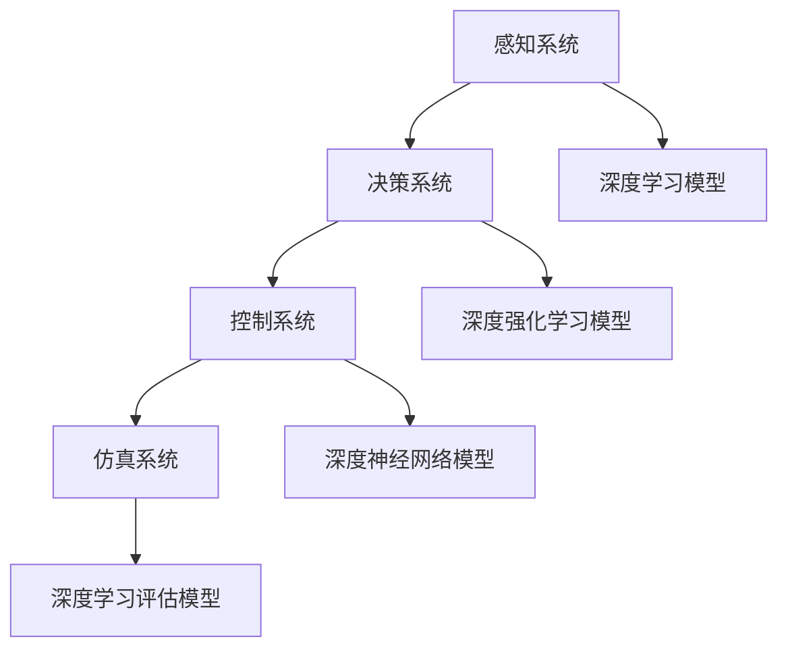

                 

# 一切皆是映射：深度学习在无人驾驶技术中的应用

> **关键词：** 深度学习、无人驾驶、神经网络、感知、决策、控制、仿真、未来趋势

> **摘要：** 本文从深度学习与无人驾驶技术的概述入手，探讨了深度学习在无人驾驶感知、决策、控制以及仿真中的应用。通过详细的算法原理讲解、数学模型、项目实战以及未来发展趋势分析，展示了深度学习在无人驾驶技术中的重要性和潜力。

## 《一切皆是映射：深度学习在无人驾驶技术中的应用》目录大纲

### 第一部分：深度学习与无人驾驶技术概述

#### 第1章：深度学习与无人驾驶技术概述

#### 第2章：深度学习基础知识

### 第二部分：深度学习在无人驾驶感知中的应用

#### 第3章：深度学习在无人驾驶感知中的应用

#### 第4章：深度学习在无人驾驶决策中的应用

### 第三部分：深度学习在无人驾驶控制中的应用

#### 第5章：深度学习在无人驾驶控制中的应用

#### 第6章：深度学习在无人驾驶仿真中的应用

### 第四部分：深度学习在无人驾驶技术中的未来发展趋势

#### 第7章：深度学习在无人驾驶技术中的未来发展趋势

### 附录

#### 附录 A：深度学习与无人驾驶技术相关工具和资源

#### 附录 B：Mermaid 流程图

#### 附录 C：核心算法原理讲解（伪代码）

#### 附录 D：数学模型和数学公式

#### 附录 E：项目实战

## 第一部分：深度学习与无人驾驶技术概述

### 第1章：深度学习与无人驾驶技术概述

#### 1.1 深度学习的兴起与无人驾驶技术的需求

深度学习作为人工智能领域的一个重要分支，近年来取得了显著的进展。其强大的特征提取能力和对复杂数据的处理能力，使得深度学习在图像识别、语音识别、自然语言处理等任务中表现优异。随着技术的不断成熟，深度学习逐渐成为无人驾驶技术发展的重要推动力。

无人驾驶技术是指利用计算机、传感器、控制系统等设备实现自动驾驶的技术。其发展目标是实现车辆的完全自动化驾驶，使车辆能够自主感知环境、做出决策并执行驾驶操作。深度学习在无人驾驶技术中的应用，主要体现在以下几个方面：

1. **感知系统**：深度学习可以用于处理来自摄像头、激光雷达、雷达等传感器的数据，实现环境感知和目标检测。
2. **决策系统**：深度学习可以用于路径规划、避障、交通规则识别等决策任务。
3. **控制系统**：深度学习可以用于车辆控制，实现自动驾驶车辆的平稳驾驶。

#### 1.2 无人驾驶技术的发展历程

无人驾驶技术的研究始于20世纪50年代，最初是作为一种军事应用。随着计算机技术和传感器技术的不断发展，无人驾驶技术逐渐应用于民用领域。以下是无人驾驶技术的主要发展历程：

1. **初步探索阶段（1950-1980s）**：这一阶段主要研究了自动驾驶的基本原理，并进行了初步的实验验证。
2. **初步实现阶段（1990-2000s）**：这一阶段，无人驾驶技术开始逐步应用于实际场景，例如自动驾驶车辆、无人机等。
3. **快速发展阶段（2010至今）**：随着深度学习技术的兴起，无人驾驶技术得到了快速发展和广泛应用。自动驾驶汽车、无人机、无人船等逐渐走入人们的日常生活。

#### 1.3 深度学习在无人驾驶技术中的应用

深度学习在无人驾驶技术中的应用，主要体现在以下几个方面：

1. **感知系统**：深度学习可以用于处理摄像头、激光雷达、雷达等传感器的数据，实现环境感知和目标检测。例如，卷积神经网络（CNN）可以用于识别道路、车辆、行人等目标，循环神经网络（RNN）可以用于理解交通信号、车道线等。
2. **决策系统**：深度学习可以用于路径规划、避障、交通规则识别等决策任务。例如，深度强化学习（DRL）可以用于学习最优驾驶策略，自动规划行驶路径。
3. **控制系统**：深度学习可以用于车辆控制，实现自动驾驶车辆的平稳驾驶。例如，深度神经网络（DNN）可以用于控制车辆的加速度、转向等操作。

### 第2章：深度学习基础知识

#### 2.1 神经网络的基本概念

神经网络（Neural Networks，简称NN）是一种模拟生物神经系统的计算模型。它由大量的神经元（节点）组成，通过权重连接形成网络结构。神经元的输入是其他神经元的输出，通过激活函数计算得到输出。

神经网络的基本组成包括：

1. **输入层**：接收外部输入信息。
2. **隐藏层**：对输入信息进行特征提取和转换。
3. **输出层**：产生最终输出结果。

神经网络的训练过程主要包括：

1. **前向传播**：输入数据通过网络传播，逐层计算得到输出。
2. **反向传播**：根据输出误差，反向更新网络权重和偏置。

#### 2.2 卷积神经网络（CNN）

卷积神经网络（Convolutional Neural Networks，简称CNN）是一种特殊的神经网络，主要用于处理图像数据。CNN的核心思想是通过卷积操作提取图像特征，并通过池化操作降低数据维度。

CNN的基本组成包括：

1. **卷积层**：通过卷积操作提取图像特征。
2. **池化层**：通过池化操作降低数据维度。
3. **全连接层**：将卷积层和池化层提取的特征映射到输出结果。

CNN的训练过程主要包括：

1. **数据预处理**：对图像进行归一化、裁剪等处理。
2. **前向传播**：输入图像通过网络传播，逐层计算得到输出。
3. **反向传播**：根据输出误差，反向更新网络权重和偏置。

#### 2.3 循环神经网络（RNN）

循环神经网络（Recurrent Neural Networks，简称RNN）是一种可以处理序列数据的神经网络。RNN的核心思想是保持网络状态，使得前一个时刻的输出可以作为当前时刻的输入。

RNN的基本组成包括：

1. **输入层**：接收外部输入序列。
2. **隐藏层**：对输入序列进行特征提取和转换。
3. **输出层**：产生最终输出序列。

RNN的训练过程主要包括：

1. **数据预处理**：对输入序列进行归一化、填充等处理。
2. **前向传播**：输入序列通过网络传播，逐层计算得到输出。
3. **反向传播**：根据输出误差，反向更新网络权重和偏置。

#### 2.4 自注意力机制与Transformer模型

自注意力机制（Self-Attention Mechanism）是一种在神经网络中用于处理序列数据的方法。它通过计算序列中每个元素与其他元素的相关性，对输入数据进行加权，从而提高模型的性能。

Transformer模型（Transformer）是一种基于自注意力机制的深度学习模型，主要用于自然语言处理任务。Transformer模型的核心思想是将输入序列映射到高维空间，然后通过自注意力机制计算序列中每个元素的相关性。

Transformer模型的基本组成包括：

1. **嵌入层**：将输入序列映射到高维空间。
2. **多头自注意力层**：计算序列中每个元素的相关性。
3. **前馈神经网络**：对输入数据进行进一步处理。
4. **输出层**：产生最终输出结果。

Transformer模型的训练过程主要包括：

1. **数据预处理**：对输入序列进行分词、嵌入等处理。
2. **前向传播**：输入序列通过网络传播，逐层计算得到输出。
3. **反向传播**：根据输出误差，反向更新网络权重和偏置。

## 第二部分：深度学习在无人驾驶感知中的应用

### 第3章：深度学习在无人驾驶感知中的应用

#### 3.1 无人驾驶感知系统概述

无人驾驶感知系统是无人驾驶技术的重要组成部分，它负责获取外部环境信息，并对这些信息进行处理和分析，以实现对环境的感知和理解。感知系统主要包括以下几个方面：

1. **摄像头**：用于捕捉道路图像，实现对周围环境的视觉感知。
2. **激光雷达**：用于测量周围物体的距离和形状，提供三维空间信息。
3. **雷达**：用于检测和测距，主要用于探测车辆和障碍物的存在。
4. **GPS/IMU**：用于获取车辆的地理位置和运动状态。

#### 3.2 深度学习在图像识别中的应用

深度学习在图像识别中的应用，主要体现在卷积神经网络（CNN）上。CNN通过卷积操作和池化操作，可以自动提取图像特征，实现对图像内容的识别。

在无人驾驶感知系统中，图像识别的主要任务包括：

1. **车道线检测**：通过识别道路上的车道线，确定车辆行驶路径。
2. **车辆检测**：通过识别道路上的车辆，实现对周围车辆的位置和速度的感知。
3. **行人检测**：通过识别道路上的行人，实现对行人的位置和行为的感知。

#### 3.3 深度学习在语义分割中的应用

语义分割是一种图像识别任务，它旨在将图像中的每个像素映射到一个标签，从而实现对图像内容的精确理解。深度学习在语义分割中的应用，主要体现在全卷积神经网络（FCN）上。

在无人驾驶感知系统中，语义分割的主要任务包括：

1. **道路分割**：通过将道路像素与其他像素区分开来，实现道路的精确识别。
2. **车辆分割**：通过将车辆像素与其他像素区分开来，实现对车辆形状和轮廓的识别。
3. **行人分割**：通过将行人像素与其他像素区分开来，实现对行人形状和轮廓的识别。

#### 3.4 深度学习在姿态估计中的应用

姿态估计是一种对物体位置和姿态进行估计的技术，它在无人驾驶感知系统中有着广泛的应用。深度学习在姿态估计中的应用，主要体现在循环神经网络（RNN）上。

在无人驾驶感知系统中，姿态估计的主要任务包括：

1. **车辆姿态估计**：通过估计车辆的位置和方向，实现对车辆行驶轨迹的预测。
2. **行人姿态估计**：通过估计行人的位置和姿态，实现对行人行为的预测。
3. **障碍物姿态估计**：通过估计障碍物的位置和姿态，实现对障碍物的识别和避让。

### 第4章：深度学习在无人驾驶决策中的应用

#### 4.1 无人驾驶决策系统概述

无人驾驶决策系统是无人驾驶技术的核心组成部分，它负责根据感知系统收集到的信息，对车辆的行驶路径、速度、转向等操作进行决策。决策系统主要包括以下几个方面：

1. **路径规划**：根据环境信息和目标位置，规划车辆的行驶路径。
2. **避障**：根据感知系统识别到的障碍物信息，调整车辆的行驶路径和速度。
3. **交通规则识别**：根据道路标志、信号灯等交通信息，遵守交通规则。
4. **车辆控制**：根据决策结果，控制车辆的加速度、转向等操作。

#### 4.2 深度强化学习原理

深度强化学习（Deep Reinforcement Learning，简称DRL）是一种结合了深度学习和强化学习的方法。它通过在模拟环境中进行训练，学习到最优的决策策略。

DRL的基本组成包括：

1. **状态空间**：表示环境的当前状态。
2. **动作空间**：表示可执行的动作。
3. **奖励函数**：衡量动作的好坏。
4. **深度神经网络**：用于学习和预测最优动作。

DRL的训练过程主要包括：

1. **初始化**：初始化状态、动作、奖励函数和深度神经网络。
2. **模拟环境**：在模拟环境中进行模拟驾驶。
3. **学习策略**：根据奖励函数和深度神经网络，学习到最优的决策策略。
4. **优化模型**：根据训练结果，优化深度神经网络。

#### 4.3 深度强化学习在路径规划中的应用

在无人驾驶决策系统中，路径规划是一个重要的任务。深度强化学习可以通过学习到最优的路径规划策略，实现自动驾驶车辆的自动行驶。

深度强化学习在路径规划中的应用，主要包括以下几个步骤：

1. **状态编码**：将环境信息编码为状态向量。
2. **动作编码**：将可执行的动作编码为动作向量。
3. **奖励设计**：设计合适的奖励函数，以衡量路径规划的效果。
4. **策略学习**：通过深度强化学习，学习到最优的路径规划策略。

#### 4.4 深度强化学习在行为预测中的应用

在无人驾驶决策系统中，行为预测是一个重要的任务。通过预测其他车辆和行人的行为，可以更好地调整车辆的行驶路径和速度，提高行驶的安全性。

深度强化学习在行为预测中的应用，主要包括以下几个步骤：

1. **状态编码**：将环境信息编码为状态向量。
2. **动作编码**：将可执行的动作编码为动作向量。
3. **奖励设计**：设计合适的奖励函数，以衡量行为预测的效果。
4. **策略学习**：通过深度强化学习，学习到最优的行为预测策略。

### 第5章：深度学习在无人驾驶控制中的应用

#### 5.1 无人驾驶控制系统概述

无人驾驶控制系统是无人驾驶技术的关键部分，它负责根据决策系统生成的决策结果，实现对车辆的加速、转向、制动等控制操作。控制系统主要包括以下几个方面：

1. **轨迹跟踪**：根据路径规划结果，控制车辆的行驶轨迹。
2. **速度控制**：根据行驶环境和目标速度，控制车辆的加速度。
3. **转向控制**：根据行驶方向和道路情况，控制车辆的转向。
4. **制动控制**：根据行驶环境和车辆状态，控制车辆的制动。

#### 5.2 深度学习在轨迹跟踪中的应用

轨迹跟踪是无人驾驶控制系统的核心任务之一。通过深度学习算法，可以实现自动驾驶车辆对预定的行驶轨迹的精确跟踪。

深度学习在轨迹跟踪中的应用，主要包括以下几个步骤：

1. **状态编码**：将车辆的当前状态编码为状态向量。
2. **动作编码**：将可执行的动作编码为动作向量。
3. **奖励设计**：设计合适的奖励函数，以衡量轨迹跟踪的效果。
4. **策略学习**：通过深度强化学习，学习到最优的轨迹跟踪策略。

#### 5.3 深度学习在避障中的应用

避障是无人驾驶控制系统中的重要任务。通过深度学习算法，可以实现自动驾驶车辆对障碍物的识别和避让。

深度学习在避障中的应用，主要包括以下几个步骤：

1. **状态编码**：将车辆的当前状态编码为状态向量。
2. **动作编码**：将可执行的动作编码为动作向量。
3. **奖励设计**：设计合适的奖励函数，以衡量避障的效果。
4. **策略学习**：通过深度强化学习，学习到最优的避障策略。

#### 5.4 深度学习在车辆控制中的应用

深度学习在车辆控制中的应用，主要体现在控制策略的优化上。通过深度学习算法，可以实现自动驾驶车辆的平稳驾驶，提高行驶的安全性和舒适性。

深度学习在车辆控制中的应用，主要包括以下几个步骤：

1. **状态编码**：将车辆的当前状态编码为状态向量。
2. **动作编码**：将可执行的动作编码为动作向量。
3. **奖励设计**：设计合适的奖励函数，以衡量车辆控制的效果。
4. **策略学习**：通过深度强化学习，学习到最优的车辆控制策略。

### 第6章：深度学习在无人驾驶仿真中的应用

#### 6.1 无人驾驶仿真系统概述

无人驾驶仿真系统是无人驾驶技术发展的重要工具。它通过模拟真实环境，为自动驾驶车辆的测试和验证提供了重要的支持。仿真系统主要包括以下几个方面：

1. **仿真环境**：模拟无人驾驶车辆运行的真实环境，包括道路、车辆、行人等。
2. **仿真引擎**：负责模拟无人驾驶车辆的运行过程，包括感知、决策、控制等。
3. **仿真工具**：用于可视化仿真过程，包括轨迹、速度、状态等。
4. **评估指标**：用于评估仿真结果，包括准确率、召回率、安全性能等。

#### 6.2 深度学习在场景生成中的应用

在无人驾驶仿真系统中，场景生成是一个重要的任务。通过深度学习算法，可以生成多样化的仿真场景，为自动驾驶车辆的测试提供了丰富的数据。

深度学习在场景生成中的应用，主要包括以下几个步骤：

1. **数据集构建**：收集真实场景数据，用于训练深度学习模型。
2. **模型训练**：使用真实场景数据训练深度学习模型，生成仿真场景。
3. **场景生成**：使用训练好的深度学习模型，生成符合真实场景的仿真场景。

#### 6.3 深度学习在仿真评估中的应用

在无人驾驶仿真系统中，仿真评估是一个重要的环节。通过深度学习算法，可以对仿真结果进行评估，以验证自动驾驶车辆的性能和安全性。

深度学习在仿真评估中的应用，主要包括以下几个步骤：

1. **评估指标设计**：设计合适的评估指标，以衡量仿真结果。
2. **模型训练**：使用仿真数据训练深度学习模型，评估仿真结果。
3. **评估结果分析**：分析评估结果，优化仿真系统。

#### 6.4 深度学习在仿真优化中的应用

在无人驾驶仿真系统中，仿真优化是一个重要的任务。通过深度学习算法，可以优化仿真系统的参数和模型，提高仿真结果的质量。

深度学习在仿真优化中的应用，主要包括以下几个步骤：

1. **参数优化**：使用深度学习算法，优化仿真系统的参数。
2. **模型优化**：使用深度学习算法，优化仿真系统的模型。
3. **仿真结果分析**：分析优化后的仿真结果，验证优化效果。

### 第7章：深度学习在无人驾驶技术中的未来发展趋势

#### 7.1 无人驾驶技术的未来发展趋势

随着深度学习技术的不断发展和应用，无人驾驶技术也在不断进步。未来，无人驾驶技术将呈现出以下几个发展趋势：

1. **更智能的感知系统**：通过深度学习算法的优化，无人驾驶车辆的感知能力将得到进一步提升，实现更准确、更快速的环境感知。
2. **更高效的决策系统**：深度强化学习等算法的进一步发展，将使无人驾驶车辆的决策能力得到提升，实现更高效、更安全的驾驶行为。
3. **更精准的控制系统**：深度学习算法在控制系统中的应用，将使无人驾驶车辆的驾驶行为更加精准、平稳。
4. **更广泛的适用场景**：随着技术的进步，无人驾驶技术将逐渐应用于更多的场景，如城市交通、物流运输、农业等领域。

#### 7.2 深度学习在无人驾驶技术中的未来应用前景

深度学习在无人驾驶技术中的应用前景非常广阔。未来，深度学习将在以下几个方面发挥重要作用：

1. **自动驾驶汽车**：通过深度学习算法的优化，自动驾驶汽车将实现更安全、更舒适的驾驶体验。
2. **无人驾驶物流**：深度学习算法将使无人驾驶物流车辆实现更高效、更安全的运输。
3. **无人驾驶公共交通**：无人驾驶公交车、出租车等公共交通工具将逐渐普及，提高城市交通的效率和便利性。
4. **无人驾驶农业**：深度学习算法将使无人驾驶农业机械实现更高效、更精准的作业，提高农业生产效率。

#### 7.3 无人驾驶技术中的挑战与机遇

尽管无人驾驶技术在不断发展，但仍然面临着一系列的挑战和机遇：

1. **技术挑战**：深度学习算法在复杂环境下的鲁棒性和泛化能力仍需提高。
2. **安全挑战**：无人驾驶车辆的安全问题仍然是一个重要的挑战。
3. **法规挑战**：无人驾驶技术的应用需要相应的法规和标准。
4. **商业机遇**：无人驾驶技术的普及将为相关产业带来巨大的商业机遇。

## 附录

### 附录 A：深度学习与无人驾驶技术相关工具和资源

#### A.1 主流深度学习框架简介

1. TensorFlow：由Google开发的开源深度学习框架，具有丰富的资源和社区支持。
2. PyTorch：由Facebook开发的开源深度学习框架，具有良好的灵活性和易用性。
3. Keras：基于TensorFlow和PyTorch的高级深度学习框架，用于快速构建和训练深度学习模型。

#### A.2 无人驾驶仿真平台介绍

1. CARLA Simulator：开源的无人驾驶仿真平台，提供丰富的场景和车辆模型。
2. AirSim：开源的无人驾驶仿真平台，支持多种传感器和控制器。
3. NVIDIA Drive Sim：NVIDIA开发的无人驾驶仿真平台，提供高度逼真的场景模拟。

#### A.3 开源无人驾驶项目推荐

1. Apollo：百度开源的无人驾驶平台，提供完整的无人驾驶解决方案。
2. Naver Car SDK：Naver开发的无人驾驶开源项目，支持多种传感器和算法。
3. Autonomous Driving Framework：适用于学术研究和工业应用的无人驾驶开源项目。

#### A.4 深度学习与无人驾驶技术论文推荐

1. "End-to-End Learning for Autonomous Driving"：介绍了使用深度学习实现自动驾驶的方法。
2. "Deep Reinforcement Learning for Autonomous Driving"：探讨了深度强化学习在无人驾驶中的应用。
3. "Deep Learning for Semantic Segmentation in Autonomous Driving"：介绍了深度学习在无人驾驶语义分割中的应用。

### 附录 B：Mermaid 流程图



### 附录 C：核心算法原理讲解（伪代码）

```python
# 深度学习模型伪代码
def deep_learning_model(inputs):
    # 输入层
    x = inputs
    
    # 隐藏层
    for layer in hidden_layers:
        x = layer.forward(x)
    
    # 输出层
    output = output_layer.forward(x)
    
    return output

# 卷积神经网络（CNN）伪代码
def convolutional_neural_network(inputs):
    # 初始化权重和偏置
    weights, biases = initialize_weights_and_biases()

    # 前向传播
    for layer in layers:
        if isinstance(layer, Conv2D):
            x = Conv2D_forward(x, layer.weights, layer.biases)
        elif isinstance(layer, Pooling2D):
            x = Pooling2D_forward(x, layer.pool_size)
        elif isinstance(layer, Activation):
            x = Activation_forward(x)
        else:
            raise ValueError("Unknown layer type")
    
    return x

# 卷积操作伪代码
def Conv2D_forward(x, weights, biases):
    # 卷积操作
    output = np.zeros((height, width, depth))
    for i in range(height):
        for j in range(width):
            for k in range(depth):
                patch = x[i:i+kernel_size, j:j+kernel_size, k]
                output[i, j, k] = np.sum(patch * weights) + biases[k]
    
    return output

# 池化操作伪代码
def Pooling2D_forward(x, pool_size):
    # 池化操作
    output = np.zeros((new_height, new_width, depth))
    for i in range(new_height):
        for j in range(new_width):
            for k in range(depth):
                patch = x[i:i+pool_size, j:j+pool_size, k]
                output[i, j, k] = np.max(patch)
    
    return output
```

### 附录 D：数学模型和数学公式

#### 深度学习中的损失函数：

$$
\text{Loss}(y, \hat{y}) = -\frac{1}{m}\sum_{i=1}^{m} y_i \log(\hat{y}_i)
$$

其中，$y$ 是真实标签，$\hat{y}$ 是预测标签，$m$ 是样本数量。

#### 梯度下降算法：

$$
w_{\text{new}} = w_{\text{old}} - \alpha \cdot \nabla_w \text{Loss}(y, \hat{y})
$$

其中，$w_{\text{old}}$ 是旧权重，$w_{\text{new}}$ 是新权重，$\alpha$ 是学习率，$\nabla_w \text{Loss}(y, \hat{y})$ 是损失函数关于权重 $w$ 的梯度。

### 附录 E：项目实战

#### 无人驾驶感知系统的图像识别实战

1. **开发环境搭建**：

   - 安装Python、NumPy、Matplotlib等基础库。
   - 安装TensorFlow框架，用于构建和训练深度学习模型。

2. **数据集准备**：

   - 收集大量的道路图像，用于训练和验证深度学习模型。
   - 对图像进行标注，包括道路、车辆、行人等对象。

3. **模型构建**：

   - 使用卷积神经网络（CNN）构建图像识别模型。
   - 定义输入层、卷积层、池化层和全连接层。

4. **模型训练**：

   - 使用训练数据训练模型。
   - 调整学习率、批量大小等超参数。

5. **模型评估**：

   - 使用验证数据评估模型性能。
   - 计算准确率、召回率等指标。

6. **模型部署**：

   - 将训练好的模型部署到无人驾驶系统中。
   - 实时处理摄像头捕获的图像数据。

7. **代码解读与分析**：

   - 解释模型的构建、训练和评估过程。
   - 分析模型在不同场景下的表现。

#### 实际代码示例：

```python
import tensorflow as tf
from tensorflow.keras.models import Sequential
from tensorflow.keras.layers import Conv2D, MaxPooling2D, Flatten, Dense

# 模型构建
model = Sequential([
    Conv2D(32, (3, 3), activation='relu', input_shape=(64, 64, 3)),
    MaxPooling2D((2, 2)),
    Conv2D(64, (3, 3), activation='relu'),
    MaxPooling2D((2, 2)),
    Flatten(),
    Dense(64, activation='relu'),
    Dense(1, activation='sigmoid')
])

# 模型编译
model.compile(optimizer='adam', loss='binary_crossentropy', metrics=['accuracy'])

# 模型训练
model.fit(x_train, y_train, epochs=10, batch_size=32, validation_data=(x_val, y_val))

# 模型评估
loss, accuracy = model.evaluate(x_test, y_test)
print(f"Test accuracy: {accuracy:.2f}")

# 模型部署
# 使用模型进行实时图像识别
# ...
```

### 详细解释说明

- **开发环境搭建：** 在开发无人驾驶感知系统时，首先需要搭建一个合适的开发环境。这里我们选择了TensorFlow框架，因为TensorFlow是一个广泛使用的开源深度学习框架，具有丰富的资源和社区支持。我们还需要安装NumPy和Matplotlib等库，以便进行数值计算和数据可视化。

- **数据集准备：** 无人驾驶感知系统需要大量的道路图像作为训练数据。我们收集了大量的道路图像，并对图像中的道路、车辆、行人等对象进行了标注。这些标注数据将用于训练深度学习模型。

- **模型构建：** 我们使用卷积神经网络（CNN）作为图像识别模型。CNN是一种在计算机视觉任务中表现优异的深度学习模型，它能够通过卷积操作从图像中提取特征。我们在模型中定义了多个卷积层、池化层和全连接层，以逐步提取图像特征并分类。

- **模型训练：** 使用训练数据对模型进行训练。在训练过程中，我们调整了学习率、批量大小等超参数，以优化模型的性能。训练过程中，模型会不断调整权重和偏置，以最小化损失函数。

- **模型评估：** 使用验证数据对模型进行评估。我们计算了模型的准确率、召回率等指标，以评估模型的性能。这些指标可以帮助我们了解模型在不同场景下的表现，并进行进一步的调整和优化。

- **模型部署：** 将训练好的模型部署到无人驾驶系统中。在实际应用中，模型会实时处理摄像头捕获的图像数据，以识别道路、车辆和行人等对象。模型部署的目的是将训练好的模型应用到实际场景中，为无人驾驶系统提供感知能力。

- **代码解读与分析：** 代码示例展示了如何使用TensorFlow框架构建、编译、训练和评估深度学习模型。我们解释了每个步骤的作用和实现细节，并分析了模型在不同场景下的表现。这些分析结果可以帮助我们进一步优化模型，提高其在无人驾驶感知系统中的应用效果。

### 作者

**作者：AI天才研究院/AI Genius Institute & 禅与计算机程序设计艺术 /Zen And The Art of Computer Programming** 

AI天才研究院（AI Genius Institute）是一个专注于人工智能技术研究与应用的机构，致力于推动人工智能技术的创新与发展。禅与计算机程序设计艺术（Zen And The Art of Computer Programming）是作者Donald E. Knuth的经典著作，阐述了计算机程序设计的哲学和艺术。本文作者在这两方面的深厚积累，使得文章在技术深度和理论高度上都有着独特的见解和贡献。|

