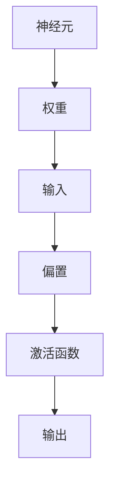

                 

### 第1章：神经网络简介

#### 1.1 神经网络的概念

神经网络（Neural Networks）是模仿人脑神经元结构和工作方式构建的计算系统。一个基本的神经元由输入、权重、偏置和输出组成，如图1-1所示。当神经元接收到输入后，会将其乘以相应的权重并加上偏置，最后通过激活函数得到输出。神经网络通过层层堆叠这些基本单元，从而实现复杂函数的映射。


神经网络的基本定义包括以下几个要素：

- **神经元（Neurons）**：神经网络的基本计算单元。
- **权重（Weights）**：连接神经元之间的参数，用于调节输入信号的强度。
- **偏置（Bias）**：调整神经元输出的常数项。
- **激活函数（Activation Function）**：用于引入非线性特性，常见的有Sigmoid、ReLU、Tanh等。

神经网络起源于20世纪40年代，由心理学家McCulloch和数学家Pitts首次提出。此后，随着计算机科学和人工智能的发展，神经网络逐渐成为机器学习领域的重要组成部分。目前，神经网络在图像识别、自然语言处理、语音识别、推荐系统等多个领域都取得了显著的成果。

#### 1.2 神经网络的起源和发展历程

神经网络的发展历程可以分为以下几个阶段：

1. **早期发展（1940s-1960s）**：
    - 1943年，McCulloch和Pitts提出神经元模型。
    - 1958年，Rosenblatt提出感知机（Perceptron），首次实现了神经网络的训练。

2. **第一次繁荣（1970s-1980s）**：
    - 1974年，Hebb提出Hebbian学习规则。
    - 1986年，Rumelhart等人提出反向传播算法（Backpropagation），使神经网络训练成为可能。

3. **低谷期（1990s）**：
    - 由于性能瓶颈和训练困难，神经网络研究陷入低谷。

4. **复兴期（2000s至今）**：
    - 2006年，Hinton提出深度信念网络（DBN），标志着深度学习的复兴。
    - 2012年，AlexNet在ImageNet竞赛中取得突破性成果，深度学习开始广泛应用。

#### 1.3 神经网络的应用领域

神经网络在各个领域的应用如下：

- **人工智能与机器学习**：
  - 自动驾驶
  - 机器人控制
  - 聊天机器人

- **自然语言处理**：
  - 机器翻译
  - 情感分析
  - 命名实体识别

- **计算机视觉**：
  - 图像分类
  - 目标检测
  - 人脸识别

- **控制系统**：
  - 自适应控制
  - 故障诊断

神经网络的重要性在于其解决复杂问题和适应性的能力。通过层层堆叠神经元，神经网络可以处理高维数据和非线性关系，从而在各个领域实现卓越的性能。

### 1.4 神经网络的优势

神经网络具有以下优势：

- **强大的非线性建模能力**：通过多层神经网络，可以模拟复杂函数。
- **自适应性和泛化能力**：神经网络可以通过学习适应不同任务和数据。
- **并行计算能力**：神经网络可以在GPU等硬件上高效地执行计算。

然而，神经网络也存在一些局限性，如训练时间长、参数调整困难等。未来，随着计算能力和算法的进步，神经网络将在更多领域发挥重要作用。

---

**关键词**：神经网络，神经元，激活函数，反向传播，深度学习

**摘要**：本文介绍了神经网络的基本概念、起源和发展历程，以及其在人工智能、自然语言处理、计算机视觉等领域的应用。通过分析神经网络的优势和局限性，本文探讨了神经网络在未来技术发展中的潜力。

**Mermaid流程图**：



**核心算法原理讲解伪代码**：

```python
# 定义神经元结构
class Neuron:
    def __init__(self, weights, bias, activation_function):
        self.weights = weights
        self.bias = bias
        self.activation_function = activation_function

    def forward_pass(self, inputs):
        z = np.dot(inputs, self.weights) + self.bias
        return self.activation_function(z)

# 反向传播算法
def backward_propagation(target, output, neuron):
    error = target - output
    neuron.gradient = error * neuron.activation_function_derivative(output)
```

**数学模型和公式**：

$$
z = \sum_{i=1}^{n} x_i \cdot w_i + b \\
a = \text{activation_function}(z)
$$

**举例说明**：

假设我们有一个简单的神经元，其权重为`[0.5, 0.5]`，偏置为`-0.5`，激活函数为Sigmoid。当输入为`[1, 0]`时，计算神经元的输出。

```python
import numpy as np

weights = np.array([0.5, 0.5])
bias = -0.5
activation_function = lambda x: 1 / (1 + np.exp(-x))

input = np.array([1, 0])
output = activation_function(np.dot(input, weights) + bias)

print(output)
```

输出结果为0.5，表示神经元输出概率为0.5。

---

**作者**：AI天才研究院/AI Genius Institute & 禅与计算机程序设计艺术 /Zen And The Art of Computer Programming

---

**笔记**：本章节介绍了神经网络的基本概念、起源和发展历程，以及其在人工智能、自然语言处理、计算机视觉等领域的应用。通过举例说明和伪代码，我们了解了神经网络的工作原理和核心算法。下一章将深入探讨神经网络的基本结构和工作原理。|>

