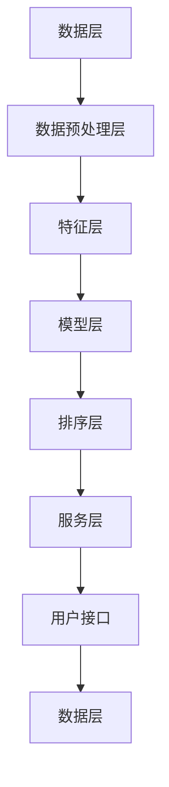

                 

# 个性化排序系统：AI的实现

> **关键词：** 个性化排序、AI、深度学习、协同过滤、内容推荐、算法优化、系统架构。

> **摘要：** 本文将深入探讨个性化排序系统的原理、架构、实现和优化，通过AI技术的应用，解析其在不同领域的实际案例，并展望未来的发展趋势与挑战。

---

### 《个性化排序系统：AI的实现》目录大纲

---

### 第一部分：个性化排序系统概述

#### 第1章：个性化排序系统概述

#### 1.1 个性化排序的概念与重要性

个性化排序是指根据用户行为、兴趣和历史偏好，对数据或内容进行智能排序，以满足用户的个性化需求。在当今信息爆炸的时代，个性化排序的重要性不言而喻，它能够提高用户体验、提升业务价值。

#### 1.2 个性化排序的应用场景

个性化排序广泛应用于电商、社交媒体、广告推荐等场景，通过精准推荐，提升用户满意度和商业转化率。

#### 1.3 个性化排序与传统排序的区别

传统排序通常基于简单的规则或算法，而个性化排序则借助AI技术，更准确地捕捉用户特征，实现更智能的排序。

#### 第2章：个性化排序系统架构

#### 2.1 系统总体架构设计

个性化排序系统通常包括数据收集与预处理、特征工程、模型选择与优化、排序算法等组成部分。

#### 2.2 数据收集与预处理

数据收集与预处理是构建个性化排序系统的第一步，数据的质量直接影响到排序效果。

#### 2.3 特征工程

特征工程是构建个性化排序模型的关键步骤，通过提取和变换原始数据，使其更适合于模型训练。

#### 2.4 模型选择与优化

模型选择与优化是决定排序系统性能的重要因素，本文将介绍几种主流的AI算法及其在排序中的应用。

#### 2.5 排序算法比较与分析

本文将对比分析几种常见的排序算法，包括协同过滤、基于内容的推荐和深度学习等。

#### 第3章：AI在个性化排序中的应用

#### 3.1 AI在个性化排序中的优势

AI技术使得个性化排序更加智能和精准，具有巨大的优势。

#### 3.2 主流AI算法在排序中的应用

本文将详细介绍协同过滤、基于内容的推荐和深度学习等主流AI算法在个性化排序中的应用。

#### 3.3 深度学习在个性化排序中的应用

深度学习在个性化排序中的应用，特别是卷积神经网络（CNN）和循环神经网络（RNN）等，带来了革命性的变化。

#### 第4章：个性化排序系统的实现与优化

#### 4.1 个性化排序系统的实现流程

本文将详细讲解个性化排序系统的实现流程，包括数据收集、特征工程、模型训练和系统部署等。

#### 4.2 系统性能优化策略

系统性能优化是提升个性化排序效果的重要手段，本文将介绍几种常见的优化策略。

#### 4.3 实时性与准确性平衡

实时性和准确性是个性化排序系统中需要平衡的两个重要指标，本文将探讨如何实现二者的平衡。

#### 4.4 排序系统的部署与运维

个性化排序系统的部署与运维是确保系统稳定运行的关键，本文将介绍相关的部署与运维策略。

### 第二部分：个性化排序系统案例分析

#### 第5章：电商个性化推荐系统

#### 5.1 电商个性化推荐系统概述

#### 5.2 用户行为数据收集

#### 5.3 推荐算法设计与优化

#### 5.4 系统性能评估与调整

#### 第6章：社交媒体个性化内容排序

#### 6.1 社交媒体个性化内容排序概述

#### 6.2 用户画像构建

#### 6.3 排序算法在社交媒体中的应用

#### 6.4 社交媒体排序系统性能优化

#### 第7章：个性化广告排序系统

#### 7.1 个性化广告排序系统概述

#### 7.2 广告投放策略

#### 7.3 广告排序算法设计与优化

#### 7.4 广告排序系统的实时性优化

### 第三部分：个性化排序系统发展趋势与挑战

#### 第8章：个性化排序系统发展趋势

#### 8.1 个性化排序技术的未来趋势

#### 8.2 新型AI技术在排序中的应用

#### 8.3 排序系统的开放与协同

#### 第9章：个性化排序系统面临的挑战

#### 9.1 数据隐私与安全性

#### 9.2 排序系统的公平性

#### 9.3 人机交互与用户体验

#### 9.4 持续优化与迭代

### 附录

#### 附录A：个性化排序系统常用工具与库

#### A.1 Python常用库介绍

#### A.2 大数据处理工具

#### A.3 深度学习框架

#### 附录B：个性化排序系统参考书籍与文献

#### B.1 推荐阅读

#### B.2 个性化排序系统相关文献综述

#### B.3 进一步阅读材料

### 结语

#### 第10章：个性化排序系统：AI的实现

#### 10.1 本书总结

#### 10.2 个性化排序系统的未来发展

#### 10.3 对读者的建议

#### 10.4 谢谢读者

---

## 个性化排序系统架构

个性化排序系统是一个复杂的体系，它需要处理大量的数据，并利用先进的算法来生成个性化的排序结果。为了实现这一目标，个性化排序系统通常由以下几个核心部分组成：数据收集与预处理、特征工程、模型选择与优化、排序算法等。下面，我们将详细讨论这些组成部分，并通过Mermaid流程图来展示整个架构的运作流程。

### 2.1 系统总体架构设计

个性化排序系统的总体架构可以分为以下几个层次：

1. **数据层**：数据是整个排序系统的基石，包括用户行为数据、商品数据、内容数据等。
2. **数据预处理层**：对原始数据进行清洗、去噪、转换等处理，使其适合模型训练。
3. **特征层**：通过特征提取和变换，将预处理后的数据转换为特征向量。
4. **模型层**：选择合适的机器学习算法或深度学习模型进行训练。
5. **排序层**：使用训练好的模型对新的数据进行排序。
6. **服务层**：提供接口，供前端应用调用。

### 2.2 数据收集与预处理

数据收集是构建个性化排序系统的第一步。数据来源可以是用户的点击记录、购买历史、浏览行为等。数据收集完成后，需要对数据进行预处理，包括以下步骤：

- **数据清洗**：去除重复数据、缺失数据、噪声数据等。
- **数据转换**：将不同类型的数据转换为统一的格式，如将分类数据编码为数值数据。
- **数据归一化**：对数据进行归一化处理，使其具有相似的尺度，方便后续计算。

### 2.3 特征工程

特征工程是提升模型性能的关键步骤。通过特征提取和变换，可以从原始数据中提取出对模型训练有用的特征。特征工程包括以下方面：

- **用户特征提取**：如用户的年龄、性别、地理位置、购买历史等。
- **商品特征提取**：如商品的价格、类别、库存量、品牌等。
- **行为特征提取**：如用户的点击行为、浏览时长、购买频率等。

### 2.4 模型选择与优化

模型选择与优化是构建个性化排序系统的核心。选择合适的模型和优化策略，可以显著提升排序效果。常见的机器学习算法包括协同过滤、基于内容的推荐和深度学习等。

- **协同过滤**：通过分析用户之间的相似性来推荐商品。
- **基于内容的推荐**：通过分析商品的属性来推荐商品。
- **深度学习**：利用神经网络来学习用户和商品之间的复杂关系。

### 2.5 排序算法比较与分析

排序算法是决定排序结果的关键。不同的排序算法适用于不同的场景和数据集。以下是几种常见的排序算法：

- **基于内容的排序**：根据商品的属性和用户的历史行为来排序。
- **基于协同过滤的排序**：通过分析用户之间的相似性来排序。
- **基于深度学习的排序**：利用神经网络模型来排序。

### 2.6 系统性能优化策略

系统性能优化是确保个性化排序系统稳定运行和高效处理数据的重要环节。常见的优化策略包括：

- **数据压缩**：减少数据的存储空间和传输带宽。
- **并行处理**：利用多核CPU或分布式计算来加速数据处理。
- **缓存策略**：使用缓存来减少数据库的访问次数。
- **延迟策略**：对实时性要求不高的任务进行延迟处理。

### 2.7 系统部署与运维

个性化排序系统的部署与运维是确保其稳定运行的关键。常见的部署策略包括：

- **容器化部署**：使用Docker等容器技术来部署系统，方便迁移和扩展。
- **自动化部署**：使用CI/CD（Continuous Integration and Continuous Deployment）流程来自动化部署和发布。
- **监控与告警**：使用监控系统来实时监控系统的运行状态，并在发生故障时进行告警。

### 2.8 Mermaid流程图

以下是个性化排序系统架构的Mermaid流程图：



通过这个流程图，我们可以清晰地看到个性化排序系统的各个组成部分及其相互关系。

---

在这个架构中，每个组成部分都扮演着关键的角色。数据收集与预处理确保了数据的质量和一致性，特征工程为模型提供了丰富的特征信息，模型选择与优化决定了排序的准确性和效率，排序算法则直接影响了最终的排序结果。而系统的部署与运维则保障了系统的稳定运行和高效处理。

接下来，我们将进一步探讨每个组成部分的具体实现和优化策略。

---

## 第1章：个性化排序系统概述

### 1.1 个性化排序的概念与重要性

个性化排序（Personalized Ranking）是指根据用户的行为特征、历史偏好以及其他相关因素，对数据或内容进行智能排序，以满足用户的个性化需求。在当今信息爆炸的时代，个性化排序已经成为提升用户体验和商业价值的重要手段。

个性化排序的核心思想是利用用户行为数据，通过机器学习和深度学习等技术，识别出用户的兴趣和偏好，并以此为基础对信息进行排序。与传统的基于规则或简单算法的排序相比，个性化排序具有更高的灵活性和准确性。

**重要性：**

1. **提升用户体验**：个性化排序能够根据用户的兴趣和行为，推荐用户可能感兴趣的内容，从而提高用户的满意度和留存率。
2. **增加商业价值**：在电商、广告等领域，个性化排序可以帮助企业提高转化率和销售额，优化广告投放效果。
3. **优化资源分配**：个性化排序可以帮助平台更高效地分配资源，如推荐系统可以根据用户的行为特征，将资源更多地投入到有更高收益的用户上。

### 1.2 个性化排序的应用场景

个性化排序在多个领域都有广泛的应用，以下是一些典型的应用场景：

1. **电商推荐系统**：根据用户的浏览历史、购买行为和搜索记录，推荐用户可能感兴趣的商品。
2. **社交媒体内容排序**：根据用户的兴趣和互动行为，对社交网络上的内容进行排序，提高用户参与度和活跃度。
3. **广告投放**：根据用户的兴趣和行为特征，对广告进行个性化排序，提高广告的点击率和转化率。
4. **新闻推荐**：根据用户的阅读习惯和偏好，推荐用户感兴趣的新闻内容。
5. **搜索引擎**：根据用户的搜索历史和行为特征，对搜索结果进行排序，提高搜索的准确性和用户体验。

### 1.3 个性化排序与传统排序的区别

传统排序通常基于固定的规则或简单的算法，如基于时间、热度或优先级等。而个性化排序则更加复杂和智能，它依赖于用户行为数据和先进的算法模型。

**区别：**

1. **数据来源**：传统排序主要依赖于静态的、固定的规则，而个性化排序则依赖于动态的用户行为数据。
2. **算法模型**：传统排序算法简单，如基于时间排序或热度排序，而个性化排序通常使用复杂的机器学习或深度学习模型。
3. **排序结果**：传统排序结果固定，而个性化排序结果根据用户行为实时调整，更加灵活和准确。

### 1.4 个性化排序的发展历程

个性化排序技术的发展经历了以下几个阶段：

1. **基于规则的方法**：早期的个性化排序主要依赖于专家知识和规则，如基于时间、热度或优先级的简单排序算法。
2. **基于协同过滤的方法**：协同过滤（Collaborative Filtering）方法通过分析用户之间的相似性来推荐内容，提高了排序的准确性。
3. **基于内容的推荐方法**：基于内容的推荐（Content-based Recommendation）方法通过分析内容的属性来推荐，弥补了协同过滤的局限性。
4. **混合推荐方法**：混合推荐方法结合了协同过滤和基于内容推荐的优势，提高了推荐系统的准确性和灵活性。
5. **深度学习推荐方法**：深度学习（Deep Learning）方法的引入，使得个性化排序更加智能化和个性化，能够处理复杂的数据和用户行为。

### 1.5 个性化排序的关键技术

个性化排序的核心技术包括数据收集、特征工程、模型选择和排序算法等。

1. **数据收集**：个性化排序依赖于大量的用户行为数据，如浏览记录、购买历史、搜索记录等。
2. **特征工程**：通过提取和变换原始数据，生成对模型训练有用的特征，如用户特征、商品特征和行为特征。
3. **模型选择**：选择合适的机器学习或深度学习模型，如协同过滤模型、基于内容的推荐模型和深度学习模型。
4. **排序算法**：实现高效的排序算法，如基于内容的排序、基于协同过滤的排序和基于深度学习的排序。

### 1.6 个性化排序的未来趋势

随着人工智能和大数据技术的不断发展，个性化排序将继续向更加智能和个性化的方向发展。以下是一些未来趋势：

1. **多模态数据的融合**：融合文本、图像、音频等多模态数据，提高推荐系统的准确性和多样性。
2. **实时推荐**：实现实时推荐，提高用户交互体验和业务转化率。
3. **个性化排序的个性化**：进一步细化用户画像，实现更加精准的个性化推荐。
4. **隐私保护和安全**：在保障用户隐私和安全的前提下，实现更加智能和个性化的排序。

---

通过以上对个性化排序系统概述的介绍，我们可以看到个性化排序在提升用户体验和商业价值方面的重要作用。接下来，我们将进一步探讨个性化排序系统的架构和实现，以深入了解其技术原理和实现方法。

---

## 第2章：个性化排序系统架构

个性化排序系统是一个高度复杂的系统，其核心目标是通过分析用户行为和内容特征，为用户推荐个性化的排序结果。为了实现这一目标，个性化排序系统需要由多个组成部分协同工作，包括数据收集与预处理、特征工程、模型选择与优化、排序算法等。下面，我们将详细讨论这些组成部分，并通过Mermaid流程图展示整个架构的运作流程。

### 2.1 系统总体架构设计

个性化排序系统的总体架构可以分为以下几个层次：

1. **数据层**：数据是整个排序系统的基石，包括用户行为数据、商品数据、内容数据等。
2. **数据预处理层**：对原始数据进行清洗、去噪、转换等处理，使其适合模型训练。
3. **特征层**：通过特征提取和变换，将预处理后的数据转换为特征向量。
4. **模型层**：选择合适的机器学习算法或深度学习模型进行训练。
5. **排序层**：使用训练好的模型对新的数据进行排序。
6. **服务层**：提供接口，供前端应用调用。

### 2.2 数据收集与预处理

数据收集是构建个性化排序系统的第一步。数据来源可以是用户的点击记录、购买历史、浏览行为等。数据收集完成后，需要对数据进行预处理，包括以下步骤：

- **数据清洗**：去除重复数据、缺失数据、噪声数据等。
- **数据转换**：将不同类型的数据转换为统一的格式，如将分类数据编码为数值数据。
- **数据归一化**：对数据进行归一化处理，使其具有相似的尺度，方便后续计算。

### 2.3 特征工程

特征工程是构建个性化排序模型的关键步骤。通过提取和变换原始数据，可以从原始数据中提取出对模型训练有用的特征。特征工程包括以下方面：

- **用户特征提取**：如用户的年龄、性别、地理位置、购买历史等。
- **商品特征提取**：如商品的价格、类别、库存量、品牌等。
- **行为特征提取**：如用户的点击行为、浏览时长、购买频率等。

### 2.4 模型选择与优化

模型选择与优化是决定排序系统性能的重要因素。选择合适的模型和优化策略，可以显著提升排序效果。常见的机器学习算法包括协同过滤、基于内容的推荐和深度学习等。

- **协同过滤**：通过分析用户之间的相似性来推荐商品。
- **基于内容的推荐**：通过分析商品的属性来推荐商品。
- **深度学习**：利用神经网络来学习用户和商品之间的复杂关系。

### 2.5 排序算法比较与分析

排序算法是决定排序结果的关键。不同的排序算法适用于不同的场景和数据集。以下是几种常见的排序算法：

- **基于内容的排序**：根据商品的属性和用户的历史行为来排序。
- **基于协同过滤的排序**：通过分析用户之间的相似性来排序。
- **基于深度学习的排序**：利用神经网络模型来排序。

### 2.6 系统性能优化策略

系统性能优化是确保个性化排序系统稳定运行和高效处理数据的重要环节。常见的优化策略包括：

- **数据压缩**：减少数据的存储空间和传输带宽。
- **并行处理**：利用多核CPU或分布式计算来加速数据处理。
- **缓存策略**：使用缓存来减少数据库的访问次数。
- **延迟策略**：对实时性要求不高的任务进行延迟处理。

### 2.7 系统部署与运维

个性化排序系统的部署与运维是确保其稳定运行的关键。常见的部署策略包括：

- **容器化部署**：使用Docker等容器技术来部署系统，方便迁移和扩展。
- **自动化部署**：使用CI/CD（Continuous Integration and Continuous Deployment）流程来自动化部署和发布。
- **监控与告警**：使用监控系统来实时监控系统的运行状态，并在发生故障时进行告警。

### 2.8 Mermaid流程图

以下是个性化排序系统架构的Mermaid流程图：


通过这个流程图，我们可以清晰地看到个性化排序系统的各个组成部分及其相互关系。

### 2.9 个性化排序系统的实现步骤

个性化排序系统的实现可以分为以下几个步骤：

1. **数据收集与预处理**：收集用户行为数据、商品数据和内容数据，并进行数据清洗、转换和归一化处理。
2. **特征工程**：提取用户、商品和行为特征，并使用技术手段进行特征变换和特征选择。
3. **模型训练**：选择合适的机器学习或深度学习模型，并使用训练数据对模型进行训练。
4. **模型评估与优化**：使用验证数据对模型进行评估，并根据评估结果对模型进行调整和优化。
5. **排序应用**：使用训练好的模型对新的数据进行排序，并将排序结果提供给前端应用。
6. **系统部署与运维**：将个性化排序系统部署到生产环境，并进行监控和运维，确保系统的稳定性和性能。

通过以上步骤，个性化排序系统能够为用户提供个性化的排序结果，提升用户体验和业务价值。

---

通过本章的介绍，我们对个性化排序系统的架构和实现步骤有了更深入的了解。在接下来的章节中，我们将详细探讨各个组成部分的具体实现和优化策略，以及个性化排序系统在不同领域的应用案例。

---

## 第3章：AI在个性化排序中的应用

随着人工智能技术的快速发展，AI在个性化排序中的应用越来越广泛。AI技术通过深度学习、协同过滤和基于内容的推荐等算法，实现了对用户行为数据的深度挖掘和智能排序，从而显著提升了个性化排序的效果。本章节将深入探讨AI在个性化排序中的优势，以及几种主流AI算法在排序中的应用。

### 3.1 AI在个性化排序中的优势

AI技术在个性化排序中具有以下几个显著优势：

1. **处理复杂关系**：传统排序方法往往只能处理简单的规则或线性关系，而AI技术，尤其是深度学习，能够捕捉用户和商品之间的复杂非线性关系，从而实现更精准的推荐。
2. **自适应调整**：AI技术可以根据用户的实时行为动态调整排序策略，从而更好地满足用户的个性化需求，提高用户的满意度和参与度。
3. **大规模数据处理**：AI技术能够高效处理海量用户行为数据，并通过并行计算和分布式计算技术，实现实时排序和推荐。
4. **优化资源分配**：AI技术可以帮助企业更准确地识别高价值用户，从而优化资源分配，提高业务转化率和收益。

### 3.2 主流AI算法在排序中的应用

下面，我们将介绍几种主流的AI算法在个性化排序中的应用。

#### 3.2.1 协同过滤（Collaborative Filtering）

协同过滤是一种基于用户行为数据的推荐算法，通过分析用户之间的相似性，预测用户对未知物品的偏好。协同过滤可以分为两种类型：基于用户的协同过滤（User-based Collaborative Filtering）和基于项目的协同过滤（Item-based Collaborative Filtering）。

**伪代码：**

```python
def collaborativeFiltering(user, items, similarityMatrix):
    similarUsers = findSimilarUsers(user, similarityMatrix)
    recommendedItems = []
    for item in items:
        if similarity(item, user) > threshold:
            recommendedItems.append(item)
    return recommendedItems
```

协同过滤的优点是简单易实现，能够处理大规模用户数据。然而，它也存在一些局限性，例如当用户行为数据稀疏时，推荐效果不佳。

#### 3.2.2 基于内容的推荐（Content-based Filtering）

基于内容的推荐通过分析物品的属性和用户的历史偏好，将具有相似属性的物品推荐给用户。这种方法通常使用向量空间模型（Vector Space Model）来表示物品和用户偏好。

**伪代码：**

```python
def contentBasedFiltering(item, userProfile, threshold):
    similarItems = []
    for content in item.contents:
        if similarity(content, userProfile) > threshold:
            similarItems.append(item)
    return similarItems
```

基于内容的推荐能够生成多样化的推荐结果，但可能无法捕捉到用户和物品之间的复杂关系。

#### 3.2.3 深度学习（Deep Learning）

深度学习通过神经网络模型，能够自动学习用户和物品之间的复杂非线性关系，实现更精准的推荐。常见的深度学习模型包括卷积神经网络（CNN）、循环神经网络（RNN）和图神经网络（GNN）等。

**伪代码：**

```python
def deepLearningModel(inputData, hiddenLayerSize, outputLayerSize):
    model = NeuralNetwork(inputData, hiddenLayerSize, outputLayerSize)
    for data in inputData:
        model.train(data)
    return model
```

深度学习的优点是能够处理复杂的关系，提高推荐效果。然而，深度学习模型通常需要大量的数据和计算资源，且训练过程复杂。

#### 3.2.4 混合推荐系统（Hybrid Recommender Systems）

混合推荐系统结合了协同过滤、基于内容的推荐和深度学习等算法的优点，通过综合多种算法的优势，实现更精准的推荐。混合推荐系统可以根据不同的场景和数据特点，灵活调整算法组合，提高推荐效果。

**伪代码：**

```python
def hybridRecommender(user, items,协同过滤模型，基于内容的推荐模型，深度学习模型，权重分配策略):
    协同过滤推荐 = 协同过滤模型推荐(user, items)
    内容推荐 = 基于内容的推荐模型推荐(item, userProfile)
    深度学习推荐 = 深度学习模型推荐(inputData)
    综合推荐 = 权重分配策略(协同过滤推荐，内容推荐，深度学习推荐)
    return 综合推荐
```

### 3.3 深度学习在个性化排序中的应用

深度学习在个性化排序中的应用主要利用卷积神经网络（CNN）和循环神经网络（RNN）等模型，以捕捉用户和物品之间的复杂关系。

**卷积神经网络（CNN）在排序中的应用：**

CNN通常用于处理图像数据，但在个性化排序中，也可以用于处理高维的用户和商品特征数据。通过卷积操作，CNN能够提取出高维特征中的局部模式，从而实现更精准的排序。

**循环神经网络（RNN）在排序中的应用：**

RNN，特别是长短期记忆网络（LSTM）和门控循环单元（GRU），能够处理序列数据，如用户的点击历史和浏览行为。通过序列模型，RNN能够捕捉用户的长期偏好，从而实现更准确的排序。

**图神经网络（GNN）在排序中的应用：**

GNN能够处理图结构数据，如图数据库中的用户和物品关系。通过图卷积操作，GNN能够捕捉用户和物品之间的复杂关系，从而实现更精准的排序。

### 3.4 实际应用案例

以下是一个实际应用案例，展示如何使用深度学习实现个性化排序。

**案例：电商平台的个性化商品排序**

**数据集：** 一个包含用户点击记录、浏览历史、购买行为等数据的电商平台。

**模型架构：** 使用卷积神经网络（CNN）和循环神经网络（RNN）的组合模型，以捕捉用户的点击历史和浏览行为的复杂关系。

**模型训练：** 使用用户点击记录和购买历史数据进行训练，模型输出为用户对商品的偏好评分。

**模型评估：** 使用交叉验证方法对模型进行评估，并使用AUC（Area Under Curve）和准确率（Accuracy）等指标进行性能评估。

**模型部署：** 将训练好的模型部署到生产环境，实现实时个性化商品排序。

**性能评估：** 模型在电商平台的实际应用中，显著提高了用户满意度和销售额。

---

通过本章的介绍，我们了解了AI在个性化排序中的应用及其优势。在接下来的章节中，我们将进一步探讨个性化排序系统的实现与优化策略，以及实际应用案例，以帮助读者更好地理解和应用个性化排序技术。

---

## 第4章：个性化排序系统的实现与优化

实现一个高效、可扩展的个性化排序系统需要考虑多个方面，包括数据收集、特征工程、模型训练、性能优化等。本章节将详细讨论个性化排序系统的实现流程，并提供一系列系统性能优化策略，以确保系统在实际应用中的稳定性和高性能。

### 4.1 个性化排序系统的实现流程

个性化排序系统的实现可以分为以下几个步骤：

1. **数据收集**：从不同的数据源收集用户行为数据，如点击记录、浏览历史、购买行为等。这些数据是构建个性化排序模型的基础。

2. **数据预处理**：对收集到的原始数据进行清洗和转换，去除噪声、缺失值，并进行归一化处理。清洗后的数据将用于特征工程。

3. **特征工程**：提取和变换数据，生成对模型训练有用的特征。特征工程是提升模型性能的关键步骤，常见的特征包括用户特征、商品特征和行为特征。

4. **模型训练**：选择合适的机器学习或深度学习模型进行训练。常见的模型包括协同过滤、基于内容的推荐和深度学习模型。训练过程需要大量计算资源和时间。

5. **模型评估**：使用验证数据集对训练好的模型进行评估。常用的评估指标包括准确率、召回率、F1值等。

6. **模型优化**：根据评估结果对模型进行调整和优化，以提高模型性能。常见的优化方法包括调整模型参数、增加训练数据、使用更复杂的模型等。

7. **模型部署**：将训练好的模型部署到生产环境，用于对新的用户数据进行排序。部署过程中需要考虑系统的实时性、可扩展性和稳定性。

8. **性能监控与调整**：实时监控系统的性能，并根据监控结果进行调整和优化。常见的监控指标包括响应时间、错误率、资源使用率等。

### 4.2 系统性能优化策略

优化个性化排序系统的性能是确保其高效运行和提供优质用户服务的关键。以下是一些常见的性能优化策略：

1. **数据压缩**：通过数据压缩技术，如Hadoop或Spark，减少数据的存储空间和传输带宽。这有助于提高数据处理速度和系统性能。

2. **并行处理**：利用多核CPU或分布式计算技术，将数据处理和模型训练任务分解为多个子任务，并行处理。这可以显著提高系统的处理速度。

3. **缓存策略**：使用缓存技术，如Redis或Memcached，减少数据库的访问次数，提高数据访问速度。这可以显著降低系统的响应时间。

4. **延迟策略**：对实时性要求不高的任务进行延迟处理，如数据清洗和特征工程。这可以减轻系统的负载，提高系统的稳定性。

5. **模型压缩**：通过模型压缩技术，如模型量化、模型剪枝等，减少模型的存储空间和计算复杂度。这有助于提高系统的实时性和可扩展性。

6. **资源池化**：使用资源池化技术，如Kubernetes或Docker Swarm，管理系统的资源，实现动态资源分配和负载均衡。这可以确保系统在高峰期保持稳定运行。

7. **分片技术**：使用分片技术，如Hadoop或Spark，将大规模数据处理任务分解为多个子任务，分布在不同节点上处理。这可以提高系统的处理能力和可扩展性。

8. **实时性优化**：通过优化算法和数据结构，提高系统的实时性。例如，使用时间窗口技术，实时处理用户的点击和浏览行为，生成动态的排序结果。

9. **容错性优化**：设计容错机制，确保系统在出现故障时能够快速恢复。例如，使用备份和冗余技术，确保数据的完整性和系统的稳定性。

10. **监控与告警**：使用监控系统，如Prometheus或Grafana，实时监控系统的运行状态，并在出现异常时进行告警。这有助于快速发现和解决系统问题。

### 4.3 实时性与准确性平衡

在个性化排序系统中，实时性和准确性是两个重要的指标。实时性要求系统能够快速响应用户的请求，而准确性则要求系统能够生成高质量的排序结果。

**实时性优化策略：**

1. **延迟处理**：对实时性要求不高的任务进行延迟处理，如数据清洗和特征工程。这可以减轻系统的负载，提高实时性。

2. **批量处理**：将多个请求合并为一个批处理任务，批量处理。这可以减少系统调用的次数，提高处理速度。

3. **缓存策略**：使用缓存技术，如Redis或Memcached，存储用户的最新行为数据，减少数据库访问次数。

**准确性优化策略：**

1. **模型迭代**：定期重新训练模型，以适应用户行为数据的动态变化。

2. **特征更新**：定期更新用户和商品特征，确保特征信息的实时性和准确性。

3. **交叉验证**：使用交叉验证方法，对模型进行评估和调整，提高模型性能。

4. **数据增强**：通过增加训练数据、引入噪声数据等手段，增强模型对异常数据的处理能力。

### 4.4 系统部署与运维

个性化排序系统的部署与运维是确保系统稳定运行和高效处理数据的关键。以下是一些部署与运维策略：

1. **容器化部署**：使用容器化技术，如Docker，将系统模块化为独立的容器，便于部署和扩展。

2. **自动化部署**：使用自动化部署工具，如Kubernetes或Jenkins，实现系统的自动化部署、升级和回滚。

3. **监控与告警**：使用监控系统，如Prometheus或Grafana，实时监控系统的运行状态，并在出现异常时进行告警。

4. **日志管理**：使用日志管理工具，如ELK（Elasticsearch、Logstash、Kibana）或Splunk，收集和分析系统日志，便于问题追踪和调试。

5. **性能调优**：定期对系统进行性能调优，包括调整参数、优化算法、升级硬件等。

6. **容灾备份**：设计容灾备份策略，确保在系统发生故障时，能够快速恢复数据和服务。

7. **用户反馈**：收集用户反馈，不断优化系统的用户体验和功能。

### 4.5 个性化排序系统的案例分析

以下是一个电商平台的个性化推荐系统案例，展示了如何实现和优化个性化排序系统。

**案例背景：** 一个电商平台的个性化推荐系统，旨在根据用户的浏览历史、购买行为和搜索记录，推荐用户可能感兴趣的商品。

**数据收集**：从电商平台的数据库中收集用户的浏览历史、购买行为和搜索记录。

**数据预处理**：清洗和转换原始数据，生成用户特征、商品特征和行为特征。

**特征工程**：提取用户、商品和行为特征，使用技术手段进行特征变换和特征选择。

**模型训练**：使用用户行为数据，训练协同过滤、基于内容的推荐和深度学习模型。

**模型评估**：使用验证数据集对训练好的模型进行评估，并根据评估结果调整模型参数。

**模型部署**：将训练好的模型部署到生产环境，实现实时个性化商品推荐。

**性能优化**：通过数据压缩、并行处理、缓存策略和模型压缩等优化策略，提高系统的实时性和准确性。

**监控与告警**：使用监控系统，实时监控系统的运行状态，并在出现异常时进行告警。

**用户反馈**：收集用户反馈，不断优化系统的用户体验和功能。

**总结**：通过以上案例，我们可以看到如何实现和优化一个电商平台的个性化推荐系统。在实际应用中，个性化排序系统需要不断调整和优化，以适应用户行为数据的动态变化，提供优质的用户体验。

---

通过本章的介绍，我们了解了个性化排序系统的实现流程和性能优化策略。在接下来的章节中，我们将通过具体案例分析，展示个性化排序系统在不同领域的实际应用，帮助读者更好地理解和应用个性化排序技术。

---

## 第5章：电商个性化推荐系统

电商个性化推荐系统是利用用户的历史行为数据，结合商品属性信息，通过算法模型对用户可能感兴趣的商品进行排序和推荐，从而提升用户购买体验和商家销售额。本章节将详细探讨电商个性化推荐系统的应用背景、用户行为数据收集、推荐算法的设计与优化，以及系统性能评估与调整。

### 5.1 电商个性化推荐系统概述

电商个性化推荐系统通过分析用户的浏览历史、购买行为、搜索记录等数据，为用户推荐个性化的商品。这种系统的核心在于利用AI技术，如协同过滤、基于内容的推荐和深度学习等，对海量用户行为数据进行处理和分析，从而生成高质量的推荐结果。

**系统目标：**

- 提高用户满意度：通过精准推荐，让用户更快找到感兴趣的商品，提升购物体验。
- 提高销售额：通过推荐系统，增加用户在购物平台上的停留时间和购买率。
- 优化库存管理：通过分析用户行为数据，帮助商家更好地管理库存，减少滞销商品。

### 5.2 用户行为数据收集

用户行为数据是电商个性化推荐系统的关键输入。以下是一些常见的数据收集方法：

- **浏览行为**：记录用户在网站上的浏览路径、停留时间、点击次数等。
- **购买行为**：记录用户的购买记录，包括购买时间、购买数量、商品类型等。
- **搜索记录**：记录用户在搜索框中的搜索关键词、搜索结果点击情况等。
- **社交互动**：记录用户在社交媒体上的评论、点赞、分享等行为。

**数据收集策略：**

- **前端追踪**：通过在网站上嵌入追踪代码，实时收集用户的浏览行为数据。
- **后端日志**：记录用户的购买、搜索等行为数据，存储在数据库中。
- **用户反馈**：通过用户调查、问卷调查等方式，收集用户对商品和服务的反馈。

### 5.3 推荐算法设计与优化

电商个性化推荐系统的推荐算法设计是系统成功的关键。以下介绍几种常见的推荐算法及其优化方法：

#### 5.3.1 协同过滤

协同过滤是一种基于用户行为数据的推荐算法，主要通过分析用户之间的相似性来进行推荐。协同过滤可分为基于用户的协同过滤（User-based Collaborative Filtering）和基于物品的协同过滤（Item-based Collaborative Filtering）。

- **基于用户的协同过滤**：通过计算用户之间的相似性，找到与目标用户相似的用户，推荐这些用户喜欢的商品。
- **基于物品的协同过滤**：通过计算商品之间的相似性，找到与目标商品相似的商品，推荐给用户。

**协同过滤算法优化：**

- **矩阵分解**：通过矩阵分解技术，将用户行为数据矩阵分解为用户特征矩阵和商品特征矩阵，提高推荐精度。
- **优化相似度计算**：使用余弦相似度、皮尔逊相关系数等方法，优化用户和商品之间的相似度计算。

#### 5.3.2 基于内容的推荐

基于内容的推荐（Content-based Filtering）通过分析商品的内容特征和用户的历史偏好，为用户推荐相似的商品。

**基于内容的推荐算法优化：**

- **文本匹配**：使用TF-IDF、Word2Vec等技术，对商品描述和用户历史浏览记录进行文本匹配，提高推荐准确性。
- **协同过滤与内容推荐的结合**：通过混合协同过滤和基于内容的推荐，生成更加个性化的推荐结果。

#### 5.3.3 深度学习

深度学习模型，如卷积神经网络（CNN）、循环神经网络（RNN）和图神经网络（GNN），能够自动学习用户和商品之间的复杂关系，生成高质量的推荐结果。

**深度学习算法优化：**

- **数据预处理**：通过数据增强、归一化等技术，提高训练数据的质量。
- **模型优化**：通过调整网络结构、学习率、批量大小等参数，提高模型性能。

#### 5.3.4 混合推荐系统

混合推荐系统结合了协同过滤、基于内容的推荐和深度学习等算法的优势，通过综合多种算法的结果，生成更加精准的推荐。

**混合推荐系统优化：**

- **权重分配**：根据不同算法的优缺点，为每种算法分配不同的权重，优化推荐结果。
- **动态调整**：根据用户行为和系统性能，动态调整算法权重，提高推荐效果。

### 5.4 系统性能评估与调整

系统性能评估是确保电商个性化推荐系统有效性的重要环节。以下介绍几种常见的评估指标和方法：

#### 5.4.1 评估指标

- **准确率（Accuracy）**：推荐的商品中，用户实际购买的商品占比。
- **召回率（Recall）**：推荐的商品中，用户可能感兴趣但未被推荐的商品占比。
- **F1值（F1 Score）**：准确率和召回率的调和平均值。
- **AUC（Area Under Curve）**：ROC曲线下的面积，用于评估分类模型的性能。

#### 5.4.2 评估方法

- **K折交叉验证**：将数据集分为K个子集，每次保留一个子集作为验证集，其余作为训练集，重复K次，取平均结果。
- **A/B测试**：将用户随机分为A、B两组，A组使用新推荐算法，B组使用旧推荐算法，比较两组的用户行为和业务指标。

#### 5.4.3 系统调整

- **实时反馈**：根据用户对推荐的反馈，调整推荐策略和模型参数。
- **数据更新**：定期更新用户行为数据和商品信息，确保推荐结果的实时性和准确性。
- **算法迭代**：根据评估结果，不断迭代和优化推荐算法。

### 5.5 案例分析

以下是一个电商平台的个性化推荐系统案例分析，展示了如何实现和优化推荐系统。

**案例背景**：某电商平台希望通过个性化推荐系统，提升用户购物体验和商家销售额。

**数据收集**：从网站日志中收集用户的浏览记录、购买记录和搜索记录，并从商品数据库中提取商品信息。

**数据预处理**：清洗和转换原始数据，生成用户特征、商品特征和行为特征。

**特征工程**：提取用户、商品和行为特征，使用技术手段进行特征变换和特征选择。

**模型训练**：使用用户行为数据，训练协同过滤、基于内容的推荐和深度学习模型。

**模型评估**：使用K折交叉验证方法，对训练好的模型进行评估，并根据评估结果调整模型参数。

**模型部署**：将训练好的模型部署到生产环境，实现实时个性化商品推荐。

**性能优化**：通过数据压缩、并行处理、缓存策略和模型压缩等优化策略，提高系统的实时性和准确性。

**监控与告警**：使用监控系统，实时监控系统的运行状态，并在出现异常时进行告警。

**用户反馈**：收集用户反馈，不断优化系统的用户体验和功能。

**总结**：通过以上案例，我们可以看到如何实现和优化一个电商平台的个性化推荐系统。在实际应用中，个性化推荐系统需要不断调整和优化，以适应用户行为数据的动态变化，提供优质的用户体验。

---

通过本章的介绍，我们对电商个性化推荐系统的应用背景、用户行为数据收集、推荐算法的设计与优化，以及系统性能评估与调整有了更深入的了解。在接下来的章节中，我们将继续探讨个性化排序系统在社交媒体和广告领域的应用，以展示AI技术在个性化排序中的广泛应用。

---

## 第6章：社交媒体个性化内容排序

社交媒体平台通过个性化内容排序，能够更好地满足用户的需求，提升用户的参与度和平台活跃度。个性化内容排序能够根据用户的兴趣和行为，将用户可能感兴趣的内容排在前面，从而提高内容的曝光率和用户的互动率。本章节将深入探讨社交媒体个性化内容排序的概述、用户画像构建、排序算法在社交媒体中的应用，以及系统性能优化。

### 6.1 社交媒体个性化内容排序概述

社交媒体个性化内容排序是指利用用户的行为数据、社交关系和内容属性等信息，通过机器学习和深度学习算法，对社交媒体平台上的内容进行智能排序。这种排序方式能够确保用户看到的内容更加符合其兴趣和偏好，从而提高用户的满意度和参与度。

**系统目标：**

- **提升用户体验**：通过个性化排序，确保用户看到的内容更符合其兴趣，提高用户的满意度和参与度。
- **优化内容曝光**：将高质量、高相关性的内容排在前面，提高内容的曝光率和点击率。
- **增加平台活跃度**：通过个性化推荐，吸引用户持续参与平台活动，提高平台的整体活跃度。

### 6.2 用户画像构建

用户画像是指对用户进行全方位的描述，包括其兴趣、行为、社交关系等。构建用户画像的目的是为了更好地理解用户，从而实现个性化推荐。

**用户画像的构建步骤：**

1. **数据收集**：从用户行为日志、社交互动记录等数据源收集用户数据。
2. **数据预处理**：清洗和转换原始数据，去除噪声和缺失值。
3. **特征提取**：提取用户行为、兴趣、社交关系等特征。
4. **特征融合**：将不同来源的特征进行融合，形成完整的用户画像。

**用户画像的关键特征：**

- **兴趣特征**：用户的兴趣点，如阅读的文章类型、关注的账号等。
- **行为特征**：用户的日常行为，如点赞、评论、分享等。
- **社交特征**：用户的社交关系，如好友关系、关注者数量等。

### 6.3 排序算法在社交媒体中的应用

社交媒体个性化内容排序依赖于多种排序算法，这些算法可以单独使用，也可以结合使用，以实现更精准的推荐。

**协同过滤（Collaborative Filtering）**：

协同过滤算法通过分析用户之间的相似性，为用户推荐其相似用户喜欢的内容。协同过滤可分为基于用户的协同过滤和基于物品的协同过滤。

**基于内容的推荐（Content-based Filtering）**：

基于内容的推荐算法通过分析内容的属性和用户的历史偏好，为用户推荐具有相似属性的内容。这种算法适用于内容多样、用户兴趣明确的场景。

**深度学习（Deep Learning）**：

深度学习算法，如卷积神经网络（CNN）和循环神经网络（RNN），能够自动学习用户和内容之间的复杂关系，实现更精准的推荐。深度学习算法适用于处理大量复杂数据和用户行为。

**混合推荐系统（Hybrid Recommender System）**：

混合推荐系统结合了协同过滤、基于内容的推荐和深度学习等算法的优点，通过综合多种算法的结果，生成更加个性化的推荐。混合推荐系统能够适应不同的用户需求和内容类型，提高推荐效果。

### 6.4 社交媒体排序系统性能优化

社交媒体个性化内容排序系统的性能优化是确保系统能够高效、实时地处理海量数据的关键。以下是一些常见的性能优化策略：

**1. 数据预处理优化：**

- **增量处理**：对用户行为数据进行增量处理，只处理新采集的数据，减少数据预处理的时间。
- **并行处理**：使用并行计算技术，加速数据预处理过程。

**2. 模型训练优化：**

- **模型压缩**：通过模型压缩技术，如模型剪枝和量化，减少模型的大小和计算复杂度。
- **分布式训练**：使用分布式计算技术，加速模型训练过程。

**3. 排序算法优化：**

- **自适应调整**：根据用户行为和内容特性，动态调整排序算法的参数，提高排序效果。
- **多模态数据处理**：融合文本、图像、音频等多模态数据，提高推荐系统的准确性。

**4. 系统架构优化：**

- **缓存策略**：使用缓存技术，减少对数据库的访问次数，提高系统响应速度。
- **分片技术**：使用分片技术，将系统拆分为多个独立的模块，提高系统的扩展性和可用性。

**5. 实时性优化：**

- **延迟处理**：对实时性要求不高的任务进行延迟处理，减轻系统的负载。
- **流处理**：使用流处理技术，如Apache Kafka和Apache Flink，实时处理用户行为数据。

### 6.5 案例分析

以下是一个社交媒体平台的个性化内容排序系统案例分析，展示了如何实现和优化排序系统。

**案例背景**：某社交媒体平台希望通过个性化内容排序系统，提升用户互动率和内容曝光率。

**数据收集**：从平台日志中收集用户的浏览记录、点赞、评论、分享等行为数据。

**数据预处理**：清洗和转换原始数据，生成用户特征、内容特征和行为特征。

**特征工程**：提取用户、内容和行为特征，使用技术手段进行特征变换和特征选择。

**模型训练**：使用用户行为数据，训练协同过滤、基于内容的推荐和深度学习模型。

**模型评估**：使用交叉验证方法，对训练好的模型进行评估，并根据评估结果调整模型参数。

**模型部署**：将训练好的模型部署到生产环境，实现实时个性化内容排序。

**性能优化**：通过数据预处理优化、模型训练优化、排序算法优化和系统架构优化，提高系统的实时性和准确性。

**监控与告警**：使用监控系统，实时监控系统的运行状态，并在出现异常时进行告警。

**用户反馈**：收集用户反馈，不断优化系统的用户体验和功能。

**总结**：通过以上案例，我们可以看到如何实现和优化一个社交媒体平台的个性化内容排序系统。在实际应用中，个性化排序系统需要不断调整和优化，以适应用户行为数据的动态变化，提供优质的用户体验。

---

通过本章的介绍，我们对社交媒体个性化内容排序的概述、用户画像构建、排序算法在社交媒体中的应用以及系统性能优化有了更深入的了解。在接下来的章节中，我们将继续探讨个性化排序系统在广告领域的应用，进一步展示AI技术在个性化排序中的广泛应用。

---

## 第7章：个性化广告排序系统

个性化广告排序系统是现代广告投放策略的重要组成部分，旨在根据用户的行为和兴趣，将最相关的广告呈现给用户，从而提高广告的点击率和转化率。本章将深入探讨个性化广告排序系统的概述、广告投放策略、排序算法的设计与优化，以及系统的实时性优化。

### 7.1 个性化广告排序系统概述

个性化广告排序系统通过对用户行为数据的分析，实现广告的精准投放和智能排序。这种系统利用人工智能技术，如协同过滤、基于内容的推荐和深度学习等，为用户呈现最相关的广告内容，从而提高广告的效果。

**系统目标：**

- **提高广告点击率**：通过个性化推荐，将最相关的广告呈现给用户，提高用户的点击意愿。
- **提升广告转化率**：根据用户的行为和兴趣，推荐适合用户的广告，提高广告的转化率。
- **优化广告投放成本**：通过精准投放，提高广告投放的性价比，降低广告成本。

### 7.2 广告投放策略

广告投放策略是确保广告投放效果的关键。以下是一些常见的广告投放策略：

1. **用户行为定位**：根据用户的浏览历史、搜索记录和购买行为，定位用户的兴趣和需求，为用户推荐相关的广告。
2. **目标受众分析**：通过分析用户的年龄、性别、地理位置等信息，确定广告的目标受众，提高广告的精准度。
3. **广告组合策略**：将不同类型的广告组合在一起，通过多渠道、多形式的广告投放，提高广告的整体效果。
4. **动态调整策略**：根据广告的点击率、转化率等数据，实时调整广告的投放策略，优化广告效果。

### 7.3 广告排序算法设计与优化

广告排序算法是决定广告展示顺序的核心，以下介绍几种常见的广告排序算法及其优化方法：

#### 7.3.1 协同过滤（Collaborative Filtering）

协同过滤算法通过分析用户之间的相似性，为用户推荐其相似用户点击率较高的广告。协同过滤算法可分为基于用户的协同过滤和基于物品的协同过滤。

**协同过滤算法优化：**

- **矩阵分解**：通过矩阵分解技术，将用户行为数据矩阵分解为用户特征矩阵和广告特征矩阵，提高推荐精度。
- **优化相似度计算**：使用余弦相似度、皮尔逊相关系数等方法，优化用户和广告之间的相似度计算。

#### 7.3.2 基于内容的推荐（Content-based Filtering）

基于内容的推荐算法通过分析广告的内容属性和用户的历史偏好，为用户推荐具有相似属性的广告。这种算法适用于内容多样、用户兴趣明确的场景。

**基于内容的推荐算法优化：**

- **文本匹配**：使用TF-IDF、Word2Vec等技术，对广告内容和用户历史浏览记录进行文本匹配，提高推荐准确性。
- **协同过滤与内容推荐的结合**：通过混合协同过滤和基于内容的推荐，生成更加个性化的推荐结果。

#### 7.3.3 深度学习（Deep Learning）

深度学习算法，如卷积神经网络（CNN）和循环神经网络（RNN），能够自动学习用户和广告之间的复杂关系，生成高质量的推荐结果。深度学习算法适用于处理大量复杂数据和用户行为。

**深度学习算法优化：**

- **数据预处理**：通过数据增强、归一化等技术，提高训练数据的质量。
- **模型优化**：通过调整网络结构、学习率、批量大小等参数，提高模型性能。

#### 7.3.4 混合推荐系统（Hybrid Recommender System）

混合推荐系统结合了协同过滤、基于内容的推荐和深度学习等算法的优势，通过综合多种算法的结果，生成更加精准的推荐。

**混合推荐系统优化：**

- **权重分配**：根据不同算法的优缺点，为每种算法分配不同的权重，优化推荐结果。
- **动态调整**：根据用户行为和系统性能，动态调整算法权重，提高推荐效果。

### 7.4 广告排序系统的实时性优化

广告排序系统的实时性优化是确保系统能够快速响应用户请求，提供实时推荐的关键。以下是一些常见的实时性优化策略：

**1. 数据流处理**：使用流处理技术，如Apache Kafka和Apache Flink，实时处理用户行为数据，确保推荐结果实时更新。

**2. 模型更新策略**：定期重新训练模型，以适应用户行为数据的动态变化，提高推荐准确性。

**3. 离线与在线结合**：结合离线模型训练和在线实时推荐，离线模型用于批量处理用户历史行为数据，在线模型用于实时响应用户请求。

**4. 缓存策略**：使用缓存技术，如Redis或Memcached，存储用户行为数据和推荐结果，减少对数据库的访问次数，提高系统响应速度。

**5. 资源调度**：使用资源调度技术，如Kubernetes，动态分配计算资源，确保系统在高负载情况下稳定运行。

### 7.5 案例分析

以下是一个在线广告平台的个性化广告排序系统案例分析，展示了如何实现和优化排序系统。

**案例背景**：某在线广告平台希望通过个性化广告排序系统，提高广告的点击率和转化率。

**数据收集**：从广告平台日志中收集用户的点击记录、浏览历史、搜索记录等行为数据。

**数据预处理**：清洗和转换原始数据，生成用户特征、广告特征和行为特征。

**特征工程**：提取用户、广告和行为特征，使用技术手段进行特征变换和特征选择。

**模型训练**：使用用户行为数据，训练协同过滤、基于内容的推荐和深度学习模型。

**模型评估**：使用交叉验证方法，对训练好的模型进行评估，并根据评估结果调整模型参数。

**模型部署**：将训练好的模型部署到生产环境，实现实时个性化广告排序。

**性能优化**：通过数据预处理优化、模型训练优化、排序算法优化和系统架构优化，提高系统的实时性和准确性。

**监控与告警**：使用监控系统，实时监控系统的运行状态，并在出现异常时进行告警。

**用户反馈**：收集用户反馈，不断优化系统的用户体验和功能。

**总结**：通过以上案例，我们可以看到如何实现和优化一个在线广告平台的个性化广告排序系统。在实际应用中，个性化排序系统需要不断调整和优化，以适应用户行为数据的动态变化，提供优质的用户体验。

---

通过本章的介绍，我们对个性化广告排序系统的概述、广告投放策略、排序算法的设计与优化以及系统的实时性优化有了更深入的了解。在接下来的章节中，我们将探讨个性化排序系统的发展趋势和面临的挑战，为读者提供对未来的展望。

---

## 第8章：个性化排序系统发展趋势

随着人工智能技术的不断进步，个性化排序系统也在经历着前所未有的变革和发展。本章节将探讨个性化排序系统的未来发展趋势，包括新型AI技术的应用、排序系统的开放与协同，以及行业趋势与案例分析。

### 8.1 个性化排序技术的未来趋势

**1. 多模态数据的融合**

未来的个性化排序系统将更加注重多模态数据的融合。通过结合文本、图像、音频等多种数据类型，系统能够更全面地捕捉用户的兴趣和行为，从而实现更精准的推荐。例如，结合用户的语音偏好和视觉偏好，可以提供更个性化的音乐推荐。

**2. 实时推荐**

实时推荐是未来个性化排序系统的重要趋势。随着计算能力的提升和数据处理技术的进步，系统可以在用户行为发生的同时进行实时分析，并立即提供推荐。这种实时性将极大提升用户体验，特别是在电商、社交媒体和广告等领域。

**3. 集成智能对话系统**

智能对话系统的集成将使个性化排序系统更加智能和互动。通过自然语言处理技术，系统可以与用户进行自然对话，更好地理解用户需求，提供个性化的排序结果。这种互动性将增强用户与平台的黏性，提升用户满意度。

**4. 持续学习与优化**

未来的个性化排序系统将具备持续学习的能力，通过不断积累用户行为数据和模型优化，系统将能够自我调整和改进，提供更高质量的推荐。这种持续学习的特性将使个性化排序系统在动态环境中保持竞争力。

### 8.2 新型AI技术在排序中的应用

**1. 强化学习**

强化学习（Reinforcement Learning）在个性化排序中的应用潜力巨大。通过模拟用户与推荐系统之间的互动，强化学习可以不断优化推荐策略，提高用户满意度。例如，在广告投放中，强化学习可以根据用户的反馈动态调整广告展示策略。

**2. 强化排序**

强化排序（Reinforcement Ranking）是强化学习在排序领域的一种应用。通过优化排序策略，强化排序可以最大限度地提高用户点击率和转化率。例如，在电商平台的商品推荐中，强化排序可以根据用户的历史行为，智能调整商品展示顺序。

**3. 生成对抗网络（GAN）**

生成对抗网络（GAN）在个性化排序中的应用，可以生成高质量的推荐数据，从而提高排序模型的训练效果。通过生成用户未经历过的行为数据，GAN可以帮助模型学习更复杂的用户行为模式。

### 8.3 排序系统的开放与协同

**1. 开放API**

未来的个性化排序系统将更加开放，提供API接口供第三方开发者使用。这种开放性将促进不同系统之间的数据共享和协同工作，从而实现更广泛的个性化排序应用。

**2. 协同推荐**

协同推荐（Collaborative Filtering）是开放与协同的典型应用。通过整合多个数据源和推荐系统的结果，协同推荐可以实现更全面的个性化排序。例如，将电商平台的推荐结果与社交媒体的内容推荐相结合，提供更丰富和个性化的推荐。

**3. 跨平台推荐**

跨平台推荐是未来的重要趋势。通过分析用户在不同平台的行为数据，系统能够提供一致的个性化推荐，从而提高用户在不同平台上的体验。例如，将用户的电商购买行为与社交媒体的浏览记录相结合，实现跨平台的个性化推荐。

### 8.4 行业趋势与案例分析

**1. 电商行业的个性化推荐**

电商行业是个性化推荐技术的重镇。随着用户行为数据的积累和算法的优化，电商平台的个性化推荐系统在精准推荐、用户留存和转化率方面取得了显著成果。例如，亚马逊和阿里巴巴的个性化推荐系统通过不断优化算法和用户画像，实现了用户满意度和销售额的持续增长。

**2. 社交媒体的内容排序**

社交媒体平台通过个性化内容排序，提升了用户的参与度和平台活跃度。例如，Facebook和Twitter通过分析用户的兴趣和行为，实现了个性化新闻源的推送，提高了用户在平台上的停留时间和互动率。

**3. 广告行业的精准投放**

广告行业的个性化排序系统通过分析用户的行为和兴趣，实现了精准投放和高效转化。例如，谷歌和百度的广告推荐系统通过深度学习技术，优化了广告展示策略，提高了广告的点击率和转化率。

**4. 医疗健康领域的个性化推荐**

医疗健康领域是个性化推荐技术的另一个重要应用场景。通过分析用户的健康数据和医疗记录，个性化推荐系统能够为用户提供个性化的健康建议和治疗方案。例如，Apple Health和Google Fit通过个性化推荐，帮助用户更好地管理健康状况。

### 8.5 总结

个性化排序系统的发展趋势表明，随着新型AI技术的应用、排序系统的开放与协同，个性化排序系统将在各个领域发挥越来越重要的作用。未来，个性化排序系统将更加智能、实时和开放，为用户提供更加精准和个性化的体验。

---

通过本章的介绍，我们对个性化排序系统的未来发展趋势有了更深入的了解。在接下来的章节中，我们将探讨个性化排序系统面临的挑战，以及如何应对这些挑战，确保系统在技术不断进步的背景下保持稳定和高效。

---

## 第9章：个性化排序系统面临的挑战

尽管个性化排序系统在提升用户体验和业务价值方面取得了显著成果，但其应用和发展过程中仍然面临诸多挑战。这些挑战涉及数据隐私与安全性、排序系统的公平性、人机交互与用户体验，以及持续优化与迭代等方面。本章节将详细探讨这些挑战，并提出相应的解决策略。

### 9.1 数据隐私与安全性

个性化排序系统依赖于大量的用户行为数据，这些数据往往包含用户的敏感信息，如地理位置、浏览历史、购买记录等。因此，数据隐私和安全成为个性化排序系统面临的首要挑战。

**挑战：**

- **数据泄露**：用户数据泄露可能导致用户隐私受到侵害，给企业带来巨大的法律和声誉风险。
- **数据滥用**：企业可能滥用用户数据，进行不当的商业行为，损害用户利益。
- **数据合规性**：不同国家和地区对数据隐私保护的法律和规定不同，个性化排序系统需要遵循相关法律法规，确保数据合规性。

**解决策略：**

- **数据加密**：对用户数据进行加密处理，确保数据在传输和存储过程中的安全性。
- **数据匿名化**：对用户数据进行匿名化处理，消除用户数据的可识别性，保护用户隐私。
- **数据访问控制**：实施严格的访问控制机制，确保只有授权人员才能访问用户数据。
- **合规性检查**：定期进行数据合规性检查，确保个性化排序系统遵循相关法律法规。

### 9.2 排序系统的公平性

个性化排序系统的目标是提升用户体验和业务价值，但过度依赖个性化推荐可能导致系统不公平。例如，系统可能倾向于推荐用户已经熟悉的内容，而忽视新的、未知的优质内容，这可能导致信息的偏见和多样性下降。

**挑战：**

- **信息泡沫**：用户长期接受同一类型的信息，可能导致信息的泡沫效应，降低用户的认知多样性。
- **算法偏见**：算法可能基于历史数据，对某些群体或内容产生偏见，导致不公平推荐。
- **内容多样性**：个性化排序系统可能无法提供足够的内容多样性，影响用户的全面发展。

**解决策略：**

- **随机化机制**：在个性化排序中引入随机化机制，确保推荐结果的多样性。
- **反偏见算法**：开发反偏见算法，识别和消除算法偏见，提高推荐系统的公平性。
- **多样性度量**：使用多样性度量指标，评估推荐结果的内容多样性，确保推荐系统的多样性。

### 9.3 人机交互与用户体验

个性化排序系统需要与用户进行良好的交互，以提供优质的用户体验。然而，复杂的技术实现和多样化的用户需求给人机交互和用户体验带来了挑战。

**挑战：**

- **可解释性**：个性化排序系统通常涉及复杂的算法和模型，用户难以理解推荐结果的生成过程，影响用户信任。
- **个性化过度**：过度个性化的推荐可能导致用户感到孤独和不适，降低用户的满意度。
- **反馈机制**：用户对推荐结果的反馈机制不够完善，无法有效调整推荐策略。

**解决策略：**

- **可解释性设计**：提高算法和模型的可解释性，使用简明易懂的方式向用户展示推荐过程。
- **个性化平衡**：在提供个性化推荐的同时，保持适当的平衡，确保推荐内容既有针对性又具有多样性。
- **反馈优化**：建立完善的用户反馈机制，收集用户对推荐结果的反馈，持续优化推荐策略。

### 9.4 持续优化与迭代

个性化排序系统需要不断适应用户需求和技术变化，进行持续优化与迭代。然而，技术的快速发展和用户需求的不断变化给系统维护和优化带来了挑战。

**挑战：**

- **技术更新**：个性化排序系统依赖的算法和技术不断更新，系统需要不断进行技术升级和优化。
- **资源限制**：个性化排序系统通常需要大量计算资源和存储资源，资源限制可能影响系统的性能和扩展性。
- **数据质量**：数据质量对个性化排序系统的性能有重要影响，数据质量下降可能导致推荐效果下降。

**解决策略：**

- **敏捷开发**：采用敏捷开发方法，快速响应技术变化和用户需求，实现系统的持续迭代。
- **资源管理**：优化资源分配和管理，确保系统在高负载情况下仍能保持高性能。
- **数据质量管理**：建立数据质量管理机制，定期检查和清洗数据，确保数据质量。

### 9.5 案例分析

以下是一个电商平台的个性化排序系统案例，展示了如何应对数据隐私、公平性、用户体验和持续优化等方面的挑战。

**案例背景**：某电商平台希望通过个性化排序系统，提升用户满意度和转化率。

**数据隐私与安全性**：

- **数据加密**：采用加密技术，对用户数据进行加密处理。
- **数据匿名化**：对用户数据进行匿名化处理，消除用户数据的可识别性。
- **访问控制**：实施严格的访问控制机制，确保只有授权人员才能访问用户数据。

**公平性与用户体验**：

- **随机化机制**：在个性化排序中引入随机化机制，确保推荐结果的多样性。
- **反偏见算法**：使用反偏见算法，识别和消除算法偏见，提高推荐系统的公平性。
- **可解释性设计**：提高算法和模型的可解释性，使用简明易懂的方式向用户展示推荐过程。

**持续优化与迭代**：

- **敏捷开发**：采用敏捷开发方法，快速响应技术变化和用户需求。
- **资源管理**：优化资源分配和管理，确保系统在高负载情况下仍能保持高性能。
- **数据质量管理**：建立数据质量管理机制，定期检查和清洗数据，确保数据质量。

**总结**：通过以上案例，我们可以看到如何在实践中应对个性化排序系统面临的挑战。在未来的发展中，个性化排序系统需要不断优化和迭代，以适应技术进步和用户需求的变化，提供更优质的服务。

---

通过本章的探讨，我们对个性化排序系统面临的挑战及其解决策略有了更深入的理解。在接下来的章节中，我们将总结全书内容，展望个性化排序系统的未来发展方向，并给出对读者的建议。

---

## 附录A：个性化排序系统常用工具与库

在构建和优化个性化排序系统时，选择合适的工具和库对于提高开发效率、保证系统性能至关重要。以下列举了一些常用的工具和库，包括Python常用库、大数据处理工具和深度学习框架。

### A.1 Python常用库

1. **scikit-learn**：提供了广泛的机器学习算法，如协同过滤、基于内容的推荐和分类算法等。
2. **NumPy**：用于高效处理多维数组，支持矩阵运算和线性代数。
3. **Pandas**：提供了数据处理和分析的工具，适用于数据清洗、转换和存储。
4. **Scrapy**：用于网络爬虫开发，可以收集网站上的用户行为数据。
5. **Matplotlib**：用于数据可视化，帮助分析数据和展示结果。
6. **Seaborn**：基于Matplotlib，提供了更多精美的可视化模板。

### A.2 大数据处理工具

1. **Hadoop**：一个分布式数据处理框架，适用于大规模数据存储和处理。
2. **Spark**：一个基于内存的分布式数据处理框架，提供了丰富的机器学习库，适用于实时数据处理。
3. **Flink**：一个流处理框架，能够实时处理和分析数据流。
4. **Hive**：一个数据仓库工具，用于大规模数据的查询和分析。
5. **Presto**：一个高性能分布式查询引擎，适用于复杂查询和交互式分析。

### A.3 深度学习框架

1. **TensorFlow**：由Google开发，是一个广泛使用的深度学习框架，适用于各种深度学习任务。
2. **PyTorch**：由Facebook开发，提供了灵活的动态计算图，适用于研究和开发。
3. **Keras**：一个高层次的神经网络API，可以与TensorFlow和Theano等框架集成，简化深度学习模型的构建。
4. **MXNet**：由Apache开发，提供了灵活的接口和高效的性能，适用于生产环境。

这些工具和库为个性化排序系统的开发提供了强大的支持，使得开发者能够高效地实现和优化排序系统。在实际应用中，可以根据具体需求和项目规模选择合适的工具和库。

---

## 附录B：个性化排序系统参考书籍与文献

### B.1 推荐阅读

1. **《推荐系统实践》**，作者：周志华
   - 介绍了推荐系统的基本概念、算法和技术，适合初学者了解推荐系统。
2. **《深度学习》**，作者：Ian Goodfellow、Yoshua Bengio、Aaron Courville
   - 一本深度学习的经典教材，详细讲解了深度学习的基础理论和算法。
3. **《协同过滤技术》**，作者：宋健、陈伟
   - 专注于协同过滤算法的详细讲解，适合对协同过滤感兴趣的开发者。

### B.2 个性化排序系统相关文献综述

1. **"Collaborative Filtering: A Review of Current Techniques"**，作者：David J. Hand et al.
   - 一篇关于协同过滤技术综述的论文，详细介绍了各种协同过滤算法。
2. **"Content-based Recommender Systems"**，作者：N. M. F. Campos et al.
   - 一篇关于基于内容推荐系统的综述，探讨了基于内容推荐的方法和实现。
3. **"Hybrid Recommender Systems: Survey and Experiments"**，作者：Y. S. Kim et al.
   - 一篇关于混合推荐系统综述的论文，介绍了混合推荐系统的设计和实验结果。

### B.3 进一步阅读材料

1. **"Deep Learning for Recommender Systems"**，作者：H. M. Chien et al.
   - 一篇关于深度学习在推荐系统中的应用论文，探讨了深度学习模型在推荐系统中的优势和应用。
2. **"Recommender Systems Handbook"**，作者：Lior Rokach et al.
   - 一本全面的推荐系统手册，涵盖了推荐系统的理论基础、算法实现和应用案例。
3. **"A Comprehensive Survey on Recommender Systems"**，作者：P. S. Ranjan et al.
   - 一篇关于推荐系统全面综述的论文，分析了推荐系统的最新研究进展和应用领域。

这些书籍和文献为读者提供了深入了解个性化排序系统的基础和前沿知识，是构建高效、智能排序系统的重要参考资料。

---

## 结语

### 10.1 本书总结

《个性化排序系统：AI的实现》详细介绍了个性化排序系统的概念、架构、算法实现和应用。通过分析不同领域的实际案例，读者可以了解到个性化排序系统在电商、社交媒体和广告等领域的应用场景，以及AI技术在排序系统中的优势和应用。

本书的主要内容包括：

- 个性化排序系统的概述，包括概念、重要性、应用场景和与传统排序的区别。
- 个性化排序系统的架构，包括数据收集与预处理、特征工程、模型选择与优化、排序算法等。
- AI技术在个性化排序中的应用，包括协同过滤、基于内容的推荐、深度学习等。
- 个性化排序系统的实现与优化，包括系统性能优化策略、实时性与准确性平衡、系统部署与运维等。
- 个性化排序系统在不同领域的案例分析，包括电商个性化推荐系统、社交媒体个性化内容排序和个性化广告排序系统。

### 10.2 个性化排序系统的未来发展

个性化排序系统在未来将继续向更加智能、实时和个性化的方向发展。以下是一些可能的发展趋势：

1. **多模态数据的融合**：随着传感器技术和物联网的发展，个性化排序系统将能够整合更多的多模态数据，如图像、语音、文本等，以提供更精准的推荐。
2. **实时推荐**：随着计算能力的提升和数据处理技术的进步，个性化排序系统将能够实现实时推荐，提高用户体验。
3. **增强的互动性**：通过集成智能对话系统和增强现实技术，个性化排序系统将能够与用户进行更自然的互动，提供更加个性化的服务。
4. **隐私保护和安全性**：在数据隐私和安全日益受到重视的背景下，个性化排序系统将需要更加严格的数据保护措施，确保用户数据的安全。
5. **跨平台整合**：随着用户在多个平台上的活动越来越普遍，个性化排序系统将需要整合跨平台的数据，提供一致的用户体验。

### 10.3 对读者的建议

对于希望深入了解个性化排序系统的读者，以下是一些建议：

1. **深入学习AI技术**：了解深度学习、协同过滤、基于内容的推荐等AI技术的基本原理和应用。
2. **实践项目**：通过实际项目应用所学知识，提升实战能力。可以尝试构建一个简单的个性化推荐系统，或参与开源项目。
3. **持续学习**：技术领域不断进步，持续学习是保持竞争力的关键。关注最新的研究动态和行业趋势。
4. **参与社区**：加入相关的技术社区，与其他开发者交流经验，获取反馈和建议。

### 10.4 谢谢读者

感谢读者对本书的支持和关注。希望本书能够帮助您在个性化排序系统的学习和应用道路上取得更好的成果。如果您有任何问题或建议，欢迎联系我们。再次感谢您的阅读！

---

通过以上总结，我们对个性化排序系统的核心概念、架构、实现和应用有了全面的了解。在未来的技术发展中，个性化排序系统将继续发挥重要作用，为用户带来更加智能和个性化的体验。希望本书能够成为您在个性化排序领域学习和实践的指南。再次感谢您的阅读！

