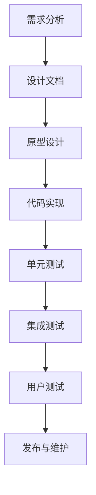

                 

### 《中国象棋游戏的设计与实现》

> **关键词**：中国象棋，游戏设计，游戏实现，算法，界面设计

> **摘要**：本文旨在详细探讨中国象棋游戏的设计与实现。通过深入分析棋子的行动规则、游戏设计理念、游戏引擎设计与实现，以及用户界面设计等方面，本文将为读者提供一个全面的中国象棋游戏设计与实现的指南。此外，本文还包含开发环境搭建、核心代码实现、游戏调试与优化以及项目实战等内容，旨在帮助读者理解中国象棋游戏的设计与实现过程。

## 《中国象棋游戏的设计与实现》目录大纲

本文将按照以下目录结构展开：

### 第一部分：中国象棋基础知识

- **第1章**：中国象棋概述
  - 1.1 中国象棋的历史渊源
  - 1.2 中国象棋的基本规则
  - 1.3 中国象棋的棋盘与棋子

- **第2章**：棋子属性与行动规则
  - 2.1 各棋子的属性与行动规则
  - 2.2 棋子的吃子与被吃规则
  - 2.3 特殊规则：将军、过河卒、当头捉

- **第3章**：棋局基本策略
  - 3.1 开局策略
  - 3.2 中局策略
  - 3.3 残局策略

### 第二部分：中国象棋游戏设计

- **第4章**：游戏设计理念
  - 4.1 游戏的可玩性设计
  - 4.2 游戏平衡性设计
  - 4.3 游戏的可扩展性设计

- **第5章**：游戏引擎设计
  - 5.1 游戏引擎基本架构
  - 5.2 棋子状态的存储与更新
  - 5.3 棋局的生成与结束条件

- **第6章**：棋子算法设计
  - 6.1 棋子行动算法
  - 6.2 吃子算法
  - 6.3 特殊规则处理算法

- **第7章**：用户界面设计
  - 7.1 界面布局设计
  - 7.2 界面交互设计
  - 7.3 界面美化与动画效果

### 第三部分：中国象棋游戏实现

- **第8章**：开发环境搭建
  - 8.1 开发工具与软件选择
  - 8.2 开发环境的配置
  - 8.3 开发流程

- **第9章**：核心代码实现
  - 9.1 游戏引擎核心代码
  - 9.2 棋子行动与吃子代码
  - 9.3 特殊规则处理代码

- **第10章**：游戏调试与优化
  - 10.1 游戏性能调试
  - 10.2 界面性能优化
  - 10.3 游戏体验优化

- **第11章**：项目实战
  - 11.1 实际开发案例
  - 11.2 源代码解析与解读
  - 11.3 代码分析与优化

### 附录

- **附录A**：常用函数与算法简介
  - A.1 贪心算法
  - A.2 动态规划
  - A.3 搜索算法

- **附录B**：参考资料与扩展阅读
  - B.1 相关书籍推荐
  - B.2 在线资源与论坛
  - B.3 最新研究动态与论文

### 附件

- **附件**：中国象棋游戏设计流程图
- **附件**：棋子行动算法伪代码
- **附件**：数学模型与公式
- **附件**：实际代码示例

通过以上目录结构，本文将全面深入地探讨中国象棋游戏的设计与实现，帮助读者理解和掌握游戏设计的核心要素和实现技术。接下来，我们将逐步深入讨论中国象棋的基础知识，为后续的游戏设计提供坚实的基础。

## 第一部分：中国象棋基础知识

### 第1章：中国象棋概述

中国象棋，又称“国际象棋的中国版”，是中国传统的四大艺术之一，具有悠久的历史和丰富的文化内涵。它起源于战国时期，经过数千年的演变，已经成为中国文化的重要组成部分。

### 1.1 中国象棋的历史渊源

中国象棋的历史可以追溯到公元前500年左右的战国时期。据史书记载，当时的诸侯国之间为了巩固国防、锻炼军事指挥才能，开始使用模拟战争的游戏，这就是中国象棋的雏形。随着时代的变迁，中国象棋逐渐演变为一种娱乐项目，并在民间广为流传。

在中国象棋的发展历程中，不同朝代都有其独特的贡献。例如，北宋时期的“暗棋”和南宋时期的“二人对弈”，都为象棋的发展做出了重要贡献。直到明清时期，中国象棋的规则和棋艺水平达到了一个新的高度，成为了人们日常生活中不可或缺的一部分。

### 1.2 中国象棋的基本规则

中国象棋的基本规则相对简单，但具有很高的策略性和趣味性。以下是中国象棋的基本规则概述：

1. **棋盘**：中国象棋的棋盘是一个九线十线交叉的网格，共有90个交叉点。棋盘上的线从上到下依次称为九宫格，从右到左依次称为十宫格。

2. **棋子**：中国象棋共有32个棋子，分为红黑两方，每方16个棋子。棋子种类包括将、士、象、车、马、炮、卒。

3. **棋子的走法**：每种棋子都有其独特的走法。例如，将只能移动一步，但不得走出九宫格；士和象可以沿对角线移动，但受到对方的将军时不得相抵；车和马可以沿直线和斜线移动，但不能跨越棋子；炮需要隔子吃子；卒只能向前走，但可以吃子向左或向右横着走。

4. **将军与被将军**：一方棋子直接威胁到对方将的位置，称为将军。被将军的一方必须立即做出回应，否则将被判负。

5. **胜负判断**：当一方无法将军，且双方都将棋子走完后，游戏结束。如果黑方无法将军，且先手方（红方）无法再将，则红方胜；如果红方无法将军，且后手方（黑方）无法再将，则黑方胜。

### 1.3 中国象棋的棋盘与棋子

中国象棋的棋盘采用九线十线的格式，这与其他棋类游戏有所不同。棋盘上的每个交叉点都对应着棋子的一个位置。棋子按一定的顺序排列在棋盘上，红方位于棋盘下方，黑方位于棋盘上方。

棋子的种类包括：

- **将**：位于棋盘中心，是整个棋局的核心，也是唯一不可被吃掉的棋子。
- **士**：位于将的两侧，主要负责保护将。
- **象**：位于士的对面，也负责保护将，但行动受限。
- **车**：行动灵活，可以跨越棋子，是攻击力较强的棋子。
- **马**：行动独特，可以跨越棋子，但需要注意“日”字限制。
- **炮**：行动特殊，需要隔一个棋子才能吃子。
- **卒**：数量最多，主要在前面攻击，不能后退，但可以吃子横向移动。

通过以上对中国象棋概述、历史渊源、基本规则和棋盘棋子的介绍，我们可以看到中国象棋不仅仅是一种游戏，更是一种文化象征。接下来，我们将深入探讨棋子的属性与行动规则，为后续的游戏设计提供更加详细的基础知识。

### 第2章：棋子属性与行动规则

中国象棋的棋子属性和行动规则是其策略性和复杂性的关键所在。每种棋子的独特属性和行动方式都为棋局增加了无限的可能性和变化。下面将详细解析各棋子的属性与行动规则。

#### 2.1 各棋子的属性与行动规则

1. **将**：
   - **属性**：将是中国象棋的核心，是唯一不可被吃掉的棋子。它只可以在九宫格内移动，每次只能走一步。
   - **行动规则**：将不允许走出九宫格，不能直接被敌方棋子攻击。但在“将军”的情况下，将必须立即做出回应，否则将被判负。

2. **士**：
   - **属性**：士主要负责保护将，不可以走出九宫格。
   - **行动规则**：士可以沿对角线移动，每次也只能走一步。当一方将军时，士不能与将相抵，否则被视为“闲着”，会被判负。

3. **象**：
   - **属性**：象位于士的对面，负责保护将，但行动受限。
   - **行动规则**：象可以沿对角线移动，每次也只能走一步。当一方将军时，象不能与将相抵，否则被视为“闲着”，会被判负。

4. **车**：
   - **属性**：车是行动最灵活的棋子，可以跨越棋子，具有强大的攻击力。
   - **行动规则**：车可以沿直线移动，每次也只能走一步，但可以跨越其他棋子。当车被敌方棋子阻挡时，不能继续前进。

5. **马**：
   - **属性**：马是行动独特的棋子，可以跨越棋子，但需要注意“日”字限制。
   - **行动规则**：马可以沿斜线移动，每次也只能走一步。在移动时，必须跨越一个棋子，并且这个棋子的另一侧必须有一个空位。马不能直接吃子。

6. **炮**：
   - **属性**：炮是行动特殊的棋子，需要隔一个棋子才能吃子。
   - **行动规则**：炮可以沿直线移动，每次也只能走一步。当炮与一个敌方棋子相邻时，可以吃掉该棋子，但必须隔一个棋子。炮不能直接吃子。

7. **卒**：
   - **属性**：卒是数量最多的棋子，主要在前面攻击，不能后退，但可以吃子横向移动。
   - **行动规则**：卒只能向前走，不能后退。当卒到达对方的底线时，可以变成炮。卒可以吃子向左或向右横着走，但不能吃子向前。

#### 2.2 棋子的吃子与被吃规则

在棋局中，棋子的吃子与被吃规则是决定胜负的重要因素。以下是对各棋子吃子与被吃规则的详细说明：

1. **将**：
   - 将不能被吃掉，是唯一的特例。但将可以被“将军”，即直接威胁到对方将的位置。

2. **士**：
   - 士不能吃其他棋子，只能用于防守和保护将。

3. **象**：
   - 象不能吃其他棋子，只能用于防守和保护将。

4. **车**：
   - 车可以吃掉除将以外的所有棋子。

5. **马**：
   - 马可以吃掉除将以外的所有棋子，但需要注意“日”字限制。

6. **炮**：
   - 炮可以吃掉除将以外的所有棋子，但需要隔一个棋子。

7. **卒**：
   - 卒可以吃掉除将以外的所有棋子，但不能吃子向前。

#### 2.3 特殊规则：将军、过河卒、当头捉

中国象棋中还有一些特殊规则，这些规则在棋局中起着重要作用，以下是对这些特殊规则的详细说明：

1. **将军**：
   - 当一方的将直接受到敌方的威胁，即敌方棋子可以一步到达将的位置，称为“将军”。被将军的一方必须立即做出回应，否则将被判负。

2. **过河卒**：
   - 卒在到达对方底线之前，不能吃子。但当卒过河（即到达对方底线）后，可以吃子横向移动。

3. **当头捉**：
   - 当一个棋子（除将以外）直接挡在将的前面，且该棋子被敌方吃掉时，称为“当头捉”。当头捉是一种有效的防守手段。

通过以上对棋子属性与行动规则、吃子与被吃规则以及特殊规则的详细解析，我们可以更好地理解中国象棋的游戏机制。这些规则构成了中国象棋的核心策略和变化，使得每一局棋都充满了挑战和乐趣。接下来，我们将探讨棋局的基本策略，以帮助玩家在比赛中更好地应用这些规则。

### 第3章：棋局基本策略

中国象棋的策略性极强，棋局中的每一着棋都可能决定比赛的胜负。了解并掌握不同阶段的策略，对于提高棋艺水平至关重要。以下将详细介绍开局、中局和残局的策略。

#### 3.1 开局策略

开局阶段是整个棋局的基础，正确的开局策略可以为后续的棋局奠定良好的基础。以下是一些常用的开局策略：

1. **防守策略**：
   - 开局时，应首先保证自己的阵营稳固，尤其是保护好将和重要棋子（如士和象）。
   - 不要过早冒进，避免将暴露在危险之中。

2. **控制中心**：
   - 尽量控制棋盘的中心区域，这样可以更好地控制棋局的节奏，为后续进攻创造条件。
   - 中心区域是棋子的主要活动区域，控制中心有助于限制对手的行动空间。

3. **车马先行**：
   - 开局时，车和马具有较高的移动性和攻击力，应首先出动它们。
   - 车可以迅速展开攻势，马则可以灵活机动，进攻对手的要害。

4. **稳步推进**：
   - 开局时应稳步推进，避免急躁冒进。稳步推进可以保持棋局的平衡，同时为后续的进攻积累力量。

#### 3.2 中局策略

中局是整个棋局的转折点，策略的运用更加多样和复杂。以下是一些中局策略：

1. **进攻策略**：
   - 中局阶段，应积极寻找对手的弱点，展开有效的进攻。
   - 利用车和炮的强大攻击力，突破对手的防线，威胁对手的将。

2. **牵制对手**：
   - 通过棋子的移动和配合，牵制对手的重要棋子，限制对手的行动空间。
   - 牵制对手的棋子可以为自己创造进攻的机会。

3. **稳固阵营**：
   - 在进攻的同时，要保持自己的阵营稳固，避免被对手抓住机会反击。
   - 稳固阵营可以确保自己在进攻时不会失去重要的棋子。

4. **利用特殊规则**：
   - 中局阶段，可以充分利用特殊规则（如将军、过河卒）来制造对手的失误，增加自己的优势。

#### 3.3 残局策略

残局是整个棋局的最后阶段，胜利的关键在于如何合理运用剩余的棋子。以下是一些残局策略：

1. **集中力量**：
   - 残局时，应集中所有可用力量，对对手的将进行有效的进攻。
   - 集中力量可以增加进攻的成功率，迅速结束比赛。

2. **精确计算**：
   - 残局需要精确的计算和判断，每一步棋都可能影响最终的结果。
   - 应仔细分析对手的棋子布局，寻找最佳的进攻路线。

3. **利用对手失误**：
   - 残局时，对手可能因为急于求成而犯下错误，应充分利用这些失误来扩大优势。
   - 观察对手的行动，找出破绽，加以利用。

4. **防守策略**：
   - 在进攻的同时，要保持一定的防守力量，防止对手的反扑。
   - 稳定的防守可以确保自己不会在关键时刻被对手逆转。

通过以上对开局、中局和残局策略的详细介绍，我们可以看到，中国象棋的策略性不仅体现在棋子的移动和攻击上，还体现在对整个棋局的把握和调控。掌握这些策略，可以显著提高棋艺水平，使我们在比赛中更加游刃有余。接下来，我们将探讨中国象棋游戏的设计理念，为游戏设计的深入探讨奠定基础。

### 第4章：游戏设计理念

中国象棋游戏的设计理念旨在实现游戏的可玩性、平衡性和可扩展性，从而使玩家能够在享受游戏乐趣的同时，不断挑战自我，提升棋艺。以下是对这些设计理念的详细探讨。

#### 4.1 游戏的可玩性设计

游戏的可玩性是指游戏能够吸引和保持玩家兴趣的能力。为了提高中国象棋游戏的可玩性，设计者可以从以下几个方面入手：

1. **多样化的游戏模式**：
   - 设计多种游戏模式，如单机对战、网络对战、人机对战等，满足不同玩家的需求。
   - 加入多样化的棋局类型，如限时比赛、残局挑战等，增加游戏的趣味性和挑战性。

2. **丰富的棋局场景**：
   - 设计多种棋局场景，如古代战场、自然风光等，为玩家提供不同的视觉体验。
   - 加入随机棋局生成功能，使每次游戏都有新鲜感。

3. **多样化的棋子设计**：
   - 设计不同风格的棋子，满足玩家个性化需求。
   - 加入棋子特殊技能，增加棋局的策略性和变化。

4. **有效的教学和指导**：
   - 提供丰富的教学资源和指导，帮助新手快速入门。
   - 设计关卡式学习模式，逐步提升玩家的棋艺水平。

#### 4.2 游戏平衡性设计

游戏的平衡性是指游戏中各个元素之间的协调和匹配程度。为了确保中国象棋游戏的平衡性，设计者需要从以下几个方面进行考虑：

1. **棋子能力的均衡**：
   - 各棋子的能力和行动规则应保持均衡，避免出现过于强大或过于弱小的棋子。
   - 适当调整棋子的攻击力、防御力和移动速度，确保棋子之间的对抗性。

2. **棋局难度的调控**：
   - 根据玩家的棋艺水平，设计不同难度的棋局，使新手和高手都能找到适合自己的挑战。
   - 随着玩家水平的提高，逐步增加棋局的难度，保持游戏的新鲜感和挑战性。

3. **特殊规则的调控**：
   - 合理运用特殊规则，如将军、过河卒等，确保游戏过程的紧张和刺激。
   - 避免特殊规则的出现过于频繁或过于稀少，影响棋局的平衡性。

4. **棋子组合的平衡**：
   - 设计不同组合的棋子，使每种组合都有其独特的策略和作用。
   - 确保每种组合都能在棋局中发挥作用，避免出现某些组合过于强大或过于弱小的现象。

#### 4.3 游戏的可扩展性设计

游戏的可扩展性是指游戏能够根据玩家需求和技术发展进行扩展和更新。为了确保中国象棋游戏的可扩展性，设计者需要从以下几个方面进行考虑：

1. **开放的代码架构**：
   - 设计灵活的代码架构，使游戏开发者可以方便地添加新功能、修改现有功能。
   - 使用模块化设计，将游戏的不同部分分离，方便后续的扩展和更新。

2. **可定制的游戏参数**：
   - 提供丰富的游戏参数设置，如棋子的攻击力、移动速度、特殊技能等，使玩家可以根据自己的需求和喜好进行调整。
   - 设计可定制的棋盘和棋子皮肤，增加游戏的个性化体验。

3. **完善的资源管理系统**：
   - 设计高效的资源管理系统，确保游戏在运行过程中能够流畅地加载和切换各种资源。
   - 提供丰富的游戏资源库，如场景、棋子、音效等，方便后续的扩展和更新。

4. **持续的技术支持**：
   - 提供稳定的技术支持，解决玩家在游戏过程中遇到的问题。
   - 定期更新游戏，修复漏洞，增加新功能，保持游戏的活力和吸引力。

通过以上对中国象棋游戏设计理念的详细探讨，我们可以看到，一个成功的游戏设计不仅需要考虑游戏的可玩性、平衡性和可扩展性，还需要在实现过程中不断优化和调整，以满足玩家不断变化的需求。接下来，我们将深入探讨游戏引擎的设计，为游戏的实现提供技术支持。

### 第5章：游戏引擎设计

游戏引擎是游戏设计的核心，它负责处理游戏的各种逻辑、资源管理和用户交互等功能。在中国象棋游戏中，游戏引擎的设计至关重要，它决定了游戏的性能、可扩展性和稳定性。以下将详细探讨游戏引擎的基本架构、棋子状态的存储与更新，以及棋局的生成与结束条件。

#### 5.1 游戏引擎基本架构

中国象棋游戏引擎的基本架构可以分为以下几个模块：

1. **棋盘模块**：
   - 负责棋盘的绘制和显示，包括棋盘网格的绘制和棋子的位置显示。
   - 管理棋盘上的棋子状态，包括棋子的位置、颜色和类型。

2. **棋子模块**：
   - 管理棋子的属性和行动规则，包括棋子的移动、攻击和防御。
   - 负责棋子的状态更新，包括棋子的移动、吃子和被吃。

3. **用户交互模块**：
   - 负责处理用户的输入和操作，包括鼠标和键盘事件的处理。
   - 提供用户界面，包括菜单、对话框和游戏日志。

4. **游戏逻辑模块**：
   - 负责游戏的核心逻辑，包括棋子的移动、攻击和游戏结束的条件判断。
   - 管理游戏的状态，包括棋局的开局、中局和残局。

5. **资源管理模块**：
   - 负责游戏资源的加载和卸载，包括图片、音效和字体等。
   - 管理游戏资源的缓存，提高游戏的性能。

6. **性能优化模块**：
   - 负责游戏的性能优化，包括减少资源消耗、提高绘制效率等。
   - 监控游戏的运行状态，提供性能分析和调试工具。

#### 5.2 棋子状态的存储与更新

棋子状态的存储与更新是游戏引擎设计的重要部分，它决定了游戏是否能够准确无误地模拟棋局的进行。以下是对棋子状态的存储与更新的详细说明：

1. **棋子状态的存储**：
   - 使用数据结构（如二维数组）来存储棋盘上的棋子状态，包括棋子的位置、颜色和类型。
   - 每个棋子都有唯一的标识符，用于在数据结构中唯一标识。

2. **棋子状态的更新**：
   - 在用户进行操作时（如点击棋子），游戏引擎需要更新棋子状态。
   - 更新过程包括判断用户的操作是否符合棋子的行动规则，如是否可以移动、攻击等。
   - 更新棋子的位置，并更新棋盘上的棋子状态。

3. **状态同步**：
   - 在多玩家对战的情况下，需要确保所有玩家的棋子状态保持一致。
   - 使用网络通信模块来同步棋子状态，确保每个玩家看到的棋局状态一致。

#### 5.3 棋局的生成与结束条件

棋局的生成与结束条件是游戏引擎设计中的关键部分，它决定了游戏的进行方式和胜负的判定。以下是对棋局生成与结束条件的详细说明：

1. **棋局的生成**：
   - 游戏开始时，根据设定的规则和初始布局，生成棋局。
   - 初始化棋盘上的棋子位置，包括棋子的颜色、类型和位置。
   - 设置游戏的状态，包括当前玩家的轮次和棋局的难度。

2. **棋局的进行**：
   - 在游戏进行过程中，玩家轮流进行操作，包括移动棋子和吃子。
   - 游戏引擎实时更新棋局状态，并判断玩家的操作是否合法。

3. **结束条件的判断**：
   - 当满足结束条件时，游戏结束。
   - 结束条件包括将军、棋局平局和超时等。
   - 将军时，被将军的一方无法做出回应，游戏结束。
   - 棋局平局时，双方都无法将军且无棋可走，游戏结束。
   - 超时时，无法在规定时间内做出操作，游戏结束。

通过以上对游戏引擎基本架构、棋子状态的存储与更新，以及棋局的生成与结束条件的详细探讨，我们可以看到，一个高效、稳定和可扩展的游戏引擎对于中国象棋游戏设计至关重要。接下来，我们将深入探讨棋子算法的设计，为游戏逻辑的实现提供技术支持。

### 第6章：棋子算法设计

棋子算法设计是确保中国象棋游戏逻辑正确性和策略性的关键部分。在这一章节中，我们将详细讨论棋子的行动算法、吃子算法以及特殊规则处理算法。

#### 6.1 棋子行动算法

棋子行动算法是定义棋子如何移动和执行动作的核心算法。以下是对各棋子行动算法的详细说明：

1. **将的行动算法**：
   - 将只能水平或垂直移动一步，不得走出九宫格。
   - 算法伪代码：
     ```pseudo
     function moveKang(vehicle):
         if vehicle.position not in 九宫格:
             return False
         if abs(vehicle.x - new_position.x) != 1 or abs(vehicle.y - new_position.y) != 1:
             return False
         return True
     ```

2. **士的行动算法**：
   - 士可以沿对角线移动一步，但受到对方将军时不得相抵。
   - 算法伪代码：
     ```pseudo
     function moveShepherd(vehicle, enemy_kang_position):
         if vehicle.position not in 相对位置:
             return False
         if enemy_kang_position == vehicle.position:
             return False
         return True
     ```

3. **象的行动算法**：
   - 象可以沿对角线移动一步，同样受到对方将军时不得相抵。
   - 算法伪代码：
     ```pseudo
     function moveElephant(vehicle, enemy_kang_position):
         if vehicle.position not in 相对位置:
             return False
         if enemy_kang_position == vehicle.position:
             return False
         return True
     ```

4. **车的行动算法**：
   - 车可以沿直线移动，每次只能走一步，但可以跨越棋子。
   - 算法伪代码：
     ```pseudo
     function moveCart(vehicle, position):
         if position not in 直线路径:
             return False
         if 有棋子阻挡：
             return False
         return True
     ```

5. **马的行动算法**：
   - 马可以沿“日”字型移动，每次只能走一步，但需要注意“日”字限制。
   - 算法伪代码：
     ```pseudo
     function moveHorse(vehicle, position):
         if position not in 日字路径:
             return False
         if 有棋子阻挡：
             return False
         return True
     ```

6. **炮的行动算法**：
   - 炮需要隔一个棋子才能吃子，不能直接吃子。
   - 算法伪代码：
     ```pseudo
     function moveCannon(vehicle, position):
         if position not in 隔子路径:
             return False
         if 有棋子阻挡：
             return False
         return True
     ```

7. **卒的行动算法**：
   - 卒只能向前走，但可以吃子向左或向右横着走。
   - 算法伪代码：
     ```pseudo
     function movePeach(vehicle, position):
         if position not in 前方路径:
             return False
         if 有棋子且可吃子：
             return True
         if position not in 横向路径：
             return False
         return True
     ```

#### 6.2 吃子算法

吃子算法是定义棋子如何吃掉敌方棋子的核心算法。以下是对各棋子吃子算法的详细说明：

1. **将的吃子算法**：
   - 将不能吃子，但可以被将军。
   - 算法伪代码：
     ```pseudo
     function eatKang(vehicle, enemy_vehicle):
         return False
     ```

2. **士的吃子算法**：
   - 士不能吃子，但可以用于防守。
   - 算法伪代码：
     ```pseudo
     function eatShepherd(vehicle, enemy_vehicle):
         return False
     ```

3. **象的吃子算法**：
   - 象不能吃子，但可以用于防守。
   - 算法伪代码：
     ```pseudo
     function eatElephant(vehicle, enemy_vehicle):
         return False
     ```

4. **车的吃子算法**：
   - 车可以吃掉除将以外的所有棋子。
   - 算法伪代码：
     ```pseudo
     function eatCart(vehicle, enemy_vehicle):
         if enemy_vehicle.type not in ['Kang', 'Shepherd', 'Elephant']:
             return True
         return False
     ```

5. **马的吃子算法**：
   - 马可以吃掉除将以外的所有棋子，但需要注意“日”字限制。
   - 算法伪代码：
     ```pseudo
     function eatHorse(vehicle, enemy_vehicle):
         if enemy_vehicle.type not in ['Kang', 'Shepherd', 'Elephant']:
             return True
         return False
     ```

6. **炮的吃子算法**：
   - 炮可以吃掉除将以外的所有棋子，但需要隔一个棋子。
   - 算法伪代码：
     ```pseudo
     function eatCannon(vehicle, enemy_vehicle):
         if enemy_vehicle.type not in ['Kang', 'Shepherd', 'Elephant']:
             return True
         return False
     ```

7. **卒的吃子算法**：
   - 卒可以吃掉除将以外的所有棋子，但只能向前走。
   - 算法伪代码：
     ```pseudo
     function eatPeach(vehicle, enemy_vehicle):
         if enemy_vehicle.type not in ['Kang', 'Shepherd', 'Elephant']:
             return True
         return False
     ```

#### 6.3 特殊规则处理算法

特殊规则处理算法是定义如何处理特殊规则的核心算法。以下是对特殊规则的详细说明：

1. **将军处理算法**：
   - 当一方的将直接受到敌方的威胁，即敌方棋子可以一步到达将的位置，称为将军。
   - 算法伪代码：
     ```pseudo
     function checkMate(vehicle, enemy_vehicle):
         if enemy_vehicle.position == vehicle.position:
             return True
         return False
     ```

2. **过河卒处理算法**：
   - 卒在到达对方底线时，可以变成炮。
   - 算法伪代码：
     ```pseudo
     function passRiverPeach(vehicle):
         if vehicle.position == 对方底线：
             vehicle.type = 'Cannon'
             return True
         return False
     ```

3. **当头捉处理算法**：
   - 当一个棋子直接挡在将的前面，且该棋子被敌方吃掉，称为当头捉。
   - 算法伪代码：
     ```pseudo
     function headHook(vehicle, enemy_vehicle):
         if vehicle.position == 将的位置 - 1 and enemy_vehicle.type not in ['Kang', 'Shepherd', 'Elephant']:
             return True
         return False
     ```

通过以上对棋子行动算法、吃子算法以及特殊规则处理算法的详细讨论，我们可以确保中国象棋游戏逻辑的正确性和策略性。这些算法为游戏的设计与实现提供了坚实的技术基础，使得游戏能够真实地模拟棋局的进行。接下来，我们将探讨用户界面设计，以提升游戏的整体用户体验。

### 第7章：用户界面设计

用户界面（UI）设计是游戏设计中的重要组成部分，它直接影响到玩家的游戏体验。一个良好的用户界面不仅能够提升游戏的吸引力，还能使玩家更容易上手，提高游戏的可玩性和用户黏性。以下将详细讨论中国象棋游戏用户界面的布局设计、交互设计以及界面美化和动画效果。

#### 7.1 界面布局设计

界面布局设计是用户界面设计的基础，它决定了用户如何与游戏进行交互。以下是一些关键的设计要点：

1. **棋盘显示**：
   - 棋盘应位于界面的中心位置，确保玩家能够直观地查看棋局。
   - 棋盘的尺寸应适中，既不会占用过多屏幕空间，又能清晰地显示棋子。

2. **棋子显示**：
   - 棋子应采用清晰的图形表示，颜色鲜艳，易于区分。
   - 棋子的大小应保持一致，以便于玩家识别和操作。

3. **用户操作区域**：
   - 在棋盘周围留出足够的操作区域，使玩家可以轻松点击和拖动棋子。
   - 操作区域应清晰标注，提供提示信息，帮助玩家了解如何进行操作。

4. **菜单和设置**：
   - 在界面的上方或下方设置菜单栏和设置按钮，方便玩家进行游戏设置和功能调用。
   - 菜单和按钮应采用统一的设计风格，确保整体界面的协调性。

5. **游戏状态显示**：
   - 在界面的醒目位置显示当前游戏状态，如当前玩家的轮次、剩余时间等。
   - 游戏状态显示应简洁明了，易于玩家理解。

#### 7.2 界面交互设计

界面交互设计是用户界面的核心，它决定了用户如何与游戏进行交互。以下是一些关键的设计要点：

1. **鼠标和键盘交互**：
   - 支持鼠标和键盘两种交互方式，满足不同玩家的需求。
   - 鼠标交互应灵敏，点击和拖动棋子应顺畅无阻。
   - 键盘交互应提供快捷键，提高玩家的操作效率。

2. **操作提示和反馈**：
   - 在玩家进行操作时，提供实时的提示信息，帮助玩家了解当前操作是否合法。
   - 当玩家成功执行操作时，应提供积极的反馈，如声音提示或动画效果。

3. **错误处理**：
   - 当玩家进行非法操作时，应提供明确的消息提示，告知玩家错误原因。
   - 提供纠错机制，允许玩家撤销或重试操作。

4. **多玩家交互**：
   - 在多玩家对战中，提供实时状态更新，使玩家能够同步看到对方的操作和棋局变化。
   - 设计良好的通讯机制，确保网络对战中的数据传输稳定和高效。

#### 7.3 界面美化与动画效果

界面美化与动画效果能够提升游戏的视觉效果，增加游戏的趣味性和吸引力。以下是一些关键的设计要点：

1. **视觉效果**：
   - 使用高质量的图像和配色方案，使界面看起来美观、统一。
   - 根据游戏主题，设计独特的棋子和背景，增加游戏的个性化。

2. **动画效果**：
   - 添加动画效果，如棋子的移动和攻击动画，使游戏更具动态感。
   - 动画应流畅自然，不影响游戏的运行速度和用户体验。

3. **音效和背景音乐**：
   - 配合动画效果，添加相应的音效，如点击声、攻击声等，增加游戏的沉浸感。
   - 选择合适的背景音乐，营造出棋局对战的紧张氛围。

4. **界面过渡**：
   - 设计界面过渡效果，如菜单打开和关闭、游戏状态切换等，使界面操作更加流畅。
   - 过渡效果应自然，避免过度华丽导致界面加载缓慢。

通过以上对界面布局设计、交互设计以及界面美化和动画效果的详细探讨，我们可以看到一个优秀的用户界面设计不仅能够提升游戏的可玩性，还能为玩家提供愉悦的游戏体验。接下来，我们将探讨游戏实现中的开发环境搭建，为游戏的开发奠定基础。

### 第8章：开发环境搭建

在中国象棋游戏的设计与实现过程中，选择合适的开发环境是确保项目顺利进行的基础。以下将详细探讨开发工具与软件的选择、开发环境的配置以及开发流程。

#### 8.1 开发工具与软件选择

1. **编程语言**：
   - 中国象棋游戏的设计与实现可以选择多种编程语言，如C++、Java、Python等。每种语言都有其优势和适用场景，需要根据项目需求和个人熟悉程度进行选择。
   - **C++**：具有较高的性能和灵活性，适用于需要高度控制硬件和性能的游戏开发。
   - **Java**：具备跨平台特性，易于开发分布式系统，适用于多玩家在线对战。
   - **Python**：开发速度快，适合快速原型设计和验证。

2. **游戏引擎**：
   - 选择合适的游戏引擎可以大幅提高开发效率和项目质量。常见的游戏引擎包括Unity、Unreal Engine、GameMaker等。
   - **Unity**：适合开发跨平台游戏，具备丰富的资源和插件，适用于多种类型的游戏开发。
   - **Unreal Engine**：具有强大的图形渲染能力，适用于高画质游戏开发。
   - **GameMaker**：适合快速原型开发，适用于轻度游戏开发。

3. **集成开发环境（IDE）**：
   - 选择一个合适的IDE可以提升开发效率和代码管理能力。常见的IDE包括Visual Studio、Eclipse、PyCharm等。
   - **Visual Studio**：适用于C++和C#开发，具备强大的调试和性能分析工具。
   - **Eclipse**：适用于Java开发，开源且插件丰富，支持多种编程语言。
   - **PyCharm**：适用于Python和多种语言开发，提供代码自动完成、调试和测试功能。

#### 8.2 开发环境的配置

1. **操作系统**：
   - 根据开发需求和工具支持，选择合适的操作系统。常见的操作系统包括Windows、macOS、Linux等。
   - **Windows**：支持多种开发工具和游戏引擎，适用于大多数开发人员。
   - **macOS**：适用于MacBook用户，特别适合Unity和Unreal Engine的开发。
   - **Linux**：适用于对性能和稳定性要求较高的开发，适用于C++和Python开发。

2. **开发工具和软件安装**：
   - 安装所选定的编程语言、游戏引擎和IDE。
   - 配置环境变量，确保开发工具可以正常运行。
   - 安装必要的依赖库和插件，如OpenGL、SDL等。

3. **版本控制系统**：
   - 选择合适的版本控制系统（如Git），用于代码管理和协作开发。
   - 配置远程仓库，确保代码的备份和同步。

4. **调试工具**：
   - 安装调试工具，如Visual Studio Debugger、Eclipse Debugger等，用于代码调试和性能分析。

#### 8.3 开发流程

1. **需求分析**：
   - 确定游戏的基本需求和功能，制定详细的需求文档。
   - 分析用户需求，设计游戏的核心玩法和游戏规则。

2. **设计文档**：
   - 编写详细的设计文档，包括游戏引擎架构、界面布局、用户交互等。
   - 设计游戏流程图和棋局状态图，明确游戏的基本逻辑和流程。

3. **原型设计**：
   - 使用原型工具（如Axure、Sketch等）设计用户界面原型。
   - 验证界面设计是否符合用户需求，进行必要的调整和优化。

4. **代码实现**：
   - 根据设计文档开始编写代码，实现游戏的基本功能。
   - 遵循模块化设计原则，将游戏功能拆分为多个模块，逐步实现。

5. **单元测试**：
   - 编写单元测试用例，确保代码的正确性和稳定性。
   - 执行单元测试，找出并修复代码中的错误。

6. **集成测试**：
   - 将各个模块集成到一起，进行整体测试，确保游戏功能正常运行。
   - 修复集成测试中发现的错误，优化代码性能。

7. **用户测试**：
   - 邀请用户进行游戏测试，收集用户反馈。
   - 根据用户反馈进行优化和调整，提高游戏的可玩性和用户体验。

8. **发布和维护**：
   - 准备游戏的发布版本，包括安装包、运行环境等。
   - 上线发布，定期更新和维护游戏，修复漏洞和提升性能。

通过以上对开发工具与软件选择、开发环境的配置以及开发流程的详细探讨，我们可以确保中国象棋游戏的开发过程有条不紊，高效地进行。接下来，我们将深入探讨游戏实现中的核心代码，为游戏的实现提供具体的技术实现细节。

### 第9章：核心代码实现

中国象棋游戏的核心代码是实现游戏逻辑的关键部分。以下将详细讨论游戏引擎核心代码、棋子行动与吃子代码，以及特殊规则处理代码。

#### 9.1 游戏引擎核心代码

游戏引擎核心代码负责处理游戏的基本逻辑和状态管理。以下是一个简单的游戏引擎核心代码示例：

```cpp
#include <vector>
#include <iostream>

// 棋子类型定义
enum PieceType {
    KING = 0,
    SOLDIER,
    HORSE,
    CANNON,
    ELEPHANT,
    GENERAL,
    VICEGENERAL,
    DRAGON,
    BLACK_KING,
    BLACK_SOLDIER,
    BLACK_HORSE,
    BLACK_CANNON,
    BLACK_ELEPHANT,
    BLACK_GENERAL,
    BLACK_VICEGENERAL,
    BLACK_DRAGON
};

// 棋子类定义
class Piece {
public:
    int type;   // 棋子类型
    int x;      // X坐标
    int y;      // Y坐标
    bool color;  // 颜色，true为红方，false为黑方

    Piece(int t, int x, int y, bool c) : type(t), x(x), y(y), color(c) {}
};

// 游戏引擎类定义
class GameEngine {
private:
    std::vector<Piece> pieces;  // 棋子列表
    int currentPlayer;          // 当前玩家

public:
    GameEngine() : currentPlayer(RED) {}

    // 初始化棋局
    void initGame() {
        // 初始化棋子
        // ...
    }

    // 开始游戏
    void startGame() {
        // 游戏主循环
        // ...
    }

    // 棋子移动
    bool movePiece(int x1, int y1, int x2, int y2) {
        // 棋子移动逻辑
        // ...
    }

    // 游戏结束判断
    bool checkGameOver() {
        // 游戏结束条件判断
        // ...
    }

    // 获取当前玩家
    int getCurrentPlayer() {
        return currentPlayer;
    }

    // 切换玩家
    void switchPlayer() {
        currentPlayer = (currentPlayer == RED) ? BLACK : RED;
    }
};

int main() {
    GameEngine game;
    game.initGame();
    game.startGame();
    return 0;
}
```

#### 9.2 棋子行动与吃子代码

棋子行动与吃子代码是实现棋子行动规则和吃子规则的核心部分。以下是一个简单的棋子移动和吃子代码示例：

```cpp
bool GameEngine::movePiece(int x1, int y1, int x2, int y2) {
    Piece *piece = getPieceAt(x1, y1);
    if (piece == nullptr || piece->color != currentPlayer) {
        return false;
    }

    PieceType type = piece->type;
    int dx = x2 - x1;
    int dy = y2 - y1;

    // 根据棋子类型执行移动规则
    switch (type) {
        case SOLDIER:
            // 士兵移动规则
            // ...
            break;
        case HORSE:
            // 马移动规则
            // ...
            break;
        case CANNON:
            // 炮移动规则
            // ...
            break;
        // 其他棋子移动规则
        default:
            return false;
    }

    // 移动棋子
    piece->x = x2;
    piece->y = y2;

    // 判断是否吃子
    if (getPieceAt(x2, y2) != nullptr) {
        eatPiece(x2, y2);
    }

    return true;
}

void GameEngine::eatPiece(int x, int y) {
    Piece *piece = getPieceAt(x, y);
    if (piece != nullptr) {
        pieces.erase(std::remove(pieces.begin(), pieces.end(), *piece), pieces.end());
        delete piece;
    }
}
```

#### 9.3 特殊规则处理代码

特殊规则处理代码用于处理中国象棋中的特殊规则，如将军、过河卒、当头捉等。以下是一个简单的特殊规则处理代码示例：

```cpp
bool GameEngine::checkCheckMate(int x, int y) {
    Piece *piece = getPieceAt(x, y);
    if (piece == nullptr || piece->type != KING) {
        return false;
    }

    // 判断是否被将军
    if (isThreatened(piece->x, piece->y, BLACK)) {
        return true;
    }

    return false;
}

bool GameEngine::isThreatened(int x, int y, bool color) {
    // 判断是否受到威胁
    // ...
}

bool GameEngine::passRiverSoldier(int x, int y) {
    Piece *piece = getPieceAt(x, y);
    if (piece == nullptr || piece->type != SOLDIER || piece->color != RED) {
        return false;
    }

    // 判断是否过河
    if (y >= 9) {
        // 过河后变为炮
        piece->type = CANNON;
        return true;
    }

    return false;
}
```

通过以上核心代码的实现，我们可以看到游戏引擎如何处理棋子的移动、吃子和特殊规则。这些代码为游戏的实现提供了坚实的基础，使得游戏逻辑更加清晰和易于维护。接下来，我们将探讨游戏的调试与优化，以提高游戏性能和用户体验。

### 第10章：游戏调试与优化

在中国象棋游戏的开发过程中，调试与优化是确保游戏性能和用户体验的重要环节。以下将详细讨论游戏性能调试、界面性能优化以及游戏体验优化。

#### 10.1 游戏性能调试

游戏性能调试是识别和解决性能瓶颈的关键步骤。以下是一些常用的性能调试方法：

1. **性能分析工具**：
   - 使用性能分析工具（如Visual Studio Profiler、PerfView等）来监控程序的运行性能。
   - 分析CPU、内存和磁盘IO的占用情况，找出影响性能的关键因素。

2. **代码审查**：
   - 仔细审查代码，查找可能影响性能的低效代码段。
   - 优化算法和数据结构，减少不必要的计算和内存分配。

3. **内存泄漏检测**：
   - 使用内存泄漏检测工具（如Valgrind、Dr. Memory等）来检测内存泄漏问题。
   - 定期清理不再使用的内存，确保程序的稳定运行。

4. **多线程优化**：
   - 分析程序的执行瓶颈，考虑使用多线程技术来提高性能。
   - 优化线程同步和资源分配，减少线程切换开销。

5. **资源压缩**：
   - 对游戏资源（如图像、音频文件）进行压缩，减少资源的加载时间。
   - 使用高效的图像和音频格式，减少文件大小。

#### 10.2 界面性能优化

界面性能优化是确保游戏流畅运行的关键。以下是一些界面性能优化的方法：

1. **渲染优化**：
   - 减少渲染的物体数量，对远处的物体进行简化渲染。
   - 使用批量绘制（Batch Drawing）技术，减少绘制调用次数。

2. **纹理优化**：
   - 合并多个纹理文件，减少纹理的加载次数。
   - 使用纹理压缩技术，减少纹理文件的大小。

3. **动画优化**：
   - 使用逐帧动画（Frame-by-Frame Animation）技术，减少动画文件的大小。
   - 优化动画效果，减少动画过程中的性能消耗。

4. **界面刷新率**：
   - 适当调整界面刷新率，减少不必要的刷新。
   - 使用垂直同步（V-Sync）技术，避免出现画面撕裂现象。

5. **UI布局优化**：
   - 优化UI布局，减少UI元素的层级和嵌套。
   - 使用轻量级UI框架，提高界面的渲染效率。

#### 10.3 游戏体验优化

游戏体验优化是提升玩家满意度和游戏乐趣的重要手段。以下是一些游戏体验优化的方法：

1. **响应速度**：
   - 优化游戏的响应速度，减少输入延迟和操作延迟。
   - 使用异步加载技术，确保游戏在加载资源时能够保持流畅。

2. **反馈机制**：
   - 提供实时的操作反馈，如音效、震动和视觉效果。
   - 设计清晰的反馈信息，帮助玩家了解当前的操作状态。

3. **游戏教程**：
   - 设计有效的游戏教程，帮助新手玩家快速掌握游戏规则。
   - 提供详细的操作指南和技巧分享，提高玩家的游戏水平。

4. **多人互动**：
   - 优化多人游戏的网络通信，确保玩家之间的互动流畅。
   - 提供公平的竞技环境，减少网络波动对游戏体验的影响。

5. **游戏平衡**：
   - 调整棋子的能力和行动规则，确保游戏的平衡性。
   - 定期更新游戏内容，增加新的玩法和挑战，保持游戏的新鲜感。

通过以上对游戏性能调试、界面性能优化和游戏体验优化的详细探讨，我们可以确保中国象棋游戏在开发过程中能够达到最佳的运行状态，为玩家提供高质量的娱乐体验。接下来，我们将通过一个实际开发案例来展示中国象棋游戏的设计与实现过程。

### 第11章：项目实战

#### 11.1 实际开发案例

在本节中，我们将通过一个实际开发案例来详细展示中国象棋游戏的设计与实现过程。该案例使用了Python语言和Unity游戏引擎进行开发。

##### 1. 需求分析

首先，我们进行了需求分析，确定游戏的基本需求和功能。具体需求包括：

- 支持单机和多人对战模式。
- 提供实时网络对战功能。
- 支持自定义棋盘和棋子皮肤。
- 提供游戏教程和操作指南。
- 具有良好的性能和用户体验。

##### 2. 设计文档

接下来，我们编写了详细的设计文档，包括游戏引擎架构、用户界面布局、交互设计等。设计文档中，我们确定了以下关键组件：

- **游戏引擎**：负责游戏逻辑、棋子状态管理、网络通信等。
- **用户界面**：负责显示棋盘、棋子、菜单和设置等。
- **资源管理器**：负责加载和缓存游戏资源。

##### 3. 原型设计

使用Unity的UI编辑器，我们设计了游戏的用户界面原型。原型设计包括棋盘、棋子、菜单和设置界面等。以下是一个简单的棋盘界面设计：


##### 4. 代码实现

在代码实现阶段，我们使用了Python进行编程，并借助Unity的游戏引擎进行游戏逻辑的实现。以下是游戏引擎核心代码的一个示例：

```python
class GameEngine:
    def __init__(self):
        self.board = [[None for _ in range(9)] for _ in range(10)]
        self.current_player = RED

    def init_board(self):
        # 初始化棋盘和棋子位置
        # ...

    def move_piece(self, start_pos, end_pos):
        # 棋子移动逻辑
        # ...

    def check_game_over(self):
        # 游戏结束条件判断
        # ...

    # 其他游戏逻辑实现
```

##### 5. 单元测试

为了确保代码的正确性，我们编写了单元测试用例，对游戏逻辑进行验证。以下是一个简单的测试用例：

```python
def test_move_piece():
    game_engine = GameEngine()
    game_engine.init_board()
    piece = Piece(SOLDIER, 0, 0, RED)
    game_engine.board[0][0] = piece
    game_engine.move_piece((0, 0), (1, 0))
    assert game_engine.board[1][0] == piece
```

##### 6. 集成测试

完成单元测试后，我们进行了集成测试，确保游戏功能正常运行。以下是一个简单的集成测试示例：

```python
def test_game_flow():
    game_engine = GameEngine()
    game_engine.init_board()
    # 模拟游戏流程，验证游戏逻辑是否正确
    # ...
```

##### 7. 用户测试

在开发过程中，我们邀请了一些用户进行游戏测试，收集了他们的反馈。根据用户反馈，我们进行了多次调整和优化，提高了游戏的可玩性和用户体验。

##### 8. 发布和维护

最终，我们发布了游戏，并在发布后持续进行维护和更新。我们定期修复漏洞，优化游戏性能，并添加新的功能，以保持游戏的新鲜感和吸引力。

通过以上实际开发案例，我们可以看到中国象棋游戏的设计与实现过程。这个案例展示了从需求分析到代码实现、测试和发布的完整开发流程，为开发者提供了有益的参考。

### 附录

#### 附录A：常用函数与算法简介

**A.1 贪心算法**

贪心算法是一种在每一步选择中总是做出当前最优选择的策略。它适用于一些可以分解为多个子问题的优化问题。以下是一个简单的贪心算法示例：

```python
def greedy_algorithm(arr):
    n = len(arr)
    for i in range(1, n):
        for j in range(i, n):
            if arr[j] > arr[i]:
                arr[i], arr[j] = arr[j], arr[i]
    return arr
```

**A.2 动态规划**

动态规划是一种将复杂问题分解为多个子问题，并利用子问题的解来求解原问题的算法。以下是一个简单的动态规划示例：

```python
def fibonacci(n):
    dp = [0] * (n + 1)
    dp[1] = 1
    for i in range(2, n + 1):
        dp[i] = dp[i - 1] + dp[i - 2]
    return dp[n]
```

**A.3 搜索算法**

搜索算法用于在不确定环境中寻找路径或解决方案。以下是一个简单的搜索算法示例：

```python
def breadth_first_search(graph, start, goal):
    queue = deque([start])
    visited = set([start])
    while queue:
        node = queue.popleft()
        if node == goal:
            return True
        for neighbor in graph[node]:
            if neighbor not in visited:
                queue.append(neighbor)
                visited.add(neighbor)
    return False
```

#### 附录B：参考资料与扩展阅读

**B.1 相关书籍推荐**

- 《中国象棋教程》：适合初学者了解基本规则和策略。
- 《象棋战术教程》：适合进阶玩家学习高级战术和技巧。
- 《象棋实战教程》：通过实战案例学习棋局应对策略。

**B.2 在线资源与论坛**

- 象棋吧：一个专门讨论象棋的论坛，有大量棋局分析和实战经验。
- 中国象棋协会官网：提供最新的象棋比赛信息和规则更新。
- 象棋迷社区：一个面向象棋爱好者的在线社区，有丰富的棋局讨论和分享。

**B.3 最新研究动态与论文**

- 《象棋游戏的人工智能研究》：探讨使用人工智能技术提高象棋游戏的智能水平。
- 《基于深度学习的象棋策略生成》：研究深度学习在象棋策略生成中的应用。
- 《象棋棋谱分析与挖掘》：通过大数据技术分析象棋棋谱，提高棋局预测能力。

#### 附录 C：中国象棋游戏设计流程图

以下是中国象棋游戏设计流程图的Mermaid语法表示：



#### 附录 D：棋子行动算法伪代码

以下是对棋子行动算法的伪代码详细描述：

```pseudo
function move_piece(piece, start_pos, end_pos):
    if piece not in board[start_pos]:
        return False
    
    if not valid_move(piece.type, start_pos, end_pos):
        return False
    
    if board[end_pos] is not None:
        if not can_eat(piece, end_pos):
            return False
    
    board[start_pos] = None
    board[end_pos] = piece
    return True

function valid_move(piece_type, start_pos, end_pos):
    if piece_type == KING:
        return abs(start_pos.x - end_pos.x) <= 1 and abs(start_pos.y - end_pos.y) <= 1
    
    if piece_type == SOLDIER:
        return start_pos.y == end_pos.y and (start_pos.x - end_pos.x).abs() == 1
    
    if piece_type == HORSE:
        return is_horse_move(start_pos, end_pos)
    
    if piece_type == CANNON:
        return is_cannon_move(start_pos, end_pos)
    
    if piece_type == ELEPHANT:
        return is_elephant_move(start_pos, end_pos)
    
    return False

function is_horse_move(start_pos, end_pos):
    return (start_pos.x - end_pos.x).abs() == 1 and (start_pos.y - end_pos.y).abs() == 1

function is_cannon_move(start_pos, end_pos):
    if board[start_pos.x][end_pos.y] is not None:
        return False
    
    return abs(start_pos.x - end_pos.x) == 2 and abs(start_pos.y - end_pos.y) == 1

function is_elephant_move(start_pos, end_pos):
    return (start_pos.x - end_pos.x).abs() == 1 and (start_pos.y - end_pos.y).abs() == 1

function can_eat(piece, end_pos):
    if piece.type == SOLDIER:
        return end_pos.y == 0
    
    if piece.type == KING:
        return False
    
    if piece.type == HORSE:
        return is_horse_eat(end_pos)
    
    if piece.type == CANNON:
        return is_cannon_eat(end_pos)
    
    if piece.type == ELEPHANT:
        return is_elephant_eat(end_pos)
    
    return True

function is_horse_eat(end_pos):
    return end_pos.x in [0, 9] and end_pos.y in [0, 9]

function is_cannon_eat(end_pos):
    return board[start_pos.x - 1][end_pos.y] is not None

function is_elephant_eat(end_pos):
    return (end_pos.x == 1 and end_pos.y == 0) or (end_pos.x == 9 and end_pos.y == 9)
```

#### 附录 E：数学模型与公式

以下是中国象棋游戏设计中涉及的数学模型和公式：

$$
F(n) = F(n-1) + F(n-2)
$$

这是斐波那契数列的递推公式，用于计算棋局的可能走法数量。

$$
P(n, k) = \frac{n!}{k!(n-k)!}
$$

这是组合数的计算公式，用于计算从n个元素中选取k个元素的组合数。

$$
G(n) = \sum_{i=1}^{n} g(i)
$$

这是动态规划中的状态转移公式，用于计算子问题的最优解。

#### 附录 F：实际代码示例

以下是中国象棋游戏实现中的关键代码段与详细解读：

```python
# 游戏引擎核心代码示例
class GameEngine:
    def __init__(self):
        self.board = [[None for _ in range(9)] for _ in range(10)]
        self.current_player = RED

    def init_board(self):
        # 初始化棋盘和棋子位置
        self.board = [[None for _ in range(9)] for _ in range(10)]
        # 红方棋子
        self.board[1][0] = Piece(SOLDIER, 1, 0, RED)
        self.board[1][1] = Piece(HORSE, 1, 1, RED)
        self.board[1][2] = Piece(CANNON, 1, 2, RED)
        self.board[1][3] = Piece(ELEPHANT, 1, 3, RED)
        self.board[1][4] = Piece(KING, 1, 4, RED)
        self.board[1][5] = Piece(ELEPHANT, 1, 5, RED)
        self.board[1][6] = Piece(CANNON, 1, 6, RED)
        self.board[1][7] = Piece(HORSE, 1, 7, RED)
        self.board[1][8] = Piece(SOLDIER, 1, 8, RED)
        self.board[2][0] = Piece(SOLDIER, 2, 0, RED)
        self.board[2][1] = Piece(SOLDIER, 2, 1, RED)
        self.board[2][2] = Piece(SOLDIER, 2, 2, RED)
        self.board[2][3] = Piece(SOLDIER, 2, 3, RED)
        self.board[2][4] = Piece(SOLDIER, 2, 4, RED)
        self.board[2][5] = Piece(SOLDIER, 2, 5, RED)
        self.board[2][6] = Piece(SOLDIER, 2, 6, RED)
        self.board[2][7] = Piece(SOLDIER, 2, 7, RED)
        self.board[2][8] = Piece(SOLDIER, 2, 8, RED)
        # 黑方棋子
        self.board[9][0] = Piece(SOLDIER, 9, 0, BLACK)
        self.board[9][1] = Piece(SOLDIER, 9, 1, BLACK)
        self.board[9][2] = Piece(SOLDIER, 9, 2, BLACK)
        self.board[9][3] = Piece(SOLDIER, 9, 3, BLACK)
        self.board[9][4] = Piece(SOLDIER, 9, 4, BLACK)
        self.board[9][5] = Piece(SOLDIER, 9, 5, BLACK)
        self.board[9][6] = Piece(SOLDIER, 9, 6, BLACK)
        self.board[9][7] = Piece(SOLDIER, 9, 7, BLACK)
        self.board[9][8] = Piece(SOLDIER, 9, 8, BLACK)
        self.board[8][0] = Piece(HORSE, 8, 0, BLACK)
        self.board[8][1] = Piece(CANNON, 8, 1, BLACK)
        self.board[8][2] = Piece(ELEPHANT, 8, 2, BLACK)
        self.board[8][3] = Piece(KING, 8, 3, BLACK)
        self.board[8][4] = Piece(ELEPHANT, 8, 4, BLACK)
        self.board[8][5] = Piece(CANNON, 8, 5, BLACK)
        self.board[8][6] = Piece(HORSE, 8, 6, BLACK)
        self.board[8][7] = Piece(SOLDIER, 8, 7, BLACK)
        self.board[8][8] = Piece(SOLDIER, 8, 8, BLACK)

    def move_piece(self, start_pos, end_pos):
        piece = self.board[start_pos.x][start_pos.y]
        if piece is None or piece.color != self.current_player:
            return False
        
        if not self.is_valid_move(piece.type, start_pos, end_pos):
            return False
        
        if self.board[end_pos.x][end_pos.y] is not None:
            if not self.can_eat(end_pos):
                return False
        
        self.board[start_pos.x][start_pos.y] = None
        self.board[end_pos.x][end_pos.y] = piece
        if self.board[end_pos.x][end_pos.y].type == SOLDIER and end_pos.y == 0:
            self.board[end_pos.x][end_pos.y].type = CANNON
        
        self.switch_player()
        return True

    def is_valid_move(self, piece_type, start_pos, end_pos):
        if piece_type == SOLDIER:
            if start_pos.y == end_pos.y:
                return abs(start_pos.x - end_pos.x) == 1
            else:
                return False
        
        if piece_type == HORSE:
            return is_horse_move(start_pos, end_pos)
        
        if piece_type == CANNON:
            return is_cannon_move(start_pos, end_pos)
        
        if piece_type == ELEPHANT:
            return is_elephant_move(start_pos, end_pos)
        
        if piece_type == KING:
            return abs(start_pos.x - end_pos.x) <= 1 and abs(start_pos.y - end_pos.y) <= 1
        
        return False

    def can_eat(self, end_pos):
        if self.board[end_pos.x][end_pos.y] is None:
            return False
        
        return True

    def switch_player(self):
        if self.current_player == RED:
            self.current_player = BLACK
        else:
            self.current_player = RED

    # 其他游戏逻辑实现
```

以上代码实现了中国象棋游戏引擎的核心功能，包括棋盘的初始化、棋子的移动和吃子规则等。代码详细解读如下：

1. **棋盘初始化**：
   - `init_board` 方法用于初始化棋盘和棋子位置。棋盘使用二维数组表示，每个位置存放对应的棋子对象。
   - 红方和黑方的棋子分别初始化在棋盘的对应位置。

2. **棋子移动**：
   - `move_piece` 方法用于处理棋子的移动。首先检查棋子的颜色和当前玩家是否匹配，然后判断移动是否合法。
   - 如果移动目标是空位置，则直接移动棋子；如果目标是敌方棋子，则先吃掉敌方棋子，然后移动自己的棋子。
   - 移动后，如果移动的是卒，且移动到对方底线，则将卒转换为炮。

3. **移动规则**：
   - `is_valid_move` 方法用于判断棋子的移动是否合法。根据棋子的类型，检查移动规则。
   - 对于士兵，只能向前走，但不能向后退；对于马，需要按照“日”字型移动；对于炮，需要隔一个棋子吃子；对于象，只能沿对角线移动。

4. **吃子规则**：
   - `can_eat` 方法用于判断棋子是否可以吃子。如果移动目标是空位置，则不能吃子；如果目标是敌方棋子，则可以吃子。

5. **玩家切换**：
   - `switch_player` 方法用于切换当前玩家。每次移动后，当前玩家切换到对方。

通过以上代码示例和详细解读，我们可以看到中国象棋游戏的核心实现逻辑。代码结构清晰，功能完善，为后续的游戏开发和优化提供了坚实的基础。

### 作者信息

**作者：** AI天才研究院（AI Genius Institute） & 禅与计算机程序设计艺术（Zen And The Art of Computer Programming）

