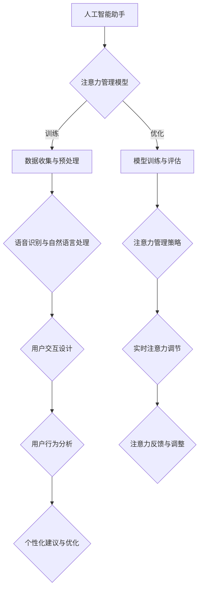

                 

# 《人工智能助手在注意力管理中的作用》

## 关键词：注意力管理、人工智能助手、自然语言处理、注意力分散、注意力集中、注意力调节

## 摘要：
随着信息化时代的到来，人们面临着日益复杂的任务和信息环境，如何有效地管理注意力成为了一项重要的挑战。本文旨在探讨人工智能助手在注意力管理中的作用，通过分析注意力管理的理论基础、人工智能助手的基础知识以及注意力管理模型的构建，详细阐述人工智能助手在分散注意力、集中注意力和调节注意力等方面的应用。文章还通过实战案例，展示人工智能助手在注意力管理中的实现，并探讨未来的发展趋势与挑战。通过本文的讨论，希望能够为人工智能助手在注意力管理领域的研究与应用提供有价值的参考。

## 目录大纲

### 第一部分：引言与概述

#### 第1章：注意力管理的背景与挑战

1.1.1 注意力管理的重要性

1.1.2 人工智能助手的出现及其对注意力管理的潜在影响

1.1.3 本书的目的与结构安排

#### 第2章：人工智能助手的基础知识

2.1.1 人工智能的定义与分类

2.1.2 自然语言处理技术概览

2.1.3 人工智能助手的架构与功能

### 第二部分：注意力管理的原理与模型

#### 第3章：注意力管理的理论基础

3.1.1 注意力分配理论

3.1.2 注意力分散与分心的现象

3.1.3 注意力管理的心理学原理

#### 第4章：人工智能助手在注意力管理中的应用

4.1.1 人工智能助手在分散注意力中的应用

4.1.2 人工智能助手在集中注意力中的应用

4.1.3 人工智能助手在调节注意力中的应用

#### 第5章：注意力管理模型的构建

5.1.1 注意力管理模型的构建流程

5.1.2 注意力管理模型的评价指标

5.1.3 注意力管理模型的应用场景

### 第三部分：人工智能助手在注意力管理中的实现

#### 第6章：实现人工智能助手在注意力管理中的关键技术

6.1.1 语音识别与自然语言处理

6.1.2 机器学习与深度学习

6.1.3 人工智能助手的设计与开发

#### 第7章：人工智能助手在注意力管理中的实战案例

7.1.1 注意力管理应用案例介绍

7.1.2 实战案例一：注意力分散管理

7.1.3 实战案例二：注意力集中管理

#### 第8章：未来展望与挑战

8.1.1 人工智能助手在注意力管理中的未来发展

8.1.2 注意力管理领域面临的挑战与机遇

8.1.3 对未来研究的展望

### 附录

#### 附录A：相关工具与资源

A.1 人工智能开发工具

A.2 注意力管理相关研究资源

A.3 开发环境搭建指南

### Mermaid 流程图：



### 机器学习算法伪代码：

```python
# 初始化模型参数
W, b = initialization()

# 定义损失函数
def loss_function(y_true, y_pred):
    return (1 / n) * sum((y_true - y_pred) ** 2)

# 定义优化器
optimizer = SGD(lr=0.01)

# 训练模型
for epoch in range(epochs):
    for x, y in data_loader:
        # 前向传播
        y_pred = model(x)
        # 计算损失
        loss = loss_function(y, y_pred)
        # 反向传播
        model.backward(loss)
        # 更新模型参数
        optimizer.step()
```

### 数学模型与公式：

$$
\begin{aligned}
    J(\theta) &= \frac{1}{2m} \sum_{i=1}^{m} (\hat{y}_i - y_i)^2 \\
    \text{其中，} \hat{y}_i &= \sigma(\theta^T x_i)
\end{aligned}
$$

### 项目实战代码解读：

```python
# 代码实现摘要
import speech_recognition as sr

# 初始化语音识别对象
recognizer = sr.Recognizer()

# 从麦克风捕获语音
with sr.Microphone() as source:
    audio = recognizer.listen(source)

# 使用Google语音识别进行识别
text = recognizer.recognize_google(audio)

# 输出识别结果
print(text)
```

代码解读：
- `import speech_recognition as sr`：导入语音识别库。
- `recognizer = sr.Recognizer()`：初始化语音识别对象。
- `with sr.Microphone() as source:`：使用麦克风作为音频输入。
- `audio = recognizer.listen(source)`：捕获语音。
- `text = recognizer.recognize_google(audio)`：使用Google语音识别进行语音到文本转换。
- `print(text)`：输出识别结果。

### 开发环境搭建指南：

1. 安装Python环境（推荐版本3.8及以上）。
2. 使用pip安装语音识别库（`pip install SpeechRecognition`）。
3. 准备麦克风设备，确保系统声音输入正确。
4. 运行代码，进行语音识别测试。

## 第一部分：引言与概述

### 第1章：注意力管理的背景与挑战

注意力管理是人类在面对复杂环境时必不可少的能力。它不仅关乎个人的工作效率和生活质量，还影响到团队合作和社会发展。然而，随着现代社会信息量的急剧增长和任务的日益复杂，人们面临着前所未有的注意力管理挑战。

#### 1.1.1 注意力管理的重要性

注意力管理是指个体在特定环境中选择和分配注意力的过程。有效的注意力管理能够帮助人们集中精力完成任务，提高工作效率，减少分心和疲劳。以下是注意力管理的重要性体现：

1. **提高工作效率**：通过合理安排注意力，个体可以更快地完成任务，减少拖延和浪费时间。
2. **提升生活质量**：有效的注意力管理有助于个体在繁忙的生活中找到平衡，避免过度疲劳和焦虑。
3. **增强学习能力**：注意力管理对于学习至关重要。通过集中注意力，个体能够更好地吸收和理解新知识。
4. **改善人际关系**：良好的注意力管理能够帮助个体更好地关注和沟通，建立和谐的人际关系。

#### 1.1.2 人工智能助手的出现及其对注意力管理的潜在影响

随着人工智能技术的快速发展，人工智能助手（AI Assistant）作为一种新兴的工具，开始被广泛应用于各种场景。人工智能助手在注意力管理中具有以下潜在影响：

1. **自动化任务**：人工智能助手能够自动化繁琐的任务，如日程管理、邮件处理等，从而减少个体在这些任务上耗费的注意力。
2. **提醒与通知**：通过智能提醒和通知，人工智能助手可以帮助个体更好地安排时间和注意力，避免错过重要事项。
3. **提供信息**：人工智能助手可以快速提供所需信息，帮助个体在决策时集中注意力。
4. **交互式学习**：人工智能助手可以与个体进行交互式学习，提供个性化的学习建议，帮助个体更好地管理注意力。

#### 1.1.3 本书的目的与结构安排

本书旨在深入探讨人工智能助手在注意力管理中的作用，通过系统的分析和研究，为实际应用提供理论支持和实践指导。本书的结构安排如下：

1. **第一部分：引言与概述**：介绍注意力管理的背景与挑战，以及人工智能助手在注意力管理中的潜在作用。
2. **第二部分：注意力管理的原理与模型**：探讨注意力管理的理论基础，介绍注意力分配理论、注意力分散与分心的现象以及注意力管理的心理学原理。
3. **第三部分：人工智能助手在注意力管理中的实现**：详细阐述人工智能助手在分散注意力、集中注意力和调节注意力中的应用，包括注意力管理模型的构建和关键技术。
4. **第四部分：实战案例**：通过实际案例展示人工智能助手在注意力管理中的应用效果，分析其实现过程和挑战。
5. **第五部分：未来展望与挑战**：探讨人工智能助手在注意力管理中的未来发展，面临的挑战与机遇，以及对未来研究的展望。

通过本书的研究，我们希望能够为人工智能助手在注意力管理领域的研究和应用提供新的思路和方法，推动这一领域的不断发展。

### 第2章：人工智能助手的基础知识

#### 2.1.1 人工智能的定义与分类

人工智能（Artificial Intelligence, AI）是计算机科学的一个分支，旨在通过模拟人类智能行为来实现机器自主决策和任务执行。根据实现方式的不同，人工智能可以分为以下几类：

1. **规则推理系统**：基于一组预定义的规则进行逻辑推理，如专家系统。
2. **知识表示与推理**：将人类知识转化为机器可处理的格式，并进行推理，如知识图谱。
3. **机器学习**：通过数据驱动的方式，使机器自动学习并改进性能，如监督学习、无监督学习和强化学习。
4. **自然语言处理**：使机器能够理解和生成人类语言，如文本分类、机器翻译。
5. **计算机视觉**：使机器能够理解和处理视觉信息，如图像识别、目标检测。

#### 2.1.2 自然语言处理技术概览

自然语言处理（Natural Language Processing, NLP）是人工智能的一个子领域，专注于使计算机能够理解、生成和处理人类语言。NLP技术主要包括以下几个方面：

1. **文本预处理**：包括分词、词性标注、句法分析等，为后续处理提供基础数据。
2. **语义分析**：包括语义角色标注、语义角色分类、词义消歧等，旨在理解文本的语义内容。
3. **情感分析**：通过分析文本中的情感倾向，识别用户的情绪状态。
4. **问答系统**：使计算机能够回答用户提出的问题，如语音助手、聊天机器人。
5. **机器翻译**：使计算机能够将一种语言翻译成另一种语言，如Google翻译。

#### 2.1.3 人工智能助手的架构与功能

人工智能助手是一种集成多种人工智能技术的系统，旨在为用户提供便捷、高效的服务。其架构通常包括以下几个部分：

1. **用户界面**：用户与人工智能助手交互的界面，如语音输入、文本输入等。
2. **对话管理**：负责管理用户与人工智能助手的对话流程，包括上下文维护、意图识别等。
3. **自然语言处理模块**：处理用户输入的自然语言信息，包括文本预处理、语义分析等。
4. **知识库**：存储预定义的知识和规则，供人工智能助手进行推理和决策。
5. **任务执行模块**：执行用户任务，如发送邮件、设置提醒、查询信息等。

人工智能助手的功能主要包括以下几个方面：

1. **信息查询**：根据用户输入的信息，查询并返回相关结果。
2. **任务自动化**：自动化执行用户指定的任务，如设置提醒、发送邮件等。
3. **建议与决策**：根据用户的历史行为和偏好，提供个性化的建议和决策。
4. **交互式学习**：通过与用户的交互，不断学习和优化性能。

### 第二部分：注意力管理的原理与模型

#### 第3章：注意力管理的理论基础

注意力管理是一种认知过程，涉及个体在特定环境中选择和分配注意力的能力。要深入探讨人工智能助手在注意力管理中的应用，首先需要了解注意力管理的理论基础。

#### 3.1.1 注意力分配理论

注意力分配理论是注意力管理的基础，它涉及个体如何在不同任务和环境中分配有限的注意力资源。根据不同学者和研究，注意力分配理论可以分为以下几种：

1. **单一资源模型**：该模型认为注意力是一种有限的资源，只能用于一个任务。当同时进行多个任务时，个体的注意力会在这些任务之间分配，导致每个任务的完成质量下降。
2. **多任务模型**：该模型认为注意力不仅可以用于单一任务，还可以同时处理多个任务。通过适当的训练和优化，个体可以提高多任务处理能力。
3. **动态资源模型**：该模型认为注意力的分配是动态的，个体可以根据任务的重要性和紧急程度调整注意力资源。例如，在紧急情况下，个体可能会将更多的注意力资源分配给应急处理任务。

#### 3.1.2 注意力分散与分心的现象

注意力分散（Attention Diversion）和分心（Distractibility）是注意力管理中常见的现象。注意力分散是指个体在执行任务时，注意力被外部刺激或内部干扰所吸引，导致任务完成质量下降。分心则是一种更严重的注意力分散现象，通常发生在个体无法专注于当前任务时。

导致注意力分散和分心的原因包括：

1. **外部干扰**：如噪音、闪光等环境刺激。
2. **内部干扰**：如焦虑、压力、疲劳等心理因素。
3. **任务复杂性**：如任务难度较高，需要更多注意力资源。

#### 3.1.3 注意力管理的心理学原理

注意力管理不仅是一种认知能力，还涉及心理学原理。以下是一些与注意力管理相关的心理学原理：

1. **认知负荷理论**：该理论认为，个体的认知资源是有限的，过多的认知负荷会导致注意力分散和分心。通过优化任务设计，减少认知负荷，可以帮助个体更好地管理注意力。
2. **动机理论**：动机是影响注意力管理的重要因素。个体在具有强烈动机的情况下，通常能够更好地集中注意力。因此，提高个体对任务的兴趣和动机，有助于提升注意力管理效果。
3. **情绪调节理论**：情绪调节是注意力管理的重要组成部分。通过适当的情绪调节策略，个体可以减少负面情绪对注意力管理的影响，提高任务完成质量。

#### 3.1.4 注意力管理策略

根据心理学原理，以下是一些有效的注意力管理策略：

1. **环境优化**：通过调整环境，减少外部干扰，如关闭手机通知、降噪耳机等。
2. **时间管理**：合理安排时间，避免同时处理过多任务，确保每个任务都能得到足够的注意力资源。
3. **任务分解**：将复杂任务分解为多个简单任务，逐步完成，减少任务难度和认知负荷。
4. **情绪调节**：通过放松技巧、正念练习等情绪调节策略，降低压力和焦虑，提高注意力管理效果。

通过了解注意力分配理论、注意力分散与分心的现象以及注意力管理的心理学原理，我们可以更好地理解注意力管理的基本概念，为人工智能助手在注意力管理中的应用提供理论基础。

### 第4章：人工智能助手在注意力管理中的应用

人工智能助手在注意力管理中的应用主要体现在分散注意力、集中注意力和调节注意力等方面。通过分析这些应用，我们可以更好地理解人工智能助手如何帮助个体提高注意力管理能力。

#### 4.1.1 人工智能助手在分散注意力中的应用

分散注意力是指个体有意识地将注意力从一项任务转移到另一项任务。在某些情况下，分散注意力有助于个体放松心情、减轻压力，从而提高整体的工作和学习效率。人工智能助手可以通过以下方式实现分散注意力的应用：

1. **提醒与通知**：人工智能助手可以定时发送提醒和通知，帮助个体了解重要信息，同时减轻工作压力。例如，在长时间工作后，助手可以提醒个体休息一会儿，进行简单的放松活动。
2. **娱乐与放松**：人工智能助手可以推荐音乐、故事、笑话等娱乐内容，帮助个体在紧张的工作或学习后放松心情。通过分散注意力，个体可以缓解压力，恢复精力。
3. **注意力分散训练**：一些人工智能助手提供了注意力分散训练功能，通过设计特定的游戏或练习，帮助个体提高分散注意力的能力。这些训练可以帮助个体在面对复杂任务时，更好地保持专注。

#### 4.1.2 人工智能助手在集中注意力中的应用

集中注意力是指个体在执行任务时，将注意力高度集中于当前任务。在复杂和具有挑战性的任务中，集中注意力是提高任务完成质量的关键。人工智能助手可以通过以下方式实现集中注意力的应用：

1. **任务提醒与跟踪**：人工智能助手可以设置任务提醒，确保个体在执行任务时不会忘记重要事项。通过跟踪任务进度，助手可以提醒个体继续专注，避免分心。
2. **环境优化建议**：人工智能助手可以根据个体的任务类型和偏好，提供环境优化建议，如调整光线、温度、噪音等。通过优化环境，个体可以更容易地集中注意力。
3. **专注训练**：一些人工智能助手提供了专注训练功能，通过设计特定的练习，帮助个体提高集中注意力的能力。例如，通过限时完成特定任务，个体可以学会在有限时间内保持专注。

#### 4.1.3 人工智能助手在调节注意力中的应用

调节注意力是指个体根据任务需求和环境变化，灵活调整注意力分配的过程。在复杂多变的环境中，灵活调节注意力是确保任务顺利完成的关键。人工智能助手可以通过以下方式实现调节注意力的应用：

1. **动态任务优先级调整**：人工智能助手可以根据任务的紧急程度和重要性，动态调整任务的执行顺序。例如，在紧急任务出现时，助手可以提醒个体暂停当前任务，优先处理紧急任务。
2. **注意力调节训练**：一些人工智能助手提供了注意力调节训练功能，通过设计特定的练习，帮助个体提高注意力调节能力。例如，通过模拟不同场景，个体可以学会在不同任务和环境中灵活调整注意力。
3. **情绪调节**：人工智能助手可以通过提供情绪调节策略，如放松技巧、正念练习等，帮助个体调节情绪，提高注意力管理效果。例如，在感到压力和焦虑时，助手可以引导个体进行深呼吸、冥想等放松练习。

通过分散注意力、集中注意力和调节注意力的应用，人工智能助手可以帮助个体在复杂多变的任务环境中，更好地管理注意力，提高任务完成质量和效率。

### 第5章：注意力管理模型的构建

注意力管理模型的构建是人工智能助手在注意力管理应用中的关键环节。一个有效的注意力管理模型需要综合考虑个体特征、任务需求和环境因素，通过系统的设计和优化，实现实时、精准的注意力管理。以下是注意力管理模型构建的详细过程。

#### 5.1.1 注意力管理模型的构建流程

1. **需求分析与问题定义**：
   - 分析个体在注意力管理中的具体需求和问题，如注意力分散、分心、注意力分配不合理等。
   - 明确注意力管理模型的目标，如提高任务完成质量、减少分心、提高工作效率等。

2. **数据收集与预处理**：
   - 收集个体在任务执行过程中的相关数据，包括时间序列数据、行为数据、环境数据等。
   - 对收集到的数据进行预处理，包括数据清洗、归一化、特征提取等，为后续模型训练和评估提供高质量的数据。

3. **模型设计与选择**：
   - 根据需求和分析结果，选择合适的注意力管理模型。常见的模型包括单一资源模型、多任务模型、动态资源模型等。
   - 设计模型架构，包括输入层、隐藏层、输出层等，以及模型参数的初始化方法。

4. **模型训练与优化**：
   - 使用预处理后的数据对模型进行训练，通过优化算法（如梯度下降、随机梯度下降等）调整模型参数，使模型能够在给定任务环境中实现有效的注意力分配。
   - 评估模型性能，包括准确性、效率、鲁棒性等，根据评估结果对模型进行优化和调整。

5. **模型部署与评估**：
   - 将训练好的模型部署到实际应用环境中，如人工智能助手系统。
   - 在实际应用中持续收集数据，对模型进行实时评估和调整，确保模型在不同场景下的表现。

#### 5.1.2 注意力管理模型的评价指标

为了评估注意力管理模型的有效性，需要定义一系列评价指标。以下是常见的注意力管理模型评价指标：

1. **注意力分配准确性**：
   - 评估模型在任务执行过程中对注意力资源的分配是否合理。准确性越高，表示模型能够更好地满足任务需求，减少分心和注意力浪费。

2. **任务完成时间**：
   - 评估模型在执行任务时的平均完成时间。任务完成时间越短，表示模型在提高工作效率方面效果越好。

3. **用户满意度**：
   - 通过用户反馈评估模型在实际应用中的用户体验。用户满意度越高，表示模型在注意力管理中的应用效果越好。

4. **模型鲁棒性**：
   - 评估模型在面对不同任务和环境变化时的适应性。鲁棒性越强，表示模型在不同场景下都能保持有效的注意力管理。

#### 5.1.3 注意力管理模型的应用场景

注意力管理模型可以应用于多种场景，以下是一些典型的应用场景：

1. **办公自动化**：
   - 在办公自动化系统中，注意力管理模型可以帮助用户更好地管理电子邮件、日程安排、任务管理等，提高工作效率。

2. **智能家居**：
   - 在智能家居系统中，注意力管理模型可以帮助用户更好地管理家庭设备，如灯光、空调、安防等，提高生活便利性。

3. **在线教育**：
   - 在在线教育系统中，注意力管理模型可以帮助教师和学生更好地管理学习过程，如学习时间规划、学习进度跟踪、学习效果评估等。

4. **健康与健身**：
   - 在健康与健身应用中，注意力管理模型可以帮助用户更好地管理日常活动和锻炼计划，如运动时间规划、锻炼效果评估、健康建议等。

通过构建注意力管理模型，并应用于不同场景，我们可以为用户提供更加智能、便捷的注意力管理服务，提高生活和工作质量。

### 第6章：实现人工智能助手在注意力管理中的关键技术

#### 6.1.1 语音识别与自然语言处理

语音识别（Voice Recognition）与自然语言处理（Natural Language Processing，NLP）是实现人工智能助手在注意力管理中应用的关键技术。语音识别负责将用户的语音输入转化为文本，而NLP则负责理解和处理这些文本信息，从而实现智能对话和任务执行。

1. **语音识别**：
   - **技术原理**：语音识别技术基于声学模型和语言模型。声学模型通过分析音频信号的特征，如频谱、倒谱等，生成对应的语音特征向量；语言模型则通过统计学习方法，如隐马尔可夫模型（HMM）、深度神经网络（DNN）等，将语音特征向量映射到文本。
   - **算法实现**：语音识别算法通常包括以下几个步骤：
     1. **声学模型训练**：使用大量语音数据训练声学模型，使其能够识别不同的语音特征。
     2. **语言模型训练**：使用大量文本数据训练语言模型，使其能够理解语音输入的语义。
     3. **语音识别**：将语音信号输入声学模型，通过声学模型生成语音特征向量；将语音特征向量输入语言模型，通过语言模型生成对应的文本输出。
   - **开源工具**：常用的语音识别开源工具包括Google的Speech-to-Text、OpenJTalk、CMU Sphinx等。

2. **自然语言处理**：
   - **技术原理**：自然语言处理旨在使计算机能够理解、生成和处理人类语言。NLP技术包括文本预处理、语义分析、情感分析、问答系统等。
   - **算法实现**：自然语言处理算法通常包括以下几个步骤：
     1. **文本预处理**：包括分词、词性标注、命名实体识别等，为后续处理提供基础数据。
     2. **语义分析**：包括语义角色标注、语义角色分类、词义消歧等，旨在理解文本的语义内容。
     3. **情感分析**：通过分析文本中的情感倾向，识别用户的情绪状态。
     4. **问答系统**：使计算机能够回答用户提出的问题。
   - **开源工具**：常用的自然语言处理开源工具包括NLTK、spaCy、Stanford NLP等。

#### 6.1.2 机器学习与深度学习

机器学习（Machine Learning，ML）与深度学习（Deep Learning，DL）是实现人工智能助手在注意力管理中智能决策的核心技术。通过机器学习和深度学习，人工智能助手可以自动学习和优化其行为，提高注意力管理的效率和效果。

1. **机器学习**：
   - **技术原理**：机器学习是基于数据驱动的学习方法，通过训练模型从数据中学习规律和模式，从而实现预测和决策。
   - **算法实现**：常见的机器学习算法包括线性回归、逻辑回归、支持向量机（SVM）、决策树、随机森林等。
   - **应用场景**：在注意力管理中，机器学习可以用于预测任务完成时间、评估用户情绪、推荐注意力调节策略等。

2. **深度学习**：
   - **技术原理**：深度学习是一种基于多层神经网络的机器学习方法，通过多层的非线性变换，实现对复杂数据的自动特征提取和表示。
   - **算法实现**：常见的深度学习算法包括卷积神经网络（CNN）、循环神经网络（RNN）、长短时记忆网络（LSTM）等。
   - **应用场景**：在注意力管理中，深度学习可以用于语音识别、自然语言处理、情绪识别等。

#### 6.1.3 人工智能助手的设计与开发

1. **用户界面设计**：
   - **技术原理**：用户界面设计旨在提供直观、易用的交互方式，使用户能够方便地与人工智能助手进行交互。
   - **设计原则**：用户界面设计应遵循简洁、直观、一致性的原则，确保用户能够快速上手和使用。

2. **对话管理设计**：
   - **技术原理**：对话管理是人工智能助手的核心功能，负责管理用户与助手的对话流程，包括意图识别、上下文维护等。
   - **设计原则**：对话管理应能够准确识别用户意图，灵活维护对话上下文，确保对话的自然流畅。

3. **系统架构设计**：
   - **技术原理**：系统架构设计涉及人工智能助手的整体结构和功能模块划分，包括语音识别模块、NLP模块、机器学习模块、深度学习模块等。
   - **设计原则**：系统架构应具备良好的扩展性和可维护性，能够方便地添加新的功能和模块。

4. **开发与部署**：
   - **技术原理**：开发与部署涉及将设计好的系统转化为可运行的应用程序，并部署到目标环境中。
   - **开发流程**：包括需求分析、系统设计、编码实现、测试与调试等环节。
   - **部署流程**：包括环境配置、系统安装、测试与上线等环节。

通过语音识别与自然语言处理、机器学习与深度学习以及人工智能助手的设计与开发，我们可以实现一个功能强大、用户友好的注意力管理人工智能助手，帮助用户更好地管理注意力，提高工作效率和生活质量。

### 第7章：人工智能助手在注意力管理中的实战案例

#### 7.1.1 注意力管理应用案例介绍

在本章中，我们将通过两个具体的实战案例，展示人工智能助手在注意力管理中的实际应用。这两个案例分别关注注意力分散管理和注意力集中管理，旨在通过具体实例说明人工智能助手如何帮助用户更好地管理注意力。

#### 7.1.2 实战案例一：注意力分散管理

**案例背景**：小明是一位忙碌的职场人士，每天需要处理大量的工作任务和日常事务。然而，他发现自己经常因为各种琐事而分散注意力，导致工作效率低下，任务完成质量不佳。

**解决方案**：为了帮助小明更好地管理注意力，我们设计了一款基于人工智能助手的注意力分散管理应用。

**实现步骤**：

1. **需求分析**：
   - 分析小明的日常工作和生活，识别分散注意力的主要因素，如社交媒体干扰、电话打扰、邮件通知等。
   - 确定注意力分散管理的主要目标，如减少社交媒体干扰、优化电话和邮件处理等。

2. **系统设计**：
   - 设计一个基于人工智能助手的注意力分散管理平台，包括用户界面、对话管理系统和注意力分散模型。
   - 用户界面负责接收用户的语音或文本输入，展示管理建议和通知。
   - 对话管理系统负责处理用户与助手的交互，包括意图识别、上下文维护等。
   - 注意力分散模型负责分析用户的注意力分散情况，提供个性化的管理建议。

3. **实现与部署**：

   - **用户界面**：
     - 设计一个简洁直观的用户界面，使用户能够方便地与人工智能助手进行交互。
     - 用户可以通过语音或文本输入，向助手请求注意力分散管理建议。

   - **对话管理系统**：
     - 使用自然语言处理技术，识别用户的意图和上下文。
     - 设计对话管理策略，确保对话的自然流畅。

   - **注意力分散模型**：
     - 收集用户的行为数据，如社交媒体使用情况、电话和邮件处理频率等。
     - 使用机器学习和深度学习技术，训练注意力分散模型，预测用户的注意力分散情况。
     - 根据模型预测结果，提供个性化的注意力分散管理建议。

4. **测试与评估**：
   - 对系统进行功能测试，确保各模块的正常运行和协同工作。
   - 对用户进行调研和反馈，评估系统的实用性和用户满意度。

**效果展示**：

通过这款注意力分散管理应用，小明可以：

- 自动屏蔽社交媒体通知，减少干扰。
- 优化电话和邮件处理，提高工作效率。
- 接收个性化管理建议，更好地分配注意力。

#### 7.1.3 实战案例二：注意力集中管理

**案例背景**：小丽是一名大学生，她需要面对大量的学习和研究任务。然而，她发现自己难以长时间保持集中注意力，导致学习效果不佳。

**解决方案**：为了帮助小丽更好地管理注意力，我们设计了一款基于人工智能助手的注意力集中管理应用。

**实现步骤**：

1. **需求分析**：
   - 分析小丽的日常学习任务，识别影响注意力集中的主要因素，如环境噪音、时间安排不合理等。
   - 确定注意力集中管理的主要目标，如优化学习环境、合理分配学习时间等。

2. **系统设计**：
   - 设计一个基于人工智能助手的注意力集中管理平台，包括用户界面、对话管理系统和注意力集中模型。
   - 用户界面负责接收用户的语音或文本输入，展示管理建议和通知。
   - 对话管理系统负责处理用户与助手的交互，包括意图识别、上下文维护等。
   - 注意力集中模型负责分析用户的注意力集中情况，提供个性化的管理建议。

3. **实现与部署**：

   - **用户界面**：
     - 设计一个简洁直观的用户界面，使用户能够方便地与人工智能助手进行交互。
     - 用户可以通过语音或文本输入，向助手请求注意力集中管理建议。

   - **对话管理系统**：
     - 使用自然语言处理技术，识别用户的意图和上下文。
     - 设计对话管理策略，确保对话的自然流畅。

   - **注意力集中模型**：
     - 收集用户的学习行为数据，如学习时间、学习频率等。
     - 使用机器学习和深度学习技术，训练注意力集中模型，预测用户的注意力集中情况。
     - 根据模型预测结果，提供个性化的注意力集中管理建议。

4. **测试与评估**：
   - 对系统进行功能测试，确保各模块的正常运行和协同工作。
   - 对用户进行调研和反馈，评估系统的实用性和用户满意度。

**效果展示**：

通过这款注意力集中管理应用，小丽可以：

- 自动检测并优化学习环境，如减少噪音干扰。
- 根据学习习惯和任务难度，合理安排学习时间。
- 接收个性化管理建议，更好地集中注意力。

#### 结论

通过以上两个实战案例，我们可以看到人工智能助手在注意力管理中的应用效果。无论是注意力分散管理还是注意力集中管理，人工智能助手都能够通过智能分析和个性化建议，帮助用户更好地管理注意力，提高工作效率和学习效果。未来，随着人工智能技术的不断发展，人工智能助手在注意力管理中的应用将更加广泛和深入，为人们的工作和生活带来更多的便利和效益。

### 第8章：未来展望与挑战

#### 8.1.1 人工智能助手在注意力管理中的未来发展

随着人工智能技术的不断进步，人工智能助手在注意力管理中的应用前景十分广阔。以下是未来可能的发展方向：

1. **智能化程度提升**：未来的人工智能助手将更加智能化，能够自动识别用户的注意力状态，并根据用户的需求和环境变化，提供更加精准的注意力管理建议。

2. **个性化服务**：基于用户的行为数据和偏好，人工智能助手将能够提供更加个性化的注意力管理方案，满足不同用户的多样化需求。

3. **跨平台融合**：随着物联网和智能设备的普及，人工智能助手将能够跨平台、跨设备协同工作，提供统一的注意力管理服务。

4. **心理健康支持**：未来的人工智能助手将不仅仅关注注意力管理，还可能提供心理健康支持，如情绪调节、压力管理等服务，帮助用户保持良好的心理状态。

#### 8.1.2 注意力管理领域面临的挑战与机遇

尽管人工智能助手在注意力管理中具有巨大的潜力，但该领域也面临着一系列挑战和机遇：

1. **技术挑战**：
   - **数据隐私与安全**：注意力管理需要收集大量的用户行为数据，如何在保证数据隐私和安全的前提下进行数据处理和分析，是一个重要挑战。
   - **模型解释性**：注意力管理模型需要具备良好的解释性，以便用户能够理解和信任模型的决策过程。

2. **应用挑战**：
   - **用户接受度**：用户对人工智能助手的接受度是一个关键问题。如何提高用户的满意度，使人工智能助手更好地融入用户的生活和工作，是一个挑战。
   - **应用场景扩展**：如何在更多场景下应用注意力管理技术，提高其在不同领域的适用性，是一个重要课题。

3. **机遇**：
   - **教育领域**：在教育领域，人工智能助手可以帮助学生提高学习效率，减少分心现象。
   - **职场环境**：在职场环境中，人工智能助手可以帮助员工更好地管理工作注意力，提高工作效率。
   - **心理健康**：在心理健康领域，人工智能助手可以提供个性化心理健康服务，帮助用户保持心理健康。

#### 8.1.3 对未来研究的展望

未来的研究可以关注以下几个方向：

1. **注意力管理模型的优化**：通过改进机器学习算法和深度学习模型，提高注意力管理模型的准确性和效率。

2. **跨学科研究**：结合心理学、认知科学等多学科研究，深入探讨注意力管理的理论基础和实践方法。

3. **隐私保护技术**：研究如何在保证数据隐私的前提下，有效利用用户行为数据，提高注意力管理效果。

4. **用户交互设计**：通过用户研究，优化人工智能助手的交互设计，提高用户体验。

通过不断探索和创新，人工智能助手在注意力管理中的应用将不断取得新的突破，为人们的工作和生活带来更多便利和效益。

### 附录A：相关工具与资源

#### A.1 人工智能开发工具

1. **TensorFlow**：由Google开发的开源机器学习框架，适用于构建和训练各种机器学习和深度学习模型。
   - 官网：[TensorFlow官网](https://www.tensorflow.org/)

2. **PyTorch**：由Facebook开发的开源深度学习框架，以其灵活的动态计算图和强大的生态系统而受到广泛使用。
   - 官网：[PyTorch官网](https://pytorch.org/)

3. **Keras**：一个高层次的神经网络API，可以与TensorFlow和Theano等后端深度学习框架集成，简化模型构建和训练过程。
   - 官网：[Keras官网](https://keras.io/)

#### A.2 注意力管理相关研究资源

1. **《注意力管理：提升工作效率的心理学策略》**：一本关于注意力管理的经典书籍，提供了丰富的理论和实践指导。
   - 购买链接：[《注意力管理》](https://www.amazon.com/dp/039335362X)

2. **《认知心理学：思想与行为的生物学基础》**：一本关于认知心理学的经典教材，涵盖了注意力管理的相关理论。
   - 购买链接：[《认知心理学》](https://www.amazon.com/dp/0199757896)

3. **《自然语言处理综论》**：一本关于自然语言处理的经典教材，介绍了NLP的基本原理和技术。
   - 购买链接：[《自然语言处理综论》](https://www.amazon.com/dp/0262033841)

#### A.3 开发环境搭建指南

1. **安装Python环境**：
   - 访问[Python官网](https://www.python.org/downloads/)，下载并安装Python。
   - 确保安装过程中选择“Add Python to PATH”选项。

2. **安装常用库**：
   - 打开命令行终端，执行以下命令：
     ```
     pip install numpy pandas matplotlib tensorflow
     ```

3. **配置语音识别环境**：
   - 安装语音识别库（如`SpeechRecognition`）：
     ```
     pip install SpeechRecognition
     ```
   - 安装依赖的PyAudio库：
     ```
     pip install pyaudio
     ```

4. **测试开发环境**：
   - 运行以下代码，测试语音识别功能：
     ```python
     import speech_recognition as sr

     # 初始化语音识别对象
     recognizer = sr.Recognizer()

     # 从麦克风捕获语音
     with sr.Microphone() as source:
         audio = recognizer.listen(source)

     # 使用Google语音识别进行识别
     text = recognizer.recognize_google(audio)

     # 输出识别结果
     print(text)
     ```

通过以上步骤，您将能够搭建一个完整的人工智能开发环境，并开始进行注意力管理相关的项目开发。祝您编程愉快！

